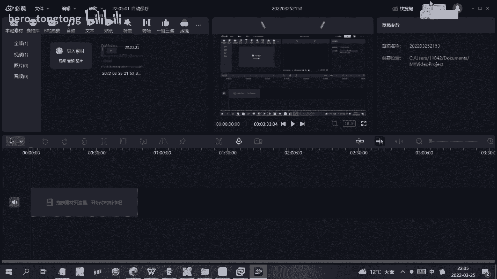
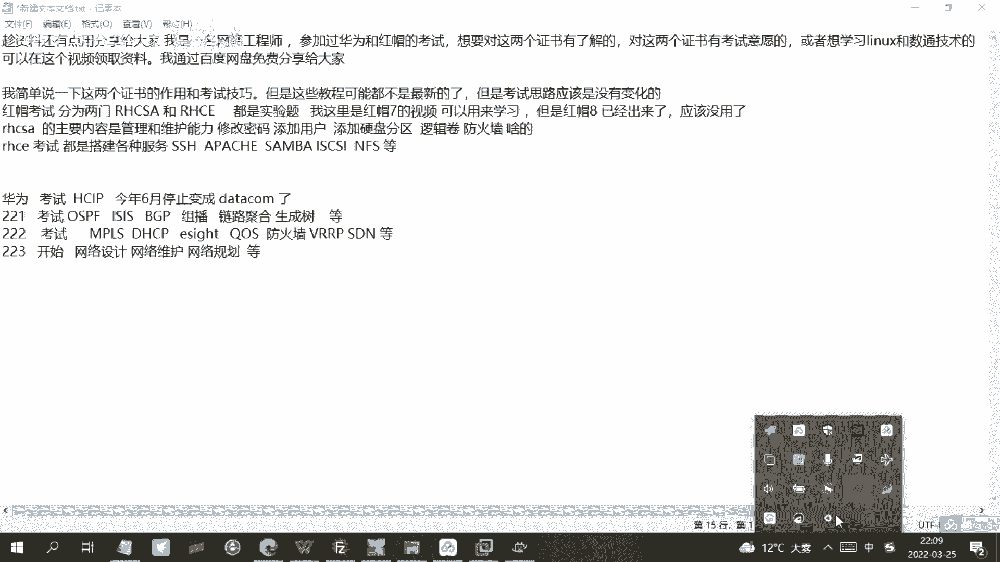

# HCIP-RHCE备考指南：P1：HCIP-RHCE备考指南 📚

## 概述
在本节中，我们将介绍华为HCIP与红帽RHCE认证考试的基本情况、考试结构、备考经验以及相关学习资料的分享。内容旨在为初学者提供清晰的指引。

---

## 华为与红帽认证简介
我是一名网络工程师，参加过华为和红帽的认证考试。如果想参加这两个考试，或者想学习Linux和数通技术，可以参考本视频。我通过百度网盘分享学习资料。

红帽考试分为两门：RHCSA和RHCE。考试形式均为实验题，需要实际操作。我备考时做了近一个月的实验，并在一天内完成考试：上午考RHCSA，下午考RHCE。

---

## 红帽RHCSA与RHCE考试内容
上一节我们介绍了考试的基本结构，本节中我们来看看具体的考试内容。

RHCSA考试主要考察Linux系统的基础维护能力。
以下是RHCSA的核心考察点：
*   修改密码
*   添加用户
*   添加与管理硬盘

RHCE考试则侧重于搭建各种网络服务。
以下是RHCE的考察方向：
*   搭建与管理各类服务器（如Web、文件共享等）
*   配置网络服务与安全

我会将考试相关的视频和题目分享到网盘。备考RHCSA通常需要在虚拟机中搭建环境，每日练习。需要注意的是，我分享的视频基于RHEL 7版本，目前RHEL 8已发布，用于考试可能已过时，但用于学习依然有价值。

---

## 华为HCIP认证考试流程
介绍完红帽认证，我们转向华为认证。我同样参加过华为的考试，但需注意，现行考试体系即将更新。

华为HCIP数通方向考试分为三门：H12-221、H12-222和H12-223。
以下是各门考试的核心内容：
*   **H12-221**：主要考察路由与交换技术，例如OSPF、BGP、链路聚合、生成树等。
*   **H12-222**：考察进阶技术，如MPLS、DHCP服务搭建、华为eSight网络管理软件、防火墙及路由冗余技术。
*   **H12-223**：考察网络规划、维护与设计，是相对最简单的一门。

备考顺序可以灵活选择。若希望从易到难，建议按3、2、1的顺序报考；若希望遵循知识进阶路径，则按1、2、3的顺序报考。

华为考试即将升级为Datacom认证体系，新体系会增加部分内容，但路由交换等基础技术依然包含在内。因此，现有学习资料仍有参考价值。

---

## 学习资料与认证获取
所有华为和红帽的备考资料都已上传至我的网盘，并会想办法分享给大家。

通过考试后，华为和红帽的认证通常都会提供电子版证书。

---

## 总结
本节课我们一起学习了华为HCIP与红帽RHCE认证的考试结构、核心内容以及备考策略。我们了解到红帽认证注重实践操作，而华为认证涵盖从基础到设计的完整知识体系。虽然部分考试版本已更新，但共享的学习资料对于构建基础知识仍然非常有帮助。