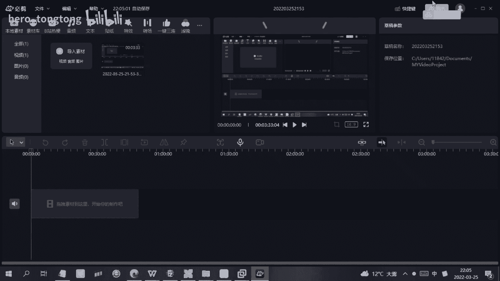
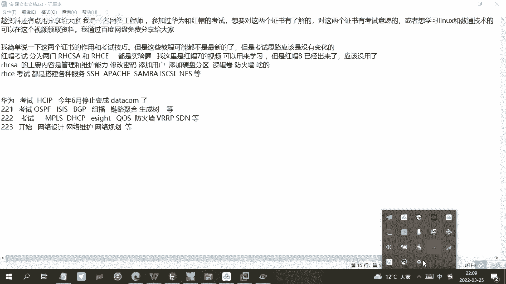

# HCIP-RHCE备考指南-华为题库和红帽教程 - P1：HCIP-RHCE备考指南 - hero_tongtong - BV1Y44y1N7FW

大家好，我是一名网络工程师，然后我参加过那个华为和红帽的一个考试，然后如果说有想参加这两个考试的，然后或者说想学习linux和疏通技术的，然后可以就是呃看一下这个视频，然后我通过百度网盘。

然后把我学习的一些资料分享给大家，然后我跟大家就是介绍一下这两个证书是干嘛的，然后就是就是红帽考试，它是分为两门，然后分为h c s a和h c e，然后他考试的话都是实验题啊，然后就是需要做实验。

然后我是做了大概有近一个月的实验吧，因为我还在上班的时候考的啊，所以所以做了近一个月的实验，然后去考的，然后他是一天考完上午h c s a，下午h c e，然后rh c a c s a的话。

他的一个考试的一个内容就是呃我这写的有，它最主要是呃靠你修改密码啊，添加用户，添加硬盘什么的，都是一些利息公司基础的一些维护啥的，然后h c e的话就是考搭建各种服务，然后我会把呃考试的一些视频。

还有那个题，然后呃都放到网盘上，大家可以去看一下，然后rh c s a的话就是平时考，平时如果说打打算考试的话，就是需要用虚拟机搭建环境，然后每天进行练习，每晚每晚练习一段时间，然后应该就可以考了。

但是现在我的这个视频是火爆七的，现在火爆八已经出来了，估计考试是已经没啥用了，就是考试应该是就已经没啥用了，但是用来做学习还是可以的，然后我这我参加的有华为的考试，但是华为的考试马上也也也没有用了。

然后我就说这个趁这个资料现在还有用，然后大家可以先看一下，就是应该是呃应该是只能用来做学习了，因为华为现在考应该也来不及了，因为华为马上就要变成这个华为的data com了。

然后呃不过不过学习的东西应该都是差不多的，然后啊我看过这个com的一些，现在学的应该是新增的一些内容，但是基础的路由交换还有啥的，应该是还都是包含的呃，就是参考一下我的这个呃学习资料，然后还是可以的。

呃当然还是可以的，然后给给大家简单介绍一下，就是华为的二华为的一个h c i p一个考试的流程，然后h c i p的话考试就是呃分为就是2122和二三，221的话最主要就是考os p f s s。

就是一般都是考一些路由主播呃，链路聚合生成数额交路由技术交换技术的，二二就开始考，就是一些m p s，然后dh c i p d h c p一些服务搭建，以及华为的ec是他们的一款网络管理软件。

然后流量流量管理防火墙啊，还有它这个呃路由路由冗余啊这些东西，这要是考这个，然后二三的话就是开始考那个网络规划，网络维护和网络设计的，这个是最简单的一门啊，他如果说需要备考的话啊。

就是如果说想要从简单到难的话，就是321这样考，如果说是想从the oe的话，就是123这样考，然后就是资料就是都传到我的这个云盘里了，就是华为和红豹的考试，然后我会想办法把这把这个东西分享给大家。

然后就是华为和红帽考完以后，他们的认证都是呃，一般情况下都是有电子版的呃，他们考完认证以后都是这样，都是这样的，就是，嗯都是有电子版的，然后嗯好本次分享，然后就分享这么多内容吧。

