# RHCE课程：P1：SELinux、SSH、防火墙与链路聚合 🔧


在本节课中，我们将学习RHCE认证考试中的几个核心主题：SELinux安全机制、SSH访问控制、自定义用户环境、防火墙端口转发以及链路聚合技术。这些是管理和维护Red Hat Enterprise Linux系统的重要技能。

## SELinux安全机制 🔒

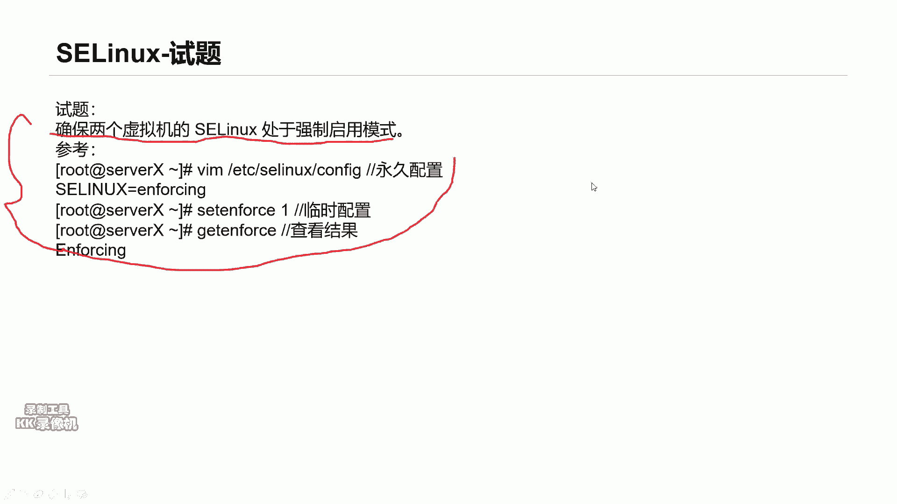

上一节我们介绍了课程概述，本节中我们来看看SELinux。SELinux是一个集成到Linux内核中的安全增强机制，用于保护系统资源。它由美国国家安全局提出，在Red Hat Enterprise Linux 7及更高版本中，为进程、目录和文件提供了预设的保护策略和管理工具。

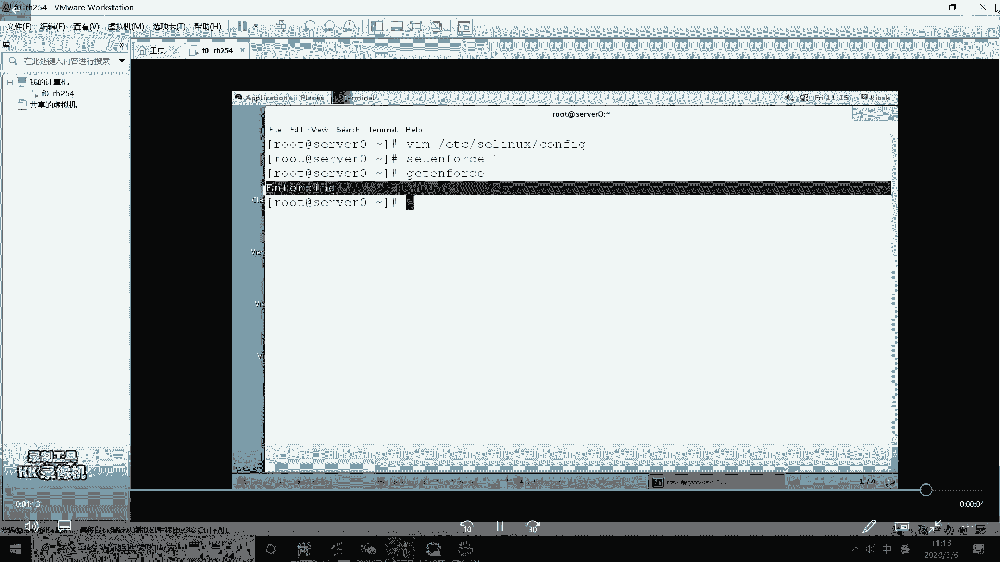

SELinux的运行模式分为三种：
*   **强制模式**：内核启用SELinux保护。
*   **宽容模式**：内核加载SELinux机制，但只记录违规行为而不阻止。
*   **禁用模式**：内核不加载SELinux。

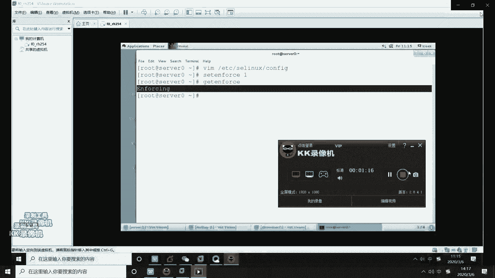

要查看当前SELinux状态，可以使用命令 `getenforce`。要使配置永久生效，需要修改 `/etc/selinux/config` 文件。

### 配置SELinux为强制模式

以下是配置SELinux为强制模式的步骤。

1.  编辑SELinux配置文件。
    ```bash
    vi /etc/selinux/config
    ```
2.  确保配置文件中 `SELINUX=` 的值为 `enforcing`。
3.  临时切换模式（重启后失效）。
    ```bash
    setenforce 1
    ```
4.  使用 `getenforce` 命令验证配置是否成功。

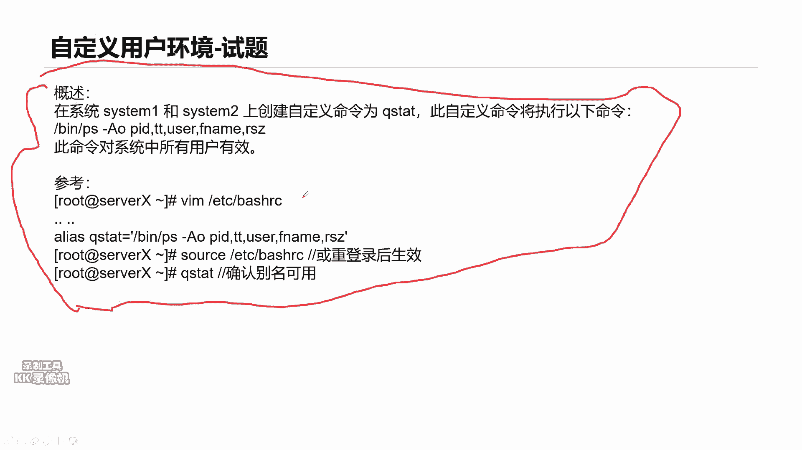

## SSH访问控制与自定义用户环境 🖥️

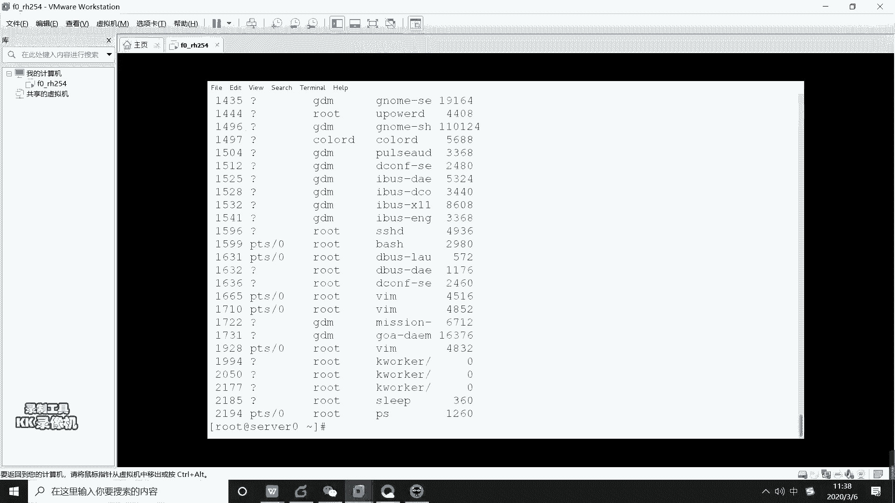

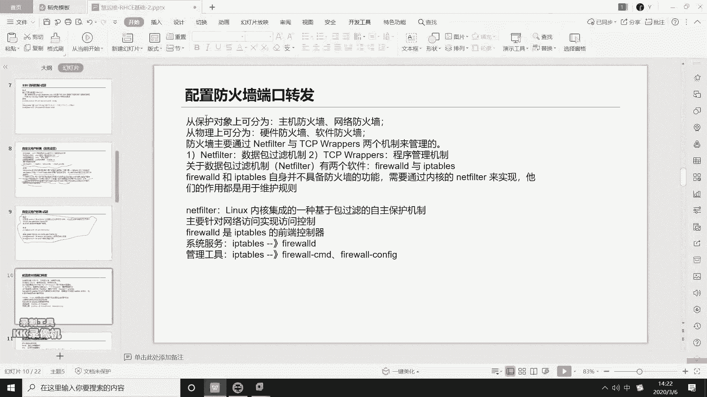

上一节我们配置了SELinux，本节中我们来看看如何控制SSH访问和自定义用户环境。SSH为远程登录提供了安全的应用环境，其服务端是 `sshd`，客户端是 `ssh`。访问控制可以通过防火墙策略或SSH自身的配置文件实现。

自定义用户环境主要通过“别名”功能实现。别名允许用户为常用命令创建简短的替代名称。

### 管理命令别名

以下是管理命令别名的相关操作。

*   **创建别名**：`alias 别名='原命令'`
*   **查看别名**：`alias`
*   **取消别名**：`unalias 别名`

用户环境配置文件决定了别名等设置何时生效：
*   **`/etc/profile`**：系统全局配置，用户首次登录时执行。
*   **`~/.bash_profile`**：用户个人配置，登录时执行一次。
*   **`~/.bashrc`**：用户个人配置，每次打开新的bash shell时读取。

### 实践：创建别名

我们通过一个练习来创建别名。

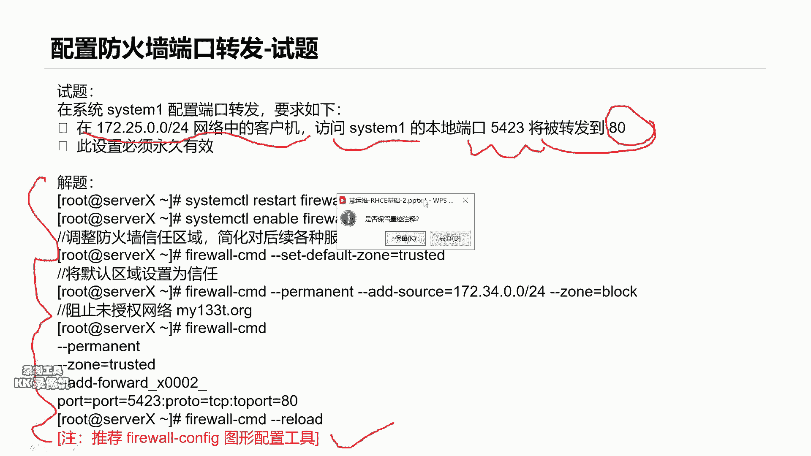

1.  编辑用户环境配置文件。
    ```bash
    vi ~/.bashrc
    ```
2.  在文件末尾添加别名定义，例如：
    ```bash
    alias qstat='/usr/bin/qstat'
    ```
3.  保存退出，并重新登录或执行 `source ~/.bashrc` 使配置生效。
4.  输入 `qstat` 测试别名是否可用。

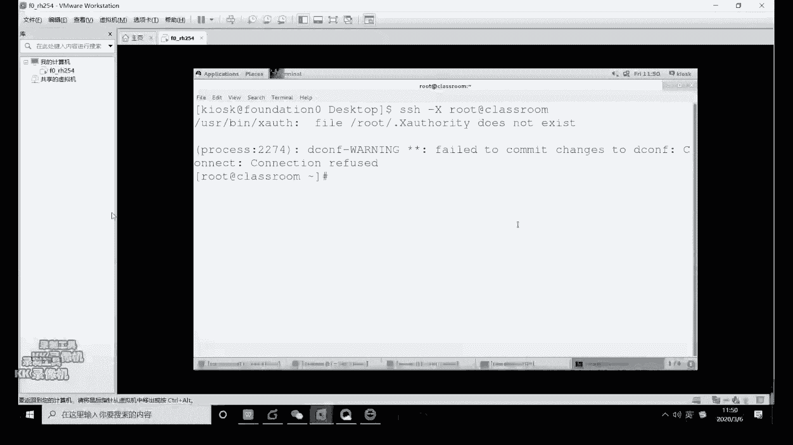

## 防火墙端口转发 🔥

上一节我们设置了用户环境，本节中我们来看看防火墙。防火墙从保护对象可分为主机防火墙和网络防火墙。在RHEL7中，防火墙管理主要通过 `firewalld` 服务实现，它利用数据包过滤机制来管理网络访问。

`firewalld` 使用“区域”来管理不同信任级别的网络连接。常见的区域有：
*   **block**：拒绝所有传入连接。
*   **drop**：丢弃所有传入数据包。
*   **public**：公共区域，仅允许选定的服务。
*   **trusted**：信任区域，接受所有连接。

端口转发可以将到达本机某端口的请求，转发到另一台机器的指定端口。

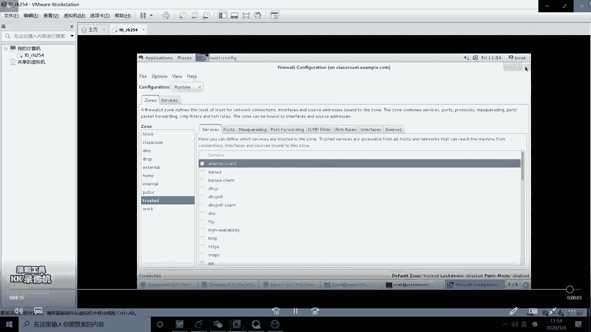

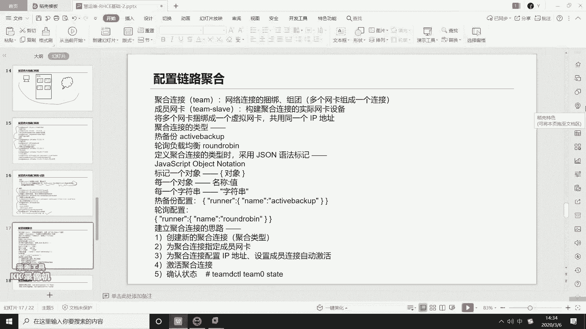

### 配置端口转发

以下是配置端口转发的关键命令格式。
```bash
firewall-cmd --permanent --zone=<区域> --add-forward-port=port=<源端口>:proto=<协议>:toport=<目标端口>:toaddr=<目标IP>
```

### 实践：配置防火墙规则与端口转发

我们通过一个练习来配置防火墙。

1.  启动并设置防火墙开机自启。
    ```bash
    systemctl start firewalld
    systemctl enable firewalld
    ```
2.  设置默认区域为 `trusted`。
    ```bash
    firewall-cmd --set-default-zone=trusted
    ```
3.  永久拒绝特定网段（如172.34.0.0/24）的访问。
    ```bash
    firewall-cmd --permanent --zone=trusted --add-source=172.34.0.0/24 --add-rich-rule='rule family="ipv4" source address="172.34.0.0/24" reject'
    ```
4.  配置端口转发：将本机5423端口的TCP请求转发到80端口。
    ```bash
    firewall-cmd --permanent --zone=trusted --add-port=5423/tcp
    firewall-cmd --permanent --zone=trusted --add-forward-port=port=5423:proto=tcp:toport=80
    ```
5.  重载防火墙配置并查看规则。
    ```bash
    firewall-cmd --reload
    firewall-cmd --list-all
    ```
也可以使用图形化工具 `firewall-config` 进行更直观的配置。

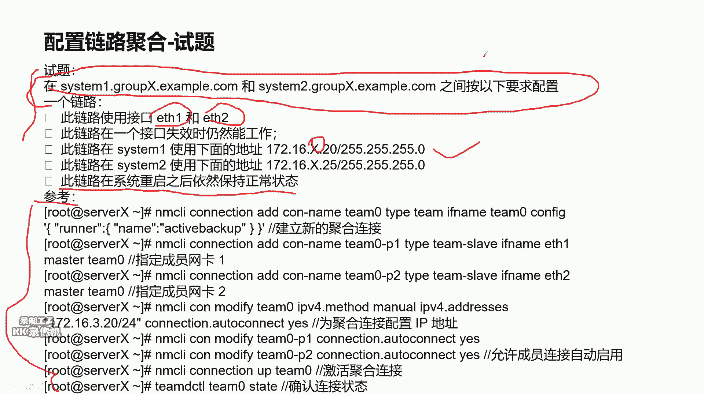

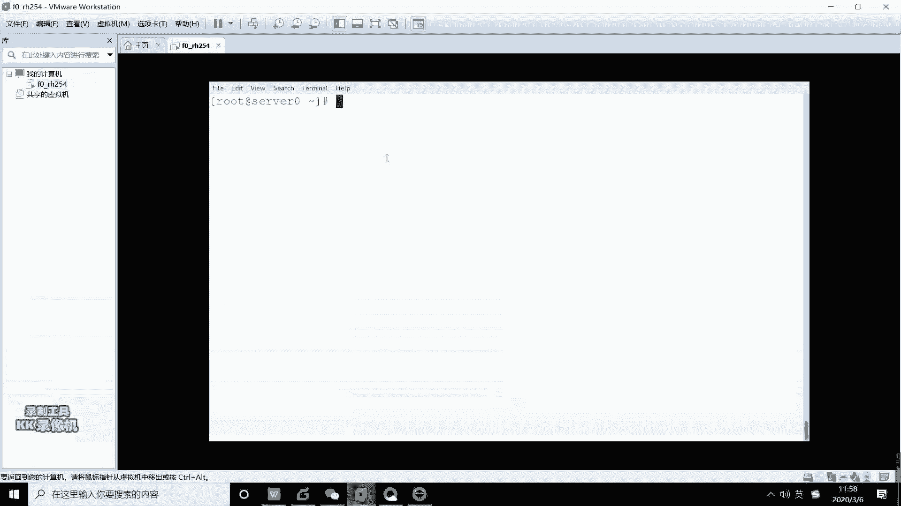

## 链路聚合技术 ⛓️

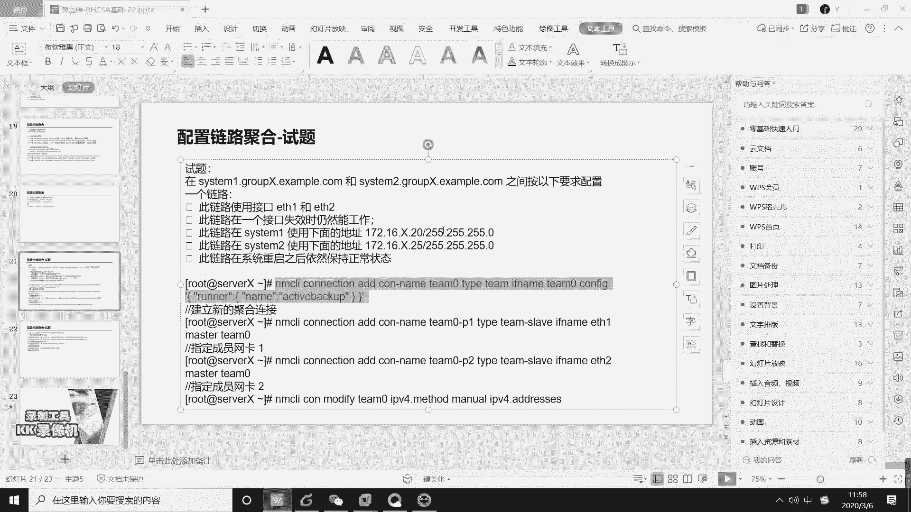

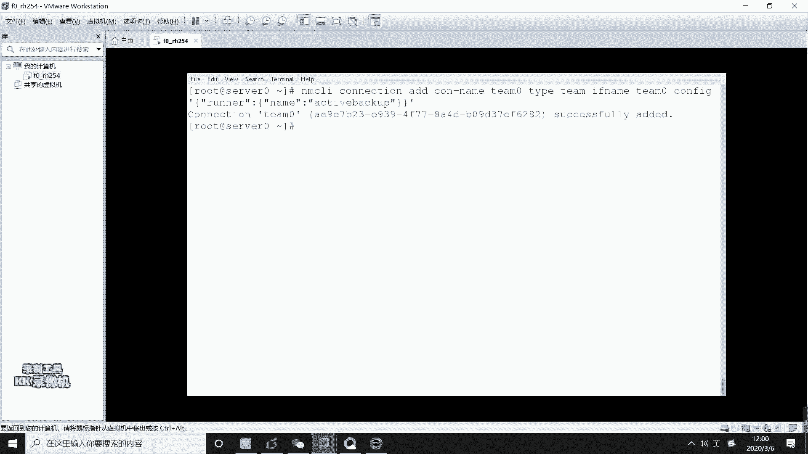

上一节我们完成了防火墙配置，本节我们来看最后一个主题：链路聚合。链路聚合能将多个物理网卡捆绑成一个虚拟网卡，实现带宽叠加或冗余备份。常见的模式有“轮询负载均衡”和“主备模式”。

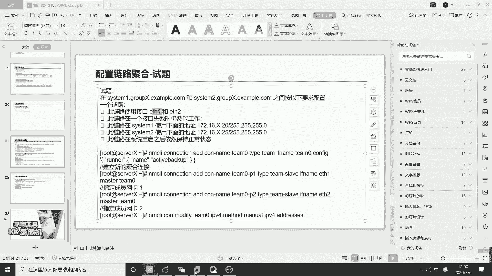

在RHEL7中，可以使用 `nmcli` 命令或 `teamd` 服务来配置链路聚合。这里我们使用 `nmcli` 配置一个主备模式的聚合链路。

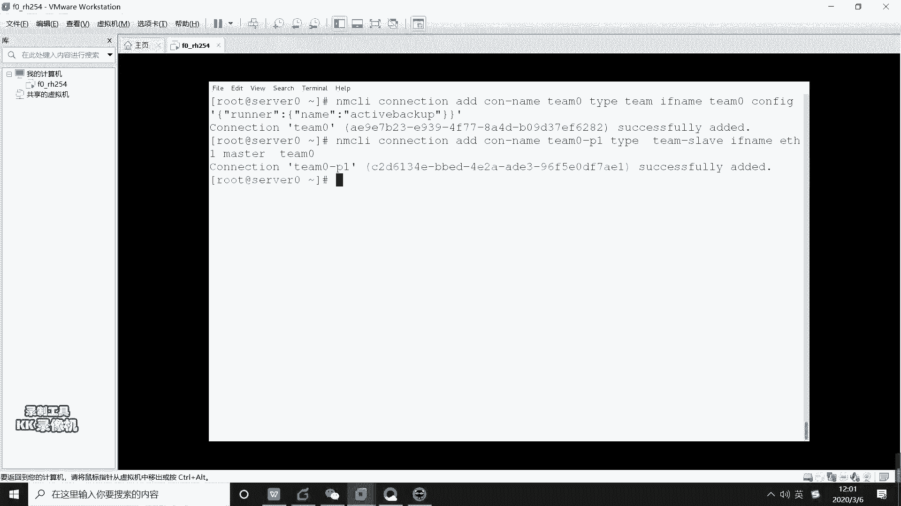

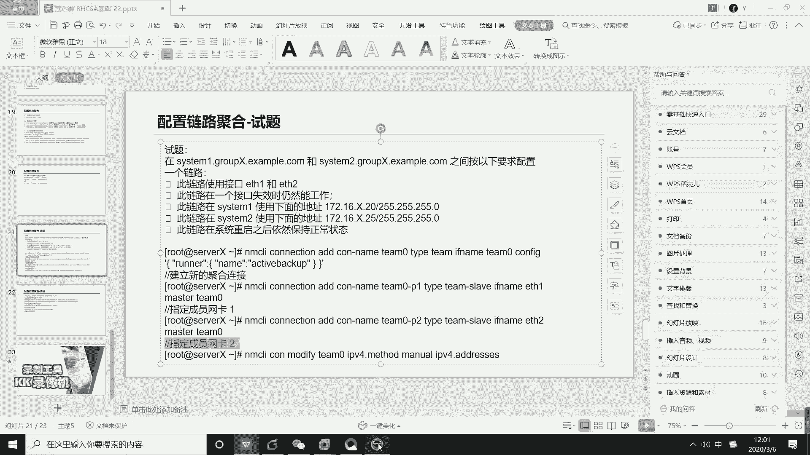

### 配置链路聚合

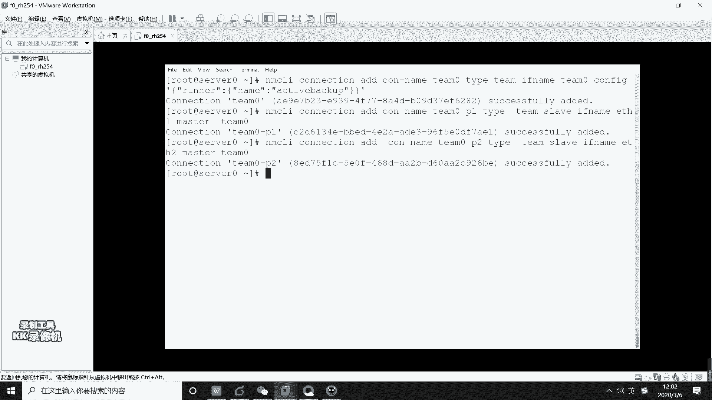

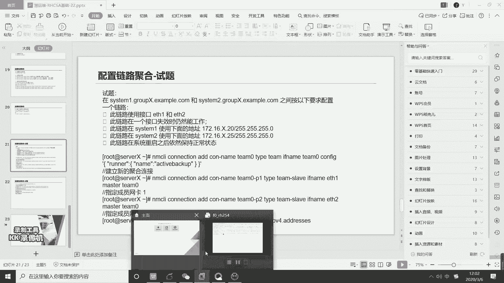

以下是配置链路聚合的基本步骤。

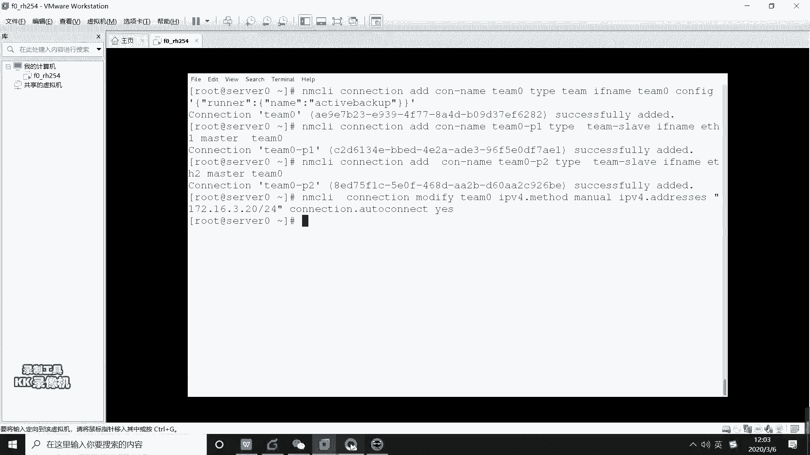

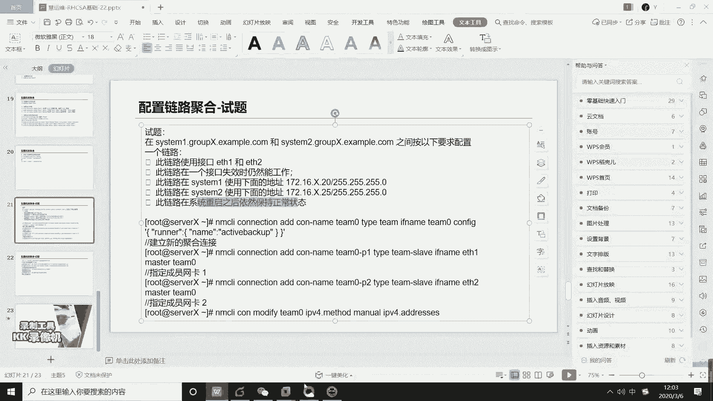

1.  **创建聚合链路接口**：指定组名和运行模式。
    ```bash
    nmcli connection add type team con-name team0 ifname team0 config '{"runner": {"name": "activebackup"}}'
    ```
2.  **添加成员网卡**：将物理网卡加入聚合组。
    ```bash
    nmcli connection add type team-slave con-name team0-p1 ifname eth1 master team0
    nmcli connection add type team-slave con-name team0-p2 ifname eth2 master team0
    ```
3.  **为聚合接口配置IP地址**。
    ```bash
    nmcli connection modify team0 ipv4.addresses '172.16.3.20/24' ipv4.method manual
    ```
4.  **启用成员网卡和聚合接口**。
    ```bash
    nmcli connection up team0-p1
    nmcli connection up team0-p2
    nmcli connection up team0
    ```
5.  **查看聚合链路状态**。
    ```bash
    teamdctl team0 state
    ```

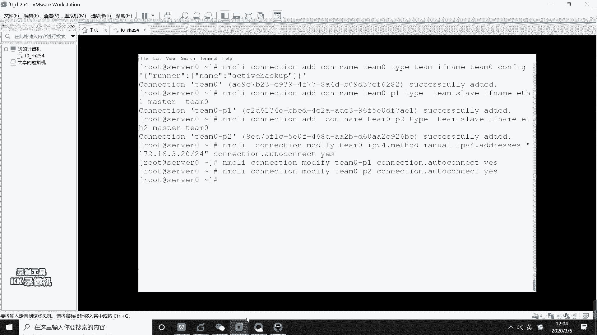

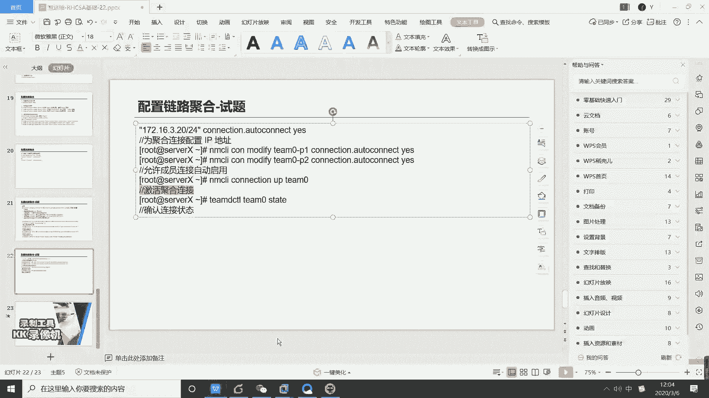

## 总结 📝

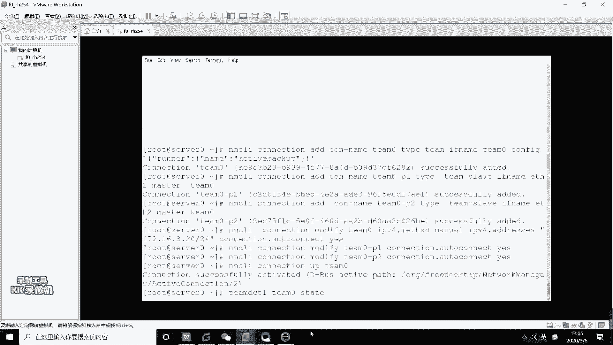

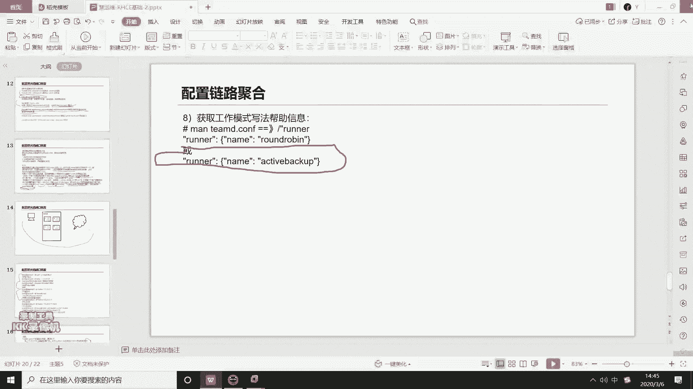

本节课中我们一起学习了RHCE的五个核心技能点。我们首先了解了SELinux的三种模式并实践了强制模式的配置。接着，我们学习了如何通过别名自定义用户环境，以及如何利用防火墙控制SSH访问和实现端口转发。最后，我们掌握了使用 `nmcli` 命令配置链路聚合的方法，以实现网络接口的冗余与负载均衡。这些是构建安全、高效Linux服务器环境的基础。