# IT-20200306-005RHCE部分-霍朋跃 - P1 - 慧学院 - BV1QE411N78z

大家好，我是因为5组的霍鹏月。今天由来给大家讲一下有关于RHCE部分。

呃，今天一共分5个部分，一个是sonny。还是SSH访问呃，自定义用户环境。呃，防火墙端口转发以及链路聚合。啊，首先我们先看一下。森另一个部分啊，森另一个部森林的是是一个。

安全增强linux系统的一个保护的一个机制。然后集成。集成到linux内核中的一个运行，这是2。6以及以以上的一个版本吧，就是。嗯，是美国这个NNSA提出来的，集成一套红帽预先的配置。

保护文档用户及进行资源对象的一个安全策略。呃。rehead7呃，基于linux系统针对于进程目录文件提供了预设的保护策略。以及管理工具。呃，这是安全策略谁来提出的？这是这个。

N IA is very hard。如何查看标签，这是他他的一个命密。是他们相对一个关系，就是做一个简单的一个小图。这是三者的关系，这是操作系统，还有一个six，还有一个入入程。呃，s的类型。

分为这几种。首先说这个强制生效。是内核增加一个灯启用时一个保护。啊，这是一个代表一个宽松，就是内核加载snics机制。只记录不保护。还有一个是禁用内核不加载。s尼地址。啊，这是一个切换的一个模式。

这应该是一个这是一个临时临时如何让它是如何让另一个永久生效呢？啊，这必须得修改配置文件上里边。然后这有一个试题，我们一会来演示一下。呃，确保两个信息的神秘是处于强行启用模式。嗯，这是一个参考。

就是一会咱们配置需要一个参考。

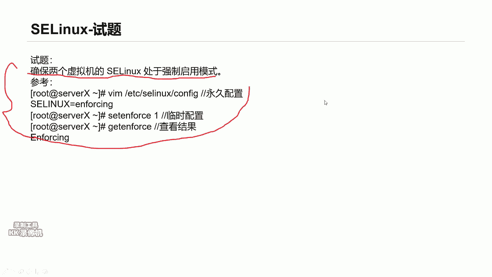

我们来看一下。嗯，首先我们先进入注册配置文件，这是在。ETC下边的30。啊，在这个朋念过。我们找到。这个我们要启用的东西。就是配置一下。这我是当时这个是没有问题的，所以我们就不需要改了。不需要改的启用。

这个直接退出就可以了。然后我们这边就是临时配置一下，就是。Sa force。secon fourth然后一啊，这是临时配置。然后我们查看一下结果。这个呢咱们查看结果，然后这个就是咱们配置成功了。

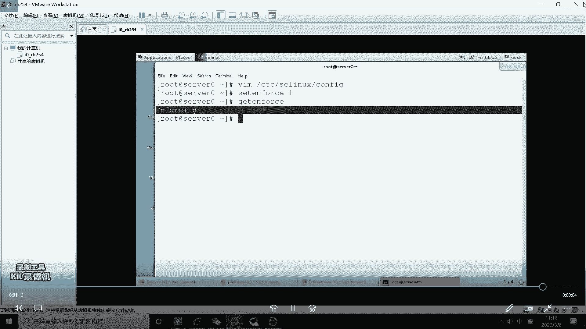

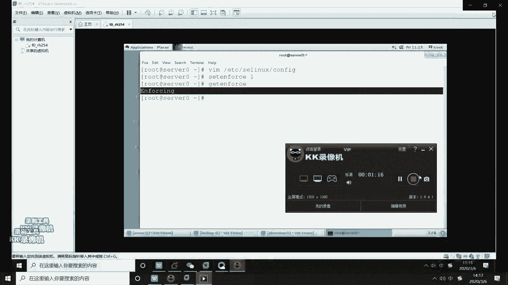

我们来看下一个嗯，有关于。SSH访问的控制。嗯，SSKSSH是为客户远程提供了一个安全的应用的环境。啊，服务端是SIHHHD。然后客户端SSH叉sha。当等等这几个。防火墙策略规则后续。

然后用户是ACL，然后这是他这一个。呃，配置文件里边，然后这个SSH我们一会可以用那个。防火墙机制就可以也是可以可控制的。然后就是看这试题。嗯，要求咱们是用预计用能够从御这个客户端。

然后远程到这两个虚拟机上。并且这个在这个域的段内部客户不能访问您两个同时访问呃，不能访问你的两个虚拟系统。呃，这个咱们就这个咱们就不不去，这个咱们就不去去地里边去看了。

一会儿咱们用防火枪策略直接给它解决就完事了。那个要比这个要简单，如果有人想试的话，就可以自己先试一下。然后下一个是这个是一个自定义自定义的用户环境。嗯，也就是说。给就是给用户起一个别名。呃。

如何使用别名叫als？加上你起这个名字。就负然后负杂这一些命运。如果查看呢，就al别名就可以了。啊，如果取消这就是。You alias。然后是杠A。嗯，用的一个初始化，初始化的文件。

就是他们的一个一个环境。区别就是在EC下pro此文件系统，每个用户设置环境信息。当用户第一次登录时，该文件被执行。嗯，下一个是在。在binbeb been share的话。

为每一个运行best share环境的用户执行文件。当b share被打开时，该文件。被读取。然后这是这几个分案下边的一个柱子。就是每个用户可以使用文件输出。专用自己使用的sll信息。当用户登录时候。

该文件竟执行一次。默认情况下，它可以设置一次环境的变量，执行用户的。下一局。带 byHAYFC的一个文件。嗯，下边是1个23。本该文件包专用于你的视环境，还有。不要信息。当用环境以及每次打开重新的s时。

该文件呃备注取。也就是说就可以在一个就是用户一个环境，每个环境的时候可以就是说给他起一个别名，也就是一个外号的意思。呃，这是。一个考一个测试，一个小测验。嗯，一会咱们试咱试验一下。

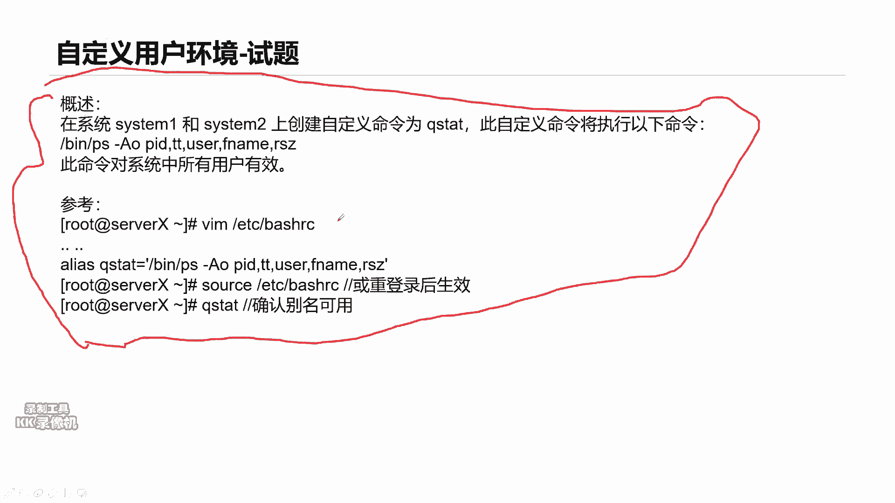

我们先进一下配置文件。在这个环境里边，我们在。咱们要求刚才是这个环境。然后我们再下一行。直接输入我们想要的。起了一个别名。然直接就是al。QSTAT。特别是它所属一个环境一个确认信息。

你直接按装钥匙打上就可以了。嗯，打案就是保存退出。然后我们。重新登录后生效。我们说了一下。然后确认这个边边是否可用。

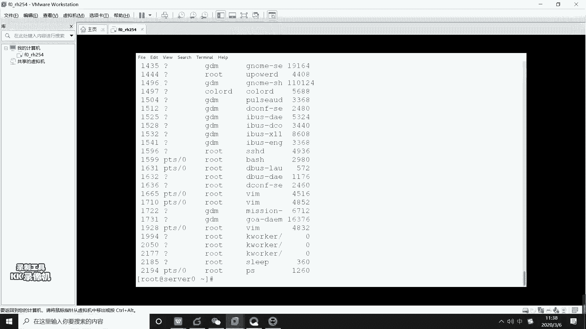

嗯，这个就说就完事了。

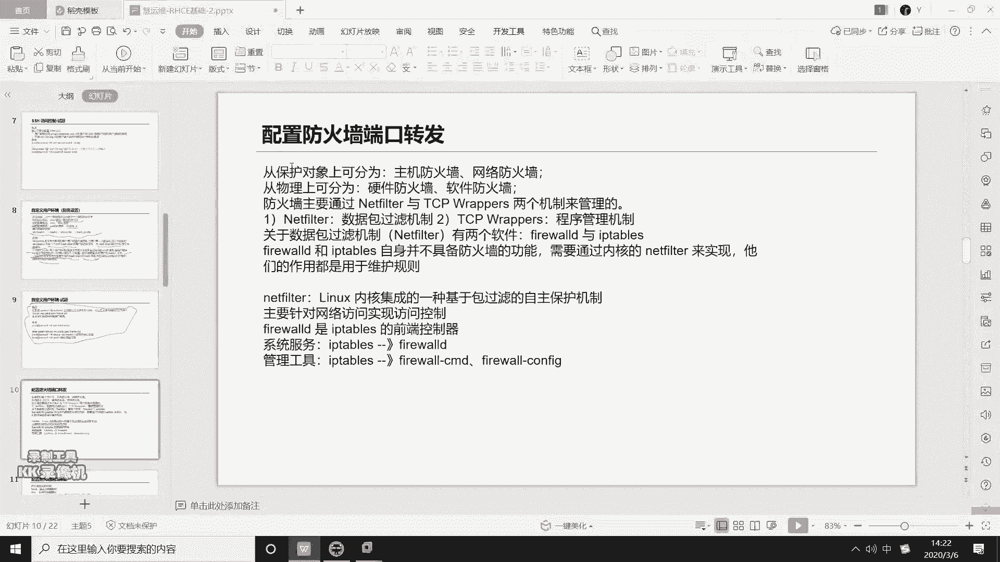

嗯，下一个我们看一下这个。配置一个防火墙端口转发，有关于防火墙的。嗯，从保护对象上可分为主机防火墙和网络防火墙。从物理上可以分为硬防火墙为软防火墙。呃，防火墙主要通过。呃，通过两个机制，这两个机制。

来管理的呃，就是数据数据包过流量机制，还有一个是程序管理机制。呃，关于数据数据包过流量机制有两个软件，一个是fare word，还有一个everittables。

fa尔沃壳和那个M table自身并不具备防火墙的防护功能，需要通过内核的。这两个机这外内核的这个机制来实现。呃，它们的作用都利用维护规则。然后那个linux内核集成了一个部分。

基鱼光过滤的自主保护机制。主要针对网络实现的访问控制。f word跟t是两是两个。控制器呃，就相当于用这两个命令来就是执行。他们所谓对端口的限防火墙的限制呃，系统配置。这是他一个管理工具。有费尔沃的。

Fword杠CMDf world。Com。呃，防火墙的预设的一个区域，它分为这几个区域，然后我们就想给它指定几个区域就可以了。想指定哪个区域就可以指定哪个区域。block阻止所有数据包啊。

这个是丢弃所有所有的数据包，然后这是一公共区域。呃，这个。这是一个信信任的一个区域。然后这是worker代表是办公区域，允写SS森马几个服务。防火墙预设的几幅，然后是。HTP。啊，DNS。呃。

查看这些一些个一个区域的个命令，前面就是fawork杠CMD杠list杠O。下面是所有开源区一个相关的一个。命令。嗯，防火墙那个规则范围规则范围运行配置当前有效，重启fa word服务是否失效？

然后这个是一个永久配置，当当前无效，启用后服务太有效。然后这个永久性必须加杠杠。Pvent。呃，如何具体配置方法规则呢？呃，这是他一个格式。我们可以看一下。然后这个防火墙这边防火墙配置的话。

然后区域的划分的话，这边有一个图形化配置啊，咱们咱们可以用这个图形化比较简单一些。然后这个一看也能看到。然后修改这个区域啊，确认永久永久的配置啊，添加规则。还要转发一个规，添加转发一个规则。

就是端口的一个转发。然后从客户机器上访问这个。42054230。能访问到这能访到这这个地址。然后这是他一个一个协议的一个端口一个协议。嗯，这些一会我们配置的时候就可以用到这个。呃。

实现端口转发必须用到防火墙啊，默认开启防火墙时，只允许访问SSHD其他访问都拒绝。呃，第一个呢允许对本机任何端口进行访问啊，拒绝指定的某一个网段访问。第三句是开启防火墙服务。并配置端口转发。

至少有一个补充，就是数据包就要进入到内核，必须要通过。这个段中的一个。不同的制定里边，不同养。所以可根据这个网上连接是吧？网络的安全性来判断这张网卡流通到底使用哪个哪个这是哪个区域？呃。

如果一个客户般访问服务器。服务器跟跟下人访问决定了使用哪个哪个那个网络策略去匹配。啊，第一个，如果说一个客户端啊，资源包的IP地址。呃，到这个这个环境里边。我们就可以我们就可以用sures。

那么这个这个这个规则。就是就就可以适用了。如果一个同一个圆的。同队员同时给多个。这个规则的设立的话啊会报错。嗯，如果第二一个客户的数据包进入服务器的某一个接口，比如那个网客EH0。呃，区配着住这个。

这段区域。啊，那么。那么做那个区域的规则，呢使用这个这个客户端。一个接口只能只能属于一个。这里千万不能不能同时用多个这种区域。如果说这样两个原则都不满足。

那么省下的省下省下的那么缺省的这个区域化将一将被应用。这是他一个短发的一个小图友。我们看一下专专况转发，如果是先安装。然后再测试。啊，这里有一个试题，我们就是。把这个和网络交客户机访问这个。

team的一端口端口这边也改为5423啊，转发内转发的为80。呃，这是一个解题的一个。书写这一个操作步骤。然后可以我推这里推荐是用那个图形配置工具，就比较简单一些，容易出错。

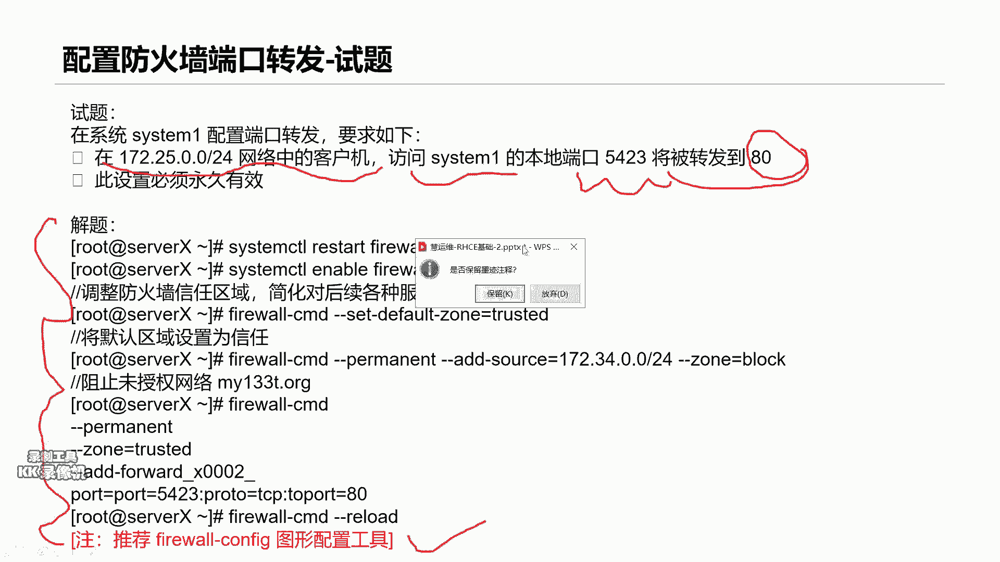

我们来看一下。

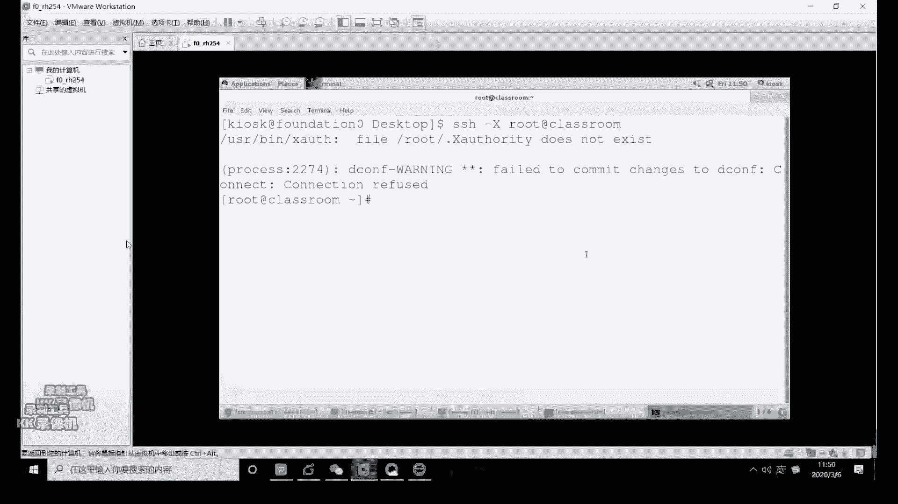

首先我们先确认一下你区域。我们先那个重启一下，就是永久生效，我们要先重启一下这个。风强丽。呃，这个端口。骗要我。然后再开机自启。然后我们这里设置一个。嗯，默认的区域为信任。

就是faair world杠CMD杠杠。Defforce on。John你 trust。这是一个默认人性的区。然后fa沃杠CMD。然后设置为永久，只是刚刚perman。然添加一个。就是刚才咱们所说那个。

呃，受阻未爽问的网络。嗯，这里可以给指纹为。多少。这个网址是刚才是172点。34。0。0。嗯，24习杠24。最后给他不添假。然后我们这里就设置一下那个端口那个。啊，fa world杠CMD。

然后永久性设置杠杠prom。然后这个区域是G等于s的性能。然后添加一个。端口CE。等你跑了。这里等于是刚才是54。5423。等于TCP冒号。这里边这一每个区域这边用冒号不用那个冒号来隔开。然后再冒上。

然后设置那个80那个端口。嗯，我们来重启一下，然后fa word。杠尬热闹的。哎，我们再看一下咱们设置的。是否上效？Sam。杠杠。历史的哦。我们最下来下边是咱们那个端口。你设置。这个80这已经生效了。

还有刚才那个网址。172。34。0。0。24。斜杠S。啊，这里我们试一下那个图形配置工具。啊，这里是费尔沃。然后进在这里边。嗯大家这个这个就相当于看着比较直实，就比较简单一些。治理过之后。

它的一个相关信息，这边。这是哪条哪条，你自己添加哪个区域，自己以为信任的，自己来设置。设置完之后保存就是可以了。这里刚才添加这个一个网段。会阻止这个。嗯，这点是刚才那个端口呃，5423协议是TCP。

然后是80。这是当前生效，然后上边上边那个菜单框位写为proble。然后这边是永久生降。然后关闭就可以了。

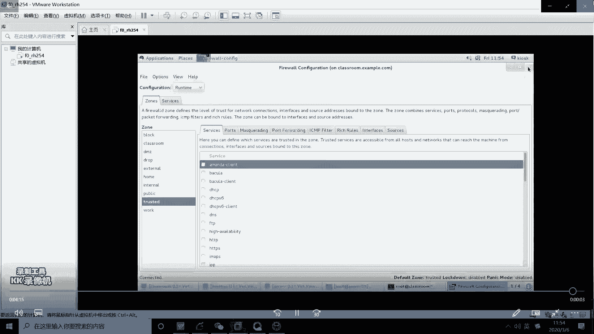

W。就完事了。我们看再看一下最后一个那个。配置一个链路聚合。呃，链路聚合连接就是。用一个网络连接的捆绑啊，就是一个组团，就是一个小团队啊。

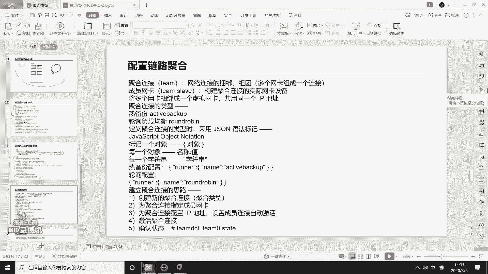

啊，成员网卡。我们先构建一个。聚合链聚合链接的10日网卡设备。嗯，将多个网卡捆绑成一个虚拟的网卡。然后用1个IP。呃，聚合电路这个类型就是分为备份，热备份，还有一个轮形负载均衡。我们学这个就可以了。呃。

定义聚合链路其实采用了一个标语，就是它的这是他们几个标语，然后字符串。然后这个是热备份的一个配置，但是这个配置要我们来我们来自己要记的。这是tableble不出来的，我们要自己来得记一下。

首先看它的它的一个格式，两个大括号。就是它这个区域指定了一个。然后建立一个建立一个链合就的这一个思路。然后首先我们先创建一个新的。聚合链接。然后为这个链接只示只是只是成员的网卡。

就指定一个指那个成员指定一个网卡。为聚合链路配置IP设置成员自动激活，然后激活。那个聚合链接，然后最后一个是确认。嗯，获取命令就是下边一个相关过去的一个命令。然后是N用NMCL。

然后配置聚合链路基本的一个过程。首先我们先创建一个团队，这是它的一个操作功的。然后这第第下边一个我们要添加要添加一个团队。我们要要做绑定类型。然后配置文件名。就是给他企网卡网卡名，还有我们的配置文件名。

然后最后热备份。然后第二一部分，然后我们为聚合链路添加。成员网卡。然后就是组员。是第一块，我们就设置我们就一会儿就设置一下就可以了。然后。第二块。然后这组名是就是各起各的，我们这写的是12。

因这两个这是物理网卡的一个名称。然后配置相关的1个IP参数。啊，最后确认信息，这是。然后启用这些网卡。啊，激活激活那个。聚合链接。然后检查一个连接状态。呃，这里说一下这个如果这个激活失败了。嗯。

我们这里只能说全部的删除冲敲。这个没有办法。那这是一个获取命运的一个帮助。嗯，这个可以看一下就可以了。然后获取一个工作模式法帮助的信息。然后因为说我们要肯定是要用这个。那下边这个。嗯，这里有一个试题。

一会我们来操作一下。然后这是。在这个这个区域的。下面要求要配置一个聚合链路。嗯，网卡。ETH1ETH2。那这是它一个网络，一为我们添加一下就可以了。这个S就是自己设定一下就行。嗯。

此链路在系统中重启之后保持正常状态。然后这是一个相关一个参考的一个操作步骤。

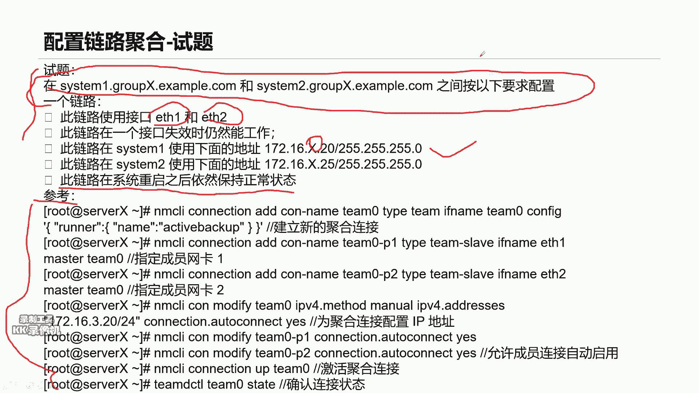

我们来演示一下。

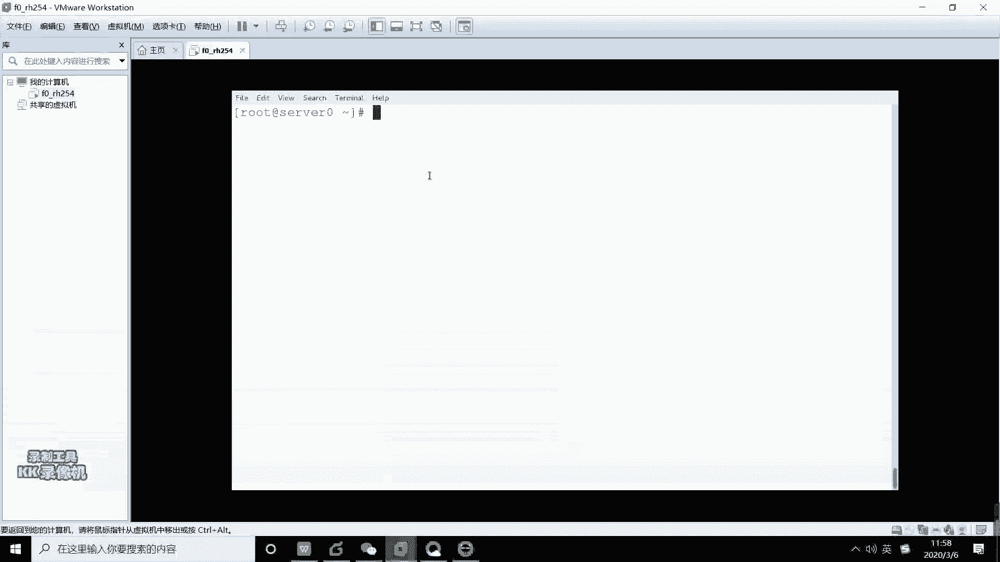

首先我们先看一下。呃。先建立先建立一个。聚合链接。

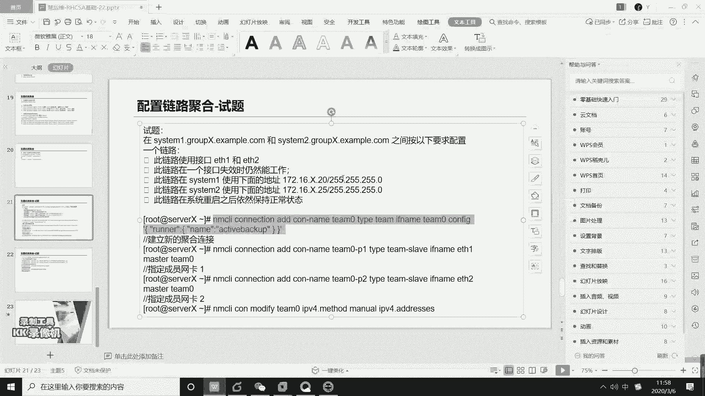

然后我们这里先建了一下。咩嘛。Connection。AD。啊是。せよか。嗯，团队名怎么写？ETAM就写提名嘛。然后确认命令来听名。然后把它是呃QQ链接，这是一个热备份。就是刚才我们说的是所要记住这个。

我们看一眼。嗯，检查一下。这个没问题。

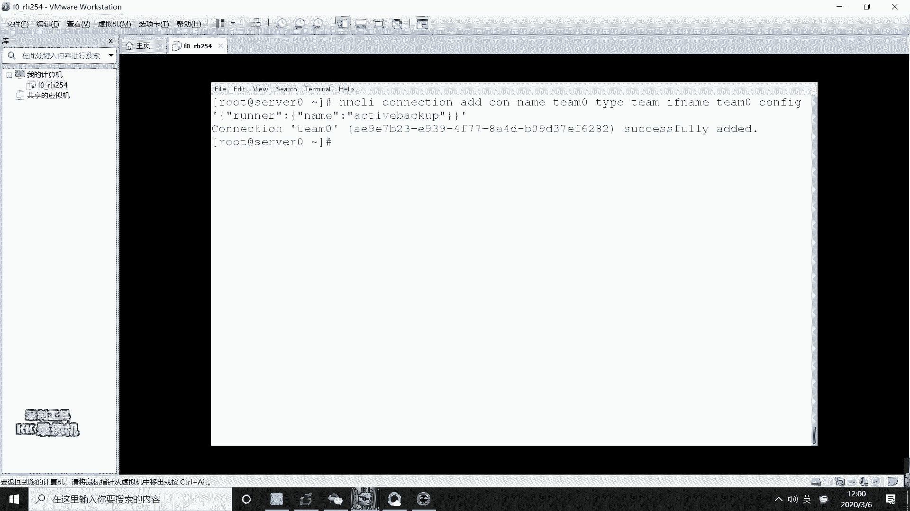

然后就是就确建成功了。我那里显示已经添加成功了。好，我们看一下第二个，我们需要指定成员网卡。

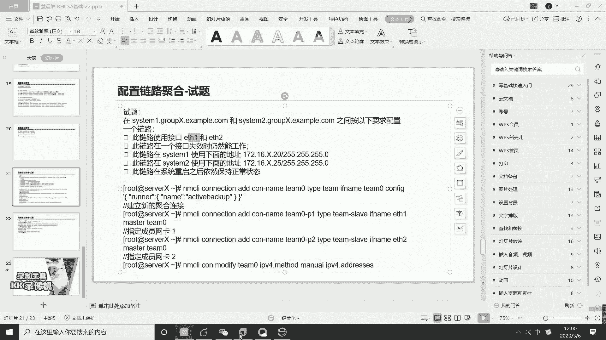

你先指定第一个。那我们肯定是。然后添加一个。添加到哪个组，就是team0这个组里。然后这边写P1吧。好，指定为这个主率。那这里是master。

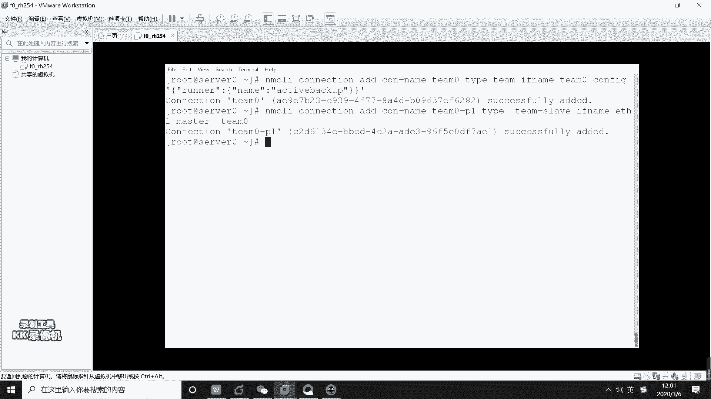

7不0这个字。那这个第一个支持。然后第二个第二个也是截指定第二人，咱们只需把这个网卡。把卡名称改上就行了。

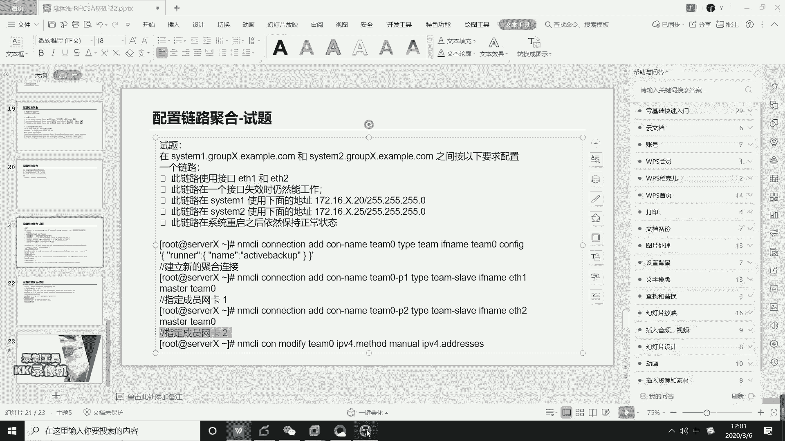

啊，这个指定是。票。也是同样的添加到那个。750理。然后咱们现在就是指定就是指定添加那个网卡成员，两个成员都已经指定完了。

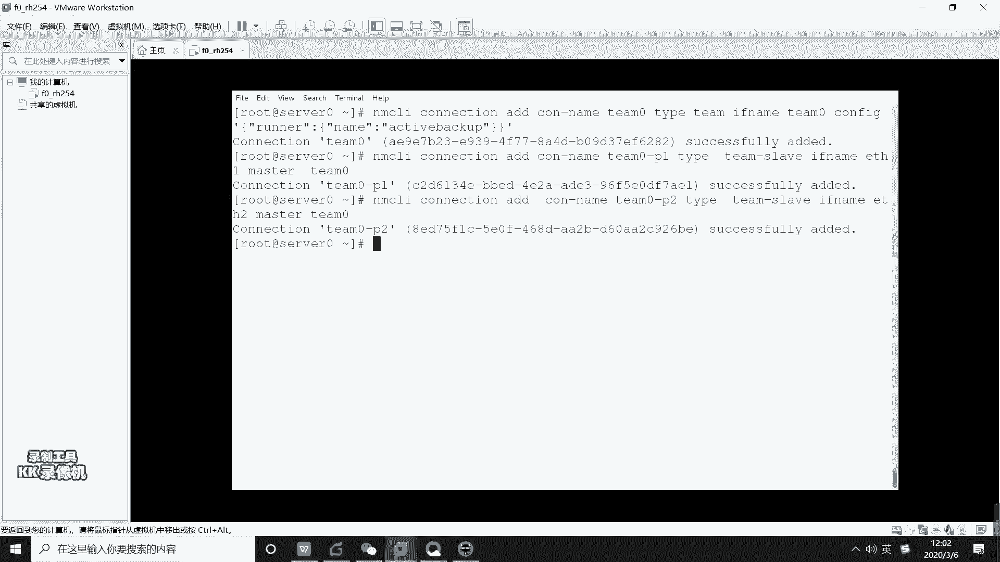

嗯，这里我们要给一个激活链路，要配这个IP的。IP是172。63。20724。

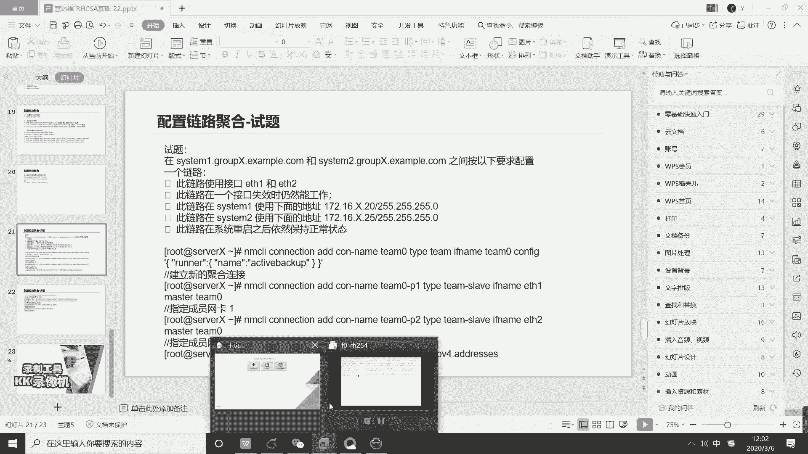

那个是。为这个TTT0。IPV4。我没有。APV4加我的dress。把那个因为咱们有一个斜杠，就是必须加双引号，172点16。3。20斜杠24。我们这是嗑点水。我确认。

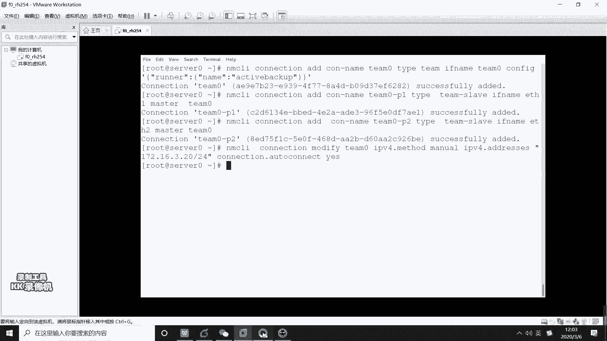

嗯，IP配完了，接下来我们应该应该是允许成员。然后这自动链接启用。

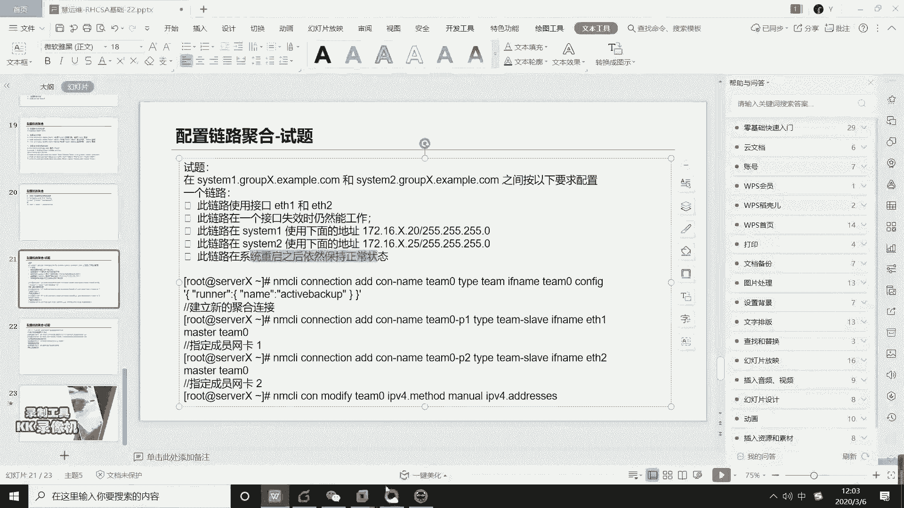

那磁量是保持系统正常。正常状态。这个NM connection。然后指定的就是刚才那个是。K0P1。刚皮衣听不明刚皮衣。然后确认自动启动。啊，下边这个直接把那个P1直接改成P2就可以了。他两条都启用。

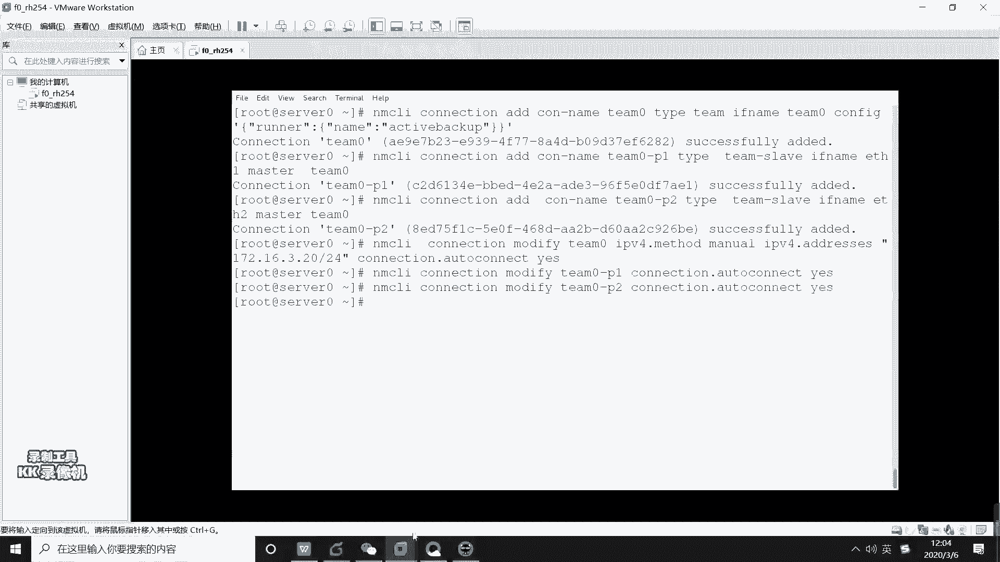

然后我们来激活这个聚合链接。然后就是把这个网卡清零那网卡启用就激活就可以了。

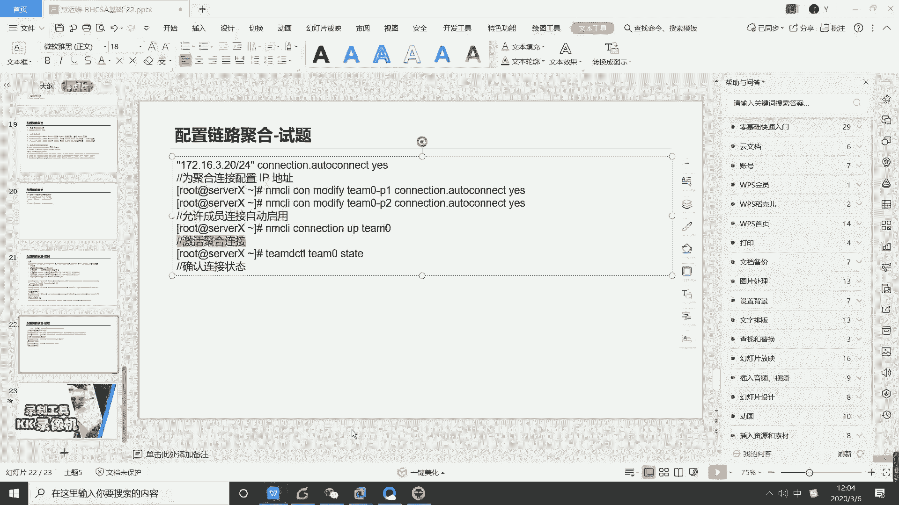

嗯，最后我们需要确认链接的状态。我们看一眼。T不0。

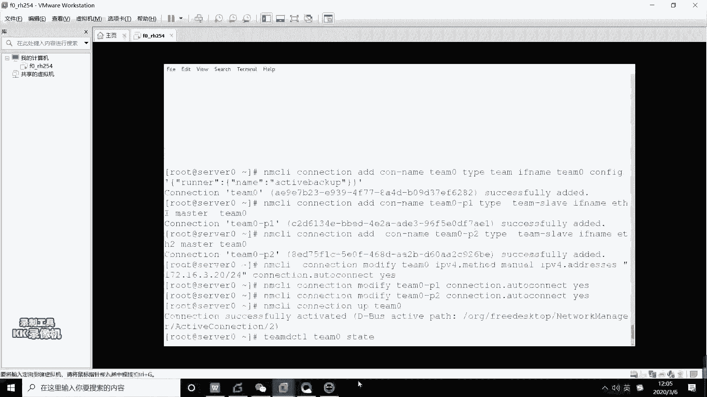

嗯，这边已经显示已成了任个费围。好，最后一个咱们这个聚合链路就已经已经讲了。哦，感谢大家的收看。啊，今天今天讲解的内容就完就到这儿了。

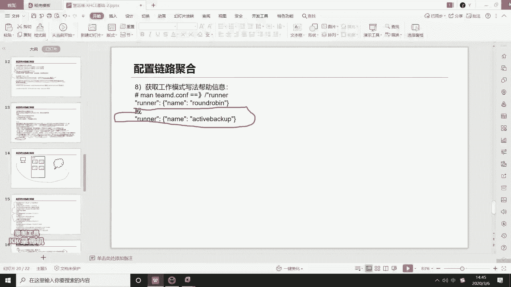