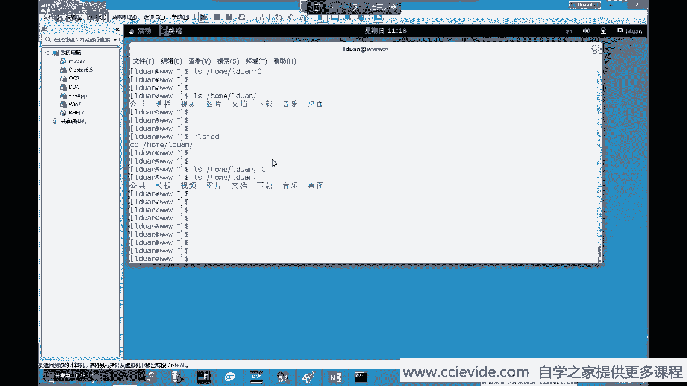
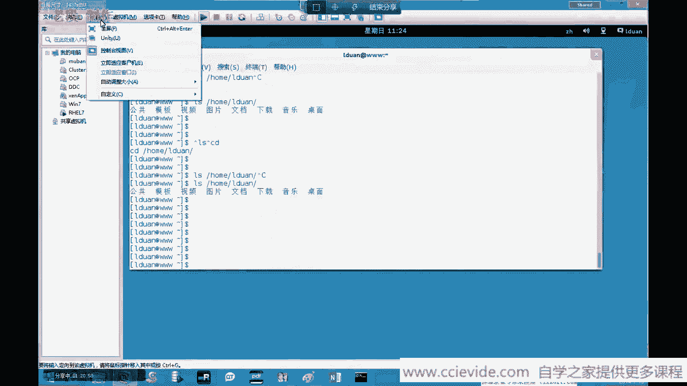

# Linux Reahat 最新版RHCE 7.0培训视频教程-1 - P1：RH124-1_rec - 远洋轮 - BV13f4y1N7MP

那下面我们开始来看一下。第一张。第一章呢，首先我们要来熟悉一下我们的。登录机密。以及怎么样使用我们的一个本地的一个控制台，以及我们如何去敲命令。在be上下面，如何取消命令？

那首先我们来熟悉一下我们的一个控制台啊，我我们的一个登录界面。

因为我们在装系统的时候，大家也看到了就是。我们是可以给他创建一个普通用户的。他全部把这些普通用户列出来了，入ot用户在这里面并没有列出来。好，我们就选择这个用户。这里面有一个老端用户点击。

这是我装系统的时候自己设置的是吧？好，点击它。然后你设置它的密码。那你登录之前，大家可以选择这里面有一个小齿轮，齿轮就是设置了，set up就是set是吧？就是一些设置。

那么我们这里面选择是你可以设置一下，你选的是什么登录，对吧？默认选择是传统的刀墨，我们来看一下好了，登录一下。

这个呢就是我们所看到的一个灯录界面。看到了吗？这就是我们看到的灯录机密。那么这里面呢就是有应用程序，你可以这里面选择前进就好了。

请你就持。好。这个呢就是。然后你看这里面就是和传统的一个文件系统是没什么区别的这是这有帮助，我们不用看了啊，还有一些视频。然后你看这里面就有一个应用程序，你常见的应用程序呢都可以在这里面去找是吧？

有收藏的一个，比如说你快速打开一个终端，就是敲命令的认识，相当于我们在windows里面可以敲什么3MD对吧？可以去敲一些命令。

好。然后。比如说附件里面，你打开一个计算器。好，你看我打开一个计算器，对吗？我想打开一个浏览器。浏览器在互联网里面打开浏览器，你想聊天，可以打开这个聊天聊天工具。对吧去注册一个账户去聊天了就可以了。好。

然后。我们关闭，那我要是想注销怎么注销，选择右上角的，选择右上角，这是个界面，对吗？当然你改击想点击它的一个背景图片的话，也可以点击更改背景图片。好，你你说。啊，这里面有吗？这里面有背景图片。

大家可以改，对吧？你你认为哪个好看，你改哪个选择是吧？你说这个好看对吗？根据自己的需要去选择了，这是好，我选择默认值，这是默认的对吗？好，选择默认值。然后你可以选择设置，点击它之后就看到一个设置。

是不是有这么一个算值，是吧？你可以去设置你的电源，对吧？点击比如说多长时间。呃，是呃是保屏保一下是吧？显择同步对吗？好，这个设置除了这里面打开之外，呃，我还可以在哪里打开呢？应用程序有个杂项。

这里面也有一个唉。啊，不是咱现在哪里设置的，看一下啊，系统工具这里面有个设置，也可以用来打开。对吗？那有同学可能会感觉到哟，我现在刚打开之后，感觉系统有点卡卡卡的对吧？那没关系。

那么你看我们可以选择鼠标。然后你看这里面鼠标的速度，我给你调调快一些。对吧双击速度就可以调快一些。那这样的话就感觉到就是会快了很多感觉上这是。😊，好的。

那么我要是想看我的系统监视器的话，怎么查看？这里面有一个系统工具是吗？这里面有一个系统监视器。这么一个经历。好，那我现在还想注销右上角这个用户选择注销。不需选择不需。那你不像了。

那么我们这里面来重新登录一次选择老断。然后我们选择这个设置。有一个剪刀木，这是传统的剪刀木。你认为可能传统的剪刀木不好看，对吗？那么我们可以选择剪刀木。😡，换个界面，登录输入密码，登录一下。

然后它这里面的界面又不一样了，它这里面是另外的一个界面。

看起来很相似，但是呢他把所有的工具工具集中放在哪里面活动上面了，连接活动。

然后你看这里面就是相当于是最常用的，就相当于什么？相当于大家看一下，你看我们windows使用习惯的话，大家可能都会把最常用的一些工具放在哪里面放在放在任务栏里面，对吗？如果任务栏放不下的话。

大家也可以放在哪里面放在呃。😊，呃，是不是也可以放在放在开始菜单里面，把我最常用的一些东西放在开始菜单里面。对呀，也可以直接去使用，非常的方便。那么它这里面也是一样的，你可以把你最常用的工具放在哪里面。

放在这个你看点击这个东西有个收藏点啊，放在这里面。😊。

你用不到的东西呢，你可以把它给怎么样取消，从书藏夹删除这个文档用到它删除，对吧？那么我现在想把一些常用的东西放在这里面怎么放？那么选择这个这个东西显示用更多的程序，对吗？然后选择全部。

然后你看这里面就多了很多东西。你说哎我想把哪个东西放在这里面呢？对吧？你看哪些东西你自常用，这里面有个Gedit。😡，啊，不是，这是这不是接地他的。我们这有jait是吧？好，添加过来，哎。

你看添加过来了。😊，对吗？然后你看你你这里面有一个设置。也可以去设置这些东西。比如说啊电源设置好，刚才已经改过了是吧？好。

然后嗯。可以看一下这里面有杂项是吧？杂项这里面都是一些乱七八糟的一些东西了，还有打印机的设置，防火权的设置是吗？还有一些工具工具这里面给我们存储了很多的一些工具包，是吧？

等等等等。这个呢大家都可以去自己看一下。好，你看这里面你常用的一些工具了，这是相当于我们这里面唉你装了哪些软件包，你看对吧？

你看你这里面就支持你装过的软件包。这个呢相对来说还是比较容易的。

好的。那么大家可以看一下啊，比如说我们现在呢就是我们来练习练习。好吧，那假如说我现在呢想。

远程登录对吧？大家看一下windows里面，我们远程登远程登录的工具有很多。比如说我这里面有一个M remoteote是吧？这个就是我们远程登录的一个工具，非常的方便。哎，这里面怎么少了一个了？是吧。

那么我们现在来连接一下好了。你看我现在原常连接不去。对吧你看我这个时候呢，这是windows下面的一种连接工具。那么windows里面我也想远程连接，怎么连接呢？对吧？windows里面我也想远程连接。

怎么连接？好，那么在linux里面连连接一下。好，那么我们就选择它找到工具。嗯，找到远程连接工具，看一下是在哪里。工具这里面有没有一个远程连接？好，大家看到一个远程桌面查看器，看到了吗？好。

右键点击放在收藏夹里面说你你说这个东西我可能常用是吧？那你常用的话，放在这里面点击。😊。

好，现在是不是已经打开了一个远程桌面连连接器？好，那么我们来连接一下吧，有个连接。对吧那么你连接的环境使用的什么协议，对吧？SSH就是这个我们后面会去说pe OCIDC这个呢都是远程桌面。

SP词和BC呢都是一种。嗯，是一种工具。IGP呢它是windows的原程桌面，对吧？假如我连接192。168。1样。192。168。20。1，当然我们对吧？你可以连接过去。

那用户名是用什么来连接admin。我们看看能不能连能不能连接过去。好，这里面就是它会显示通知是吧？连接。20。1。哎，它这里面怎么没有显示连接？这里面应该是我们的远程桌面那个包应该是没有装的，是吧？好。

你看可以连接。啊，亚屏就没就就没显示了，是吗？好，那你要连接其他机器的话，大家可以自己去试一下好吗？就是在这里面来连接。那么我们要装需要装上一个什么redresstop这个包才可以。好的。

那么我要是想敲命令的话呢，怎么敲？那么点击活动。然后选择什么？选择终端。这样的话我们就可以在这里面在这里面来敲命令。那么敲命令的话，我们可以敲什么？你看相当于windows下面的是sMD是吧？

就可以打开它的一个。

命令行CMD当然了，那你说我你要是要以管理员身份来连接的话，那么我们选择以管理员身份来打开连接。😊，对吗？这个都可以。

那么现在你看我打开这个终端之后，我们的命令呢都是在这里面来敲的。好，那么我认为这个字体太小了，我们可以按这个菜单进。选择配置文件，配置双选项。这个字体呢大家可以改一下，改成你自己所喜欢的字体。对吗？

假如你这个字体显小是吧？改一下。好，你个字体改大一些。是吧选择大一些大一号的。你看这个比较丑了，已经对吧？太粗了，那么我们改小一些。还是改成12是吧？好的，你看这样的话。

你可以去在外面去敲你所有执行你写命令。那么这个命令怎么去敲？那么我们还要去讲。

好，大家看一下，现在我们登录我们的计算机，现在已经会登录了。而且登录计算机之后，我们所要做常规的一些操作，应该都是没问题的了，对吗？当然这些都是通性化界面的东西，希望大家都可以去自己点一点。

比如说我要编辑一个文档啊，打开一个edit，这个it就类似于什么呢？类似于我们有windows下面的一个揭示版，对吗？比如说windows下面，我打开一个记示板，你看我想打开一个文件，对吗？你随便去写。

对吧？hello world。😊。

对吧你随便去写。那么我们这里面呢，你看它也是一个这个东西。是吧。你随便去写这些东西，你想怎么写呢？你看。写完之后，你是保存还是不保存，对吧？是不保存还是另分为？就是一些就常规的一些操作。

好。登录计算机，我们现在已经是登录了。那么我们要敲命令的话，那么我们怎么样？如何打开一个终端，就可以去敲命令。好，那么我们就来看一下怎么去敲命令。

如何取消命令？因为我们很多的命令，大家记录一下。😡，在lininux里面，我们很多的操作都是在哪里面来完成的？都是在。我们的命令行里面来完成的。好，那么首先我们来看一个简单的命令，我打开它之后。

大家看一下，我们这样说。比如说ipadwindow。moddows里面简单的一命令，我相信大家可能都知道。比如说我敲if confi啊，不是啊RP confi。对吧我敲IPfi可以看到我的网卡信息。

对吗？我想知道当前目录里面有哪些东西敲一个DR呀。是吗？那我想知道我的进程那个state杠AAN。对吧？可以查用那海进程。那当然了，我们也可以去做一些过滤find。😊，办的多少呢？

这是相当于indux里面的group了，对吧？比如说我找嗯像4500，这里面有个4500这个端口是吧？这样吧？稍等一下。

有个4500这个端口，比如说我发4500，对吧？那你看我们就可以去敲这些命令去实现我们所有的操作。这是windows线里面我们常见的一些操作路，对吗？lininux里面我们也经常也是可以去敲命令的。

敲命令的话，我们是在终端里面来敲。大家记住一下，敲命令的话是在终端里面来敲。打开这个终端之后，比如说敲个命令who am I。我是谁？who am I翻译过来就是我是谁。😡，你是谁？爱，你是老段。

它显示的是当前用户记录下。记住啊，显示的是什么？当前用户。稍等一下输入法。想法不动了。输入法的话，大家可以按什么ctrl shift来切换输入法，记住ctl shift可以切换，你看到了吗？好。嗯。

显示的是什么？的是。当前用户。是谁？是吧是谁？好。这里面大家记录一下，你在敲命令的时候。😡，遇到井号键是注释，井号键都是注释。是注释。几号键是注释，几号键可以写在前面，也可以写在后面。比如说举个例子。

我怎么写呢？who am I？好，比如说你在前面论的时候，对吧？你可以做个注释，显示什么呢？这个是显示当前用户是谁是吧？😊，显示。显示当前用户是谁？对吧这个输入法很。不给力。是什么？你可以自己去写。

这样的话也可以这个井号键。你写在前面这一行都没用，你写在后面，这只是做一个注释，前面的命令它是正常执行的。这给大家以后呃，知道这点就可以了，好吗？那么我们敲面令的话，大家看一下。

我现在为什么可以敲这个命令呢？😡，对吧为什么可以消这个命令？😡，原因是什么？😡，这里面有一个问题，我还是要给大家说一下的，就是。就是一个share的一个问题了。我们写一下是呀。首先我们要说什么是这样。

😡，这上它是一个子系统。一个子系统。记住它是linux里面内置的。它是lininux里面内置的一个子系统。它是一个很抽象的东西。你看不到它也摸不到它。😡，大家听到了吗？你看不到它，你也摸不到它。但是。

它的作用呢就是可以做一些解析。把我们用户所敲的命令解析成。解析成系统能执行的语言。比如说我敲了一个who am I，这是一个纯英文的那计算机他能看懂吗？计算机他肯定看不懂计算机只能看懂什么。大家想一下。

对于计算机来说，它最核心的部分是什么？就是我们知道是CPUCPU是什么？CPU就是一个硬件。😡，对吧就是一堆非铜案铁，加上一些硅片硅片。它只能识别电压。对吧？那他不仅。CPU能识别，肯定人眼都能识别的。

对那么大家可以试一下。用电电一下肯定的感觉应该是有反应。边压高是一个反应，边压低是另一个反应。大家如果感兴趣的话，可以去自己去试一下啊去，然后给我们写一下感受。当然了，后果自负啊。

然后它这里面只能识别010010这些东西。对吧高电压，比如说高电影表示一低电压表示0，或者是从高从高到低的变化表示一，从低高到高的变化表示0。到底是哪个标示0，哪个表示一。这个是用它不同的编码。

比如说manches斯 time编码。不同的编码，它使用的方式是不一样的，表示一表示零的方式是不一样的。所以说我们在linux里面，我们在系统当中在在CPU这些硬件它只能识别的是二进制。

当我们敲的这个命令，它是进制吗？不是。他为什么识别？实间灯具当中有一种转换。我跟他说样它是一个很抽象的东西。它是进程。对吧它存那一个mnetnet当中。看不到它也摸不到它，你可能会说哎，哪个是sel。

哎sll在哪里了？你给打开一个cel我看看，对吧？你找你找来找去，你都看不到sll。sel它是一个充象的东西，看不到它，那看不到它，我们怎么用它呢？😡。

这个时候我们就必须得去使用一个终端，也就是一个工具来连接。记住，是啊，它是一个很抽象的东西。这是用户。对吧？用户我们要是想让用户帮我们去让帅去帮我们执行一些事情操作。对吧？那么我们要通过sll去完成。

哎有我命的时候。要是要去执行那些东西。那么我又看不到它怎么办？😡，这个时候我们必须得找一个敲联啊来连接。用户。和是样。这个敲点就是我们所谓的一个终端。看到了吗？就终端。现在我打开的这个中端，大家看一下。

😡。

我现在打开的这个终端，它是linux，就是红帽里面自带的叫gna terminalminal Hg的一个终端，选择帮助可以看到关于是g normal terminalminalg的一个终端这识。

你记住打开这个终端。他不是一个CR。大家以后不要说，哎，你打开一个cel看一下，这不是一个cel，它只是一个工具。只不过它这是当你在它系统自身里面打开一个终端的时候，它自己就会连接到一个cel。

就启用一个sel进程。你打开一个终端就会启用一个sel进程。因为他们都是在同一个机器上面的。好，那么我们首先来看一下本机的IP地址是多少。是20。102。对咩。那么这是一个终端，只是一个工具。

我们的windows里面也有很多的工具可是可以使用的。比如说我那边选的是excel，你开始可以使用putty或者是sixRT。那么SSH我是用老大用户连接连接过去192的1680。20。102。对吧？

这就是一个工具类似的这是。大看听听听到了吗？它就是一个工具，非常类似的一个工具的是我们可以哎对它进行延长连接过去。好，输入密码。确定你看这个时候我现在就连接过来了。

现在我这是windows打开的这么一个。excel这么一个工具。在lininux里面，它带的是什么？自带的是一个终端。终端这两个都是工具。只不过我现在我在windows里面打开的是连接的是远端机器。

就是我的这个虚拟机里面的这个系统是原端的一个机器的。相当于windows来说啊，它这里面打开的是本地的excel。我们很多的操作都是在这里面来执行。😡，我们来看几个简单的命令好了。😊。

比如说PWD显示你当前是在哪个文件夹下面的。你还可以去。敲什么？比如说有data显示当前的日期。像ifconfig可以查看当前的网卡信息。交BC。可以打开一个计算器。比如说1除以3等于01除以2。

A除以2等于0，唉，怎么不等于0呢？这是计算器怎么等于0？😡，这是因为BC它这个计算器默认。保留的是销售点，后面是不保留的。我们可以创认一个scalell。等于四等于几，等于一个数字等于这个数字。

它的意思就是说。小数点后面要保留多少位？几位呢？1除以3，它保留三位。退出的话，写quiit退出这个这个这个这个东西。好，这个呢是最简单的一些命令的使用，大家看到了吗？这是最简单的一些命令的使用。

还有当然这个命令很多时候我们签命令的时候不只是那么简单的一些命令了，它还会有一些更复杂的一些命令让我们来使用。好，那么我们下面来写一下。

大家记住一下，在linux里面我们敲命令的时候，要遵照一定的语法。比如说windows下面，大家看清楚，刚才我敲了一个命令叫net state，叫什么Iin I，对吧？

它显示的就是你看n state是一个命令，你看net state，它是一个命令，对吗？但是我们可以加上一些什么，加上一个IN aI I叫做什么叫选项。

是吧也就是说我们是可以加上一些选项的。

所以inux里面我们也可以去这样做。敲面那的时候是单路格式。格式。首先是什么呢？就是你所要抄的一个minX command。一索悄的命令。然后后面加上你所执行的一些。参数。比如说举个例子。什么叫参数？

大家看一下。我敲DIR是什么意思？在linuxwindow里面DII的意思就是。显示。目录里面的有什么内容？你看这里面显示就是当前目录里面有哪些内容。那我也想查看D盘里面有哪些内容呢？大家看一下我敲D。

😡，这边。😊，DI呀D。就是比如说地盘的意思。它就显示了这是。D盘下面有哪些东西？对吗？D盘下面有哪些东西是可以让我们来用的。对不对？那你直接什么都写的话，它显示就是我当前的目录。😡。

所以这个就是一个参数。这个命令对谁来操作的？😡。

当然有的时候为了表示。我怎么执行那一参数，我们是可以加上一些。😊，选项的。是可以加上一些选项的。为了防止命令把这个选项当成参数来使用来执行。那么我们可以加上一个杠来表示。那就是选项空格杠选项。

选项是可以有多个。一到这样写命令。干。我直接写option一空格杠option。啊，代码我们直接写A杠A杠B杠C可能更好。杠A杠B空都有空格杠C杠D。参数。我可以加上多个权线。😡。

不同的选项得到的结果是不一样的。当然如如果有多个选项的话，那么这多个选项我们可以合并，可以写成什么呢？可以写成这种格式。命令。杠ABCD。参数可以乱写。不同参数它可实现的作用是不一样的。比如说举个例子。

😡，我们来看一个简单的命令。L。I它的意思类似于linux里面windows界面，我们所看到的1个DI啊这个命令。好。刚才已经给大家讲了一个命令PWD。对吗？好，我叫MS。PWD它的全称叫做什么？

叫print working director，就是打印当前的工作目录。working就是正在工作的directctorory。好，L它就是list的列出来的意思。你看。😡，我什么都没写。😡，大看一下。

什么都没写，后面没有给任何参数。😡，没有跟任何参数显示的就是当前目录和windows里面也是一样。我什么都没写的话，显的就是当前目录。对吗？那当前目录是哪个直接敲CD就可以查看当前目录是它。

那你看directydirecty，然后我给你复制过来，你看这个路径。哎。😊，权中回升。U进复制，你看是一样的意思。对吧。😊，没有加参数。它显示的就是什么？显示的就是当前所在的目录。

那么搬迁目录是ho目裸断，你看这样写。home老段效果是一样的。我这里面加询一下了吗？没有加。😡，我们是可以加上一些选线的。比如说我可以加上一个杠L选线。好，那我就不写了，不写的话，参数就不写了。

就指的就是当前目录，不是你看。它和刚才直接执行RS结果就不一样了。😡，那L的意思叫做什么？叫做长模式。😡，lin mode就是一个长模式。它里面显示了这些文件的一些属性信息。

那么这些属性前面这一大的分别是什么意思呢？我们后面去说降断权限的时候会去说，反正你只要知道这些都是。属性就可以了。对吧？就是一些属性就可以了。好的。然后。我还可以加上一个杠A选项。N意思叫做。😡，哦。

就是所有的意思。它这里面就会显示很多以。点开头的文件。大家记录一下啊，在lininux里面，凡是以点开头的文件，都是属于隐藏文件。这个你一定要记住。所以它这里面就把很多的一些隐藏物品都显示出来了。

你看windows点面也是一样，你看我这里面有多少隐藏文件呢？😡，对吧？你看这里面显示都是没有云行文件，我们选择查看，然后。你看这里面就是把扫引藏文件都给你显示出来了，对吗？这样的话就没有一常文件了。

只是在lininux里面，它是一点开到的文件都是in藏文件。好，那么我们还可以选一个杠S。S的意思是size。😡，fin就是前面都会有一个数字。这个数字。指的是什么？叫sence就是大小。😡，是吗？

大想啊。好，那么我们刚才选了一个叫L。是吧刚L的话，这里面显这里面显示也是大小是吗？显示也是大小。😡，那这大小的我们单位呢？😡，你可以加上一个。好，第二个选项这个选项H。他。好，这里面还是没档。

还没有显示单位，为什么太小了？我们这样看。😡，RSput这边东西可能会多一些，杠L杠H。步态。你看它这里面就会显示单位。加上一个杠H的意思，叫做human being。

哎就是以更适合人类来查看的的现象来显示。你看我们这样看出来的话，就很明显，就是多大，对吧？有单位的话看起来是不是就舒服了很多。按照刚才给大家所说的就是。多个选项的话，你可以跟它放在一块儿去。对吗？

放在一块去，所以啊这里面你看我就可以怎么写I杠LH boot是一样的。对吧这样的话就是怎样的显示这个大小。O。那么这里面有个问题，就是刚才我们给大家所说的这些选项都是单个字母的。

有的时候选项它不只是单个字母，也就是说有的时候选项是多个字母。假如说我举个例子。好，这里面巧克力啊是用来清屏的。听到了吗？clear是用来清屏的。啊回车你看就没有了，对吧？

或者有个快捷键叫cttrol加L，也是清屏。ctl加有都是用来精品的？然后。大家看一下啊。I我写一个hel。大家可能都都知道这个叫做帮助。哈普的四个字母，它是一个整体，对吗？它是一个整体。

但是我回车的时候。按照我们刚才给大家的说法。他应该是杠ABCD他会认为这是4个选项，杠S1一个杠B是1个杠C1个杠D是一个。对吗？所以你看我这样写的时候。它会把它当成四个选项。

杠S是一个杠E是一个杠L是一个杠P是一个。对吧刚气是一个，但是我们这里面现在有意选项吗？他告诉我们说没有异义选项。没有异形象的话，怎么样？不错了，已已经。所以大家记住一下。

如果选项是多个字母作为一个整体。如果选现。是多个字母作为一个整体的话。那么。这个选项。怎么样要使用两个杠。表示。不能使用一个杠的，要使用两个杠。O那么举个例子。两个啊你看这样的话，它显示就是帮助。

你看看到了吗？它显示这个命令的使用命令的帮助，它会告诉我们说这个命令里面常见的选项哪些？比如说杠A代表是什么，叫做杠刚R杠大A代表是什么，代表杠刚Rmost，但是呢除去谁点和点点和点点点代表什么呢？

上一层单前目录，这个呢我我们会去后面会会去说B是什么，C是什么？大家可以去看一下，当然你不可能把所有的名字都记住的这些情象，你也没有必要去记住他们。那你只要记住最常用的一些就可以了。

有什么问题大家可以去通过查看帮助的方式来进行查看就可以了。那么我们后面会有专门的章节会给大家去讲啊，怎么样来查看帮助。好，这个呢就是我们。需最基本的一些命令的使用。

现在我们已经知道了怎么样去访问命令行。对吗？怎么样去访问命令函，然后怎么样。在我们桌面里面做最基本的一些操作。

但。我们现在所使用的shall呢，大家看一下，我刚才说，这个刚才已经给大家介绍的是shall，对吧？我们所敲的命令，你看我刚才敲了这一大堆都是在这个终端里面来执行的。

记住我现在是在终端里面来敲的这个命令。😡，终端和sel你一定要分清楚他们之间是什么关系，不要说打开一个终端。那么就算是我打开了excel了，的确你打开一个终端，它会启用，它会建立一个sel进程。

这个终端会连接到sale本机的sL镜产品区，但是终端是终端sell是谁啊。那么这样它的类型呢，它又分成很多类。比如说类型肯定都有很多类的对吧？那比如说我买书书的类型也有很多，对吧？比如说有小说类的。😡。

有计算机类的，有哲学类的，有历史类的。对吧这款也有很多，比如说CPU它也有，比如说是英特尔的MD的类型很多。那么shall呢它也有很多类型。我们系统当中里明就是红包里面它所支持的shall呢？

它是放在哪里面呢？有shas。😡，这里面显示的就是它所支持的re。countt是什么？看到我们后面也会说看你都要知道can它是用来查看一个文档内容的这是。用来查看一个文档里面的内容的。查看这个文本。

这是这个文本文件。那么这里面它就有很多的sel类型。这是一个赛啊，这是一些C阳，有很多的赛el类型。当在lininux里面默认的sll是什么呢？😡，默认的C呀？这个字体它输入法不是那么的方便。

点一下好了。啊，默认的s是什么？😡，默认的。是啊是哎。哎，谁呀？看到了啊，默认下是spec啊。啊就是它类型。这个东西到底怎么读？😡，你可以把它作为叫做blash。或者你也可以把它组成叫做ba。

那无所谓你怎么读。😡，这两种读法都有人读，有人把它组成读成叫做拜史，也有人把它读成叫做白石。这个无所谓，你怎么去读？都知道是这么一个东西就可以了。这个bation啊。😡，是默认的声阳。😡，它非常的方便。

非常的好用。它比很多的其他类型的sll呢要方便使用了很多。搜了下很多unux里面。😡，它默认的sll可能就就是C shellL，也可能是K shell，但其他的sll使用起来非常的不方便。

因为不同的sel光们提供的功能是不一样的。比如说slarris是吧，很多人使用slarris的时候。第一件事情就是改变他的这要。当然很多人是这样的，我也是这样的。😡，另外，拿到这个系统直接第件事情。

把sha改过来再说。因为beshop我们提供的。功能非常的好用。他给我们提供的功能好用。对们他能给我们提供什么功能呢？😡，好，那么下面我们就开始看一下fashion，它给我们提供了哪些功能。

可以让我们快速的去使用一些命令。好的。😊，那首先第一个功能就是。当然你要记住。在lininux里面。😡，敲命令的话。你务必要把命令要给他敲全喽。大家可能很多同学在学过思科，或者学过什么华为。对吗？

大家可能都知道去简写是吧？像比如说哎你说我敲命令是吧？啊，en眼睛confit t是吧？写个confit T对吧？受受受让上样写都是喜欢简写。但是你务必要记住在lininux里面，它是。知识间现的。

听到了吗？写面令的话必须得要写全漏才可以。比如我叫if pig回车，你看是什么？必须得敲全了。很多人一开始肯定是不习惯。但是。不习惯你也得习惯。😡，必须得要给敲全了。那怎么才能敲钱呢？😡。

对吧那我一个月敲，对吧？我怎么样能提高我。😡，桥面的速度呢。那很多人一看别人成名里啪啪啪，速度很快，对吧？就感觉到很。是吧轰明觉利。我们怎么样能敲命率敲的很快呢？😡，他给我们提供了很多的一些快捷经验。

第一个就是淘宝。大家务必要习惯性的去使用钛宝金，可以快速的帮助你去。提高你敲面的一个速度。实际上你所所属的小拇指。😡，轻轻的往左前方一点，就出来了一下。好。当我们做一个命令或是目录。

我敲前面几部分的时候。大家看一下，很多的命令都是肯定都是以。所有的命令和目录都是以。字母开头的对吧？那么我敲了一些命令之后。我敲到这几个命令之后。

那么我现在所知到的几个字母是否能唯一的标志出来一个命令或者是一个目录。能的话，拍报紧，他自己给你补齐了。不能的话。按连下太保进，它就会把所有的以这个命令开头这个这几个字符开头的命令全部的给我们找出来。

对呗全部找出来。这样的话你一看哦，我要想敲的是哪个命令呢？if confi这个命令，你看if confi，你看啊我叫ifCO。😊，这里面有几个以一 few meaning开始的，就一个。

所以说你看我太保年就出来了。可以快速的提高我们的这个前面令的速度。好，记住当你执行了一个命令，你当你需了一个命令，你不想执行的话，你可以按什么cttrol加C就终止它。那就是我们就可以不执行它了。

是吧ctl加4就可以终止这个命令的执行。好，这里面大家有个注意点，我在刚才说的就是交HI，比如说你敲几个命令，table，你看它自己补齐了，所有的EHI开头的命令当中就谁。就是以黑死剧的一个命令。

那么写HI呢？😡，HI太棒出来了吗？你看也出来了是吧？哎求H呢有吗？没有那没有，就说明肯定还有其他的一H开头的命令，太棒，你看有那么多。😡，那有多少个以HW开头的呢？我们看一下自己判断一下，这里面几个。

这里面就有一个sry有太的话，它也能够我补齐。Yeah可能 say。就使用钛膜机。当然除了这个命ing之外，除了命令可以使用它之外，我们还可以使用什么？对目录来说也是一样的。比如说Uer啊，我写个US。

😡，US开头的就US啊shall我要记SHshall太宝，你看就这样。😡，SRC丢Ccom。你看text。他自己可以帮我补齐。你看这是这个命令。那好。这个命令现在你看我敲了这个命令之后。😡，这是命令。

这是参数。很多时候我想啊快速的引用上一个命令当中最后一部分。怎么引用？比如说这样，比如说I是吧，万一引用上一个命的当的最后一部分怎么引用，你看马上就出来了，根本就不需要你去写，你看一下。😡。

你看是不是马上就能出来了，这就这一下看到了吗？你看。快速的引流上一个命令给我们带来的上一个命令当中最后一部分。怎么得来的这就是一个快捷键。你只要在屏幕上按EC。😡，松手正好在按点。

它就可以快速的引用上一个命令当中最后一部分。对吧？好，这个大家可以自试一下。按E记住要松鼠之后再按啊，你不松手肯定是不行的了，对吗？不松鼠之后就不行了。你看按下按点，可以快速的把前面的命令呢给我调出来。

最后一部分调出来。那么这个时候就有同学说了，哎。怎么回事？怎么突然就没有了，对吧？那你看我做的时候，我都是用山，对吧？你这怎么你这你你这怎么怎么下就没有了。😡，对吧？这里面又是一个快捷键。又是个扩金。

我随便写写东西在这里面。有几个快捷键大家需要记住。ctrol加A，它可以跳到本行的开头。cttrol加ABCDE的E。跳到本行的结束。cttrorl加U。好，光标调到前面。ctrorl加U。它可以把。

光标的位置往前一直扇到开头。还可以ctrl加K，它就从当前光标开始删，一直删到极速。再来演示一下。XX。喂喂喂。喂喂喂。是吧你看加卡l加K。上等结束，没有了呗。ctl加U没有了吧。

ctl加E跳就结束了呗。考加A。这些都是一些扩捷件，可以让大家去快速的去编辑你所要求的命令。好，还有一个名字叫his story。😡，hi story它的意思是什么？叫历史？它可以显示我们历史的命令。

可以显示历史命令。那么因为有了历史命令，所以说话我们就可以使用上下键来进行编辑，这个都没什么好说的了。相信大家可能对上下件可能都很熟。但如果说我的上下界里面的命令却非常之多，对吧？我按上键的话。

可能都要按按3十0下才能按出来。那么我怎么样能够快速的从历史命令当中去找到我所要执行的一些命令呢？

对吧？我如果找到历史命令当中执行的一些命令？😡，有一个会捷金叫做cttrorl加R。你知要catl加R之后。我写一下这写，大然我我可能我发音可能不清晰，大家可能会误解ctl加A是一个。

conttrol加E是一个ctrorl加。U是一个cttrol加K是一个，这个呢是切到本行的开头，这个是切到本行的结束，这个是从当前光标开始删删到开头，这个是从当前光标开始删删到结束。

刚才讲的一个快捷键是什么？ESC松手之后再按点。现在讲的名呢叫做cttrol加RminR。这个命令。在终端里面，你敲ctrl加R的话，那么它就会敲出来这个选象。然后你想你你想执行哪个命令。

比如说我想执行，你可以敲另一部分，假入就写一个home。你看你写两个字符当中。任的几个字符，它就会从历史命令当中找最近的那个含有HO我写的是HO。他会他就会从历史命令当中找到这个命令。

最近的你越你写得越详细。你写的越详细。😡，他这里面显显示的就更精确。你看就可以执行了。对吗？那你看我再来写一次。我 homeme。那一就时我想编辑一下怎么办呢？对吧？你说我想编辑。😡。

这个时候你只要按轴键就可以了。看到了吗？这个时候你可以是不是就可以正常编辑了，ctlActlE对吧？来来看编辑。看到了吗？还有你看你调整顺序的时候，你看我使用一般都是用左右箭头来调整，左右箭头来调整。

你使用左右箭头调整的话，它总是。😡，一个字母一个字母的跳，大家感觉到哇，好慢。😡，对吧怎么办呢？大家可以按照按住cttrol加左箭头，它是一个单词，一个单词的跳。看到了吗？是不是一个单词一个单词的跳。

你看那里面。是吧都可给我们提供很多的一些快捷方式。好，你看L home。对吗？当然。我们在敲这个命令的时候。我们还可以敲什么命令呢？😡，黑浪写。监管号I监控号CD。我可以敲这个命令。这什么意思？

看起来感觉挺神秘的。拆这个命令的话，它的意思就是说。我重复执行上面的命令。就相当于我使用沙函键了一样。但是呢我要把上个命令当中的RS换成是CD。L换成CD给你变一下换一下。看到了吗？是这么一些快捷键。

好。还有。我现在想打开一个中端，你看我这里面敲命令的时候，大家看一下windows里面。😡。

windows里面哎，我一个终端感觉不够用，对吧？那么我再打开一个终端。😡。

对吧你可以通时几个终端一起来工作。那么。在这里面我怎么样打开多个终端呢？😡，有一个快捷键是。control shift。加P。打开了一个标签。那打开这个标签的话，就按考l加shift加T就好了。对吗？

好。cttrol加pa uppa down。😡，或者是ctrl shift加pa up键pa down都可以在在几个标签之间来混相切换。怎么关闭标签呢？弹数加D。关闭标签。好。那有的时候我们想复制粘贴。

怎么复制粘贴呢？😡，右键点击。选中它右键复制粘贴。麻烦吗麻烦三个步骤，先选中U键点击复制。在遇见等级粘贴很麻烦。我怎么样快速复制粘贴呢？😡，选中。直接按鼠标的中间键，也就是你的滚轴。按鼠标的滚轴。

它执行的就是复制和粘贴。就给我们提供了这么一些，你看多么的方便。对吧。😊，好，这个就是我们最常见的一种方式。

好的。😊，这个呢就是讲的我们使用b share的时候，所给我们提供的一些。在键盘上，keyboard上面所能使用的那些快捷键。对吗？是不是一些会捷金？好，那么我访问命列行的时候。

除了打开一个终端，那有同学说哎，我打开我想打开一个终端，对吧？我不想以编区的形式打开，对吧？你编打开的话，我没法对比对比的话，我还要切换标签。那有的时候我不想切换标签，对吧？万一边看一边去写，对吧？

有的时候我们做一些东西的时候，两个对比的看怎么办？大家可以这样写。😊，右键点击打开终端，你看在一个终端里面知道大家有个菜单键看到了吗？😡，大家知不知道在键在键盘上有有个菜单键，就是你。键盘上。

右ctl和alt之间。就是右手的不是左边的，不是在左手ctrlal的面试当中是windows键。😡，那你键盘右侧ctl加艾当中是不是有个菜单键，按个菜单键，打开终端，你看。😡。

就可以了。或者是点击打开活动右键，点击选择是新窗口，这个也能打开。但是呢大家使用键盘操作的话，可能速度会更快一些。

是吧。这就是我们的第二章里面给大家所说的一写命令。当然我们访问命令行的话，除了这种方式之外，除了在通常界面里面之外。

我们还可以打开一个。自符界面。cttrol加L的加F2。

他就可以。登录到其他控制台。这是F2。😡，F3F4、F5F6。都可以。听到了吗？都可以打开控制台。这个呢我们后面呢就说。

一共有在我们系统当中，一共有7个控制台可以使用。6个控制台是可以使用的，一共有12个控制台，但是默认开启的就一只开启了是从1到7从1到6。其中第一个控制台是。图形完精密。第一空呢是图形化机密。

那2到6是字符界面。那几个控制台之间切换的话就是control alt加I反应conttrol加alt加FI。这个I印并FI印并不是你键盘。比如说你使用的是think pan是吧？

你说哎我键盘上有个反应，并不是这个。只是不是那个键。我这里面I指的是1到6震基金。好，那么ctrl加alt加F1切换到了通讯化界面。好的，到现在为止呢，我们现在已经知道了。怎么样去。

登录我们的计算机。然后对我们的桌面来做基本的一些操作，执行一些简单的一些命令。对吗？而且大家要应该也熟悉genno它的一个界面环境是什么？

然后怎么样去打开我们的控制台去敲我们所要执行的一些命令。这里面有个问题，就是大家看一下，可能会发现唉。

你这里面怎么没桌面，对吧？没显示桌面windows呢你看它都有个显示桌面，对吗？哎，我这里面怎么没有显示桌面呢？它不需要显示桌面。😡。

对吗？或许是我们找牢，或许是它根本不需要写示桌面，点击它你看。😡。

你想关闭什么就关闭什么就可以了，对吗？这是它的一个计算机，对吧？

好，显示你看它就会后光面铺开了，关闭它就OK了。

对吗？好。这就是我们第一章所涉及的一个主要内容。但是第一章我们现在虽然是第一章讲完了，但是这里面有个东西我还是想跟大家去说一下。

那就是。我们如何。在我们的虚拟机里面去装or tools。因为很多人都会遇到这个问题，说我不会装。对吧不会装我们 to怎么装。

当然这里面装的时候，很多的命令呢，我们现在还没有涉及到。很多命令，我们现在很多命令我们现在都是还是没有涉及到这些命令的对吗？😡，好，稍等一下。这个纳s好这个机器反应的很慢。

我们现在随便敲一个复制一个东西出来好吗？我随便的复制个东西出来，然后你看。

我们现在开始来蒸惜。你看它里面能粘贴过来吗？😡，啊，就在这里面文档里面是吧？Yeah。打开。哎，它这个文数好像就已经不用装了，可以直接复制了。这个软器里面好像还真不错，对吧？可以直接沟通了已经。

那这个我们就不再去装了，好吧，反正既然只能直接使用的话，既然可以直接使用了，它屏幕也可以自动的去你看唉。不需要装，它自己都有了，说明它的驱动已经装的是很完美，和win8是一样的了，对吧？

装好之后什么驱动都不用装，网卡什么都不用装了，真的很方便。你看我们这里面我们兔s都不用装了，已经。就说明它这里面的驱动支持的是已经是很好的了，的些都不用装了，已经可以直接复制了。

是吧屏幕你看它的显卡也也可以自适应是吗？也可以，现在两个机器之间也可以怎么样，也可以互相的来进行。

是吧你看。😊，已经可以直接粘贴了。正常以前的版本里面你必须得要干什么，你必须得要去。😡，把roomm tools装上去才可以。但是我们现在的话已经不需要装了，就可以直接用了，已经。

这是的确这是热西有很大的一个进步。好的，那么这个就是我们第一章给大家所讲的一个主要内容。如果大家有什么疑问的话呢，可以提出来，我们一起来讨论一下。那么好，我们第一章呢到此就结束了。

