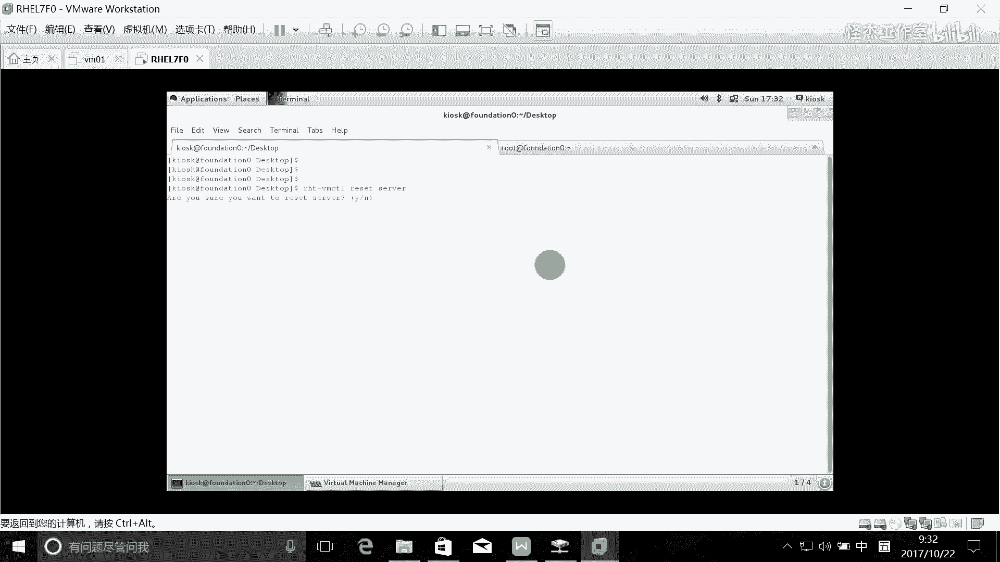
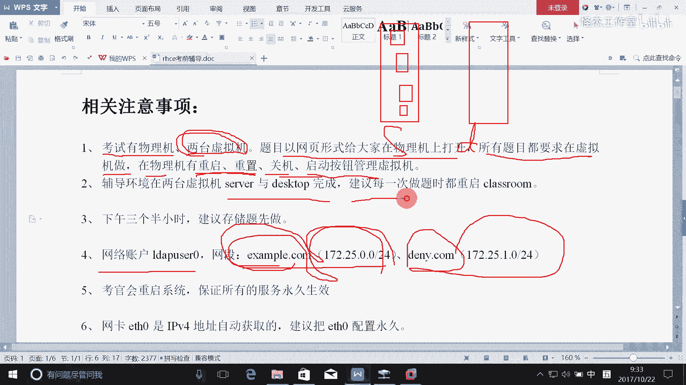
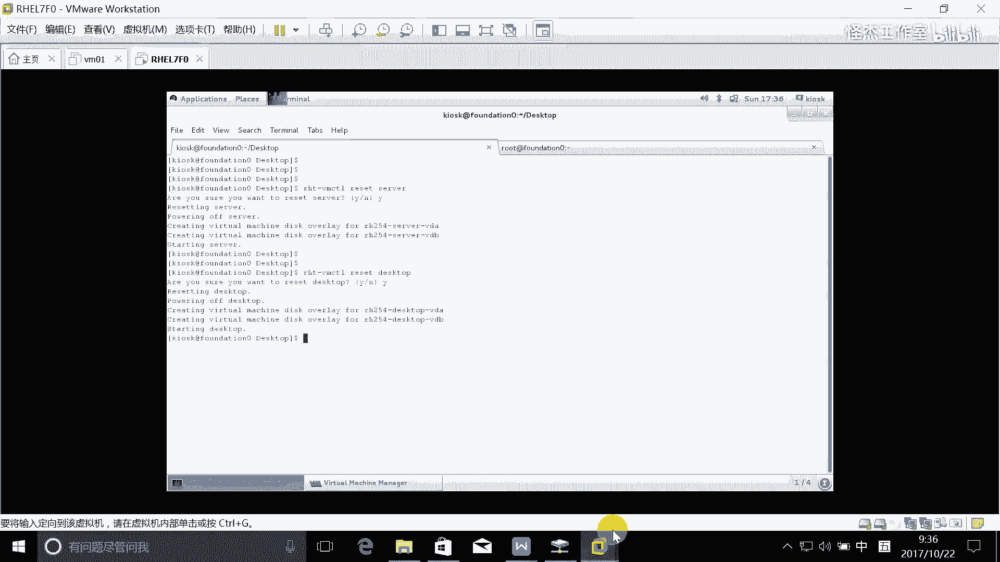
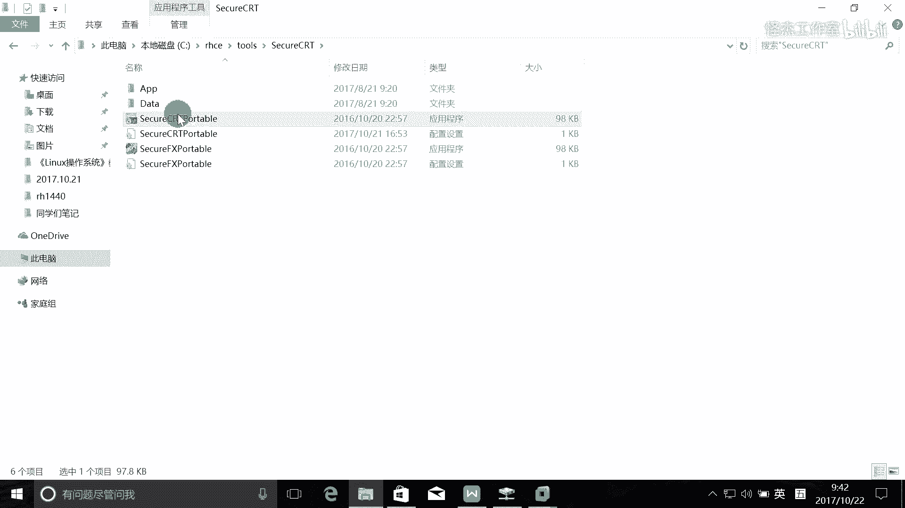
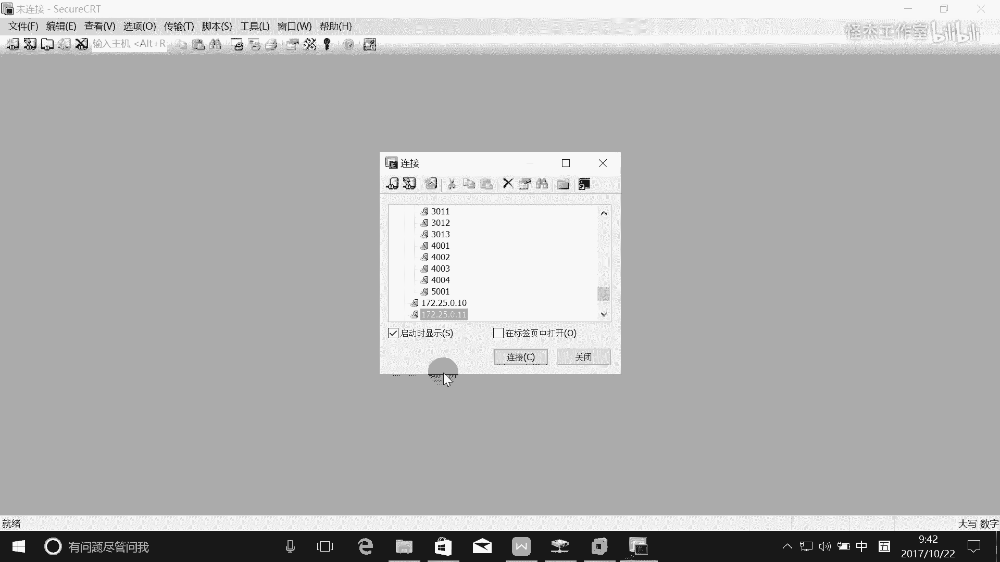
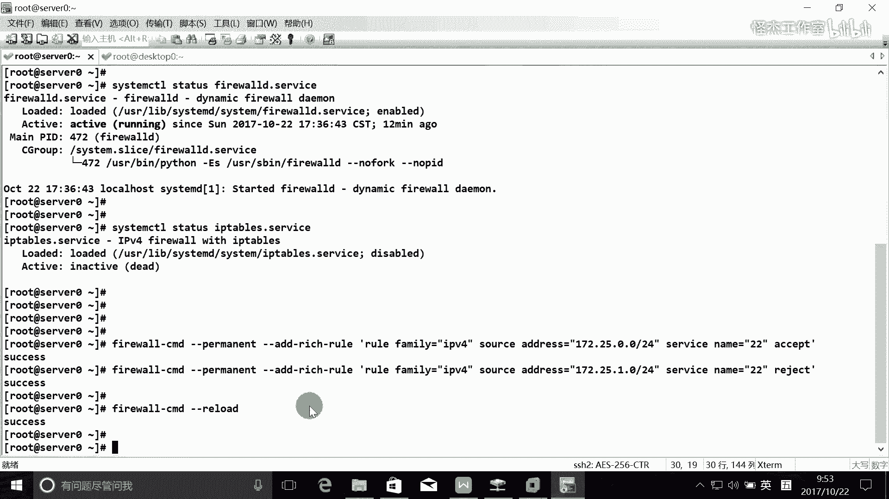
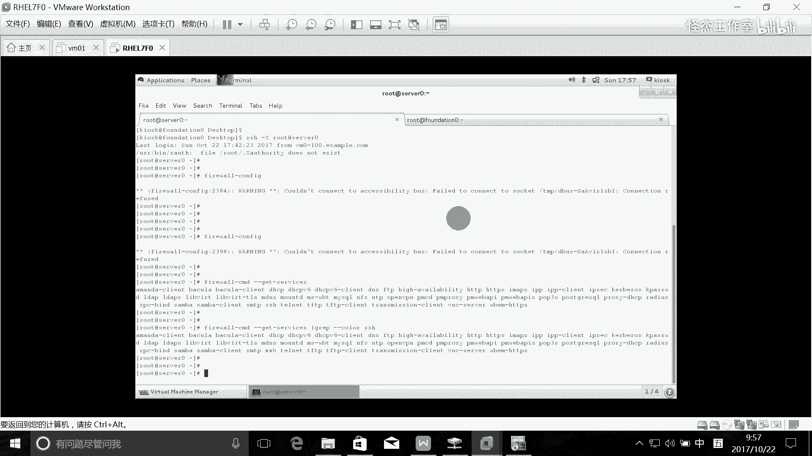
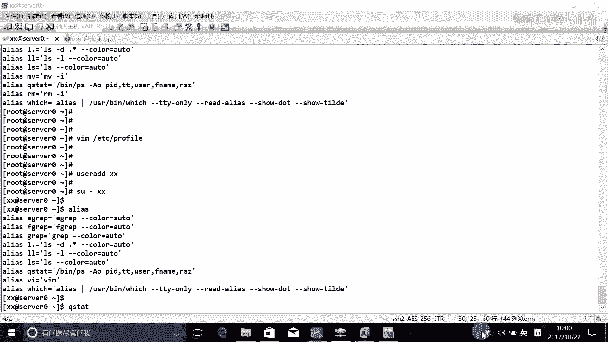

# Linux rhce认证考试视频教程 - P1：rhce_1 - 我叫怪先生 - BV1ub411p7Cs

一个是serv是吧？稍傅来个戴个top，等一下。

好，这样的啊呃那么接下来的话就是我们的这个C一的这个父亲啊。这CE的这个辅导。那么CE的话呢，这个考试啊。他相对于这个CC来讲的话呢，要复杂很多，是吧？啊，那么通常情况啊，下午考试3个半小时。

通常情况的话可能需要两个半小时才能做的完。两个半小时，大家我刚刚也把这个题目共享了，是吧？不用想了，大家也可以发现都是一些大题是吧？需要很大的工作量。所以话如果是不熟练的话，你根本就做不完啊。

不熟练的话，你三个半钟不一定都做得完。呃，一个个来解，就是把一些注意事项啊，首先也跟大家讲一下啊，那么考试时候的话，有这个物理机。啊，考是说有物理机，每个人一台物理机啊。

哇这个物理机里面的话有两台虚拟机。这个虚拟机的话呢，就是我们考试的题目的话，就在这个虚拟机里面啊，就是做题的话都做在虚拟机里面。完了这个考题的话呢，还是以网页的形式提供给大家的啊。

那么考官直接把这个考试题目帮大家打开了。啊，大家所以大家点进去完了之后里面有一个说明，大家先把这个说明先把它看一下。里面说明的话，他就会告诉你啊，root的密码是什么，是吧？下午考试不需要重置密码了。

所以的话呢他会告诉你root的密码是什么。完了的话还会告诉你啊，比如说哪些是网络账号啦，哪些网段对应的这个哪些域名对应的网段是什么是吧？

比如说example点com对应的是这个网段d点com对应的是这个网段。那考试的话都会告诉大家。所以大家先把这些信息先看一看啊，一个说明啊，一定要去看一看啊。完了之后呢。

这个呃题目的话还是要求在虚拟机里面来做。所以在物理机上面，大家不要去做其他事情，你不要把物理机的什么密码重置了。去改了，是不是啊，然后把他的IP改了，这些事情千万不要去做啊。去到物理界上面做做做的话呢。

这个很危险的啊。所以物理机上面的话呢，就是像我昨天讲的，它也会提供一个这个呃图形的一个界面给我们。里面的话呢也会有一些按钮啊，图形的按钮包括重启虚拟机的，重置虚拟机的，对虚拟机关机了。

重启在那一些按钮啊，重重置啊。重置重启啊，启动虚拟机关机啊，查看啊，这些按钮都有。啊。那他会因为有两台虚拟机嘛是吧？所以它会提供两个按钮给我们啊，比如说这边的话就是管理这个serverver的啊。

这边是管理我们的这个datop的啊，它有点有有这个两个按钮给我们是吧？啊，我们可就点这些按钮对servver来进行管理。啊，点这下按钮，对这个对这个托来进行管理啊。然后辅导环境的话呢。

我们就在serv和dato上面完成。所以建议啊每一次做题的时候都把这个class home重启一下。我刚刚已经重启了，所以接下我把这个两台把它重置一下。

还有一个是。diス스크 토啊。那么还有一个问题就是我们这个考试啊，它全部都他没有装图形界面，所以你根本就用不了里面的这些图形的工具啊。C一考试啊。

比如说配防火墙，哎呀，我习惯图形界面了。那这个时候的话不好意思。打开不了这个虚拟机的图形界面，它因为他没有装这个。没有装这个Xwind。啊，没有装，那就就说我装行不行？可以啊，那你慢慢装呗。啊。

考试不一定有这么多时间去抓啊。所以的话呢建议大家的话就是熟悉这个什么命令的配置啊，其实命令配置也不难是吧？啊，其实下午考试基本上的话都min完全可以搞定啊。好，那这里的话又讲了一个小技巧啊。

就下午考试的话，三个半小时啊，还是分数的话，还是300分是吧？昨天讲的啊，210分通过。完了，建议先做存储的题目。我们这个下午的话有一个存储的题目，就是I guys。还是这。这个东西怎说呢？啊。

这个我们在上课的时候也做过是吧？经常启动的时候出问题。好了起白怎么办？起不来的话，你排错的话可能搞半天，那我还不如建你把它重置一下算了。去做一下啊，当然的话你能够排错的话，你就排错是吧？排不了的话。

直接重置可能更快一些啊。所以在这里的话呢，大家一定要记住我讲的一些步骤，我都说了，每个题目我都会演示的是吧？都会演示。所以有些题目的话，这个步骤非常关键。比如说你像S guys的话。

它的这个elicit这一段，就是发起端，这个步骤一定非常关键是吧？如果你没有按这个步骤来做。那很有可能你的虚拟机就起不来，很有可能就登录不成功啊，发现不了它的存储是吧？啊，所以话这是这一个啊。哦好。好。

第四个刚刚已经讲了。第5个。这个昨天也讲过，就是我们的这个考官，他会帮你重启系统。所以的话你所做的施纸一定要保证什么？永久生效。啊，已经永久生下了。还有一个就是我们考试时候，我们的系统上面有三个网卡。

三个网卡。但是只配了一个网卡，就是ETH0啊。那么ETH0的话，那么这个说明里面有讲到哦，刚刚不是说了吗？考试之前有段说明大家需要去看一下是吧？说明里面也讲了，他就告诉你啊。

ETH0的IPV4D是是自动获取的。那么自动获取的话。啊，自动获取的话可能也会有一些问题是吧？所以的话呢。他也会里面也有一些建议啊，那说明里面也会建议你他说如果你需要，你可以把它改成永久的。

是吧所以我在这里我就直接建议了大家可以把直直接把这个IP改成永久配置。把它改成永久配置啊。O。所以大家先把这些说明好好去看一看啊啊，我讲到这里的话，可能可能很多东西也有一些东西没讲到是吧？

所以考试过程当中有些问题的话，你搞不懂的话，你可以直接问考官。啊，直接问他，当然的话不涉及到做题是吧，题目有问题的，这个都可以。都可以问考官啊。那么中午考就是上午的话呢，考完之后啊，上午考完之后。

那么可能。呃，就是这个时候的话大家去吃饭了是吧？吃饭之后，然后的话就在隔壁的教室稍等一下，那么不要走远了，到时候考官的话，他就会直接叫你去考试了。说他没有这个固定时间的啊。

比如说我下午2点钟考试来都这个没有没有固定时间的那考官的话，他把题目收集完了之后，然后把这个考考场的这个环境布置好了之后那这个时候的话，你可能就要他可能就会教你考试了啊。

那可能是两点半也可能是2点50啊，也可能是1点50很难说的啊，所以的话不要走远了啊，然后下午考试的话，可能时间比较长啊，如果是上洗手间这些东西的话，都是允许的。你可以问问考官啊，一般的话。

他也会给你去的。啊，如果是饿了的话，吃点东西也也可以的啊。这个这个这你这这个不像这个不像这个国内的这些考试很严肃是吧？这个考试的话呢，这个考试的话，只要你是自己完成的都没问题。O。啊。

接下来的话我们就一个题目一个题目来讲啊。那么这个下午考试的话，这个题目题量确实是蛮大的。我这里有22个题目，大概的话考试的话大概就是20个题目左右。20个题目左右啊。嗯，一个来讲吧，今天的话争取。

今天的话争取把这个讲到十1题，好吧。总共22嘛，今天讲一半啊，下周讲一半。今天的话大家一定把这一半总结好啊，这一半今天你还不一定能够。你还不一定能够做得完是吧？比如说你像这个an face的话。

这个题目的话你。估计要发一个来小时吧，对吧？啊。是吧你像三0的题目，我估计你也发个来小时吧，把它做完总结完差不多啊。是吧像这些题目的话，估计你还是要花点时间啊。花点时间下行啊。好，是这样的。

首先第一题啊就是配置Slinux是吧？그죠 에스 에스이였어。这个这个的话呢，其实上午也有要求是吧？这个的话。我们再回顾一下吧啊，这个东西怎么来做，好吧。我远程登录过去啊。

哎。192068。20。96。嗯。OK好。😊，反正就是字符全部都通过命令的方式来做，是吧？啊，都是通命令的方式来实现啊啊，DT配S6是吧？这个两台就是你考试的时候一定要看清楚啊，这是要求两台都要做。

你看到吗？两台都要做的，所以两台都要做的话，你两台都去做是吧？这个的话昨天已经讲过了是吧？昨天已经讲过了啊，就是要配一个永久配置的话，就是要配这个文件是吧？把这个改成inforcing。啊。

然后的话把当前设置也把它设成什么？也把它设成一，是不是也把它设成一啊。哦，呢个。你这个东。啊，大家V你C的时候一定要注意是吧？あさて。是。VC的时候一定要注意点这个选项。输入这里的话禁用所有的输入是吧？

完了杂项这里的话就是什么共享连接啊，大家每次进来的话都都这样啊，不要再提，就每每段一次你都要去勾一下。如果你保存了的话，可能就有是吧？没保存的话，就一定要去选一下，不然的话就把别人全部踢出来。

这还是有人没做。每一次进去都要使都要都要点一下，好吧。🎼每次进去啊输入禁用所有的输入砸向共享连接。接게第就。对，不然你就把别人踢出来了。他这个的话还是是。哎，我我其实我是有设置的。

但是的话这个不知道是什么意思啊。我我是我其实我是有设置的，就是本来是设置不给接那人权限的，但是实际上人家又还有。对。不。点不到那个。あ。安全用户和权限。允许查看桌面里。🎼，后面的喷噪音。嗯。

应该大家进来的时候，应该是一个什么用户啊？V右手是不是呃desable标准用户？可以编辑啊，可以选择一个。如何权限应该是。你把这个要设置一下是吧？🎼这里没有啊，全剧的全新。标准用户应该是这一个，是不是？

在这个地方怎么怎么选呢？这里现在都是都是黑色的，你看到吗？估计是的。是不是我停止搜纹之后，停止了之后才能去编辑是吧啊，我等一下去试一下啊，等一下再我应该是有有配置的。啊，行先这样先吧啊。好。

S6要手这个的话就。就很简单的啊，这个的话就是44。对，就是我们现在这个学习的环境的话就是inforcing，但是考试不一定啊。是啊，考试是不一定的，所以你一定要去看一看。好，第二个。第二个的话就是。

就是配置SSH的访问。那么。用户能够从这个域内的客户端通过SS去远程访问你的两个系统啊，但是从这个域的A的客户端不能访问你的两个虚拟机系统。那这个的话用什么东西来实现呢？

那这个的话这个肯定就是考虑防火墙嘛，是不是啊？好，防火墙啊，那防火墙怎么来实现？记住啊是两个虚拟机系统啊。两个虚拟机系统，所以在两台虚拟机上面都要配是吧？所以这个工作量是不是就大了？他这个房。怎么测试？

啊。我们这里测试是我们这个学习环境就不太好测试啊。考试时候的话，他会给一台机给你去测试的。啊。他会给一台机给你去测试，他就告诉你哪一台机是专门是用来测试的，所以你就登录到这台电脑上面去测试就行了啊。

我们这里的话呢就不太好测试，大家只知道知道做就行了啊。好，那么这个的话是一个考什么东西啊？对，考的就是防火墙的负规则是吧？防火墙的负规则啊，这个大家一看就知道啊，那么防火墙附规则你会写吗？

这个我上课的时候已经跟他家讲过了是吧，我们最好去可以去什么。慢一下。叫做fin word是吧？这是为什么？这什么事啊？没有生成。对，没有生成慢DB啊，所以话呢最好是考试时候的话，你也可以去试一下。

因为这个有时候的话忘记了的话，那你就必须要去。必须要去寻求帮助是吧？那我们现在的话我我也只教大家一种方法，考试时候实在忘记了的话呢，你可以去慢一下，是吧？我们就写负规则了是吧？

那么我们防伪我们在讲我们讲这个红包漆的防火墙的时候，我们讲红包漆的防火墙的话呢，默认用的就是f word啊，是不是？你看它是ella，是running的，是吧？

那么那么之前的这个IP tables还能用吗？也是可以用的，是不是啊？那么现在那么这个IP table状态是什么呢？你定要去看一下是deszeb的，看到没有？是inactive的。没有启动啊。

他们是冲突的，对不对？你这两个你只能用一个。你只能用一个，那我们现在红包机里面学的是这一个，所以我们就所以我们现在的话就用了这个啊。用的是这个防火墙啊。fin word啊把这个启动起来。

一定要enlabel啊，并且是running的。好。看一下有没有生成啊。啊，生成完了之后，我们再卖呃哦，不好意思不好意思不意思。怎么回事？好，OK你看啊这里的话具有副规则的这个什么。

就这个副杯子就这个慢手册是吧？慢一下。这个考试这个这个这个上课时候就我就已经重点跟大家介绍了，是吧？我们配的我们配的的话，我们在这里的话就是永久生效是吧？I的叫什么rirur是吧？

安 rich rule，你这个规则怎么写啊？这里面能按table键吗？是安不了的，是不是？😡，安不了的。所以我们在这个里面的东西的话，只能手去写。首先我们用的是IPV几啊。对，IPV4哼。

我不是复制的吗？粘贴为引用。粘贴。诶嘿。😊，我刚刚站贴。啊。复制啊。我们用的是IPV4是吧？ruler family啊，这是第一个。第二个。就是配什么source A，对吧？所说就是。

那么一个是允许访问，一个是不允许访问，允许访问的这个是什么？这个是是。对，就是example点com，对不对？你个真不听啊，这能写这这这个地方能不能写域名啊？啊，能不能写域名？

域名的话最终是不是都要解析成网段啊？都解切成网段了。所以呢我们这里的话最好是就是直接写这一个。啊，直接写这一个。就是考试时候，他会告诉你一个zpo点com所对应的网端是什么？啊，所对应的网段是什么啊？

所以我们在这里的话就写172。25。0。0啊这个网段。那么这个网段。这个网段啊能够这个网段的云。能够通过SCC去防你两个虚拟虚拟机系统是吧？然后接下来写什么东西啊，它是能够进行SCC取是不是啊？

所以接下来写什么东西啊？接下来的话就是写什么service，对不对？或者什么东西啊？service的话，你一定要保证什么？你一定要保证有这个service才行。

所以的话有没有这个service可以通过这条命令去查一下，get service，对不对？嗯，所以接下来的话就是这个四位数的话等于多少？数位数量不等于。22端口是吧？要写这个。要写这个写要写这个段。

要写什么类型的吗？TCPUDP要需要写吗？不需要写吧。不需要写他。阿短口。完了之后他的动作是什么？😡，Excceptable。那，那这样就添加好了，看到吗？哎，哎，我们直接复制这一条就行了，是吧。

哪一个网段不行啊？dy点com是不行的是吧？所以我们找到dcan deny点com是对应的网站。假如这是d点com所以的网段。啊，完了之后，这里的话是。这里动作的话有两个，一个是jo。

一个是reject是吧？那么建议大家写来。reg啊，因为real的话，它会返回1个ICMP的。消息是吧，怎么让他们马上生效？relo一下是吧。把这个永久配置加载成现在的这种配置啊。

reload一下就行了。好了，这就是我们的两条就写完了，很难吗？合否费。so可以啊，15厘你可以写端口啊。

当然可以了，就是没有这个service的话，比如说你看我们在配那个图形界面的时候，有个service，有个port，是不是啊？那没有service的时候，你就只能配porter。对不对？

那我们的service我们有哪些service啊，你可以通过什么东西啊？ge service你去查一下，这就是我们的系统里面service。你看有没有SS取，哎，是叫SS取吗？啊，不好意思不好意思。

G瑞。有没有S色是水？他他他他全部显示出来。刚刚卡lo吧，我这里的这个上面好像不能用卡lo啊。这上面collo也没用，对不对？所以这个这个远程过去还是有还是不太好啊。呃，就是。翻 work。CMD。

Ger。呃，这个上面没没起防火墙，所以他你他有按他建议没有没用啊。加个X吧。Root， slowlyly。你看这个上面的话呃呃，图形界面里面其实也是有的。你看这里的话有service，有port。

是不是？那么它不是所有的service里面都有啊，是吧？比如说我微博服务修改了个端口，那你那你你觉得你选这个HTTP可以吗？比如说本来是这个HTTP对应的是80端口，对不对？那我现在把它。

那我现在把这个微博服务器端口改成了8080，那你点这个service，你点这个HTP有用吗？那肯定没用的，那这个时候肯定要写什么portest为什么？因为在这里的话。

他认为service这个HTP就是80端，我们也可以在这里定义service，你看到吗？比如说我们定义的HTTP就是80TCP的80，看到没有？你可以定义啊。啊，你在这里你也可以定义的啊。

但是你定义的话，一定要改promoment，这时候才可以定义id，你看到吗？才可以去添加这个service。你可以对它进行编辑是吧？比如说你我这个时候我并不是80端口了，我改成8080也行，是吧？

这图形界面很好操作，但是考试的话用不了图形界面。所以只能用这个什么字符界面是吧？所以在这里的话写图形的呃写这个。然后SS学是他的他他的这个名字是什么？谁是4区D还是S4曲？AC是吧，ACH啊。

你可以通过在这里找一下，就fin wordCMD gate。service是吧，你看。加个卡罗嘛。Gpe。谁。卡lo叫SSH。是不是有啊？

啊，要。O。啊，这就是第二题啊。配置S去访问。好，讲一下第三题啊，那么第三题的话是自定义用户环境。那么这个的话是我们讲那个脚本编程的时候讲的啊。就是我们这里要创建一个ors，对吧？就是。

创建这个words这个别名的话叫做Q state。完了执行完这个别名之后，它将会执行这个指令，是吧？此命令对系统中所有的用户都生效。那么所有用户都生效的话，那你想一下是不是必须要写到这个启动脚步里面。

启动加布里面啊。那么这也是要求在两个系统上面都来做。所以考试的时候你一定要看清楚啊，两个系统上面都来做。好，那么呃这个是Q state是吧？我6笑斯。Q是 state。啊，我们先执行这条命令吧。

冰下载PS是吧，杠AO。那么他是按A，就是所有的吧，然后的话按O的话就是格式。啊，要执行什么执行什么用酷的不进城的ID号了，是吧？啊，用户了什么这些啊啊，就是内存的是吧？

那他就就会得到这样的一个结果啊得这个结果。然后我们现在的话呢。🎼然后我们现在的话是把这一条命令很难写是吧？所以我们在这里的话，我们可以定一个别名，用cus state。等于它就行了。那么这个时候的话。

你可以查一下，这时候的话，这里面的话就有一个什么。这个Q state是吧？完了当你执行Qs state的时候，那么其实是不是就执行了这条命令啊？就之前质辆给你。啊，所以为什么有这个效果呢？

因为就是我们在这里创建了一个别名啊，叫Q state等于这条指令。那么但是我就是有个问题是什么呢？就是我这样一写的话，只是一个什么生效？临时生效，而且的话它只针对于什么当前的用户。

那我现在想要针对所有物怎么办？对，写到启动脚本里面。我们是不是在有一就是讲脚本编程的时候，讲到的这个启动脚本啊，我们可以写到什么？E定C下的B是2C口味。profi你面可不可以？都可以是吧？

profi也可以是吧？那么写了proified之后，你重启啊，比如说我写到最后啊，你重启系统，一定要去测试一下，看有没有好不好。啊，一定就是他是让所有的用户都有都都会生效的嘛，是吧？啊，我写在这里面。

我现在创建一个用户，我看一下他生不生效啊。又是矮的，比如说穿了个叉叉，7婚的叉叉。オ利斯。有没有扣水的？有没有有就说明成功了。哎，为什么呢？因为这个用户在进行登录的时候啊，这里面一定要加上减号，是不是？

在进行登录的时候，他就会执行这些启动脚本啊，首先执行这一个是吧，完了再执行哪一些，对不对？这个书上面都有详细的介绍啊，这个我就不啰嗦了啊，自己可以把书看一看。啊，这个是我们上课的时候也讲过了啊。

OK好了，这就是这一个题目啊。好，那么是这样的啊，先先讲这么多吧，大家接下来是。

