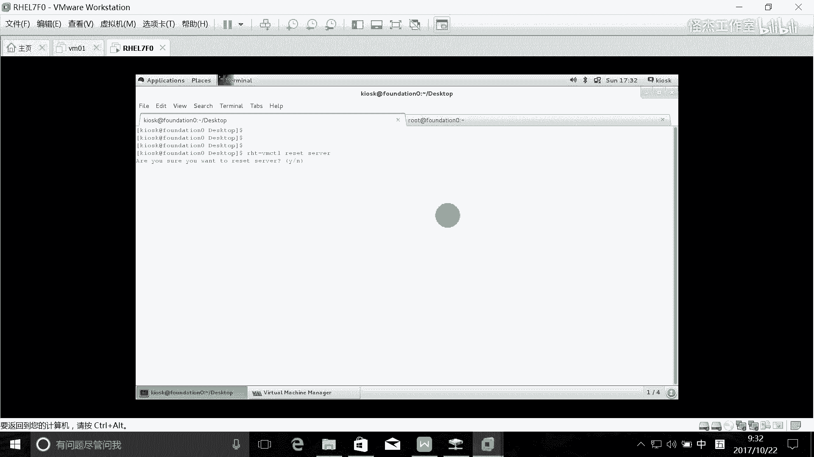
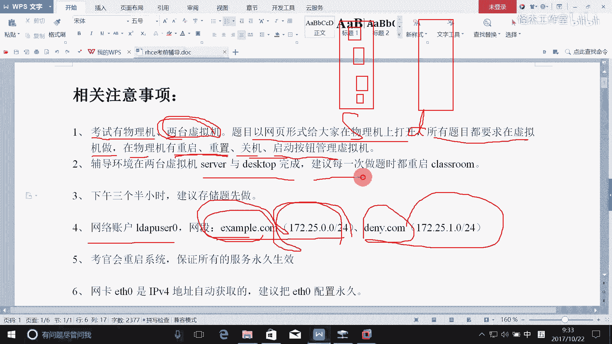
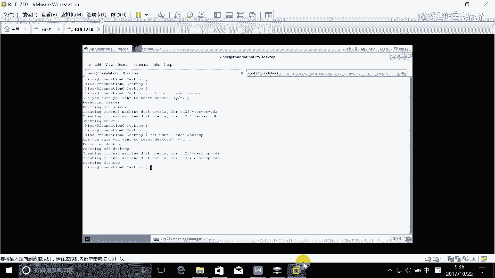
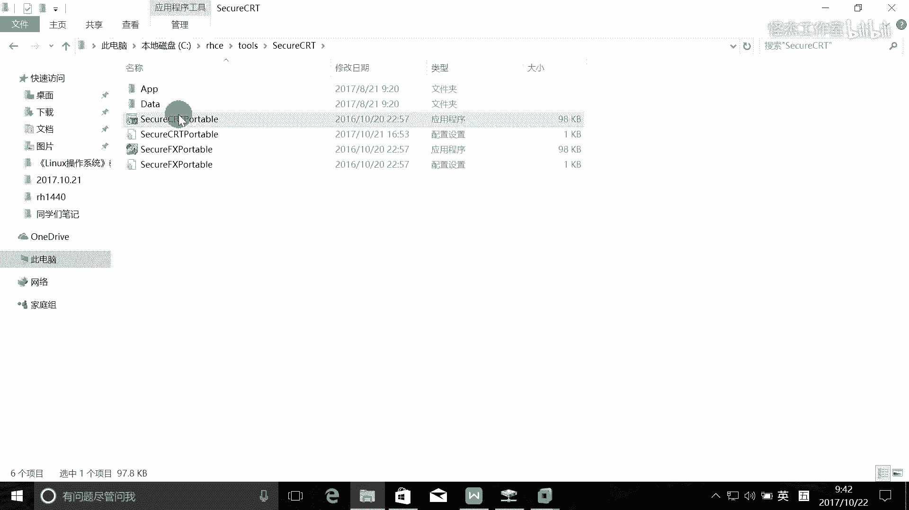
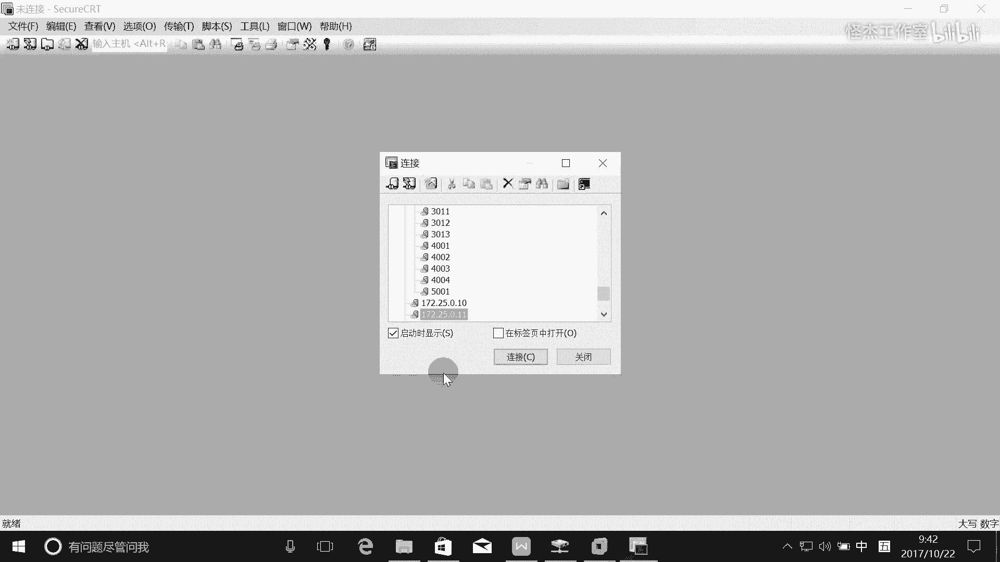
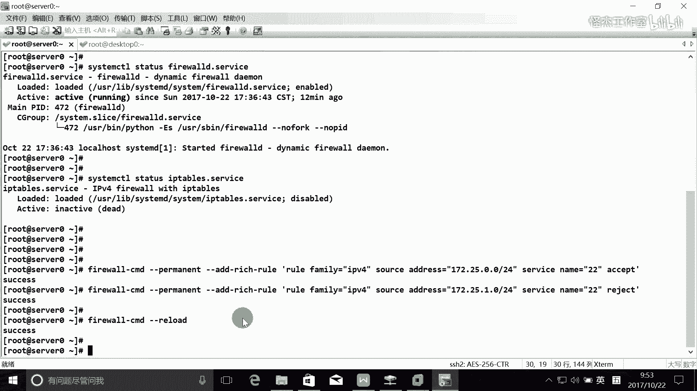
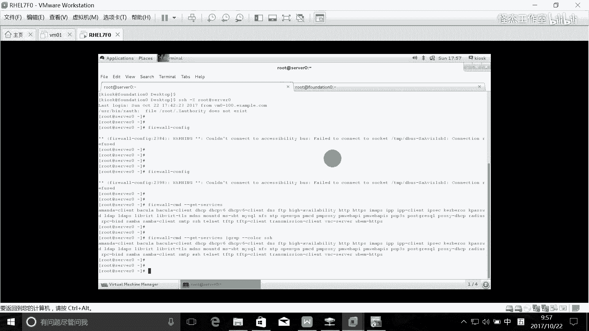
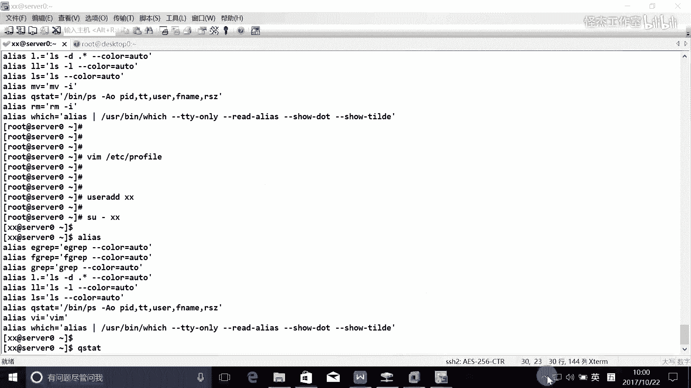

# Linux RHCE认证考试视频教程 - P1：RHCE_1



在本节课中，我们将要学习RHCE考试（下午场）的总体环境、注意事项以及前三个题目的详细操作步骤。课程内容基于实际考试要求，旨在帮助初学者理解和掌握核心考点。

## 概述

RHCE下午考试时长为3.5小时，通常需要2.5小时才能完成。考试题目以网页形式提供，考生需要在两台虚拟机（servera和desktopb）上完成所有操作。考试环境为纯命令行界面，要求考生熟练掌握命令配置。



---



## 考试环境与注意事项

上一节我们介绍了考试的总体情况，本节中我们来看看具体的考试环境和必须注意的事项。

考试时，每位考生使用一台物理机，物理机内运行两台虚拟机（servera和desktopb）。所有考题操作都在这两台虚拟机内完成。

以下是考试环境的关键点：
*   **考题形式**：考题以网页形式提供，考官会提前打开。考生务必先仔细阅读说明部分，其中包含root密码、网络账号、域名对应网段等重要信息。
*   **操作范围**：所有操作均在虚拟机内进行。**严禁**在物理机上修改密码、IP地址等配置。
*   **管理界面**：物理机图形界面提供管理虚拟机的按钮（如重启、重置、开关机），分别用于管理servera和desktopb。
*   **无图形界面**：考试虚拟机**没有安装**图形界面（X Window），因此所有配置必须通过命令行完成。
*   **系统重启**：考官可能会重启系统，因此所有配置必须保证**永久生效**。
*   **网络配置**：考试系统有三个网卡，但通常只配置了eth0。考题说明会指出eth0为DHCP获取IP，建议考生根据说明将其改为永久静态配置。
*   **寻求帮助**：考试过程中如遇非题目相关的问题，可以询问考官。

---

## 题目详解：配置SELinux

在熟悉了考试环境后，我们开始解答具体题目。第一题是关于SELinux的配置。



题目要求将两台虚拟机的SELinux模式设置为**enforcing**。这需要在两台机器上分别操作。



实现此目标需要修改两个地方：
1.  修改配置文件 `/etc/selinux/config`，将 `SELINUX=` 的值改为 `enforcing`。
2.  使用 `setenforce 1` 命令将当前运行模式也切换为 `enforcing`。

**操作步骤如下：**
1.  编辑SELinux配置文件：
    ```bash
    vi /etc/selinux/config
    ```
2.  找到 `SELINUX=` 行，将其值修改为 `enforcing`。
3.  保存并退出编辑器。
4.  执行命令立即生效：
    ```bash
    setenforce 1
    ```
5.  使用 `getenforce` 命令验证当前模式是否为 **Enforcing**。

> **注意**：考试时需根据题目要求确认初始状态，并按上述步骤在 **servera** 和 **desktopb** 上均执行一遍。

---

## 题目详解：配置SSH访问

上一节我们配置了SELinux，本节中我们来看看如何通过防火墙控制SSH访问。

题目要求允许来自 `example.com` 域的客户端通过SSH访问两台虚拟机，但拒绝来自 `desktop.com` 域的客户端访问。这需要通过防火墙的富规则（rich rule）来实现。

防火墙富规则可以基于源地址、目标地址、端口、协议等条件设置复杂的访问控制。我们使用 `firewalld` 进行配置。

**操作步骤如下：**
1.  确保 `firewalld` 服务已启用并运行：
    ```bash
    systemctl enable --now firewalld
    ```
2.  添加允许 `example.com` 网段（例如 `172.25.0.0/24`）访问SSH服务的富规则：
    ```bash
    firewall-cmd --permanent --add-rich-rule='rule family="ipv4" source address="172.25.0.0/24" service name="ssh" accept'
    ```
3.  添加拒绝 `desktop.com` 网段（例如 `172.25.1.0/24`）访问SSH服务的富规则（建议使用 `reject` 以返回拒绝信息）：
    ```bash
    firewall-cmd --permanent --add-rich-rule='rule family="ipv4" source address="172.25.1.0/24" service name="ssh" reject'
    ```
4.  重新加载防火墙配置使其生效：
    ```bash
    firewall-cmd --reload
    ```
5.  可以使用 `firewall-cmd --list-all` 查看已添加的规则。

> **提示**：若忘记富规则语法，可使用 `man firewalld.richlanguage` 命令查看手册。考试时会提供测试机用于验证规则是否生效。

---

## 题目详解：自定义用户环境



接下来我们学习如何为所有用户创建全局的命令别名，这是第三题的内容。

题目要求创建一个名为 `qstat` 的别名，执行该别名时，实际运行命令 `ps -Ao pid,tt,user,fname,rsz`。此别名需对**所有用户**生效。

为实现全局生效，需要将别名定义写入系统级的shell初始化配置文件中。

**操作步骤如下：**
1.  编辑全局配置文件 `/etc/bashrc`（或 `/etc/profile`）：
    ```bash
    vi /etc/bashrc
    ```
2.  在文件末尾添加别名定义：
    ```bash
    alias qstat='ps -Ao pid,tt,user,fname,rsz'
    ```
3.  保存并退出编辑器。
4.  为使当前会话立即生效，可以执行：
    ```bash
    source /etc/bashrc
    ```
5.  测试别名是否生效：
    ```bash
    qstat
    ```
6.  为了彻底验证对所有用户生效，可以创建一个新用户并切换测试：
    ```bash
    useradd testuser
    su - testuser
    qstat # 应能正常执行
    ```



> **注意**：考试要求在两台虚拟机上都进行此配置。配置完成后，重启系统或新建用户登录测试是验证全局生效的好方法。

---

## 总结

本节课中我们一起学习了RHCE下午考试的基本环境和前三道题目的解决方案。
1.  我们了解了考试的物理环境、虚拟机操作方式以及重要的注意事项。
2.  我们掌握了配置SELinux为强制模式的方法。
3.  我们学习了使用 `firewalld` 富规则基于源地址控制SSH服务访问。
4.  我们实践了通过编辑全局配置文件为所有用户创建命令别名。



这些题目涵盖了系统安全、网络服务和用户环境等基础而重要的知识点，是RHCE考试的典型代表。请务必在实验环境中反复练习，确保熟练操作。