# Linux rhce认证考试视频教程 - P2：rhce_2 - 我叫怪先生 - BV1ub411p7Cs

好，接下第四题啊。第四题的话是配置端口转发是吧，在系统450配置端口转化要求如下，在。能访问450本地端口的5423将被转发到80啊，此事是必须永久生效。永久生效啊，那这个的话用什么东西啊？

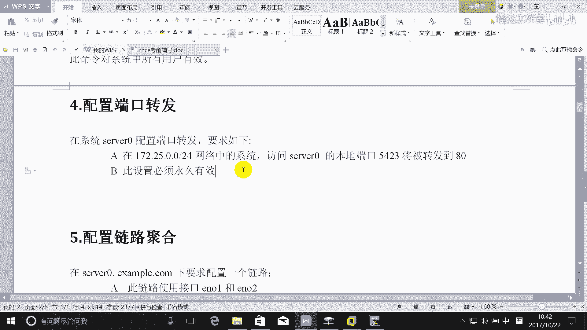

防火墙的。

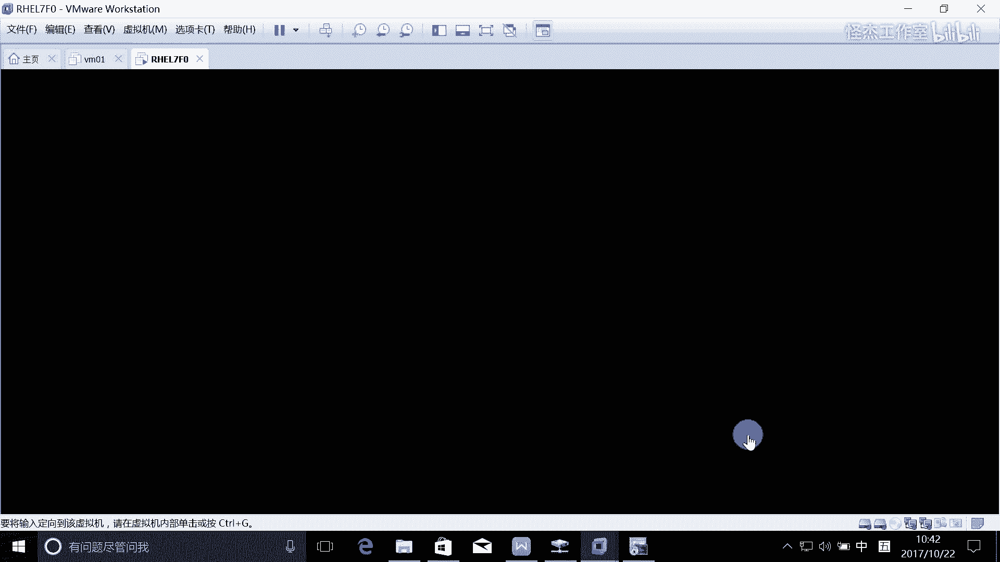

端口转发能搞定吗？欢我。空费了，但他原来的那张。端口转化在这里是吧？就是我们。发一个。对，就是把什么圆圆的话，它房圆的5423是吧，就转化到什么本地的什么。80转口是这意思吧？啊。

那那这个图形界面就这样配是吧？是这样配的吗？那么但是他要求什么？在这个网络系统啊，那不是其他的网络系统。

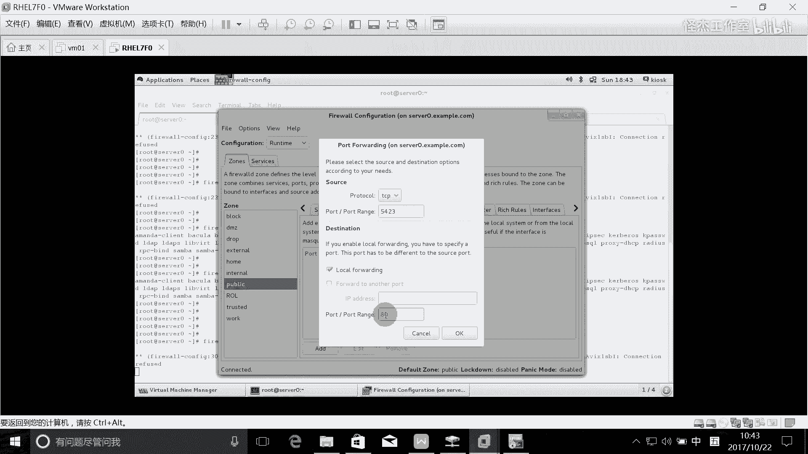

那么其他的网络系统可能还是访80端口，对吧？是不是这样子啊？那这个怎么能实现呢？

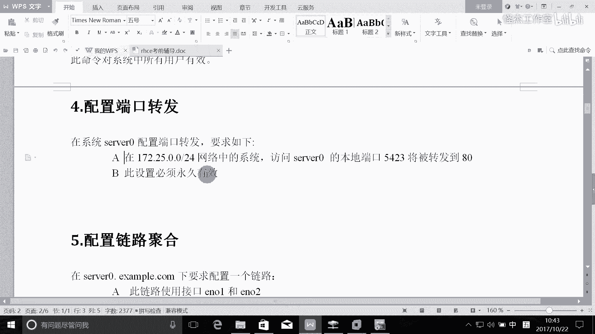

这个的话呢还是这个还是实现不了的。这个还是用什么方法呢？啊这种富规则。会不会是爱的。IPV4是吧。完了这里的话呢，选择。啊，不是。啊，不是。不是选service，选端口转发。选这个啊，这里才能写圆。

你看到吗？这语是可以写的吧。没客气了，管这一切从哪里到哪里是吧？5423转了什么？巴黎。刚80是吧，我还在这里再写圆。圆的话就是我们的什么。一个zeer点com这个月是吧，0。024。🎼就这样了啊。

这是图形经分的配置。刚讲了，我们考试是考图形吗？没有是吧，所以的话这个命令函怎么来写啊，命令函怎么来写，我们看一下啊。

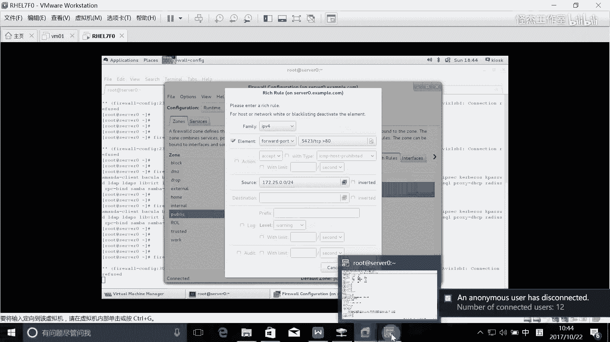

我写下命令航的方法。🎼fire沃CD是吧？我们我们这样吧，我们先把这个微博安装一下，好不好？🎼Yeah。然后再启动是吧，restar HHTTPD是吧？那么现在的话它启动之后，他所制定的端口是什么？

对他针的是80端口是吧？我看这个吧。HTTPD是吧？今正在80端口上面是吧？完了之后，我们在这边，但是我们要求在这边访问的时候，并不是去访问那个80端口。有是区房的是吧？5423。啊。

那么他去访问设我的5423，设我上面有一个什么有个防火墙，是不是啊？那么经过防火墙的话，就把这个5423把它转成了什么？80端口对不对？所以这个时候的话才能够访问到我们servver这台服务器的什么。

服器的这个什么80状，所以它要经过这个防火墙啊，它才会做这个转换，是这个意思吧？那本机房的时候，他会经过房火墙吗？在这个上面，他他他会经供防火下吗？不会的是吧。他在这个上面的话，他是不会经过。啊。

直接访问他的测试页是吧，这是它的一个测试页。테스트 페 아。直接防子的测试一来的。呃，我们给他创进的首页吧。太大了啊。比说这是一端口的这个。forward一个测试啊，首页在哪里啊？

哇3WHTM indexdex点HTM了是吧？啊，那么这个时候的话访问本机的话肯定是不经过防火墙的，所以直接可以防问到，对吧？那么在这边的话，能否通过5423端口，现在能访得到吗？找不到为什么。

防火墙现在没配置好是吧？好，防火墙怎么来配？firework SD刚刚讲了一定要加上这一句是吧？I的 rich ruler是吧？那么的read我们的这个副规则怎么写？这样的我们还是打开这个帮助。首先。

我们的这个。还是1个IPV4的地址是吧？Rler family。IPV4。这是第一个啊。接下来就是什么？是要写原地址是吧？说是A。啊，缩 just我们的缩 just是什么？19，不是172。25。0。

0一个珍点com嘛是吧？完了之后原地就写好，接下来的话我们就是要做什么？你就是要做。端口转发是不是把这个写上去啊？复制一下。粘地一下，那我们就把这个写。把这个改一下啊。首先转化的这个端口是什么？

首先我们的这个端口是什么？是5423端口是吧？完了协议是什么协议？TCP那么转发到哪个端口上去？转发到本金的什么？对，转化到本机端80是本地的转化，并不是转化到另外一台主机是吧？所以这个图耳觉要吗？

🎼就不要了啊，这个to hS就不要了。没见就做完了。回事。哎，你就写完了，写完之后。把这个发货钱重载一下是吧？🎼重载一下之后，你。lister我查一下，你看是不是就有了。啊。IPV4云是这一个。

去访问我的5423端目的时候，我就会做一个什么。端口转发把它转发到80端口是吧？OK我们在这边访问一下，看能不能访问到。能好到吧。こか。跟那个有关系吗？没有关系的嗯，写错了，这是serv。

是不是就可以了？OK经过防火墙之后，他就把5423转正转转正什么了？转入80呢就可以访问到了。哎。这就这个题嘛。啊。接下来的话呢接下来我们讲一下这个链路聚合啊，链路聚合的话呢。

链度聚口的话是我们在这个450这个上面要配考试之后的话，可能两台都要做啊，在这里做一台。呃，我们这里现在考试时有三个网卡是吧？但是我们这个使用环境的话，我们现在只有什么？我们只有一个网卡。

就是ETH0了是吧？这一切是。所以的话我们在这里的话呢，我们在做这个实验的时候，我们还是执行这个脚本吧lab。呃，叫t。bridge seat up执行这条命令之后，其实就产生两个网卡。

多两个网卡e牛一和e牛2啊，那考试不用担心啊，他这个肯定都帮你准备好了啊，我们这房间没有啊。完了呢就是此链路在一个接口失败时仍然可以工作啊，那么这使用的是研牛一和研O2啊，就把这两个网卡绑定起来是吧。

进行组队。就是一个接口失败师仍然可以工作。那这个是一个什么？对，这个是一个主备是吧？active backupup是吧？s路在40上使用下面的地址啊，完了之后sin路在系统重启之后，仍然保持正常的状态。

所以大家每次做题的话，一定要去重启一下是吧？比如说你像那个Q state，你重启之后，你去测试一下，你还对不对？是吧一定要去重启一下测试一下。好，接下来的话那这个题目的话。

我在上课的时候讲了一种方法是吧？我们有。有个模板啊有模板是吧，就是。通过这条命令去得到这个模板。这模板在这个里面啊。在这个里面。是吧我们把它扩制过去啊，一个是ETHE啊。

汇别到ETC6公分的nwork scripts下面是吧？但是我们要改个名字，它现在叫ENN。研牛一和研牛2是不是？改个名字。完了之后。还有我们的这个team这个网卡是吧？C是空飞的。

Nterwork script。他们那我们就把这什么？听不灵是吧？好。好，我们再进这个目录，然后对这个几个网卡做一个修改啊。首先。呃，我们来编辑一下这个物理网卡是吧，这个物理网卡叫ENOE吧。

身份名叫什么？ENOE对不对？我们还给他取一个。连连接名是吧？那么比如说他也叫。ENOE好吧，完了它的这个系统启动的时候要不要启动它？他的这个master叫什么？🎼对它的这个逻辑网卡叫team0啊。

这样就OK了。好，完了之后，C就是再生成一份EO一。再生成1个ENOR完之后对这个ENO2做一个修改。啊，那么他的这个设备名叫EL2，连接名也叫122，是不是可以啊？这是第二个。

那么第三个就是对这个逻辑的网卡叫team零，也要做一个设置是吧？那我们的这个生名字叫什么？对，就叫team0啊，完了系统启动的时候被启动它肯定要启动是吧？那么的IP考试的时候要求是什么就什么是吧？有0。

比如说0。100。0。11，好吧。好，完了之后它并不是轮巡是吧？轮巡的话要求两边都要配置轮巡才行啊，就是必须要交换机也支持才行，是吧？我们这里的话没有交换机。

所以我们在我们在这里就用active backup就可以了。这就可以去成功了。成功之后。要怎么做？哪里写错了？Yes。re start啊，第一四哎诶这次启动是不是成功了？不是哦。

不好意思不好意思不好意思啊，不好。没意子，我写错了啊。lateterwork，我以为每次启动都是败的是吧？我说这次成功了，这么奇怪啊。对呀。对他第二次才会成功是吧？这个我们已经做了很多次实验了，对不对？

好，完了之后，我怎么查看他成功呢？哎，你看哎。第三次失败了，没写过3次。啊。

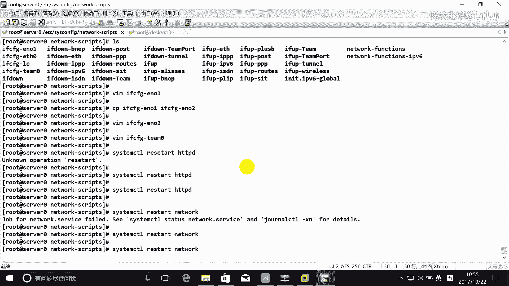

哇。解的。

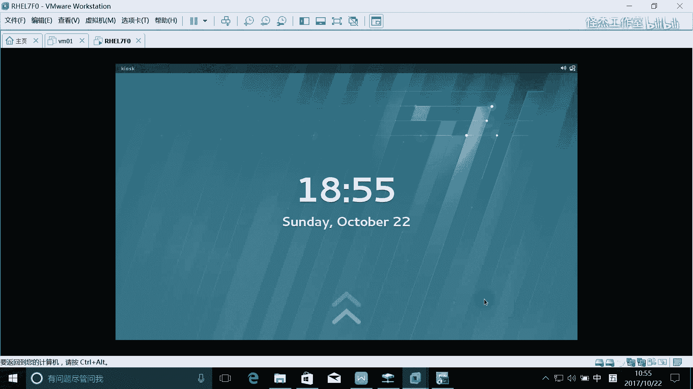

嗯。

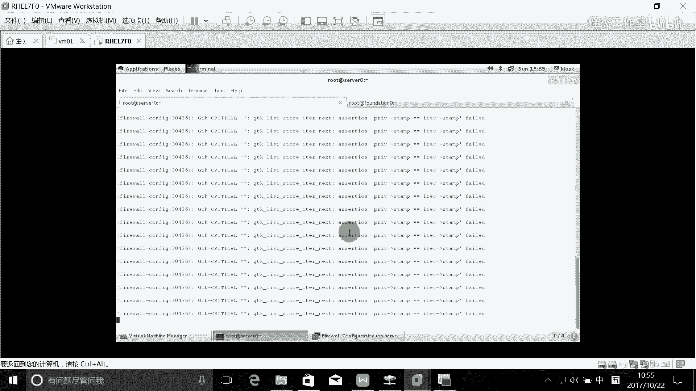

到了。

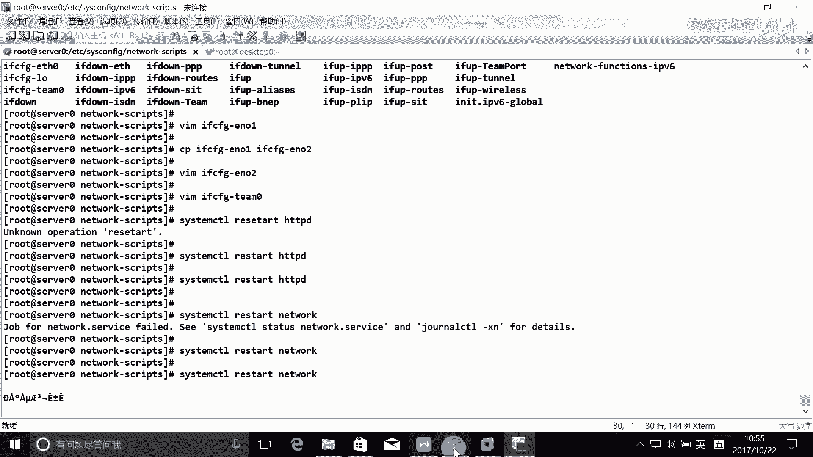

断了啊断了的话，那就只能够进去改了，是吧？

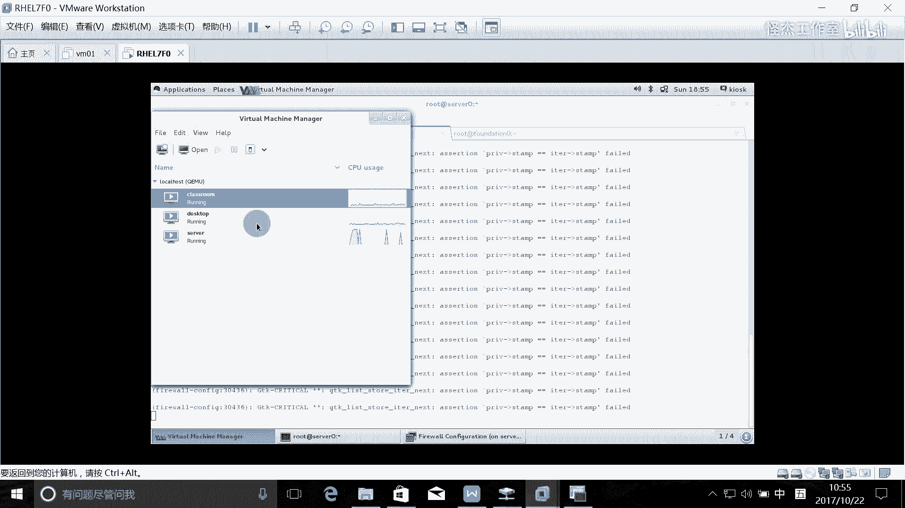

进去设置啊。因平常的话，第二次是可以的啊，第三次就没去试过他了啊。我这是有点无聊啊。那就只能到这里面去改，反正考试的话也是可以打开这个界面的，是吧？所以呢考试时候的话，你可以到这个里面去改啊。

就直接到这个虚拟题里面去改。

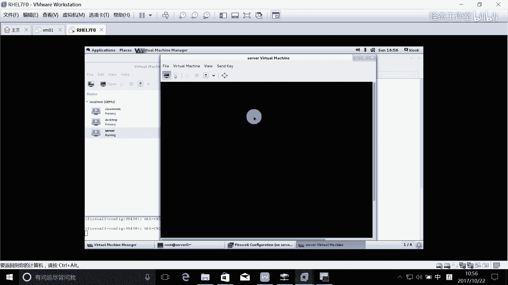

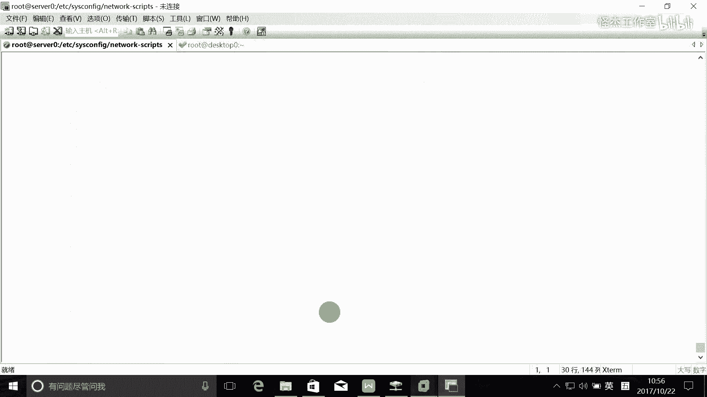

不用手多。老师多了个手啊。哎，这进的进不来了。哎，可以了。我们看一下这个问题在哪里啊。就之前我们讲的，就是大家一定要注意，就是每做一个题目的话，大家都去排错是呃，都都去验证一下做成功的名额是吧？

所以我们也印证一下IP地址。其实这个是没有问题的是吧？哎，你看ETH里已经出问题了，你看到吗？ET0变成了这样的1个IP了，你看到没有？所以的话我们之前讲了最好是什么？🎼对，最好是手工配IP是吧？

所以话我们在这里来，我们把它还是手工配个IP算哪呢？还是把这个ETH0呢配个IP。所以正因为ETH0没有IP了，所以的话才会出现这个问题。回这的。我不知道他这个IP从哪里获取了。No。不可在利行。啊。

都说了，考试时候他都会提醒你的，他说这个是这个E贴群是静态。呃，这个E贴群的话，它是个自动获取IP的，是吧？完了之后他问你，他会跟你讲，他说你建议你也可以把它配成什么。手工的。啊，永久的。

Proerfaceect。零等于24。完了之后。Get位。172。25。0。254。DS1等于。172。25。254。254。这就是不对的效果效效果是吧？起不来。

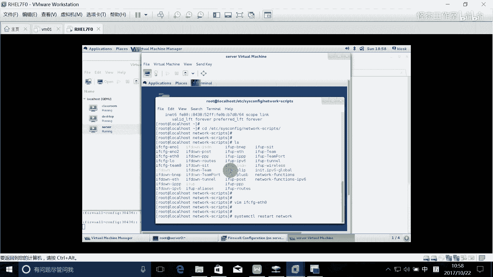

哎，可以啊啊，我们再来连一下啊，看一下能不能连得上。啊，可以了啊，OK你再去查一下是吧？那这个时这个这个这个时候的话，你看这就是我们之前这就是我们刚刚team的IP是吧？这是我们手工配的IP了啊。

完了之后。呃，完之后大家最好是要怎么做呢？就是最好重启系统是吧？像这些实验的话都是。team the control是吧，我们的team零这个网卡的一个状态state。

一定去看一下当前两个都up起来了没有，有没有其中是一个active的。啊，他的这个runner是什么是吧？重启之后还是这种runner的话，就是你做对了。很多时候你重启之后啊。

它就可能有一个网卡没起来了。啊，有这样的一些情况啊，所以话大家最好是重启多做一做啊。现在的话有时间测试考试时间呢，考试时候，如果你还需什么重启去测试，没时间了。所以现在的话有时间的话，大家多测试啊。

一定要多去测试测试一下啊。啊，这是这一个。呃。好了，先把这两个题目做好先好不好？啊。抓紧时间啊。

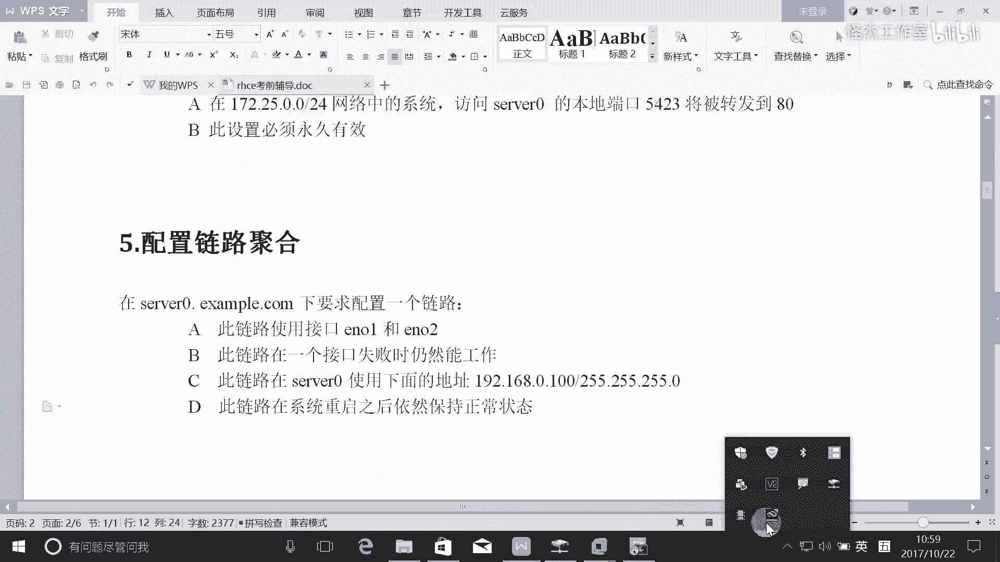