# Linux RHCE认证考试视频教程：P2：端口转发与链路聚合配置

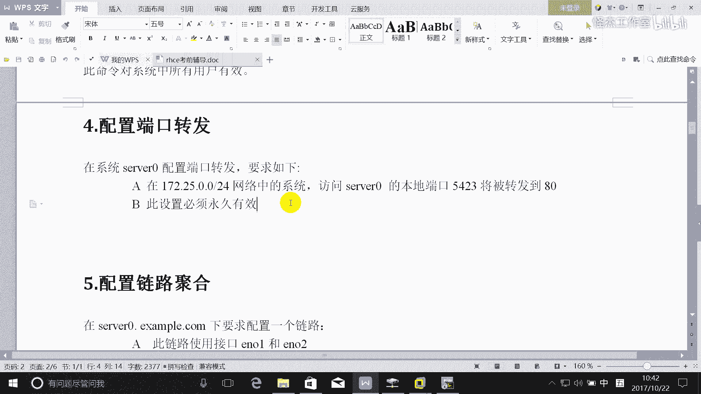


在本节课中，我们将学习RHCE考试中的两个重要网络配置任务：配置防火墙端口转发和配置链路聚合。我们将通过命令行和图形界面两种方式，详细讲解其实现步骤和原理，确保配置永久生效。

## 配置防火墙端口转发

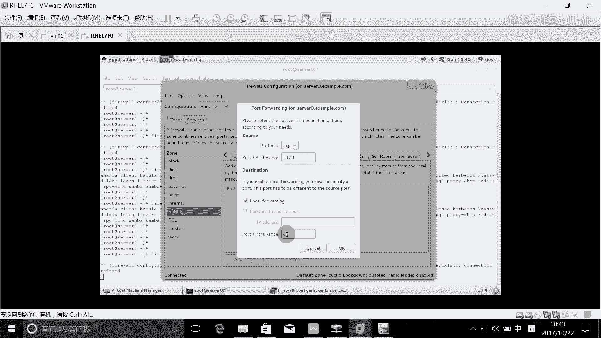

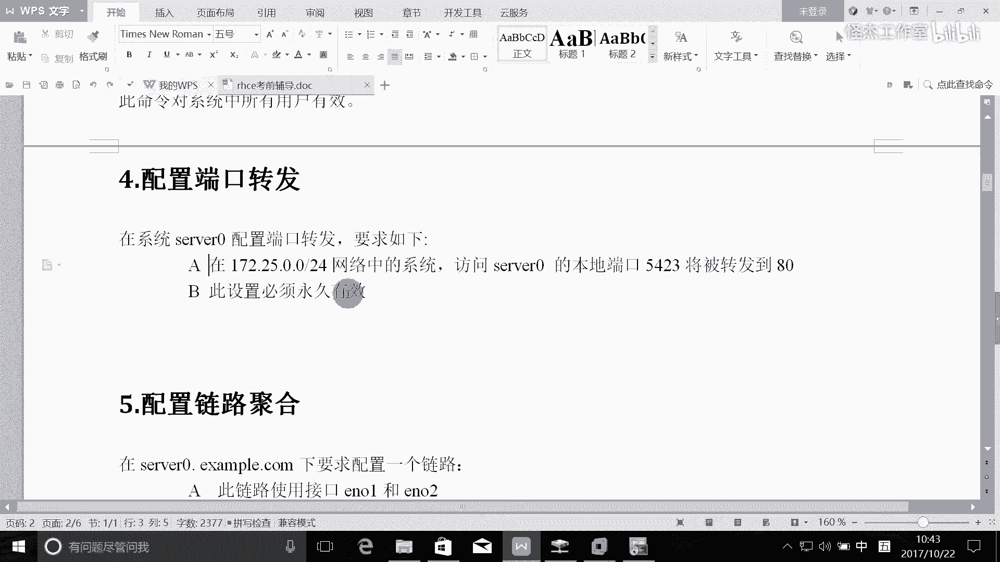

上一节我们介绍了基础网络服务，本节中我们来看看如何配置防火墙的端口转发功能。端口转发允许将到达服务器特定端口的流量重定向到另一个端口，常用于安全或服务管理。

### 任务要求与原理分析

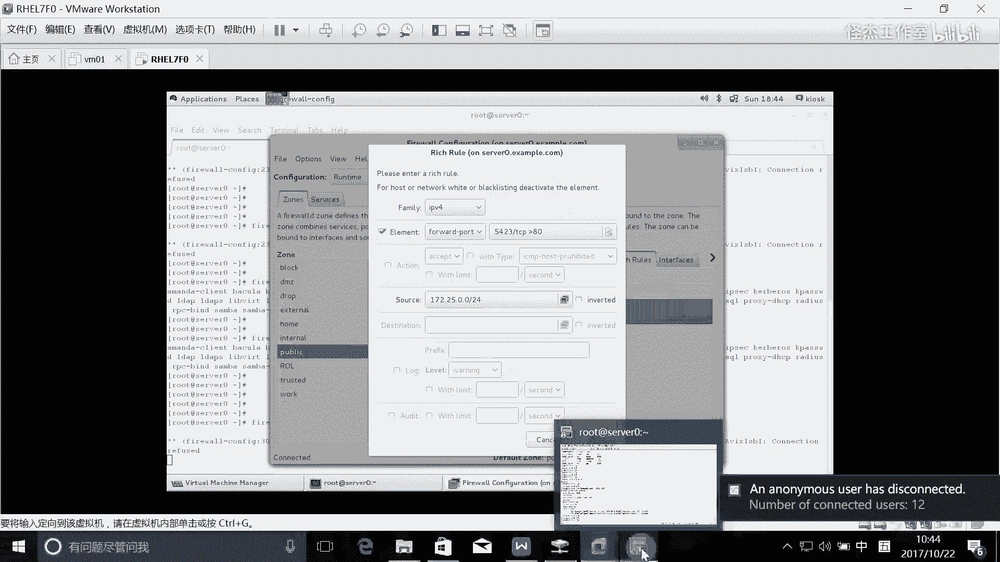

任务要求：在系统`server`上配置端口转发。访问`server`本地端口`5423`的流量将被转发到`80`端口。此配置必须永久生效。

原理分析：当外部客户端访问服务器的`5423`端口时，请求会经过服务器的防火墙。防火墙规则将识别到目标端口是`5423`，并将其重写（转发）到本机的`80`端口。这样，实际处理请求的是运行在`80`端口上的服务（例如Web服务器）。在本机直接访问`80`端口不会经过此转发规则。

### 图形界面配置方法

以下是使用图形化工具`firewall-config`进行配置的步骤：

1.  启动防火墙配置工具：`firewall-config`
2.  选择“运行时”或“永久”配置模式。为确保重启后生效，请选择“永久”。
3.  在区域设置中，找到并点击“端口转发”。
4.  点击“添加”按钮，配置转发规则。
    *   **源地址**：可填写特定网络（如`172.25.0.0/24`）或留空表示任何地址。
    *   **源端口**：`5423`
    *   **协议**：`tcp`
    *   **目标地址**：留空（表示本机）或填写`127.0.0.1`。
    *   **目标端口**：`80`
5.  点击“应用”或“确定”保存配置。
6.  重载防火墙使配置生效：`firewall-cmd --reload`

### 命令行配置方法

考试中主要使用命令行。以下是使用`firewall-cmd`命令配置的步骤：

1.  **确保目标服务运行**：首先确认`80`端口有服务监听（如`httpd`）。
    ```bash
    systemctl start httpd
    systemctl enable httpd
    ```

2.  **添加富规则（Rich Rule）实现端口转发**：使用`--add-rich-rule`参数创建复杂的转发规则。
    ```bash
    firewall-cmd --permanent --add-rich-rule='rule family=ipv4 source address=172.25.0.0/24 forward-port port=5423 protocol=tcp to-port=80'
    ```
    *   `--permanent`: 使规则永久生效。
    *   `rule family=ipv4`: 指定IPv4规则。
    *   `source address=172.25.0.0/24`: （可选）限制源网络。如果题目未指定，可省略此部分。
    *   `forward-port ... to-port=80`: 核心转发指令，将`5423`端口的TCP流量转发到本机`80`端口。

3.  **重载防火墙并验证**：
    ```bash
    firewall-cmd --reload
    firewall-cmd --list-all  # 查看规则是否已添加
    ```

4.  **测试**：从同网络的其他机器访问`server:5423`，应能显示出`server`上`80`端口服务的内容。

## 配置网络链路聚合（Team）

上一节我们完成了端口转发的配置，本节中我们来看看如何配置链路聚合。链路聚合能将多个物理网卡绑定成一个逻辑网卡，实现带宽叠加或冗余备份。

### 任务要求与原理分析

任务要求：在系统`server`上使用`eno1`和`eno2`创建链路聚合。采用`activebackup`模式（主备模式），确保一个接口失败时聚合链路仍然工作。为聚合接口配置指定IP地址`172.25.0.11`。配置需在系统重启后仍保持正常。

原理分析：`activebackup`模式即主备模式。同一时间只有一个网卡（主卡）处理数据流量，另一个网卡（备卡）处于待命状态。当主卡发生故障时，备卡会立即接管，保证网络连接不中断。这是一种提供高可用性的简单方式。

### 使用NMCLI命令行配置

以下是使用`nmcli`命令配置链路聚合的标准化步骤：

1.  **创建Team逻辑接口**：
    ```bash
    nmcli connection add type team con-name team0 ifname team0 config '{"runner": {"name": "activebackup"}}'
    ```
    *   创建了一个名为`team0`的逻辑接口，并指定其运行模式为`activebackup`。

2.  **为Team接口配置IP地址**：
    ```bash
    nmcli connection modify team0 ipv4.addresses 172.25.0.11/24 ipv4.method manual
    ```

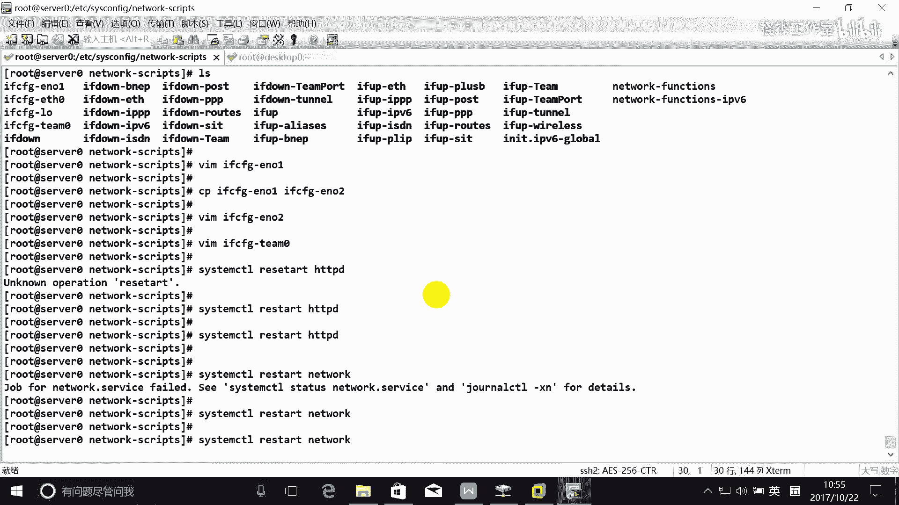

3.  **将物理网卡作为端口（Port）加入Team**：
    ```bash
    nmcli connection add type team-slave con-name team0-port1 ifname eno1 master team0
    nmcli connection add type team-slave con-name team0-port2 ifname eno2 master team0
    ```

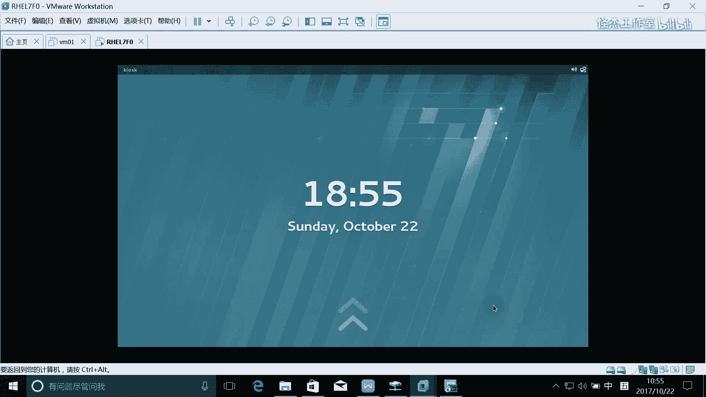

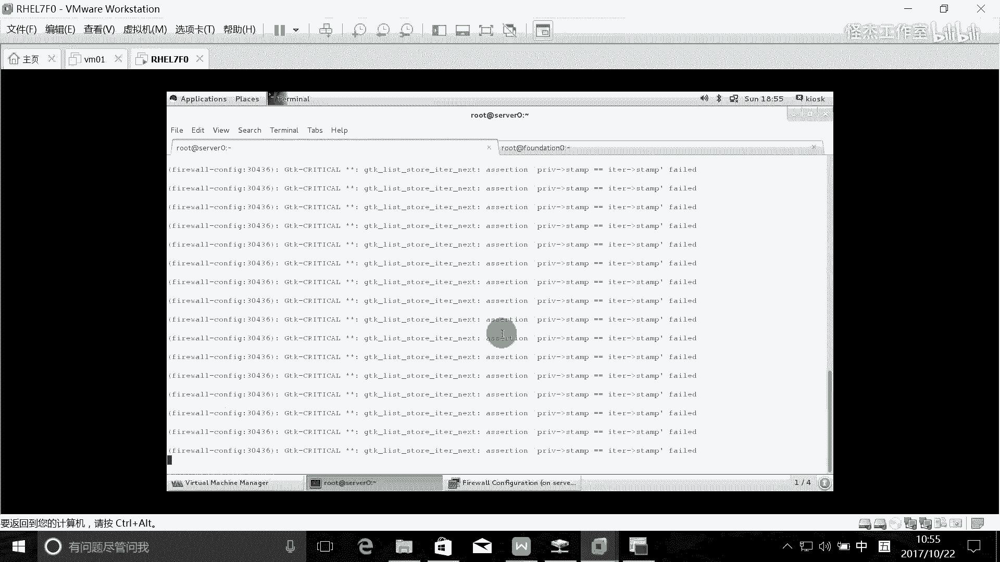

4.  **启动所有连接**：
    ```bash
    nmcli connection up team0
    nmcli connection up team0-port1
    nmcli connection up team0-port2
    ```

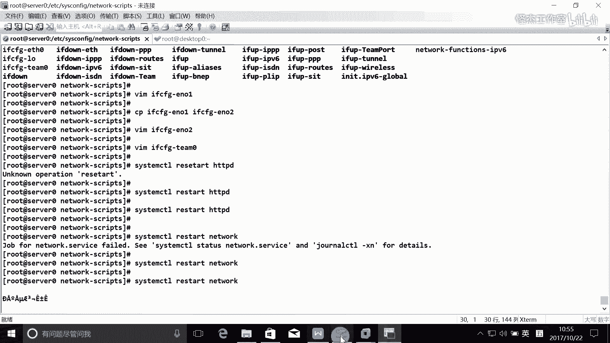

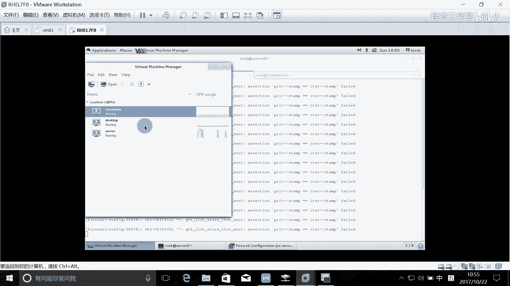

5.  **验证配置**：
    ```bash
    teamdctl team0 state  # 查看team0状态，确认runner模式和端口状态
    ip addr show team0    # 查看team0的IP地址
    ```

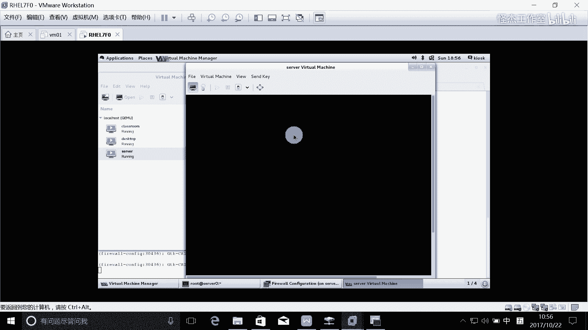

### 通过配置文件手动配置（备用方法）


你也可以通过直接编辑网络配置文件来实现，这对于理解其结构很有帮助：

1.  **创建物理网卡配置文件**（例如`/etc/sysconfig/network-scripts/ifcfg-eno1`）：
    ```
    DEVICE=eno1
    NAME=eno1
    ONBOOT=yes
    TEAM_MASTER=team0
    DEVICETYPE=TeamPort
    ```

2.  **创建Team逻辑接口配置文件**（`/etc/sysconfig/network-scripts/ifcfg-team0`）：
    ```
    DEVICE=team0
    NAME=team0
    ONBOOT=yes
    DEVICETYPE=Team
    TEAM_CONFIG='{"runner": {"name": "activebackup"}}'
    BOOTPROTO=none
    IPADDR=172.25.0.11
    PREFIX=24
    ```

3.  **重启网络服务并验证**：
    ```bash
    systemctl restart network
    teamdctl team0 state
    ```

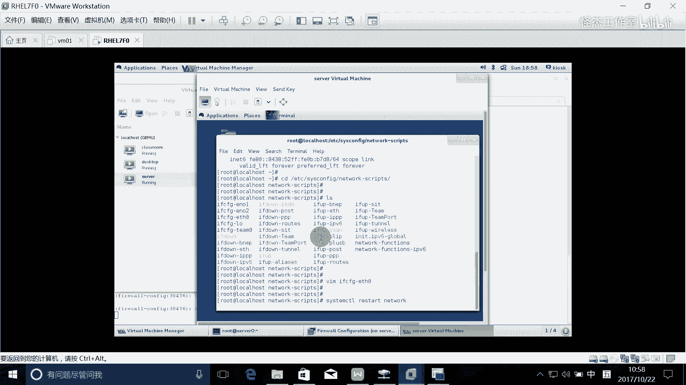

**关键注意事项**：
*   **重启测试**：配置完成后，务必重启系统，然后检查`team0`接口是否自动启动，IP地址是否正确，`runner`模式是否仍是`activebackup`。
*   **物理网卡IP**：作为`team-slave`的物理网卡（如`eno1`）不应再配置独立的IP地址。
*   **排错**：使用`journalctl -xe`或`teamdctl team0 state`命令查看详细错误信息。

## 总结

本节课中我们一起学习了RHCE考试中的两个核心网络配置。
1.  **防火墙端口转发**：我们学习了如何使用`firewall-cmd --add-rich-rule`命令，将到达指定端口（如`5423`）的流量永久转发到另一个端口（如`80`），并理解了其工作流程。
2.  **链路聚合**：我们掌握了使用`nmcli`命令创建以`activebackup`模式运行的`team`接口，实现网络冗余。重点在于正确创建`team`接口、配置IP、添加`team-slave`端口，并通过重启系统来验证配置的持久性。

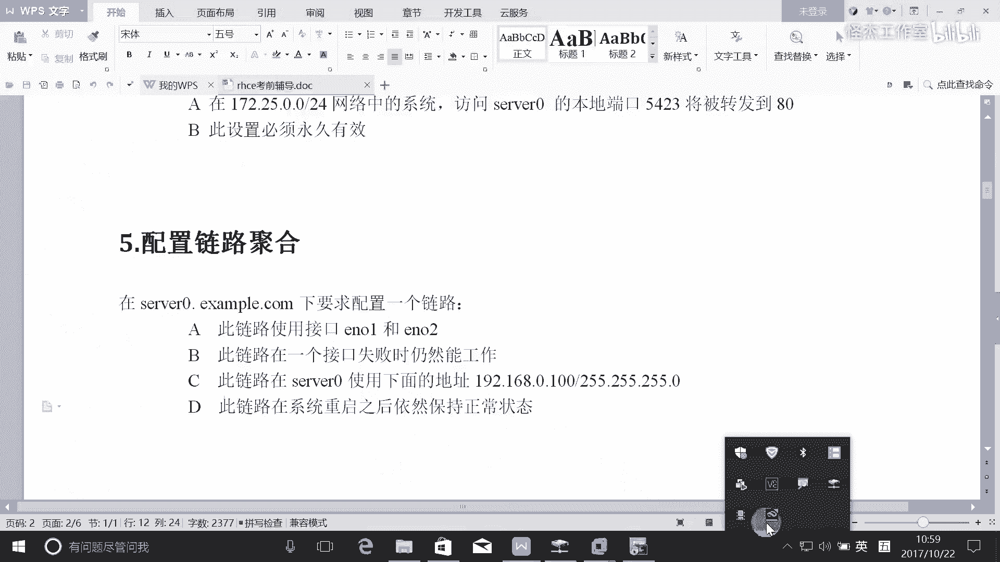

请务必在实验环境中反复练习这两个任务，特别是重启后的验证步骤，以确保在考试中能够熟练、准确地完成配置。