# Linux rhce认证考试视频教程 - P3：rhce_3 - 我叫怪先生 - BV1ub411p7Cs

我们先来讲一下第七题啊。第七列的话是配一个邮件服。啊，在系统对这个top零上配置邮件服，满足以下要求啊。第一个不接收。外部发来的邮件。在这些系统上，本地发送的任何邮件都会自动的发送到这一台服务器上面。

完了在这些系统上发送邮件都显示来自于一个z波点com。啊，那这个怎么来实现？

어。这次拖不零上啊，大家一定看清楚啊。

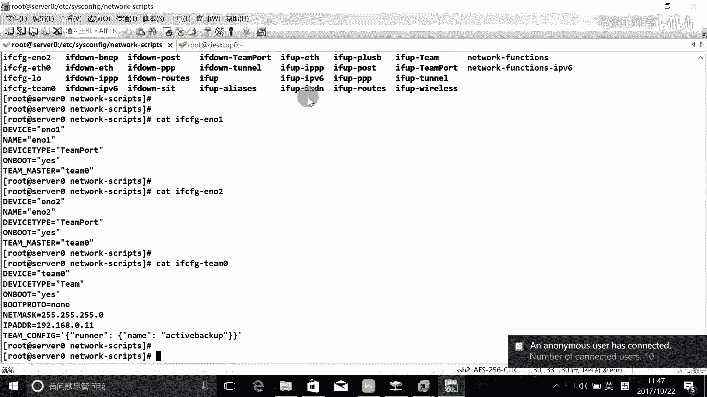

那这个的话其实就是书生命的一个。🎼要求啊就是书就是我们的教材的话，对大家讲的话，就是要求学会这个一个什么那客户端的一个配置是吧？那客户端怎么来配置？啊，怎么样配置？首先第一个这个邮件服务器的话。

一般都装了，是不是啊？Poster face。都已经赚了啊，一般的话都有啊。🎼完了之后，其次他正常情况也是什么？🎼也是启动并启用的是吧？啊，这些东西的话大家都要保证啊，接下来我们就要对它来做一个设置。

做设置啊，那么它的主配置文件就是什么？门店CF是吧。好，首先他不接收外部发送来的邮件啊，那我们把一些基本的配置都配一下，好吧。请配合配下。2。那么我们从哪里哪里配起啊，从这个主机名和这个域名配起是吧？

啊，们这个。每一台主机都有主机名的是吧？所以我们看一下我们这台主机的主机名是什么？my host name等于什么是吧？我们这台主机名就是dik top0点。一个侦破点看，对吧？那我们这个域名就是。

My domain。等于什么？一个正po点com，对吧？好，发送邮件。那么发送邮件的话，它都会加上我们的这个后缀，叫什么一个zimpo点com。所以我们在这里把这个注释把它删了就行。发送邮件什么意思？

就是有个from是吧？from，比如说fromus。啊，01对吧？那么这个后面的话它会加上艾什么一个zimer点com。那它为什么会加上一个zimpo点com嘛？就是因为我们在这里对它进行配置了。

配置了这个什么my a啊这样的一个配置啊。OK好，这是这一个。啊，接下来的话就是收邮件是吧？我们这台邮件服务器能收邮件吗？他不接受任何外部发来的邮件。

所以的话我们就要他是不是等于local host就可以了。他就不会接收外部发来的邮件，是不是啊啊，那么这些系统上面的邮件，他他是不是会放到他自己的邮箱呢？会放到自留箱吗？也不会。

所以的话这里拍配一个什么。被一个dlation是吧？呃，配这个这个。他也不收任何的邮件啊，所以的话怎么办？所以我们把这个后面的把它删掉，这样的话他。谁的邮件都不收是吧，不收任何邮件啊。

那么我们的邮件怎么办啊？我们的邮件来了之后怎么办？就是我自己产生的邮件之后怎么办啊？这时候的话呢，我们自己产生邮件，它会自动的发送到什么这一台服务器里面，是吧？所以这个要配一个什么东西啊。

配一个my配一个relay，是不是啊？relay host就是我们要。本机的邮件啊，那本机的邮件的话呢，就要配一个my latework是吧？my latework的话就包含，那么它还会。那么你想一下。

他还会接受外部的邮件吗？不会是吧，所以他中期的邮件也这个这个也不会中极这一个了，是不是啊有外部发过来的邮件，他根本就收不到。所以我们在这里的话还要配一个什么东西啊，配1个IPV6的地址。

IPV6地址以及IPV4的地址啊，那么IPV6地址怎么配的？IP56的回访测试接口是怎么配？是这样写的吗？我忘记了。

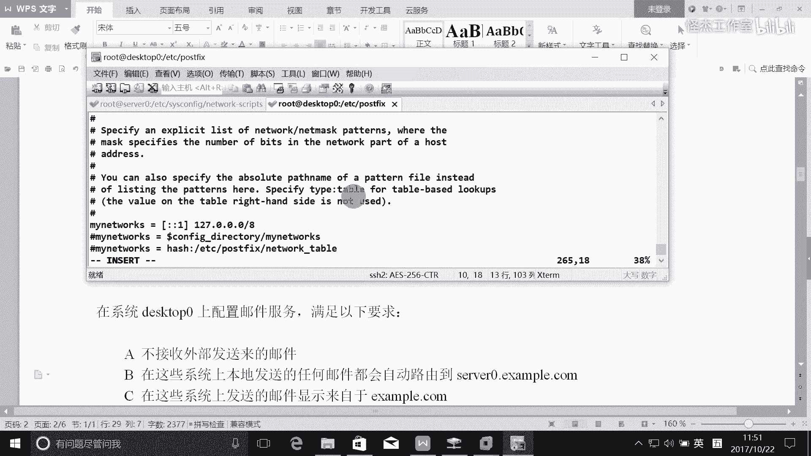

忘记了啊，我到教材上面找一下吧啊。这个记记记心不太好啊。就是我们是这个是254吧。一し。这是第几天呢？这是第十。

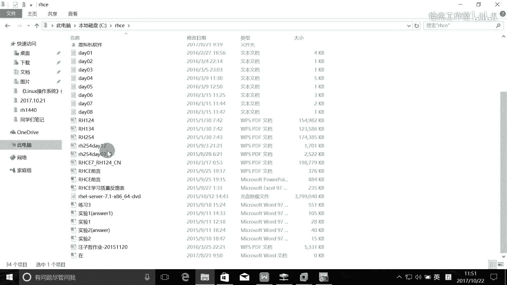

好像第九天第十0天的。

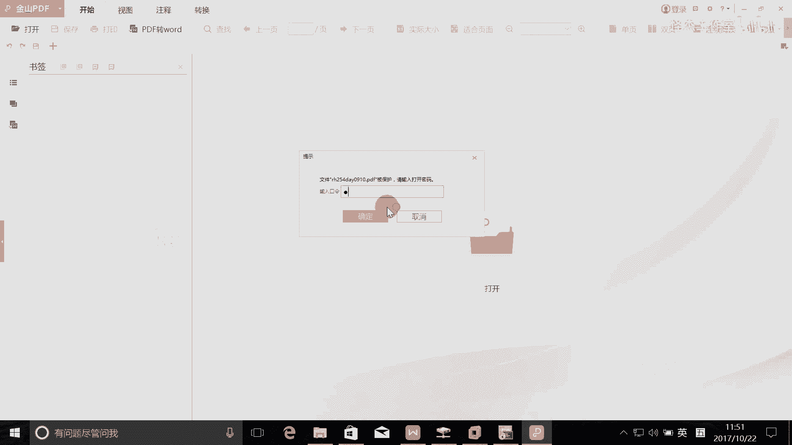

现在忘记了啊，这个IPU的地址怎么写？哎，这样写啊。

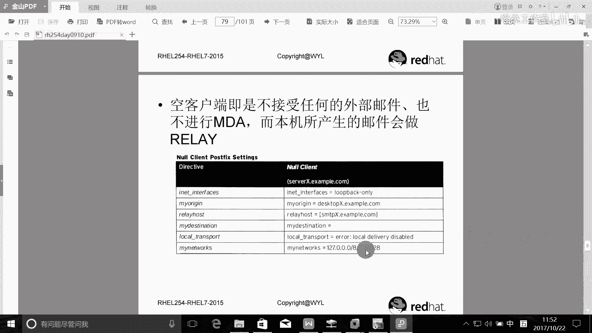

哦，没写错啊，是这样写的啊。然后斜杠128是吧。斜杠128，那么中间又是逗号隔开啊，逗号隔开就这样写的啊。OK。啊，就背这么多是吧，还有配个什么relay host是吧？找一下这个relay host。

找找这条语句。啊，找这个，那么把它relay到哪个上面去啊？哎，不要注视这一个吧。我们自来写一个吧。只写一个啊。这个输入法不太好用啊。relay host，我们中间到哪个上面去？对，so0。

1个zimer点com，就中结到这个上面去。OK拍好了，就是要。重启一下。这个。

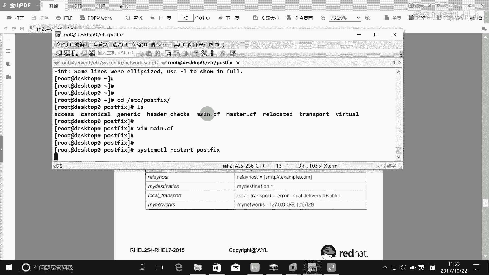

这个这个文档口令这个早就告诉过大家了啊，你不要感觉到很诧异。如果感觉到很诧异的话，就是很显然就是你自己出卖了，你自己没来上课啊，没认真关注过这个学习。啊。

这个密码的话就是这个我们的这个foundation零的密码是吧？classroom的密码啊。

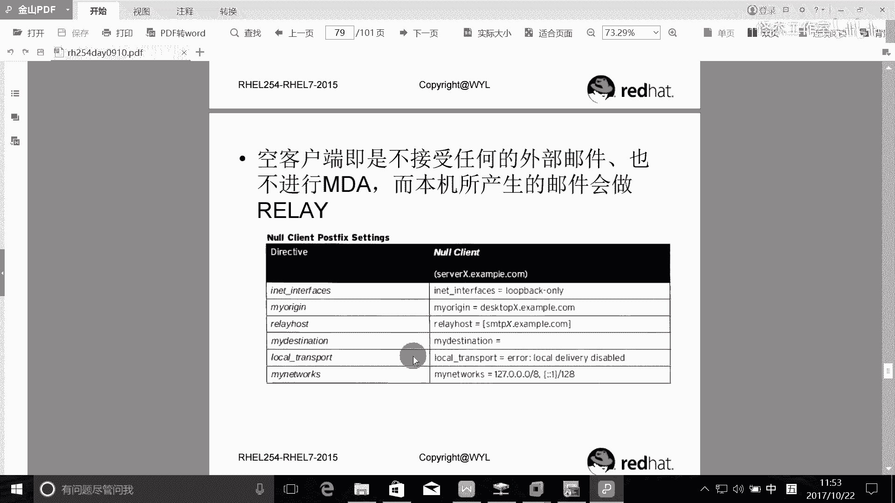

这个早就跟大家讲过了啊，你不来上课，你还很诧异啊，这个真的是。

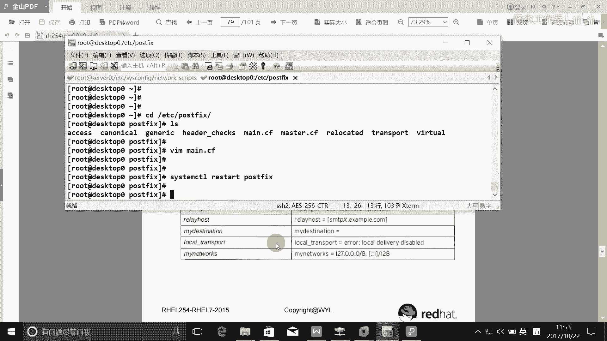

一看就你就没关心和学习啊。

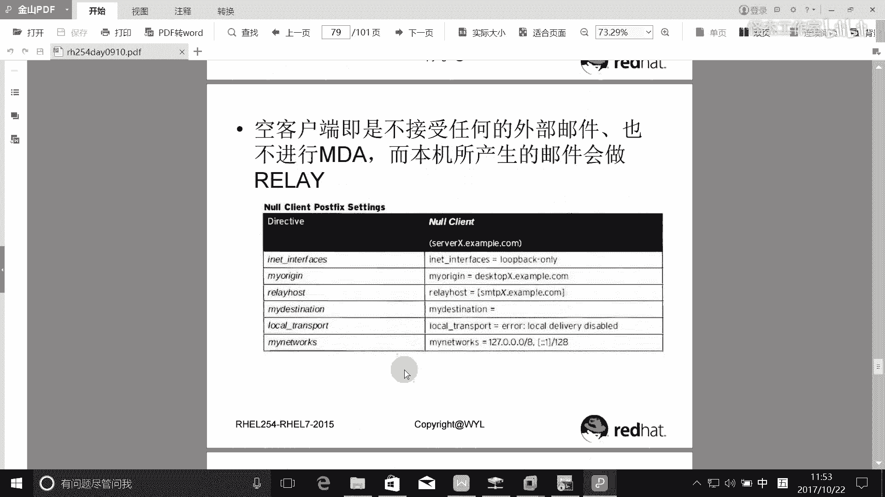

OK好，这是第四个托破林啊。啊，接下来的话就是40。啊，这个学习的话，老师只是起到引导作用，真正学习还是靠你自己啊。可能说很忙啊，然后一拖的话就拖了一年两年是吧？34年这样过去了，然后再拖没机会了。

那这个就是下一次红包扒出来了。红60种，现在经期也是了，很好，每个版。因为洪洪茂漆的话是14年出来的。红包是每四年更新一次。是吧你你想一下，不是就是18年了吗？好。明年他们就准备讲吧了。

故意加班刚来是想充电。😊，Yeah。嗯。好，接下来看一下这个寿林啊。Sly。穿建用户叉叉啊。用5叉叉有手按的是吧？查操啊，那已经存在了，也是个密码吧。完了之后。能接收从他主机上发送过来的这个邮件啊。

那我们就。看一下他能不能收邮件，他新的有邮件吗？现在没邮件是吧，那么他要能够接收从他发送过来的邮件，那他怎么做啊，他是不是也要配这个配一下post fix啊？ETCpo灰是吧？然后。

然后也要配置一下这个min点CF是吧？那么也要把这个东西配一下。host name等于什么？对，受0点。example点com对吧？完了之后我们的域名就是。My domain。等于。

example点comm。是吧完了之后发送邮件，发送邮件的话，要不要加上这一个，这个就随你了啊。我们这里反正就是只能收他的邮件就行了，是吧？好，reseale。那么这个时候我们要收所有的人的邮。

就是搜收到这个ditop0的邮件，你还认真定在loc host吗？很显然不行是吧？所以我们可以争定在什么所有的接口可不可以啊？可以吧？完了之后我们要收谁的邮件，所以这个dation一定要配一下。哇。啊。

这个配一下，我们能收什么邮件？我们要能收到什么邮件呢？我们能收到这个什么？ex exampleble点com是吧？那么exzeble点com的话，是不就是我们这个。多没啊。是不是是是我们这个域名啊。

OK那么就可以了啊，保存退出来。把这个。重启一下post。分死。啊，我懂么意思啊，我们来收一下邮件啊。收一下邮件，那么收邮件的话，其实你可以没呃不是，你可以打开这个打开这个日志是不是也就可以了。哇。

loggo下载什么maillo是不是可以看一下就行了，是吧？好，我们在这边发一下，看他能不能收到啊。发一下，那么发邮件的话是发给谁？发给叉叉是吧？一个真跑。点com对不对？主题是什么？

比如说是一封邮第一封邮件，内容是hello点代表结束。那这边能收到吗？收到没有没有收到，为什么？对，防火墙的问题是吧？所以我们在这里的话还要配一个。防火墙和 moment某特。ideleservice。

他叫什么？收邮件是不是？就是他发过来的话，那么他是不是要接收啊，是不是从SMTP协议来收来来来来来发邮件啊，是吧？ok。完了之后。要什么？relow一下是吧。不下。我们再来一次吧。电代表结束是吧？喂。

查下日志。有没有啊？froom是吧，叉叉有没有啊，有了是吧？完了之后我们在这里也可以去收一下这个叉叉的邮件，有没有？有吧。啊，邮件主题黑lo是吧？邮件的主题是第一封邮件啊，内容是黑lo是吧？

那这个就说明做做好了啊。OK这就是第七题啊。那么第七题的话，其实就考的是。啊，考的是这样的一个东西啊，就是这叫什么东西啊？

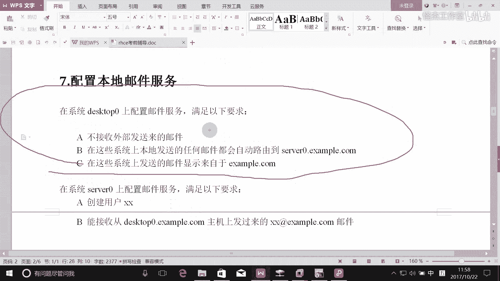

这个的话我们在上课的时候讲过吧，它叫什么空客户端纳。这样的一个东西啊，所以大家可以参考一下书上面写法啊，书上面写法的话是这样写的，它叫look back。比如说真正的接口。

它叫look back only是吧？啊，发送的邮件是是exent点com是吧？这个他它要求是什么就是什么是吧啊，就是relay host就是把这个发送给某一台主机啊。他不接收任何的邮件。

所以my station后面就是空白了是吧？完了他也不收，就是空客户端的话，他会不会把他的邮件放到他的邮箱里面去啊？不会的是吧，他收都不会收，所以他更加不会把他邮件放到他的邮箱。

所以这个local transport可以配，也可以不配啊。完了之后，那我是要中寄哪些邮件啊，中寄本机的邮件是吧？本机的邮件就是这样来描述的，这样就描述了本机17。0。0。0写量8，还有两个冒号一。

这是IP6的回访测试地址是吧？啊，那么其实的话考试真的就是考这样的一个东西啊，你把这个你把这个题目理解了啊，考试可能就没问题啊，好没问题啊，一定要好好去理解一下。

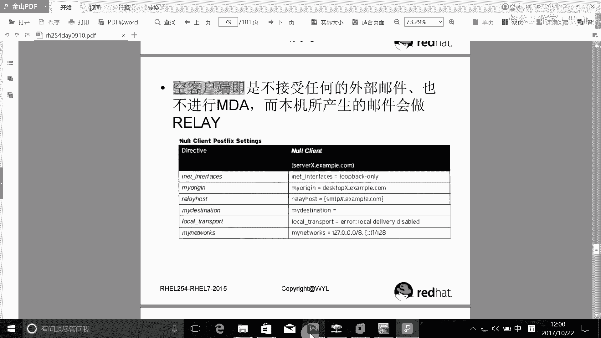

OK好，接下来时间啊，请大家把这个实验做一下。

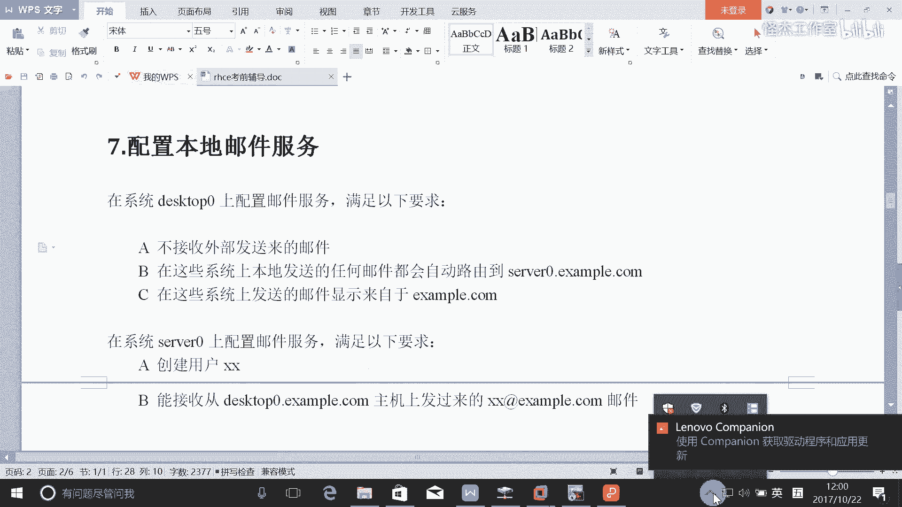