# Linux RHCE认证考试视频教程：P3：邮件服务器配置实战 📧

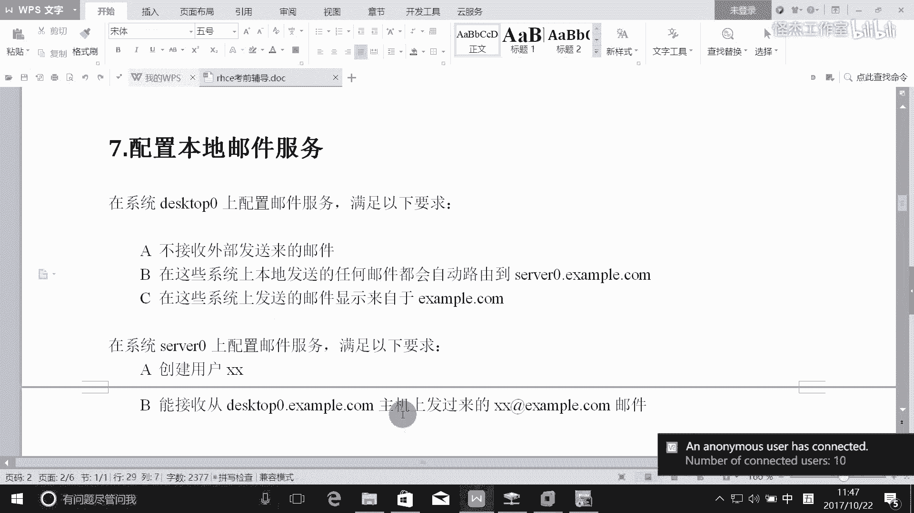

在本节课中，我们将学习如何在RHCE考试环境中配置邮件服务器。我们将重点配置一个“空客户端”邮件服务器，使其不接收外部邮件，并将所有本地邮件转发到指定的中央服务器。同时，我们也会配置中央服务器以接收来自客户端的邮件。

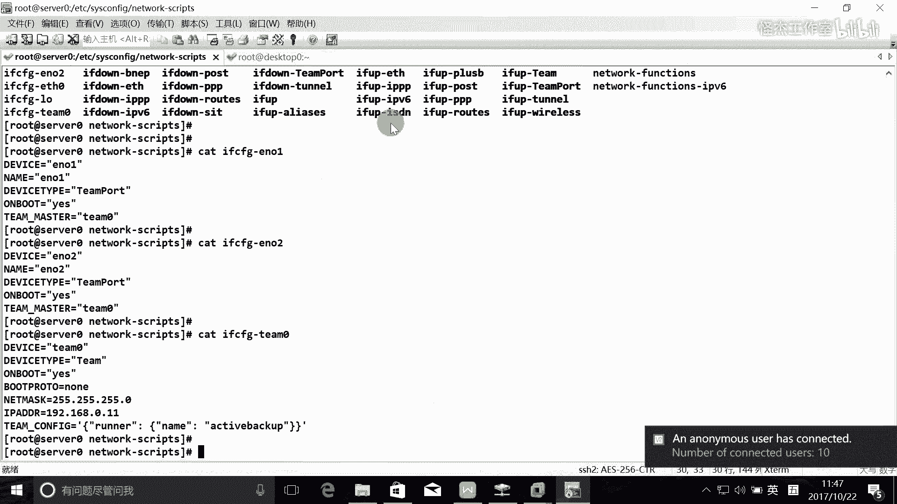

---

## 第七题：邮件服务器配置要求

题目要求在系统 `desktop0` 上配置邮件服务，并满足以下要求：
1.  不接收外部发来的邮件。
2.  本地发送的任何邮件都会自动转发到 `server0` 服务器。
3.  所有发送的邮件都显示来自 `example.com` 域。

---

## 配置 `desktop0` 作为邮件客户端

上一节我们明确了题目的要求，本节中我们来看看如何在 `desktop0` 主机上进行具体配置。`desktop0` 的角色是一个邮件客户端（或称“空客户端”），它本身不处理邮件存储，只负责转发。

### 修改主配置文件
Postfix 邮件服务的主配置文件是 `/etc/postfix/main.cf`。我们需要修改此文件以满足题目要求。

以下是需要修改或确认的关键配置项及其作用：

*   **设置主机名和域名**：定义本机的主机名和邮件域名。
    ```bash
    myhostname = desktop0.example.com
    mydomain = example.com
    ```

*   **配置邮件发件人地址**：确保本地发出的邮件自动带上 `@example.com` 后缀。
    ```bash
    # 取消以下行的注释
    myorigin = $mydomain
    ```

*   **限制接收邮件**：使服务器只监听本地回环接口，从而不接收外部网络发来的邮件。
    ```bash
    inet_interfaces = localhost
    ```

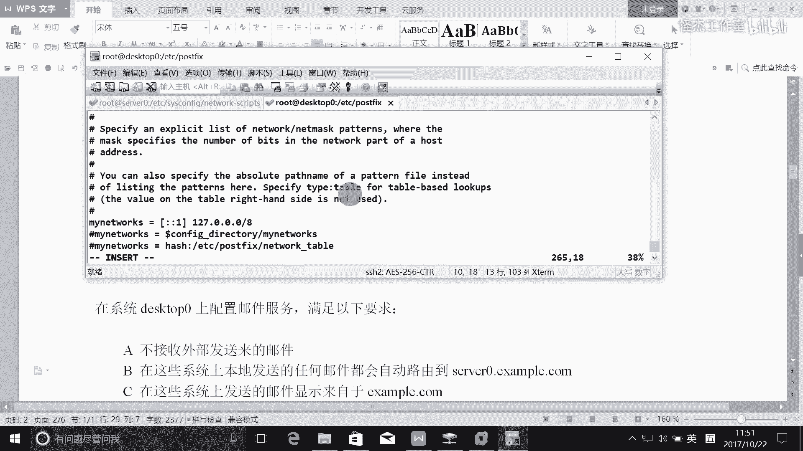

*   **配置邮件中继**：将所有本地生成的邮件转发到中央服务器 `server0`。
    ```bash
    relayhost = server0.example.com
    ```

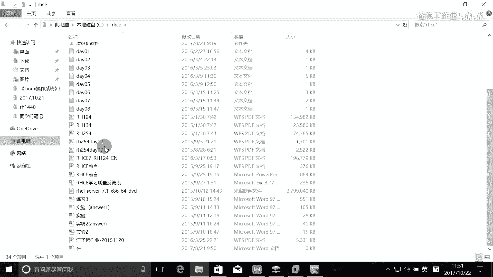

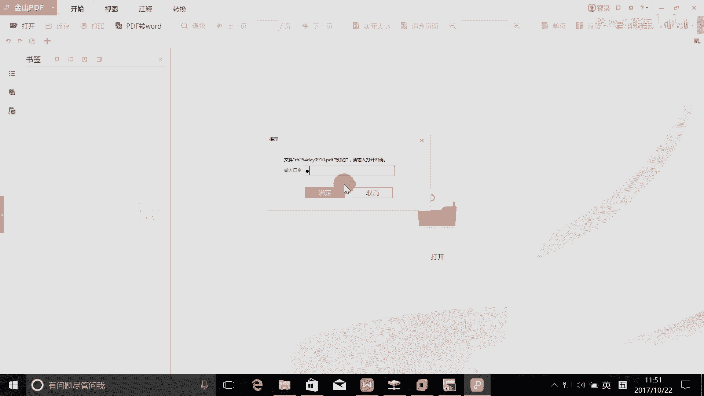

*   **定义中继网络**：明确哪些来源的邮件需要通过本机进行中继转发。这里设置为仅中继本机产生的邮件。
    ```bash
    mynetworks = 127.0.0.0/8, [::1]/128
    ```

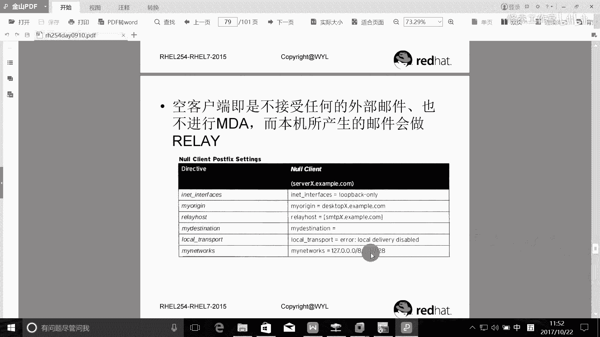

*   **禁用本地投递**：由于本机不存储邮件，可以禁用本地邮箱投递。
    ```bash
    local_transport = error: local delivery disabled
    ```

### 应用配置并重启服务
完成配置后，需要重启 Postfix 服务以使更改生效。
```bash
sudo systemctl restart postfix
sudo systemctl enable postfix
```

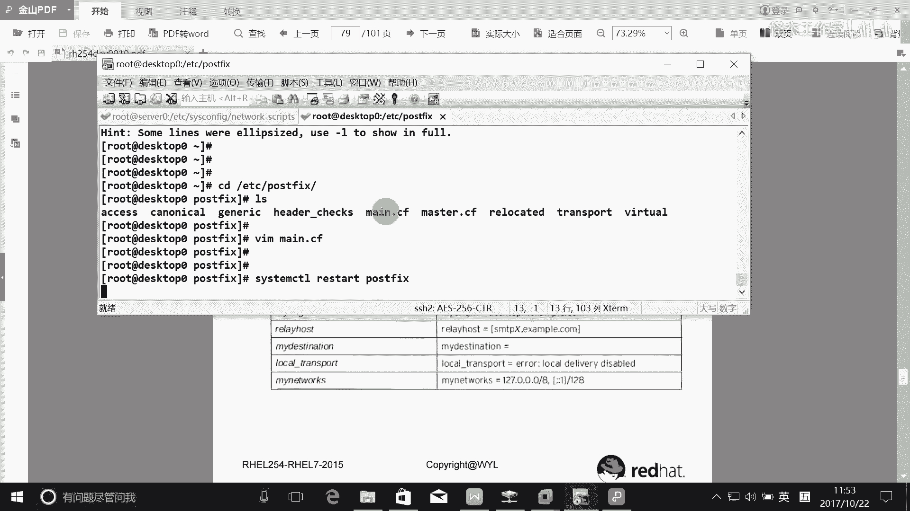

---

## 配置 `server0` 作为邮件服务器

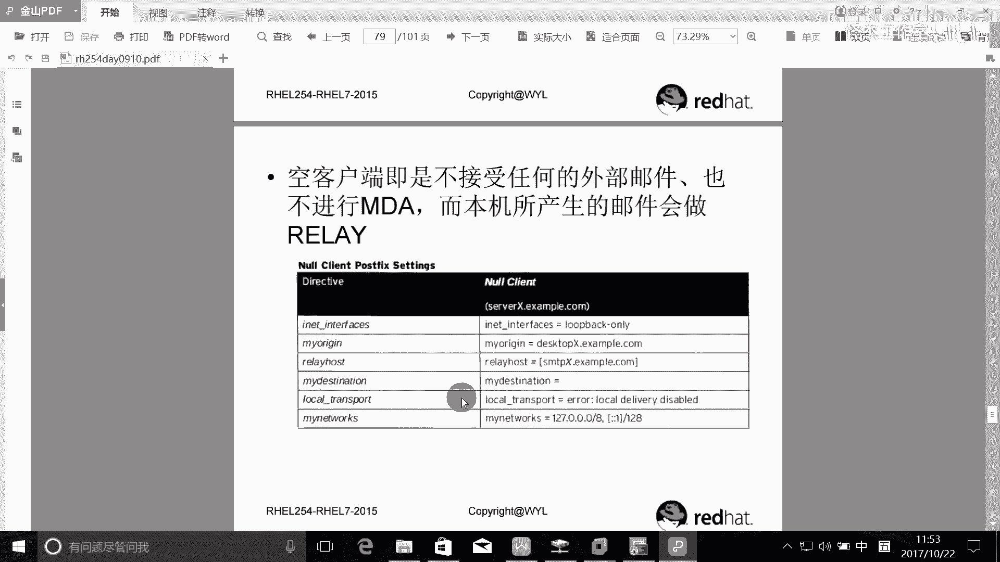

在配置好客户端之后，我们需要确保目标服务器 `server0` 能够接收来自 `desktop0` 的邮件。

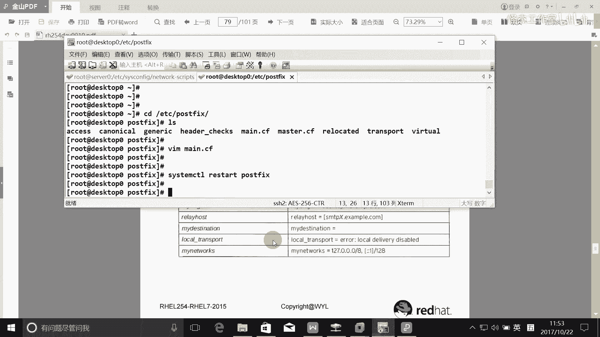

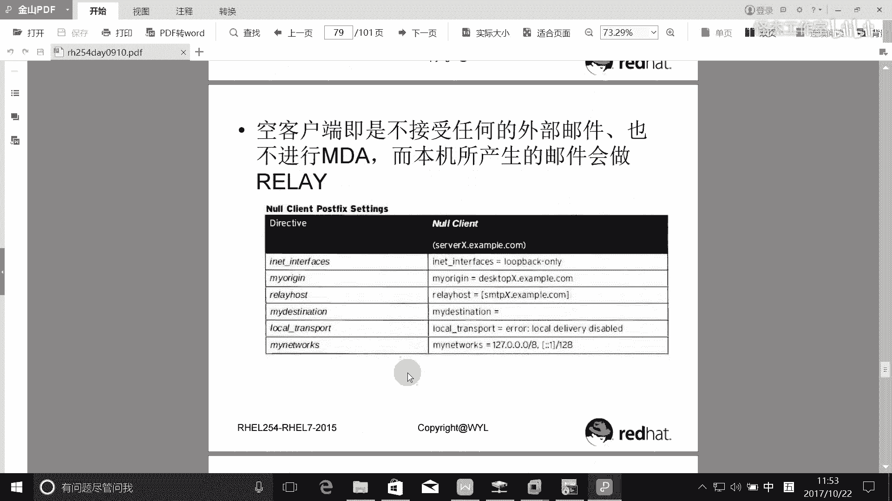

### 修改主配置文件
同样，我们需要编辑 `server0` 上的 `/etc/postfix/main.cf` 文件。

以下是 `server0` 的关键配置：

*   **设置主机名和域名**：
    ```bash
    myhostname = server0.example.com
    mydomain = example.com
    ```

*   **允许接收外部邮件**：服务器需要监听所有网络接口以接收客户端发来的邮件。
    ```bash
    inet_interfaces = all
    ```

*   **定义接收邮件的域**：指定本服务器负责接收哪些域的邮件。
    ```bash
    mydestination = $myhostname, localhost.$mydomain, $mydomain
    ```

### 配置防火墙与SELinux
为了让 `server0` 能够接收外部 SMTP 连接，需要确保防火墙和 SELinux 策略允许该服务。

以下是需要执行的命令：
```bash
# 配置防火墙允许 SMTP 服务
sudo firewall-cmd --permanent --add-service=smtp
sudo firewall-cmd --reload

# 确保 SELinux 对 Postfix 相关端口和操作放行（通常默认已允许）
sudo setsebool -P httpd_can_sendmail on
```

### 创建测试用户并验证
配置完成后，可以创建一个测试用户并尝试从 `desktop0` 发送邮件进行验证。

在 `server0` 上创建用户：
```bash
sudo useradd zhang
echo ‘password‘ | sudo passwd --stdin zhang
```

在 `desktop0` 上发送测试邮件：
```bash
echo “Hello, this is a test mail.“ | mail -s “Test Mail“ zhang@example.com
```

在 `server0` 上检查邮件日志或用户邮箱：
```bash
# 查看邮件日志
sudo tail -f /var/log/maillog

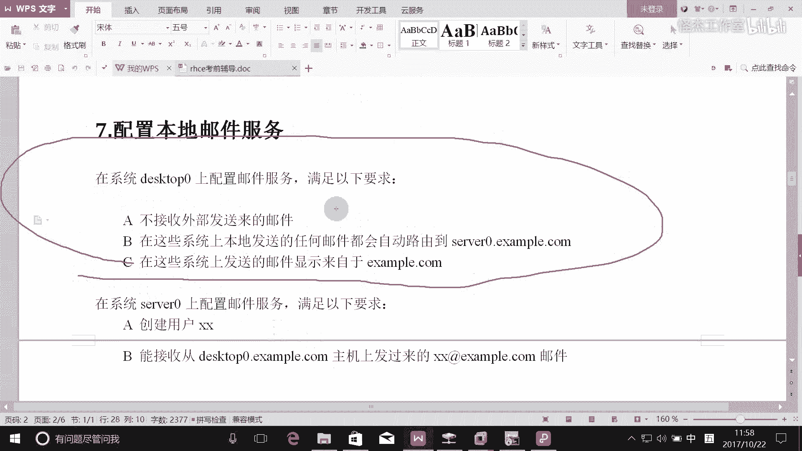

# 查看用户 zhang 的邮件
sudo mail -u zhang
```

---

## 核心概念回顾：空客户端 (Null Client) 📨

本节课中我们一起学习了邮件服务器的配置，其核心是实现了“空客户端”模式。让我们总结一下这个模式的关键点：

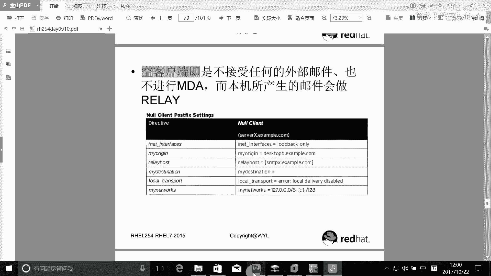

*   **定义**：空客户端是一台仅发送邮件，不接收、不存储邮件的 Postfix 配置。
*   **核心配置**：
    1.  **`inet_interfaces = localhost`**：只监听本地，拒绝外部入站连接。
    2.  **`relayhost = [中央服务器主机名]`**：指定所有外发邮件的下一跳中继服务器。
    3.  **`mynetworks = 127.0.0.0/8, [::1]/128`**：定义信任的、允许中继的源网络（仅本机）。
    4.  **`mydestination` 为空或仅包含本机**：声明本机不是任何域的目的地邮件服务器。
*   **应用场景**：在大型网络中，统一将所有工作站的邮件发送到几台中央邮件服务器进行处理，简化管理和安全策略。

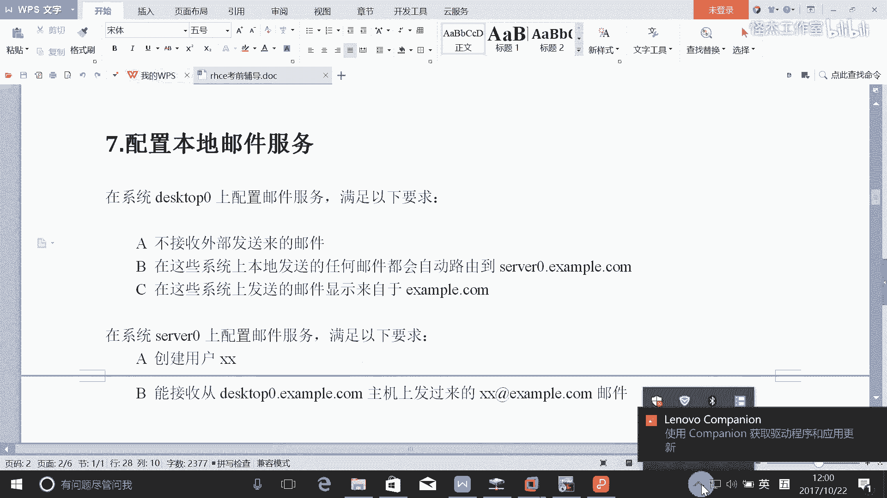

通过理解并实践上述配置，您就掌握了 RHCE 考试中关于基础邮件服务配置的核心技能。请务必在实验环境中反复练习，确保理解每一行配置的作用。