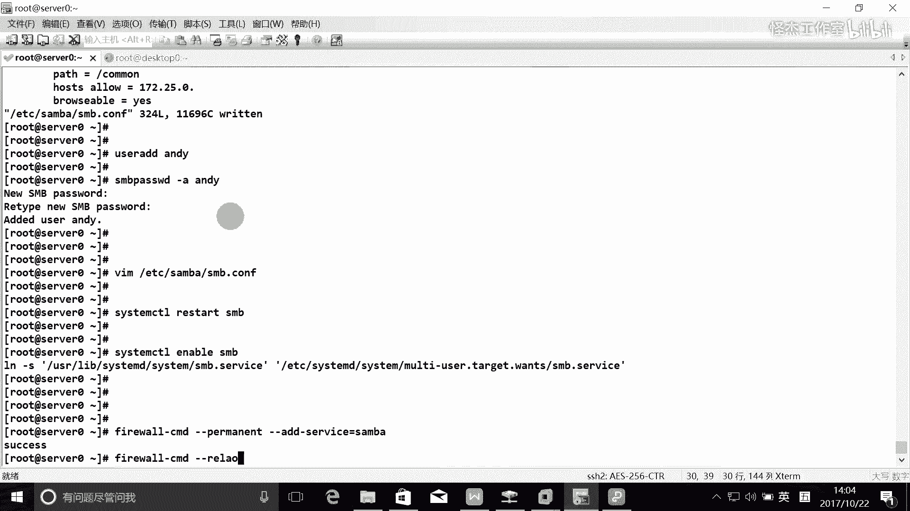
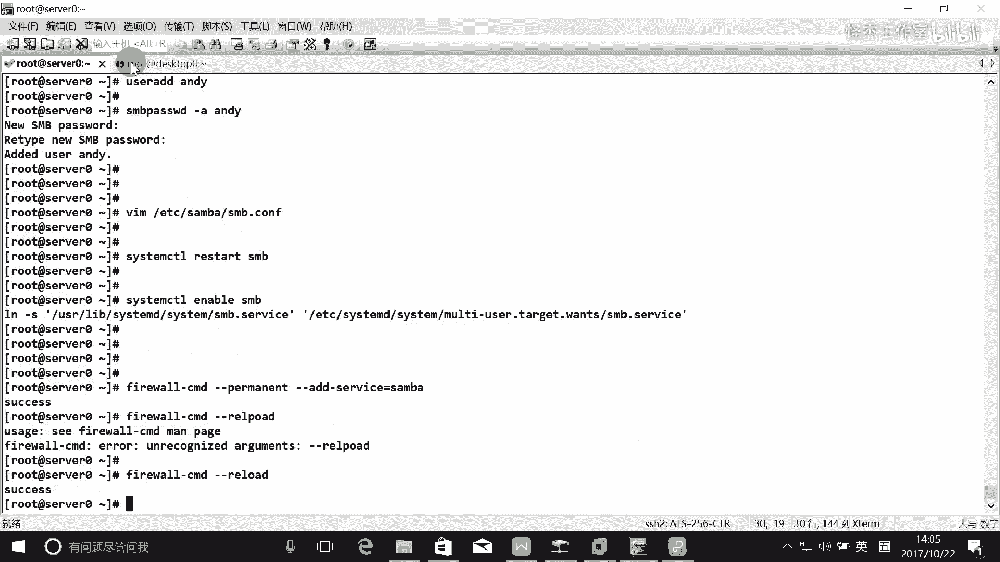
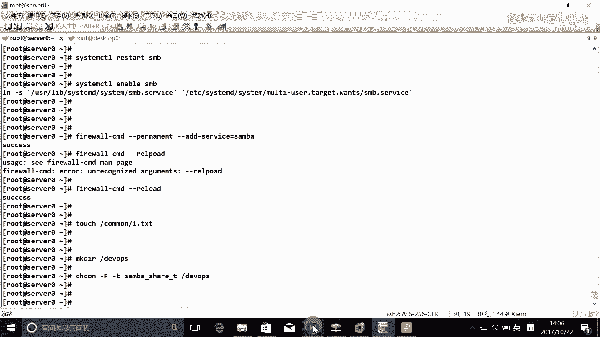
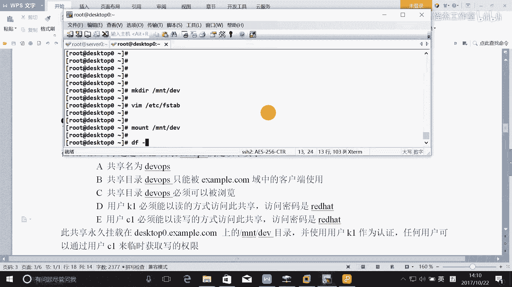
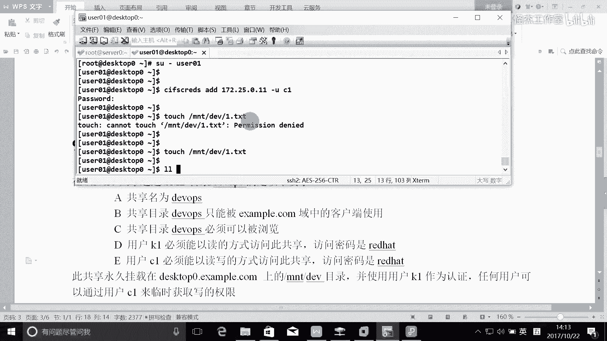
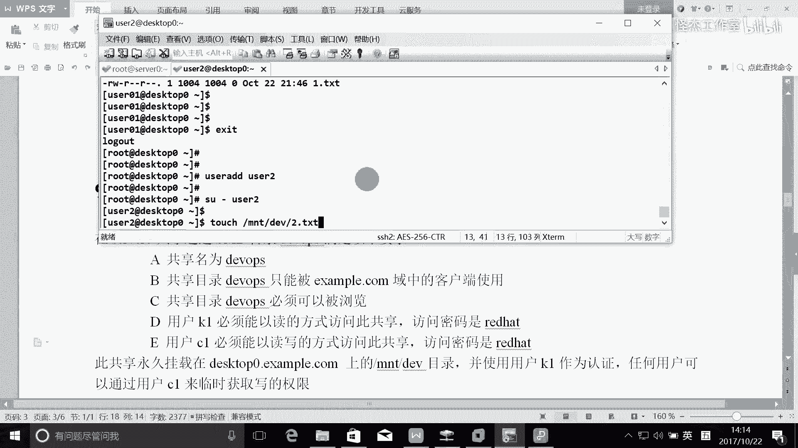

# Linux rhce认证考试视频教程 - P4：rhce_4 - 我叫怪先生 - BV1ub411p7Cs

啊。🎼呃，先讲第八题和第九题啊，第八题和第九题的话是一起的。这个的话呢考的就是三把啊。

那么。

嗯。

这应该是写错了吧，这是450。上课是三把伏，这个的话应该是第四个托是吧？

嗯，先做第八题吧啊。首先的话呢就是配置三宝服务。这里的话，首先第一个的话呢，肯定是要安装软件是吧？三宝的话呢。

🎼做服器的话，需要装两个包。这些东西的话大家都要记下来是吧？一个是三包，一个是。

对就是上班啊，你要记号了啊。

啊，这是第一个。考试也是需要专的啊。然后。就是共享一个目录，这个目录就做什么？看嘛是不是？

好吧，所以我们来创进目录啊。

卡嘛。呃，共享名也是commo是吧，只有一个珍宝点com域类的客户端可以访问commo共享啊。看必须是可以浏览的。然后用户这个安迪必须能够读取共享中的内容。如果需要的话，一直密码是red heart。

那么这里的话需要创建一个用户是吧？

串这个用户，我们的三宝用户他是基于什么？

啊，不是。创建这个目录的话，还要做一件事情，就是修改他的什么。安全上下文对吧？他的上全上下文是什么？伤8。是啊，T是吧，所以这个的话自己把它记一下啊。OK好，专业用户。那么三00的用户的话。

它是基于什么？系统的用户的是吧？所以的话我们在这里的话就是。要创对，首先创建系统的用户。完了之后。再把它加入到什么？三80案。密码是read heartt。好，那这样的话就说明添加成功了啊。

忘了。完了接下来的话呢，就是对他来做一些配置是吧？三把。

38点CB点3这是他主配置文件是吧？

首先的话，他是。他的工作组叫什么？

这都什么？是tauff是吧？完了之后呢，就是我们要设置到的共享，把它放到最后面去是吧？那么共享的名字叫什么？commo是吧，完了之后，那么它共享的路径的话就是跟目录下的。看么。完了他试试什么？

只有example点com域类的客户端可以访问。那这个就是叫做什么host S。很闹是吧？等于一个zem点com是吧？那这里的话可以写新点一个zemble点com是吧？也可以写这个网段172。25。

0点，记住，一定要点啊。完了之后。

必须是可以浏览的，是不是？那么可以浏览的话，就是b等于什么？

네 돈 예。其实。其实的话呢，就默认就等于y，所以你写不写都没所谓了，是吧？OK做完了。保存退出来。然后呢。启动服务是吧？然后所有的服务都并且要都要什么。

对对以类部啊。啊，这就是第八题啊。那么现在的话我们反正有时间我们可以测试一下是吧？考试时候。

你就可以放心了是吧？那怎么来测试啊？那么客户端的话也就是要装客户端的包是吧？客户端的话需要装几个包。

3把。可难特，还有一个是。

有ty是吧。

把这两包装上。我们来测试一下，看一下我们能不能访问啊。

这边的话肯定是要配一个防火墙，是不是？🎼所以的话呢我们把防火墙也配一下，叫泼 momentment。然后呢。I serviceice是吧，它叫三宝。

完了之后。

好。重新。

围绕一下啊。弄一下，然后我们在这边的话呢，我们来访问一下。

呃，我们怎么来访问？有有很多方法是吧？s把可以吧？就是。172。25。0。11的共享名叫什么？

camo是吧，用户名是安迪。

密码是readd heart是吧，能看到里面东西是不是就可以了？是这这是不是代表人读全里面东西了，对不对？

他是不是只读就可以了，有时候可以写吗？

能够读取是吧？读取就可以了啊，比如说我现在我现在在这个里面创了一个文件啊，就是com下面创了一个一点tex。

我们这边能不能看得到呢？

是不是看到就可以了。O。这就是。第八题啊。

啊，这第九题啊也是三榜。这个第九题是多用户的三把啊。那么首先的话呢，第一个是共享的目录叫DEVOPS啊，所以我们在这里的话呢。

创建一个在搜我上面啊，创建一个。

DEVOPS钢讲方式。目录地地方你一定要呃什么？要示置他的。安全上下文是吧？DVOPS啊。

完了之后呢。

共享明是他对吧？龚晓明是他，所以我们接下来的话呢就是。

来配一下啊，打开它的这个配置文件，ETC下3保。完之后要送便点收料服啊。

在这个里面啊，我们再来配一个共享，共享名叫。工具名叫DEVOPS啊。那么他的路径是。跟目录下载DEVOPS是吧，完了之后。共享目录只能被也是一样的把hostS。cl吧等于了172。25。0点啊。

所以的话你定要找到这个对应的这个网段是什么，对吧？对应的网段是什么？完了之后。也是必须被留览是吧，所以么呢？把这个也复制一下吧，其实默认就是。被流览的啊。默认是yes啊。

用户K一必须能以读的方式访问此共享，访问的密码是readd heart特。那么默认是不是就是可以任何用户都能读啊？所以这句话要不要写啊？就不需要了啊，那么用户C一必须能以读写的方式访问磁共享。

所以的话这里叫什么？writer list等于什么？C就行了，是吧？OK。这就做完了。完了之后，此共想永久挂在在这个目录里面啊。啊，我们先把用户创建好，先把啊一个是K1。一个是。

C并且把它添加到这个30去1个K1。啊，一个是什么？C。所以还有什吗？服器服器是不是做完了？你可以去查一下PDB edit，可以去查这个什么查这个三宝的用户，你看三宝用户是不是就这三个啊？完了之后。

这个客户服务器配好了，就要配客户端。那么可位服气没有重启吧。

改了服务的配置需要重启才生效，是吧？Syem， restart。SMB啊啊接下来配下这边。那么这边的话必须要永久挂在MAD的DV下，而且永久挂在的话要需要要修改什么？

FS table是吧？那么在这里的话就是172。25。0。11下的。加什么空西啊？DVPS是吧，挂着在MNT下的。DEV啊，然后。他的文件系统类型叫什么？对 surface。deports完了之后呢。

这里的话考的是一个什么？就是我们要使并且使用用户KE来作为认证是吧？所以后呢。有所name等于K1。pass word等于。read heart任何用户可以通过CE来获得写的权限。所以话这个叫做什么？

马蹄。优色是吧，是叫8T优色吧。00是吧，那这样就OK了啊。

画下人民天下的地位。听功了没有？

成功了。那么接下来我们来测试一下。那么现在的话呢，我们是以K一来呃K1来这个。啊。是用KE来挂载的，是不是？

可以这个用户来夸噻。

KE的挂载的，那么K一的话只能对它进行什么权限？

读的权限是吧？读的权限啊，所以的话我们只能够读取里面东西啊，DV你看这这样LL没问题，就说明已经可以了，是吧？那关键的话，他现在就是还有一句话叫什么呢？

就是任何用户都可以来通过这个CE来获得这个什么写的权限，那么任何用户的话，其实是包含不包括root的啊，所以不要用root去测试，所以我们在这里的话，我们去另外建一个用户，好吧？

为什么你看你当前就是root才挂载的，是不是？所以的话当前肯定是不行的啊。

任何用户我们就随便创进用户，好吧，比如说我们创建一个优索01好不好？完了之后，我们切换到这个优索01啊，完了之后。

我们之前讲过，多用户的话，你要获得CE的权限的话，就必须要添加什么。C的凭证是吧，怎么添加？CF。cdles就是。爱的听天哪个福气啊。服器是叫450是吧，也是17。25。0。11是吧。

哪个用户才取的权限？CE这个用户是吧？所以呢我们要在这台服务器上面啊添加CE的这个凭证密码是。

read hard是吧？那么这个时候的话呢，才能够往里面写东西MN下DEV。下面比如说穿了1个一点t。

可写吗？为什么不可以写啊？对，所以的话我们这里的话。CE的话是一个阿Z是不是？是一个阿子。那么我们的DEVOPS的话，对阿子有写的权限吗？没有写的权限DVOPS一定要给其他用户有一个写的权限。没是。

写的权限，那这样才可以写，我们再写一次。

你看是不是就可以了。

咱们踢下第一位啊。有没有写到复记里面？DVOPS是吧，写不去吧啊CE这个用户写的，你看到没有啊？啊，写了任何用户，我这边是优索01，是不是？但实际上的话在写的时候，因为添加了CE的凭证啊。

所以的话呢是CE这个用户来写的。

啊，好，我我再我我再听这个用惑，有所啊。我欠婚了有啥。怎么这又刷那么多往里面写东西啊。😡，穿那个二点tex。

可以吗？不行，必须要什么？必须要添加什么CE的凭证，0。11上面的。必须要听加。C的凭证。

这个时候才可以往里面写东西，看到没有？因为只有C一才可以往里面写东西啊。啊，这就叫300，这这就叫什么？300的多用户啊，300多用户啊，这个题目的话呢就。

讲到这里啊，我大概花了十几分钟是吧？我自己做的话，不讲的话，我大概需要10分钟左右是吧？需要10分钟左右。所以的话呢大家做这个题目的话呢，如果你做到10分钟以内的话，这个的话就说明你做熟练了。啊。

估计你现在的话30分钟。看能不能做得完啊。好，下面抓紧时间做好不好？我们不讲时间啊，现在的话讲的是这个你要把它消化了啊，一定要把它就是。

