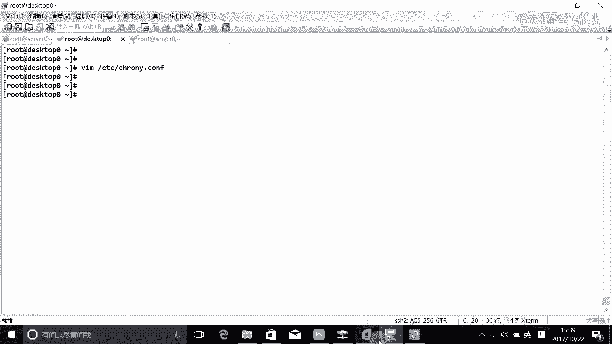
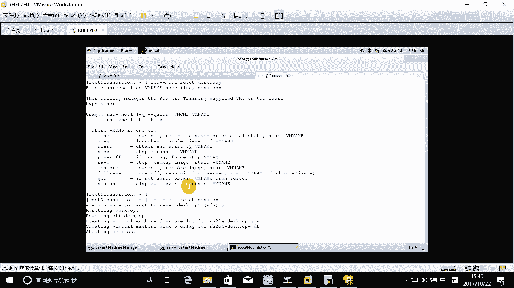
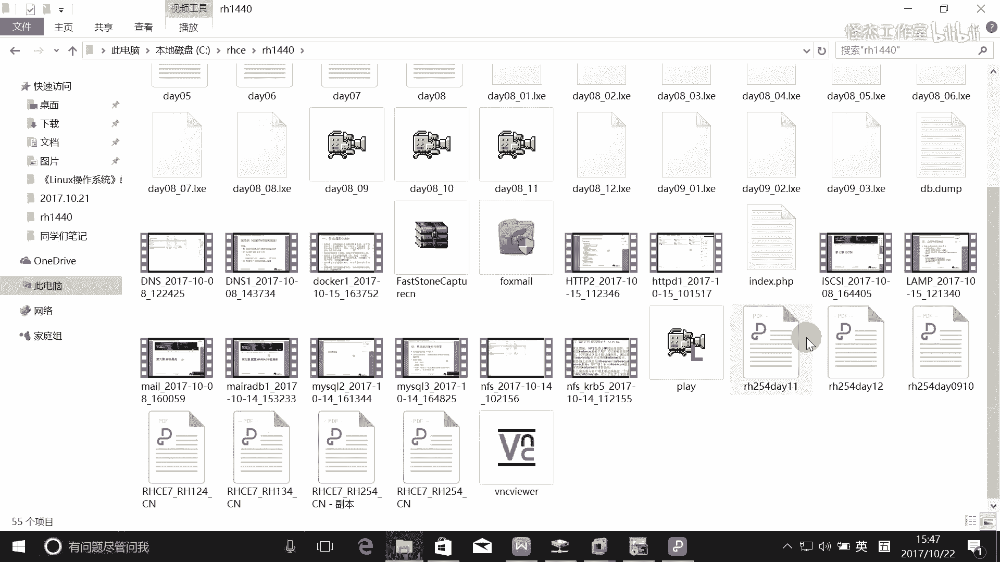
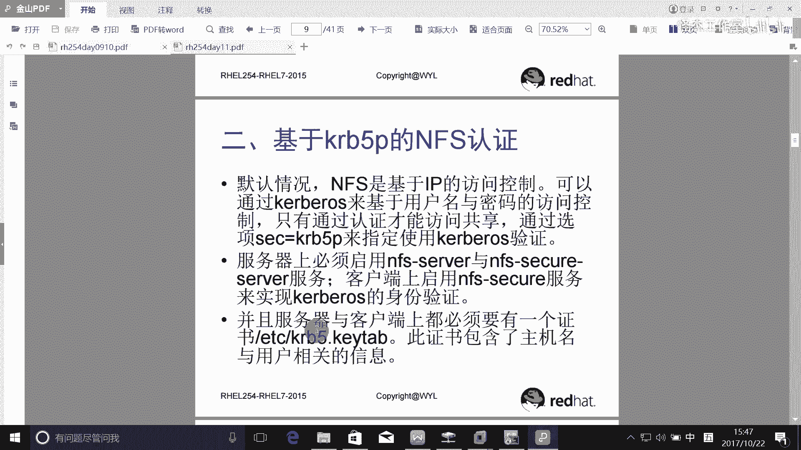
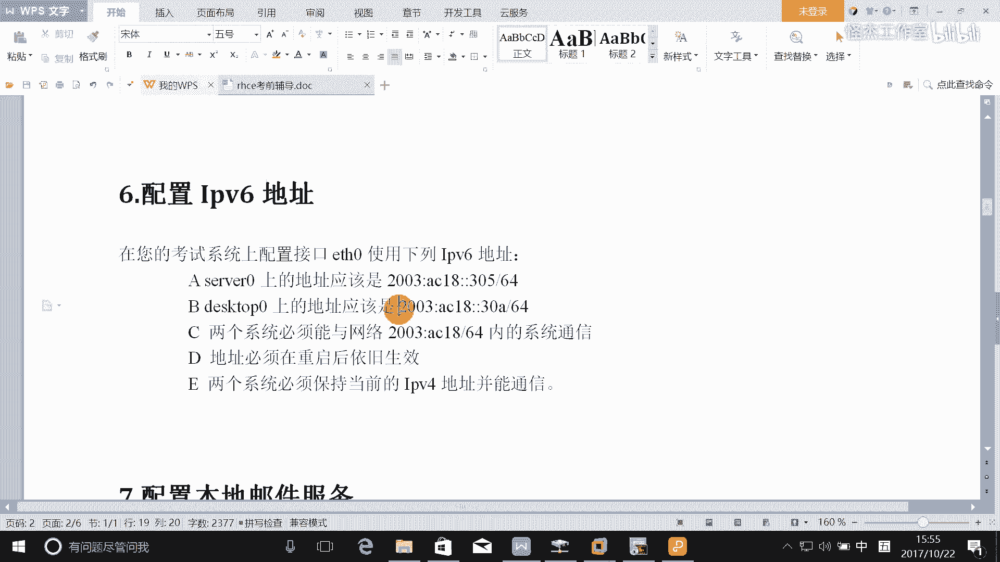
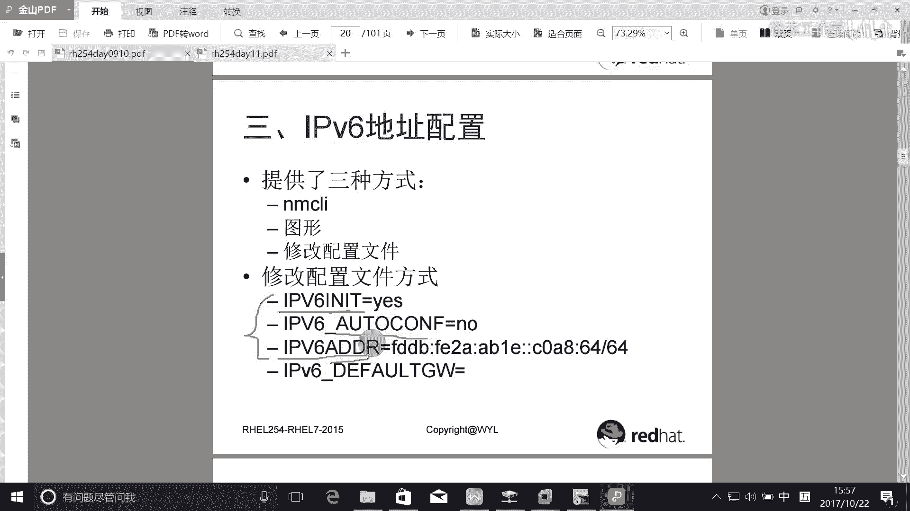

# Linux rhce认证考试视频教程 - P5：rhce_5 - 我叫怪先生 - BV1ub411p7Cs

啊，接下来的话呢讲一下这个an face的这个服务啊。any face这个服务的话呢就是。呃，这个里的话只考了基本的这个配置，就是我们基本的话就是基于IP的一个访问，对吧？然后还考了基于用户。🎼呃。

的一个认证啊，所以的话呢用户认证的话就是需要加入到这个什么科里面是吧？所以像这种情况。我们这个环境。🎼呃，是没有加入科ber域啊，就像我们的server和dto。所以的话在我们的实验环境当中。

我们需要在我们的虚拟机上面运行这个脚本。这个脚本的话就是让我们的这个让我们的这个serv和dto啊加入到这个科ber域里面去。啊，加入这个客户所域。那这样的话呢，我们才能做这个实验。

所以做这个实验之前呢。我们需要运行这两条呃，我们需要运行在这个serv和 diskto上面运行这个脚本啊。考试的时候肯定是不需要的。考试时候的话呢，已经把大家加入到这个课课普实用面去了啊。🎼2B5。

C塔是吧，是这个吗？就是。加入进去的话，我们才可以使用这个科里面的用户啊。比如说LDB40啊，你看现在有吗？是吧？那么加入进去了，那么才可以使用啊N4K2B5啊s up。嗯，加入进去之后啊。

这个的话其实其实其实的话做了一件事情是什么事情呢？就是我们昨天讲这个CC的时候，我们讲过怎么加入co域啊，加入这个LDP域，是不是啊？所以这个其实也是一样的啊，就是安装包啊，完了配置客户端啊。

把我们加到这个呃co域啊，其实就做了这样的一些事情啊，我们在这里的话我们就不重复了。我们在这执行这个脚本就可以了，好吧。啊，其实就是做了这样的一些事情啊。好。这是这个需要跟大家说明的啊。

那我们在做这个实验的时候，需要执行这个脚本。那考试的时候需要做吗？不需要做啊，考试时候的话，我们的环境已经都做好了啊。O。好，接下来的话我们就来做这个具体的配置啊。

首先在450配置aning face服务要求如下。你看执行完了之后，你看我们就有网络账号了。你看这个就是LB140是吧？它就是个网络账号。考试的时候的话，他也会告诉你这里面哪些用户是有网络账号。

前面不是刚刚讲了吗？进入考试之前的话有个说明是吧？在说明上面的话会说的啊，会讲的啊。首先A以指标的方式共享目录public是吧，就是。public啊，然后以读写的方式共享呢。可。tinted的是吧？

那这个的话其实我上个都演示过了啊，但是有些同学没来啊，所以说我们再演示一次啊。之前这里还有同学学的是红帽六的，都有是吧？所以的话再讲一遍啊，protected啊。红木六的话呢是没考这么复杂。

红木六的话是没讲到这个用户认证，只讲到这个GIP的一个认证。是吧基于客户端的一个。域名啊IP的一个认证啊，所以红包期的话搞的复杂一点啊。啊，科普呃就是这个共两个共享。完了之后。啊。

完了之后接下来的话呢就是要配置这个共享是吧？exporters啊写到这个里面去。工程的目录一个是。public能够被哪个域的用户访问？一个zepo点com，我们可以写新点一个ze点com是吧？

但是我们建议大家还是写对应的这个网段。那么他能只能进行什么？哦是吧，指读的方式啊，第二个是pro。Tt。那么。他能以读写的方式0。0啊。读写的方式啊。能被这个预占动系统访问啊。啊。

还有就是proteed需要通过科安全加密啊，使用下密钥。所以的话你这里的话基于科ber这个认证的时候啊，就用户名字认证的话，加个科ber密的话，这里需要加个选项s等于KR。B5P是吧，科是5啊。好。

退完了，这就是。这个配置文件的一个配置啊。好，接下来的话我们把这个证书要下载下来是吧，证书啊。W gate杠OO是小写还是大写啊？大写是吧，KRB5点kingtable是这样的吗？啊。

那这个网址在这里啊，考试时候的话就可以直接去复制啊，我们这里不知道能不能复制啊，试一下啊，因为它的这个word的格式不一样啊。我的格式不一样，所以的话可能不一定能成功啊。回车。成功了没有？成功了是吧？

ECZKRB5点king table啊，有啊。好。这个死掉了。两个字。编码不一编码不一样啊。是不是把这个编码改一下可以了？怎样去谈一下。也不完。重新连一下吧。有就可以了啊，反正我们这里的话。

你要知道每一每一台主机都有个K。所以话你一定要搞清楚它是个450的K，你看到没有？有点看清楚了，下的是受0的跳。啊，那考试时候的话，他你下什么 team就下什么 team啊，我们就下的这瑟50的厅啊。

别要瞎说了，完了之后。🎼啊，第一啊目录protected应该包含名为project拥有人为LDB索尼的一个子目录。所以我们在这里的话，我们需要在这个protected的下面去建一个什么？

或如说je克这样的怎么，并且他的拥有者是谁呀？谁取过了LDP就是0是吧？🎼说这个不能按what加句号，不能我按这个what加点，真的很痛苦的。所以还是不喜欢用这个不喜欢用这个sC2T啊。没办法。

我这里只有这个客户端。呃，Protected project啊O。好，用户IDAU跟140你能以读写的方式访问这个目录。Co。taket能易读写吗？LDB40有读写方式能不能读写啊？是不是搞定了？

OK这就是服务器端啊，那么服务器端做完之后应该怎么做？对，要启动这个服务，他叫。re start是吧。那么还有一个基于科认证的是吧，他叫什么服务啊？A你费事。Security。SEC。

 you are意。收我是吧，OK。那么是不是还要把防火墙配一下？someD啊pro momentement，然后呢，I的。按service，那么它有几个service，我们上课节说讲过了。

一个是any face。还有一个什么？monkey了还有个什么？对，RPC。办的是吧？啊，把这三个服务加进去。re读一下啊。大家一定去多去做一做啊。这东西的话做熟了就好了啊。其都没有。啊，对。

还有ela是吧，自己写一下，我就不写了啊。一定要以内部，对不对？内部啊这是服务器端啊服务器端啊，客户端。客户端的话。就是。A publiclic挂在在下面的这个目录上是吧？所以我们在这里的话呢。

在这里的话，创建。爱人费丝梦。你不是。seeccurity啊。然后要永久挂载是吧？所以的话我们在这里写写到这里面啊，就是172。25。0。11，下面的什么共享啊？下面的public挂在到哪里去。

MT下载什么？人家是moote，文件性的类型叫什么？是完第。DF default。00是吧。然还有一个是172。25。0。11，下的什么？不lo。tate的是吧，挂载点是MT下的NF。

Security any face啊。那么在这里的话呢，因为它是要通过A课认证是吧？所以的话就写个选项C等于K2B5T啊，还需要写什么吗？把睡息了吧。你你啊。OK保存退出来。

那么现在是不是也要下一个Q才行啊，杠O啊ETC下的KRB5点king table啊。我们也来复制一下算了啊，考试这些网址的话都是可以复制的。因为它是在网页上面都是文本的。没事。去去带这托宝林了吧。

OK因为因为它是每一台主机啊，都有一个证书。他主他的这个证书是基于主机名的啊。好，接下来的话。在客户端需要启动一个服务啊，叫做什么？seeccurary是吧。好，然后。然后要求是LDP0。好。

我们来我们先挂一下，看能不能串电啊。挂载一下。一个是MNT下Nface。Moote。这没问题是吧。还有一个就是。人民天下的anyface security。吓。出错了，你看到没有？访问拒绝呀，看到没有？

Iserv当去挂载这个东西的时候。呃，这个问题在哪里的？很多人会碰到这个问题啊。啊，我是很少碰到这种问题的啊。不是啊，不是这个问题。这个问题的话呢，大多数呢是跟我们的这个。夫妻有关系啊。

就跟 classroom树没有关系。跟classroom有关系。所以我们在做这个题目的时候。现在啊。好，现现在的话呢，这个估计这个也挂不了的啊，所以的话你不要去挂了。

因为我们这个配置的话是我们这个配置是没有问题。对，所以的话在这里的话只能够去把这些。东西啊在。再做一下。你这是不是。证书过程。呃呃，很有可能啊，就是日期时间的问题啊。对，时现问题。

所以呢这样的我们我们再重新来一次啊，重新来一次怎么做呢？就是把这个时间再改一次啊。好，我再演示给大家看一下。所以的话大家。我们看一下这个date，你看对不对啊。1月12。但是他是。但是这个时间的话。

他是他是他为什么是11点他为什么是11。08分呢？Data。嗯。Time data control。这时间是不对的，看到没有？CT是我们中国的事情吗？对不对？把时间改一下吧，把这把时间改一下，完了之后。

把把所有的时间都同步一下，好不好？完了之后再来做一下啊。硬进的时终怎么事，对不对？呃，W克洛是吧？干2吧，干干什么就直接回车也可以吧。他什么时候啊，11点09分。晚上啊。あでし。跟时际有关系啊。

和谁性关系？所以做这个题目的话呢，就是考试的话应该是考试的话是不会遇到这个问题的。为什么？因为它时间都已经同货部了，所以你可以去看一下他客户端的时间跟服务器时间是一样的，你也你也到了。

你也到达不了这个考试时候的话，你也到达不了这个考官的服务器，你也查不了这个服务器。但是的话一定是这个同步的啊，所以我们在这里的话，把时间改一下，好吧，然后再来做一下这个实验啊。

Time data control seat。ctime姆是吧。是是是是是是。这条命令可以这条配命令可以试试的吧。他们 data control。还有一个就是我们的foundation的时间。

foundation应该是问题不大啊。呃，sit。嗯。time啊，我们就直接用time来呃，直接用这个来同步算了吧，date啊。现在是。10月22。15点。15点37是吧。15点37。

完之后保存硬件也保存一下，所以的话干杠是干2楼吧，干W吧。接进去啊，我们再查一下HW。Cllock。啊，现在就一现在是一致了吧。下午的3点，对吧？3来37分，没问题啊。没问题之后把它重启一下呗。

没事完了之后，我们把这些时间都同步一下啊。啊，这样我们。哎，你TP但是你没起呀。いじ。没起呀。我们时哎。有有有提供时间服务。那这样吧，我们把时间都同步一下算了，好吧。我把时间都同步一下啊。系呀。把。

时间都同步一下，然后。172。25。254。254。是吧24。24。哎，这样吧，我们干脆。重新来一遍吧，好吧。把它重置一下吧。证9。嗯。

嗯。只是间。重置一下吧，重置重置再做一遍吧。啊。说万。没。因为刚刚已经我做过一次了是吧，可能会也会有一些问题啊，所以的话干脆重新做一次，好吧。重知一下啊。是。权你。不是。不是问题之前资记着重新推过。对。

重新来一次吧啊。

这个我们我我们把这个。我们把这个科普斯这一块做一下啊，public这个就不做了，好吧啊，public就不做了啊。你后面把pub里个加上去也可以。所以这个实验的话多做才才行啊，所以边的话。稍等一下吧。

所以大家做这个实验的时候啊，就整体上来讲的话，最好还是先把这个呃就是做之前啊，所以每次做实验之前的话，最好是把这些时间啊这些东西的话先搞定先啊。稍等一下啊。是。签多了这个。这个我们上课的时候都做过了。

是不是？上课的时候演示过啊。讲过吧。先断开。어。好。看一下这个时间啊。这事情好现在是不对是吧？我们改让他去跟他同步吧。啊。搜是吧，172。25。254点。而不是。A妞外D是吧。啊，这。

考试时候的话一定是同步的，这个不同步的话，肯定是会出问题的啊。我们这里的话呢就是做实验的这个环境啊，这是环境问题啊。嗯，多了个点。等一下查一下，看一下它同步了没有CHRONYCOURCES说杠V是吧？

现在没同步的啊，把这个第个突这边也做一下啊，我们。重新连接啊。所以这个环境很重要啊。172。25。0。11。啊，不是我们夫妻是254。254啊。按那个。那个不要了。对啊。这个这个题目昨我们昨天都做过了。

时间同步啊是吧？好，查一下。那个是优先，你知道吗？你想优先跟哪一个同步，你就把那个参数加上去啊。sourceces杠V是吧哎。Sa H are O。CHROA。1 see。这是S吧。还没有是吧。

看这边这边也没有，稍等一下吧，不急啊。这环境很重要，你急的话也急不来啊。老师嗯，我没有让他立刻同步的。那个同伴哎，你听哎，你TPda应该是可以的。OK这也同步了是吧？好，同伴我们晚上做一下啊，来看一下。

再查一下是吧，这个时际没问题了吧。看一下这边同步有没有。还没有啊。然后我们在这里的话呢，就是。还是要执行这个脚本ni anyFSKRB5C type是吧？哎，这边也通过。来吧爱年fskB5嗯Ctop。

嗯。好，我们把这个就是基于科ber认证，把这个做一下，好不好？然后在这里要创那个pro。tted是吧，完了下面还有一个proloje是吧？完了之后CHwoowLDP有锁零是吧？

project哦protect下面的project是吧？呃，完了还做什么，把证书下载下来是吧？看大学OETC下的。K2B5点c table是是这个吗？是不是这个？看一下是不是这个啊。这是第11天的。

嗯。😊，11天。K2B5点进那个没问题啊。

然后把这个复制一下啊。这个色我的话就不是serv我的证书。复质。粘贴。O。那这边还需要做什么？就配置这个exporters是吧？我们共享的是pro take的是吧，配水冷访问172。25。0。024。

那他有什么权限啊？读写还有呢。sker等于K2B5P。好，然后启动一下f restartstar any face。SECU。securityserv是吧？王之还要做什么？把这个label一下啊，你思。

防火墙。翻沃。声啲。Promoote， either service， any face。还有什么？忘记了，还有呢。2RPC。按的是吧。Re录一下。这边还需要做证么？啊。还需要做什么？福梯这边。

好像不需要做了啊。啊，客户端这边。等的，先把这个证书下载下线啊。K2B5点K。可以不是吧。完了之后。然后呢，他呃，然后的话就是创新挂在点嘛。就是他MN下的anface。1个月是吧。完了之后写到F里面去。

就是172。25。0点什么？11的。叫什么。K体的是吧。把它挂载到MNT下的an face securitycur啊，an face。Defaers。sker等于K2B5。皮。

OK然后然后还要还要做什么哇，要启动一个服务是吧？😊，原定费是scur月啊。MT下的N securitycur。是不是？就没问题了啊。所以这个环境很重要的是吧？很神奇吧。嗯，好，接下来我们来测试一下啊。

测试一下。测试一下，就是LDPSS0能够在这个上面创建文件，那能创建文件吗？那我们切换过去吧。诶TP有说0。然后CD。你问题。你看他能进去吗？什么权限都没有，你看到没有啊？好。是不是啊N你会。

Securary， yeah。没权限。没出权。啊。没权限啊。MMT。And你 say机你系啊。是吧。有个什么project，是不是这都没问题的。你看。是吧那么我切份过去，为什么写，还就这个问题所在吗？

上课的时候讲过了。记不记得有没有人能把这个问题解决一下？什么问题？不记得了吧。每个人记得吗？😡，这个的话要做什么东西啊？前面的话呢就是基本的话是做这个什么基于IP的认证是吧？我们这是基于什么？用户名。

及用户的认证。什么叫认证？认证的话，我们之前讲了有本地认证有这个网络认证是吧？本地名的认证。本地认证的话，用户名和密码都在本地是吧？那现在的话我们是网络用户。用户名和密码是不是都在服务器里面。

在kis里面是吧？那这个时候。什么叫认证？认证的话就是什么？需要输。口令对不对？这才叫认证，是不是？比如说你要把钥匙才能进来吧，这个就是认证是吧？所以我们这里的话也需要口令，我们有输口令吗？对。

没有说口令。所以的话。我们要采用这种方式去进行测试啊。叫什么？是登录到哪里去啊？对。呃，这种方式。密码是什么？密码就是科ber尔斯啊。😡，明没有？那这个时候的话，我们再进去看一下MT。

你看还会显示一些问号吗？就不会了。为什么？因为你是通过了认证呢？是吧。그借给他。他是一个。第点。Tt。是不就没问题了？O的。这叫认证啊。认真就是需要输口令，有了口令，你才有权限。直接切换过去是不行的啊。

我之前是不是直接切换过去啊，直接切换过去的话，你有认证吗？😡，没有认证。O。好了，这就是第十题和第十一题an face题目啊。呃，这样的大家做这个题目的时候，一定刚刚讲了，注意的就是时间要同步。

所以把classroom把它重启一下，把它我就是把时间配一下，然后再重启一下，最好是啊重启一下，让它让这个环境生效啊，还有就是今天我们还有一个任务没完成，就是IPV6。这个题目能不能自己搞定啊？啊。

PPV6应该没问题吧。啊，这个上课也讲过是吧？那么那么上课的时候的话，我讲的是采用什么方法啊？

还记得吗？IPU里行像就第二张的是吧，第二章的。在电路聚合的前面。那就这里吧。呃，配置这里提供了什么？三种方式对吧？三种方式。那么不这三那么前面两种方式的话，最终也是修改配置文件，对吧？那配置文件。

所以的话呢这里的话可能需要就是就是我们考试的时候的话，图形用不了，是不是啊？所以的话最多就是两两种方法。第一种就是用这条命令的方法。啊，要么就用这个命令的方法，要么就修改配置文件的方法啊。

如果你对命令这个。比较有信心啊，那你就用命令的方式啊，但是我建议大家还是修改配置文件的方式。把这几条命令记下。啊，IPV6等于yesIPV6otto cin等于no手工配置就等于no是吧？

完了再把这个IPV6ADDR写上去就可以了。这里不需要可以网关吧。不学会网关，所以把这三个参数写一下好不好？这个我就不测试了，好吧。这个的话我相信大家都能考定啊。就是写这三条，对吧？

就这三条把这三个记一下，这个的话。这个好像我没找到更简单的方法啊，所以的话呢大家如果是有好的方法告诉我一下，好不好？跟大家分享一下啊。好吧，我在这里的话就是记住这三个参数，全部都是IPV6嘛。

一个是elit，一个是aual con费的，一个是ADDR了。这个可能稍微需要记一下才行啊。O。

好，下面的时间啊还有一个小时。那么今天的这个。