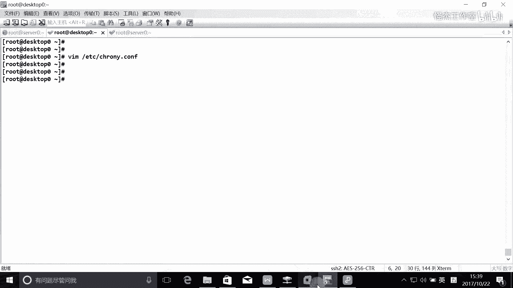
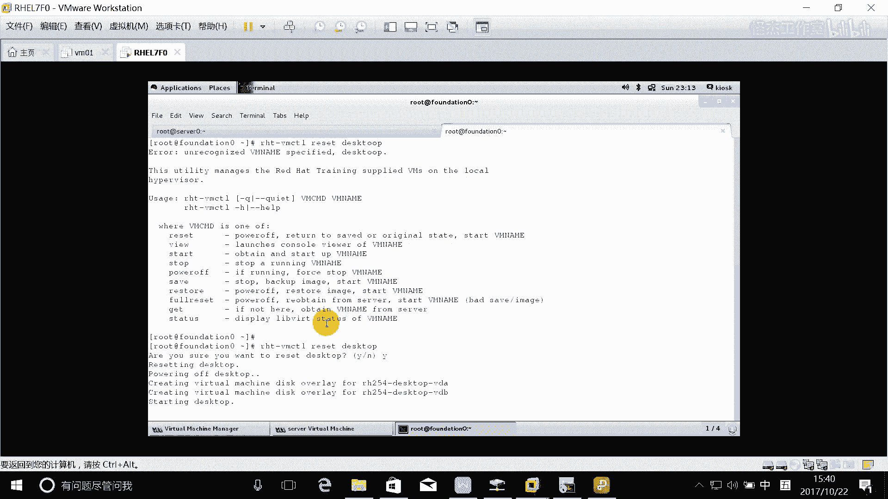
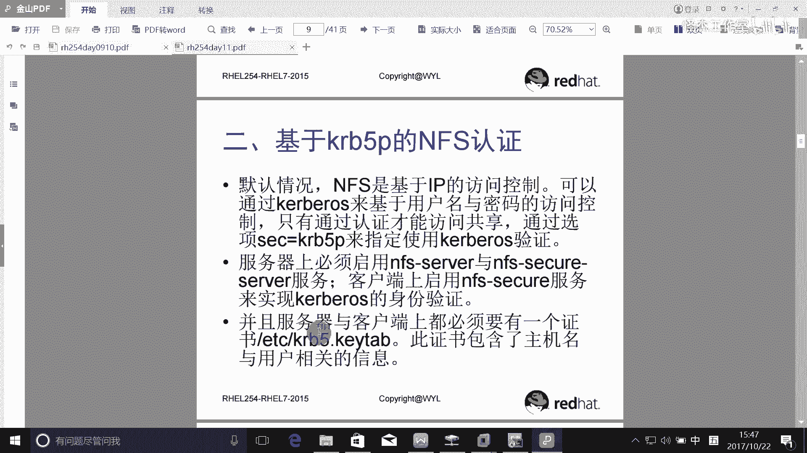
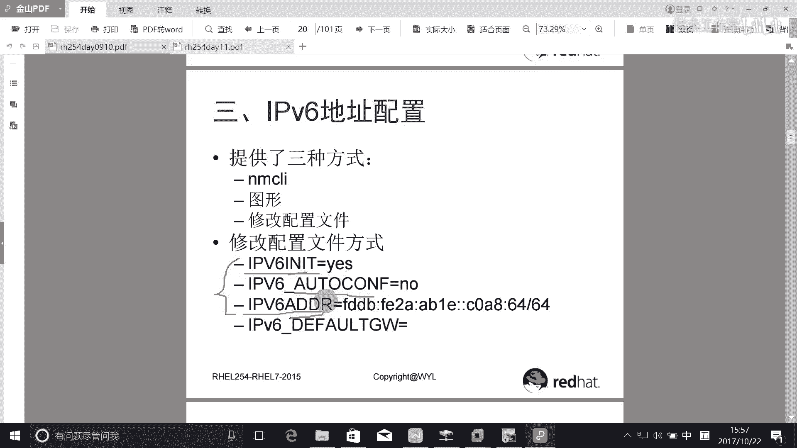

# Linux RHCE认证考试视频教程：P5：NFS服务配置与Kerberos认证

在本节课中，我们将学习如何配置NFS服务，特别是基于Kerberos的用户认证。这是RHCE考试中的一个重要考点，我们将从基础配置开始，逐步深入到更复杂的认证机制。

## 概述

NFS（Network File System）服务允许在网络中共享目录和文件。RHCE考试不仅要求掌握基于IP地址的基本访问控制，还要求配置基于Kerberos的用户认证。本节课程将详细讲解这两个部分的配置步骤。

---

## 环境准备与Kerberos域加入

上一节我们介绍了NFS的基本概念，本节中我们来看看如何为基于用户的认证准备环境。基于Kerberos的认证要求客户端和服务器都加入同一个Kerberos域。

在我们的实验环境中，`server`和`desktop`虚拟机需要运行特定脚本以加入Kerberos域。考试环境中此步骤已预先完成，但实验时需要手动执行。

以下是加入Kerberos域的关键步骤说明：
*   该脚本实质上完成了安装必要软件包、配置客户端并加入LDAP/Kerberos域的工作。
*   执行脚本后，系统将拥有网络用户账号，例如`ldapuser0`，这是进行后续认证测试的基础。

**注意**：确保所有系统时间同步，这是Kerberos认证正常工作的关键。可以使用`chronyd`服务进行时间同步。

```bash
# 示例：配置chronyd同步到时间服务器
systemctl enable --now chronyd
chronyc sources -v
```

---

## 服务器端NFS配置

环境准备就绪后，我们开始在服务器端配置NFS共享。配置要求是创建两个共享目录，并设置不同的访问权限和认证方式。

NFS的共享配置通过`/etc/exports`文件管理。以下是具体的配置条目：

```bash
# /etc/exports 文件内容示例
/public *.example.com(ro,sync)
/protected 172.25.0.0/24(rw,sync,sec=krb5p)
```

**参数解析**：
*   `/public *.example.com(ro,sync)`: 共享`/public`目录，允许`example.com`域的所有客户端以只读(`ro`)方式访问，并使用同步(`sync`)写入模式。
*   `/protected 172.25.0.0/24(rw,sync,sec=krb5p)`: 共享`/protected`目录，允许`172.25.0.0/24`网段的客户端以读写(`rw`)方式访问，并启用Kerberos加密认证(`sec=krb5p`)。

配置完成后，需要创建所需的目录结构并设置权限，然后启动相关服务。



以下是服务器端的完整配置流程：
1.  **创建目录与设置权限**：
    ```bash
    mkdir -p /protected/project
    chown ldapuser0 /protected/project
    ```
2.  **应用NFS共享配置**：
    ```bash
    exportfs -rva
    ```
3.  **启动并启用NFS及相关服务**：
    ```bash
    systemctl enable --now nfs-server
    systemctl enable --now nfs-secure-server
    ```
4.  **配置防火墙**：
    ```bash
    firewall-cmd --permanent --add-service=nfs --add-service=mountd --add-service=rpc-bind
    firewall-cmd --reload
    ```
5.  **获取Kerberos密钥表文件**：从考试环境指定的URL下载服务器的密钥表。
    ```bash
    wget -O /etc/krb5.keytab http://classroom.example.com/pub/keytabs/server0.keytab
    ```



---

## 客户端NFS配置与挂载

服务器配置完成后，我们需要在客户端配置挂载点。客户端需要挂载服务器提供的两个共享，并使用不同的认证方式。

客户端的配置主要涉及编辑`/etc/fstab`文件以实现永久挂载。

以下是客户端的配置步骤：
1.  **下载客户端的Kerberos密钥表**：
    ```bash
    wget -O /etc/krb5.keytab http://classroom.example.com/pub/keytabs/desktop0.keytab
    ```
2.  **配置`/etc/fstab`文件**：
    ```bash
    # /etc/fstab 文件内容示例
    172.25.0.11:/public /mnt/nfs nfs defaults 0 0
    172.25.0.11:/protected /mnt/nfssecure nfs defaults,sec=krb5p 0 0
    ```
    *   第一行：挂载公共共享，使用默认选项。
    *   第二行：挂载受保护的共享，必须指定`sec=krb5p`选项以启用Kerberos认证。
3.  **启动NFS安全服务并挂载**：
    ```bash
    systemctl enable --now nfs-secure
    mount -a
    ```




---

## 测试与验证

所有配置完成后，最关键的一步是测试。对于基于Kerberos认证的共享，访问方式与普通共享不同，需要进行身份认证。

直接切换用户无法通过Kerberos认证。正确的测试方法是使用`su - ldapuser0 -c “command”`或先获取Kerberos票据。

以下是测试步骤：
1.  **获取Kerberos票据**：首先，用户需要获取访问权限的“钥匙”。
    ```bash
    kinit ldapuser0
    # 根据提示输入密码（在考试环境中会提供）
    ```
2.  **验证挂载与访问权限**：获取票据后，即可访问受保护的共享并执行操作。
    ```bash
    cd /mnt/nfssecure/project
    touch testfile.txt
    ls -l
    ```
    如果`testfile.txt`文件成功创建，则证明基于Kerberos的NFS读写配置完全正确。

**常见问题**：如果访问被拒绝，请依次检查以下项：
*   服务器与客户端时间是否同步。
*   Kerberos密钥表文件是否已正确下载。
*   `nfs-secure`服务是否在客户端运行。
*   防火墙规则是否允许相关服务。

---


## 总结

本节课中我们一起学习了RHCE考试中关于NFS服务的核心配置。
1.  我们首先理解了为NFS配置Kerberos认证所需的域环境准备。
2.  接着，详细讲解了服务器端`/etc/exports`文件的配置语法，包括基于IP和基于Kerberos认证的共享设置。
3.  然后，我们完成了客户端的配置，通过`/etc/fstab`文件实现永久挂载，并指定了认证方式。
4.  最后，我们掌握了正确的测试方法，即通过`kinit`获取票据后再访问受保护的共享，从而验证了整个认证流程。



通过本课的学习，你应能独立完成具备用户认证功能的NFS服务部署，这是成为一名合格的Red Hat系统工程师的重要技能。