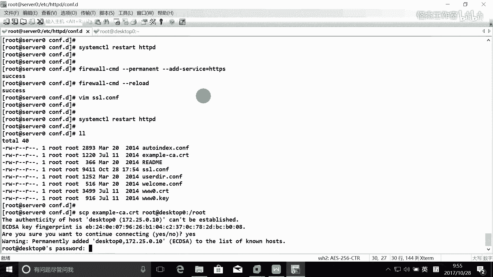

# Linux rhce认证考试视频教程 - P6：rhce_6 - 我叫怪先生 - BV1ub411p7Cs

好，O。好，今天的话我们就接着讲啊。这个。我们从12题开始了啊，今天的话还有12个11个题目是吧，总共是22个题目。🎼啊，那么接下来的话呢好像有5个题目的这个微博题目啊，又是一个大块是吧？

之前的an face三把大块，这个微博也是一大块。所以下午的题目的话，其实就是工作量特别大是吧？所以总共考试三个半小时，真的是一般考试的话，大概大家都要做到两个半小时左右。啊。好。

接下来的话我们就把这些微博题目来做一下啊。首先第一个server上配置这一个是吧？然后从。啊，那么首先的话是这样的，我们先把这些软件安装起来啊。养因视多。HTTPD是吧？完了之后。

网页的话是需要从这个网站上去下载啊。下载的话，我们一般的话大家都通过这个什么W gate去下就行了。对不对？dble gate就可以把它下下来。这里的话考试时候是一个网页，所以的话是可以复制的。啊。

可以复制，你手去敲的话，就不知道敲到什么时候去啊。因为我们的这个时间本来就紧，所以的话一定不要去敲了，就直接去复制就可以了啊。完了之后从这里下载之后，并且将文件重命名是index点HTM。

那我这里的话是没得下载的啊，我们这个是实验。所以的话我们在这里的话呢哇3WHTM，我们自己来建一个文件就行了，好吧。建一个，比如说这是十2题，我们建1个12放到这里啊，那么首先叫index点HTM呢。

嗯，就这一个，那么下载下来的话，大家一定要看一下它的什么安全上下文，对吧？我们的这个网页的这个安全上下文是这样的一个东西。所以一定要看一下这个安全上线文才行啊。好，这是这一个。好。

不要修改此文件的内容啊。然后将文件复制到您的微博服务器的这个document rootot这个目录下面。我们刚刚是不是就在这个doment的这个目录上面接的？我们的这个HTTPD的话。

它默认的这个什么document就是这一个，对不对？我们就是在这个下面接来啊。店自己上不到。啊。这个服务地方。这个文件是吧，我们下载之后不一定叫这个文件。哎，比如说你看你下载的时候叫12点HTM。

对不对？你就必须把它改名成这个。将文件 copypy到这个dockerment的入目录下。好，完了之后，来自于这个域的客户端是可以访问的。这个域的话是不能访问的那这个的话又考的什么？防火墙是吧嗯。

防火墙这怎么写啊？我们授先启动它吧restar HTPD是吧，你定要什么？对雷啊。啊，完了之后，接下来的话就是要配防火墙了，是吧？防火墙怎么配呢？这个是一个什么？附规则。对不对？

所以的话就是哎首先promo，然后挨着。Rich。ruer是吧，那这里面怎么写，还记得吗？反正我是记不了，你能进住吗？我记性很差的啊哈。我所我我。所以我们来得下帮助吧，发过是吧？啊。

没有那个什么没有那个。没有那个数据库是，没那个库文件啊。稍等一下啊，你能记住吗？我真的记不住啊。你接着说入ler family是吧？名字。嗯，等于IP。V4，然后呢source。说死，决死是吧。等于。

172。25。0。0之前讲过它的这个圆的话。它的这个原的话是对应的是1个IP地址，是一个网段是吧？这个在说明里面有说明的啊，就是考试之前有段说明文字，有说明，大家去看一下。

比如说一个zimer点com对应的是它。完了之后还写什么？说一啥。我也是以 serviceice有意思吗？哦。屋企嚟使。是维是。80是吧。就是然后。except就可以了。哦，对对对对对对。

破的才是80啊。对对对，HTDP。嗯，对。可以吧。だです。S。也不对。有内 so内嘛。啊。service name是吧，service没有意思吧。🎼O。过完你真的不好。这我记不住多多去多多去多去瞧几次。

好，完了之后，这是允许的是吧，还有一个什么？定卖是吧，完了这就是网段不一样而已啊。比如说1。0是拒绝的。不是叫 deny娜呀。reg是吧，对，re。O。这个写搞诗科，有时候写规则写是写作文，然后。嗯。

那么考试时候最好是写锐记，不选就就这个上课的时候已经跟大家讲过了是吧？啊，因为考试时候的话，他是通过脚本去探测，完了之后有回应，有SNP的这个回应的话，他就认为你对了。啊。对，所以话要写这个reg啊。

天然。告他这什么都。reload一下是吧，让他马上生效，查一下fireworkCMD。Mister。我是吧，你说两条规则有了吧。就OK了啊O了。好，我们在这个dd这边来测试一下，看一下行不行啊。

HTTPserv0。1个ze点com，你看能访问吧啊，就可以了啊。那么考试的时候的话，这些域名啊，它都是可以解析的。它在DN服形上面都可以帮你做到这个解析的。所以这个解析不不帮我们的事情啊。

所以的话你这个DNS没有配对的话，你这个域名能解析吗？就解析不了的。所以的话这个DN所以这个DNS的话一定要配对啊。ok。啊，这就是2题有问题没有？😡，娄题就过了啊，就13题了啊。

13提是配置安全的微博服务。为安全为站点来配置1个TS加密的一个签名的证书啊。那么这个的话呢，我们上课是重点讲的，我就是还我还超范围了是吧？做了一个通过CA来进行签名啊，就是颁画证书，还记得吧？啊。

那么这个的话呢，就是我们要做HTTPS的话，需要两个证数，哪两个证数？一个是服务器的。私要证书，还有一个是服气的什么？对工要技术对吧？这服务器的公业证书是哪里来的？😡，对，是CA颁发的C给他签名的是吧。

C给他签名的。所以的话呢。啊，所以在这里的话呢，我们在这里的话就是需要得这两个证书才行啊。好，接下来的话呢实际上首先第一个我们还是安装包。把包裹的安装好yonin storeHTTBS的包叫什么名字啊？

诺的。SS楼是吧。那么这些包的名字大家一定要记住，考试时候没有人告诉你了。啊。完了之后呢，就把这个证书下下来是吧？那么们证书下下来的话，我们可以把它放到这样的一个位置里面。你安装完了之后。

它其实就多了一个配置文件嘛，是吧？我们。就可以把证书下到这个里面来。W gate考试时候的话，可以直接复制了啊。我不知道我这个word里面的这个格式是不是对的啊。如果是对的的话，复制就没问题。张贴。

可以啊。还有一个是私要证书。张停。没问题是吧。啊，那么其实的话有这两个证书可以了。但是的话呢我们这里的话呢呃就是呃为了这个考试的。考试这个。呃，为了考试这个更完整性吧，可能他怕这个。扣分。

所以的话呢把这个CA的证数也写一下，好不好？C的证书在这里。其实跟CA的证书没什么关系了。为什么CA的证书的话，它是自动会导入到这个什么浏览器里面去，是不是？就是在浏览器里面的话。

知名的CA证书是不是都有啊？都有的这个上课我讲过了啊，讲过了啊，我刚刚下节这个数完了之后，接下来的话就是配这个配置文件。在这个配置文件里面，我们要看一下。首先第一个它是为这一个主机配置，是不是啊？

所以怎么做怎么做呢？说怎么做呢？怎么做呢？哎，这里就这个servver什么？对，so name把这个doment在这里都可以把它去写去掉，是吧？他是为这个。为这个什么serv零点。

一个zimle点com来设置这个虚拟主机的啊，来设置这个什么这个HTTPS站点呢。完了之后。还有其他要求没有？证书是吧啊，证书的话配证书在哪里配？证书就这两个是吧，一个是。他的服务器的证书。

也个是服器的。私要证书对吧？把这两个稍微改一下就行。好，把这两个改一下。就是ETCHTTP低下的什么HTTP呃呃对CONEF点第下的什么？ち。这是这是公钥还是什么私药证书是吧？私药证书的话就3WD。切。

你点去啊。好，那么这里的话是我们的。夫妻的证书是吧？HTTPD下载30伏点D下的什么3W0点CRT是吧？O。哦，还有就是其实配这么多都可以了啊。但是的话呢，我们考试的时候。

他既然把这个CA的帧数也写出来了，所以我们把这个CA的帧数也配一下。那么CA的帧数的话是配置在哪里呢？在呃C在这里啊，这讲的是C是吧？C把这个C这里这一行把它注释，把它去掉。叫HTT。

P底下的CONF底下的。叫什么？一个侦破杠1A点C2T1A。一个真炮。看谁电。点CT前面的注释也要把它去掉啊。OK那么这样就可以了，保存退出来。完了之后呢，对，要重启服务啊，HTPD。

让它生像完了再去测试是吧，再去测试。这试怎么测？现在现在现在可以，现在能访问到HDPS吗？还不到。还不到，为什么？我们的防火墙配好了吗？还没有是吧。那就什么I的service就可以了，是吧？

按照设备是就行了。然还说什么？就可以了是吧，CMD然后呢。Re漏下。这样可以反过来吗？

应该可以了吧。我们在HTT我们在这个桌面这台主机上面去去访问一下，好不好？

访问一下。

啊，直接在这边返问算了吧，在这边返问啊。那么其实的话呢，我们就是打开这个。S的话就是要验证是吧？但是我们这里的话呢，你要指明一个。指明一个什么东西来验证呢？杠K就是有什么跳过验证是吧？跳过验证。

你要跳过验证是可以访问的是吧？那么验证的话应该也是可以访问的。其实所以你配完之后，如果通过这种方法能访问到，我觉得就可以。

那么他就这个题目就做完了。当然的话你可以打开浏览器去访问一下啊，我打开浏览器去访问一下，好不好？刚打起来X啊。我在这个di个托上面来测试一下。按照翻我。呃，不是不是fi by false。好。

然后来输什么。HTDP。S。嗯，然后servver0点。一个侦破更好。你看。有问题，你看到没有？什么问题？看清吗？两个问题是吧。那说就是说他有一个无效的安全证书吧，两个问题。

第一个问题的话就是什么这个证书。呃，不被信任。原因的话是这个签署者。这个就是这个签签，就是就这个C是不受信任的，为什么呢？有。对，因为我们的C有导入到这个浏览器吗？没有。

就是默认的中要的C是不是都在浏览器里面？这个我们上课讲过了啊，所以这个问题的话不是问题是吧？这个问题不是我们不是问题，对吧？第二个，这个证书仅仅有效的是附这样的一个域名，知道吧？说这个域名。

所以我以后会把这个题目改一下。

啊，所以以后的话应该是把这个题目改一下才行。改成这样行。就没问题。改成这个题目就没问题。啊。嗯，对我们把这个配置文件改一下，好不好？把这个配置文件改一下，这个证书仅仅为他有效。好吧。

我们把这个文配置文件改一下。那考试的时候，他他他说这个域米是什么就是什么，好不好？3W0啊。啊。没有这个呢这个域名是可以解析的。是可以解决的啊。所以的话呢。

所以在这里的话，我们访问的时候要这里的话要写什么？3W0就是没问题了，是吧？哎，那这是技技术细节，你看是不是那个没有了。只有一个了是吧，这个问题怎么解决的，还记得吗？😡，把CA的。

把CA的证书导到浏览器里面去啊，我们也也把它做一下，好不好？

把CA的浏览器把CA导进去。那么C的证书在哪里呀？我刚刚是不是已经下载了？把它复制到C。把它复制到哪里去了？被这个托破0上的什么？就复制到他的root目录，好吧。

啊，然后再导一下，考试时候的话不需要去做这些啊，我们这个只是做一个验证，对不对？吓死你了。啊，考试不需要做这么复杂的。

因为我们我们这只做一个验证，你知道吗？做验证，真的其实做的话就是改这些文件就就成功了是吧？啊，就是改这个配置文件，把这个配置文件一改，把防火墙加这个题目就做完了。😡，鼠标按点。啊。呃，1年。

好。我们就是要把我们就解决这些问题是吧？啊，解决个问题。如果这个平常大家访问这个HTTPS站面的时候，如果你看到这样的一些问题。那你就要去好好去思考一下了啊。然后导进来怎么导啊？A地特这里吧。

高级有个什么？证书对吧？完之后我们要哎导入证书又在哪里啊？查看证数。完之后呢，再来进行导入是吧？导入我刚刚是放到这里面的，你看到没有啊？open。信任他的这个什么微博站点是吧。

这个这个这个这个证书是信任微博站点的，是不是啊？O ok。close再刷新一下。你看还有任何提示吗？没有任何提示了，就说明这个有没有问题了，对吧？我们的C我们这个HTPS的时候。

我在我记得我在上课的时候讲的它有两个作用。第一个的话是什么？就是客户端跟服务器之间所有的数据被。加密了是吧？第二个就是我们的客户端可以验证微博服务器的。身份对吧？第一个的话是加密。

第二个的话就是验证是吧，验证身份。那么验证身份的话，其实刚刚就是验证身份，就是不是刚刚需要这个CA的这个证书啊？所以的话你看他这没有没有C的证书的话，是验证不了的。所以这个题目的话，验证的话。

你要去做就这样去验证一下。啊，这样的话你看反正就说你直接在这里刷新，能够打开，没有任何的安全警告。那么就说明。这个没有问题。

好，就没有问题。好，大家也可以详细的。如果是要需要详细的去了解的话，就把上课的视频好好去看一下啊。上课的视频的话讲的很详细的啊。好了，这是13题。其实这个题目的话做起来还是很简单的啊。

只不过我们在验证的时候比较麻烦一点。24G配置虚拟主机。这就是你主机。是我一口气把它讲完再来做，还是什么？好，一口气把微博服习讲完好不好？😊，啊，那么这个是里面有一个问题，就是这个域名啊。

我们考试的时候是可以解析的。啊，但是我们这个使用环境的话是解释不了。所以怎么办？所以所以我们就自己去在本地做个解析，好不好？在本地去做个解析啊。那包括这个14。1个增破点看，还有包括这个。

还有包括这个动态网站的16。1个波点com是吧嗯。十4哎十三题讲了吗？哦，讲了。十三题讲啊，1415没有1五没有域名是吧？来十四题有域名，十6题有域名是吧？啊，这里是16。这两个是有域名的。

所以在这里的话，我们怎么办啊？我在这里的话就。我们是实用环境，所以我们自己来搞定这个问题，好不好？172。25。0点什么？11对应的是一个是14点。你个真不厉害吗。172。25。0。11。

还有一个是对应的是。对，16点1个正目点看我啊，完了之后再把它复制到这个。我们复制一份到这个。呃，第是个突破领去好吧。对ETC啊。哎，没码错。复制过去了啊。那么这边的话呢。来，一样的都有了啊。

因为这个这两个解析不了。啊，这是这一个。现在做14题吧。14例的话就是在搜零上扩展你的vivo服务器，本来只有一个站点，现在做多个站点是吧？为站点创建一个虚拟主机，然后执行下列的步骤。

A设置doment的root为3W哇3W点waer。所以我们接下来创建一个目录。哇，3W。对，创立一个m加VIRTU。TUAL是吧？哎，不好意思，吧意思写错了。VITUL。千万别小说了。先说了就白做了。

好，B从这个站点下载这个文件啊，并且把它重命名至index点HTML一样的啊。然后把它放到这个d的root下，那我就直接在这里面来创建一个了啊。直接创建一个。那么这是十四题，我们就写个十4好不好？

点HTM啊。这就是它的首页。那么如果大家下载下来之后，一定要去看一下它的这个安全上线文，对不对，是吧？不对的话，等一下的话就配修改安全上线文才行。完了之第一，确保这个用户能够在这个目录下创建文件。

那么这个题目的话。考的是什么？卡得是吗？是不是FACL啊？FAC是吧，那么就西塔FAC呗。在MU。FLOYD。有什么权限啊？创建文件的权限。那么你在这个目录下创建文件的话，就肯定要读写，可执行。

都有都都需要，是不是啊？啊，反正反正写多了不扣分。是吧你实现了，关键就是你要实现。VITL。啊。问你在哪里没有。😡，对，没有这个用户。考试时的话，你要看有没有这个用户，没有这个用户的话，你怎么办？

对你就去创建，有这个用户你就不去管了啊。那这就不会出问题。好。接下来我们就要来扩展微博张里了。那这个时候怎么扩展啊，就建虚拟主机，是不是啊怎么建虚拟主机还进得吗？这我是上课讲过的。

我们这里的话需要一个什么？模板是吧，自己写的话可能很容易出错的是吧？所以在这里的话呢，我们这里的话通过这个模板来实现这上课讲过的啊。复制到HETCHTPD。CONF点低下。

这个的话不能复制上一行的最后一个参数，真的是很烦。要我再写一遍。好，然后我们对这个文件做一个修改是吧？那么前面这些东西的话都是注释，所以可以不要的，不要干脆就把它删了呗。是吧三个哈啊。删了吧。

完了之后呃，这些东西只要一个模板就行了啊，所以我们怎么做啊？把这个后me面删了。呃，在这里的话，首先那么他针定的是什么端口？对，所有IP的80端口。完了这个时候管理员邮箱也不要啊这。日志也不需要。

实实际上就是写这么多就可以了。大 rootot在哪里哇3W下的。Vo是吧，完他的这个域名叫什么？对，14。1个这点看。保存退出来，然后重启一下。重启一下。啊，完了之后呢。完之我们来访问一下。

在这边看一下能不能访问看HTTP14点。能防吧？没问题，搞定了是吧？搞定了，但是这里有个注意，原始战点必须仍然能够访问。看一下我们的原始站点能不能访问，你要访问原始站点的时候也是访问了14。

这个问题上课讲过吧。上课已经讲过了是吧，怎么做，还记得吗？😡，对，我们在这里再加一个什么。4YY。我们在这里的话再加一个虚拟站点是吧？🎼再加一个虚拟站领。就是把我们的原始的虚拟战略把它加进来，对不对？

原始的虚拟战略就是servver0啊。重启一下，我们看一下我们能不能访问啊。一个是14是吧，一个是serv0，对不对？还有一个是什么？HTTPS是吧，是不是都可以访问？HTPS其实应该是3W0。

3W0是吧，反正它都是虚拟主机，对吧？OK这就是14题，有问题吗？创建文件的。哪个？第一项。第一项就这个是吧呃，第最后两项第第一啊。这个。去吧。对你先放过去，然后看能不能穿进不就行了。测试一下。

应该没问题吧，我都给他权限了，对不对？啊。啊。还有其他问题吗？我是权限的话。个去。当然你你。你你那么最好是用FAC的。那一个的话，你你必须要把其他用户都设成这个写的权限是吧？

你这个的话是单独为某一个用户嘛，是吧？是什么也。可以吗？那个会更简单一点。是。亲，你摸的可以可以可以为某一个用户来设置吗？不行吧。不行吧，你你看一下。哦。是不能单独给那个说完只能说话。都不加入哪个。

这个的话，你看呢所有这都是root的是吧？那么对于这个我们要设的这个用户来讲的话，它属于什么阿ic是不是？你要给art加个写的权限才行，是吧？那么就是说最好不要在这个原来的这个基础上对它做修改。

比如说它的所有的是root，所属的组也是root，你把它所有这改成是这个什么FL这样的一个用户。最好是不要这样去做。用FS更科学一些。不是不可以是吧？我把其他用户加一个W，那肯定实现了。对吧肯定实现的。

但是的话呢，但这个开放的权限就更多了。对，开放的权限太大啊，所以用FS肯定是更科学一些啊。好，第15题啊。配置微博内容的访问啊，在您的4503的vivo服务器的这个document rootot下。

创建一个private的目录。那这个问题来了，首先我想请问一下大家啊。我的450的微博服务器打可沐录入的是哪一个？你看这个里面的话啊，你看在这里的话也讲到了，设置doment的root是它。

你看这个前面的话也有是也有这个droot。这个这题的大本就是什么？是这个什么哇3W下的HTM，是不是？那么十3题十4题的话就是哇3W下载什么V。那这个是。那这个十。十五题讲这个大ment的弱的是什么呢？

是默认的。还是两个都是的。个问题。所以这个时候啊是对，所以这个时候的话，像这种情况的话呢，你可以。问一下考官。啊，问一下看法。反正我上次问了法官，他也讲不清楚。继续是自己还是做。对。

所以的话我两个都做了。啊，我也要去不丹考试才行，是吧？我才知道最新的一些编方嘛。啊，所以的话两个都做吧，好不好？那我在这里演示的时候，我只演示一个啊我只演示一个，我就演示这个默认的算了，好不好？

就也示默认的啊。那这个的话就大致自己去做一下啊。好。啊，创建一个private这样的目录啊，那我来创建一下。CDHT吗这个是啊就这个makeDR的。private是吧。然后呢。要求如下。

首先从这里下载这个。文件啊改名成index点HTM。那么这15题。所以的话我们在这里的话就是创建1个15帧内文件就行了，好吧。Index点HT。O。不要对这个文件内容做任何修改，为什么呢？

其实他的话它就是通过得到这个文件的内容去检验你这个题目做对了没有？所以千万不去修改这个文件啊。好，C在450上，任何人都可以浏览这个priva目录内容。但是从其他系统是不能访问这个目录内容。

就只能在本机访问，是这个意思吗？😡，只在本机访问，其他的系统就是不能访问。只允许本机访问，其他的系统不能访问。那你说这个题目怎么做？难道我把这个80端口关了？那关了的话，前面又不行，是不是？

所以只能修改什么，修改配置文件。只能修了配置文件啊，哇不是配置文件在ETCHTBDCON件目顶D里面是吧，叫什么？哎エスロ。呃，不是不是不好意思啊。叫什么？叫做HTTP是吧，这一个是吧？

我们在这里是不是也要做一个访问控制啊？做一个访问控制。防空的怎么做？是不是就第一rectorory啊？滴水头那滴要大些吧。哇3W。HTM下载啊。Crait。比较大小啊。这个HTM的语言就这样子。

然后斜杠。第一，filary结束是吧，在这里怎么写的？Require。路口是吧。那这个的话呢，本地可以远程其他的系统不可以啊。那么这个语句的话可能大家记不住是吧？记不住没关系的。啊。

那么在我们的这个配置文件里面，在主配置文件里面是有的。大家可以打开主配置文件。完了在这里的话可以找到这样的一个语句。D麦。耐一点是吧，你看。require orde看到吗？就这样的一条语去。啊。

就这样一条语据，就其他。就本地可以，其他不行是吧？Re快organ就是本地市。呃，local是什么？local是alallo好像是不需要写的啊。不需要写，就这样就可以了。好，我们来试一下。

修改了配置文件。所以的话呢。重启一下。好，我们来测试一下啊，本机本机是允许的是吧，car。奔就是450点。你个真不能看不下得什么。Pry。威特是吧。同不可意？没问题。好，我们在第四个to上面来访问一下。

可以吗？不行，有荡的。have permission permission to exist不能访问啊。那这个题目就做完了。那我们在这个题目里面的话，就是做了一个什么东西啊？做了一个访问控制而已是吧？

做了一个访问控制。那么其实的话还可以通过另外一种方法来做。就是个什么lo。呃，就是什么？就是有就是有一个顺序，就是word。什么什么dyow是不是啊？然后reow允许哪一些d哪一些也是可以的啊。

但是在红包区里面的话，这种方法我觉得我觉得这个更方便啊。可以吗？有问题没有？就实现了没有，关键是。大家看一下实现了没有？实现了是吧，有问题没有没问题的话，就下一题了啊。O。😊，啊，等一下有问题。

等一下再提好不好？我们先把它讲完先啊，还有一个题目实现动态的微博内容啊。这个题目的话有的时候考有的时候不考啊。有的时候大家跟我反馈的情况就是没考，有的时候又考了。但是所以的话大家不管考不考。

都要做一下啊。我问有。我们讲了这个呃考试的话，总共有这个什么，总共有呃我们这里我们这里22个题目嘛，考试大概20个题目左右。啊，20个什目作用啊。好，在service上配置动态微博内容。

然后动态内容的话是他提供的是吧？然后虚拟主机正定的端口是8909。啊，完了之后从它下载一个脚本，那么这是1个WSGI的脚本。WSGI是用什么语言写的呢？是用python写的。啊，然后放在适当的位置。

无论如何都不要修改此文件的内容。啊，那么这个文件我也帮大家准备了啊，帮大家准备了。我这是在。呃，在在在在这个。H去C。我请出导。在这里啊。这个怎么传过去啊？可你生藏新千。呃さ。陈上是。对呀。

直接在这里打，直直接可以。这个不知道有没有空格，应该是有空格的。你你没装到SH工具吗？他们。没有。你这个可以用。用因为这个。你用显色板打开你用显色板打开，不要用。对。按照你正常。好，复制进去算了。

好不好。微信刷这个这个脚本很坑爹的，我我之前照抄抄了好多，他都抄错了，那不要去抄了，直接复制吧。啊，考试时候可以下载啊。放在适当的位置，那大家告诉我什么叫适当的位置。你试试他在什么目录就放在什么位置里。

吃下狮的的位置。哎呀。哦，那我就直接放到这个什么。直接放到这个目录上了，好不好？放这个木上啊，这叫适当的位置啊。完了之后呃，我用这个VI打开它啊，叫做vivo APP点WSGI是吧？好，复制进来啊。

这不会出错吧。好像没出错啊。派送去的啊。vivoAPPO。啊，完了之后。那这个的话肯定是要配一个虚拟主机了，是不是啊？他要提供一个动态的网站嘛，是吧？所以我们在这里的话呢，又要进入这个什么。

可以虚拟主机的这个地方去这个配置文件。所以这个虚拟主机很重要啊，在这里哎，不好意思，打开错了。是这个。这一个配虚拟主机啊。TulL微调。Hos。是吧有点合适的。亲，冒号还是80端口吗？8909。

8909。VIRTUAL。Host。所以的话既然是8909，所以我们在这里的话一定要加一些语句，叫做lason。89097是。一定加上去。啊，让他真定在8909。好，完了之后。他的域名是什么？😡。

16点。一个真破定好。所以的话我们在这里的话就是什么？servvo name是什么？16点。这真不能看啊。那么大的root是什么？他并不是字。它只是一个文件而已，是不是啊？所以的话呢。

那么对于执行动态脚本来讲的话，是1个WSGI的脚本来讲的话，那么我们在这里的话是要写个这样的东西，WSGI。script audience啊要创建个别名。比如说当我们访问这个根的时候啊。

那么就会访问到哇3WHTM下的vivoAPP点。WSGI。就这个意思啊。这是对于WSGIpython的脚本来讲的话，我们是要创建这个什么audus的别名。啊，别民了啊。O。那自己区分大小些。

这里啊这个这个这个这个这个里面啊这里面好像是不区分的。啊，好像是不区分，我我之前有试过，但红包漆的我好像红包漆没试过，但是我们应该不区分吧。自己试试好吧，我平常都是这样写习惯了。到那里就自动的按大些嗯。

OK还有什么要求吗？看一下。啊，这个文件里面就这么多了。啊。是吧。应该接受动态生成的微博页面，必须备一个zeimple域里面啊，所以是不是还配防火墙啊？还不放弃。好好。在这里的话呢。呃。

是需要安装一个模块啊，就像这个SS的模块一样的WSGR这个模块啊。好，然后。然后跟是不是跟SN有这有关系啊？跟S0小是有关系。因为现在对于微博来讲的话，它只针正在80这些端口，它没有8909是吧？

所以怎么做啊？所以你现在启启动会成功吗？启动肯定报错，是不是报错更好，为什么？😡，不错的话，我们就可以。报错报报错的话，我们就可以就是就可以。可以什么？对，可以解决我们的问题是吧？这上面有说怎么解决吗？

好像没有啊。好像没有。哦，语法错了。家入现状。哪里起诉了？哦，对对对对对。没有没有结束啊。没有结束。好，现在。还是出错了是吧？好，看一下这个日志，看一下这次组哎，看到没有？我告诉你了，看到没有？

就不是非常好。这个他都告诉你了是吧，这就是解决S0小问题嘛，是吧？然后再把这个什么端口的这个类型。改一下。他就在这里嘛是吧啊。你这个是followfo就是都可以的，是不是？那么这不这个是不是永久生效？

这是永久生效的啊。那么这样就可以了吗？还配防火钱吧。配防火墙，防火墙是要怎么配？这也是副规则，是不是？😡，负规则，所以我们还写一条负规则。就富贵则飞行吧。刚刚写过一次了是吧，再来写一次。啊。

现在应该启动它应该是不会出错了，是吧？你看而且的话他已经会镇定在什么。repoHTTPD你看他是不是真定在这些。都没问题了，890944380是不是都有啊？好。

再写防护墙fivework CDpermo I rich ruler。怎么写？Rler。德于。IPV4，然后呢。对，O哟。硕士硕士还是吗？刚写的我都忘记了这个。172。25。0。0斜盖24是吧。

完了之后呢。对，这个时候的话你就不能写service了，是不是啊？因为这个8909在service没有定义吗？没有定义，所以话就只能写portport这么写。我的话。哪里还有不的？아 것。哦，这样的。

这么复杂。为什么。89。09还斜杠TCP吧。是这些吗？我平常是。要写高直头符合打去写。慢一下。我会知道为点样系做错。就前面做那个我们上次不是做那个光头转换的那个吗。协议啊哦，还写proto啊。你歌。

pro呃，port port等于什么？呃，pro talk哦，斜杠还不行啊。是啊。我哋就上到。像老师经常讲经常配的。记图资吧，我我很少写这些。知得发。对。TCP哦。

那这个这个斜杠TCP就不不是这样子的啊。哎，这哪个地哪个地方好像是就是写斜个TCP，我记得好像。也有有这种写法的。完了之后就什么？except是吧。哪里？で。没有意思是吧？说谁决是。呃不是头口写错了。

希个我嘅呢都。那个那个。哪个？我度。哦，talk哦，对对对对对，不是ta。O。然后呢。就重载一下是吧？翻我身低。re肉啊好来测试一下。这个测试的话就是怎么测试，就是卡HTTP16点。你个真不能看我。

然后端口是8909。这就可以了。对吧O。这他本是过的10天的加。对。ok。好了，这就是所有的微博提案呃1213141516，总共6个题目啊，这个工作量还是挺大的，是吧？半个小时就能完成。啊。

抓紧时间做吧啊抓紧时间做啊。好，我把它共享一下啊。

