# Linux RHCE认证考试视频教程：P6：RHCE_6

在本节课中，我们将学习RHCE考试中关于Web服务器配置的五个核心题目。这些题目涵盖了基础Web服务、HTTPS安全站点、虚拟主机、目录访问控制以及动态Web内容配置。我们将逐一讲解每个步骤，确保初学者也能理解并掌握。

## 第12题：配置基础Web服务

上一节我们完成了系统基础服务，本节中我们来看看如何配置一个基础的Apache Web服务器。

首先，需要在服务器上安装Apache HTTPD软件包。
```bash
yum install -y httpd
```
安装完成后，需要从指定网站下载网页文件。考试环境中，通常提供一个可复制的URL，使用`wget`命令下载即可，以节省时间。
```bash
wget [提供的URL]
```
下载的文件需要重命名为`index.html`，并放置在Web服务器的文档根目录下。Apache的默认文档根目录是`/var/www/html/`。
```bash
cp 下载的文件 /var/www/html/index.html
```
放置文件后，务必检查其安全上下文是否正确，确保Web服务能正常读取。
```bash
ls -Z /var/www/html/index.html
```
接下来配置防火墙，允许来自特定域（例如`*.example.com`）的客户端访问，同时拒绝另一个域（例如`*.my133t.org`）的访问。这需要使用富规则。
```bash
firewall-cmd --permanent --add-rich-rule='rule family="ipv4" source address="172.25.0.0/24" service name="http" accept'
firewall-cmd --permanent --add-rich-rule='rule family="ipv4" source address="172.25.254.0/24" service name="http" reject'
firewall-cmd --reload
```
最后，启动并启用httpd服务，然后在客户端进行测试。
```bash
systemctl restart httpd
systemctl enable httpd
```
使用`curl`命令或浏览器访问服务器域名，验证配置是否成功。

## 第13题：配置HTTPS安全Web服务

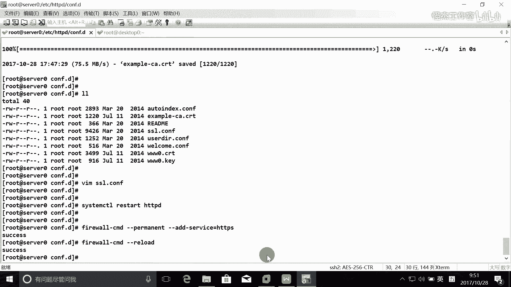

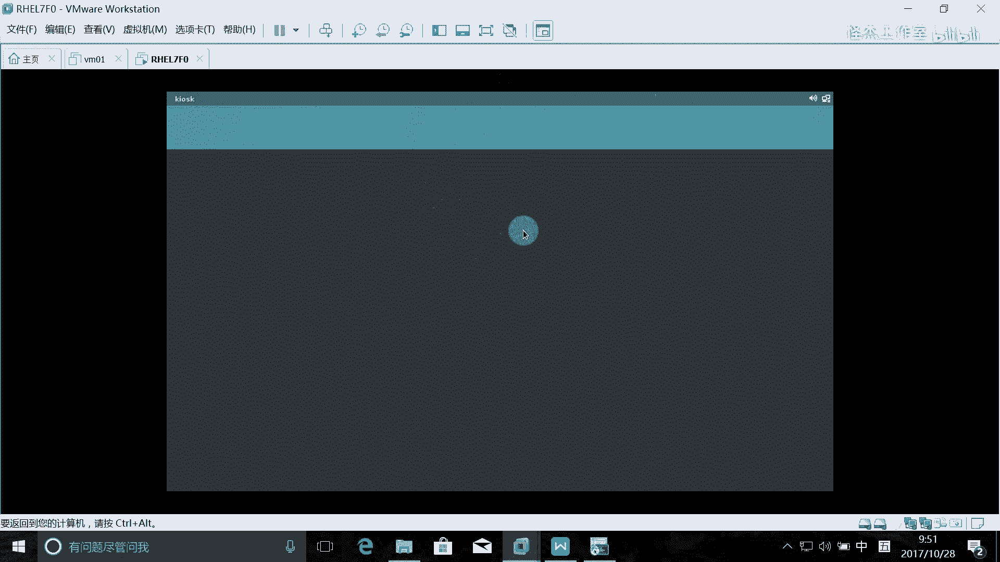

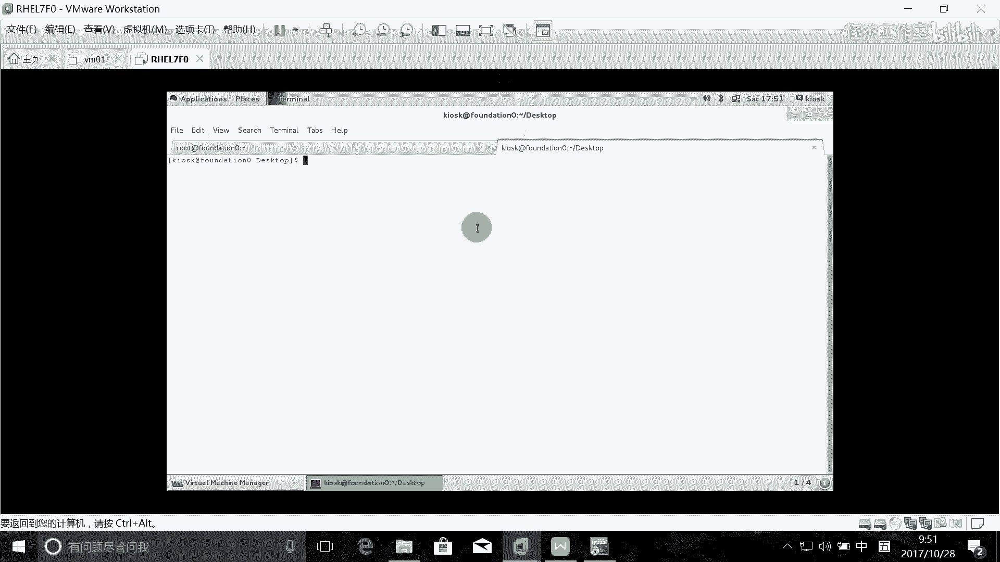

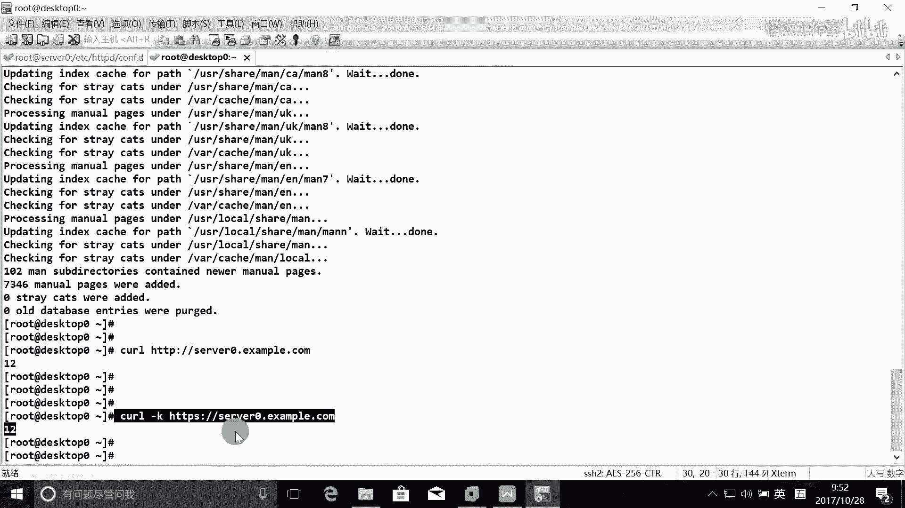

上一节我们配置了基础的HTTP服务，本节中我们来看看如何为其添加TLS/SSL加密，配置HTTPS安全站点。

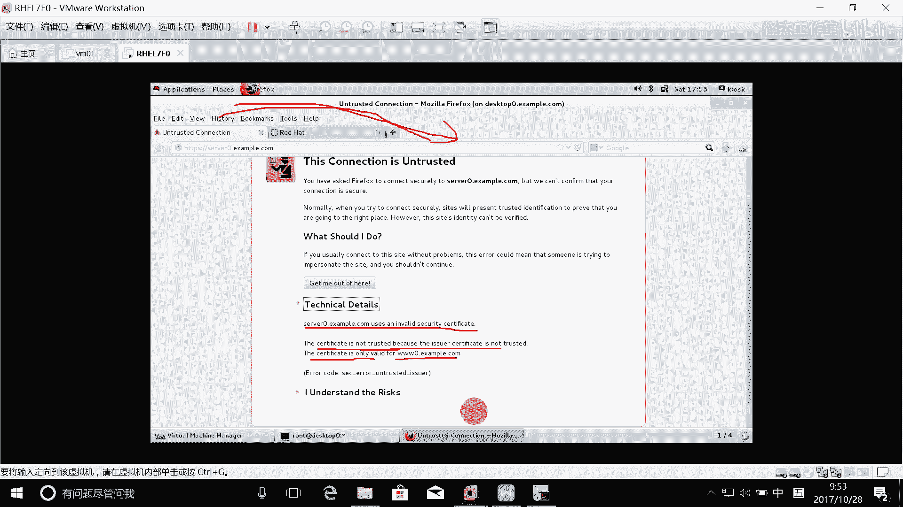

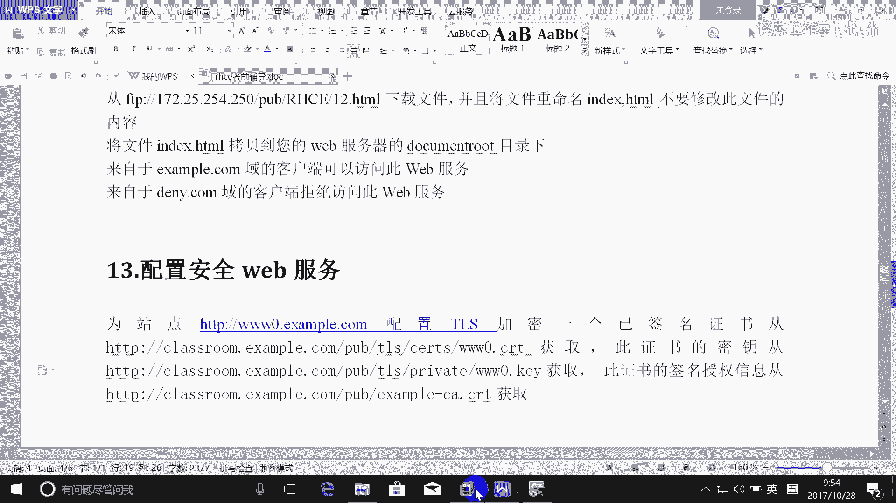

首先，安装提供SSL支持的Apache模块。
```bash
yum install -y mod_ssl
```
安装后，需要获取服务器的证书和私钥。考试环境会提供下载链接。通常需要下载两个文件：服务器证书（如`server.crt`）和私钥（如`server.key`）。有时也会提供CA的根证书。
```bash
wget [服务器证书URL] -O /etc/pki/tls/certs/server.crt
wget [服务器私钥URL] -O /etc/pki/tls/private/server.key
wget [CA证书URL] -O /etc/pki/tls/certs/ca.crt
```
接下来，修改SSL的配置文件`/etc/httpd/conf.d/ssl.conf`。主要配置项包括：
*   指定服务器域名：`ServerName server0.example.com`
*   指定证书文件路径：`SSLCertificateFile /etc/pki/tls/certs/server.crt`
*   指定私钥文件路径：`SSLCertificateKeyFile /etc/pki/tls/private/server.key`
*   指定CA证书文件路径（如果提供）：`SSLCACertificateFile /etc/pki/tls/certs/ca.crt`

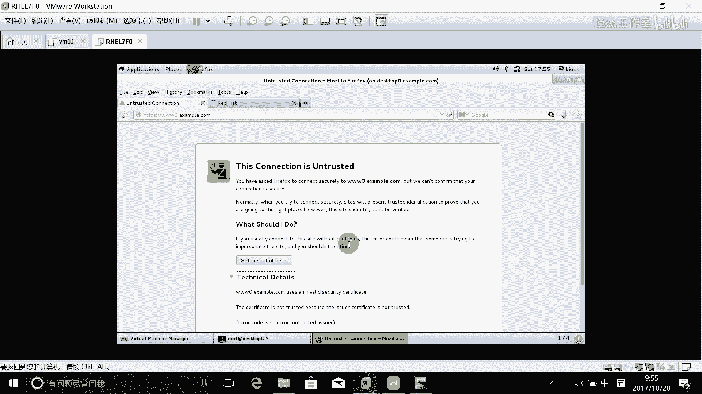

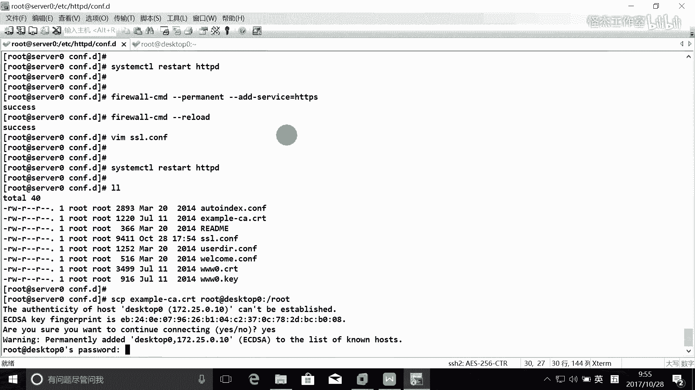

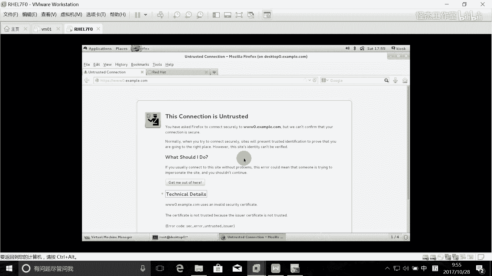

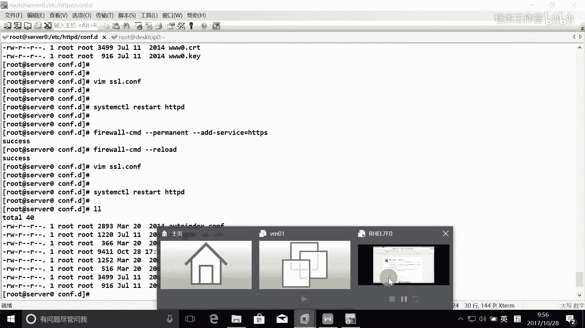

配置完成后，重启httpd服务。
```bash
systemctl restart httpd
```
还需要在防火墙中开放`https`服务。
```bash
firewall-cmd --permanent --add-service=https
firewall-cmd --reload
```
现在，可以使用`curl -k https://server0.example.com`命令（`-k`参数跳过证书验证）或在浏览器中访问`https://server0.example.com`进行测试。浏览器可能会提示证书不受信任，这是因为实验环境中使用的不是公认的CA签发的证书，在考试环境中通常不会出现此问题。

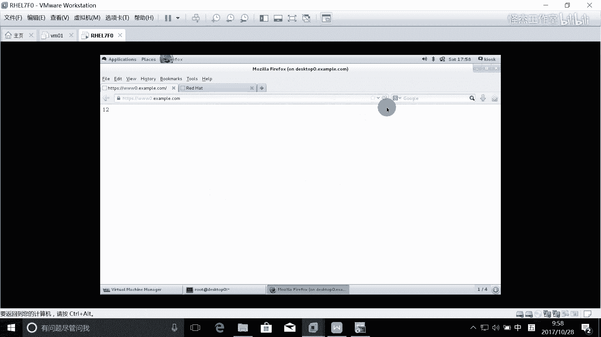

## 第14题：配置基于域名的虚拟主机

之前我们为单个域名配置了服务，本节中我们来看看如何扩展Web服务器，为多个域名配置虚拟主机。

首先，为新的虚拟主机创建文档根目录。
```bash
mkdir /var/www/virtual
```
从指定位置下载网页文件，并放置到该目录下，命名为`index.html`。同样需要检查文件的安全上下文。
```bash
cp 下载的文件 /var/www/virtual/index.html
```
题目要求确保指定用户（例如`user14`）能在此目录下创建文件。这可以通过文件访问控制列表（FACL）实现。
```bash
setfacl -m u:user14:rwx /var/www/virtual
```
如果系统中不存在该用户，需要先创建。
```bash
useradd user14
```
现在配置虚拟主机。可以复制Apache提供的虚拟主机配置模板。
```bash
cp /usr/share/doc/httpd-*/httpd-vhosts.conf /etc/httpd/conf.d/
```
编辑`/etc/httpd/conf.d/httpd-vhosts.conf`文件，配置新的虚拟主机块。
```xml
<VirtualHost *:80>
    DocumentRoot "/var/www/virtual"
    ServerName "www14.example.com"
</VirtualHost>
```
**重要**：配置新虚拟主机后，原始的默认站点可能无法访问。为了确保原始站点（如`server0.example.com`）仍然可访问，需要为它也添加一个虚拟主机配置块。
```xml
<VirtualHost *:80>
    DocumentRoot "/var/www/html"
    ServerName "server0.example.com"
</VirtualHost>
```
重启httpd服务，然后分别访问`www14.example.com`和`server0.example.com`，测试两个站点是否都能正常访问。

## 第15题：配置Web目录访问控制

上一节我们配置了多站点访问，本节中我们来看看如何对Web服务器上的特定目录进行访问控制。

首先，在Web服务器的文档根目录下创建指定的私有目录。
```bash
mkdir /var/www/html/private
```
从指定位置下载一个文件，重命名为`index.html`，并放入该私有目录。不要修改文件内容。
```bash
cp 下载的文件 /var/www/html/private/index.html
```
题目要求：从服务器本机可以浏览`/private`目录的内容，但从其他任何系统均不能访问。这需要在Apache配置中设置目录访问控制。

编辑主配置文件`/etc/httpd/conf/httpd.conf`或一个独立的配置文件（如`/etc/httpd/conf.d/access.conf`），添加以下内容：
```xml
<Directory "/var/www/html/private">
    Require local
</Directory>
```
`Require local`指令表示只允许来自本地主机的HTTP请求。配置完成后，重启httpd服务。
```bash
systemctl restart httpd
```
测试时，在服务器本机使用`curl http://localhost/private`应能成功访问。在另一台客户端机器上使用`curl http://server0.example.com/private`则应被拒绝访问，返回`403 Forbidden`错误。

## 第16题：配置动态Web内容

到目前为止，我们处理的都是静态网页，本节中我们来看看如何配置Apache以支持动态Web内容，这里以Python WSGI应用为例。

首先，根据题目要求，动态内容监听的端口是8909，而非默认的80端口。因此，需要在Apache配置中监听此端口。编辑`/etc/httpd/conf/httpd.conf`文件，找到`Listen`指令部分，添加：
```bash
Listen 8909
```
考试会提供一个WSGI脚本文件（如`webapp.wsgi`），需要从指定位置下载。应将其放置在Web服务器的适当目录下，例如`/var/www/html/`。
```bash
wget [WSGI脚本URL] -O /var/www/html/webapp.wsgi
```
接下来，为这个动态应用配置一个虚拟主机。编辑配置文件（如`/etc/httpd/conf.d/wsgi.conf`），内容如下：
```xml
<VirtualHost *:8909>
    ServerName "server16.example.com"
    WSGIScriptAlias / /var/www/html/webapp.wsgi
</VirtualHost>
```
`WSGIScriptAlias`指令将网站的根URL映射到我们下载的WSGI脚本文件。

要使WSGI工作，需要安装`mod_wsgi`模块。
```bash
yum install -y mod_wsgi
```
配置SELinux，允许Apache连接到非标准端口8909。
```bash
semanage port -a -t http_port_t -p tcp 8909
```
配置防火墙，开放8909端口。
```bash
firewall-cmd --permanent --add-port=8909/tcp
firewall-cmd --reload
```
最后，重启httpd服务。
```bash
systemctl restart httpd
```
使用`curl http://server16.example.com:8909`进行测试，应该能看到WSGI应用返回的动态内容。

---

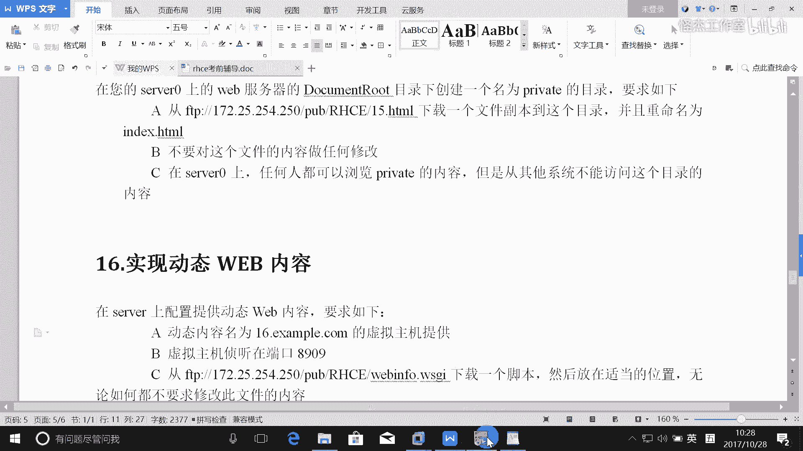

本节课中我们一起学习了RHCE考试中Web服务器相关的五个核心任务：搭建基础Web服务、配置HTTPS加密、实现基于域名的虚拟主机、设置目录级访问控制以及部署动态Web应用。每个任务都涉及软件安装、配置文件修改、SELinux和防火墙设置等关键操作，需要多加练习以熟练掌握。