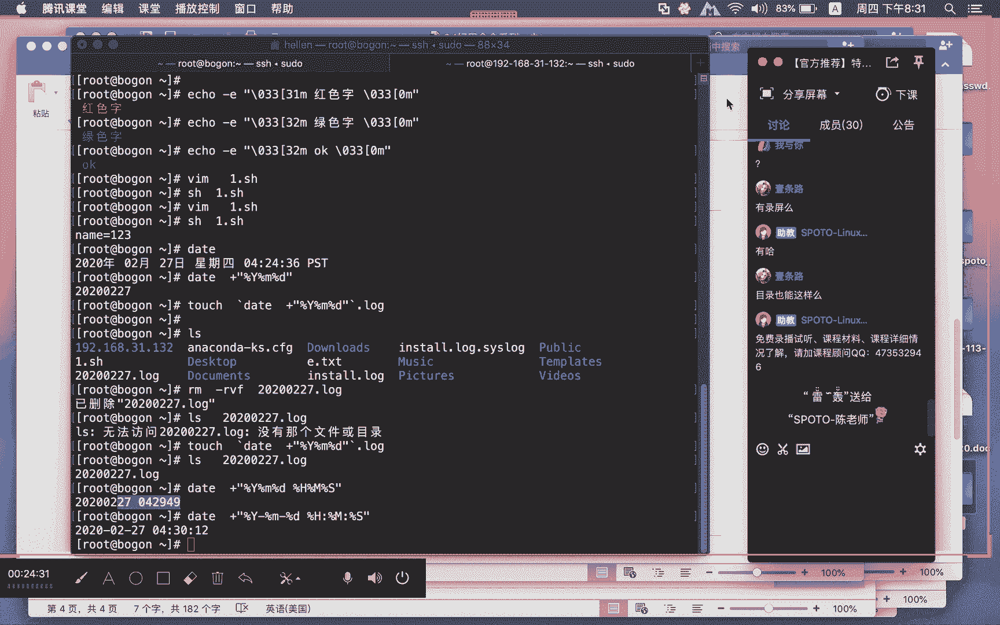
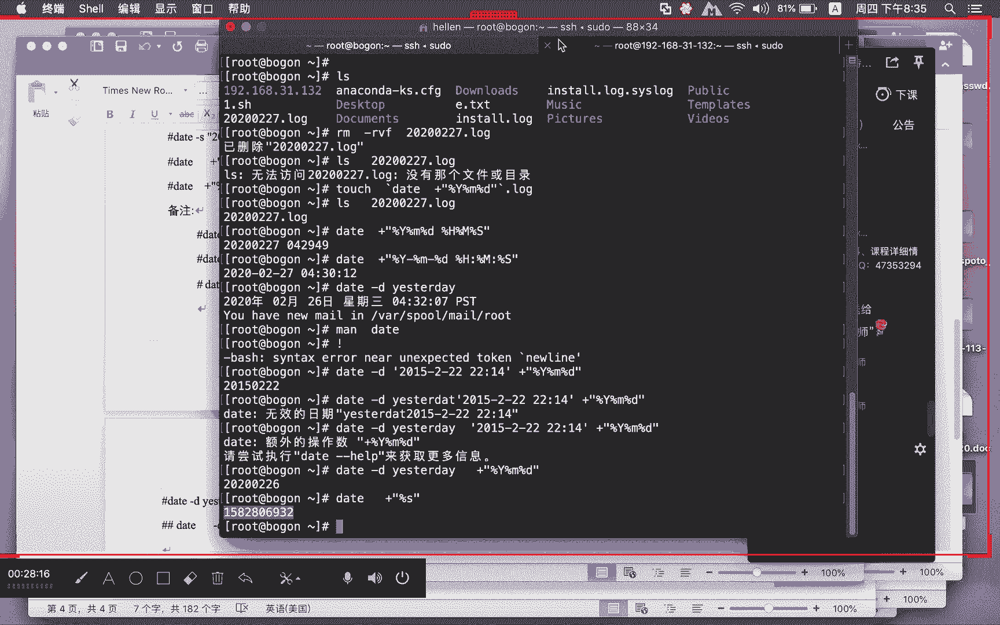
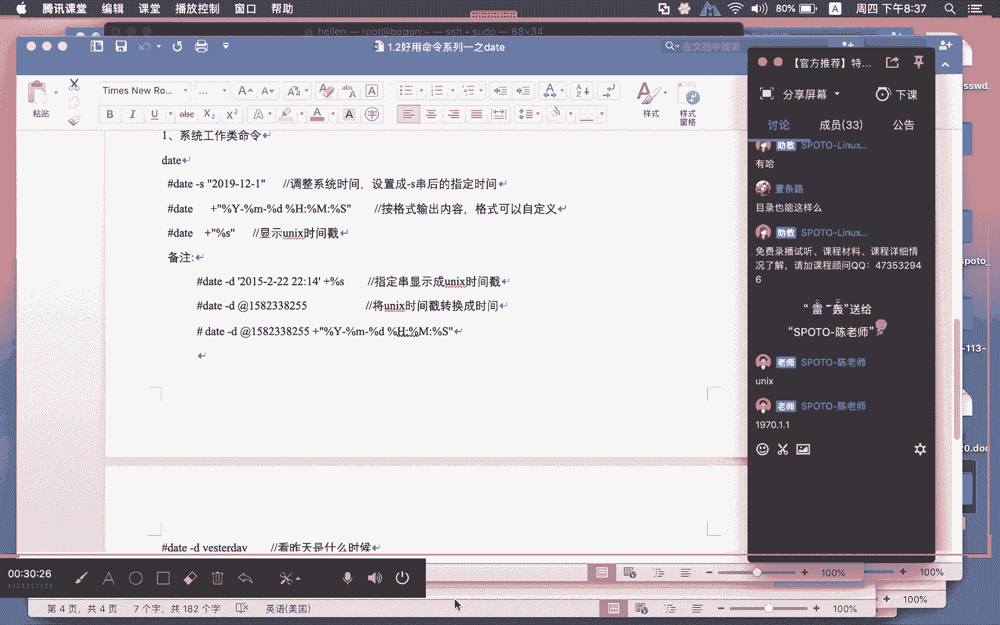
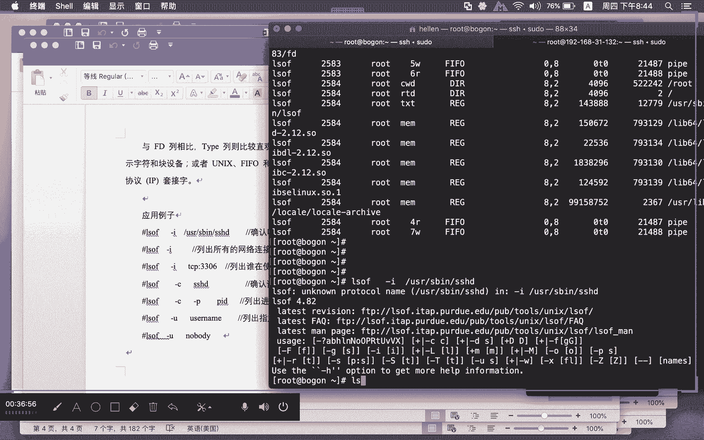
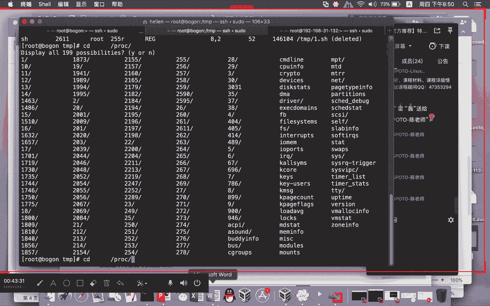
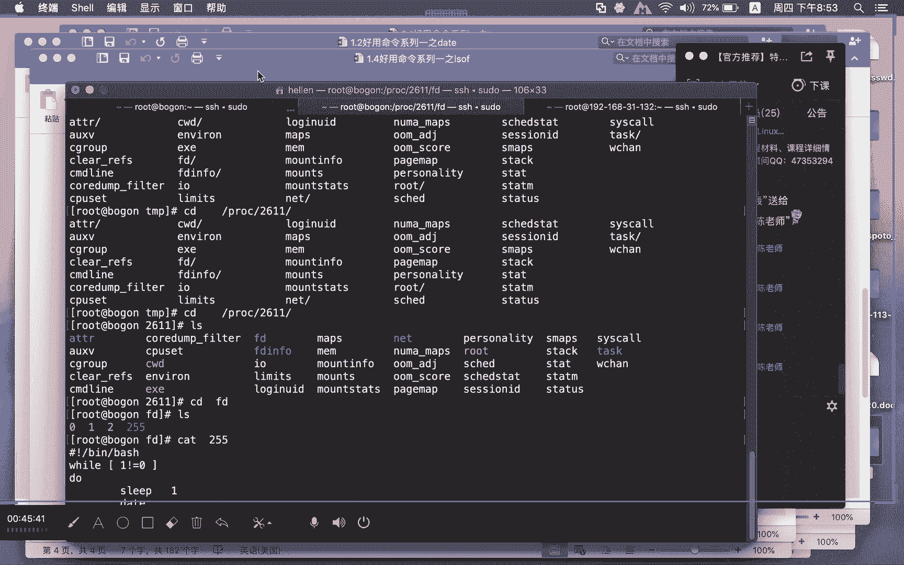
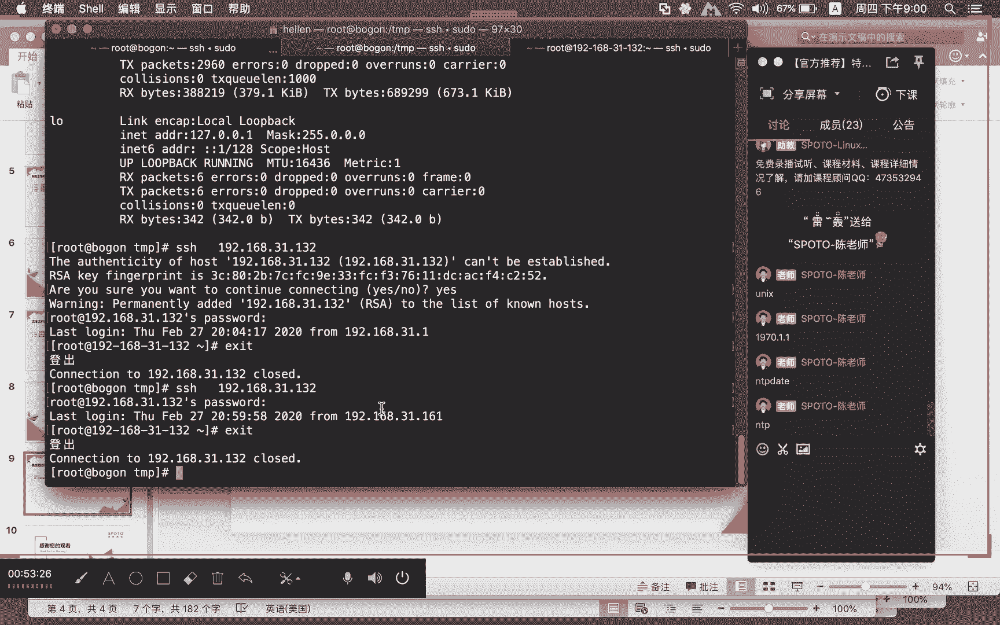
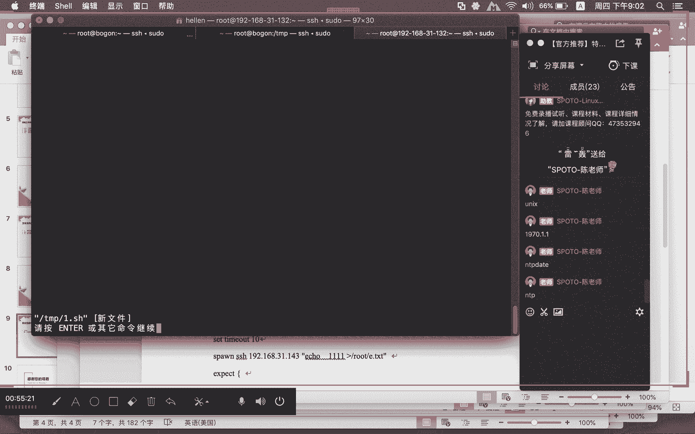

# Linux免费公开课1-好用命令系列一 - P1：好用命令系列一 - 思博Linux关关 - BV11f4y1b77Z

喂喂喂，大家能听到声音吗？OK好嘞。啊，我们开始今天晚上的内容哈我们今天晚上主要内容的话主要是给大家介绍我们目前比较好用的，比较实用的一些这个什么呢linux命令啊。我们把这个linux命令的话呢。

把它分成什么呢？三类啊，我这边做的话是第一个是从什么呢？系统的管理维护的这个角度去做啊，就是系统工作类这个命令啊，然后另外一个的话是我们这个什么呢文本文件的一个什么呢操作类的一个命令。

然，会比较卡是吧？啊，还有一个的话是我们的这个什么呢免交付命令啊，你可以认为啊这个免交互命令啊，有一点像这个什么呢自动化啊，做一些相关系统自动操作的这种东西。啊。

我们可以通过这三个方向呢来给大家去介绍一些比较有用的一些什么呢？linux系统的一些命令。然后我们在用这些命令的时候呢，因为你有的时候如果是单纯的去理解这个命令啊，会有一些困难。

那我们把一些例子结合在里面去让大家呢这个加深一下啊，结合例子去理解它，可能会更好一点。所以我们在讲解的过程当中的话呢，我们也会什么呢？通过一些例子以及生产环境当中的一些什么呢啊。

长远的一些这种操作方式啊，结合进来，然后给大家去做这样的一个介绍。那么系统工作类命令的话呢，我们给大家介绍的是这四个命令啊。因为我们这里呢是要分系列的。

所以呢我们没有办法在一个小时之内把所有的一个命令全部给大家什么呢都介绍完。啊因为是好阅命令，但又不是长阅命令。啊，如果是长阅命令的话呢，我们在基础课程当中啊，我们有给大家专门介绍一个什么呢？长阅命令啊。

就有专门的专题给大家介绍长阅的命令。那这个公开课的话呢，是一个什么呢？类似于辅助啊，补充对这些命令的一个什么呢介绍。那这些命令的话不常用，但是呢它好用也很实用啊，非常重要。

所以我们把它列出来给大家去做这样的一个什么呢内容。那第一个系统工作类命令4个命令啊，大家可能在PPT上面应该就可以看到。第一个echo命令，还有一个是什么da命令，还有一个是什么呢？we get命令。

还有一个是什么呢？LSOF命令。我们这里的PPT列出来的只是一个很简单的介绍。echo主要是用来在什么屏幕上面做内容的一个输出。哦，然后还有一个daator啊，这个时间时间命令哈。

data专门用来做时间的相关操作的。那么win get的话呢，主要用来做下载命令运的。那这种下载啊，不像那个浏览器下面啊，我们直接去点开链接，然后去下载。这种是在终端下面做什么呢？内容的一个下载。

那么FSOF命令的话呢，主要是用来做什么呢？相关进程和文件以及对应对象之间的一个关系的一个什么呢查询。那我们有的时候也可以通过这个FSOF这个命令啊去做一些相关数据的一个恢复。

那这个命令我我们有对应的一些文档哈，因为如果只是简单的给这么大家讲，肯定听的很不爽啊。我们这边的话呢也给大家整理了系列命令当中的多个。

啊，我们在这个地方啊，这些是我们今天晚上会给大家介绍到的哈三个类型命令的所有的一个什么呢命令介绍。我们先来看一下。第一个给大家介绍到了这个什么呢echo命令。每一个命令呢。

我们都给大家整理了一个非常详尽的一个文档。所以呢大家事后如果说听完课，想要这些文档的话呢，也可以找我们的课程顾问老师去要啊。如果说需要这些文档的同学的话，可以在我们的屏幕上面呢打一个2。

啊，打一个呃，回头呢去那个顾问老师那边去要一下这个数据啊。我们回头也会如果说大家有这个兴趣的话，回头也会直接的分享给大家哈。如果你们有打二的话，顾问老师会直接找到你们。我们先来看一下Aco这个命令啊。

刚才简单说Aco就在什么呢？屏幕上面终端上面的去输出你的一个内容，我们就来拿一个这样的一个小例子来给大家看一下啊。呃，我们这里啊，你看我们这儿啊，在我们的这个地方，我们现在呢。

就来远程连接到了一台虚拟机上面啊，在我们的这台远程虚拟机上面的话呢哦比如说我们现在要echo echo它后面呢可以跟上，你要在这个屏幕上面输出什么样的一个内容，我们可以e123啊。

echo你想要的东西啊，ECHO比如说我要输出的一个是双引号里面的东西啊，456，它不会把双引号显示出来。那如果说你要对这种双引号进行，就是我要输出的这个内容里面包含这种双引号。

那我们在输出的过程当中啊，是需要将其什么呢？加一个转译的啊，通过这个转译的这种形式。那么这个双引号的东西啊，才能够什么呢？被正常的显示出来。如果说你。这种显示没有加这种双引号，没有加这个转移的话。

这个双引号它不会被你显示。那么长远还有两个参数。第一个呢叫叫什么呢？减E参数，还有一个呢是叫什么呢？减N参数，那么这个减N参数的话呢，我们先看一下这个减N参数哈，你看我们前面在敲这些命令的时候呢，哎。

你们可以看到什么？这些命令呢，它并没有对后面的这个函产生影响是吧？我们没有减N参数的时候，它的一个输出效果是这样子的。那如果我们加了一个减N参数，后面跟上什么呢？123这种方式的话，哎。

大家有没有注意到，虽然内容也是123在终端上面呢给你显示出来，但是大家有没有注意到后面的这个什么呢？终端提示符，它是跟着你前面的这个内容啊，一起什么呢？在一个行里头的。你加这个减N啊，就是什么啊。

我们这个。

里面给大家介绍到的，如果你是用这种减N这种方式的话呢，它就是什么不会化寒。哎，这个是减N参数和这个什么呢？呃没加这个减N参数的时候的一个区别。那么除了这个减N参数的话呢，我们还会用到减E参数。

那么这个减E参数啊，它后面所跟的东西，就是根据你刚才所做的特别字符啊，它代表的一个意义，如果加了减E参数呢，就会支持反斜线控制的这个什么呢？字符转化啊，我们在是系统当中啊，大家可能会经常碰到说哎。

比如说斜杠T，那么这个斜杠T就是一个什么呢？table键啊，如果说它不是特别含义的话，你看我们这里。我们还是一样的用这种相同的方法哈，我们来给大家做一下。比如说我们在这个地方echo。

啊，双引号一个T，你看我这里敲下去，那么在这个地方，它的这个斜杠T并没有代表特别意义，它就把它什么呢？原始的这种串内容啊，直接在屏幕中端给你显示。但如果我们加了一个什么什么简E之后，哎。

它这里显示的东西就不一样了。因为你们这里可能看还不是特别明白，因为这个斜杠T它代表一个什么呢table键，你可以在这个中间去加入一些字符，然后在中间塞入一个什么呢？斜杠T，你就能够区别出来了。

比如说我们在没有简易参数的情况下，我们写的是ABC斜杠TABC就这样子写啊，它出来一个内容是这样子。但如果说我们加了一个简易参数的话，大家可以看一下。啊，你看到没有啊？

这个时候的这个斜杠T就会被做被当做一个什么呢？特殊特殊字符，而不是一个什么呢？原汁原味的这个字符呢来进行显示，最终在显示的过程当中。

就会在前面的第一个ABC和后面的第2个ABC之间增加一个什么呢table键。啊，这只是我们刚才介绍到的什么特殊字符当中的一个什么呢？啊table键的这么一个特殊字符。

那么除了这种呃减T这种斜杠T这种特殊字符，我在这边呢还给大家列了一些什么呢？列表啊，那么除了斜杠T还有其他的一些特殊字符。那我在这个地方的话，不一一给大家介绍啊，大家事后呢可以去根据这张表格哈。

你可以去试一下，也是像我刚才这样echo减E这种方式呢去做。😊。

啊，可能大家呢对Aco这个东西啊啊还不是特别的什么呀，用的不是特别的多啊。Aco可能在大家写这个什么呢？share脚本的时候呢，会经常用。那在鸿贸企业榜6HEL6。啊，HEL6上面啊有一个脚本。

那么这个是系统它自带的一个什么呢？函数啊，里面集成了很多啊，我们很多需要用到的这个比如说启动脚本啊，关闭脚本啊，它都会对这个函数啊进行一个引用。那这个函数脚本是在哪里呢？我们可以在国贸企业榜6下面哈。

我们打开这个文件啊，叫什么呢？EDCINIT。

点D下面有一个叫functionctions。这个脚本。哦，你们可以去看这个脚本，打开这个脚本的时候呢，在这个地方啊，它有用到。😊，语法亮度啊，就是说你通过这个eco可以做什么呢？相关颜色的一个什么呢？

调整设置。啊，我们在这里面啊，可能大家红贸企业6用的会比较少啊。但是我是觉得其实到红贸企业期的时候，它也会有用。但只不过呢我感觉呃它这个运的会让我感觉更轻松更舒服一点，看起来会更舒服一点啊。

比如我给大家做一个小例子啊。也是一个小例子。你看我这里哈serviceSHDre。大家注意看到没有啊？这里在启动的过程重启的这个对这个远程管理服务NHD这个服务啊，在重启的时候呢，它这里有一个什么呢？

OK而且这个颜色是跟前面的这些白色，它是不一样的。那么它是怎么控制这种字符变成这种什么呢？绿色哎，就是通过什么呢？e这个东西来做的。所以大家不要觉得哎这个东西好像很高深，其实错了，它其实就用到什么呢？

A这种东西来做。我们抛开这个东西，假如大家想要去研究这个脚本啊，想要研究这个A口它到底怎么去做这个颜色，那你们就可以去看EDCNNIT点D。

functionction这个脚本这个脚本的话呢是一个纯色写的。INIT点D啊，你们可以去打开它，可能这里面有的同学已经学过校尔脚本，有的同学可能还没有接触过炫尔脚本啊。

我可以告诉大家的东西是需小脚本啊，是linux下面有非常重要的一个什么呢啊这种脚本语言啊，通过它能够实现很多什么的自动化的一些处理工作啊，批量的这种处理工作，可以让大家的这个什么呢系统管理的一些效率啊。

变得什么呢？有很大的提升。如果你不懂需小脚本，你可能半夜三更，你自己都得爬起来去敲一些命令啊，去做一些啊很多逻辑判断处理的这样的一些工作啊，有了这个需小脚本的话，你能实现很方便的一些处理。那需要脚本。

它在写的过程当中啊，就是类似这样的一些写法啊我们在提升课程里面呢有专门的一个章节给大家讲这个脚本。其实除了炫脚本，我们还会给大家讲这个脚本外。那今天不是讲要脚本的一个内容。

我们回到刚才Aco那个语法亮度。那么这种绿色它是怎么做？我们不单可以做绿色，通过A口不单可以做绿色，我们可以做其他的颜色。我在这个地方呢给大家整理的一个什么呢格式，大家可以看我这里哈A中的颜色显示。

需要加什么呢？简E参数啊，你们在阅的时候一定要注意这个东西啊，一定要加简E参数，我在这个地方哈给大家罗列了几个东西哈，就比如说你看我这里哈呃它的一个格式在双引号简E双引号里头，前面部分这个是指什么呢？

字体的一个什么呢？背景颜色，然后后面是什么呢？文字颜色，然后最后面的这个是什么呢？就如创呃，就是说我们这里面所跟的。

是一个什么呢？对应的你这个文字颜色就自如串的一个什么呢文字颜色。然后后面这个是就开始和什么呢？结束。我这里面呢给大家罗列出来的是多种颜色，不同的一个什么呢啊组合。你们可以把这个东西啊复制一个出来。

我我现在就把这个东西复制出来啊，大家看我这里啊。

我现在运行一下啊，这样子A口进去哈，大家看我这里啊啊，它这里写示红色字，这个红色字，它用到其实就是什么呢？31M这个什么呢？带好来进行表示的。你看我这里它这个就变成一个什么呢？红色置。

那如果说大家在处理这种脚本或做某一些什么呢？相关的这种逻辑处理啊，你可以根据什么呢？这种颜色去做一些什么呢？更为个性化的一些什么呢？啊，这种显示啊，比如说这个红色字。

那我这里呢也给大家列了其他的一些颜色，像我们刚才这个绿色字，它用到就是什么呢？啊，这个32M啊，我也只能是把各种颜色给大家罗列出来，大家可以在这个地方呢去做一些什么呢？参考啊，我们现在把这个东西。

你看我这里这个就是一个不什么不同颜色，这里面的这个绿色字。

OK它其实就是用到了这个什么呢？32M的这个什么呢一个代号。那我通过这个它呃在后面显示这个OK。这个串的时候呢，就用这种方式把这个绿色字改成什么呢？OK那你这个显示出来，这个O就是一个什么呢？

绿色的一个字。你看我把这个O改掉啊，我把这个O改掉。O就这样，你看我们这里出来的值就是OK那我们在启动这些服务开和关啊，你如果失败的话，它这个显示的就是一个什么呢？红色字。当然你想要做的更个性一点的话。

可以根据我刚才给出的这些颜色列表啊，大家可以呢再去做什么呢？相应的一个调整。那么A除了刚才这些用法，在脚本里面啊，我们也经常通过A口呢来打印一些什么变量，就说你在脚本编辑过程当中。

或者说日常使用过程当中，我们都希望。😊，在你运行的时候啊，我想看到这个脚本整个运行的一个什么呢？重要信息的一些输出。那么这些重要信息的一些输出的话呢，很多时候需要通过echo将这个变量呢给它显示出来。

我们这里呢就举一个小简单非常简单的一个小脚本。你看我们这里啊1点SH这么一个脚本。那么在写这种渲要脚本的时候呢，一般我们会有一种格式，前面写一个什么呢？井号感叹号beb然后呢，我设置一个什么呢？

name等于什么呢？123，然后。这个脚本它其实就已经完成了啊，这就是一个什么呢？非常简单的一个脚本。我运行一下。但是我不知道刚才我所设置的这个变量。

它的这个值是否已经正常的去传递到了刚才里面的那个什么呢那容变量去。那我们也可以呢在这个地方将这个变量呢给你打印出来。那我们在打印的时候呢，大家就注意一个地方啊，echo就用刚才那个啊echo什么呢？

echo后面跟上dollar name啊，你显示变量，你可以这样显示那我这边呢就写一个什么呢？多了。NNME那如果你用这种方式去写的话呢，它会把什么呢do name当做一个变量。

前面的这个值把它替换进来。但是我不希望说呃前面的这个。我希望用一个创来进行什么呢？来进行这种表示。那我们就用这种方式。你看我这个运行啊，在这个地方。

它就把这个什么呢name等于123这个值然后通过这个echo这种形式啊，在你这个终端给你显示出来。你就可以看到我这个变量到底设置的是否如我预期啊，有没有错误。根据这些东西，你再去做什么呢？

进一步的一个调试。所以千万不要忽略小看echo它带来的一个作用。这是文本类工作啊啊，这个我们系统工作类里面的一个非常重要的一个命令啊，这个是echo命令来，我们来看一下第二个命令。

第二个命令的话呢，我们给大家介绍的是daator命令啊，这个daator命令啊，它就是一个什么呢？时间命令。那么这个时间命令可能很多同学都会觉得哎，老师时间他能干什么事情？😊，也不要小看它啊。

虽然我们在基础课程到后面这个什么呢？提升课程里面，我们很少去涉及到这个呃命令。但实际啊你在业务应用里面，你会发现data这个命令非常好用啊，比如说你在定义一个文件，我对这个文件进行定义的时候。

有一些日志文件，我可能就会按照什么呢？时间日期进行一个什么呢？后缀表示啊，你如果说纯粹所有的一个文件都按照12345678910，当然也可以。但是有的时候呢，你用时间后缀这种形式去做表示的话呢。

你在进行归类汇总的时候呢，你就会显得什么呢？特别清晰。这个是什么时间这个是什么时间呢？啊，我在归档汇类汇总的时候很方便。那么在时间上面表示我们应该怎么做。那我们先来了解一下这个data命令。

它到底能实现到什么效果。像我刚才这种场景，它又应该怎么做呃，我们可以用一条命令data这条命令。

在简单运行不加任何参数的情况下，它会显示什么呢？这个系统当下啊，它的一个什么呢？系统时间。那么这台呢是虚拟机啊，上面这个时间跟大家现在看到这个真实的一个呃现实时间的话可能是不一致的啊，没有关系啊。

那我们只是一个什么呢演示，那你可以看到2020年2月27号星期四，它这里写的是什么42436PST这个不是格林尼治时间哈，不中巴区时间。然后这个看到data这种方式，我们就可以看到这样子。

但实际上面我们在运的过程当中，你看命令看这种时间。只是极个别的情况下会这种。那我们像刚才那种定日期后退的，我会按照一定的一个格式。比如说我希望我希望什么呢？啊，一条路有有录屏啊。

就说比如说希望我们想要什么呢？时间上面啊啊想要让他愿这种，比如说2020。啊，然后呢是02，今天是27号，对不对啊？0227，希望我的时间是这样的一种显示，那我能不能做可以，没有问题。

那我们可以用这种格式da加。百分号后面大家注意这里面的一个什么呢参数啊，dollar y。啊，这个不好意思哈，是百分Y，就这里的这个百分Y就是指什么呢？ear年，然后再来一个什么呢？百分之M。

那么这里的这个M大家应该能够猜得出来是什么意思啊？mon月份对不对？然后再来一个什么呢？百分之什么呢？D这个就是什么呢？日期啊，年月日你看我们这里敲下去，大家现在这个地方就可以看到什么呢？

20200227。按照你的这个格式呢，就给你什么呢？输出出来了。那么我们如果说想要去做一个这种呃文件出来，那我们可以怎么做？我们可以这样做。好，我们可以这样做touch啊。

因为这对相应的一些命令的一个什么呢灵活的一个应用啊，你不要小看这些小知识，很多一些小知识就是这样子凑凑凑在一起，然后做出一些什么呢？呃让你意想不到的这种效果。比如说我要创建一个今天日期的一个文件。😊。

啊，当然了，你如果说自己去创建，我没问题啊，你直接敲2020。0227，你这样建没问题，对不对？但是如果说你想要通过脚本去做这种，我要创建当日日期的这样的一个文件，那你应该这么做。

我可以这样做touch。啊，后面跟上大家注意，我这里用到的是什么呢？反引号啊，我用到是反引号啊，不是单引号，这个反引号是在哪里啊？是在键盘的什么呢？ESC这个字符键下面的那个什么呢？反引号啊。

也其实就在tableable键上面感叹号旁边那个啊，然后我们在反引号里面去写入什么呢？我们的刚才的这条命令。好。然后呢，我们在这里面呢。后缀加一个什么呢？点log。那我们现在再来看一下。

大家就可以看到呢，在这个地方我就产生了一个什么呢？20200227的这样的一个什么呢日志文件啊，我把这个东西删掉啊，我们再来运行一下。可能有的同学觉得哎老师你是事先建好哦，不是好。

我肯定不会干这种事情好，我把它呢再次运行，大家看一下啊，我把这个东西删掉了。然后呢我再来运行20200227点log对吧？我这个文件他就告诉你说没有嘛，是不是OK那我现在呢就用刚才这条命令把它创建出来。

然后你创建好之后再去看哎，这个文件出来了，那么这种东西运的过程当中touch这个命令，大家肯定能理解做什么的文件创建是吧？那么后面的这个命令中间。😊，这个我们刚刚介绍的是吧，用时间预计后缀的是吧？

那这里面的这个反引号，它产生的这个效果是什么呢？优先级的一个什么呢？很高的这样的一条什么呢？优先级啊，你如果说有一个命令里面带有这个什么呢？反引号，那么它会先执行什么呢？反引号里面的这个什么呢？命令啊。

然后再去执行外面的这个命令。所以我们在执行这个公东西的时候呢啊我们在执行这个东西的时候，他就会先执行这条命令，然后呢再执行什么呢？整个大区命令我们最终就会产生一个什么这样呃一个东西吧。

OK一条路绝对是可以的，你可以试一下啊，makeDIR这个实验我就不试了。因为这个是肯定是OK的。啊，这个是通过什么呢da命令啊来实现的一些什么呢？这种有意思的这种效果。

那么data命令我们刚才用到的是什么呢？百分之Y百分之M百分之D。那么其实我们在运的过程当中，还有什么呢？还有分1秒，对吧？就是还有什么呢？十分秒嘛啊，不单是有年月日。

还有十分秒那我们也可以这样子类似的去做那只不过呢在写的时候呢，它有一定的什么呢格式要求啊，我们还是一样的加号啊，然后双引号，后面加上什么呢？百分之。😊，大写的Y啊，百分之M百分之。

D啊分时啊这个十分秒的话呢，就是用什么呢？也是百分号哈，是大写的H，然后再来一个什么呢？大写的M，然后再来一个什么呢？大写的什么呢？S。😊，这样跳下去呃，大家这上就可以看到是。😊。

2020年2月27号的什么呢？4点29分49秒。那么有些同学可能觉得老师哎我这个格式好像看的不是特别的清晰。OK没问题，可以按自己的一个格式去做这个什么呢定义啊。

我们可以在这里面去加你想要怎么样显示都OK啊，只要你这个命令的方式没有问题那你的这个格式输出其实都很好控制啊，我们现在就可以看到2020年2月27号043012可能比你刚才看到的这种方式啊。

这种是让人去看那么这些有的时候呢就是用程序去做什么呢？处理的。你自己用这种方式去写的时候呢，很多东西就会变成什么呢？非常的方便啊，想要创建当天的。

我就创建当天的当然有的时候呢我给大家出出一个这样的一个小例子，什么例子呢？比如说我要求那大家得出什么呢？我们每个月的什么呢？最后一天啊，每个月的最后一天你在求这个每个月最后一天的时候呢。

其实比如说我们经常会做一个事情，什么事情。😊，那啊，我们会在每个月的最后一天啊进行什么呢？相关数据的一些什么呢？处理分析归档或类似这样的一个事情啊。那我们有的时候呢就会去看到底每个月的最后一天是哪一天。

因为你这个时候很难判断，因为每个月的最后一天，有的时候有30号，有的时候呢有31号，像我们这个月2月份，他只有29号，连331都没有。有的时候2月份才28号。最后一天他是不固定的，但是。

每个月的第一天都是固定的对吧？1月你总有一号吧，每个月都有一号。那你其实可以根据这样的一个方式去算，怎么算啊？我要去求。每个月1号的前一天，哎每个月1号的前一天，他给你得出来的结果绝对都是什么呢？

每个月的最后一天就是上个月的最后一天。所以你用这种方式去推算出来，其实你有的时候呢就能够很快的得出它的一个什么的结果。那么这种方式想要求出啊，比如说这个月这一天的前一天啊。

他这里呢也有对应的一些格式去做。你看我们这里哈用到的是这个。

data减Dyerday啊，他这里用到这种方式去去完成啊。

你看我们这里运行一下，给大家看一下啊，现在呢是27号嘛，你看我们这里用这个data减Din todayday，它就运到就是什么呢？26号嗯，立刻就可以求出什么呢？他的前一天来当然我们在院的时候呢。

可能有的同学就是说哎老师你这个显示的东西，后面的这个东西可能不是他想要的那你也可以按照一定的一个格式呢，去对这个后面的这个什么呢内容呢进行相应的一个格式输出啊，你看我们这里就用这种方式。😊。

我们给大家显示的这个啊都比较是有典型代表意义的这种时间上面的一些处理啊。所以大家可以认真看一看。像我们有一些参数年月日啊这些东西，有些同西可能记不住，但没关系啊，你也可以通过这个什么呢ma这种方式去看。

像我们这里面妹啊，刚才这个什么的年月日，大家可能记不住。那这里面就有写了百分之什么什么什么有哪些哪些啊，我们这里只是给大家介绍了这么一些啊，但是你在实际用的过程当中，你肯定是记不住的。

哪怕是我我也是记不住，我也是只能记住什么呢一些长远的啊，比较长远的啊，但是有一些你看这个小写的M大写的M，这这个都不一样，是不是。

那我现在刚才说到这个哈，比如说每个月的什么呢？每个月的哈加上这个我要求出每个月的前面一天百分之Y。啊，百分之M百分之D啊。啊，我现在求下来，你看我这里哈。data减D啊，这里写的是。好，这个是。

data减Dy today啊，我们在写的时候，前面要写一下data减Dy today哈。VSDDY。哎，不好意思，无效的日期，这里面要改一下啊，这个改成这个dayDAY这样改。啊，把这个。把这个改一下。

你后面的这个格式，你可以自己去去做对应的一个什么呢？调整啊，这个你想怎么调？后面像刚才那个什么呢？把这个十分秒都给它写进去也可以啊。那么还有一种的话是linux时间戳的啊，linux时间戳的话呢。

很多同学都搞不明白什么叫linux时间戳啊，它这种应该是叫什么呢？unux时间戳啊，unux时间，那么unux时间，它是从什么呢？1970年的什么呢？1月1号开始算起。到现在为止。总共经过了什么呢？

多少秒。那么这种算出来这个时间，我们把它称之为什么呢？unix时间戳啊，那么我们在院的时候呢。你不要小看这个unix时间戳啊，在开发里面，或者说在系统使用过程当中。

我们有的时候就是用用unix时间戳来做什么呢？相应对象大小的一个比较。你用这种日期这种方式去比较哪个时间早，哪个时间晚，你其实有的时候不好比较。但是你用un时间戳，它就是纯粹的一个什么呢？

线性增长的一个数字。他很快就可以给你什么呢？按大小数字的这种方式来比较啊，这个时间比较晚，这个时间比较早，就是通过数字大小进行比较，就可以很快得出来。啊，那我们可以用这个什么呢data加。

小写的百分之S，我们刚才用的是大写的分之S的话，它那个出来的是当前这个什么呢秒。如果你用这种方式，你看到这个数据啊，11582806932。我跟你讲啊，你们自己不要想着用这个什么的口算方式去算。

这个算不出来的。1970年1月1号，你到现在你算一下，这里面四十几，我们到现在2020年5050年的时间，你算一下这里面总共有多少秒，人生其实蛮短的啊，你看50年时间也就这么多数字，没别的东西。

啊，如果说我们呃想要将这个数字unix时间戳转成这个什么呢？我们可认比如说转成这种2015年2月2月22号，或者说将这个什么呢？2015年2月22号这种方式拿去转。

那我们就可以通过这里面的这种方式去运啊，就是说。我们人类可读的时间和unix这个时间，他们之间是可以进行什么呢？互相转换的。我们把这个东西复制下来啊。啊，你看这个2015年2月12号。

它的一个unix时间戳是这样子。那如果说大家想要去转这个unix时间戳的话，大家可以用这种方式去转data减D。

然后一个什么呢？小老鼠。啊，这些都是一些什么呢啊比较有用的基础知识啊，你看我们这里这个时间戳，它这里显示的就是2020年的2月21号啊，这样的一个什么呢？时间相互的一个转换。啊，像有一些mysQ里面。

有一些自带的一些函数啊，它其实也可以通过什么呢？这个比如说呃select SEELECT select from嗯 mysQ。然后这个什么呢fromun time啊什么之类的，就有相关的一些函数。

它也支持unux时间和这个什么呢系统这个时间进行一个相互转换的这样的一些函数功能啊，也有这样的一些功能函数啊。那我们并不需要用到这些函数，我们直接通过da这个命令呢就可以完成啊。

像刚才这个已经给大家介绍过了。那么在系统使用的过程当中的话，还有一个命令啊，大家也需要注意，就是这个命令data减小写的S。那么这种是调整什么呢？系统时间，就是说减S后面的这个创，它是用来定义。

调整你的这个时间。我们在使用这个手表的时候啊，当然有的时候都会发现你的手表走握左右变慢了，对吧？也有可能变快，说明你这个手表还是有问题了。比如说电池没了，你这个手表可能就停了不呃，时间就走不了了。

那你换了一个电池，你这个手表肯定要调整时间嘛，对不对？那你要调整时间的话，像win下面它就通过什么呢？这条命令来进行什么呢？时间的一个调整。我们在没有调整命令之前哈。

大家可以看一下我们现有的这个命令状态，时间状态哈。😊。

data这个命令输出它的一个时间状态是2月27号4点38分11秒。那如果说我们用刚才这个什么呢data键小写的S对它这个系统命令进行设置的话呢，啊，大家可以看一下2020年啊，我们想要把它改成什么呢？

2月1号这样子改。那么改完你再用这个data去看，你就会发现它这个时间就变成了什么呢？2月1号时间被你调整了，像这种时间调整是调整你的什么呢？系统时间，我们在整体的这个什么呢？

笔记本或者说你们自己所用的这个硬件上面，它其实是有分两种时间，一种什么时间啊，一种是系统时间，一种是什么呢？硬件上面的什么呢？主板时间啊，你看我们这HWclock。哦。

你们看到这个时间和你用这个data命令所看到这个时间，它是什么不一样。我们现在用da这个命令看到的是什么呢？当下操作系统下面的这个时间。那么HWclock这个看到的是2月27号星期四。

明显跟你这个时间是不一样。那么这个其实就是我们主板上面的什么呢bos里面的一个时间。那么这个时间有可能什么呢？因为你s电池啊，主板上面这个电池没有了。比如常年你这电脑不开机啊。

没充电或者说用了放在那边一直放在那边都没开，然后那个电慢慢慢慢放光了。那么这个硬件上面的这个时间有可能就走不了了，就有这样的状况啊，所以你们有的时候就会发现像有一些这种笔记本，特别是老人用笔记本啊。

刚开刚开始开机的时候，它那个时间都是不准的。那为什么呢？因为它一开始在读这个时间的时候，其实就从硬件上面主板上面去读出这个时间了。但是因为你这个可能常年没用，或者说电池就是用光了。

所以开起来读这个硬件上面这个时间出来到系统上去的时候呢，就导致什么呢？你的系统时间是不一致的。😊，啊，就变得什么呢？系统时间跟意见一致，但是跟现实的这个时间呢是不一样的啊，就会有这种状况啊。

那如果说我们想要对这种时间进行一个什么的调整，大家也可以通过什么呢啊这个。阿巴HW clock这种方式啊进行一个什么呢？时间的一个同步啊，像减R这种同步的话，是将什么呢？硬件里面的这个时间同步到什么呢？

系统上面来。那么还有一个时间的话呢，是HWK减W这种方式。那么减W这种方式的话是将什么呢？啊，是将系统上面的这个时间写入到什么呢？写入到这个硬件上面去。所以大家可以去试一试啊，就是。

dattle命令引申出来的。HW clock这个的一个时间，还有一个命令的话是叫什么呢？ATNDBda这个命令哈NDB data这个命令。那么NDBda这个命令的话呢，它主要用来做什么呢？时间的同步。

啊，主要用来做时间的同步。我们啊在生产服务器里头啊。大家对服务器的这个时间的要求是非常严格的。他们一定要保证我们线上的这个服务器的时间一定是什么呢？正确的这个时间。如果说你在服务器上面这个时间不对。

有可能就会影响你业务的一个什么呢运行啊，很多时候像一些订单啊，对这种系统时间，它其实是非常敏感的。你如果这个时间不对，到时候就会非常麻烦。我们通过NDB data。

NDB dataDATE减U可以去指定你的这个什么呢？时间服务器啊，像我们国内很多这种NDB时间服务器，你可以指到什么呢？这台时间服务器去。然后呢，通过它来同步你这个时间，就通过NDP哈时间服务器。

就大家可以去找网络上面有很多这种大学做专门做研究的那种什么时间服务啊，它有开放啊，你可以通过它啊，我们基本上在刚table里面的话呢，你如果对这个系统这个时间啊。都是在这个什么呢？周期性脚本里头。

counttable里面哈去放我们对应的这个什么呢同步脚本。每天晚上0点啊，要同步这个时间，保证我们的这个系统啊呃时间都是什么呢？正确的啊，即便是有一点点，你如果差个一秒2秒可能还好一点。

但其实也是很敏感的。啊，像你这种如果按时间服务器去同步的话呢，他们的这种差的这个时间啊都是在秒以下的，绝对是秒以下毫秒以下的那种啊，时间差异是非常小的，时间差异是非常小的。有正确的话。

你如果说不正确的那你这个时间服务，你肯定是做的就是有问题的。好，这是我们给大家介绍到了第二个data命令。

那我们来看一下LSOF这条命令哈。那么LSOF这条命令的话呢呃它主要做的一个事情是什么呢？哈？你看我们在还没有开始。😊。

可能大家不是很明白说哎到底这个东西能干嘛，我们可以先用什么呢？ISOF这条命令啊，你不加任何参数的情况下呢，你可以什么呢？打开通过LOOF这个命令啊，你看一下这个什么呢输出的一个状态。

你看我们在这个地方就会出现什么呢？很多的。😊，啊，这样的一个列出的一个列表。那么这些列表呢就是指当下呃我们有哪些命令啊，打开了你的在什么设备上面，打开了哪一些什么呢文件。

比如说我们在执行某一条命令的时候，你在执行这一条命令的时候，其实在后面它会开很多文件啊，比如说我执行这条命令啊，可能你会用到对应的一个什么呢类库啊，对应的这个什么头文件啊。

对应的某一些这种呃他执行要操作的这些对象。就某一些进程，他在开的时候，它其实就是这样子。那我们要去确认这些进程它到底啊开了哪些文件会关联哪些东西。那你也可以通过什么呢？

LSOF这条命令后面的加相应的一个参数ISSOF减I比如说USRSBHD。

好。呃，我用到的这个命令哈，我给大家找一个参数哈。啊，我用这个LSOF。

用这个减C这个命令哈，SHD你看我们这里。😊，那么这个SHD是我们linux下面的一个什么呢？远程管理的这么一个服务。你在这个里面啊，大家可以通过这种方式就可以看到我们现有的这个SHD进程限价当下。

它关联到了哪些文件啊，它这个进程关联到了USRSBHD这个进程，对吧？那么你在用这个进程服务的时候，他其实还开了其他的一些什么呢？点SO的动态文件啊，说明啊这个进程虽然只是一个进程。

但它在运行这个进程的时候所依赖的一些什么呢？文件或者是对象非常多。你看我们这啊，你有可能把其中的某一个文件给他商了。你这个进程，有可能什么就是跑不起来。就这就是什么通过这种方式呢。

我们就可以看到一个同啊，这个通过LSOF啊有哪些文件的一些关联。那么同时呢我们在运用LSOF的时候呢，我们也通过一个脚本呢来给大家做一个什么呢？很简单的一个介绍啊，大家可以来关注一下。

看一下它实现的这个效果。我们在这个地方呢给大家。做一个小脚本啊，那么这个脚本大家可以看到这样通过LSOF来完成这个文件的一些恢复啊，可能很多同学并不明白它到底是怎么样的一个做法啊。那原理上面的话。

它其实是非常简单的就我们现在呢将一个文件啊啊写一个使消完的一个脚本呢把它写好完了之后呢，我们想要在这个什么呢？里面啊对这些数据呢进行一个清理。那么正在运行，把这个脚本运行起来。

然后把这个正在运行的这个脚本，它的一个原始文件把它给删掉啊，然后我们再来看能不能通过LSOF来恢复它啊，以及在这个LSOF里面，它显示的这个状态是什么啊，然后怎么样去恢复这个文件啊。

你看我们现在写的这么一个脚本。😊。

那么这个脚本的话非常简单。嗯。这里是一个死循环，这个死循环是什么意思啊？它怎么表示这个死循环呢？就是指一不等于0。啊，一不等于0这个条件是远远成立的对吧？所以当一不等于零的时候，也就是说。

那你就一直处理下面的东西，因为这个一不等于零不可能是有错误的一天，所以它只能在这个循环里面一直执行。那么一不等于0的时候呢，sleep一，然后做一条什么呢dater啊，显示出这个系统的一个时间。

所以它这个死循环是非常简单的一个什么呢？死循环。那我在这边的话呢，我再开一个终端。我再开一个终端，134。哦，我也是连到我们刚才的这台机器啊，69。668。呃，31。14。161。123。好嘞。

我们现在。😊，写好之后哈。那在这个脚本里面哈，我们先把这个脚本呢运行起来啊，tempamp下面的什么呢？1点SH哈，我们先把这个脚本运行起来。啊，运行起来之后呢。

大家可以看到我现在这个终端会一直有这样的一个内容输出啊，因为这个脚本它已经是什么呢？在跑了啊，已经是在跑了，就这个脚本它是始循环啊，如果你没有把这个进程给它杀掉，那么这个进程就会一直在跑。

那我们通过什么呢？SOF啊，其实可以通过广道形式哈，也可以像我们刚才这种呃减I temp1点SH这种方式去查。唉。

大家稍等一下啊。啊。啊，通过。

通过我们刚才的这个什么呢？直接用这个来看啊，LSOF。啊我们通过gap。啊，这是一个广道的这种方式好，tamp下面的1点SH啊，我们可以看到啊，现在目前。我们抓出来的这个什么啊，它是一个什么呢一个脚本。

这里面用到的是SH这种方式表示。然后这个进程ID是root用户来做的。然后他这里有写了一个什么呢？255R，这个是表示它的一个什么呢？对应的FD啊，就是文件句丙啊。

文件句在编程里面会用的比较多IG是指文件然后82是指什么对应的设备符号啊，然后这52是指大小啊，这个是进程ID号146104啊，这个是我们运行过程当中啊，这个什么呢？对应的这个脚本它的一个什么呢？

进程ID号啊我们现在呢就把这个什么呢？进程给它杀死掉啊，我们可以通过ki。减酒。啊，把刚才那个文件删掉哈，我们刚才那个文件是放在这个地方，对吧？大家可以看到我们这地方1点SH这个脚本就刚刚写的是不是啊。

我们现在把这个文件呢给它删掉，1点SH把它删了。😊，我们现在呢将原始文件删除之后，想要通过什么呢？刚才的这个什么呢LSOF这种方式来查阅，同时通过它来确认对应的什么呢？位置，然后来恢复相应的数据。好。

我们怎么看啊，还是一样的方式。ISOF。还是这种方式看啊。SO F， grape。你把这个原始文件删掉，这边的这个死消防脚本，它还是会在运行的啊，这个大家也要注意一下啊。

为什么你在把这个原始文件删掉的时候呢，其实人家在运行的过程当中，这一部分的内容呢，它已经是注存在什么呢？可以认为你是注存在内存当中了。所以你即便是现在删掉了。那么这个脚本它还是可以稳定运行。

那我们现在呢想要把这个被你所删掉的原始文件啊把它恢复回来。那我们刚才呢用的是LSOF那我们还想通过LSOF这种方式呢来确认这个文件啊，在这个地方的话，其他东西没有太大的一个变化。

唯一的一个变化呢就是在这个后面增加了一行增加了一个创就dlected就告诉你说这个文件已经是什么呢？被删除了。这个文件已经是被删除了啊，我们现在呢就跑到什么呢？😊，这个地方PROC下面的什么呢？

PROC下面的对应的什么呢？进程ID号啊，它这里有写到这个FD哈。嗯。哎呀。😔，我们跑到这个14。

Hei。

跑到这个啊，没错。cat PRROC下面的这个14。诶。啊，我看一下我这个进程变了没有哈，大家稍等一下啊。我们来看一下这个镜14。网络有点。这个老师给我报警。哦。不好意思好，他这个进程是2611。

我刚才看错了，不是下面这个啊，是前面这个啊是2611。我们要跑到这个什么呢PROC下面的这个什么呢？2611。He。啊，没错，是这个2611，然后跑到这个什么呢FD里面来，然后这里面有一个什么呢？

255。因为我们在看这个东西的时候呢。就在这个地方，它这里有写了一个什么呢？255R，这个就是指它的这个什么呢FD啊，我们可以呢去cat2。55。

你看一下这个内容就是我们刚刚被你所删除的这个文件的一个内容。那你现在想要恢复它很简单嘛，是吧？直接把这个东西把它拷贝进来嘛，是吧？拷贝到一个文件里面去。那你这个内容就恢复了哦，给这个例子呢。

因为我们在实际应用里面，我们有的时候也会碰到这种状况。而且这种状况是一个什么呢？非常不好的一种状态。某些人入侵了你的电脑。他在入侵网运行起这个脚本，这个脚本可能是一个恶意脚本。

或者说一些恶恶意的一些程序。但我们其实呢。去看的时候，已经发现是处于什么呢？dlecty状态了，就是说原始文件。人家运行完之后呢，他把这个原始文件给你给删了。东西在跑，原始文件不见了。

你想要恢复它OK用我这种方式，你就可以看到被删除的这个文件到底里面在跑些什么东西。哎，我们立刻呢就可以看到了啊，通过这种方式可以恢复你的东西，可以看到被删除的文件到底在干什么事情。

啊，这是LSOF啊在使用的时候呢啊它的一种比较有意思的一个什么呢用法。那当然了除了这些我们还刚才没给大家介绍到的啊，这里面的一些具体的一些参数。那可能这一部分需要大家呢再去看一看。

那么中间在阅读过程当中啊，大家如果有什么疑问的话呢，可以再找我们呢来沟通。呃，这是给大家介绍的文本啊，这个系统工作类呃，脚本当中的什么呢？4个。那么第二个部分的话呢，我们给大家介绍的是什么呢？

文本文件类命令啊，文本文件类命令。我这边呢挑这个DIFF这个命令呢来给大家做一个介绍哈。

那么DIF这个命令的话呢，是用来做什么呢？数字的一个比较。就是说两个文件之间它到底有什么差异。我们通过DIFF到底能看出一些什么样的一个什么的差异来，就是说它的这种数据报表呃。

它的这种输出报表在我的这边呃输出的时候，我怎么去解读它啊，我怎么去理解这个部分内容。

你看我们这里哈，我打开这个DIFF命令啊。你看我这个。啊，DIFF用于比较文件之间的一个差异。DIF是以逐行的方式来进行比较比较什么呢？文本文件之间的一个什么呢？一同处啊。

我在这里呢建立了两个建立了两个文件，一点fi和2点fi这两个文件。那我先把这两个文件呢给它建出来啊，大家来看一下，愿它来进行表示到底能得出一个什么样的一个结果啊。

我们跑到随便啊，你自己跑到哪里去建两个文件出来啊，一点范那我这边的这个一点范，我就根据他的这个格式去写了哈。

有有。2233。嗯。啊，还有1个445566。呃，778899。好。这是我建好的一个文件。我打算呢把这个文件呢复制一份2点fi啊。然后建好之后呢，用DIFF这个命令呢来对这两个文件呢进行比较。

DIFF1点fi和2点fi。那如果说这两个文件之间哦没有任何的一个差异的话，我们用这种方式去做比较，它是不会有任何的输出。如果你看到这种，那你就知道文件没有差异啊，没有输出，就说明什么？没有差异。

但如果说我们对这两个文件的内容啊进行一个调整。比如说我们想把这个什么呢？2点fi这个里面哈去做一些调整。比如说112233，我把它改成什么呢？11223344啊，用这种方式来进行比较。

就是说把这个文件改完，改完之后，大家就可以看到什么呢？它这里有写了一个什么呢？11那么这里的EC1前面的这个一是对应前面的这个什么呢？一点fi，后面那个一是对应什么呢？2点fi。

那前面的这个小于号就是指什么呢？第一个文件在这个第一行里面它的一个内容，就是说前面这个一啊是第一个文件的第一行。

内容后面的这个一是指第二个文件里面的什么呢？第一行内容，然后这个部分是指第一个文件里面的第一行，它的是这样，然后第二行是这样，这里的C是指什么呢？

这个第一个文件和第二个第一和文件和第二个文件之间的第一行，它们是有什么呢？有差异的那你们如果用这种方式去看，可能你需要对这里面的几个实用方式，有一个什么呢？相对呃，清楚的一个认知。

但用这种方式可能会有一定定的什么你就认知上面如果不清楚，那可能就会造成一定的误解。所以我们也会给大家用另外一种方式，就DIF。🎼一点file啊，大家可以看我们这里哈，这种是一个什么呢？

并行输出的一种比较。可能大家在window下面去做这种比较的时候呢，有相关的这种比较文件了，是吧？你把两个文件做一下这个比较，人家就会将这个什么呢比较差异的东西给你什么呢啊。

高量显示或者什么区别显示出来。那我们可以通过减YW。啊，减为W50，假设。诶。

哎，这个参数我给写错了，不好意思啊。呃，在这里哈减Y减大写的W啊。

减Y减大写的W50。你看我们这啊，你通过这种方式的话，它就很直观的给你什么呢？展示出来了。112233，然后中间一个什么呢竖线，那么这种竖线他就告诉你说，这一行和这一行是有差异的。

你这样子你可以去做多个文件出来，然后你用这种方式，你去做比较点Y就是指什么呢？并行输出啊，前面这个文件内容给你输出，然后后面这个文件也给你什么呢？输出，呃，不是通过什么呢？前面的这种方式去做。

因为这种理解起来有一定的什么呢？困难啊，比较不好理解。那么这种的话越漏眼你就可以判断出来它到底区别是什么是吧？啊，这是DIFF命令的。

啊，我们给大家介绍到后面的这个什么呢？免交互命令哈免交互命令的话呢，这个需要安装啊。如果大家没有去装好相关的一个什么呢IRPM包软件的话呢，我们其实是没有办法用它的。

那么EXPT它能够实现的就是这种自动的交互式任务，呃，无需什么呢？人为干预。我给大家举一个很简单的例子，比如说我们从这一台登录到另外一台，正常在两台之间没有做无密码验证的时候。

从这一台灯，另外一台中间肯定会有一个什么呢？密码提示，让你去输这个密码，对不对？那么这里面如果有同学知道怎么去完成这个什么无密码验证的话呢，那你可能就会什么呢？用无密码验证的这种方式绕开密码的个验证。

但当然你事先要先做好这种配置。如果你不知道这种方式的话呢，你可能。每次登录你都要去做什么呢？密码输入啊，这种中断下来去做相关的一个人工介入操作话都算是什么呢？交互式操作。那我们希望呢我不想做无密码验证。

同时我也不希望什么呢？啊，做这种交互式，那我们就可以通过什么呢？刚才的这种自动化。你每次登录不都要输入密码吗？OK你每次登录输入密码的这个环节，由我来帮你什么呢？自动填充完成。啊。

所以我们说他是面交互的，就是这么一个什么呢？由来。OK那我现在呢。有两台虚拟机啊有两台虚拟机，一台331。161。那么还有一台是什么呢？啊，31。132啊，这是我们的两台虚拟机。啊。

我们先给大家做一个很简单的演示。就刚刚说的啊远程登录，我需要什么呢？输密码啊，我从这个31。161远程登录到什么呢？161去啊，132去远程登录进来啊，我输一个yes，然后输一个什么呢？123啊。

大家看我是不是做了两个手动操录啊啊，一个是yes的一个手动这个写入。然后还有一个就是密码的一个什么呢？输入啊，我可以呢再敲一次，你看我123，反正他就会停下来让我输密码啊，大家这个输密码的过程当中。

他是不可是的啊，有的同学之前学过无密码验证，那老师他可以去做成这个无密码验证。那你这个时候可以不用输密码。当有的时候我并不想输这个密码，因为啊就我并不想做成这个什么的无密码验证。做成无密码验证话。

你每次不输密码，你在远程登录的过程当中啊，其实也会带有一定的什么呢隐患。那我希望呢通过一定的什么的软件啊，在某一些脚本当中，我在做这种远程操作的过程当中啊，我是可以省掉一些事情的。哦，就。

带来便利器的同时，又解决了什么呢？安全性的一些问题。

那我现在呢就写一个类似这样的一个小脚本啊，希望呢通过。免交互光工具的这种方式啊来实现这种什么呢无交互的这种使用。我们这边呢给大家准备了一个这样的一个小脚本啊，这样的一个小脚本。啊，在做的时候呢。

大家要先把这个什么呢EXPT这个东西啊给它装好啊。

你们要先确认哈，比如说我看一下我这边装了没有啊，EXPECT。啊，这个这个装了，那我还是从这边登到31。16U去吧。我从这里先试一下啊，31。161。

嗯。你看我们这边现在目前都要输密码，对不对？我再远程一次123啊，都是要输入密码的，是不是？好嘞，那EXPECT啊，这个命令是有存在的。那么这个命令的话是由哪个包进行安装的呢？啊。

我们可以通过如下的方式来确认它是由哪个包安装的。如果有的同学啊没有这个包，那你要先装一下哈。RBM减QF啊USRB下面的什么呢EXP。ECT啊，我们可以确认一下啊，它的这个包的名字我记得也是叫什么呢？

EXBT的在文档当中哈，我们也告诉了大家，大家如果在做这种。东西的时候呢，你要先完成什么呢？让仓库的这个什么的包的一个安装啊，我这边的话就。

因为之前试过，所以不用管它了哈。设备上没有空间，那不管它了啊，没这个。这个怎么会设备上没有空间了呢？哎呦，真的是空间快满了。啊，没关系啊，空间满了，我还是可以做的。呃。

然后呢我们在这个地方哈写一个小脚本，t下面的什么的1点SH。

然后我们在这个地方。把这个脚本呢给它捞进来啊，把这个脚本给它捞进来。

捞进来之后呢，我们再给大家介绍一下这个脚本它是怎么运的。我们把它复制进来啊复制进来。😊，大家注意看我们这里哈，这里呢定义了一个函数叫什么呢？自动连接的这么一个函数啊，EXBECT因为这个EXBECT啊。

它是一个自成编程体系的啊，虽然我是用校有脚本写，但实际上面呢，这个地方的话，你是需要通过EXBECT来完成刚才的这种自动化处理。啊，前面进入EXBCD的这个进程。

然后在这个地方spawn SH啊就运行的时候呢，我们提交了这么一个进程。那么在swn SH这个进程的时候呢，会提示要求你输入什么密码。那么要求他输密码的时候呢，我们可以通过send这条命令来发送什么呢？

密码啊，就完成了刚才所说的这个什么呢免交互自动输入密码的这么一个过程。然后这个过程做完之后呢，我们通过EXBCDEOF退出这个什么呢免交互的这个什么的进程啊，就完成了什么呢？刚才这个登录。

那我怎么确保说你已经登录了呢？那我在这个SH到这个IP去，在后面啊，我们执行的一条命令。那么这个命令的意思就是说我远程让你这台机器，然后通过e输入到这个文件啊，我们在做之前啊。

先把这个IP改成我们的刚才的这个什么呢IP。这里面的这个31143，我不是31143，我是31什么呢？161啊，我们呢先来看一下root1点TXT这个文件在161上面有没有存在。Okay。You。

有这个。这空间怎么会满掉？大家稍等一下啊。我要先把空间沉腾一点出来哈。一。SH。把刚才这个复制再复制一遍啊。然后把这个IP改一下啊。31点。161。啊，当然我们没有在操作之前的话，我们先跑到这个什么呢？

161这边，我们先来确认一个东西。啊，这个进城要先杀死掉下。2611。要不然在我这边的话，一直写难受。那我们现在呢在做这个事情之前啊，我们要先确认一个东西，什么东西呢？啊，就是。在31。

161上面有没有这个文件存在？因为我们远程过去就是要去创建这个文件的。所以我要先把这个文件确认一下，在161上面有没有带啊，在这个什么呢？root。下面有没有1点TXT这个文件好，我们看到现在有啊。

我们现在看到有那这个应该是之前做实验的时候留下的，对不对？那没关系哈，我们现在把它删掉。1。TXT我们把它删掉。好。删掉之后哈，我们再来确认一。点TXT啊，现在是没有。那我们现在呢把这个脚本运行起来。

Yidian。SH这个胶吧。我们现在把这个脚本运行起来，一点SH这个脚本运行起来。好，大家可以看到你没有啊？我们在运行，然后呢出现了161，然后这个密码，然后它直接就运行成功了。我们再跑到这边来看啊。

运行好这个脚本之后，在远程的这台机器上面，我们有没有看到这个文件，如果有说明它已经登录成功了，而且不需要输密码，是不是？😊，啊，说明这个文件呢就已经什么呢？给你创建出来。通过这个免交互的这种方式啊。

自动给你输入密码到对应的服务器去去做他要想要做的一个事情。那么这种又不需要做什无密码验证啊，也会带来。一定的一个什么呢便利性啊。那么这种免交付工具是。除了刚才我们给大家介绍到这个EXBCD。

它其实还有其他的一些啊，比如说python啊，它也有对应的这种什么免交互工具。那么在后面的一些呃这个提升课程里面哈，大家如果有兴趣，到时候也可以去找老师他们去问一下，看一下啊。

我们的那个对应的这个考试呃这个。课程内容啊，包括基础课程和这个呃提升课程的这个内容都可以去了解一下啊。OK那么今天晚上这个。长月好运的这个命令部分的一个系列一这一部分的一个怎么介绍。

我们先暂时先介绍这少。然后等到后期我们可能还会有相关的这个什么呢？系列的这个命令，到时候呢再给大家去分享。好，大家呢有没有什么问题哈，可以在群里面问一问。系各位同学。大家还在吗？喂i，喂，喂。

Wei。哎，听不到声音了，是不是？啊，对大家有没有什么问题啊。回头这些文档，我让老师啊都给我们的这个课程老师哈，大家如果有需要啊，感兴趣的话呢，都可以找我们课程老师去要啊，包括这个录屏，包括这个文档。

呃，因为今天晚上这个时间问题，我们其实只给大家介绍了五六个命令啊，其实还有很多的一些命令。都是好运的一些命令啊。有有系列2系列2。有系列一肯定有系列2，对不对？你看我这。哈呵。😊。

好运的命令系列一好运的命令系列2。

大家如果说没有问题的话呢，我们今天的课呢就暂时先到这啊。我先把课程啊课堂呢交给我们的这个顾问老师啊。喂喂喂，郭文老师有在吗？好吧，那如果是这样的话，那我们就直接下课了啊，那我们就直接下课了啊。

大家有问题的话，也可以在群里面直接跟我们沟通。需要文档的话，可以找我们的课程老师去要啊。

