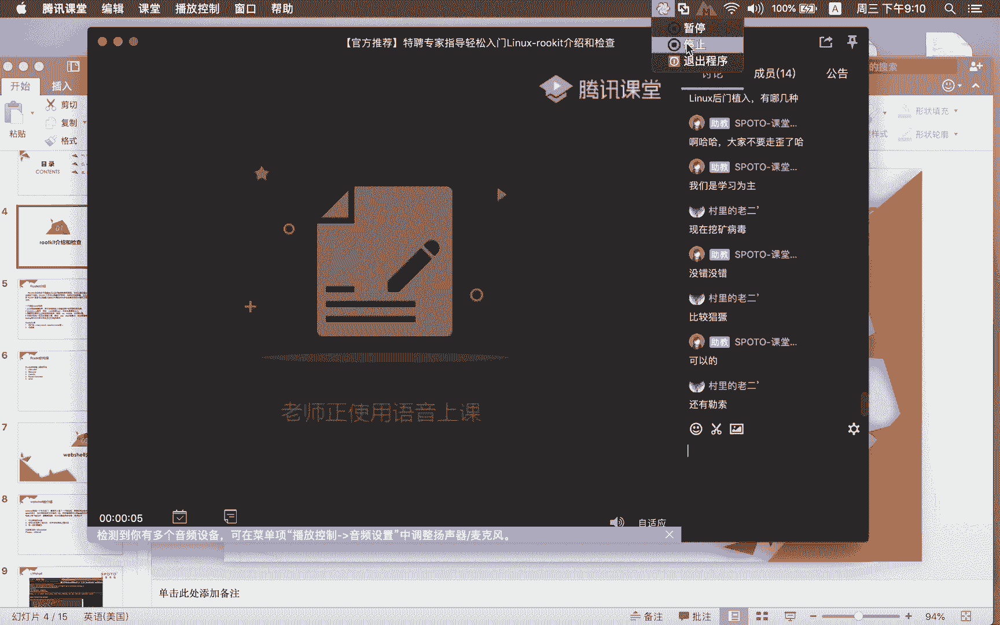

# Linux免费公开课2-linux安全-rootkit和webshell - P1：linux安全-rootkit和webshell - 思博Linux关关 - BV13K4y1X7CH

这个好久不见了这个短。哎，其他的呢我们有20多位同学在线，只有一位同学听到吗？好吧好吧好吧，对对对，我我就怕大家听不到哈，听不到。对，好好的，老师，那我这我们这边今天把那个课程交给你哈。

我们正式开始上课，我们开始上课了哈老师。😊。

我把课堂交给老师啊。好的好的，开始了哈，开始了。😊，喂喂喂，大家能听到声音吗？喂喂喂，大家能听到声音吗？好嘞。哎，好久不见妹。佢点解好， ok。然，我们来介绍一下。

今天晚上又给大家讲了一个内容哈啊我刚才那个我们班主任老师可能是当时有拼写错误啊，我给大家纠正一下啊。然后呢，这个讲的是root kit啊，root kit。 rootot kit的话这两个东西啊。

它其实把它拆开去讲啊，讲成什么呢？是root和这个什么呢？KIT这两个东西啊，前面那个loot啊就是在linux下面这个什么的超级管理员。后面那个kit它是一个什么呢？小工具箱。

那我们今天的这个标题是叫什么呢？标题是叫linux安全之提全问题和检查。然后三个部分的一个方向，一个就是look kit介绍和检查webs介绍和检查日志审计。网上这个内容啊主要是讲什么呢？安全的。

所以今天过来的，我估计一对linux感兴趣。2、对安全感兴趣的这两波同事啊，这个同学那我们这里讲的这个提全他这个提全一般会发生在什么情况啊啊我希望呢今天来的话，可能有的同学如果基础不是特别好。

可能要将就一下哈。那如果说基础不是特别好，可以试试我们这个基础课程。因为我们这里面今天晚上讲的一些内容呢会涉及到一些基础知识。所以如果听不明白也没有关系哈。你可以先听一听。

看一下你能达到一个什么样的一个印象。哦，比如说提全，我们在这个linux下面，如果你要去做这个提权的话呢，一般正常情况下，比如说你已经渗透啊，进入到了一台linux系统之后，哎，我需要将什么？

你所获得的一个普通用户的一个权限提升成一个什么呢？管理员root用户的这样的一个权限哦，这样子的话才是一个什么呢？提权。那么后面的这个loot kit它是在什么呢？在你获得了相应的权限之后。

然后在系统上面去放入一些什么呢？后门木马。然后这些后门木马root kit它的一些特点啊，就是具有说什么隐藏性啊，我东西给你放了，放在后门，在你的这个系统上面。那你很多东西可能就不是特别的明白。对。

这是linux相关的一些安全问题啊，算是安全部分的啊，这个是应该算是安全这个大块知识点里面的一个什么呢？linux分支这一部分的一个安全内容。那我们刚才讲这个提拳。

我们可以举两个小例子给大家看一下这两个提拳它会达到一个什么样的一种效果啊，大家认真看啊，就开始这个魔术的时刻到了。啊，比如说呃在基础课程当中给大家介绍到了这个什么呢？EDCSUDOERS shoot。

哦，我们如果说对某一个用户想要让他去做一个什么呢？啊，超出他本身普通用户的这种权限啊，按正常的渠道去做这种配置的话呢，一般都会去给他做什么呢？EDC shoot这里面的一个配置。啊。

我们来简单回顾一下ADC修的让普通用户具有root权限，他应该怎么去做。比如我们在前面的这一行当中啊，这里有写了一个什么呢？百分之well。那么这个百分之will指的就是什么呢？

在will这个组里头的人啊，在什么样的机器上面可以切换成。这个是指什么呢？所有的用户，这里所有的用户就包括什么linux系统当中的什么呢？root用户。哎。

就是说will组里面的人啊可以切换成任何用户来执行什么呢？任何命令啊，那如果出现这样的一个配置的话呢，就意味着什么呢？比如说test用户在这个will组里头。

那他就可以呢在test用户下面在执行某些命令的时候，在前面加入虚度就可以执行什么呢？本身在普通用户下面不可执行的这样的一个什么呢？命令。我们来做一个很简单的这个下面的这个例子。

那么下面的这个例子跟上面的这个例子的一个区别就在于什么。这test用户，然后它可以切换成所有用户，但是除了什么呢？root用户啊，就是说你test用户可以切没问题啊，我可以切换成任何用户。

但是除了不能切换成root用户，我其他用户都可以切。但就是因为呢有了这么一条语句啊，本身存在一些漏洞，所以他可可以根据这样的一个漏洞呢，直接就把这个什么呢？test用户变成一个什么呢？

相对于像类似于root用户这样的一个权限我们来给大家做一个小演示啊，我们按正常的一个渠道来做。比如说虚度。我们先切换到这个什么呢？test用户去哈SU减test用户好，我们切过来。那么切过来之后。

现在目前呢通过ID这条命令啊，我们就可以看到什么呢？现在是在什么呢？我们的这个test用户里头。那么这个test用户啊，如果按正常的情况，你想要去修改什么呢？修改我们的这个root密码。

你看我们这里直接就告诉你说什么呢？仅有root用户能指定用户名称啊，意思就是说啊你是普通用户，你想要去改我这个什么超级管理员的一个用户的话，你是不可能的。你改不了啊，根据正常的这种渠道。

你按这样去做不行。那我们刚才不是做了度配置吗？所以我就想呢，用度来做这个配置。😊，但我们按照正常这个虚度配置来看的话呢，本身test用户它不能切换到root用户去。所以你运行这条命令它也是什么呢？

不能执行成功的。你看他这里敲敲的密码是test的用户，但是呢在这个后面他也会告诉你说sorry对不起啊，对不起什么啊，对不起，说这个用户啊是不能被允许来执行什么呢？啊。

这个pass word rootot这个命令的他不能改啊，即便你加了修他也是改不了。但是在这种情况下，他就可以。好，这个不方大家一定要注意看的哈。ho解。You。井号减1。PASWD rootot。

大家看好输123这个密码，然后大家有没有注意看到这个时候他就可以去输什么呢？root用户的一个密码啊，你这个时候就可以将什么呢root用户的一个密码把它改掉。123123，你这个一改。

然后你再切换到这个什么呢？root用户去。你完全可以什么呢？按照新的一个密码呢去完成这个什么呢切换。啊，也就是说你按正常渠道，你按这样做，他做不了。那现在你做了这样类似的一个调整之后呢，发现啊。

即便我给你呢做了限制，不能去修改root用户啊，但是我用这条命令，我还是可以去去改你的这个什么呢啊root用户。这其中的一个原因就在于。这个部分的一个命令。也就是说。

当我用修 do后面加减U减减一这种方式的情况下。那么他返回的其实是什么呢？root用户我们也可以通过这条命令来验证，就虚度减U井号减1ID啊。你看我们现在呢是用这条命令去执行。

但是通过后面执行的ID这条命令，我们看到啊，现在目前的这个用户是什么？root用户啊，这就是明显啊我们不说它是一个这个什么样的一个这种呃问题啊，但是这种问题啊，它是属于一个什么呢？bug算是一个什么呢？

漏洞，系统上面的一个漏洞。那么这种系统上面的漏洞啊。根本的一个原因就来自于什么呢？我们的SUDO这条命令啊，SUDO它本身的1个upPM包版本过低啊，大家可能你去看我们系统好像是最新的版本，7的8的。

你怎么去看？当然你会发现什么呢？哎我们的这个版本即便是很新状态下呢，它还是有一些漏洞存在，你可能还得把它更新到什么呢？最新的这种状态。我们去确认一个软件包啊，二进制命令属于哪个软件包。

我们可以通过确认出它的路径，然后再用什呢？BM减R下面的UD啊，你可以通过这条命令啊去确认它现在目前的这个版本是1。8。19。那么如果大家想要去做这个调整的话呢，需要将这个度的版本啊，要调整到1。

8点什么呢？28以上啊，也就是说啊1。8。28以下的这个版本啊都存在这个什么呢漏洞。但这种漏洞我们刚才是进入到你的系统做什么呢？这样的一个配置的情况下啊，它才会出现这种状况啊。

那么在这之前你怎么样去碰到这个，那这个又是你的问题。因为我们今天晚上这个内容主要还是给大家说提全是什么样的以及后面的这个路。😊，它是怎么样去做这个检查，告诉大家这是什么东西，怎么样去检查它。

因为这些安全问题都会存在于系统上面的很多这种隐患啊，一旦你的系统被攻击，被渗透啊，入侵。那么这些漏洞都会被被运成什么呢？它的一个可运的一个什么呢？这种漏洞之一。然后通过这个漏洞啊，就可以让他什么呢？

由普通用户变成一个什么呢？root用户，那么一旦你的这个系统的root用户被控制，那么我们后面的这个事情就很难办了，对吧？你的系统可能就会成为漏机啊，甚至你严重一点的话，可能一些很敏感的数据啊。

都会被人什么呢给截取。啊，有的时候呢可能也不会去截取你的这个数据，他就在那边什么呢搞一些破坏。那么这种的话是更可酷的是吧？啊，你数据截取截取掉啊，如果说数据拿走的话。

我这无关紧要的数据导航也好但如果说他通过这台机器去做一些相关接口的一些这种什么呢啊这种嵌路啊或者什么之类的，比如说某一些充值的啊，我这个钱充了到你这边去的啊，结果正常渠道他应该到公司去。

结果被你那么截取，他可能这个钱都跑到什么呢？别人那个地方那个地方去了，所以它会出现的这种问题啊，会变得什么呢？不可控，就是说一旦入侵系统他后面的这种后果啊啊是难以预计的可能很糟糕啊，可能很糟糕。

这是我们给大家介绍的什么呢？第一个啊第一个这个什么呢啊提权的一个例子。那我们给大家看另外一个啊，也就是基于这个什么呢啊。踏这个命令来做的。那么ta这个命令的话。

我不知道这里面有没有同学有了解过这个ta命令的。哎，这里面有了解过这个ta命令的同学啊，可以在我们的这个群里面啊打个一啊，你们可以在这个群里面打个一，有有了解过这个ta这个命令的吗？

我不知道有没有同学有了解过ta这个命令的。哎，各位同学有在吗？来，来有了解过这个踏命令的同学啊，可以在我们这个群里面哈打个一，非常感谢你们的配合啊。😊，这是一个什么呢？

要专门用来做对应的文献或目录的一个什么呢？这种指定压缩啊，解压的这样的一个什么呢动作。那么这个命令它到底又能做出一些什么样的不一样的这种呃提全的这种情况呢，我给大家做一个小演示啊，让大家感受一下。

再讲这个命令之前，我们要先给大家讲一个东西，叫什么叫做通背服债也。啊，我们今天讲的这些内容啊，都算都算是什么呢？非正规的linux基础知识。但这些地方在安全界部分啊，可能大家都怨的什么呢？

已经是众所周知的相关的东西了，叫做通配服务在也。通佩服在也，这里面有一些可能也是我之前的一些学生啊，他肯定没有听过我这里所讲的这些东西。因为在早先的个人内容分享中，我没有给大家讲过类似这样的东西。

通佩服在也。什么叫通佩服在也哈，我给大家做一个小例子，大家看一下哈。😊，跑到这个tamp test下面来啊。啊，在我们的这个什么呢t test下面来哈。

我们可以看到呢L这个命令的下面有一个文件叫做什么呢？简减help啊，简减 helpp也就是说这个命令啊它是叫什么呢？简简 helpp那如果说我们用LSC这条命令来运行的话，它应该是什么呢？

会将当前这个目录下面的这个什么呢？文件也给你显示出来。但是会出现一种情况啊，因为这个文件它的一种特殊性啊，我们在前面讲那个基础命令的时候，会给大家介绍说大家如果碰到一个命令啊。

你呢这个不清楚它这个相关的一些参数以及使用的一些用法的话呢，我们可以通过什么呢？后面加什么呢？命令的这种方式或者是什么呢？L减什么呢？HELP这种方式啊，就可以去确认说哎我这个命令啊。

它的一个实际的一个用法啊，它有相应的一个什么呢？帮助文档在我们的这个终端呢给你给大家显示出来，大家可以去穿略它。但如果我用LC因为本身这个文件叫什么呢？简减如果。😊。

按正常情况去显示这条呃这个内容的话呢，那么它应该也是像前面一样的，把这个文件在这个终端给你显示出来。但是我运行这条命令的时候呢，它实际就会变成什么呢？LS点点help啊，我们把这种方式啊。

变成了一个什么呢？啊，描述成是一种通配符在也的一种情况。也就是说啊这个通佩符没有发挥什么呢？它该发挥的一个作用，反而什么呢？造成一定的一个误解啊，下面是一个文件，结果发现呢LSC的时候呢。

把下面的这个文件当做什么呢？一个参数给传递到了前面的这个命令去啊，就会造成类似这样子啊，就是说通配符不在其位啊，没有谋好它的一个什么职责。啊，我们把这种称之为什么呢？通配服在也。

那么有了这个基础知识的这个什么呢垫底之后，我们再转过头来看他这个命令。我们在这个下面哈有一个文件啊，这里面的这两个文件呢。一个呢是shall点SH这个脚本。那么这个我用这个LS减L给大家看哈。

我这里面呢应该是有三个文件。第一个文件叫这个。然后第二个文件呢是叫这个那么第三个文件的话是叫什么呢？sell点SH那我们在做这条命令的时候呢，先看一下这个命令啊。

也就是这个脚本它的一个实际运行最终产生的一个效果是什么样的啊，我们来看给大家看一下哈SH点SH这个脚本它运行的时候呢，就提示一段话啊，就是一句话踏命令执行啊，这个就是它脚本的一个什么呢？

里面的一个执行最终显示的一个内容啊，从这里啊我们也可以看得出来啊。如果这里面有有学过我们提升课程，学过sha脚本的同学应该会搞明白反正大家记住我运行这个脚本的时候。

它就执行这么一条就显示这么一条语句而已，对吧？好嘞，那除了这个脚本之外呢，我们还有两个文件，一个这个文件。另外一个呢就是这个文件啊。另外一个就是我们现在目前看到的。😊，三个在这个目录下面的什么呢？

三个对象，只不过呢前面这两个对象和第一个对象和第二个对象的话呢啊它比较特别一点。就像我们刚才那个什么呢？简简help那个文件一样啊，那么我们在执行他这个命令的时候呢，CF。我要进行打包啊。

打包的过程呢它是怎么做呢？一点踏。我要将当下的啊，就这个目录下面的所有的文件都打包到那个一点踏这个文件里面去。按正常情况下，我们再打包这个。动作的时候呢，他只做什么呢？就是说我们的本意只是对什么呢？

当下这个目录啊，test temp下面的这个什么data这个目录下面的所有的文件进行打包。啊，这只是我当下目前的一个什么呢？呃原来计划好的一个什么呢？想要做的一个效果。但因为这两个特殊文件的一个存在。

我们在打包的同时还会跟上什么呢？后面的这两个文件。哦，他把这两个文件当做参数啊，当做参数给什么呢？给执行了。所以我们在打包的过程当中，除了打包这个目录下面的这三个文件，同时也会执行什么呢？

cll点SH这个脚本。你看我们这里啊，我们现在打包好这个脚本呢，刚才不是预行这个脚本就会执行呃显示这条这句话嘛，对不对？好，当我们打包的时候呢，它也会执行什么呢？这个需要脚本只有执行的时候。

这个脚本里面的内容才会显示出来。那我们同时也去看一下一点踏这个文件有没有在啊，大家就可以看到一点踏这个文件也在。😊，OK我呢没有把这个东西做的什么呢？比较炫酷一点啊，只是在脚本当中的写的这么一条语句。

那如果说。我们把这个案例啊做一个延伸，怎么个延伸法？假如。你的一个这个脚本里面呢含有类似这样的一句啊，类似这样的一个语句。那我在你的这个目录下面，我也给你放放一个类似这样的东西在这里。

同时呢将这个cel脚本里面的这个内容啊，把它改成一个什么呢？啊干恶意的啊，一些坏事的。比如说反弹性后门木板啊，反弹性后门木板。那你如果在执行这条语句的时候呢，做这种压缩包相应的这个操作的时候呢。

它就会触发这个脚本的执行。那么这个脚本里面它如果做一个反弹性后门木板的话呢，那你刚才的这个动作就会触发一个什么呢？反向连接。你这台是被入侵的，那么执行这个脚本的时候呢，这台机器会自动的去干嘛呀？

跟外面的机器去做什么呢？连接。那么刚才的这个机器呢就跟什么呢？愿着上钩钓鱼一样啊，我这钩子放下去，你自己钓过来啊，你自己咬到我这个沟里，然后呢，我就直接上网，我就可以对你进行什么呢？

远程连接的这样的一个什么操作啊，所以像刚才这两种啊，只是在linux世界当中啊，比较承认或典型的这两种碰到提全的这种问题。那我们碰到这两种问题的时候呢，大家可能需要对它进行相应的一些调整。

比如说通配符我是不是要这么用，我们可以让它规范一点，你不要写成心嘛，我可以写成具体的嘛，那么写成具体的话，它可能就就不会有类似这样情况出现，包括那个虚度部分的对吧？啊，我虚度部分的话呢。

我不需要做成那个。对应的这个什么呢啊root用户啊或者什么这类这些东西，我就是让他做成这个普通用户啊，其他东西我不用搞啊，同时呢也将这个对应的修度它RPM包这个版本啊。

修度的这个RPM包的这个版本去做什么呢？升级避免类似这样的一个情况的一个出现啊，所以很多同学你可以去看一下啊，大然如果说对应的这个系统下面，比如说这个修度的这个版本是不是很低。那你可以想一下。

看怎么去把它去做这个升级啊，装一个新的也可以啊，如果说你本身那个让仓库它的这个版本带的也不是特别高啊，不能满足我们刚才所说的这种漏洞问题的话呢，那你可以去把它改啊。如果有的同学觉得你这个系统啊啊。

相对来说我还是很安全的，我可以不需要去做这个调整，那你也可以其实不用去管它啊，所以像这两种刚才说的这两种都是很常见业应用里面啊，经常用到的。但通过这些很小的一些什么呢？知识点啊，它其接就可以什么呢？

被这种专门搞黑客的入侵者呢给什么呢？恶意的用了。所以大家在做这种提权啊相关的这种限制的时候呢，需要注意啊。那么root key就是在什么呢？我们对应的这种提权啊。

比如说像虚度这样普通用户提全成这个root用户之后，他会去装一些什么呢？相应的一些工具。那我们这边今天给大家带来的这个工具叫什么呢？我给大家看一下哈。啊，我们先给大家看一个东西。

比如说这个什么呢web share啊，我先给大家介绍这个啊web share的一个介绍和检查。那我们在做这个web share的这个东西的时候呢，大家需要呢在这个系统上面哈。

需要装好我们的这个什么呢阿帕奇。APACHE还有这个什么呢PHP这个模块啊，你才有办法去做这个什么we的一个什么呢内容。那我们正常通过web服务去对外提供访问的话，一般都是什么呢？可以穿透防火墙。

像web这种的话，它就是可以什么呢？跟着你的80服务进行穿透啊，我们一般比如说你系统上面有很多的服务进行这个开放，对吧？那我在开放的过程当中呢，web服务呢，如果它是公开的，我基本上都会让它穿透防火墙。

不会去限制它的一个使用。但是在这中间你传透出去的一个数据里面呢，有可能是恶意的数据，也有可能是什么正常的业务的一个数据。那PHP里面的这种we share。

它其实就用这种方式去做weber share呢我们给大家看一个东西。

我，我们给大家看一个东西哈。我这边呢打开这边，然后呢，在我的这边这个上面的话呢，来给大家访问一下我们的这台虚拟机。事先就已经给大家布置好的这么一个东西哈。我先来看一下我这个阿阿帕奇服务这开了没有哈？

我这个演示的系统呢用的是我们的红帽七。啊，这个先到OS7哈。我先把这个服务开起来啊，我现在这个服务没有开，我把它开起来啊，service。SERVICE我们先把它开起来。好，稍等一下啊，开起来之后呢。

我们直接就可以在我们的这个什么呢？客户端随便找一台什么浏览器来直接去访问我们的这一台什么呢系统。啊。啊，我们在这个地方啊给大家访问一个东西啊，HTTP。我的IP地址192点什么呢？168。Dian。

31。141。诶 you。啊。好，我们来看一下这个服务开了没有啊，我这服务开的有点慢啊。

大家稍等一下啊。好，这个服务已经开起来了。好，我们现在来看一下。嗯，大家看到没有啊？啊，当我们用这条命令来进行访问的时候，大家有没有注意到一个东西啊？你看我们这里显示出来，也就是说我通过浏览器这种形式。

我访问的。此后呢，它其实后面的这个命令就是什么呢？你在lininux系统当中的什么呢？命令啊，也就是说我们刚才运行的是什么呢？ID。

啊，通过浏览器来执行我们系统上面的这个什么呢命令。那我这边通过这个浏览器访问这里的这个ID它出来的是什么呢？阿帕奇，它这里显示的时候呢，这个阿帕奇就是因为什么呢？我们的这个阿帕奇用户啊。

现在目前是启动什么呢？我们的阿帕奇服务这个什么呢？进程里面的这用户和主。所以大家现在在这个地方就可以看到啊，我们执行的这个ID的这个命令。那如果有的同学觉得这个东西看的不是特别清楚，OK没问题。

我们可以什么呢？用这个什么呢？

catEDCPASSWD你看我们这哦，我们用这条命令就显示出来了什么呢？啊，显示出来了。我们在linux系统当中的这个什么呢？EDC password这个什么呢？密码信息文件哦，在这个什么呢？

通过浏览器的这种形式，将我们linux系统当中的这个什么呢啊相关的一些敏感数据的这个内容啊，在这边呢给你什么显示出来啊。如果你想看这个密码文件，我们可以看这个SADOW。好。get啊，我们把这个改一下。

哦。这个有些可能有限制哈，有些有限制。比如说看IP，反正我都能看，基本上我都能看。你看我看IP我们的这一台IP地址是。他这里面的话呢有。多个IP地址啊。啊，你看这里U92。16831。141。

就通过这种方式啊，它就达到了一定的什么呢？渗透的这种效果啊，直接在浏览器穿透你来执行什么呢？系统相关的一些命令。那么这种的话，我可以去看我自己比较敏感的一些什么呢？相应的数据啊，我可以看什么呢？

在web服务器之外，在系统当中的一些敏感的这种信息。那么这种的这种渗透呢，还算是什么呢？看到的东西还不算是什么呢？特别的这个惊啊，让你觉得这个很震撼。那我们还可以给大家再做一个小例子。啊。

有一个C99的点。PHP这个东西，你看我们这里哈C99mel啊，我们在PPT当中也给大家做了一个什么呢？简单的这个汇总啊，在我们的这个PPT当中里面给大家介绍的这个东西是什么呢？

也就是说啊我们比较常见的一些weshop，像PHP里面呢有PHP有C99赛啊，那么这个文件，像这种啊都是一些属于什么呢？恶意文件。那么这个恶意文件，它到底能。😊。

应用到什么样的一种效果呢？啊，我们刚才做的那个东西，你可能只是觉得执行一些命令，有些命令还执行不成功。那么有一些的话呢，我们可以在这个地方来做啊，我们可以在这个EXEXEC1。

UTE这个部分我们可以来执行。比如说if con我们来执行这个东西。你看我们这里执行的时候呢，直接就在这个什么呢？你的这个显示框里面去显示出什么呢？相应的一个内容啊，你还可以做其他的事。

比如说我要写一个什么呢？

写一个数据进去，123456。它可以做什么呢？写入动作啊，我在这里呢去写入一个什么呢？222点SH这样的一个脚本啊，我们在这里的这条命令，其实就是将123456写到我们的这个什么呢？

22点SH这个脚本里面去，我们把它执行一下。那么这个东西执行，它到底有没有写到这个脚本里面去呢？啊，我们也可以来cat一下。看一下这个有没有写成功，对吧？你看我们这里是不是有写成功哦。

我刚才只是给大家做了一个什么呢？很简单的一个什么呢小例子，通过什么呢？cat。😊，输入什么的啊，这个echo标准数据流这种方式将一个数据写到一个脚本里面去。那么到了这个脚本里面之后，你要干什么事情啊。

也可以完整的去写入一个什么呢？一个脚本啊，比如说我这个脚本写好了，然后我就一行一行的往里面去添加，你就可以在这个什么linux系统上面去写完整的去写了一个什么呢？这样的一个脚本。

那么这种方式还算是什么呢？呃，比较。😊，效率不高的方式啊，你还可以呢在这里面直接去添加用户啊，你可以试试看添加用户怎么能成功。如果说你这个用户能添加成功的话，你直接就用这个用户去登录进去。

所以像这种什么C99啊，需要有这种PHP的这种后门，你看到这种东西啊，基本上就是一种后门了啊。你如果看到这种东西的话，你一定要引起警觉，假如你愿没有访问到，你看到这个东西，那你系统基本上就是被入侵。

已经是什么呢？中毒的一种状态了。😊，呃，已经是中毒这种状态了。啊，如果说我们想要对这种机器做一个查询的话呢，我们可以通过什么呢？类似的一些PHP的这种脚本或者相关的一些工具啊去做一个扫描。

因为像现有的这种什么C99C啊，还有什么一句话木马啊类似的东西啊，有一些工具。啊，这个叫什么呢？以其人之道，防治其人之身啊，以彼之道，防食彼身啊，也是用类似的这种工具。

这个东西。这是一个什么呢？用PHV写的一个什么呢？扫描脚本。我把这个编码给大家改一下。啊，开始扫描点一下啊，你看我们这里就会给以给你去定位出来。说哎，你这个扫描这个路径在这个路径下面啊。

有哪一些文件是属于什么呢？后门特性的啊，我们可以看到刚才我们访问的这个什么呢？C99点PHE。这个文件它就是具有什么呢？后门特性的那那你如果说一旦被他检查出来。

你要立刻去确认这个文件是不是属于你的这个什么呢？项目工程里面的这个脚本文件。如果不是你赶紧要对它进行什么呢？删除处理啊，你看人家这个马上就可以什么呢？查出来马上就可以查出来啊。

就是通过这种方式一它入侵了，给你放了后门了，那我们也可以通过这个什么呢？sampSANPHP这个东西扫描BHP的这个脚本，因为它本身是有一些特性啊，一句话木马。

比如说PHP脚本当中有带有这个什么呢EVAL这个东西啊，基本上是占有这样特点的，基本上都是属于这个什么呢？后门特性的这种。

啊，后门文件，那你可以把它找出来，然后对它进行一个什么呢相关清理的一个动作。当然了，我们在做这些东西的时候呢，对日志啊，大家一定要注意进行什么呢？收集汇总。因为我们刚才所做的这些东西啊。

在你的这个日志当中啊，其实都会有相关的一些记录存在那么这些记录在你后期进行分析的时候呢，也可以通过日志来还原什么呢？来还原你之前被人入侵的整个操作动作和步骤啊，这样子的话呢。

对你后面的这个什么呢痕迹跟踪追踪啊，对问题的这个定位啊会很很方便啊。我们这种的话是没有告诉大家说哎它是怎么样通过你的漏洞上传这些文件啊，溯源是非常关键的哎，对be刚才所讲的这些东西，溯源是非常关键。

就是你访问我的这个东西，那我要知道你是怎么把这些东西放到我这个系统上面来，对不对啊，我得什么呢？1。1点的什么呢？往回查啊，这个才是什么呢？最关键的东西。好，首先。

很多linux是跑了这个两三年的45年的，你可能相安无事。但是其实里面已经什么呢？啊中毒已久啊，有的人他们做这种呃入侵后门呢放了什么呢？很隐蔽啊，对你呢这个业务的影响非常小啊。那如果说像这种状况的话。

你基本上不知道你的系统也没有被入侵。那我们如果没有相关的这种安全意识的话，你可能已经被入侵了，你自己都还不知道，还翘着二郎腿说我的系统非常安全，其实不是的，你已经什么呢？体无完肤了。

只是表面的皮还在而已，里头内脏都早就已经腐烂了。就这样的一个情况，因为我们自己也是吃过亏的啊，吃的是什么呢？血亏啊，这个遭遇的这个什么呢？安全问题啊，以前也是觉得哎呀这个自己的系统一点问题都没有。

结果呢一方出了一次安全问题之后，所有的机器我们都翻了一遍，结果发现一堆的这个什么呢被龙入侵的这个什么呢后门的这种什么木马在里头啊，我们到最后啊实在是没有办法了。因为有些数据，包括日志。😊。

已经不复存在了，因为时间太久，这些东西我们也都没有了，你去溯远很难溯远。那么我们最终的操作结果就是把机器重装系统重装，然后来还原我们这个什么呢被破坏的这些业务系统。所以很麻烦的。

那么像刚才这个就是什么呢？we share这种方式。那么lookot key的话呢，它主要是针对什么呢？这个东西如了ki它主要是针对啊我们的这个什么呢？linux系统部分呢。

当然你除了linux系统之外呢，它也会去放这个root kit。那这个root kit的话呢，它有哪些特点啊？我们在这个PPT当中啊，也给大家做了一个什么呢啊相应的一个介绍。大家可以来看一下这个东西哈。

你看我们这里哈一个典型的root kit的话呢，它是一个什么呢？以太网的一个修改程序啊，可以获得网络上传输的用户名和密码等信息。那么还有一个呢是带有木马程序啊。

我们刚才那种word shell它是通过什么呢？😊。

你们的外表服务啊，通过你们的外表服务来访问他自己已经放好在你的这个系统上面的这个木马。但是这种。

啊，rootki的话呢，它不一定是通过什么呢？web啊，它是可能通过什么呢？它可能通过什么呢？SH服务。啊，也就是说比如说我们正常去操作和远程管理某一个这个什么呢服务器的话呢，一般都通过什么呢？

SH就lininux下面，我们一般都通过什么呢？linux的这个SHD啊，远程管理的这个服务，对吧？啊，通过它来进行这个远程管理。那如果说我们把这个东西啊给他什么呢？录清了啊，然后呢。

你可以通过它来验证啊来登录啊，你有的时候你还不知道说哎我这个东西。很安全啊，我的密码设置的非常的复杂。其实你已经什么呢？已经被人植入后门啊，植入了木马。你的密码在每一次改动，每一次登录的时候呢。

你的密码干嘛呀？都会被人家记录。同时有可能这个密码还会什么呢？实时的传递到什么呢？对方那边去。我给大家做一个类似这样的一个SHD后门木马的这样的一个什么呢？小例子啊，那因为我不是专业考这个入侵的。

但是我们也是发现了在系统当中，我们有发现类似这样的一个状况。然后我们也想着去还原整个什么呢？这种安全现场啊，大家来感受一下啊。😊，啊，我这边的话也有一个类似这样的一个系统啊，也是这台31。131啊。

他做这种lookotki的话，一般正常情况下就做好了对系统的影响基本上是无差的。但我这个做的可能是呃会有一些影响啊，会有一些影响啊，但是没关系，不影响呢，我给大家什么呢？这个root kit这个木门啊。

木马的一个什么的特征的一个这个展示。那我们在这边的话呢，我现在呢已经给大家放好了我们的这个什么呢啊SHD的这个例子。啊，然后呢在我们的这个openH5。9。1啊，这个版本下面哈。

那么这个版本的话正常它是没有什么呢？后门木马的，这个是没有的哈。我打了一些补丁进去，然后它才有这样的一个状况。那我们呢在这个地方啊，先要把它什么呢给。编译出来啊，把它编译一下。那么这个编译的话呢。

相对来说也是比较快的。我把这个文档打开。大家稍等一下啊。

好，我们现运行一下这个编译的一个命令啊。

那么在编译的过程当中啊，其实就是一个什么呢？源代码安装的一个过程啊，在我们的基础课程里面，我们有给大家介绍啊，怎么样在linux上面完成一个包的一个安装。所以在这些知识的一个什么呢利润上面啊。

它都完完全全的都有一些什么呢啊相关的这种基础知识啊，提升知识啊，在这里面哈。那我们把这个源代码编译一下啊。那么兵役完成之后呢。安装起来啊，我们现在呢先。这个还没装好哈，大家稍等一下啊。

相对还是比较快的哈，因为这个包也不算特别大。OK好嘞，然后开始这个什么呢make。啊。我们在做这个编译的时候呢，大家也可以来看一下这个端口的一个什么呢监听情况。呃，现在目前这22号端口啊。

现在目前还在啊，22号端口还在哈。好。make完之后呢，我们就可以对它进行什么呢？make install store。因为呢你原来啊早先那个什么呢？本身自带的那个SH服务啊，它是一个什么呢？

安全的这个远程管理的一个服务啊，那你这个重新编译完之后，需要将其什么呢？替换掉啊，所以呢替换完之后啊啊它才能够什么呢？啊神不知鬼不觉的利用这个东西来做啊我们要去做的一个东西是在哪里呢？是在这个地方。

EDC下面的SH。啊，这个服啊就在这个地方。啊，我们可以先把这个目录啊做一个改动。SH我先把它什么呢做一下备份哈，YIG啊，完了之后呢。我要重新回到。刚才编译我的。这个地方。因为我刚才还删了一个什么呢？

make installstore这个动作啊，我们刚才make install没做啊，make install完了之后呢，我们现在呢对这个服务呢做一下重启。啊，service SHD。

李大下重启的过程当中啊，可能需要花一点时间，我们可以不用去管它。那我们现在呢。又来给大家看了一个东西是什么呢？啊，因为我这里边的话呢是有两个密码，一个呢是正常的系统密码。啊，我记得是。

我把这个密码改一下哈，PSWD啊，路程密码改成什么呢？123。123啊，可能有的同学看不清楚，我可以用这种方式来给大家做一下哈。PSWD啊简简STDIN。啊，后面跟上我们的这个什么呢？root密码啊。

root用户，那我们这个用户他的一个密码呢就设置成了什么呢？123啊，设置成了123。然后除了这个密码，123，这是正常的系统密码。还有一个密码呢是123456啊，那么这个是。

我们做好了这个SHD后门的一个什么呢？后门密码。也就是说啊这个时候root用户看过去很不可思议，他有两个密码，一个是正常的啊，大家就正常业务使用的一个密码，还有一个是什么呢？后门密码。那我们现在呢。

就来给大家做一个小演示。那我通过这边的这台机器来远程连接什么呢？远程连接我们的31。141。那我这边呢SH速度SH192。168点什么呢？56。点31点什么呢？141。哦，这边有一个，因为之前有登录过。

机器变了，所以要改一下啊。v a r。root点SH。KN WN。Hossps。这些东西要清理一下啊。好，我们现在来登录一下。好，这个已经再开一下啊。好嘞，我们现在再来登录一下。嗯。这个还没启动起来哈。

大家稍等一下啊。我们看一下22号端口啊，开了没有？哎呦，启动有点慢啊。好，起来了，22号端口有了。好，我们现在来远程连接一下啊。yes啊，这个时候输入的是123这个密码。好。

可能大家不知道我到底输的是123还是123456哈。我现在呢给大家打开一个东西。😊，跑到这个t下面来。这里有一个什么呢？Ilo这个文件，大家有没有看到这里啊，root123root123。哎。

也就是说你刚才这个登录的过程当中啊，你刚才输这个密码的过程当中啊，它这个密码就在这个文件当中什么呢？被记录下来。我们PT当中给大家说的是什么东西啊，键盘记录器。啊。

它能够获得网络上传输的用户名和这个什么呢？密码信息。那我们现在呢把这个密码改成一个什么呢？非常复杂的一个密码。😊。

啊，现在22号端口还在，我们把这个密码改成一个什么呢？非常复杂的一个密码。比如啊我们就改成一个什么呢？SSS好不好，就改成这样子。然后呢，PASS。😊，WD简简STDIN。啊。

然后呢后面跟上root用户。啊，那我们这个密码呢已给已经改成了这样子，对不对？好嘞，我们现在退出来再次进行一次登录。好，我们再来登录一下。😊，123123肯定不行了哈。密码是这个是好几个6个S啊，6S。

123456。回车好，登录进来了。好，我们跑到这个什么呢？还是这个文件里面来好，我们来cat I log这个文件，大家看到没有？这个时候的root密码又被记录到了什么呢？这个文件里。😊。

那么刚才前面的那个opNSH他在进行这个什么呢？打补丁做这个构建的个过程当中啊，其实就已经什么呢？在大码里面动了手脚啊，那么这个手脚的话呢，第一个就是植入你的什么呢？后门密码啊，我们可以通过什么呢？

123456啊，比如说我现在因为你每一次登录啊，它都会被记录一次。啊我现在用他的这个后门木马啊，后门木马的这个密码文件啊，密码来做123456这个来做啊，它这个就死掉了。我可以把它再开一下啊。

就是说你一旦用这个后门这个密码来进行登录的时候呢，哎人家就什么呢？对他进行免疫了啊，他不会在这个什么呢文件当中啊进行什么呢？记录。就是说你用这个123456这个密码在这个文件当中啊，它是记录不到的啊。

这是本身在做的过程当中啊啊人家这个后门啊也是比较贼的一个地方，你看我这里话，我重新在远程连接一下123456啊，我也登了。

完，我到这边去看。你看这里还是。两个密码对吧？啊，我现在退出来。😊，我再用这个什么呢？6个S来，因为每一次登录它都会记录一次，123456。你看我这里哈。你看第二这边登录我刚才用的是什么呢？

6个S它就会被记录到啊，你正常的，不管你怎么改这个密码啊，只要你这个什么呢？有进行登录，那么这个密码呢都会被什么呢？记录到。所以你觉得啊我给你放了后门木码啊，那我这个密码改了就没事。其实你错了。

你密码改了，你肯定会登录。那么只要一登录，那么这个密码就会被记录。啊，那么像现在目前这种状况，你一旦被这种入侵犯了这种类似linuxSHD这种服务的话呢。

那第一我们想要做的一个事情就是我要怎么去检查出来，我这个东西已经被人什么呢？入侵被人搞了。对吧那我们这边呢有给大家介绍了几个工具。那么有些工具啊至少在我这边看来可能感觉不是特别效果不是特别好啊。

比如说这个什么呢？CHK rootot key啊，这个东西啊，我之前也有试过，但是它这种检查相对来说呢还是比较什么呢有限的。因为这是一个什么呢？根据特征字符串这种形式来做这样类似的东西啊。

它在进行检查的过程当中啊，他看有没有匹配到这些东西，有这个特征，它就认为啊它这个是有问题的。那我们用到给大家做的一个建议呢，是这个AID路侵检测这个东西。那么AID路侵检测。

那linux本身它就有自带我们在提升课程里面呢会给大家做这种AID入侵检测的这么一个介绍。那这个呢我已经事先给大家装好了，所以我现在呢可以给大家看一下我相应的一个配置。

我打开ADC下面的AID点com这个配置文件里面哈，在我的这个地方，我呢有对什么呢？SHD config。😊，EDCSH下面的SHDconfi这个东西啊，我做了一个什么呢？啊配置。啊。

我要去做这个文件的一个监控。那么这个R选项就是前面的一些相关属性的一个监控。哦，我们这里面的一个基本的原理，它是什么样的一个道理呢？就是我做这个AIDE入侵检测，在我的系统安装完成之前啊，安装完成之后。

还没有投入业务使用的时候，你可以认为在还没有联满的时候，我就会利用什么呢？AIDE去对什么呢？一些很重要的，比如说像刚才这个什么呢阿帕奇配置文件，这是属于我业务当中的啊。

比如说像我这个系统日常远程维护管理经常用到了这个什么呢？SHD这个服务。对吧那么这些东西我会对它进行什么呢？AID的一个什么呢？数据相应属性最原始的最安全的啊。

一开始最安全的时候那些相关属性数据的一个什么呢？采集入库。然后我把这些东西放在库里面。好当。你的这个系统投入到业务使用的时候，我会干嘛呀？不定期的或者说周期性的对这些相应的文件再次进行什么呢？比对检查。

如果说我发现这些文件有变化，那你要看一下这些文件是否有是正常的一个调整。如果说它不是一个正常的调整，但是已经提醒有变化的话，那我们就认为啊它这个是已经什么呢？被入侵了。那我们就可以现在呢拿这个东西来。

因为我们刚才呢有对这个什么呢ETCSH这个东西啊有做了一个什么呢移动动作。但我们在安装完之后呢才。这个下面哈他在这个下面的话就产生了很多这种新的一些文件。啊，你用这个DIFF其实也能够判断出来。

DIFFEC下面的这个什么呢？SH。然后下面的这个SHDconfi。啊，这是我们SH远程服务的什么的配置文件。然后你跟这个之前备份啊，最最原始最健康的那一份，你可以跟他做一下比较。

ORIG下面的这个什么呢SHD下面的这个什么呢confi。你看我们这里它中间东西变化了非常多啊，东西有变东西有变。OK那么东西有变，通过这种DIFF这种形式啊，我们可能就比较出来了。

那AIDE这种方式的话呢，我们也可以去比较。😊，啊，我们可以用这个什么呢？AIDE减什么呢？大西啊，这条命令你看我们这里。他在这个地方的话，立刻就可以你检查出来说EDCSHSHDconfig这个文件啊。

这是我们在检查过程当中啊。说about change是吧？就改变了哪个文件改变了，这个文件改变了。那么这个改变的信息是什么呢？detailed information就是细节信息是哪些。

那我们在这个地方就可以看得出来了。你看原来是这个节点数啊，反正就东西变了，反正就是东西变。所以你立刻就可以看出原来旧的是这些，新的是这样子。😊，把这里面的这个权限变成这样子，然后这个修改时间啊。

这个修改时间啊，以及我们的这个什么呢？C time时间节点数MD5值。啊，文件都已经什么呢？发生移动了啊，那这个文件肯定变了，包括ACL访问控制列表部分的东西啊，所以通过这个地方。

我们立刻就可以做出什么呢？报警处理我的SH服务被人动过了。那么还有一个文件啊，其实大家也可以去比较，也就是我们用到的这个什么呢SHD这个二进制文件，因为我们呢这个SH服务啊。

它的这个二进制文件是非常关键的。所以你对这个文件啊也可以去做什么呢？监控啊，因为如果这个文件被替换，基本上就是什么呢？😊。

基本上就是你的后门已经被人植入了啊，立刻就要报警，立刻去介入处理。如果说你没有办法去检查这些东西了，那你要做一个事情，可能就是把业务迁移走，业务迁移走在一个干净的地方做一下检查然后呢。

把这个系统重装了啊，重新让业务什么的可以运行起来key的源码可以改嘛？啊，其实都可以改啊，都可以改。你要改的话，哪个地方不能改啊。像look key，我们刚才讲的这些东西啊相对来说刚才这个SHD后门。

我这个做的还是比较友好的啊。如果说。就做的还是不够友好的啊。如果做的友好的话，你根本不知道你改。😡，所以人家才会知道什么呢？相安无事。因为我这边改了，我现在这个SH服务，他这个起起不来。

我只能是起来之后他能活一会儿，但过一会儿他就死掉了。但如果在真实的这个业务环境里面话，人家一旦把你给替换和覆盖，你的SH服务是毫无察觉，根本不知道你的SH服务已经被人改了。😊，啊，然后你改完之后。

呃你可能有一些疑心，然后想着每三个月或6个月改一下密码。但是像这种状况，你改了密码有用吗？人家密码都已经把你给记录住了，对吧？还不定期的把这个密码发到他自己的一个地方去，你怎么办？

是不是根本就是防不胜防啊，根本就是防不胜防。所以像linux这样一旦被入侵。有的时候如果对整个系统啊不是特别熟悉和了解的话呢，你根本就没有办法去分析出来这个问题到底是什么啊。

lookki有的地方像做的比较呃比较强大一点的，像这些什么呢LS命令啊都会被什么呢？修改掉啊，他们的这种修改只是针对什么呢？你所植入的root kit这些工具文件免疫了。

我正常的这种什么呢LS这个命令我都可以看啊，你相应的这个对象在这个目录下面我都可以看出来都没问题。但是只要你想到他的这个什么呢？啊，比如说在我们的这个什么呢tamp data这个下面啊。

你放了相应的这些呃恶意文件在这个下面。那如果你进入这个目录，想要用LS这个命令去看上面的东西，有可能你都是什么呢？看不到。😊，啊，有可能都是看不到的那也是因为什么呢？相关的L命令被他动过了。啊。

在上一节前面几天哈，有几个同有有一个同学问老师说，哎，老师里面有1个EDClog in点。log in点TXT的这个文件啊，当你这个切换用户的时候呢。

呃如果这个用户不能登录那SB和log in的那些用户不能登录的时候呢啊他会去将这些内容在你的这个终端什么的，给你提示抛出来。啊，那么为什么会有这样的一个东西？那就是因为他代码写死。

那我们也可以去通过什么呢？修改源代码，然后重新编译，把这个东西呢放到你的这个系统上面啊，完全也可以改变他的这样的一个什么的代码里面的一些既有的一个逻辑。你可以改。那么黑客他也可以改。啊。

所以就会有类似这样的一个情况。那我们在做这种东西的时候，刚才的这个什么呢AIDE啊，就是一个什么呢？很好的一个办法啊，至少在我看来是一个什么呢？非常简单啊，但是又非常实用的一种方式啊。

只不过你在做之前要事先什么呢？部署好啊，事先把一些什么这些长远的文件啊，把它记录在库。对，一般是C。和这个C加加这些东西啊，整个系统的话它都是用这个来写的。包括我们的这个什么呢linux内核啊。

都是这个C语言去写。呃，但是这个系统啊太复杂，庞大了。所以。一般碰到一些问题才会去分析啊，没什么问题，大家也不用去看那东西分析出来，一辈子都看不完了。没没那么简单的东西啊没那么简单啊。

这是我们刚才给大家介绍到的呃，root keylinux上面的这个什么呢loot key。那么对于这种linux root key这种使用啊，我们在后面啊其实除了刚才说的这种检查方式。

还有一些这个就是对应的这个什么呢日志。那么这些日志部分啊，大家在使用的时候呢，也需要做好什么呢？相关的一个什么呢格式。统一啊，格式统一完之后呢，才有办法进行相关的这个什么呢？

收集以及后续的一个什么呢分析。我们来看一下这个日志格式。比如说这个历史命令啊，你这个登录进来，在我这个系统上面做一些乱七八糟的事情。那我要怎么样去审计你相关的这个事情是否是属于这种什么呢？

正常的还是非法的啊，还是说需要注意的啊，我们可能会去通过什么呢？historyory这个命令去看但是像Hisistory这个命令的话呢，我们只能看到什么呢？就是大家如果没有去做相应的一个信息调整的话呢。

他只能看到类似的什么呢？啊，这是第几条操作命令，那么操作了什么命令，在什么时间操作的是什么人操作的，在这个默认的配置下面的话，它没有。那我们可以在这个地方啊用这条命令哈。

大家也可以把它写到ETC profilefi里面去啊，或者是直接这样用。我给大家做一个小演示。大家来看一下，那么这个小演示的话只是临时效果啊，如果想要永久效果的话。

又写入到ETG profilefi的话我们现在运行一下这条命令啊哎。EDC。啊，export。这样子啊，一个是报的。Sheese。Time format。Hao。Hissory a。

这个时候大家看到的信息数据啊就比前面来的什么呢？丰富了一点啊，至少在我们这边来看，这些信息对大家来讲应该有很大的什么呢？参考作用。你看我们这。174部的时候是root用户操作了。这条命令。

那么root用户是在什么时间操作的这条命令啊？2020年2月19号晚上的11点311点半，那会操作了这么一条命令。你就通过这个地方，我们就可以看到什么呢？什么时间什么人操作了什么命令。

你这个事情到后面去追踪啊，然后去定位相关的这个故障问题的时候呢，就很方便了哦，我们需要去关联。比如说刚才那个web shell里面它传了什么东西，对吧？那你在系统上面有没有做什么东西啊？

我可以去看在同一个web日志当中所对应的这个时间。在系统上面这个时间有哪些操作是在进行的啊，我们也可以跑到这个什么呢？普通用户下面去看啊。如果说大家要做这个普通用户的话，也是一样的做法啊。

hi story。你好这边现在没有，那我们也可以把这个刚才的。虚度这个。啊，export这条命令，我们也可以把它什么呢？给复制下来。😊，啊，复制下来之后呢，这些命令都变了。你看刚才不是又提权吗？对吧？

那我们也可以看一下这个人在提权的是什么时候提权的对吧？😊，那我就可以在后面的一个日志或前面的一个日志做一些什么呢？前后这个时间点的前后日志做一个什么呢重点分析。啊，我们现在呢就来离，你来看一下。

你看我们这里哦，他在刚才提前的过程当中，是test用户做了一个什么呢？这样的一个时间。OK那你就可以到什么呢test用户相关的这个系统下面去看啊，然后这个时间点前后左右的一个什么呢？呃。

相关时间的一个操作的一个什么痕迹都给我拉出来，可能就有办法还原这个人在这个时间段内他做了哪些事情啊。所以啊像这种格式，比如说道啊，这条命令啊，它就变得什么呢？非常的关键啊，你你你会觉得格式好像不重要。

但是这个一旦做完对你整个后面的一个分析呢，就变得什么呢？非常的关键那么这个只是一个什么呢？系统上面的一个操作命令。那么对于其他的一些日志，我们也是什么呢？要求统一和规范的啊，就格式也是有要求的。

比如说web日志，比如说系统上面的一些日志。web日志的话呢，我们一般是要求什么呢？你客户端信息啊，比如说是来自哪个客户端IP的啊，这个也很关键啊，有的时候在进行一些什么呢？非法事件审计的时候啊。

你这个人入侵是从哪里入侵的啊，比如说你要报警的时候，人家要取证。那你这个IP你总得给我吧，你客户端攻击员是在哪里，你总主要告诉别人嘛。那么警察在进行这个调查取证的时候，才有办法去定位嘛，是不是？

所以这些数据都必须要记录下来。啊，都必须记录这然后统一的一个存放问题的话，一个是RSYC一个是EK啊。ISYC的话呢，一般用来做这种数据的一个同步啊比较方便啊。

像我们这些日志就可以通过它将这个数据统一存放到某一个地方去。那么EK的话呢，那么这种方式它的这个体验呢相对会好啊，就是说在整个展开的页面当中啊，你可以在这上面去对权站的一个日志。

就是说你如果都是统一存放的话，那EellowK可以对权站的日志进行什么呢？检索啊，我可以进行搜索啊，搜索完之后呢，还可以在什么呢？相应的这个内容里面做一些什么呢页面展示啊，所以呢EK呢。

你可以认为啊是一个什么呢？更好的一种方式。我们在系统架构方里面会给大家讲这个ellowK部分的一个内容。那么这些数据完了之后啊，你如果做好相应的这个什么呢采集汇总，那么相应的这个分析就变得非常关键了。

我们一般给它分成什么呢？两种方式分析。一种是什么呢？实时的分析。那么这种实时的分析一般是对什么呢？安全级别比较高的。啊，我可能要看这个系统现在目前有没有人在有相关的一个入侵事件发生。

如果这个时候有相关的入侵事件发生，我立刻就要报警。那么这种实时分析的话呢，你要尽量去避免什么呢？对业务的一个影响。所以我们有的时候会采用这种什么呢？抓包的这种形式，或者是短周期高频率的啊。

比如说一分钟分析一次啊，两分钟分析一次或者更高一点的时间再长一点的这种频率去分析。那么存量分析的话呢，它一般是对什么呢？所有历史所积累的一个数据做一个什么呢？汇总分析存量分析不要忽略的话。

你不要觉得这个数据量大，然后你就觉得分析很困难，但里面的数据非常有意义的。你实时分析你可能很难分析出一些规律来。但存量分析在一定的一个数据情况下呢。他是能够分析出一定的规律。

我们以前黑客入侵相应的这个平台和网站的售啊，人家是什么呢？持续。三四个月一直在攻击你的网站啊，一直在尝试试探，在你的网站上面去放一些什么呢？莫名其妙的一些这种页面。呃。

如果你没有这种存烂的一个什么日志存在去做这种分析的话，你其实很难发现它的一些相关问题啊。你只能是啊今天分析完，然后明天就没了啊，你没有办法将这个什么呢前后的个线索啊进行一个什么呢连贯好。

日志相关的一个应用的一个方向，安全报警推荐系统，大数据和AI那么这一部分的话相对会升一点啊。那如果有机会我们再给大家去做这个什么呢介绍。OK这是我们今天晚上哈给大家分析的这个什么呢？

关于安全提成问题和检查部分的一个内容啊。我不知道大家有没有什么相关的一个疑问啊。如果有疑问的话，大家可以提出来，我们在群里面呢给大家做一下解答。哎，各位同学。大家有没什么问题？喂喂喂。啊。

这种在linux正式课程讲吗？我们有讲安全防护啊我们有讲安全防护，会讲这个IPtables。啊，会讲这个fireball。可以把刚才的命令发一下没。今天的课很帅。我跟你讲哦，大家今天晚上给大家讲的课。

不是教大家去怎么去入侵干这个事情。我们是要干嘛？要知己知彼，然后才能做更好的安全防护哈。所以呢。我们会讲一些相关的这种安全的一些什么呢？常见的一些方式。但讲这些东西只是为了让大家更好的去什么呢？

在linux上面做安全工作啊，不是教大家去做路侵，没有啊，我们没有这样的一个本意哈。啊，我们的一个出发点就是刚才前面讲的哈，他那个执行没问题啊，可以找我们那个班主任老师跟他聊一下啊。

我回头会把这个视频以及相关的文档给他。😊，会有预警啊，必须的预警是必须得有的啊。我觉得今天的这个课啊，可能大家要稍微什么呢？去消化一下，因为这些东西确实是比较专业一点的知识啊。有这个基础知识的同学。

可能听着都还是有点闷。但基本上这个现状啊情况大家应该能看出这样的一个效果。这种类型公略可多参加。好，没问题。啊，我们讲这种技术公开课都是讲这种实验的啊。因为这都是实打实的从生产环境里面来的。

我是吃过亏的，所以才知道这些东西啊，然后这没有上课，所以就把这些东西要做一下整理和汇总。啊，拿出来给大家分享。linux后门植路有哪一种？村里的老二。后门之路多了去了，有兴趣可以跟你客后在聊这东西哈。

因为这种东西这种话题比较敏感。我们linux的这种课程啊呃主要还是给大家做这个什么安全防护啊。😀呵呵。😊，这种课就是这样子，怕大家走歪。大家一定要有底线哈。嗯大家一定要有底线。要坚持住这个原则。

那班主任老师，我就把课堂先给你好吧。助教老师。

好嘞，那我这边先点下课啊。

呃，喂，hello呃，听得到是吧？嗯，好像大家都快下线了哈，就是。😊。

