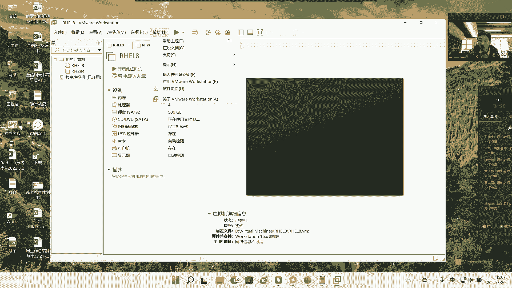
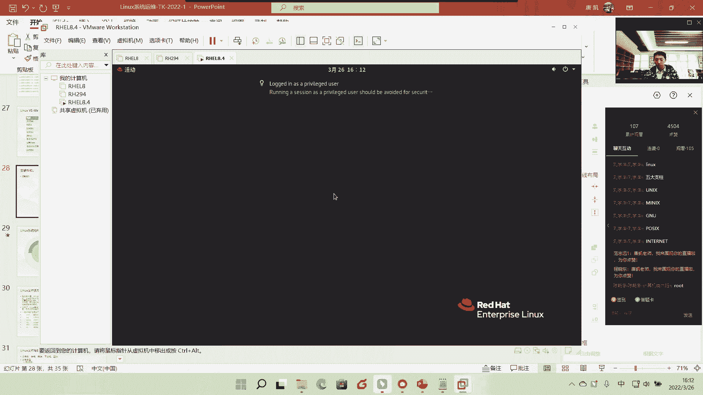
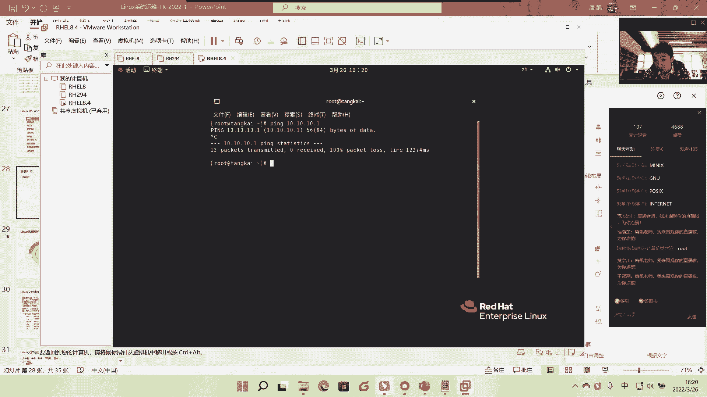
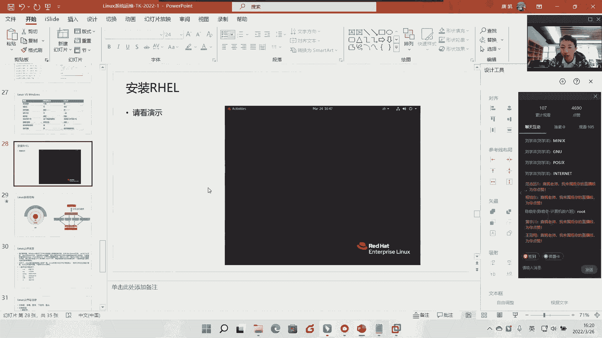
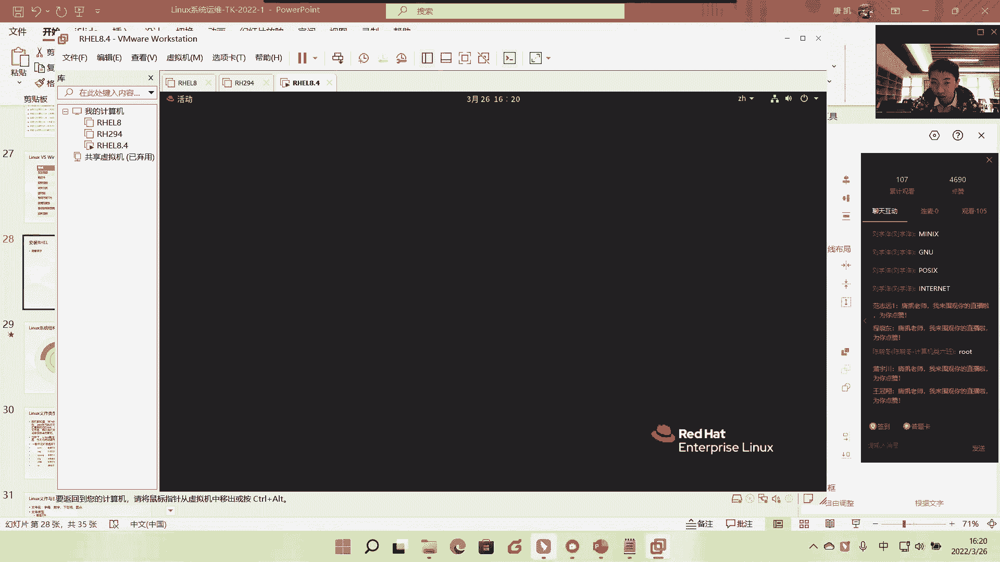
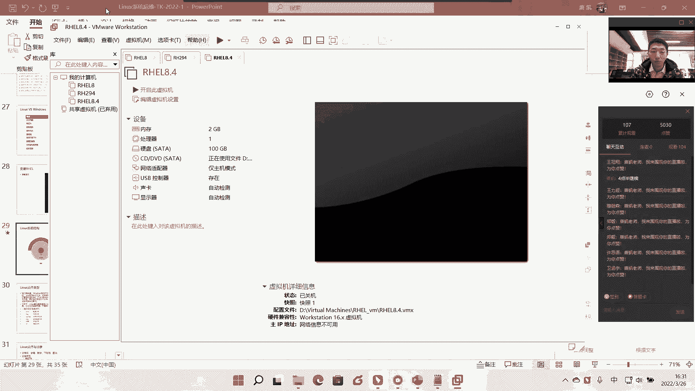
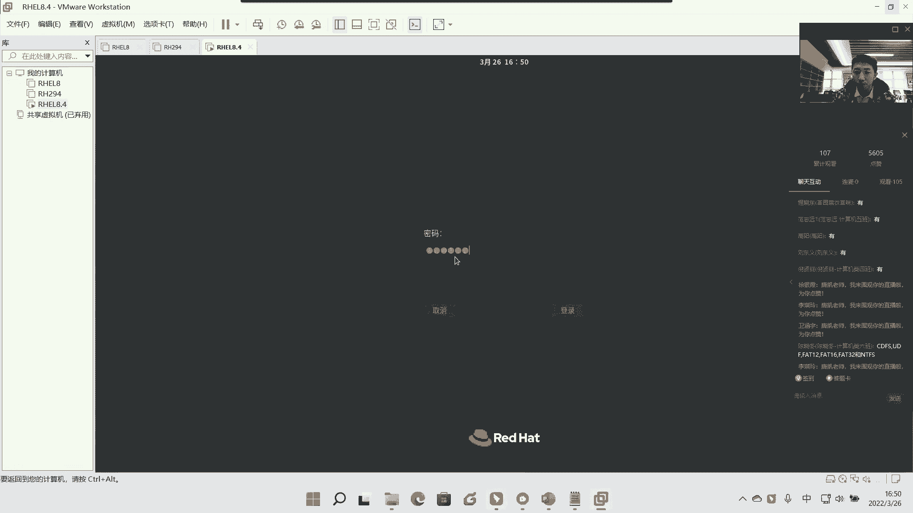
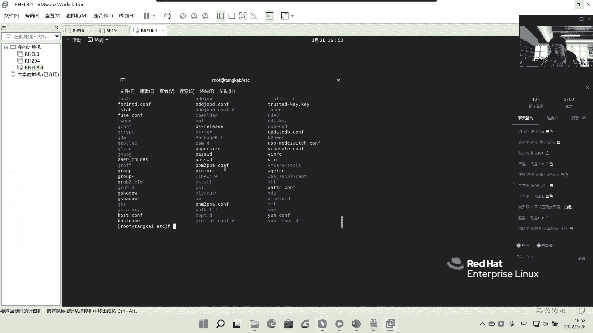
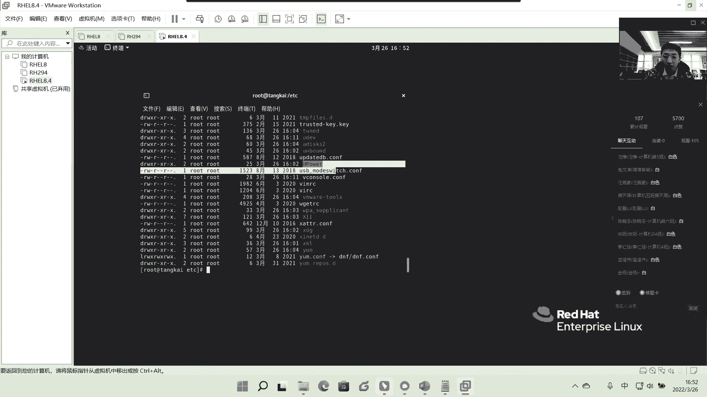
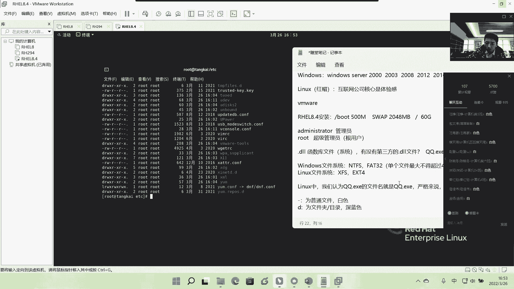

# Linux基础入门教学-2 - P1 - 唐老师开讲 - BV1b8411a7Rw

Yeah。440。嗯。😊，好，到场的同学们那个尽快签到啊，尽快签到。可以听到我的声音吗？各位同学。好的好的好的，谢谢。😊，哎。🤧咳。好K呃。那个我看到大家还在签到啊还在签到。然后呢。

有绝大多数的我们的同学已经来到了是吧，已经按时啊按时在我们的这个直播间里面已经上线了啊，已经上线了。好，那我们的下午的课程就继续啊，就继续正式开始，好吧，就正式开始了。好，嗯。

今天上午啊今天上午跟大家应该说讲到了我们的linux的一个呃历史，对吧？历史就是linux它是怎么来的那怎么来的对吧？一路是怎么这个诞生出来的。

然后同时呢也给大家去讲到了我们的linux一般在我们的呃认知过程中间啊，我们是怎么来认知的。其实我们一般是把linux称其为叫操作系统，对不对？叫操作系统。但是呢实际上我们linux在。

我们所谓的这个啊大咖面前是吧？那我们更多的是把它称其为叫内核啊，叫内核啊，这是两个不一样的概念。呃，所以我们需要让大家一定要去区分啊一定要去理解。啊，那我们的操作系统呢其实是基于lininux内核之上。

对吧？呃，额外去除了内核之外啊，额外去增加了我们很多很多的这种所谓的应用程序，对吧？或者说很多的功能对吧？说组建起来的这样一套环境啊，这样一套环境。好，呃，那当然今天上午的时间应该是过得还是挺快的啊。

过得还是挺快的。呃，我也那个中午的时候也有很多那个小伙伴是吧？我们的同学们啊，加了我的这个微信啊，我也大体问了一下，我说那个啊听的怎么样啊，是吧？然后这个语速快不快啊。呃，大家反馈还可以还行啊。

那当然呃如果说大家觉得这个语速啊，或者说整个这一块听的不太明白，大家可以随时在这个屏幕上都可以打出来啊，都可以打出来啊，我们随时互动啊，因为我们说了这个这一阶段呢咱们的实训呢更多是认知对吧？

认知就是让大家更加熟悉啊，我们有这样一个在在咱们这个世界上是吧？有这样一套非常优秀的系统啊，来来来来去学习到他啊，来去学习到他然后呢，今天中午也有同学可能在跟我们的班主任是吧？刘老师在互动的时候呢。

也在也也说到了，说呃，比如说。😊，我想呃自学一下linux是吧？然后包括还有pathon啊，还有python，那是不是是先学pathon，再选linux，还是先选linux再学python？啊。

是这样的，呃，它是两个不同的概念啊，我们说links是系统，对吧？没摄像头吗？一个大家看不到我吗？看不到我。😊，是看不到吗？我不知道哎。嗯。现在能看到吗？这这是我看我自己啊，你们看不到我吗？啊啊。

看不到。😊，看不看到了是吧？O是吧。OK现在现在OK了是吧？😊，啊，你。不是那个。😊，是。我有这么大细腻吗？啊，非要看到我是吧？我我也把它点开了啊，早上是因为我早上是刘老师设置了。

可能是他把它藏到后面这，我没注意啊，没注意。是吧啊看到人这个安全点是这个意思吗？是吧？看到大户能安全一点。好那就看着吧，好吧。😊，帅个鬼帅。想着昨天晚上啊想着你们那个今天要跟你们上课。

然后昨天晚上正好还做了一点做了一个项目，刚刚在收尾，然后呃特别困啊特别困，晚上洗了个洗了一个头，准备说梳梳一下子，结果呃太困了，一早上又没时间，然后就没弄了。好了，不管帅不帅了，反正大伙人在你们面前。

好吧，大伙人面前呃，我们就继续了，可以吧，我们就继续了啊。😊，好，呃，我们接着到找接着那个刚刚所说的一个话题啊，刚刚所说的话题。

刚刚所说的就是说有同学就就在问说到底先学linux还是先学我们的pa呃这个python啊，呃需要让大家明白，就像我们刚刚在上午讲那个历史中间所说的我们对吧？它是用汇编语言进行的开发，然后呢。

又用那个呃我们所说的那个就是 recha对吧？然后呢，它用我们的C语言进行开发。那同样一样的概念啊，就是我们的语言一定是要有一个载体，这个大家一定要理解啊，语言一定会一定是需要有一个载体的那同样的概念。

我们的pyon其实也是一个语言对吧？也是个语言，它需要通过我们的操作系统的载体来承载它在这个载体之上来进行开发啊，是这样一个概念啊，是这样概念。

那当然很多人说那老师我能不能在这个windows上面我去安装。😊，个windows的呃叫python for windows的这个功能包，然后在这个上面来进行开发，可不可以可以，没有问题啊，没有问题。

但是呢实际生产环境中间啊，实际生产环境中间，那我们很多的企业玩on玩uppet玩我们的一些比如说玩现在的购语言对吧？类似于很多很多的这个东西其实都是for linux的啊，都是for lin的。

所以呃换言之我们还是建议各位是吧？我们的优秀的我们的本科生啊，我们本科生啊，我们希望大家首先呢要把底层的这个环境系统一定要先熟悉啊，先熟悉，当你对底层的这个环境最基本的功能是吧？最基本操作你都非常熟了。

哎，然后呢对这个架构是吧？对整个网，我们说了这是开发和网络啊，应该准确来说应该是不能分家的啊，不能分家的，为什么呢？呃很多人就说老师我大学期间老师都让我学开发，或者说我的大学课本上啊，基本上都什。

java是吧什么C语言啊，类似于很多很种开发性的语言。啊，就感觉自己很牛逼啊感觉自己很牛逼。但是实际进入到企业之后呢啊也确实在做这一行啊，也确实在做这一行。但问题来了，就是呃比如说他开发了几年啊。

开发了几年，然后呢，转过头来，然后再问他说啊，你这个就有时候我经常有时候呃出差啊，去见到我之前的一些这个所带的学生，我就有时候就问他们，我说你这在工作是吧，工作了几年了。

那你这这个这个做出来这个呃pyython啊，就比如说这个呃java啊或者怎么样，你做出来这个东西，你觉得怎么样，就依托于。😊，你整个这几年的这个功底是吧？你觉得你长进怎么样？

很多人就是他就进入到一个死胡同里面了，为什么呢？就是他是会这个东西，然后去企业呢，他也做这一行，但是他不太清楚，我做了人为这个企业或者人为。这个这个就是是否能突破出去啊是否能突破出去，什么意思呢？

就是他似乎只会那些技术啊，这句话可能大家需要去斟酌一下啊，就是他只会那些技术，但是一旦跳出了那个框框，是吧？他因为他在他的大脑里啊，在他的大脑里或者在他的整个思维角度中间。

他没有对整个底层的平台架构有一定的梳理啊，所以可能他在企业中间只能是一个开发者我再说一遍啊，他只能是一个开发者，他不能成为一个架构师啊，不能成为一个架构师，那真正的顶层的顶层设计的架构师是既会懂网络啊。

懂平台啊同时他又熟知系统啊，熟知这个编程啊，熟知编写。那么呢一旦会整套的熟悉之后，他就会为比如说他假设去到了金融公司，对吧？金融公司那。既然他也懂平台，懂系统，他又懂又会什么呀？

这个比如说python啊，又会所谓的这种自动化的语言，那么就很容易将他自己的工作哎变得非常轻松，为什么呢？因为他每天他只要他可能前一进去，他可能会熟悉环境对吧？熟悉整个结构，然后呢。

通过他的这个对这个平台的结构，对它的底层的设计，哎，觉得有哪些地方可以是吧？比如我我不懂的时候，我每天可能啊忙忙前忙后非常非非常累，对不对？但是哎通过自己所学的开发语言是吧？然后呢又懂这个平台之后。

他可以自己去编写很多很多叫做自动化的d啊自动化的脚本啊，自动化的功能对吧？通过脚本触发啊，通过什么什么指令触发。那么你想一想，你未来可能你不懂的人，他经常去晚上还还有什么守在里熬夜是吧？

要需要去做这种所谓的这种栽备的时候，我需要去。呃，等着。但是此时此刻如果你懂设计，你懂开发，你懂这种平台，那你就很轻松了呀，对吧？为什么呢？哎，到达几点钟是吧？容灾多多大对吧？啊。

我们的这个呃呃这个这个里面的数据达到多少多少的瓶颈。哎，我就需要做什么调度，对不对？他就完完全全可以通过他自己编写的东西去解决企业实际发生的问题，而且老板而且不会错，而且不会错，为什么呢？

因为所有的东西都是机器在做，对吧？所以这个时候就能保证你在未来的工作的这个过程中间会非常轻松，而且薪资还非常高，啊，薪资非常高，为什么呢？没有人能替代你啊，没有人能替代你为什么？因为你懂太多了，啊。

你懂得太多了。😊，啊，所以解决今天中午啊，有同学所问的就是说那到底是先学派是先学linkux。那我个人建议是呃因为linkux它是系统运维的角度，你必须在企业中间对于整个系统运维熟知对吧？

然后之后你再往上沉可以去啊走一走开放的路线，我觉得这是可以的啊，这是可以的是第一个好，那当然了呃在早上快结束的时候啊，有同学也在问说呃唐老师讲了一个云计算啊，大家讲云计算。但本来我还都听懂了的。

然后叫了10分钟讲云计算哎，我没懂了，然后呢接下来就问了一个说云计算到底是个啥云计算到底是个啥，呃我还是那句话，就是我们一定要跳出一个，因为确实啊因为大家没有接触过，所以突然一下去讲一些很多新鲜的东西。

可能大家因为没有接触，所以你无法get到那个点啊，我无法get到那个点，我还是那一句话就是。😊，我们用生物中间的例子来理解啊，生物中间例子。我们就来在座各位大家来说，比如说你啊，比如说你你是呃怎么说呢？

你是这个学校什么武汉工程大学的是吧？假设是个学生会主席是吧？学生会主席。那么大大小小的事物，对吧？无论是学生也好，还是老师也要也好，还是专业上面所有东西都需要你来调度啊，都需要你来调度。

而且这种调度是不分昼夜的啊，不是说你像人一样的啊，你什么我现在是吧？这个早早8点啊，早9点晚上什么6点是吧，上下班标准的没有啊，没有随时随地你的手机不许关机对吧？随时随地需要你调度，随时随地需要你触发。

而且你只准回答，就是你必须去解决，如果你不解决是吧？你你就是吧？这个体验感就不好了啊，体验感也不好了。但是你要发现一个问题，当你一个人，你哪怕你再大的能力，你都不可能24小时连轴转对吧？

7乘24小时乘以365天，你做不到的，你总会什么呀。😊，个电脑是吧你这个人总会什么虚脱掉是吧？扛不住是吧？扛不住。那么这个时候你会发现这还只是你一个人啊，还是只是你一个人。那假设你现在有什么呀？

有一个大的一个项目，他需要什么呢？1万个人，1000个人，1万个人同时来做这件事情，来相互配合相互处理，对吧？那你有没有想过，也许这一个1万个人才能扛得住，就是我们说1万个真人啊，真人你才能做得下来。

这个事情，而且这1万个人还得相互之间协调分工非常明确啊，非常明确，对不对？好，就就像比如说那个冬奥会是不是那个开幕式闭幕式啊，类似于这样人，就是你要协调非常非常好，但问题来了啊，当问题来了。

你1万个人在哪里去找这个人工成本是不是非常高？那其中有一个人耍脾气，你该怎么办？😊，对吧就是会有很多很多不确定的因素来去阻挠你公司的正常业务，明白意思吧？好，那么现在呢就会有一个更大的机子来了。哎。

有一个人说没关系是吧，老百姓这个中间是吧？每个人的这个众众口难调，那怎么办呢？来有请解放军啊，我们军事化管理，对不对？你只需要把这个任务哎交给我们。当然这个例子只能说只是例子啊，不能不能乱说了。

不能我们不能触犯这个神圣的咱们的是吧，我们的军人。😊，对吧我们只是举例子，哎，把这个事情交给我们的解放军是吧？然后呢，我们按需付费，什么叫按需付费？比如说我现在业务没有达到1万个人。

我可能我现在业务只啊不比如说这一个月中间只有一天或者或者几天，我需要有1万个人来协调这个事。但实际其他的时间可能只需要什么呢？只需要一两百人啊一两百人，那那么这个问题就来了。

如果说我现在在实际的生产环境中间，我们的电脑对吧？我因为我就为了这几天的这个业务，我需要去采购1万台电脑，来，就是一万真实的电脑啊，然后呢，让你来协调，你有没有想过第一成本是不是1万台电脑。

这个这个压这个成本就很大了，它不是普通PCO，它的服务器哦，对不对？然后第二，你的网络是不是还得必须保证这1万台电脑能相互配合是吧？第三，你是不是至少得招几个管理员来维护吧，对吧？

第四个电你是不是害怕不能是吧？突然一下停电了，因为一万台你同时起来电扛不扛得住啊，你是不是要做。😊，活对不对？你所有一些全部下来，那这个成本就很高很高了。😡，是不是？而且你只需要用了几天。

那其他时间不需要，那你这个电脑怎么办呢？那不就废着你废着了。😡，这个大家能理解意思吗？对吧？就浪费了呀。😡，这个叫什么浪费？这叫资源浪费，是不是啊？好，那么我们现在就需要怎么办呢？那很简单呢。

那我们直接现在就是我刚刚说云计算最大的特色是什么呢？就是。就我就举例子啊，假如设我哎就是什么呀，就是一个承接方。我告诉你，现在你要这个业务，你不需要去买电了，你直接找我找我来租就行了，对吧？我有1万台。

我有什么10万台，我要上百万台是吧？你只告诉你需求，你随时来租，对吧？你那几天你需要，比如说你今天需要1万台，我随时给剥你1万台的资源给你就行了。😡，对吧如果你现在不需要对吧？

你现在只需要几百台资源没关系啊，对吧？你你你直接几百台资源，我拨给你就完了，是吧？按需付费你要多大，我给你多大对吧？你要多少给你多少，你按需付费就行了。那后台的维护成本是吧？电费啊，水费是吧？

我举你人工费是吧？一切的安保，什么被别人攻击啊，对吧？这么黑客攻击，所有东西都不需要你管啊，都不需要你管。😡，啊，所有一切全部都在我这里啊，我来保证一切，但是你要你的业务放上来是吧？

相当于你就做我的东西嘛，你就按心付费就行了。那么我的这个平台叫云平台，就相当于我举举个例啊，叫云平台是吧？云是么？就天上的白云嘛，是不是你是相当于远程的概念啊，远程的概念啊。

我这个平台不在本地本地就是我刚刚说，你需要去付这些所谓的资源啊，我们刚诉啊我云平台指的就是远程通过互联网的形式啊，通过互联网的形式啊，我的公司的业务放到云上去啊，放到云上去，这就是云平台。

啊云计算就是当我所有业务全部在这个上面之后，哎，我来做客户分析，我来做客户的运营，我来做这个资源的分配等等一切的计算，那就是在这个上面，所以我们统称为叫云计算啊，统称为叫云计算。啊，是这样。

的给大家稍微解答一下啊，给大家稍微解答一下。那当然很多人说那云计算这个我未来能不能从事这一块，没有问题，我实话说没有问题，为什么呢？因为搞系统啊，做系统的对吧？咱们搞IT的。

你在未来这个社会上面目前最高就是目前这个行业的基准啊基准或者说行业缺口就是在云计算上啊。很多人说老师你不是说早上说linux缺口大吗？我说linux是云计算的底层啊，它只是一个系统啊。

很多人就说那比如说你去这呃那个那个那个叫什么招聘网站上面的，很多人说你懂不懂云计算呢啊，但是抵押前提就是你会不会linux啊，对吧？都是一样的，它是一个相辅相成的概念啊，相辅相成的概念。😊，啊，好吧。

这是给大家稍微说一下。所以你会发现IBM公司这早上所说的IBMIBM为什么花这么大的价格，这么大的价钱对吧？去收购我们的红帽原因是什么？很简单，就是因为红帽它开始定义叫混合云的未来，很多人又懵了。

我靠你这个云计算怎么又蹦混合云了呢？啊啊，为什么又不混合云呢？首先是这样的，我们云计算一般来说是分为三类啊，一般来说分了只是扯大了一点啊，云计算，凡正认知嘛，对吧？

认知我们就要聊一聊云计算一般来说是分为三类的，一个是叫私有云。😊，啊，哦这样说吧，我反着来说，一个是叫公有云。啊，公有云什么叫公有云？我刚才已经告诉给给大家都说过了，是什么意思啊？

就是你所有业务全部托管给阿里托管给什么百度、腾讯呃什么华为云啊什么的，就所有我全部给了他，我只需要按需付费就行了。对吧？我现在发现我自己评估啊，我自己评估。哎。

我发现我现在是需要有100台这个这个主机来帮我来来来解决这个东西是吧？10台这个硬件资源来帮我来解决O行，我直接在你的什么这个阿里云上面采购100是吧？采购100直接直接填个数字就行了。

直接填个数字就行。然后阿里云就下给你汇算，你需要支付多少钱是吧？支付多少钱多长时间支付多少钱，把钱一打过去ok这100个资源全部给你了。然后告诉你你该通过一个账号上去。

你该把你的什么什么那个那个叫什么你的网站，你的数据，你所有的往那个往那个FTP上面丢就行了，丢丢全部丢丢上网丢丢上去之后，O你的整个业务就上云了，就这么简单啊，就这么简单好。😊，接下来这就公有云啊。

公有云就是全部托完的那其次呢我们刚刚也说了，还有一个叫私有云。那私要云指的是什么意思呢？那说穿一点呢？就是说现在啊现在我自己会我刚才说啊这个这个云计算都是技术，对不对？技术，既然是技术。

那我只要学会这个技术，我是不是就可以自己去搭一个云了，可不可以可以没有问题啊，没有问题。所以我们的很多很多的就学会云计算啊，就学这所从底层的linkux系统开始学习啊，一路全部学所有内容全部学完之后。

你也会搭云了，啊，你也会搭云了，真的？这个云计算其实不难，你也会搭了，但是你搭完之后就会面临一个问题，是吧？你说那我能不能不能抢阿里云的市场，你当然可以抢啊，对吧？你当然可以抢。

但问题就是你客户信不信你啊，对吧？客户信不信你啊，是不是比如说你处去跟别人说说来你在我这里买双耐克的空军一号是吧？啊，我这个鞋只要100块。😊，而且保证正品，你觉得所所惠性对吧？

你觉得随惠性这是很正常的，对不对？为什么呢？是因为当别人觉得哎那个专卖店中间的是吧，那个产品啊摆上去那个货架，哎，更有质量，更能保证，对吧？比如说我们京东的自营的，哎，我能保真是吧？我举例子啊。

我能保证你是不是买的东西，买家电买什么东，你放你在哪里买是不是更放心一点点。😊，是不是对吧？这就是一个概念啊？那很多人说那我搭这个私有云的目的是什么？什意思啊？我刚刚说啊都是一样的。

云计算你技术都一样的，无非就是一个放到互联网上，一个是放到公司内部，对不对？私有云就是说你去为了解决公司目前的很多很多业务的这种繁杂程度，我自己去搭个云可不可以？大家自己公司内部的一套云，可不可以？

对吧？让公司各个部门能在云上共享资源，明白意思吧？比如说现在财务啊，比如说你假设你公司啊，假设我们说公司化啊，比如啊或者说我们就拿学校来举例子吧，就拿学校来举例子，好，比如说现在这个校长办公室对吧？

校长这个这个院长办公室说哎，我现在这个电脑太卡了，这个用于教学不行，是不是O我去采几台，然后呢A教室是吧？比如说我们的这个啊技工系或者是说什么什么系啊，A教室，哎，我这个这个电脑也不行了。

我要去采几个B教室也就采C教室也就采。😊，有的大学中间是吧五六十间教室你全部一换。好，结果呢哎说什么那个教务处也换是吧？教务处的电脑也不行，那这就相当于是一个大的采购啊，这就我们就相对于大的采购。

为什么每一个机房上我是不是都得裁硬件？是不是？而且采完这个硬件之后，可能我用一用上一年啊，可能这个不爱惜啊，这个设备可能这个择教了是吧？这个设备有问题了，我可定要去换，对吧？我要去换。

这又是一笔不小的开支，是不是好，但是但是一旦有云计算呢？我不对外，我就是我自己的云计算什么呢？现在很多大学不都是有自己的中心机房嘛，对吧？中心机房，那我能不能哎我把每一年需要去投入的这些硬件啊，是吧？

我把第一年的所有硬件的这个投入的费用，我直接哎去在中心机房里面去买服务器是不是买很多服务器好，买完服务器之后，我组成组成一个云计算对吧？一一个一个环境，然后呢，在每个教室中间放一个终端盒子啊。

这里提了一个新的词啊，终端盒子其实终端盒子，很多网吧都有就是无叫无盘系统嘛，这个大家能理解吧，对吧？放一个终端盒子，哎，老师过来之后只要按一下终端盒子，你就可以上课了。😊，为什么呢？

因为所有老师的这个这个系统，这个界面全部都是在中心服务器上面，对吧？我做我是讲你呃讲计算机老师哎，计算机只要打开输入账号，输入用户名，输入密码，啪一进去就是我的桌面，我的界面。对吧而且这样好处是什么？

好处是。😡，我在任何一个教室去上课，我都不需要按照传统意义上的啊，带个U盘啊，这里讲完我要插什么拔插是吧？啊，那个去第二个教室，我要拔插，第三个角，我又要拔插。第四个教室，我还要干嘛干嘛干嘛。

这就很麻烦。那么一旦校园网，对吧？校园网全部建立完成之后，我只要搭建我自己写的私有云，我完完全全可以保证我的账号什么样？在我的校园这个网络中间，只要涉及到登录的这个界面是吧？我都可以随处可登啊。

随处可登，这就是私有云啊，这就是私有云。对吧那有些科研部门也是一样的，我不能上公有云啊，我就只能上私有云，对吧？统一计算。好，但是那混合云是什么呢？混合云就是说既有公有是吧，又有私有。啊。

既有公有又有私有，这就混合云啊，混合云把做公司核心的一些数据库啊什么的，我还是放到我本地，对吧？这是我公司命买，我不能上云是吧？我害怕虽然云虽然非常成熟了，但是我还是害怕害怕什么呢？我不是害怕这个垮了。

而是我害怕什么？害怕我的东西啊被是吧？被被收编了，就像蛮简单，你你今天的阿里的数据赶给腾讯吗？不敢吧，腾讯的数据赶给阿里嘛，也不敢吧。虽然说国家说要求你们什么是吧和平共处啊，这个是吧这个资源共享啊。

我不相信他会共享，是不是商人就是商人，就这么简单，对吧？商人就是商人，随都不敢把资源全部公公布出去，公布出去，那就代表你你是吧？你自己在你家的后院干嘛？开了个开了个大门，随便随时进出无所谓。😊，啊。

所以是进属无所谓。好，混合云就是说把所有的资源。我再说啊，所有的资源放在公有云上，利用公有云的资源去解决私有云的一些数据的运算或者数据整合。我们称到为叫混合云啊，称它为叫混合云。😊，好。

OK所以在混合云的这个上面，我们的红帽啊我们红帽因为是它是做平台的对吧？做操作系统，做平台的，所以红帽在混合云上面它是有很大的发展空间啊很大的发展空间。

这也是为什么我们IBM啊以这么高的价格去收购一个开源厂商啊，你想过没有？开源厂商对吧？这是我们的一个啊一个概念啊一个概念。😊，好，那同样我们也可以看到那红帽的价值也是一样的那它是这样的。

1950位受访者中间呢，绝大多数对认为开源对企业整体的基础架构的软件战略是具备重要意义的啊重要意义的。所以你也会发现的是呃红帽的这个价就是就是它做出来的这个市值也是不断的往上。你看这个Q指的是什么？

一般来说，在企业中间就做第一个季度第一财年，第二财年，它是一直是吧？第219个Q都往上在涨啊，所以相当于这个社会上面还是有很多很多的这个这个IT这一块的开始认识到开源的价值，开源的魅力啊，开源的魅力。

啊，这是给大家稍微说一下啊，稍稍微说一下。啊，当然因为我们今天我们的这四次课是围绕红帽来讲，所以我们重点要谈谈红帽这家企业啊，重点谈一谈。好，那么接下来呢我们就要来给大家稍微说到的是红帽的系列的产品啊。

红帽系列产品。刚刚也说了，红帽是一个是目前linux的这个领域中间的扛把子，对吧？扛旗的这家企业。那红帽呢它其实也有很多很多的产品。那就光从操作系统啊，从系统这个角度，它就有三款啊，它就有三款好。

那哪三款呢？它是这样来理解啊。首先我要给大家来稍微说到的是。呃，我们红帽呢现在引以为豪的是有一个叫企业版underpri啊，叫企业版linux系统。那还有一个呢叫fdora啊，dora叫做社区版本啊。

还有一个叫做stoOS。最早的时候呢stoOS其实并不属于红帽啊，并不属于红帽。但是呢它是它你可以定位成为它是一个好事者，什么叫好事者。最早的时候呢，红帽其实是有两个啊。

就是上面两个一个斐dora一个红帽的underpri一个你可以理解，就像微软一样的。可能大家这个对微软这个windows啊，windows的这个系统可能啊熟悉程度可能也不是很多啊很多。我举个例子。

我们现在可能用这个windows大家比较熟悉的，就是现在最新的是win11对吧？win11。但是呢这种windows的个人版其实更多用在的是我们的个人普通PC上面啊，我再说个人普通PC上面。

其实实际在企业中间，我们。windows也有企业版本啊也有企业版本。比如说有windowsserv什么什么什么版本啊，serv什么版本，这个要求大家去理解啊，比如说我们的windows。

windows啊windows它也分为个人版和企业版。那企业版最早的时候，当然在我们应该是非常熟悉的windows server吧，它叫serv。大家注意啊，windowsserv系列。

最早是2是两000系列啊，两0千系列，然后呢后来到2003系列到200这个八系列，2008系列，然后到这个2012系列到现在2016系列，20这个20162019系列。

然后现在是20222022这个系列呢已经灰出来了，但是目前呃你可以这样理解吧，就是还是找上那个例子，呃，不是说不是像我们一样，比如手机软件啊，觉得这个东西有更新，立刻更新成最新是吧？操作系统啊。

个人次立刻更新到最新，那只是玩明白意思吗？那只是玩，你觉得这个不伤大呀，对吧？对我电脑这个这个里面的数据不不产生任何影响，O你直接升就完了，这个没任何问题，是不是？但是在。😊，中间就不能这样玩了。

我再说明啊，在企业中间，现在很多企业仍然在使用2003和2008的系统。我再说明啊，仍然在使用很老很老的windows设，对吧？不是说他不想升，是他不敢升级，我再说明，他不敢升级，因为它一旦升级了。

万一某个功能实现不了。而这个企业中间又靠这个功能才能盈利。那我跟你说，你真的就是挨签到的，知道吧？那老板真的是拿拿拿那个叫什么关公的大砍刀追着你砍，为什么？因为你把整个公司的业务全部搞混了。

所以很多的地方，因为它是闭源，我再说明啊，因为它是闭源，一个是开源，一个是闭源嘛。😊，哎。闭园啊闭园，所以只能由微软windows是吧，它自己来进行呃什么补定的开发啊，这个什么功能的升级等等等等这一块。

那一旦他没有做这一块，那不好意思，你的业务就停滞了呀，对吧？你的业务就停滞了呀，所以为什么我早能说我们的windows XP的系统早800年前都已经停根了，为什么我们很多的重要的ATM机上面是吧？

依然在使用这个XP原因是什么？你没办法升级啊，你咋升呢，对不对？你系统升上去了，结果硬件不支撑，你不你不完蛋了嘛，对吧？那别人取不了钱，你说咋办？对吧然后新闻报道各个媒体平台直接说啊。

就是那个谁谁谁是吧？这个职务操作啊，那你你想想这个舆论压力多大，是不是？好，这是刚刚所说的。好，那么同样的啊同样的我再说一遍那linux呢我刚刚说了康奇的啊，我再说。

我在这里说一下linux康奇的是我们的什么呀？红帽啊，大家注意说红猫公司啊，那么红猫公司呢，它其实也比较聪明啊，它比较聪明，为什么呢？因为我们说了所有的互联网公司的核心核心是什么？😊，核心是体验感。

我再说一遍啊，体验感。什么意思呢？就是体验感好，对吧？那么我给的钱就就这个客户就喜欢在你这个上面，你体验感不好，那不好意思，你公司走不长了啊，你公司走不长的，对不对？好。

那么既然是体验感红帽也非常的明知这个概念，所以呢他是怎么来做的呢？他一开始你要想他要面向的是企业客户，他不是发出来的这个undererprise系统嘛，他是要面向于企业客户的。

企业客户他不是像你这个这种概念啊，对吧？很多人说小白，我你你买个任何东西，你也就是几百块钱是吧？打破天一两千块钱是不是但企业客户就不是一样，企业客户就是我动不动其实几万几十万上百万是吧？

大几十万的去向你采购啊，对吧？一旦这个客户丢了，那你想想这个公司损失就大了呢，对不对？所以啊所以请大家注意了，红帽他是怎么。😊，他就先发布斐dora啊，它先发布这个个人版啊，我再说一遍。

你可以理解斐多ra相当于windows的win10win11，类似于像这样的就个人用户版本啊，个人用户版。但是呢这个版本能不能跑这种这种这种啊就是企业服务的一些资源呢，完全可以啊，完全可以。

但是呢这个斐多ra呢大家都很清楚它是个社区版本，什么叫社区版本就是直接把它丢到就是它是这样的啊，它每半年升级一个版本，它一年升两个版本啊，还非常标准，它目前最新的是斐多ra35啊，35版本啊。

什么概念对吧？它直接发出去，然后呢说家人们是吧？你们赶快使用对吧？现在最新版本出来啦啊，大家只管用大家只管这个只管去去去去下载，下载完了之后你们去爽对吧？然后呢遇到任何问题之后呢，哎记得要提供反馈哟。

对不对？好，所有人呢哎呀看了心。😊，进来了啊，既然是吧也要我反馈，也尊重我呀，对吧？好，这个时候呢只要有问题，哎，我就反馈，只要有问题，我就反馈。那红包的工程师接到这些反馈干嘛呢？哎，他就来做评判。

这个反馈合不合理呀啊，这个反啊，还真的是有是个这个bug啊，我就赶快来修补，对吧？我就赶快来修补啊，修修修修修修修修修修到最后他发现。😊，哎，很成熟了，他修完之后大家注意啊，就是修完之后。

它会随下一个斐多ra版本继续发布啊，继续发布发布出去。然后呢，就哎那个就其他用户又一看啊，这个挺好了，但是功能少了一点了啊，别人又提啊，这个功能应该怎么加怎么加怎么加好又反馈给红包啊，红包然后又来做啊。

又来做这个各种功能的开发，各种功能的这个修补好，修补完之后呢，他又随斐多拉下个版本又发出去了好，发出去之后呢，他发现再回来的时候哎。😊，没有影响了，没有任何的非就是没有任何的这个说不好了，对吧？

没有这个这个这对这个软件没有任何吐槽了，紧接着干嘛呢？他就把这个软件从斐多啊提取出来啊提取出来，然后往undererpri往企业版上面丢，明白意思吧？往企业上版上面去丢，好，丢上去之后，那就简单了呀。

对吧？好，那企业版就足够稳定了。为什么？因为大家已经经过测试了呀，对吧？经过这么多人的测试已没有问题了呀，然后就往企业版上面丢，好，那企业版干嘛呢？哎，3到5年之后发布一个新的企业版。

发布完了之后就放到互联网上面啊，就就就像企业推是吧？你看我这个软件足够安全，足够高效对吧？经得起推销的对吧？那你们花钱是吧？来卖我的订阅啊，对吧？来来来往我的整个环境呢，它是这么来玩的啊，这么来玩的。

所以基本上哪怕现在。😊，enterpriselin企业版最新的版本是8啊，小版本是。5啊，8。5的版本可能还仅仅只是用到了斐dora的20多的这个系列的这个上面的功能。

可能斐dora35中间一些新的功能，根本都还不在最新的enterprise上面。啊，都不在这个上面啊，要求大家去理解。😊，好，但是呢我刚刚说了，红帽他需要赚钱呢，对吧？那他的客户群体在哪里。

就是在企业呀，对不对？就在企业，所以他一定是把undererpri这个linux啊，企业版linux作为它的核心的生命线啊，核心生命线。好，但是呢哎曾经的透OS团队。是吧？就是我们刚说我们叫做克隆嘛。

对吧？既然红帽既然你lin提供提倡的是开源项目，那那没有那很简单啊，那红帽你推什么，我生透OS就推什么哎，我只给你换个标就行了是吧？什么意思呢？就红帽你推出来，你说你要买订阅才能下载到我的是吧？

这个这个售后服务，那后生投OS直接说说我所有东西跟红豹同步，但是我不要钱啊，就这么拽啊，我不要钱啊红帽发布出来之后呢你给我48小时，我也能做出来是吧？我把个logo一我丢上去，我叫投OS。😊，啊。

所以当时有很长一段时间，我们的国内特别是沿海地区，比如说上海、昆山啊，比如说浙江啊，类似于这种沿海城市知道吧？然后绝大多数的都在使用渗透OSS啊都在使用渗投OSS。

但是很好玩的是在招聘简呃招聘简介上面写的都是什么呢啊，会熟悉生投OSS的这个这个工程师啊，高薪成聘啊，等等等等等一写写完之后，最下面写的一句话啊，持有红帽认证证书者优先。

很多人就不理解你要生投OSS怎么来句红帽啊，原因就在这里，是因为生投OS跟红帽几乎一模一样，几乎一模一样啊，几乎一模一样。而且红包收费的在s透上s透上全部免费。所以呢到2017年的中旬啊2017年中旬。

红豹直接把生透S给收购了，直接给并购了。说哎呀，我让你调皮了这么多年啊，你该调皮完了来回到爸爸的怀抱里啊，他把生透OS给收购了。但收购完了之后呢，还依然让生透OS是吧？这个因为收购完了之后。

你不能说立刻收费嘛，对吧？然后呢还是让生透OSS对外啊依然保持它的这样一高调的打法，但是呢别人在所了解的都知道啊，它是红豹的产品了啊，他的红包的产品了。好，那么随着在2018年19年的时候。啊。

19年时候呃，然后呢，s透OS就是红帽就推出了一个一个说法，到就是在2022年就是今年开始啊，今年开始s透OS啊，就是开始变为滚动版本，就相当于什么叫滚动版本，就是跟斐do一样的啊，跟斐dora。

就跟第二个是一样的，成为一个滚动版本它不再是像undererpri links一样的，是一个就是我们叫做什么？叫做是一个固定的安全高可笑的这样一个版本。也就是说s透啊，它也就是什么意思啊？

它就变相的告诉社会啊，告诉世人啊，我s透OS啊时不时会更新的啊，时不时会更新的啊，所以。就是要要求大家理解的就是我们的这三个啊这个战略啊三个战略。所以在企业中间，我们依然啊这个这个是熟知的。

就是红帽under这个rehar红帽的这个企业的啊企业版本。但是呢红帽靠什么收费？我刚刚说啊，这个系统是加入GPL的对吧？需要开放语言代码的。那么这个时候呢，红帽靠什么？靠的就是订阅收费啊。

我去卖我的什么呀服务，卖这种未来的售后是吧？为这个这个整体搭建我是卖这个的啊，我是卖这个的。好，那么既下谈到这里呢，我们就要知道的是红帽刚刚已经说了，红帽的核心是在云计算混合混合云上面进行发力。

那么我们也要在这里稍微了解一下我们宏大呃不不宏大红帽有很多很多的它的这个这个叫做什么呢？比较经典的一些它所开发的这种叫做基于云计算的套件啊，比如说它的系统是吧？undererprilin系统。好。

然后呢C因为呃这个今天有同学好像是问到了红帽的认证。等一下我要说的啊，那红帽紧接下来呢，它第二个我觉得做的非常牛的叫做ensible啊，asible的一个。😊，plan for啊aspo什么意思呢？

就是现在很多的人啊都开始玩那个叫自动化了啊，叫自动化了。为什么呢？因为人工的这个失误成本太高了，因为现在的这个业务越来越值钱啊，业务越来越值钱，对吧？呃，真的是很担心用户会导致啊这个不小心的这个操作。

或者说导致什么呢？会导致你整个业务崩掉，所以呢现在很多的企业都开始玩叫做什么呢？叫做自动化运维了啊，自动化运维，通过类似于这种aspo的自动化套件啊，你自己要去写这种自动化的框架。

然后放到这个红豹这个企业中间，然后红包来帮你跑跑脚本啊，跑脚本。所以aspo也是目前在我们的国内应该是需求量非常大的啊，应该说非常大的一个方向啊，这叫自动化。当然这目前我们红帽的中级认证啊。

中啊这高中低嘛，中级认证。😊，就是专门来考transpo啊，专门来考transpo啊，含金量非常十足啊，含金量非常十足。好，那其次我们刚刚所说了，早上有同学说老师那需求化呢。

对需求化就是undererpri。undererprise的这个序列化visation的这个序拟化，它是目前也是在企业中间用的比较多的啊，比较多。但不能说是它是虚拟化的老大，不能这样说啊呃。

他也是用的比较多，虚列化老大是vivo啊，vivo啊，这个EXSI的那个vivo的这个整个套件。呃，虚拟化也是它的一个非常非常强的一个方向。啊。

当然这个序列化和我们有时候啊我们自己自学用什么we world这个是吧工具来自学的这个vi是两码事啊，是两码事啊，这个是叫企业级的虚求化啊，企业级虚列化。

那还有一个叫什么openshiftopen shift open shift是什么呢？就是我们基于容器啊，基于我们现在很多的这种叫编排技术啊等等这一块的这种啊，我们叫做open shift。

这是红包定义的一个全新的。当然呃现在只是说让大家了解啊，这大家了解那未来如果说大家唉对这个我们的lins的这一套红包的课程感兴趣，是不是那慢慢慢慢的啊通过咱们自己的这个阅历啊。

不断的这个提升啊未来啊这边是吧来学习也好来提升也好啊，当你对底层这一块全部掌握之后，这未来的所谓技术你才能明白啊，它在企业中间是怎么运用的啊，企业中间怎么运用的，好吧。😊，好，那既天谈到这里呢。

我也正好在PPT中间写到了一张内容啊，写到一张容。既然我们说红帽，那我们或者说我们既来学习linux对吧？学习linux，我们一定要知道linux的认证啊。

就是红帽的这一块的认证在这个企业中间的含金量和它的市场定位是怎样的。我们要求大家去理解一下啊，理解一下好，首先第一个呢请大家注意了。我们这个我们的认证同样的分为一个金字塔啊，金字塔。大家注意了。

那我们最底层的论证，大家看到啊，它的叫法叫做RH就是红帽的意思啊，红帽的红帽的CSA就RHCSA的论证。😊，那么呢中文就是红帽认证系统管理员。大家注意啊，系统管理员。对，红包认证系统管理员。

那其次呢终极认证叫RHCE啊，大家注意RHCE那么RHCE呢它叫做红帽认证系统工程师啊，大家注意系统工程师啊，其次最上层叫HCA啊，就顶级的啊，顶级叫红帽认证架构师啊。

架构师这个架构师那就需要你唉对整个企业的是吧业务非常熟悉，然后呢布局非常熟悉，然后需求很熟悉，然后来做整体的架构啊，整体的架构啊，这是这样三个啊，这样三个。

那同样的那对应着我们现在全国啊全国的这个用人的到底是有多少人持资格证呢？那CSA啊面向的我再说遍啊CSA它单独的应该是这样说，今天有同学就问我老师我能不能考CSA啊，你还真能考CSA啊，CSA单独。

不来做是面向于我们的大学生的。也就是说你只要是在校学生，你都可以参与红帽的HCSA的这个认证考试啊，没有任何问题啊，没有任何问题啊，红帽也允许啊，也允许但是但是如果你已经毕业了是吧？参加工作啊。

已经开始了，因为你的他是要查你的毕业证的，如果你已经开始参加工作了。那么你最低的档次要从HCE开始啊，HCE开始什么意思呢？很多人说来老师拉我CSA是不是不用考了？不是的，他是社会人士他是这样的考试。

呃，一般来说CSA就是一般是要考一天的，就上午和下午考一天的，上午呢其实就是考CSA啊，考CSA下午考CE。那上午考多长时间呢，考3。5小时啊，三个半小时纯实操的，纯实操。很多人说啊，3。

5个小时考这么久吗？不就选ABCD吗？啊，不是的啊。纯实操的上机操作，对吧？你会就是会不会就是不会啊，不会，那不好意思，那你肯定不会你会也敲，很快就能做完啊，3。5小时时间足足够充分。

那下午是4个小时的啊，下午是4个小时，总共是7。5小时啊，总共是7。5小时，下午就是HCE。当你上午考试通过了，你再参加下午的考试，然后两门都通过才能获得RHCE的证书。大家去才能获得HCE的证书。好。

但是针对于我们的学生市场，红包给他拆分了，为什么呢？因为我们学生他不可能一下就把CSSE全部学到，除非你在外面参加这种所谓的这种叫做培训机构，对吧？比如说来基进啊参加培训。这个时候你可以CSS一起考。

对吧？CSS也可以分开考啊，也可以分开考。对吧你说我我需要的时间很短，但是一般来说在学校里面，可能你在一个学期中间学完是吧？你可能只是学了CSA，你没有学CE，你怎么去考呢？所以针对学校的学生。

他是把CSA和C1分开考啊，分开考。而且你光考CSA，你就能获得1个CSA的国际认证证书。然后呢，C你再去考C一。我说啊很多人说那我我直接考C一可不可以不行，因为你没有CSA证书，你考C一是是没用的。

为什么呢？因为不会不会颁发证书的，不会颁发证书的，它需要有CSA证书才能CSA成绩才能去这个这个才有CE的证书啊，才有C一的证书。好，所以这是考试形式的不同啊，考试形式的不同。好。

那当然CA大家可以看了全国约委多少人获得这个证书？全国很多人说哇，8000人这么多，那我要告诉你全国有多少人啊。啊，搞多少个IT工作者呀，对不对？其实并不多啊其实并不多。所以用我的话来说。

不是说这个认证的人数不多，就代表这个认证不好，而是说今天真正会懂，就是玩linux的人不多，所以它的机会还是很大的啊，需求机会还是很大的。好，那么在这里呢也给大家来看一下这个证书的样本啊，我全屏一下。

给到大家看一下啊，这个证书的样本啊，证书样本。呃，其实我最早的时候的证书还不是这样的，最早的证书是中间是一个大娃吧，红豹的一个大logo啊，大logo那是最早的。呃。

但是从红帽六开始就开始换这个还比较有科技感了啊，比较科技感了。那呃我最新他这样很多人说连你这里为什么有这个？因为我是讲师啊，我每个版本我都考啊，每个版本我都考。然后呢，我最早是从红包五开始考了。

但是红帽五现在那个版本已经整体下线了，整体下线了。所以现在才会从678你看678然后呢呃8版本是2019年的2019年的10月份嘛，我记得不太清楚了。2019年10月份刚刚发布的。然后呢。

我2019年的1211月12月我就去考了啊，我就去考了。呃，然后就拿到了，然后呢，大家看到这就是红帽的IHCSA看到没有HC这里HHCEHC呃，这也是呢就是C它全方位的去教你就全方位要求你考这个自动化。

所以看你在会的技术，它全部会在这里给你标出来啊po后红帽7月红帽7红帽八的po呃，当然每个同学你去考的时候呢。你的证书也会有一个证书ID号，这个ID号，很多人说哇，这个ID号啥意思呢？首先第一。

那毫无疑分跟身份证一样的是吧？这是全球唯一啊，全球唯一。而且这个ID号呢呃我这个ID号还是很值钱的对，真的很值钱。我110开头的呃，现在很多的这个证书号。😊，可不是这么靠前的哦，可不是这么靠前的。呃。

然后呢这个呃就是我我记得。昨天有个昨天有一个那个我的一个朋友问我说老师呃，我想这个这个是吧，考这个证书，但是呢啊考这个证书贵不贵是吧？贵不贵啊？我考下来之后啊，我想去挂靠啊，想去挂靠。

大家能不能理解挂靠是什么意思啊？挂靠。大家知道吗？挂靠的大家可以如果懂的话，你可以在那个屏幕中间跟我分享一下，看有没有同学能懂这句话，挂靠是什么意思。😊，🤧嗯。卖号啊啊可以这样理解。呃。

卖号我卖号还不能那么准确啊，还不能那么准确。呃，反正意思能感觉到差不多，我觉得还挺好啊。人说的卖号这个概念人人差不多就是说。今天你把这个证书考下来之后，对吧？然后呢，有很多很多的企业在做招投标。

在做很多项目的时候，他可能需要这个证书。但是呢他公司的员工呢，又不具备这个能力，对吧？这个项目又来了，这个项目要求啊要求你必须你要参加我这个是吧招投标的公司，你公司里面的员工必须有20人。

甚至有多少人持有对应的认证，你才能做我这个项目，为什么呢？因为你来接我的项目，我必须得保证我这个项目的安全性呢，对吧？我项目的这个整体落地性呢，那我必须对你的公司的资质要有考核呀，对不对？

那你得告诉你你要做我这个项目，我我做我这个lininux云计算项目我必须得知道你公司要个实力呀，对吧？那你我需要要求你公司要有30名的这个HCE的高手，对吧？哎，这个时候。你的证书就值钱了，为什么呢？

很多人就说那这个证书是吧？可能你这个你这个证书你你得花个几几千块，甚至大几千块钱，你把它考下来。但是挂靠可能一年下来就会让你回本了，他就把这个钱直接给你补掉了啊，直接给你了。😊，啊。

这我们称它为叫做挂靠啊，叫挂靠费啊，挂靠费是这样的对吧？挂靠费那还有一种是什么呢？各位目前还是学生，可能对这个感觉没有啊，对这个感觉没有，还有一种称它为叫什么呢？叫做。那个叫做呃这个叫做退税。

大家能不能理解啊？叫退税。现在呢很多的上了班的啊，比如说这个你你上班之后啊，呃随着你工资不断的这个是吧？这个这个能力越强，你工资可能越不断的累加，累加起来之后呢，一旦到达了某一个数值啊，某一个数值。

你其实是需要去交个人所得税的啊，个人所得税啊，企业要交企业所得税，那你个人要交个人所得税，对吧？你要交税的呀，对不对？你要交税的呀，啊，很多人就说哇噻，我辛辛苦苦赚的钱，我靠，我还要交税。

那你不得不能不交啊，对吧？为什么每一年下来，你其实都要去做那个汇算的啊，就是我们就财务财务的年终汇算的，但是财务年终汇算呢？我们国家哎它其实出台了很多东西。比如说赡养老人。😊，啊，比如说赡养老人。

比如说你是吧这个家里父母亲已经上了年龄，ok干嘛？你再填写一个你赡养老人啊，每一年一个老人减1000块钱，啊，两个老人减2000是吧？减2000好，那同时啊，不是每年啊，是每个月哦，对吧？减2000好。

那同时你又那个叫什么？你家里假设有小孩对吧？你你对小孩是什么上有老下有小，哎，小孩的抚养哎，又给你减1000块钱是吧？假设你还房贷车贷，ok你填上去哎，又给你减1000，假设你1万块钱。

5000的基准起步，你是不是一下就减了4000块钱去了。😊，对吧好，那你额外是什么呢？OK你1000块钱，你就去完税就完了。😡，对吧你1000块钱去完税就完了呀，对吧？你1000块钱该交多少税点。

你去交嘛，是不是好，那同样的还有什么呢？比如说还有呃那个叫什么呃，刚刚所说车贷房贷，但是我告诉你，现在国家为了提倡更多的人能继续学习，对吧？更多人能继续的去从事这一块，现在持有比如红帽啊，持有华山啊。

昨天才务刚刚发布下来了，只有华山的证书对吧？O你填到你的个人所得税的那个汇算那个那个那个里面去，直接减1000。你想一下一个月减1000等于你这个证书，假设啊你这个证书1万块钱1万元才能考下来，哎。😊。

你这等推于什么呢？你这这个汇算是不是就等于你你个人所得税就给你赚回来了。😡，就这么简单，为什么越来越多的年轻人对吧？年轻人他在学校也好，没有毕业之前也好，哎，他就会是吧？这个比较精啊。

我们俗称叫比较精啊比较精。😊，他说哎我去考个证书，而且一考完这个证书之后，他挂靠费两年。他有很多地方，比如像华山的证书，挂靠两年下来4万块钱啊，4万块钱。你等于于把你学费也赚回来。

而且你去企业啊给你免了个人所得税多好嘞啊多好嘞？所以现在很多很多的人为什么要想办法去拿这种认证啊，用我话来说，真的是时代所需啊，赶上了好时的啊，赶上了好时的。😊，好，那同样的那同样的。

我们也想给大家来聊到了另外一个东西，什么呢？就是红帽的价值。刚刚也说了，那红帽很多人一听说我靠，上机一考试，我了个天哪，那我考不到怎么办啊，我说了呀。

如果你是希望像那种国内应试教育的贝贝题库我就能去考的啊，不好意思，这套玩法只适用于国内啊，只适用于国内，但是国际上的大厂，特别是搞IT的，为什么这么看重linux原因是什么？

因为它确实考试形式跟整个都不一样啊，整个都不一样。呃，我做了这么多年的红帽考试，我为什么说我非常非常自信说红帽认证啊，包括现在华山也在做。你看华山的顶级啊，新华山的这个这个认证，它也分为很多结构。

它首先当然也有笔试啊，也有笔试。然后紧接着就有什么呢？就有我们的那个叫做上机都有上机实操，然后紧接着还面试。还面试，你想也就说你你必须参加三本三个全部考过，你才能拿到最高认证。那红包也是样。

你首先你要揭示机试过了你才行，对不对？但好处是什么？就是你必须要认真学习，而且你必须要把这套环境玩的足够熟练，你才能考得过。对吧你才能考得过，而且你考过之后。你就能很自信的去什么呢？去企业中间。

而且你上手的所有东西跟你你在这个学习过程中间是一模一样的。啊，一模一样的，这就是HHCE的实力。所以HHCE这里我标了4个，我觉得真的很棒。HCE代表了你具备另企业项目的技能。第二个。

HHCE代表你能独立完成各种服务器的价值及维护。第3个，HHCE代表你在实际工作水平要比你回答问题的水平要很高很多。为什么？因为你实际实超过。第4个，HHCE代表你就有企业实战能力。

这是绝绝对待的而是绝绝对对的。好，那接下来啊接下来哎我鼠标呢啊好，那当然这里我随便搜的，大家自己也可以去搜一搜，随便搜的。呃，你可以看到我是收了样本啊，我没要收哪家企业，我基本上收了样本。

就link平均的这个薪资平均的薪资啊，针对本科生，因为我觉得大家最牛的就是说确实啊中国还是比较讲这种学历教育的对吧？本科的这个同学们，你拿的本科的毕业证书啊，而且你要有懂技术啊吧？

你这出去还是那么回事还是那么回事，所以基本上月薪都能达到1万左右吧，我不能说很高1万左右吧啊，然后通过自己的自身锻炼差不多能在呃一两年之后能拿到个10四五1万五六我觉得可以了啊，我觉得可以了啊。

我就可以了啊，这是整个这一块对吧？然后再通过你自己努力哎。😊，搞搞是吧，其他方向啊是吧？对整个云计算做整体的解决方案的这个这个学习呀是吧？然后再自身提升一下呀，是吧？哎，还不错啊，还不错。

很多人就真的我我记得是有一次那个有有我我记得有一次是我一个非常非常好的。一个朋友他跟我讲，他说老师我要呃不不是老师啊，就是老唐，我要考研。我说考研可以啊，我说你是怎么说就考研有有有分水岭吧，有分水岭。

然后很多人就说啊我这个是吧，35岁之前如果说你没有在事业单位站稳啊，站稳，不是说让你进去，而是说站稳啊，站稳脚跟是吧？当一个事一个部门的小小的一个啊副主副主任或者说什么样的话，没有站稳脚跟。呃。

我真觉得你考研究生就废了啊，就废了。所以还是比较。就是我怎么说呢？就搞个技术技术在手是吧？天下我有啊，我是这么认为的啊，我是这么认为的，不愁啊，对吧？不怕呀，对不对？好，O。😊，好。

刚刚也是稍微谈了一下啊，刚刚也稍微谈了一下。好，那么接下来呢我做了一个lins与windows之间的一个对比啊之间的对比。大家可以相互之间可以看一下。呃，从安全性角度来说，windows真的是一般。

为什么呢？因为最简单的就是你windows右键一定有一个刷新按钮，对吧？我经常去问他，我说哎你为什么要刷新呢？我在刷新吗？他有时候不自觉的在刷新是吧？我说你在刷新吗？我说你在干嘛啊？我在刷新呢？对吧？

我就想问一下，你刷新干嘛呢？对不对？所以安全性稳定性角度来说，windows只能说一般啊还还行，但从lins角度来说，那毋庸置疑，那真的就是好啊真的就是好那为后面我们来敲命令做配置的时候。

你会能感受到他确实好啊，他确实好。那从硬件支持角度来说呢，我早上已经说了很多事了，对吧？那windows一定是很好的为什么因为所有的游戏所有的驱动。

只要你想着对客户的那就就是windows最好的那lins只能说好对吧？那你想早上所说你想打个游戏啊什么，那你就得看lins有这个驱动有驱动你能玩没驱动，不好意思，你还真玩不了。😊，而且还真玩不了。

所以硬件知识假如windows是好，linkux一般啊，linux一般。那windows的源代码一定是保密的，为什么呢？因为它要赚钱呢，对不对？那linux开放的啊，linux开放的。

那这种可调节性角度来说，一个是基于界面的，一个是极大的可调节性。什么意思呢？run links的玩 links的，如果说你跑了一个企业中间，你在那里点图形化啊，你在里对对对对对做一些操作，用图形化操作。

真的你旁边如果懂lins人，他会觉得蛮鄙视你啊蛮鄙视你。所以一般来说，vi links更多的可能是通过命令和通过你大脑中间的思维来解决很多很多东西，而且速度啊速度要远远比鼠标要要要快很多。

比图形化要快很多。那当然方便性角度，那windows肯定非常方便的，为什么呢？因为它集成了多媒体，集成了很多东西，对不对？你想看电影，OK打开什么那个portplay是吧，就ok了。

但是linux不一样啊，linux不一样，操作起来只能说呃玩得转的人还行，玩不转的人可能一开始还有点痛苦啊，还有点痛苦，对吧？还有种痛苦，那我还是二句话，如果你想玩linkux，那我建议你你就要坚持啊。

你就要坚持，如果你坚持不下来，那不好意思，那你真的你还是有点痛苦啊，还是有点痛苦。好，那么接下来呢版权所有刚才说一个是有一个是没有嘛，对吧？一个是没有那技术技呃技术知持。那windows那就是好嘛。

那你就是说有个什么东西，你就等windows的驱动嘛，windows这个推更新了，你就跟呗，没推更新，那你就等着呗，对吧？那ux它也不是一样的linux遇到什么东西之后，比如说我记得最经典的是啊。

最经典的是呃这个呃我我记得当时在8。2的版本啊，8。2的版本呃一度爆发就一度出来之后呢，正好遇正好又遇到MD的一个升级MD的一个CPU的升级。结果呢我们当时在一个一个一个就帮别人去搭一个环境的时候呢。

呃怎么都搭不上去啊，什么都搭不上去。就想尽了一切版本都搭不上，就觉得很奇怪，哎什么情况呀，对吧？这刚刚推出来，为什么这个就装不上去。😊，然后呢就找各种资源啊，就找各种资源。

后来在翻就我们叫做我们科学上网啊，我们科学上网之后，哎，就找到了是吧？啊，怎么解决办法？哎，真的国外大神还是流查，还告诉你哎，用在哪里哪里写段代码啊，首先在安装的时候，你其实就可以植入一些东西啊。

在什么时候在某一个地方植入一串代码，然后就会以绕过那个硬件的这个测评，哎，你就能正常装下去，装下去之后，你的使用可以正常使用。那么一旦是吧遇到哪哪里哪里哪几个地方啊，可能会对你的系统是吧？

对你的整体可能造成呃这个稳定性不大。但是等MD更新之后，哎，就能正常使用了。所以我觉得还是这种这种叫做分享者的力量是最强大的。所以基于社区的社团的这种传播。

是lin的这个发展之所以这么快这么高效的一个最大的一个。😊，呃，优势啊最大的优势。

好呃。😊，那么接下来呢，可能我们就要开始来做一个安装演示了啊，安装演示了。

呃，让大家首先来熟知一下这个linkux是怎么来跑，怎么来玩的啊，怎么来装的啊，怎么来装的。好，那么接下来呢呃就需要让给大家来稍微介绍一下两款软件啊，两款软件。首先第一款软件啊。

首先第一款软件是什么软件呢？是这样的，它是我们的vimo。

这个首先第一个要求大家一定是要在你的电脑上面去装啊。首先啊应该这样说。首先你需要有一台电脑啊，首先你需要有一台电脑。我相信我们现在很多年轻朋友应该是啊都有电脑了，对吧？都有电脑了啊。

首先你需要去准备一台电脑，这是肯定的。呃，然后呢呃你需要去去下载一个工具，那我们等一下啊今天晚上吧，今天晚上我会把这个工具啊，通过百度云盘的形式分享给大家啊，分享给大家。因为现在可能啊暂时没有嘛。

对不对？然后我会去帮你们下好，然后分享给你，然后你需要去安装，好吧，你需要去安装它这样的，你windows安装，你不要不用我再家了吧啊，我要现在要教你去安装QQ了，我觉得真的你你别需要IT了，对吧？

你必需要IT了现在很简单就是window中间你直接怎么呀双击下一步叨叨叨叨下一步安装完成就完了，对吧？安装完成，安装完成之后，你就会在你的桌面看到一个这个图标啊，叫vimo。😊。

pro大家注意就是这个windows workstation pro，就是它。啊，就是他请大家注意了。这个你如果说我们在学校里面啊，我们的这个有其他课程中间可能有讲到过的话啊，大然如果说熟知的话。

我觉得都ok啊，最新的版本啊，最新的版本16点应该是16。2。5啊，2点多少了，我现在是16。1同样遇到的问题，就是说它的这个兼容性的问题啊，兼容性的问题，所以我降级了啊，降级降到了我们的这个16。

1啊，16。1的这个脚本这个版本上面来。好，那么你安完之后，当然你也需要去注册啊，你也需要注册这个注册简单，超级简单。为什么你直接打开打开这个那你直接说we是么那激活码，你看我敲完这个激活码那随便贴呗。

对吧？随便贴呗，这个这这这我就不多说了吧，这个是吧啊，我没叫大家不花钱了。

啊，这个我们家啊，这是百度说的啊，这个我就不说了。好，嗯，那当然这个哎。比如说你还可以说中国嘛，对吧？你看他在这里点到这个交付责，我看看最下面有没有。

哎。

那这就是它的winow官网ex啊。你看那这不就是试用，你直接点试用就完了。试用就是说你没有激活码，等你试用等你下载完之后，然后找刚刚所刚刚教的方法，然后直接贴上去就正式版了啊，就正式版了。

OK我把这个分享到这个群了吧。好吧，分享到群。😊，对吧这个啊we木。我。软件。的软件。下载地址。好嗯。😊，对吧你直接点它就完了，就这么简单，点完之后，然后试下不安装，装完之后就呃就刚刚教你们的对吧。

那个方法一弄就完了。😊。

好吧，好，这个我就我就不多说了啊，这个我就不多说了。好，安完之后，那么接下来我们就要正式的交给大家来安装了啊，交给大家来安装了。好，你想象它我再说一遍啊，你想象它就是一台电脑，我再说一遍啊。

你想象它就是一台电脑，听明白OK。😊，什么东西预留多少，老是硬盘硬盘预留多少哎，我来讲我来讲啊，我来讲好，来，首先我要告诉你啊，你就要想象它就是你的那个好，接下来呢那当然我硬盘就大了。

我不太清楚你的硬盘多大，我的硬盘就大，我的我的所有一切都是到顶的配置。你看I711800H。当然你不需要那么大，不需要那么大，你没必要像我这样，我本来是64呃64G的，我拿抽了一根条子下来了。

我4G的内存啊，60页，我这基本上到顶了，因为我要跑很多很多的一些一些其他的一些环境，所以我基本跑了顶端了。😊。

好，接下来大家注意啊，在这个版本中间直接选择文件，就相当于你在给它装机一样的啊，装机一样的，选择新建虚拟机。在这里啊选选择新建虚拟机。好，然后呢一般来说是典型啊，我个人建议你选择自定义啊。大家注意啊。

一步一步交给你，选择自定义。然后选择下一步，好，这个时候呢因为默认版本，你看都是叨叨叨叨叨叨，它跑这么多版本，你就选最新的就行了。我16对吧？16版本就行了。好，再选下一步。好。

这里呢它也是默认这个选项，默认可能是在这里还是在什么地方，请你选择稍后安装啊，稍后啊，我讲的比较慢了啊，选择稍后。下一步好，在这里大家注意啊windows你看它也支持企业版。

我刚刚是不是讲了so2008so2003so20121619。当然最新的是20220222022啊，这是整个这一块的对吧？这是windows系列的，有个人版win10对吧？包win11还没出。

还没推上来啊，有SP有NT看到没有？有等等一堆对吧？还有我们的其他有winow自己的序拟化的产品ESSI看到没有？好，然后包括其他的有MS这个unix对吧？

free bSD我们早上讲了伯格利大学的unix对吧？SD对吧？这是我们的s公司对吧？好等等等等等这一块好那我们选lin好lin也会有很多厂商，比如说有对吧？德边有do看没有有有open有ac有的。😊。

有无斑图，看到没有有要各种各样的那我们今天找的就是红帽的就行了。而，我们找红帽就行了。readhead enterprise links8的64位啊，64位。很多人说，哎。

我记得我原来老师跟我讲还有32位啊，对吧？32位64位啊，对不对？好，大家注意啊，现在的硬件非常非常的。😊，啊，叫做叫做前沿化了啊，前沿化了啊，所以基本上现在不需要有32位了啊，64位已经成为标配了啊。

已经成为标配了，所以直接选664位啊，直接选64位。好，接下来刚刚这位同学说了，老师我硬盘一般硬盘留多大是这样的，呃，不需要你多大，其实。就是说什么意思呢？就是一般来说一个虚拟机嘛。

普通点的操作差不多有个十二十级差不多了啊，差不多了。好，所以我们比如说我就放到D盘去啊，放到D盘去啊，比如说D盘啊，我去这个这个放放一个什么什么东西啊，就够了啊，就放到这里来就行了OK好。

那么你你可以在这里啊，就是我建议你不要选C盘，因为它默认是这个按照C盘里面的那我建议你选择其他盘符啊，不是不是要看我是D盘，你就看哪个盘符啊，是吧？可用的数量多是吧？空间大，你就放哪里就完了。

你就把某个盘变为你的学习盘就行了，是吧？把它变为学习盘就行了。好，因为我这里面有2块硬盘啊，两个固态硬盘啊，两两个这个呃NV这个NVM1的这个固态以我就随便选一个啊，我就随便选一个。好，大家注意啊，呃。

你自己也可以做二级多级的这个这个目录啊，多级目录。好，我在这里我去新建一个啊，我去新建一个，比如说我去新建个HEL对吧？HEL这是我的比如说这个系统或者HEL随便你教嘛，这个无所谓的VM。对吧？好。

这是个空的，看到没有？这是一个空的啊，vi mod对吧？这个空的文件夹，你就把这个地方大家注意啊，浏览，你还默认是不是D盘，对不对？浏览的你就去找到它嘛。

把它选择找到它D盘虚拟是不是找到这个点击确定就行了，找到对应的这个里面放到这里就完了啊，放到这里就完了。好，这个上面呢你随便去改名字，你想改就改，不想改就不改，对吧？HEO8。4。😊，举个例子啊。

8点是。对吧你想改就改，你不想改改改就不改。好，我就选完了之后选下一步啊，当然因为我这里是8。4的这个镜像，我没有8。5的镜像，我没下啊，没有下，所以无所谓啊无所谓这个8点几都行。好，处理器。

这里我说啊这个处理器是虚拟的，你就选一默认也行啊，默认也行啊，这个无所谓啊，这个无所谓。好吧，这个没有任何关系。好，那同样的在这里大家一定要注意啊，这个是几乎实际调用你硬件的这个内存的这个这个这个大小。

也就是说你给两G基本上它会在一瞬间从你内存中间抽掉2G跑啊，一瞬间抽掉两G跑。所以你给的越大，那你抽掉的东西就越多，就这么简单好，所以呢我们建议你根据你的硬件实际环境来抽掉。比如说你自己看一下此电脑啊。

如果你是一个8G的，比如说你的本身物理的内存就只有8G对吧？物理内存就只有8GO你就在这里给个2G就够了啊，就够了，没有任何问题。如果你是16G给4G或者哪怕给2G都行，没有问题啊，没有问题好吧。😊。

这个东西只是给大家说一下，当然他推荐的看到没有？也是2G啊，推荐也是2G。好，下一步好，这四个选项中间呢你随便去选择啊，这四个选项中间你随便去选择。比如说你选择好，我我在这里也给大家稍微说一下。

给大家稍微说一下这个这个到底怎么选啊，到底怎么选。😊，首先是这样的，如果你是在教室啊，大家看到我背后是个教室是吧？一旦是教室一定会有什么呀？有有会有交换机嘛，对吧？就是说让所有的人的网络能连在一起啊。

连在一起。那如果说连在一起，你想让你的这台虚拟机啊，我再说遍，你希望让你的这台虚拟机和你的真实机和其他同学的机器同属于一个网络中间啊，同属于一个网络中间，你选择第一个就行了。啊，你选择第一个就行了。

OK。😊，啊，选择第一位就行了。好，那如果说你现在在家里啊，想在家里，我想通过我这个虚拟机啊，我想通过我这个虚拟机去上网，哎，去上网是吧？通过拨号的形式去上网，那你选择第二个。对吧家里的情况。

但是一般来说我们没有没有没有这种第二个是吧？就一般都不会用。那还有第3个。第三个是什么呢？就是我自己在宿舍在这个寝室里面是吧，做实验，我没有网络啊，我没有网络啊，对不对？我这个网线也没插到我电脑上面。

没有插啊，没有插到电脑上面。对吧那我想那我的真实机和我这台虚拟机能相互之间通信。我再说一遍啊，仅仅是你的真实机和你的虚拟机相互之间通信。选第三个。啊，选第三个。OK好，但是选第三个的时候，各位听好了。

你需要在哪里呢？大家看到我的鼠标啊，看到我鼠标，你的桌面上应该有图标，网络，看到没有？选择右键属性。右键属性好，然后呢点开这个更改适配器，这里其实应该准确来说，这里应该这个台啊应该也是启用的啊。

也是启用的。它应该就是你装好vimo之后，它会蓄拟出2块网卡啊，虚拟出2块网卡。然后呢，一般来说我们这一块都不怎么用，都把它抹掉了。那么你如果选择了刚刚所说的第三个。

你需要在这里把这个wimnet一看到没有？wimnet一右键属性啊，鼠标右键属性。然后这里有一个wemo bridge，看到没有？桥接器，wem的桥接器桥接协议，这个勾默认是没勾的，请你把它打上啊。

默认是没勾的，请你把它打上，就这么简单，打上完了之后，在你的这个地址上面手动去写一个地址啊，手动去写一个地址。我在说面啊，手动去写一个地址，这个地址就是相当于你用它你用这块网卡。

这就是你真实机的这个地址啊，真实10点10。10。1和你虚拟机中间和你虚拟中间，你到时候装好系统之后，你再设置1个10。10。10的网段，后面只要不是一，对吧？只要不是一在254这个地址范围内。

你随便挑一个数字往上面写就完了。ok。😊，好，这就是我刚刚说了仅主机模式，就这个意思。啊，如果你不使用就选它啊一般来说都是要么选它是吧？选它就是和我其他的在呃在在在教室里面。

我我需要跟其他的同学一起来共同组建一个网络啊，选这个然后这个就是你自己到没有网络的时候，你自己需要跟你的虚拟机真式机相互通讯的时候选它啊，选它。那当然我今天呢无所谓啊，我一般都是选择一个啊。

到这个这个就是每个场景我都跟你讲了一遍啊，每个场景我都跟你讲了一遍。好，接下来然后呢选择这个IO指的就是你的硬盘了啊，硬盘了，硬盘的接口模式啊，接口模式默认就行了，无所谓啊，默认就行了无所谓。

因为这本来就是假嘛，对吧？默认就完了好，接下来因为我的硬盘是NVME的格式的，所以它默认选择的是这个啊，默认选择这个。但是呢作为初学者，还有我们很多同学可能你的笔记本不是那个板载的网卡。

我这不是板载网是那个机械盘对吧？是SSD的，或者说是一个机械盘的话，那么这个时候你就把它选择sta就行了啊，选择sta就往上面选一个就行了啊，往上面选一个就行了啊，sta啊，就就这么简单啊。

就这么简单好，选下一步好，选下一步好，这个时候呢请大家注意了。我们在这里就要开始创建我们的虚拟的硬盘了。我们刚刚说是虚拟的哦，这是虚拟的。所以默认就是它啊，默认就是它就完了。好，选下一步。好，接下来。

😊，大家注意啊，在这里。你看默认大小还这个这个GB对吧？好，刚刚有同学不是在问说我要分多少吗？好，如果我今天随便写啊，各位我写个100级。你看写个100G。

它会不会在我刚刚的这个硬盘的这个地方直接拨掉100级走，会不会直接直接在这里生成11个100G的数据，会不会？啊，会不会会不会取决于这个高？大家注意啊，取决于这个高立即分配所有资本空间。

如果你不打这个高，就是你用多少算多少，能听明白？你用多少算多少。ok所以一般来说我们是不打这个高的，是不是的？好，接下来呢我们建议是因为它这个生成出来的碎片会这个文件会很多啊，文件会很多。

所以呢呃你可以选择这个也可以选择它，就是看你自己啊，就是拆分磁盘后呢，可以更轻松的在啊计算机之间移动虚拟机啊什么的。然后呢，单个文件呢就是说它会让你文件数量变小，这个是随便你去选择啊，随便你去选择。

你看你自己啊选多单就无所谓。好，选择下一步好，它默认生成这个你再下一步好，然后呢大家注意啊，你直接点完成啊，直接点完成。😊，好，点完完成之后，你看它的虚拟虚拟机的这个框框是不是就出来了，是不是就出来了。

好，出来之后呢，我们来看一下这个文件有多里面有没有文件呢？就有了。你看而且文件数量还很多，看到没有？还很多，看到没？就是这样的啊，就是这样的。😊。

OK就是这样的。好，但是呢这个系统是不是就装好了呢？没有，为什么目前是空的对吧？目前是空的。好，那你还需要需要做哪些？就是启动的时候做哪些配置呢？来跟着我听，我现在只是框框搭建起来了。好。

接下来大家看啊，刚刚不是在这里有个新建吗？对不对？好，你在这里选择有一个编辑，看到这个效果没有，开启和编辑啊，编辑序姐点一下。😊，好，点完之后呢，这就是你刚刚通过引导所创建出来的所有的过程啊。

所有的过程。好，比如内存2个G对不对？好，那点处理器的时候，你依然在这里可调啊，刚刚不是有个互动吗，对不对？你在这里依然可以调。好，那么我的建议是首先第一，请你把处理器的虚拟化功能，第一个勾勾。

大家注意啊，虚拟化功能看到没有？第一个勾勾给我勾上啊，代表你的这个操作系统未来是支持虚拟化的啊，是未来支持虚拟化的这第一个勾勾勾把它勾上。好，那么接下来接下来硬盘对吧？这个100个G。好。

CDDVD大家注意啊，CDDVD我们很简单嘛，就像你装系统是不是一定要有个光盘，或者一定要有个U盘，才能把系统装上来，对不对？那么我们今天也是一样的。我们呃这个到时候要发给大家一个小镜像。

这个计价就是红包的系统啊，系统在哪里呢？大家知意啊，我这个这个到时候我会发给你啊，发给你，你需要在百度云盘把它下下来。那我就是把它放到了D盘，看到没有？我把它放到D盘的砖放了个文件夹里面啊。

专放在个文件夹里面。好，你看啊我随便就这不都是吗？对吧？随便都是我去找一个，哎呦，我说不对，不是这个。😊，呃。呃，这是8。2的镜像，我看啊。啊，这个看到没有？reo8。4的叉86-64的镜像就在这里啊。

real这个是吧HEL嘛，对不对？红帽undererpri linux的8。4的版本，64位的这个镜像啊，就是就这个镜像好，然后呢你看这个镜像多大，你从这里应该能看到9个G，看到没有？

9个G是不是还是蛮大的啊，还是蛮大的。所以大家下次这个下载下来的时候耗费的时间取决于你宿舍的网络快不快，对吧？取取决于宿舍网络给不给力，对不对？9个G啊，9个G好，点击确定把它放到这里来啊，放到这里来。

然后呢，网络适配这一块我们刚刚已经选了，我们可以不动它了。好，USB你可以走一遍。比如说你是US3。0以上的，你就选USB3。0都行。声卡留着就是有时候咚噔咚系统有些会报一些声音打印机你需要就需要。

不需要就把三它呢三它就点移除，看到没有？这下面有个移除，把它移除掉就行了。好，显示器因为我们现在我学习啊，不是做设计，所以我们不要这个3D加速，把3D加速给我去掉，明白，3D加速给我去掉啊。OK好。

把这个3D勾勾去掉，去掉完了之后点确定就行了啊，点确定就行了。O。啊，点确定就行了。好，这是我们的整个框框就搭建完成了，整个框框就搭建完成了。好吧，好，那么我们此时此刻休息10分钟吧，好吧。

各位同学啊休息10分钟15点35啊，15点35我们再来。然后呢开始教给大家如何来跑这个系统，好吧，15点35。

啊，休息10分钟啊，各位。各位同学啊。

嗯。嗯。😊，大家都还是比较认真啊都比较认真。我刚刚我看了一下，很多的同学都还跟着这个节奏。所以。还是确实啊就是大学生这体验感很好。🤧嗯。好久没这么讲课了，同学们。啊，喉咙扛不住啊。

大家看到我这个杯子也是红帽的杯子。啊，这个能看见吗？read hard。各种小礼物。うん。😊，🤧嗯嗯。好，各位同学应该都。呃，回来了吧，应该都回来了啊。嗯嗯。😊，好。

我看到有位同学刚刚都已经在说在呃在哪里去下了，对吧？我刚刚已经把这个链接啊，已经甩到这个群里了，对吧？已经甩到这个群里了。然后呢呃就是在这个地方吧，它是有两个版本。大家注意啊，选择这里的适用版啊。

选择适用的这个版本啊，大家注意选择它啊，选择它。

选择这个版本，然后点击下载试用版就行了啊，下载试用版，然后试用版之后直接点激活就行了，对吧？直接点激活就行了，这个还是挺方便的。呃，然后激活完了之后呢，就是大家一定要注意啊这个呃。

那那那那就怎么优化呢？这个东西就直接点。啊，这个能看到我的这个任务管理器吗？能看到任务管理器吗？各位就直接选择这个启呃启动这里。大家注意啊。

在启动这里你看这里有什么呃有很多很多的这个这是我工作中间可能需要用到了，我都启动了啊，你就可以把那个vimo这个东西给它禁用掉就行了。那右键直接点启用，但还有一个右键直接点禁用就是说到了用时。

它就启它就它它在随系统启动，对吧？它不用时，就把它禁用掉就好了啊，然后你双击打开，就是不会随操作系统开机去启动，就就这么个意思。O。嗯。好，然后呃。

刚刚我们已经教给大家如何去跑这个wemo world了。还有一点点需要让大家去注意的，还有一点点啊，就是这个地方大家注意啊，这上面有一排功能菜单啊，上面有排功能菜单。呃，这里要提醒一下各位呃。

在这里有个编辑啊，第二个选项编辑在编辑这里呢有一个叫虚拟网络编辑器。大家看到啊，第二个编辑虚拟网络编辑器，能看见吧？点一下虚拟网络编辑器。呃，默认情况下面呢你会看到它是这样一个界面，然后点击更改设置啊。

点击更改设置。点击是好，它是这样的，它就会蹦出三个来。呃，因为我们刚才是选择了桥接嘛，大家还记住啊，就net一选择桥接它默认呢是这个呃就默认的应该是有个DHCP的，就是它默认这个勾是勾上了。大家注意啊。

默认的时候，这个勾是勾上，你把这个勾给它取消掉。大家注意啊，就是这这里有个勾看到没有？你默认把这个勾给它取消掉啊，这这里是提醒啊，只说明一下因为呃如果你勾上了的话。

它就是相当于这个软件会自动的会分配1个IP地址给你啊，你把它给它取消掉啊，取消掉选应用然后点确定就行了。然后你的整个设置前置设置就OK了啊，前置设置就okK了。🤧嗯。

然后呢呃接下来接下来我们就开始教给大家来安装了。那刚刚有同学说这个软件什么时候发啊，软件我们会课后会分享给大家分享到群里好不好？这个镜像文件会分享到群里啊，会分享到群里。呃，因为这个9个机比较大。

所以大家到时候那个就通过百度的这个云盘吧，是吧？这个东西把它下来就行了啊它下来就行了。呃，然后呢。对，然后好，紧接下来刚刚已经教给大家把CD这里是不是已经放了一个这个镜像文件进去了，对不对？

这就你可以理解，这就相当于说我下下来把它放到了除C盘之外的其他某个盘符去了，是不是我把它下下来了。好，下下来之后呢，选择启动啊。大家看到这个绿颜色的和这里绿的都可以啊，随便哪一个，你直接点击启动就行了。

点击启动。😊。

好，这样看到啊，首先在这里把这个叉叉给它去掉就行了。它会有一个一分钟的倒计时啊，一分钟的倒计时。但这个倒计时的时候呢，你会看到啊，它这里有三个选项啊，当然你鼠标可以点进去啊，鼠标我再说遍。

鼠标可以点进去，点进去按上下左右键就那个倒计时是不是就没了，是不是的？好，那么接下来如果你想把鼠标提取出来啊，就提取出来怎么办？就按你的键盘上两个键一起按两个键一起按ctrl和alt键，我再说啊。

contrl和alt键，两个键一起按就出来了。O就出来了。好，那么接下来呢你的鼠标点进去之后，大家注意啊，你默认是白颜色的这个叫test的什么意思呢？就是说。😊，呃，他在安装之前。

因为你在互联网上面下的，那么他害怕你的这个下载下来的镜像是不完整的啊，是不完整的，是有问题的对吧？所以他首先要去检测这个光盘介值，然后再去安装re hard enterpriselin的8。4。

那如果你确定是okK的，你可以跳过这一步，直接选第一个就行了啊，直接选第一个就行了。就install啊，readhead enterprise Linux8。4就行了啊就行了。好，所以。是out对。

是out呃，country加out。H句加out。呃，CTL。和outt键一起按。are一起啊counttr out一起啊。okK好，然后直接选择。😊，回车啊，大家看到我选择第一步，直接选回车。

你会发现它跟我们的windows的感觉是一样的啊，它跟我们windows感觉就是是一样的啊，是一样的。大家这前期正在扫描所有人的硬件支撑，对吧？我之前讲过所有的硬件，扫描键盘鼠标扫描在主板，扫描内存。

扫描CPU扫描什么价格，叨叨叨叨全部扫描完之后，然后就开始来推图形化了。呃演示给的内存少了给的内存少了。就大家如果说内存不够的时候，可以给个两G。我演示应该给大一点点是吧？给大一点跑的顺一些啊。

跑的顺一些。好，大家了默认情况下面，默认情况下面就是英英文啊，english对吧？英文它这个这个是什么意思啊？就是说你的安装手啊，就安装时候所使用的语言，大家知道安装时候所使用的语言，大家注意啊。

在这里安装时候所使用语言。好，如果你想成为中文怎么办呢？这里有个滚动条，它是它是一个呃怎么说呢？就是你是要划上去才会显示啊，划上去才会显示往下拉拉到最下面chinese啊。

中文中文又分为台湾这个什么香港新加坡选简体中文是吧？选简体中文。好，然后选继续啊选继续。好，当你你看当你选完掉没选继续的时候，它的整个界面就变了，看到没有？它整个界面就变了。😊，好。

那么接下来呢他就知到这他就会跳到这一步来。好，这一步到底是什么意思呢？很简单，因为你刚刚选择了中文，所以键盘默认就是汉语啊，大家注意默认就是汉语，对吧？好，然后呢，这里代表什么呢？连接到红包服务器。

这个你不用管它，这个不用管了。就是说如果你买了账号，你买的账，而且这个网是通的，你直接输入账号密码就行了。对吧？如果你没有，你不管它点完成就行了啊，点完成就行了。好，这样我顺着来讲啊，顺着来讲好。

接下来呢语言啊，我们先把其他的先把它讲掉语言，因为你选择了中文，它默认就是语言中文，看到没有？😊，中文好，安装员刚刚也是本地的，什么意思呢？因为在这里其实我们安装也有网络安装啊。

也有什么U盘安装什么的那我们默认是我们通过我们的光盘安装，看到没有？光盘安装，所以默认就是。本地戒指啊本地戒指。好，接下来时钟大家看啊，时钟啊，因为我们是亚洲，所以我们要选择我们的亚洲。

然后选择哪一个呢？去找我们的香港hong Kong啊，不不不，不是香港、上海。上海看到没有？国内啊国内的大陆地区，上海地区啊，如果你公假设在未来公司中也有网络服务器，选网络服务器就行了。

但是我们这里没得啊，没有，所以不管它不管好，那时钟呢你就稍微调一下呗，就调了这个跟一样的是是24小时制是吧？3月26号okK点完成就行了。就这么简单啊就这么简单。好，接下来软件安装啊。

这里我们要求大家稍微理解一下。😊，呃，这里有一个叫做GUI啊，GUI指的就是genor UI说白了就是图形化。你选择它就代表有图形化啊，就代表有图形化。右边你不用选啊，右边你不用选，就是代表图形化。

如果你选择最小安装，那就是没有图形化，啊，就没有图形化。你这你可以理解这里就相当于场景啊，什么叫场景。很多人呢一开始装完之后啊，哎，我可能我后期还要部署很多很多东西，但是红帽给你做了很多场景。

比如说有服务器的场景，你你是把这个系统做完之后是用来做服务器的很多很多配置，那么你可以选服务器，它默认情况下就跟你把很多基于服务器需要安装的组件，噼里啪啦全部给你装上去了。对吧？如果你要做工作站。

它也是默认给你把工作站噼里啪啦给你装上去了啊，就是这样的概念。如果你想做这个虚拟化主机O那最小虚拟化主机选最后一个啊。如果你什么就目前还没想好啊，目前还没有想好ok选第一个就行了。带图形化啊。

带图形化就行了。就这么简单好，右边你可以都不用管了，直接点完成就行了啊，直接点完成就行了。O好，接下来我们就要来聊一聊这边几个了。对吧？本地软件都讲了，那么接下来就讲系统了好。

那首先第一个就是说我说啊你要把它想象成一台电。😊，对吧我们给了这台电脑多大的硬盘空间呢？各位各位同学还记得吗？我们给了这个这这这个是呃这个什么这这台电脑给了多大对，100个GB对吧？

100个GB大家知道，当然100个GB是虚拟的，是不是是虚拟的，是用多少算多少，是不是是用多少算多少。好，那么接下来呢我们要知道的是，那首先点击啊鼠标点上去。😊，好，点上去之后呢。

我们就在这里看得到它是100个GB看到没有？就是100个GB。好，大家注意啊，这里有个勾，你看我鼠标点一下是不是出现了个勾勾。如果你没有点是没有勾勾的，看到没有？所以它会有个提示需要至少选择一块硬盘。

那么实际上我们是需要有这个勾勾把它点上啊，点上请大家注意啊，点上这个勾勾之后呢，它默认是自动跟你分配啊，自动噼啪啪就把这个100G全部给你自动分完了，对吧？啊，我不建议这样但是你手机里面啊。

各位你手机里面是自动的啊，大家这还大家能理解吗？就是比如说你新买了个手机，然后你第一次开机的时候，是不是有个系统自动的这个什么激活呀，什么乱七八糟，它是自动的对不对？它自动的但是我们一般在企业化中间。

我们建议是手动啊，建议是手动就自定义的意思啊，自定义的意思啊，选择完成啊，选择完成自定义选择完成好，大家注意啊，因为我们第一次我们还没有讲到这么深的东西。😊，什么LVM呢LVM简单配置啊。

这个东西这到底是啥？这未来专业专业课的时候是吧？这个未来如果说啊咱们实训之后的专业课的时候，O我再来讲啊，再来告诉你们这种LVM在企业非常实用。好，那么我们选择标准分区啊，大家去选择标准分区啊。

选择标准分区好，然后在这里选择100级什么都没用，对不对？选择加号啊，带家去选择加号。好，因为第一次安装啊，我在这里只能说强制性的要求大家来跑来装了。你可能不太理解啊，可能不太理解。没关系。

我们先装了再说啊，先装了再说好，所以我们现在装的是红帽的8。4的环节，是不是？好，在8。4的环境中间，我们需要去装就是安装啊，就是安装。😊，就是安装是需要有哪几个呢？首先第一个，请大家注意。

我们需要去画一个boot。啊，不同目录给多大呢？给2048兆。啊，就是MB啊，MB其在掉了。2048的，其次画一个swipe。swipe多大呢？OK给哦这样sorry sorry也不2。48了。

给500就够了。500兆。500兆这里给2048吧。2048就两个G。啊啊2048MB啊，sorryMB好，那么接下来还有一个剩余的就是一个根了啊，先为什么为什么这样话，我们后面再来讲啊。

后面这么再再来讲，我们先要求大家这个理解啊，理解好，我们剩余的其实有人发现100个GG，两个G不是98G吗？97。5对不对？好，根随便你给啊，你都给根都行啊，都会有根都行，你给个60G也行啊。

60级也行，剩余一点，你到时候再做对吧？到时候做其他事情再做都行，无所谓。😊，那么其实我们真正的系统就是跑到这60G里面的啊，我再说一遍，真正的系统其实跑的就是这60个机里面的。啊，60个G里面的。好。

所以我们在这里选择的是选择的是，然后大家看下拉菜单中间，你看是不是有boott，是不是有swipe，是不是有斜杠，是不是有我们根。好，首先一个来boot给500，默认就是兆啊。

默认就是MB默认就是MB500点确定，你看500兆是不是出来了。对吧500道出来了。好，接下来再来第二个是什么swipe。2048。也是两个G，看到没？是不是出来了？好，第三个选择根。好。

我们在这里你不能写60。如果60就是60兆了，对不对？好，所以选择什么G啊或者小写G都行。只要你写个G，它自动就知道你是要的是60个G。对吧60个G就这么简单，它是自动识别的。好。

全部选完之后选择完成啊，大家注意点击上面选择完成。好，他说你是否要格式化呢？就是你你是否要确定如果确定接受，那你就点接受OK点接受，它就画好了啊，他就画好了OK好，第二个好，这个这个能听懂啊。

你大家先按照我的步骤来啊，大家先按照我的步骤来。我这先这么说啊，按照我步骤来。好，接下来K down。什么是K大这个东西。现在来解释就好解释了好解释了。当然不能拿这个这一次的这个空难去空难了是吧。

但但是用空难这个例子来理解是最好的。呃，大家知不知道最近那个就是当然空难是是是是上一周发生的事情，对不对？但是呢呃本周还在还还在疯狂的这个找寻什么东西，大家知道吗？就现在就是空难之后。

大家这个呃都都要去找寻一个什么东西，大家知道吗？关注的人啊应该都知道黑盒子。😊，啊对，黑匣子对，黑匣子为什么要找他呢？啊为什么要找他呢？😊，因为在飞机逝事的那个时候。

或者说或者说应该说它记录的是整个飞行过程中间所有的数据，对吧？包括通话记录对吧？包括通话记录，对不对？也就是说如果我想知道这个空难到底是人为的，还是因为机械故障还是因为某个磁场啊。

为什么这里突然来一个磁场呢？是因为我真的理解不了那个飞机为什么是垂直下来了，就再怎么没有动力，应该是吧？这个它垂直俯这个头是向下的这种下来，这个就有点恐怖了，对吧？而且速度那么快啊，就有点恐怖了。

所以是否有磁场的，是吧？这个难难说啊难说，所以到底是什么情况，我们都得需要通过黑匣子，对不对？目前找到一个第二个好像好像目前是是在离地表20米的底下还在挖。是吧还在发掘中。好。

大家都知道黑匣子了作用是干嘛的那同样今天的keyd也是这个东西。他就是说当你系统在已经就崩掉了啊，崩掉了的一瞬间，他会把你所有的一些资源，就是信息记录的东西，就是核心的东西全部记录到keyt里面啊。

全部记录在keyt里面，然后。工程师一样的。比如说我们第一个黑匣子找到了。立刻干嘛连夜把它提到北京，由专门的部门是不是来进行破译，是不是？那同样KW也是一样的，它会立刻记录到你的某一个指定目录去。

然后由把它是吧发送给。比如说你是买了订阅的。你就会发送给红包，红包就会有义务来帮你看是什么原因导致崩溃啊，当你没没没交订阅费，那你那你就不管了，对吧？比如说像我们对吧？没交订阅费的，把够去掉就行了。

为什么呢？因为你打了勾，它有它会分你的内存啊，它会分掉你的内存，所以把它去掉完成就行了。啊，已经用啊已经用OK。好，接下来网络啊，大家注意网络主机名。如果你现在不想配置网络，你可以不动它。

要配置在这里配那，点击配置，然后在这里有以太网，大家注意啊，设备名它叫NNS160啊，然后配置就是以太网的这IPV4呢，在这里点添加噼里啪啦把它一起就完了，是吧？DNS跟那个windows是一样的啊。

然后但是你要注意在常规这里一定要把这个就是呃自动连接啊，不不，我看以太网。MT呃代理自动常规优先使用连接，它这里应该是还没还没有显示出来啊，还没有显示出来。MTU自动哎。好，展示展示这里没有。

等一下我们进去，我会告诉你在哪里啊，等会等一会儿我们系统装完之后进去，我会告诉在在哪里。好，我们暂示可以不用管它啊，展示可以不用管它，你也不需要打开它，没必要。好，但是呢你可以在这里设置主机名。

对吧是主机名。好，我们很多时候设置winindows主机名都是叫什么名字，比如说叫苏苏，对吧？叫什么呃啊什么什么这啦啦这就随便叫个名字是不是？但是呢我们今天在这里的主机名。

一定要去起我个人建议一定要呃就起一个企业化的名字，什么叫企业化的名字呢？就是我们一定是要满足一个域名的结构啊，域名的结构，什么叫域名结构？比如说我们百度是不是就三到百度点com对不对？或者说什么什么呢？

是不是完全的一个域名结构好，那我们在这里我们建议大家你可以以你自己名字啊，你可以你自己名字，比如说我叫润天啊，润天一丢对不对？我们windows就是这么在叫对吧？

但是lin我们不建议这样啊建议我们建议什么呢？比如说论天一丢是点com，这是我们的网址是吧？那我们建议往这个前面啊，我们可以叫什么谭海点闰天的U点com啊，这才叫做一个完整的一个。主机名啊。

大家看当前是local host，你看你点应用是不是主机名是不是又过来了？明白我说意思吧？朱一明就过来了，所以我们建议大家这才是一个完整的啊完整的一个结构啊，完整的一个结构。请大家注意了。好。

那么同样的啊同样的这是你自己去去定掉啊，自己去定掉了。好，这个我就不多说了。好，选择完成啊，选择完成。OK呃，这是我们呢刚刚已经说啊，这前9个全部都讲完了。接来安全策略，默认的。

你没有去购买订阅啊什么的，你默认不用管它啊，默认不用管它，这是安全订阅的很多很多规则，你不用动它。好，接下来我们要设密码了哟。各位windows中间我们其实你可以不用设密码，对吧？

windows中间我们可以不用设密码啊，就是我们个人版啊，企业版也是需要设的，个人版你是不需要设密码的。但是在link中间，我们是需要设的。大家注意啊。好，我们的windows管理员。

大家知道叫什么名字吗？各位玩计算机的，起名为windows管理员叫什么？大家可以打出来啊，windows管理员叫什么？addme啊全了这个阿d密还不能准确的说明啊。

他叫administrator啊叫administrator叫是吧。叫administrator，大家记啊对。🤧嗯。🤧叫这个啊。😊，啊，张孝普答对了啊，对，后面的同学也都答对了啊。

叫other administratorist。呃，这是我们的叫做windows中间，我们称其为叫什么呀？称其为叫做管理员，对吧？称其为叫管理员。但是在另一个中间。不是这样来理解的啊。

linkux中间是怎么定位它呢？呃linkux是这么来理解的，就是你windows叫管理员，我们的理解是管理员是至高无上的是吧？你对你这个电脑中间所有东西都可以管理，是不是啊，很多人说是的哎。

但是呢links说你说的不准确，为什么？你不能自杀呀？你不能自杀呀，什么叫自杀呢？哎，我windows的这个你你你现在你能删掉你自己的系统盘吗？对吧？你能删C一盘里面的数据吗？你能删吗？你删不掉啊。

是不是你删不掉啊，对吧？但是linkux就可以所以linkux叫什么呢？大家注意啊，links叫什么呢？linkux叫root。😊，啊，我们俗称叫做超级管理员啊，我非要比你牛一点点，超级管理员啊。

也可以理解为叫根的概念啊，超级管理员我们习惯性的叫什么呢？叫跟。啊，跟用户。啊，跟用户或者叫根代表什么意思呢？代表着。我无所不能。😡，啊，我无所不能，你可以这样理解。所以root叫做超级管理员的意思啊。

超级管理员的意思。好，那既然用户名叫root，那么我们接下来是不是要给他设一个密码？是吧接下来我是不是要给它设一个密码。好，那么你接下来就试个密码呗。对吧你自己设个，这个是密码，你不要忘了啊。

你密码不要忘了。好，什么它会有提示你说什么字典程序啊，什么乱七八，你不用管了。因为你是你本来就是差级管理员，对不对？好，所以点两次完成就行了啊，两次完成就行了，你就设置了。好。

但是呢它这个下面会有一个看到没有？还有一个选项叫创建用户什么意思呢？我说了今天linux啊，它是用于企业服务器的它不是用于客户端的啊，所以啊所以建议的是就不是建议啊，就是红帽。

它是要求你一定要有一个普通用户身份啊，普通用户来在这个电脑里面，如果你没有设，比如我现在没有设能不能装呢？能装。但是装完之后它还是会蹦出来，要你设你不设你根本没有办法完成最后一步啊。

没有办法完成最后一步。所以你还得创一个。😊，这个普通用户啊，全还得创一个普通用户。好，比如说我创一个看看。对吧创意个摊看。好，当然你这里高，你可以自己去定位它啊，是否要成为管理员。

你要想试就打勾就行了啊，打勾就行了，对吧？好，OK同样密码。😊，OK选择完成。嗯O宣择完成。😊，好，选择完成之后，这里不都已经做了吗？是不是的？所有所有的这个菜单的选项基本我是不是都跑了一遍了。

各位应该听明白了啊，各位应该听明白了，所有的这个结构基本上都已经给到大家全跑了一遍了。对吧然后点击开始安装啊，点击开始安装。好，那当然大家课后啊，我说了，大家课后你依然可以看回放的啊。大家注意啊。

在这里有一个直播回放，看到没？直播回放，我们早上的课是不是在这里就有对吧？直播回放有啊，有也可以随时来收看直播回放的啊，随时来看收这个直播回放都没有任何问题。😊，🤧哼。好。

那么我们可能需要去等待整个安装过程需要。哎，十0分钟。啊，刚刚应该是。刚刚应该是讲到这里来让大家来休息是吧？好，大家稍微等待一下稍微等待一下。大家看有什么疑问可以可以聊到公屏上啊。然后刚刚有同学问我啊。

就说还有老师他的我手上呢有那个。呃，有有有其他版本，比如有无伴图，有其他版本的这个ISO呃，我能不能安装其他版本ISO来用来替代这个红帽呢？呃，首先是这样的，呃，无伴图的无伴图它也是linux。

而且也也也是一个比较炫的。呃但是呢呃。它的那个安装的结构，因为它是德编的社区版的1个二次编译过来的，所以它是1个APT的一个安装啊，包括它的它的就基础命令可能是一样。

但是呢安装包的模式和使用可能是不一样。这个东西可能就需要大家自己去摸索啊。因为我们今天的整体课程还是以企业的这个就就是站在企业角度啊，企业角度，它的使用和呃占有率最高的这个红帽来作为它的蓝本啊。

作为这个整个培训的这个啊这个技术的一个。基础吧对吧，依据来进行学习。那呃所以其他的一些操作系统大家可以自己去研究。如果说你对于我是吧，这个整个讲下来之后嘞，你觉得哎慢慢入门了是吧？但慢慢有感觉了啊。

你可以去玩一玩，这个没有任何问题还没有任何问题。但是我们讲的时候可能就是要用红包了啊，就要用红包了。是。🤧哎。今天听完啊，因为今天讲了从早上虽然说讲了历史，对吧？包括现在我们才开始讲这个呃操作。

就是今天讲了这一天下来，我们建议所有的同学一定要呃比如说今天晚上啊，明天啊，就是建议大家都要练起来，要动手练起来，要不然这个久而久之。因为我们不是一个什么每天都在上课的，对吧？啊可能一周上一次啊。

一周上一天，那么这个时候呢就是大家一定要多练，否则很有可能也是道往后面走，这个你不练呢，哎，我我讲了后面去多，你都忘光了是吧？你都忘光了，这个就可能就浪费了，所以我还是二句话吧，就大一你能接触这么是吧？

这么前沿的技术，能接触这么一些东西，我觉得真的还是挺不挺不错的。这个对于未来我觉得真的还是挺好的，挺有优势啊，真的挺有优势。🤧嗯。嗯。好，大家稍微等一下啊稍微等一下。

他正在你看你看他你你大家可以看到这每一步啊，它正在配置内核，看到没有？正在配置内核。对吧可对吧？他为什么要配置内核呢？是因为我们说的内核是基于那个linkx的呃，尼尼娜斯托尔斯先生他来管统管的。

那么我们来配置这个内核，就无非是将我们的这个内核的驱动和我们的硬件做匹配，对吧？让更好的来依托于我们这个系统，对不对？是。好，稍微等一会儿啊稍微等一会儿应该就能。就能把它跑下来了。嗯。好。

我们早上的时候啊，我给大家稍微打断一下，我们早上的时候呃。大家注意了一个细节没有？我们unixux讲了吧，对吧？unix讲了，我们mini叉呢也说到了，对吧？mini叉源码是荷兰的开开放大学，对不对？

能不能先把镜像网盘地址发过来？嗯，我也想，因为。呃，我要去上传到网盘里，我还没上传啊，我没上传。所以那个可能稍微晚一点，好吧？稍微等一下啊。然后mini叉的源码，然后第三个呢是GNU的那个计划。

我们也讲了，对吧？GNU的为什么要做GNU如果没有GNU我们可能没有办法把开源做的就推广的这么的这么的好，对不对？好，那接下来in特net讲过了，还有一个po six的一个协议，一个标准，我们还没提。

这是什么啊，这是什么？这个呢呃很简单，这个你可以理解为叫做。呃。🤢，就是是对五大支柱啊，对mini差是然后那个兼U对，然后呢这个po我们没有提啊，我们我们还没有说这里呢补一下补下是什么意思呢？是这样的。

它是一个标准，你可以你可以把这个标准理解成为中国的宪法啊，中国的宪法什么叫中国宪法，现在不是说那个叫做全民抗疫嘛，对吧？这个疫情嘛，对吧？全民抗疫，然后呢要求所有的人必须核酸对吧？然后你不核酸的话。

你就这个你你的马就变黄马了，对吧？在黄马你再再不听话你变红马了啊，你就与世隔绝了啊，类似于等等等等的。好，那么这个呃这个标准指的是什么呢？就是说我刚刚说了啊，今天互联网随着互联网的发展。

我们links类核传遍了全世界，那全世界各种高手所开发出来的linux的操作系统也是相当相当多的啊，也是相当相当多的。那么有这么多的操。系统那问题就来了呀啊，你定一个标准，他定一个标准啊。

我定一个标准是吧？啊，然后某某定一个标准。那如果说每个人都认为自己定的这个标准不统一的话，那你这个links虽然有这么多系统是不是也会瞬间给崩掉？是不是？所以po six的标准。

它就是用来规范linux操作系统所有的从从从那个什么命令的敲击，包括那个什么啊命令使用规则，包括安装程序的使用规则啊，包括所有的一系列的通讯机制啊，就是我这个我的红帽，跟你的susic通讯。

你的si跟德编通讯德边跟无班图通讯无班图跟红贸通讯。这所有不同的操作系统之间相互通讯，它一定要有个标准。而这个标准就是po six标准。好，这个听懂了吧。啊，这个应该okK了啊。嗯。好嘞。

我觉今天还讲的挺细的啊，讲的挺细的。好，大家看到啊，我们现在已经装完了，大家看到啊，我说了非常快啊，我们4点01分是吧，04点钟开始装的十是吧，4点10分装好了。好，装完之后呢，直接选择重启系统啊。

直接选择重启系统。大家注意啊，点击重启。😊。

好，O。😊，你看系统完之后，它这里就有一个倒计时的5秒啊，倒计时5秒。好，我们默认不管它都行。好，接下来我们系统就曲起来了，看到没有？read hard。

就起来了。你看就是图形化的是吧？GUI的。

好，这是这就相于什么安装之后的一个初始化。首先你是否要认可许可证呢，对吧？它哒哒哒哒哒哒哒哒哒哒这些许可证你就点勾呗，反正我也看不懂是吧？我也看不懂，你点勾呗，完成。但是呢你会发现它没有让你什么注册啊。

没有让你这个。但目前没有注册这个注册只是说做一些这种红包订阅服务啊，但是它没有去让你去注册，就是说呃不像微软，微软说没有注册你很多功能用不了，它不是的，你没有注册，你注不注册都无所谓，对吧？你没有注册。

你同样能用啊，同样能用。好，全部弄完之后点击配置结束啊，结束配置啊，结束配置。😊。

好，OK紧接下来呢离子数句化就好了。😊。

看到没有就好了，这是我刚刚普通用户，对不对？这是我刚刚普通用户。好，那么我想以超级管理员的用户身份登录怎么办呢？大家看到这里有个未列出，看到没有？鼠标点上去未列出啊，用户名，那用户名是什么呀？

我们刚已经说了谁啊root。😊，是吧ROOTroot啊密码。敲击对敲击我们刚才所设的密码敲上去就行。

OK好，那同样第一次啊，因为我们是中文默认就是汉语啊，默认就是汉语。大家知啊，默认就是汉语。好，选择当然你也可以选择你自己需要去搜索的什么什么东西。好，选择汉语。大家看啊智能拼音那什么的是吧？

默认的输入下一步。😊，好，跳过一切就绪，就这么简单。好，把这个叉叉关掉啊，把这个关掉。好，这就是操作系统就装好了，不需要你激活，没有什么激不激活的概念。O这就好了。好好了之后呢。

接下来你可以看到在这里不是有活动吗？对吧？你把活动一点，你看在这里是不是就有很多很多功能性的选项嘛，对吧？比如说默认是不是装了火狐，是不是？然后有文件管理的这个这个图呃，就文件管理这块的。

然后有软件市场吧，对吧？然后有帮助信息吧，然后还有一个终端，啊，还有一个终端这个终端是什么呢？就是要你敲命令的啊，就是要你噼里啪啦敲命令的O终端。😊。

啊，终端。好，那其次你看在这里有这么多9个点，你点开，你看是不是里面也会有很多很多这种工具啊，对吧？也会有很多很多工具，但是你会发现这里没有游戏啊，没有游戏啊，对吧？

你是找不出来有什么什么其他的什么游戏的概念啊啊，因为我们企业版不支持你什么什么游戏啊，乱七八糟的这个东西。O。😊，好，呃，这是第一个这是第一个。刚刚已经说了啊。好。

接下来呢你看这个就我们教给大家鼠标往右滑。好，你看在这里有个开始菜单栏，看到没有？开始当然声音大小这个里是吧？这个都不说了，有线已关闭，你要选择如果你要4IP就很简单，有线选择有线设置看到没有？

选择有线设置。

有线设置之后呢，你看在这里不就是有限吗？这是VPN啊，对不对？选择有线，这里有个设置按钮。这个你只要你网络那个智能手机呢是不是就一样操作了，对吧？都一样操作了，点击这个呀。

然后那在这里啊大家注意你看默认去是不是有个详细信息在详细信息这里各位一定要记住啊，把这个一定要勾上自动连接什么意思？如果我今天设置为IP啊IP选择手动啊，手动。

比如我们我们刚刚看到早上看到10点10点外面10点101，我在这里写10点10。2，比如说24位的这个指源源码对吧？这个呃如果没有如果大家网络这块不熟的，你也可以这样去写325。0对吧？325。0。

如果对网络这一块不太熟的话啊，未来有机会大家可以等疫情好转一些之后可以来到这里啊，来到这里，然后我们一起可以带理聊一聊啊，聊一聊看有没有网络知识，这上面也都可以提升。😊，选择应用而选择应用。好。

但是选择如果你要这样做。你的当前啊，比如说我在这里点开，点开之后，这不是已经连接了吗？对吧？就已经连接了，已经连接了。好，但是你操作系统一旦重启，一旦重启重启之后，它就自动关了，为什么？

因为你这个够没有勾，我再说遍啊，因为你这个够没有勾自动连接这个自动连接就代表你下次操作系统启动之后，这个网卡信息和网卡会在随操作系统一同激活啊，一同激活啊一同激活选择打勾啊，我要求它激活对吧？

要求它激活选择应用，再把它点开。你看网络一定是O了啊，网络一定为什么呢？你要这里拼嘛，大家应该都清楚这个命令嘛，拼10点10。10。1嘛？嗯哼。

拼不通吗？你看为什么拼通，我们要找原因，请主机模式。哦，我知道我知道什么原因，是因为我防火墙的原因。哦，防火墙的原因呃，我们来看啊。😊。

呃，我防火墙滤音，我们在这里面去拼它吧，好吧，拼。10点10点10。2，我是不是通的？对吧也就是说我的这台机器，我我的真实机啊，这我现在这个是真实机，真实机去拼我的虚拟机是通的，代表这两个网段是通的嘛。

对不对？但是我虚拟为什么拼不出来？是因为我的win11的防火墙啊，阻挡了它来拼啊，阻挡了它来拼。

O。😊，好，这个就是安全机制嘛，对吧？阻挡他来拼。好，那其次呢我们来稍微的来聊一聊，稍微的了解一下。刚刚已经告诉大家图形化的这个配置了。那我们未来也会教给大家用这个啊命令行的方式来配置，对吧？

比如蓝牙打开了，好，root对吧？root，比如说root我要注销就点注销等等等等这块。好，那么接下来呢大家看到这里有一个这个按钮，这个按钮，大家一看都清楚，就是什么呀？设置按钮对吧？

设置按钮像个起子是吧？起子和那个扳手的设置按钮点一下，就是和刚刚我们看到的界面是一样的，对吧？好，如果你是wifi你就选wifi。因为我现在是虚拟机没有wifi的概念，所以我这里找不到wifi好。

蓝牙对吧？那有蓝牙蓝牙就怎么来调蓝牙背景。😊。

你希望是怎样的一个背景？锁屏是怎样背景啊，桌面是怎样背景，然后通知信息是怎么来？通知啊，这个这这个跟win11的那个叫什么来着？不是啊跟win10啊啊不是一样的嘛？那那那那这这这不是一样的吗？对吧？

应用这个什么个性化时间通知啊，蓝牙设备其他网络这不是一样的吗？😊，是不是的？没有区别吧。对吧，没有区别吧。好，搜索是一样的。对吧搜索也是一样的，是不是好，语言啊语言好，然后呢，汉语对吧？

格式是应该是这样的。是不是？🤧咳。好，通用设置对吧？通用比如说光标需要多大呀，大号文件啊，大号字体啊，这个大家自己也下去看吧。我觉得这个东西呃是吧？玩过手机字这个这个设置的，大家对这一块都比较熟了对吧？

啊，比如账号啊在线账号应该是怎么同步啊啊，隐私定位是怎么样定位是否开启啊啊，这个这个回收是怎么弄啊，对吧？啊，共享啊对吧？应该是怎样的，声音应该是怎样的，是基于哪块网卡的呀，好。

电源这个我我就是什么意思呢？默认是5分钟，就5分钟什么不动，它自动的黑屏是吧？这这它叫呃空白屏幕就自动就是跟你相对于锁锁掉了啊，啊，如果你不管它，你就直接选重步了，默认下拉菜单选重步就行了啊。

重步就行了对吧？就这么简单啊，就这么简单，然后网络刚刚也配了嘛，对吧？设备啊，方向鼠标键盘然后鼠标触摸感啊，打印机是怎么弄，这不都有嘛。是吧这不都有吗？对吧？详应信息应该是怎么来的对吧？

大体的你看内存1。9个G对吧？啊，我的配置，你看我的虚拟机把我的真实机的配置信息是不是全部全部同步过去了，是吧？全部同步过去了。好，这个能听明白啊，时间时间如果你觉得什么东西都可以在这里来调啊。

都可以在这里来调。

okK好，那么我刚刚说，这是我们的。

这个叫什么图形化，对吧？按照正常来说，不应该有这个中端这个关掉，应该整个这一块就是我们图形化了。好，OK这个能听明白啊，这个能听明白。好，但是。

但是我说了，我们今天的重点，核心的重点是交给大家把这个系统装好啊，系统装好。那我已经交给大家了啊，我已经交给大家了。好，那同样我今天也把这个呢给它关机。大家好，这是我是不是刚刚全部装完了的。好。

做完之后呢，我建议大家首先学会关机啊，选择关机。

好，你看逛好了。逛完之后呢，我的建议让大家把在这个we more这里大家看到啊，移步到这个地方来，这里有三个按钮，看到没有？有三个按钮。😊，左边这个按钮是一个叫做快照的概念。什么叫快照啊？

就大家拍照片拍嚓对吧？就是什么把自己的青春给它拍下来，是不是的？好，所以呢直接选择。🤧嗯。直接选择点击一下，选择快照。好，快照好处是什么？大家注意啊，大家注意啊，点这里第一个快照好，简择拍照快照。

快照的好处是，如果你今天不小心把系统做垮了。这个垮我很多人说老师你不说临做很强大，不会跑啊，我指的是哪怕你把跟都删掉了，对吧？把系统给它做做做坏了，因为你一开始做了快照。😊。

所以你都可以选择第二个恢复快的。你可以点你看。快照后你是否要恢复快照，点一个是，哎，你系统就回来了。你的系统刚刚所做的这个系统就回来了。那你第三个就是来查看你刚刚做的快照，你要觉得不要了。

你要点这里点删除就行了。啊，点这点删除就行了。对吧这是整个这个这三个按钮。所以我建议大家第一次装完之后都要干嘛都要拍个照啊，都要拍个照。这样来说，对于大家来说，初学者是吧。

反复避免在操作系统安装上面耗费大量的时间啊，耗费大量时间。所以选择。设置一个快照还是不错的还是不错的。嗯。好，这个大家应该都听懂了吧。Yeah。🤧嗯。は。🤧嗯咳。好。

嗯。嗯。好，那么在这里呢呃我的整个这一块的演示就到这里了啊，我在这里的演示我就讲到这里了。okK啊，就讲到这里了。好。😊，呃，那我们接下来。呃。好，接下来我们这样吧，我我去打个水，我们我们还调整一下吧。

好不好？调整一下，喉咙太疼了啊，4点23分我们4点半继续好不好？4点半继续，我们后面还有几几个内容给大家稍微提一提，好吧，四点半继续吧，好吧。是。嗯。は。那个。好，OK。😊，哎，刚过去喝了点水啊。

喉咙真的扛不住了，他。🤧嗯。好，呃，我们刚刚应该是给到大家看到了整个这个。呃，红帽的这个安装了啊，红帽的安装了。呃，然后刚刚有同学也在问说那个激活是怎么激活。我刚刚已经讲了，就是哪怕你装完了。

你没有激活都不要紧，就是你在装的过程中，我在装remo的过程中装wemo的过程中呃，最后有一步说输入注册码啊，它会有跳出来就输入，你看没有？注册什么输入注册码啊，呃在这里啊错了啊呃，输入许可证的密钥。

输入许可证密钥。呃，你就在那里直接搜索之后搜索出来之后，直接复制粘贴就行了。啊如果你装完，你跳过去了，它也是的在这里直接就是选择输入啊许可证的密钥了，一点的呃直接。

复制粘贴，然后确定确定完之后，他可能要你把这个软件重启啊，系统重启重启一次就好了啊，重启一次就好了。啊，就这么简单啊就这么简单。好，然后呃我们就继续了啊，我们就继续了。呃，我们今天的任务主要是熟知啊。

熟悉一下知道，主要是熟悉一下。所以呃我们先顺着来聊一聊。好，那么我们其实今天上午啊大家注意。如果我我觉得还真的挺不错的。大家就是很多同学都跟着我在转，对吧？跟着我在思路在跑。😊。

呃，首先第一个很简单，就是如果大家呃早上听的特别认真，听的比较OK的时候呢，你会发你会知道就是早上的概念，你会知道我们links是有内核，对吧？和操作系统两个概念。那同样的你看到左边这张图啊。

你看到左边这张图，你就能很清晰的理解。我所说的意思啊，你就会很清晰的理解我所说的意思。什么意思呢？我们的硬件对吧？物理硬件。是冰冰冰冷冷的东西，对不对？它是需要通过我们的内核来触来触发啊来驱动这些硬件。

更好的发挥它的作用。真的明白。所以我们lins主要是新生，它主要负责的就是这个板块啊，针对于硬件，针对于功能选项选项上的很多的这种比如说补丁的修修订啊，功能的添加呀啊等等等等这一块。

所以基本上就是在这里。啊，基本上在在这在这里千家注意啊，这是内核。好，那么内核之后呢，我们的操作系统除了内核之外，我们还需要有一些系统调用的东西。什么叫系统调用的东西呢？我来举个例子啊，举个例子。

你应该比如说windows，我们有很多的那种点DLL的文件，我们不知道大家有没有见过，就是很多的后因为我们说windows cell后缀之说嘛？这个能理解意思吗？就是很多的那个什么呢？

就是那种点DLL的文件。我们一般称为叫什么函数库文件。

哎，库文件啊函数库文件是不是等DLL的文件很多很多很多，是不是？那有些函数库文件呢是系统的啊，我再说一遍，有些函数库是系统的。对吧那还有一些是什么？😊，我就想问一下有没有。第三方的DLL。文件。

大家觉得有没有？大家觉定有没有就有没有可能会有第三方的这种点滴有。对，必须是有的。为什么？我就举个很简单的例子，QQ对不对？你装完这个window操作系统的时候，默认上面什么都没有是吧？

QQ微信啊什么都没有，但是你都可以在什么QQ的官网，是不是下载到那个点EXE的文件是吧？点EXE的文件，这种什么QQ点sorry点EXE的文件，然后你把这些点EXE的文件干嘛？然后你双击下不下步安装。

它是不是有个进度条装是不是进度过去，是不是那个进度条所释放的就是这种第三方的点DLL文件。那这种DLL文件你可以理解，相当于我们生活中的什么的呀？比如建房子是吧？建房子啊。

你你我们说的房子最一般来说是呢是不是有钢筋呢，对吧？现在大家应该都经过盖房子嘛，是不是盖房子首先是不是要擦钢筋，插很深的钢筋到叨叨全部擦完，擦完之后，紧接着要干嘛？

是不是要朝朝着这个钢筋的这个罐里面去灌什么东西？灌水泥吧，是吧？大量的水泥往里面去灌嘛，是不是的，所以你可以理解这些水泥是不是相当于就是这种第三方的DLL。😊，对吧有些DLL你可以把它删掉的。

但是有些DLL干嘛啊，你是随系统的，你不能就要盖房子，你不能打那个地基啊，是吧？你说哎我现在我觉得这个承重墙这个这个墙不好，哎，我去哪个斧子，我去拿个什么东西，把那个承重墙给敲掉，你敲一下试一下。

对敲的房子款了就是你的，是吧？那是你的责任嘛，对不对？但有些墙哎，是这种什么呀，这个装饰墙啊，是这种其他什么东西不不不需要的，哎，我就干嘛，我就可以一锤子抡上去给它敲掉是吧？我改变它的外形没有问题。

但是我的承重墙是不能敲的。😊，是不是？所以我们也是要靠这种DLL的这种文件。大家注意啊，也是要靠这种DLL的函数库文件来去和我们系统类置的这些比如内核上面的一些就像什么？我说内核其实很小的一个东西。

但是我内核起到了一个承上启下的作用，下就是硬件上就是应用程序，对吧？我是内核，那应用程序释放大量的代码在我的内核之上去修缮我的内核，我同样得到的指令。我是比如说有大量请求发给我。

我得到的指令才会让我的硬件更高效的去怎么呀去使用去配合。所以我们的内核的核心，就是一个承上启下啊，承上启下。好，所以我们刚刚也说了，我们有很多很多大量的函数库文件，然后通过系统的调用，对吧？

通过平台的这个调用，然后因为我说系统调用指的是系统的DLU函数库呢指的是第三方的这种库应用。然后呢，像我们内核发起指定内核向硬件发起指定硬件收到指令之后怎么样反馈啊反馈。这里明白。

那为最外一层就是什么呢？就是用户所希望获得的体验感啊，用户所希望获得体验感和功能感，是不是的？这是一套完整的逻辑结构啊，完整的逻辑结构。好，那么接下来问题来了。

这个完整的逻辑结构是不是也得遵循一个规则呀？就像我们刚才说的posts的是不是是一个规则，是不是是吗？不同的links之间有同样的一套规则才能相互之间通讯，对不对？好，但是呢系统内部。

它也需要有不同的规则才能相互之间通讯，听明白？好，那么怎么这个规则是怎么相互之间通讯的呢？大家注意了，就是我们在这里大家看到啊，应用程序会那我觉得应用程序，如果他想向硬件发起一个指令，对吧？

它需要经过函数库的调用啊，就需ll调用函数库的调用，然后找到系统的调用的类类就是系统调用之后给内核内核驱动硬件去执行，是不是的？好，问题来了。什么问题来了呢？就是我们今天所有的程序。

所有的一切也需要有一个法就像人一样的，也需要有一个法律来控制它是吧？啊，也有个法律要控制它。我不能说哎你这个这个叫什么来着呃呃叫什么呃这怎么怎么举这个例子呢？嗯，比如说姚明吧比如姚明吧，对吧？啊。

姚明一般的车是坐不进去的，要不然坐整个干嘛约着噻，是不是？所以他必须得要靠什么？靠一个，比如说就是基于这种大巴车或什么样，就是多多是吧？多重的人多什么，你才能通才能使用，对不对？

比如你让姚明去骑一个非常那种就是神不住他体重的一个一个共享单车是吧，一个自行车他骑不就挂了嘛？那不能他就压爆了嘛？是不是的？那同样我们今天所有的应用程序，所有的应用程序，你能正常的运行在我们的电脑上啊。

你能正常的运行在我们电脑上，也得遵循我们的一套规则，那么这套规则叫什么叫文件系统，大家听好啊，叫文件系统。叫文件系统啊，每一个文件系统的不一样啊，每个文件系统不一样。那么你所放上来的东西就不一样。

很多人说不理解什么叫文件系统。OK来，我们来理解一下。时间了，你看每一块盘符是不是你看我我这里有这么多盘符，但是每一个盘符其实都有文件系统。你看右键属性，你看这里文件系统是不是叫NTFS。😊。

是不是叫NTFS你看这里也是一样的，属性是不是叫NTFS。好，那么这里也是一样。当然因为我这里基本上都是叫NTFS啊，基本上都是叫NTFS。对不对？

但是大家知不知道原来我们windows还有哪些文件系统，大家清楚吗？啊，windows文件系统。大家知道有哪些吗？现在肯定是NTFS了，大家知不知道之前有哪件？估计没关注是吧，估计没关注。好。

大家注意啊，我们之前还有叫fat32。大家注意叫fat32啊，大家注意。这个fin32啊，windows比较常用的啊比较常用的。f3。好，这个fd32其实也就比呃我我什么时候会出现f32呢？

比如你插个U盘啊，插个U盘插你电脑上。然后你有时候格式化的，它默认很多时候默认是f32的格式。😊，啊，犯了32的格子。那为什么现在为什么现在哎有这个NTFS呢？

为什么有NTFS就是为什么现在绝大都市都在用NTFS呢？是因为每一个文件系统它有它有它的一个标准的是吧？它有它的标准呢，是不是就像你今天去到沿海城市，它的用的需求的工资都不一样啊，对吧？

这个用的标准也是不一样的。好，f32它有个最大的一个致命的啊致命的一个问题，是不是就是单个文件最大最大支持最大不得超过。4个级别。这个大家能理解吗？单个文件最大不能超过4个级别。

我们来就楚大家能能否理解我这句话，也就是说你今天你今天大家注意啊，你今天。IO。294，你看啊，我随便找一个，你看。这个多大？我们刚刚不是己看了吗？9。43个几。你觉得如果这个文件。

假设我的D盘是fd32的文件文件系统，我根本放不进来。这个文件我我拖进来了，他直接报错啊，直接报错，说什么呀？说文件已经超过了此盘文件系统的大小。这个能理解意思吗？就放不进来的。😡，懂了没有？

就像什么呀？抗疫一样的啊，现在我是那个英国什么全全民是什么那个叫叫那句话是怎么来说的？我我我一下卡住了，就是是吧我我我不再抗议了，我什么呀，我要与病毒共存网是吧？这个东西那你没办法了，那什么意思呢？

就是这个fd32单个文件是不能超过10个G别的，所以现在很多的windows是用NTFS啊，是用NTFS。好，但是呢我们linkux不一样啊，linkux不一样。linkux文件系统大家注意啊。

我再说遍linux文件系统，它跟winindows文件系统是不一样的啊。大家这我就已经说了啊，linkux文件系统它有很多。比如说我们现在最常用最常用的，要默认的，刚刚如果大家仔细看，我默认的是XFS。

😊，啊，XFS。它支持多大呢？它支持单个文件超过8个EB。大家知道什么EB是什么意思啊？😡，就是我的GB之上是TBGB之上是EB知道吧？😡，非常大。这非常大。好，那么呢我们默认。

默认linkux文件系统，除了XF之外，还有一个叫EXT4的文件系统啊，EX4的文件系统它也支持分常的，但是它不像f32，只支持4个GB。我EXT4也可以支持超大的，但是它和它最大的区别。

是一个是对碎片化管理非常好，一个是对大文件单个大文件的这个处理能力非常好。所以无论是用哪一个作为你的操作系统的默认的盘符。大家默认的盘符，我什么叫默认盘符啊，这是不是叫默认盘符啊？

这是不是要默认盘符啊啊，这是不是要默认盘符，对吧？默认盘符的。😡，文件系统都没有问题。啊，都没有问题，所以不要纠结，在window中间是吧？一般都是NTFS了，所以f类上个很少了。

那么在另一个中间你用哪一个刀型，根据实际企业的需求而定。啊，我告诉你说啊，ET4对于什么零散的小文件，零散00散其实很多的这个盘符中间啊，这个比如我放到这个盘符中间的00散散的这些是吧？

这个这个这个这个数这文件的数量非常多的时候啊，我们推荐是一差历史。但是对这个盘符中间唉这个文件的什么呀？这个呃大小比较大或者比较那个的话，这大文件，我们一般是有XFS啊，是这个概念OK。😊，好。

这是就是我们指的可以理解为叫优化啊优化一下的啊，所以这是我们的整个这个应用程序的这个对应。接下来啊对照这个下面的需要有文件系统存成立的一个概念啊成立的概念。好，那么我们接下来呢继续。好。

大家可以重点来看一下我写的这段话啊，大家重点来看一下我所写的这段话。🤧嗯。我们都知道windows系统下文件分类是通过后缀名来识别的，什么意思呢？那毫无疑问，比如说点DOC是不是word文档啊。

是不是点TST是文不文档嘛，点ESE是不是可执行，是不是的？但是在link中间是不一样的。好，大家听好啊，这句话什么意思？也就是说，在linkx中间在link中间。在那个时候啊。

我们认为大家注意QQ点EX，sorryQQ点EX1啊，Q点EX1的文件的。的文件名是什么？大家注意Q点ESE的文件名应该是什么？在另一个中间，我们在windows中间QQ点E个的文件名是什么？

是不是就是QQ本身呢？因为这叫后缀，明白，我们通过后缀的不一样，是不是来区别于它到底是可执行还是word还是E还是什么呀？文本文档还是excel还是PPT是不是的？😊，但是在linkux中间。

请大家跳好了，我们认为这就是。文建明。听好啊，在link中间，我们认为Q点1个C的文件名就是在。就是Q点1个C。好，这个一定要明白。所以严格来说。Links。是不会认。后缀。的概念听明白？

他没有后缀的概念啊，我再说一遍，他没有后缀的概念。听懂啊，这里要求大家一定要听进去的另一中间是没有后缀的概念。那很多人就懵了。哇，那你要这样说。

那我怎么能区分是word是excel是是什么什么什么什么东西呢？好，我说系统不认嘛？系统认的是什么，他认为这都是文件啊，它都是文件，它不关心于你是什么产品那O啊，那我自己定义可不可以呢？

那我自己定位定义它就是可执行啊，我就自己去定义一个比如说我自己去定义一个runtime啊，比如runtime e的这个DOC，我就定位它是一个可编辑的一个什么什么行不行呢？可以没有任何问题。啊。

但是系统认为它就是一个文件名啊，认为它就是一个文件名。O好，所以请大家注意了。linkux有没有后，就是刚才说啊，就是呃win links中间我们认为整个QQ点ES一是文件名。

那么我们通常是用什么来判断linkux下的文件呢？啊，哪些是可执行的呢？一般是通过颜色啊，一般是通过颜色来判断，或者说通过权限来判断。那我们现在没有讲的权限。

所以我们我们等下会给大家来稍微看一看颜色来判断啊，颜色来判断。好，那当然了linkux有没有后缀之说呢？有啊，但是这种是我们用户自定义的啊，用户自定义的什么叫用户自定义？比如说点comf为配置文件。啊。

点comf为配置文件，点log为日志文件，我再说遍啊，为日志文件对吧？点slog系统日志嘛，点CFG系统配置I386系统脚本SH脚本这是你自定义的哦。比如我前面是加一个什么什么呃123点com。

你说它就是个普通文件也行啊，也没有问题啊，对吧？系统是不认的，这是我们自定义的，听明白？啊，我已经说了很多遍啊，links没有后缀之说的啊，没有后缀之说，一切皆文件啊一切皆文件。OK好，既然谈到这里。

那就好玩了。既然说文件那不简单，那就会有很多很多的文件了，对吧？有字母数字下文键原点讲什么着，那不都是的吗？对，那还真就都是的。好，所以我们今天也给大家来看到在这里啊，我们也给大家来看到在这里。😊。

🤧嗯。😊。

好，OK。😊，我们只是打开一个终端啊，这样来说可能大家看到好理解一点点啊，好理解一点点。好，大家注意啊呃。😊，我给大家看一些有颜色的东西啊，比如说这个你不用管啊，你先不用管，你看这里是不是有很多很多的。

你看也要点cuff的，看到没有？对吧？也有点，也要甚至还有点什么什么什么的对吧？还有这种颜色的，还有这种颜色的，还有白色的，是不是这到底是什么鬼呢？到这到底是一些什么东西呢？好，请大家听好了。

我们一般是通过颜色来区分，那怎么颜色是怎么来区分呢？首先第一个我要给到大家看到这个列表啊，大家先不用关心前面是什么东西，我们只用关心最前面的这个啊，大家注意最前面的这个能看见吗？😊，这个呃。

最前面的啊最前面的能看到吧啊，这个最前面的这这这第一第一个字段啊，第一个字段，最前面的第一个字段，请大家注意了。也就是说也就是说大家看好啊，也就我现在现在就是要求大家自己去理解。

如果说第一个字段是横杠的，大家知意啊，如果第一个字段是横杠的，大家看到这里是不是横杠啊，对吧？如果第一个字段是横杠的。😊。

是我们的什么呢？普通文件。各位听好了啊，如果第一个字段是横杠的，为。为普通文件。

🤧嗯。😊，第一个字段为横杠的，为普通文件。好，那有没有同学能告诉我这个普通文件是什么颜色？就你现在看到的是什么颜色？对吧就是白色嘛。😡，是不是就是白色？那如果我把颜色把它调反转过来。

那是不是就黑色是一样的概念。对，白色。

对，所以以后你只要看到这个里面，你只要看到这个里面，只要是说白颜色的，它就是个普通文件。现在能明白了吗？对吧？就通过颜色，你是不是就立刻能识能能理解了。😡。

对不对？你通过颜色是不是你看我是不是移家里瞬间大家都懂了，是不是？那很多人说，那这个呢那这这这种深深蓝色的嘞是吧？深蓝色的嘞。好，我告诉你深蓝色的，你看是不是前面有个D呀。😊。

是不是有个D啊啊。看到没有？第一个啊这个这个鼠标有点不好操作，是不是D呀是吧？深蓝车前面是不是都是D呀，你看这里是不是前面都是D呀，是不是是什么呢？好，我们就要说嘛D。

是吧，为什么呢？文件夹或叫做么什么目录。是不是？是什么颜色啊？各位。深蓝色吧。深蓝色吧，对不对？

对吧好，但是来了哎。这个是什么色啊？这个这个这个我看大家怎么说啊，这个这个是什么时来，就这个。呃。对。绿色啊，我我猜了就有同学说绿色。嗯。如果这是绿色的话。啊，这是绿色的话。

那我得找一找有没有这种可可可绿的东西给你看一下。如果这是绿色的话。那这那这是啥色嘞？是不是你看。😊，这是不是有这种色啊，是不是有这种色，对不对？你看，但是你看这个绿色是不是也是横杠啊？😊。

是不是也是很很杠，对不对？好。😊，我我我习惯叫它叫这个天蓝色，或者说这个亮蓝色啊啊，我一般是叫这个色叫亮蓝啊。好，这个呢你会来看前面是不是个L啊。

对吧前面是个L好，那么这个L呢，大家注意了。所以所以这个东西这个什么事你们自己去定啊，这个我就不好说了，对不对？好L。😊，是什么呀？链接文件。什么叫链接文件？我换个词，估计你们都懂了，叫做快捷方式。

能明白吗？我们windows桌面上面是不是很多图标是不是都是快捷方式啊？是不是都是快捷方是吧？啊，我喜欢叫它叫亮亮亮亮蓝色啊。啊，亮蓝色。是吧好，接下来。😊，这不只有绿的吗？是吧，正好说到这里绿的嘛。

但绿的也是杠哦。😊，当然这个我要后面才能跟你们说，它是为，当然它肯定也是普通文件，但是去代表什么呢？具备可执行的。普通文件。啊，类似windows中的是吧？点ESE文件。好，这个能听明白吗？

相当于windows中的点ESU文件。

O。😊，嗯。这个应该是能能理解啊，这个应该是能理解了。好。😊，当然我们还有很多很多其他的颜色啊还有很多其他颜色。比如说。你看这种色，你看这个色这两个黄色还不一样，这个稍微亮一点，看到没有？

这个稍微亮一点，这个稍微暗一点，看到没？是不是啊稍暗一点。好，但是呢这种两个黄色它也分不一样的。这个你看我来找。呃，你看它一个是有B，看到没有？一个是这种B，一个是C，看到没？对吧？一个是B开头。

一个是C开头，看到没有？

好，我们把这种文件这种这种黄色文件啊，这种黄色文件称其为叫做。呃，怎么怎么来理解C。或B对吧？称其为叫做。设备文件。是位它是代表硬件的啊，它是代表硬件的。那C。代C代表。叫什么快设备。B。😡，代表。

快社会。这个大家能理解吗？一个快速的意思。对吧快速连接快速反应的这种快速的意思。以此代表这样一类型设备。终端呢对吧？这种这种比如说我通过终端连上去啊，这种我们称到为叫快速本。那B代表什么呢？

叫做以个数为单位的一块2块是吧？一个分区，一个什么东西，这种设备叫做快设备。啊，所以两个块是不一样的啊，中国的这个是吧文字博大精深啊。那当然还有很多当然我在这里就就就就就没办法了。

比如说还有的也是横杠的，但是它是通过颜色区分的。比如说红色啊，红色代表。可呃代表安装包啊安装包。啊，它是可以安装的啊，红色代表可安装包啊，比如说还有什么呃什么什么。啊，就这个有你呃有有很多很多颜色吧。

有很多颜色，这到时候具体说具体来来来分析吧，好吧，来分析。好，所以基本上在这里啊基本上在这里是代表着我们的整个这一块的这个叫做什么啊？叫做叫做叫初始啊，初始来认识啊，以后就是说以后你再看到这里。

你就说道哦，这个就是文件夹啊，这个是链接是吧？这个是链接文件啊，这个是这个快设备啊，这个是什么呀？这个是一块2块的这种设备，对不对？就很清晰你就知道能听明白，很清晰你就知道啊，比如说在这里啊。

这个就是文件夹啊，这个就是普通文件，这不一下就区分出来了吗？

对吧这不一下就区分出来了吧。😡，是不是的？嗯。😊，Okay。这就是我们的整个这一块的一个一个概念。

好，但是呢但是呢这里提到一个词，其实刚刚我已经提到一个概念，叫做linux没有后缀的。就严格来说，没有后缀的概念。这个大家一定要听清楚，你不要看到什么点ES你来你蹦一句，你说这是可执行文件。

没有其他家听好了。好，第二句话，我用红颜色的字体已经标出来了。这个大家一定要认真听，叫linkux下，只有文件和文件夹之说，没有盘符之说。听明白，只有文件和文件夹之说，没有盘符之说。啊，我再说一遍。

lin只有文件和文件夹之说，没有盘符之说啊，重要事情说三遍，我已经说了三遍了。好。问题来了，各位。只有文件和文件夹之数，那到底是文件夹大还是文件大呢？来，同学们能告诉我是文件夹大还是文件大呢？

其实文件就是目录，是不是？那到底是目录大还是文件大呢？😡，啊，我们在windows中间。啊，文件档。还是文件夹的。😡，🤧咳。哪种概念的？呃，什么意思啊？可以比吗？什么意思啊？呃。

大家想复杂了大家想复杂身份是这可以比吗？这个这个复杂了就蛮简单，是钱大还是钱包大？这这这这好理解吧。😡，对吧你文件里面能装文件夹吗？文件里面能装文件夹吗？对不对？😡，所以这样一批你现在能理解没有？

文件加大。能听明白啊，文件夹里面才能装文件嘛，是不是怎么可能说文件大呢？是不是文件永远是在文件夹的里面存放嘛，是不是的？好，所以。钱可以买很多钱包。😊，但是买来是用来装钱的嘛，是不是？对，好，呃。

那我们在这里就要强调一点点，强调一个什么东西呢？就是今天在我们的windows中间，你会看到啊，我们习惯性的把它称之为叫C盘D盘E盘F盘，是不是我们都会有很多很多这种标签来标标注于它，是不是的啊。

我告诉啊，我们自己会定位它啊，D盘我是用来做实验的啊，C盘是系统盘，E盘是电影盘，F盘是学习盘啊什么什么的，我是不是会定自定义很多很多很多，对不对？好，但是但是今天在我们的lists上面。

我们刚刚装系统的时候，大家会发现没有？这是我刚刚写的。😊，我们是不是基本上都是以目录的存在，是不是都是以目录存在，没有去说这是C盘哦，这是D盘哦，这是E盘哦，没有。你看我从始至终在那个中间。

我没有提盘符的概念。能明白，所以再换言言之，又是回到刚刚这句话了，linkux只有文件和文件夹制作，所以我们只有什么呀？bo目录spe和根目录能听明白。ok。😊，这个这个能听懂了吗？各位同学。🤧嗯。

大家如果能把这个搞懂啊，对，OK很好很好，我觉得大家现在应该是能理解了啊，现在是是能理解了。好，所以一定要区分啊，这个就是我们叫做叫做强惯了，是不是强这个让大家能理解出来，就就就un扣就O了。

就有些东西没办法去解释它，它这就是这么玩的啊，就这么玩的。好，既然说到这里，那么你要看这张图你就秒懂吧。为什么。😊，为什么？因为linkux它就是一个目录结构啊，目录结构什么叫目录结构？根万物从根开始。

就像一个数一样的，它一定是从图里面的这个根开始，然后一步一步往上，是不是万物从根开始？那我换句话来说，根是不是linux中间最大的文件夹，能不能同不同意这句话？各位。可以同意这句话吗？万物从根开始。

那我能不能说根就是那个钱包，同意对吧？是的，所以请大家注意了，没有超越根的东西。我再说一遍啊，没有超越根的东西，你也可以理解为根下面就是他的系统，听明白？根下面就是他的系统，对不对？好。

那同样的就像一个公司一样的，根。如果说他是董事长，对吧？他是董事长，那下面是不是一一定会有他的最核心的管理层，什么总经理呀，主管的什么什么这个是不是就分管的什么分管经纪呃，分管呃，市场的总经理。

分管类务的总经理，分管人事的总经理，分管这是是不是有一排。😊，那每一个目录每一个二级目录的每一个二级目录的这个这个文件夹的内容是不是就是分管的内容是不是就不一样？好，这个能听懂我意思吧？对不对？

也就是说他这讲到这里，它跟windows就很就是你就能理解了。在windows中间，在windows中间，我们会把很多的软件是不会是不是会按照这里面来。比如说你要装360，它是默认把所有东西是导3。

里里面来呃装谷歌是装谷歌装钉钉，是不是装钉钉，装micsoft是micsoft是不是会装很多很多，它也会跟你分类，听明白？它也会跟你分类。那同样今天在link中间，我们也会有一批一级目录。我再说一遍啊。

也会有一批一级目录啊，刚刚你说了，万物从根开始。当然我在这里已经开敲命令了，已经开敲命令了。😊。

啊，大家仔细看一看熟悉就行了啊，CD根我现在是不是等同于我到了最大的一个目录去了，同意吧？我已经到了最大的这个目录去了。然后LS哇你能看到这里的所有的一切，就是它的一级目录。我再说明啊。

就是它的一级目录。而这一级目录中间存放的一些东西，这肯定目录下面肯定有文件嘛，对不对？存放的这些东西就是可以理解为就是系统的整个核心全部放在里面的。😊，啊，那那么在我再回忆讲啊，刚刚已经说了。

我们在windows中间有C盘，我们会把所有系统放到C盘里面去，对不对？那D盘E盘F盘我就随便放了，是不是？但是今天linux不是的，linux是整个硬盘，只要你把这个硬盘分给他。

比如说我们刚刚分了60只G。😊，同意吧，60，但准确来说，应该是100个G啊，应该是100个G。除了有些他就是有些我没有分出去啊，没有是空的剩余的之外，只要我分出去的。是6呃62。5嘛，对吧？

500的呃bo嘛，对吧？两个G的swipe和60G的根嘛，62。5G全部都在这里。它相当于直接把所有目录去把你的那个那那个那个叫什么62。5全部给你占掉了。但是不是占完啊，没有占完。他是告诉你62。5。

我全部把它丢成了系统。听明白？全部把它丢成系统。那么62。5中间可能你现在我框选出来的这一些东西，可能仅仅只用到了多少呢？只用到了。比如说6个G8个G可能只用到了这些，剩余的都是未使用啊。

都是未使用的空间。这个能听明白啊，所以在另一个中间没有盘付之说。我又说了一遍啊，没有盘付之说，只有文件和文件夹之说。秦懂啊。好，那么我们下一周。啊。

下一周就会教给大家如何来对每一个文件夹来告诉你每个文件夹是干嘛的啊，来干嘛的。然后告诉你这个中间是怎么怎么来区别的，怎么来定位的是吧？来定义它的啊，这是我们第二次课的。就下一个礼拜六的内容。

还下个礼拜六的内容。啊，今天讲了这么多啊，今天讲了这么多，可能大家听的还我看到很多同学还是跟我在这个不停的互动啊，所以我觉得还应该是大家听的还行是吧？应该是听的还行啊，如果觉得还行是吧，这个这个。😊。

对，这刷一波是吧，666是吧？😊，开玩笑，没有火箭是吧？有火箭就好了。😊，呃，好，那。好，谢谢。谢谢。好，那么呢这个今天的内容，我的我的时间啊，我的时间是到了，但是刘老师还有事情要交代给各位啊。

刘老师还交代给各位。😊，好，那么呢我等一下啊，好，有火箭了啊。好，大家注意了。😊，呃，我等一下会把那个镜像啊，因为刚刚引发了一个那个那个叫什么来着啊？这个Vm下载，请大家去把这个下载的下在你电脑上。

好不好？这个我就不我就不提供了。然后那个镜像，我等一下会把它放到这个就通过百度云盘，然后让刘老师好吧，让刘老师然后放到这个百度云盘里也放到群里，然后大家可以把它下载下来，好吧，把它下载下来。

然后大家可以去安装，可以去去去试一试，好吧，去试一试。因为第一次课大家可能今天灌理论灌的比较多啊，关理面灌的比较多，但是我个人认为大家应该听的还行是吧？这么多小火箭，这个小火箭了。

大家未来啊如果有机会来试频中心来当面跟我刷小火箭啊，好吧，好，那。😊，呃，今天这个我们就先告一段落了。

啊，先考虑下，然后刘老师这边呃可能还需要让大家稍微等待一下啊，稍微等待一下啊，会给到大家一个一个调查问卷啊，麻烦大家要帮忙填一下了，好吧，来帮忙填一下，我把这个调调呀，这么小吗？

啊。我怕放大，他们扫不了，我我很少，我我就放这本，他们应该能看见，应该能看见。呃，然后大家可以呃接下来时间给刘老师吧，好吧。就是呃哦忘记了sorry啊。

作业就是呃就布置一个作业哈OK作业那个刘老师蛮负责啊，问了一下作业。呃，这个今天的作业就是让大家把那个系统做起来，然后做完之后呢，呃要求大家就是你的那个主机名嘛，大家应该清楚啊。

就是主就是你装完系统之后，有要求大家拍两张照片发给刘老师这边一个是一个是那个就像刚刚我一样的，我是用唐凯做主机名，还记得吧？那么比如说我们这边有很多比如高阳啊举例子啊，高阳，那高高同学这边。

那你就要写成高阳呃，然后你的学校的这个这个呃工程大，我不太清楚这个网址是叫什么，就是就是呃或者说或者说我们统一吧，就润天EDU吧，好吧，我们统一叫润天EDU吧。😊，呃哦，我我发一下吧，叫统一吧。

就是姓名啊，作业吧。作业。作业布置啊，第一个安装。大唉，八的系统。好，OK这是第一个。然后第二个就是截图截图。好，截图中间第一个要求是呃以。是你自己的姓名。为姓名为主机名。格式。喂。

ok就是格式为sorry。这是姓名。点啊，大家注意点润。timeEDU点comO这样来说，因为我是run time点com，对吧？所以大家这个未来我们同步一下。会更好一点点。嗯哼。好，然后这是第一个。

第二个就是你开机之后啊，你开机之后，然后这这个刚才说啊，这是我们re time好，你开机之后呢，以。Root。😡，用户登录。进。系统。设置电源为1小时。模式啊是电源为一小时模式。嗯。呃，香。IP。与。

真实机同步。拼通。切。下次开机。运行。好，这就是这一次的作业。好吧，作业我标注为时间是今天是2022点3点26号。O。呃，我好像我我我是不是管理员搞不清楚啊，O我发到群里了啊，发到群里了哦，发到你了。

O好，我也给刘老师的一份啊，也给刘老师一份。😊，好，然后呢大家可以。呃，然请吧。没懂。就是截图的形式给刘老师啊，截图信给O呃，本来今天同学们可能是没有作业的。唐老师可能开始不小心忘记了。

然后我给提醒了一下，当然呃我们既然学了的话，肯定是要去写作业的所以在这一块的话，嗯，希望说同学们不要埋怨我。那另外的话，需要说同学们花5到10分钟。然后对于现在的这个二维码进行一个截图或者是扫码。

然后的话需要说你们填写一下。那这个的话，它其实作为你们实训的一个学员的实训答案来建立的那只要你进行如实填写了，他对于你的学分就是没有影响的那第二个目的的话，O那第二个目的的话。

就是对于你的一个实训答案会进行一定的完善。那它其实就是代表你有实名制参加了我们本次的实训。因为我在今天中午的时候，我对于同学们今天上课情况有进行整理。我发现有一位同学进来签了个到。😊，然后他就走了。

也有同学可能说进来晚了。那也有各种情况，也有同学跟我解释了。那这个的话其实是作为你们一个学员档案来进行证明你有很好的去完成。同时里面有一些小问题进行了一个小小的调研。

看对于你自己的未来专业有没有一定的规划。如果有问题的话，可以问我，也可以去问我们的黄老师。OK那我们今天一整天学习下来了。如果说同学们对于今天学习有疑问的话，你们可以在微信给我进行留言。

然后我也会把它汇总起来，一起发给到我们的唐老师。他会在下次的上课前，或者说在上课中会给你们进行一定的解答。O那5到10分钟时间把我们目前面前的这个二维码进行填写哦。😊。

嗯。ok赶紧填写一下。那填写完的同学的话，可以扣一个一，但我知道你们填写完了。那如果说你切屏切不出去的话，那先填填完之后再回来call就可以了。早早一点填完的话，你们就可以早一点下课。

然后就可以去休息去吃饭了。知道你们今天学习一天其实还是挺累的。

那其实我觉得今天作业对于你们来说应该不算太难吧。那有的同学其实已经开始自学linux，有跟老师说了一些情况。那自己相关的软件的话，可能说都有在下。但可能说业有同学老师我的软件还没下。那镜像这一块的话。

我等会儿会在下课后的话，我会整理出来，然后发给到我们的同学，然后去云盘下载。那今天如果说在运行在你在完成作业过程当中有遇见问题的话，到时候都可以问我，我都会去汇总给到唐凯老师的。

O我已经看到有很多同学都已经扣一了。诶。没有叠起来。好的。那还有4分钟，那同学们可以抓紧时间填写一下。然后的话我们这边就下直播，那期待下次与你们再见了。哦，对了，呃，如果说你们还没有添加我的微信的话。

你们赶紧添加一下。我们目前一共应该是有102个同学。然后的话目前加我微信的只有82个同学，还有20个同学没有加我微信哦。那今天的话唉我看有同学加我了。另外的话，我们今天的笔记的话。

下课后记得交给我作业的话，按照我们唐老师的情况，然后你做完了提交给我就行了。我再把我的微信给分享出来。系。OK左边的二维码的话就是我们的问卷。然后同学们每个同学都要填写。那右边的这个的话就是我的微信。

你们交作业，然后以及跟我说话沟通、提问都可以在上面进行。ok没有加的同学，赶紧加一下哦。我刚看到有同学有加我。OK有6个同学没有加。呃，如果等会儿下课了，还没有加我的那我同学们可以互相推一下。

然后帮让他推一下我们的我的名片，然后让他来加我。那还有2分钟，我们赶紧把问卷填写一下，填写结束的话，那我们今天就下课喽。其实今天的话，我觉得状况还是挺多的。有同学他中午他告诉老师，老师电脑坏了。

OK刚才他也跟我解释了，那呃如果说也是希望说同学们对于自己的设备呀这一块的话，还是稍微注意一下，不能临时上课才出现情况。当然也知道不是故意的，临时突发情况是有的那作业这一块的话。

你可以课后把自己的电脑维护一下，维修一下，或者借用同学然后再操作一下，其实速度也是挺快的OK。😊。

好，那同学们如果说还有同学没有完成截图，或者说没有完成问卷，或者说没有添加我的微信，同学们可以截图，然后互相分享一下，一定要让他们务必的去完成。那今天刘老师的任务的话就结束了。

知要你们完成了一天上了一天课还挺累的那我这边先跟你们说拜拜喽。呃，唐老师有没有要再说的没有了。好，那我们就下周再见了。那今天先先说再见喽。那我结束直播了，拜拜。😊。

