# Linux基础入门教学-3 - P1 - 唐老师开讲 - BV1ZP411A7pZ

好，我我看见我们同学们都已经进来教室了。然后刚才的话因为网络的原因的话，稍微还耽搁了一下下。

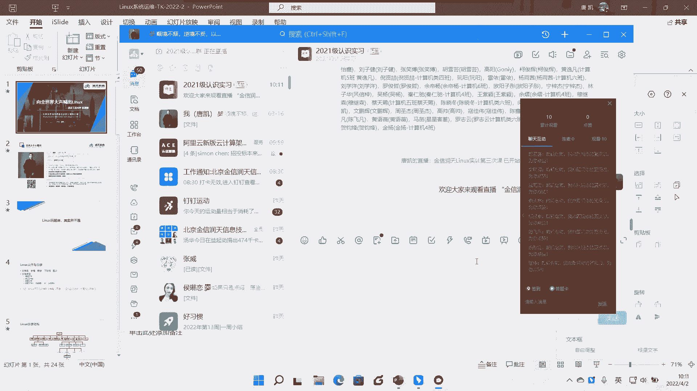

好，已经有46个同学进来教室了。当然今天给你们上课的话，依旧是我们的唐老师。然后我这个班主任的话先进来说几句话。好，已经有70个同学了。那我们上一次的话有我们晚安重修的同学一起来。

所以说我们上一次一共是有102个同学一起来上课。那我们唉大然也是欢迎同学们来呃这一次的话是我们第二天上课，对吧？那简单的说一下老师之前有布置我们的笔记作业，还有我们的一个唐老师布置布置的作业情况。

然后我定的日期是周三交，对吧？那笔记这一块的话，所有加老师微信的同学，老师已经全员收到了。那可能说有个别同学没有交，所以说没有收到。那在作业这一块的话，我们也仅仅只有8位同学没有交O当然名字是谁？

我也不说，那为同学们一个学习，然后给你们点赞，希望说你们继续加油。那我们今天的话就是我们的一个linux一个呃，具体内容的话，等会由唐老师来讲。那其实在本周里面的话，有和同学们简单的去。😊。

本周的时候我会去采访同学，哎，你在学校里面，你想获得什么？你以后想做什么？包括说你想去哪个专业。因为同学们现在的话马上就面临你们的一个专业分流。那也是希望说同学们可以好好的想一下自己到底想做什么。

你自己能够去做到什么。OK好，那呃之前的话也收到同学们各种疑惑。那我们之后的话会有一场班会也去会为同学去解答这些问题。班会的话，预计是在下周进行。那具体是哪一天的话，之后会给同学们做通知的哦。

那之后的学习呃之后的学习的话，今天学习开始就要由我们的唐老师为大家授课了。那我这边先走了。OK唉。😊，きし。うん。哎。好，各位。😊，咱们的同学们大家都应该都在吧。啊。能看到我吗？还是要非要露脸呢？嗯。

O。😊，大家都到了没有？我们课程要开始了啊，课程要开始了。呃，我想先问一下啊，大家对那个声音大家都听得怎么样，听得清楚吗？大家可以回应一下啊回应一下那个如果说听得清楚的话，大家回应一下。啊。

清楚ok ok ok好，是这样的。那个大家会发现啊，今天我是在咱们的那个办公区啊，办公区呃，主要是因为我们的那个教室里面的网络是在重新的布网站啊，重新布网。所以基本上我们的实训中心啊。

整个咱们的金心的实训中心。每一次都会有一个更加高端是吧？更加这个亮丽的这样一个改变啊，改变。所以呢可能呃我们今天下午的时候，我们看咱们的工程部这边能不能把网络啊这个配好啊，弄完之后呢。

我们可能今天下午我们到时候去教室里面是吧？啊，所以今天上午呢我们还是会在我的这个办公区啊，办公区跟大家来进行这样一个授课。好呃，首先是这样的那个。😊，所以。😊，干嘛？你拿拿什么说说。好，首先是这样的。

呃，在上一次课程结束之后啊，确实有很多咱们的同学们都基本上是加到了我的微信，对吧？加了我的微信。然后呢，包括跟我在呃比如说在在是吧深夜啊，不能说叫晚上了，叫深夜对吧？然后呢。

包括还在讲解一些这个课程上面的一些内容，然后呢，有很多同学都把那个实验截图啊，一方面给到了我们的刘老师，那另外一方面呢也截图给到了我，对吧？呃，当然有很多同学在交流过程中间啊，我基本上都是以语音的形式。

然后告诉你该怎么怎么去操作。😊，但是呢呃确实啊确实这个忙不过来了，忙不过来了。所以呃可能有些同学可能跟我发了一些信息啊，我们要来得及回复啊，首先是给大家稍微微说一声抱歉啊，抱歉。

但是呢呃还有一些同学可能跟我交流的时候呢，这个这个可能会有一些涉及到比较靠后的一些内容，所以呢在这个时候我可能会需要通过这一次对吧？这一次跟大家来进行交流的时候呢啊来统一了解答啊，统一解答。

所以基本上需要跟大家稍微解释一下啊，解释一下。好，那么废话不多说啊，废话不多说，呃，我们每一周对吧？每一周固定的时间，然后来到我们的这样一个线上，呃。

首先特别的感谢咱们的武汉工程大学的咱们所有学生们确实真的是非常不错啊。因为大家的这个作业，包括大家这个热情，对吧？对linux的整个热情。当然呃之前刘老师也截了一些图，对吧？有些人比较臭屁，对吧？

比较臭屁，说喊我老唐是吧？老唐这个上课怎么怎么样，对吧？或者说呃。😊，个这个啊有些有有时候拍拍马屁是吧？虽然我不做声，但是我还挺开心的啊，挺开心的。但是呢换句话来说，我还是希望能把这样一个技术交给大家。

能让大家能在未来的这个对lins，对吧？对整个IT行业有着更多的一些见解。当然在这个过程中间呢，很多同学可能会更我有一些交流啊，包括他们有一些疑虑，对吧？比如说在学校里面虽然说是大一，对吧？

那么在大一的过程中间，哎很多同学都可能问到我说啊我想去考一些认证，对吧？啊，虽然然上一次可能跟我们稍微讲了一下红帽的论证，但是呢他对整个认证的整个行业的这个板块还是不太清晰，对吧？

那我们未来如果有时间啊，这个课程的过程或者结束的时候呢啊，如果有时间我也会给大家来稍微讲一讲，好吧？也给大家稍微讲一讲，包括我们的这个岗位啊，包括我们的职业发展路线啊，路线都会给大家来稍微提一提好吧。

好，那么接来在这里呢我们就不多说啊就不多说了，我们就直接进入到我们的今天的主题啊，今天的主题。😊，好，呃，那首先我想给到大家的这样一句话啊，这样一句话叫做linux玩起来其实并不难，对吧？

linux玩起来其实并不难啊，为什么要这样说呢？首先第一个我相信在上一次课程的时候呢，大家应该都把我们的系统装好了，对不对？虽然虽然有很多同学在装的过程中，一开始就在吐槽说，哇塞。

怎么用这个百度云盘是吧，下载巨慢啊，巨慢，但是对吧？啊，有充电同学哎发现了充了一个会员或者说你的朋友是吧，你的兄弟对吧？哎，充了一个会员之后，直接拿着U盘去拷就行了，是吧？直接去拷就行了。好。

那么呢当你装起来这个系统之后呢，其实我们布置了一些作业，对不对？比如第一个我们布置的是我们要求将两台机器是吧？我们的真实机和我们的虚拟机干嘛去拼通，对不对？去拼通。那么呢很多同学呢唉他确实做到了这一步。

但是呢也有很多同学他就说哎我为什么在linux中间。😊，无法去拼动我们的windows，对吧？我们应该是给大家在上一次课程的时候去讲到过，对吧？去讲到过是什么原因呢？各位啊是什么原因呢？其实很简单。

是因为我们windows什么呀？它的防火墙啊，大家注意了，是我们的操作系统内置的防火墙唉，去阻挡了我们其他机器，对，是的是的是的，防火墙。对，是我们的windows防火墙啊。

去阻它的策略应该是这样说它的策略是吧？阻挡了我们的linux的这样一个访问，是不是去阻挡了我们linux这样一个拼通啊，拼通，所以我们是要求大家看没呀？用我们的windows对吧？

用windows去拼通我们的linux。如果拼得通，哎，就代表我们的这两台机器能正常的相互之间访问了，是不是能正常相互之间访问了啊，这是第一个对不对？那么第二个呢要求大家去设置什么呀？

在操作系统安装的时候，是不是去设置我们的什么呀？主机名是不是以你自己的名字是吧？为命名点什么呀？润天EDU点com是不是的好，那么呢这是我们的第二个。那当然第三个。😊，因为当时啊当时我没注意，是不是？

所以一开始是要求大家设置一个小时的这样一个什么呀这样一个屏保的时间，对不对？那么呢很多同学哎他发现了跟我交流，他说没有一个小时，没有60分钟的。所以他所以我们什么呀？

在星期天的时候应该给大家去进行了一些什么呀修改，要求大家去怎么呀？设置15分钟的对吧？设置15分钟的，所以基本上所有的同学能在整个这样一个过程中间，我觉得还是确实啊就是很用心的在完成啊，很用心的在完成。

但是呢很多同学也提出了很多的问题啊，提出了很多问题。好，那么这一次课我们就一一的啊一一的来解答，好不好？一一的来解答，包括我们装系统的时候，为什么要去进行对我们的什么呀。

我们的跟 bootot和swepe进行分区，是不是的？好，我们一个个来解答啊，一个个来解答。😊，好，那么呢首先我们回顾一下，在上一次课程中间，我们在最后的时候啊，大家注意在最后的时候呢。

应该给大家去讲到了我们的很多很多的一些什么呀？这个linkux的特性，是不是的？那么哪些特性呢？我们要求大家记住第一个概念是什么？是我们linkux中间只有什么呀？文件和文件夹的概念，还记得吗？

各位对吧？我们说links下面只有文件和文件夹。那么我想问一下，在场的啊，我们所有的这个同学们，我们说最大的文件夹是什么？那么能告诉我。😊，来打到我们的屏幕上面啊，最大的这个文件夹，对吧？😊，是什么？

来，我们回顾一下啊，各位最大的是什么？😊，啊ok跟啊，陈晓东对吧？O白一航是吗？啊，root是的对，是跟啊是跟对，很好，大家都跟着在对吧？都应该是听进去了啊，是我们的根对不对？好。

那同样刚刚也很多同学说的是root对root也是对的，但是呢root我们从另外一个角度来说，它也是我们linkx上面的什么呀？超级管理员账户，是不是超级管理员账户啊，这要求大家一定要去记住。好。

那我们刚刚所说的是跟。那么在link中间只有文件和文件夹是说，但是但是哎上一次我忘记是哪位同学跟我说，他说呃按照你这样理解，它相当于是我们的windows的C盘，对吧？啊。

我们C盘中间呢唉这个不不也是把操作系统全部放进去了吗？对不对？我们的C盘就是我们操作系统的这样一个盘符啊，对不对？那你和这个links中间的根，那我能不能理解这个根就是我们的C盘呢啊，那首先我要把这个。

😊，疑问和就上一次啊我们某位同学所说出来这个疑问。那我们今天就要去解答一下在座在场的所位朋友。首先第一个要求大家注意啊，这不是一个概念啊，这不是一个概念。为什么呢？我举个很简单的例子来说明。

比如说我们今天的很多同学我们的笔记本电脑对吧？或者我们的台式机的硬盘，可能都是500G往上走对吧？500G1个TB对不对？那么我们的C盘请大家注意我们C盘很有可能仅仅只是占到了这一块硬盘的对吧？

假设只是4分之1的大小，比如说我们很多人的硬盘，它只有什么呀？C盘D盘E盘F盘4个盘幅对吧？各位对吧？四个盘幅。

那么也就是说我们很有可能我们的跟就是我们在windows中间的这个C盘这个系统仅仅只是占到了啊，大家注意，仅仅只是占到了我们的整个硬盘的，大家听好了，只是占到整个硬盘的对吧？4分之1是吧？

或者说整个C盘我们。😊，是100G，那么它可能只是用到这100级，就说这个系统其实装了这100G的这个里面在，对不对？那么D盘E盘X盘可能是什么呀？可能是用于我们的比如说电影呢，对吧？学习呀。

包括等等其他的资料盘符，是不是的，对不对？好，那也就是说我们其实另外三个盘符应该是叫做存储的对吧？是用于存储的。可是今天links请大家听好了。因为我们没有盘符的概念。

所以所以我们其实是把整个大家听好啊，是把整个硬盘。如果我今天全部去存进去。其实你可以理解我们整个这个这个硬盘其实都可以当成一个根来使用啊，都可以当成一个跟来使用。这要求大家一定要理解一下理解一下。好。

那么接下来接下来我们就是呃可能这个这个概念啊，可能这个概念我们等下再在再跑这个系统，跑整个架构的时候，再给大家具体的来落地的来看一下啊，具体来落地的来看一下。😊，好，那么这是第一个概念。

那么第二个概念呢，我们在上一次课程的时候，其实也给大家区分了一下。虽然说我们说整个linkux中间是文件和文件夹的概念，但是我们其实啊通过熟悉对linux这个界面的了解。其实我们说了。

那如何去区分文件或者文件夹或者说文件的类型的时候，我们其实是通过什么来区分的。各位能告诉我吗？我们是通过什么来区分的。😊，当我们看到文件或者文件夹的时候，对不对？OK是的，通过什么呀？颜色对吧？

通过我们颜色来区分，对不对？好，那我想问一下，我们普通的文件是什么颜色？啊，普通文件是什么颜色？看来大家确实是很用心在听啊，确实很用心在听。对，白色是不是？当然如果说我们把这个颜色对调一下是吧。

它也有可能是黑色，是不是？当然一般来说默认是我们的白色，是不是对？很好，默认是白色。那文件夹是什么颜色？😊，文件夹是什么颜色？很棒啊，各位很棒。😊，🤧。对，深蓝色很好，深蓝色对不对？

那同样我们当然我们刚刚说文件夹就是目录了，是不是？好，那我想问一下，如果说我们在windows中间，我们上一次做了一个比较，在windows中间，我们是呃可执行是通过后缀的概念，对吧？

我们说点EX一为我们的后缀的这个可执行文件，对吧应用程序。那么在我们的links中间，我们如何去定义它为我们可执行是什么？啊，如何去定义linkux中间，它是一个可执行的应用程序。

或者说是吧是个命令或者说怎样的，对不对？是怎么去定义它？OK绿色很好啊很好。所以我们一般来说在我们中间，我们更多的是通过什么呀？通过颜色来去区分，对吧？

通过颜色来去区分我们的整个这样一个文件的类型或者文件夹是吗？啊，这是我们的整个概念啊，是要求大家一定要记在在座各位的大脑中间，对吧？一定要记住在在座各位的大脑中间。好，那么接下来呢。

我们在上一次课程的时候呢，其实是给到大家去做的整个系统的安装了啊，整个系统安装了，好，那么在系统安装的时候呢，我们是要求大家装好之后，一定要去做一个快照，还记得吧？对吧？一定要去做一个快照。

那么便于大家在未来使用的过程中间，如果说出现了意外，我们是可以干嘛去进行恢复的对吧？去进行恢复的，是要求大家去注意。😊，好，同时请大家听好了。那么在上一次课程呢。

很多同学也就说说唉老师这里你上一次讲了一个在编辑的过程中间啊，在编辑的过程中间有一个叫虚拟网络编辑器啊，虚拟网络编辑器点击是吧？点击呃这个进来之后呢？唉，为什么是在哪里是吧？

是在哪里有一个什么取消的勾勾啊，请大家注意了。好，当你点击这个之后呢，请大家注意，这里会有一个更改配置啊，大家注意有这里有个显示啊，更改设置，对不对？把它点一下啊，点一下更改设置。好，更改设置之后。

请大家听好了，你会看到这里有一个wimnet0wimlet一和wimlet8啊，这三个请大家听好了。那么这三个的区分区别到底是什么东西呢？我们其实在之前的课程中间是给大家都说过的啊，是给大家都说过的。

也就是说我们今天在我们的呃，我看啊。😊，呃，应该是sorry，应该是在哪里咧。呃，好，我我我先把这个给大家讲解一下。好，大家会发现啊，在我们这个地方，你看如果说我们按照正常来说，这里不是有几个网卡嘛。

对吧？桥接仅主机net，大家记住这个类型啊，桥接仅主机，看到没有？仅主机，你看景主机模式和NAT的模式，是不是好，那么这三个模式，其实就是对应你看啊我鼠标点击这个编辑虚拟机看到没有？

点击编辑虚拟机的时候，其实就是我们在装系统，在初始化配置的时候，是不是在这里有一个网络是要求大家去选择的这几个类型还记得吗？对不对？那么很多同学在一开始选择的时候呢，因为在这里啊。

它可能默认选择的是桥接，对吧？默认选择桥接啊，选择桥接，我们当时是说过的，我们说桥接是在什么时候，我们我们是选择桥接模式呀？各位对吧？什么时候选择桥接模式，比如说我今天对吧？想和我后面的其他的什么呀？

哎，我们其他老师的电脑唉相互之间能。😊，通讯对吧？相互接应的通讯能在同一个网络过程中间相互的连通的时候，我们需要选择桥接。请大家跳好啊，需需要去选择桥接。但是如果你今天对吧？我不想跟其他同事连接啊。

我我今天不想跟其他老师又把我的虚拟机跟其他老师共享在同一个网络。我只想把我自己的虚拟机，请大家听好了，和我现在本身的这台电脑，我自己所使用这台电脑，对吧？我们叫做一V1的模式啊。

其到你看这个中文解释的又很清楚，仅主机啊，仅我自己的电脑和我的虚拟机相互联通的时候，所以你就要选择什么呀？第三个还记得吧？选择第三个，所以你会看到我们当时默认权限面，我们是不是选择的就是仅主机模式。😊。

对吧，精主机模式，所以仅主机模式你可以不用插网线的啊，大家注意，你可以不不用插网线啊，你就可以去相互拼通。但是选择仅主机模式的时候，你需要设置哪块网卡啊，你需要设置哪块网卡，大家还记得吗？啊。

我们需要设置哪块网卡是不是在网络过程中间，我们需要设置哪一块，是不是就要需要设置这个mnet一这块网卡了？为什么？你看我装完虚拟机的时候，是不是会生成2块网卡，是不是的？好，我把8给它禁用了啊。

大家注意我把它直接禁用了啊，右键直接点禁用啊。因为我现在已经进用它显示是这个这个启用，对不对？我显示是禁用状态。那么我们其实是需要去将mnet一这块网卡啊，它是专门用来做仅主机模式的。

请大跳它是专门用来做仅主机模式的，所以我们需要将它选择右键直接点击属性，听好了啊，直接点击属性，但是请你一定要把这个勾 bridge的这个勾给它打上ok很好，将它打上打上完了之后选择确定选择是对吧？

选择确定好，选择完了之后，当然很多人说那我打完勾就ok了吗？不是的，我们还需要什么呀设置这里的IP地址。大家听好啊，设置这。😊，IP但是这个IP地址一定要跟什么呀？

要一定是和你的虚拟机里面的这个网络的IP不能一样，但是必须是在同一个网段里面，是不是什么叫网段？什么叫网段，是不是前面三个是不是要一样的对吗？前面三个一样的，那么在同一个网段里面，okK理财能成功啊。

理财能成功。好，所以要求大家这家啊在这里应该是反复强调，一一应该反复强调啊，如果李潇和其他的电脑相互交流，你就要去选择什么呀？😊，这个桥间模式是不是就需要去选择桥间模式啊？请大家听好了。好，ok好。

那么我们还是选择紧主机。看好啊，我们还是选择紧主机模式，选择启动了啊，选择启动了。当然这个系统呢是我们在上一次课程已经做好了的对吧？已经做好了的。😊。

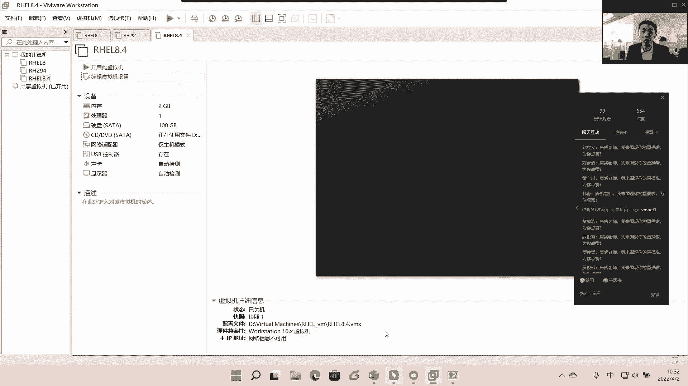

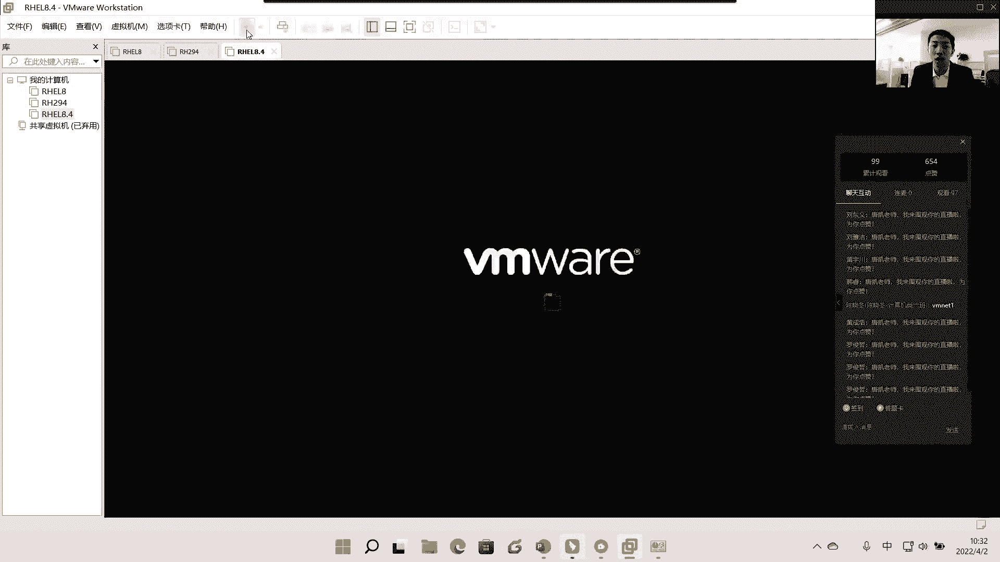

🤧嗯。

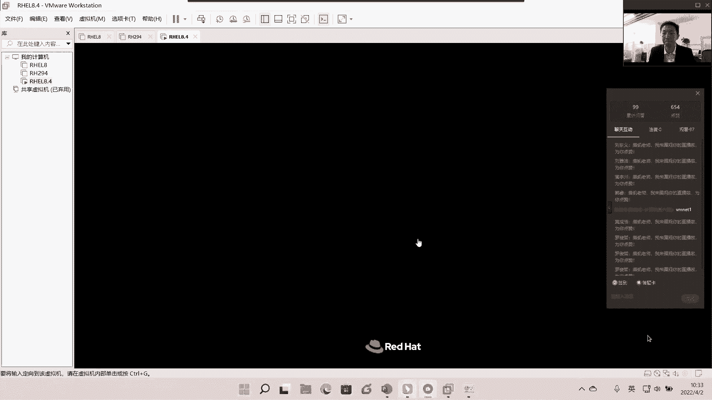

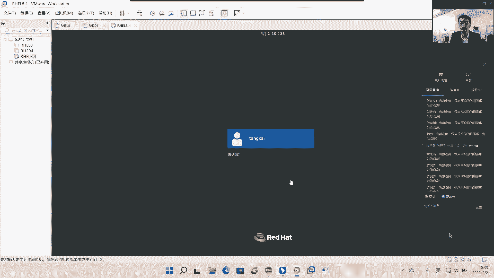

好。好，登录到我们这个系统之后呢，因为我们还没有教给大家来讲这个命令，是不是还没有教给大家来讲命令。所以请大家听好了，我们是选择什么呀？大家看到啊，在这个地方选择我们所对应的有一个什么呀？

有线的连接是吧？通过我们的图形化的形式去设置我们的IP地址。好，你会看到啊在我们这里为什么之前很多同学在一点开的时候，这里显示的不是已连接，而是什么呀？正在连接中对吧？

正在连接中或者正在配置中正在连接中，原因是什么？是因为你们在选择的时候，你们在选择的时候，第一个当然我们在上一次说啊，在这里的自动连接详细信息中间的自动连接，请你一定要打勾，对吧？请你一定要打勾。好。

那么同时在IPV4的这个地方不是自动获取，对吧？不是自动获取啊，请大家听好了，一定是什么呀？手动的模式啊，手动设置IP大家会看到啊，我刚刚设置的是10点10点10。1。

所以我这一台电脑设置的是10点10。😊。

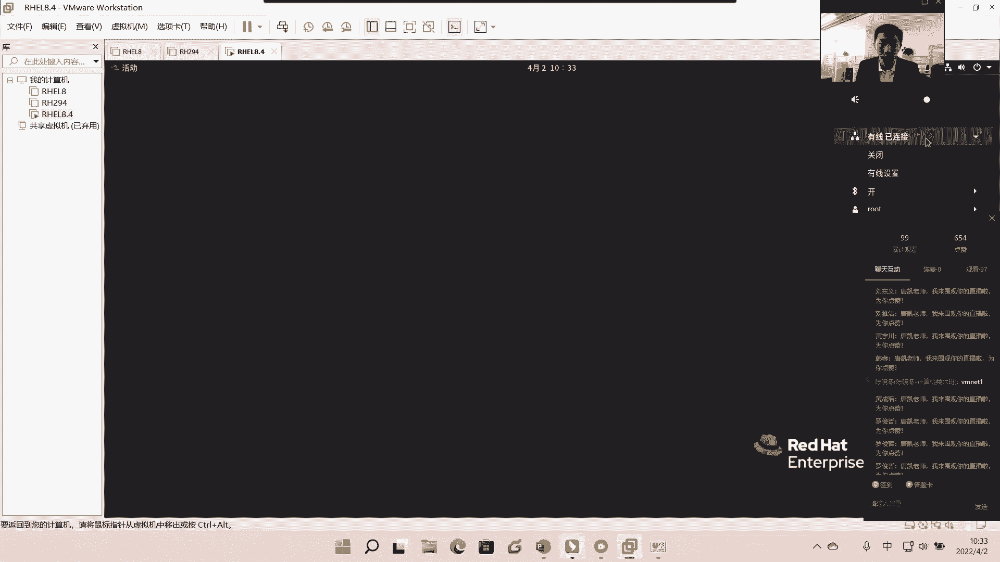

1点10点是吧，随便一个数字啊随便一个数字，但是一定是要在什么呀？1到254的范围内，对吧？1到254的范围内。啊，设置一个好O选择完之后选择应用啊选择应用。

然后然后基本上我们的windows就能正常的拼通我们的linkux了，对吧？正常的拼通我们的linux了啊，这是我们整个这个过程啊，整个这个过程。好，这是我们在上一次给到大家所提到了啊。

这是我们在上一次的要求啊，给大家提到了很多很多的一些细节。那么在这里呢我们也花了一些是吧？十十几分钟的时间给大家进行了一些总结啊，给大家进行了总结。好，那么呢我们接着给要求给大家来继续来看到啊。

继续来看到我们在上一次课程的时候呢，说到了一个概念。当然我们还没有讲命令啊，没有讲命令，所以呢我们其实细心同学看到啊，我们CD其实就是进入的意思对吧？好，我进入到我们的跟上面去了。

也是我们最大的这样一个文件夹对吧？最大的目录里面来。好，我们可以看到我们最大的目录下面，其实有很多很多的什么呀文件夹所存在对吧？你会看到它。😊。

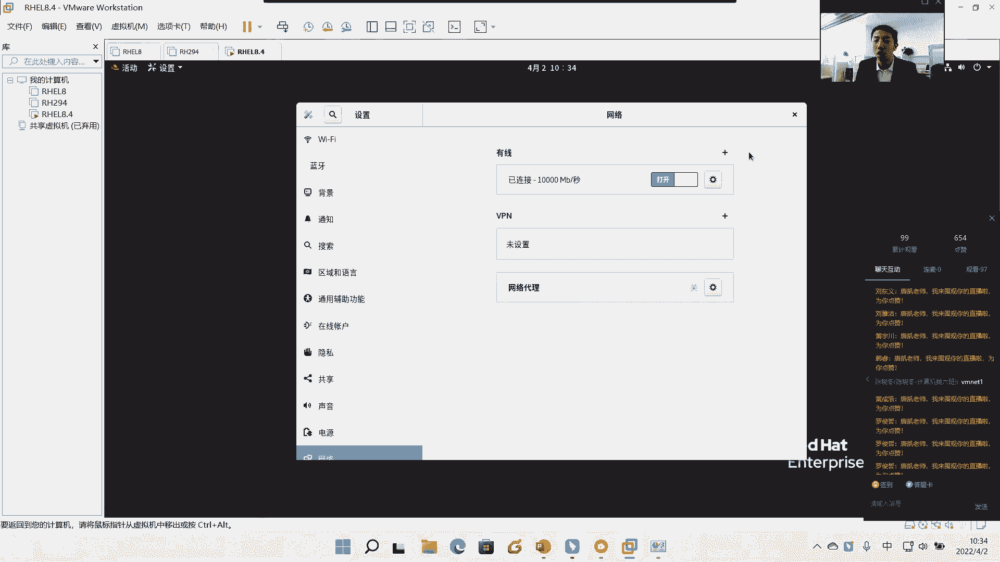

其实没有文件的，基本上是我们什么呀？文件夹，对吧？基本上是我们的文件夹。那我们能不能这样理解，其实这些文件夹就相当于是我们一个公司里面是吧？一个大公司里面的每一个职能部门能不能这样理解，对吧？

或者说一个国家你可以往大说，对吧？一个国家下面的每一个职能部门，对吧？每个国家下面是不是都会有什么呀财政部是吧？比如说呃什么什么呃财政部呀，包括什么呃这个呃哎呀一下把我还卡还真卡住了。

就是有很多很多的这种所谓的部门来帮助对吧？来帮助解决他每个部门所负责的这个业务是不一样的，对吧？每个部门所负责的业务是不一样的。好，那么问题来了，那么在那中间，我们跟下面的这些目录意味着什么呢？对吧？

每个目录，它具体是用来干嘛的呢？这是我们今天这一次课一开始要求。😊，所有的同学必须要掌握的啊必须要掌握的，而且一定要熟背啊一定要熟背。绝对不是说绝对不是说ok我今天是吧？我这个听完之后啊。

我就不背或者怎么样。所以请大家注意了，今天选linux难不难？如同我刚刚所说的一句话是真不难啊，真不难。那么一旦你听了我对吧？听了唐老师的这个课程，只要你加以学习，只要你加以记忆，你放心。

唐老师跟你打造了这个底子，绝对是胜过你听其他的啊，一定一定是通过这个胜过听其他的这个这个课程。好，那么接下来请你听好了，我接下来就来带着大家把一级目录啊，一级目录，每一个目录具体是要干嘛来讲给你们听啊。

来讲给你们听好，所以接下来呢我们要看到的是我们的这个PPT中间啊，PPT中间你会看到在这里是不是就是一个目录结构图呀，是吧？是不是就是这个目录结构图。你看这。

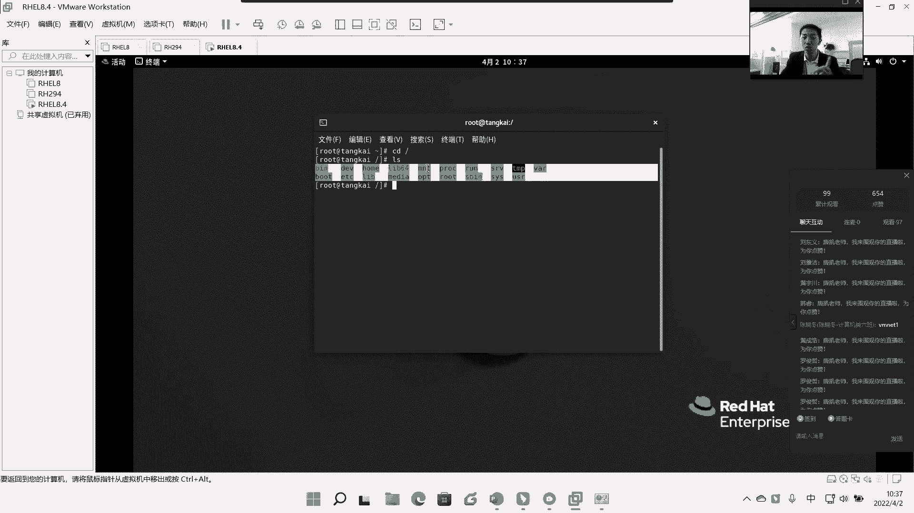

是不是就一级目录，是不是？那一级目录下面是不是也会还还会有什么呀？还会有二级目录，对吧？就叫什么呀？财政部下面是不是还有什么？还有地方财政局是不是的，相当于每一个目录全部都会跟你什么呀。

就是他所负责的内容是不一样的啊，负责内容是不一样的。好，那么接下来呢我们就正式的要求所有的同学把一级目录记下来啊，一级目录记下来。好，那么我上次唐老师其实也说到了，是要求大家一定是跟我一样的。

我在这边做笔记，也请你在那边是吧？每次上课带一个笔带一个本子，或者说用电子的形式，跟着我同步一下，好吧，跟着我同步一下。😊。

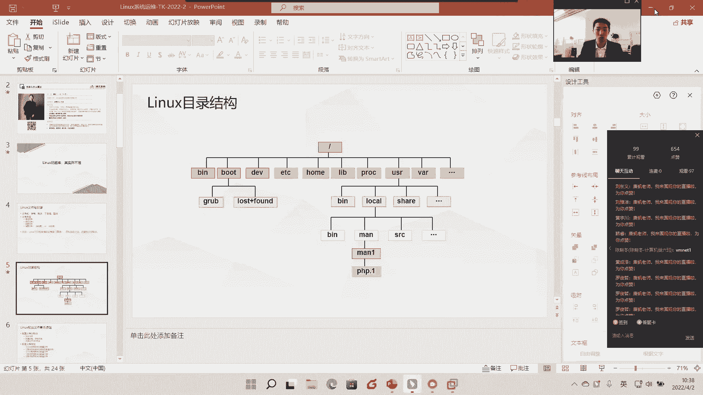

好嗯。😊，好，ok我先把这个杀了，这上一次跟他们稍微说了一下了。😊，🤧嗯。好，来我们来一起来看到这里的这个一级目录啊，一起来看到这里一级目录，我们带着大家一起来走一走。😊，好，有会有看到我们在这里呢。

我们刚刚说了万物听好啊，从根是吧开始啊，万物从根开始。也就是说，今天list此上面根是最大的文件夹，那么接下来从最大的文件夹开始，我们要习惯性的这种写法，大家听好，习惯性写法怎么写。

斜杠是不是叫这个根呢？对吧？根下面的并看到没有？是这样来写好，这是我们的这个并目录是不是根下面的并目录。好，那么该目录是存放的什么呢？请大家听好了啊，该目录存放的是系统的命令。😊，请大家听好了啊。

我在这边也来帮助大家来进行归整啊，进行归整。你看我全部都记在大脑里面了啊，全部都记在大脑里面了。请大家听好了，跟下面的并这个目录是存放的是我们系统上面所有的命令存放到这个目录里面。

OK存放到这个目录里面啊，是要求大家一定要去理解了？好，那么接下来接下来第二个目录了，我们顺着来啊，我们顺子来，我们这样来吧，这个上下上下上下上下上下这样来好不好？好。

那么第二个目录boot BOOT对吧？bo目录那么这个bo骤目录大家回想一下，是不是我们在上一次课教给大家装操作系统的时候，是不是就给它分出来的这个目录还记得吗？

能不能告诉我们当时给到大家要求大家分的是多大的空间。😊，啊，多大的空间要约大家分的还记得吗？😊，多大空间啊？各位。okK2048，不会吧。😡，这个听错了啊，两个鸡啊多大。😊，O。对，很好。

其实我们只需要什么呀？500兆左右就够了啊，500兆左右就够了。当然很多人说那我分个两G行不行行，对吧？我分一个四个G行不行？行，但是实际我们所用到的，其实500500兆足够了啊，500兆足够了。

要求大家注意了。那么这个目录是用来存放的什么东西呢？请大家好了，该目录存放的是系统的启动文件及其啊，sorry及其内核啊，内核驱动向。驱动向向向向向对驱动下。什么意思呢？

也就是说我们为什么当时把不om不把它什么呀？独立划分出来，它其实里面装载的就是系统的启动文件。那么我们设想一下，如果今天我们系统在使用过程中间，万一啊万一某一天是吧？突然一下崩掉了啊，什么叫崩掉了。

说白点就是系统起不来了，是不是那么系统起不来，很多同学说哎比如说像我们windows，我们windows如果说系统起不来了，对吧？系统垮了，很多时候一开始大家就会干嘛啊，这个抱着电脑跑到什么啊。

这个什么电脑层啊是吧？跑到什么任何一个地方，说哎呀我这个系统起不来了，是吧？我这个系统这个这个是吧这个做了不该做的事情是吧？这个起不来了。哎，那么很多时候呢可能别人就说啊，那你必须需要去重装。

那么你设想一下，一旦重装，是不是就会把你的C盘，可能你市面中间还有其他很多很多些程序啊，文件啊等等等这一块是不是都会给你去。😊，抹掉对吧？都会给你去什么呀？重新格式化掉。但是今天在link中间。

请你注意，一旦系统起不来了，你只需要把不同目录给它想办法修复回来就行了，对吧？想办法把它重新哎这个是吧，把它做回来就行了，对吧？重新把它这个这个修整回来就行了，它不会影响你的跟上面的其他的文件。

请你听明白啊，不会去影响跟上面其他的文件，所以这是我们的什么呀不目录啊，这是我们的不同目录。😊，好，那么接下来呢第三个请大一跳了，就是我们的DV目录了啊，DV目录。好，那么呢这个目录是用来干嘛呢？

请大一跳叫设备的主目录。设备的主目录？什么叫设备主目录？说白一点点。今天我们也说了，在windows中间，在windows中间，我们如何去看一个设备，能告诉我吗？如何去看一个设备。

就比如看你这个电脑中间的配置信息在哪里看，是不是基本上在我的电脑，大家听好了是。

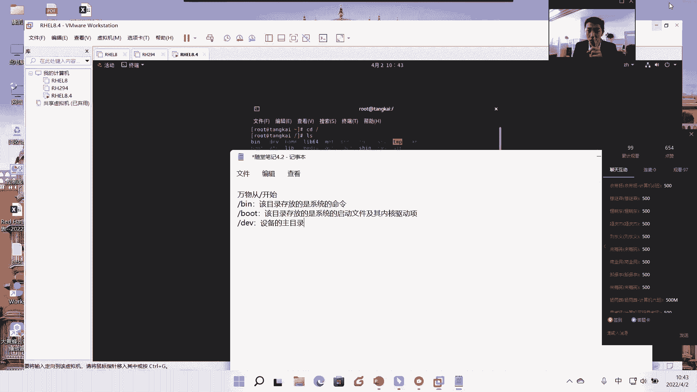

这个这个管理里面对吧？呃，此电脑管理里面会有一个设备管理器，大家还记得吧？在设备管理器这个过程中间，是不是就会记录的是你现在电脑中间所有的设备信息，是不是对不对？记录了你电脑上面所有的设备信息。好，对。

右键我的电脑很好，好，但是今天你在link中间怎么看你直接进这个目录就够了。它记录的是你电脑上面所有的硬件信息，听明白，它记录是你电脑上面所有的硬件信息啊，请大家听好了，那么这个进件机器的目录是什么？

就是我们的DEV目录啊，大家听好了，叫做设备的主目录啊，设备的主目录。😊。

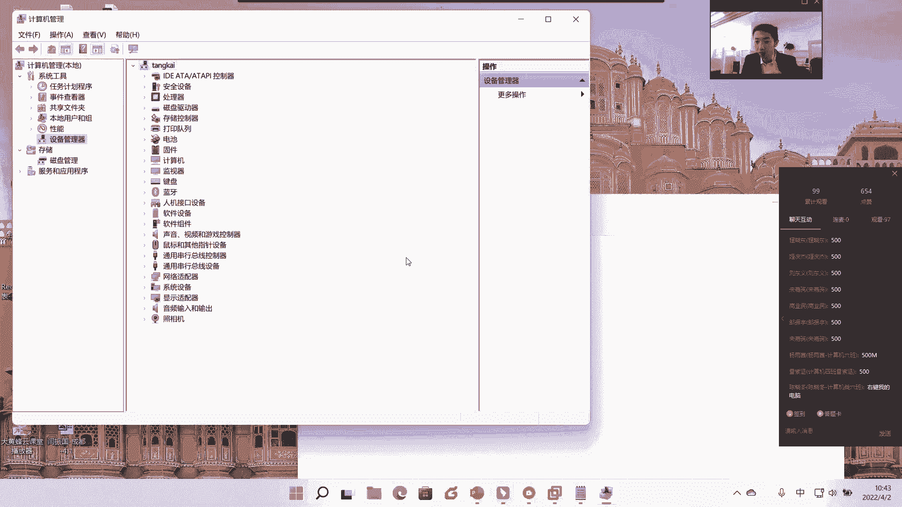

好，那么接下来呢就是我们的什么呀？我们的ETC目录了啊，大家听好了，我基本上把每个目录讲的比较细了啊。各位我一般是把每个目录讲的比较细了。接下来ETC目录。😊，好，大家听好了，这个目录是用来干嘛的。

是存该目录啊。大家听好，该目录存放的是系统的主听好啊，主要的主配置sorry主配置文件主目录哎，很多人不太理解什么叫做主配置文件，主目录啊，什么叫主配置文件主目录。好，请你听好了。

我举同样每一个我都给你举个例子。今天各位同学我相信我们很多人都会在我们的电脑上面去装QQ对吧？装微信装很多很多的这种应用程序对吧？比如说在这里我也有QQ对吧？我有QQ好，那么你在装QQ的时候呢。

其实我们在window中间很简单，我去装一个QQ的时候，是不是直接啊，就比如我们下了一个呃QQ点EXE的这个文件，对吧？你双击点开它下一步下一步下一步的时候是吧？它可以开始噼啪啦开始。😊。

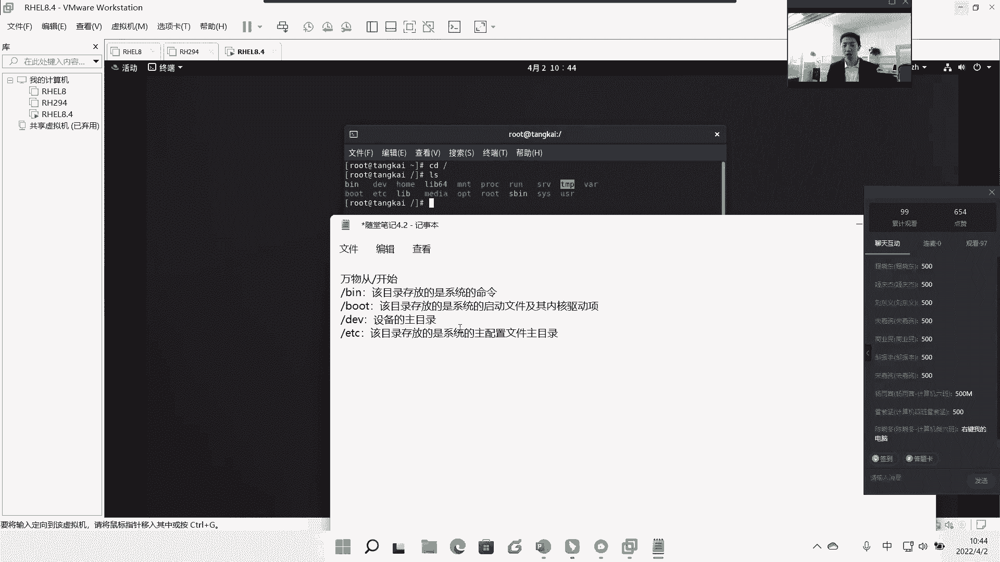

来跟你安装。但是在安装之前我们来设想一下，我们在安装之前，唉它是不是比如说我在点安装的那一刻啊，前面是不是会有一个要求你选择安装目录，还记得吗？对，比如说我安装任何一个软件的时候。

是不是都会有一个需要求你选择安装目录，是不是啊，如果说你对我们电脑比较熟悉的同学啊，可能我们老师也好，或者说啊你自己熟悉的同学我们都清楚，我们可能会把我们的这样一个什么呀？😊。

这个这个这个文件安到我们非C盘了是吧，就是安装安装到其他的某个盘符啊，避免那它全部装到我的C盘去是吧？增加我C盘的负担等等等这块。但是呢如果你的硬盘足够大，其实无所谓，你就往C盘里装是不是就完了对吧？

比如说我在这里啊，我在这里你看啊在我这个地方打开文件内容位置。你看我在这个地方我默认的权限下面是不是就是C盘，你看我默认权下面是不是就是我的C盘，对不对？我是把我的C盘啊。

就就是这个地方等一下啊选择以打开文件所在的位置。好，你看是不是就在这里啊是不是就在你C盘下来，对不对？好，特别搞笑的一件事情啊，大家看到特别搞笑的一件事情。

你看现在我们的windows啊我们的QQ啊应该是我们的QQ也希望依托于像一样的架构模型，所以他把这种程序也放在类似于这个并目录下面看到没有？你跳我刚说并目是用。😊，干嘛呢？

是不是加载我们所谓系统的命令呢？是不是？那么我们应用程序算不算命令？大家听好啊，我们应用程序算不算命令其实是算的，为什么？因为我们现在假设要打开了。比如我在这里是不是QQ程呃。

QQ应用程序是不是我现在对它双击是不是就打开了。大家想下我对它双击是不是就打开了，是不是？那么我双击的这一刻，大家好，我双击的这一刻，其实其实就相当于在我们通过命令行对它是吧？这个这个执行一次命令啊。

对它执行隐是命令把它点起来了，听明白？😊。

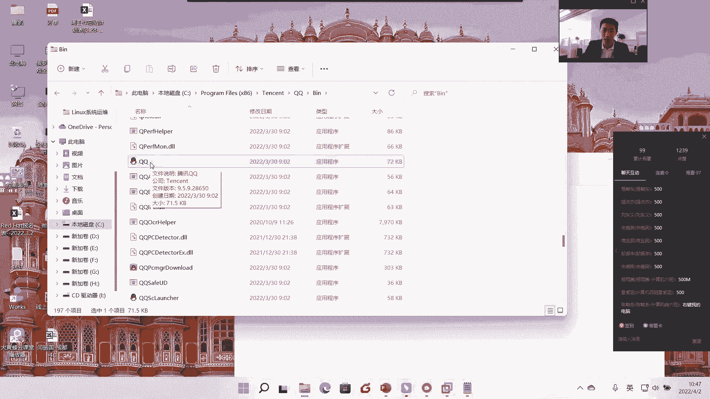

好，所以所以所以我们今天要求大家去理解，如果我今天把QQ去安到我们非windows的其他盘符，对吧？比如我下了一个windows啊，windows QQ对不对？我现在呢双击的时候，我选择安装到D盘。

请大家，我去把它选择到安装到我的D盘。但是我就想问一下，如果我全部安装完成之后，我的C盘还有没有QQ。就是我的C盘里面有没有QQ的我信息，有没有？😡，一定是有的对吧？一定是有的。为什么？

因为它写进到我的注册表里，是不是会需要去加载它的核心的一些文件，把它放到我的C盘里面去。但是它不是所有文件，为什么？因为我的安装的一些应用程序等等其他的配置文件是把它放到哪里去了，放到D盘去了，是吧？

D盘呢，我自己建了什么QQ的一个文件里面去了。但是我的核心文件一定是在C盘里面是不是的？所以如果你要理解这个就我刚才举的这个例子，那么请听好了，我们放到C盘中间。

这些核心的文件相当于相当于我们放到了这个lin中间的ETC这个目录里面了，听明白？O如果你能听懂这句话的话，那么你应该就能理解这个ETC的目录的重要性了，对不对？所以所有的应用程序的核心。

大家看核心的配置文件一定是在ETC目录里面，听明白？那么如果今天ETC目。😊，对吧这中间的某一个程序或者某一个服务。😡，这个崩掉了对吧？坏了啊，被修改这个这个失败了，对吧？错误了。

那么就会导致不是说系统啊，我们先不谈系统，就导致你的应用程序很有可能干嘛出现风险，这个风险分为两种，一种是什么？可能有漏洞，对吗？可能有漏洞，哎，可能被黑客给哎录侵了，对吧？那还有一种是什么？

是不是直接就导致你的软件根本打不开了。😡，这个能听明白啊这个能听明白。所以请大家听好了，这就是我们刚刚所说的两种，一个ETC啊，一个是ETC。😊，好，那么我应该是这个目录是讲清楚了啊，应该是讲清楚了。

好嘞，那我们接下来我们继续了。😊。

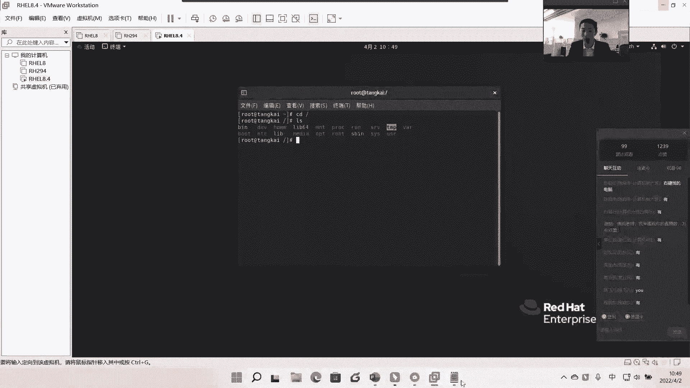

home目跳ho目。那么这个目录是干嘛呢？叫做普通用户的加目录。听好啊，普通用户的加目录家家庭的家对吧？家庭的家什么叫普通用户？好，请你听好了。请你记住我这句话。请你记住我这句话。😡。

在links中间在links系统上应该是这样错。在linkux系统上，我们的用户只分为两种，各位只分为两种，哪两种？啊，哪两种。看大家怎么猜猜哪两种。😊，就像原来我们叫做什么古代的时候是吧。

这个这个这个皇帝一样的。对，很好，对吧？古代皇帝是不是这不可能说一个朝代只有有两个皇帝没有这种概念，是不是他一定是什么呀？至高无上的是吧？唯一的95至尊一定是唯一的，是不是？所以相当于什么呀？

为呃原来这是什么呀？只有皇帝和老百姓的概念，是不是？那同样今天在我们心中中间也是一样的。只有超级管理员和普通用户很好，非常好，只有超级管理员和普通用户。所以请你好了，所有的普通用户的加目鲁。

只要你创建好，听完啊，只要你在我们那中间创建出来的这样一个用户。😊，对吧只要不是root，那么它的加目录一定是在我们的home这个目录下面，听懂我的意思没有啊，一定是在这个里面很好啊。

我们的很多同学都跟着我在很好非常棒。好，那么接下来接下来li。LIBL好，请听好了。这个目录是用来干嘛的呢？它是我们的link上面的库ol文件。啊，库文件什么叫库文件？什么叫库文件？

我们在上一次课程的时候，其实也给大家去讲到了，我们windows中间有很多什么呀？windows中间有很多什么呀？这种点DLL的文件，还记得吗？我们当时在上一次课是不是讲了一个叫做操作系统的模型图。

还记得没有？对不？在操作应用模型图的时候，我们当时去谈到一个概念。我们说当时的linux我们其实称起为叫内核，对不对？那么内核的作用是干嘛？内核是干嘛的，哎，我又来反问大家了，内核是干嘛的？😊。

对吧我们说lins内核呢，其实通过lins托瓦斯先称它是来掌管的内核是吧？它是一个喷子，对不对？什么叫喷子啊，见人不爽，就噼里啪啦一顿骂，对吧？他是个喷子，对不对？那么这个哥们啊，这应该说这个大神对吧？

这个大神他来掌管的是lins的内核，那么这个lins内核是用来干嘛的？😊，🤧对吧哼。驱动系统。嗯，不对。呃，我能理解这个概念啊能理解这个概念，但是不能说叫驱动系统。😊，哼。反正那个意思我能概念了啊。

心脏啊，对它是心脏，确实，但是这个心脏是用来干嘛的呢？😊，对吧。😡，啊，相当于人的心脏，我上一次说到了，对不对？相当于人的心脏，那相当于这个人的心脏，它是用来干嘛的？😡，管理着系统的各种资源啊。

管理着系统的各种资源不算是不算是。啊，大家是大家跑到上层去了，大家跑到上层去了。对，好，我来解答我来解答。我们其实上一次我记得我举了一个例子，我们说它相当于是一个人的所，包括你的腿，包括你的身体。

包括你的手，对吧？包括你的这个五官啊，所有的一切，它相当于是什么？当然很多人就说没有这个心脏，那你这个人肯定活不了，是不是的，是对的，是对的。但是这个心脏具体的作用是什么？😊，应该是它是驱动。

同样是驱动啊驱动我们的硬件的啊，它是匹配我们的硬件的。什么意思？我们当时去举了一个啊，我我记得应该这样来理解，这样来理解。比如说我们很多人上了年龄之后，是吧？上了年级之后。

可能啊咱们很多人都得了个心脏病啊，当然这个不太合适啊，当只举个很形象例子啊，比如心脏病心脏这个供血不足，对吧？供血不足，那么这个时候很有可能啊，你人需要活着嘛，对吧？人需要活着，那我可能需要去什么呀？

哎需要去做这个心脏的起搏器，对不对啊，需要去在你的心脏中间增加很多，比如搭桥啊，心脏起搏器啊，让它能更好的正常工作，是不是的？好，那么同样今天我们的内核立可理解，就相当于去做这件事情的。

当你的硬件不断的更新，不断的迭代升级的时候，我们内核需要去驱动更多的驱动去加载到这个内核里面去，那它更好的。😊，硬件服务能不能听明白？比如说我们现在的内存条可能达到了什么？

32G1一就是一根内存条达到32个G啊，一个内存达到了64个G，对不对？如果今天内核它的驱动指令啊，它的驱动指令没有32G的这个指令，没有64G的指令，它只有什么呀？8G的指令。

那么也就代表着你买了32G，买了64G的这样一个内存，其实压根就使用不了。因为内核不识别它，能听明白？内核不识别它。所以今天在我们的这样一个什么呀？这个这个内核就相当于是什么意思？

就相当于它是对我们说硬件的一个驱动，听明白啊，它是对我们硬件的驱动。而我们的操作系统是我们也讲了，我们操作系统。😊，其实是将更多更多的功能是吧？去执行到像内核去传递指令。那内核收到这些指令之后。

他在内核里面去做分析，对吧？然后才会去什么呀？向下去驱动你的身体啊，驱动你的腿，驱动你的所液器。所以说个不太恰当的例子，就相当于什么呀？现在很多地方说反兴奋剂，反兴奋剂，什么叫兴奋剂。

什么叫兴奋剂是不是就是通过什么呀？特殊你可以把兴奋剂理解为什么呀？特定的这个指令，特定的这个程序对吧？特定的这个功能啊，一段代码对吧？植入到你的内核植入到你的心脏里面去，哎，当你去吃了兴奋剂之后。

ok我可以发挥出潜能可以做到很多很多事情，是不是？但是它对你的内核会不会有影响，对你的心脏有没有影响？有的对吧？有的，所以我们说当你去超频，当你去做很多很多时候，它确实会影响到你的什么呀？

这个这个这个等等很多很多的这个不稳定性，对吧？不稳定性。😊，好，那么我们再回过头来，今天我们这个库啊今天我们这个库相当于相当于也就是说它是加载我们内核中间所有的模块啊。

这个库在window中间这种DLL在另一个中间我们称它为叫做一个新的词啊，叫模块啊，模块各种功能啊，模块里可以理解叫做什么呢？叫做功能。啊，叫功能。也就是说今天如果说我们的库文件中间没有这个功能。

没有这个模块，那么代表着代表着你今天压根就无法在link中间去使用到它，听明白啊，使用到它。所以所以这个lab中间这个lib啊，lip中间是记录是我们link中间所有的库啊。

所有的库ok所有的这个模块信息。好，既然是内，那么接下来就像我们在windows中间也是一样，就当我们windows中间也是一样。你会发现啊今天在windows中间。

我们是不是有这个还有一个什么叉86啊，就是有这两种，看到没有？有这两种好，那么在今内中间呢，同样它也会有一个内部是什么呀？64的概念啊，lab64的概念，它相当于什么呢？有些存在内部里面。

有些存在内b64里面是一样的概念啊，是一样的概念叫库ol文件啊，用来装载我们的很多模块信息的啊，装在我们模块信息的O听懂啊。好，接下来接下来media。😊。

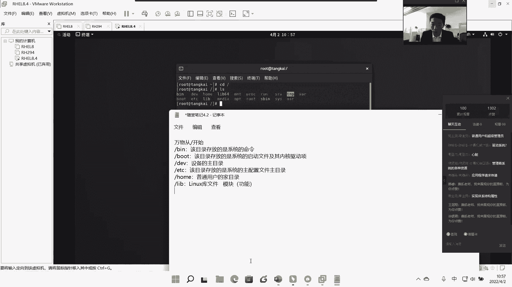

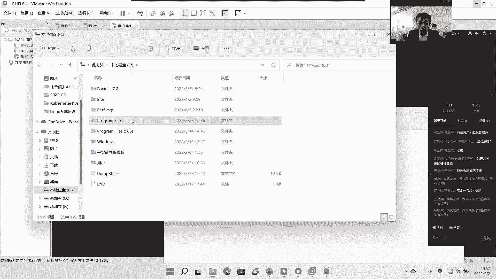

media好，这个东西呢只是大家了解一下就行了。这个其实不是重点。我们到时候实际演示的时候就很容易去理解它叫什么呢？叫系统这个目录啊，这个目录叫media这个目录，系统自动挂载目录。

什么叫系统自动挂载目录啊，什么叫系统自动挂载目录，这个很难说，为什么呢？原来可能很好说，但是现在很难说了，为什么呢？是因为我们今天的很多电脑是不带光驱的，各位是不带光驱的。如果理清楚。

原来我们系统中间有很多就我们的这个硬件啊，就是笔记本也好，台式机，如果你的电脑带光驱带光驱，我们会发现我们默认情况下面啊，默认情况下面安装什么CDEF盘之后呢。

我们在windows中间我们会有产生一个什么G盘啊，会产生一个什么G盘。而这个G盘其实就是DVD啊，就是DVD什么意思呢？也就是说我们的默认盘布中间会挂自动会挂载这个硬件成为一个。😊。

G盘啊会成为一个G盘。但是今天我们在link中间，我们如何去表示就是用默认的media来表示的。大家看啊，默认就是我们用media来表示的。我只来在这里啊，只对对应的给大家来稍微说一下。

就相当于是我们的link中media当我们的挂在某个程序挂在某个这个这个镜像是吧？挂在我们的这个电脑中间，哎，我们反映出来，就是我们的在media目录啊，在media目录好。

那我们只是给大家稍微稍微来来看一下，在之前装系统的时候呢，很多同学没有装成功的第二个问题是什么？就是你的光驱没有加载呃，这个光驱在哪里，大家看到啊右下如果看到我鼠标的话。

就是右下角这边有一个那个像一个光盘的一个镜像的一个一个图标看到没？这个镜像图标右键的时候呢，右键的时候，它会有一个就是连接和断开连接是吧？如果你断开连接了，那么就代表着你相当于把物理的这个光盘是吧？

这个DVD光盘给它。😊。

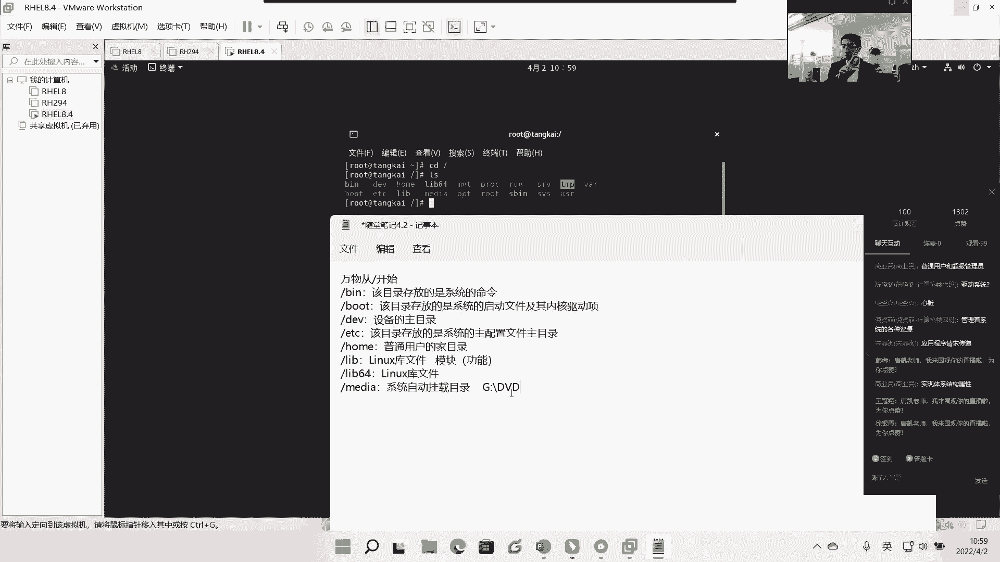

电了啊断电了。但是如果你今天需要加载的时候，你看在这里可以啊，右键啊，直接右键设置啊，直接右键设置设置时候是不是就在这里会有1个DVD看到没有？DVD你看默认下面，我在这里，因为之前有很多同学没打勾啊。

它这里是没有打勾的。我是要求你一定要这个如果你没打勾，这这个是用不了的，是不是的，你要把它打上勾啊，你要把它打成勾好，打个勾点确定的时候，大家看当我打勾的时候。

是不是就相当于我这个设备是不是正常在我系统中间去工作了，对吧？正常在我系统中间去工作了，那么工作的时候，请大家听啊，我们说过我们说这个设备一旦工作，它会在哪个目录显示，你告诉我在哪个目录显示，同学们。

😊。

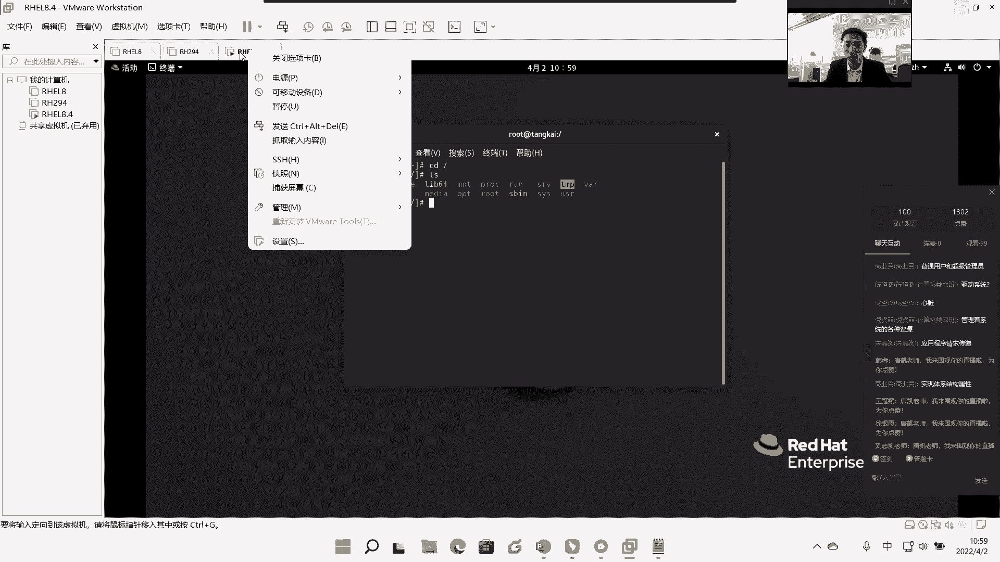

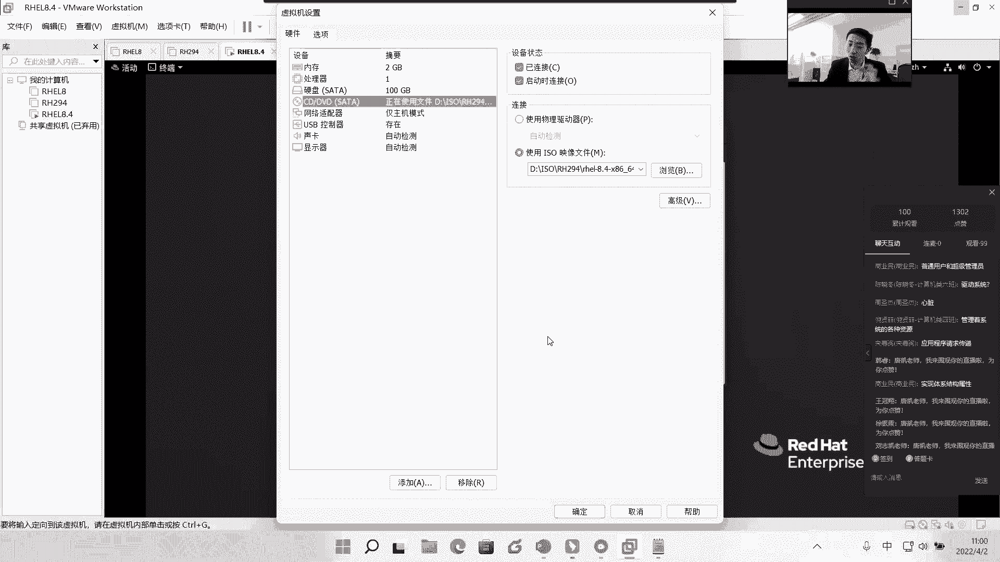

我们刚才讲了在哪个目录去显示，能不能告诉我。😡，啊，才讲的啊，我现在这个这个屏幕都没切掉，再来个目录。😊，我立刻访问你啊，立刻来访问你们在哪个目录。😊，嗯。😊，在哪个目录啊，同志同学们。啊。

你T是一目录吗？😡，对啊。对，很好。在DV目录是我们讲过在这个目录是不是在这个目录啊？啊，DV不是DDVC啊，好K很好。对，DV目录在这个目录中间，请大家听好了。😊，是不是好，那我们来看一下。

我刚刚是不是已经加载了，是不是那这个目录中间它会是是是一个什么来显示呢？很简单，当然我们现在还没讲明列，我只是给你们看啊，它是在这个目录下面有个sCedar room，你看是不是就会有这个设备出现了。

😊，是不是有这个设备，而且这个设备是个什么颜色是一个亮蓝色。我们讲过这个亮蓝色是什么？是不是是什么？是链接文件，是不是是不是链接的目录或者链接文件，是不是的？那么这个亮蓝色，既然是链接。

我们来看一下它对应是哪个目录呢？😊，哎，它对应的是这个设备，看到没有？是SR0。我们上次其实讲过这个DV目录，这个黄颜色的，还记得吗？我们说这个黄色是分为两种，一种是什么呀？是C来表示，一种是B来表示。

还记得吗？一个C一个B是不是讲过两个块设备，对吧？一个是快速的块，一个是什么呀？一块2块的块，还记得吗？那我们来看一下这个SR0是什么是C还是B啊，是C还是B，我们来想一想。

有没有同学能告诉我是C还是B。😊，有没有同学能告诉我是C还是B？😊，🤧咳。很好，很多同学都跟着我在转啊，我希望所有同学都能跟着我转是吧？所有同学都能跟着我转。那么我通过这一次实训，你放心啊。

我一定会把你们的links带上一个高度的。😊，啊，很多学开始啊B吧。😊，Okay。😊，啊，有点延迟对吧？有点延迟。我看很多人都说是B没有写C的，对不对？好，来，我们验证一下，到底是C还是B。

是不是我们刚刚说的B是什么？是快设备，对吧？一块2块的设备，对不对？好，那我们来看一下是什么呢？来，我们来看一下DV它同样也是在DV目录下面是不是SR0是吧？SR0来回车是个什么设备。😊。

对吧就是我们的B很好，大家都答对了，大家都答对了，就是我们的B是不是为什么？因为因为它是一个物理的一个设备存在，是不是一个物理的设备存在，所以它是我们的1块2块的这种设备很好，大家都答的非常不错。

都答的非常不错，很好。😊，好，那么既天刚才所说到的这些啊刚刚所说的这些，我们刚刚也加载了什么呀？已连接是不是已经挂载上去了，是不是好，那我们来看一下它既然说了这是物理的啊，大家听好了。

物理的这个SR0了，这个设备对吧？反映出来一个链接D那挂到我的什么目录去了呢？那我们在这里敲一个令，你们先不用关心我插了哪些min，你不用去关心我敲什么DF啊什么LS啊什么CD啊。

你都不用关心我们只用你关心看我清楚啊，我们刚说了DV下面是不就是我的这个么DVD光驱是不是那么映射因为它这个链接映射出来是对应的就是这个设备叫DV下面的SR0这能理解吧？

就是它等于它听明白它等于它那么DV的SR你看DVSR0是不是这个设备挂到哪里去了，是不是就挂到我的media下面去了看到没有？就挂到我的media下面去了，是不是这能理解吧？所以这就印证了我刚刚。😊。

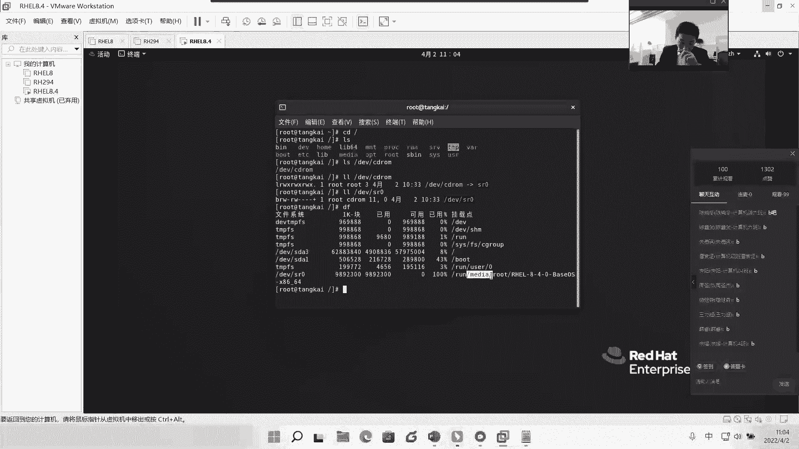

这句话代表什么意思？代表这个media就是我们系统自动挂载了这个目录。所以换句话来说，我今天只要进这个media目录，是不是就能读到我们的这个DVD这个设备里面所有的资源了，是不是的，能不能成立这句话。

就这句话成不成立各位成不成立？😡。

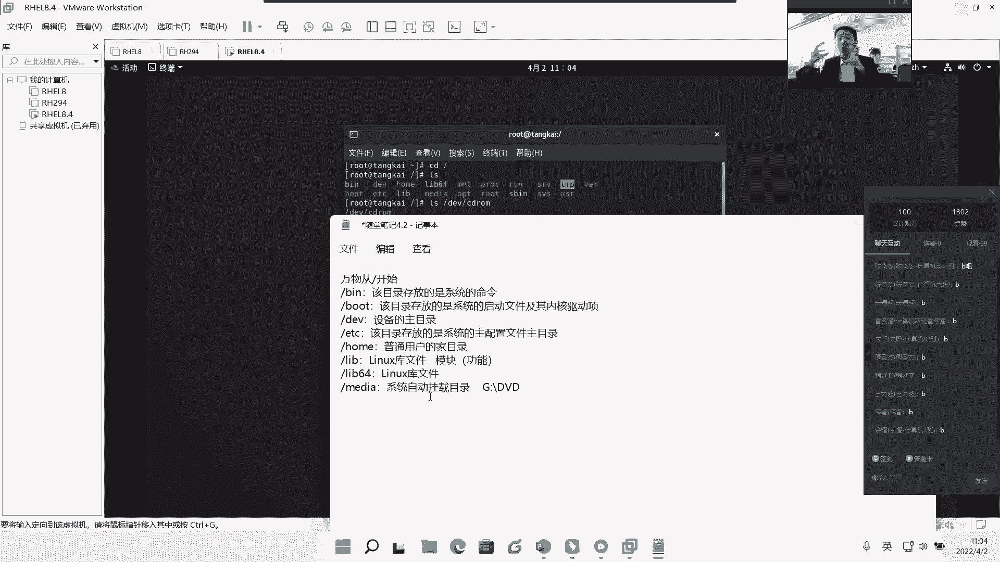

当我去读到media这个目录，是不是就等同于读到了这个这个光驱里面的是吧？这个光驱这个设备里面的所有的资源，是不是的？是不是？是的，听明白啊，一定是是的啊。如果说你对这个东西逻辑上面。

因为我们现在很多电脑没有DVD光驱，对不对？那么你从另外一个角度来说，你可以理解为就像你插个U盘，你把U盘想象成它就是DVD听明白。

你把U盘插到你电脑上面去的那那一刻你的电脑上面是不是就会生成一个这个什么盘符。😊，能明白？假设你生产了一个叫做H盘，是不是当你双击这个H盘的时候，是不是读到了就是你U盘里。😡。

是不是就相当于你读到你U盘里面的那个内容了，能听明白啊，就是这个逻辑啊，就是这个逻辑。所以这个U这个H盘相当于是我们的media这部录听明白？那么我们的那个U盘的插上去的那个概念，就相当于是什么？

是DVDDV下面的SR0的这个概念。好，我已经说了很多遍了啊，我相信大家都理解了啊，我相信大家都理解了，是不是的？O。😡。

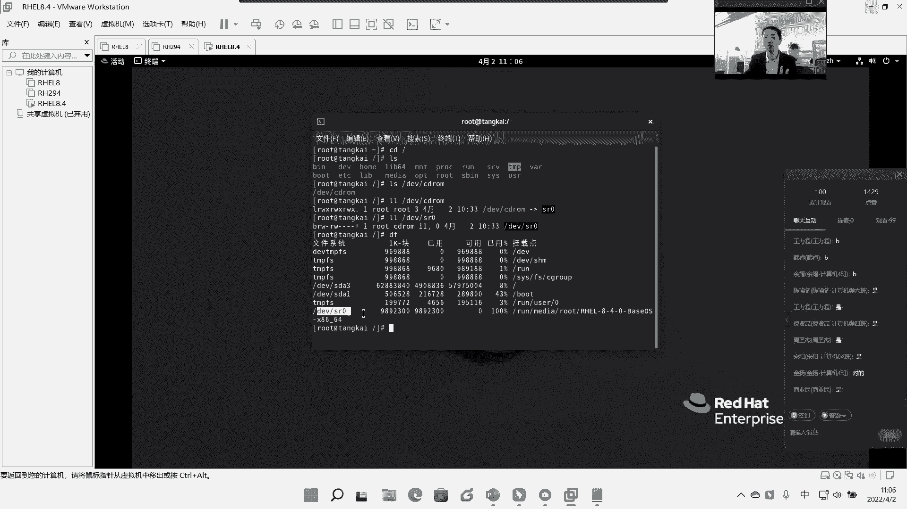

好，那么接下来啊接下来好继续了啊继续了。刚刚说了media是不是是叫做系统自动挂载目录啊？我刚才应该是反复再提了。好，接下来MNT。😊，MNT叫mountt啊，大家看到了啊，叫mount。😡，好。

刚刚说了系统自动挂载，对不对？OK呃，这里叫什么呢？叫做用户啊，sorry。😊，叫用户手动听好，手动哎，手动挂载目录。好，一可以叫系统挂载，也可以叫手动挂载。什么叫手动挂载？😊，什么话的？哎呀。

它显示了一个H盘，我不喜欢这个名字，我觉得这个这个H觉得是吧，觉得不好听。哎，我就喜欢叫它J盘行不行？我就喜欢叫它K盘行不行？😊，是不是你自己去定义一个盘符的名字是不是就够了。能听懂我说的思么有？

所以很简单，如果你不希望它就挂在了media下面，ok你手动把它挂在MNT下面就行了。听明白，这个这样来理解好理解了吧？😡，对吧它系统跟你创建了一个目录，但是呢这个目录为空啊。

默认是什么都没有的那你无非就是把你的这个是吧？我不想挂了命，我手动再把它重新挂到MNT上面，就是这个概念，听明白？O这是MNT啊O那那为什么呢？为什么这会有个MNT呢？是这样的。

很多人说那老师我能不能在自己去创建一个什么根下面假设我未来学的命令，我自己在根下面创建一个唐凯，对吧？创建一个什么啊论天教育对吧？创建一个某某某某的名字。

我把它挂到我自己的名字所创建的这个文件夹下面可不可以呢？可以可以没有任何问题，听啊，没有任何问题，你创建任何一个名字，你把它挂过去都叫做手动挂载目录听明白？但是默认的系统给了你一个MNT手动目录。

我这里提到一个是默认听明白啊默认当然你可以挂你可以不挂啊，随你开心就好。😊，听明白啊，所以你开心好，现在不是有个词吗？你开心就好，是不是？就这个概念听明白。OK好，但是有一个问题来了，哎。

我我说了我上课是比较喜欢发散性的啊，发散性的思维。那我想问一下，有没有同学会问我这样句话，他说老师。😊，你要这么说，那我能不能直接把这个DVDDV下面的SR0直接挂了跟上去，可不可以？😡。

我不挂了根下面的某个目录啊，大家看啊我不挂了根下面的某个目录。那比如说我直接挂在根上面可不可以？😊，我直接就是直接往跟上挂，或者说直接往这个ETC目录上面挂，可不可以？我把我光圈直接挂到ETC这个目录。

可不可以？😡，来，大家能能不能听懂这句话啊？大家试想一下。😊，也不是不行啊也不是不行啊，为什么不行呢？啊，为什么不行呢？你不要被我这个这个话感觉好像不行，那为什么不行呢？😊，啊，可行啊。

我这么一说又可行了是吧？啊，可行是什么？可行，为什么又不行？😊，啊，总得说个理由吧，是不是？😡，对吧linkux就是这样linkux不像windows对吧？windows固定的，你能做就能做是吧？

不能做就不能做links是很随性的对吧？我想怎么搞就怎么搞，对不对？😊，啊，我对呀，哎，我是超级管理员，我说了算呢，对，这句话说的很好，我是超级管理，我说了说我想挂根就挂根的，真的不骗你们。😡，对不对？

所以请听了，我一定是可以挂的跟上的对吧？我也一定是可以挂着ETC这个目录的。听明白？是绝对没有问题了。好，那问题来了，我们就要知道的是我挂上去的后果是什么了。各位。😊，啊，后果是什么？😡。

这不是系统挂载的呃，系统挂载的吗？这不是呃，是系是的，我说了系统默认是挂在media上面是不是的啊？那如果我今天刚刚说了，我今天不想挂了手动的MNT，我就往跟上挂，我就往ETC上面挂，可不可以。

是可以的，是个操作，因为你是超级管理员啊，对不对？你可以这么做，对吧？😊，但是我们要想你做完之的后果是什么？就样举个例子，你你说啊我我我想去品尝一下这个鹤顶红是吧？从电视里面总在说鹤顶红啊。

觉得怎么怎么样啊，我就想去品尝一下这个气什么那个含笑半步癫哪，我就想去品尝一下，是不是？😡，那你总得想一下，我品尝完之后后果是什么嘛，是不是的？😡，哎，对吧心天好了，对，系统可能挂了，不是可能。

是一定挂了。😡，啊，是一定挂了，为什么？😡，原因是什么？因为我们说了所有大家听啊，我讲这个原因是什么？我们刚说了，万物从根开始，对不对？也就是说根下面是不是才会有病这个目录。

而这个病目录下面是不是才会有系统的命令，能明白？那如果你今天拿了一个一个一个一个什么呀，拿了一个程序，拿了一个什么一个一个一个反正你可以这样理解，你就像你拿了一套新的东西把整个根覆盖了，能听明没有？

把整个根覆盖了，ok那么就代表你根不用想你根都覆盖了，那你根下面的什么病下面的目录啊，你下面的所有命令是不是一切都用不了了，能听懂我说的意思吗？一切就都用不了了。那你系统不就挂了吗？😡。

这个能听懂了没有？那你的系统就挂了。所以今天在那个中间，因为你是超级管理员啊，大家听懂我这句话，因为你是超级管理员，所以你做任何事情的时候不要那么莽撞，噼的啪啦哎呀，觉得很爽啪一回车。

很有可能就把这系统做挂了。😡，所以超级管理员的权限大，但是也要慎用。听明白？也要慎用。好，这个我已经说了很多遍了啊，我已经说了很多遍了，我也告诉你原因了，对不对？所以你不能往跟上挂。

你更不能往重要的目录上面啊，一旦往重要目录上面挂，系统本来读读读的好好的，都让你把这个东西填上去了。你他系统再来读，你读不到了，你读不到的时候，系统就挂了。😊，听明白？系统就挂了，就这么简单啊。

就这么简单。😡，ok好。😊，说了好多了啊说了好多了。好，接下来继续了OPT目录。😊，OPT。好，这个目录呢，其实你可以这样理解啊，它跟MNT一样啊，这两个目录其实是红帽也好或lins也好。

很早的系统中间会存在了这两个目录。其实现在就是保留下来了，其实也没有什么，就相当于可以理解为叫用户习惯啊，叫用户习惯，你可用可不用的啊，可用可不用的。😊，这个OPT相当于是什么呢？

相当于是第三方应用程序下载的目录。它是你可以理解它相当我windows中间的什么呢？就像你今天window中间是默认会有就就是你装完系统时候是默认就会是不是增加这样一批文件夹。

是不是而它是不是默认也会跟你增加一个什么下载文件夹里面能理解意思吧？对吧？这个download下载的这个文件里面，对不对？所以你很简单的概念是什么呢？

就是你今天OPT你可以理解它就相当于是我们刚刚所看到的这个下载的文件夹，它默认的啊默认的就是跟创立个文件夹，而不是说你下载就会指定到MN啊不指定OPT这个目录的，不是的，而是说它给你创建出来了。

你可以放到这个下载里面，你也可以放到桌面上也可以放到任何地方，能明白吧？就是你的大脑中间啊大家你的大脑在这的大脑中间要想着跟windows做对比，听明白？要想着跟windows做对比啊，这样你理解起。

😊，更好理解好不好？这样理解起来更好理解。😊，好，OK那接下来继续了PROC。😊，PROC各位啊，POC是什么？😡，POC是什么？请大家啊，我们的系统的进程。系统的进程的主目录，你可以这样理解啊。

系统进程的主目录。OK什么叫系统的进程？windows的进程在哪里看啊？windows进程在哪里看？各位能回答我吗？windows进程在哪里看？😡，哎，很好，任务管理器。是不是在任务管理器中间来看。

是不是在任务管理器，你看这里是不是所谓的进程。你看我此时此刻是不是打开了有钉钉，打开了micsoft这个pointpoint，对吧？打开了wem war，打开了钉钉，打开了记事本。

打开了什么什么是不是不是打开了很多，包括后台的程序，当这么一堆，是不是一堆是不是的？好，那同样今天在我们的。😊，另中间请听好了，我们想看一个程序，或者说系统啊或者说系统去调用这个进程都存放在哪里。

存放在这个PROC里面。现在呀存放到这个POC里面。OK了吧啊，对比的很好了哦，对比的很好了。好，我再来问一下刚刚所说的普通用户的加目录是在哪个目录啊？各位普通用户的加目录是在哪个目录？😊，啊。

普通用户home很好。那换个角度来说，如果我今天要在home里面啊，如果我今天要创建这个用户唐凯，那我想在home里面啊这个创建这个唐凯，那他在这个这个这个文件夹加目录应该是在哪里？

是不是叫在home下面的谭凯是不是这样的，能听懂吗？就在home下面呢生成一个唐凯的文件夹，是不是对不对？好，那么今天那么今天在我们的超级管理员，大家注意啊root它的目录不在home里面啊。

它不在home面，它是直接在跟上啊，直接在跟上面，所以它叫什么呢？超级管理员的加目录啊，超级管理员的加目录？O。😊，行了吧。好，接下来rong。😊，Sorry， wrong。这是什么跳了啊。

就是你可以这样理解这个目录呢不需要带大家太多的去实际关注啊，你可以理解它跟我们的POC是一类的啊是一类的，它们都是用来显示什么呢？显示啊，大家再来说显示目前或者显示当前啊，当前内存中的状态。

什么叫当前内存中的状态？这个东西怎么来理解啊，怎么来理解？我只是稍微说一下啊，各位。嗯，大家都很清楚，我们的文件，我们的游戏，我们所有一下我们说windows上面啊，就我们所有游戏所有的资料。

所有的一切是不是都会存放到我们这块硬盘上的，同意吧？是吧？都会存放到这块硬盘上的，对不对？好，但是啊但是请大家听好的是。我系统一旦开机，比如说不是说开呃不是说系统开机啊，当然系统开机。

肯定它会把这个硬盘中间很多需要跟开机启动的文件，是不是直接加到我们的那个内存中间，对不对啊，直接加到内存中间。那换个角度来说，我们今天想打游戏，你当你双击某一款游戏，什么使命召唤，对吧？

或者说什么什间我双击那款游戏的时候，其实其实它是直接把内存呃，直接把硬盘中间这款游戏的程序直接掉入到我们的内存中，听明白？直接调入到内存中间，那么再由内存干嘛去。往用户层往我们的这个用户层进行驱动啊。

我们用户才能正常的去玩，对吧？所以很多人说为什么我曾经就有这样一个概念啊，就是说啊我这我现在玩的很卡，哎呀，我这个电脑很卡很卡很卡。那为什么别人都会去建议说啊，你需要加一个什么加一个内存条，对吧？

加一个内存条可能就有效的解决，而不是说啊我需要加一块硬盘，我就有效的解决，这个能能理解这句话吗？就是因为你的内存小了，所以所以啊这个跟虚拟内存还还有点不太一样？😊，啊，当然虚内存可以有效解决啊有效解决。

帮助内存来做替代。但是实际上来说，应该说我们读到的应该是内存中间的信息。虚拟内存是干嘛的呢？是干嘛的呢？在这里可能会稍微扯远了一点点啊，扯远了一点点啊，可以这样来理解呃。

需内存其实就是占用内存呃就是占用硬盘中间的一部分资源，对不对？一部分资源来提供呃，我们帮助我们的内存来达到更优的一个状态，对吧？更优的一个状态。那么其实说今天内存的作用是什么啊，今天内存作用是什么？

你可以理解为啊你可以理解为就是说。啊，举个什么身边例子来给你们理解呢？举个什么身边例子呢？一下还真卡住了。啊，这样来说吧，就是说呃我们今天用户真正包括我们现在啊大家现在所看到的这个界面。

其实都是内存中间反馈出来的啊，都是内存中间反馈出来的那换个角度来说，我打开的程序越多，那势必占用到我内存里面的资源是不是就越多，听明白那么就往内存里面丢的资源是不是就越多，对不对？好。

但是有这么多的东西全部都往内存里面丢。你想内存是不是也觉得很郁闷。如果他这个人的话，他是不是就觉得很郁闷，为什么？因为每一次内存执行，它只会执行一个，比如说我们今天执行的是这个执行的呃。

比如说啊呃执行的是这个这个啊假设执行的是这个TST虽然我打开了wemo打开了钉钉，打开了一切，其实其他的程序它依然会在我们的内存里面，相当于是一个停留静止状态，啊，它这个等待状态。😊，什么叫等待？

就是说他相当于是一个士兵一样的，他随时准备着，但是呢他没有上战场，听明白？他每次上战场只是其中之一。能听懂我说意思他每次调用只是其中之一。所以你今天打开视频也好，打开所有的什么电影也好。

它其实每次调用的只是那么唯一的。那其他的东西会调到哪里去呢？他其他的就会把这些比如说等待的这种状态会往虚拟内存里面去丢，那虚拟内存越大，那它丢的东西越多。

那么他就能保证我的内存有足够的资源去提供这个单一的这样一个应用程序跑得足够的爽，足够的稳定是吧？当然你内存越大，那当然你运转起来会越流畅，对吧？越流畅，应该是这么来理解。啊，这么来理解啊。

所以这个ro相当于是查看当前内存的状态。那换个角度来说，如果今天突了一下断电了，当然它不是关机啊，我们啊当然也包括关机是吧？我正常关机或者说我断电了，大家来想一下，如果我今天的内存是32个G啊。

或者说16G，对吧？大家很多同学可能是8G16G，假设是32G，64G，无论多大的内存啊，无论多大的内存，一旦关机，一旦这个电脑静止了。我想请问你内存还有没有东西存在。各位我想问到的是这个问题。

还有没有东西存在。😊，对，没有了没有了，大家注意了没有了，内存只是用来帮助系统的硬盘中间把系统硬盘的一些资源去调入到当前可执行的这样一个操作，它的主要功能是做这个的，听明白？所以一旦电脑关掉了。

那么呢所有的程序窗全部干嘛回回就相对于什么？保存到我的硬盘上去。所以我们为什么说当我电脑没有关机。但是我们的很多程序上面是不是都有一个你看这个文件里面是不是都有一个什么呀保存的概念，保存按钮，是不是？

当你点击保存，其实就是将内存中间的直接一瞬间的这个状态直接写回到硬盘里去，直接写回到硬盘里去，听明白啊，是这么个概念啊，是这么个概念。那么如果你今天的这个东西这个这个这个如果当然如果说万一断电了。

突然那么一瞬间断掉了。但是很有可能你的内存的数据没有有效的保存是吧？没有有效的回滚到硬盘，那你的资料很有可能就。失了啊，很有可能就丢失了。这就是为什么很多人说哎，我我在家里啊。

这个用台式机噼里啪啦做的这个这个报告做的很好，就最后那一句了是吧打一个句好了，我豁我家里一个一只狗狗，对吧？我一只猫不小心把我电员按了，对吧？啊，当然是猫和狗，你还可以痛打一顿。如果是你的小baby呢。

对吧？你只能欲哭无泪了，是吧？只能欲哭无泪了，所以这就是我们所说的这个这个这个概念啊，是要求大家去注意的是ro的概念啊，是ro的概念。😊，啊，也打啊，我靠，你这可以靠谱是吧？也打的。😡，啊。

如果说是你男朋友女朋友呢是吧，直接分了啊，直接分了啊，O。😊，打了。装吧，你们啊，ok好ok好，这里接下来啊pinin。😊，嗯死并。好，那么接下来听好s病这个目录是用来干嘛？

请大家刚刚讲的B目录是于是我们系统里面装载的所有的命令，对不对？好，实并目录是提供啊 sorryry提供给超级管理员的命令。很多人说不太理解哎，为什么这个spin是提供给超级管理美员的命令？也就是说。

今天我们命令中间有一批命令呢，它仅仅是超级管理员才能去使用的。超级管理员才能去调用的命令，它是放在spin这个目录里面的，啊放在pin目录里面。O。😊，好，这个应该是说完了啊，这应该是说完了。嗯。

接下来SRV这个目录呢，其实你可以理解就是一般的什么服务状态啊，装载的啊这个这个状态的一些文件目录啊啊，比如说服务啊服务的一些配置目录了啊，就是放在这里的啊，这个因为我们没有谈服务啊，什么。

我们暂时就不管它了。好，接下来ss目录啊，ss目录啊，POC目录run是一组啊一组，同样也是的，就系统的这个状态。啊，状态啊配置啊目录。也就是说今天我们很多我刚才说了，这是用来显示查看的。

但是呢这个里面的很多数据的调优啊，什么乱七八糟的，都会放到这个s目录里面。所以你可以理解为当系统关机之后，POC呃， sorryorry吧POC里面POC里面是这个目录是清空的。这个run里面是清空的。

这个系统状态目录是清空的，听明白？这是三个匹配的啊，是三个匹配的。好，接下来tamp。7MP探。系统嗯。啊，这个启动临时。加载的目录呃，加载。配置文件的目录。呃，什么意思呢？

就是说这个tamp你可以理解为它就相当于是一个呃，比如说系统启动的过程中间，临时调用了很多很多的目录。那么这个目录中间的文件你都可以删掉的。它是只是临时调用啊，都是临时调用。所以我们t目录。

我们甚至里面可以做很多很多跟windows的t。哎，对，是的，跟windows中间的t目录是一样的对，很好对，是的。临时启动啊，调用的一调用的一些。好，OUSR。😊，USエさ。好，这个目录是。

用来装载什么呢？叫系统的帮助文档及其及其一些呃，比如说呃源码。文件配置目录。什么叫帮助文档配置目录呢？这个东西我们还没有讲到后面去啊。呃，今天在la中间。真的是比较比较的相当于是一个大的。呃。

怎么怎么怎么来理解呢？呃，今天其实windows太太方便了，太方便了，方便到什么东西？就大家只用鼠标去点点，而且是中文版，对吧？大家看着中文啊，我就知道噼啪来点就完了，对吧？虽然点可能我不会。

但是我点点点，我总能把它找到一个最合适的解决路径，是不是？但是今天在link中间它不一样的啊，ok虽然今天link中间可能它也会有中文版，对吧？它也会有很多东西，但是我们所有的仪器其实是需要通过配置的。

大家对吧？通过配置的来完成，那么一旦通过配置就会衍生出很多东西，比如说这个配置你会不会配啊，对配不配得导啊，是不是的？所以我们今天USR中间记录的是我们所有电脑上面的所有服务所有功能的帮助文的啊。

帮助信息全部在里面啊，全部在里面，所以它相当于是一个百科全书啊，相当于是个百科全书，一旦遇到任何东西，你都可以在。😊，啊，通过命令去加载到月a里面去找到所对应的这样一个帮助信息啊，都可以去找到的。好吧。

这个我们到后面来讲命令的时候会演示给大家来看啊，讲命令的时候会演示给大家来看。😊，好，最后一个啦，各就各位最后一个了叫做we哇啊哇。😊，我们刚刚其实讲到了一个目录，叫做目录，就是系统的主配置文件。

主目录是在哪个目录下面，能告诉我吗？系统的主配置文件主目录是在哪个目录下面？系统的主配置文件主目录是在哪个目录下面？很好，ETCRETC好。

那么okK那么这里就是告诉你就是该目录存放的是系统的配置文件主目录。能听明白，我就少了一个字哦，各位我就少了一个字哦。那么我们再回过头来想一想刚刚我们所说的那句话，刚刚所说了什么？刚刚举了个例子啊。

举了一个例子，举了个什么例子，是不是QQ的一个例子，还记得吗？我们说QQ安装的时候，虽然安到D盘去了，但是C盘里面一定还会有它的核心配置文件，是不是？

那么核心配置文件全部都放到了我们在link中间的ETC的这个目录里面，是不是的？那么同样今天我们的哇相当于刚刚那个例子中间那个目录能告诉我吗？相当于是哪个目录。😊，相当鱼是什么？😡，相当遇是什么？

是不是就相当于我们的D盘的那个安装目录了？对，是不是就相当于我D盘的安装目录了？好，这个能理解了吗？是不是？所以今天的ETC和VR是不是就是一组。如果一个应用程序在另一个中间安装安装完了之后。

我们的核心是不是在ETC里面，而配置文件在VR里面。好，这个能听懂了吧？😊，O。😊，好，这个我就噼里啪啦给大家讲完了。你看如果你跟着我走下来，每个目录的特性是不是都分的很细了，是不是？

所以今天的操作系统，各位啊，今天那个操作系统安装了之后，它不需要在这个像windows一样的手动去建啊，某个文件夹，我需要把文啊，不把程序往那个文件里面去装。😊，这种做法默认是不需要的，听明白。

默认是不需要的。但是我们能不能去做呢？可以，因为今天的links它已经帮你分好了，听明白？已经帮你分好了。所以你只需要跟着links它默认的安装的这样一个流程。

直接往这个目录中间去找到你所需要就是已经安装完之后，你只需要去找到你所需要的一个配置文件进行修改。你其实就可以做好一个合格的linkux系统管理员了。😊，听明白啊，你就可以做到一个合格的那个系统管理啊。

ok啊，我说了很多了啊说了很多了。😊，好吧。😊，好，那么这就是我们刚刚所说的了。好，我们再来回顾一下我们刚刚所讲的。在linkux配置文件的这个概念中间。

所有啊我刚才说了配置文件的特点是所有的很多都是文本文件，那传递参数定义环境。这所有的一切是不是都在里面。但是这一切的一切大多都位于ETC的这个目录里面啊？刚刚已经反复在强调了，这是我们的核心配置文件啊。

核心配置文件。那么这个核心配置文件中间，它记录的有哪些与主机相关的信息，看到没有？与系统引导相关的信息与系统的这个文件系统配置的相关的一些东西，系统管理相关的配置文件和系统服务相关的配置文件。

所以我们刚刚举了一个例子。如果我今天要挂载的某一个东西，我手动我直接误操作，把它挂到ETC目录上面去了，或者挂到根上面去了，都会导致你的系统干嘛崩掉啊，都导致你的系统崩掉，听懂听懂。😊。

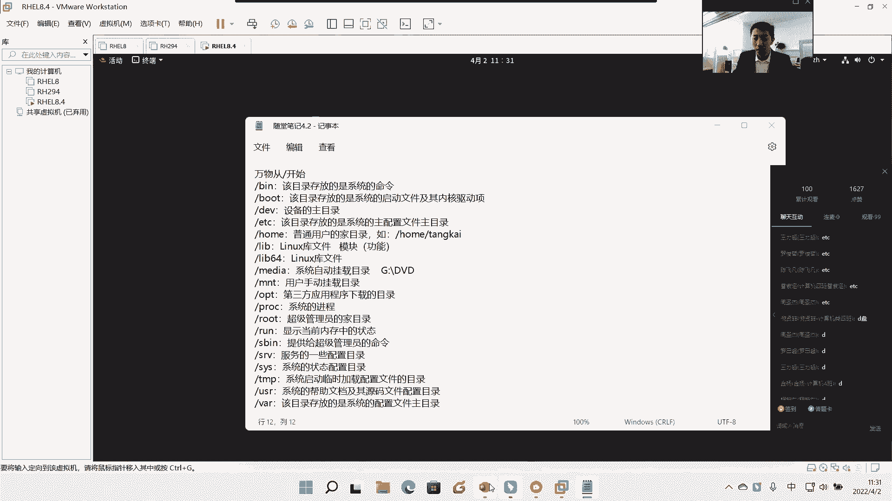

导致系统崩掉。所以在生产环境中间，特别是我们不能关机的是吧？因为生产环境中你敢关机吗？对不对？这种环境中间是吧？7乘24乘以365天的这种概念中间，我们作为link系统管理员，一定要注意。😊。

所做的所有的操作一定要注意啊一定要注意。好吧，那么在这里应该是给大家讲了很多了啊，讲了很多。那么接下来呢我首先要布置今天的第一个啊，当然现在课还没结束啊，布置今天第一个家庭作业了啊。

家庭作业了课后的作业了，这个作业是什么？要求所有的人一定要跟我把这个东西背下来。😊，一定要把这个东西背下来，听懂啊一定要把这个东西背下来，要滚瓜烂熟，一定要背下来。好不好？我们下一次课程我要提问的啊。

我要提问的，一定要把它背下来的，好不好？😊，因为你背熟了，你才知道啊，我接下来到哪个目录，这个目录是干嘛的，对吧？我要去调用什么东西，对不对？就很其实在你大脑中间就有一个逻辑的思维概念了啊。

就有一个逻辑的思维概念了。😊，对。😊，很多人说哇塞，这比我高中还痛苦是吧？啊，各种背各种什么样。对呀，你要想你背完之后，可能你拿到了money就不一样了，是不是的？所以要求大家一定要努力，好不好？

一定要努力，我相信大家实力是不是的？😊，好，我们接下来继续了。好，我们接下来继续了。😊，好，接下来呢我们上午的时间呢还有一个比较重要的东西啊，各位我们上午的时间还有一个比较重要的东西太多了啊，太多了。

这个不多啊啊不多啊，我们才开始啊，这算什么东西？这后面多的多啊，后面让你们背的。😊，对不对？但是大家我相信大家能理解了，是不是要求理解了，对不对？但是你理解了就一定要背啊，理解就一定要背了。好啦。

别做这种哭脸了，是不是的？OK啊，听凯哥的话是吧？听老唐的话对吧？啊，赢天下啊，OK好。😊，好，那么接下来呢我们要上午的时间，我们还要谈一个新的东西啊，还要谈新的东西。这个叫linkux啊。

不不ok这个不能叫linux分区啊，应该是叫做分区的概念。😊，啊，分区的概念？什么叫分区的概念？各位，什么叫分区概念？好，是首先啊哈啊，别哭了，你还让不让我上的啊，让不让我上课的。😊，好，OK继续了啊。

好啊，这这这一级学生太难带是吧？这个各种配合我是不是ok。😊，好，首先呢我们要理解一个概念啊，大家听好了，这个东西也是需要大家强制性理解的。因为呃可能大家对这个计算机的硬件可能不太熟。

要要讲很深层次的原理。我怕这个大家越讲越越绕进去了，对吧？就像上一次这样的越讲就本来我认为大家可能。😊，只是个普及，但是发现异响当然落进去了，这个不太好啊，所以我们。😊。

有很多东西可能是需要大家首先要强制性的记忆记忆之后，我们可能在后面的内容中间再反推是吧？反推大家理解起来就好理解了。好，首先我要求大家一定要理解第一个概念了啊，各位理解第一个概念。什么叫第一个概念呢？

就是一块硬盘。大家注意啊，一块硬盘。😊，大家听好啊，就是我们叫做物理的硬盘啊，物理硬盘。那一块硬盘呢，我们是首先这个硬盘什么接口，我们先不谈这个接口我们先不谈一块硬盘呢我们是有主分区的概念，啊。

这里有一个概念啊，就一比如说我从电脑层啊，买了一块硬盘回来对吧？或者一个新的电脑啊，新的啊，没有装系统，对吧？那个硬盘是干净的，听明白是干净的对吧？什么都没有的，一块硬盘呢它买回来之后。

我其实是需要对它进行分区的对吧？大家这个大家都能理解对吧？是为什么要分区。当然很多人说那我不分区可不可以？我买了1个500G的硬盘，买了一1个TB的硬盘，我不分区可不可以？

我就把这块硬盘直接装一个操作系统可不可以可以流叉，对吧？流叉，对不对？对啊，我可以完全没有问任何问题啊，我再随便没有任何问题。但是我们要请大家挑啊，如果我们今天说了，如果我今天要分区的时候。

我们一定会有分区上面有一个概念，分区上面有个概念啊，有个概念。😊，什么概念呢？请大家听好了，它是这个概念啊，分区的概念。😊，它一个叫什么叫主分区。啊，主分区。啊，也就分区上面有一个词叫主分区啊。

什么叫主分区？各位，什么叫主分区？请大家听好啊，你这样来理解主分区的感觉，就是这个分区只要是主分区啊，它是能装操作系统的，就为主分区。啊，再来定义它啊，就是就用通俗的概念来说，能装超出系统的就为主分区。

听明白？OK好，那么一块硬盘上面能装多少个主分区，就是一块硬盘，我能分啊，应该这样来说，我能分区的话，能分多少个主分区。看有没同学就是有了解过的。一块硬盘我能分多少个主分区？一个。一个为什么呢？

因为很多人说，那我C盘不就是系统吗，对不对？所以我们只能分一个是吗？😊，那我不能装双系统吗？各位我不能装双系统吗？不是不可以。对呀对呀，这位同学所说啊是吧？陈晓彤说了吧，不是不可以装这这个这个多系统吗？

几个。😡，啊，很好很好，几个呢。😊，负4个请你听好了。所以所以请你听好了主分区上面一个系统啊不不置一块硬盘啊，一块硬盘，一块硬盘可以分四个主分区啊，最大吧各位听好了，最大的是四个主分区。

我们早上的时间一定要把这个弄清楚啊，各位听好了，四个总分区好，那换个角度来说，那我换个角度来说，各位听好了，那我能不能这样来理解。哎，我能不能我说一块硬盘啊，500G的硬盘啊。

各位我们叫到500G的硬盘来举例子。😊，那我能不能说我C盘大家听好啊。sorry哎 C盘对吧？装的是windows11可不可以啊？我分了一个多少G呢？分了一个我举个例子啊，我只是举个例子啊，C盘。

我分了1个100G吧，100G没有问题吧，对吧？那我还有400个G是不是我还有400个G，对不对？好，很多人说，哎呀，我windows1，我不太喜欢，我不太喜欢，我还是喜欢我曾经win10。

那我能不能接着分可不可以？我想把win11，我也放在上面，我再拿一个盘付来分，可不可以？可以啊，你把D盘是吧？哎，我来装1个windows10，我也给他1个100G可不可以可以，没有任何问题。😊。

对吧唉，但是呢我的某某老师，他说我现在安装某个程序，你必须用win7，这个winI7才会更稳定。或者说我今天要打某款游戏，这个游戏呢在win7那个上面才是最稳定的对吧？但是呢我可能我教学环境。

我就要用到win10，唉，我的女朋友说他我唉我就喜欢win11，那没办法，我是不是还得去装一个第三个操作系统，可不可以，对吧？可以啊，那你再拿个E盘来分呢？对吧？我E盘我分一个windows的7。

可不可以？我再拿一个windows7，我不用100加了，我用个57可不可以可以呀？😊，完完全全没有问题。那么也就相当于我现在已经用到了三个组分去了，是不是的？😡，这个能理解吧，是不是好。

但是呢唉很多人说哎老师啊，我可能现在你不是讲links吗，对不对？啊，我再拿一个盘符去装一个links，举个例子，装一个links。那这个lins呢唉我就分了1个50个G可不可以？我只用教学嘛，对吧？

我只用实验嘛，我小一点50个G可不可以可以呀？可以呀？好，但是大家来看看我现在是不是等同于四个盘符全部都已经装完了。大家发现四个主分区是不是全部用完了。😊，我们说了主分句是什么？是不是能装系统的。

是不是？😡，好，C盘是个主分驱驱驱动器号用掉了，D盘用掉了，E盘用掉了，F盘用掉了，四个都用掉了。可是大家发现了一个问题没有？我现在呢虽然这四个我已经达到要求，已经达到了我的这个刚刚所说的要求了。

但是我用到的仅仅只是什么？仅仅只是我的100G200G300G是不是只用了300G，但是我这一块硬盘买的时候是多少G500个G。😊，对吧500个G，也就是说500G我其实只用到了300个G，我还有多少。

还有200个G。我现在想问一下在座的所有的同学们，我200G还能不能用来放电影，放资料，放什么，可不可以？能不能回答我可不可以？我还剩200就。😡，对不对？按照逻辑上来说肯定是可以的，对不对？

因为我200级嘛，我系统都已经状了，我200级绝对是可以的，对不对？但是请你好是不可以的啊，是不可以的。为什么？好听这里就是要求大家一定要理解的。因为。😡，因为我们的硬盘最大吧。

最大支持四个主分区驱动器号。啊，或者说你可以理解为这是四个主分区。四个主分区。一旦你的硬盘500G没有用完，就是我的驱动器驱动器号已经已经分完了。大家看到我四个是不是已经分完了，对吧？

one two threee four4个已经放完了，但是我的硬盘空间还没有分完，不好意思，不好意思。😡，你的200G就废了。😡，听明白啊，你的200G就废了，用不了了，用不了了。为什么？

因为你驱动器号已经用完了，它只给你4个。听懂我说弟只给你4个。所以如果我要用完，要么第一个就是你不能什么呀，把装4个吧，对吧？你不能装4个这个这个操作系统，你要么就是什么舍弃一个。

你把F盘什么用来做资料，举个例子啊，用来做资料盘，对吧？而这个资料盘，你也得把很多人说那我这盘也50个G行不行，那不行啊？你如果用50个G，你是不是还是200G驱动器号是不是用完了，对不对？

所以你就你要么干嘛把资料盘把剩余的200剩余的250个G全部给了它。😊，把四个组确拟全部用完，这是第一种做法，能听明白？第一种做法全部给了他。😡，这个能听懂了吗？这样我相当于就全部都全部丢进去了。

对不对？好，那么第二种做法是什么呢？各位听好啊，第二种做法是什么？就是我刚刚说啊，这是主分区，看到没有？这是主分区。然的这里这个例子已经说了很清楚啊，这是主分区的例子，是不是？好。

那么第二种做法就是剩余的这个257剩余的这个257不是F盘。😊，啊，不是F盘，而是什么呢？把它用于做扩展分区来标识。听明白，251用来做扩展分区来做标识。好，那同样的这里为什么又起了一个扩展分区？

为什么也提了个困难问句？听我接下来这句话，林个你就明白，就不管你装的是不是系统，只能分四个盘嘛。呃，不管里装的是不是系统，就只能个不是不是你呃，不是陈晓东，这个已经听我讲完啊，先听我讲完你就明白了。好。

我刚刚所说了这个扩展分区好，扩展分区。我刚刚说了主分区是不是四个4个主分区，对不对？好，那么这个扩展分区，它会占用。我在听听我说这句话，它是唯一的。首先第一个扩展分区在一块硬盘上面，它是唯一的。😊，啊。

不可能是不可能整个硬盘上面不可有两个扩展分区，听明白？它是唯一的。首先这是第一个要求你理解啊，它是理解。同时它会占用一个主分区的驱动器号，听明白？它会占用一个主分区的驱动器号，听懂我说的意思没有？

也就是说今天如果你要这么来装，相当于如果说我多个操作驱号，多个操作驱统，那么相当于我依然用到了几个驱动器号。你看我你看我这个例子啊，依然用掉了几个驱动器号。😊，依然用掉了4个，听懂啊，依然用掉了4个。

但是但是你会发现我在这里写到了一句话，就是我的扩展分区没有像前面一样的给盘符，看到没？我没有像前面一样的给盘符，是不是的？但是我我依然用到了用掉了一个主分区的驱动型号啊，大家一定要听明白。

就是扩展分区还能。分成几个的意思。是的，很好很好，就这个意思。好，那么接下来扩展分区它仅仅只是一个逻辑概念啊，我再说遍，扩展分区仅仅只是一个逻辑的概念，它是用不了的，扩展分区只是帮你。😊。

只是用了一个主分去驱除一号，但是来帮你。分层更多的逻辑的驱动啊，逻辑的分区结构是这个概念。所以接下来这个250G我就可以分成。比如说CDE对不对啊，我就可以分F盘出来是吧？F盘啊，F盘啊。

比如说啊用来做什么电影盘是吧？电影盘。电影盘是不是啊，然后再来分什么机盘啊，用来做什么做什么呃，什么影呃，这个这个这个呃照放放什么照片是吧？啊，H盘放什么啊，然后你分出来的啊，就是我是举例子啊。

然后再分出来的。😊，啊，比如说H盘啊用来放什么啊，这个资料，举个例子啊，资料。对吧电影啊打错了。电影盘照片资料是吧？那么一直分到什么东西，一直将什么呀？这个250G。直到。250G什么呀？

用完为为为为止。手の遅れです。啊，用为止。好，这个能理解意思吗？😡，O。😊，所以扩展分区现在这样来看，你能不能理解了。首先第一个它会用到我们主分区驱动盘符一个。所以如果我要多操作驱动的话。

是不是等于这是一个主分区驱动盘符这一个。这个是不是三个了，再加上它是不是四个了，而而你需要将全部用完的前提是你一定要把它用来干嘛？用来做扩展啊，一定要用用来做扩展。但是扩展本身是无是没有任何作用的。

它是在扩展分区里面再去分我们的跳好扩展里面再来分什么呢？听好了，再来分用来识别，但是扩展里面是用来分什么呢？分多个逻辑驱动器啊，逻辑驱动器，你可以理解又叫做逻辑盘符啊，叫做逻辑盘。😡，啊，叫做逻辑盘符。

所以F盘是不是逻辑盘符，G盘是不是逻辑盘符，H盘是不是逻辑盘符，这个能你能听明白了吗？😊，O。😊，同学们能能不能给能不能给我一个回应，这个能不能听明能不能听懂？如果我讲到这里，大家能不能听懂？😡，好。

很好很好啊，大家一定要跟着我转啊，跟一定要跟着我转这个东西。😊，今天上午听完之后啊，各位今天中午一定要把这个东西逻辑的概念是吧？边吃饭的时候一定要是吧？这个这个回忆一下。

一定要回忆一下这个你要是听的比较懵的话，你这个未来啊这个玩分区玩什么时候，你你这个思维就乱了啊，这个思维就乱了。好，这个如果你听懂了啊，我接着再来变了啊，接着再来变了，各位听懂了。😊。

如果我今天只是一个一个操作系统的各位，如果我今天是只是一个操作，我把这个删了，这个删了啊，看好了，我来变了啊，这个删了。😊，看到效果没有？我把这两个杀了。好，那么换个角度来说，他是不是100斤。

他是不是就是400斤了？啊，s不ry是不是叫400G了，这个是OK了吧。好，接在是400G，这个是100100就500G嘛，对不对？400G。😊，呃，这不就是我现在的结构吗？这里就是什么呀？D盘了。

这不就是D盘吗？然后E盘吗？F盘吗？哎哟，sorryF盘这不就是你现在的结构了吗？直到400G用额为止吗？😡，是不是的？对，对不对？这个这个能理解了吧？好，换个来换个角度来说，我想请问你。

如果你看到这个概念，你能告诉我你用到了几个主分区驱动驱动盘符吗？要驱动器号吗？😡，各位，如果你看到这个结构，你能告诉我用哪几个。😡，对，很好，两个了。两个对不对？这大家理解都出来了啊。

为什么一个系统盘C盘是不是就用了一个扩展分区是不是用的一个两个听懂我这意思。那也就是说我其实剩余还有两个驱动器，我是不是可没有用。好，那如果说我扩展分区只给了200个G，我举个例子只给了200个G。

也就是说我剩余的200G，我是不是仍然可以创建独立的盘符出来，是不是？那这个盘符我可以装操作系统，也可以当成类似于D盘E盘F盘这种资料盘符存在，能不能听懂这句话。😊，我说了主分区。

它无非是比普通的分区多一个概念，它能装操作系统。是不是的？当然我不装，我是不是还可以做其他的概念？是吧还是不是可以当普通盘子来用，是没有任何问题的。O。好，能能听懂了啊能听懂了。好。

那么那么各位那么我今天问到你们，如果说我再来一遍啊，我再来一遍各位思维啊，思维跟着我转啊，跟着我转是吧？这样来做啊，这样说，现在喜欢这样来做啊。好，再跟我来做。😊，我们用数字来表示啊用数字来表示。

今年以块硬盘的主分区驱动机号是不是从1到4能理解意思吗？对吧有我刚才说最大4个嘛就1到4。如果按照这个上面的结构来说，是不是就相当于我用到了几哎，sorry，我是不是就用到了几个。用到两个吗？

那我能不能理解为我用到了一和几2，是不是三和四没有用到。这个能懂哦。这个能不能懂？用数字来表示。对吧1到4为主分区驱动器号，OK吧，没有问题，对不对？好，各位变最后一下啦，变最后一下。

我们早上就差不多了，变最后一下，各位听好了。😊，听懂啊，看我了看我的我刚刚说了，再看到这里来，扩展分区。刚刚说了是如果这样来表示，扩展分区就为二了，是不是的，扩展分区就为二了，对不对？好。

那么假设这个D盘。假设这个地盘我说了在另个中面没有盘服之说啊，但是我们假设有个话题，这个地盘。听好，在我link中间表示这个数字应该从5开始。那么那么我来说啊，上面的例子中的D盘。

是吧表示呃D盘数字表示为5开始，看大家能懂。呵。看大家能不能懂。可以吗？各位。嗯。可以。有没有不懂的，应该这样说，有有有人不懂了是吧？有人不懂了。😊，好，我再来解释一遍啊，我再来解释一遍啊。

能懂的同学那是最好，对不对？好，不能懂的同学，我再来解释一遍，没关系。😊，我们刚刚说到了硬盘支持4个主分区，对不对？那么按照上面的逻辑中间，C盘肯定是用到一个就是一嘛，是吧？肯定用到一个。

那扩展分区是不是用到一个，是不是用到二了，对不对？那么这我说了扩展分区中间会会划分出多个逻辑分区，那么逻辑分区它不是主分区啊，它不是主分区，因为1到4为主分区，是不是的？所以逻辑分区应该从几开始。

应该从五开始。听明白，也就是说第一个我再说遍，第一个逻辑分区，它就应该是从五开始的。能理解了吗？😡，O。😊，啊，行了是吧？行了，刚刚是没懂，现在应该行了。好，我再问一下有没有不不懂的。

不懂的可以打到屏幕上面，我我来解释。有没有？主主主分区向下画树状图。呃。啥意思？嗯。就很简单嘛，对吧？这个就是1到4只要大家理解中间，1到就是4个主分区，对不对？那我的逻辑分区就是从五开始。😊。

对吧因为什么我我现是很简单，就是逻辑分区有逻辑分区这呃，逻辑分区的前提是什么？有逻辑分区的前提是什么？它一定是有扩展分区，对不对？扩展分区一定会占用一个主分区的驱动器号，能明白吧？对不对？好。

所以逻辑分区一定是什么呀？😡，是主分区额外的概念嘛，对吧？它就从几开始，从五开始，对不对？好，有没有不懂的？最后问一下有没有？🎼嗯嗯。是不是都懂了？嗯，各位是不是都懂了？😊，懂了的也可以打一个懂啊。

懂了就可以打一个懂，我看有没有。呃。有饿了的。咋啦？什么意思啊？有饿了的。逻辑分区的驱动号是多少？逻辑分区的驱动号。逻辑分区的句号，我刚刚说从五开始呀。对吧在window中间。

我们是以就是我window中间，我们是以盘符来理解，是不是你这这是两个概念啊。也就是说如果我今天不用D盘，我假设是E盘开始，是要E盘开始，它是不是也可以为第一个逻辑驱动器。

是不这个五是不是就可以定位定义为这个E盘，你不要把这个不要呃我再说一遍，我刚才讲这个例子，你千万不要跟windows的盘符结合。😊，不要跟windows盘符结合，我只是举例子啊。

如果两个windows盘符结合就就麻烦了。听明白？所以我刚才已经说了，你一定要用驱动器号来理解，听明白？1到4为主分区，对不对？所以这个五为逻辑分区，5既然可以视为D盘一个视为一盘也是可为任何一个盘符。

是不是的？😡，嗯嗯。对吧。有意思吧，各位links有意思吧，是不是这讲起来哎，这个越来越好玩了，是不是越来越好玩了？😊，嗯。好。大家都懂了啊大家都懂了。好，既然来大家都懂了呢，我们今天上午就。

告一段落好吧，就告一段落，我不能讲太多，因为这个东西确实还是有些逻辑概念的。大家回去利用中午的时间啊，这个吃完饭之后啊，大家回忆一下，好不好？大家把这个上午的内容啊梳理一下。

我把这个这个文档呢也发到这个钉钉群里啊，就大家梳理一下好吗？梳理完了之后，如果说大家有什么不太明白的，下午是吧？你可以提出来，好吧？下午你可以提出来提出来之后，我再来给大家来进一步的解答啊。

进一步解答好不好？O。😊，嗯，好嘞，上午就结束了啊，上午就结束了，感谢大家这个收看啦，好吧。😊，大家中午的时候啊，这个还是要回忆一下，还是要回一下，好不好？啊，不辛苦。😊，好，下播了啊下播了啊。

这个火箭刷起来啊。😊。

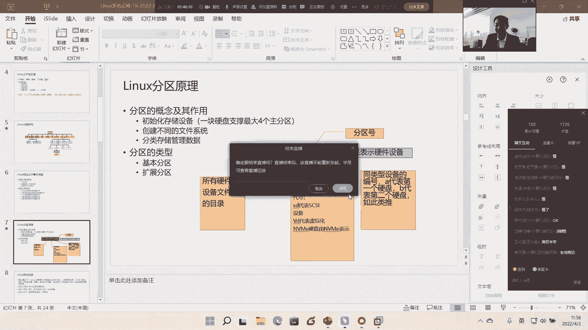