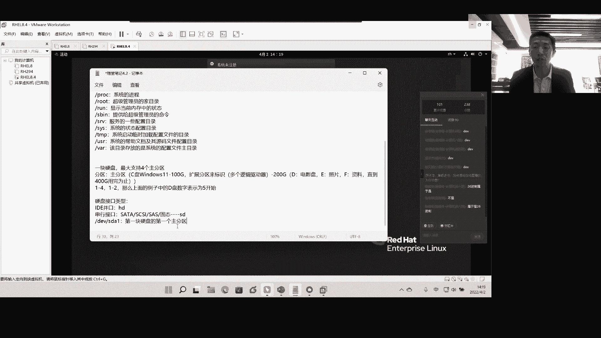

# Linux基础入门教学-4 - P1 - 唐老师开讲 - BV1HV4y1G7Tp

可以签到吗？

啊，大家稍等一下啊，因为我看到那个人数还不够啊，大家应该能听到我的声音吧。都能听到我声音吗？屏幕是怎样的，什么意思？屏幕怎么了？

嗯。那个大背景呃大背景屏幕怎么是这样的？现现在好了吗？还是背景是一个那个吗？啊，就是我的那个背景还是有。很烫啊啊。现在呢现在呢我把屏幕关了，现在呢。还能看到我背景。😡，这么嗨。现在还能看到我吗？

还能还能看到我背景吗？嗯，这么嗨来来，我进去看看。😊，不是吧。

背景动洞咚咚。那背景为什么是那样的？

我再一下来跟这刚聊了3份。

诶。

hello，同学们。因为你把摄像头放太大了，ok。我发现话是那么小的，嗯，就刚才可能说又点了一下，然后可以然后调一下比例。现在不套完了吧，各位。😊，这么尬吗？再把正面拉大一点。再把桌面拉大一点。

就是这个地方。真大不大了，我最大了呀。因为他们看到是你这个，就你把这个缩小，他们就看到是应该是大的。嗯。现在呢各位好了吗？就你把这个缩小他们就看。

现在呢各位。应该是好了。OK错了。😊，我现。好吧，凑合着吧，各位。😊，嗯。

然和早上应该是一样的，没动啊。奇怪或者那个。现在可以新发行了，刚刚没有看到呃，签到还在发起中呢，小了点。拉大一点啊。OK我把签到关了啊，我把签到关了。嗯。啊，现在呢现在应该是还好吧，看到整个屏幕。

包括声音呢整个这一块，大家可以吗？可以回复一下吧。嗯。还有问题吗？可以了。可以的，OK。O O O， O。好的好的，那就先这样吧。再多看一下，我觉得你们会觉得想吐了啊，这个就下次课决定不要露脸了。

再露脸有点小紧张是吧？好。嗯，我看到大家好像还在签到，是还没有来吗？还是什么情况？好，咱们开始吧。好吧，咱们开始吧呃。上午的内容啊，上午内容我们应该是给到大家去讲到了两个，对吧？给大家去讲到两个。

第一个是要求大家去讲解我们的link上面的一级目录，对吧？一级目录每个目录具体的含义啊，然后呢呃要求大家一定要去理解，对吧？一定要去背下来啊，一定要去背下来，这个应该是要求大家一定要去掌握的。

这个是不是讨价还价啊，不是讨价还价的。哎，这个。大家稍微等一下，我把后面那个窗户关一下啊，太吵。🤧好，OK。😊，好，那么接下来呢是这样的。那么接下来呢我们应该是在上午的的最后的时候啊。

最后时候应该是给到大家要求一定要去理解我们的硬盘的主分区的概念，对吧？硬盘主分区概念，呃，我们上午之候说到的是呃一块硬盘，我们最大是支持4个主分区的，这个应该是这个是要求大家一定要去理解啊，四个组分区。

那么呃早上我们也推演了一下，如果说多操作系统的时候，对吧？多主分区的时候，呢，呃，我们一定是要求大家呃，如果说我要创建多个盘符对吧？多个盘符。

我们一定是要求大家去什么呀去这个这个这个创建一个什么呀扩展分区，还记得吧？对吧？我们说扩展分区也会用到我们的主分区的驱动器号啊，要求大家去注意啊，一定是要就是一定要注意这个概念啊。

会用到我们的这个主分区的驱动器号。那么扩展分区呢，实际上它只是用来一个标记啊，标记它接下来。的空间大小。那么这些空间大小呢可以创建多个逻辑驱动器啊，逻辑驱动盘符对吧？逻辑驱动盘符这是是这样一个概念啊。

这是这样一个概念。好，那么接下来呢请单家掉啊。那么接下来呢我们要求大家在最后的时候提到一个这个概念，就是以数字来理解啊，以数字来理解。我们说1到4为我们的什么呀主分区的驱动器号，对不对？那1到4。

那当然1到4呢不见得我用完。如果说我仅仅只是用到了什么呀？两个对吧？只是用到两个或者用到一个用到两个，那么剩余的主分区驱动器号，我依然可以保留，对吧？我依然可以保留，那么其余的请大家啊。

剩那么其余的我可以把它划到什么呀？逻辑的这个分区里面，是不是？所以我们说过啊说过，如果说按照这样一个结构就按照上面的这个结构来理解啊，按照上面这个结构来理解，那么我们的D盘啊。

我们D盘也是说在另一中间我们没有盘符式说是吧？也就是我们只举个例子啊，那么我们通过扩展分区中间划分出来的第一个啊，应该说第一个逻辑驱动器，那么我们是从什么呀？五开始的啊，是从5。😊。

开始的这要求大家一定要去注意啊，要求大家一定要去注意，这是我们上午要求一定要去理解的地方，对吧？是上午一定要去理解的地方。好，那么接下来呢我们就要进入到第二个议题中间了啊。第二个议题中间。

那么第二个议题是指的什么东西呢？首先第一个要求大家去注意的是我们今天其实硬盘呢这个它应该是在我们的这个社会上面就是随着这个时代的发展，它其实是呃更新迭代还是挺快的啊，更新迭代还是挺快的。什么意思呢？

在最早的时候呢？我们其实硬盘它是并口的设备啊，并口什么叫并口呢？嗯。可能可能大家真的我说这个这个不是说不是说什么其他的什么啊，就是可能那个病口已经退市了，已经就是已经呃。

已经啊准备反正就是已经基本就不用了时候，可能也是大家刚刚出生的时代啊，刚刚出生的时代。嗯，这样说，我们呢一般来说把并口的设备啊，就是硬盘啊，硬盘接口类型硬盘接口类型，我们最早的时候呢。

它是IDE的IDE的这个叫做并口啊，叫做并口。那么并口呢现在基本是不用了，我只是稍提一提啊，只是稍微提一提。那么我们一般是把它称其为叫做以HD开头的啊，那么也就是说今天设备中间只要以HD开头的设备。

我们称它为叫IDE的并口型的设备啊，就是那种就是那个呃数据线数据数据线啊，数据线特别宽啊，特别特别宽的那种啊，数据线特别宽的那种叫并口的啊，叫并口的。那么它那个接口就是硬盘上面有一排针啊。

一排针特别的那个呃这种设备。叫并口的啊并口的。那么呢随着时代的发展，其实这种并口已经开始逐步逐步的就是就包括到现在为止就没有了啊，就没有了。没有之后呢，现在呢就是开始有一些串行设备了啊，串口。

那么串行设备它的这个无论是传输能力还是那个效率，它都要大大的快过于我们的并口。所以呢这个时候呢就会有很多那个叫做串行的啊叫串口啊，或者叫串行的。串行的这种这种啊接口设备啊，接口设这接口型设备。

那么这种接口型设备呢在我们企业中心就会有很多啊就会有很多。比如说啊比如说我们的企业级的，或者说我们现在硬盘，它一般就是一般我们叫的啊就家用型的，一般叫staS叫的STAT叫sta啊，呃呃S。

应该是这样啊，沙塔听好了SATA啊沙塔听好了。那另外呢在企业中间啊，企业中间它不是沙塔，而是什么呢？叫scars型的设备。scars型的设备，其大家跳啊，这是接口以接口来理解啊，以接口来理解。

对固态是的呃，固态也算啊，固态也算。但是我们现在所说的s呢还是那种盘片式的啊，盘片就是它里面还是有高速运转的。无非是它的一个比如说我们sta一般来说是你像早一点呢就是7200转对吧？

台式机的那我们笔记本可能是5600转。那么呢scars它可以达到15000转和1万转，那当然这个是每分钟的每分钟肯定不是每秒对吧？每秒那直接烧了，直接烧了，它是一个有盘片的，但是呢现在还有很多的。

比如说在其切的这个不断的发展中间有srs sars型的那srsS啊，ss型的它可以达到2万转啊，2万转甚至更高。那么转速越快，那么它读写效率是就越快，是不是读写效率也就越高啊，是这样个概念。

那除此之外呢，我们其实还有刚刚有同学所说的还有什么呀固态是吧？还有。😊，固态啊，还有固态。那么这所有的这种接口型的这种这种这种呃这种设备呢，其实在我们的企业中间习惯性的教车能叫以SD开头啊。

大句以SD开头的设备啊，以SD开头设备。那我们早上其实说到一个概念啊，就是我们这个设备会存放在哪个目录里啊，各位我想问一下我们设备一般是存放在哪个目录里的。啊，大家知道吗？设备我们存放在哪个目录里啊？

啊，同学们设备我们会存放在哪个目录里？对，DEV目录里面DV目录里面。所以我们今天能不能这样去理解，也就是说，今天只要是在DEV里面，以SD开头的，是不是就代表它是串行的这个硬盘接口设备，是不是的？

那如果是以HD开头的，是不是就是并行的接口设备，这个能理解吧？啊，就是这么来理解啊就是这么来理解。好，那么接下来请答你好了。我们硬盘在实际企业环境中间，比如说我们电脑啊，我们自己的个人电脑，那毫无疑问。

可能你只有一块硬盘，对吧？只有一块硬盘，但是呢在实际的企业环境中间呢，它不是一块啊，真正的服务器上面，它不可能说只有一块硬盘的。为什么呢？因为数据一旦丢失了，那么就是不呀？就就是说真正在企业中间。

我们不是去衡量一个服务器，它花了多少钱是吧？就来衡量它这个多性能多么多么牛逼或者怎么样，或者说我只要买个什么无。😊，什么大几十万的一个硬件，好像我的数据就不会丢，不是这样的概念啊，不是这样的概念。

在企业中间真正值钱的是数据是吧？真正值钱是数据，所以呢我们其实在企业的很多服务器上面，我们都需要去做，我们叫做容灾。

或者说需要去做这种叫多硬盘去保证啊保证通过我们技术去保证我们真正意义上的这样一个呃就是什么呀这样一个数据不被丢失啊，不被丢失。所以请你听好了，我们很多时候呢就是这么来理解啊，如果说多块硬盘啊。

多块硬盘来组成，那么它就是从字母开始啊，26个字母来开始。那比如说SDA啊，SDA代表什么意思呢？代表着是第一块听好啊，第一块A代表第一第一块嘛，对吧？第一块scars设备。

听明SDA代表第一块scars设能听懂我意思，或者说代表第一块ss设备，第一块什么什么设备。😊，所以我们一般来说都是因为企业中间通过scars开始的啊。

所以一般来说就是第一块啊这个硬盘设备或者第一块scars设备，请大家掉叫SDA。那如果SDB呢？是不是叫做代表第2块SDC代表第3块SDD代表第4块，能听明白？它是这么来理解啊，ABCD然后顺着后面走。

听懂啊，顺着往后面来走，对吧？那SDC呢？代表多少块，给26块，是不是26块？好，那很多人说，那我如果有30块呢，对吧？30块呢，那应该怎么表示呢？那应该是表示SDAD听明白？😡，啊，不不不呃。

不是SDZD啊，sorry。😊，能听懂我说意思，应该是这么来表示啊，应该是这么来表示，听明白，代表第30块收费。听懂啊，他是这么来理解啊，他是这么来理解的。好，但是呢一般来说在企业中间很少出现。

比如说26块往上走，这个也不是很容易出现啊，不是很容易出现，对吧？好，所以我们一般来说把，A对吧？代表第一块第一块。好，所以请你静止成于嗯什么意思啊？26斤制属于是什么意思啊？OK好。

那么接下来是什么意思呢？比如说在我们这里SDA好，刚刚所说了，那么如果我想表示第一块硬盘的第一个组分区应该怎么说？是吧第一块硬盘的第一个主分区怎么弄？😡，所以就变成什么呀？SDAE能听明白。

那么它就代表什么意思了？啊，它代表什么意思啊？代表的是第一块什么呀？硬盘的第一个什么呀？主分区，听明白？第一块硬盘的第一个主分区啊，就是SDAE听明白？SDAE所以在我们企业中间其实也就是这么来理解的。

听明白？其实也就是这么来理解的。好，这个能听懂吧？好，所以那我们今天在企业中间，我能不能看一看我们的既来SDAE那么在我们这个硬盘中间是吧？在我们这个系统中间，我的SDAE挂到哪个目录去了呢？

我们就很清晰知道哦，DV下面的SDAE看到没？SDAE挂载的是不同目录。也就是说我今天想去看这个分区啊，这个分区这个主分区中间的内容，是不是只要进不同目录，是不是就能看得到。而不同目录我们早上讲过。

它是什么呀？用来装载我们系统启动文件的。所以说也就是说SDAE其实装。😊。

载的是我们系统启动文件。好，这个能听懂吧？就是用来装载的我们系统启动文件。好，那我想问问你，那我们跟在哪个上面啊，跟在哪个上面？😡，跟在哪个上面？😡，中文应该是怎么来说？啊，中文应该怎么来说？

刚给到大家看到啊中文应该怎么来说？🤧哼。是不是就代表着第一块硬盘的第什么呀？第什么？第三个什么呀，主分区了是吧？第三个主分区它对应的是什么呀？是我的根啊，对应是我的根啊，请大家跳，对应是我的根。

对第三个组分区啊，第三个组分区请大家跳了，就对应的是我的根。好那我想请问你，如果说按照大家能理解我刚刚所说的这个话之后呢，那我想请问你。那第一个逻辑分区怎么表示呢？

第一个逻辑分区怎么表示呢？😡，第一个逻辑分区怎么表示？啊，第一块硬盘的第一个逻辑分区怎么表示用数字用。对呀，怎么数字。应该SDI几，对吧？😡，对，刚刚看到有同学所说的是SDA4啊，这个是不对的啊。

这个是不对的。为什么呢？因为我们说过我们的逻辑分区，它不是不是什么扩展分区，对不对啊？它是逻辑分区，所以它的表示方式是应该是什么呀？DV下面的SDA5代表什么意思啊？代表着我们的。代表什么呀？

代表第一块硬盘的第是多少一个逻辑分区是不是应该是这样的概念？是不是这样个概念？第一个第一块硬盘的第一个逻辑分区是不是SDA5？好，这个能听懂了吧？这个如果说上午大家听懂的话，对吧？

然后结合我刚刚所说的这个东西，大家就会很快啊很快理解这个结构了，对吧？很快就能理解这个结构了，是不是SDA5了，对吧？SDA5。😊，OK第一个逻辑分区。好那，我想请问大家啊。

请问大家看单哪一个哪一位同学第一时间啊，第一时间能告诉我这个答案啊，中文打出来啊，第一V下面SDC9来打出来，在屏幕上面告诉我中文应该是多少。😡，🤧嗯。第几个。给大家撸。は。😊，好。

第一个回答上来是陈晓东是吧。是。好，看来大家都逐步逐步都已经。第一块硬盘吗？第一块硬盘吗？SDC9啊。😡，啊。白一航这个这个这个可能是吧，没看没看清楚啊。对吧对，C代表第3块对吧？第3块硬盘是不是？而。

九怎么表示啊，我看大家看会不会这样啊，还会不会拿着手指头算啊，就1234是主分区。5是第一个啊，56789啊，是不是这样在算是吧？还是用手指扒了一下是吧？其实不应该啊其实不应该，为什么呢？

因为我们说过主分区之外，是不是就是逻辑分区了，是不是？因为为什么呢？扩展分区是不是在主分区里面的，对不对？所以很简单，只要超过我们的四的往上走是吧？所以我们直接就干嘛？9减4就得5，是不是？

所以不需要扒了手指头，是不是直接9减4就得5，对吧？顺着来做是不是就够了。😡，能明白。啊，被发现了是吧？用用手指头在算是吧？😊，啊，所以大家一定要有一个概念啊，就是我为什么说考到大家这样一个概念呢？

就是我能猜到，大家肯定会用手头去算。但是如果你真的理解了，对吧？我现在一说，我建信大家都能理解了，是不是？所以你只要去确定的就是我们的主分区，大家都说了啊，四个，对不对？所以只要你的数字减掉它。

是不是接下来的那个余量，对吧？余量就是我们的这个这个这个逻辑逻辑驱动器的这个第多少个逻辑驱动器，能明白，所以呢我们在这里就是我们的什么呀？第什么呀。😊，第3块什么呀？硬盘的第多少个呀？第五个对吧？

第五个逻辑分区听明白啊，第五个逻辑分区就这么简单。啊，就这么简单，好不好？所以要求大家一定要学会对分区的认知啊，一定要学会对分区的认知。这样对于你后面去看到我们的挂载啊，看到我们分区看的整个结构。

你就会很清晰了很清晰了。好，当然我们说了，现在呢因为很多的时候呢，我们刚刚说了整个硬盘的类型有基本上就是这两种啊，基本上这样。很多人说，那老师我的U盘呢啊我的U盘呢现在跳U盘它其实也是属于固态的是吧？

它也是属于固态的一种类型啊，一种类型，所以它也是在我们SD的范畴内啊，它也是在SD的范畴内，听明白？😊，啊，听明白。那比如说我只有一块硬盘，是不是叫SDA，但是呢我拿了一块U盘插上来之后呢。

那么很有可能我们U盘就识别为SDB了啊。SDB了。请大家听好啊，是要求大家去看的啊，去去理解的。好，其次啊其次请大家听啊，这是我们刚刚所说的整个这个结构啊。其次其次是什么呢？呃，除了我刚才说啊。

除了这两种之外呢，因为现在的社会上面有很多很多新的技术出来了啊，很多新的技术，它不再是我们传统意义上的什么通过操作系统来定义我们的这个服务啊，定义很多很多东西，比如说我们在上一这个课程的时候呢。

我们给大家去谈到有云计算，对吧？谈到云计算，我们说云计算到底是什么东西，其实呃包括还有很多同学可能因为当时举的例子，可能大家这个接触起来会有点有点有有点弱啊，因为你只能针正意义上接触云计算。

你会觉得啊原来真的是个很好的东西。😊，呃，其实我我我下了下课之后，我也翻阅了大量的这样一个概念。就是如何用一个非常精准的话来理解。后来我看到我们这边有一个宣传册上面啊，宣传册上面写了一句话。

我觉得还挺好的。就是说呃它可以通过啊通过一个网线啊，通过一个网线只要能上网嘛，对吧？通过一个网线就能实现远程办公的一种方式，啊，对我还没说啊，陈非凡稍微等一下，我还没说你你说的这个问题。

我知道这个我正马上正准备要说这个东西，你先抛出来了，等我一下啊，等我一下。好，现在是这样的，请大家听好了。就是它是通过一个网线，然后支持远程就可以远程办公的一种方式啊，我们称之为叫做云计算，对吧？

叫云计算啊，所有的资源不在本地，而是在云端是吧？而是在远端的一种一种这种呃业务的逻辑啊，业务的方式。好，那么既然谈到这种叫云计算的业务方式之后呢，你就会发现一个问题，什么呢？就是我本地的硬盘，对吧？

就是我们说白一点，就是我的保存，我的运算，所有一切是不是都需要有保存的概念。因为我们说了今天的所有一切是不是都要保存硬盘上，对吧？但是云计算呢，它的也不在本地啊，它它连硬盘都不在本地，对吧？

连硬盘都不在本地。那么我们针对于很多以虚拟的啊，大家注意虚拟出来的这种这种设备啊，虚拟出来的很多很多东西，我们一般起的叫做visual的vissual。那么vissual的中间呢，我们一般这种硬盘结构。

就是针对于虚拟化啊。大家注意针对于虚拟化。O。虚拟化。呃，存在的。硬盘类型听好，已序的应该是这样的，已序的话啊，听好了。以虚拟化存在的这种硬盘类型啊，我们识别到系统中间的时候呢，我们是以VD开头的啊。

以VD开头的啊VD开头。那么我这里写个VDXX指的是什么呀？是不是就是我们刚刚所说后面的ABCDFG类似于像这样的硬盘了，对不对？如果我第一块虚拟的硬盘，是不是就就是VDA听明白。

就是VDA那第二个就是什么VDB能听明白它是这样的逻辑结构啊，它是这样的逻辑结构，听明白，以VD开头的啊，以VD开头的O。好，那么接下来呢就是刚刚所说的，哎，陈客法刚刚所说的。

为什么你识别出来的叫NVM1对吧？0N1P1这到底是什么意思？好，是这样的。今天我们的硬盘还还在不断的升级啊，还在不断的发展。比如说我们现在有很多那个盘就是原来说的哪怕是固态盘。

它其实也是一个比较大的那个方方形的那种，对不对？但是呢现在呢很多的那个硬盘呢，它是那个绑卡啊，绑卡什么意思呢？它的内存一样的，非常小啊，非常小。然后呢，直接插到你的那个主板上，它就能支持啊，它就能支持。

它就像一块硬盘一样的啊，绑卡。听好了，它就是我们的板卡。好，所以啊所以今天针对于大家注意啊，今天针对于我们的整个类似于这种板卡，我们称它为叫做NVM1啊，NVM1的这个硬盘接口啊。

硬盘sorryNVM1的硬盘那么NVM1的这种硬盘呢？它的表示方法啊，它的表示方法就如同刚刚陈哥刚才所说的，它是叫什么呢？叫做NVM1什么啊NVM10啊，NVM10，然后N1如果第2块叫N2啊。

类似于这样的概念啊，第3块叫N3啊，N3它是这样的啊，它是这样的结构啊，所以你可以理解NVM10啊，这个0N1指的其实跟SD的概念是一样的啊，它是这么来理解啊是这么来理解的。请大家听好了。啊。

那么第一个主分区，那么在NVM1的结构中间，第一个组分区是什么？那就是P对吧？第一个逻辑分区是多少？P5。😡，啊P5啊类似于这种捷豹。啊，类似于这种结构，它是这样来表示啊，它是这样来表示的。🤧嗯。呃。

能听明白吗？O好，那很多人说，那为什么我会出现是这样的呢？是因为我们在安装操作系统的时候，大家注意啊，安装操作系统的时候，它是这样来我来理解的设置安装操作系统的时候，你在选择硬盘的时候，选择硬盘的时候。

你没有去这个这个就是你你当时直接点下一步了啊。因为你只要你硬盘真实硬盘啊，真实硬盘是那个就是绑卡式的，所以它默认就是NVM1的好，那我怎么来看呢？大家很简单，这里是不是有个添加呀，那你添加啊。

就是你看刚刚是不是就是你们装系统不都是这样的吗？你默认其实是NVM1的，能听懂我这意思。你看就是而且它告诉提示啊，只有虚拟机断电的情况面啊，你才能添加NVM1看到没有？对吧？好。

所以你看我默认只能选择什么sta这个什么ss。我记得我第一次安装的时候，我就是有显示的时候，我还特意选择了这个scars，就是便于大家好理解啊，便于大家好理解，所以我选择scars或者sta。😊。

是不是的？能听明白？但是十你看我再点下一步的时候，是不是不是和你在装系统不是一样的概念吗？对吧？是一样的概念吧。对不对？而且我记得第一我记得是呃第一次课程的时候给大家去讲到了，我们说在这里。

比如说啊我的硬盘是个什么200G，或者说我只有60G空间了，那我在这里写个180G，甚至甚至200级甚至500级可不可以可以，它只是一个概念。我再说一遍，它只是一个概念，实际上是用多少算多少。

那么如何去定义它用多少算多少，是来自于这句话，就是立级分配，所有这个什么磁盘空间还是不分配。那好用我肯定是不分配啊，对不对？要分配的话，那是不立刻就给你拨掉了，明白，立刻就给你拨掉了。好。

是在这个概念啊是在这个概念。所以大家理解啊理解为什么会出现NVM1的概念，是因为你默认的真实际的硬盘，就是NVM1的结构。那如果说你觉得你开始不习不太习惯。没关系。你就像我一样的。

比如比如说把这个电脑关机，或者说直接去再添加一块硬盘啊，再添加一块硬盘去选择为什么呀scars或者sta啊，选择sta，然后选择下一步就行了啊就行了。😊。

好吧，是这样个概念啊，是这样个概念。😊，O。😊，🤧嗯。

好，所以我们今天可以从我们的这个PPT中间很清晰的知道是什么。首先第一个我们很清晰的是我所有的什么呀，设备设设备文件是不是全部在DV的目录下面。对吧所有设备文件全部在第一位的目的下面。

那么SD代表什么呀？代表scars型的设备看到没？VD代表什么呀？虚拟化NVME代表NVM1的这种硬盘有NVME的表示，听明白？okKA代表什么呀？第一块硬盘B代表第二款，以此类推对吧？以此类推。

5代表分句号。那么当你看到这个DVSDI5，你就很清晰在你的大脑中间，立刻要条件反射出它是第一块硬盘的什么呀？第一个逻辑驱动器。啊，第一块硬盘的第一个逻辑驱动器。啊，就这么简单啊就这么简单。好。

大家听懂了吗？大家听懂的话，也是在屏幕上这个这个说一下啊，看看大家针对这一块有没有不太还不太理解的或者怎么样。我应该是算讲的比较呃比较细了啊比较细了。只要你跟着我转应该是没有问题的对吧？

应该是没有问题的。好的好的好的好的。😊，嗯，好，那么我们应该是在就讲了此时此刻啊，应该是讲到此时此刻，对吧？针对于linkux的一个框架啊，一个框架我相信大家都应该理解了，对吧？一个框架。

我相信大家都应该理解了啊，都应该理解了，对吧？就是如何至少你如何看懂是吧？你面前的这个links应该都okK了。对吧应该是都okK了。好，那么接下来呢是这样的啊，今天linkux好。

我们接下来我们就顺着来讲了啊。今天linkux其实它还会有很多很多的啊叫做操作的界面。啊，操作界面它不像windows  windowsdows它只会是一个number one，对吧？当然。

现在windows也开始学的就是玩很多比较花的东西啊。大家看到我鼠标往下走，大家能看到这个概念吗？这里有一个桌面一，你还可以新建一个桌面，变成桌面2，桌面三桌面4，对吧？什么意思呢？

就是我在不同的每个桌面中间，我是不是可以做不同的事情，这个大家好理解，对吧？这样一一一说明白，大家都明白了，对吧？做不同的事情，但是但是今天linkux呢同样它也会有很多很多的界面啊，也会有很多界面。

😊，win加是好，那么呢今天在linkux中间请大家啊。今天在linkux中间，我们其实也会有很多很多的这个界面。但是很多人要理解一个概念是什么呢？玩linux玩linux其实很少有人去玩图形化的。

很少有人啊，很少有人为什么呢？是因为今天很多的服务器上面默认是不装图形化的啊，默认是不装图形化的，一般都是直接装命令行啊，就是类似于你可以理解啊，就相当我们现在这个终端里面所看到的这个界面。

你可以理解它就是命令行啊，它就是命令行。😊。

啊，但是呢啊但是呢今天我们这张P中间只是理解一下就好了啊，这个这个不做深交。

呃，我们今天其实有会有很多很多的这个界面来跳转。比如说按快捷键ctrl out F2的F6啊，然后就可以跳转到什么命令行的界面。然后再通过这个countr out F一切换回图形化啊切换回图形化。

这是快捷键的操作。可是今天我们好像那个从remo15开始，好像有些这个功能支持的不是很好啊，不是很好。所以我们很多时候呢是直接通过如果说这是真记啊，如果说目前我们并不是按照虚拟机里面的。

而是直接按照真记上面的。那么你刚刚所看的这个快捷键全部生效啊，全部生效。但是今天我们是玩虚拟机啊，有些功能是实现不了的。好，那么呢请大家记住两个命令啊，只是首先告诉大家，让大家有一个嗯有一个概念啊。

这里其实有一些命令叫比如说sstem啊，cTL，比如说isolisol。

my sorry multius context啊，这是一条命令啊，这是一条命令啊，大家会看到哇塞我的天哪，这么长啊是吧？这这这记忆台要痛苦。是的，如果你开始敲，你还真痛苦。但是如果你敲熟了。

你会觉得嗯停，就是相当于你你你让我来背这个单词，我可能也是背不住。但是呢哎你支持什么呀？table键啊，大家注意这是table补齐啊补齐，所以很快你看我很快噼里啪啦是不是就敲完了。

然后当你敲完之后回车啊，大家看我现在是不是图形化界面是吧？是不是图形化界面好，当我敲回车。

好。这个支持不是很好啊，这个支持不是很好，这个虚拟机支持的不是很好。按照正常来说，它应该是到达了一个命令行的界面啊，跳转到了一个命令行的界面。请大家跳啊。好，那大家看它就会跳转到这个界面来听懂啊。

它会跳转到这个界面来，然后呢也同样要去输入，你看它在你这里就是什么这个弹卡login对吧？login那如果说你你你不想去敲，或者说你想以root，那你就是root，对吧？啊，密码敲上来。

你看我是不是就是以root这个用户的身份是不是就登进来了啊，就是以root用户的身份是不是就登进来了，当然这个密码是盲敲啊，那么这里有图形化呢，没有啊，我再说遍这里是没有图形化界面的。

就全部的是以以命令行来来来来展示来看这个结果来看这个效果的听懂我说的意思，对吧？它也没有滚动条啊，它也没有滚动条，它就是纯命令行，所以此时刻你可以理解你的鼠标就已经失效了啊，你的鼠标就已经失效了。😊。

听明白对吧？好，那么这时候呢我想切换回途形化怎么办呢？当然我刚才说有的是快捷键直接去切什么outt加呃alt加F6啊，当然，因为在这里它是切成一个新的终端了。但是呢你看它在这下面其实有很多终端。

比如F2是一个终端，F3是个终端，F4F5F6都是终端啊，F1就切换回来了，它是按按住alt键不放啊，按住alt键不放，然后123456。

它相当于在这个命令呃命令行模式中间就会有6个6个支持6个这个终端。好，那么接下来啊接下来我要回途径化怎么办呢？同样sem cTLol graphic听好了，回车。😊，你看是不是又回到图形化了是吧。

又又回到图形化了。😊，啊，是要求大家去去去理解一下啊，理解一下，就是一个命令行，一个图形化的一个切换啊，一个命令行，一个图形化的切换。

好，当然啊在这里呢只是因为我说还没讲到命令，只是说让大家熟悉一下。所以我告诉给大家一个是ISO multius，这个是切换成什么呀？

这个以图形化签了命令行去啊，以图形化签了命令行去。那我想终止掉这个怎么办呢？按counttr键不放啊，ct键不放ct键加C就行了啊，ct键加C就行了。你看是不是就在这里来了。是的是的是的。

它这个支持效果不是很好啊，支持效果不正很好。这个wemo这个上面好，其家听好了。好，那我想以假设我现在命令行，我想到图形化怎么办呢？它是这条命令叫steemLISO late啊跳了它是。

这个命令是切换回啊，从命令行命令行敲这个命令切换回图形化。啊，签万回重新化。好，OK。啊，我这个没有办法跟你复制粘贴出来啊，因为这是两个不同的结构，我看能不能粘贴出来哦，可以啊可以啊，这是什么呀？

就是呃切。

sry切换回图形化是吧？啊，切换回图形。好，那么这个时候还有一个是什么呀？切换至命令行。是吧。好，这是这样的概念啊，一个切换回图形化，一个是切换至命令行。O。两个了啊两个了。🤧嗯。

好吧。好，那接下谈到这里呢，我们就要看到第三个了，叫命令提示符啊，命令提示符什么意思呢？也就是说今天在我们的系统中间啊，今天在我们那中间呃介绍一个工具吧。好吧，介绍工具。

因为有时候这个切来切去太麻烦了是吧？太麻烦了啊，介绍一个工具啊，这个大家可以我等下可以发到这个群里，我等下发到群里吧。好吧，发到群里，我觉得还是挺好用的，叫做exelX shell啊。

叫我们习惯性叫叉效啊，习惯性叫叉效。😊，呃，它是一个windows的一个工具啊，for windows的啊for windows。的一个工具。那这个工具最大好处是什么呢？呃，特别是搞技术的人。啊。

我们很喜欢用这种插效，或者还有什么呢？叫PUTDYput，或者说有1个CRT的一个工具啊，这个这个都行啊都行啊，我个人比较喜欢于用于这个插效啊，用于插效，为什么插效你可以定义颜色定义很多很多东西。

然后举个例子啊，在这里它是这样的那我安装完了，我安装完了，它是一个这个插效，看到没有？我点击一下X这个X shellX笑之后呢，它会进入一个绘画界面啊，绘画界面呃，呃大家可以这样啊。

先把这个画画键关它都可以啊，关掉都可以。呃，它是这样的，有上面有一排对吧？比如说你安装完了之后啊，安装完了之后，你可以选择在这里有工具。大家看到啊，在这里有个工具，工具有一个叫做配置方案，看到没有？

配置方案，你看我们刚刚明明是黑白的界面是吧？黑白的嘛，白颜色的这个命令的这个界面。但是呢我放到这个上面，我就有点不舒服，我就把它颜色对调了啊，颜色对调了，你都可以来做配置方案。

比如说配置哪一种配置方案啊，比如我选择是个w配置方案，好，配置完了之后呢，你还可以根据在这里有些什么选项啊，类似于这里选项啊，可以做一些啊键盘鼠标的一些操作啊，比如说你可以做复制粘贴啊，对吧？

比如鼠标中间键做复制粘贴啊什么的，你可以做一些定义啊，做一些定义。那么这个时候你就可以比如说把linux中间的内容粘到windows的一些文本文档里面去都行啊，都行，没有任何问题，然后呢然后呢在编辑。

这里我看啊。是在哪里？有一个。呃。工具吗？不是。呃，配置方案快速命令解释。呃，我忘记了在什么地方啊，就是它是这样的呃，好，我我们来看啊，它在这里有一个添加看新建啊，新建呃新建的时候呢。

你就可以那它会跳出来这个界面啊，跳出来这个界面然后呢你就可以在这里输入一个名称，比如说我们今天的那个那台机器的名字叫re8。4对吧？个例子啊，我是叫re8。4好，主机的IP是不少？

因为我们说这是windows是吧？windows的一个管理工具。那你就要输入linux里面的IP那比如说linux里面IP是10点10点10。2，那你就输到这里就行了啊，输到这里前提就是第一次刻的。

你一定要让你的真实机去拼通拼通你的这台linux啊，拼通这台linux好，然后呢就这个什么描述信息是不是写到这里好，大家注意啊，它的这个端口使用是SSH啊，这是一个协议啊。

这是一个协议SSH端口号是22啊，端口号是22，请大家听好了。好，当然我们刚才所说啊，这是我们的啊这个这个叫做传输连接的传输模式。😊，好，那同时呢你也可以比如说在这里键盘的布局啊，键盘布局。

然后包括在这里的这个呃叫什么就是做终端，这里选择UTF8这个UTF8当然现在已经支持中文知识比较好了。但是如果说你在企业中间玩的可能是很早的版本啊，那就可能会有乱码的现象出现。因为它的字不急的。

有时候不全啊，就会出现一些乱码，所以你要把它改为这个UTF8指的是中文啊，指的是让这个这个这个叫什么这个终端啊去识别系统中间的中文啊，中文只要出现有中文的一些字样它都会去显示啊，它都会去显示好。

当你选择完之后点确定啊，点确定好，你看它是不是就在这个里面来了吧8点4好，当然你可以直接双击它就行，直接双击它它第一次就会有一个有一个绘画密钥绘画的一个连接。

如果你想一次性绘话就点它你要接受并保存就点它对吧？好，点它之后呢，输入用户名，你也可以让它。记住啊，也可以让他记住都行。好，密码密码你就输入对应的密码也是一样的。你可以选择这个技术密码是吧？点击确定。

你看我是不是就连上来了。看到没？我是不是就连上来了？能理解我说说的是吧？所以接下来的一切，你是不是就可以在这个上面来讲解就非常清晰了。相当于你对它操作是不是就等同于对这个这个界面操作。

是不是就它就相当于是他这个界面。

好，能解解意思吧？就相当于是它这个界面来了。

O。😊，好啊，如果说你卡在我刚刚所讲的这个切换的这个就是呃这个marus这个切换的界面的话，你可以手动按一下alt加F1啊，就是按就是在点个切换等待的时候。

按alt加F1它有时候是因为它那个驱动跟你的vi more驱动不太好。所以它有时候会卡在那个界面。那如果说实在是切不过去的话，那你就点击那个虚拟机的重启按钮啊，把系系统重启一下，就让大家知道啊。

因为我们现在毕竟是用虚拟机来模拟，对吧？来模拟，但真实性不会出现这个问题啊，不会出现这个问题。😊，好吧。好，这个X shell我也讲完了啊。X shell我也讲完了。啊，听懂啊。好。

那么接下来呢我们接下让大家来开始熟悉，就是当你登录到系统之后，如啊，我们现在要理解一个概念啊，就是我们现在接下来的一切，接下来的一切，比如说第二次课的，接下来第三次第四次课的所有一切。

我们都开始围绕着命令行来做了啊，就不再是图形化了啊，就不再是图形化了。好吧啊，因为真正的你想成为一个合格的高手是吧？这种系统的运维工程师，特别是link方向的啊，一定要学会玩命令啊，一定要学玩命令。😊。

好吧，好，接下来呢我们要首先熟悉这个界面啊，这个界面这个这个到底代表什么意思啊？这个框框代表什么意思？现在听好了，这个框框呢很简单，前面大家要注意啊，我现在框出来这个地方你这个root啊。

这个root听好了ROOT指的是什么呢？指的是谁登到这台电脑上面的，这个人听好了，也就是说当你看的root就代表是超级管理员登录的对吧？就是你现在就是超级管理员，听明白啊，你就是超级管理员OK。好。

接下来这个就是这个艾后面的第一这个紧接着艾后面的这个东西代表什么意思呢？跳了代表着这台电脑的主机名啊，代表着这台电脑的主机名。那毫无疑问，我在电脑主机名，我们当时设置的是是叫什么呀？

叫谭凯点润天AU点com是不是的？所以毫无疑问，我这个是不是就是这台电脑的主机名，听明白？它直接给你显示出来啊，直接跟你显示出来，现在来跳了。好，接下来这个波浪号代表什么意思呢？代表你当前所在的位置。

我在说便啊，你当前所在的位置，听明白，那么这个波浪号意味着什么？意味着很多人说那掌上你没讲波浪号，是的，因为这个波浪号代表着自己的家目录，我再顺便这个波浪号代表着自己的家目录。

毫无请问你root的加录在哪里？各位能不能告诉我root的加目录在哪里？Yeah。root加木路在哪里？路的加目路在哪里？OK很好，是不是就在root根其实不应该是这样说啊，应该是什么呀？对，对吧？

这个宋阳第一个答对啊，应该是在哪里？在根下对不对？所以大家不要光写root啊，一定要从根开始要理解，是不是的？O所以它在哪里，它在我们的根下面，这是我们早刚所讲到的是我们的什么呀？

这个根下面的root是不是超级管理员的项目路啊，超级管理员项目来，我们验证一下是不是的呢？啊，当然这里有条命令啊，我直接敲了，这个你不用管啊，这个就代表什么呀？当前显示当前所在的位置啊。

显示当前所在的位置，所以你看是不是就在我的。是么呀跟下面root，所以你可以理解这个波浪号是要跟前面这个用户所匹配的对吧？所匹配的。那么这个波浪号意味着哎我现在所在的就是自己的什么呀加木鲁。啊。

我现在所显示的就是我自己的加目鲁，听明白啊，加目鲁O好，那么现在整个这一块到这里，我相信大家都能理解了，是不是啊家都能理解了。好，那么接下来呢请大家注意，哎，这里还有一个符号，就这个井号了。听好。

所以你刚刚已经告诉你啊，这里虽然说很直观的很直观的能显示这个root，对吧？很直观的显示root，那么同样的请大家跳这个井号也是对应这个root，只有超级管理员啊，大家记住这句话，只有超级管理员是井号。

只有超级管理员是井号，那其他的不是的啊，只有超级管理员是井号。好，那换个角度来说，如果我今天当然这里有条命你不管它啊。你看我现在是不是又切换了一个用户身份，是不是慷慨去了。对吧汤凯好。

接下来是不是也是个波浪号，能看到吗？也是个波浪号。那毫无疑问，这个波浪号它所在的目录是在哪里，能告诉我吗？它所在的这个目录是在哪里，能告诉我吗？😡，啊，我们说过这个波浪号就代表用户的加入，是不是的？

来这个波浪号意味着什么？对它是不是在我们的home下面？准确的说是在home面下面的唐骸里面，是不是的？所以你看PWD效果是不是出来了，它是不是在home下的弹骸里面？能明白啊？他在后面项目弹开里面。

而且除了大家注意啊，除了差级管理员，他是井号之外，其余用户全部是什么呀？是。😡，这种美元的多了号是吧，是这种多了符号。听懂啊，每人都多少福。OK我相信这个大家能理解吧？啊，就是说首先看这个结构。

应该大家都熟了，对吧？看这个结构，我相信大家都熟了。能听明白是不是的？好，所以看到这张图，大家能理解吗？来，大家看一下这个接下来这这个这个图里面这个东西大家能理解吗？在那个中间root用户的权力最大的。

所以表示以井号来显示其他用户都是以什么呀？这个多了来用于显示什么呀？这个提示符务的，所以PWD你看我以rootPWD是不是就是跟下面root是不是。对吧好，那么接下来呢。でだ。好。

那么接下来呢当然这个ID什么呢，我们不用管了哈，这个我们后面再讲这个后面来你看我刚刚是不是切换是唐凯，这里是SU下面的任天userPWD上面什么home下面的任天user是不是？😊，能明白OK。

要求大家去注意，但是你看啊我我是root用户吧，我是root用户，但是我依然切换成论天user。你看润天user，但是呢我没有进入到我自己的加目录里面，看到没有？没有去到我自己加目录，对吧？

这个时候它依然停留在是这个root目录里面，这个到底是什么意思呢？当然我们在这里其实有个命令啊，其实有个命令要求大家去记住了，就SU这个命令。SU就是代表切换用户的命令，大家可以把它记下来啊。

SU代表着切换用户的命令。SU代表什么意思啊？它这个SU命令啊。命令啊用于。切换用户的。但是呢它这个后面它会有杠和不，就是带。带杠和不带什么呀，杠的概念，听明白？带杠代表着我切换用户的同时。

我也把我自己的目录切换到他的什么呀这个加目录里面去。我再说一下。带这个杠就是也就是说SU杠的时候啊，代表什么呀切。换用户的同时，干嘛将。当前目录什么呀？一并切换至用户的加目录，听明白？这是带杠的概念。

好，那不带杠代表什么意思呢？就是切什么呀？代表切换用户用户是吧？但。😡，当前目录不发生改变，听明白。啊，当前目录不发生改变。所以你会发现，当我切换成唐海的时候，对吧？这个是不是去了我加目路了？

但是如果我切换成大家听啊，不带杠，我只是用户发生的改变。听懂啊，只是用户发生改变。听懂。好，还有一个问题来了。各位。大家有们觉得不安全吗？😡，什么叫不安全？😡，还是home什么意思啊？就是就是不安全啊。

什么叫不安全呢？就是。有很多人说，那我0万一个用户，我都没有给他任何的这个身份呃，就是没有这个这个输入密码呀，没有输入密码，这个这个我就可以随便去别人家吗？😡，对吧是对的，为什么？

因为啊因为我们今天是超级管理员啊，你要记住，我是超级管理员，我想干嘛就干嘛，是不是我想干嘛就干嘛，所以它不涉及我们的真正意义上的啊，这个这个要密码，因为我是root切换的。

但是如果我今天是你看如果我今天是个普通用户身份，我再以普通用户身份，假设我再去切层看看，你看他是不是就要你密码了，听明白？普通用户去切换成其他某个普通用户是需要有密码的。听懂我说的意思。

你看当我随便敲报错是吧？密码报错，它就不让你切，就这么简单。好，这个能听懂我说的意思吧？OK。🤧哼。这个应该能听懂啊这个应该能听懂。好吧。好，我们。下课休息。呃，十分钟吧，好吧，下个休息十0分钟吧。

大家可以稍微的稍微的调整一下，好不？我们十呃我们3点10分我们再来好不好？3点10分再来，好吗？都好坏。好，各位。我们继续好吧。好，我们继续了啊我们继续了。嗯。嗯。🤧嗯。好嗯，我们继续啊。好。

大家可以看到啊，就是呃今天很多玩windows的啊，玩windows的人，他可能会为图形就是我们叫做图形化来代言，对不对？呃，我们在第一课时候，其实把linux跟windows做了一个对比啊。

做了一个对比。那今天同样的也是一样啊，就是呃确实各有各的好啊，各有各的好windows有windows的好。那linux其实也有linux的好，应该准确的这么来说啊，为什么呢？

因为windows呢它以图形化为它最大的特色，对吧？它的服务端做了很多很多优化，做了很多很多的这种图形化的这个派这个这个叫做梳理啊，梳理，所以大家在配置起来的时候呢，你会感觉不是那么难啊，不是那么难。

那它最大的问题是什么呢？最大问题是在于它闭源啊在于它闭源。所以有很多很多的这种配置，有很多很多的东西，它必须得依托于微软公司它的策略才能去完成，而很多策略是需要额外去付费的对吧？

而且这个费用还还还比较昂贵啊，还比较昂贵。所以呢呃如果说你在企业中间是专门以windows来对整个这个结构来来进行部署，对吧？整个服务整个业务来进行部署的话，我只能说你整个公司还是挺有实力的啊。

挺有实力的，这个不缺钱啊，不缺钱。那今天在linux中间呢，不是说玩linux都是小公司，它不是这样的，而是说今天linux可能更加看重于业务本身啊，业务本身什么意思呢？

也就是说如果我今天需要把真正的钱是赚到荷包里，对吧？转到自己荷包里，对吧？而我需要投入的同样投入的更多的是只是硬件的资源，而并非是系统服务等等。第三方的这种授权资源的话，那么可能啊玩linux是吧？

会更合适一点点啊，更合适一点点。所以今天在这里呢呃这段话也是我觉得写的非常实际啊，写的非常实际。linkux其实真的很强大，你只需要一个键盘，对吧？就像我们刚才说的一个键盘，一个显示器，一个网线。

然后通过Xel对吧？插笑是不是就可以连络到我们的整个环境中间去了，能听明白就会联络到我们整个这样一个远端的linkux服务器上面去了，就这么简单啊，就这么简单但是linkux的不好在哪里呢？他太开源了。

能明白吧？它太开源了，所以就会导致高手之间切磋，你总认为自己的是更合理的，对吧？就我们叫什么众口蓝调嘛，明白所以呢相反而言啊。

为什么这些这几年啊就是啊这个网上总说linux先争它还活着在但是呢他是在开源社区中间是个喷子啊，这个喷子为什么呢？就是他看了一旦别人虽然很热爱搞开源。但是一发现呢哎这些人啊这搞出来这个东西啊。

这个不合他的心意，那个不合他的心意，他就开始。😊，大马就是直接嘎喷了啊，直接开始喷了啊，所以今天你不能说寻求哪一种是更合理，但是只要能解决企业的项目，对吧？解决你这家企业的业务它就是合理的。

应该是这么来说，对吧？好，那对我而言，我们说了玩linux，我们更希望是什么？让大家去掌握以命令为代表的是吧？linux的这样一个魅力所在啊，linux的魅力所在啊，这是我们所希望的对吧？好。

那么既下谈到有命令啊，接下来我们要说命令。那么从接下来开始啊，我们就要开始真正意义上接触啊，接触这样一批命令的啊，接触这样一批命令了。接下来听好了。好。那么接触这样一批命令呢。

首先第一个我们一定要去了解，就是命令的格式啊。首先我们一定要去了解这个命令的格式。请大家听好了。我们早上其实说到了一个硬件的这个概念啊，什么叫硬件的概念呢？我们说。真正的数据啊真正的文件对吧？

它是保存在硬盘里的。这个早上我们其实反复在强调这个事，是不是？但是我真正的调用是要在哪个设备上面去调用的？来，我们回忆一下，我真正要调用，是要在哪个设备上面去调用。能告诉我吗？😡，哪个设备上面去调用啊？

嗯。大家都在吗？你感觉是没声音吗？是没在直播吗？还是什么？被问到了，什么意思啊？听听到我刚刚所说的所说的那个了吗？哦，听到我这个答案了是吧？不是不是不是，我们说目录啊，我说硬件，我是说硬件。

哼我是说硬件啊。大家注意啊，我再说一遍，我们的硬盘是用来保存我们的数据的，是不是？是它是用来保存。对它是真正调用，其实是在我们的内存的是吧？我们系统其实每一次在内存中间，大家注意啊都是在内存中间。

去读我们的资源啊，去读我们资源。而内存其实是去什么呀？从硬盘中间是不是调取我们的一些资源到内存中间去存放，对吧？去存放啊，就是临时存放，应该叫临时存放，然后呢我们去读它，对不对？

那当然在类中间我们也不在并目录应该是在哪里啊，是不是在我们的POC对吧？在run是吧？在我们的s啊，这个SY这个目录中间去来看是不是对不对？那更多是在PLOC是个进程目录中间这个理解意思吧？

O所以要求大家要要理解啊，要要去就是这个概念要懂啊，好，那为什么要提到这个东西呢？那同样今天我也想给到大家看另外一个概念啊，另外一个概念什么叫另外一个概念呢？我给大家看这个任务管理器啊。

大家看任务管理器。在这个任务管理器中间，大家看到啊在这个上面，在window中间是不是有个启动选项。大家看看啊有个启动选项。你会看到我在这里其实有很多很多启动的中间啊，当然有些是被我禁用了，对吧？

有些被我禁用了，有些是当然是启用的状态，是不是啊是启动状态。今天在我link中间啊，大家注意，今天在我link中间同样也是有这个概念是什么意思呢？那随着我举个例啊，比如说百度云盘啊。

或者说firefox啊 firefoxmailfoxmail什么意思，也就是说今天我如果在这里选择启用，它是不是随我今天开机啊，就系统开机的时候，是不因为首先它关机这个foxmail这个程序，对吧？

这个程序所对应的所有一切是不是都是在我硬盘里面能明白？但是对，但是我一旦按了开机键开机之后，它这些被我选择状态为启用的，是不是直接就会随我操作系统直接启动了，能听明白，那启动到哪里去了呢？啊。

启动到哪里去了呢？它一定是启动到哪里啊？我们的内存里去了。因为我错了，我们系统现在在座各位所看到的这个界面的系统其实。就是我们在看到的内存的这个界面，听明白？不是看硬盘啊，是看内存的界面。

听懂我说的意思。所以我们所有一切其实读的都是内存，能理解吗？所有读的都是内存。好，那同样今天我们的命令啊，今天我们的命令也分为两种，一种叫做内部命令，听明白？一种叫做外部的命令啊，应用程序其实就是命令。

我再说遍，应用程序就是命令。所以一种叫内部命令，一种叫外部命令。OK一种叫内部命令，一种叫外部命令。那我们有没有什么命令来来区分哪些是内部命令，哪些是外部命令呢？啊，有没有区分呢？

有这里有个tap命令啊，tap它是来区分我们命令的类型，大家注意啊？好，看到这个概念之后呢，这是不是就是一个命令，是不是这就是个命令本身。命令的时候呢，后面一定要接空格啊，我再说遍。

命令和接下来你要敲的任何东西，中间要有空格。那本来假设啊比如说假设这里写了个date啊，date是不是显示日期时钟的，看到没有？这是一个命令，这是不是一个命令，能听明白？好。

但是如果我想去查这个date就是查这个d的时候，我后面接了这个date它就你可以理解它就不是命令，它可以称之为叫做一个选项或者一个类型了，而前面是不是就是命令。

所以命令和我们类型和我的目标需要去显示的东西，目标的时候，中间要有什么呀？空格，听懂啊，所要空格好，回车回车。好，你会发现这里写上一个概念说已被录入哈西表啊，已被录入哈西表。然后你我再来举个例子啊。

比如说tap啊，typeCD你看这是两个显示，看到没有？这是两个显示，什么意思？如果我看我们在这里是不是敲过这个CD的个CD的这个命令，还记得吧？我们是超过这个CD的命令。如果敲了这个CD的这个命令。

你会看到啊，我t的时候，也就是说我CD这个命令，每一次开机的时候，我不管我敲不敲它，它都会直接随我的内存，只随我系统直接就加载到了内存里面去啊，直接就加载到内存里面去了。

那么也那很多人说那我这个加内存和我后面再再敲这个命令有什么区别呢？啊，有什么区别呢？是这样的。我们很多人不是要提倡的是快嘛，对吧？就是比如我操作系统器，就是更加轻盈，更加快速的启动啊，更加高效的。

就是比如说很多人就得我我想评价我的这个电脑牛不牛逼啊，什么的就一点是吧？那个转圈圈说啊一圈都没做好，我就进系统了，对不对？好很多人是有可能一按啊，半天转圈圈，它就哎呀我这个电脑老了电脑怎么怎啊？

其实一方面是硬件在优化。那还有一方面，其实我们操作系统也在优化，能听明白也在优化。所以今天我们的lists，它会把一些常用的啊非常常用的一批非常小的命令少的命令啊，会直接让它谁操作系统的这个这个是吧？

这个内内存启动，直接加载到内存里去啊，直接加载了内存里去。但是呢但是呢绝大多数的命令它是直接躺在啊，我们刚刚所说的并这个目录下是吧？躺在根下面躺着在听明白。😊，它只有你去使用的时候，它才会去被录入。

看到没有？录入到他当前的一个哈希表里面去。所以当他一旦录入了哈西表，你下次再敲这个date的时候，它的反应速度就会比你第一次要快那么一丢丢。但是我们很多人感感受不到，听明白，感受不到。

但实际上他的算法中间他会更快一点点啊更快一点。因为他已经进入到他就相信什么？你呃比如说你第一次啊你接触一个人来了之后，哎呀，这个第一次见面的时候，我们大家第一次见面啊，可能你第一下没记住我名字。

但是呢哎我说我叫唐凯啊，什么时候有一次记忆的时候，你下次看到我这个人的时候，你是不是叫哦唐老师是吧？这个唐凯是吧，就很直观的就很快就能反应出来，这就相当于把这个数据直接进入到人的大脑里面去了。

就是这个概念啊，这个概念，所以你可以理解为就是刚才所出就命令分为两种，一种是内部，一种是外部啊，一种是。外听明白？啊，两种啊两种好吧，只是给大家稍微来理解啊，就是这个tab是用来显示这个命令的类型啊。

显示命令的类型。O其大家听好了。好，但是呢如果都这么简单来显示命令，那就那也好说是吧？直接接一个什么命令，接一个什么参数就完了。是不是这样的呢？

我们说首先命令本身就是为了帮用户达到某个执行结果的一种操作，这句话同意吧？对吧？那就是达到用户某种执行操作的一种一种结果的一种操作。但是我们还有一个词叫参数。啊，叫参数参数是什么意思呢？啊？

参数是什么意思呢？说白一点点，就是说当命令达到某一个结果的时候，我还希望达到更多的优化的东西，对吧？更精准更优化更加切合实际的结果的这种这种这种这种概念，我们相对于就要去接很多参数了啊，很多参数了。好。

那么在lins中间的参数和windows不一样的。我们windows参数一般是用斜杠来表示就像一个根一样的啊，用斜杠来表示。但今天lins中间呢，我们是以横杠来表示。

请大家啊是以横这个短横杠或者长横杠啊，这种横杠来表示，听明白？啊，是以这种方式来表示的。OK好，短格式是怎样的？长格式又是怎样的啊，短格式是怎样的？长格式又是怎样的，它是这样的来表示方式，请大家听好了。

对吧？它是有两种啊，直接要求大家去去理解啊，有这样的几种表示方式。但是呢我这里用红颜色的字给大家标出来了，红颜色的字给大家标出来了。注意啊注意。linkux命令和参数严格区分大小写。啊，严格区分大小写。

为什么我现在要问大大家，为什么严格区分大小写？有没有同学能告诉我。嗯。🤧嗯。嗯。大小写的阿玛的编码不一样。呃，这个这个比较深奥一点啊O。简单点来说，其实这个答案我在上一次课程已经讲给你们听了啊。

一开始就说了啊，一开始就说了，为什么linkux命令和参数严格区分大小限，为什么？哼。好，我来告诉答案，因为啊因为在s课程时候，一开始我们就说过，最早啊大家我来考一下大家。

我们linux的啊应该是不是unux的诞生是什么时候开始的？unix的诞生是什么时候开始的？还记得吗？最早最早将unux编写出来的这个内核编出来的那个哥们叫kiim托omason，对吧？

他是通过什么语言编写的？还记得吗？嗯。对，19696很好。啊，1969年很好啊，是通过什么进行编写的？对，汇编语言很好，对吧？但是我们说汇编语言最大的这个问题是什么？是不是就是它的移植性很差，对吧？

移植性很差。对不对？所以所以紧接下来是吧，他的那个同样同事对吧？贝尔实验室同事对吧？这个rechar。通过什么呀？通过C语。😡，是不是进行了重新的编译，还记得吧？那这个C语元最大的特色是什么？

是个可移植性能力强。我们是不是讲过是不是可移植性能力强，但是可移植性强。那么C语元还有一个最大的特色是什么？啊，听好了，我不太清楚大家有没有学过这个语言啊，如果了解。很清楚的是。

我们C语言是严格区分大小写的，听明白？C语言严格区分大小写的，所以。包括到资金啊到资金，我们很多很多的内核的核心。其实都是区分大小写的这种概念，听明白啊，就这个原因啊就这个原因。所以。大家在记这种参数。

记这种概念的时候啊，这个要要理解还要理解，而且不同的大小写所带来的这个电影也是不一样啊，不同的大写，比如大写的这个这个参数是怎样，是代表什么意思？小写参数又代表什么意思？OK这是不一样的概念啊。

这是不一样的概念。😊，好，那么接下来我们就要一步步来了啊，接下来我们就要一步步来了。好，首先呢我们要讲解的第一个命令啊，第一组命令啊第一组命令我们叫做查看帮助，这个就印证了我早上讲到的这个目录。

哪个目录，能不能告诉我早上讲到哪个目录啊，正好切过来啊，早上讲的哪个目录是专门用来存放我们的帮助文档的，还记得吗？哪个目录是专门用来存放我们的帮助文档的？哼。对，很好。USR目录。啊。

USR目录请大家听好了USM录好，所以所以请大家听好了。我们USR录中间我们接下来所操作的这些命令全部是对应的USR啊，全部对应的USR什么意什么意思呢？

比如说比如说你看啊我们在这里有有杠H杠help杠help有短格式啊，有短格式的有长格式杠help对不对？有man有in对吧？类似于这样的一些命令。好。

比如说我们在这里啊在这里我们刚刚不是敲了有这个CD吗？对吧？CD不是我们的也是一个命令嘛，也是命令嘛？但是我不知道CD是用来干嘛的啊，我不知道怎么办呢？很简单，你可以CD杠杠help helpp好。

他就会告诉你你看CDCD杠是什么意思呢？是用来改变需要工作目录的。你看中文的中文的多牛逼啊，对不？中文的，然后告诉你选项杠大写L是什么意思是吧？什么意思？杠P又是什么意思？😊，对吧这这不就是参数吗？

这不就是参数，但是这个参数有小写的，有大写的，看到没有是吧？也有大写的。😡，是不是的？好，那同样的，比如说我们当然我刚才说它是一种表示方法，就是刚刚help。

但是大家清本清楚你现在所展示出来的这一批东西，按照正常来说，它是不是也是应该在我的什么呀？在我的系统的这个范围中间的，是不是这一排东西，它应该是就是它肯定是存放在我的系统的某一个范围里面的。

是不是的某个目录里面的，是不是？那在哪里？就是刚刚所说的在USR这个目录里面，听明白啊，USR目录里面好，比如说我们刚刚不是讲了个tap嘛，是不是？那很简单。

你man man我随便youman type你看当然有些他的这个命令，就是查看帮助的命令，它是英文的啊，它是英文的，它没有中文的概念啊，它没有中文概念，看到没有？它是这样的。

你看它也有一批哆一批参数是不也有一批参数，好，那很多人说那我这个t杠sorry杠杠help有没有中文呢啊，有的有啊，有的有，比如说他告诉你，哎，有有的有是吧？这个中文应该是怎样的。😊。

能听懂我说的意思吧啊，他告诉你可以带哪些哪些哪些这个参数啊，哪些哪些哪些参数。好，这个能听懂啊。O好，所以今天不同，我刚刚说啊，你看啊我刚刚敲了一个有man查这个这个什么type的对吧？或者查CD。

你看它是不是又是英文的呀，它是不是又是英文的呀，是不是你看你可你可以用这种方式来查帮助，他也可以用什么呢？用这种CD杠杠help的形式。哎呀，sorryhelp的形式来查。

也就是很多人说那这两种查的有什么不一样的？没有不一样啊，没有不一样，就是很多人就是我刚刚说啊 linkss它的最大特色，就是我想用这种方式也可以。我想用另外一种方式也行，它是两种啊不同的这种这种概念。

但是达到了效果是一样的啊，达的效果是一样的。所以你自己去决定你用哪一种啊，你自己去决定你用哪一种，能听懂我说的意思吗？O。😊，OK还包括有应付，对吧？还包括有应付。有很多查看帮助的这种这种方式啊。

这种方式对吧？你随便用哪一种都行啊，你随便用哪一种都行，没有任何问题啊，没有任何问题。所以我今天为什么一开始要把帮助查帮助的这种概念讲给你听，是因为今天那上面的命令和参数太多太多了。

我不可能每一个参数全部都讲到，你讲不讲不完的，是绝对讲过。而且然后我讲完了，你估计也听吐学了是吧？你也记不住啊，你也记不住，所以没有关系，你实际生产环境中间用到的时候是吧？你在慢慢的去研究。

或者说哎你查到了哎它是带一个什么参数能达到什么效果，但是你又不知道为什么要带这个参数，这个时候你是不是就可以查查帮助了，是吧？这个就要求大家去啊这个灵活处理啊，灵活处理，好吧，灵活处理。啊，对。

有的是短格式不行，我说货嘛货嘛，有的短格式不行，它只能长格式能听明白？它不是说所有的啊这个就是不是说所有的我就都ok的。比如说蛮简单，你在大老远，你你看见我的大老演，你说唐唐，我哪知道你喊我呢，是不是？

但你说唐海，哎，我就知道你喊我了。是不是它是一样的概理啊，就是你。就是有什么意思？就有些哎你这个有有的了是不？有有人这样识别，有的不能这样识别是不是是不一样的啊不一样的。好吧，只是给大家稍微说明一下。

给大家稍微说明一下。嗯。好。😊，呃。这样我给大家两分钟啊呃，这样给大家几分钟时间啊，几分钟时间。大家先把这个命令抄到你本子上去，好吧，抄到你本子上去。抄你本子上去啊。抄了在座各位的这个这个本子上。

这个要求大家下去啊这个反复练习的啊，反复练习的。哎。嗯。好，O。😊，哎呦。好，我继续了啊我继续了。好，你会看到啊这里会出现的是第一批我们常用的基本命令啊，常用基本命令。我们要一步步来熟悉它啊。

一步来熟悉它。首先第一个叫date显示日期的命令啊，date显示日期的命令。我们刚才其实已经给大家大家看到了啊，就是date对吧？date好，那么这个这个时间呢你会看到是2022年4月2号对吧？

星期六啊，星期六然后呢，下午的15点37分35秒，对吧？所以我们当然从我们的角度来看，我觉得很直观，对吧？很直观能显示出整个这个结构。但是如果今天放到我们很多那个企业中大家来讲一下啊。

企业是不是经常有那个比如说银行吧。银行里取钱存钱的时候，是不是有一个ATM机上面，你总是希望拿那个回执单，对不对？回执单上面是不是不是这样来表示的吧？回执单上面应该是怎么来表示啊？

2022什么杠什么04-02是不是这样来表示的，是吧？然后什么15点什么3738分啊，类似于是不是一般是这么来表示，甚至于超市的那个什么，比如你买东买完东西之后，那个小票是不是都是这样来表示。是不是？

那换个角度来说，如果你今天以这种方式来直接给客户，客户可能觉得你不是很合适啊，不是很合适。那我假设是需要用刚刚我所展示的那种方式来表示怎么办呢？对吧我光用这个命令本身，我是达不达不到这个要求的。

还记得吧？我是达不到这个要求的。😡，那我更需要的是是吧，以另外一种模式来展示出来，这个时候怎么办？好，这个时候我就不清楚了呀，对吧？我不清楚啊，那怎么办呢？你是吗？杠杠哎呦，什了杠杠什么呀，help嘛。

对吧？杠杠help嘛。好的，你看是不是中文很标准的，是不是就出来了？是吧上面有英文啊，下面是不是中文的很标准的，是不是就出来了？对，刚刚help。你看比如说我想以以以以这种是吧方式，那你就找嘛。

你就找嘛？好，比如说你看它以这种方式来显示，你就是刚小写S，看到没有？小写S。好，那如果说我想以年以这种就通审于当前的年份来显示，你看它是有一个百分号Y啊，它是那它是比如用百分之号号Y。

那我来看看有没有百分号Y你看大写的百分之号Y是以年来表示了，是吧？百分号大写的Y以年好，那月呢我们呢月是不是小写的月是不是以这种方式来显示了。😊，是吧1到12月嘛是吧日呢啊日呢来日就对嘛。

你看是不是天是不是啊，这个月啊不不以月计单位啊01嘛，对吧？以比如说年月日嘛，对吧？那是不是以这种方式来记录日期了？是吧以月计入这种日期的形式，是不是这样的。好。

那同样你看它大抵就是要求它其实就是这种呢。就如果说用这种方式，如果说加啊这个百呃百分号D，那就是变成什么呀？这个百分号M百分号D百分号Y。那我们刚刚说百分号D是吧？百分号D不就是这个啊百分呃。

不就是这个吗？对吧？不就是这个这个这种数字吗？M呢，那你就去找M是不是就是刚刚所说了这个什么月份对吧？Y呢小写的Y呢？😊，年份对吧？年份最后两位数是年份是不是的？好，那如果说按照这样来说。

那我能不能这样date啊，我写个加，因为它不是那个它不是那个啊，它是他告诉你前面是个百分号，那你就要写个加版分号，对吧？比如大写D，你看它是不是就是这种方式，是不是一下就给你展示出来了。

是不是一下就给你展错了？他们如果我希望把这个连份往前面放呢，对吧？放到这个前面，放到04的前面呢，那就date什么呀？加百分号。我们刚刚是百分号是什么样？大写的Y吧，好像是是吧？小写的Y是那个后面嘛。

大写的Y，然后什么？百分号M是吧？百分号怎么样？D是不是这样的方式。是不是又过来了，但是这样是不是又不满足它这个斜杠了呀，怎么办？那你自己做这个点不就完了吗？😡，比如说我自以横杠，我假自己横杠来形实。

是不是就。标标准准是不是就错了？是吧所以你在未来做开发，做这种所谓的这种自动化的时候，就你现在就能明白这个命令的特色了吧。是吧我就可以通过一个命令，通过变量执行是吧？通过这个命令形成一个变量。

然后通变量执行出一个结果，然后调用这个结果是吧？每次调用这个结果，我是不是就实时更新了？对吧，实时更新了。好吧，所以通过这种方式让大家首先了解一下啊，了解一下，就是带这个参数参数的作用啊。

参数的作用OK。OK当然传统意义上来说，我们当然查个d，就直接查这个什么呀，我们的这个时钟就行了啊，时间就行了。好吧，所以要求大家去注意的。😡，好，那当然第二个叫call CAL call。

请大家注意了。括是什么呢呢？列出当前的月份的啊，列出当前的月份的是什么呢？叫CAL括，你看现在是不是标标准准的显示出来了。哎，这个是不是就是那个年历和这个日历是不一样的概念，是不是的？

对吧如果想查全年的呢，CCL202022，你看全年是不是就错来了？能听明白啊，全连就出来了。是不是的CL。sell好，当然这是最简单的一些操作，是给大家稍微。熟悉一下啊。

你想想查去年的呢叫CL什么2021，是不是啊？就这么来玩了。好，当然第三个就BC啊计算器啊。很多人说，哇靠，你这些这些工具，你啊不还不如用这个图形画，是不是来的更方便一点点？那不见得，为什么呢？

我说了命令行，就如同刚刚所讲的一样的，它其实是为未来写脚本写编程中间的调用所起到一定的帮助。对吧图形化它只是显示你当前的概念啊，要求大家去注意。好，所以BC回车。好，比如说5乘以5对吧？25嘛。对吧啊。

10乘以10。100吧。对吧8减44嘛。能听明白。但是我们说了BC也是用于写脚写那个的时候会去专门做这种调用的啊，这只是说我现在简单的告诉你这个命令有一些什么区别。好，那么我要退出怎么办呢？是这样的。

用按quite敲一个命令QITquite回车就退出来了。好吧，就退出来了。应该比较简单啊应该比较简单。🤧嗯。应该比较简单了。嗯。哼。好，刚刚也说了这个ctrol加C也行，是不是啊？crl加C也行。

为什么？因为中断当前的程序。对吧中断当前的程序。好，那么在上次的时候啊，有同学就问了我一个问题，他说老师我去拼啊，我去拼某一个机械。为什么？比如说我拼10。10。10。2，你看啊，哎，我觉得哎我拼通了。

我觉得挺开心的对吧？但是我发现哇，为什么不停的拼，它没终止，到没有？我们在window中间它只拼几下4下，对吧？它只拼4下，但是在另一个中间哇塞，它一直在拼啊，它一直在拼它没有停呢，对不对？它没有停呢？

好，这个时候我们就需要用按住cr加C把它结束掉就行了。啊，ct加C给它结束掉就行了。就是这样的概念啊，com加C结束掉就行了。好吧，是要求大家去注意的啊，要大家去注意的。

当然我拼本身就只让他拼一次或者拼两次可不可行呢？可行，那你还不是一样的，干嘛去name拼嘛，去查帮助嘛，对吧？拼就是基于ICMP的一个一个什么拼网络主机的，对不对？好，这个时候你去查嘛，好。

比如说看没有？他说拼杠4就拼拼四拼四代表什么呀？它是基于IPV4的。如果我想拼6IPV6的那你就必须要什么拼6了啊，拼6了，就这后面要带个参数，它才能知道哦，你启动了这个拼是基于什么呀IPV6的是吧？

基于IPV6的来要求大家去注意了。好，你看在这里就是告诉你拼几下，对吧？拼几下，对吧？你要你拼完之后，它拼几下给你结束掉，就是杠C啊，好，所以我们今天人们说拼C2对吧？好，10点10点10。2。

你看它只会拼两下就完了。听明白，他只拼两下就完了，就这么简单。OK所以当你就是不太清楚的学会用什么呀，查帮助啊，学会查帮助啊，请大家听好了。okK啊，讲了很多了啊讲了很多了。😊，好。

接下来what is。翻译成中文是什么意思？What is。什么意思？就是这是什么？对，这是什么？同意吧？这是什么？对不对？好，那同样的什么意思呢？我今天很有可能去敲的某个命令。

我根本不知道这个命令是干嘛的，我根本就不知道这个命令是干嘛的。那么这个时候什么办？那我可能就需要用what is来了解一下。比如说what is什么呀，date。

它哎sorry它没有这个dta的这个what is啊，what is。呃，比如说what is L嗯。唉，没有加载到它的一个原始原始生态的数据库度。好，我们先不管了吧。我的意思。

但是它这里有一个叫will is叫也比较也是比较直观啊。will is。where is代表什么意思呢？就是呃在哪里对吧？在哪里什么意思呢？比如说我经常去敲了LS你看我LS是不是就是显示了。

如果你光光这么看，你应该很理解LS就是显示当前的这个目录下面所有的内容，对吧？当前目录下面所有的内容。好，那么这个时候呢，我能不能来敲一个敲一个什么呀？呃。

where iswhere is LSwhere is LS回车回车。好，什么意思？大家看啊，它这里就报出来的意思就是说。就是说首先你敲了这个LS这个命令，其实你每次敲了SLS。

它是自动执行的是USR下面的并下面LS很多人说哎，不对啊，老师你明明早上跟我讲的是并目录啊，为什么是USR下面的并目录呢？啊，原因是什么呢？是因为今天的根下面的这个并是一个链接目录，看到没？

是这个颜色吧，是个链接目录，是不是？而这个链接目录，它链的不就正好是当前目录下面的USR下面的并吗？你看是不是就是USUSR下面的并啊。能听懂我说意是吧？他是做了一个链接快捷方式啊，做了快捷方式。

所以等同于是不是就是在并幕下面的LS能看到这个效果是不是存放命令的对吧？好，那我每一次man下面LS是不是查这个man的帮助，是不是查每这个这些所显示的所有的参数，所有的帮助信息，全部在哪里。

全部在这两个目录中，看到没？它是不是就是掌上是不是讲过在USR下面是不是存放的是我们的帮助文档，是不是存放的帮助文档。所以他直接告诉你，你每次查的所有这些它都有据可依啊，有据可依，听明白？

是不是有据可依？🤧嗯。好，能听懂我所说的意思吧？OK叫what is啊what is啊，这个where is啊，sorry where is啊where is。好，那么接下来还有一个叫what is。

也是一样的啊，LSo呼。Of which。意思哎，不要不是呃，为LS啊，不不不用不要带这个啊，好跳啊，它这个呢也是直接他不会告诉你查这个帮助信息，他直接会告诉你现在敲的这个LS是是是是在哪里啊。

是在哪里，要直接告诉你敲这个命令在哪里。啊，是这样是这么个意思啊是这么个意思。O。好了吧。好，接下来WC。WC啊WC。WBC是什么呢？请大家听好了，是我呃那不是和where is啊。对，是的，是一样的。

是一样的ok。😊，🤧。好，接下来WC啊不是厕所的意思啊，不是厕所的意思。WC是用来查什么的呢？查文件的啊，挺好，我们刚刚抄的所有的命令都仅仅只是用来对命令，对就是命令本身产生功效，对不对？

对命令本身产生功效。比如说caBC啊什么的对吧？好，但是WC不一样，WC是对文件产生作用的啊。我再说一遍LS好，比如说这里是不是两个文件，一个是它一个是它是不是两个文件。好，WC是对文件。

它不是对文件夹啊，我再说一下，它不是对文件夹，它是对文件产生用。比如说它对这个文件啊，对这个安装配置文件产生什么效果呢？回车回车你看啊，它是用来显示这个文件，一这个文件啊一共有多少行，大家注意啊。

一共有50行，124个单词，1463个字节，是这个概念。还是这个概念。好，那如果我仅仅只想查只想知道行数怎么办呢？WC杠杠help，我只想查看行数怎么办呢？他告诉你杠L links看到没有？

 links打印最新的这个行数的这个这个数字啊，所以怎么办？WCsorryWC杠L。是吧他只告诉你50行。看到没？它就不会给你显示出其他后面的参数是吧？其他后面的信息不会，我只想知道有多少行WC杠L啊。

WC杠L只显示函数。啊，只显示函数。O。嗯。好。嗯，清楚了吧，各位。这一排命令啊这一排命令应该清楚了啊应该清楚了。嗯好。😊，嗯，还是给大家一点时间吧，还是给大家家大家一点时间，给到大家4点05分吧。

好吧好？大家把这个写到你的本子上啊，写到你你远端的本子上，好吧，给大家10分钟左右的时间啊，大家把这个写到你的本子上，好吧。给大家10分钟左右的时间啊，4点05分。我们继续。うし。嗯。うんうん。是。好。

大家写完了没有？🤧。好，大家写完了吧。😊，啊，我们继续了啊我们继续了。继续了啊，各位。🤧嗯。好，那么接下来呢呃。😊，接下呢我们就要开始来讲这个第二版命令啊，第二版命令。

那首先第一个呢就是hose name。其实刚刚我们已经通过前面的一个展示啊，前面展示已经给到大家看到了，敲ll了一个ho name，对吧？敲了一个ho name回车，哎。

我看到了我在安装操作系统的时候所设置的主机名，对不对啊？我已经看到了这个完全的这样一个主机名的列表啊，形式给了大家看到了，对不对？好，但是但是请大家听好了。很多人说老师。

那我在window中间可以改主机名呢，那我link中间我能改吗？对吧？我能改吗？可以停一跳，这个不仅仅是显示它还可以进行修改啊，它还可以进行修改。比如说我想修改成为啊，某一个对吧？

比如修改成为啊这个这个谁谁谁，对吧？比如说苏苏点read timeEDU点com行不行？回车。可不可以可以啊？没有任何问题。好，接下来你再来看hose name。我是不是立刻把主机屏给他换了？😡。

是吧我立刻把主机屏给他换了。看到没？对吧，立刻就把足金名换了。但是各位听好了，我们这种话生效没有？啊，我们这种换生效没有？我想问一下大家，大家觉得我这样换生效没有？😡，啊，剩下没有？你看啊这前面是命令。

对吧？后面是不是就是我的选项，我的结果嘛，中间加什么呀？空格是不是通过这种方式生效没有哪怎么还没有呢？肯定生效了呀。啊，生效了肯定生效了。拿怎怎么怎么还推出还能生效了啊，我知道你们会说没有，其实生效了。

为什么？因为我已经通过host name已经看到结果了呀，怎么还没生效了，对吧？这这不就这不就是这个结果吗？生效了这肯定生效了呀，是不是生了啊，生效了，听明白？😡，对吧你不要听我的话，你觉得没有生效。

其实生效了，是不是？所以你今天在企业中间，它跟windows有一个截然不同的概念。你想想windows我要换个主机名，我是不是必须得把操作系统重启，它才能生效，真的明白？对不对？那真正的服务器上面。

你敢随便重启吗？😡，对吧你敢随便重启吗？所以为什么说很多的企业中间为什么越越来越多的人他觉得不喜欢或者不喜惯用windows原接在这里，他必须得重启才生效，对吧？但是Jm不用啊，我想换主机面。

我一条命令就搞定了，对吧？我一条命令就搞定了，看到没？我这不就搞定了吗？是不是的？😡，但是啊各位但是啊好，总有个但是是不是首先首首先我要肯定告诉你是生效的。但是这种生效反而是一次性的。什么叫一次性。

也就是说今天我的这台机器啊，我在这今天我的这台机器，我的这个绘画，没有断掉，没有断掉，它始终是生效了，始终就是我的主机名已经被我换掉了，听明白，对吧？已经被我换掉了，这是肯定的听懂我这的意思啊。

这是肯定的。你看我在我再打开一个终端，全新的终端，你看你这里就是不是就已经变了。😊，看没有？我这里就直接变了，你看我脑子终端还是还是这样，但是我新的终端已经发生改变了，你看再来hose name。

你看它已经发生了改变。听懂我说意思。😡，它是肯定生效了，但是我一旦重启reboot，听懂啊，一旦我重启reboot，它就又还原成我最开始的这个了，听明白？所以请你听好了。

我用命令行去改变主机名的这个只是当前生效，听明白啊，只是当前生效，它跟windows有个截栏不同的概念。windows是我改的之候，我重启才能生效，对吧？它不符合企业的实际的生产需求。

但是呢我linux可以当前就立刻生效的立刻生效。但是一旦我们说一旦服务器有没有可能，它也我们说虽然服务器一般是不会重启的，但是万一重启了呢？那万一重启了它是被有回去了，这样也是不不被允许的。听明白。

也是不被允许的那怎么办呢？那我当然我需要去改配置文件的呀，我需要去改配置，那这个配置文件在哪里？在ETChouse name里面，大家这样，你看E面也就这个配置文件依然是记录的，我之前的啊。

我在这记住说我之前的那个主机名听明白？所以我重启之后。它会还原，能听懂我说的是吧？它会还原。😡，好，所以所以各位听好啊，我再教你们一招，再教你一个命令。什么命令呢？听好啊，现在它是不是叫输叔啊。

是不是啊，他是不是叫输叔，对不对？好，我先把它改回来啊。比如说我先跟它还原成一样的hold name唐海点runtimeEDU点com。好，你看housese name是不是还原了。

这个和这个配置文件里面是不是一一对应了，所以你重启是不是仍然叫它听懂我说的意思吧？仍然叫它。好，那么这个时候我希望无论就是我说白一点，就是我希望当前当前和我下一次对吧？

重启之后的下一次都叫输出点润天EDU点com点com这个时候怎么办？很简单，你就用敲一条命令就够了。好，大家记住哪开命令啊，大家可以记下来叫house name听明白CTLs杠house name。😊。

啊，需要带一个这个这个这个命令ho name still空格set杠house name再来输出点runtime EDU点com。你看我再来敲咚咚咚咚。🎼好。

我们来看housese name当前是不是已经改变了。是不是？好，我们来看下一次ETCho name。housese name，你看它也发生改变。听明白，而且而且最神奇的是什么？我的系统没有重启。

它就生效喽。我的系统没有重启，它就生效喽。😡，能听明白意思吧？这就是改变它当前和下一次的。好，那我为什么要去讲真论？我刚刚说的，实际生产环境中间是不是有这种需求，对不对？好，那么还有一种是什么呢？

就是考红帽论证的时候，特别考初级HCSA的时候，哎，一开始就有这么一题。考试中西就是说要求你将你的主机名设置为什么tation十几啊。

station多少点什么server什么server点多少点一个点com好，那你难道是我修改完之后，我还需重启吗？这样不就浪费时间吗？是不是？

那么这个时候你就直接可以通过一条hose name cTL name直接考试要你改什么？你这往上面照着一抄回车搞定哎，这个分数你就拿到手了啊，你的分数就拿到手了。所以我为什么说红帽的认证。

它比较趋向于实际的企业案例就在这里。啊，就在这里，这也是解答之前有同学啊，正好上一周有同学问到我说老师我想考红包认证啊，我现在大一时间多啊，时间多，我这个是吧？这个呃想跟着学。

我觉得哎听你这个上完课之后觉得挺有意思的。我想跟着学一学，没有问题啊，我还是那句话没有问题啊，对吧？首先第一个就是大家首先把这几次课的底子是吧？唐老师给你打足了对吧？你跟着我把这个底子打足了。

那你后面再来跟着我是吧，或者再来学习的时候。你说那种感觉就不一样了，听明白啊，感觉就不一样了。好吧。好，所以你看就是通过这个命令，现在能明白了吧？

这就是将本次和下一次的这个呃这个这个什么租金面全部换掉啊，全部换掉。😊，好吧，这是我们的叫做ho这个hose name啊，查看及修改。但是这个修改只是当前的，听明白啊。

然后通过刚刚唐老师教你的方法是当前和下一次是不是全部改掉了，听明白啊，这个我就不呃，这个需要你自己做笔记了啊。好，接下来U nameU name查看系统信息内版本或者内存内核的，什么意思呢？

如果我光敲U name什么都不带啊，什么都不带unname回车，他告诉你，你现在是一台linux操作系统啊，link就是它定义里你现在做的是在linux平台上面操作的，应该是这样来理解。好。

但是呢我想知道的是我是linux的几点几版本怎么办？叫UM杠R回车。他告诉你，你现在linux的版本是4。18。0。我想请问在座各位，我是稳定版还是开发版？我想问一下，我现在是稳定版还是开发版？嗯。

🤧嗯哼。啊，这我倒是讲过的，对不对？我是稳定版还是开发版？😊，🤧嗯。好，很好，稳定吧。对吧是稳定版。好，那么同样你看啊，它的这个内核和我们的就是你看这里的这个内核和我们的官方的内核还不一样，为什么呢？

因为我们的官方的内核呢就是红这个linux官方linx官方内核是没有这个标识的，是没有这一这一段的。听明白啊，但是它有什么叉6644对吧？有前面的，但是呢它没有这一段，为什么呢？

因为这一段是红帽基于linux内核在linux内核的基础之上做了二次的功能的新增，然后变成了基于real8，大家看啊这个叫undererpriundererprilinux8。

仅限于undererprilinux8的操作系统才能去装的内核，听明白，是这么个概念啊，是这么个概念好，但是呢大家都很清楚，我们我们的那个内核啊，我们的这个这个linux内核找到到5。1718了是吧？

5。5。1617哦。那么你会看到我们现。😊，最新的这个版本啊，8。48。5还在4点多，看到没有？所以你永远记住我们的鸿贸企业版，它不追求新，但是它追求的是什么稳啊，它追求的是稳定，听明白啊。

是这么个概念，要求你一定要理解啊一定要理解。所以U name杠R是用来查我们的版本的啊，就用来查我们的版本的。Okay。两个命题讲完了两个命题讲完了。第三个命令time这个命令呢不需要大家太多了解。

不需要大家太多了解。只是说我是想在这里跟这个date做个对比。time它仅仅只是用来评判你打开某个应用程序所耗费的时间，是这个概念是用于调优的，而是用于调优的。所以我们不需要去在这里着重的来管理啊。

着重来了解它啊，着重的来了解它。好，接下来clearclear代表清屏啊，代表清屏。我们然后我经常性就clear，对吧？clear有个快捷键啊。

就快捷键就是按住ctlcounttr键不放contrl加L就行了啊，叫CTRL加什么呀？Lctrl加L也是等于什么呀？等于我们的clear清屏啊，等于clear清屏。听明白？是这个概理啊，等于可乐清品。

好，OK。好，接下来 who I。就说是吗？who am Iwho am I什么意思呢？查看当前用户。当然很多人说我看到这个结构，我不就知道我是当前用户了吗？是吧？但是如果我是哎呦这个这里没有啊。

叫CHH好，哎也没装。嗯。BSH。呃，也没装啊，我没有装起来的需啊，我看开下赛去。Passage。哦吼都没装啊啊，没没装啊，没装没关系，就是说你现在看的是这种界面啊，你看你现在看的是这种界面，对不对？

好，如果你今天假设这个前面界面你看不到呢。啊，如果说它仅仅是个哎，就是仅仅只是这个提示符呢，对吧？那我想知道我就是什么意思？就是我想首先去判断一下我。呃，就是我就是当前用户是谁在操作这个东西，对吧？

我才知道我的权利有多大，这个时候怎么办呢？whowho am I。啊，who am I代表你是root。你就对，就是说你是需要有怎样一个特定身份，你才能执行什么什么东西。

所以很多时候首先我们可能会首先判断一下，我登上去的是哪个哪哪样的一个用户啊，哪样的一个用户身份，然后做什么事情。啊，是这样的，叫Who amI。好，那么接下来这个户 who和这个户外麦有什么区别呢？好。

大家看到啊，如果我光敲一个W代表什么意思？哎，代表什么意思？好，听好代表着你现你现在有哪些用户正在远端的登到你电脑上的啊，远端登到你电脑上的什么意思？也就是说你看啊其实这里你就很清楚。

你看我现在是不是打开了两个终端是吧？我打开了两个终端，所以它会有这个PTS1PDS2，看到没有？就代表你现在有当然，因为我是我自己嘛，我是我自己，所以他会告诉你你现在有两个身份登上来了，是不是？好。

那如果说如果说我今天SU，我看啊在这里能不能这样切过来啊，切过来。好，比如说我切过来之后，我再敲一个W。😊，啊，因为它因为我是底层是那个啊，因为它这里显示不了啊，因为因为底层是这个root。

所以我是以root是不是连上来的啊，连上来的。好，这样我移除一下是不是断掉了一个我是吧，已经断掉了一个。好，这个时候你再来看W它是不是就少了1个PDS杠2，看到没有？也就是这个W代表什么意思呢？

就代表着你从这个界面中间里由很清楚有多少个这个就是就是有什么意思呢？就是。呃，有多少个终端或者你现在电脑被多少个终端连着在啊，被多少多少个终端连着在，有没有可能特别是管理员啊，特别是管理员，你在关机。

你在维保做reboot的时候，我们要经常性的去敲W啊，接下去W，你要去看一看你到底有多少的，比如远端有没有可能远端的工程师，其他某个地方的工程师也在远程的正在跟正在什么呀。

正在你的正在服务器上面做很多很多事情，但是因为你自己正在操作的时候，你也许没注意，明白，如果你直接reboot的时候哦，也许远端正在跟跟你做迁移，到底完蛋了，什么呀，它的数据不完整，你要重启了。

很有可能导致你数据丢失啊，数据错乱，明白，所以很多时候我们就需要干嘛敲个W先看一看，明白，先去看一看啊，看完之后哦，来接下来有效方式，你要么打电话是吧？要么跟别人说，或者要么你去区就是什么？

像通过这种依口的方式啊，说。什么什么，比如说一句什么什么话，然后驱到啊对应的这个PTS的这个这个上面去，对吧？或者去到某一台这个机器上面去告诉他，我现在于5分钟之后要干嘛？1分钟之后我要重启了。

请你尽快什么呀？think一下，请你尽快的什么保存一下，听明白，是这么一个意思啊，是这么意思。Okay。嗯。好吧，就是W。好，接下来hatreboot这个我就不多说了，什么意思啊？是吧关机啊重启呀是吧？

当然我们也可以用m或者说用什么呀helt对吧？这个这个杠杠help的形式，他有告诉你杠P就是power off看到没有杠F强制fo一下，什么叫for一下，我关机呃，就是很多人那个关机啊。

有时候那个程序什么卡在那里，是什么死掉了，对吧？我知道是什么forse强制关掉一下，是吧？杠Pp off一下，是不是直接给你断电啊，直接给你断电，对吧？它又会有很多很多参数啊，会有很多很多参数。O。😊。

🤧嗯。好，这个能理解吧？对吧？如果如果。哎，是LLT如果回车啪它就直接关了，对吧？我如果我reboot啪回车就重启了啊就重启了。啊，就这么个意思啊，就这么个意思。🤧嗯哼。OK吧。🤧嗯。好，接下来第三版。

啊，第三版也希望大家花个十分钟吧，大家抄一抄好吧，花个十0分钟抄一抄吧。我们把第三版也要讲一讲。嗯。嗯嗯。嗯。🤧嗯。大家可以把这个东西。抄一下啊，大家可以把这个东西抄一下。然后。他是。我们的。就将有。

一次。了。自。他承认你。他7号吧。这个。当时。提升一价这面积的大。还有个86。嗯。好，呃，大家应该都写完了啊大家应该都写完了。那么我们接下来今天我们还要把这一版命题讲完，好不好？

我们接下来把这一版命题讲完。好，首先呢我们来看到的是第一个啊叫LS啊，第一个叫LS。好LS呢是列出目录的属性信息啊，大家注意LS是列出目录的属性信息。什么意思呢？也就是说今天在我们的整个这个结构中间。

大家知道整个这个结构中间，我们其实已经演示了很多的这种LS对吧？就查看当前目录下面的这个这个这个什么呀？所有的这个这个文件及文件夹，对不对？好，但是呢我们其实有很多的这个就当前目录下面这个内容啊。

其实还有一些是隐藏文件啊，还有些是隐藏文件，对吧？那么呢如果你进在windows中间，你要去查这个隐藏文件就很麻烦。为什么呀？你还要点击什么这个勾选什么选项。

然后在这个选项中间去打开什么查看什么隐藏文件，你才能看得到是吧？你才能看得到是这样的一个结构，但是今天的lin中间，我为什么说敲命令，如果你敲的熟，其实很爽，是什么原因呢？是因为你LS杠A啊一个参数。

啊，我这里就不再慢了啊，我就不再慢了。你我只是把最常用的一些啊参数讲给你听就行了。好不好？好，所以LS杠A查看当前目录下面的文件及其隐藏文件啊，查看当前目录下面的文件及其隐藏文件，你看。对不对？好。

所以大家来来看一下，我们在link上面如何来定义它是为隐藏文件，它的特性特征是什么啊，如何去定义它是隐藏文件，它的特征是什么？能告诉我吗？它特征是什么？它特征是什么？对，点开头很好，点开头对不对？好。

那换个角度来说，那如果我想让一个文件隐藏起来，我怎么办？是不是创建这个文件的时候，直接在这个文件前面加个点，它是不是就隐藏了？能理解吗？对吧？它就默认就是个隐藏了，是不是的？对。

前面加点就是这么个意思啊，就是这么个意思。好，所以LS杠A就是用来查看当前目录下面所是不所有的文件是吧？真正的是LS杠A。好，但是呢接下来还有啊LS杠L啊，LS杠L好。

大家看到它是用来查看当前目录下面的什么呀，文件及文件的详细信息。这个我们之前是不是给到大家所演示过对吧？啊，详细信息当然简写就是LL简写就是LL啊，LL和LS杠L是一样的，简写就是LL。是不是详细信一。

什么叫详细信息呢？那前面第一个我们是不是讲过类型呢，对吧？类型是不是的啊，包括权限引用技术所有者所出组啊，这个什么呀，这个修改的次数和大小是吧？大小修改次数和这个文件名或者文件夹的名字是不是？对吧。好。

这个这个能解吧，对吧？LL好，那很多人说啊老师可能我看了这些东西这个不熟悉啊，这个这这这些大小这个东西到底是怎么识别呢？对不对？那很简单。

就LS杠H大家叫LS杠H它就呃sorry sorry sorry，不是这样的啊，LL杠H哎。😊，LL杠H好，你看LL杠H其实就是其实就是LS杠LH听明白，两个参数是一样的。啊。

你看它是不是就是以KB来展示了，对吧？以我们所识别的这种KD的这种形式来展示。😊，听明白。O。😊，好吧。😊，没有问题吧，是不是？LS杠LH以这种方式来显示，听懂啊。好，OK。😊，那我现在问题来了。

我想查它本身的，因为我现在LS是查什么呀？当前目录下面的，看到没有？下面的，我想查目录本身的怎么办呢？我就想查这个什么呀，这个PWD啊，我们我们看了第二个命叫PWD我想查这个目录本身的这个这个啊。

我们叫做这个大小，我指是权利怎么办呢？那就很简单，LL杠D听好这个D指的是当前的目录本身回车，你看目录本身，他告诉你是4096对吧？是多大好，DH呢，就是我们所识别的4KB看到没有？

是不是D是查目录本身啊，我再说一遍查目录本身的。好，那很多人说哎，这个点代表什么意思？那你会看到LS杠A的时候，你看这里是不是有点和点点呢？看到没有？点和点点代表什么意思呢？点就代表当前目录啊。

我再说一遍，如果一个点什么都不代，代表当前的目录，听明白？那点点代表什么意思？啊，你看啊，如果CD我们CD不是进入的意思吗？进入到跟那进入到哪里，对不对？如果CD后面直接接点点，代概什么意思呢？回车。

你看我去哪里了？我去哪里了？我是不是就要去到了跟上了，看到没有？那这个点点代表根吗？不代表不代表它代表的上一级就是代表你当前目录的上一级，听明白？好，那比如说我今天随便进啊。

比呃比如说进lib下面的下面的mod module哎哎然，随便比如我进入到这里你看你看LS杠A它也会有点和点点，它每一句目录都会有点和点点，看到没？如果CD点代表什么意思？是不是仍然不会发真何改变。

就代表我进入的是当前了，对吧？但是我CD点点我去哪里了，是不是就是去到了这一季目录的上一级，是不是就是进入到蝌了。😊，听明白？就进入到科勒了。那如果我再C一一点点呢，是不是就进入到lib了？

听明白我说的意思。😡，回车是不是就进入了li了？好，这个能听懂我说的是吧？它就是一级一级一级往上面来翻。OK这就一级一级一级往上面的翻。好，那如果说我什么都不带，就CD，我什么都不带啊。

我什么都不带回车是进入到自己的家目录。我再说一遍CD什么都不带，进入到自己家目和CD带一个票号的作用是一样的啊，带一个飘号的作用是一样的，都是进入到自己的家目录啊，CD什么都不带，进入到自己家目录听懂。

😡，好，但是如果CDle live下面的这个 kernelnel下面的哦，我随便还是进入到刚刚啊这个进入到这个里面了，对吧？好，但是呢我就想立刻进入到家。那第一种方法是不是我刚刚说了。

要么CD什么都不干，要么CD一个票号是不是也可以回去？😊，是不是好，但是如果CD你看我我带一个横杠，我带一个横杠CD空格横杠回车。嗯，怎么也会来了，它不是回来，我我再说一遍啊，这个横杠它并不代表加目录。

只是它是把当前的这个目录，就是你去往的这个目录和你上一次执行的，就上一次执行的这个CD的那个目录进行瞬移，听明白？进行瞬移啊，我再说一遍啊，所以你看我在CD横杠，它又跳回来了，看到没有，它又跳回来了。

好，这个各位应该听懂了吧。嗯。嗯呀。它是两个之间的一个呃瞬移，就切来切去切来切去。好，听懂。うん。好吧，这切来切去的一个概念是要求大家去理解啊是要求大家去理解的。好，P大D我们刚才也讲到了，对吧？

包括CD我们也讲到了，对吧？这个命令我们也讲到了，包括LS我们也讲到了，听明白？这是这几个啊，这是这几个要求，大家一定要去注意的，对不对？好，接下来DU大家注意啊，DUDU代表什么意思呢？

列出我们目录所占有的磁盘空间，这个是不是就相当于我windows的什么右键属性，是不是一个概念了？是不是的？好，比如我今天到某个目录区啊，当然还有一个CD要有绝对路径和相对路径的概念。

大家能不能理解什么意思啊？绝对路径绝对路径就是我想去这个地方，那我需要从根开始叫绝对路径。比如说我要从根下面的libb下面的什么 kernelnal下面的这个目录，对吧？

我这叫绝对路径是我绝绝对的过来的，能听明白？那我相对路径代表什么意思呢？那如果我相对路径，我要这样敲，大家觉得我进得去吗？呃，下面clel下面的int点第，我能进得去吗？回车根本进不去。

为什么因为相对路径是从当前这个目录。开始的来当前目录下面能不能找到lib，但没有找到lib，那当然找不到科呢，也找不到这个inst点低了。能听懂啊，它是这样一组结构啊它是这样一组结构。

所以这就是决对路径和相对路径的概念啊，这就是决对路径和相对路径的概念。好，那么我们今天要去查某一个数据，或者查某一个文件夹的时候，其实就很简单了，你要么干嘛DU对吧？我想查EDC。

那么你就要从EDC直接带决对路径EDC，你要么就是查当前的，你就in点。第一是这样来查是没问题的。但是你这样查，它相当于你看它直接告诉你事实，这个是什么东西呢？是不是？所以一般来说DU杠SH。点滴。

他告诉你40K大小听明白大小。好，那我想查那我想查这个ETC，你就直接查ETC，他告诉你30兆，看到没？带一个参数SH。SH。哎呀。OK如果不带不带这个S，它相对于是什么？

它相对于把整个EDC上面每一个目录，每一个文件的大小全部给列出来了。而总大小告诉你30道，然后把上面也全部给列出来。那如果你只想看那个那个叫什么呃一个，那就带个S就行了。30兆就这么简单。对吧。

30就这么结了。嗯。好吧嗯。这应该是也给大家去呃去梳理到了啊，应该也是给大家去梳理到了。CD对不对？好，这讲完之后呢，紧接着就是MKDR。MKDR请大家跳啊，建立一个新的目录啊，建立一个新的目录。

MKDR请大家跳建立一个新的目录，直接插MKDR。好，我这样我去到一个目录下面啊，我习惯性建议大家去到time下面做演示啊，习惯性建议到大家time下面去做演示。好。

你先不关心这个里面有所谓的什么什么东西，我们不关心这个。好，接下来呢很简单，就MKDRMKDR好，比如说我想创建个test啊，test回车文件夹就创建出来了啊，文件夹就创建出来了。

AS你看test文件夹是不是就出来了。是不是的？对吧好，我进这个test嗯，sorry  cD testest TEST进test对吧？AS是空的嘛。是空的嘛，对不对？对吧好，那么接下来呢很简单。

我想去在test里面创建个AAA哎，我创建个AA再创建1个BB，再创建个CCAA下面有BBBB下面有CC怎么办呢？如果我要同时创建，如果同级创建，就是AA空格BBCC它会同时创建三个文件。

这个是不是比windows是不是要快很多？是不是对吧？但是我想在AA里面去创建BBBB里面创建CCCC怎么办呢？那个点啊，如果那么这个时候就是相对路径了，为什么？因为你有AA了。

是不是下面BB下面创建1个CC再创1个DD可不可以回车，它到是不行。😊，哎，奇了怪，不行了，为什么？😡，那很简单了，因为你只有AA，你还没有BB，你也没有CC，你没有DD。那当然是吧你没有BB的时候。

你怎么能创建CC怎么能创建DD呢？那很多人说，那我岂不是要先创建BB，然后在CDBB再创建make个点CC再创建什么呀？在CD进去再创make点创DD嘛？这样是不是也很麻烦？😊，对吧也很麻烦。

那么这个时候怎么办呢？啊，我说了，你们建议大家直接用man去查帮助，听明白啊，直接用man查帮助。有的啊，有的，但是呢我在这里是告诉你了，哎，我们可以用杠P来做杠P就D归创建啊。

比如说AA下面sorryAA下面BB下面的CC下面DDD归来创建。哎，成功了有没有？成功了。你看CDAA有BBCDBB什么呀？有有什么呀？有CCCDCC有DD。是吧PWD你看。是不是又过来了？

是不是就过来了？是不是？他们下面的test。对吧，我是我是不是就过来了？好，这个能听懂吧？这个make点啊，如果我要同时创建带一个杠P啊，带一个杠P的参数，是不是的？这个应该能听懂啊这个应该能听懂。

但是如果哎那刚刚说MKDR是创建，对不对？那RMDR是什么呀？是删除。那我现在能不能删除这个内容呢？可以啊，RMDR删除CC可不可以？你看删除CC我这个下面CC是不是没有了？

我在RMDR删除BBBB是不是没有了，是不是？那RMDR删除A邦邦。bl浪3，为什么？不让你三东，为什么？为什么？因为他这里告诉你目录非空啊，因为RMDR要求你删除的是对，删除的是空目录才行。

所以那你这样删岂不是必须得干嘛AA下面的BB下面的CC什么呀？下面的DD先删DD是可以的，对不对？但是你的BB还在啊，大家注意你的BB还在啊，听明白那BB还哎，sorry啊CDAA啊啊，这个BB还在啊。

而且BB在的时候呢，你们CC还在啊，对吧？它相当于干嘛？你必须得E级级的删，听明白啊，E级级的删那你这样来说的话，是不是就特别麻烦了，能理明白？那你这样你再来三就没有问题啊，你再来3AA就没有问题。

但是你这样做。😡，太麻烦了，是不是的？那万一这个文件下面有很长很长的子目录呢，对吧？很多子目录呢，你这样删是不是就很麻烦了？😡，递归删除啊，没有啊，这个PL这个PL这是这个没有啊，这个没有。

ok啊啊啊这个make掉有啊，这个没有。😡，是吧好，那么我们最后今天讲一个命令教给大家好吧？删的时候怎么删。🎼这个命令叫RM是删文件的啊，RMDR是删目录的对吧？这个是删文件的。

但是呢默认前面也可以删我们的这个这个你看啊举个例子和CDtime下面啊，到这里来演示你看这里是不是有很多很多的文件，是不是的？好，那么RMon你看回车它会提示你是否删除，你按Y。就删掉了。

你看你就删掉了，你就把它删掉了，看到没？也把它删掉了，是不是？但是我今天RM test的时候，你看删t的时候，它不让你删，他说这是个目录，所以你只有什么RMDRR来删，是不是？

但是我说了RMDR它有只能删空的文件夹，这个时候怎么办呢？好，我们就需要告诉你它可以带参数来删的啊，带什么参数呢？大家听好了，RM杠R。就可以删了。但是这种三呢它会有提示，也特别讨厌啊也特别讨厌。啊。

前台听好了。比如说我今天进test。是吧好make个点儿1234随便随便抄啊，当然三重复了啊，这个没事，但是其他应该会创建出来，是不是？好，然后再来make个点什么呀？呃，这个这个叫什么？

456我随便随便敲嘛，对吧？下面的杠sorry。下面杠P我是不是也可以做，是不是瞬间我是不是就可以创建出来了，是不是？但是我建在RM杠R的时候跳杠R的时候，我能不能删掉这个test，可不可以呢？好。

大家看回车的时候，你看它其示你是否进入这个test什么意思呢？它可以删，但是呢它再告诉你是否删除目录YY对吧？2是否YY三是否Y5能否Y，然后他再告诉你是否进入四是吧？进入5进入6。

然后再告诉你37363534，它能不能删删掉了，你看LS删掉了。但是这种提视就很很讨厌了，是吧？如果你下面的文件和文夹特别多了的时候，这种删法就很很讨厌了。但是它达到目的了，是不是的？

所以我们有一种叫不提示删除怎么办呢？你看我这个下面有很多很多的这个文件就文章，我根本不知道这里面有多少子文件，对不对？所以RM杠sorry杠RFF就是不提示，不提示直接删了。

怎么删怎么删空格这里有个通配符星号啊，有个星号，你看回车清空了。我直接清空啊，把所有的内容全部给你清掉。看到没有？是吧不提示删除，听明白？直接清掉了。是吧特别特别的快，直接给你清聊。但是各位啊但是。

但是这个命令非常危险，为什么？因为它不提示你。不歧视你啊，如果万一你有时候再跟上啊，有时候跟跟上面。很多人之前敲快了啊敲快了。原来我们在生活中间在项目上面经常会遇到什么，有的人他感觉自己很牛逼。

啪一下敲敲快了，万一敲成这样你就死定了啊。为什么？本来你是要轻time项目的所有这样敲正不正确，正确，没有任何问题，听明白？🎼但是万一你要手抖一下成这样了呢，啪一回车呢。你的路的管理员啊至高无上。

你可以自杀的呀，听明白？你可以自杀的呀，你是不是就等同于把根删了，看到没有？把根删了，然后再把他们下面的清掉所有。你你把根删了，你不你不就掉当，你把整个系统都干掉了。😡，阿里把整个系统都干掉了。

所以一般来说，RM杠F是什啊是慎用的。啊，你每次敲这个命的时候。要好好想一想，在项目上好好想一想。😡，我猜对不对是吧？是不是我要做这件事情？😡，对吧或者旁边在摆台电脑，你现在那台电脑上面去模拟是吧？

用沙盘去模拟一把，你是不是做完是合理的。然后你再在真实的环境中间再来做这个演示，听明白？啊，一定要注意啊一定要注意。所以RM是本身是删文件的。基于刚RF可以删文件夹，对吧？删所谓的一切啊，听明白？啊。

嗯。好，这个听懂了没有？好，我想请问一下，今天下午讲的大家听懂没有？今天下午讲的大家听懂了没有？大概差不多啊，感觉一下上了上了命令之后，大家会觉得有点有点那个是吧？

有点呃和我们之前讲的可能会有一些不一样了，是不是？啊，所以还是一句话，就是为什么让大家要用动笔啊把这个东西抄下来，原因是什么？就是你下去一定要反复练的啊，一定要反复练的，是不是啊一定要反复练。

这样不不断的练习，你才能对这个linux的结构啊加以熟悉。对吧加以熟悉。是不是？🤧嗯。好，这样呃我们今天的内容啊就是确实啊因为今天讲评听，然后包我讲架构这个东西必须得让大家消化一下。

所以今天我们的这个课程就暂时告一段落，等一下刘老师还要找大家啊，刘老师还要找大家。呃，就告一段落。然后呢，今天的作业啊，今天作业我要想一下，因为确实今天讲的这个命令的啊，我要想一下。

然后我再布置到群里好不好？我再布置到群里，我想一下，然后我直接发到群里。然后大家再来根据我的一个需求，把这个结果啊，这个以截图的形式给到刘老师，好吧，以截图形式给到刘老师，好吧？好，那我这边啊。

大家看啊，我在这里，如果我要啊当然这个这个算了，这个算了，我等下还要用的还要用的啊。好，那这个接下来时间就交给刘老师啊，刘老师里刚刚发了一个图是吧？好，我等会会讲好OK好，接下事情给刘老师啊。😊。

Ohello同学们，那我们匆匆的就是上课之前介绍一面见一面。然后快结束的时候也会见一面。那主要的话其实首先说几个事情。那第一的话就是笔记和作业，作业的话，唐老师他之后会去发布到群里面。

那之后的话一样是以截图的形式发给我。那至于至于作业的截止时间的话，根据唐老师作业量，我会跟他去呃协商，然后并且也会标注在呃在群里面。那首先的话一样呃你们会有一个笔记的作业。

笔记的话就是你现在课上做的那一样有说了形式不限。那同学们下了课之后的话，立刻发给我就可以了。okK那第二个事情的话就是我们旁边会有一个我们的一个公众号的一个截图，公众号的二维码。

那你们的同学们可以微信扫码，然后去关注一下。因为之前有很多同学们说想要获得更多的干货，然后想要去学习更多的内容。因为我发现很多同学都很喜欢自学。😊。

像软呃像java、C加加，包括各种各样其他的。但这里面的话也有很多资料。同学们说哎，我该去哪里获取。那同学们呃有兴趣的同学可以去关注一下，也建议你们可以关注一下。那还有还有一个环节的话。

就今天在上课之前有跟同学们简单的去说了一下，那就是因为同学们要专业分流，但对于自己的一个目标，或者说自己能够做什么，同学们都很迷茫，我究竟能够做什么呢？我想要做什么呢？

可能有的同学想了哎我想要去做开我想要做开发，我想做软件测试，我想做安全，哎，我想要去做3D设计，做游戏很多，那但是对于自己目前的一个专业分流，可能说还是处于一个比较迷茫的状态状态。

那但有同学说老师我的成绩不好，我不知道我该如何去做。那我们之后会有一场班会，帮助我们现阶段的同学们进行一次讲解，你自己之后能够做什么，你可以先有一个明比较明确的了解。然后之后的话，你可以根据。😊。

目前情况，自己的兴趣去进去进行一个专业的选择。那这个呃那这个时间的话，我们暂定的是周呃周六，当然不是这周六是下周六第三次课程结束。呃，因为我们平常下课的话，就已经是5点钟到5点半了，对吧？

所以说这个班会的话，我们会预计在当天的晚上，那至于是具体的几点的话，我们还没有定下来。那之后的话会给大家进行一个二次的通知。那同时如果说同学们对于课上，哎，比如说linux，你们可以问到我。

我之后汇总给唐老师。如果说你是对于自己的专业选择分流就业方面有疑问的话，呃，这前有同学跟我聊过。那你们可以也可以再次问到我，我把它总结到一起。那之后的话，下次班会会再次的统一给大家进行一次二次的解答。

ok那刘老师的啰嗦已经结束了。那同学们如果说你们没有疑问，呃，大。

给你们如果说对我说的东西没有疑问的话，那我们今天就结束了，有疑问可以私聊我。okK好，那我们下周再见啦，拜拜。😊。

