# Linux基础入门教学-5 - P1 - 唐老师开讲 - BV1oD4y1t7KD

不管他，就是个重量，好各位能听到我声音吧，现在可以听到我声音吗，好的好的好的，ok那我们接着来说啊，那我们接着来说，那插着键盘的声音嘛对吧，好啊，那我们接着来啊，我们接着来。

刚刚可能那个网络上面有点卡啊，网络上面有点卡，所以那个耽误了点时间啊，我们接着来好，那首先呢嗯啊没有进的同学稍微快一点啊，没有进的同学稍微快一点，哈哈，好呃我们接着来了啊，我们接着来了，好。

首先呢我们在这里问到大家第一个问题啊，问到大家第一个问题，所学的内容好，首先呢我想问大家的是d v3 m s d b7 ，请问里把中文写出来啊，dv下面s d v7 啊，这个啊解释是什么。

请大家注意了啊，dv下面sdb 7解释是什么，请大家注意了，是什么，第二块硬盘的第三个逻辑分区很好，林子闳，第二块硬盘的第三个逻辑分区很好，好ok大家都应该啊都打出来了啊，都打出来了，好很好。

那么也就代表着我们在science课程的第一个知识点对吧，对我们的硬盘的一个区分啊，对我们硬盘的一个解释，我们大家都应该很清楚了啊，很清楚了好这是我们的第一个概念啊，这是我们第一个概念。

那么同时呢我们在3s课程的时候，也要求大家一定要去会被我们的一级目录对吧，而且我们当时是把一级目录给到大家把它怎么样啊，通过我们的这样一个边解释啊，边解释边演示的这样一个方式，给它全部把它写出来。

对不对，好我，想问到大家的是呃，我们那个系统中间我们有一批一级目录，那么呢在这一批一级目录中间，我们有一个叫做主配置的主目录啊，主配置文件的主目录是在哪个目录，也就是说今天我们很多的核心的服务啊。

呃的这个核心的服务也好，核心的配置文件也好，它会存放在哪个目录下面，想问到ok etc很好啊，etc很好好，那同时呢我们呢想查看帮助信息，对不对，我们帮助信息是放在哪个目录在呢，帮助信息是放在哪个目录。

在，好很好，usr目录很棒啊，很棒好，那么我同时想问到各位的是，我们的超级管理员的加目录是在哪里，啊超级管理员的加目录是在哪里，很好root对吧好root很棒好，那同样的我们的进程的主目录是在哪里。

进程的主目录是在哪里，好很好，tap吗，想一想tap是什么，目录，啊碳不是什么目录对吧，我们要想一想了，然后有些同学可能打这个数，可能打慌了啊，这个没有打对啊，好，我想查看我们的时间是哪个命令呢。

我们想查看我们的时间是哪个命令呢，查看时间是哪个命令呢，啊哈哈，还有些同学可能这个敲的也快啊，date不是d对吧，是date，ok很好对吧，这是我们的date好，那如果说我现在呢想去将我本地请大家啊。

就是我们此时此刻的啊，此时此刻的这个ip那不是cp，就是主机名和重启之后的主机名啊，通过这一次性的修改啊，我们应该敲什么命令，将当前和下一次的啊主机名都调整的对吧，都调整的这样一个命令是什么命令。

hostname t l对吧，set a horsename，很好很好好ok好，那么也就代表着其实大家应该是很用心了啊，很用心了，我相信大家应该是对我们整个links的整个结构，大家应该都比较熟悉了啊。

非常不错啊，各位同学非常不错，嗯，我看到了我看到了很多同学呢在那个呃，当然课后的时候呢也在不断的跟我在交流啊，不断在交流，做作业的时候呢也在不断的这个交流，我觉得挺好的啊，挺好的。

那么我们的上一次课程的回顾就暂时回顾到这里啊，暂时回顾到这里了对吧，当然我们在上次课程其实也讲到了很多很多的命令，比如说如何创建一个文件夹呀，对吧啊，如何去删除一个空的文件夹，对不对。

那同时如果说这个文件夹里面有其他的文件的时候啊，我就无法用rm dr的这个命令来删除了对吧，那么我们可能就需要去用到什么呀，我们另外一种命令啊，我们的rm和rf了，但是i m杠f的时候呢。

我们又是这个命令呢又是比较危险对吧，比较危险，所以要求所有的同学一定要去注意啊，一定要去注意好，那么呢另外一个我们在敲命令的过程中间呢，我们也要求大家一定要去仔细啊，一定要去仔细，什么叫仔细呢。

就是很多同学可能因为才刚刚开始接触linux呢，大家觉得比较好玩对吧，比较好玩，哎听的这个课程也比较有兴趣，所以大家在敲的过程中间啊，很多时候啊可能没有注意细节，所以有可能你敲了某个命令，他报错了对吧。

报错了，那么报错的时候呢，他可能也也没注意，那顺着往下面敲啊，那就变成什么样一做啊，一错再错是吧，大错特错，所以导致最后的这个实验出不来啊，导致最后的实验出不来啊，这都有可能啊，这都有可能好，那当然了。

我们今天呢也会接着继续啊，继续将我们上一周的这个还没有讲完的命令接着来讲解啊，接着来讲解，当然我们今天的任务量其实也比较多啊，也比较多，同时也是要求所有同学一定要认真的来跟着我来走啊，认真来跟着我来走。

好吧好，那么还是那句话，就是linux玩起来其实并不难啊，linux玩起来其实并不难，但是呢在上一周的课程中间，有很多同学在使用这个x shell啊，我们俗称，的角是插销的过程。

中间呢很多人可能是吧都连不成功啊，都连不成功，所以在这里呢，我们首先啊，首先啊我就我目前这台电脑上面教大家和去连接我们的x需要啊，如何连接我们的x需要，请大家一定要跟着我听一遍啊，听一遍。

那么其实这个连接呢应该是我们第一次课程。

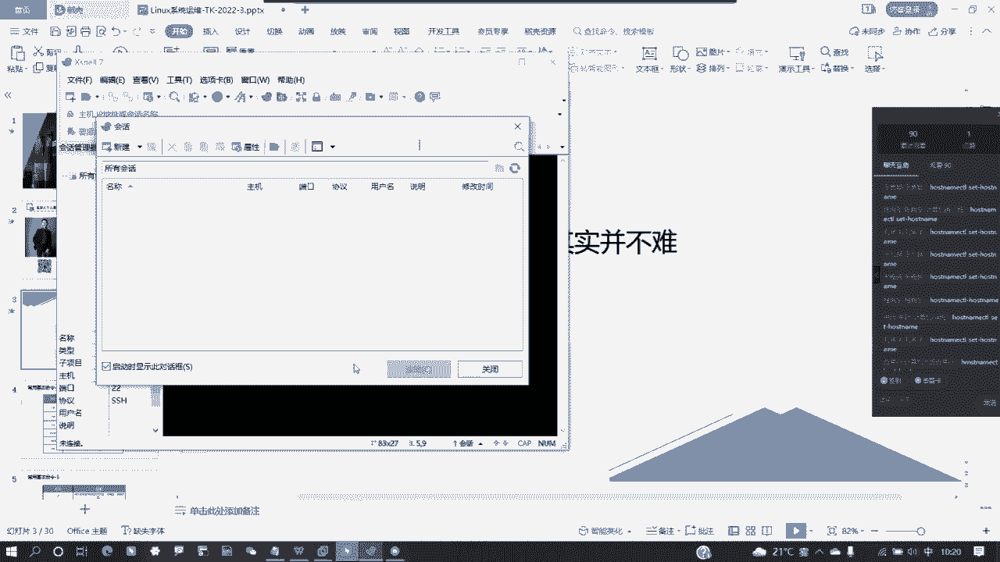

给所有的同学应该讲过的啊，给所有同学应该讲过的，怎么来讲过呢，首先第一件事情啊。

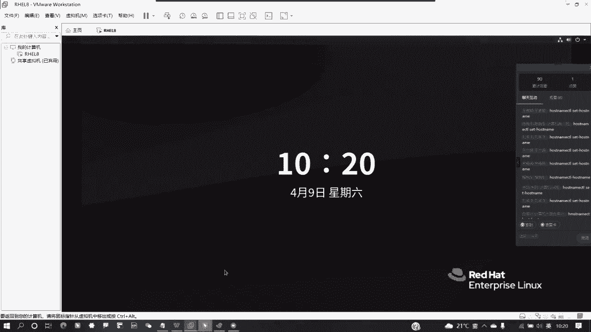

首先第一件事情我们一定要去干嘛，去将我们的这样一个系统的ip地址给它设置好，当然我们暂时没有教给大家如何去通，过命令或者通过我们的这种是编辑的这种写法啊，教给大家如何去设置ip。

所以同样以图形化的模式啊，大家注意以图形化的模式点开点击有限是不是有个有限设置呀。

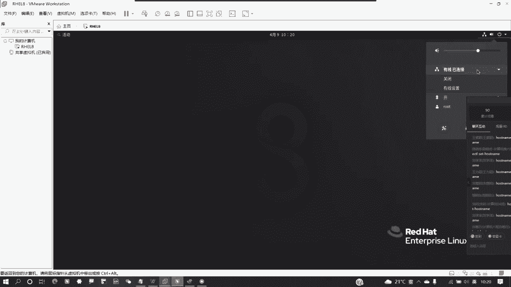

好点击有限设置的过程中间，请大家注意了，在这个有限制设置这里，这后面这个符号把它点开啊，把它点开，那么点开之后呢，你会看到我们要求在第一个是不是要求自动连接，这里一定要打勾的，支持要求反复在说啊。

就自动连接一定要去打勾的，然后呢i p v4 ，这里我们也要求大家一定要去设置一个所对应的ip，请大家听好了，我们一定要求大家去所对应的一个i p，但是这个ip大家注意啊，你可以是我们也说了。

虽然我们现在用的是虚拟机啊，虽然用的是虚拟机，但是大家一定要把它当成一台真实机来进行使用啊，当成一台真实机来使用，所以呢请大家一定不要把真实机和虚拟机的ip都设置为同一个，这是肯定不行的对吧。

就像连一个什么局域网环境中间，你的机器的ip和对方g i p都是一样的，那肯定有一台机器是连不上去的对吧，肯定是连不上去的，所以我们要求大家一定要去设置，正确而是正确，当然我知道我这里是十点十点10：

10，代表这一台虚拟机对吧。

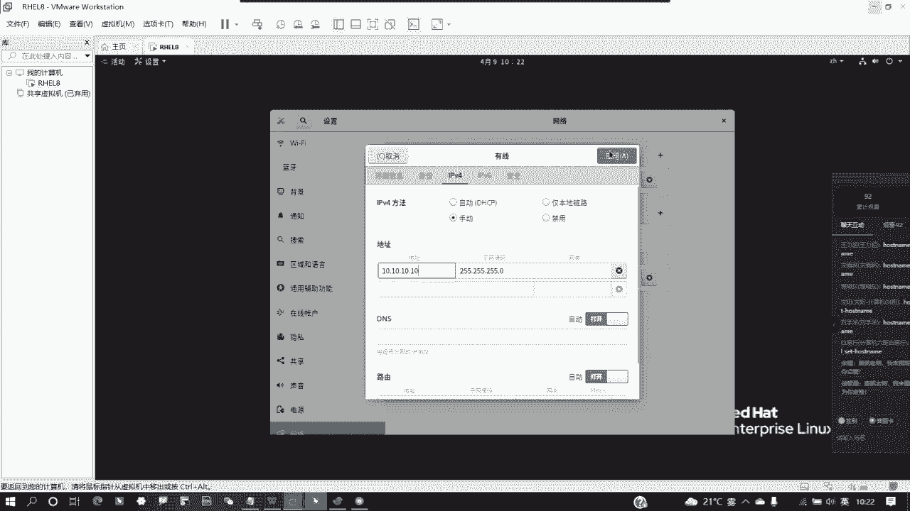

代表这一台虚拟机要求大家去注意好，当我设置完成之后呢，我们现在直接在这里来告诉给大家，大家看选择这里的终端点开，点开之后呢，请大家看好了，我们这里有了第一个命令，请大家一定要把它记下来，记下来。

这里不在我的ppt上面啊，这个命令不在我的ppt上面，叫做衣服config，大家记住这个小点叫做if config，请大家听好了，我们在windows中间啊。

大家注意我们在windows中间我们有一个命令叫什么呢。

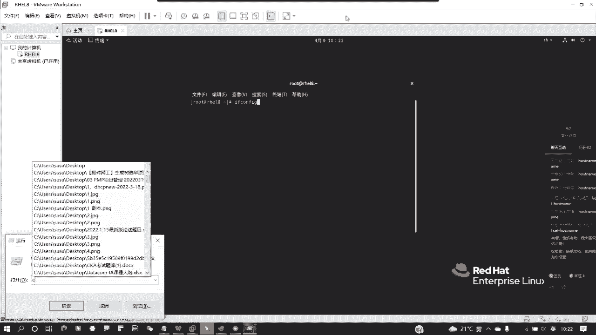

叫做大家看啊，我现，在是windows中间，我们有一个命令叫什么呢，叫ip config，大家注意啊，叫ip config回车，它是记录者你当前所有的这样一个什么呀，网卡的这样一些ip信息，听好了。

这是在我们的windows上面啊。

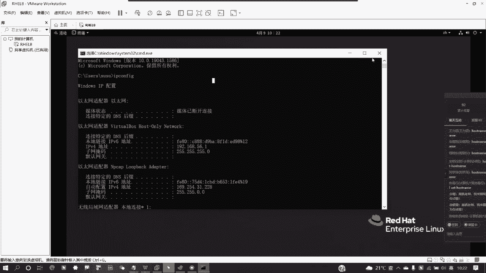

这是在我们的windows上面，但是在link上面呢，我们叫if convel啊，加interface啊，简写if叫interface config，请大家听啊，interface config好。

if config回车回车好，你会看到的是目前在我们电脑上面会存在的几个网卡的类型啊，几个网卡类型分别为e n s160 l指的是look back回环，当然还有一个虚拟的网卡接口警，下好了好。

那么呢请大家重点听到，我这句话重点听到我这句话，有的同学抄完if config之后，很有可能你的这个网卡它不像我这里叫的叫e160 ，可能你的网卡他叫的名字ip config，对，这是windows啊。

听好了啊，你加了这个ip config是windows的对好，那么在lx中间前来跳叫if config啊，好那同样的在这里的这个就是有些同学啊，有些同学所在这里看到这个e160 ，你看到的不是啊。

你看的不是很有可能你看到的是什么呢，是什么e n s33 啊，ex多少多少多少，可能与我这里的160不不是不一样啊，不一样没关系啊，没关系，你只要知道敲完这条命令下面的第一个网卡，大家注意。

第一块网卡就是你真正的电脑上面的这个网卡接口就行了好吧，网卡接口就行了好，所以你可以看到在这里interface的整个这一块的接口的ip，听明白我在这里就正常显示，那如果说各位同学。

你在这里没有显示怎么办呢，很简单，用图形化的形式啊，大家注意了，当然我也会告诉你用几种方式，第一个用图形化的方式把它点开。

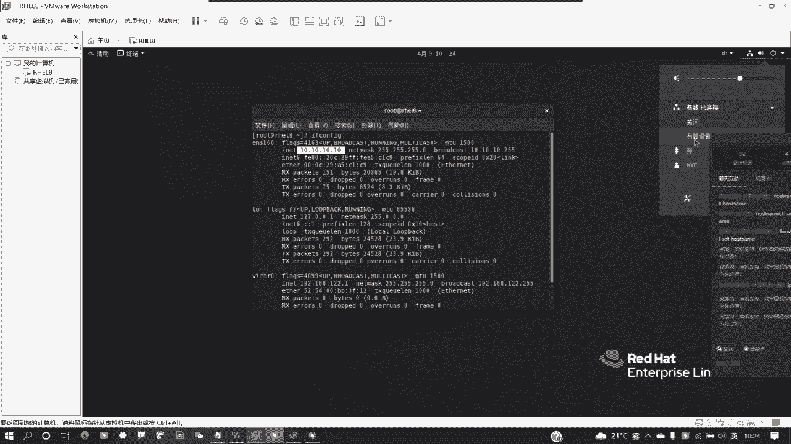

选择在这里把这个打开功能看好，把它先关掉，看到没有。

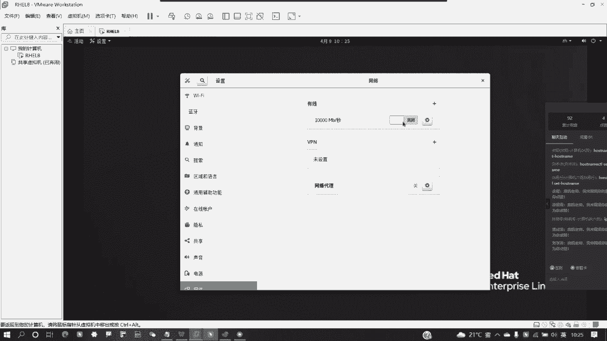

先把，它关掉好，关掉之后呢，你再来看，在这里你再来刷一下，你在这里说一下，你会发现在这里你看我刚刚有十点十点10：10，但是在这里是不是就没有了，是不是就没ip了，对不对，同样你再把它点开啊。

你再把它点开，你再敲一个if config回车，它又会出来了啊，它又会出来了，看到没有，是要求大家去注意了，这就是我们刚才所说的。

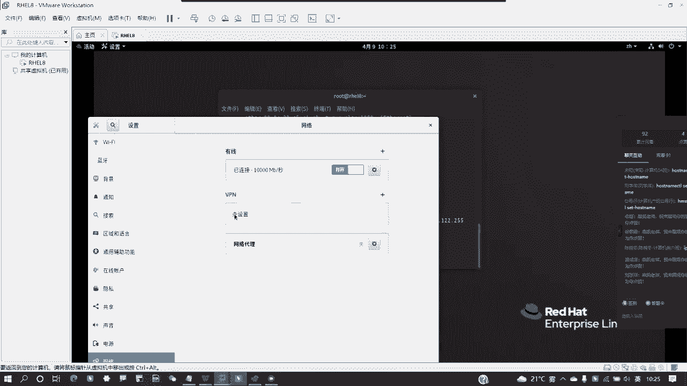

就是通过这个开关，然后呢相当于把我们的ip进行重新刷新一下的概念啊，刷新一下概念，当然当然今天在我们实际的企业环境中，我们讲过啊，讲过，可能没有这个图形化对吧，可能你更多的是什么呀，以命令的形式。

那么如果没有图形化，以这种命令的形式，那么我怎么能让我的网卡生效呢对吧，我怎么让我的网卡生效呢，好大家注意它有这样一个命令，大家可以记一下，叫if我们刚刚不是，if confident，对不对。

它这里有一个什么呢，叫if down掉了，if done if down，跳down down什么呢，你看它这个后面写的就是你的设备名字，看到没有，你的设备名字对吧，device name什么意思呢。

诶你的设备是1s160 ，看到没，e n s160 好，那么这个时候呢你就写叫什么e s，160，你把这块网卡给他，it down掉好，你看他这里是不是就是其实也说成功停用连接了，这个是不是。

所以你再来看if cb的时候，ok是不是和我们刚刚所看到的这个界面是一样的效果，什么效果啊，我们的网卡是不是就没了，听见吗，不是网卡没有，就i7 是不是就没了，是不是好，那么既然有if done。

就一定会有什么呀，衣服啊，if up e怎么样，哎我们把网卡把它接上去，它就说连接已成功激活，看到没有好，所以if看病好，这个时候你会看到我们的ip又怎么样，又刷新回来了啊，又刷新回来了，请你。

听好了啊，又刷新回来了好所以在我们企业环境中间，刚刚已经交给到大家了，有一个叫什么呢，叫做if done啊，大家注意啊，叫衣服叫什么呢，衣服down对吧，down e n s160 是我们的断掉网卡。

对不对，好但是大家有一个问题来了，什么问题，我们之前也说过，linux最大的特色是什么，最大的特色就是说当他现在我们企业环境中间正在运行的时候，我们并不像windows一样，我们需要去重启生效，是不是。

那如果我今天业务正在跑啊，大家注意，我现在业务正在跑，可是呢我现在需要他去换一个ip诶，比如说，我现在这台机器是吧，我需要叫另外一个什么什么，那么我修改完之后呢，那么因为他现在还在连接状态啊。

还在连接状态，他仍然认为是它是十点十点10：10，听明白啊，他仍然认为它是十点十点10：10，所以我们就需要通过这种当调，然后让它生效，可是我们有说过，在实际业务生产环境中间，我们不能直接down掉啊。

我们不能直接down掉，所以我们需要做什么操作，让它相当于正在工作状态立即生效呢啊在工作状态立即生，效呢好，请大家好，他是这么来玩的啊，他这么来玩的，请大家注意了，我在这里直接教给大家啊。

你可以直接在这里空一格带一个分号，大家注意啊，空一格带一个分号，分号代表什么意思呢，一个封号就是这个封号就代表着前当前面这个命令使用完之后，但是并没有结束啊，并没有结束，我立刻将if up给他生效。

听明白啊，你可以理解这种相当于是重启的，就你看啊，本来是两条命令对吧，本来我敲完他回车，是不是在敲他的，对不对，但是因为有了这样一个符号，那么就代表什么意思呢，代表着，我要这这代表这是一条命的了。

听明白，这就代表一条命令了，那么一条命令就必须是以我最终的这个结果去生效，听明白，那前面这个命令执行的没有呢，执行了啊，执行了，但是以这个命令去生效，听明白。

所以就相当于我重新将王凯网卡怎么样重新激活了啊，重新激活的意思好不好，是要求大家去注意啊，所以回车你看是不是停用又连接了，听明白，停用又连接了啊，是整个这一块，但是以这个最终去生效的，听懂我说的意思啊。

好那么我们刚刚一开始就交给大家去查看ip了，是不是好，这，样采访完ip之后呢，很简单，那你现在是用我们的x shell去连接这台机器怎么办呢。

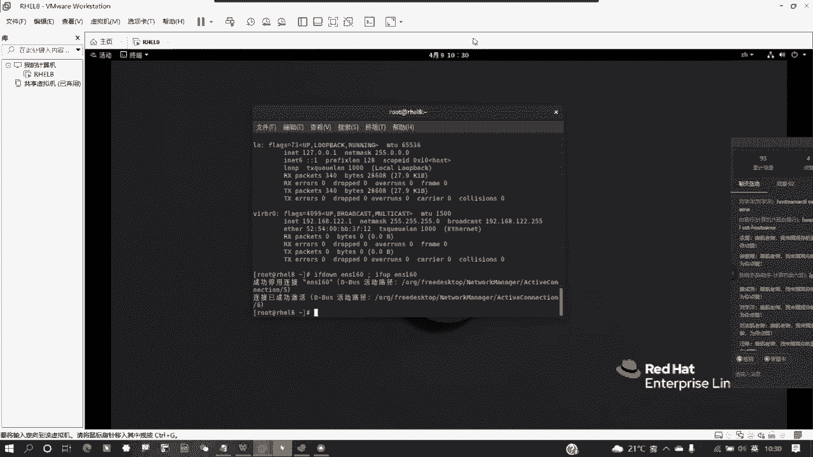

你就需要去敲cmd干嘛，新对吧，听明白，如果我今天这台机器拼得通，大家看啊，我现在这台机器拼得通。

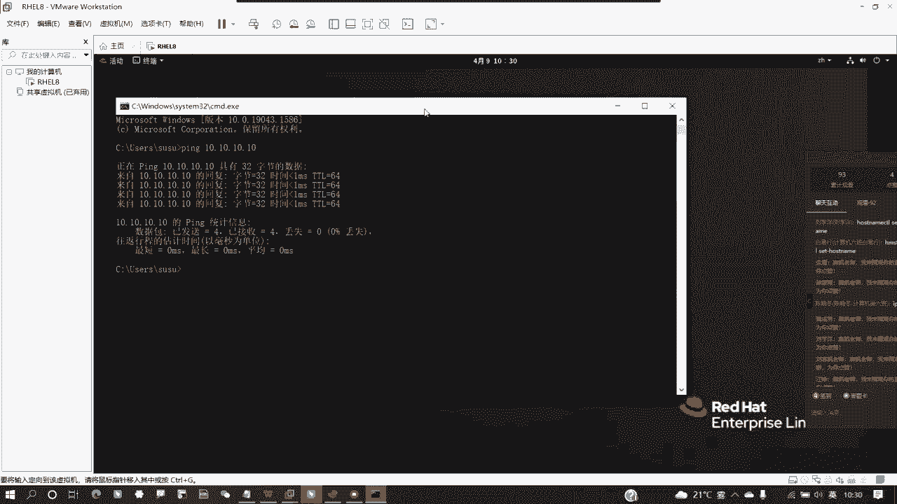

ok那么这个时候你只需要打开你的excel去选择新建，当然我们说选择新建之前呢，也可以这样，我们的什么呀，配色方案把它改一改是吧，把它改一改，比如说去改成我们所熟知熟悉的这种啊。

所以就是是吧把颜色稍微调整一下啊，颜色稍微调整一下，然后再点新，建对吧，好名称，比如说h e l什么，比如八对吧，把好主机的这一块信息是十点十点10：10，是不是的好，那么接下来我们有键盘布局。

我们当然我们建议大家选择阿斯克码的，当然有v啊，有那个终端选择ut发的对吧，选择ut发的好，选择确定好，那么很多人看到这个界面，他认为我连上去了没有啊，为什么我们说过。

在上一节课讲过这个界面和你现在所看到的我的这个界面是不一样的。

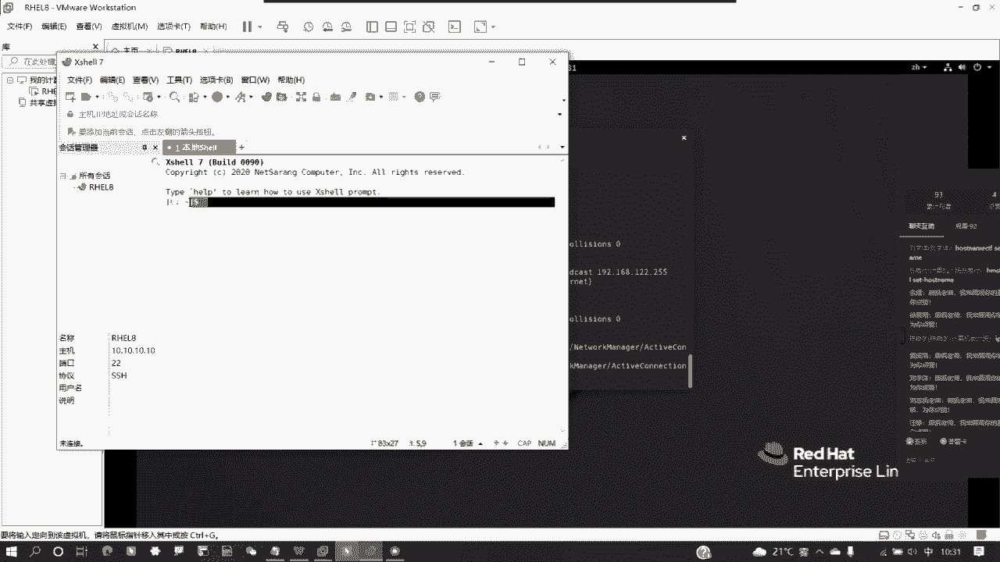

看到没有。

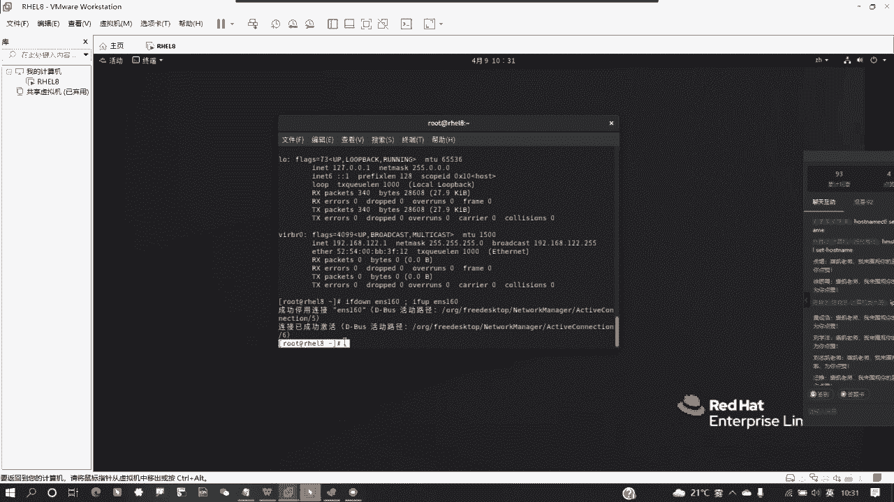

你只要连成类似于我这样一个界面才算连接成功，所以很多同学在这个界面上面去拼啊，去，拼什么啊，什么十点十点10：10，他跟我说，他说老师诶我拼通了呀对吧，我拼错了，甚至哎我这个这个成功了呀。

我是不是就代表我我可以正常做实验了呀对吧，然后呢开局就像什么cd跟啊，他就说哎我这不是也进来了吗，对吧，我已经看到我接下来所有的什么什么东西，怎么和我之前看到的是不一样呢，你当然看的不一样。

因为你看到的这个结构是这个软件的结构啊，是windows看到没有，这个软件的结构并不是并不是我们linux的，听明白，所以你一定要干嘛去把它双击对，把它连上去好，当你首。

先第一次你是不是见到的是这个界面，对不对，很多同学也说，哎老师我这个第一次是我应该是一次性接受，是接受保存的，这个都无所谓啊，这个都无所谓，当然如果你要因为我们说这个机器你是长时间使用的。

所以我们建议大家选择的是什么呀，这个对吧，选择的是这个好，输入我们的用户名，这时候你输入就是这台linux的用户名好，当然你可以记住你了，你要不记得你下次要重新输入，这无所谓，对不对，好输入什么呀。

这个密码对吧，记住好，选择连接，你看这个时候他说唉请使用的哦，这个，是什么意思，如果说你今天提示这个界面啊，大家注意，如果你今天提示这个界面代表什么意思呢，代表着是我今天的这个x shell。

大家注意啊，这个呃少了一个工具啊，少了一个尴尬，少了一个工具嗯，如果说大家也跳出跟我类似的这个界面啊，类似的这个界面意味着什么，意味着你还需要去安装另外一个软件，这个软件叫ex manager。

这叫做manager啊，我这里还真没有，我等一下中午找一找啊，我中午找一找，如果说我能找到的话，我就直接发到群里啊，发到群里，大家需要去下去装另外一个软件ex manager，这，个软件是用来干嘛的呢。

它其实是我们的ex shell的一个厂商呃，它是用来帮你做类似于一个驱动的，把windows和linux之间啊做一些这种驱动的一个一个一个模块，如果说没有他的话。

那么你的its shell可能会有一些不稳定啊，会有不稳定，那有可能我们之前有几位同学是吧，这个抄的抄的时候特别卡，特别有问题，是不是因为没有装这个软件啊，因为可能我需要看到你的这个截图。

我才能才能给出你的解决方案啊，可能才能给给出解决方案好，当然因为我们在这里，如果说你看如果你要立即下载x，min的试用版，点击是它应该是会跳出一个界面来啊，跳到一个界面来，那我这边应该是会有一个破解的。

我到时候看能不能发个点呃，如果我点否的话，你看我点否的话，当然我现在也是连我目前也是能连上去啊，也是能连上去，但是呢会有呃一些怎么说呢，就是比如说我要拖拽啊啊我要我要丢什么东西的时候。

可能会有一些影响啊，会有一些影响，可以把这个请求关了就不卡了，是的，你把点点取消是不会卡了，对好大家看在这里好。

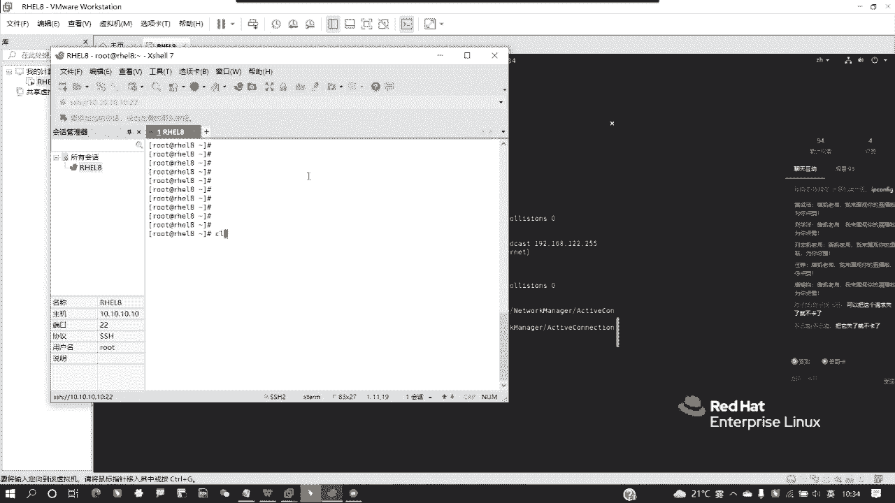

ok，确实是吧，确实好，ok好，那么呢当然你刚刚看啊，if cp，这我们也看到的是整个这一块的一个结构对吧，整个这一块的几个结构，十点十点十点十二十年10月盛世好，那么讲到这里啊。

讲到这里应该我们就交给大家把这个app shell和我们的整个是吧，这个这个终端的连接又给大家演示了一遍啊，又给大家去演示了一遍，好吧好。

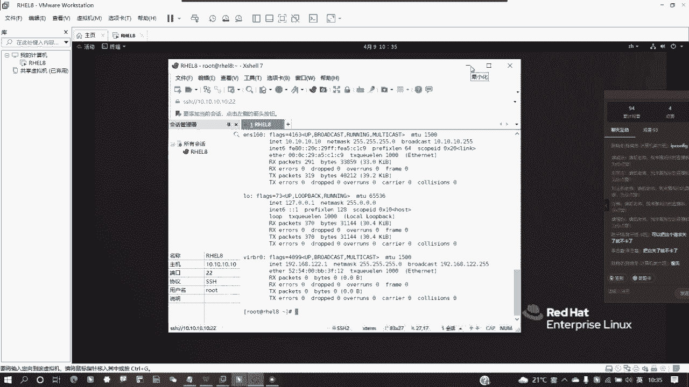

那么我们就继续了，那我们就继续了，继续我们今天的这个课程了，好首先呢还是给到大家一点点时间啊，这个几分钟好吧，几分钟啊，三分钟左右，时间3~5分钟吧，好吧呃，请大家把这个把它抄到你的本质上啊。

抄到你的本质上，我们继续来讲解我们基础命令啊，继续讲解基础命令，哈哈哈哈，好大家尽量的把命令写到里的，你的本事啊，你的本事，那我们在讲这一拼命令中间，我们也会给到大家啊出一些题目，我们随机的啊。

随机的要求大家啊随唐去把它做出来啊，做出来，嗯嗯，好，各位同学应该是都写完了吗，各位，应该是都写完了啊，好那我们接下来来讲解这样一批命令啊，来讲解这样一批命令，那么在之前啊上一周的时候呢。

我们要求大家去知道的是我们的nx winning中间呢啊会有一些什么呀，参数的概念，对不对，我们说去使用参数，其实就是帮助我们的命令，帮助我们的业务对吧，帮助我们的管理员去达到更优的一种显示的结果。

显示这个这个最终的一个方案是不是好，那么既然是这样的，来，我们首先看到第一名就是cp的命令啊，就是copy copy，请大家听好了，我们在微软中间我们叫copy，对不对，但在link中间我们就叫cp啊。

叫copy，好比如说我们在之前在上市，我们布置了一个作业，是要求大家把time下面所有内容清空的，我们是教给大家要求静态，或者说你直接什么呀，time下面带个星号，星号是代表所有的意思呀，是吧。

代表所有意思，所以这个时候呢我们就等同于又把整个这一块的这个什么呀，下面的内容全部给它清掉了，是不是好，那么同时l root大家注意l root，你会发现在这里呢会有我们的文件和文件夹嘛对吧。

这里这是文件，这是文件，是不是的，所以我们可以干嘛copy，大家注意啊，copy好，这里一定要绝对路径啊，一定要绝对路径，为什么，因为你当前目录下面是为空的嘛对吧，当前目录下面是为空的。

所以copy root下面的绝对路径中间的这样一个什么文件点，我们当时讲过点，是不是代表当前呢，是不是啊啊，所以可以直接什么呀，负责当前的ios，你看是不是就有一个文件过来了啊，就有我们讲过了。

所以cp代表着复制啊，代表着复制要求大家一定要去注意啊，代表复制好，那同时呢那同时呢我们可不可以这样呢，其实大家听好了，我们在复制的同时，我也想改个名，可不可以，呢啊改一个名字可不可以呢，同样也可以。

比如说copy root下面的这个文件对吧，好比如说负责当前，因为我本身就在当前，你也可以直接写一个什么呀，名字啊，直接写个名字，比如说我就写航海，可不可以，可以回车。

你看l s你是不是要等同于把这个文件干嘛呀，直接复制到目的地的时候，同时改名，你想我们现在如果说用windows来理解，我是不是首先要右键复制，在右键粘贴，粘贴完之后再右键重命名，然后再改名字。

是不是要需要有三步，对不对，但是今天练一次一条命令就能解决啊，今天links一条，命令就能解决，所以你也可以看得到，今天在我们企业环境中间，我们所为什么说叫会玩linux。

那么真真正正你在未来企业的这个使用是吧，这个拓展啊等等这一块的这个能力会越来越大，它越来越大，就是这个目的好，那么在这里的copy对不对，这个cp啊我们就正正常的给大家去说到了，但是问题又来了。

那如果我今天想复制一个文件夹呢，啊我们现在是复制的是文件嘛对吧，复制的是文件，那如果我想复制一个文件夹呢，好我举个例子，make。r对吧，root下面test创建一个文件夹，且而且我也可。

以copy对root下面这个文件到root下面的test下面去，能理解意思吧，就代表这个文件夹里面是不是还有一个文件对吧，还有一个文件是不是的好，那既然是这样，那既然是这样，那我想问到的各位是。

我今天可不可以将这个test诶复制到我当前来呢，我们试一下cp对吧，rt下面的test啊，test对不对，好，我把它复到当前来可不可以啊，附到当前来可不可以好，我们看回车，他直接告诉你忽略过了目录啊。

直接告诉你略过了目录，为什么呢，因为copy大家注意啊，你看结果是没有的，对不对，copy这cp它默认只能复，制文件请大家只能复制文件，但他也告诉你了，你看他也告诉你了，一个参数，看到没。

当然如果你不太清楚我们讲过用什么呀，杠杠help的形式对吧，刚才help或者说你看在这个上面就会有啊，就会有，比如刚刚help啊，是什么呀对吧，然后呢呃比如说它的这个参数过程中应该用哪一种。

你看在这里用大写或者小写的啊对吧，小写递归复制目录及子目录的所有内容，看到没有，是不是这个呀，对不对，是不是这个，所以我们今天接下来干嘛呢，很简单，那么我们在这里我们可以直接干r，大家注意啊，直。

接看r然后什么呢，哎我们的root下面的test test，对不对，好负责，当前来看是不是就没有报错了啊，就没有报错了，好，接下来as你看是不是我们就直接给他复制过来，而且从看从前的周目录下面。

我们确实把什么文件夹及其指文件，或者还有其他文件夹，是不是一并把它复制过来了啊，一并把它复制过来了，现在还挺好的啊，一并把它复制过来了，好要求大家去注意，但是但是各位因为我们还没有讲权限啊。

还没有去讲权限，我们在这里是要求大家去理解一下，我们今天呢很多时候我们其实要，关心的是有可能各位听好我这句话，我先只说理论的概念啊，有可能我们root下面的这个文件夹的权限。

一个比如说是一个啊比较的比较比比较特殊的一个权限啊，比较特殊的一个权限，那么当你把这个十秒发力这个这个这个这个就像什么呢，就这样很简单，对不对，比较隐私的东西，你是放到自己的这样一个文件里面。

可是呢因为你今天出去办事啊，你自己是吧，突然一下大脑断电了，留在比如说公共场合了，是一个在比如说你吃饭的某个地方，唉，一个要到那里去了，那他有可能会什么呀，会去打开查看对吧。

会去比如说做一些其他等等等等，这样一个事情可能不合规对吧，可能不合规，带有加密功能的，那么这个时候我就需要干嘛呢，哎我有没有可能我希望复制过来的时候啊，复制到这个这个目标地址复制过来说呢。

你能把我的权限也一并复制过来，我不希望是你把东西，确实给我复制过来了，可是你把我里面的权限发生了改变啊，把我的权限发生改变，因为我们还没有讲到权限啊，只是在这里提一提啊，第一题好。

所以这个时候我们需要怎么办呢，大家注意了，这里没有参数啊，请大家一定要是就是我在讲的过程，讲了很多参数是要求大家一定要去把它记下来了，那一定要把它记下来了好，那么这个绳子怎么办呢，很简单，py g p。

当然当然因为我是复制文件夹，所以你要写rp不代表什么呀，复制文件加的时候，同时把权限一并复制过来，如果，你要复制文件，你是不是就直接copy cp就够了对吧，直接ky cp就够了好。

所以c p r p大家注意啊，rose下面test对吧，涉及到点，这样就成功了啊，这样就成功了，就代表着你复制过到目的地的这个全文件夹的权限一并，就是这什么意思。

就是这个权限与原始原地址的这个文件位的文件权限是一致的啊，是一致的，就是这个p的作用啊，就是个p的作用，ok就是这个p的作用，这个听懂了吧，各位啊，我相信这个应该是听懂了啊，好接下来mv好。

接下来mv第二个命令了，刚刚copy是复制的概念啊，大家注意，刚刚copy是复制的概念，那么这个mv是什么呢，就是移动的概念，就是剪切的概念啊，就是剪切的概念，什么叫剪切的概念呢，很简单。

比如说我们rm和rf这一说大家都应该清楚了，是为空对吧，孙悟空好，这个时候呢如果我说我今天对吧，我今天我们的root下面大家注意啊，会有的test是不是好，这个时候很简单，mv啊，mv直接什么呀。

我们的root下面的tes root下面test复制当前来，你看当前是不是就有test，当前就有test，那我们的root下面有还有吗，是不是也没有了，它这个就叫做剪切的概念啊，这个就叫做剪切的概念啊。

各位啊已经说完了，这个就代表着剪切的概念，ok好，那同样的也有啊，同样的也会有我们所对应的参数，那这些参数我就不一一的来说了啊，这些参数我就不一一的来说了，请大家听好了，ok好，在这里我们就不谈了啊。

就是mv啊，就是剪切的概念，当然剪切也可以像copy一样的什么呀，将就是剪切过来的时候呢，同时将我们的主角名字给它换掉啊，将我们的名字比如说我们可以给它重命名掉，啊给了重命名了啊。

这是我们的整个这一块啊，这是我们整个这一块mv好，那么紧接下来就是rm了，紧接下来就是rm了，那rm是什么呢，请大家听好了，就是我们在上次课程强调又强调了，就是我们这样删除，默认是删除我们的文件的啊。

默认是删除我们的文件的，但是各位，但是我们如果想删文件夹的时候，需要去带什么，带我们的r的参数对吧，带我们的r参数，而f代表不提示删除啊，不提示删除就直接把它干掉了，是不是直接把它干掉了啊。

所以这个命令我们说的在企业环境中间是相，当相当危险的啊，相当相当危险的，请大家一定要注意啊，请大家一定要注意好不好，请大家一定要注意啊，在这里我就不多说了，一下讲了三个啊，一下子讲了三个啊。

一下讲了三个好，接下来呢我们紧接着再来讲这个touch啊，紧接着再来讲这个touch不好，这样我们先不删好，这个touch代表什么意思呢，特别好玩啊，这个touch代表特别好玩，起来跳。

它代表了两层意思，首先来讲第一层意思啊，首先来讲解第一层意思，它是建立一个空文件啊，建立一个空的文件，什么意思呢，比如说touch大家注意啊，比如说touch空格，我touch的一个。

比如说aaa举个例子哦，touch这个文件aaa，a这个文件出来没有出来啊，你可以理解为它叫新建文件的概念是吧，创建这个文件出来了，但这个文件是空的啊，大家注意是空的，大家看到零看到没有。

我们在三次不是讲d入吗，查看大小是不是为零吗，对吧，它是个空的文件啊，空的文件是这样一个概念啊，大家注意了touch，所以ht它首先第一个最大的功能是什么，是去当大家听我讲啊。

当当前目录下面没有你所需要创建的这个文件的时候，它默认是将这个文件直接创建出来啊，当当前目录下面没有这个文件的时候，那这个touch的作用，是直接将它创建出来啊，这是我们刚刚看到的效果。

那么创建出来的时候呢，它默认是什么呀，是零的大小是吧，是空文件啊，是空文件，那么这是我们第一个概念啊，是要求大家去注意的好，接下来呢大家看到这里有一条命叫start a a a，大家看啊。

start a好，回车好，这个命令是干嘛的呢，跳它是用来显示各位听，它是用来显示我们的文件的时或者文件或者文件夹的时间戳时间戳，大家注意啊，这个叫做x t t啊。

用来显示显示文件或文件夹的sor或者文件夹的时间搓啊，时间戳的啊，时间戳的什，么叫时间戳啊，什么叫时间戳，请大家听啊，在这里你可以理解为它是记录的一个文件生成或者修改的时间。

你看它在这里它默认是首先它有几个啊，它有几个，它有它有这么几个，看到没有，第一个最近访问的时间是什么时间对吧，因为我都是第一时间去创建出来，所以它四个时间都是一样的，看到没有啊，是更改时间是什么时间。

改动的时间是什么时间，创建的时间是什么时间，看到没有好，但是呢今天你会看到date，我们查时间，我现在是10。54了，是不是已经过了三分钟，已经过了三，分钟看一下我吧啊已经过了三分钟是不是好。

这个时候我给你看几个效果啊，给你看几个效果，比如说我这里有一个命令叫eco啊，一口一口什么意思呢，就是输出的概念，好比如输出一个123456789，举个例子，这是一串数字，对好，我输出给谁管这个什么呀。

这个重新下对吧，重新下符号输出到这个a a a里面去，你看我没有进去啊，我只是相当于将一串数字输进去了，回车回车好，这个时候我们再来看da，你会发现你会发现有两个值变了，你可以和上面来看啊。

上面这四个来看你，看有两个值变哪两个值最近更改的时间和最近改动的时间，对不对，为什么，因为你的这个文件是不是发生了改变，是不是发生改变，发生了什么改变，因为有串数字进去了，所以它这两个时间发生了改变。

听明白这两个时间发生改变，但是我有没有访问它，我没有访问它，我没有去查看它的内容吧对吧，所以我没有这个时间依然没有动，而创建的时间也没有动，看到没有创建的时间没有动，那么这个时候就会有一个什么问题呢。

啊随着有可能因为比如说因为这个a是我后期做的，那有没，有可能我今天系统中间的时候呢，我系统随着系统启动的系统这个生产之后呢，有可能我在不断的网址，就是系统自动的不断地往某些文件里面不断写写写写写，谢谢。

那么其实等同于这两个值是不断的在更新对吧，不断的在更新，但是我们的最近访问和创建时间是很早的，那如果说你的系统正在企业中间，正在这个这个，比如说有可能你你你在企业中间可能已经有这个这个系统。

已经有3年了对吧，有可能你是2019年啊，2019年就已经正在企业中间来做，那有可能这个文，件你2019年就没有发送改变，但是你今天假设正在使用某个数据库文件，或者说正在需要去调取某个文件的时候。

那么这个新的软件它可能需要是什么呢，它只能扫描到啊，只能扫描到2021年至2022年的数据，那有可能就会出现问题，什么呀，你因为你的这个什么创建时间是2019年的，2019年的。

所以有可能这个问题根本就扫描不出来，那么你就没有办法，我怎么没有创建时间啊，不可能啊，不可能你你你弄完之后肯定会有创建时间的啊，那么就会就会导致什么，情况就会导致你的整个时间戳是不是就不对了对吧。

因为你这个时间很有可能是二零什么呀，19年的对吧，2019年的，甚至你前面也是的，2019的年的是不知道好，所以这时候我们就需要做什么事情呢，我们就需要去大家看啊，大家看我操作，我就可以通过touch。

我刚刚说了，我默认情况下没有时候，他是不是就会去什么呀，去创建出来，是不是的，就会去创建出来，但是如果我创建本身这个目录下面就有这个文件的时候，那么这个touch就会变成另外一个概念，什么概念呢。

你看啊，我现，在data回车，你看10。57是不是39好，这时候你再看touch aa回车，你看没有发生任何改变，也在这里没有发生任何改变改变，但是对a a a的时候，你发现我所有的时间干嘛。

所有事情干嘛，是不是直接刷新到最新了，直接刷新到了最新，这就是touch的第二个作用，这就是touch的第二个作用，什么作用呢，就是将我们的时间戳更新啊，将我们的时间戳更新，所以大家在写的时候。

除了这里之外建立空文件几，大家注意啊，几什么呀，更新什么呀啊时间戳，大家注意更新时间戳啊，c要求大家去注意，啊更新我们的时间戳好也是一样啊，创建时间没有，不知道这个啥情况啊，好请他注意啊，更新时间戳啊。

更新时间戳好，你touch啊，你看那个呃时间戳会不会出现啊，会不会那个那个创建时间会去刷新出来啊，好大家注意啊，更新时间初是怎么这一块o好这个给大家讲清楚了，这个给大家去讲清楚了，嗯，还是没有是吧。

好我们先接着来说啊，我们先接着来说好，那么其紧好紧接下来啊，紧接下来这里有个head啊，这里有个head好，那当然had之外呢，其实我们应该我看看下一版中间会不会有哦，当然啊这个had好。

那么我们首先看啊，这个had had是什么呢，其实head和tell其实是一对的head头啊，tell代表为啊，代表为这个淘汰了什么意思呢，我们在上一次课程其实给大家去讲到了一个讲了一个什么呀。

讲到了我们想查看这个文件具备有多少行是什么命令，能告诉我吗，想查看这个文件具备有多少行，是什么命令，来大家可以打出来啊，想想查看某个文件是吧，它有多少行，是什么命令，啊当然wc是可以查。

那具体带什么参数呢，具体带什么参数是查的更加详细呢，ok wc干了什么呀，l对吧，wc杠l是用来直接查询的，是我们具体的对吧，就我们具体的这样一个函数，很好好。

那么我们现在也可以看得到是当我敲wc gl的时候啊，wc gl的时候，我们查到的是这样一个文件，总的函数是50对吧，总的行数是50行对吧，50行好，大家注意，我如果用head，大家注意啊。

如果用head直接接这个文件，直接接这个文件啊，天啊他是查文件了啊，直接接触文件是显示，当然这个空行也算啊，空行也还也算，它是用来查整个文件的，投十行，大家注意啊，头部的十行大家可以自，己去数一数。

你看是不是十行啊，是不是十行，它是用来查我们的头十行的，大家听好了啊，head默认是查某一个文件的，投十行，现在跳了好，那么如果用had杠n，大家注意啊，杠n或者你直接写15都行啊，刚n 15也行。

或者直接十，比如说我是这个这个后面是数字啊，随便你加啊，随便你加，比如说15伏好，这个代表什么意思啊，十就投15行，大家注意啊，查投15行，你要接多少，就是查多少行，你接多少就是查多少行，听明白。

这个能听懂吗，对吧，查阶段啊，就是查多少行好，那既然是这样，那我刚才也讲了，tell是什么呀，尾巴是吧，是尾巴啊，如果我什么都不接，代表什么意思，我们的什么呀，尾实行，大家注意啊。

查尾部的实行就是这个文件倒数十行啊，倒数十行听明白啊，倒是那如果我想查15行呢，也是一样的，比如你看我在这里写刚n 15和刚刚说15是一个意思啊，是一个意思，你看倒数15行，听明白，倒数15行。

倒数15行啊，好听明白了，好嘞，但是呢这个跳还有一个功能啊，tell还有个功能什么功能呢，好大家记住一下这个目录啊，大家记住一下这个目录，这个目录额外来讲啊，我们之前讲过这个袜子根目录是用来干嘛的呀。

各位能告诉我吗，这个袜这个目录是用来干嘛的，哇这个目录是用来干嘛的，各位，v a r这个目录是用来干嘛的呢，系统的配置文件同目录是的很好好，那么呢在这个配置文件目录中间，大家听好了，这里有一个啊。

这里有个专门的目录叫log啊，叫log one上面的log，大家记住这个他是大家注意啊，w p w d这个目录是专门用来记录我们电脑，或者说记录我们系统上面所有的日志信息的，大家可以把它记下来。

这个目录是专门用来记录我们所有的日志信息啊，就是系统中间所有的日志信息日志，大家能理解吗，比如说今天各位同学诶，比如在工程大学对吧，比如说我想去大家的校区里，面，对不对，我在进校。

区的时候是不是保安就会拿出一个本子让我进行登记呀对吧，你可以理解那个本子是不是就是什么日记信息，是不是的，就是我们的日志信息，其他跳了啊，叫one look好，这个时候你看这里就会有很多很多日志记录。

比如说我们刚刚所看到了安装的啊，日志记录也在这里，比如说我们启动日志是不是也在这里，比如说我们的时间呢啊周星期环任务啊对吧，比如说安装文件呢防火墙啊啊分布式存储啊啊level wah头虚拟化呀。

邮件的日记啊，安全日志呀对吧，调优日志啊，都在这里啊，都在这里，现在跳好了好，那么我们重点来看到的是这个叫message a message，你可以理解为它是个全局，或者说安全section对吧。

安全的好，message，等会啊，那我们可以看到这个文件叫做什么呢，叫wc杠l，大家注意啊，message一共是8801哈，也就说随着我系统的不断的这个这个这个运行，它的日志会不断的累加啊。

日志会不断的生成，不断累加嘛，这个大家都很清楚，对不对，比如说我在刷啊，当然我现在没做任何改变，是8801行好，那么呢我现在希望大家都很重要，查日志，一般当你出现，问题的时候一般不可能在8800什么呀。

零你好的头部吧，因为日子是不是都是往下面再写，是不知道，也就是说在最下面靠下的时候，是不是才是我们的日这最新生成的日志信息，是不是啊，所以我们很多时候再去判断你电脑出现什么故障的时候。

一般都是用跳来做听明白。

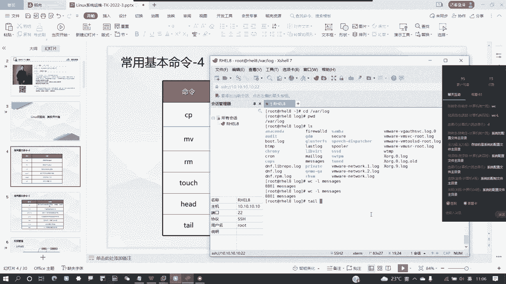

比如说15行，比如说啊15行，我们的message，15行，我的message也就是说直接去看我们的什么呀，看我们的这个尾部的这个15行是有什么什么内容，听明白啊，尾部的15行是吧，有什么内容。

一般来说告诉我一般来，说是杠15就代表什么意思呢，哎我想查这个尾部的记12，尾部的15行有什么什么问题能听明白对吧，这是最新发生的嘛，最新发生的，但还有一种是什么东西呢，直接就是用什么呀。

直接就是用这个tag，大家注意，直接就是用跳，然后呢干嘛呢，大家听好了听好了啊，杠f杠f啊，跳杠f或者你直接看吧，直接就是跳f都行啊，tf都行，这个tf和跳杠f是一个意思，跳f好。

接下来你可以直接写vlog message，或者你直接因为我在当前目录，你也可以直接选message，而且选message都行，回车诶，吼相似命令诶，他没，有这个啊，跳f好，那这样啊，一般来说是有跳。

这是有这个命令，正常啊，那可能是呃没有去加载啊，好像what loved message，你看它就变成了一个什么呢，实时你看我查看的时候呢，它会有一个等待，看到没有，他会有个等待等待什么呢。

它其实就是实时监控的概念啊，它也可以理解它就相当于实时监控的一个概念，你看在这里我什么是不是都没有变了，好，那如果说我今天在这个地方，你看好，如果我今天在这里去重启某一个服务啊。

比如说随便去签去重启我的某一个服务，比如说network management好。

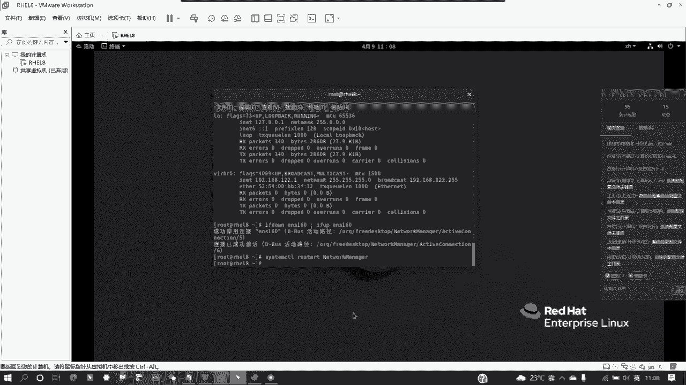

比如说我重启，了，你看这里会比较刷新，你看是不是它就会当时是不是又更新了，你看我刚刚在你还更新多少条，你看更新这么多，我的天哪，你看那刚刚是不是对，sorry，刚刚是不是在这个地方。

是是我刻意空格出来的，看到没有空格出来的，你看我只差差了一条命令，你看他是不是刷了这么多，这个日子出来了，看到没有，他还在等待，你看他还在还在这个等待过程中，看到没有，还在等待过程中，这就代表什么意思。

那你看它是不是又生成了一个，你就可以在这里哦，他现在连接主机的某个服务是成功打开了，所以你就可以看完不停的在这里去去什么呀，实时的监控锂电脑的信息啊，实时监控你电脑的信息，这就是我们的日志的。

就实时实时查看啊，这实时查看接下跳啊，这实时查看啊，之前应该是有这个命令的啊，实际也是有这个问题，不太清楚是不是因为我才装了这个这个这个这个系统，这个中间可能可能那个啊大家可以试一下，叫tf啊。

是支持这个命令的啊，是支持这个命令的，听明白啊，当然如果不支持就杠f就行了啊，不支持就杠f就行了啊，gf就行了。

那我们接着来啊，我们接着来好，这个我们应该讲讲掉了啊，这个我们讲到了好，那么接下来呢我们再来到这里来啊，举个例子，这一版我们应该给大家去讲了好，我copy一个文件啊，pass up d，到点你看啊。

wc杠l好，大家注意，我们在这个时候呢，我们去测的时候一共是46行对吧，46行的文件，46行的这样一个文件好，那么我想查看，大家听我讲，我想查看这个文件。

就是我想显示出来显示这个文件应该是在这一版要去讲的啊，是要在这一版去讲的，我在这里提前讲啊，我在这里提前讲好，大家注意cat就是查看的意思，就是查看例子，查看刚刚我们的head是查看投十行对吧。

查看投十行，但是我用cat是直接查整个文件好，比如说我想查vlog的message，大家看我刚刚肯定是肯定很长了，8000多行了，对不对，后面又刷新了那么多行论文，cat他一下就给你刷完了。

你看一下就给你刷完了，很多人说哇塞这感觉cat感觉没什么太大用啊，为什么一下就刷完了，那什么用呢对吧，那有什么用呢，其实它的用处非常大非常大，为什么你要做日志分析截取筛选的时候。

你是不是要首先要把整篇文章是不是立刻要读到内存里去啊，是吧，把所有内容是不是立刻读到内存里去，对不对，那你用cat的时候是不是就很快了，就立刻就把所有文件的内容是不是全部读到内存了。

所以cat的作用在企业中间用处很大啊，用处很大好，那么c刚刚已经看到这个效果，如果cat这个pass是不是也很快，是不是就全部刷完了是吧，也很快全部刷完了好。

但是呢如果我今天想把这个文件的函数一并把它显示出来，一并把它显示出来，函数啊，一把它显示出来怎么办，就nl这条命，令大家可以记一下啊，大家可以记一下nl的这条名，它相当于是t加上了什么。

加上了这个啊函数，所以加上了什么呢，函数的概念啊，nl等同于cat加上了行数的一个概念，就是把函数给我显示出来啊，把函数给我显示出来好，所以请你看n l啊，n l好，这个时候直接来pass up回车。

行号对吧，就是有多少行吗，刚刚不是四六行，对不对，把行号全部给你宣传了对吧，全部给你写出来好，这个能听懂吗对吧，nl的作用啊，nl的作用好，接下来呢我隋唐啊，就此时，此刻隋唐布置一个作业。

可以各位什么作业呢，大家看就是这个文件啊，大家注意，大家可以先到这个tap里面来，然后敲就是什么操作copy etc下面的什么pass w d到当前来啊，到当前来，大家注意说这是第一步啊，是第一步好。

这里一共有46行对吧，一共有46行，我要求各位的是我要求各位的是将我的第20行，大家注意到第30行，大家看了，也就是说我要求大家仅仅显示第20行到第30行的内容，其他内容都不显示，通过我刚刚我靠。

我刚刚有跟冰，你还没讲到，嗯还没讲到，sorry，我掉了一个命令啊，掉了一个命令好，然后接接着来说啊，接着说，否则大家出来这个效果啊，好接着来说好，接下来说好，接下来我再讲一个命令给到大家。

大家应该这个这个就做了好，这里有一个命令叫管道符，大家跳管道符就讲个符号啊，讲个符号，各位讲个符号，这个符号是什么符号呢，大家可以看到你们的键盘，看到各位键盘键盘上面的这个回车键的上面。

大家注意回车键的上面就是这个竖杠杠，回车键的上面就这个竖杠杠就是管道符，请大家听好了，回车键的上面就，是我们的管道符听好了啊，就是管道符好，那么这个管道符起什么作用呢，好管道管道啊，各位顾名思义。

管道代表什么意思，就相当于各位加点那个水一样的啊，加点水一样，什么意思啊，比如我们去用去衡量你家里是否停水是吧，家里是否停水，我们只需要把龙头打开对吧，龙头打开看它会不会有流水，是不知道。

也就是说如果有流水，就代表着ok我家里现在是可以用水的，那如果你把某个龙头打开之后，你发现没有水对吧，水流不出来，那么就意味着什么，意味着很有可能我根本是不是就，没有水了，对不对，但是你关不关心。

举个例子，你关不关心你的管道另外一头是连到哪里的，我想请问各位，你关关一管到另外一头连到哪里，其实你是不关心你是不是只是关心的是什么，只是关心的是我们什么呀，这个管道是吧。

是否这个这个就是我我只关心结果吧，这样来说我只关心结果是不是，而我只关心结果，所以你可以理解它相当于是什么呢，相当于是刚刚我们不是讲了一个这个命令叫if吗，还记得吗，if到什么e160 啊。

这个分号对吧，是个分号，对不对啊，你可以这样理解，如，果你理解我们刚刚所说的这个东西就好说，比如说160，那同样的概念是什么意思啊，当前面执行之后，是不是再去执行后面，也就是说这两条命令其实它都执行了。

听明白这两条命令其实它都执行了，但是这里的分号当我换成管道符之后，大家注意，当我换成管道符之后，它的区别点在哪呢，区别点在于它是要将前面的命令的结果，大家注意啊。

前面的命令的结果结果就是执行的结果传到管道里面，交给后面这条命令继续执行，而不是说他不关，他不关心，这就是说它和风号最大的区，别就是他不关心前面是吧，这个这个这个这个执行的这个这个怎么样。

那么这个管道是一定是要有结果的啊，一定是要有结果的，有结果才能去是吧，将结果传到我们的后面，这个命这个后面这个名将结果做二次的这个这个这个怎么说，二次的这个转换是这个概念啊，二次转换好。

所以呢我们今天可以这样去理解啊，我们今天可以这样去理解，比方说比方说各位听好了，比方说我们今天呢能不能这样去做一个，我看举个什么例子给大家可能会更好理解一点啊，嗯，举个什么例子给你们来说明呢，好这样吧。

我还是接着先把这个这个讲掉吧，接着讲讲掉完了之后，然后我们再再再再再把那个一起输，可能就好理解一点点啊，就把把那个好理解一点点啊，因为它它会用到我们这后面的几个命令啊，会用到我们后面几个命令的，好。

我们把这两个命令先讲吧，讲完之后，然后呃我们来布置一个作业给了大家好不好，大家中午的时间可以把它试着做一做，好不中的时间可以把它试着做一做好吗，好大家还是这样吧，给大家五分钟啊，给到大家五分钟。

大家把这个命令先帮我查呃，先写到你的本子上嘛，好不好，给到五分钟，先写到本子上吧，好给了五分钟啊，大家速度，好五分钟时间啊，再快一点，啊，哈哈，啊，咳咳，好这应该是写完了吧，各位。

好我们接下来呢把这一版给大家，大家继续来讲解啊，继续来讲解，请大家跳了好，首先第一个呢大家注意，这里有一条命令是非常重要的一条命令叫df啊，df请大家一定要跟着我理解啊，这这一版命令还是有难度的啊。

还是有难度的，请大家看了df回车回车，请大家跳，df是用来干嘛的呢，查看我们系统上面的挂载，大家听啊，用来查看我们系统上面的挂载的信息，用来查看我们系统上面的挂载的信息，很多人不太理解什么叫挂载的信息。

这这这到底什么意思呢，对吧，这个到底是什么意思，呢好首先很简单，今天呢在我们的整个这一块的这个环节中间啊，今天在我们这个环境中，我们说过linux呢它没有像我们的就是没有像windows一样的。

有什么c盘，d盘什么什么的这个概念，但是呢它更多的时候是以分区，我们之前讲过的吧，是以分区挂载到我们系统所对应的某个目录上，对应某个目录上，那么也就是说今天我想查看我们某个分区里面的数据。

其实我只需要将这个分区挂到我所对应的我自己自定义的某个目录，我是不是就成功了是吧，我自己我这样来过是不是就成功了，好，所以所以我今天进不同目录，是不是等同于我看的是dvs da一的里面的内容。

我去进根是不是就能看到dvd 3这个分区里面的内容，这个要求大家去理解，是不是要大家去理解，所以df就是用来判断我电脑上面的挂载信息，大家就要用来判断电脑上面的挂载信息，好。

所以df杠h我们之前讲过这个h的作用啊，比如说du杠h对吧，这里df杠h就是用来识别成我们是吧，用户所识别的这种标准的这种大小的定义，比如说多少兆多少g是吧，通过我们的这种方式来识别，这样是不是更清晰。

一些是吧，更清晰一些，请大家听好啊，在这边这是df的作用，而是df的作用好。

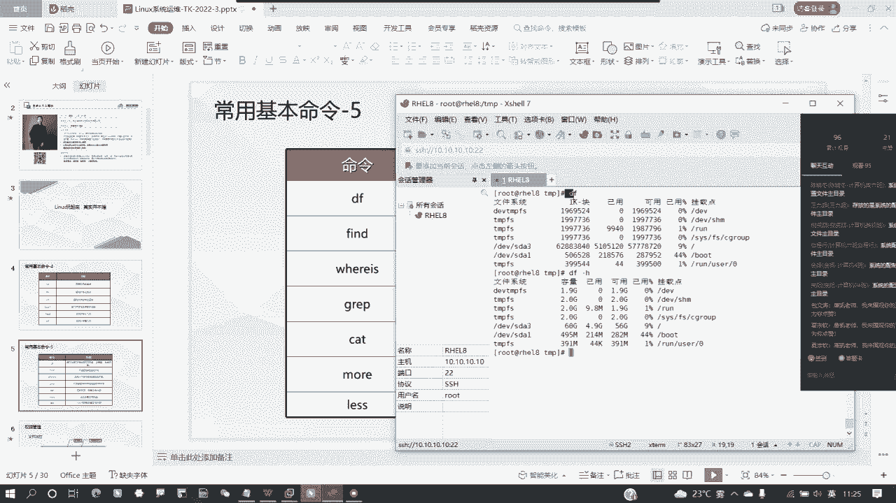

那么接下来啊，那么接下来我们的这个光驱呢，你会看到这里的光盘是这个这个是灰的啊，我举个例子，我把它点击连接好，我把它点击连接，操作失败。

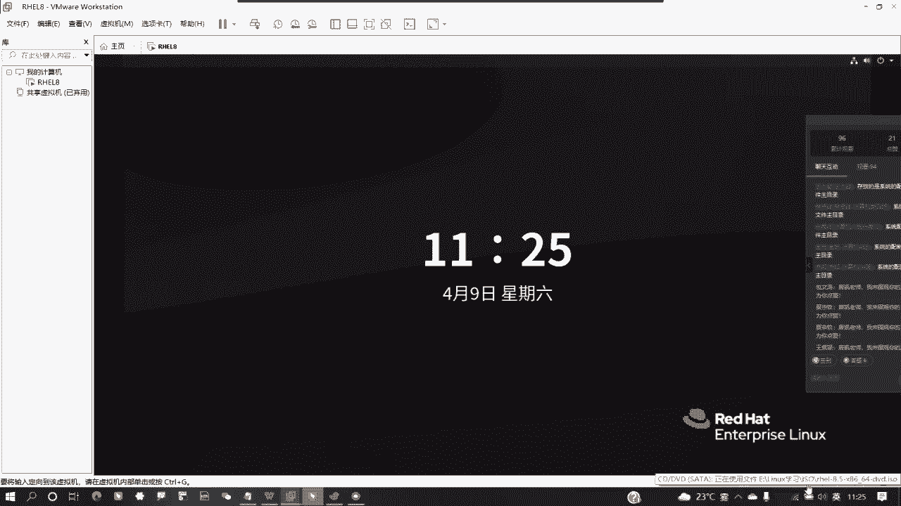

操作失败，什么原因啊，我点一下双击打开选择连接啊，确定欧红嗯嗯，不在不在这个地方吗，我在e盘的这个过程中是吗，我们来看一下啊，是在d盘是吧，好设在这里好选择确定好学区好。

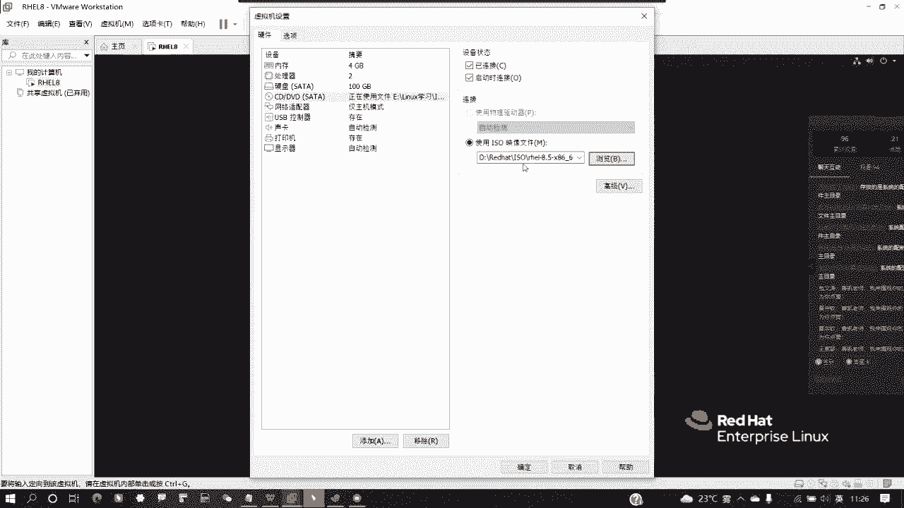

你看我光盘是不是就连接上去了是吧，我的光盘是不是就连接上去了好那么这样连接上去之后呢。

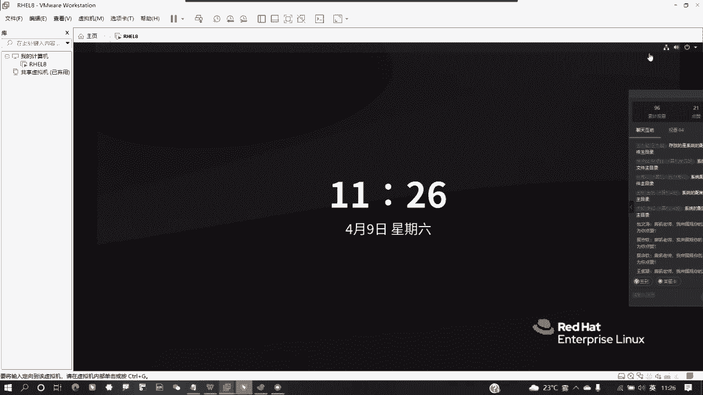

我们再来看到这边，大家看啊，我再来看这边df杠h，你看你笑啊，他这里啊，他这个还暂时还没有显示出来啊，他这个还没显出来，df杠h它应该是默认会放在一个wrong semea。

什么什么什么什么一堆词上面去了啊，可能这个还没有放出来，我这样我重启reboot，我想给大家演示，看到这个效果，大家好啊，reboot重启一下啊，重启一下，重点给大家来稍微说明一下啊，再整个这一块，嗯。

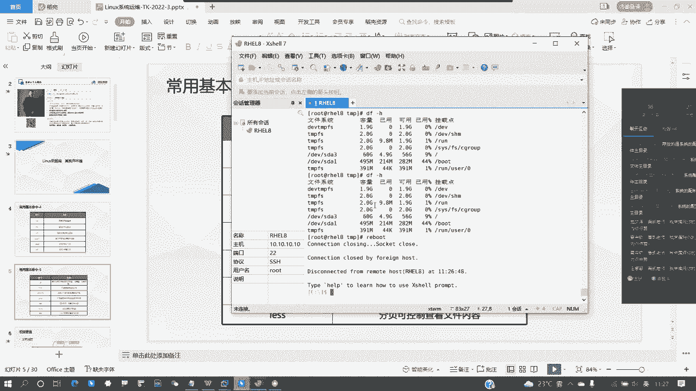

好ok我们再来连一下。

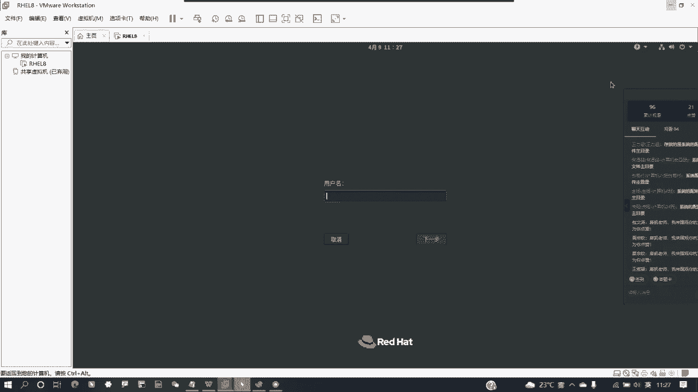

for好，ok连上来了好连上来说呢，我们df杠h啊，看一下哟，嘿还没有显示出来。

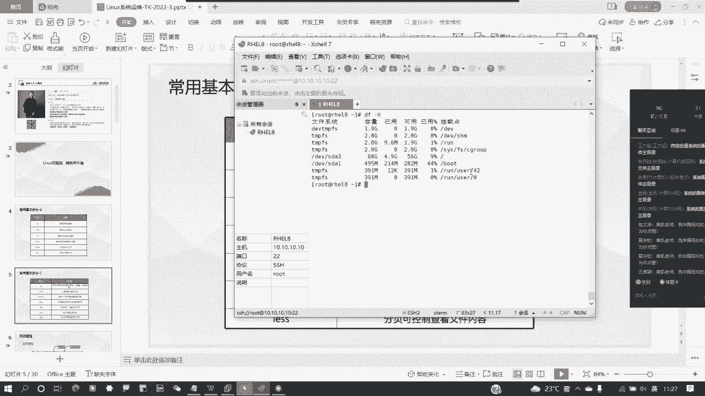

奇了怪了，没显示，我看这个也加载啊。

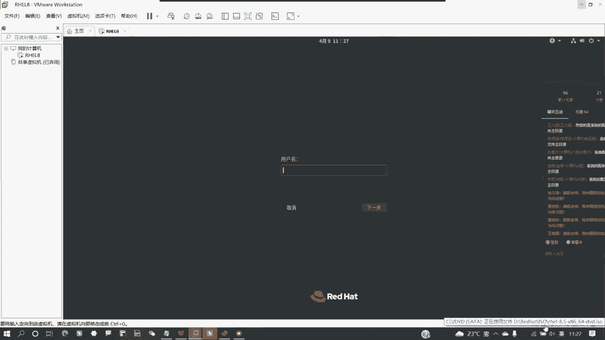

这个是正常加载的，是不是好，没关系啊，没关系好啊，你啊那这样我们放到后面来看啊，放到后面来看df杠h，大家看啊，这里就是用来显示你的挂载信息对吧，显示挂载信息好，接下来呢我们先想到第二个命令啊。

第二个命令ff i n d find find命令是用来干嘛的呢，以这样理解为什么的查找就行了，查找查找什么什么东西，从哪里查找它的格式就很简单，那就是从什么地方查找对，吧，第二个写了从什么地方查导好。

第三有一个参数啊，这这里有很多参数，比如说杠这个lamb就是查找的，就相当于你今天在windows中间查找一下，是不是有一个那个提示框啊，那比如说我今天在这里啊，所谓我今天是不是就会在这里。

是不是有一个比如说啊不是在这里啊。

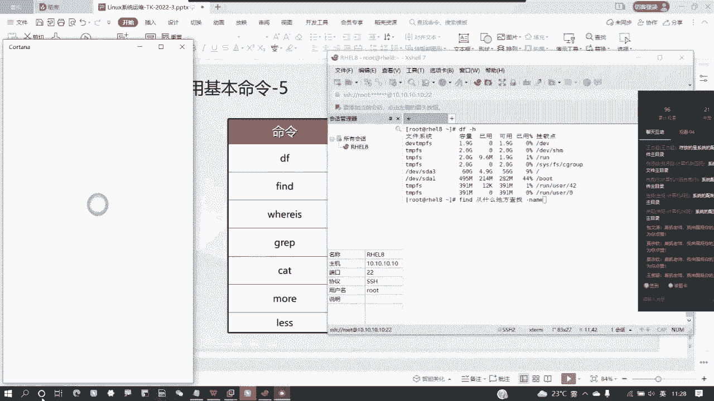

是不是在这里是不是就要在这里输入你要查找的什么内容，是不是一个概念是吧。

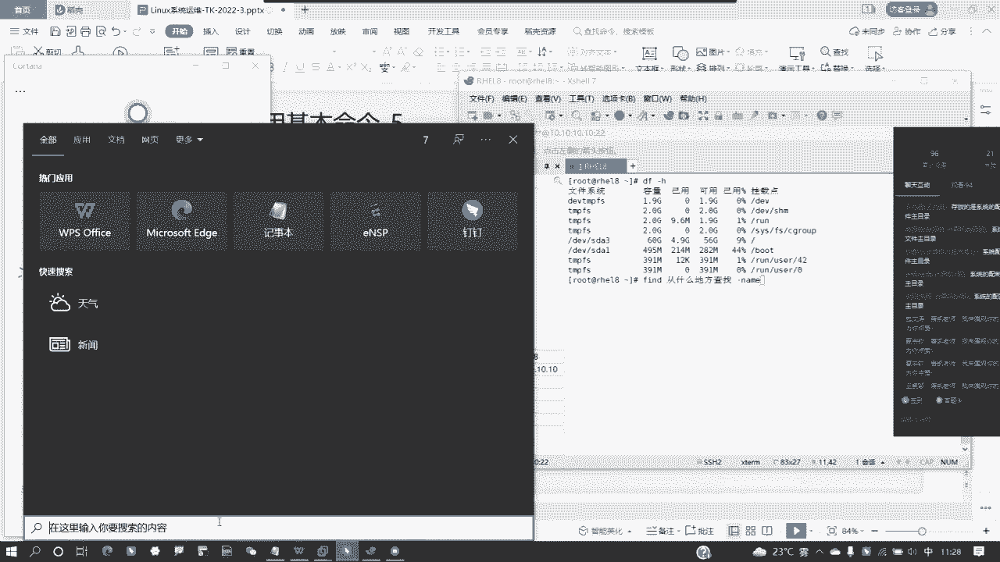

是一个概念嘛，对不对，所以接下来是查什么东西，比如说我想查什么什么什么，你想查这个查就查的结果哈，就查寻的结果就是这样一个过，程啊就是这样一个过程，四个段落啊，第一个命令，第二个是从什么地方查。

第三个固定参数，第四个就是插什么结果就行了，好那么我们套用它，大家注意啊，我们套用它的这个格式，我们判断它的格式，我们再来看，比如find对吧。

我想从当前点是不是当前的意思好查找有没有pass wd这个文件呢，回车查没查出来，各位是不是没有查出来，但是这个mini有没有报错，谁先告诉我有没有报错，没有报错代表着我只不过没有查的结果，为什么。

因为当前下面没有这个pass达d文件是不是好，那么我想查find，etc目录下面对吧，这个目录下面有没有这个文件呢，回车你看是不是就给你把这个文件找出来了，他告诉你这个文件在两个目录中间都有。

一个是判定d里面有一个是e t c下面直接就有hod好，这个能听懂吗，这个格式就是这么来写啊，这个格式就是这么你照这个格式来是不是就可以收拾他，那我能不模糊啊，模糊查询可不可以呢，可以啊。

b比如etc下面我想查所有的一什么呀，点com结尾的或者点什么是吧，点c o n f结尾的的文件全部搜出来，各位可以啊，你就这么来做就行了，你看，回车是不是把所有的这种点com结尾的全部给找出来了。

是不是全部给你找出来了，是不是是不是就这个命令了，是不是就这个命令，对吧就这么定了啊，对你们清不清楚，其实今年考红帽的cc超级超级简单，各位有一道原题，这道原题是什么，是什么意思，还是这样的一大原地。

他说各位听好啊，他说创建一个啊这个root下面的啊，比如说ff i n t find fails的一个文件夹啊，文件夹它是啊，它这样的啊，然后什么意思呢啊就是呃然后通过搜索啊，sorry通过搜索是吧啊。

用户啊，这个举个例子输出，举个例子啊啊通过搜索这个用户是吧输出，然后什么呢啊将啊将所有的这个什么呀输出the sorry的文件怎么样啊，这个，存放啊就应该说比较复制啊，复至道主个定式复制到该目录中。

那就是这个就是这是个原题啊，这是个原题，我现在直接告诉你，这就是个原题啊，这就是原题，他怎么弄呢，他怎么弄呢，创建一个root下面find the file对吧，文件夹通过搜索某个用户是吧。

将这个文件复制到该目录中间好，那我们把这条这个这个作业啊，我们一起来做一做啊，一起来做一做，这个十分呢各位十分啊，总分300分啊，总分300分，这一题十分很简单，各位你只需要知道。

首先第一个我们在上一次是不是讲过通过root下面去创一个，当然你不要创建错了，很多人说哎我差一个f o n d什么什么，那不好意思，什么就丢，那是怪你自己是吧，你没有按照题目要求来是吧，创建文件夹好。

那既然是创建完之后，你是不是要在整个系统中间去搜索这个用户的文件了，那整个系统最大的这个目录是什么目录啊，各位我们之前讲过整个系统之间最大的目录是什么目录，是不是就是跟了，是不是就是跟那不直接取。

直接就是什么一根呢，对不对，好，接下来本来是glamb的，但是因为在这里我们指定了用户，是不是，那么我们把这个lamb呢先把它移掉，那应该是什么呀，是杠user指定用户对吧，用户哪个用户输出这个用户。

然后做什么操作呢，做ex是ex e c复制的操作，为什么呢，copy所有啊，a代表所有的意思啊，is，啊刚刚这个参数忘忘讲了，当然这里有个符号也没说大括号，就是把所有东西全部复制复制过去啊，复制过去好。

然后复制什么呢，复制法律复制到root下面的什么呀，b fs这个里面去对吧，看到bs里面去，但是接下来大家注意这里有一个啊叫做啊叫啊叫做什么呢，就是呃反的一个通配符的符号啊，也是反斜啊，分号结束。

如果说大家对开发编程这一块所了解大家都很清楚，就是什么呀，就是转移的啊，转移符号把这个加上去，好，回收就行了，他就给你再找，看到，没有他就给你再找，但是很多人说诶你这报错了呀，你报错了呀，啊正常没事。

为什么呢，因为大家注意啊，当然你这里可以不用呃，你可以不要说杠a你可以杠杠什么呀，杠那个刚刚我们之前讲过了，是不是啊，或者a什么r是不是都行了，将复目录，因为我这里没有带r。

所以它导致这个目录没有复制过去，是不是啊，没有复制过去好，那么请大家记这里为什么会报错，是因为你是内存中啊，plc我们是不是讲过内存中间记录，对不对，那你没有过去是正常的啊，没有过去是正常的。

它只是内存内，存东西是不可能随便动的啊，不可能随便动的好，这个时候我们来看一下啊，这个时候我们来看一下我们到底有没有呢，cd root下面的什么，find the file，看是不是都过来了。

是不是里面有内容了，这题十分你就拿到了，这一题十分你就要拿到了，就这么简单，就这么简单，就这条命令，然后呢，在这里你就加一个什么r是不是就够了，把目录是不是也复制过去，是不是就够了，十分的各位超级简单。

对不对，那考试的时候可能不是这个用户嘛，考试的时候有可能是i i a呀，叫什么mary啊，真的ta呀是吧，叫，一个其他什么名字，你只要把这个名字替换是不就够了，就这么简单就这么简单啊。

find就讲完了啊，f i n d就讲完了，对吧好，where is，我们之前是不是讲过，where is ais告诉你这个命令在什么地方，是不是呢，帮助信息在哪里是吧，where is，我们就不讲了。

好不好，我们就不讲了，接下来grape大家注意这里筛选筛选的意思，把它这个标注的时候调整，你啊叫筛选的意思，好不名思义，何为筛选嘛，顾名思义，何为筛选的筛选，是不是前提我需要有一个更大的一个池子是吧。

更大的一个目标客户群体，我才能在这个目标群体中间才能去做筛选，否则你哪里来筛选，是不是，比如说诶我选美是不是啊，我要求所有的女孩子是吧啊，年龄在什么呀啊18周岁对吧，到22周岁。

这个之间身高要多少多少啊，体重要多少，三维要多少，我是不是必须得有一个大的一个逻辑概念，是不是才会有筛选的一个后面的数字上查不出来，是不知道，所以如果你能理解筛选一个大的概念，那我们来理解。

一下刚刚我们抄的这条命令b啊，find从根或者从etc上面是吧，lamb paw，我们刚刚是不是看到有这两个，是不是，那我现在通过筛选什么，将来呢，大家看了刚刚也讲也说了，管道符是不是好，那我们这样来。

首先l s将所有的etc查一遍，l s e t c是不是就列出a c c上面所有文件了，是不是，然后将结果就是前面这个命令肯定是成成功的，将这个结果通过管道的形式传给什么呀，后面将所有都读了一遍之后。

然后将结果交给筛选，筛选一下有没有这个文件出来，是不是就能筛选出来，有没有，但，是它和这个展是不是不一样的，展示是直接能告诉你这个路径，但是这里只是告诉你有没有听明白，有没有能理解这句话了对吧。

它是这样一个概念啊，它是这样的一个概念，叫做筛选的意思啊，就筛选意思好，那现在是这样了，我们来看cat，那我既然cd，那不是更简单吗，我本来是cat是不是查所有的内容对吧。

那我想care一下中间有没有一个叫输出的用户呢，有是不是就把这一行给筛出来了，这不是这样的一个结果吗，这不是这样的一个结果吗，是不是的，对不对，就这么简单了对吧，就这么简单了。

ok好刚刚讲到了cat是直接什么呀，将整个文件qr刷一遍的是吧，cat对不对，好，接下来moon是什么意思呢，好我们来回到刚刚那个最大的文件里去，这个文件可能好理解一点点对吧，比如说wc杠什么呀。

l message 11133行，你看你要增加了这么多日子信息了，对不对，好，我们刚刚讲了had讲的tell对吧，那么同时讲了cat了，那么代表什么意思呢，它是这样的，它是一页一页的翻。

首先打开这头也好，连按空格看到没有，它是一页一页的翻，看到没告诉你你翻了多少，是到了百分之多少的，但是你，要这样翻是不是就很痛，它像翻书一样的翻书一样，一页一页一页一页一页这样翻对吧。

那你放到河流和1月去了呢，对不对，但是如果你要查查一下配置说明的时候啊，配置信息的时候，那你当然用木是最方便的，为什么它是一页一页的，一页一页的来读这个书是一样的好，那我想关掉它怎么办。

你直接在这个界面中按q啊，直接按一个键盘上面的q就行了，回车哦，不是你直按q它就出来了，直按q就quite的那个意思，就直接串了，那less less less message。

你看less message它就是什么呢，它同样，但是它没有这种这种概念，什么意思呢，你按空格，它相对是mod这种这种做翻译好，那就用cat就是呃呃呃就less就相当于什么呀，它可以按你的这个键盘。

什么意思呢，就是你翻书诶，你看到后面去了，但是你发现诶我前面可能某些地方我忘了，是不是又可以翻回来，但是翻回来的时候moon就达不到了，那cat更不用说cat就是初二以下全部瞬间记忆的概念，懂我意思吧。

less就，可以翻到后面就可以翻到前面来，这种概念好，按q就出来了，按q就出来了，听明白，按q就出来了啊，这是cat moonless，a cat moonless，那刚刚我们也讲到了什么n l是吧。

我们也讲的n l好，这几个我不太清楚，讲到讲了这一版之后，大家是否能理解啊，是否能能能明白好，那么我们接下来再讲一个，各位这个不在我们pp中间五，临时加上来叫mo，大家把它记一下，叫挂载的意思。

叫挂载的意思，mood就挂载的意思，mot amount，sorry，mount mount挂载的意思，好这个什么意思呢，相需要挂载的，这个这个这叫什么意思呢，就需要挂载的物理设备应该是应该是这个。

因为我们现在是是是没有物理的，因为我们是用虚拟机，就是大家理解中间就是将需要挂载的物理设备后面空一个，就是挂载到的逻辑点啊，这个点可以逻辑这种啊，目录你可以这样理解啊，就就是逻辑点上面去啊。

这是这样一个格式啊，就是这样一个格式，听明白就是这样一个格式，好所以我们今天df sorry，我们今天df杠h我们可以看到我们默认情况下面是这样的一个结构，对不对，好，接下来各位看好了。

mount o u n t mount，对吧好，接下来第1v是不是设备设备，我们之前讲过，在这个设备中间，我们是不是有seo，是不是代表光驱，还记得吗，或者说我们这个设备还有一个叫法叫什么l l。

大家注意l l l d v cd rom是不是它还指向s20 还记得吗，也就是说你挂它或者挂dv线，s20 是不是都代表光驱好，所以mt dv下面的cd rom或者s20 都行，好挂到什么地方。

挂到什么地，方我想问一下各位挂到什么地方，大家清不清楚，我要挂到什么地方，来大家告诉我，我要挂到什么地方，看有没有同学能理解我要挂到什么地方，我们在上次课程的时候，我们讲过诶，media很好。

media我们在上次讲的media是什么，是系统自动挂载目录，是不是media，对不对，那么还有一个目的是什么，还有一个目录是什么，对很好，m n t mount对吧，m n t好。

所以我是不是可以把它手动挂载到mt里面了，是不是的好，选择回车，选择回车好，你看这里有个提示说啊，这个设备是什么呀，这个啊就说白一点就是这个设备是读写，但是呢呃我挂载上来的权限是只读的对吧，是只读的好。

我们再来看df杠h，你看是不是挂上来了个新设备，是不是挂上了一个新设备，和上面来看来做个对比，是不是挂上了一个新设备，那么我说白一点，我今天进mt所看到的内容是不是就是我光盘的那个内容。

是不是的能听懂了吧，就是我，光盘的内容，但是我能不能在这里去tch一个aa的文件，不成功啊，不成功啊，为什么，那当然不成功了，是因为什么呀，因为你的光驱光盘是只读的responding的。

听明白是写不了的，听懂哦对吧，你可以去读，你可以去用，但是你不能往里面写，对不对，好这是挂载，那我要卸载怎么办呢，大家听好啊，卸载你必须要移移除，就是一必须要在这个目录以外，就像你像u盘一样。

你插了个u盘，你正在使用这个u盘，你是不是根本拔不掉啊，所以你是根本拔不掉的，比如说我们的画的是mount，对不对，卸载大家能看到我刚刚挂载的这个命令吗，是吧，将什么设备挂到什么目录，但是我再说一遍。

你不能这样做啊，你不能这样做，你要这样做就死定了，我在我在上课课程的时候，是不是也讲过，对不对，如果你要这样做，就代表什么意思啊，你直接把根给覆盖，了是吧，直接把根给覆盖了啊，我已经讲了很多遍了。

是不是的好，所以接下来卸载叫emt幽默的时候呢，你只需要写其中一个，你要么写他要么写他都成功啊，都成功，就是卸载一样的，现在你只需要写一遍嘛，是不是好，所以你现m t也行，但是你发现它显示是busy。

什么意思啊，忙啊为什么，为什么，因为你正在这个目录里面是不是正在做事情啊，所以干嘛移出来在一个非工作的目录中间去听明白对吧，非工作目录中间去，然后再来就成功了，你再看df概率h是不是就没了。

是不是就没了，听明白，是不是就没了这一行了，是不是对，吧就这么简单了，就这么简单，ok就这么简单，好嘞，好那再回到我们刚刚的，再回到我们刚刚的那个要求中间去cd到time这里来。

i am gf新号copy，大家注意啊，今天中午的作业pass up地点复制了一个文件过来了，是不是啊，好这个文件中间n l pass up d要求大家将第20行到第30行的内容啊。

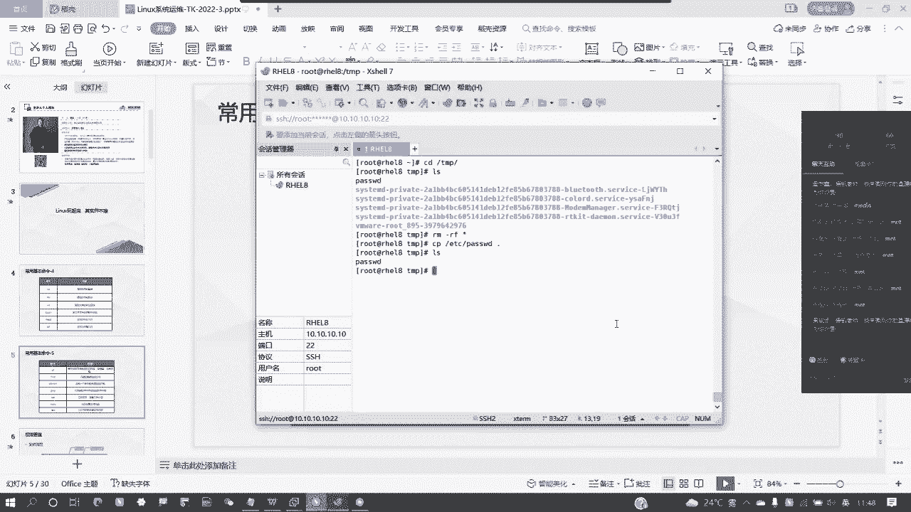

大家注意将第20行到第30行内容啊，给我显示出来，其他行我都不要啊，其他行我都不要，我只要求你的那个文件里面的第20行到第30行的内容，给我显示出来啊，给我写出来，就一条命令我只需要一，条命令啊。

一条命令将我的第二层到第30条内容给我写出来，就这么简单，好吗，这是今天中午的啊，注意啊，随唐的作业好不好，那下午两点钟的时候，我希望大家如果做出来的同学呢就可以啊，这个单发我也好是吧。

然后那个这个呃上课的时候，你这个我也一开始我就会问到好吧，那大家也可以把这个答案这个这个展示给我看啊好吗，那今天上午的内容我们就告一段落啊，今天上午内容我们就告一段落，因为讲了两版。

我希望大家能消化一下啊，你们消化一下好不好，那我们下午的时间我们继续啊，我们下午时间继续好吧。