# Linux基础入门教学：5：基础命令进阶与系统管理


在本节课中，我们将要学习一系列进阶的Linux基础命令，包括文件操作、系统信息查看、日志管理和设备挂载等核心技能。通过掌握这些命令，你将能够更高效地管理Linux系统。

## 回顾与连接准备

上一节我们介绍了Linux的基本目录结构和一些初级命令。本节中我们来看看如何连接系统并深入学习更多实用命令。

首先，确保你的Linux虚拟机网络配置正确。使用 `ifconfig` 命令可以查看当前系统的网络接口信息。

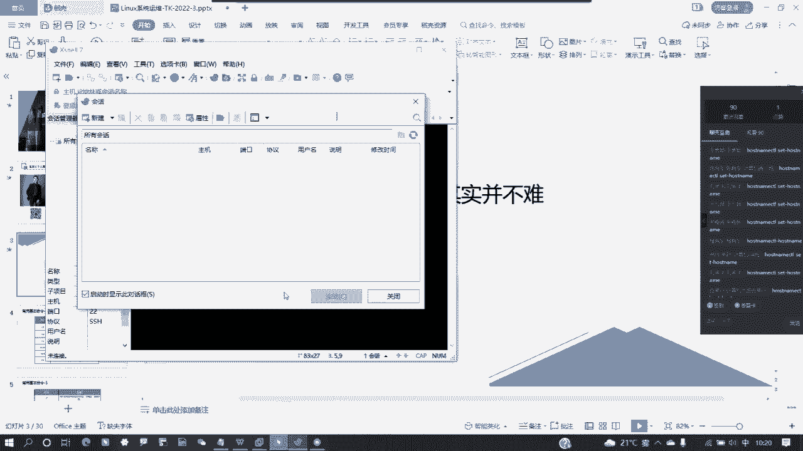

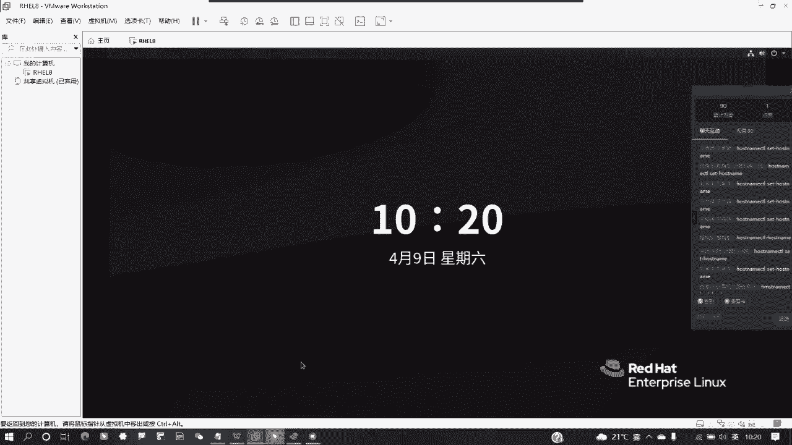

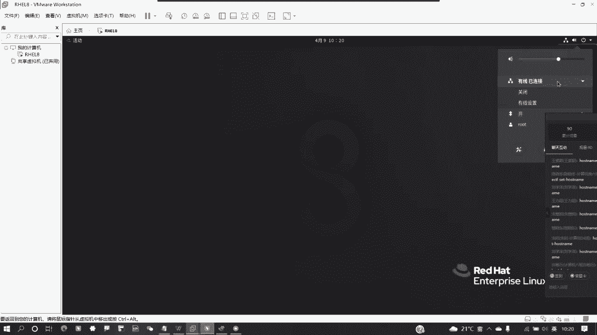

**代码示例：查看IP地址**
```bash
ifconfig
```

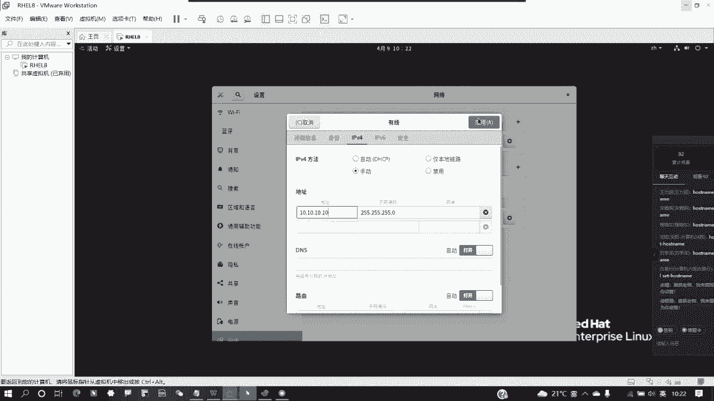

在Windows系统中，查看IP的命令是 `ipconfig`，而在Linux中是 `ifconfig`。如果网卡信息没有显示，可以通过图形界面开关网络连接，或使用命令重启网卡。

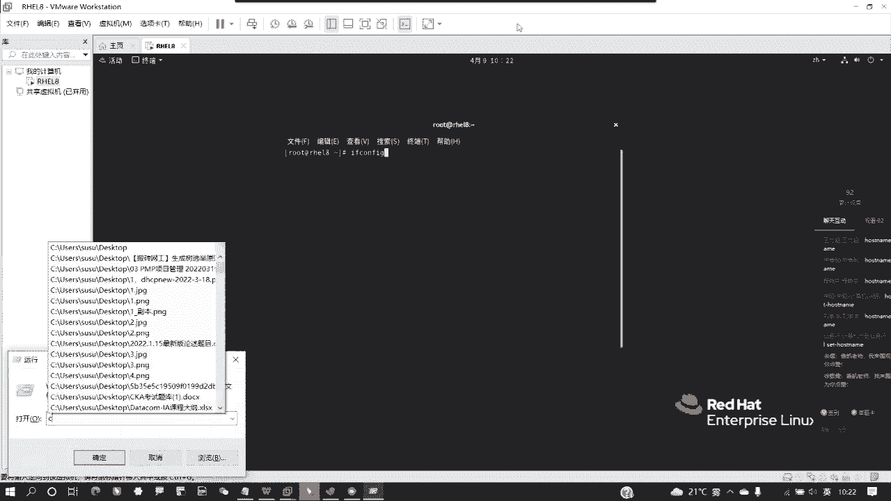

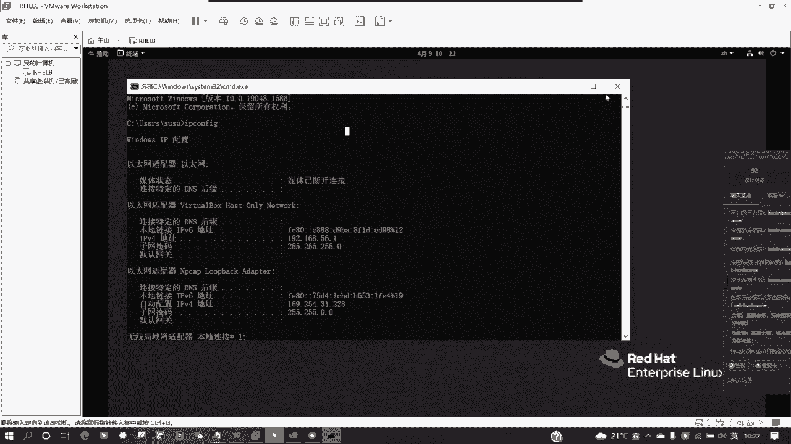

**代码示例：重启网卡**
```bash
ifdown ens160; ifup ens160
```
这条命令使用分号 `;` 连接，表示依次执行 `ifdown`（禁用网卡）和 `ifup`（启用网卡），相当于快速重启网卡使其配置生效。

获取IP地址后，即可使用Xshell等工具进行连接。如果连接时提示缺少组件，可能需要安装 `Xmanager` 来确保连接稳定。

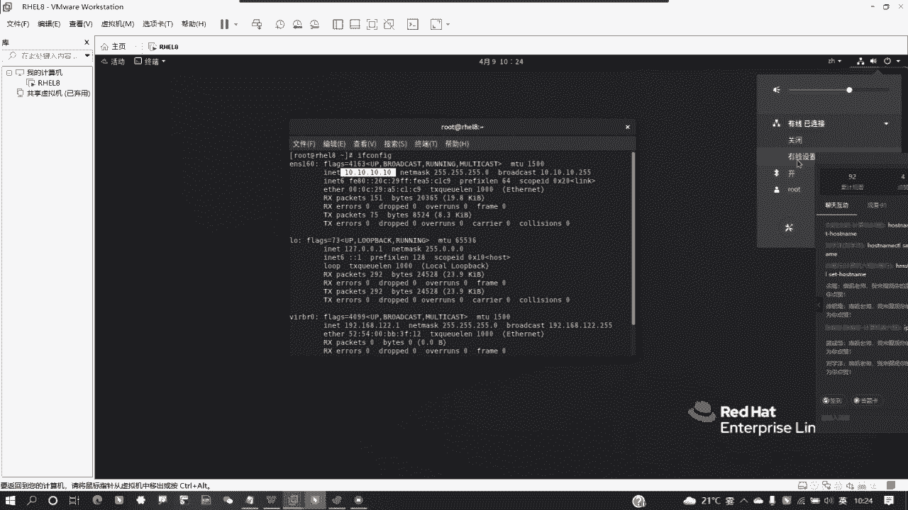

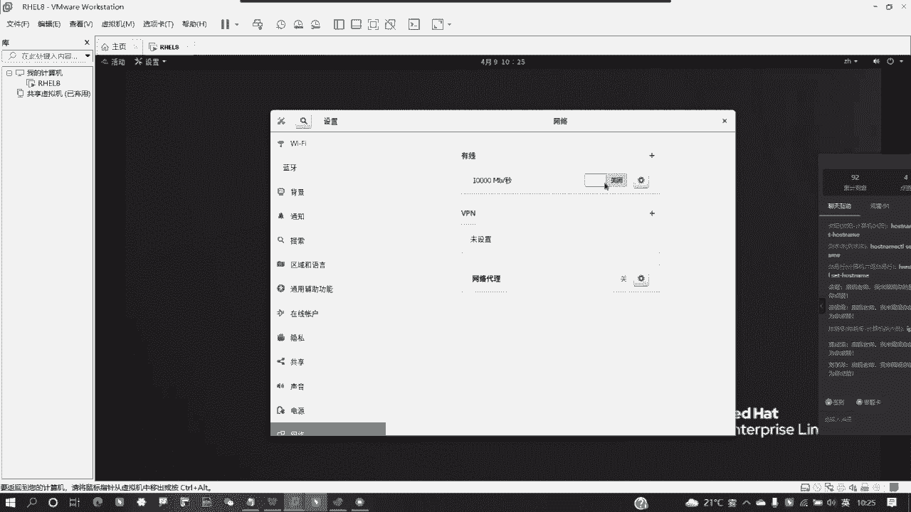

## 文件操作命令详解

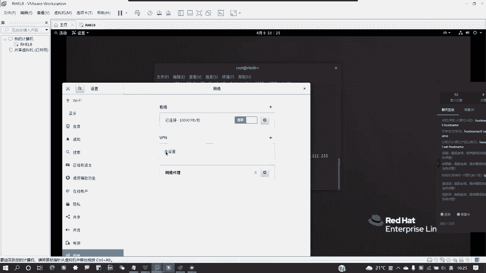

上一节我们学习了创建和删除目录。本节中我们来看看文件的复制、移动和删除。

### 复制命令 `cp`

`cp` 命令用于复制文件或目录。

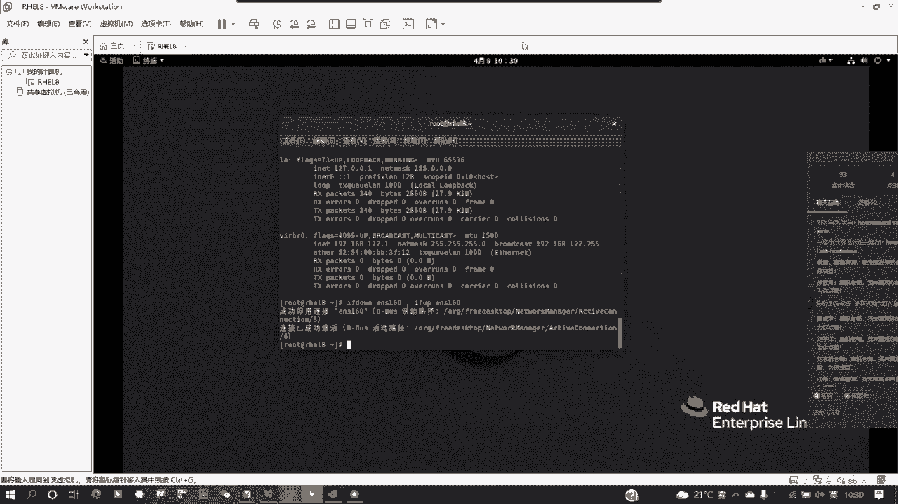

**代码示例：复制文件并重命名**
```bash
cp /root/原文件名 ./新文件名
```
这条命令将 `/root` 目录下的“原文件名”复制到当前目录，并重命名为“新文件名”。

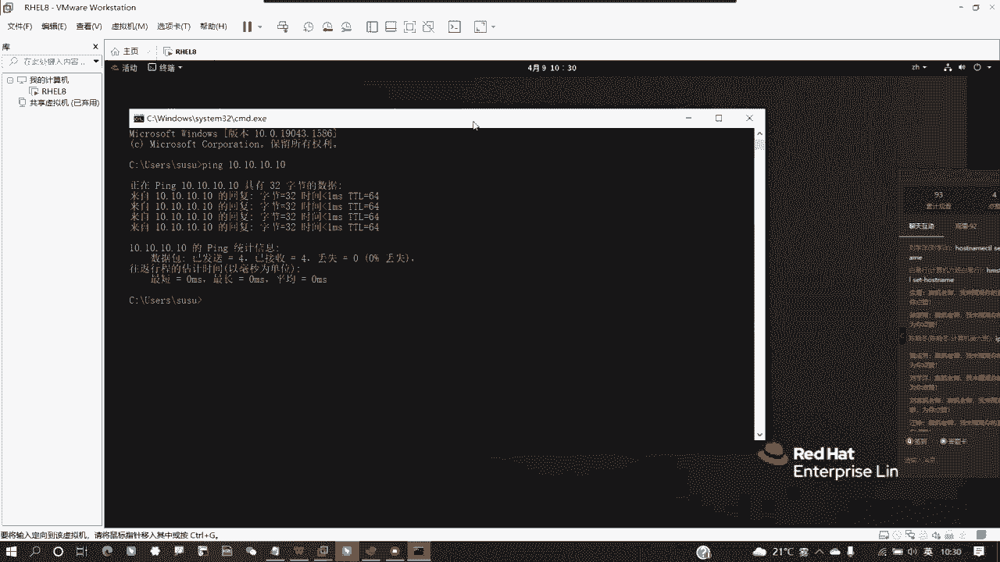

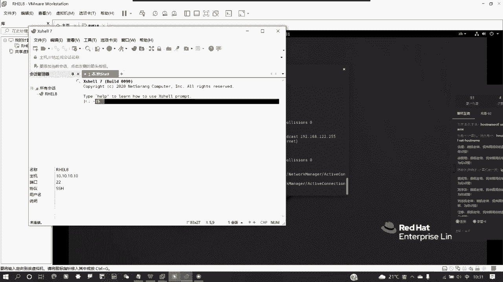

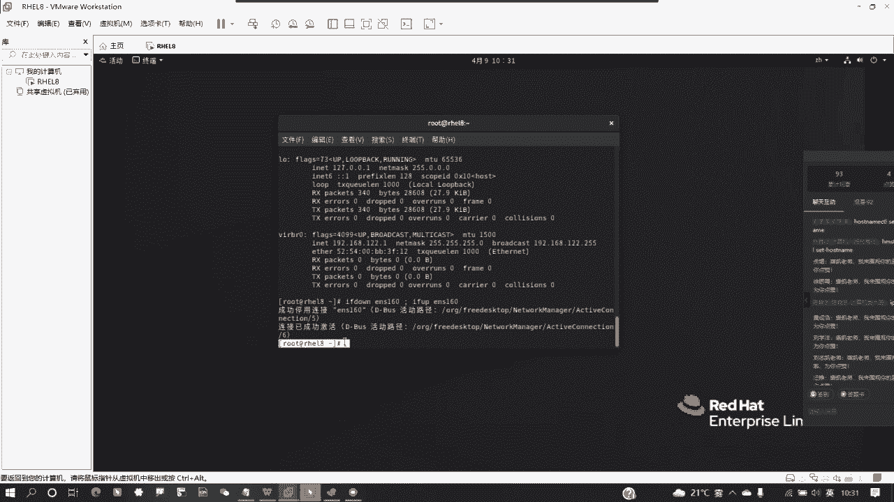

默认情况下，`cp` 只能复制文件。若要复制目录及其所有内容，需要使用 `-r` 参数进行递归复制。

**代码示例：递归复制目录**
```bash
cp -r /root/test ./
```

为了在复制时保留原文件或目录的权限属性，可以结合 `-p` 参数使用。

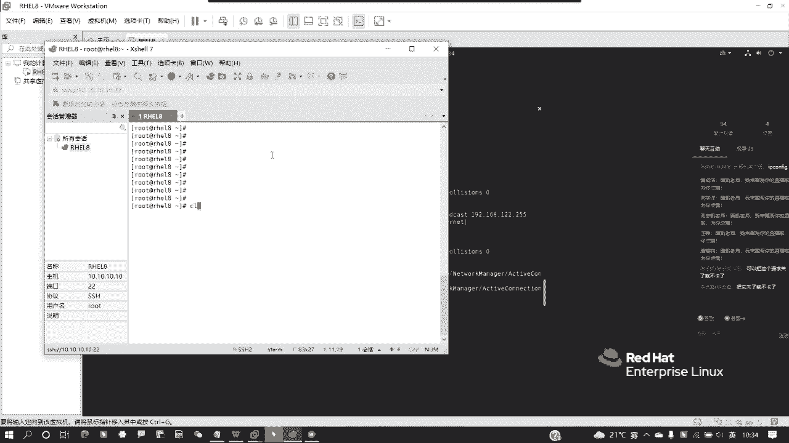

**代码示例：保留权限复制目录**
```bash
cp -rp /root/test ./
```

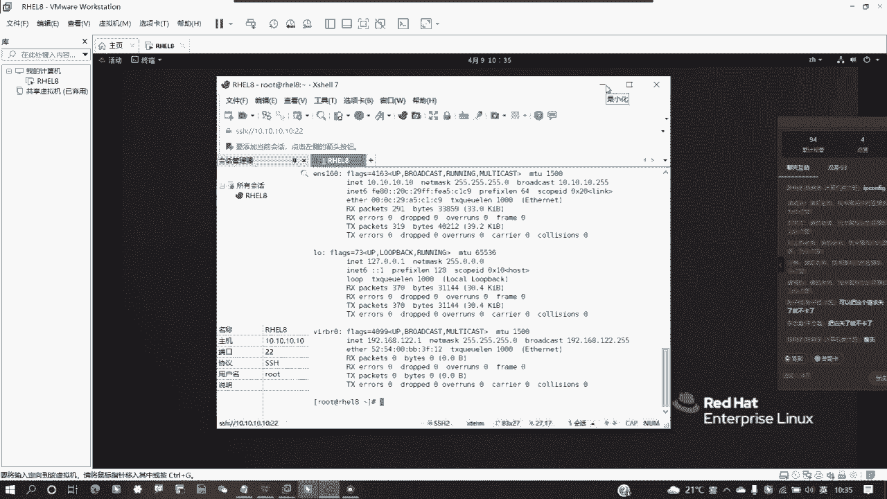

### 移动/重命名命令 `mv`

`mv` 命令用于移动文件或目录，也可用于重命名。

**代码示例：移动目录**
```bash
mv /root/test ./
```
此命令将 `/root/test` 目录剪切到当前目录。如果目标位置是当前目录下的一个新名称，则实现重命名功能。

### 删除命令 `rm`

`rm` 命令用于删除文件或目录。删除目录时需要 `-r` 参数，`-f` 参数表示强制删除不提示。

**代码示例：强制递归删除目录**
```bash
rm -rf test/
```
**注意**：`rm -rf` 命令非常危险，执行前务必确认路径，避免误删重要数据。

## 文件查看与时间管理

### 创建文件与更新时间戳 `touch`

`touch` 命令有两个主要作用：
1.  当文件不存在时，创建一个空文件。
2.  当文件存在时，更新该文件的时间戳为当前时间。

**代码示例：创建空文件**
```bash
touch aaa
```

**代码示例：更新文件时间戳**
```bash
touch aaa
```
执行后，文件 `aaa` 的“最近访问时间”和“最近更改时间”等时间戳信息会被刷新。

使用 `stat` 命令可以查看文件的详细时间戳信息。

**代码示例：查看文件时间戳**
```bash
stat aaa
```

### 查看文件内容 `head`, `tail`, `cat`, `nl`

以下是查看文件不同部分内容的命令：

*   `head`：默认查看文件头部10行。
    *   `head -n 15 文件名`：查看头部15行。
*   `tail`：默认查看文件尾部10行。
    *   `tail -n 15 文件名`：查看尾部15行。
    *   `tail -f 文件名`：实时追踪文件末尾的新内容，常用于监控日志。按 `Ctrl+C` 退出。
*   `cat`：一次性显示整个文件的所有内容。
*   `nl`：显示文件内容并附带行号。

系统日志通常存放在 `/var/log/` 目录下。例如，`/var/log/messages` 文件记录了系统全局和安全相关的日志。

## 管道符与命令组合

管道符 `|` 可以将前一个命令的输出结果，作为后一个命令的输入。这是Linux中组合命令、进行复杂操作的强大工具。

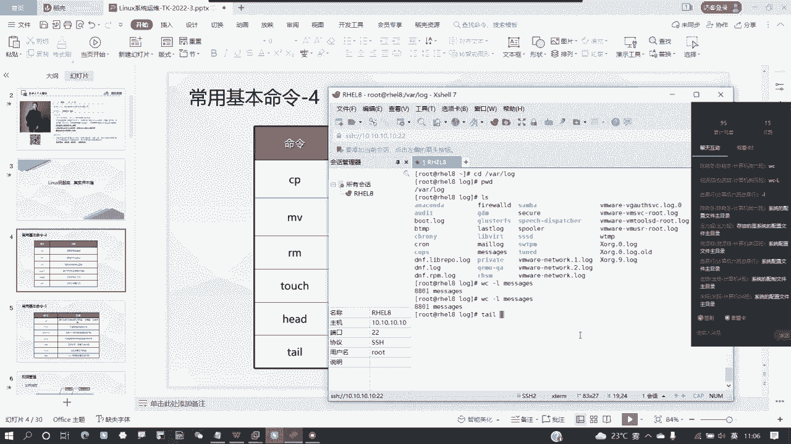

**概念公式：**
```
命令A | 命令B
```
**含义：** 将命令A的执行结果，传递给命令B进行处理。

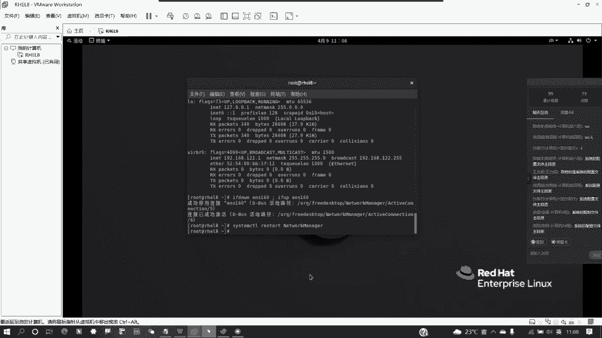

## 系统信息与查找命令

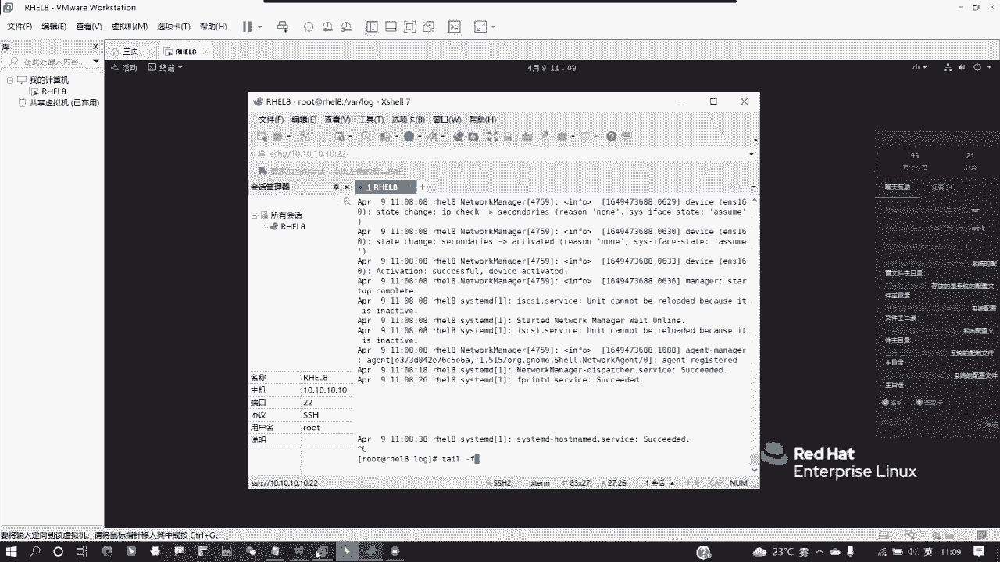

### 查看磁盘挂载 `df`

`df` 命令用于查看文件系统的磁盘空间占用情况，即挂载信息。`-h` 参数以人类易读的格式（如K, M, G）显示大小。

**代码示例：查看挂载信息**
```bash
df -h
```

### 查找文件 `find`

`find` 命令用于在指定目录下查找文件。

**命令格式：**
```
find [路径] [参数] [查找条件]
```

**代码示例：在/etc目录下查找所有.conf结尾的文件**
```bash
find /etc -name "*.conf"
```

**代码示例：查找属于特定用户的文件并复制**
这是一个综合应用示例，模拟了常见的管理任务：
```bash
find / -user 用户名 -exec cp -a {} /root/find_files/ \;
```
*   `/`：从根目录开始查找。
*   `-user 用户名`：查找属于该用户的文件。
*   `-exec ... \;`：对找到的每个文件执行 `cp -a` 命令进行复制，`{}` 代表找到的文件，`\;` 是命令结束符。
*   `/root/find_files/`：目标目录。

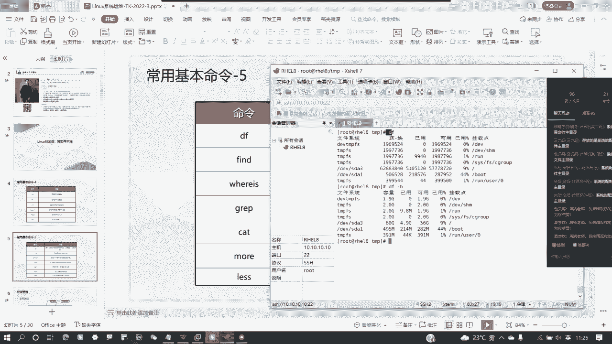

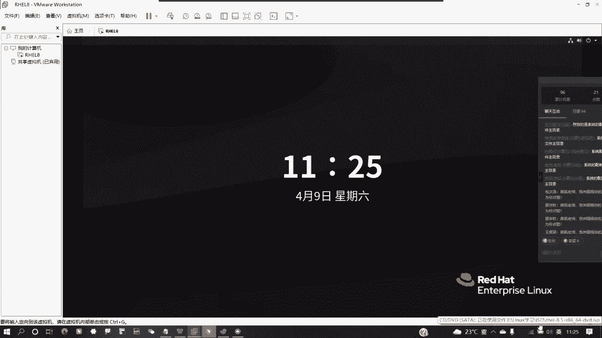

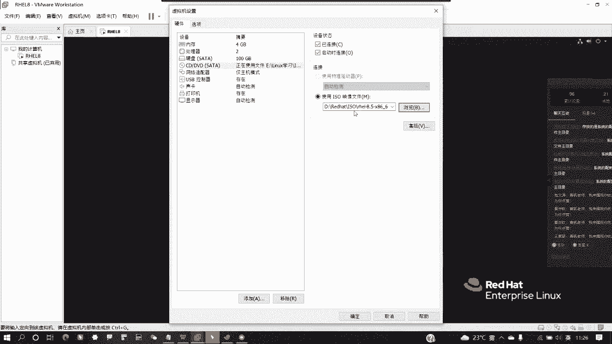

### 筛选内容 `grep`

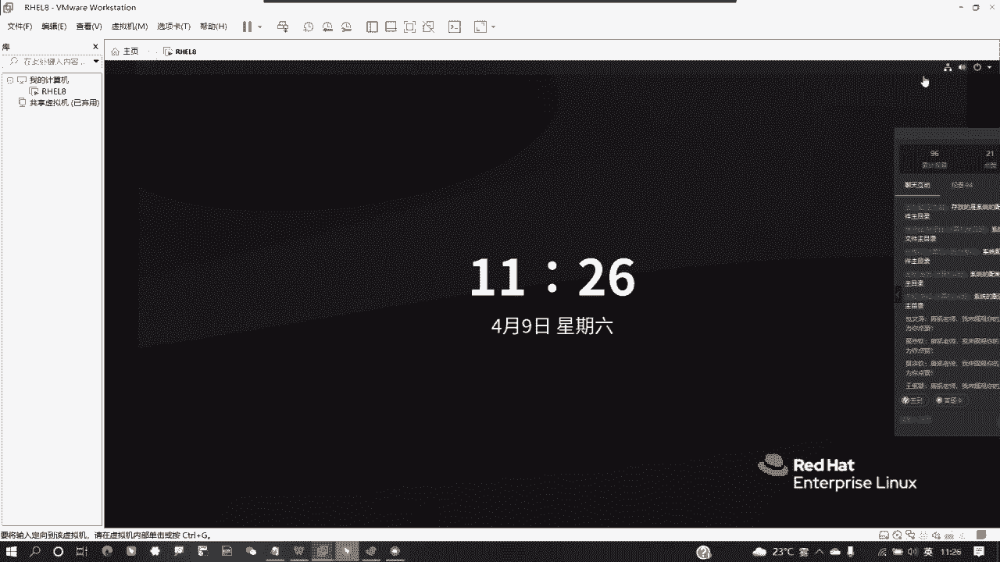

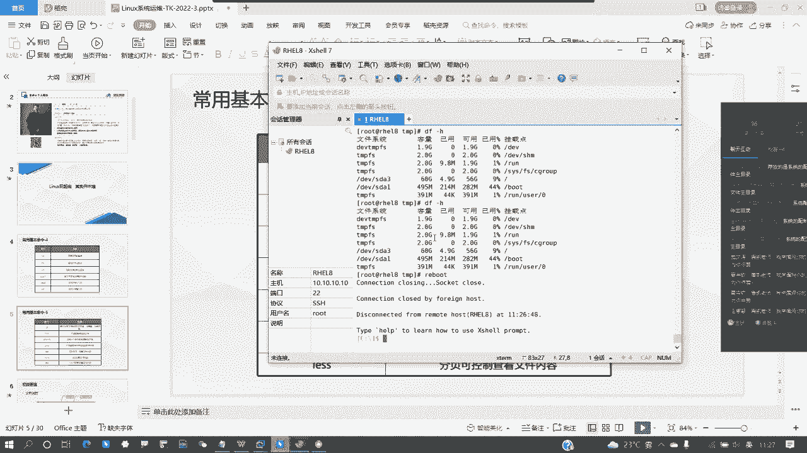

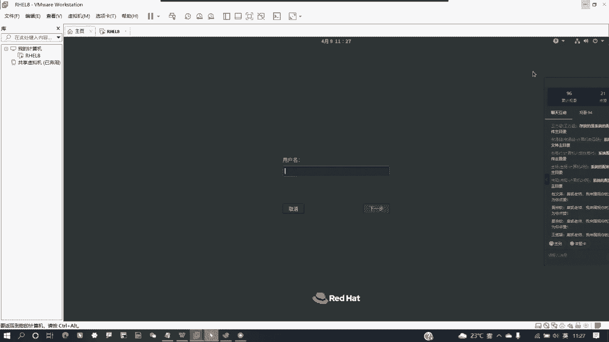

`grep` 命令用于在文本中筛选包含指定模式的行。常与管道符 `|` 结合使用。

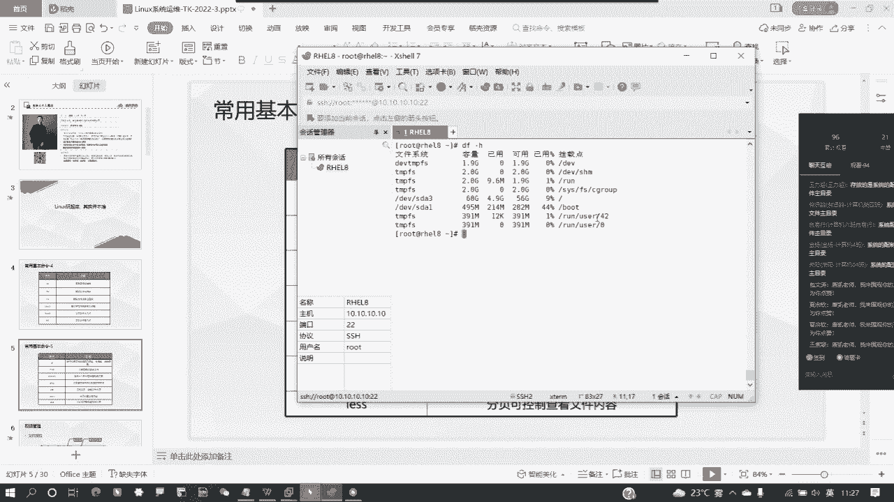

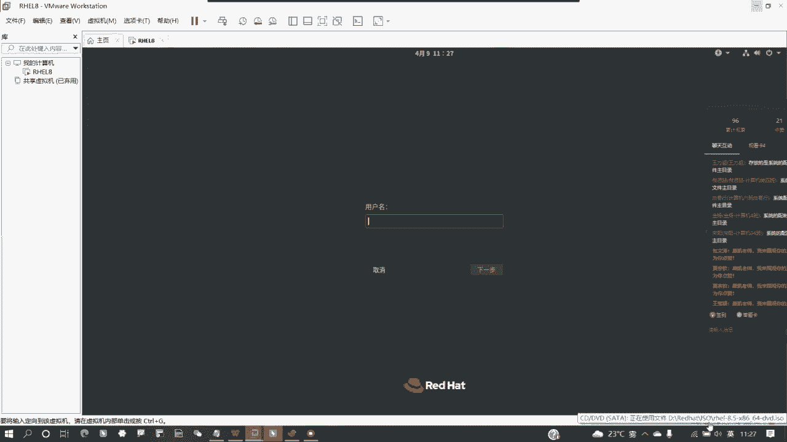

**代码示例：筛选包含“root”的行**
```bash
cat /etc/passwd | grep root
```
这条命令先显示 `/etc/passwd` 文件所有内容，然后通过管道将结果传递给 `grep`，最终只输出包含“root”字符串的行。

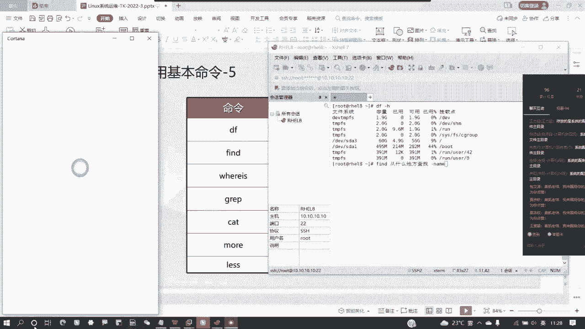

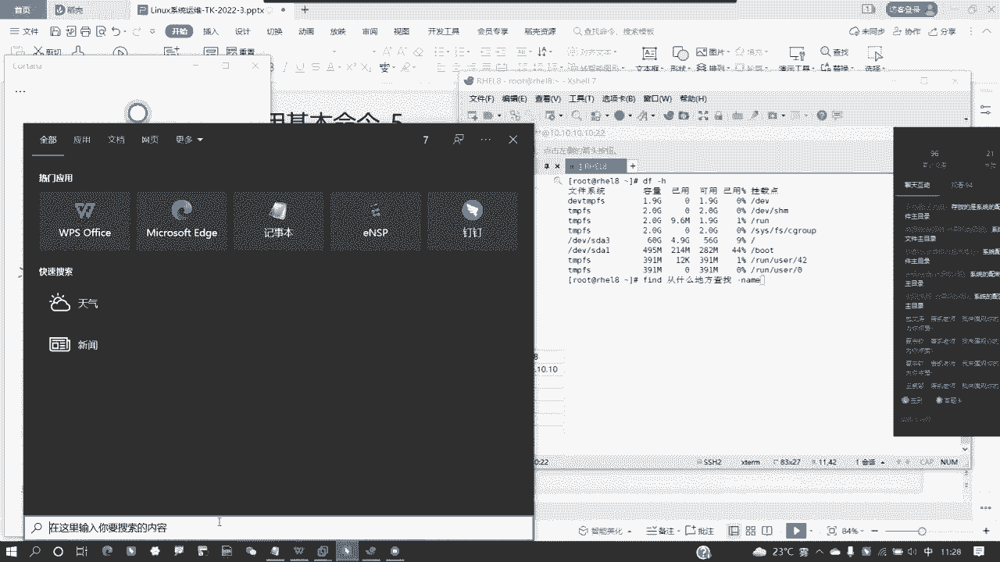

## 分页查看与设备挂载

### 分页查看文件 `more` 和 `less`

对于内容很长的文件，使用 `cat` 会瞬间刷屏。`more` 和 `less` 可以分页查看。
*   `more 文件名`：按空格键向下翻页，无法回看，按 `q` 键退出。
*   `less 文件名`：按空格键向下翻页，按 `PgUp`/`PgDn` 或上下箭头可来回翻看，按 `q` 键退出。

### 挂载与卸载设备 `mount` / `umount`

`mount` 命令用于将存储设备（如光盘、U盘）挂载到系统的某个目录，以便访问其中的文件。

**挂载命令格式：**
```
mount [设备文件] [挂载点目录]
```

**代码示例：挂载光盘**
```bash
mount /dev/cdrom /mnt
```
挂载后，访问 `/mnt` 目录就相当于访问光盘内容。光盘通常是只读的。

**卸载命令格式：**
```
umount [设备文件或挂载点]
```
**重要**：卸载时，必须确保没有在挂载点目录或其子目录中进行操作。

**代码示例：卸载光盘**
```bash
cd /  # 先切换到非挂载点的其他目录
umount /mnt
```

## 随堂练习

现在，请完成以下练习来巩固所学知识：

1.  将 `/etc/passwd` 文件复制到你的当前目录。
2.  使用一条组合命令，仅显示该文件中第20行到第30行的内容。
    *   **提示**：结合 `nl`、`grep`、`head`、`tail` 和管道符 `|` 来实现。

## 总结

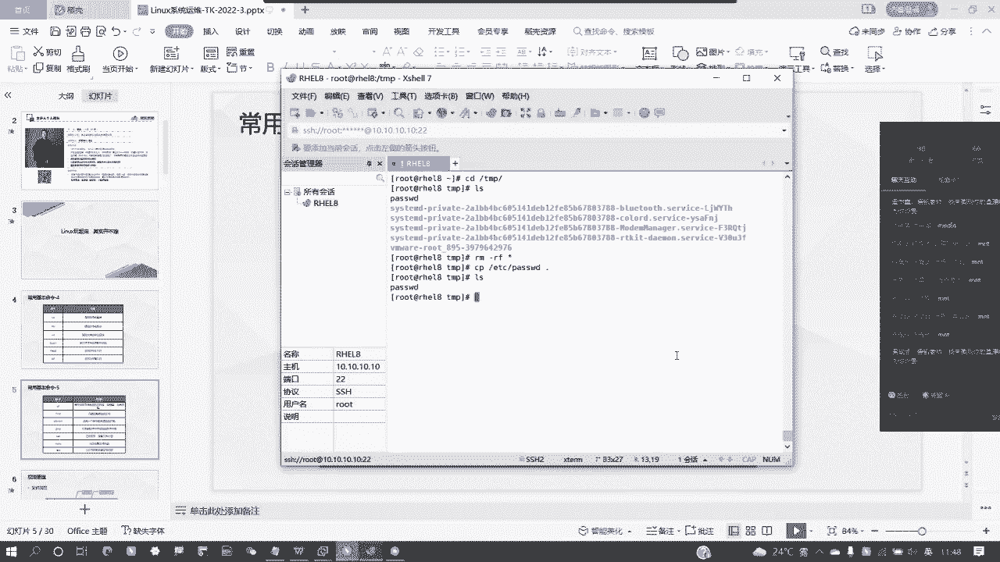

本节课中我们一起学习了Linux的进阶命令。我们掌握了如何使用 `cp`、`mv`、`rm` 进行文件操作，使用 `touch` 管理文件时间戳，以及使用 `head`、`tail`、`cat`、`more`、`less` 查看文件。我们还学习了强大的管道符 `|`，以及 `find`、`grep` 进行文件查找和内容筛选。最后，我们了解了查看系统磁盘信息的 `df` 命令和管理外部设备的 `mount` 与 `umount` 命令。通过熟练运用这些工具，你将能更从容地应对日常的系统管理工作。