# Linux基础入门教学-6 - P1 - 唐老师开讲 - BV1UG411L7EG

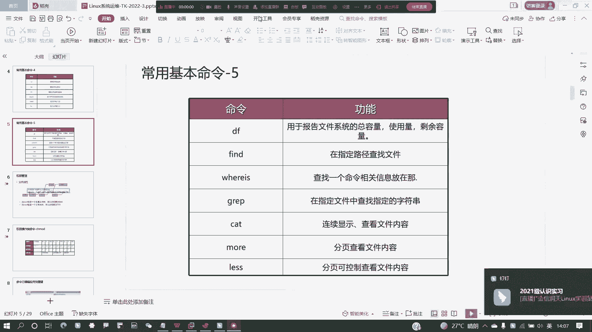

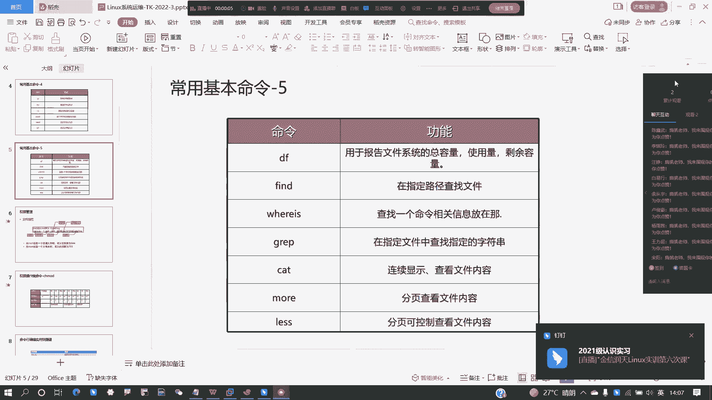

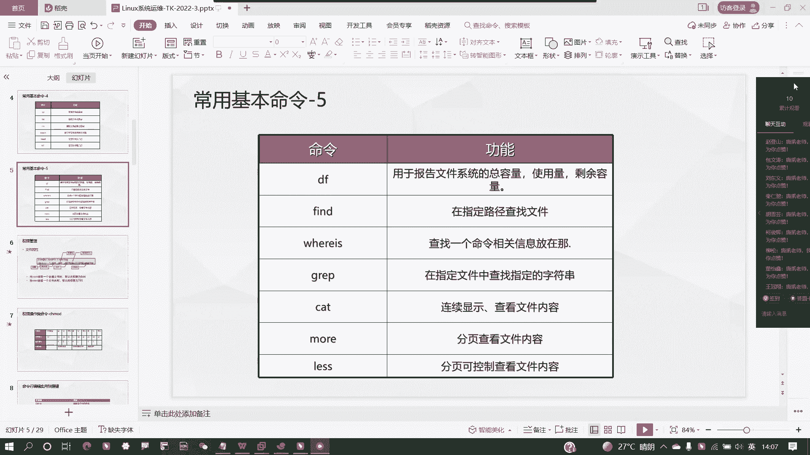

各位能听到我声音吗，各位同学大家下午好，好大家能听到我声音吧，各位同学今天听的清晰吗，屏幕看的ok吗，大家能回应一下，那回应一下，能看到我的这个屏幕吗。

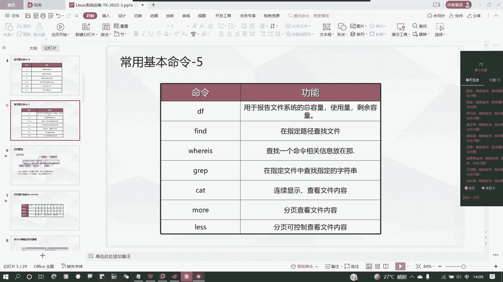

嗯嗯可以好，ok深夜应该ok是不是，好的好的好的好，是这样啊，那个在上课之前呢先通知一下啊，先通知一下，就是呃昨天应该是刘老师，然后呢咱们今天晚上啊，咱们今天晚上18点就是晚上的六点钟啊，晚上六点钟。

然后呢呃依然在咱们这个群里，然后呢有一场这个关于呃，大家可能之前啊有些同学私聊过我们的一些啊，比如说想去考认证呢对吧，想去考认证呢，然后想去在linux这个上面呢，可能希望能更好的一些啊。

发展等等这一块的一些啊，这个内容对吧，想去更多的想了解一，下实训中心等等这一块的一些啊事情，大家都可以在今天晚上六点钟，然后呢来到咱们这个直播间，然后有专门的咱们的那个教务的老师啊，黄老师啊。

叫我黄老师，进行解答，那那当然呃如果说关于技术性上面的，如果说大家还有一些疑问的话，大家也可以随时咨询我好吧，也可以随时咨询我，这个都没关系，然后呢呃还是一句话吧，我觉得真的是特别棒啊，特别棒。

咱们咱们的这个将近90多号同学啊，特别棒，因为然后，呢就是大家布置的作业，然后也都是很积极的去完成，然后有很多同学都第一时间啊，第一时间，然后呢都把它做出来了，而且都把那个截图啊截给我了啊。

截图都截给我了，所以我觉得真的是特别特别的用心啊，特别用心，那当然也感谢很多同学在跟我们的刘老师交流的过程中间，也对我的授课啊，给了一定的这个肯定对吧，给了比较高的这个评价，所以也特别开心啊。

实话实说也特别开心，所以还是一句话吧，我觉得呃这么多年啊教学了，有这么多年做管理，有这么多年了对吧，我觉得始终不变的，就是，我还是很希望能让很多学生能通过这种这种互动式的教学的体验对吧。

能呃就是怎么说呢，就让他让大家很轻松的啊，很轻松的能学到这个linux是吧，比如云计算呢对吧，比如说我们的网络方向啊，啊比如安全方向啊等等等等等，这一块，只要是涉及到的对吧，只要涉及到的。

那未来呢如果说有机会，我觉得真的是年轻人对吧，趁年轻去学了更多知识，然后呢通过你的这个学历对吧，然后通过这，种所谓的国际的这种行业的资格认证，对吧啊能有机会能能在毕业的时候诶。

呃找到一个比较靠谱的工作对吧，找到靠谱的工作，然后呢也是证书，那个时候又可以挂靠对吧，又可以挂靠，而且你上班之后啊，呃又可以那个叫什么，就是呃因为很多的企业现在都需要去交税嘛，这个大家都很清楚对吧。

比如你个人去上班的时候都要去交个人所得税，所以这个时候呢如果说你考取有更多的这种认证，那你在未来其实都可以去抵扣里的啊，就像抵扣里的这种个人所得税，这样来说其实也是，变相的啊变相的啊，这个这个费用是吧。

这个钱也都赚回来了，所以我觉得还是一样的吧，就是年轻人我觉得呃有这种机会，有这种机遇，反正多去参与吧好吧，多去参与这个可能因为现在说多了，大家可能呃感受不到，只能说是吧，当你有准备了。

那个时候正好遇到了，你才知道哦，原来是吧，曾经我做的这样的一些决定是多么的正确啊，多么正确，所以这个东西只能说呃就看大家了是吧，这个头脑简单往前冲啊，类似于像这样的一种概念好吧，所以还是一句话吧。

就今天晚上六点钟六点钟，然，后在咱们群里，伊朗会有我们的啊，黄老师啊，叫我了，黄老师和我们的那个呃就是班主任，我们的刘老师会给大家来进行解答好吧，来进行解答呃，然后呢关于一些其他方面的。

大家想去了解我的，大家就是想跟我交流的，也都可以随时找我好吧，就随时找我，没有任何问题好吧，好那我们接下来就是进入到我们今天下午的啊，接下来就进入到我们今天下午的这样一个内容了。

好那么在今天早上的时候呢，我们应该是给到大家去，把我们的基本的基础命令应该是给大家全部都过掉了，然后再在今天上午最后时间呢应该是布置了一个作业啊，布置了一个作业。

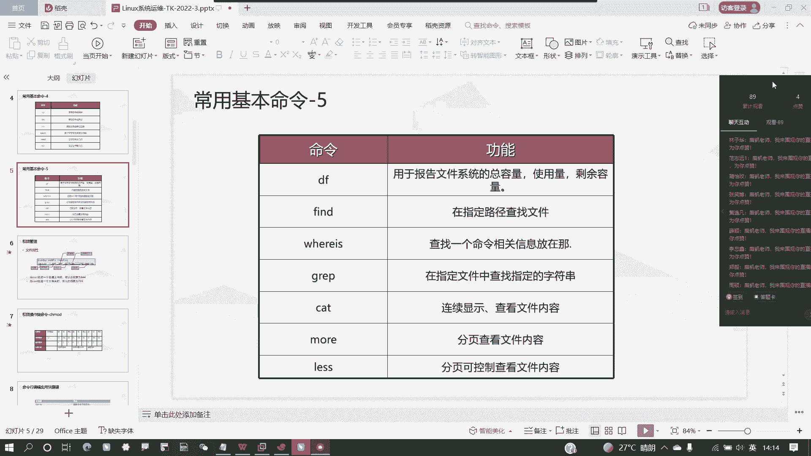

那这个作业是什么呢，其实很简单，就是要求大家啊，要求大家来我们一起来解答一下对吧，要求大家呢去通过啊，去通过我们的这样一个啊配置文件。

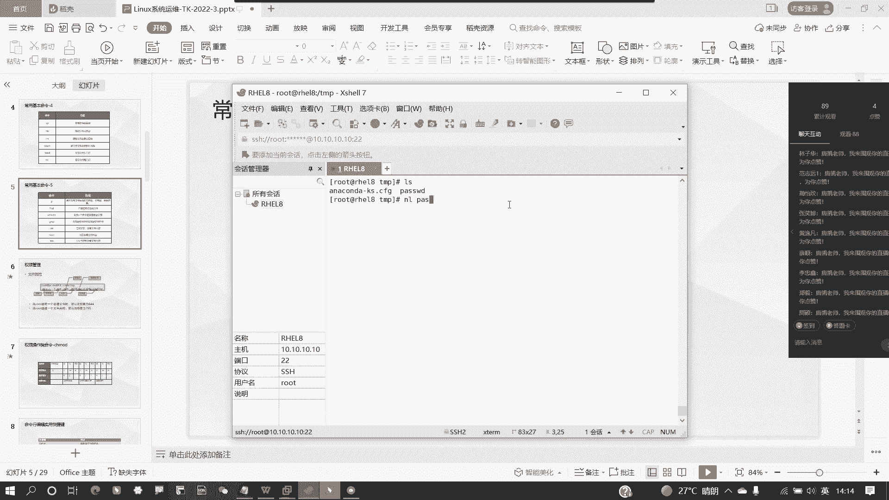

password的配置文件对吧，配置文件，然后呢去将我们的第二，十行对吧，第20行到第三行内容给我怎么样显示出来啊，给我显示出来，其实如果说大家今天上午的时间认真认认真真地去听了我的讲课。

其实这个非常非常简单，知道吧，非常非常简单，那怎么做呢，其实很简单，我们把行号已经都列出来了对吧，那既然到20~30，其实说白一点点，我们的第30行啊。

我们第30行其实相当于我们这下面其实你可以不用管了嘛，是不是，所以我们首先第一件事情，是不是要首先去怎么样选择出我们前30行的内容对吧，前30行的内容，然后什么，呀反着查看是吧，后11行的内容。

所以选择倒数11行的内容是不是就显示出来了是吧，是不是就显示了，所以很简单，我们怎么来做啊，nl password对吧，n a password，然后通过我们早上所讲的管道符对吧。

将前面的这个命令的执行结果，那么传递到后面来。

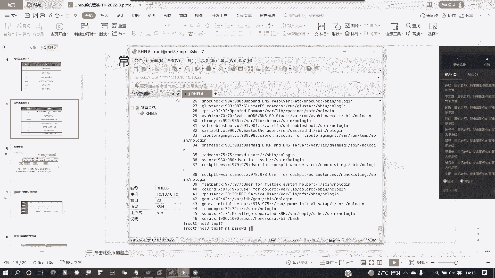

那后面来之后是什么呀，head是吧，杠多少，30，对不对，30，然后呢这样是不是就等同于截取了什么呀，前30行是不是，然后再将前30行继续反选，什么样显示倒数的，怎么样，11行内容是不是我们。

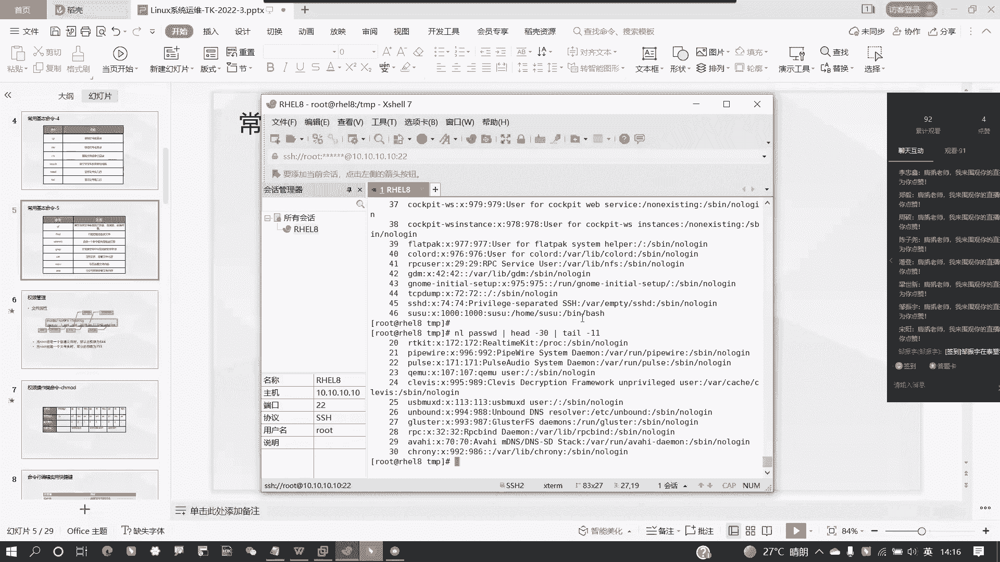

就把它显示出来了，是不是就把它删除了，对不对，所以如果说早上大家对整个这一块啊，这个管道符啊，对head tell的这个n l啊，怎么操作，大家都比较熟的话，其实整个这一块的显示就特别特别简单啊。

就特别特别简单，所以在这里是要求大家一定要认认真真的，去把它学会的啊，是把它去学会的，好不好，好，那么在这里呢这是我们今天的布置的一个作业了啊，那么接下来呢我们就要来看到的是，今，天下午的第一个重点啊。

大家注意了，的一个重要的一个地方啊，重要的地方就是我们的权限管理啊，就是我们的权限管理好，什么叫权限管理呢，来我们一起跟着我们一起来看到啊。

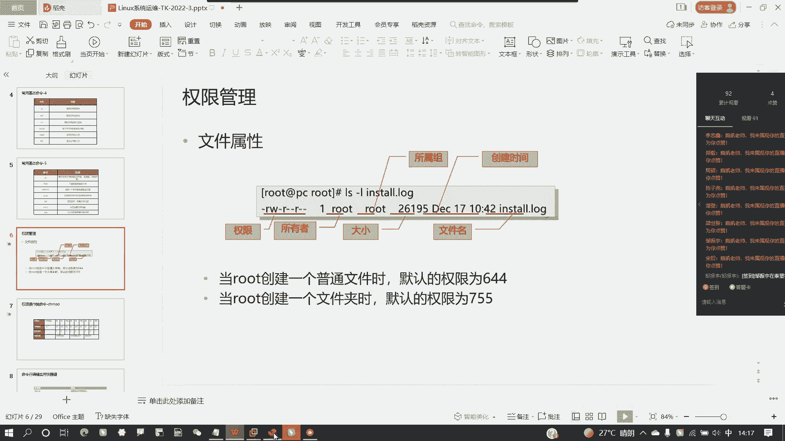

跟着我一起来看到好，今天今天在我们这里，我们去到tb目录好，那么在tm录呢我把这个文件把它删掉啊，我举个例子啊，举个例子，各位听好了，我现在l s是查看目录下面所有内容，那我l l是吧。

我们讲过l l l是不是查看当前目录下面的文件或者文，件夹的所有的什么呀，详细信息是不是讲过对吧，详细信息好，那么在详细信息过程中间呢，我们最开始的时候应该是给大家去讲到了第一个对吧。

讲的第一个就是我们什么呀，文件或者文件的类型还记得吧对吧，横杠代表文件是不是好，那么接下来请大家注意这一段啊，大家看到这一段，我现在用我鼠标框选出来的这一段就是我们的什么呢权限了，大家注意啊。

这一段就是我们的权限了，请大家注意了好，那么这个权限大家来帮我数一数一共有多少位啊，啊大家来帮我数一数，一共有，多少位啊，一共有多少位权限，一共有多少位存在，是不是一共有九位，还记得吗对吧。

那应该是都能看得出来对吧，哦不好意思，那个呃刚有同学发我一个消息，我打断一下，刚有个同学发我消息说今天下午的三点到七点，你们要做核酸吗，啊我想问一下同学们是吗，我怕会怕影响你们。

今天这个下午上课是下午三点钟，你们要集中核酸吗，是啊我丢就是呃会抽调走是吧，会会就是整体的会去核酸是吧，这么嗨，而是整个专业核酸是吧，哦尴尬嗯，那我这上课咋办呢，哈哈哈哈，这尴尬的好，这样吧。

我们我们先上一个小时好吧，先上一个小时，然后三点钟我我问一下，如果说你们要集中核酸的话，这个这个应该还是比较重要的好吧，还是比较重要的，那我们到时候看看，改一天吧好吧，三点到到晚上七点半是这局去。

可以之后去，但是你之后去的话不还是那个吗，呃你你上你的大车大了，我去你你们都这么嗨的吗，哈这学校的这个这个东西还是比较重要，因为最近这个疫情确实确实挺那个啊，我问一下啊，我问一下。

下午下午他们核酸课程咋办，哎。

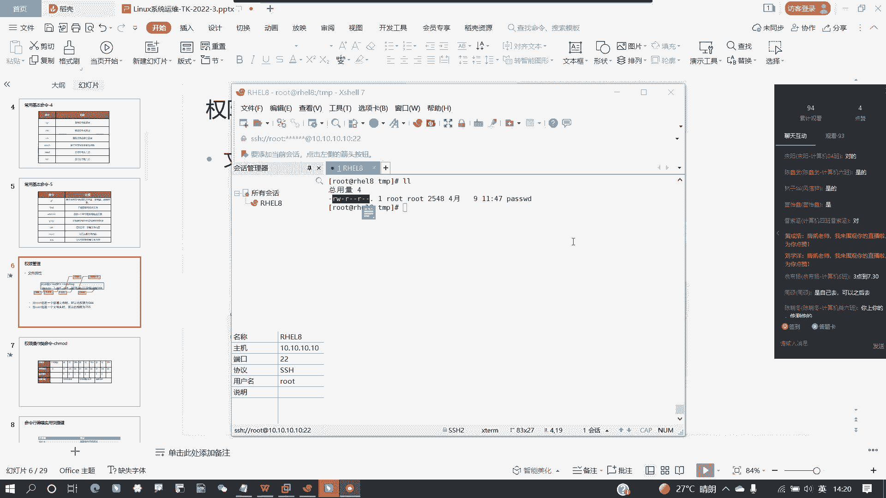

好我好，ok我们先说吧好吧，先说了三点钟再说啊，先讲了三分钟再说好吧，这个还是那怎么行呢，靠直播回放哪有现场讲的感觉呢，细不细，这个必须得现场听啊，不许听直播回放啊。

直播回放是大家忘记了再听听直播回放是不是好，ok好，我们继续啊，我们继续好，大家注意啊，这整个这一块呢是有九，大概一共来数19位对吧，一共来数19位好，那么在这个九位情况下面呢，请大家认真的给我听啊。

认真认真的跟我听，我们九个位中间其他注意，我们一般是三段，三段为一分位，什么意思，大家看啊，前面是三位，看到没有，中间是三位，后面是三位啊，我再说一遍啊，这个东西必须认真听啊，必须认真听，前面是三位啊。

中间是三位，后面是三位，它是三位为一个解释，请大家听好了好，那么前面三位意味着什么呢，请请教一跳了，意味着这个权利，这个人的权利代表什么意思，也就代表着现在这是我们的文件，是不是的。

那么也就代表着我们的这里的三位是我们的这个文件的所有者的权限，我再说一遍啊。

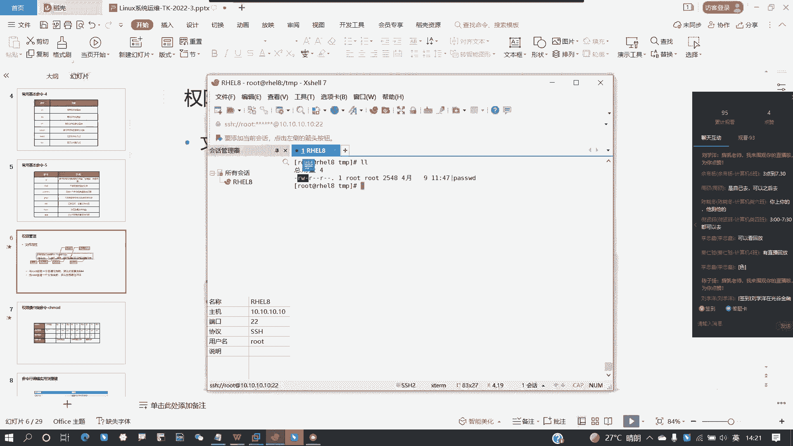

这里的三位代表着是我们的这个文件的所有者的权限。

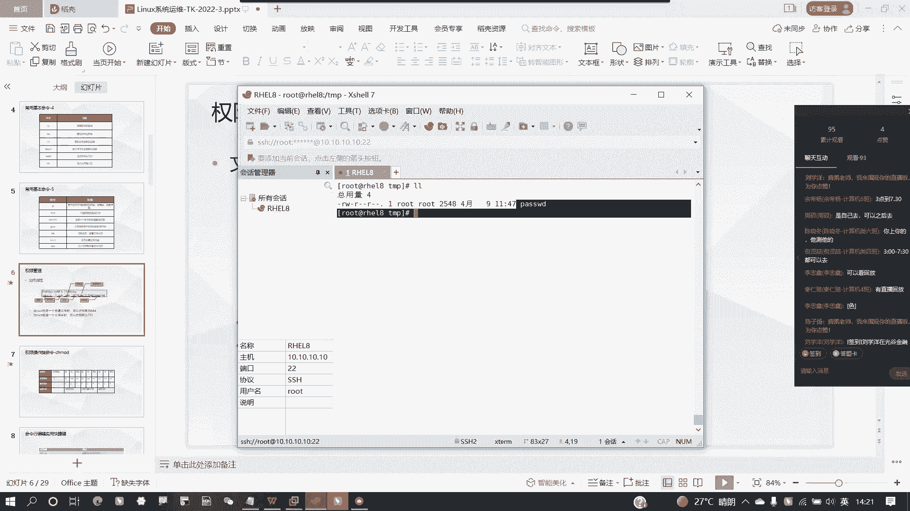

挺好啊，所有者的权限，那么这个所有者指的是谁，指的就是我们的root跳，指的就是我们的root，请单挑啊，这是所有者啊，这是所有者，那后面这个路子指的是什么呢，指的是所有者所有者跳啊，所属的主啊。

这里提了一个新的概念，这个我们可能后面再继续给大家来说所有者所属的主啊，所有者所属的主指的是中间三位请来一条啊，指的是中间三位请大一条了啊，ok这三位权限是对应的这个的啊，对应的是这个前台跳了。

那么这后面的三位，这里的这不是最后有一个后三位，对不对，那后三位指的是什么呢，既不是他的权利听我讲啊，也不是他的权利的第三方权利，说白一点也就是说后三位是其他用户的权利啊，其他用户的权利是这样的概念啊。

我再说一遍，我把中文给你们写出来啊，中文肯定写的第一个相当于是什么呢，前三位啊，前三位为什么呀，为啊文件或或文件夹的所有者权利挑啊，权限权限中间三位为为所有者属主的权限，听好了。

ok后三位为后三位为跳啊，什么呀，其他用户或者或者俗称叫做什么来宾，挺好啊，来宾来宾是不是就是用户概念是吧，来宾的权限听明白啊，是这样的啊，是要求大家去注意了好那么尽量是这样呢。

那么接下来那这个权限到底意味着什么呢，好大家注意，完全的权限是r，这是r w x，完全的权限是r w x是这样的概念，请大家注意了，那么r代表着什么东西，请大家注意哦，ok r代表，读第二代表读好。

然后w代表写y意思对吧，x代表s表执行，对read对执行，所以相当于是什么呢，就是说白一点它不像我们windows那么复杂，它分的很简单，就是前三位就代表什么意思，代表这个root是root对吧。

对这个password文件具备什么，前面具备可读可写的权限，看到没有，但是个杠代表什么意思呢，代表杠代表没有权限，就是暂时它是不具备执行的，很多人说啊哈root都不代表都都没有执行吗，他是这样的概念啊。

今天root是至高无上，说白一点啊，说白一点他什么权限它都有对吧，什么权限它都有，但是毕竟它是系统的结构，所以它显示的时候是rw是没有执行的，听明白啊，一般来说我们也不会去把它显示为执行，为什么。

因为执行它是不是就相当于windows的点ex e的应用程序一样的，是不是执行了，对不对，所以呢在我们整个结构结构中间，我再说一遍，那么既然是这样呢，那就很简单了。

那我们一起来翻译一下我们在这里的这九位意味着什么，是不是就意味着说这个文件是什么呀，所有者具备可读可写，是不是，而它所属的组具备毒而来宾怎么样，就其他用户是不是具备毒的权限，具备图的权限，好这样一说。

大家是不是就好理解了，是不是就好理解了，好既然好理解，问题来了，我们说去你到底会看，但是呢我们更希望你什么呀，会去设置对吧，会去改它对吧，怎么去改呢，好在这里就需要注意的是，我们在这个地方大家注意啊。

我们在这个地方的r对应啊，我们上下来看对应的是四啊，数字啊，我再说一遍，数字对应的是4w对应的是几呢，对应的是二，大家注意啊，对应的是2x对应几呢，对应的是一啊，那换个角度来说，换个角度来说。

各位如果说我今天啊今天这个文件我假设具备读写执行的权利，那么我的数字累加起来应该是几啊啊，我的数字累加起来应该是假最大的啊，最大的权限应该是多少，是七，是不是是不是最大的应该是个七啊对吧。

就代表我四也有，二也有也有，所以当你大脑中间如果浮现的是有七的概念，那你就要知道他这个七是在哪一个位置，如果说在前三位，ok它是代表所有者是读写执行了，能听明白就代表它是读写字音，那如果他说他是六呢。

是不是就代表它具备读和写的能力，听明白是不是这些要求大家去注意啊，这些要求大，所以这就很容易去理解了对吧，这就很容易去理解了，是不是好那么既然是这样，那我想问一下啊。

那我想问一下现在这个password它这个文件的权限是多少，如果让你用数字来说啊，让你用数字来说它这个权限是多少，大家能告诉我吗，如果说让你用数字来说，那么你这个权限是多少，对很好很好。

很多人已经打出来了，什么呀，644对吧，644，所以当你看到644从你大脑中间反馈出来，是不是就是六嘛对吧，读写是不是没有执行对吧，而中间这个是不是代表四，第一个是吧四第二第二个是64，是不是。

所以在整这一块来说就是644啊，就是644啊，所以呢也就说白一点，当你看到64是不是就在你大脑中间，立刻九个位置，每个位置的权限的分布，你就很清晰的给我显示出来，听明白，很清晰的给我显示出来好不好。

这是我们整个这一块的结构的一个概，念啊，这是我们整个这一块结构的一个概念，是要求大家去注意的好吗，好，这是这是我们刚才所说的啊，好接下来呢，那这样我们今天touch正好不是早上不是讲过吗，对不对。

touch由于sch touch好，那如果说我创建一个touch test，大家看到啊test对不对，那我创建一个文件，大家看大家都很清楚，我这个test肯定是个空文件，是不是，那也是第一次创建的。

是不是，那我想问一下，创建一个test的默认权限是多少，我们来看看默认的啊，但是什么叫默认，就是我创建完之后，它是不是立刻就有权限，是不是，那这个权限是，多少是多少，所以默认就是我们的什么呀。

644是不是默认是不是就是我的644能听懂吗，对吧，默认就是我的644权限听懂我说的意思，默认就是我的64位好，那同样mic dr大家看到创建一个文件夹是不是a b c，大家看了或者说叫m对吧。

我的文件夹好o当我创建完之后，我们来看看l l但是这个时候你就不能光这样了，光这样是不是查这个my dear的里面的内容啊，是不是，所以我们需要什么呀，所以我们需要干嘛，大l d代表什么意思啊。

或者干d代表什么意思啊，是不是，查看的是这个目录本身的权限是不是好，那么这个目录本身权限是多少呢，有没有同学能告诉我来直接发到这个我们的这个这个里面应该是多少，这个时间应该是多少，默认权限应该是多少。

默认权限应该是多少，751吗，751吗，好，对器物对吧好，那有的同学会会会奇怪的说，哎唐老师，你刚刚不是说吗，只要有x就代表什么呀，可执行，对不对，就可就代表可执行，那么也就代表这是不会有风险呢，对吧。

那我执行它，那是不是假设它是个病毒，那那不就被执行掉了吗，会不会有同学会问这个问题，好，请大家注意啊，今天就如同你windows一样的，你想进这个文件夹里，是不是鼠标的双击它是不是才能进去，是不是。

那同样是这样的，在linux中间，如果你没有x，你根本无法进入到听没听明白啊，你根本无法进去啊，所以文件夹的时候，各位一定要听好文件夹的时候是一定是需要有x权限的，听明白，一定是需要有x权限的，听懂啊。

文件是不能有x的听懂，所以所以请你听好了，在我们的在我们linux中啊，linux系统中对吧，那个是系统中，对不对，没认的文件权限就是多少644，听明白，而默认的文件夹权限就是多少七五好，这个听懂了吧。

ok直接要求大家去注意的，对不对，那我反过来就有一个疑问了，各位那如果说在我们这lt中间，你认为你认为最大的权限或者说最不安全的权限是多少，最不安全的权限是多少啊，最不安，全的权限是多少。

最不安全权限是多少，777对啊，那最安全的呢，那最安全的反过来对吧，最安全的就是我们的什么什么权限都不给的，000是不是是不是000了，各位那你觉得我们今天的linux里面我们有没有000这个权限。

在我们linux的系统中间，大家来想一想，有没有零零这个选项，可不可能有000000意味着什么，000意味着我连root账号都登不进吗，是不是，我们来看一下有没有啊，l l d v shadow。

大家看shadow 2扫了，扫出来不是地域瞎敲瞎的，大家看有没有，还真有，你发现没有，还真有一个权限都没有啊，一个权限都没有，开国际玩笑是吧，连骆驼都登不进去吗，啊连root都登不进去吗，肯定不可能的。

为什么，因为root不受我们权限影响，听明白，我再说一遍，root不受我们权限，root是绝对能看的，那shadow我看到了，看到没有，我能进去，我看到你们的内容了，是不是啊，对不对，但是对跳。

但是我们确实在我们也就是说白一点，你当你看到这个文件，你滴大脑中间会反映什么呀，这个文件在我们的整个系统中间是绝对保密，绝对安全的，但是系统又必须得有的这个问题，看到没有，是不是啊对吧。

shadow shadow啊，当然这个shado是干嘛的，我们后面会给大家去讲啊，我们后面会给大家去讲，请大家shadow是不是啊，好那么这是我们的整个这一块的结构，所以要求大家一定要去注意的啊。

要求大家一定要去注意的啊，整个这个好，那既然刚才已经说到了，我们最不安全是777，那最安全是000000的时候呢，我们又没有办法，除了root之外是吧，其他用户你都无无任何权限。

所以今天你可以这样来理解，在我们的电脑中间啊。

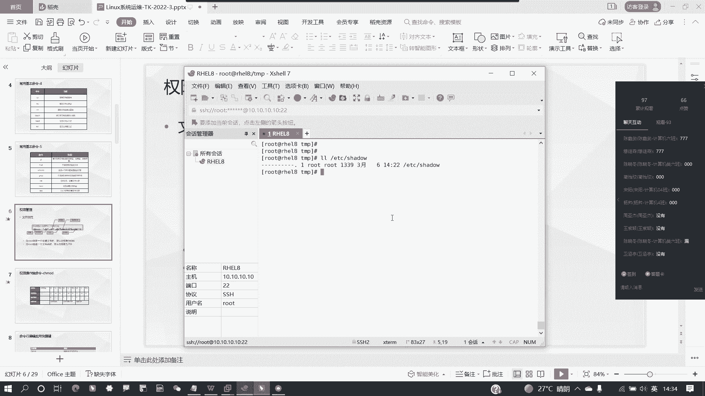

在我们那个系统中间，我们默认的这个权限其实就是最安全的，我再说一遍啊，默认的这个权限其实就是最安全的，听明白。

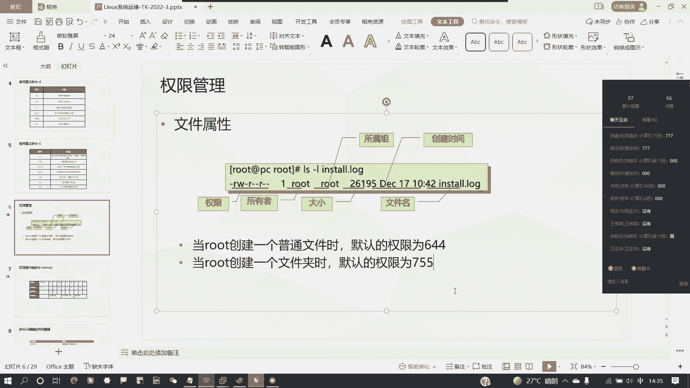

ok这下大家去注意，所以刚刚说白的说白一点，大家通过这种方式很容易就理解了，然后其他用户其他来宾，ok是这样的，对不对，好，但是各就各位我们依然是没有讲到如何去修改它对吧。

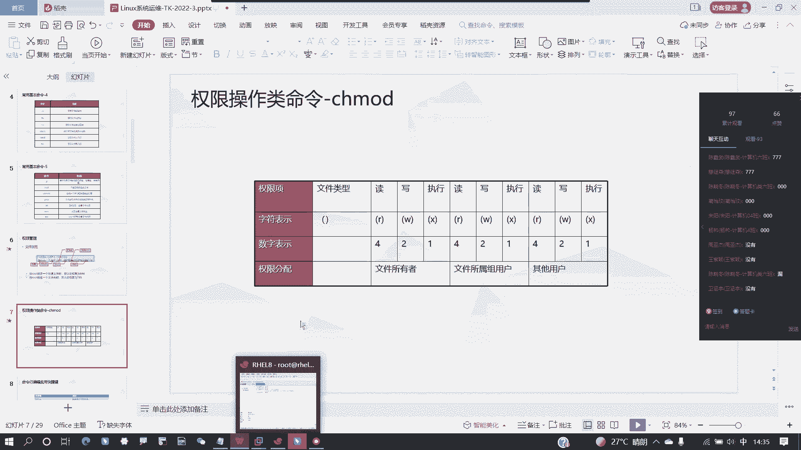

那怎么办呢，我们来看到吗对吧，我们来看到吧，好我们就拿这个password来举例，子，l l password 644，对不对，那如果我想给他，我想给他744怎么办呢，很简单，这里有条命令，各位记下来。

千金mod就是用来设置针对啊，我针对我们的文件或者文件夹设置权限的命令，千金目的，针对我们的文件或者文件夹设置权限的命令好，这里要求大家去注意啊，今天我们的权限在这里要强调一件事情啊。

这个我应该是讲的很细了，真的真的真的是为大家把这个底子打的是吧，我认为是打的，如果你认真跟着我走，我会把你们底子打得非常好啊，请大家注意了权限，这里有一个疑问啊，各位听好了。

权限是对用户而言还是对文件及文件夹而言，我想请问大家听我这句话，就是我现在做这个权限是对于用户而言，还是对文件及文件夹而言，那么理解这句话，我今天设置了这个，权限是对用户来设置的。

还是对文件及文件夹来设置的，啊大家可以打在屏幕上，对很好啊，有的同学说对用户而言，大家从逻辑上来理解啊，如果你今天的电脑上面对吧，你今天电脑上面有什么呀，有100个用户啊，有100个用户。

那么如果我要对用户而言就会有问题，什么问题呢，那是不是就代表我要针对这100个用户，假设我里面的文件及文件夹又有很多很多，那那就变成什么样，我是不是要为每一个用户去设置这个权限，那就逻辑上面就有问题了。

所以我们所有的权限一定是针对文件和文件夹来设置的，听明白啊，权限是针对文件及文件夹的，快点听懂啊，是这个概念的，所以我今天想去设置很，简单千金目的听明白好，举个例子，我想给他直接选755嘛对吧。

753位嘛，对不对，他是我的回车，你看很快就设置完成了对吧，很快设置完成，你看而且它一旦带了x它就会干嘛，就会变成我们的绿色，看到没有就会变成我们的绿色，听懂755啊，我直接说了755。

你看是不是都加了x好，那如果我只想让他一个前面加x怎么办呢，那也可以啊，千金木的什么呀，744的password，看到没好，同样也可以，你看同样也可以，是不是的，没有任何问题。

也就代表其他用户都不具备可执行，但是呢这，个什么呀，所有者的这个人是不具备可执行，是不是就这么简单，就这么简单，设置权限，只要你能把这个数字的逻辑概念在你大脑中间映射出来，其实你设置就非常非常简单。

是不是，对不对，就非常简单了，好那现在问题来了，各位那现在问题来了，那有的同学说哎呀我这个逻辑我就是是吧，一下卡着我转的可能慢一点，但是我就想怎么样用通俗的例子，通俗的解释交给我做，可不可以呢。

也可以啊，也可以，怎么通俗来交个底座呢，各位听好了，今天我们就举个例子，在这里的642，在这里的，三位啊，在这里三位前三位不代表所有者吗，好那么我们用u来表示，像用user嘛，就u来表示中间的三位。

用g来表示group来表示，听明白后三位用all来表示other的意思，听明白就其他的意思听明白，ok叫u g o，那当然还有一个a a指的是all的意思啊，所有的意思叫u g o a好。

那就很简单了呀，比如说我想让所有者具备可读可写嘛对吧，就加可读可写嘛，是不是啊，好逗哈，我想让所有组织什么呀，这个这个权利r都不行，不能要，那减的r就完了吗，而其他用户呢什么权限都没有，就等于什么呀。

啊杠杠杠都行，懂我意思吧，或者说直接就是什么呀，啊就这就没有呀，我上面也没有，那只有杠r一行，对不对好，然后怎么样，他是我的，看到没有，对不对好，接下来l l password。

你看是不是就是我们刚刚达标了，是不是就是我们刚刚达标了，是不是啊，好那我想让所有人都不具备读写执行，那你就a嘛，他是我的，是不是的，a l password，我相信大家应该是不是瞬间懂了。

uga是不是好，那如果我想还原，那还原理用这种方式，你你是不是就觉得很麻烦了，对不对，你这样，记住它默认权限多少，644是不是就还原了，所以这两种方式请你都要学会活学活用，听懂啊，活学活用。

设置我们权限的命令叫做千g mode，设置权限的命令叫千g mode，这个大家都听懂了吧对吧，我相信这个东西大家都听懂了啊，这是我们全新的命令。

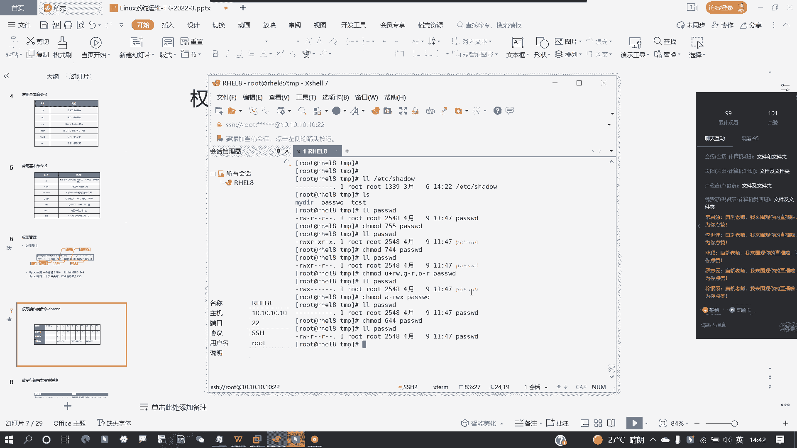

好吗，就这么简单啊，就这么简单啊，权限命令就这么简单。

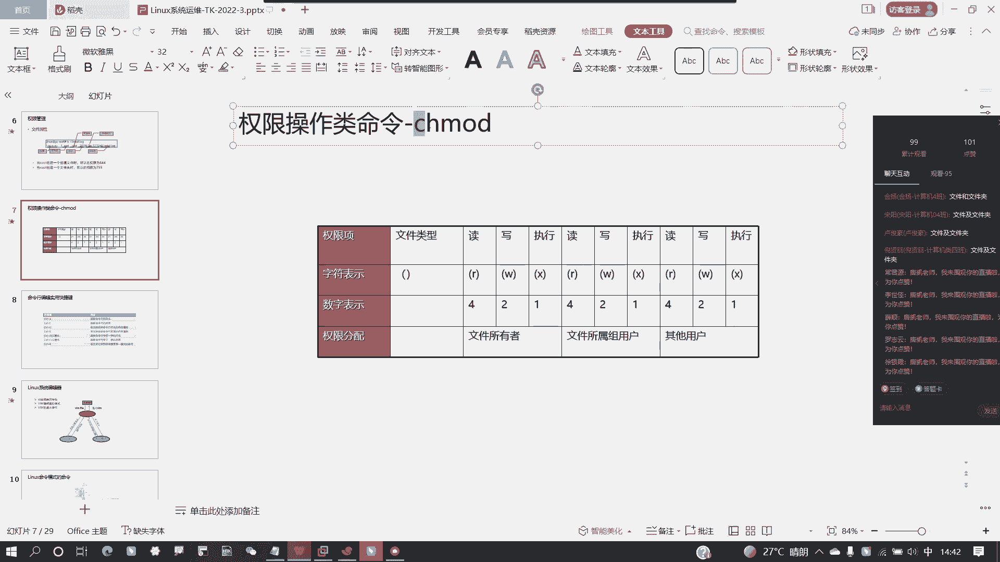

全局目的对吧，好那么接下来呢我们继续啊，接下来我们继续了，好不好，好，当然我们在我们整个这一块呢，其实也有很多很多快捷键的操作啊，大家注意也会有很多很多快捷键的操作，这个快捷键操作。

比如说ctrl加a就跳到了命令的开头，比如说我今天做什么什么操作，操作了很多，但是呢一不小心我可能在哪里敲错了对吧，你就可以按快捷键啊，他们加a就是跳到行命令行开头，他们家一命令行的末尾。

ctrl u只是把光标的开头，就是光标所处在那个位置的开头的内容全部清掉，那ctrl加k就是直接把什么呀，末尾的那个内容给它清掉，听明白末尾的内容给它清掉，就这么简单。

那当然ctrl加r就是做命令搜索好。

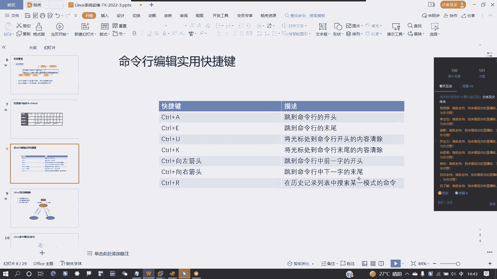

这些只是简单的给大家快速过一下，快速过一下，比如说我今天想去改一些什么，举个例子吧，比如说当然这个这个这个我随便敲1c c a big network con是啊，network conraft对吧。

i f c g什么什么什么，举个例子啊，好假设我敲到这里诶，我发现我敲错了，为什么，因为我table不出来了啊，大家大家听好啊，今年linux最大的特色是什么，大家不要死敲。

不要在这里什么i f什么什么哦，结果我敲错了，你不知道所有的一切其实都可以table的，大家看都可以，table的听懂啊，你只有table对了，你只有table就是他们正常的p它写出来就代表什么意思。

就代表你刚刚敲的内容都是正确的听懂啊，我们强烈建议大家要学会用table键，jb table键把它命令补齐或者路径补齐，听明白，ok好，但是呢我本来想接着敲了，但是我发现我table不出来了。

哎这个时候我突然发现是什么呀，这里的命令我敲错了，所以我就可以按ctrl a，大家看我光标是不是立刻到开头来了，是不是啊，所以干嘛我就立刻把它删掉，哎我去把它改过来，好立刻把它改过来，听明白，然后看。

加一到末尾我接着敲f c f g e n s160 啊，就这么简单好了，比如说我今天看到这里啊，我发现我这个后面其实我是不需要了啊，我是不需要了，那你直接敲嘛，他们加k就把后面是把光标后面的全部砍掉。

能听明白，那com加u是什么呢，把光标前面的全部干掉，就这么简单，那当然你想查找命令，鼠标是不是啊，键盘的上下键啊，上下键翻是不是就可以查找你之前敲了所有命令，听明白是不是啊。

好那我想查一查我电脑上我我目前的这个点上，我一共敲了，就是从头到尾我用敲了多少，条命令呢很简单，history是不是历史的命运，历史的这个单词啊，history好，回车回车。

你从开头到现在一共敲了165条命令，不管正确还是错误啊，不管你敲的这个命令是正确的还是错误的，你只要在我们这个电脑上面敲击了的，一共你敲了165条，history听明白对吧，history好。

那么接下来李昌的同学his story，他这个电脑中就有什么神奇的一幕呢，我举个例子啊，我举个例子，比如说我今天想去啊，我今天想去呃，啊我我举个例子啊，举个df，你看我这里没有挂载，对不对，好。

mount dev cd rom n t好，举个例子，我是不是把我早上是不是讲了这个命令的是吧，光盘挂上去了是吧，光盘挂上去了好，接下来呢好you mmt好，我把它卸掉了好，我随便去敲。

比如说啊随便去交敲什么edc目录。

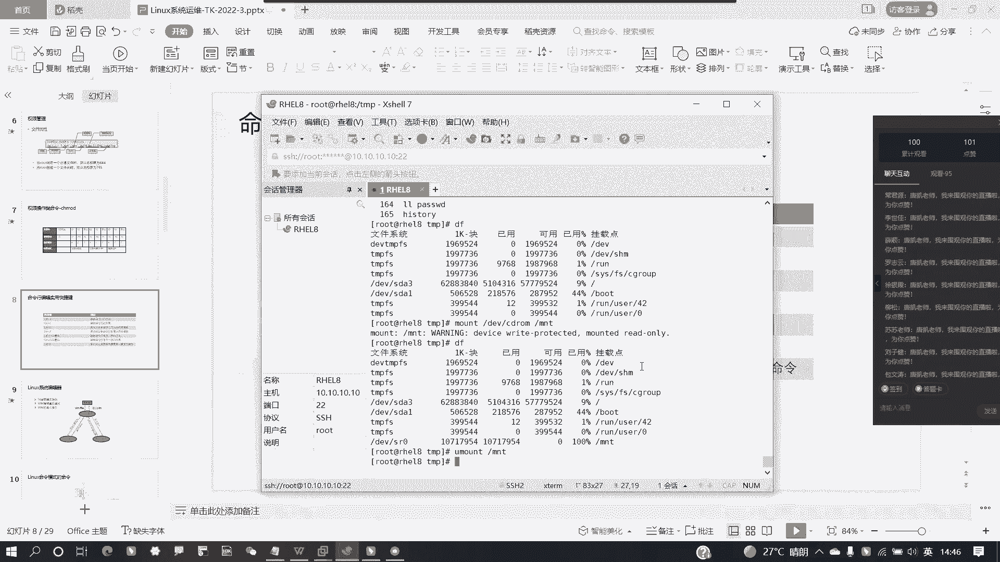

然后敲什么mt目录啊。

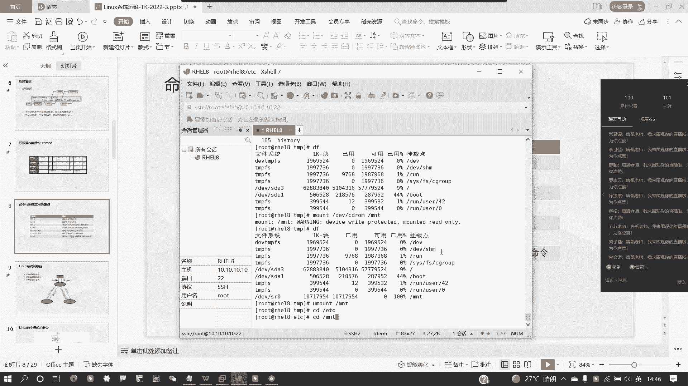

然后又敲什么根啊，要敲什么，我随便去敲，敲了很多很多其他命令啊。

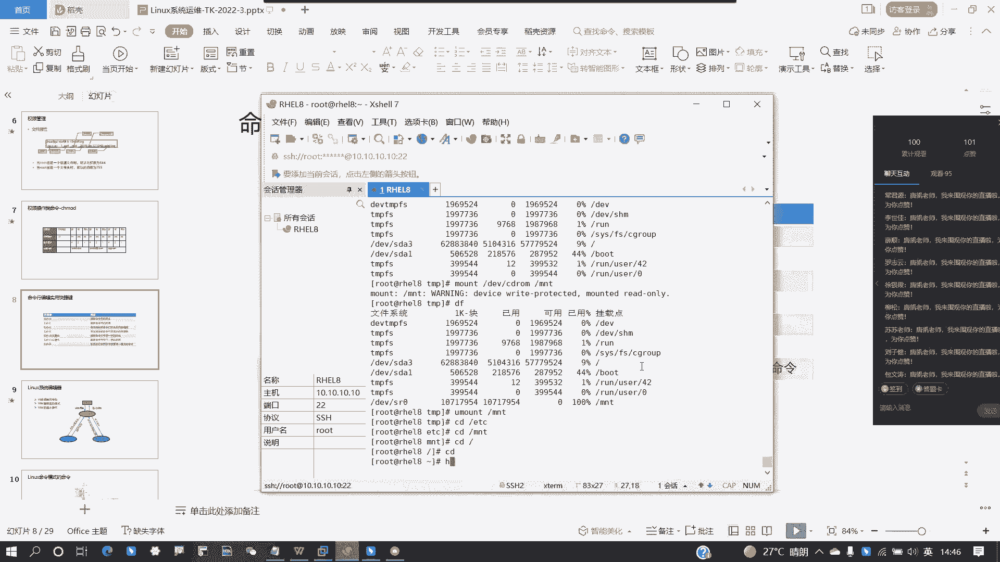

history你会发现我刚刚敲的命令是不是全部都会在这个里面要显示，这不是我刚刚敲的内容嘛。

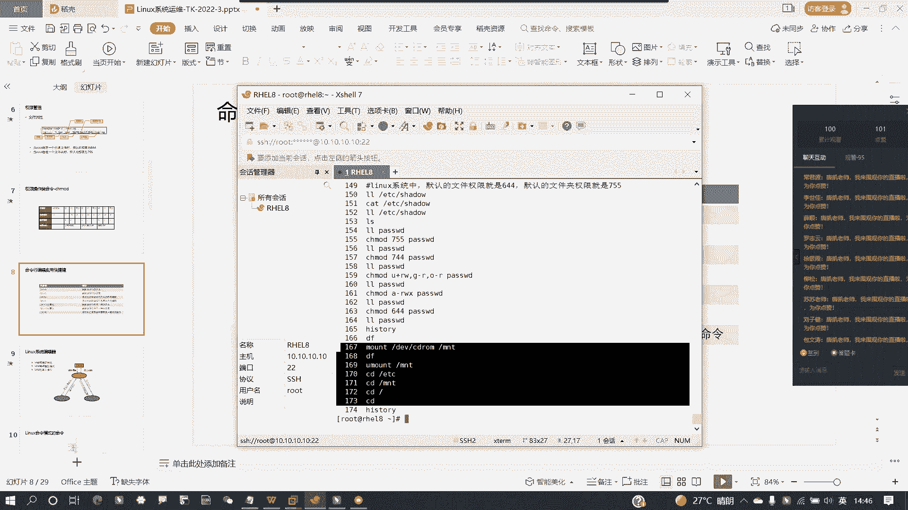

对不对是吧，好，那么这个时候大家听好了，这里有一个比较经典的概念是什么呢，就是感叹号啊，大家注意感叹号这个感叹号代表什么意思呢，代表着它会自动的去调用history啊，它会自动去调取你的历史记录。

历史所敲的命令，然后从最后一条往上推，大家注意最后一条往上推，那推什么东西呢，就是推你第一个所敲的啊，比如说我随便哪怕我敲这个，我们要不没有抄齐都可以，就是第一个出现倒着看，第一个出现mn的跳mn的。

那他会去找懂我意思吗，会去找，如果说他找找找找找发现诶，它就会定，位到这个直接去执行了，好我们看一下，如果改到m n他会定位到169还是17167这一条命令，我们去看一下回车，你看它定位到哪里去了。

是不是就会定位到它，只要以m开头的，就定位到167这两边进去，看到没有，它自动是不是不就给你挂上来了吗，对吧好，那如果我要再看的哈，u m o u n t它会定位到哪一条线。

是不是就会定位到169这条命令回车，你看是不是就卸掉了，所以这如果你经常性的在我们的这个环节中间，反复的去敲这类似于这样的命令啊，就反复，去敲这样类似命令。

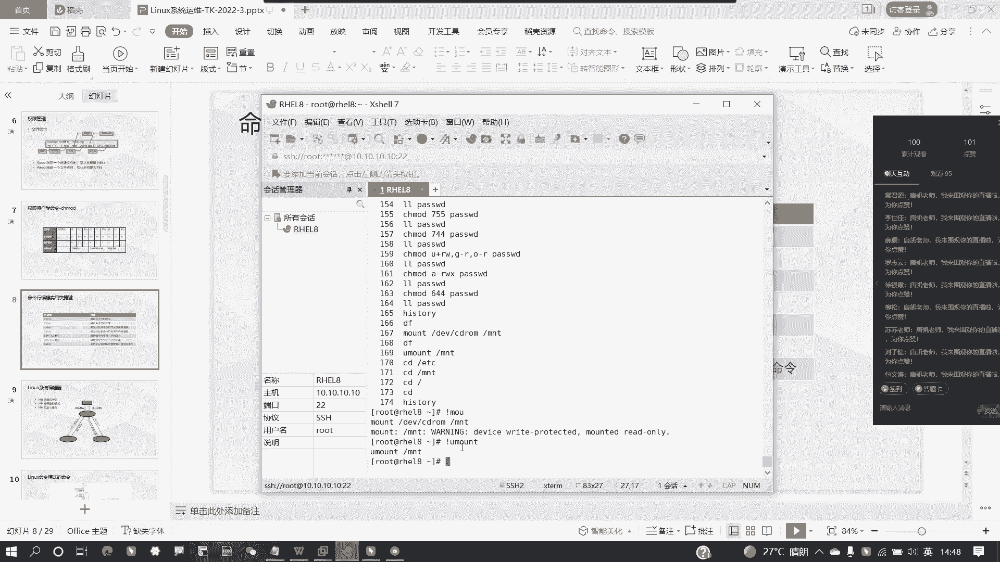

那么你就会发现的是我们就可以用什么呀，这种感叹号来自动的在你之前插入命令中间。

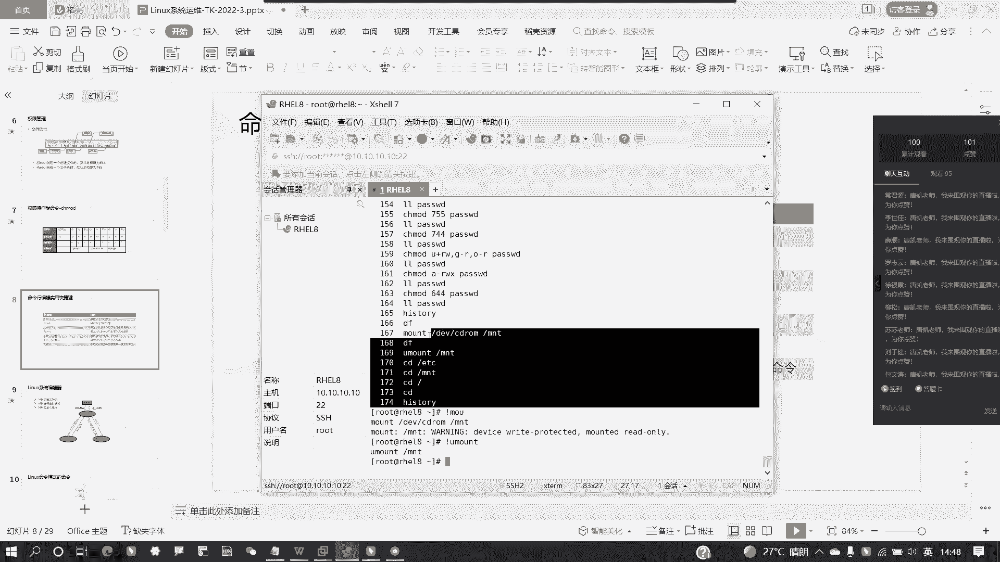

帮你去做一些这种调取啊，帮你去做一些调取，好那当然还有一招是什么呢，就是按ctrl加r啊，ctrl r就是那个小写的，就是c t l r l加r什么的，r它是代表什么呢，代表。

令搜索它代表命令搜索的概念，什么意思啊，什么意思，很简单康，大家看到这个这个这个这个显示啊，看到这个提示符啊，看到这种提示符，ctrl加r看着变了吗，它是不是有个设计出来了，是不是个三元出来了。

当你去敲的时候，你看当我敲m它就会自动定位匹配这一条，如果我敲m o u n t是吧，du一你看你看我都没抄完，它是不是就定位自动定位到我的黑黑si中间的这一条去了，是不是的，好比如说我把它删掉。

好比如说cd对吧，m n t你看m n它是不是只为自动定位了，是不是，所以在，这个环节中间我们就看啊dv什么的，哎你看我没敲完好，你回车，它就等同于自动的就跟你执行了这一条，看到没好再来好。

比如说you mt，你看它就自自动定位这一条，听明白啊，那么这个ctrl加r和我们这个感叹号的区别点是什么，ctrl r它是在整个he sorry中间帮你去找，而我们的感叹号是倒数第一个出现的。

那个就会帮你去定位，啊这是两个不一样的概念啊，这两个不一样的概念，这是要求大家一定要去去理解的啊，这是要求大家一定要去理解的，ok邀请大家去注意啊。

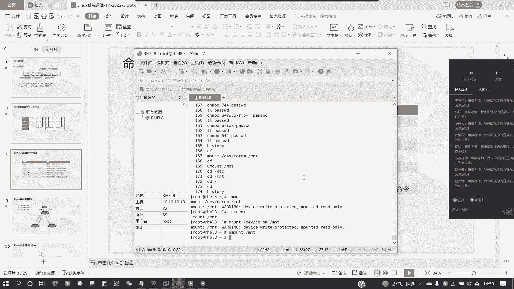

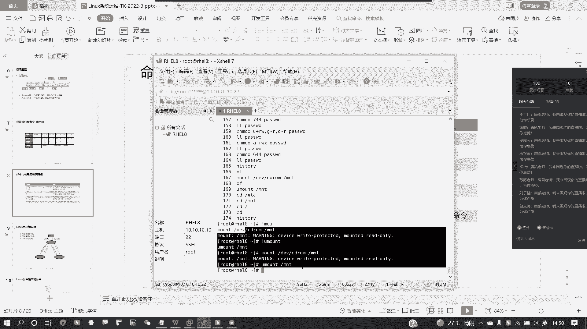

咳咳。

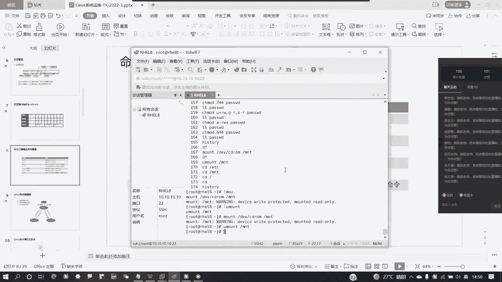

好如果说大家对整个这一块之后呢了解比较深了，那么这个时候我再来教大家一些啊，再来教大家一些今天系统啊，那个系统比较神奇，神奇在哪里呢，它可以针对于我们整个这一块的这个叫做什么呢。

就是系统会给你反馈很多很多不一样的状态啊，不一样的状态，什么叫不一样的状态呢，我举个例子，这里有一个符号啊，叫做叫什么多了问号啊，多了问号什么意思好，我举个例子，e c h o多了问号回车，大家看啊。

这里显示是零啊，这里显示零，看到没有好，我举个例子啊，我举个例子，比如说我今天去敲一条命令，好我举个例子，那今天呢我们怎么来做呢，那比如说我们在这里啊，大家看了啊，那比啊比方说我我我去敲错一条命令啊。

我去敲错了，或者说我全面去拼拼一个不存在的地址啊，比如说202。103。24。68，那么我去回车，你看是不是命令不可达，对不对，对不对，好，待会命令不达，那么也就代表着我们的系统很有可能。

是不是这个整个这个结构是不是出现问题，对不对好，那么这个时候呢你再来看e c h o都能问号回车，你看它是不是变成了一个什么呀，变成了一个非零的这个过程，是不是的，它就变成了一个非零的过程。

代表什么意思呢，好所有人认真听啊，今天这个多了问号，这个多了问号就意味着什么，就意味着我们在整个这个结构中间，大家注意啊，就是这个它就是用来反馈我们系统的状态的啊，它就是用来反馈我们系统的状态的。

听明白，那么这个系统状态是什么呢，它无非就是零和非零，零代表着我们刚刚所抄的这个命令系统是认可的，他是有执行结果写正确的，而且正确的，那这个怎么样多的问号作为非零的情况，下面则什么呀。

则我们就代表什么呀，就是我们刚才敲的这个命令是是系统是什么呀，是报错的啊，系统是报错的，所以这样有什么好处呢，那么我们未来如果说是吧，如果说会玩一些政治表达式的时候，你就会发现我可以通过敲很多很多命令。

然后呢我不希望看到这个结果，但是我希望看到什么呀，这样一个什么，就是比如说我想把这个结果把它丢弃，但是呢我就想判断这个系统是否是否运行正确的时候，我们其实就可以什么呀，通过这种多了问号来判断好。

我举个例子啊，我举个例子，比方说比方说今天我去拼啊，c我们，上面我们讲了c2 ，对不对，好比如说我在这里敲local host，骗我自己嘛对吧，骗我自己啊，但是呢按照正常如果回车它是没有结果出来。

他是没有结果出来对吧，有有这种执行的东西出来好，但是呢我不想看到这个执行，我可以把它传递到一个设备上去，大家把这个设备记下来，叫do with long dv的lg就是这个设备啊。

dv的n u l l l这个设备叫什么呢，叫空设备，空气的空啊，空设备，听明白叫空设备，我再说一遍啊，叫空设备好，那么这个空设备意味着什么，意味着无底洞啊，什么你可以理解叫做无底洞呃。

这个东西看起来好不好理解，举个例子，你说呃就什么什么叫无底洞啊，就是你今天任何的东西你觉得是吧，不想要不想什么东西是不是都可以往这个无底洞里面去丢是吧，丢下去之后呢，他深不见底啊。

它可以存储世界上所有的东西，它你可以往里面去丢，它相当于一个宇宙的黑洞一样的啊，宇宙的黑洞一样的对吧，你你只要你不想看的，你只要不想要的这个结果你都往里面丢，那么多号里面丢之后呢，他也不不会去反馈给你。

结果他也不会反馈给你任何东西啊，他不会反馈给你任何东西，你看在这里我回车，你看他不会反馈给你任何东西，但是呢你有你这一条有没有执行成功呢，执行成功了，你把相当于把这个结果我不要看结果，我不要看结果。

我把所有的气都甩进来，看见没，我不要看结果，我把所有东西甩进来，但是我到底执行对不对呢，这个时候你就只能靠通过这种方式来判断，所以一口多了，问号只要是零，只要是零，代表诶这台机器是什么呀，是可达的。

听明白代表这台机器是可可达的，可达的，我再顺便是可达的，好，这个我们来看大家能否听懂啊，这个概念代表这台机器是可以答的对吧，达到某个阶段，达到某个阶段的是吧，可达的一个概念。

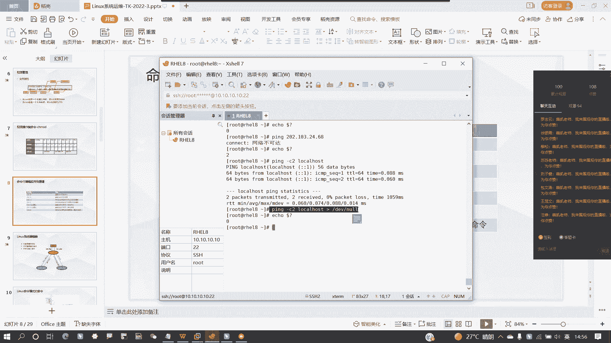

ok。

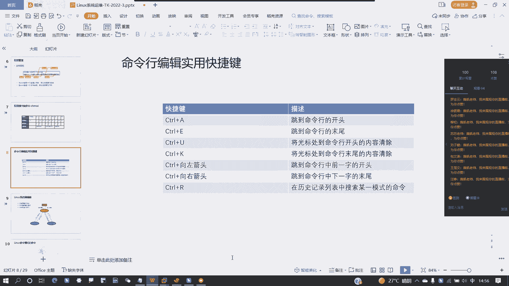

嗯现在到三点了，你们是我想问一下，你们是你们的老师，就是咱们计算机系的所有的同学们都要去，就这个下，就是今天下午都要去核酸，是不是，这个会很多人吗，再帮你们问一下那个这边的，全校的啊。

就是整个学校都是在这个下午是三点到七点半的那个核酸是吧，全校东湖高新全局啊，下午三点，东湖高新全区紧急通知，安排我下下午三点到七点半，流芳校区运动法进行核算，所有在校人员都尽量的去那个啊。

因为我知道就是学校里面这个检测核酸会比较的比较慢啊，比较慢，因为你们排队排的老长了，这个东西，这个东西也不能说抗命了是吧，这个直接有点尴尬了啊，嗯要不这样，各位同学要不这样嗯，因为三点了，三点了。

这个东西怕不太合适，嗯，要不这样，这个我们今天的内容讲到这里吧好吧，今天内容讲到这里，然后呢哎我问一下，相当于是你们是本来星期六的上午就有课是吧，就是必须是09：35，你们下课之后，然后十点钟来参加啊。

这个我的这边零死讯是这个意思吗，你们九点之前有课吗，就九点到十点这个阶段，oo哇大学生好命苦啊是吧，还是有课的是吧，还是有课的啊，八点到九点半哦，八点到九点半有其他的课程啊，那十点钟再来，上午这边是吧。

到到一直到那个下午，尴尬了尴尬了啊，好这样吧，呃因为你们今天今天的这个核酸啊，因为这个核酸还是比较重要的，因为确实最近这个疫情是比较呃比较严重啊，比较严重，这个确实呃大家也需要注意一下好吧。

你需要注意一下，那这样呃我刚刚跟我们的那个教务的一个黄老师沟通了一下，然后呢你们今天天的下午这个课程我们改一次好吧，改一次改到看后面的什么时候跟大家补一下好吧，给大家补一下，然后呢，其次的就是呃。

你们本来今天晚上的六点钟的，会有一个这个这个这个刚才所说的一个宣讲会嘛，然后呢可，能也是因为你们这个有些同学可能是吧，这个这个时间我们没有办法去把控，所以统一的改到周一吧好吧，改了周一的呃。

晚上的这个这个六点钟好吧，下午六点钟开始好吧，那到时候等一下留了呃，这个刘老师还有黄老师还什么，他们可能会在群里再说一下啊，再说一下，然后统一改的那个时间吧好吧，统一改的那个时间吧。

然后呢呃应该周一的晚上你们是有是有时间的吧，周一的晚上啊，同呃我问一下啊，就是下周一的晚上你们有时间吗，下周一七点钟开始有网课，啊，哈哈哈哎呀，我笑了，你们哪一天是晚上没有课呀。

嗯就是哪天是你们晚上就是呃班同学是我，因为这个我我我可能不太熟悉啊，就是你们有些呃你们是下一个系，一个系是统一的一起上课吗，还是说会分班或者怎么样，就比如说今天这个是吧。

这个这个方向的同学们可能晚上有个那个方向，同学们可能晚上没课，还是说统一的周二的晚上你们其实都没有课，那如果说都没有课，那就放到周二晚上也行啊也行，除了周一是本来游客的其他时间辅导，那也就是说。

比如说啊假设我们这边开一些班会，应该你们都能接受，是这个意思吧对吧，比如说可以去上课啊，或者或者怎么样，这个问题不大吧，是必须要在教室可以玩手机啊，嗯可以玩手机，但是你们这个手机上课，你你你是吧。

有电脑是最重要的，因为有些不太清楚教室有没有网，天哪我开口这个好，这样吧，这个东西具体的得那我们的黄老师跟那个沟通吧，好吧，那我现在知道了，就周一是不行的对吧，周一晚上是不行的，但是应该是可以的。

但无非就是教室教室有没有网的一个概念，是这个概念是吧，是是应该是怎么是这么来说吧，这样吧，到时候让刘老师去刘老师去沟通吧，因为现在三点了，我怕你们这个到时候排队有有有靠后什么的，那个集中是吧。

集中排队又怕有风险，哎对啊，流量不够用，这个很尴尬的，好先这么招吧好吧，先这么着，这个我们到处收集，收集完之后让他们去去沟通一下吧，沟通一下再反馈给反反馈，然后我们组织一下好不好，那是这样的。

我最后花一点时间跟你们跟你们稍微聊一聊，就是我们我们这个今天其实讲的内容不算多啊，准确来说不算多，但是我觉得是足够重要的啊，足够重要的，因为我们花了差不多有一个整天，因为是从上一节课的下午开始。

到这一次课的上午结束对吧，我们才结束的一个内容，就是我们的命令，加权限啊，应该讲的都是命令对吧，讲的都是命令，而这所谓命令是要求大家一定要去熟知的啊，一定要去熟知的，那因为你只有懂命令的操作。

你才能真正意义上的对linux的各个是吧，文件或者文件夹里才能熟悉的是吧，游刃有余啊，这这个概念所以要求大家一定要去练的啊，一定要去练的，然后呢呃我是希望大家一定要去。

就是如果说大家真的喜欢linux是真的，你觉得这个东西是在未来是吧，是要求大家一定要去一定要去学的，一定要去这，个坚持下来啊，一定要坚持下来，因为越往后面走对吧，大家接触的东西越多。

那当然你这个对大家的挑战也是越大的好不好，那当然如果说你前期的底子打好了，那当然你对于后期来说，你会学的越来越有兴趣啊，越来越有兴趣，所以还是一句话吧，就是大家如果说听得不够仔细，或者说听的有可能忘了。

我建议大家还是在群里看一看回放啊，看一看回放好不好，看看回放嗯，然后呢呃我们在下次课的时候，我看抽时间吧，给大家稍微补一补好吧，稍微补一补，我们把linux的这个命令啊，整个这。

一块你看这个后面全部都是假命令的，这个东西也不也也也需要大家去更多的去参与啊，更多一些参与的呃，那我们今天吧今天先到这里吧，好不好，三点钟啊，三点钟，然后大家呃核酸的时候还是要注意一点好吧。

还是要注意一点，这个注意这个自身安全啊，然后尽量的去搞定吧，尽量去搞定，搞定完了之后，然后我们抽个时间好吧，抽个时间，然后在群里通知各位啊，开会也好，然后看怎么处理也好成吧，呃先这么说吧，先这么说吧。

因为我刚刚也是比较突然接到那个老师啊，跟我说说你们这，个下午有这个核酸，好吧好大家这个可以去操场那边集中核酸了吧，集中核酸了，尽量了吧，这个还是要多注意点好吧，好那我就结束直播了。

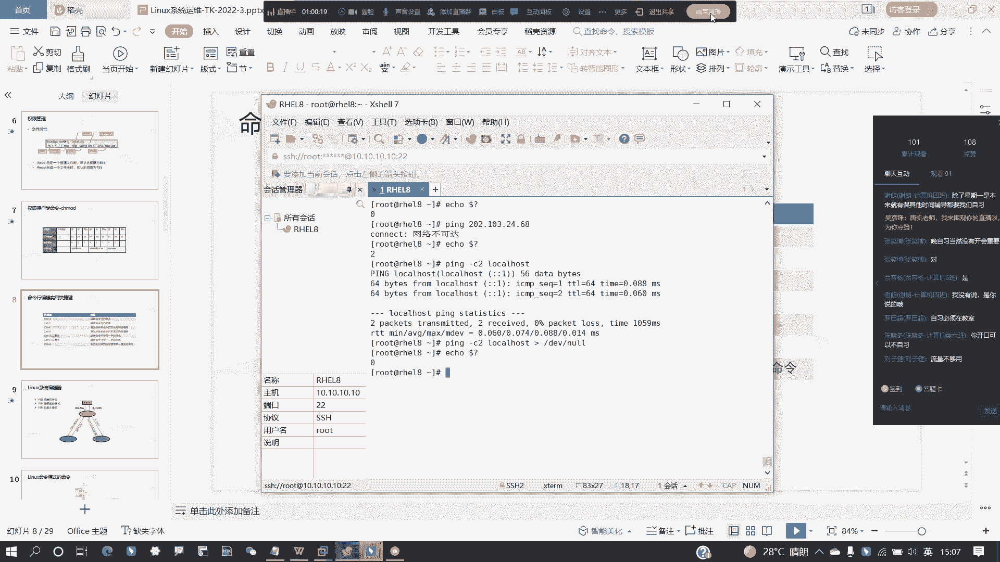