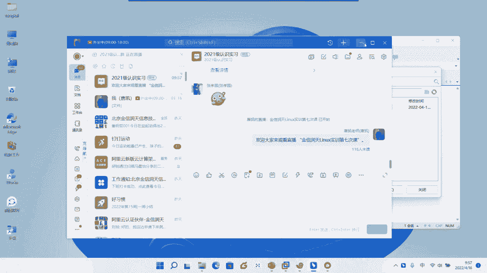
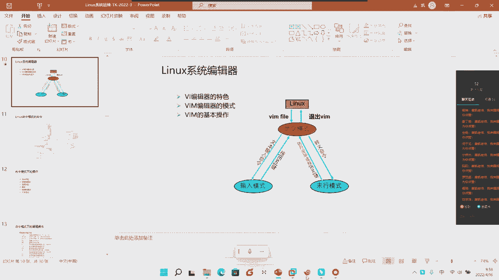
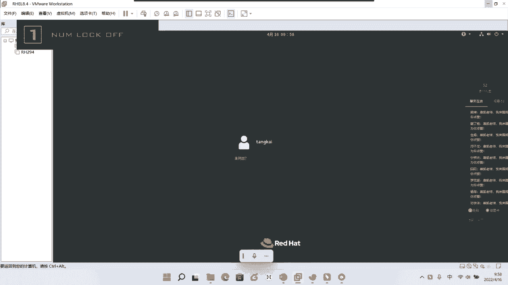
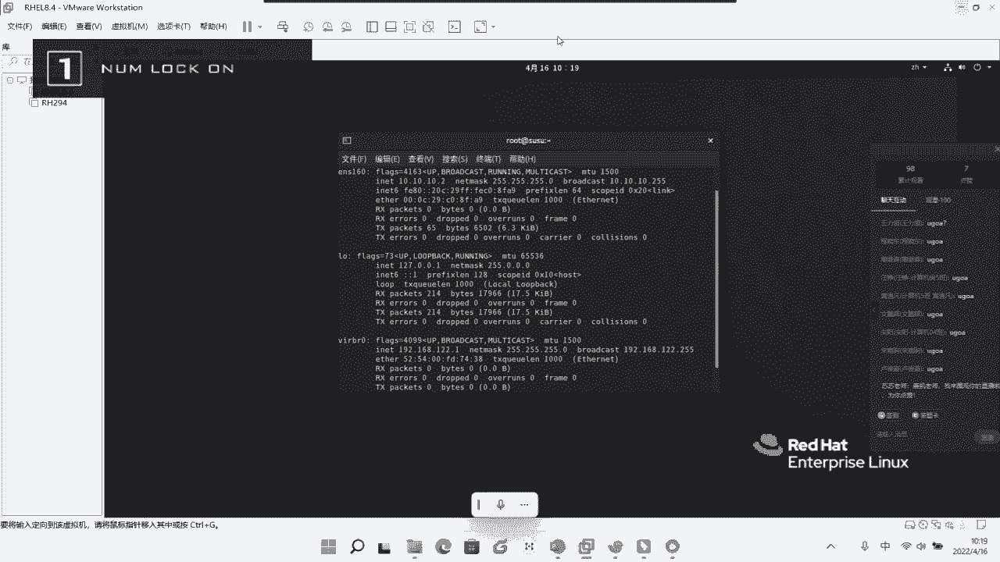
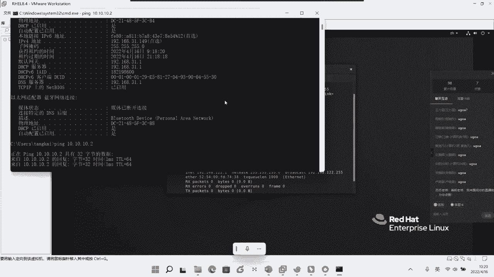
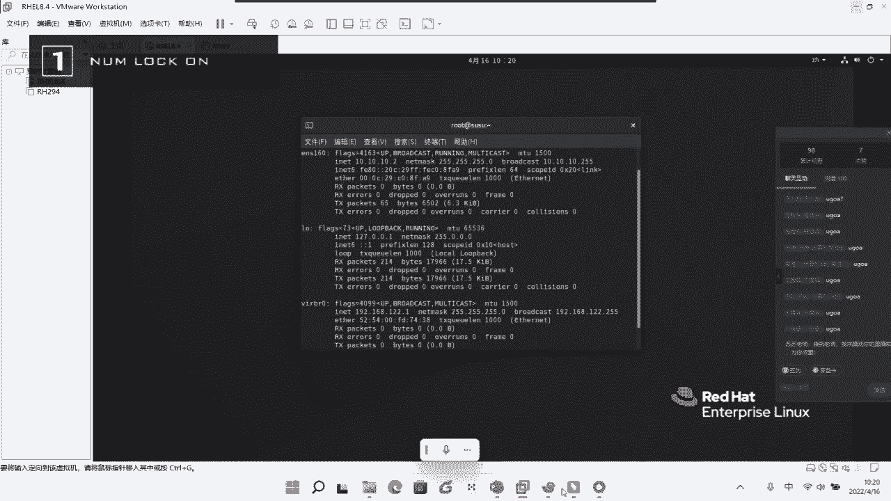
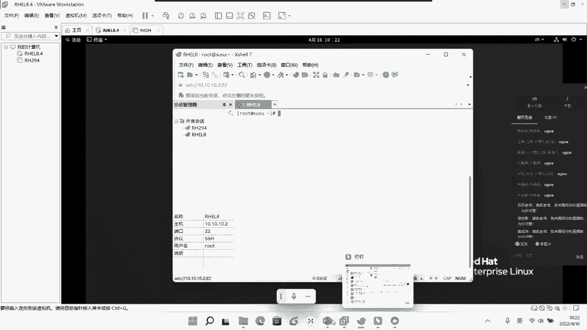
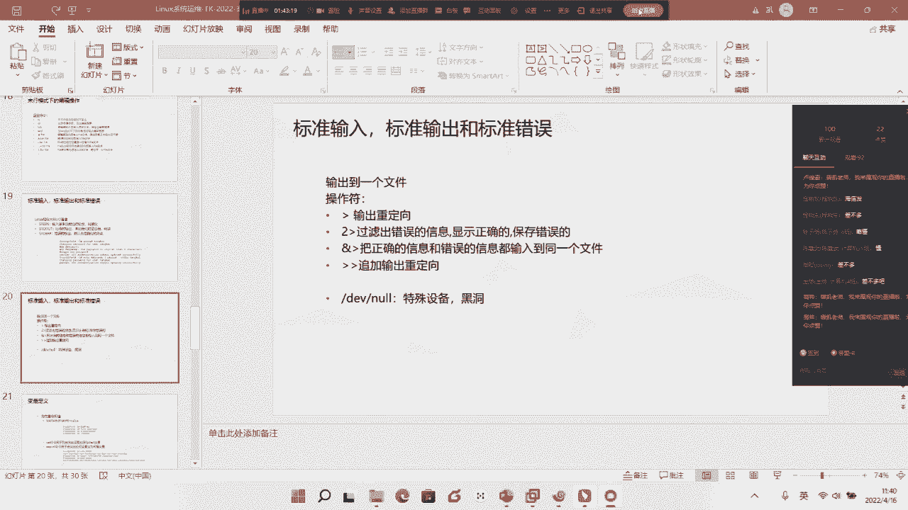

# Linux基础入门教学-7 - P1 - 唐老师开讲 - BV1uP4y1S71X

好，各位同学能听到我声音吗，啊问一下大家听的可以听到我声音吗，测试一下，测试一下有没有人是不是到底能听到我声音，可以可以ok ok，嗯好的好的好的，看来还有很多同学还没有来啊，还没有来。

所以那个我们再稍等等待一两分钟吧，好吧，嗯，好我们课程就正式开始啊，我们课程就正式开始，然后呢有些同学可能呃还没有来啊，还没来，希望尽量的以后就尽量的尽量的就是还是按时来啊，还是按时来，这样来说的话。

就是大家听起来可能会更舒服一些是吧，更舒服一些好，那么我们在上一周的时候呢，其实跟大家去啊，也去讲了很多很多的这样一个啊这个技术啊这样一个内容，但是呢在上一周的啊下午的时候呢，因为也是一个突发情况是吧。

大家啊大家要去做那个核酸啊，大家要去做核酸，所以呃我们的课程是在三点左右啊，三点左右应该是三点多一点，然后呢呃就是就没有继续了啊，没有继续了啊，所以呢可能我们会就是啊我这边会给大家去进行补一次啊。

去跟大家就是把就是我们所既定的这个内容是吧，因为大家学的还确实不错啊，确实不错，然后呢呃慢慢慢慢的啊对linux整个这一块的这个感觉啊，逐步逐步都出来了啊，都出来了，也觉得就是通过啊平时的一些交流哈。

就是能感觉到大家就是还是，特别特别的还是希望把这个技术把它学到的对吧，所以呢呃可能就是原计划，原计划应该是呃咱们认知的这个课程应该是本周对吧，也就是今天啊会去结束的啊，会结束的。

但是呢啊但是呢那个因为大家还有很多同学，那个就是我们上一次课程的时候呢，会这个落就是掉了一点点啊，会掉了一点点，所以那个我们计划就是我这边计划是下周六，下周六的时候呢再给大家稍微补一下啊。

这个大家稍微补一下啊，所以我想问一下大家，就是下周六大家是否啊这个就是就是是不是正常有，时间我想问一下啊，因为我不太清楚这个周六你们会不会安排有其他的这个课程，或者说呃呃呃比如其他的什么东西。

就是有没有，如果说有的话，我就好安排，想首先在课程之前要先问一下，就下个礼拜下个礼拜的那个周六上午或者下午啊，想问一下大家有没有那个这个有没有这个安排，其他的一些什么课程或者怎么样，有没有。

这大家能听到我说话吗，这个可以给我一点反馈吗，就下周啊，就下周六的白天啊，大家有时间吗，不知道应该有下周六白天大概有12没有，就是就目前学校还没有安排是吧，就目前学校还没安排是吧，可能没任务。

哦好吧好吧啊，因为原计划是说本周啊，原计划是说本周那个就是今天，然后呢咱们的这个实训阶段的课程结束了啊，结束的，但是因为上个礼拜礼拜六的下午对吧，当然那个因为统一安排了这样一个核酸。

所以呢我们的这个课程没有结束掉啊，没有就是没有按照正常的这个既定的时间把它结束掉，所以呢呃给大家说补一次啊，给大家稍微补一次，是这样一个计划好了，如果说大家不太清楚的啊，如果说大家不太清楚的话。

那我们呃那我那个后面吧，我后面吧，这个周一周二的时候，我问一下咱们的老师好吧，问一下咱们老师，那如果说啊有时间的话，就给大家补一下，那如果说呃时间产生冲突的话，那可能我们就需要去挪到呃。

落到其他的时间好不好，反正到时候我们在群里通知好吧，我们到时候在群里通知，这样来说方便与大家那个呃既然是呃这个实训对吧，既然是咱们金润天的整个这一块的这样一个比较系统的这样一个，实训的一个课程。

那当然呃作为企业方啊，作为我们我们都还是希望大家能正常的能把这个技术学到手啊，学到手，这是我们肯定所希望的，好不好好嗯，那废话就不多说啊，就不多说了，那我们正式开始啊，正式开始好。

我们呢首先同样的要回顾一下我们在之前啊，在我们上一次课程给到大家所讲到的啊，这样一个一批的这个命令还记得吧对吧，我们在上一个礼拜六的时候呢，应该给到大家讲到的两个比较啊，大的一个概念啊。

讲的比较大的一个概念，那第一个大的比较概念是什么，大家来想想是不是就是我们的继续把我们的命令讲解完了，还记得吧，继续把我们的命令给他讲解完了，所以这是我们一个比较大的一个内容，那么在命令的过程中。

我们应该是讲教给大家了一批查看文件类的命令，还记得吗，比如说有我们的什么呀，cat对吧，有我们的cat，有我们的什么moon，还记得这个概念吗，对吧，还有我们什么less对吧，cat moonless。

对不对好，那除了这些之外呢，我们其实还有什么就是cat moonless之外，我们是不是还讲到了哎，我们头部默认情况下面头部的这个查看的实行的内容是什么呀，had还记得吧对吧，那既然有头。

那我们也有什么呀，倒着尾，从后是吧，从最后往之前看的有什么呀，tell还，记得吧对吧，那tell的时候呢，我们也讲过它有一个杠f的参数对吧，跟f参数是一个什么呀，实时动态查看的对吧，实时动态查看的。

那当然除了这种之外呢，我们其实在上一次课程的时候，我们还讲了一个命令叫nl，还记得吗，叫nl，那nl是什么意思，我们说它类似于啊，我在说明啊，它类似于我们的cat啊，类似于我们cat是什么呀。

它是能直接把cat从头刷到尾的，同时还增加了什么，增加了我们的行号，还记得吗，还增加了我们的行号啊，是要求大家去记住的，所以我们说通过查看一个文件的命令，我们其实有这么多啊，有这么多，请大家注意了。

对不对好，那除此之外呢，我们其实还讲了一些比较重要的，比如说我们讲到了什么呀，f还记得吧，我们去讲到了一个f，那这个find这个命令呢，我们说是用来看没有用来做查找的对吧，是用来做查找的这样一个命令。

对不对对吧好，那么在恰饭的这个命令过程中间呢，我们给到大家要求大家去做了一个，我们在红帽的rh cs a的这个什么认证，中间的一个原题给了大家去讲的是什么原理啊。

我们r h c a c中间要求大家去讲的一个原题对吧，给大家讲一个原理啊，这个就是考试过程中的一个原题是什么，是不是用find查找我们当前系统中间某一个用户的所有的文件，然后将这个用户所有文件给他干嘛。

给它copy到指定的哪个文件夹里面去，还记得吗对吧，copy到哪个指定的文件夹里面去，我们说通过这种方式我们就要做什么呀，find啊，用find命令来做，对不对，好这个要求大家一定要去熟悉啊。

了解大家一定要去熟悉，那当然在上次课程的时候，很多同学也都说我说啊，我这个有这个回放录屏是不是有回放啊，所以这个我也会经常性的去学对吧，经常去去去学好，那么呢在这里啊我要提醒咱们所有的同学们啊。

虽然说有回放，但是呢啊这个唐老师也做了一些设置啊，做了一些什么设置呢，就是你不能说让是吧，是不是，所以呢啊我我也做了一个设置，就是要求啊所有的同学把这个回放啊，尽量的是吧，如果说你要不太懂或者怎么样。

就尽量的去把它看一遍啊，尽量把它看一遍，就还是要学到手，否则的话我到时候定期，我就把那个回放给他删了啊，就进去把回放给删了，好不好，这要求大家注意啊，叫f好，当然除了find之外呢。

我们还有一个什么叫grape对吧，还有一个叫grave gp，那么在grape过程中间，我们说过他是做我们的什么呀，筛选的还记得吗，它是用来做我们的筛选的，那既然有筛选，按照中文解释说。

筛选的前提是什么，是一定是因为做了什么命令，然后在一个大的范围中间，我们是不是才去做一些二级的筛选的内容，是不是，所以呢我们是要求讲到了一个新的一个什么呀，一个管道符还记得吗，新的一个管，道服的概念。

那么管道符我们也提过是吧，它相对于前面命令执行完之后，将结果通过管道什么呀，传递到后面这个命令做二次执行啊，啊后面这个命令是拿到前面这个命令是什么呀，执行结果啊，执行结果去做二次执行前，大家听好了。

我们说称其为叫什么呀，叫管道符啊，称其为下管道服务，是要求大家一定要记住啊，一定要记住，这是我们的管道的概念啊，这是我们管道的概念，就是要求大家啊这个要熟悉啊，要去了解啊，要熟悉，要去了解。

这要求大家去听进去了啊，这种管道夫对不对，好，那除此之外呢我们也去讲的有什么呀，有copy对吧，还有什么呀，moon这个move是吧，就是我们所谓的这个呃复制移动，但是我们说过复制除了复制移动之外呢。

我们其实可以同时干嘛进行我们的更名的对吧，同时进行我们的更名的好，那我在这里考一考在座各位，我们说copy它默认情况下面试仅仅只能复制我们的什么呀，文件是不是仅仅只能复制我们文件，那我们带个什么参数。

它可以复制我们的文件夹呀，啊我想问一下大家带个什么，他可以复制我们的文件夹呀，好那有同学打了有一个什么呀，有一个r和rp是吧，好那我想问一下啊，这个这个带p的话啊，带p的话是什么东西。

啊如果说我现在假设叫copy啊，杠p ok很好啊，对权限的复制啊，权限的复制非常棒啊，非常棒，好很好，所以我觉得大家还是真的是学到位了，真的还是很用心的在学对吧，很用心的在学啊，这是我们整个这块好。

那么我们在这是我们在上一周的，应该说上午的时间是吧，应该是上午时间给大家去讲到了很多很多的这样一批命令好，那除此之外呢我们应该是在下午的时候呢花了一些时间给到大家去，讲到了有权限对吧，讲到了权限好。

那么我们说我省先第一个啊要求大家去理解，就是我们的权限是真对文件和文件夹而言啊，c要求大家去记住的，对不对，我们应该是在上次课要求大家去理解啊，我们的权限是针对于我们的文件及文件夹而言的对吧。

并不是针对于用户而言，是不是，但是呢我们其实实际上对文件求文件夹去操作，其实也是针对于我们什么用户而操作，是不是好，那其二呢请大家注意了，我们说使用权限的命令，我们叫做有一个什么呀。

change mood，还记得吗，叫change mode，对不对，好，那么在千金mod过程中间，我们说有两种方式来复证我们权限，第一种是什么呀，是用我们的数字对吧，是通过我们的数字，那我想问一下大家。

我们默认情况下面我们的文件的默认权限是多少啊，默认情况下面我们权限的默认就是文件的默认权限是多少，文件的啊，k644 对吧，644，那文件夹是多少呢，文件夹是多少呢，k75 很好好，那我想问一下。

为什么文件和文件夹而言，为什么文件夹是七五，为什么会多一个这个五出来，为什么会多一个一呀，我们大家都很清楚，是不是啊，4i一为一组对吧，为一组，我们一共有三组，对不对好，那为什么会多一个这个一出来呢。

原因是什么，嗯可执行，当然我知道可执行对吧，原因是什么哈哈到时在说可视性是不是其实很简单，是因为它是文件夹对吧，我们必须有一个什么呀，双击进入的一个概念，那既然双击进入我们的文件夹。

赤壁它就会具备有一个什么呀，可执行的概念对吧，可执行的概念啊，这是我们整个这一块，我们叫做千金mod啊，叫千金mod好，那当然除了我们书之外，我们其实还有一组什么呀，字母的概念，还记得这个概念吗，对吧。

还有一组字母的概念，那这个字母我们是由哪几个字母所组成的，大家还记得吗，哪几个字母，啊不是这个权限是rw x，就是那我们说前期目的过程中对吧，过程中啊，我们需要除了这种可以通过数字来复制这种权限之外。

我们还可以通过字母的形式对吧啊字母的形式来复制这个权限，对就是我们的什么呀，有g o a对吧，就是我们u g o a这个要求大家去记住了，是不是啊。

u g a当然刚刚我们很多同学打的这个r w x就是什么呀，可读可写啊，可执行对吧，可读可写可执行啊，这是我们的整个这一块的概念，是不是，那么这是我们在上一次课程是给到大家讲到的这个讲到的内容啊。

讲的内容是要求大家一定要去啊熟知啊，一定要去熟知的，好不好好，那当然了，这次我们就回顾到这里啊，我们就回顾到这里嗯，那当然还有很多同学依然啊依然这个对我们整个这一块，这个操作啊不是太了解啊。

我们俗称的插销和我们的那个这个虚拟机可能还没有连通到位，还没有连通到位，这个东西可能呃还是需要要求大家一定要认真的，就是细心的去去理解啊，细心的去理解，为什么呢。

首先第一个我们教给大家的是有一个什么if config对吧啊，if configure我们是用来查询我们的什么呀，这个虚拟机的ip啊，这要求大家去记住，那我们一定要知道它的这个网段啊。

这个后面的这个这最后的一位指的是这一台机器的ip啊，现在跳了，而这个是不是代表我们的什么呀，地段啊，地址段，什么叫地址段呢，就相当于咱们这个专业都是计算机系的啊，举个例子啊，咱们假设都是计算机系。

你可以理解诶，前面这个称它为叫做什么呀，系对吧，称之为这是我们的意思么，院系的概念是不是，而后面的这个才是代表你个人啊，代表代表你个人，但是但是请大家注意了，代表你个人情况下面，你可不可能跟别人重名。

比如说别人也要谈开是吧，好如果说这个班里面有两个人叫唐凯是吧，你们肯定会怎么样，会去问什么，大唐砍小唐砍是吧，是有这种概念啊，是有这种概念，但是呢今天我们的ip如果说都在这个地址断的话对吧。

如果相互能连通的情况下，你的ip这里的ip啊，这个虚拟机的这个ip大家注意了，它仅仅代表这一台虚拟机是吧，仅仅代表这一台虚拟机，你一定是不能把你本地的我再说一遍啊。

一定是不能把你本地的这个大家注意啊，在这里叫什么呀，ip config还记得这是干什么ip config对吧，杠是不是or吧，or所以你一定要清楚我们一定是什么，这里的ip大家看这是我的虚拟机。

看到没有，这个win night，这个是不是虚拟机的，这个ip你看我这个ip是不是也是这个什么呀，计算机系的是不是也是计算机系的，但是我真实记得这个ip和我虚拟机的ip它是怎么样，它是不一样的，看到没。

他把真迹也设成了10：10，是10。2，所以如果说你都是这样的，那是不是就像打架了，是不是因为你的ip啊，它是这样，在你同一个网络中间是不是出现了两个一模一样的，这是不对的啊，这是不对的。

所以请你注意一定是什么呀，要有区分啊，一定要有区分，就是你前面是一样的，大家注意前面一定要是一样，你是不是都是一个系的，对不对，好所以后面呢最后一位就代表什么呀，你唯一啊读一读一个读一个好。

所以这个时候当你是这个时候呢，第二部干嘛去拼，是不是去拼啊，我再说一遍去拼，如果你拼得通。

我再说一遍，如果你拼得通，你才能将我们的什么呀。

这个插销去做什么呀，新建听明白才准去做新建，我再说一遍啊，才准去做新建，所以新建诶比如说我们的h e l什么样八是吧，主机这里去敲十点十点十点几呢，因为我这是我的真实性，是不是我要去连接我，虚拟机。

所以我一定是填写是我虚拟机的主机ip，请大家听啊，虚拟机的主机ip是不是的好，然后呢，当然你键盘什么的，你自己去稍微调整一下啊，调整一下对吧，这个v t啊，这个这个终端呢本来选择ut f8 对吧。

全点好，我们再连接的时候，它就会跳出这样一个概念，好，你可以选择一次性，也可以选择什么接受并保存，是不是好输入我们所对应的什么呀，主机的用户名，然后书上我们所对应的密码是不是。

ok我是这个时候我是不是就连上来了啊，这个时候是不，是就连上，而且我们是不是给到大家去讲到了我们这条命令叫起什么呀，host name city，老师host啊，这个什么呀。

sagg host lamb，还介词概念吗，对吧，去把它改我们的什么呀，主机名都可以啊，都可以，没有任何问题的，是不是对吧，是要求大家去理解啊，这一条是将我们当前和下一次的主编是不是全部把它换掉。

是我们讲过的，好ok这个我就不再多说了，我就不再多说，当然如果说你比较卡比较卡，我们也讲过，你需要去装一个什么呀，装一个这个插manager的这个套件啊，装一个插manager套件。

而且这个套件我也丢到群里了对吧，我也丢到群里了啊，就是如果你开始跑这个x shell特别卡，特别卡，你去装一个x manager的这个这个这个套件装上去，你就能正常的就像我这样啊，就是正常的来使用了啊。

正常的使用了，所以要求大家去记住啊，出现了一些问题啊，出现了一，些问题对吧，所以要求大家去记住的好，那当然如果是ip这个东西我就不多说了，这是第一次课讲到的，是不是通过图形化的形式是吧。

设置我们的ip地址啊，如果查看ip，我们也教给大家了啊，交给大家了好吧，这个我们就不多说了啊，这个我们就不多说了好。

好那么接下来呢我们今天上午的时间啊，我们今天上午的时间我们要去讲到一个新的东西啊，讲了一个新的东西，那么这个东西叫什么呢，叫linux的系统编辑器啊，linux的系统编辑器，请大家听好了好。

首先呢我们要求大家去理解什么叫系统编辑器，说白一点就是它你可以理解啊，它就相当于啊它因为它跟我们windows有点不一样啊，我们说如果你现在windows中间。

我们完完全可以通过鼠标图形化的形式去做很多很多的操作对吧，很多很多操作，大家注意哈，它的优势在于命令行，所以我们除了去敲击我们各种需要帮助去解决的命令之外，请大家看啊，去解决命令之外。

我们更多的是需要通过修改我们的配置文件，去让系统达到啊去认知我们所需要的啊做法，这是我们的概念，先打听好了好，那既然谈到了这里啊，既然谈到这里，我们就需要让大家理解的就是在我们整个电脑中间啊。

在我们今天的电脑中间，我们系统编辑器其实有很多很多啊，可以这样说，就这样，今天啊我们的电脑中间去呃，比如在windows中间我们需要去做什么功能的时候，你在百度那中间去搜。

其实你可以搜出很多很多同样的这种软件，对不对，但是呢啊我们为什么比如说很多人刷这个什么抖音，是吧啊啊，比如有快手，有抖音啊，甚至有什么这个这个什么视频号，对不对，为什么。

而是因为你觉得刷着抖音已经形成了另一种模式了，是不是，那同样的今天我们在linux中间呢，我们有很多很多的编辑器啊，很多很多，比如说有nano，有什么imax啊，有很多，而且很多编辑器的功能要给我们。

今天讲到的这个v i m啊，就是这个v i m编辑器的功能要强大很多，还要强大很多，那很多人说，那为什么不去讲新的呢，对吧，为什么不去讲新的呢，好请大家注意了。

是因为啊是因为今天我们的这个编辑器是系统默认自带的，我再说一遍啊，今天的vi的编辑器是我们系统默认自带的好，那很多人说不太理解，那这个默认时代是不是就是最好的呢，不是对吧，但是为什么系统要去带他呢。

啊是因为记住我这句话，还是记住我这句话，当系统出现重大事故，什么叫重大事故，说白一点就是比，如说我系统起不来了对吧，我系统起不来，在启动工作过程中间卡住了。

那么这个时候其他的编辑器它是依托于系统之上的应用程序，我再说一遍啊，我们的其他的编辑器是依托于在我们系统之上的应用程序，也就是说如果今天我们系统启动不了对吧，启动失败。

那么你其他的这种编辑器应用程序是打不开的是吧，是打不开的啊，我在这边好，那么这个时候当我的系统一旦起不来的时候，它默认只能只能用系统基于类和自带的这个什么呀，vi编辑器来帮你修复系统啊，来帮你修复系。

统，所以所以今天我们的vi为什么依然是很多工程师或者开发人员，或者运维人员啊，非常熟悉，原因就是是因为它是默认在我们电路中间的啊，默认在我们电路中间的对它功能可能不是最强大的，知道吧。

但是他一定是什么呀，是最合适的啊，最合适的，请大家注意了好，那么既然默认是最合适呢，我们就要知道是今天你会发现啊，在这里特别好玩，它一个是叫v i，看到没有，一个是叫什么呀，v i m啊。

一个是叫v i，一个是叫vm，这个有什么区别，呢啊这个是有什么区别呢，请大家听好了，我们今天的vi啊是默认的，而v i m呢它是后期的啊，是后期。

也就是说你可以这样理解vm相当于我刚才讲的其他编辑是一样的，它是一个什么呀，是一个升级法啊，它是一个升级法，对它是一个应用程序，是一个工具，那么呢它我们默认全面系啊，系统请外面其实是vi啊。

其实vi而且系统默认就安装了，就是你装好系统之后，默认vi就已经生成了啊，就已经生成了好，那么这个时候vi和vm有什么区别呢，啊这个vr和v有什么区别呢，我首先打开vr给，你看一下其实很简单。

今天在我们电脑中间不是有一个这个这个这个这个啊文件嘛对吧，我们说vivm它主要是文件编辑器啊，主要是文件编辑器，所以直接打开它就行，那怎么打呢，你可以理解为它就像是命令一样的，看到没有。

它就像是命令一样的，你看我首先用v i空一格对吧，所以命令后面是不是都要有空格，对不对，空一个打开它，打开它，打开它回车回车，你看我是不是就打开进来了。

那你现在看到的是不是可以理解为跟我们之前的什么cat move less是吧，had t是不是这一类是不是都是，一样的是吧，它其实vr是不是也如果我不编辑，如果我不编辑。

它是不是相当于它也是类似于我们查看的一个命令，是不是对吧，也是类似于我们查看的一个命令，能理解意思吧，好这是我们的v i了，好那当然退出来，我们先不给大家去说啊，先没有给大家去讲啊，这是v i好。

我们再来看v i m，你看我就多了个m啊，就多了个m回车，能看到效果了吗，能看到效果了吗，各位，啊能看到效果了吗，能告诉我vi和vm的区别吗，能看出效果吗，啊vi和vm的区别是什么，是什么。

各位能能能知道区别是什么，啊vi是什么，是这样的，是不是是这样的，那vm是怎样的，对吧是这样的，哼哼高亮的颜色是不好对，其实这个就是真假的颜色，那对于我们而言，增加颜色是不是便于你更好的来进行。

比如说开发呀，进行排除啊，进行运维呀，是不是的啊，所以请大家注意了，今天在我们系统过程中间啊，我再次强调，如果你今天在在安装系统的时候，你选择的是什么最小模式安装啊，对吧啊。

这个安装的是一个什么什么无图形化的时候，你装完之后它默认只有vi啊，只有vi，但是一旦你有图形化的这个这个就是带桌面的这个系统安装完之后，哎这个时候呢它就会有一个什么呀，vm默认就会给你装上去了。

而对于我们而言，但是你要清楚，如果你今天在未来的运维的这个企业中是吧，运维的过程中你插了vm，但是呢没效果啊，我在说没有效果，这个时候你敲vi是一样的是吧，是一样的，是要求大家去记住的。

ok那既然知道了，目前我们大家都知道v和vm区别之外，那我们接下来就要清楚的知道是今天啊，我再说一遍啊，今天我们的vi编辑器啊，vim编辑器它默认有三个模式，请大家认真听啊，默认有三个模式。

哪三个模式一个是叫做命令模式啊，一个是叫做输入模式，一个叫做末行模式啊，一共有三个模式，好，那我把这个图给大家讲清楚，其实我们vi编辑器的整体的逻辑，整体的概念就清楚了，那怎么来理解呢，很简单。

今天在我们link操作系统过程中间，那我们想去编辑某个文件，我们直接去敲vm空格某一个文件是吧，feel进来，那默认进来的时候呢，我们称其为叫做mini模式，我再说一啊，当我们登录之后。

我们默认其实它就叫我们的怎么样，我们的命令模式ok就叫我们的命令模式好，那么在命令模式过程中间啊，我们肯定现在有mini模式，从顾名思义角度来说，我们是不是有一批命令是吧，就会有一拼命命啊。

有什么很多很多很多很多的东西，对不对，好，接下来，但是命令模式它更多仅仅只是查看啊，进行我们所操作的，但是它无法编辑啊，无法编辑，那我需要编辑的时候呢，我需要通过在命令模式中去敲某些命令。

然后将我们指令传输到一个新的模式啊，一个新的模式叫做输入模式是吧，叫，编辑模式或者输入模式，然后在这个模式中间诶，我们可以对我们的文件进行很多很大量的什么呀，编辑添加等等等等的操作是不是好。

但是按照正常逻辑是不是编完之后，我是不是就需要去末行模式保存退出啊，大家注意啊，我们的末行模式说白一点是称其为救助保存退出的啊，保存退出的，但是但是大家会发现我们这个图中间有一个地方诶，不对呀。

怎么不对，因为没输入模式，到末行模式它不能直接打开，没有它没有这个横杠，它是不能直接过去的对吧，不能直接过去的，那么这个，时候我们需要干嘛，需要将输入模式退回，我，大家注意啊，退回到命令模式。

那通过什么来进行退回呢，啊什么呀，你看从这个镜头上你就能理解通过什么来进行退回啊，是不是将按e s c，我大家注意啊，按esc，然后退回到我们的什么呀，命令模式是不是退到我们的命令模式。

然后在我们的命令模式过程中间干嘛呀，诶去在输入我们的什么呀啊像类似于这种转移的啊，在输入到末行模式，那在墨盒模式干嘛保存退出啊，保存退出，听明白保存退出是不是，这个能理解我所数据的保存推出好。

但是但是如果你问号模式发现诶我还有地方没有修改，我还想退回到输入模式怎么办呢，诶我又必须得按e s c干嘛啊，回到我们的命令模式是吧，回到我们面试，也就是说输入模式和默认模式。

我想回命令模式都是按什么呀，e s c，听明白sc，的这个插座能听懂我所说的意思，ok，好这个这个能听明白我所说的是吧对吧好，如果说大家对这个图啊，对这个图就是理解比较ok的话。

其实我们今天上午啊无非就要解决这这个图就行了啊，这个图很多人说哇这个图啥都看不见了，没关系啊，我后面都给你解开了，那这个图是什么呢，其实就是我们今天上午要掌握的一拼命令啊，掌握了一批命令啊。

我们希望大家跟着我听，那你听完这篇命令你都会了都会了，非常简单啊非常简单啊，你可以理解为相当于是功能键啊，相当于是功能的功能键，是不是好，那我们废话就不多说啊，废话就不多说，我们就直接开始啊。

直接开始啊，首先第一个我们要要求大家去掌握的是在我们links下面呢，我们有一批啊，就命令模式下，应该是在命令模式下，我们有一批需要让大家去掌握的这样一批这个操作，比如说mini模式下面。

我们首先第一个我们因为我们说啊，从今天开始，我们一定要忘记我们的鼠标这个概念啊，忘记我们鼠标的这个概念，你可以理解为我们相当于我们现在就是在那个黑白底界面对吧。

黑白的界面我们更多呢是需要通过命令来帮助我，们类似于光标一样的进行什么样去定位，到我需要去修改的某个地方对吧，所以首先第一个我们要去教会大家去控制的是什么，光标的控制啊，光标的控制。

那当然第二个就是教会给大家什么呀，替换和删除啊，替换和删除对吧，第三个复制粘贴啊，复制粘贴那第四个搜索对吧，第四个搜索，第五个我们叫什么呀，撤销和什么呀，重复对吧，撤销和重复，第六个文本选中啊。

文本选中，请大家注意啊，这是我们的六个啊，这是我们的六个要求大家去这个这个掌握啊，要求大家去掌握好，首先呢我们，来看看第一个啊，首先看第一个哇，怎么这么多啊，怎么这么多，没关系，我们一个个来理解啊。

一个来解好，我们今天呢为了实验方便啊，为了实验方便，我们需要要求大家同样的这个做法啊，把这里清掉，然后copy，大家注意啊，copy啊，我们的啊srt下面的这个文件到当前来这个讲过是吧，到当前来好。

到当前来之后，我们可以看到这个文件，而且dc杠l我们能看得到这个文件一共有50行啊，一共有50行，是不是好，50行好，那么我们也就是我们是把这个文件拿做来做实验。

啊来当做整个实验这个操作是不是好vm或者vi打开它啊，打开它好，打开它之后呢，默认全面面，我在说什么啊，默认全面，我们的光标是在第一行啊，sorry，默认情况我们光标是在第一行，而且请大家注意的是。

你进来之后呢，其实大家都很穷，我当我登录进来之后呢，我默认的是什么，默认是不是就是我们的命令模式是吧，默认就是我们的命令模式，而且这个命令模式呃，这个这个什么环节过程中间，请大家啊。

我们命令模式环节的声音是密集模式的，这个环境过程中间呢，哎我们的默认情况下，它这里其实有这个提示，比如说有50行，看到没有，这个文件一共有50行，有1463个字节对吧，你目前的光标是在第一行的什么呀。

第一行的第一个是什么呀，这个这个这个字符的这个概念中间对吧，目前是顶端啊，目前是整个文件的顶端，他其实都会有讲解啊，他其实都会有这个提示，告诉你文件名是什么对吧，文件名是什么，请大家听好了。

那么如果我今天没有光标哦，大家注意没有光标，你可以用你的键盘的上下左右键，我再说一遍啊，你可以用你的键盘的上下左右键，你，看我现在就是上下上下左右键，我可以这样做，没有任何问题，对没有任何问题啊。

那除了上下左右键之外呢，我们其实还有一批案件啊，还有批按键拿什么按键呢，在这里只是提醒一下这个，因为很多人可能不太熟悉，记叫什么k j h l什么意思，也就是说今天你按我们的这个什么呀。

jj就是你的键盘的一个j是什么呢，向下的看到没有，是向下的，那按l呢是向右的，那向按h向左的，按k呢向上的啊，相上的它相当于是什么呀，上下左右键啊，相当于是我们的什么呀，上下左右键，请大家注。

意啊下次我们的上下左右键好是这个概念，你可以用你键盘的，就是我们键盘上面的上下左右键，同样也可以相当于是我们这j k h l这个操作啊，j k h l的这个操作也没有问题，好吧，就是这个好。

那当然如果翻页呢，我想一页一页的翻页呢，它这里也同样告诉你有什么呀，page up page down啊，page up啊，就是我们所谓的这个这个呃相对是什么。

就是我们的上下翻页就是ctrl加b ctrl加f啊，come加b can加f，它也是这这个一页的翻啊，比如做完ctrl f就下一页了啊，come加b，呢上一页啊对吧，就是翻页啊，翻页就是这种概念啊。

翻译啊，这个我觉得快速路过啊，快速路过，ok，啊这是我们整个这块好，那如果我今天想去敲我啊，比如说我举个例子啊，比如说我今天想将我的光，我们光标不是，你看我像光标是不是在这里，他不是在第一行。

是不是在第一行，它是在这里好，那我想将我的光标立刻定位到第一行怎么办，按大写的h就到第一行了，我再说一遍啊，按大写的h在命令模式中间，按大写的h就到第一行了，好这个听懂了没有，大写的h就到第一行去了啊。

就这么简单啊，就这么简单，ok，ok好，那如果我想定位到，比如说啊举个例子，这是我们当然我们刚刚看的是50行的内容，所以你翻译是不是到最后去了，但是如果诶如果我是5000行的呢。

那你要像这个光标往下这种，比如说往下一直往下，那你想到最后是不是太困了吗，为什么5000行，那你等是不是等的很麻烦，我希望很快速，比如说我想修改这5000行的最后一行，我我再说一遍。

修改这五项行的最后一行，这个时候我们如何更快速的很快速的立刻到是吧，这篇文章的最后去呢，很简单，开玩笑就大积极对吧，大积极a到最后一行去了对吧，到最后一条去了啊，大写的两个gg啊，听明白对不对。

就连续啊，就连续按的大写两个好，那如果我说我想到开头呢，而且开头呢是吧，是不是整个文章开头了啊，就这么简单啊，就这么简单是吧，大小ok是吧，好那如果我想就是比如说我关闭就在这一页啊。

大家注意我没有翻译啊，就在这一页的任意一行，我想到开头呢啊，任意一行我想比如说我在这里，我想任意一行，也可以对吧，但是如果我今天是在这个好，这这就比如说我在中间也有基本有投影，没有稳。

你是它是相对于整个文章的开头，但是我想在整个版页的开头呢，我刚刚讲过大写的什么呀，这个h啊就可以直接到我们所对应的这个这个这个里面去了，听明白，ok好，那如果说我要m听m是什么。

就是整这个当前页的中中间啊，中间m你看看就定位到中间去了，看着大写m啊，当定位到中间去了，那我大写l呢，那l呢他是这样的啊，因为我们今天是用这个呃这个什么x shell。

它这个区分的会有点这个这个这个小问题，而l是什么呢，在屏幕的最下行应该是这样的，l是屏幕的最下行啊，请大家听好了好，那同样n l n h啊指的是什么意思呢，就是你定位到屏幕的第几啊，n指的是数值啊。

数值二指的是屏幕的第二行啊，比如nl啊，三比如说三就是什么倒数第三行是一样的概念，ok一样的概念好，这个能听明白意思吧，ok好，那当然这个什么wb什么，这就是什么意思呢，就是说它相对于这呃指的是什么呀。

这个这个只是了解一下，比如说我现在我举个例子，我到h这里我到h如果你按照小写的w，它相对是什么呢，定位到这个单词，跳过这个单词的后一个的开头曲啊，你看我再按个w，它到哪里到踢了，那如果我再按呢。

它到哪里到这个点了，看到没有，他认为这个是一组单词，听明白啊，是这样的好，那我按一呢它是一样的，到这一行啊，叫到这个单词什么末尾，他不知道开头，而是到末尾，是吧好，那如果我再按这个一到哪里。

是不是到点了，再按一呢，到m是不是是一样的概念啊，是一样的概念，ok好，那如果我按b呢，它一样的回退，看到没有回退是一样的概念啊，听明白ok好，那如果我要呃呃就是我敲一个数字的零呢，它是到整行的开头啊。

我在这里，如果我敲一个数字的零是整行的开头，听明白对吧好，那我想这一行的末尾怎么办啊，这一行比如说我要到这个最近这一行的尾部怎么办，按一个dolf啊，还有一个dolf它的尾部了，看到没有。

爱一个dolf它的尾部了，那如果我按这个小，三角呢是这样，这一行的开头啊，这一行的开头，所以这一行开头相当于和零是一样的意思，听明白是一样的意思啊，无非就是说这个零次如果说前面有空字符的话。

他可能定位的是那个空的空的上去，而这个小三角是定位一个非空字符，这个大家能理解吗啊这个大家能理解吗，我在说啊，比如说我今天多了两个空格是吧，多了两个空格，我在这边多了两个空格好。

那如果我今天定位到最后一行，我敲零，你看他是不是叫空的这个这一行这个字符上去了，是不是啊，这个能理解吧，好那如果我要切小三角呢，它定位到这个什么呀，n的这个上面去了，就这就这个概念啊，就这个区别。

那就这个区别，o，快不快，这一版是不是立刻就讲完了，立刻就讲完了，快不快，嗯嗯，好，就这么简单啊，就这么简单，所以要求就是在这个命令模式中间的最低版啊，我相信大家这个应该是比较熟悉了是吧，比较熟悉了啊。

好接下来第二版啊，第二版第一版我们称之为叫什么呢，就是比如就就是光标定位啊，移动定位这一块来做处理的，对不对好，那第二个呢我们就要开始教给大家来做什么替换呢，啊删除啊啊类似于这样的一个概念。

那替换很简单，他就是用r这一个字母啊，我再说一下，在命令模式下，首先第一个我们现在讲全是命令模式下的那minimum是下面的，就是用来做替，换的啊，r就是用来做替换的，什么意思呢，很简单，我举个例子啊。

好我举个例子好，现在是什么意思呢，你看我现在假设在这里啊，假设这里的这个呃零，你看我定位到这个160的这个零上面的，但是我发现啊，其实它不是零啊，其实他不是零，他应该是一怎么办呢。

好就是数字的一怎么办呢，听你敲一个小写的r啊，小写的r r它但你看他在这里其实就有提示，看到没有r干嘛是用来做替换的，那你再敲一个数字一，他就替换上去了，就这么简单啊，就这么简单啊，就是用来做替换的好。

那如，果说我发现啊，这里其实应该是叫165个一怎么办，怎么办呢，那很简单，这是什么5r1 ，你看就这么简单，看见没5r一就切换上来了，好这个能理解意思吧，ok r就是用来做计划了。

所以刚刚说了是c指的是什么，就是用c来替换，就是这个c就相当于说我们刚刚敲的那个e是一样的啊，敲那个数字一是一样的概念啊，听懂啊，k n指的同样是数字，我们讲过啊，同样指的是数值，是不是好。

接下来x大家注意啊，好大家好，如果我现在光标到这里，我发现这，后面的内容啊，我都不想要，你就去啊，比如我想删这一个，你敲一个x就行了，敲一个x就行了，他就把你当前的这个光标所在的内容可以干掉。

那如果我按着x不放呢，我按着x不放呢，它相当于干嘛直接把你光标后面的干嘛全部给你删掉啊，删掉听明白，这就是三角光标所在的这个字符对吧，光标所在的字符好，这个能听懂哦，ok好，那如果我想把这一行都干掉。

怎么办好，我现在不想按照x3 ，如果按照x呢，它是这样还是有点慢是吧，这一个个的三对吧，它可以做微调，但是我现在知道的，是我这一行甚至什么呀，这四行我都不想要对吧，我都不想要这个，就像你按这个回车键。

不按这个清除键，键盘上的清除键来说是不是太慢了，是不是，那我想这4号我都不怎么好，大家看，如果我不想要这1e哈，仅仅我不想要这一行，你敲两个dd就行了啊，小写的d d啊，你看这一行是不是被我干掉了对吧。

我不想要这一行，再敲两个弟弟，你不停的敲弟弟，是不是就不停的删，这个能听明白吧，对不对，那两个dd啊，能听明白吧，两个dd是不是，那如果我想一次性把这四行全部干掉啊，这123，四啊，这个空行也算一行。

空行也算一行，听明白，我想一下，把这五行都干掉了，怎么办，很简单，五dd干掉了，ok 5 dd把它干掉了，就这么简单啊，就这么简单，这个能听懂吗，当然这个中间你会发现我什么dw啊，这个db啊我都没有讲。

原因是什么呢，是因为在使用过程中间啊，实用性过程中间这些我觉得用的不是很多啊，不是很多，当然你也可以去去掌握了，三角光标右右侧的字嘛，就dw嘛，左侧的字就db嘛对吧，来d w d b。

比如说光标右侧是dw了，dw看到没，是不是把光标右侧的这个这个这个network的整个这一块是不是把它删掉了，好那三个光标左边的呢，比如比如说我在这里对吧，好db是不是也把它，干掉了就是这个概念啊。

因为但是我觉得这个用的不是很多，为什么也按住这个小写x是不是很快的速度，能把这个东西把它干掉，是不是，只是记一些常用的就够了啊，记一些常用的就够了，所以r肯定是需要你记住的，是不是做替换的，x删除。

那dd是删除什么呀，整行的是吧，整行的这些要求大家去记住的，好讲到这里，我相信大家应该是啊比较熟悉吧，对不对，好这个应该ok了吧，好那么接下来呢我们就要去讲新的了，刚刚讲了替换删除啊，替换删除。

那么接下来我们就要去讲到的是我们的对吧，诶讲到的是我们的这个这个这个叫mini模式的，就是像mini模式下编辑啊，应该说叫mini模式边其实就是复制粘贴啊，复制粘贴好，这个复制粘贴其实很简单。

比如说同样的我光标在这一行任何一个地方，如果我按yy就是复制，我在想按y y就是复制了，好你看如果按p直接占的是不是新生成的哈，看到没，我站p继续升，看到没有再p继续看到没有啊，yy就是复制啊。

听明白p就是什么呀，就是粘贴啊，我再说一遍，yy就是复制p就是粘贴好，这个能理解意思吧，好那如果说我想沾到，比如说我举个例子yy我复制了这一行，我想站在这一行的上面去怎么办，你看我光标刚刚复制了这一行。

我想粘贴这一行的上面去怎么办，按大写的p看到没有，按大写的p就在这一行的上面去粘贴了，听明白，默认全面，你按小写的p是什么呀，是粘贴到是吧，当前行的下一行啊，再再再掉当前行的下一行，那同样的。

如果我想复制这一段呢，如果想复制这四行呢，那你光标肯，定是要首先第一个他们移到这四行上去，是不是好，那你按四yy是不是就复制了四行，听明白好，那你想粘贴这按在这里，这不是就下来了吗，听明白啊。

是不是要求大家去记住啊，快不快，讲的快不快，各位这个这个都都能听懂吗，我刚才我已经讲了三版了啊，能听懂吗，各位啊，听懂了给我一下回复好不好，到了能听懂吗，听懂给我一下回复，各位在吗，能很好很好o。

所以大家如果说正常的跑起来也会觉得其实不难，是不是很简单的对吧，很简单，因为它命令模式这里面你可以理解这些都是一些什么快捷操作，是不是快捷操作，所以用起来是很简单对吧，用起来会很简单的。

ok好那我们继续来讲解命令模式啊，继续来讲解命令模式好，那么在这个mini模式中间呢，大家看了搜索字符串中间我们刚刚已经讲了复制粘贴删除是吧，等等等等等等等等，好那么接下来我们要去讲解搜索的概念了啊。

搜索的概念了，很简单，搜索其实就，是在大家看我现在是在命令模式下面是不是搜索，你按一个这个斜杠啊，就是类似于根啊，大家看你看到这个下面什么都没有是吧，这个下面什么都没有，是不是，你看我按一个斜杠啊。

按一个斜杠，它蹦出来了一个东西是吧，蹦出来一个东西，看到没有，就是这样一个根啊，类似于跟着这样一个斜杠好，那接下来你就要收集的东西，比如说我要搜cd rom，你看你就去搜嘛，敲回车，大家好。

当你敲完的时候，它就自动的在给你找，看到没有好，那你回车它默认光标就会定位到的，就是其中你搜索出来，的某一个单词的，而且某一个搜索结果的第一个啊，第一个，但是呢它会把你所有的这个都给你找出来，看到没有。

所有都给你找出来好，那么这个时候我想从这一个搜索，我想跳到下一个搜索去，比如说啊呃比如说一篇文章呢，它有几千行，几万行啊，几万行，你通过这种搜索很快速的，他就能帮你把这几万行中间。

你所需要的关键词的关键字全部给你找出来，好找出来之后呢，你你就需要干嘛，按n啊，小写的n我才注意啊，按小写的n呐n然后呢进行定位搜索啊，进行定位搜索很简单，那怎，么定位搜索，那就是按n吗，那n看到没。

你看因为我只有这两个，所以他就在这两个中间跳了下去，看到没，7号来跳去啊，如果说我有很多个cd，他就会在你所有cd过程中间跳了跳去啊，就这么简单啊，这怎么好，那么问题来了，你搜索完之后，它默认圈没。

他这里就是相对给你做了颜色标注啊，做了颜色标注啊，这个无所谓的，但是如果你想把这个颜色标出去一下，怎么办啊，去啊，比如说我现在就觉得我想把颜色标出给它去掉，怎么办，很简单，你搜索一个不存在的。

它就去掉了啊，搜索一个不存，在的它也去掉了，就这么简单啊，ok，好这个我已经讲了啊，我已经讲了很多，当然还有一种问号也是代表搜索，但是一个是叫正向搜索，一个叫反向搜索啊，无所谓啊，你记其中一个就够了啊。

记其中一个就够了啊，就就ok好，但是呢刚刚很多同学看到我，比如我删了啊，比如我删了这些东西对吧，但是呢你发现诶我什么都没想什么，他就自动退回了，看到没，这个代表什么操作呢，就是这个u的作用啊。

我其实按了u就是他把你之前所操作的东西干嘛，给br就也给你默认还原了啊，默认还原了那点，那就说白了就是什么意思啊，就是我说我上我的这个特效多了，那你再点什么呀，反向回去啊，反应回去啊，比如我撤掉多了。

我再按点，还有撤掉回去，能理解我说的是吧，就测下你刚刚的操作，就这些简单啊，这个u ok，那当然还有v v指的是呢就是可视化的操作对吧，可视化的可视化的这个这个这个操作啊。

比如说在这里也复制了这么多对吧，好比如说我只想复制这里啊，我只想复制这，我不想复制这个这个boot你就可以这样做啊，那从这里啊，这样按yy啊，这样yy好，你看我放到这里来p啊，按p啊，他这个没有成功啊。

这个等下这个好，比如说我今天只想复制它，可视化是这样的啊，就是说它有一个可视化的概念，比如说我只想复制，我只想要这么多啊，这样要这么多yy啊，p诶嘿看到没有，他只是复制了，这么一块啊。

只是复制了这么一块东西出来了啊，就这么简单啊，就这么简单，能理解意思吧，好那么大写的v是什么，它是整行的啊，sorry，大写的诶可视化v啊，sorry，sorry，sorry，大写的v可视化行。

看到没有，它是一行行的，就不管你光标怎么做，它都是一行行的能力，意思吧啊它是一行行的，这是可视化行啊，ok所以它就相当于光标，什么意思，光标我只是想复制这里，那你直接干嘛，这就复制了，能理解我这句是吧。

对不对，好，但是哦吼停止了操作，操作错误啊，五比e i m m还打不开吗，搞什么鬼，好这个能听懂，我说句说例子吧，ok，好这个链接啊，好嘞这个就讲讲掉了，这个就讲到了好，讲到这里。

我们的命令模式下面所有的命令我们都给到大家去讲完了啊，讲到这里，我们把所有的这个都给大家去讲完了，听明白这命令模式下了命令模式下的这个这个这个我都讲掉了，ok，好接下来我们继续啊，接下来我们继续。

那刚刚讲到的是命令模式上面的一些操作，那么接下来我们就要讲到的是我们啊输入模式下我知道什么啊，输入模式下的啊这样一批操作，那输入模式下面呢我们同样的也会有很多很多的这样一个啊。

比如说有就是就是相当于从mini模式调跳转到输入模式，其实就是六个叫i a o o i a啊，大写小写的概念啊，大写小写的概念，小写i指的是什么意思呢，其实很简单，比如说我现在这里我想去插入一个。

我想去插入一个你想按小写的i，你看我现在光标是在t这里啊，是在t这里，我要按钮小小i，你看他这里就变成有一个插入了，看到没好，我再插一个a abc a abc看了看到变化了，就是在光标的开头啊。

就光标的这个前面插入啊，前面插入这个你需要输入的东西，ok好，那如果说按a呢小写的a啊，小写的a是什么呀，你看光标是不是本来在梯子里，它默认是不是到a这里了，是不是，然后a b c看到没有。

它就是在你光标了后面这个默认的后面去插入，这就是一个i和一个a的区别好，那o呢小写o呢，你看啊目标在这一行，小写o呢好新的一行了，在光标所在行的下一行去创建，听明白对吧好，那大写的大家注意啊。

这个我们刚讲小写了，那大写的呢，那大写的i呢，你看光标了，开头看到没好，那光那比如还在这里，光标的末尾呢大写的a啊，大写的a啊，好那光标的上一行呢大写的o2 ，看这效果了吧。

ok这就是我们刚才讲到的什么呀，就是i a o o i a这些命令，这这六个命令一定是要在什么模式下去敲啊，各位这个命令我一定要在哪个模式下面去敲啊，同学们，我要在哪个模式需要你去敲啊。

是不是在我们命令模式下，是不是在我们命令模式下去敲，是不是好，那么我们编辑完之后，我们再回忆一下我们刚刚所讲的，在我们编辑完之后，我想干嘛啊，是的，就是通过命令模式上面敲完，是不是跳转到输入模式。

是不是，但是这六个啊，这六个一定是在命令模式下面去敲的，听明白是在命令模式下面取消的，对不对好，那么我现在敲完之后，我想回到命令模式，因为我说了啊，我敲完我是不要保存退出，是不是保存退出。

比如说我在这里啊，比如说我在这里我就敲了p r r是不是依然是，输入模式是不是依然是输入模式，但是我想退出的时候，我一定要去磨合模式，但是我们刚才讲到那张图。

我们的面我们的输入模式是不能直接到末号模式的，所以我们需要按什么键让它跳回到命令模式，按什么键是不是按我们的e s c，大家好，我现在在这里输入两个字，对不对，那我按e s c的时候，你看是不是就没了。

是不是就没了对吧，那很多同学就问我，他说老师，那我哪知道我，你按完之后，我哪知道他回没回我的这个输入，回没回我的mini模式呢，那很简单啊，你多按几下不就完了，吗是吧，你多按几下无所谓啊，是不是断几下。

你回到这个什么命令模式，按e s c是不是按e s c回到我们命令模式是不是好，回到了命令模式之后怎么办好，那我怎么去到我的冒号模式呢，各位跳啊，怎么去到我的末行模式呢，很简单。

墨盒模式有一个标识就代表你去了墨盒模式好，大家好，我现在是命令模式是吧，命令模式好，这里都是伪空了，什么都没有，是不是好，大家看到这里啊，看到我先这个鼠标框选这一方，按这个什么呀，这个冒号出来。

只要有冒号，就代表你现在进入的是墨航模，式听明白，当你在命令模式下输入这个冒号，就代表你是冒号模式了，好那么如果你不想就是比如说我现在啊不想保存，就是比如我改完之后，我不想保存，你按q就行了。

跟我们之前讲的这个quite是一个意思对吧，q i t按q，但是有时候你按q是退不出去的，看到没，为什么，他认为因为系统判定你，你其实做了修改啊，做了一句话，他是友情提示，你怕你做了修改。

但是呢又没有保存，你误操作，你推出了白白修改的是吧，白白操作的这个，那就很简，单那感叹号回车就代表什么呢，我确认了，我不保存就退出来了，那就退出了，就这么简单，听明白好，这是我们的这个退出好。

那如果说我今天改了呢，好待会我先p图还改了呢好那这个时候w叫做保存的意思啊，w就是保存的意思好，你看猫和w回车，它就保存了，看到没有，他直接告诉已写入保存了好，那冒号，那么保存并退出呢，听明白。

但是讲到这里，我们要，重点给大家去讲一个概念，什么概念呢，就是很多同学就觉得诶老师啊，我是不是每次都会生效呢，啊每次都生效呢，o比举个例子，我们去改一个配置文件v i e t c的shadow好。

你看我在这里好，你看我在这里批评我也写啊，你看我这里写了很多，他当然我在这里我肯定是能强制保存，因为我是什么，是什么用户，是root用户是吧，是root用户好，但是呢如果我今天换了一个用户啊。

我vi是吧，当然我这个油没权限，我靠，又没权限，嗯我只是我只是举个例子啊，我只是举个例子，就是说当你今天去保存的时候，很多时候呢你可能你可能这个这个操作完之后，你没有办法去。

哪怕啊哪怕你见w感叹号都不见得能成功啊，都不见得能成功，原因只有一个啊，我想我想在这里，我我其实想在这里考一考，大家就说呃，看大家能不能理解啊，是不是，但是如果我w感叹号我依然保存不了。

就依然这个这个这就是无无法写进去的原因是什么，大家能告诉我吗，大家来猜一猜，比如说啊我今天去修复了某个文件，但是呢我依然无法保存，退出的原因是什么，原因是什么，就是什么原因会导致我啊，这个这个可能大家。

这个这个理解起来可能会有一点那个啊好我直接说吧，我直接说吧，就是说如果我今天改了某个配置文件，但是呢当我保存退出他不行的时候，我们就要考虑一个问题了，什么问题。

就是我们在上一次课程给大家去讲过的问题是吧，就是很有可能啊很有可能是因为我们的权限啊，权限不让我进行写入，听明白我们的权限不让我进行写入，听懂我说的意思吧，ok对吧，那当然我刚刚演示的时候。

我为什么说诶我我我操作了什么东西，我也觉得我应该是可以写进去的啊，大家注意，我刚刚操作一个东西，大家如果说跟着我在听，你会发现我编辑这个文件，我编辑完了之后，我就说我说哎那我可我我应该是这个演示一下。

我出不来啊，为什么是因为我是管理员对吧，我是管理员啊，我不需要关注于权限，我都可以进行改，能听懂我的意思吗，对不对，但是呢我其实这个用户我依然想去做这个文件，诶，我突然又意识到我这个用户是什么呀。

没有对他这个文件怎么没有任何权限，我又改不了，是不是我也改不了啊，所以要求大家去记住啊，就是当你当你去改什么权限的时候，当你发现你保存不了啊，保存不了的前提，首先要去查询一下这个文件是什么呀。

权限你是否具备听懂哦，ok权限是否具备对吧，我具备了这个权限，ok那你当然能对他进行更改啊，当然当然能对它进行更改，好这个能听懂我说的意思吧，ok好，那当然这个操作我们刚刚前面是不是都讲的啊。

前面四个都讲这个操作是在表什么意思呢，就是将我的某个文件保存成为一个新的文件，就像重命名啊，不不那个另存为一样的概念，而另存为一的概念，这个能听懂意思吗。

好比如说我今天在比如说我今天在这个地方只有这一个文件，是不是好，那我在这里呢，比如说冒号w是吧，好比如说选择写一个xxx回车，它就相当于什么意思啊，相当于我今天把我修改的新的东西，我不想覆盖老的啊。

我不想覆盖老的，但是我想把我编辑的一个改为什么一个新的是吧，我就是不是就生成出来了，能听懂我的意思吧，就生成出来了，就这么简单，ok这个能理解意思吧，ok好，接下来，啊这个能听懂啊喂喂你好。

啊这个这个能听懂哦，好o好，接下来将a行的b行内容写入到这里，那什么意思呢，就是这个其实就是数字啊对吧，数字就是将第一行啊到第五行啊，衔接到一个新的文件对吧好，这里代表什么呀。

点逗号dollar代表了从当前行到最后一行啊，当前行到最后一行啊，这个我就不演示了，我只是跟你们说一下，这个点在这里是个点啊，点逗号多了对吧，当前行啊到最后一行是不是好。

就当前行开始是从当前后面加五行啊，给它衔接到哪里是不是好，那一到和dollar代表冲什么呀，从头到尾啊，这个相当于什么，相当于这个是不是相当于冲，是不是这个这个另存为的概念啊，相当于另存为的概念。

好讲到这里为止，讲到这里为止，其实我的v i m就讲完了啊，我的v i m就讲完了，嗯嗯，好这个听懂了没有，好我想问一下我vm的整个这个讲了一遍，大家觉得怎么样，就是整个这个我这边已经讲完了。

就大家现在怎么样感觉，多哈哈，就是需要大家理解，是记忆的地方会比较多一点，是不是是吗，是这个概念吗，其实不多啊，不多就是大家可能才开始接触是吧，这个慢慢的练一下啊，熟悉一下。

我觉得就能很好的这个这个这个理解啊，很好理解了，这样啊确实对，好这样我把我把这个直播先，我想断一下，因为我正好正好讲了，这里有个vm这一章啊，好算了算了，不断不断啊。

这个这个这个大家反正就是反正技术是吧，咱们今天上午讲的这个vm对吧，跟着把这个vm好好的走一遍，我觉得挺好的啊，挺好的，这个就是大家反正就慢慢慢慢熟悉吧是吧，因为linux啊真的那我跟你讲啊。

搞运维搞运维的内容它不像搞开发，真的给我，我也不是说鄙视开发，当然就是说搞开发是吧，能跟这个18也秃的差不多了是吧，头都秃的差不多了，但是搞运维啊，他这个东西不难，但是呢就是你一定要熟悉，熟练对吧。

当你熟练了，而你自然而然你就清楚了是吧，自然而然你就觉得这个这个就慢慢慢就记，就是熟悉过程了，是不是，所以运维啊就多练就行了啊，运维这搞咱们都是搞运维的，是不是就多练就行了啊，多练就行了对吧。

把你的思路打开啊，慢慢慢慢熟悉，那就差不多了，嗯嗯好好，那么接下来我们继续了啊，接下来我们继续了，今天来听课的这个人感觉有酒，有有一些同学不在啊，不在啊，不是不知道什么情况啊是吧。

这观影这个观看人数都没破百啊，有点失落啊，有点失落，好嘞好，那么接下来呢，接下来这个东西我其实是想放在讲完用户之后再去讲它的啊，讲完用户之后再去讲它的，我把这个调整一下吧。

这个讲完以后再去讲它可能会更合适一点点，更合适一点点，呃，我们首先去理解一下这个，我们把这个东西上午的时间啊，上午时间我们把这个东西理解一下吧，好不好，理解一下，就是标准的输入输出和错误啊。

标准输入输出和错误好，大家可以先把这个东西先啊，这个就是抄到你的本质上去啊，抄你本质上去，我们把这个作为今天上午的这个内容吧，好吧，这个上面的这个内容放到放到那个讲完用户我们再去讲这个。

可能大家理解性好一点点，理解性好一点点好，大家把这个大家把这个先记到本子上，好不好，给大家五分钟吧，大家也可以稍微的熟悉一下好吧，稍微熟悉一下，好嘞，我们继续了啊，我们继续了好呃。

我们今天上午时间我们要把这个东西把它搞定，就是标准的输入输出和和和这个错误的概念啊，我相信这个呢是吧，这个输出重进下，我相信这个大家应该是玩的比较多了是吧，你个小三角。

但是这个后面这两个应该是玩的不多啊，就是这个和我们的这个追加，大家应该能理解对吧，大家能理解什么意思，比如说今天在我们这个环节中间对吧，今天在这个环节，比如说我把它清掉啊，举个例子把它清掉，好。

在这里什么都没有了，是不是好，今天我想las对，吧将我的root下面对吧，l插root下面所有啊，可以将这个结果是吧，传递成test txt字文件进去好回车，你看他结果就传进去了。

大家还记得我们在上次合成的时候，我们交给了大家一个这个概念吗，啊交给了这样一个符号吗，多了问号还记得吗，我们说多了问号，如果它是零，代表我们刚刚所敲的这个命令啊，刚刚所执行的这个操作是正确的，还记得吧。

那如果说是一个非零，就代表我刚刚执行的这个结果是什么呀，是系统判定为错误的啊，判定为错误的好，那既然是这样的概念，我们就可以很清，楚的知道的是今天我们什么呀，这个今天下面有个test，切记cat啊。

test tc，这是不是就是我刚刚所查询的内容吗，是不是，所以这个我相信大家很好理解，是不是好，那如果我今天同样的是吧，那如果我今天只有这个要什么，如果今天这一个什么呀。

如果我今天这一个啊这个符号它是不是如果回撤，是不是就把我之前里面的内容给它覆盖了，这个能听明白，就把我之前的内容给它覆盖了好，那如果我不想覆盖呢啊再再加一个嘛对吧，追加进去啊，追加进去听明白啊。

追加进去你看是不是从头到尾追加进来了，能理解意思吧对吧，追加进来好，这个能理解啊，这个能理解是不是好，这个应该是没有什么问题吧是吧，没有什么问题好，但是各位啊。

但是我今天要跟你们讲另外一个我要切一个用户过去啊，s u唐卡，我举个例子，我以唐卡的用户身份来做整个实验啊，来做整个实验啊，怎么来做这个实验呢，很简单，我记得我们在上次课不是讲了fan的命令吗，是吧。

find命令吧，好我举个例子，我从etc这个目录上面啊，etc这个目录上面来做这个操作很简单，我就find etc跟lamb搜索这个pass w d啊，大家看了啊，我就搜索这个东西，如果我今天回车。

你看他会批评他报很多很多权限不足，看到没有权限不足比啊报很多东西，这这不就是我的执行结果嘛对吧，通过这个命令的执行结果是啊，我我查不了对吧，查不到很多东西，但是他有没有把正确的搜索出来呢。

有没有是一定有的，是不是把这个正确的搜索出来了，是不是把正确的搜索出来了，是吧啊，他把错的，我能不能说这个权限不够，相当于也是错误嘛，也是错嘛，是不是，但是他把正确的也怎么写出来。

就是说他把正确错误的是不是都给它显示了对吧，正确错误都给显示了，可是我今天啊大家好，我在我的好，我到time，目前我这里什么都没有，是不是我今天想把就是就是比如说我不想要错误的，我只想要正确的啊。

或者说我想要什么呀，这我不想要正确，我想，错误的啊，这个我想给它做区分，这个时候怎么办呢，很简单了，大家注意啊，同样的命令find etc啊算了，e t c是不是啊，好干什么呀，lamb sorry。

glamb，是不是好pass w哦，一样的命令啊一样，但是呢诶你看啊，你看如果我今天只是一个，如果我今天只带这一个啊，只带这个，比如我生成一个txt回车，他是不是就是把刚刚这所谓的结果传到这个里面去了。

这个连接吧，对不对好，但是我今天干嘛加上一个二，大家看啊，加上一个二，看到没好，我们看结果是什么，回车回撤是什么，是不是他把我所有的错误信息都没，有显示出来，看到没有，都没有显示出来。

但是他把正确的信息是不是显示出来了，对吧，那错误信息调哪去了嘞，啊错误信息调哪去了呢，你看是不是全部调到这个配置文件里去了，所以你可以理解为当我是二大于号的时候，相当于是什么，是不是把所有的什么呀。

哎正确写出来，而错误的调到文件里去，能听明白，ok能听明白好，那相反我想把正确的保存了啊，想把正确保存了，你就要加上一个什么and符号and和这个就看是什么意思呢，就是显示哎呀，sorry啊。

这是把错误正确都显示进去啊，sorry啊，这个是这个是这个啊，大家看了，你看回车它是要把错误正确都显示进去了，好，那么如果说啊如果说好，首先刚才这个二这个大家能理解啊，好那如果我要现在回车。

它相对是什么呀，他想把错误就显出了啊，这个啊这个这个这个刚刚有一点啊，这个这个这个我也记混了啊，好什么意思，如果光这样就代表什么意思啊，它就是把错误的显示，但是把正确的我再说一遍啊，把正确的显示进去了。

看到没正确的显示清楚了，但是如果我今天用二，这个是代表什么呀，把正确权是把错误的干嘛丢丢，出来是不是这个这个能力的意思吧，ok我再说一遍啊，如果我挑选的是这个啊，如果说这样。

如果我今天是使用的是这个符号，则保存正确的，显示错误的，听明白，保存正确的，显示错误的，那如果我用二大于号代表什么意思，代表的是保存什么呀，保存什么呀，错误的显示正确的，是不是。

那如果说这个呢也就是如果说这个呢代表什么正确错误都保存啊，正确错误都保存，那很多时候我们在实际生产环境中间，我们其实是需要干嘛的，需要使用比较多的是什么，多的是这个符号是什么意思啊，保存正确的吧。

是不是保存正确显示错误的，但是我又不想让它显示，怎么办啊，不想让它显示什么啊，你是不是可以继续说，你是不是就可以继续什么呀，把其结果是吧，把其结果哎我全部都把它丢弃掉，是不是好，所以今天你也可以这样。

比如说我无论是正确错误的啊，无论正确错误我都掉到里面去是吧啊，无论正确错误的，我都丢到里面去，是不是啊，我只想只想或者说还可以这样做啊，就是无论正确错误的，我只要这个过程啊，不要这个配置文件了。

我不想让打的配置文件去，我只想正确错误的，干嘛都把它丢弃掉，我只要这个执行结果就行，我只要执行这个街五角形那个e c h o对吧，我只要这个执行结果就行，零就代表我刚刚说的这个操作是正确的，听明白好。

这个能听懂吗，这个能听懂吗，这个我们在上课是不是讲过dv的lg代表什么呀，代表是一个无底洞吧，代表是一个黑洞的概念是吧，特殊设备它就是说什么意思呢，就是你不想要的，你你不想要，你都可以丢掉到这个里面去。

它就相当于给你开发出来一个一个很古怪的一个东西啊，就是就是这这是个空设备啊，空设备就是一直往里面去丢对吧，它只是用来做系统判定的啊，只是用来做系统判定了，知道吧，用了做系统测试。

系统判定的时候啊的这样一个设备d vid l啊，第一位的long，好这个能听明白吗，好除了这个设备之外呢，我还讲额外的一个设备啊，我我再讲一个额外的设备，这个额外设备叫什么呢，叫做dv的zero，好。

大家看了这个是不是有这个是不是也有，对不对，但是都是要做特殊型的设备啊，特殊形式的好，这个设备定位zero什么意思呢，它其实也是控设备，它这个空设备和这个空设备的区别是什么，它相当于是一个无底洞嘛对吧。

我们把所有的执行，我不需要这个结果的，全部是往这个里面丢就行了对吧，那这个zero是这个设备是干嘛呢，它是一个从无到有的设备，什么叫从无到有啊，我举个例子啊，举个例子，比如说今天i m gf新啊。

回来举个例子，我先touch一个，比如test test好，你会发现我们讲过我今天想生成一个文件，有两种方法，一种是创建一个空文件，另外一种就是vim test，这个能解吧是吧好。

我同样保存是不是也等同于是不是这个空的问题，这个能给我说句实话，这两种啊两种，但是呢我想立刻，但是你看空空的大小嘛，对吧好，那我想让他立刻具备有50兆，举个例或者100兆的一个大小。

我想立刻让它具备100兆，你想想你，你你怎么你怎么能让这，个文件立刻是吧，立刻大小为100兆，怎么做到，很多人说，那没办法，就在windows中间，你想让一个word对吧，立刻让他打到100兆啊。

很难的很难的对吧，你要写很多很多文字，你不可能一下让他到了100多，一到了一个t一个g一个g也达不到的对吧，但是很多时候我要做测试的时候啊，我要做测试的时候，我想测试一下这个空间或者是这个空间具备是吧。

人人最大能容纳多少的一个一个大小，我想做测试用，这个时候诶linux上面就比较强大了，他就告诉你，你直接可以直接使用这个文件，瞬间就，可以让它到达是吧，100兆赫兹到达更大啊，怎么办呢，当我把它删掉啊。

好这个时候怎么办呢，很简单，就dd啊，dd这个命令大家可以可以记哈，它相当于就是一个啊创建生成的一个概念，if啊，它if off的概念啊，if等于d v的zero啊，of就输入从d v zero啊。

输出，比如输出一个test大小bs等于一兆等于多少呢，比如100啊，瞬间你看100兆出来了啊，瞬间100兆出来了，alice test有了do u gus h test test 100兆。

看见没100兆啊，那a l g h100 兆啊，看到没是吧，瞬间就出来了啊，它是用来做测试的啊，用来做是，这个能理解意思吗，但是这个文件你能拿着用吗，你说用vm打开它能能能能能做东西吗，为什么。

因为它是一个设备型的文件哦，豁好嘞，我还退不出去，卡住了，因为这个设备型的问题，他只用来做测试的，不是用来做shiver了，好嘞还真卡住了，这个文件是不能打开的，听明白，后悔重新打开一个啊，好给他干嘛。

删掉它，删掉了删掉了，我们看这个能不能回来了，还是不行，死夹死掉了，夹死掉了好，你可以理解我们叫专业书，叫夯住了啊，夯住了，听明白啊，hg掉了对吧，夯住了，好这个能听懂我说的意思吧。

刚刚敲的命令就d d e等于，那有没有可能是这样的，玩zero zero啊，of等于dv的lg，大家来想想啊，我什么都不说，我就回车就就就就唱完趴回车行不行，就是边创建，我就边往这个什么呀。

空设备里面丢，是不是的，我告诉你有大，首先首先我想问一下这个成本成立是成立的啊，是绝对成立的，但是各位听好了，你这样做相当于什么，相当于叫号里的cpu的这个什么呀，这个这个资源能明白就好。

你cpu资源什么呀，因为他不断的在创建，不断的丢弃，是不是也是这这不相当于做无用功吗，对吧，他就是说用来做测试啊，用来做测试，你cpu啊测试什么的这种概念，你可以这么玩啊。

这那你这样一敲你这个cpu的转速啊，一下就赚钱了，知道吧，就是那个那个什么赫兹啊，然后你风扇啊，然后就开始赚钱了啊，这个我就不多说了，这个不用多说了啊，我对我的电脑还是比较爱惜的，好这个能听懂啊。

好我问一下大家啊，我讲到这里，大家上午的内容都听懂了没有，我讲到这里，上午内容大家都听懂了没有啊，就是刚刚讲的这个东西听懂没有，就是这个什么输入输出的概念，听懂没有，老外，好嘞，嗯你好，嗯。

你是送哪里的呀，你帮我放哪里吧，2号94，好问一下大家啊，这个这个听懂没有，悲剧的人生啊，本来今天是要去在啊咱们实训中心给大家上课的啊，这个这个这个这个疫情原因啊，这个小区中标了啊，小区中标了。

所以那个没办法也是一样的，在家里得是吧，在家里呆着啊，出不了小区啊，出不了小区啊，略懂略懂好，差不多吧，是这样啊，这个还是那句话，就是玩linux不难对吧，要玩任何的其实都不难啊。

但是有一点就是大家一定要干嘛呢，慢一点没关系，这样来说对大家是吧，整体的这个效果会很好啊，会更好一些，好这个今天上午啊，今天上午的时间就就先讲到这里吧，好吧，先讲给到大家20分钟时间。

大家自己念一下好不好，给大家自己念一下，那这样来说可能会更好一点点好吧，给大家自己念一下嗯，念一下之后，我们下午可能就要开始讲新的内容了，好吧，就要讲新的内容了，好那上午的我们就讲到这里啊，讲到这里。

然后呢不是下课啊，大家这个操作一下，有什么不懂的，可以在群里啊什么的，反馈一下好不好，好那我们下午见啊。

