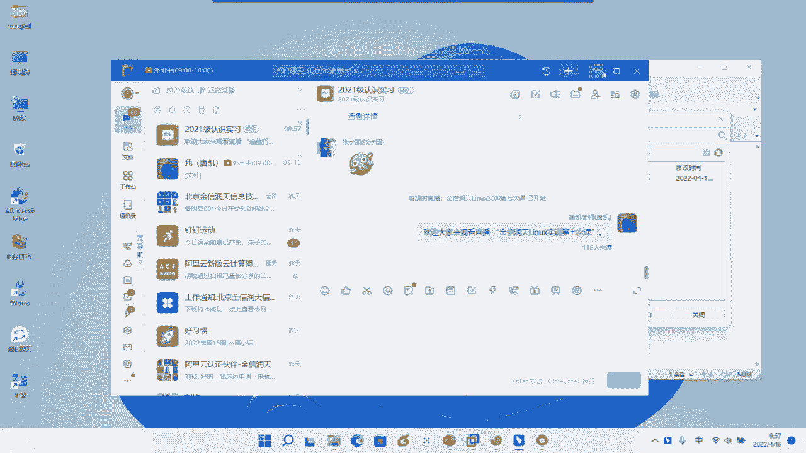
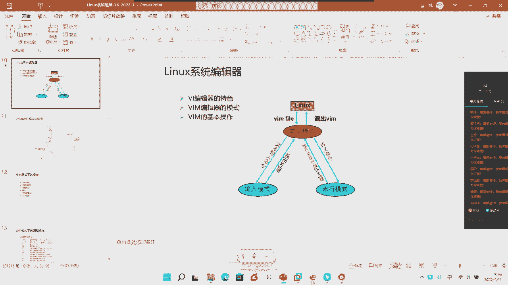
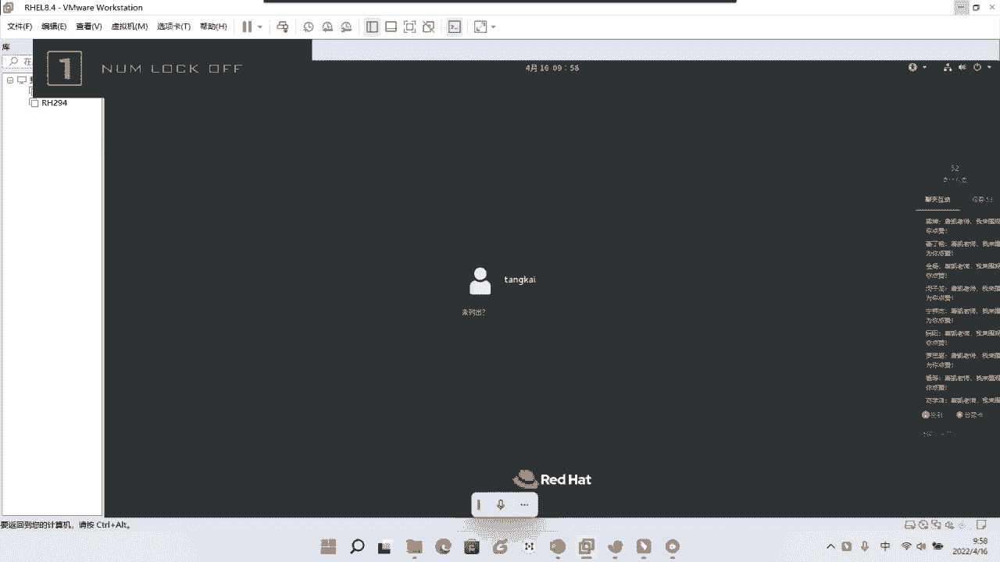
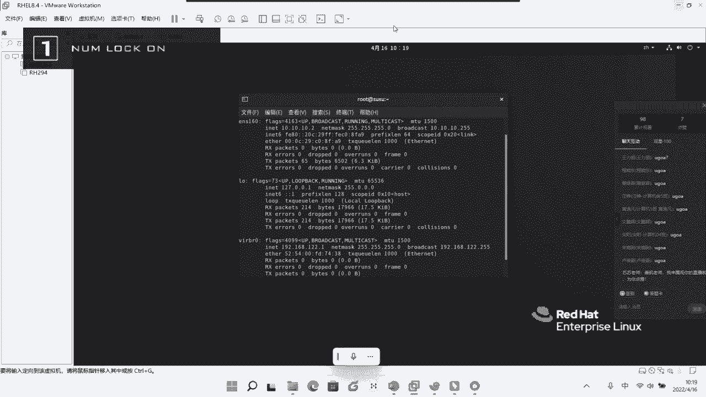
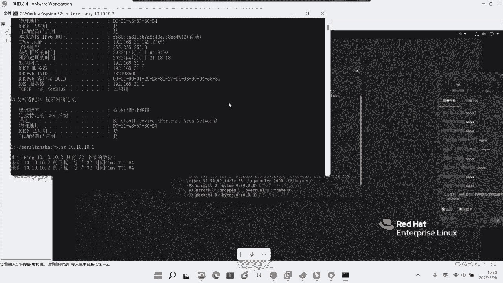
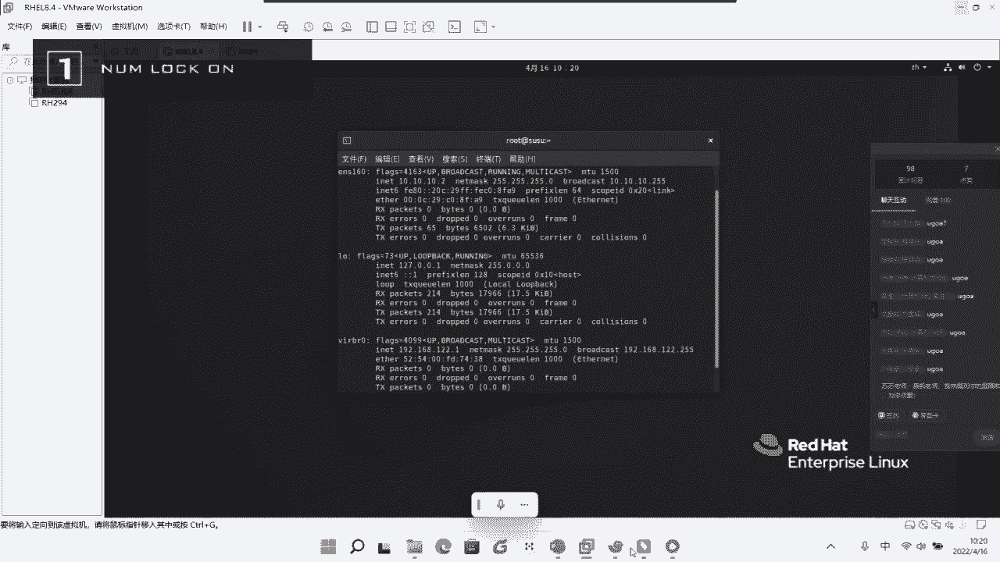
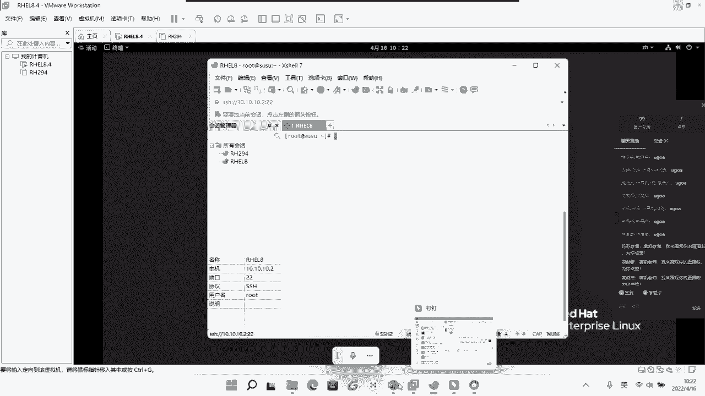
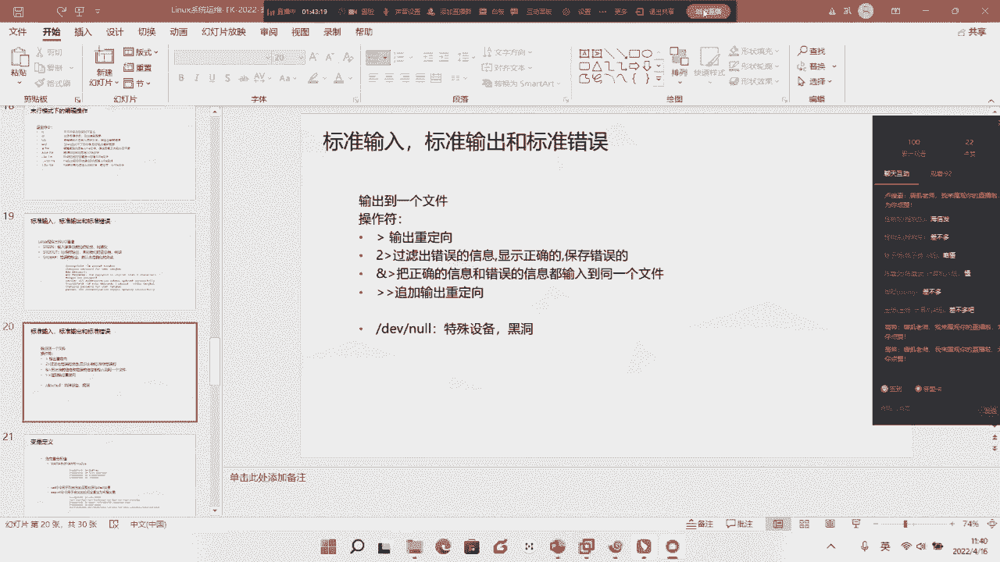

# Linux基础入门教学：7：系统编辑器与标准I/O








在本节课中，我们将要学习Linux系统中两个非常重要的概念：`vi/vim`文本编辑器的使用，以及标准输入、输出和错误的重定向。掌握这些技能是高效进行系统配置和脚本编写的基础。

## 回顾与课程安排

上一节我们介绍了文件查看、查找、权限管理等命令。本节中，我们来看看Linux系统自带的强大文本编辑工具。

首先，对上周的课程安排进行说明。由于特殊情况，原定课程未能完成，计划在下周六进行补课，具体时间将在群内通知。希望大家能坚持学习，掌握核心技术。

## 📝 认识系统编辑器 vi/vim

在Linux中，我们经常需要通过修改配置文件来管理系统或服务。虽然存在许多图形化或功能更强大的编辑器（如nano、emacs），但`vi`及其增强版`vim`是系统默认自带的。这意味着即使在系统严重故障、无法启动图形界面的情况下，你依然可以使用`vi/vim`来修复系统。因此，它是运维人员必须掌握的工具。

`vi`是原始版本，而`vim`（Vi IMproved）是其增强版，主要增加了语法高亮等便于开发的功能。如果你的系统安装了桌面环境，通常会默认包含`vim`。

### vi/vim的三种模式





`vim`编辑器默认有三种工作模式，理解它们之间的切换是使用的关键：



1.  **命令模式**：启动`vim`后默认进入的模式。在此模式下可以执行光标移动、复制、删除、查找等命令，但不能直接输入文本。
2.  **输入模式**：在此模式下，可以向文件中输入和编辑文本。需要从命令模式切换进入。
3.  **末行模式**：在此模式下，可以执行保存文件、退出编辑器、进行搜索替换等操作。需要从命令模式切换进入。



模式切换关系如下：
*   命令模式 -> 输入模式：按特定键（如 `i`, `a`, `o`）。
*   输入/末行模式 -> 命令模式：按 `Esc` 键。
*   命令模式 -> 末行模式：按 `:` 键。

接下来，我们将详细学习各模式下的常用操作。为了实验，我们先复制一个文件作为操作对象：
```bash
cp /etc/services .
```

### 命令模式下的操作

在命令模式下，有一系列快捷键用于快速操作文本。

**以下是光标移动命令：**

*   `h`, `j`, `k`, `l`：分别对应左、下、上、右移动光标（等同于方向键）。
*   `Ctrl + f` / `Ctrl + b`：向下/向上翻页。
*   `H` / `M` / `L`：光标移动到当前屏幕的顶部、中间、底部。
*   `gg`：光标移动到文件第一行。
*   `G`：光标移动到文件最后一行。
*   `0` 或 `^`：光标移动到当前行的行首。`0`是绝对行首，`^`是第一个非空白字符。
*   `$`：光标移动到当前行的行尾。
*   `w` / `e` / `b`：光标移动到下一个单词的词首/当前或下一个单词的词尾/上一个单词的词首。

**以下是编辑与删除命令：**

*   `r`：替换当前光标所在字符。例如，`r1`将当前字符替换为`1`。
*   `x`：删除光标所在字符。
*   `dd`：删除当前整行。`5dd`表示删除从当前行开始的5行。
*   `dw` / `db`：删除从光标开始到下一个单词词首/上一个单词词首的内容。

**以下是复制、粘贴与搜索命令：**

*   `yy`：复制当前整行。`5yy`表示复制从当前行开始的5行。
*   `p`：将复制的内容粘贴到光标所在行的**下一行**。
*   `P`：将复制的内容粘贴到光标所在行的**上一行**。
*   `/关键词`：向下搜索指定关键词。按 `n` 跳转到下一个匹配项，按 `N` 跳转到上一个匹配项。
*   `?关键词`：向上搜索指定关键词。

**以下是撤销与可视化选择命令：**

*   `u`：撤销上一次操作。
*   `Ctrl + r`：重做被撤销的操作。
*   `v`：进入字符可视化模式，移动光标可按字符选择文本。
*   `V`：进入行可视化模式，移动光标按行选择文本。选中后可按`y`复制或`d`删除。

### 切换到输入模式

从命令模式可以按以下键进入输入模式：

*   `i`：在光标**前**插入。
*   `a`：在光标**后**插入。
*   `o`：在光标所在行的**下一行**新建一行并插入。
*   `I`：在光标所在行的**行首**插入。
*   `A`：在光标所在行的**行尾**插入。
*   `O`：在光标所在行的**上一行**新建一行并插入。

编辑完成后，按 `Esc` 键返回命令模式。

### 末行模式下的操作

在命令模式下按 `:` 进入末行模式。

**以下是文件操作命令：**

*   `:w`：保存文件。
*   `:q`：退出编辑器。如果文件有修改未保存，会提示错误。
*   `:q!`：强制退出，不保存修改。
*   `:wq` 或 `:x`：保存并退出。
*   `:w 新文件名`：将当前文件另存为新文件。
*   `:set nu` / `:set nonu`：显示/隐藏行号。

> **注意**：有时即使使用 `:w!` 也可能无法保存文件，这通常是由于当前用户对要编辑的文件**没有写权限**。在修改系统重要配置文件前，请先使用 `ls -l` 命令确认权限。

## 🔀 标准输入、输出与错误重定向

在Shell中，执行命令时会产生三种标准数据流：
*   **标准输入 (stdin, 文件描述符0)**：默认来自键盘。
*   **标准输出 (stdout, 文件描述符1)**：命令的正常输出，默认显示在屏幕。
*   **标准错误 (stderr, 文件描述符2)**：命令的错误信息，默认也显示在屏幕。

我们可以使用重定向符号来改变这些数据流的去向。

**以下是基本重定向操作符：**

*   `命令 > 文件`：将命令的**标准输出**重定向到文件，**覆盖**原文件内容。
    ```bash
    ls -l /root > list.txt
    ```
*   `命令 >> 文件`：将命令的**标准输出**重定向到文件，**追加**到原文件末尾。
    ```bash
    date >> log.txt
    ```
*   `命令 2> 文件`：将命令的**标准错误**重定向到文件，覆盖。
    ```bash
    find /etc -name "*.conf" 2> errors.log
    ```
*   `命令 &> 文件`：将命令的**标准输出和标准错误**都重定向到同一个文件，覆盖。
    ```bash
    find /etc -name "*.conf" &> all_output.log
    ```

**以下是特殊设备文件：**

有时我们想丢弃不必要的输出。

*   `/dev/null`：像一个“黑洞”，写入它的所有数据都会被丢弃。常用于屏蔽输出。
    ```bash
    find /etc -name "*.conf" 2> /dev/null # 只显示正确结果，错误信息丢弃
    command &> /dev/null # 正确和错误信息全部丢弃
    ```
*   `/dev/zero`：提供无限的空字符（零）。常用来创建指定大小的空文件，用于测试。
    ```bash
    dd if=/dev/zero of=testfile bs=1M count=100
    ```
    这条命令会创建一个名为`testfile`、大小为100MB的空文件。参数解释：
    *   `if=/dev/zero`：输入文件（input file）。
    *   `of=testfile`：输出文件（output file）。
    *   `bs=1M`：每次读写的块大小（block size）为1兆字节。
    *   `count=100`：读写100个块。

## 总结

本节课中我们一起学习了Linux核心技能的两大块内容。

首先，我们深入掌握了`vi/vim`编辑器的使用，包括三种模式（命令、输入、末行）的切换，以及在命令模式下进行光标移动、文本复制删除搜索、在输入模式下编辑文本、在末行模式下保存退出的全套操作。记住，`Esc`键是返回命令模式的万能钥匙，而权限是能否成功修改文件的前提。

其次，我们学习了Shell的重定向功能，理解了标准输入(0)、输出(1)、错误(2)的概念，学会了使用`>`、`>>`、`2>`、`&>`等操作符将命令输出导向文件或设备，并认识了`/dev/null`和`/dev/zero`这两个特殊的设备文件及其用途。



请务必多加练习，将`vim`的常用快捷键和重定向语法内化为肌肉记忆，这将成为你日后高效运维的得力工具。