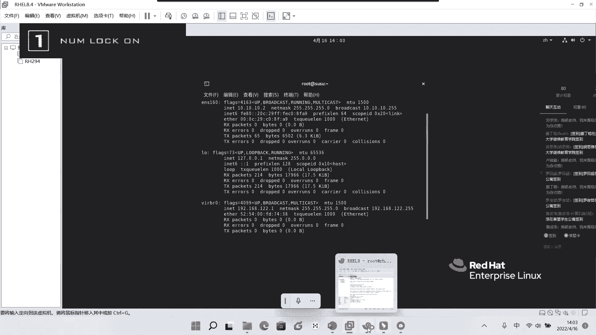
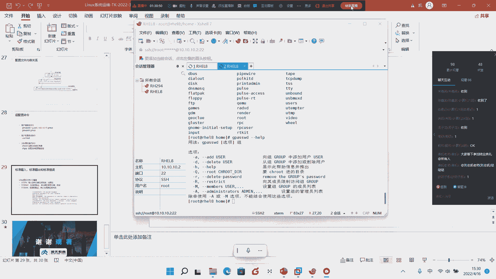

# Linux基础入门教学-8 - P1 - 唐老师开讲 - BV1kK411D7EE

嗯嗯嗯，上课啦上课啦上课啦，上课啦接客啦，这不行啊，这下午这人数才60几个人，还同学呢，各位都能听到我声音吗，哈哈哈哈，都能听到是吧，ok。

好各位同学，我就继续上课了啊，我就继续上课了，然后今天下午的时间也比较紧，还比较紧，刚刚通知啊，上周是你们要做核酸，然后所以今天我要做核酸了啊，这个可能会比较紧，所以我们今天下午的内容啊也会有点多啊。

也会有点多，所以那个还是要尽快那个吧，还是要尽快的把它剪掉好吧，讲完了之后，然后，然后然后大家那个把这个哦对是这样的啊，那个今天下午啊，今天下午就是我上完课之后呢，会有一个时间给到我们的刘老师呃。

他会提前啊，先给大家稍微说一下，就是说他会提前去做这个啊，咱们这一次实训课程的一个结业的一个一个一个典礼啊，在这里我统一通知一下啊，就是大家注意一下，就是啊今天下午啊这个上完好课后啊，刘老师会做啊。

本期本期啊这个啊啊linux实训课程的结业，点你啊，结业典礼啊，嗯就是大家模式，我讲完都不要离开了啊，等待六老师继续，继续啊，然后下一次下下周六，如果没有其他安排，然后我会给大家补一下。

好吧就是给大家搜索一下，给大家搜索一下，就是大家注意一下啊，就今天这个我这边上完课之后啊，刘老师这边会做本期的这个linux的结业典礼，好吧，结业典礼就是大家尽量的都在啊，尽量都在。

好吧好ok那我们就不多说了，我就不多说了，我就直接开始了，我就直接开始了，好那咱们今天下午的会给大家去讲一个新的东西叫做用户和组啊，用户和组，那当然今天下午我们也会如果说大家学的都比较ok啊。

我今天下午也会告诉大家这个系统的密码是吧的，破解系统密码的破解啊，给大家讲一个好玩的是吧，教给大家破密码啊，破密码呃，这是整个这一块的一个内容啊，整个这一块内容呃。

是需要大家一定要认认真真的跟着我来转啊，认认真跟我来转的好吧，呃首先第一个呢我们一定要去理解，就是今天在我们系统中间，我们既然也讲了命令对吧，早上讲了vm的编辑，那同时我们那个之前也讲权限。

但是呢我们所有一切其实是围绕我们用户和组来产生的啊，用户和组来产生的，那用户挺难听啊，那用户呃在我们在我们那个中间，它是一个至关重要的一个组成部分啊，如何高效的去管理用户对吧，如何高效管理用户。

如何对主进行设置，这也是考验一个合格的linux管理员的一个比较重要的一个过程啊，重要的一个过程好，那我们接下来呢今天下午的时间围绕的就是雍和主来展开啊，雍和主来展开。

那我今天下午的时间会比较就是我会这个语速啊，这个这个整个状整个定调啊会比较快一点啊，所以大家尽量的跟着我来听啊，尽量跟着我来听，首先第一个呢请大家注意了，就是呃首先我们大家都很清楚啊，当我去，查看啊。

当我去查看，比如说比如说copy啊，下面的某一个文件到这里了，任何一个文件啊，任何一个文件，哪怕我先touch test对吧，任何一个文件，你会发现它都会有我们所对应的这样一排一一批的。

这样一个一个什么呀，就是权限呢是吧，这个引用计数啊，大小啊，是不是修改时间呢对吧等等这一块，但是无论怎么样，他都会有这样一个东西，哪怕我刚刚用touch创建了一个新的文件啊，甚至文件夹对吧。

甚至文件夹make的make a dr对吧，甚至一个文件夹啊，它都会有我们所对应的用户和组的概念啊，都会有，用户和组的概念，请大家听好了好，那这个用户和组啊，那么这个用户和组是我们今天的最重要的概念。

那怎么最重要呢，好首先我们需要要求大家去看到，现在当我们的用户看到这里的文件夹或者文件的时候，这里显示都是root对吧，显示root就代表所有者这个文件或者文件夹的所有者是root啊。

所属组也是root，对不对啊，这是我们之前所讲过的啊，这是我们之前所讲过的好，但问题来了啊，但问题了什么问题呢，就是今天我们的系统它不像我们的人类啊，我们的系统它不像我们人类，我们的，人类啊我很清楚。

我看到r o o t我知道哦，这是超级管理员对吧啊，我看到某某某我我很清楚诶，他哦原来这个长相他是唐海是吧，这我很清楚，但问题是今天的计算机它是没有大脑思维的，所以他不可能有任何记忆的概念。

所以他根本不清楚root是谁，这个要求大家去记住啊，就是反倒我们计算机其实虽然我们这里标出来的root对不对，但是计算机难道他不清楚root是谁，这能明白我说句什么，就像今天很简单，核酸啊。

我们举个例子，比如说大量，比如说大家学校里面是吧，老师要组织核酸，有成千上万的学生去排队对吧，每个人都出现在这里啊，他只用个棉签试那么一下，你根本无法记住谁做谁没做对吧。

甚至于你根本就记不住这个人对前几个人可能太清楚，但我后面走哎，每天这样根本记不住，是不是那系统我如何来判定啊，如何来判定这个文件的所有组合，所属组是不是root啊，是不是路程的，我刚说啊。

系统是根本不知道r o t是是什么东西的，他不知道你懂我说的，而r o t仅仅只是用来传递给用户存，而用户成传递给我们的一种叫做叫做这种什么呀，这种方子啊，就是这种显示方式，那我们系统是靠什么来看的呢。

就是比如说我们现在这个是靠什么来看的，大家注意它是靠应该这样看，就l来杠n啊，杠n它其实系统其实看的是这个东西，大家注意啊，系统看的是这个东西，也就是说今天是一种判定啊，这个位置啊。

就是我们所谓这一行的这个位置和这个位置，只要这个位置这两个位置是吧，只要这个位置是零的啊，这i d号这个位置是零的，你就是超级管理员，这个能听明白吗啊也就是说今天其实系统只关心数字，它根。

本不关心你叫什么，就像我们有时候出去，我们只关心你的身份证号，对不对，哎我说哎身份证号为什么0001的这个人就是boss对吧，所以很简单，今天他只关心于a这个零，能明白关系，我能明白我所知的只要是零。

那么系统就是里面的定义，它就是为root，原来系统只认它，让用户只认他，真的明白意思吗，所以系统和用户之间它无非只是做到一个对应就够了啊，只是做到一个对应就够了，就这么简单啊，前面跳了，那么接下来呢。

同样的，那我们刚刚看到的两个零意味着什，么意味着一个叫做用户id号叫user id，一个叫group id，叫做主id号啊，主id号这个能听明白，ok好，那么接下来用户呢一般是分为两种。

我们之前讲过他们系统中间分为两种，一种叫根用户是吧，一种根用户，一种叫普通用户，那么跟用户的我们的加入是在哪里，是在跟上对吧，是跟上，而普通用户默认条件就是在什么样在home里面对吧。

默认权来源就是在我们的home里面是要求大家去注意的啊，要大家去注意的好，所以我们刚才也看了啊，就绝大多数到home里面，而我们的差距管理员是在跟上啊，差距，管理员在跟上好。

也就是说今天其实去创建一个用户，一个用户创建出来，大家看啊，那我普通用户来看，那么普通用户呢你会看到在这里是有个弹卡，是不是是不是有个弹卡，对吧好，那么除了创建用户的时候。

他会在home里面生成这个用户所对应自己的这个家目录之外，各位听好了，还会在一个地方叫was或mail里面听was was promail里面这个路径啊，大家记住了这个路径，这个路径是什么东西呢。

是为每一个用户都会生成一个对应的电子邮件的文件，我再说一遍啊，今天系统linux系统中间它会为每，一个在他系统上的用户创建一个对应自己名字的电子邮件的账户啊，邮件的文件应该是邮件的文件，那么就是在这里。

也就是说今天当系统中，如果不论是系统邮件还是什么其他什么邮件，它都会去存放到这个地方来啊，都会存放到was poor mail下面所对应的这个用户的这样一个配置文件，明确听明白啊，它它都会在这里好。

当然我们今天也可以看的，当然默认全面，这里是空的，也就是说它只是出了一个空文件，但是里面什么都没有能听懂我这意思，什么都没有好，当我未来诶，比如有邮件，什么什么过来之后诶，它这个里面就会有内容啊。

这个里面就会有内容好吧，这是我们整个这一块的概念啊，所以今天创建一个用户的时候，除了加目录之外，其实还会创造另外一个目录，中间会有一个电子邮件的一个什么呀，一个一个一个文件啊。

电子邮件文件会存放在这里啊，会存放在这里，ok好那么这是他所说的好，那么接下来呢我们说了，创建一个用户的时候呢，首先第一个用户的登录的子目录，这个大家已经看到了是吧，就是我们加目录嘛，加目录。

就怎么录第二个口令，什么意思呢，就是那就像你今天创建一个账户一样的，他肯定要你输入什么密码是吧，输入密码肯定要有口令，第三个一定会有自己的什么呀，shell的环境变量啊，shell的一套电量。

什么叫效率，它变量呢我们之前其实讲过的啊，cd or举个例子，cd后下面弹开好，大家注意默认下面加目录里面什么都没有，对不对，但是真的没有吗，其实是有杠a啊，大家注意l杠a好。

你会发现其实每一个用户我再说一遍啊，每一个用户的家目录中间自己的家目录中间都会有四个文件，我在，上面都会有四个文件，但是如果你是第一次创建出来的啊，你是第一次刚刚创建出来的，可能只有这三个啊。

可能只有这三个，而这个history这个我们之前讲过，是不是就是当每个用户自己去敲了命令之后，诶，它就会有什么呀，都会有我们所对应的就是就是那个什么历史所敲的命令，是不是啊。

所以你会看到在这里是不是有四个对吧，在这里就会有四个啊，点bh下面history。batch logout啊，profile和batch r c一共是四个啊，一共是四个，那这四个有什么意，有什么意义呢。

有什么意义呢，这四个不太理解有什么意，义呢好我我我举个蛮简单的啊，这里不深交而不深究，我只是举个很简单的例子，好比方说你看我今天我唐卡的加唐卡自己目录，我进来，对不对，好，我touch一个test。

比如说test啊，你看这是我唐卡做的l l你看所有者输出是不是都是唐卡，是不是，但问题是我们之前讲过啊，就是创建一个普通文件的默认的权限是六四式对吧，六四式，但是你发现诶奇了怪，为什么我一个普通用户。

大家普通用户创建了一个文件默认权限，它不是六四十，而是多少，664，看到没，它是六六式，就代表我自己用我自，己所属的组的权限应该是什么呀，一样的六六式对吧好，但是我们说过系统中间我们严格来说啊。

严格来说644才应该是相对而言安全一些的是吧，相对而言安全一些的好，那么你会发现，如果我今天要在这里用千金木的啊，如果我要在这里用千金，比如我改成64，对不对，好是的，你现在确实是把它改过来了。

但是如果文件比较多的时候，你难道每一次做你都要去，就是创建完之后你还要去敲这条命令吗，是不是显得比较麻烦了是吧，显得比较麻烦了，所以有没有可能能比较快速，的给自己对吧，给自己的就是这个定义。

从我默我以后默认创建出来就是64呢啊有，但是这个不能是唐海他自己来改对吧，所有权限应该是谁来改，是root来改是吧，好那root怎么改呢，那很简单了，首先第一个我是不是要在自己加唐卡的降目录来看。

是不是如果我要在我自己加目录卡，是不是改成我自己了对吧，好a杠a你会看到依然是不是看的跟弹簧是一样的，这能明白吗，好这个我只是快速的讲一下就完了，好大家看到在这里有个点bh r c，那我们很简单。

早上讲了点bh r c是不，是进来好，进来之后呢，很简单了，你在这里写个you mask，are you mask，002好，举个例子，我保存一下啊，我保存一下是不是好来再来输进去是吧。

as好我你看就是刚刚这个是因为我改的是644好，我们现在再来touch a b c给大家看，是不是就默认就是64了对吧，默认就64了，这都能听明白吗，就这么简单啊，就这么简单啊，就默认就64了，ok好。

当然我现在所讲的是什么呢，那那从这个角度上面，你就应该能理解什么意思呢，就是我其实想给某个用户特书的权利，我在这里特殊的权利比，如说我现在假设再有另外一个用户对吧，我再有另外一个用户。

比如说uc a d d啊，当然这个这个是创建用户的名字啊，好我先讲啊，uc a d d对吧，润天一流啊，比如说论rt user啊，比如说创建一个用户转了是不是好。

那我现在也是u grun time user，好，我到这里来是不是啊，好我现在呢同样的touch abc你就会发现看到没有，上面和下面是不一样的，这个权限能理解吧。

也就是说当我希望某一个用户他的权限要高过于其他用户的时候，那么你其实可以在它这什么啊，这个用户自己的家不如中间的这些，什么呀，这个这个我们俗称叫做用户的环境变量，而用户的环境变量中间做配置啊，做配置好。

这个能听懂我说的意思吧，就这个意思啊，所以你可以理解叫什么启动三级脚本，不就是刚刚我们所看到的四个，对不对对吧好，那同样的还有什么电子邮件啊。

电子邮件就是我们需要不就是我们刚刚那个was poor mail对吧，was po mail好，这个能理解吧啊在这里了啊，在这里好，现在谈到这边呢，我们就要知道的是，其实今天我们的用户啊。

一共是就是刚刚其实已经演示了是吧，已经演示了，就创建一个用户，诶创建一个用户叫做user a d d是吧，user a d d来创建一个用户好，那么接着谈到这里，创建用户呢，我们刚刚也也看到了啊。

作为管理员啊，作为root，我在这里作为管理员，作为root，我是具备有这个才能创建的，普通用户是创建不了的，我在顺便普通用户是创建不了的，比如说rain，它你就是好，你看我现在是不是一个普通用户。

我现在可以用这个usa add吗，比如我创建一个什么啊，张三可以吗，根本不行，他说没有permission deny，什么意思啊，这个命令不让你用啊对吧，这个命题根本不让你用啊，所以你一定要明。

白创建用户和设置权限全部都是谁来做啊，都是管理员上来说，除非很多人说拉管理员不累死了，那如果我是个跨国公司，我有什么1000多人甚至几千人甚至上万人，那全部都管理员来说，管理员不累死了啊。

这个问题问的很好啊，这个问题问的很好，当然这个问题是我弹开自己是吧，帮大家来拓展思维，是不是，那现在很简单了什么，我那往后面走来，我说了，创就是在linux上面啊，也不说很高深，就是就是就是是必备技能。

而是企业的必备技能，那当然我们，可以做什么呢，做权限委派对吧，权限委派诶，我只允许谁谁谁啊，比如说我允许那个什么这个hr的是吧，具备这个能力啊等等等等等等，都是这样的，能听明白吧。

就是这样一个就是刚才所说的，就是这样的一个一个整体的一个一个概念啊，好那么接下来呢我们就继续了啊，我们接下来继续了，刚刚其实已经讲到了，今天在我们home下面好，大家注意啊。

好我们在这里其实已经有了两个对吧，已经有了两个用户好，那么接下来那那我们再验证一下我们这里是不是有tml，你看就一定会有rain time user，是不是这个用户是不是好说到这里啊，说到这里。

那我们接下来就要教给大家如何创建一个用户啊，如何创建一个用户，我们刚才说创建物的命令很简单，user add a user，当然有些书上面叫add user都行啊，这两个命令是一样的啊。

这两个命令是一样的，没有任何问题，好user a d d用户添加嘛对吧，用户添加好，如果说我单纯的只是后面接什么user 1 user 2 user，是不是，这个其实很简单对吧，很快就能添加完啊。

很快就能添加完，回车啊，回车默认就到后面面，但是我们今天其实想教给大家这样一批参数啊，这样一批参数，那我想告诉大家，就是在linux下面，我们其实也会做很多很多这种定制的啊，定制化的一些东西。

比如说很简单，在这里啊，大家跟着我来听啊，首先第一个杠c啊，在第一个参数杠c c是什么呢，大家可以写下来叫描述啊，描述我在这边啊，描述啊描述比如说你描述它是什么呀，好比如说它是hr对吧，hr对不对好。

ok举个例子它是描述对不对，好第二个第二个杠d杠d啊，就是你的家目录啊，你加目录在哪里，如果你不杠d后，默认是不是叫home下面的什么user一这是默认的是不是好，那么那么如果你今天干地了。

比如说我想更改它跟上去行不行，好比如说我跟上的usc一行不行，可以没问题，你可以这么去写啊，可以这么去写，听见没好，接下来杠u干u u指的是uid啊，啊u指的是u i d啊，我们刚不是讲了嘛对吧。

你创建一个用户的时候，默认就是什么呀，就是这个不是创业啊，就是刚刚给大家看到那个root是不是就是就是零对吧，g i d也是零，代表用户id号好，那么这个你可以自己去手动写啊，手动写。

那当然从多少开始写啊，从多，少开始写这个，我们往后面来给大家来说啊，来给大家来说明，嗯好这样我我我先跳一下啊，我先跳一下，这个我来啊，我先跳一下，跳跳到哪里呢，我把这个我觉得这个这个先讲掉。

那可能你们稍微稍微明白一点点，这样啊，这样来我直接带着你来说，说完之后我们再反着往上推，你就明白了，好刚刚不是讲了吗，uc a d d u c e好，你看我创建完了，他是不是就立刻创建完了，好。

这里有条命令啊，大家注意啊，这里有什么叫id id，就是用来查看你创建这个用户的信息，id空格uzi好，你看他在这个这里告诉你，系统默认跟你分配了一个id号，是从是什么呀。

1002j i d主id也是1002，看到没有，也都是1002，看到没对吧，10021002，请大家好啊，这个i d g i d和uid都是是吧，这个1002好，但是我创建完了之后，各位听好啊。

今天在这里肯定有自己加入，是不是好，那么我现在想问一下，今天在我电脑上面我们有多少个用户呀，啊今天在我电脑上我有多少个用户啊，各位今天在我电脑上我有多少个多少个用户，就当你们现在肉眼看到了三个。

是不是加上管理员一个是吧，一共是几个啊，四个用户是吧，四个用户，但是不是真真正正的四个用户呢，我举个很简单的例子，比如说你今天去了一家公司对吧，你去了一家公司诶，这家公司呢是吧。

你你看到比如说给你安排了一个工位，对不对，好或者安排了一个比较大的一个一个场地，这个场地上面有很多的这个工位啊，比如有20个工位啊，有20个位，那是不是就代表这个公司已经有有20名员工了呢。

啊当你看到有20个工位，是不是就等同于公司就有20名员工了呢，其实是不对等的，这个这个说法其实不对的，是不是也就很有可能是这样，你，20个工位是20km，有可能是你公司员工，也可能仅仅只是什么呀。

只是什么嗯，十个也有可能是本人也有可能是50个对吧，所以你不能通过宫位来衡量来确定诶，这个这个是吧，你实际的这个公司的这个这个人数，这个能能理解吧，是不是好。

那我需要通过怎样的方式来真正意义上确定公司到底有多少人呢，我想请问大家，如果我今天想确定公司具体的人数，你应该问谁，你是不是应该是问到你公司的人力资源部，是不是您应该问到他，就说哎。

比如说你今天学校里面也是一样的，嘛对吧，比如说你学校看到有这么多学生，但是床位不够对吧，床位不够，所以有些同学可能他住在学校外面啊，有些同学他可能干嘛，可能啊早读是不是的。

所以我们没有办法去确定你实际公司到底有多少人，那么这个时候怎么办，我是不是都得需要通过什么呀，是不是在那个档案中间来判定我这一届到底有多少学生，这样能明白吗，这才是最准确的，是不是对吧，入库为安嘛。

是不是好，所以今天我要告诉给各位的是，今天在我们link上面，我们的相当于啊我们的用户的花名册是哪个文件呢，是这个文件啊，我们其实之前一直在演示的就是这个文件etc pass dd好，这个能听明白。

大家记住啊，就是当我创建任何用户，它都会系统都会自动的给它干嘛，这个这个传到这个配置文件里面去听懂啊，e t c pass w d，e d c pass w d好，那么我们可以看到啊。

今天那按照正常我们刚才所说的不就是了吗，对吧，不叫什么，可是你发现唉哟，可是你发现我们今天在我们这个配置文件中有48行啊，有48哈拉诶，那就有同学就问了，难道有，48个用户吗，难道这里有48个用户吗。

是不是大家注意啊，还确实就有48个用户啊，确实就有48个用户，简单听好了，那么这48个用户有什么，是是是都有什么作用呢，然后我一个个讲给你们听啊，这个东西一定要认真听，这个配置文件一定要认真听啊。

好我拿一行拿这第一行的举例子啊，大家看了大家可以看到一些规则啊，这个规则是什么意思，每一个上面其实都会有什么都会被冒号隔开，看到没有，每一个都会被冒号隔开啊，我这能听明白啊，好所以以冒号隔开，我。

们就要给大家来讲一遍，大家认真听，首先第一个root r o o t代表什么，代表用户名啊，代表用户名啊，这个大家好理解，当你创建完一个用户的时候，是不是就会有用户名，是不是对吧，用户名好。

其次其次这个x代表什么意思呢，跳第二个就是冒号隔开的这个x代表什么呢，代表密码位，我再说一遍啊，代表着密码为什么叫密码位啊，这个这个能理解吗，代表着啊密码位，喂喂喂喂喂喂喂喂喂喂啊。

这个密码位密码位指的是什么意思呢，啊这是什么意思呢，也就是说白了就是这里只要有个标，记啊比如说这个这个差对吧，这个x这个x对不对，也就是说只要这里有x代表着a你需要去输密码，就这么简单啊。

你需要去输密码啊，至于密码是什么，是多少，他不在这里显示啊，如果要在这里显示，就掉到大，所有人不都能看到，是不是它叫做密码位啊，代表u i d，刚才你讲了代表u i d啊，u i d。

而第四个代表什么意思呢，代表g i d主i d号啊，g i d听明白代表着g i d啊，u i d g i d能听明白好，接下来这个代表什么呢，代表描述，代表描述描述，这个人是干嘛的啊。

描述这个人是干嘛的，好这个能听懂啊，代表描述好，那么接下来接下来这个代表什么呢，代表自己的家目录啊，就自己家目录所在的位置，那应该这样说，自己家目录所在的位置，能听懂我说的意思，ok，好这个能听懂啊。

自己是加密的所在的位置好，接下来这个代表什么呢，代表小啊，代表shell s就是代表什么呢，代表s h e l l shell啊，代表笑听明白啊，代表笑好，那么这个笑你看我，我这前面如果说大家都懂啊。

这个笑就好理解了，什么意思呢，说白了我今天跟大家讲课啊，大家应该都能听得懂我在讲什么吧，就语言上是不是都能听懂我在讲什么啊，不会说我现在讲的话，大家听不懂吧，是不是啊，应该都能听得懂，对不对。

那现在问题来了啊，各位现在问题来了，什么问题来了呢，我们说的这个受伤啊，有些人就是不一样啊对吧，比如说我先跟你讲这个东西，哎有些人他是吧，这个就是我说白了吧，就是说它一般来说我们其实需要分很多种啊。

有的人讲什么讲讲葡语是吧，讲英语是吧，讲讲还有一些人讲鸟语是吧啊就是举个例子啊，就是讲各种各样的都有，但是如果我们之间要相互的让对方都能听得懂，那不好意思，我就是吧，你就不能讲地方话。

你就必须得干嘛讲这个标准的笑对吧，标准的笑，所以你可以理解在这里的being下面的bh啊，being下面的bh好，稍微等一下啊，等好，好那么也就是说也就是说今天在我们整个这一块的定义下面的bash啊。

这个就是普通话，你可以这样去理解啊，也就是说当我想跟别的同学，我必须的这个shell是b下面bh好，但是呢很多人看到第二行是b的logo，spring llog对吧，它其实也是一个小。

但是呢你可以理解为它就是什么哑巴对吧，它就弄聋哑人对吧，我不能让你跟别人交流，那你就可以把它写为spin login，一旦写为spin llin代表这个用户存在，但是它无法登录到我的系统，能听明白。

无法登录到我的系统，好，ok这里就可以理解为就是系统给予他的一个这个这个平台是不是好，这里的b向batch官方说啊，就代表标准的这把沟通的这个好，所以从这一块这一共是多少，大家可以说一说啊。

1234567对吧，七个字段是要求大家一定要知道每个字段的用意的啊，每个字段的用意的好，这个能听懂了吗，ok每个字都能用一下，好了吧好，这个这个听懂了没有，应该听懂了啊，好那接下来这是刚才所说的啊。

好那我如何去区分我们这有这么多用户对吧，有48行，有这么多用户，那到底哪些用户是具备什么样的能力呢，好在这边你看到我这个ppt上面其实也为大家写好了用户啊，它分为三类，用户分为三类，哪三类。

第一类叫做系统管理员，那我怎么判断它为系统管理员呢，我之前也说过，系统它不关心于前面的用户名，它关心的是用户的u i d和g i d是不是的，也就是说今天只要判定为用户的用。

就是这个ui d和gd为两个零的哎，他就是为差距管理员，这个能明白吗，对啊就是只要是零的，它就会超级管理员，就这么简单啊，就这么简单好，那么从一开始啊，大家看uid从一开始一直到999。

当然这里没有999，这里写的有998是吧，到1~999的，为我们的什么呢，服务用户啊，什么叫服务用户啊，什么叫服用户，我举个例子，比如刚刚我们看到这里mail对吧，系统它把这个was pm啊。

这个系统调用的这个他也认为把它当成一个用户来看待啊，比如关机它会去启动关机的这个什么用户，是不是它是系统来调用，而不是由理来调用的，而不是由理来调用的，是系统默认的，能听明白吧啊在这里。

那普通用户从多少开始呢，来我们早晨讲了大积极到下面去对吧，普通用户从1000开始，你看唐卡默认是不是从1000开始是吧，默认从1000开始是不是好，但是我刚刚创建的两个，你看我没有这个什么描述。

它就是中间为什么呀为空，看到没有，中间就为空，所以它是顺着来的，看没它是顺着来的，理解我所说的是吧是吧，顺着来的好，那既然是，这样那我们接下来理解一下啊，那我们今天来理解好user a n d d。

那我能不能创建一个，比方说uc 1，你回车呢当然是一样的了，是不是好，我这样我创建一个user 2，刚刚uc一有了好，那么在这里我们应该怎么样，好杠c我举个例子，它是hr，刚刚不是讲了吗对吧，hr好。

杠d对吧，默认前面是在home下面好，那我叫什么呀，我就想放到根下面，u 12可不可以可以吗对吧，可以吗，好我不要绿茶，我就要拿ta对吧，那ta，好，好gu，这是u i d，我们刚刚不是已经看到吗。

他从1000开始是1000开始，而我现在已经有1002了，那我现在变成2000可不可以，没有任何问题啊，没有任何问题对吧，你这只是告诉系统，你的id号好，但是当然也有小写的g啊，这里2000行不行。

我创建用户啊，我这个小写g g就代表g i d啊，u代表u i d也正常来理解是可以的啊，正常来理解是可以的，但是但是在创建一个从没有在系统上面登登录过的用户的时候，我们不要去写港集啊。

首先我告诉你有这个参数，但是不要写为什么呢，是因为在创建这个uid的时候，它默认就把gid也匹配上去了啊，也匹配上去了啊，只是告诉给大家啊，好那么接下来接下来继续杠s s指的shreless好。

那就很简单，那就来我们的是什么效呢啊，b下面的bash啊，b下面的bh是不是对好，接下来刚不是有小写提示数是呃，就是我们刚才说的就是就是自己的g d对不对好，那还有一个叫大写的g。

其实它也是叫group，它也是叫brave啊，那么这个大型机指的是什么意思呢，这里要多说一个啊，这里像啊，小写的g就小鸡啊，小鸡指的是什么呢，听不懂啊，那大写的g指的是什么呢，叫做附加组。

附加组或者额额外主啊，这个这个这个这个就是看你们自己啊，或者说从属，就是有这样的三个就是就是呃就是什么呀，就是说法上面会有这种三个概念啊，说的说法上面有这三个概念，请大家叫叫附加组啊，额外组从数组好。

什么叫额外组从数组呢，就是说这个他之前已经有了的，什么意思好，我举个例子，我想把它加入到唐海的这个这个用户组里面去，那怎么办呢，那直接在自己写唐卡就够了，就这么简单。

就是告诉他我创建这个nts不仅仅是什么呀，是我自己的拥有自己的主，同时我还什么呀，还是唐凯这个主中间的一个成员，听明白啊，主中间的成员啊，就是这么个意思好，你看回撤就创建成功了。

好我们看一下这个这个用户怎么看他的那个信息呢，我刚刚讲过的怎么看啊，i d nta，而同时还属于什么唐海这个组的成员能听明白好，那我先退出一下，因为这个要退出一下，然后再进，你看最后那ta不就有了吗。

对吧，hr是不是描述信息是不是都这样，是不是都这样，这个能听懂吗，我再说一遍啊，这个参数这这几个我特别跟你讲的这几个参数一定要记下来，c d u s g听明白，这个一定要记住啊，这个一定要记住，ok。

好这个答案应该没有问题了吧，好那既然是这样，那我们就知道默认情况下面啊，创建完用户，我们是不是要对这个用户所设置密码呀，那设置个密码是怎么设呢，很简单啊，我再说一遍，设密码呢，一般来说是管理员对他设置。

所以叫帕斯，这是word，这是密码啊，这是密码，但是我们的命令叫pass wd啊，pass wd后面不是揭密码，我再说一下，很多人在接123456拖是吧，你密码了是不变铭文了吗，这里不是揭密码。

而是接你需要对谁设置密码，比如说我对nta设置密码对吧，就对这就是接这个用户名，啊接这个用户名好回车，他就会告诉你说新的密码是什么，ok那你就输嘛，这是盲敲啊，我在这边这是盲敲，你两个密码都敲对了。

它就会告诉你更新成功了啊，就是更新你成功了，那我怎么在哪里看这个密码呢，很多人说在哪里看这个密码呢，啊是在这里看吗，pass d是在这里看吗，你根本看不了啊，为什么，因为这里只是告诉你有密码位是吧。

那到底设没设密码呢，啊这个密码到底是多少呢，它不是在这里看好，我现在先问一下各位啊，这个配置文件大家听懂了没有，etc，他是wd这个文件听懂了，没有，哦今天下午讲的语速有点快啊，语速有点快。

我想问一下这个e d c pdd这个文件大家听懂了没有，就这个文件你听懂了没有，这里面的每个参数，大家回复一下啊，应该大家都在线吧，这都不在线吗，这难道，好的，就尽量的跟着听啊，尽量跟着听啊。

好的好的行，就看大家那个没有回复，感觉心里有点紧张啊，就不知道是不是是不是还认真在听是吧，就是大家如果说呃比如大概懂啊，或者说现在听这种可能是吧，过后又忘了，就大家尽量的多去看回放吧好吧。

多去看回放再来说会增加大家的这个记忆力是吧，好o好，那么在整个这一块呢，我们刚刚说了好，但问题来了，刚才不是说了吗，这个文件它只是用来记录常规的东西，是不是啊好但是呢诶我们其实还有一个文件是跟它对应的。

我在这里啊，这个文件的权限我们来告诉给各位，这个文件的权限是多少，这个文件权限是644，看到没有，非常标准权限，说白一点，也就是说我普通用，户其实都可以进行查看，普通用户其实都可以进行查看，这能明白啊。

普通用户都可以进行查看的，但是啊但是请大家听好了，我们的这个文件所对应的其实还有一个影子文件，就像人一样的灯光一照，你背下面是不是有个影子是吧，你做什么动作，影子做什么动作，但如果说诶你做了影子是吧。

没动或者没有影子，呵呵是吧，大家就happy了，happy了，估计是吧，好所以我们今天有个隐藏文件，这个影子问题是什么，是我们也是经常讲的叫shadow，给我听好了。

各位etc的shadow是etc pad的影子文件啊，影子文件也，就是说今天这里的所有信息，绝大多数的重要的信息会在影子文件中间去生成啊，去生成其，大家注意了，但是作为访问而言，你会跟影子讲话吗。

不是是不是只会跟pass打d讲话，是不是好，那么这个影子文件只有谁能进去，只有我们的管理员能进去对吧，我说了不受权限把握，不受权限影响对吧，只有他能进去回车进来了。

各位现在你们所看到的其实跟刚就是你看这个用户名啊，跟我们e c的pass里面的是一模一样的啊，是一模一样的，听明白，但是各位从接下来的你所看到的这一块的东，西这才是真真正正的什么呀。

密码它是经过md 5加密的密码，现在听到了哈希啊哈希算法这个这个e过的密码对不对，那也就是说我如果说只要你看到能看到这个东西，你要把它放到什么这种官网的md 5的这个解密器上面去解，就能把你密码解出来。

就这么简单，这就是真正的密码对吧好，但是如果你没有设密码呢，比如说你看我刚刚两个用户创建完了没有设密码，它就是两个感叹号啊，感叹号啊，你设为密码就是有是吧，就有这个密码了，能理解意思吧，对不对，好。

那么接下来刚刚不，是e d c pass打d中间把每一行都给你讲了一遍吗，是不是好，那我在这里我也来给你讲一讲这里面的每一个字段到底是什么意思啊，所以请大家也认真的给我听，第一个。

毫无疑问这个我就不用多说了，代表什么代表用户名吧是吧，代表着用户名啊，代表用户名，而这一段代表什么，代表着密码对吧，代表着你的用户的是不是所设置的密码，我再说一下所设置的密码好，接下来这两个冒号之间啊。

其实应该有东西的啊，我在这里这两个冒号之间其实应该有东西的好，我举个例子啊，你看这，里就有看到没有，这里就有对吧，但是这里反而就没有了是吧，这里你看这个上面就有是不是好。

你看这里为什么有19077代表什么意思呢，好代表着这一个我再说啊，代表的这一个账户所存在于这个系统上面的天数，我再说一遍啊，就是这个用户或者这个账号目前已经存在于这个系统上面的天数很多。

说贵的有你这19777天，那你那那是吧，这个系统都不可能那么早诞生的对吧，怎么可能呢，是不是怎么可能呢，好请大家确实是天数啊，确实存在上面的天数，但是，这个天数不是从我们的什么4月呃，从那个讲呢。

从从从3月9号开始上课算起，不是的，想想不是的，而是什么，而是从1970年的1月1号开始算起的，好，有没有同学能告诉我为什么要从1970年的1月1号算起来，就是为什么这个账号账账号啊。

就是为什么要从1970年1月1号算起来，为什么，为什么，大家知道吗，这个颜色还是有点严重啊，为什么呀，好我就直接说了啊，我就直接说了，哈哈对unix的made这个time的原计时间是的。

就是因为我们的这个这是第一次课给大家去讲到了我们的什么呀，这个lix的就是这个这个叫什么alex的这个啊叫unix unix内核对吧，ux内核是在1969年诞生的对吧，它是从1970年开始算起。

所以它并不是跟随咱们这个系统，而是跟随什么呀，我们内核啊，内核的概念，所以通过内核所定义出来的是，我们它是从1970年1月1号开始计算的，听明白啊，是这个概念啊，要大家去记住好，那么再延就是这个字段啊。

这个字段好，那么延过来，接下来了，这后面这几个是什么意思呢，好接下来这个零指的是我们的密码的，下一次我再说一次啊，下一次的这个修改时时间什么意思，如果说今天的这个零我改为二，我举个例子。

代表着如果我现在改了密码，我知道什么啊，如果我现在改了密码，那么你必须得两天后啊，我在说必须得两天后才能更改密码，这个能听明白吧，对吧啊，就是这个意思啊，当我现在改密码，那如果我自己是个二。

就代表我必须两天后啊，这个更改密码好，那么这个99999代表什么意思，就是密码永不过期时间永不过期时间，那当然毫无用啊，这攻永不过期天数啊，是不是这都是天以天为单位的啊，这个天数啊什么意思。

也就是说那毫无疑啊，这就无穷大了嘛是吧，无穷大了，很多人说，那怎么可能无穷大，当然无穷大啊，为什么你活不到那个时候啊，那你活不到的就这么简单对吧，11000从1970年到现在才1万多天。

你能活到9999天吗，啊一样能获得到提前七天是吧，系统提前七天告诉你，老妖怪，你可以去死了，为什么，为密码要你，你赶快改密码，改完密码你可以去死了是吧是吧，这开玩笑啊，开玩笑。

所以今天这几个数字只是让大家来理解，就是一个是怎么提前七天提醒你改密码，这个就是是吧，永不过期的概念，那如果说我们有时候在企业中间，我们规定一个账户，比如重要账户，我需要他怎么样啊。

这个比如每个月都要去改个密码，那你自己就要改31天，就是改31，懂我意思吧，好那改完密码之后就立即生效的概念，能听懂我意思吧，就这么个意思啊，就这个意思，比如说改31天，提前三天提，醒你对吧，提前三连。

提前就把这个数字vm一改就完了，能听明白是吧，vm一改就完了，好当然如果不想用vm，这里有条命令就change change，我在这里可以通过它来改啊，可以通过它来，比如刚一拿ta好，是不是不杠。

一直接就change就完了，好回车就完了，你看密码最小年龄，如果你改为二，那就不好意思，那就代表什么意思啊，下次也需要是吧，两天后了，好回车好，密码最长年龄，比如说我改30天对吧。

好最近一次密码修改时间，你看它是从今天开始计算的对吧，从今天开始计算的，那如果，你要在这里写成2022杠三杠16呢，如果你要这样呢回车呢或者三杠15回车呢，那你不好意思，你下一次登到这个用户。

他立刻让你改密码啊，立刻让你改变吗，为什么，因为你计算上一个从上个月开始计算的，能听明白好，所以你默认也是一样的，好警告多少天，比如警告三天是吧，三天你提醒我回车，按密码私下就不管它对吧。

好密码过期的这个时钟也不管了，比如说这个过期时间是什么意思，就是说你密码允许你，比如说过期了两天是吧，我还可以干嘛干嘛还可以进行更改，哎哎，哎对就这个能听明白，你再来看啊。

你再来看v i e d c的shadow，你看我不就改了嘛，对吧，我不就改了吗，好这个能听懂了吧，两种方式啊，一种通过change解来改，一种通过vm来改啊，你自己去理解啊，自己去理解。

ok好这个我就不多说了啊，好那同样的就是说也是讲了密码最大使用天数，最小使用天数，这就是通过命令来做了pass这个x杠n对吧，三是所有者的使用的密码当d对吧啊，这是这几种，这个我就不演示了。

比如锁定已有的这个命名的账户跟l啊，解开账户锁定杠u啊，这个我就不多说了，就比如说有些人请产假了是吧，请产假我临时给他把账户锁掉，那就搞l就行了，the past w d空格杠l再空格接用户名就行了。

好这个我就不多说了，这个我相信大家都能理解啊，我相信大家能理解好，那刚刚也是说创建一个用户名，就一定会有这个用户名所对应的什么呀，啊主对吧，用户所对应的主，因为我们有u i d和什么呀。

g i d对吧好，那g i d是什么呢，etc的group，大家注意啊，etc group，那既然有主，那一定会有主的影子文件及其dow，看到没有，就一定会有主的影子文件及其dow对吧好，那么换言之。

我们打开dc的prop goo u p啊，group，你看不知我刚刚创建的，它不是，那这这这是u i d g i d啊，这是uid gid，这毫无疑问是gd，是不是因为我们现在打开的是主的概念。

这是gd同样也有密码为对吧，也有密码为这个密码为止是什么，是主密码啊，我再说这是主的密码啊，主的面也就代表我普通用户要加入的时候，如果我要反向说，我对这个主设个密码，我用户加进去的时候是吧。

我就不需要管理员来加了，还是怎么样，我主要自己去加的话，我需要输入密码我才能加进去的，是不是啊，好这个能听明白好，所以各位，所以各位，我们今天创建一个用户，我想问一下，我今天想创建一个用户。

比如创建一个user 3哦，news 2，我想，问一下我要写进多少个文件里去啊，是一共要写进多少个文件或者目录里，能不能告诉我，好我反正问一下大家啊，当我创建完一个用户。

如果我现在u c a d d空格，uc 2趴，回车了啊，回错了，当我创建一个用户，我要写进多少个文件或者目录里去，多少个文件和目录啊，各位，看能能答案能答出来吗，回来洗多少个，大家都答不出来吗。

这个咳咳咳，啊各位是不是又延时了吗，卡住了，好看清楚啊，各位我们刚刚不是创建一个这个nsa，对不对，我会写进多少个地方呢，啊写多少个地方呢，来我们一起来看看，或者说我们我们用一个标准的吧，用一个标。

什么叫标准呢，我们就用唐卡或者用这个呃rt user来理解吧好吧，任天user很简单，cat对吧，首先第一个我们毫无疑问这里肯定是知道的，首先第一个它会衔接到这个目录里去对吧，它会写进到一个目录里去。

叫l d下面的后面的ram time的user，首先有这个是不是，首先有这个好，其次毫无疑问创建一个用户会在哪里，会在was poor mail下面有一个rain time user，是不是两个好。

其次刚刚已经说到了cat etc pass dd是吧，通过grape搜索rain time user有没有有，既然有用户配置文件就会有什么东西啊，就会有他的影子文件是吧。

那既然有用户配置文件就会有什么呀，所对应的主，叫我再说一下，创建每创建一个用户，就会有创建的这个用户所对应的组好，那还有既然有这个，那就会有什么呀，g瞎的是不是，所以大家来告诉我一共有多少个啊。

一共有多少个，是不是有我们的是没有一个是吧，一个两个三个四个五个六个，这个能听明白吗啊一共有六个啊，一共有六个，请大家听啊，一共有六个，就是创建，我知道什么啊，创建一个用户会生成什么样六个配置文件。

听明白啊，会生成六个配置文件，好，这个能理解意思吧，ok传递一个用户会生成六个配置文件啊，在这里已经强调了啊，已经强调了好，那既然创业，既然呃会有这六个配置文件，那同样的我刚刚已经标出来。

就是设置密码什么是不是也都是在自己来生效的，是不是也都会在自己生效的好，那么接下来我们来看到这个图，这个图就很简单，那password shadow和group的这个对应我就觉得很很很ok啊。

比如说这个零看到没有，这个零对应的就是是不是u i d是不是对应前面，而这个ui d k有又对应的什么呀，这个shadow中间的用户，而这个x对应的是不是就是密码，是不是对应的就是这一串密码。

而后面这个零对应的是不是就主的这个gd能理解意思吧，对应的就是gd，那同样ok这个j i d对应的是不是就是我的什么主名啊，对应的就是我的著名，是不是的，能理解意思吧，对不对，ok就这么概念哈。

所以创建一共是有六个啊，一共是有六个好，那有那我想问到第二个问题啊，就是我们刚刚也都说了，创建一个用户就会生成这个用户所对应的主啊，生成这个用户所对应的组，那我能不能理解为就是我创建的啊。

这就是在我们电脑中间到底是用户多还是主播呢，我想问一下大家，那在我电脑在我的系统里面啊，那到底是用户多还是主播呢，嗯下午三点整，到底是用户端还是主动呢，大家觉得，用户为什么为什么我们要讲究为什么。

嗯嗯嗯嗯嗯嗯，为什么，好是这样的啊，我觉得应该是主多，为什么呢，因为我还可以我们说创建用户的时候，它默认会生成对应的组，是不是好，大家注意就grow a d就是grow a d d up，不如vd d。

我还可以自动的去创建组啊，比如说我创建hr的组，可不可以就hr部门，我给这个部门创建一个组，可不可以可以啊对吧，比如说i t不对吧，我可以穿你的i t的部门吗，是不是啊，比如销售部啊，市场部对不对。

我还可以创，然后把这些用户额外的干嘛加入到这个主动去，能明白吧啊把它加入到这个主动上去啊，就这个意思啊，就是这么个意思，ok，好这个能理解啊，这个能理解，咳咳咳咳，好既然说了这么多啊，既然说了这么多。

那我们现在呢就要刚刚已经说了，就是创建这个组，对不对啊，就是这个这个我就不多说了，这个我就不多说了，好那我先要删除这个用户怎么办呢，啊删除这个用户怎么办呢，刚刚不是说创建一个用户会生成这六个配置文件。

对不对，好，那我删除的用户呢，好我们首先来看一下，比方说我use a，大家注意啊，这个user add是创建，那user deal就是删除，user deal就是删除，请大家注意啊。

好那如果user deer杠，大家注意啊，我首先什么都不缺啊，大家注意user deer，如果我rain hauser回车，你看我就把它干掉了啊，我就把他干掉了。

你看你在rain time user没有了，没有这个用户了，那是不是这个用户是彻彻底被我干掉了呢，我们来看首先第一个诶，为什么这里还有呢啊为什么这里还有呢，好大家注意了，我们还是走一遍啊，那很简单嘛。

你你就顺着来吗，那首先第一个有没有这个有好，第二个有没有我们所对应的这个文件也有，但是呢第三个大家看了他咋地，哎，没有了，然后怎么样这个shadow没有了。

然后怎么样etc的这个这个这个group没有了，g shadow我们来看没有了，什么意思，也就是说其实今天我们大家都知道，虽然我创建了六个地方对吧，六个地方，但是核心的是四个配置文件，对不对。

也就是今天我的user deal如果什么都不带，我干掉的是他的四个核心文件，它是五，他是没有办法再登到我电脑上的啊，他是没有办法再登到我电脑上的用户，我在这边哎呦，brain time user。

你看用根本不存在，能理解吧，但是哎什么呀，里的加入里面可能有内容啊，你的在公司中间工作之后，你的邮件中间肯定会有一些是吧内容，那么请你留下来，接接替的这个人是吧，你离职了，但接替这个人可能有些东西啊。

做你的主管可能是什么呢，他可能也需要做盘点做清算，你是不是这就相当于什么做移移交吧对吧，做移交这个能理解吧对吧，我需要移交过去吗，是不是做移交啊，这个能理解吧，ok好，但是呢但是呢两口子吵架是吧。

你跟你的男朋友，你跟你女朋友诶，这个这个是吧，这吵架了是吧，觉得哎呀我要跟你分手啊，我这个其实我再也不跟你两个人是吧，这个，老死不相往来了，你把送我的什么臭袜子从楼上全部甩下去啊。

我根本不想再见到你了呀，好这个时候你只需要带一个r就行了，user 1 a user 1，他就把除了这四个文件之外的，把你的家目录和电子邮件全部给你干掉啊，因为我usc一定位在跟上啊，定位在跟上。

你就可以查跟上有没有这个用户文件夹了，没有了对吧，没有了对吧，哦对不对，本地人也没有了，是不是直接干掉了，直接干掉了哦，刚刚那个是娜塔莎是吧啊，这个那直接干掉了好，然后呢，l was pl现没有。

你也没有了，看到没也没有了，直，接干掉了六个了，这四个配置文件肯定是没有了，你看你就用判断一下user一有没有吗，没有吗，是不是，那i d user一都没有吗，是不是啊，直接干掉了，就这么简单啊。

就这么简单，所以user第二个r是彻彻底底，我再也不想见到你了，你个负心汉是吧，干掉你就这么简单，是不是，从此一切东西拉黑是吧，你走你的阳光道，我走我的独木桥，好这个听懂了没有，我靠通知我下去做核酸。

我也是醉了，把这点讲完啊，把这点讲完讲完，这疫情来了，真的是无语到家了啊，好这个这个这个听懂了没有给我回应，我一下听懂了吧，这个user del跟r是彻底删除啊，然后user deal什么都不带。

是保留加鲁和电子邮件，听明白啊，好这个听懂了没有，各位懂了，很好很好啊好那当然既然有删除用户，是不是有删除组啊，叫group deal对吧，这个我就不多说了好吧，我这个我就不多说了啊，这个我就不演示了。

可以吧，这个我就不演示了好那么现在问题来了，各位刚刚不是已经说了吗，i d nta是在这个里面，是不是的好，但是呢但是呢各位我现在想创建一个用户user add，我举个例子啊，我想去创建一个用户呃。

比如说呃我随便叫他叫什么搞i t的对吧，杠d啊，或者gd默认也就是这样吧，就杠c啊，它是什么搞i7 的，然后呢，接下来我想把它加入到nta这个处理啊，就是这个就比如有个mary。

我想把它加入到nta这个主力，那怎么办呢，就大写的g对吧好，那加什么呢，叫nasa加什么呢，叫mary，就这么简单，就这么简单，回车，你看i d marry。

你看是不是就到他是不是就是啊ta这个主体成员了，好这个我们刚才已经讲过是吧，你讲过好，但问题来了，但问题来了，什么意思呢，比如说还有一个什么呀，sara，三比方说有这个用户对吧，有这个用户。

但这个用户已经生成了啊，已经生成了他不他只属于他自己，是不是，那我也想让他加入到这个nta这个组怎么办呢，好一个是创建时的一个修改啊，大家注意一个是创建时的一个修改，还有一个叫做创建后的修改。

叫user mode，大家可以记下来，user mood是创建后的修改啊，创建以后的修改优是目的，这什么呢，它它的参数跟这个一样的啊，我在这里杠c杠d杠什么u gg什么杠s杠大体积是一样的啊。

就是他跟user add无非就是一个是创建时的修改，一个是创建后的修改啊，一个是创建后的修改，听明白啊，作用是作用是一样的啊，好那很简单啊，那你你你做不就完了吗，好接下来比如说我就直接刚大几脚了。

好比如说他也想加入到nta对吧，sara哎，他已经有了嘛，对不对好，那我直接给给他一个修改不就完了吗，好i d sara，这不就改了吗，不就添加进去了吗，好这个听懂了没有啊，这个应该听懂了啊。

这个应该听懂了，ok，加usm的are you，什么好，那现在其实用户我就讲完了，讲到这里，我用户就讲完了，是不是好，但是呢诶我们还要去变一下，变什么东西呢，那我们之前不是讲到了吗。

在这里的sorry啊，在这里time下面好，比如我把它清掉，alex好copy rt下面的某个文件只是做演示啊，好默认前面所有者输入都是root，对不对，好。

但是呢我希望这个文件的所有者所有者从root改为nta怎么办呢，好大家注意这是改权限的是吧好，这是改用户属性的对吧好，但是呢我要改文件或者文件夹的所有者输出组是用什么命令呢，好改文件夹的所有者的命令。

改这个地方的所有者的命令叫千g honor，大家可以记一下啊，叫change gonor，叫chagall or，加qg on a，change order啊，好接下来改什么，很简单。

改错就是把root改为谁，那就直接写，比如说我要改这个文件，就呃就是改那个那个那个叫什么nta拿下改改哪个文件，改这个文件就这么简单，回车l l l你再来看不就改了吗，看到没。

change onor改就是把这个文件改为谁，那就写到这里，然后改那个文件，改它看到没有好，那我想改后面的这个怎么办呢，谁要说数组怎么办呢，千姬group chi group，那他傻对吧。

同样改掉千焦呢，改所有者，前期group改输出主，那当然还有一条命可以直接一次性改过来，就on a root。root，大家注意啊，这个也可以改回来，这是一条命令，就是给你改回来的，听明白好。

但是呢我比如说我这里假设是个文件夹啊，a b c的呃，a b假设a b c一个文件夹，那我想让这个文件里面创建的时候往后面往下面走的，创建所有都是，那ta怎么办呢，那你就需要加一个r级了，什么意思。

就是就是就是效率五，要递归递归设置，听明白递归设置能理解意思吧，递归的设置，因为这个文件里面不是还有文件，还有什么什么递归式，是杠r，好这个能听明白吧，就这个意思啊，就这个意思，我靠，这竟然催着我。

非要我下去喊，真是无语了，现在下去做，好ok嗯好这个这个这个听懂了吧，好我们接着来啊，接着因为我这个要看一下，看一下他们这个我们有个小群，群里这个这个这个不停的催要下去做个核酸啊，然后因为人比较多啊。

人比较多，所以那个，就一直在吹啊，一直在吹，好ok嗯好，这个我就不多说啊，这个我就不多说了好吧，好这是千里过肉粉嘛，对不对，好，那么接下来呢我们继续啊，我把最后这两个点把它讲完，讲完之后。

我可能就要就要先下去做核酸了，因为这个小区里面有那个鬼鬼，有个无症状啊，这个好苦逼，我靠，好继续啊，这个以后我真的把整个小区都封了，过上了，好不多说了是吧，我愿世界和平是吧，一觉醒来疫情结束啊，好嘞。

这个最后一点点把这个稍微说明一下，最后一点点好，大家注意啊，我们早上不是讲了一个这个概念吗，叫做管道的三部曲，s t t i n s t d o u t s t e e l这句是什么意思呢，很简单。

就是说今天你看他sorry，唉，好比如说merry merry啊，举个例子好user哦，不sorry，那个pass w d w d mary的时候，你看它这是有一个交互的概念是吧，它是有个交互的概念。

但是实际上我们实际的生产环境中间，如果我想批量创建用户，各位听我讲啊，如果我想批量创建用户的时候，我是不能我再想想，我是不能有这种交互的概念的，但我是不能有交互的概念的，所以我们需要有这样一个方式呢。

各位看清楚啊，我能不能这样做，一口marry对吧，哦不是一口一口，比如说我设置一个密码，really hard啊，然后通过管道符，这前面能懂吗，就是就是我输出一口是输出的是什么，输出一个rehard。

通过管道服务，按照正常来说，就是我希望通过我输出的给到他，把redht当成他的密码明白，但是因为我是通过键盘的模式来敲上去的，所以系统默认方面不太明白你所说的意思，所以我们需要传递一个叫sdn。

就是告诉系统我前面所敲的这个东西是通过键盘所敲击的，所以要传递到mary里面去，就这个意思，st点回车，你看它密码就生成了啊，这种就避免了这种交互的概念对吧，避免了交互的概念，这个能听懂我意思吗，ok。

对吧，这就避免了交互概念，好比如说我们很多时候写脚本，比如for是吧，这个就是就是就是比如我要做for循环，那做什么的时候，这个这个时候你就可以用，比如in对吧，这个这个这个这个做很多的。

比如说啊这个mary啊，ntasa和sarah，就是比如说比如do对吧，好这一口啊，rehard啊，这个看大家能不能理解啊，刚刚s t d i n是吧，这个好，然后多了n对吧。

然后当他要把三个用户的密码到这全部就更新了，这个看大家能能能否明白，这个这个我不需要大家去理解，只是我告诉给大家，临时有一些很多的一，些是吧，创新的东西啊，创新的东西，ok比如说我把n相当于做个变量啊。

做了一个变量变量值，而n代表什么呢，代表这三个用户对吧，代表这三个用户，而接下来怎么样和刚刚这个病情是一样的吗，我输入read hard啊，通过s t t i n传到这个多伦多，人就是一个变变量嘛对吧。

本地变量好，所以多人就代表这三个用户，所以我do和done做循环之后，三个用户全部成功，三个三个用户的密码就被我全部设置成功，ok这个不需要大家理解啊，这个我不需要大家理解，这个是相对于未来。

如果说大家有机会去接触到了红帽的整套的这个c c s，s e的课程的时候啊，我具体的是吧，我再来讲啊，我再来讲这个就是会慢慢来拓展啊，至于对于大家，我们只是了解，让大家了解s t t r n的作用。

就是说我可以把原本需要交互的东西，我可以现在变成了一条命令给它输出出来啊，一条命令给他说出来，这个能理解吧，好最后最后最后我们来玩一个东西，一个什么东西呢，很简单，今天我们假设有很多组对吧。

比如说我现在有一个这个慷慨这个组对吧，那么在这个组，那你看我我在这里有我自己的一些组啊，有有什么信息，但是呢我现在想让我的mary比id mary啊加入到这个谈判这个主存里来，但是呢按照正常来说。

我管理员可以这样做吗，我管理员可以这么做，前提mod是吧，刚刚不是讲了吗，唐卡，然后mary这样回车，我是不是就加进去了，这能理解我说什么好，但是如果我每一个用户都向，我提要求我这样来讲是不是特别麻烦。

就是比如说我现在想加入哪个哪个社团对吧，如果所有事情全部堆给管理员，那管理员不封了吗是吧，我今天家里成这个，明天降价了，后天你不开心，而你要退出来，我这个就很麻烦了，所以我有没有可能是这样的一个概念呢。

我问每一个社团给它定义一个什么，定一个口号是反清复明是吧，定一个口号是吧，好那怎么定义呢，就很简单，我就给每一个主定一个密码叫g怕是我的啊，g怕是我给他设置一个密码对吧，好比如说我设置完了啊，这个唐海。

的这个组的密码我就设置成功了，是不是已经是成功了，好接下来呢那很简单，你就用marry登就行了，对吧好，那我想加进去怎么办呢，很简单叫什么呢，比如我想我知道唐海这个组，那就是叫做批判up。

不叫做叫做g嗯g r p n l g嗯，这个密码是什么啊，这个叫做g g g g g g g g r p哇，他不叫blue add啊，叫做，不是这个啊，应该不是呃，g r p gr的g g g g。

心中不能有事啊，有事儿容易分心，哎呀突然一下卡掉了，叫g你看它有主的细胞，要求group mode，对不对，要group deer对吧，group a d d e是不是都会有啊，鸡，二，打一个，诶卧槽。

牙膏卡住了啊，啊这个是题外的，这个并不在我们这个现在课程里面啊，课里面我是突然突然想到一个想让大家增加一个概念啊，增加了一个概念，要把自己呃，叫什么机，叫g pass，还不叫gp，是我的。

刚刚还来查一下，像组中添加用户哦，是不是我怕g has嗯，对对对对，g password，刚a啊，应该是这样的啊，刚a就是我marry对吧，我想加入到这个弹簧组里面去，诶，不对不对不对不对不对。

这个是普通用户，普通用户，我想加入到他们，我自己加进去，应该是是个什么命令呢，g r p，接接，我想想啊，叫什么来着，其，叫什么来着，叫个，这架批判过的吗，难道是，咳咳咳咳，g r p啊，没有。

哎呀呀呀，确实把我卡掉了，这个这个我去想一想吧，各位我去想一下啊，这个嗯很久没有去敲了一下，把自己给卡掉了嗯，是什么命令呢，叫gr p来接，基本是空，那奇葩说的当地就是删除某个里面的用户，看到没有啊。

大家可以去试啊，大家可以去试，啊我是一个普通用户，然后我自己想去加进去对吧，我自己想加进去，你要把自己卡掉了啊，好这样吧，这个大家嗯，这个其实就是最后的内容了，你28，这一个东西本来是想给大家告诉大家。

企业的一个那个鸭子断掉了，是什么秘密呢，我靠，这样吧我找一找啊，我找一找，如果找到的话，我直接在那个群里给大家说明吧，好吧，直接在群里给大家说明嗯，然后今天内容其实我下午讲的内容比较快啊。

我我下午讲的内容比较快，所以那个啊下午的这个用户管理呢，是需要大家一定要认认真真的去掌握的对吧，创建一个用户会生成六个配置文件啊，六个配置文件呃，所以大家一定要去用心去记好吧，用心去记。

那这个这个接下来这个我就把时间给到我们的那个刘老师啊，给了刘老师，然后呃我找找一下，找一下那个解法呃，命令之后我会在群里说好吧，或者群里说，然后大家把那个啊理解啊，大家把整个这一块的理解弄完之后呢。

我们在下一次的呃课程我会提前通知一下大家，然后呢我们到时候再给大家去讲一个新的东西好吧，讲一个新的东西好吧，那今天下午的内容就讲到这里吧，啊下午讲的内容讲这些，我这边可能要去做一下核酸了好吧。

给大家说说一下，给大家说一下，大家都在吗，收到了吗，找刘老师，刘子看，好了，那今天就到这里了啊，今天就到这里了。

大家有什么不懂的话。