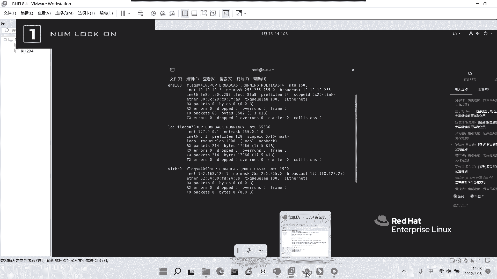
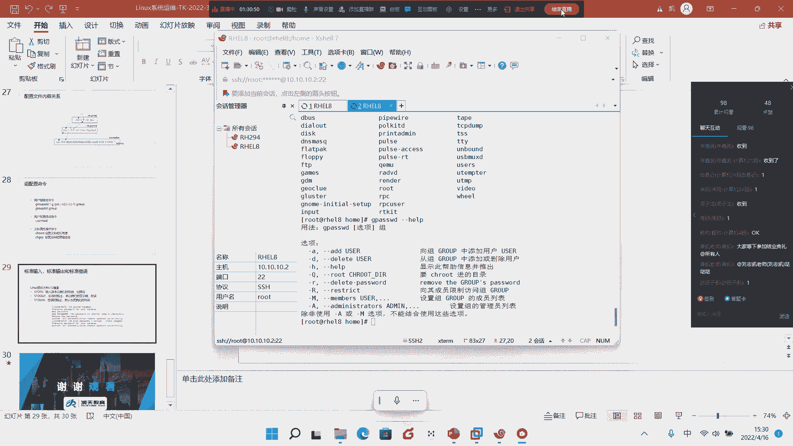

# Linux基础入门教学：8：用户与组管理



在本节课中，我们将要学习Linux系统中至关重要的组成部分——用户与组。我们将了解如何创建、管理和删除用户与组，以及它们与系统权限的关系。课程内容会从基础概念讲起，逐步深入到实际应用，确保初学者能够跟上。

## 用户与组的基本概念

上一节我们介绍了文件权限，本节中我们来看看这些权限背后的核心——用户与组。在Linux系统中，每个文件和进程都归属于一个特定的用户和组。

当你使用 `ls -l` 命令查看文件时，会看到类似 `root root` 的字段。这表示文件的所有者是用户 `root`，所属组是组 `root`。但系统内部并不识别“root”这个名字，它只识别数字ID。

**核心概念：UID 与 GID**
系统通过数字ID来识别用户和组：
*   **UID (User ID)**：用户ID号。超级管理员root的UID是 **0**。
*   **GID (Group ID)**：组ID号。root组的GID也是 **0**。

你可以使用 `ls -ln` 命令查看文件真正的数字UID和GID，而不是用户名和组名。

## 用户的分类与家目录

Linux用户主要分为两类：
1.  **超级用户 (root)**：UID为0，拥有系统最高权限，家目录在 `/root`。
2.  **普通用户**：UID通常从1000开始，家目录默认在 `/home/用户名` 下。

创建一个用户时，系统不仅会创建家目录，还会在 `/var/spool/mail/` 目录下为该用户生成一个邮件文件。

每个用户的家目录中，默认包含几个隐藏的环境配置文件（以 `.` 开头），例如 `.bash_history`, `.bash_logout`, `.bash_profile`, `.bashrc`。这些文件决定了用户登录后的Shell环境。例如，可以通过修改 `.bashrc` 文件来改变用户创建新文件时的默认权限（umask）。

## 深入用户配置文件：/etc/passwd

要准确知道系统中有哪些用户，不能只看 `/home` 目录，而需要查看系统的“花名册”—— `/etc/passwd` 文件。

这个文件中的每一行代表一个用户，由冒号 `:` 分隔为7个字段：
```
root:x:0:0:root:/root:/bin/bash
```
以下是每个字段的含义：
1.  **用户名**：用户登录名，如 `root`。
2.  **密码位**：`x` 表示密码已加密，并存储在 `/etc/shadow` 文件中。
3.  **UID**：用户ID。
4.  **GID**：主组ID。
5.  **描述**：用户的注释信息。
6.  **家目录**：用户登录后进入的目录路径。
7.  **登录Shell**：用户使用的Shell程序路径。`/bin/bash` 是标准Shell，`/sbin/nologin` 表示该用户不允许登录系统。

根据UID范围，用户可分为：
*   **0**：超级用户。
*   **1-999**：系统服务用户（系统进程使用）。
*   **1000+**：普通用户。

## 影子文件与密码管理

`/etc/passwd` 文件权限为644，所有用户都可读。出于安全考虑，加密后的密码实际存放在其影子文件 `/etc/shadow` 中，该文件只有root可读。

`/etc/shadow` 文件同样由冒号分隔字段：
```
root:$6$...:19077:0:99999:7:::
```
关键字段说明：
1.  **用户名**。
2.  **加密密码**：如果为 `!!` 或 `*`，表示未设置密码，不能登录。
3.  **上次修改密码的天数**：从1970年1月1日（Unix纪元）开始计算。
4.  **密码最小年龄**：多少天后才能再次修改密码（0表示随时可改）。
5.  **密码最大年龄**：多少天后必须修改密码（99999表示几乎永不过期）。
6.  **警告期**：密码过期前多少天开始警告用户。
7.  **宽限期**：密码过期后多少天内账号仍可用。
8.  **账号失效日**：从1970年1月1日起，账号失效的具体天数。
9.  **保留字段**。

可以使用 `passwd` 命令为用户设置或修改密码。对于root用户，可以直接指定用户名：`passwd 用户名`。设置密码时输入是不可见的（盲敲）。

还可以使用 `chage` 命令或直接编辑 `/etc/shadow` 文件来管理密码策略，例如设置密码有效期。

## 组的配置文件：/etc/group

与用户类似，组信息存储在 `/etc/group` 文件中，其影子文件是 `/etc/gshadow`。

`/etc/group` 文件格式如下：
```
组名:密码位:GID:组内成员列表（以逗号分隔）
```
可以为组设置密码（使用 `gpasswd` 命令），这样用户就可以通过 `newgrp` 命令输入组密码来临时加入该组。

## 用户与组的管理操作

以下是管理用户和组的核心命令。

### 创建用户 (useradd)

使用 `useradd` 命令创建用户，常用参数如下：
*   `-c “注释”`：为用户添加描述信息。
*   `-d /path/to/home`：指定家目录路径。
*   `-u UID`：指定用户的UID。
*   `-g GID/组名`：指定用户的主组。
*   `-G 组名1,组名2`：指定用户的附加组（从属组）。
*   `-s /bin/bash`：指定用户的登录Shell。

**示例**：创建一个UID为2000，描述为“HR”，家目录在 `/hrdir`，并附加到 `tanghai` 组的用户 `nta`。
```bash
useradd -c “HR” -d /hrdir -u 2000 -G tanghai -s /bin/bash nta
```

### 修改用户属性 (usermod)

用户创建后，可以使用 `usermod` 命令修改其属性，参数与 `useradd` 类似。

**示例**：将用户 `sara` 添加到 `tanghai` 附加组中。
```bash
usermod -G tanghai sara
```

### 删除用户 (userdel)

使用 `userdel` 命令删除用户。
*   `userdel 用户名`：仅删除用户，保留其家目录和邮件文件。
*   `userdel -r 用户名`：彻底删除用户，同时删除其家目录和邮件文件。

### 创建与删除组

*   `groupadd 组名`：创建新组。
*   `groupdel 组名`：删除空组（组内无用户）。

### 更改文件所有者与所属组

*   `chown 新所有者 文件`：更改文件所有者。
*   `chgrp 新所属组 文件`：更改文件所属组。
*   `chown 新所有者:新所属组 文件`：同时更改所有者和所属组。
*   添加 `-R` 参数可以递归处理目录下的所有文件。

**示例**：将文件 `file1` 的所有者改为 `nta`，所属组改为 `tanghai`，并递归处理 `dir1` 目录。
```bash
chown nta:tanghai file1
chown -R nta:tanghai dir1/
```

## 特殊技巧与总结

### 非交互式设置密码

在脚本中批量创建用户时，需要非交互式地设置密码。这可以通过管道和 `stdin` 实现。

**示例**：为用户 `mary` 设置密码为 “redhat”。
```bash
echo “redhat” | passwd --stdin mary
```

### 用户加入组的管理

除了root使用 `usermod` 管理，用户也可以使用 `gpasswd` 命令管理组。
*   root为组设置密码：`gpasswd 组名`
*   用户自己加入组：`gpasswd -a 用户名 组名` (需组密码)
*   注意：此命令可能因系统或Shell配置而异，`newgrp` 命令也是切换组的一种方式。

---



本节课中我们一起学习了Linux用户和组的核心管理知识。我们了解了UID/GID的概念，学会了查看和分析 `/etc/passwd`、`/etc/shadow`、`/etc/group` 等关键配置文件。掌握了使用 `useradd`、`usermod`、`userdel`、`passwd`、`chown`、`chgrp` 等命令进行用户、组及文件归属的日常管理。这些是成为一名合格的Linux系统管理员的基础技能，请务必认真练习和掌握。