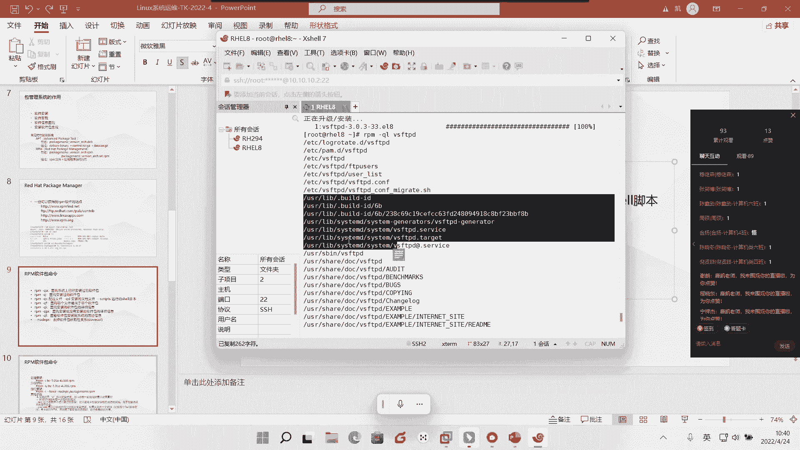
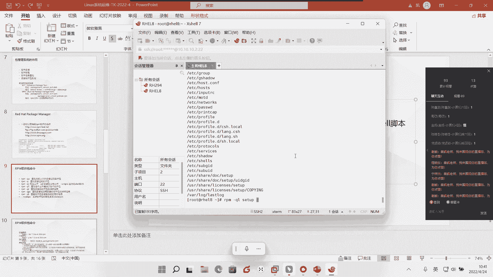
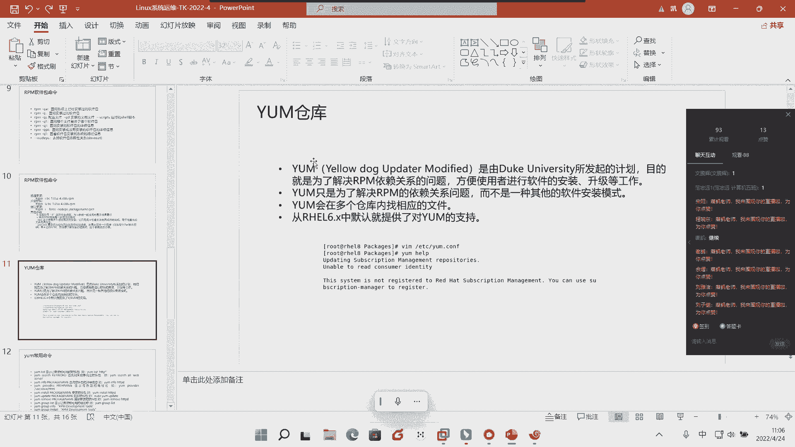
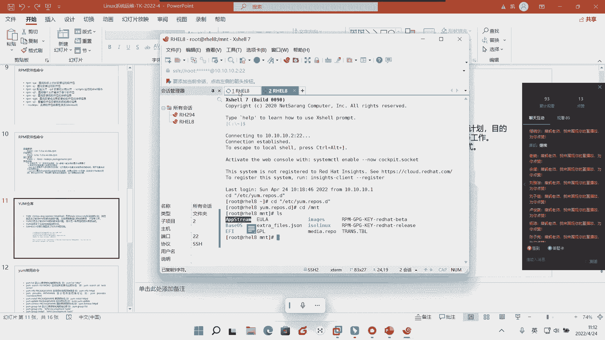

# Linux基础入门教学-9 - P1 - 唐老师开讲 - BV1xV4y1G7Cj

好各位同学，那个，相互之间通知一下，目前大家那个到我们的直播间的，目前还只有69位同学，其他同学都还没在吗，各位今天应该是没有课的，是不是大家能听到我声音吗，能听到我声音的回复，回复我一下好不好。

可以听到我声音吗，能好，40，好那么接下来我就要正式的给大家来进行上课了啊，正式给大家来进行上课了，好，那么呢我们接下来呢今天将会继续给大家来讲到的是我们的这个linux的。

一个应该是此次此次我们的整个啊我们的实训的啊，这个就是我们的认知实训的最后一次课程啊，最后一次课程啊，本来这次课程应该是在上一周给大家去讲完的对吧，讲掉的，但是呢呃因为啊这个疫情的原因啊，疫情原因。

所以我们今天上午啊给大家再补一次啊，今天上午给大家再补一次啊，再补一次好，那么我们在上一次课程的时候呢，其实也给大家去讲到了我们的这个用户还记得吧对吧，给大家去讲到了我们用户的权限呢啊。

整个这一块的管理，那么也是需要要求大家去记住，是在我们企业的实际的环境中间啊，实际生产环境中间啊，管理用户其实是一个最复杂的过程啊，是一个最复杂的复杂的过程好，那么在这里我们也给带着大家一起回顾一下啊。

一起回顾一下呃，我想问一下大家，我们类似中间啊lix中间我们的红帽子这个环境中间，我们的用户一般分为几类，能告诉我吗，哦我们用户一般分为几类，有同学能告诉我吗，还有同学能告诉我们啊。

我们links在我们用户管理这个环节中间，我们一般会分为几类，看来大家还刚刚才到啊，刚刚才到啊，这个状态，有同学能回答我吗，能分为几类啊，两类哪两类呢，哪两类的哦，跟用户和普通用户是吧。

跟用户和普通用户，那我下好，这样来问一下啊，在我们etc上面的pass wd这个文件中，文件中啊，文件中把用户分为几类啊，用户分为几类，咱们这样问吧对吧。

e d c password这个文件中间我们用户分为几类，这个大家延迟很大吗，这个说半天大家都没有回复，a c c pascd中间啊，我们用户分为几类，一般是分为我们的三类，对不对，分我们三类。

一类就是我们刚才所说的超级用户的，对不对，那么他的ui d和g i d都为我们的怎么样都有我们零对吧，都有我们的零，那其次呢就是我们的什么呀，我们的服务用户是不是那么服务用户呢，我们的它的这个什么呀。

u i d和g i d是从什么呀，一到多少999对吧，1~999啊，这是我们称其为叫做服务的这一块的用户，对不对好，那么真正的普通用户是从多少，是从1000开始的是吧，是从1000开始的。

所以我们说普通用户的我们如何啊，系统如何去定义它，其实是cospui d和我们的j i d来理解啊，uid和我们g i d来理解，请大家注意啊，是这样的概念好，那么同时呢我们也说到了创建一个普通用户啊。

大家注意创建一个普通用户会写进到多少个配置文件里面去啊，而显现了多少个配置文件，我们创建一个普通用户会写进多少的配置文件了，能告诉我吗，啊创建一个普通用户会写进多少个配置文件里去，六个对好，那哪六个呢。

各位对吧，哪六个，我们说首先第一个它的家目录是不是就是一个对吧，它的加目录就是我们的一个好，那么其次呢我们从创建每一个用户的时候，都会为这个用户创建所对等名字的什么呀，电子邮件的文件是不是在什么地方。

在外poor mail下面对吧，was poor mail下面诶，我们会生成这个用户所对应的这个配置文件，是不是好，那么其次啊，其次除了我们这样的之外，我们还有什么四个核心的配置文件对吧。

那么哪四个派核，心配置文件分别为我们什么样，我们的用户的配置文件，etc的pass wd还记得吗，那么其次呢由我们这个配置文件所对应的什么呀，影子文件是为我们什么e t c下面的shadow对吧。

e d c上面的shadow好，那么除此外呢还有什么呀，哎有我们的etc的什么呀，group做我们的主，对不对，还有etc的什么呀，g shadow哎记下的好，那么一共是有我们的这样的六个啊。

一共是有我为我们这样的六个，请大家注意啊，这是我们的这个标标准准的这样配置信息啊，配置文件啊，配置文件好，那么其次呢我们请到大家啊，这个，我们只是回顾到这里，我回顾到这里好。

那么今天呢我们将会继续给到大家来讲一个新的啊，讲一个新的，那么这个新的呢称其为叫做安装应用程序到link上面啊，其实并不难，其实大家注意安装应用程序到我们lan上面其实并不难的啊。

并不难的好，那么我们怎么来理解呢，大家很清楚，今天无论是我们的windows啊，大家注意啊，今天无论是我们的windows还是我们的lex，其实一个应用程序的安装或者一个应用程序的诞生。

个部分哪四个部分，请大家听好了，那么第一个部分我们称之为叫做可执行程序对吧，可执行程序什么意思呢，也就是说这个文件它必须具备可执行，就像windows中间它是不是有一个点ex一的结尾对吧。

也就是说它必须是一个ex一结尾的，我才能去执行对吧，才能去运行它，才能去双击，是不是好那么其次我们大家都很清楚，当我双击之后啊，当我双击之后，它会跳出来的是我需要将它安装到什么地方，对不对。

默认是我们的什么呀，c盘对吧，默认是我们的c盘，所以我们同样那么安装到c盘，里面对吧也会有很多很多很多的这样一个配置文件对吧，配置文件，所以我们也需要要求大家去记住是一个应用程序。

一定是有多个相关联的这样一个配置文件所组成的，是不是，那当然很多程序安装完之后，他有对这个程序是什么呀，哎也是使用说明对吧，一个帮助信息，一个帮助说明，所以我们肯定啊任何程序，任何的文件啊。

任何应用程序都会有这样一个帮助的文件所存在啊，帮助文件所存在，那当然还有一个是什么呢，还有一个是叫做库文件啊，还有一个叫做库文件，那么这个控，件我们之前也给大家稍微提到过这个混件是什么呀。

他是不是用来帮助啊，帮助我的是应用程序是什么呀，更好的去识别我系统的这样一个什么呀，一一个一个一个一个什么呢，承上启下的一个过程对吧，承上启下的过程，那么在windows中间。

我们很多时候呢我们都是有这种点d l l的库文件所存在对吧，点dl的库文件啊所存在，但在linux中间呢，我们更多的是以模块啊，点ko的这种模块所存在，请大家注意啊，这是两个不一样的概念啊。

两个不一样的概念，但是无论如何，我们今天的应用程序，这四个的啊，一定是帮朋友这样的四个，请大家注意啊，在这边好，那么其次啊，那么其次这是我们的整，那么其次呢我们将会给到大家所看到的是这个啊。

请大家听好了啊，什么意思呢，今天在我list上面，其实啊其实我们的我们有多种应用程序，安装的方式，那么在这里重点呢是给大家看到的是这样的四个啊，重点是给大家看这样的四个蓝色，请大家注意。

第一个我们称之为叫做r片方，这也是目前啊，这也是目前在我们整个link中间，通用应该是应用最为广泛的，应用最为广泛的一种软，那么其次呢就是有一个叫r h n的啊，其次有一个叫做r h n的。

那么r h n是什么意思呢，它是这样的，就是呃我们第一次课的时候给大家去说过，今天红帽啊，今天红帽他之所以能在我们的企业中间对吧，能在我们这个社会上面更好的去啊，这个比如盈利呀对吧。

更好的去这样一个这个这个盈利点，它其实更多的是什么呀，是我们的这样一个就是红帽，他是做了什么呀，叫订阅的概念啊，做的是这样一个订阅的概念好，所以rhn那相当于是什么意思呢，相当于。

你去像红帽啊去查就去去去购买了这样一个定位服务，那么红帽呢会给到你一个账号，那么这个时候你在你的这样一个什么呀，哎这个这个系统中间去填入这个账号之后，就是类似于windows update一样的。

会有一个自动更新的概念啊，会有一个自动更新的概念，其实大家跳了，请大家注意啊，我再说一遍，它，我们称之为叫做亚按压或者叫dnf啊，叫df，这是两种安装方式啊，安装方式好。

那么最后一种呢称之为叫source，什么意思呢，就是我们的源码安装啊，源码安装啊，源码安装，当然这是目前在我们这个这个应该从lks上面啊，比较火的几种啊，比较火的几种，但是今天呢我们重点啊。

今天我们的重点着重讲解的是rpm和我们的ym或者df的啊，这两种啊，这两种，这也是我们今天红帽上面主推的啊，主推的两种安装安装啊，安装的形式，好吧是可以邀请大家去理解啊，要大家去理解好。

那么接下来呢我们就需要要求大家去注意的是什么啊，注意是什么，其实你今天看这张图啊，可能大家就是看这个图可能理解的不是太太太理解啊，这是我给大家稍微说稍微说明一下啊，稍微说明一下什么意思。

也就是说今天其实你可以看到这个上面这个红色的代表什么意思呢，代表的其实你可以理解为叫做各种各样的功能啊，各种各样的功能或者工具啊，或者工具，也就是说今天或许我去安装某一个程序的时候，或者我今天运行。

某一个软件的时候呢，他可能会用到这里的红色的啊这些功能啊，红红色的这些工具或者功能啊，请大家注意了，但是呢有可能这些工具功能呢，它并没有在我们默认的linux的这个系统上面所所生效啊。

安到我们系统中间之后，然后呢生产出这样的一批所对应的什么支持库啊，或者命令啊啊，或者工具啊等等等等这一块的工具啊等等等这一块的东西，请大家注意啊，是在这里好，那么接下来呢我们就要要求大家。

整个这一块的过程好，那当然今天呢呃就之前呢有很多同学说诶我电脑上面我是吧，这个装了有我们的什么无班图啊，我装了什么德编那无班图啊啊抓了很多很多，第四其他的这样一个啊linux的这个发行版本啊，发行版本。

我在睡眠啊，它并不是rpm，因为大家都很清楚啊，大家看到这句话，这个rpm指的是什么，是read hard package management，什么意思，也就是说白一点点，今天我们的rpm。

更多的是依托于红帽或者类似类红帽的这样一个这个linux版本啊，也就是说如果今天我们linux操作系统中间它是默认使用rpm的话，那么你用rpm整个这一块的工具是没有任何问题的，那么除此之外啊。

除此之外还有一种我刚刚说的就是以德边对吧，以我们的这样一个无班图为手的这样一批alex，那么这个时候呢他所使用的结尾，大家看到啊，它不是以点rpm结尾，它是以点d b e r的这个第1b为结尾啊。

大家注意以什，么呀第1b这是德边的概念啊，以这个为结尾听明白啊，或者是以什么碳点gz的源码啊，源码这种所组成的啊，所组成的，请大家注意啊，是在这里是要加家去注意的，好接着谈到这里呢。

我们接下来我们来看一看，我们今天在linux上面假设假设要去安装一个软件，是就是简不简单啊，简不简单，请大家听好啊，所以我们接下来就会教给大家软件的安装，软件的卸载，请大家注意啊，好首先呢我们要看到。

的第一个前两句我们首先要看的第一个，在这里列出了四个啊，大家注意，在这里列出了有四个啊，四个地址，大家注意啊，但是但是啊大家注意了，红帽的光网就是红帽的光盘里面啊，但是有可能他不是最新的啊，不是最新的。

但是它是我们红帽什么呀，里面的，所以它一定是相对而言安全及稳定的啊，大家一定是相对安全及稳定的好，所以啊所以我们今天呢首先既然谈到这里啊，我们说了，我们不需要，因为我这里没有联网啊对吧，没有联网。

所以我们有我们先不考虑这种什么网上的对吧，我们先不考虑这种网上的，我们就要考虑我们光盘内部的啊，大家注意光盘里面的唉，光盘里面的有哪些呢。

好我们在这里呢去使用我们的这个差距，我们登上去一下，好大家注意啊，我们今天要求大家去讲了一个命令叫df的命令，还记得吗。

df的命令，那么df呢是用来查看我们系统中间的是什么呀。

一个挂载的情况对吧，用来查看我们系统中间的挂载的情况好，这个时候呢我们会发现我们默认前面我们是没有被挂载的对吧，我们光驱是没有被挂载的，我们说了啊，现在谁我们的光盘挂过来的啊。

挂载过来的肯定会在这个上面，所以我们在这里呢用一个mount命令还记得吗，我们第二次课给大家去讲了，第二次第三次课给大家讲的mod命令，dv的cd rom的mt，大家注意啊。

d vcd rom m n t好，我们把它手动挂载到我所指定的这样一个文件夹里面去，是不是好，df杠什么呀，h好，你会发现我们现在的光驱是不是就把它刮过来啊，这能看见吗，我们的光驱就把它挂载过来了。

好当我进入到m t的时候呢，这里面所看到的所有就是我们的什么呀，安装的这个linux的整体的一个应用环境，而整体的应用环境是要求大家去记住的好，好大家听好了，现在从我们的红帽八开始啊，红帽八开始。

并没有存在某一个目标件夹里面，而是它把它区分开了啊，它把它区分开了，区分到了几个呢，情差距它区分到的两个里面，一个叫做base的os，大家注意啊，一个叫bios。

一个叫app the upstream啊，这up strain在这两个里面，大家注意啊，在这两个里面好，那么现在在这两个里面呢，我们来分别的进去看一下是不是就够了对吧，我分别进去看一下就够了。

好那么怎么记呢，大家很清楚，直接用cd什么呀，up train a las好，在这里面就会有一个什么呀，packages对吧，和一个reported，什么意思呢，这个你可以理解为它相当于是对我们所。

做了一个数据库，就是安装的数据库叫report date啊，report date好，那么这个时候我们去进入到我们的什么呀，这个package大家记住啊，大小写啊，大家记住啊。

大家要写package package，好，进来好，此时此刻看到的啊，此时此刻所看到的这么一系列的东西，以后缀为点rpm结尾的，请大家注意了，有这么多软件有比如说有安装我们的spg h的，是不是就安装。

就是另外一个shell环境的z shell的对吧，有我们的图形化gnome的看表tch norm的这个高x11 的对吧，有装有图形化的，有我们的什么啊，就是你会发现上面有很多很多很多很多，对不对好。

那么这个时候呢假设我想去安装啊。

在这里我就我就直接跳到这个这个地方来讲。

它这个地方来讲，我们直接来讲就行了，我们直接来讲就行了，首先第一个首先第一个我们是用一个生活中的例子啊，首先用一个生活中的例子，比如说比如说你今天想出去，你现在肚子饿了啊，你现在肚子饿了对吧。

这个时候呢，你想出去在学校的旁边的小卖部啊，学校旁边的宿舍对吧，宿舍旁边的小卖部，你想去买一个泡面对吧，你想去买一个老坛老坛什么呀，酸菜是吧，老坛酸菜的这样一个是吧，泡面来吃对吧，填饱肚子啊，填饱肚子。

那前提，首先第一件事情我能不能这样理解，首先你是否对吧，你现在肚子饿，但是你想吃这个老坛酸菜对吧，这个味道真爽的这样一个这个这个画面前提，首先你是不是要查一查你家里本身有没有这个泡面，是不是。

首先你是不是要查一查你家里本身有没有这个泡面，能明白好，那，怎么查呢，很简单，用什么呀，大家注意啊，这里有一条，这里有个这个这个命令叫rpm的命令，其实它本身也是一个命令，我在这边啊。

本身它也是一个命令前答题好了好，那么接下来谈到这里呢，我们就要去我们就可以去看到的是什么呢，就是我们通过大家注意啊，我们去通过rpm杠，大家对rpm杠q大家对rpm杠q，大家注意啊。

杠q去查一查这个软这个这个什么呀，这个泡面家里有没有，对不对，好，我今天想去安装的是一个一个，叫做ftp工具啊，我们称这个叫vs ftp，大家注意vs f t p d，大家注意啊，vs f t p d。

我想去看这个老坛酸菜的这个面有没有，你就这样去查rpm杠是啊，show vs f t b好，你会发现有没有啊，你会发现有没有好，这里其实已经告诉你了，目前是什么呀，是没有的对吧，目前是没有的好。

那么既然没有，这个时候呢，我想去安装的时候，大家注意啊，我想去安装的时候呢，就算蛮简单，你现在没有，你现在要去买这个老坛酸菜对吧，你现在去买到他的酸菜，那很有，那别人就会问第一件事情，你在哪里买是吧。

你，去哪里买，你是去你宿舍楼下的，这个是没有小卖部买，还是你需要去食堂的这个什么呀，这个小卖部买，还是你需要出这个学校外面的超市里面买，你是不是要指定它在哪里嘛，就像你先安装一样的。

虽然你会看到我这里没有，对不对没有，那么你安装的时候，你也需要干嘛，去到指定的目录里才来，我再说一遍啊，你需要去去到指定的这个目录里面才能，所以很简单，首先第一件事情我在这里。

我是不是就要去搜索一下我这里有没有对吧，怎么搜索啊，怎么搜索，我们之前讲过，你可以通过这，种方式搜索啊，搜索所有的v s m t t，当前是不是搜索通过管道筛选出vs f t p有没有好。

你发现是不是猜错了啊，是不是筛出来了，是不是有，对不对，当然除了这种之外，其实还可以通过这种方式也可以塞vs d b d，你看是不是也可以筛出来了对吧，也筛出来了，有没有有啊。

也就代表着你现在其实就是在小卖部里面了对吧，就是在我们的小卖部里面了，好这个时候你已经确定了，我要吃它对吧，接下来你要干嘛，你是不是要付钱把它买掉，好那怎么了，ok这个时候安装怎么装怎么安，大家注意啊。

告诉我这是查询啊，这是查询好，安装怎么安呢，rpm杠，大家注意啊，干i v h3 个啊，三个当然一般来说i就是指安装了，那么在vh值的证明呢是用于查看安装的进度啊，就类似于你今天在windows中间。

你点下一步安装的时候，是不是有个滚动条是一样的概念是吧，这个滚动条是一样的概念，好空格，大家注意你接下来你不能手动打他啊，大家注意，当你手动打他的时候，回车有wifi了，他是找不到的啊，他是找不到的。

为什么很简单，因为今天的，今天他认为你的泡面你一定要查看什么呀，查看日期吧，免得这个泡面怎么样都酸爽是吧，不酸爽，所以你一定要干嘛去查一查这样一个什么呀，这个版本对吧，适用平台啊，这个什么呀。

这个这个位数对吧，是64位啊，多少位是不是好，所以呢今天也是这样理去安的时候呢，大家听好了，你需要的时候一定是什么样，i v h v s f t v或table啊，大家一定要学会table。

当你table之后呢，你会发现它自动给你补全了，看到没有，自动给你补全了，好回车，你看这个就是v h的一个作用啊，vh的作用，所以，它会有一个什么样诶，他首先评判百分之百。

然后安装这个软件要要求百分之百，然后安装完之后百分之百，而且最终跳出了一个什么呀，下一个提示框啊，下一个提示框代表你刚刚安装的是正确的，我再说一遍啊，代表你刚刚安装的是正确的，听明白安装的是正确的。

所以我们再来查i rpm杠什么呀，q vs dvd，ok你会发现怎么样就已经装上去了，看到没有就已经装上去了，让很多人不太理解的是，为什么安装的时候要完全的这个软件报名，而查询的时候呢，就，够了。

为什么啊，为什么呢，很简单，你今天把面对吧，你今天买的这个什么呀，这个面是不是搬走了，能听明白对吧，搬走了，搬到了是啊，这个这个这个这个买回家了是吧，买回家你在家里泡的啊，你还关不关心。

你还关不关心这个什么生产日期，关不关心其他的不关心了，是不是离子关心，看到这个什么呀，这个紫色对吧，看到这个紫色看到了怎么样，诶，这个头像是吧，看到这个文字是不是，就够了，能听明白对吧。

所以查询的时候在什么样，所以查询的时候你在任何一个地方查都可以，大家看到我在任何一个地方查都可以，但是安装的时候你一定要到什么呀，指定的这个小卖部理财的安装成功，这能听明白，ok，啊这个应该能听明白吧。

那么今天假设哎我发现啊，这个我不想要了，我不想要了，我要把它删掉怎么办，也是一样的，今天你把它买回家了对吧，你买回家了，你现在不想要了对吧，而是理智的原因，而不是什么呀，不是这个小卖部的原因。

我自己不想要了，你是不是随手把它丢到垃圾桶去，是不是就够了，或者说你直接把它丢出门外，是不是就够了，你不需要去什么呀，哎跑的小白不说诶，老板我不要了，我吃完了我吃完了我不要了，我要退掉。

没有这种说法是不是，所以你卸载的时候大家注意啊，刚刚安装是ibs卸载，只有，一个叫做杠一就行了啊，卸载直接杠一就行了，然后vs m g p t大家注意卸载直接杠一就够了，好大家看了，当我直接敲一的时候。

ok就卸载成功了，所以rpm杠是不是再来看再来看啊，干我们的什么呀，q的时候vs f t v vs f t p d的时候，ok这里是不是又没有了，这里又没有了，就这么简单，能听明白对吧，又没有了好。

所以这里能能明白吗，就是我刚刚举了个例子啊，就是安装的时候，你一定一定要去小卖部那里去找到对吧，去找到，但是我一旦买回来或者查询的时候，我其实都是在怎么样，自己家里所产生，所以我不需要对吧。

我不需要去关心对吧，我不需要去带完全的这个名字，能听明白，我不需要去带完全的名字，好这个大家听懂了没有，我想问一下大家听懂了没，听懂的扣一下啊，听懂了call一下，这个听懂了吗，各位同学大家好，懂好的。

很好，对不对，好那么接下来大家注意啊，对吧，我要查一查这个参数，很简单，rpm杠，大家注意啊，q a a指的是always，明白q a就行了啊，q a就行了，后面什么都不带啊，我在这片后面什么都不带。

q a回车，听明白。

安装安妮的什么呀，q a豪威尔查查安装率多少，很，简w跟l对吧，一共安装1373个，1373个，是不是很简单，真的明白，这是这是不是比我们windows的这样一个易用性是不是要强很多对吧。

易用性要强很多好，这个能听明白吗对吧，q a好，但是说了这么多啊，但是说了这么多，有没有同学会反问我一个问题啊，啊访问什么问题，就是老师你刚刚装了这个vs f t p是干嘛用的呀。

我想查一查他是干嘛用的，怎么办呢，好大家注，意啊刚刚rpm刚q是用来查什么呀，还记得吗，是否被安装，那么q大家注意啊，大家注意啊，它是用来干嘛的，听明白好，但是就如同现在大家所判断，我没有安装。

是不是啊，所以我接下来我要去安装，怎么是不是还是一样的，首先第一步我要确保我的光盘是不是要被挂载，是不是，然后干嘛cd m n t是吧，这个什么a p p string对吧，是其中一个吧，对不好。

找到这个是不是，就首先我是不是要到这个目录学是吧，然，后在i v h怎么样，v s f t b把它装上去，能听明白啊，把它装上去好，装上去之后我们再来看rpm杠qi对吧。

当然我说啊查的时候你可以在怎么样任何地方是不是好，大家注意啊，qi好，v s f f t p d回车，你看他就告诉你，版本是三点点三对吧，然后呢目前大家注意啊，是64位的，而且是real 8的。

三三是修修订的对吧好，然后呢安装时间是今天对吧，安装时间是早上啊，10：33：22，是不是，然后呢它的大小是多少，它是它目前的这个现依，赖于gpl杠v2 的这样一个协议对吧。

这个这个社区的概念对不对好那么其次啊，那么其次请大家注意啊，看到没有，然后呢你也可以再怎么样，在这个就是在这里去了解vs tv d的整个这一块的一个说明，说明明白好，然后呢他去介绍。

他其实已经给你介绍了，这不就介绍吗，介绍什么，他说v s m t p d是一个非常安全的ftp服务，看到没有，是一个非常安全的ftp服务好，那何为ftp，ftp是干嘛用的啊，ftp是干嘛用的对吧。

那么这个在未来还未来，因为我说，啊这个因为我们今天只是讲linux，那干嘛用的，那怎么用对吧，那怎么用，那ftp甚至于我们企业的一些架构，这个都会在未来的我们在这样一个实际企业环境中心。

都会给大家去讲啊，都会给大家去讲啊，未来如果有机会大家来到实验中心啊，我们都会给大家去讲到啊，都会给大家去讲到是吧，让大家更合理更合理更快速的成为一个什么呀。

我们这样一个这个这个企业的这个用人就负起用的需求啊，付企业用的需求好，当然我们刚刚说rpm跟qi是查我们里面的内容是不是好，但是大家听好，了那很多人说李氏装完之后。

你才来查这个这个这个什么查了查这个老坛酸菜牛，这个酸菜面是吧，这个到底是个是这个酸菜是用脚踩的还是用什么东西是吧，就是你安装完之后你才是吧，你吃完之后你才看啊，吃完之后才能看好。

那如果说有没有有没有吃那种，就是我还没有吃呢啊我还没有吃呢，大家看我又把它卸了啊，我又把它卸了，大家看啦，我又把它卸了，是不是好，我退出来啊，我退出来好，那有没有可能我想查的是我想去查的这个软件吧。

我没有安装的时候可不可以了，可以大，家注意我要查没有安装的时候就不是qi了，还是怎么样，q pi或者qi p加一个p啊，packages的意思加一个p就行了啊，加一个p就行了，好但问题来了。

你后面是需要带一个，完全因为我没有安的时候，我是不是就相当于在超市里面去查这个怎么样，这样一个老坛酸菜牛肉面的整个这一块的这个信息啊对吧，它到底是出自于哪里，对不对，然后呢是怎样一个过程。

价格生产日期一切一切我是不是要去查好，我们也一定是要有它的绝对路径，怎么决斗路，径呢你就写呗，比如说fp store这个什么呀，packages vs f t好，大家看了，当年啊。

当年这个没安装的时候啊，好这个时候回车回车，你看你看到的效果是一模一样的啊，一模一样，但是但是我们没有什么呀去安装啊，没有去安装，谁要求大家去注意的啊，我们是没有去安装的，好这个能听懂我所说的例子吧。

我们是没有安装的好，所以呢我们今天也是一样，当我们今天去安装和没有安装对吧，怎么去查看一个软件的信息，请大家一定要去理解清楚啊。

一定要去理解清楚啊，q a查询所有已安装的q查询安装过的对吧好，那当然还有qc是什么配置一些脚本，这个我们先不管了啊，咱先不管了，qi kpi能听明白啊，q i q i好。

是什么意思呢，就是今天呢在我们电路中间其实有会有很多，我们我们在上课是不是讲了这个文件，比如这个文件被我搞丢了，搞坏了，你看当你去敲这个文件的时候，那也就是说如果我今天一不小心把这个文件给他删掉了啊。

举个例子，一味把这个文件删掉了，没关系，将这个文件干嘛给它找回来啊，给它复制回来啊，给它复制回来，听明白，安装到哪里去了，安卓就是安装这些文件，除了除了这个e d c psp。

或者说我们还是v s t d d吧，这样v vs f t p d转啊，我想去安装这个，就是查看一下这个安装到哪里去了，这个时候怎么办呢，很简单，rpm gq哦，我刚刚是不是装了没啊。

pf杠q v s f t p哦，没有装好，我们去装一下rpm杠i v h这个什么呀，呃m g的abstring packages，是不是这个vs f t t好，把它装了，大家注意我把它装了好。

装完之后我也想去查一查，按这个做完之后，虽然这里都是滚动条，我很想清楚他到底具体安到哪里去了，在windows专业你是不是看不到的，windows专业也看不到，那么在另一个专业我们能看到叫q l啊。

q l大家注意好，回车他就告诉你啊，他就告诉你，你今天大家啊，你今天安装了这个vs tt，他首先不在e d c下面啊。

已经给你生成了有这么多文件，看到没有有这么多文件。

然后呢在v s r lab lab下面哎，有给你生成的有这么这么多文件。

然后呢它有它会生成一个命令，看到没有，会生成命令。

然后也会生成所对应的帮助信息对吧。

都会有，请大家注意了，啊都会有好，这个能听明白吗，就是ql啊，刚刚给大家去讲了，有很多3s spq啊，q f i v e h q l能听明白对吧，查询我们安装到哪里，比如说我们刚刚看到一个setup。

对不对，set up那很简单对吧，rpm gq ql set up，set it up，它告诉你，然后你去安装set up的时候，他会给你安装有这么多，比如说主机原因对吧。

这个号不是就是主机主机的一些这个这个这个什么呀，这个这个呃这个信息是不是也在这里对吧，主机项目传递的信息，我们的group击杀的，看到没有击杀的a fast table，然后呢等等expose对不对。

profit d对吧。

shadow shell，所以你突然发现哎呦原来我的set up这个文件啊。

是在我电脑中间起到起到什么至关重要的作用啊，起到至关重要的作用，这能听明白啊，好这个听懂了没有。

ok好，接下来接下来有个no no no gg。

no dips是什么东西呢，好这个是这样来说，mt的pvc的里面啊，我来我来想一下啊，呃，杠，q，我随便找一个看看有没有装啊，二有装，呃我我举个例子啊，举个例子只是举个例子啊，比如gq g c c。

g c c好，你看有没有有吧，大量的g c c是不是大量g c c是不是好，那如果我今天要去装，你看他是有个八点四点多少，对不对好，那我想去装怎么办呢，rpm杠i v h，大家看啊，g c c杠8。

四点，这个好，大家看啊，我回车你看看看看这个这这有一个警告是什么东西啊，他说你今天要去安装它，就像这样蛮简单，今天很多超，市做促销啊，很多超市做促销，他说你现在可以一块钱对吧，一元钱啊，一元钱。

然后呢买一块香蕉回去啊，一元钱买一块香蕉回去啊，很多人都跑过来买对吧，因为太便宜了对吧，非常便宜对吧，现在一个香蕉在外面随随便便都要20多，对不对，诶但是他高，但是告诉你什么一块钱你就能买到对吧。

一块钱就买了好，这个时候呢啊很多人就说啊，那我来买对吧，那我去买，但是他告诉你，你想一块钱买这个东西，前提是什么，你必须得在我这个超市是吧，消费其他的商品，比如说你得买一个20块，钱的酸奶对吧。

你还得买其他的水果，达到什么样啊，80块你才能再加一块钱把这个香蕉买走，对吧对吧，这就是我们称之为叫什么呀，这个这个这个变相的营销对吧，变相营销好，这个也是一样的，当我今天安装这个软件的时候。

他首先告诉我，他说请你干嘛呢，去安装它，在安装这个软件，在安装这个软件，这三个软件都安装完了之后，他才能安装成功啊，他才能安装成功对吧，那么这个时候也很简单了，那怎么办呢，那你就顺着按呗，你先安装它。

再安装它，再安装它吧，our之后再去安装它，是不，是就够了，这个大家能理解吧，好但问题来了，我明明只想吃香蕉，你非要让我去买酸奶，非要让我去买什么苹果，非要让我去买其他东西，而且还要到达80元。

我才能去买它，我不想要啊，我不想要。

我只想要怎么样，我只想要香蕉，你爱卖不卖对吧，这个时候怎么办，那你就需要加一个这个参数，杠杠no dips啊，杠杠no dips，所以你在安装的时候，你可以加上一个杠杠，什么no dips。

are no dips，回车回车，好，这个能听懂了吗，啊我这里就八了，我这就扒了这个，我等，下要去演示其他的i演示其他的好，这个能听明白吗，好我讲到这里，我想请问一下大家能听懂吗。

讲到这里大家能听懂吗，因为今天这个是网络延迟的原因还是怎么样，这个感觉大家这个互动性好差啊，今天啊，好，好ok好，那么接下来呢我们继续啊，接下来我们继续，我们刚刚说on ivh啊，是普通安装。

那有没有可能还遇到一种叫升级呢，啊遇到一种叫升级呢，什么叫升级呢，是这样的，大家都可以叫update吗，升级嘛好，首先rpm杠q啊，大家注意gq v s f t p d好，大家看了，对不对。

一般来说我们俗称升级是什么意思，是不是在已安装的这个版本上面，诶，发现这个版本不是3。03了，它变成了3。04了对吧，这个时候我们才会用，那么你直接，需要用什么呀，杠uv h啊，大u v h。

然后v s f t p杠什么三点点四啊，得得得得得得得你直接回车就行了，他会直接去升级，听明白他会直接去升级，好这个能听懂我说的意思吧，对吧好，但是杠大写的u还有一个比较牛逼的操作，什么牛逼操作呢。

就是当我今天没有啊，没有安装的时候，它也可以充当与iv h的操作，我再说一遍，它也可以充当i vh操作，什么意思，也就是说如果他首先在升级之前，他判断里安装了没有，如果安装了则升级，如果没有安装。

则安装，听明白啊，就这么个意思啊，就这么个意思，ok就这么个意思啊，ok就这么个意思，我们在电脑中间还有一个叫什么gf v h啊，f和u都是升级，我在这里啊，f和u都是升级，但是f的区别是什么。

不会安装，它只做升级，听明白他只做升级，那么uvh代表什么呀，先安装，就是如果没安装，只安装安装了则升级就这么个意思，但是重点各位同学啊，重点是我们今天的这个这个安装啊。

今天我们这个安装请大家注意啊，我们重点是无论是我们的这个就是两种安装啊，我再顺便两种安装都不能运用到。

就是一个是什么呀，f v h，一个是uv h都不能，用于我们对什么呀，ko的升级，我再说一遍啊，比如说我们今天的ko他是不是也有这个这个这个版本之说啊，大家知道怎么查这个版本吗。

啊大家怎么知道查类和版本吗，我们之前讲过一条命令叫u u什么呀，u lau lam跟r还记得吧，u量高啊，是不是查类和版本，比如说你接发现有一个版本是什么呀，是啊比如说啊这个这个什么呀，四点啊。

九的四点什么九八对吧，4。九八点杠什么305128什么什么的，而假设它是一个新的内核，你要升级内核啊，大家注你，要升级内核的时候，你只能用rpm杠，大家注意啊，跟iv h的方式是听明白啊。

比如说可能啊只能通过这个方式，绝对不能用u或者说这个大写的f，但问题来了，你用iv h的时候呢，它会提示你你这个内核已经安装了，大家听啊，他会告诉你，就像刚刚一样的，他说你这个已经安装了。

那我还想安装怎么办，好，我再举个例子啊，假设我vs m tp对吧，假设这是个内核啊，假设这是个内核，你看我回收的时候，他提示我已经安装了，它不让我安装，听明白，但是我明明是需要升级。

我知道这个版本是两次更，新的我需要升级怎么办好，这个时候我告诉大家有一个参数啊，大家可以记住叫杠杠force，杠杠force，强制安装，大家注意啊，强制安装，听明白，啊强制安装就是我不管我不关心你。

提示你必须得重新给我按一遍，听明白，强制安装，杠杠force好，这个听懂了没有，强制安装好再出面强制安装，ok强制安装，好这个听懂了吗，如果听懂的话，好ok很好好，这样我们休息一会儿好吧。

今天上午大家会这个这个感觉状态有点那个啊，就休息一会，我们11点我们继续好吧，让大家消化一下，消化一下，因为一下子跟大家讲了，有这么多命令啊，休息一下，我们11点继续开始啊，11点继续开始。

我知道我今天要准备开会了，嗯嗯嗯嗯，再等等，好ok我们继续了啊，我们继续了，查询，对吧啊等等这一块的过程其实并不难啊，其实并不难，对不对，大家应该是如果说能跟着我来走。

其实大家会觉得也还是比较容易接受啊，还是比较容易接受，而且在linux上面安装一个人，你知道其实会感觉非常简单对吧，非常简单，但是呢要求大家去注意的第一个概念是什么呢，就是如果今天啊。

如果今天就是呃就是有的同学会问到这个问题啊，就是比如说我在windows中间对吧，我可以，可以选择按照其他的盘符对吧，比如按照d盘，按照什么e盘，按照其他盘符去，是不是。

但是呢诶今天在我们的这样一个什么呀，这个这个啊这个linux中间啊，其实在我们linx中间，我们呢其实不关心于这个，听明白啊，我再说一遍，我们其实并不关心于它安装哪个盘符。

是不是因为第一我们没有盘符制作，知道吧，其实就已经啊已经把里面的文件改了，匹配好了，比如说，刚刚我们看到这个什么呀，这个ql的时候对吧，它是不是就告诉你诶，有些软件有些文件按到哪里啊。

按照e d c下面有些文件按照什么呀，按照什么usr下面是不是它就本身跟你分好类了啊，本身就跟你分好类了，就这么简单啊，就这么简单好，那么接下来呢我们就要继续了啊，接下来我们就继续了。

诸多问题，但是啊但是我们却无会有一个问题，我们始终无法去很好地解决，什么问题呢，其他句啊，我举个例子来说啊，举个例子来说，比如说我今天想安装一个a的软件啊，我今天想安装一个a的软件。

但是呢我在安装的时候啊，我安装的时候它提示我首先先安装一个b软件出来，这个大家都很清楚清楚对吧，他要求我首先安装一个b软件出来好，但是呢我就安装b的时候，他要求我安装一个c软件啊。

他要求我先安装c软件好，那很简单，那我无非我就先去安装c，对不对，但是我就安装c的时候呢，他要求我安装一个a软件，我靠死循环了对吧，死循环了也就，是说我今天想遇到这种问题的时候，我无法对吧。

我是做不到的对吧，我是做不到的，对不对，好，那么这个时候呢我就需要通过什么样，我就需要通过其他的安装手段啊，其他的安卓手段来解决，类似于像这样的一种问题，我安装它，它需要蹦出一堆东西让我安装。

那么那个时候我同单纯的rpm是很难啊，这个高效的去完成了，那么我需要通过什么呢，大家注意我，需要通过young的方式啊，听明白啊。

这个时候呢很简单，那我们首先第一个请大家注意，我们要求大家去记住的是，要么它不是软件，我再说一遍，它不是软件，你可以理解它是一种安装方式，我们在这里称它为叫做仓库啊，参加过仓库，什么叫仓库呢。

也就是说白一点，今天我仓库啊，大家能理解生活中间仓库是不一样的概念，我今天只要有一个大的仓库，我这个仓库里面随便放东西对吧，是放所有的，东西全部往里面丢就行了，是不是我只要保证什么呀。

这个仓库里面有我需要的东西就够了，是不是至于这个仓库里面摆多少不一样的东西啊，我不关心他对吧，我不关心他好，这个能听明白啊，这个能听明白好，那么接下来呢我们既然要去安装这个样啊。

既然要去就是去去解决我刚刚的这种方式对吧。

用样的形式来做的话，那么首先我们要知道这个仓库在哪里啊，这个仓库在哪里，请大家听好了好，大家跟着我听，这个仓库在这个地方，在etc下面啊，e t c下面有个样本点，repos。d的这个，文件夹啊。

大家注意在这个地方etc下面有一样点reports，点d的这个文件夹在这里面啊，在这里面ok啊，在这个地方啊，大家听好了，在这个地方好，接下来as大家听好了，默认情况下没有。

它会有一个叫做而read hard，点r e p o好，大家看了，我们不关心这个，但是你要求大家着重看，也就是说今天在这个里面，如果我要去建仓库文件啊，仓库信息的话。

所有的配置文件一定是要以点r e p o结尾的，好我举个例子啊，把首先把大家听，我把这个例子讲清楚，比如说你今天去的超市啊，比如武汉这边对吧，武汉这边有很多很多的超市，而大型超市是不是啊，不可能啊。

这个鱼可能很有有些同学加一下你的整个超市会就没有这么大啊，就是有很多大型超市对吧，有些操作呢几有几层楼对吧，有几层楼，比如说有一些什么永旺对吧，永旺什么呃，就早一点的，是不是有沃尔玛家乐福对吧。

永旺对吧，比如说河南的有比较牛逼的那个叫胖东来，是不是让大型商超大型商超好，但是呢做大型商超越大越多，对于消费者而言其实会有点懵，为什么，因为我今天，可能进去我仅仅单单只需要怎么样买一个生活用品。

可能我家里的牙膏或者说洗发水没了啊，我想去买对应的这个商品，对不对，但是因为这个商超啊太大了啊，太大了，我一走进去我就懵了，我都不知道我一我我我就我现在需要很快速的去买到我的东西，这个时候怎么办呢。

啊这个时候怎么办呢，其实很多时候你都会去问什么呀，找一些就是呃之前都会去问什么，问导购，是不是问那个导购对吧，比如说诶你好，我想请问一下这个洗发水加了a层对吧，诶他会告诉你在第三层的啊，靠什。

么什么地方对不对，靠什么什么地方，但是很多时候呢作为导播它描述起来的时候啊，哎这还是会让人觉得有点什么呀，这个这个这个这个你需要去记忆对吧，你需要去，你就是你需要有个逻辑的思维感觉对吧。

特别是第一次进商操作，他告诉你在三楼的什么啊，这个卖什么车子的旁边是吧，这个时候你就懵，然后车子又在三楼到哪里了是吧，就很麻烦，所以这个时候呢我们更希望去找到什么呀。

更希望去找到的是我们所对应的有没有一种那种机器性的跳啊，就有没有一种那种就是呃，比如说现在很多的这种大型商场啊，在在那个电梯旁边都会有那种就叫做自动的啊，这种电机那种电子的自动的这种选择。

比如说你想选择五楼哪个餐馆，或者说你想选择这种商场里面有没有什么小小米专专专卖店对吧，或者苹果专卖店，你其实都可以通过那个什么电子屏直接搜索，你是不是就知道哦，原来每一层是有哪些上哪些什么呀商家。

然后哪些商家是分布在外层的什么地方是吧，那个平面图是不是就出来了对吧，卫生间是在现在外层的什么地方，是不是很快是不是就能，定位出来对吧，很快就能定位出来，所以今天你可以理解这种电子屏也好，这种导购也好。

这种概念类似于都会在这种要不点r一什么呀，ps这个r e p o s。d的这个文件夹是吧，reports。d的这个文件夹里面一点r e p o结尾生成，听明白啊。

必须是以这个以点i e p o v p o结尾生成好，所以呢我今天这样啊，我先把它删掉啊，我先把它删掉，我先把这个叫清掉，什么都没有，是不是好，那么接下来我要去，我要去编写怎么办呢，大家注意啊。

这个我们之前讲过r怎么样，vm是不是好，你要写，嘛比如sl或者说base都行，点r e p o必须是以点r e p o开头了，刷进来，当然啊它是一个全新的啊，它是一个全新的好，那我来写什么东西呢。

啊我要写什么东西呢，好大家跟着我听，首先第一个我们要规定就像这个电子屏一样的，你首先是不是要规定这个就是这个这里摆的这个电子屏，你是不是要告诉他这个电子屏是什么东，西，是用来干嘛的，是不是对吧。

如果说他是导购，ok你在这里是不是就可以随便编写一个，比如说导购是不是都可以对吧，它是用来导购的，是不是好，这个能听明，白对吧好那么比如说我在这里我可以用于什么呢，哎比如说比如说我在这里呢，大家注意啊。

我要两个问题，大家注意啊，我要两个这个什么呀，这个这个呃这个什么仓库对吧，比如说a b c string好，那我定义它为a b s string，可不可以可以啊对吧，ab stry是不是好。

接下来接下来nb大家注意啊，lam是用来做什么的呀，描述的听明白啊，用来做描述的好，比如说你可以描述它为什么东西啊，你可以描述它为什么东西能听懂，我说on好，lab等于都，行啊都行。

比如说它是我们的real，real 8上面的，比如说我们的a比如说好，也就是它就是这个方可不可以可以呀，可以呀，好大家注意啊，在这里我们便于美观，你可以usorry，你可以干嘛，空一下或者补控都行啊。

这个能理解我处理是吧，好接下来接下来紧接着base u i l，它是在什么地方呢，那我们就要告我们就要指定它它是在mt下面的这个地方，是不是的好，那么如果说它是网上啊。

比如说我们刚刚不是在这里有这个网络地址吗，对吧，我如果说，它是有网络，比如说这是什么网络地址，假如是这个啊。

假如是这个，那么这个时候你就需要干嘛呢啊，你就需要在这里就写http双斜杠。

http双写二就顺着写嘛，比如3w点这个r p m的find the net，当然前提是你必须得插上网，是不是它得是人，就是你的这台机器人联网啊，对吧好，那如果李梅，你如果你是本地的啊，大家注意。

如果你是本地的，那么其实是什么呀，f冒号，大家注意feel冒号，yes，sorry，两这个feel双斜杠。

大家注意feel双斜杠好，那我们刚刚不是已经说了吗，他是在我们的什么呀，mt的这个地方是，不是好，那这个时候怎么办呢，第一大家注意第三个斜杠是根啊，大家注意第三个斜杠是根。

听明白跟下面的m n t m n t下面的什么地方，这个sorry跟下面的什么地方，是不是这个是不是这个是不是好，接下来接下来是什么呢，好大家注意，你要启用它，如果你要启用它，你就是什么呀。

enabled，大家注意啊，enable有个d啊，enable好等于一啊，大家注意等于一，如果你要关闭它，就为零，启用它为一呀，听明白啊，其中它唯一好记笔记，check好等于零，大家注意这是安全检测。

你可以暂时不用管了，把它关掉就行了啊，关掉就行了啊，一共这五行啊，大家注意一共这五行，这五行代表什么意思呢，听明白全部做了一个向导好，那么接下来呢继续，那你还那你既然有这样的话，ok那你既然要这样的话。

那我继续啊对吧，那我继续啊，我可以干嘛，我可以把它复制啊，比如说在这里什么五yy是不是我可以复制啊，对吧好，复制之后呢，base os是不是这个base os好，接下来打个框框，你把这个给它删掉。

是不是这个好，base os，对不对，ok，好你看我是不是一下子把两个这个箱里挂了两个电子屏，你可以这样理解啊，挂两个电，而且这两个电子屏都是通电的是吧，都是工作的，通电的，听明白好保存，你再来看好。

当你保存完了之后呢，我们怎么去检测呢，有一个mini叫一样，大家注意这样这里就不再是r r p m来做啊，就是用young来做了，听明白，在这里啊，大家注意拍的best呐，看到没有好，你可以用什么呢。

用我们的什么呀，样就是用来做样，听明白对吧，要么什么list or list all，大概什么意思呢，他会去检测你刚刚说的这个软件，就是你刚刚，那它相当于是不是也是什么呀，它相当于是什么呀。

做了rpm杠q a的操作，听懂我说的意思，小米做了rpm刚q的操作，而且他能直接检测，在base os里面，听懂我说的意思吧，好那么这样有什么好处呢，我再说一遍啊，比如说我刚安装iv h的时候。

安装iv h的mt的packages的是m t的a p p stream里面对吧，你是按不成功的，是不是的，你是按不成功的好，这时候你再来看样啊，样的方式，安装啊。

大家注意要怎么安装样in tall这样的说，要么就安装yin tall g c c，而且留样板装的时候，你不需要带这个全名，你不需要再选，你看我也不在那个目录里啊，我也不在这个目录里，我不用带全名。

直接g c c就行了，回车你看它自动就告诉你，看到没有，看到没，然后他问你是否y还是no，你要说y你按个y回车，他就直接给你装了，你看他首先告诉你先安装ko再安装及lab c一在安装什么。

在安装这个安装，那最后才能安装什么呀，安装这，能理解我所说的是吧，那最后才能安装这个g c c，是不是的，对不对，你看是不是，而最后rpm刚q你再看g c t有没有了，所以今天样本的安装。

样本的安装是非常简单啊，如果我说要么是帮助我rpm达到更好安装方，更好的什么安装的一种方式啊，一种方式好，这个人你听明白吗，当然你想直接安装可以干嘛，杠y那杠就是三，这是什么杠y install。

听明白什么呀，我们的这样一个什么g c c就行了好了，我要卸载呢很简单，remove remove就把它卸掉了，看到没有，这边切，而且把你自己安装的都把你卸掉，看到没有，remove能听懂我说的意思。

听懂我说的意思吧，remove就这个remove安装就install。

安装就install好。

所以你今天会看到啊，一样list就是可以列出所有已安装，你看我们把这个东西和刚刚的rtm来做一个对应啊，做个对应，大家来理解一下ylist是不是就相当于相当于rpm杠q a的概念，是不是的，然后怎么样。

e search什么意思啊，就是来查到某个关键词列出的乱七八糟，什么意思呢，就是说我今天通过这种方式诶，我就知道啊，是是是是怎样一种形式，是不是好，第三个要in for，是不是就相当于什么呀。

rpm杠q a的作用，而不，是不是啊，如果我要更新所有，直接young update就够了，然后已经显示已经已安装和可用的组名称是什么样，就goup list什么意思呢。

今天我们电脑中间，比如说我才做完啊，我电脑中间其实有很多很多这个叫什么呢，叫做一些那个呃，你看啊，相当于是什么意思呢，我我我敲最后一个给你看。

就group也就是说特别是你今天想让你电脑中间成为一个开发工具，成为一个开发工具，你其实可，以用到它的这个还是挺实用的，rpm的dio of a down什么就是开发开发者工具啊。

t o l s也就是说当我今天当我就group install。

这里应该不应该断掉啊，你看回车，他告诉你，如果你想让你电脑支持开发，就是比如开一个开发功能啊，开发的工作者是吧，开发的员工来来到ln上面想去做开发，你要跟他配置环境的时候，你只需要去把这个开发套件啊。

开发套件装上去，它就未来它就可以在电脑上面是这样来完成各种各样的开发了。

就这么简单啊，就这么简，单你如果按y的话，就啪就干嘛，就跟你直接安装了啊，就跟你直接安装了，听明白就开发套件啊，在这里啊，能理解意思吧，开发套件，好那当然除了这种之外呢。

现在很多地方用的叫dnf是一样的作用啊，是一样的意思一样，那叫tf因数是tf 1 store g c c是一样的，但是他这个和他这样比一样的好处是什么呢，它它是一个并行的炮。

就是说你就是他做法和样本是一模一样的，只是说有y u m我在yu改为叫dnf了啊，改为叫dnf了，那么它现在的好处是就是我举个例子啊，比如说我开了多个窗口来跑，这样跑跑这样。

那么这个时候当我第一个样没有跑完的时候，你是无法进行第二个样的，听明白啊，无法进行第二个样本操作，而，且要有一个什么什么问题呢，要么你需要经常先要要要clear war一下，clean。

clean clear，不是clear，什么意思呢，你要清一清要么的缓存啊，你要轻轻的缓存，听明白啊，轻轻要么缓存好，便于你下次跑会更是吧，更更平顺一些啊，更平顺一些，就是整个是这样一个过程，听明白。

ok。

好那当然这个后面呢我们这个后面其实就没有什么了，后面就没有说这个只是拓展的，只是告诉大家一个概念，就是说呃今天我们其实会有很多很多第三方的一些样的，就是比如说要么圆可以需要让大家呢。

这个就是啊可以同步到网上的时候，你可以怎么来是吧，怎么怎么来更高效的去去安装。

比如说我们的光盘中间的很多圆可能是吧，可能是比较老的，那我更希望是什么呢，我更希望的是人有没有可能这个能同步到一些最新的这种圆，同步完了之后呢，我l啊就是它会自动在样，reports。

d这个地方会生成很多很多新的库啊。

那怎么做呢，其实很简单，就是首先第一个就是你要看一下你本地样，那首先第一个我们要求他去有装，装完之后呢，你可以通过样杠config杠，刚刚a d d啊，大家注意就敲这两个命令，然后指向这个fedora。

大家注意啊，fedora这个什么project的这样一个程序，大家注意啊对吧，能看到这个吧，那么当你去敲完之后，我l s的时候，大家注意看啊，大家能看到这个图啊，就是我讲解一遍啊。

讲解一遍就行了，大，家看啊，就是通过通过安装就添加一个report，就添加一个仓库，而这个仓库来自于互联网，看到没有，来自于互联网，好，来自于互联网之后呢，你再a类s的时候，你就会发现的是。

它增加了一个叫做dl电费多少project o r g的什么什么什么的，但是但是你看结尾都是以什么样点r t o结尾的，看到没，都是以这个结尾的，好了，我看cat看一下，你看这个里面是不是就是几句话。

第一个lamb，你看lamb是不是介绍他是来自于哪里的，第二个是不是指向的，就是这样一个网络地址是不是指向的就是这个网络，地址第三个这个仓库是enable，是不是等于一的好，这个能听明白吧。

就是交给你如何去同步我们互联网上面的这种要么圆啊。

同步互联网上面要么圆啊，c要求大家去理解了，看到没对吧，就是将这个圆，但我就是我做完之后呢，我还需要将这个圆呢，the key就是我们刚刚不是有gp 7这个key嘛对吧。

生成我可以通过rpm刚好import啊，import将这个圆呢给它打上，打了我自己本地来，你再来，l s的时候你会发现我生产了很多很多一批儿园看到没有，生产很多很多一批幼儿园看到没，就是告诉你两种啊。

一批人员的安装方法和安装方法啊，这两种，那么一旦这两就是大家都理解啊，就这两种安装完了之后，你的电脑上面就会跟我们的fda就同步了，那么这个时候呢我去安装什么新的软件的时候，只要你用样本的时候。

他首先会去这种fda的官网啊，如果有，他就给你装最新的了啊，装就装最新的了啊，就这么简单啊，就这么，简单，好这个能听明白吧，这个是拓展一下啊，这个是拓展一下啊，这拓展一下啊，就完了对，就讲到这里。

我们的整个这个实训的啊。

这个实训呢我们就我们就讲完了，各位就是认知认知的这一块的。

这个时间我们就讲完了，呃我不太清楚啊，就是咱们将近有四天半的这个课程啊，就是大家感受怎么样啊，就大家感受怎么样，呃因为我之前看到我们的刘老师给大家做了很多的那个回放对吧。

然后呢看到了大家那个呃也写了自己的一些感受对吧，比如说有些同学说啊，从来没有想没有看到过这个宿舍中间是吧，这个有四位同学是吧，这个听了这个课程，然后感觉特别好玩是吧啊。

也觉得终于觉得对这个也不是对互对linux，就是对互联网产生很多的这样一个兴趣，我觉得这都是正面的，这都是正面的啊，这都是积极的，实话实说嗯，我觉得首先第一个就是呃作为大家。

作为我们的这个是工程大的同学们啊，能有这个机会接触是吧，在大一的时候能接触到这样一个比较前沿的技术，这肯定是好事，这毫无疑问的啊，毫无疑问的，那无非是什么呢，就是我希望大家能保持这个热情啊。

保持这个热情，然后呢通过是吧自己的不断的累积啊，通过更早的时间来接触到这样一些前沿的技术，能方便于大家能在未来，比如说大二大三的时候是吧，哎这个时候能是吧，哪怕能考到这个对应的认证。

甚至于有机会参与一些企业的实践对吧，参与一些企业实践，那么对于你未来走出学校那一刻，可能是吧，你比别人的这个路啊，路子是吧更宽一些啊，这是我们所希望看到的好不好，这是我们所希望看到。

那最后呢呃跟大家说一下，因为现在确实疫情比较严重啊，比较严重啊，如果有机会啊，如果有机会，因为咱们这边已经为大家准备好了，我们的这个结业证书啊已经做出来了，已经做出来了。

那我们未来啊如果有机会会到我们的这个工程大学里面去，然后呢也会在群里通知到大家，然后呢我们依然啊会选择到我们工程大的这个教室是吧，我们去找了一个教室，然后为大家颁发这个证书，同时如果对我们的这个后期啊。

比如说啊也假设也希望我是吧这个去到学校里面，然后跟大家一起来坐着，我们来做一个沙龙，做一只呃，做的一起来聊一聊的话是吧，我们到时候再找一个时间去到学校里面跟大家一起来交流一下好。

不好来跟大家一起交流一下，一起探讨一下，好吗好，那咱们的为期这个阶段的认知实训的课程，我们就正式的画上了句号啊，正式画上句号啊，也特别感谢啊，咱们所有同学能这个这么努力的是吧，也祝大家也祝大家未来是吧。

跟上一步好，那今天就结束了啊。

咱们整个这个认知的这个时间就正式结束了啊。

