# Linux基础课程：10：磁盘管理-1 🖥️

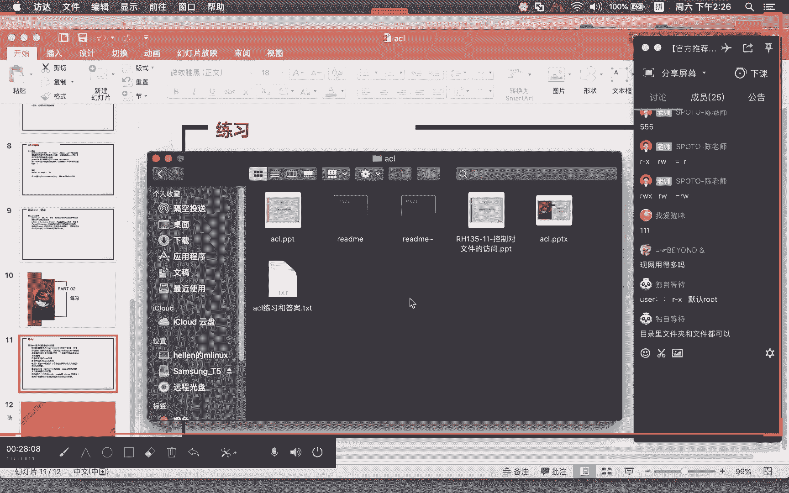

在本节课中，我们将要学习Linux系统中的磁盘管理基础知识，包括文件系统类型、磁盘分区的基本概念与操作。通过本课，你将能够理解如何查看磁盘信息、创建和管理分区，为后续的文件系统格式化与挂载打下基础。

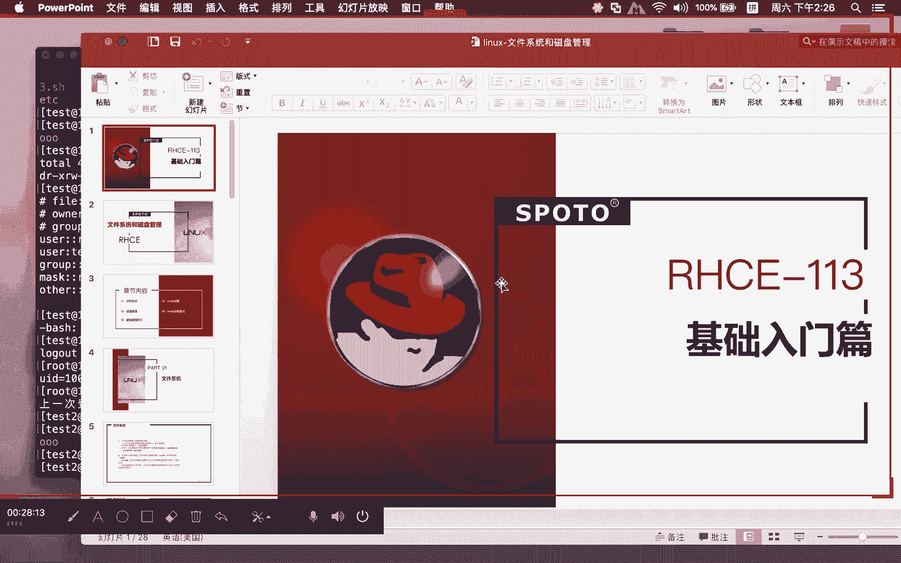

## 文件系统概述 📁

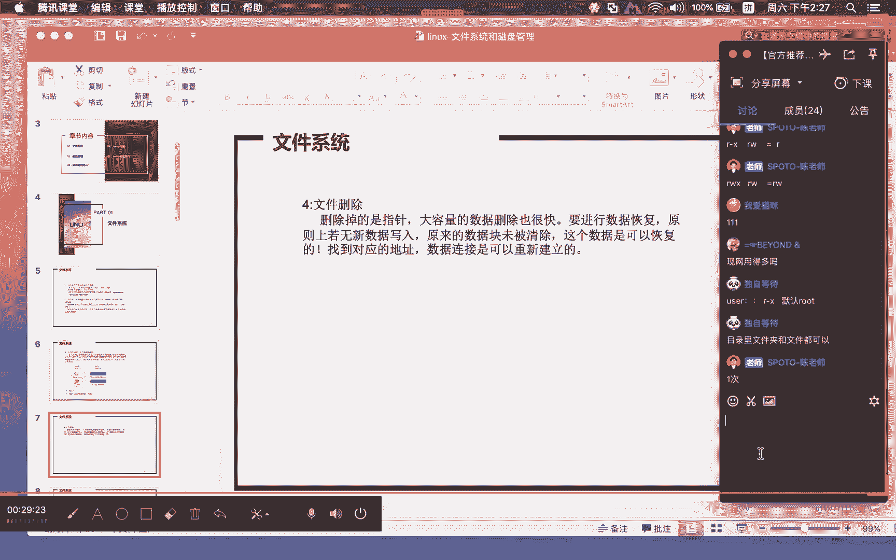

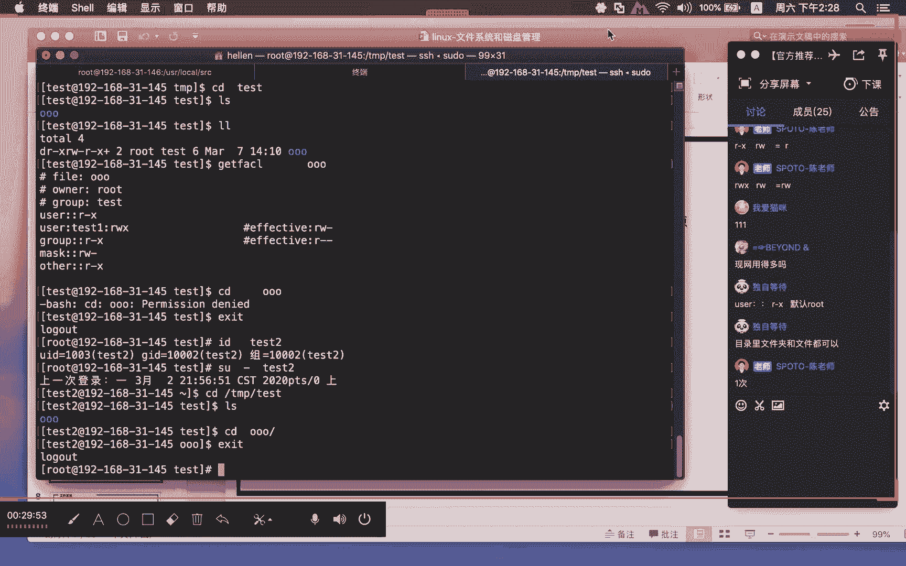

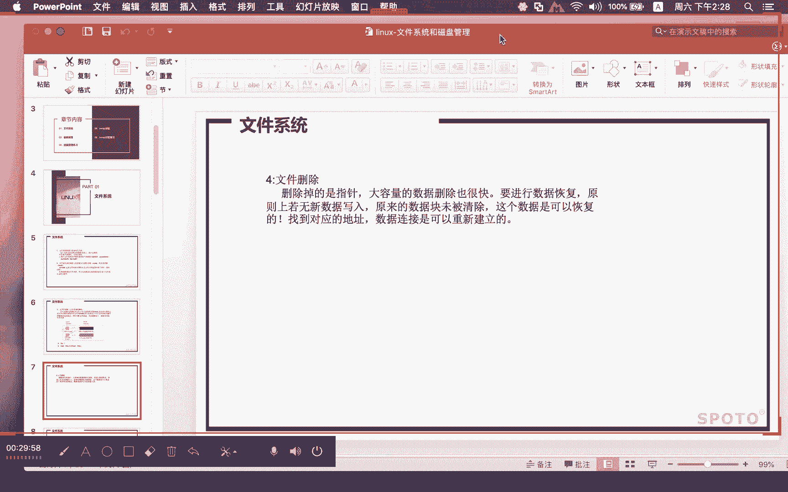

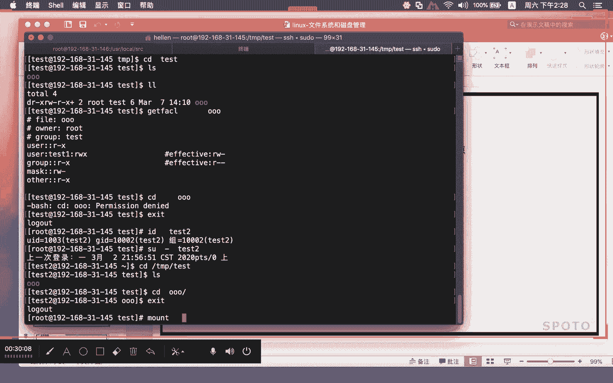

上一节我们介绍了访问控制列表（ACL），本节中我们来看看Linux的磁盘与文件系统管理。文件系统是操作系统用于明确存储设备（如硬盘）上文件的方法和数据结构。在Linux中，不同的文件系统类型具有不同的特性和性能。

红帽企业版Linux 7（RHEL 7）默认使用的文件系统是 **XFS**。我们可以使用 `mount` 命令来查看当前系统挂载的文件系统类型。

```bash
mount
```

在输出信息中，你可以看到类似 `/dev/sda1 on /boot type xfs` 的条目，这表示 `/dev/sda1` 分区被挂载到 `/boot` 目录，其文件系统类型是 XFS。

与Windows系统常见的NTFS、FAT32等文件系统不同，Linux历史上有多种文件系统，例如：
*   **RHEL 7** 默认：**XFS**
*   **RHEL 6** 默认：**EXT4**
*   更早版本：**EXT3**, **EXT2**

XFS文件系统相比EXT系列，在支持的最大文件系统容量、单个文件大小以及I/O性能方面更具优势，尤其适合处理大文件和进行数据库操作。

## 文件系统的核心概念：Inode与Block 🔍

文件系统能够正常工作，依赖于两个核心概念：**Inode（索引节点）** 和 **Block（数据块）**。理解它们对于理解文件操作（如删除与恢复）至关重要。

*   **Inode**：相当于文件的“门牌号”或“身份证”。它存储了文件的元数据（如权限、所有者、时间戳等）以及指向文件数据块的指针，但不包含文件名和实际数据。
*   **Block**：相当于存储数据的“房间”。文件的实际内容被分割成多个块，存储在这些数据块中。

**公式表示文件查找过程**：
`文件名` -> 在目录文件中找到对应的 `Inode 编号` -> 通过 `Inode` 找到所有 `Block` 的位置 -> 读取 `Block` 中的数据。

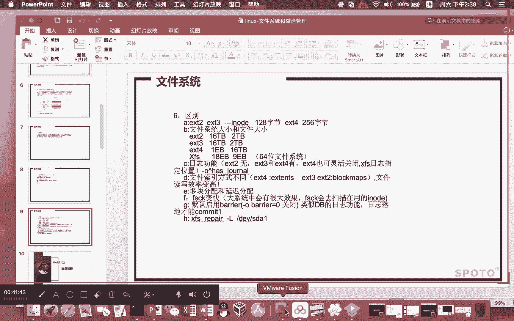

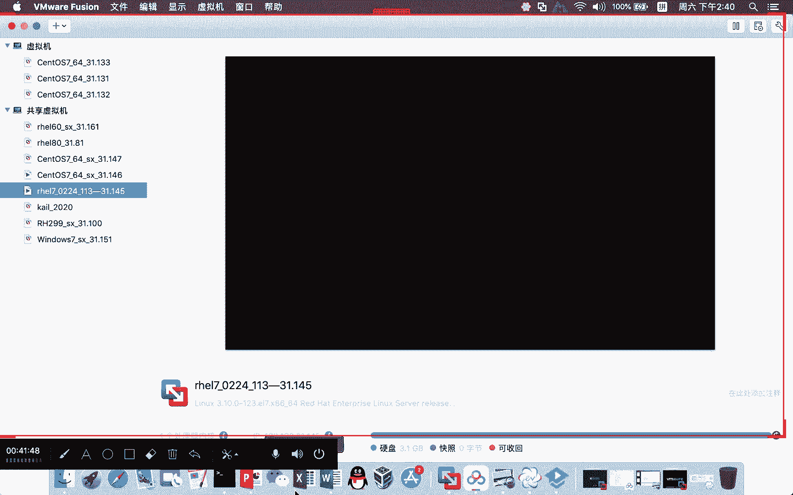

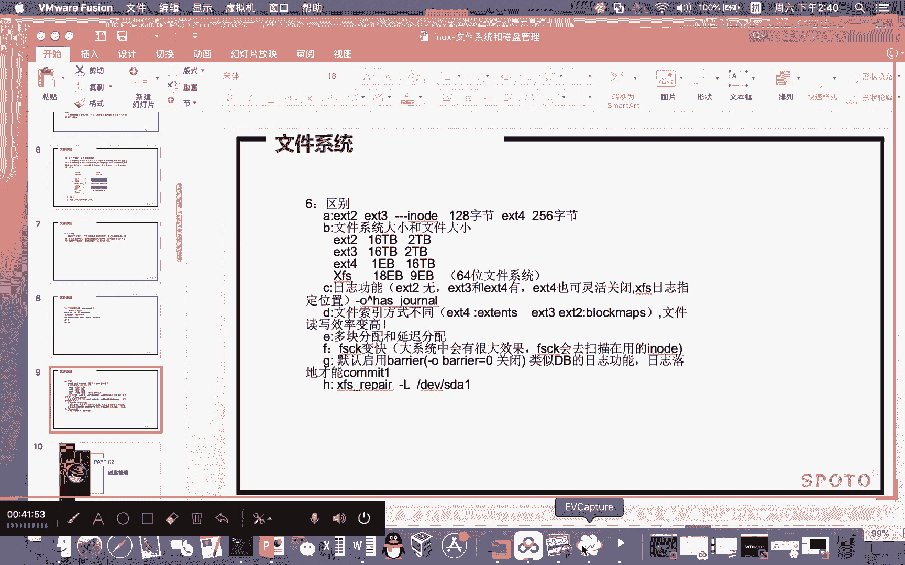

**关于文件删除与恢复**：
当删除一个文件时，系统并非立即擦除数据块（Block）中的内容，而是**删除了Inode中指向这些数据块的指针**，并标记该Inode和数据块为“空闲可用”。只要这些数据块没有被新的数据覆盖，理论上就可以通过恢复指针关联来找回数据。这就是某些数据恢复工具的工作原理。

## 查看磁盘信息 💽

在对磁盘进行操作前，首先需要了解系统中有哪些磁盘及其状态。我们使用 `fdisk -l` 命令来列出所有磁盘的详细信息。

```bash
fdisk -l
```

以下是命令输出中需要关注的关键信息解读：
*   **磁盘标识**：如 `/dev/sda`、`/dev/sdb`。第一块盘通常是 `sda`，第二块是 `sdb`。在某些虚拟化环境下，也可能显示为 `vda`、`vdb`。
*   **磁盘容量**：如 `8589 MB`。
*   **磁盘标签类型**：常见的有 `dos`（即MBR）和 `gpt`。MBR格式适用于2TB以下的磁盘，GPT则支持更大容量。
*   **分区信息**：每个分区会显示其起始和结束扇区、容量、ID和类型。
    *   **Blocks数量**：该分区的块数，默认每块为1KB，可用于估算分区大小。
    *   **分区ID**：`83` 代表Linux普通分区，`8e` 代表Linux LVM分区，`82` 代表Linux交换分区。

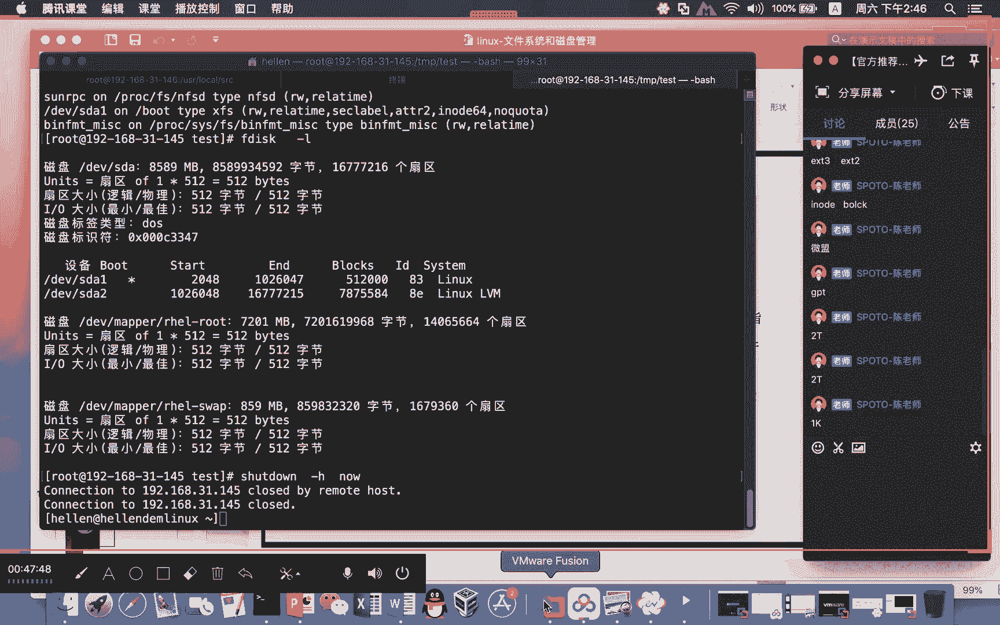

## 添加新磁盘实验准备 🛠️

为了进行分区实验，我们通常需要向系统中添加一块新的空白硬盘，而不是在已使用的系统盘（如 `/dev/sda`）上操作，以免破坏现有系统。

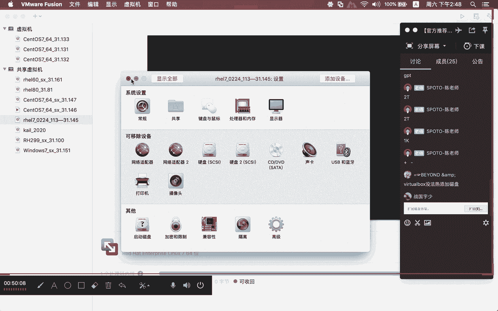

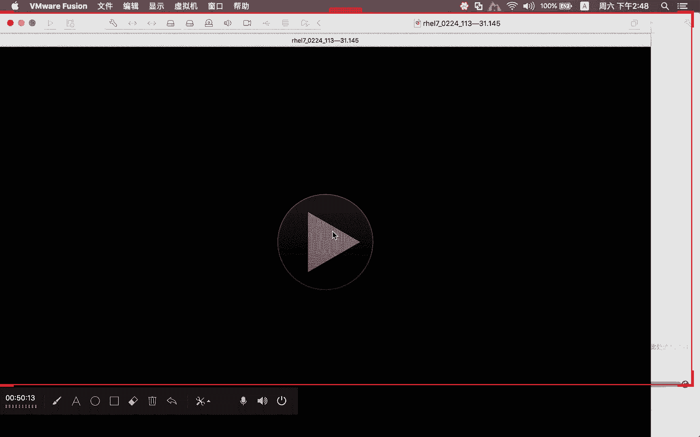

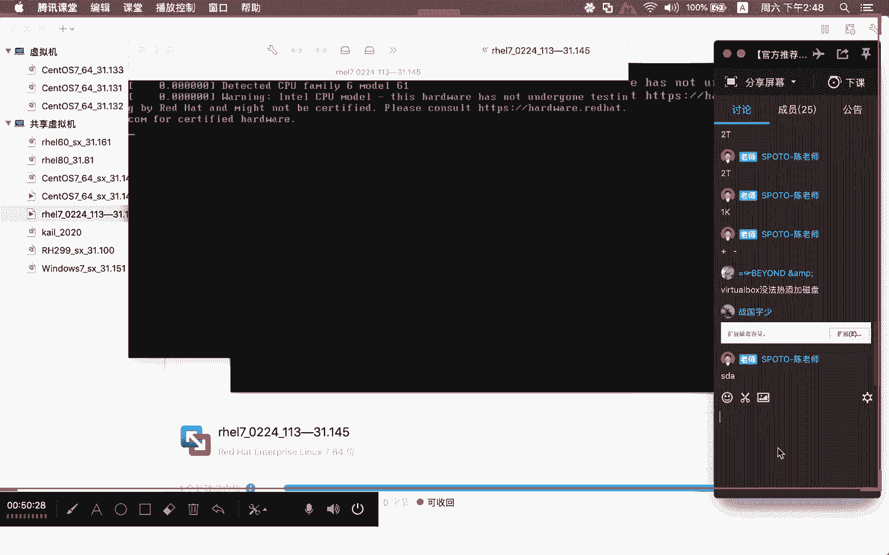

以下是虚拟机（如VMware）中添加新硬盘的简要步骤：
1.  关闭虚拟机电源。
2.  进入虚拟机设置，找到“存储”或“硬盘”选项。
3.  添加新硬盘设备，并指定其容量（例如500MB）。
4.  启动虚拟机。

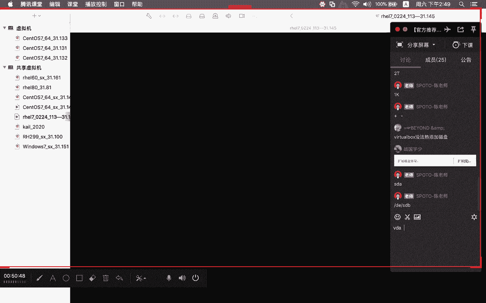

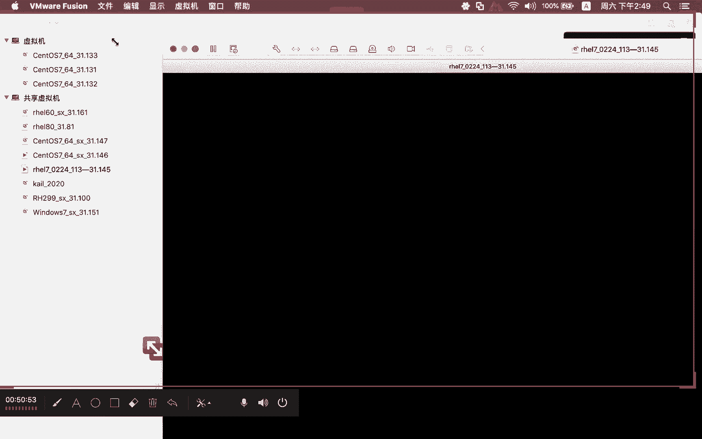

系统启动后，再次运行 `fdisk -l`，你应该能看到新增的磁盘，例如 `/dev/sdb`。

## 使用fdisk进行磁盘分区 ✂️

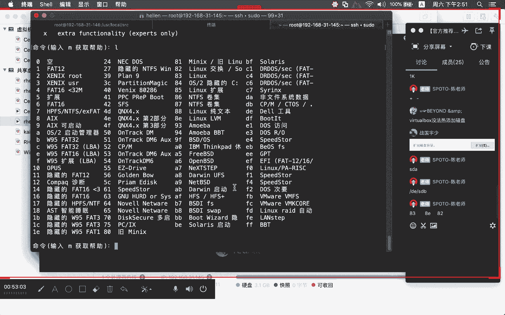

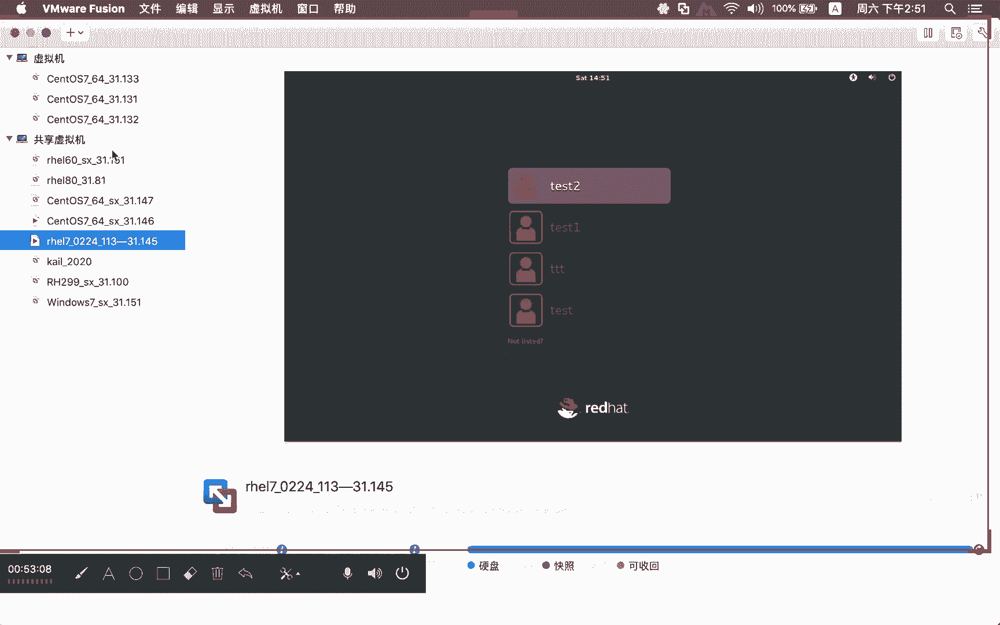

`fdisk` 是一个强大的磁盘分区工具。我们将使用它在新磁盘（如 `/dev/sdb`）上创建分区。

首先，以root权限对目标磁盘进行操作：

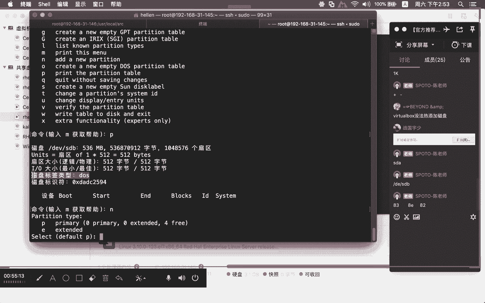

```bash
fdisk /dev/sdb
```

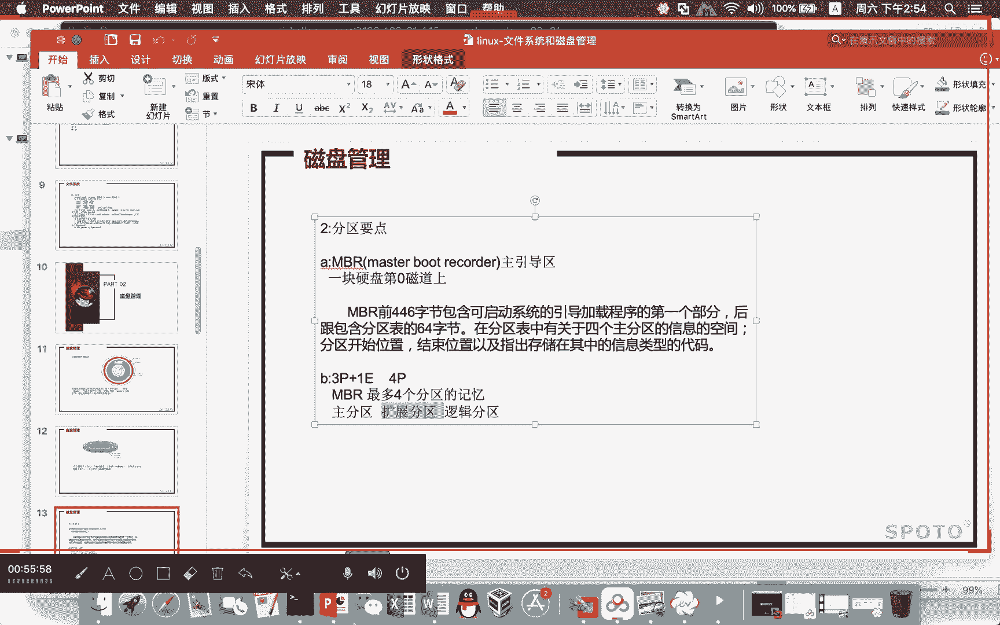

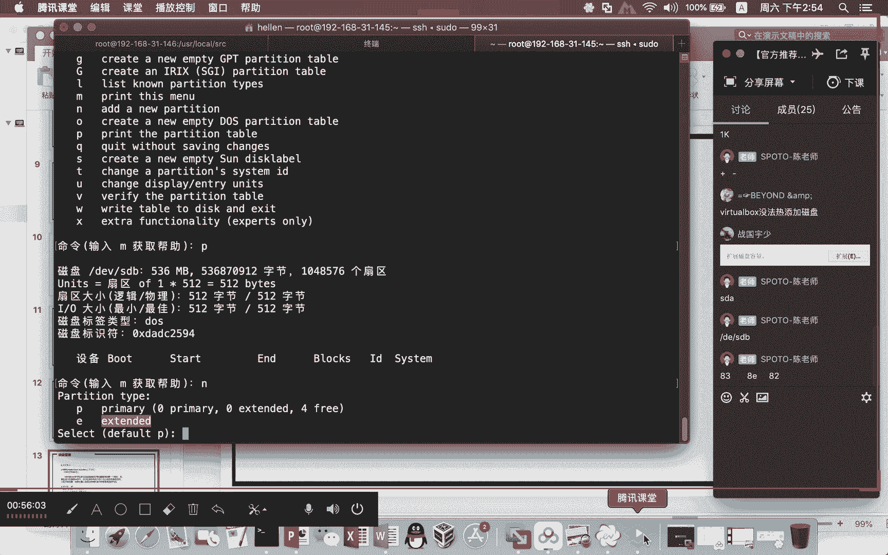

进入 `fdisk` 的交互式界面后，可以使用以下常用命令：

以下是fdisk交互模式下的核心命令列表：
*   `m`：显示所有命令的帮助菜单。
*   `p`：打印当前磁盘的分区表。
*   `n`：创建一个新分区。
*   `d`：删除一个分区。
*   `t`：更改分区的类型ID（例如，改为 `8e` 表示LVM）。
*   `l`：列出所有已知的分区类型ID。
*   `w`：将分区表写入磁盘并退出。（**重要：操作生效**）
*   `q`：不保存更改并退出。

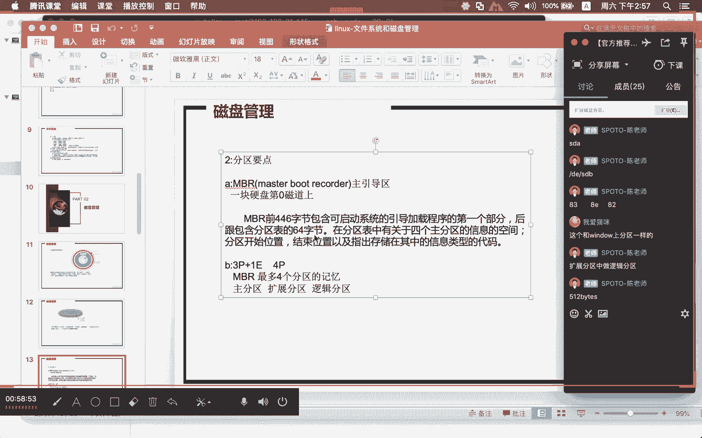

### 分区类型：主分区、扩展分区与逻辑分区

在MBR分区格式下，存在以下限制和规则：
*   一块磁盘最多只能有 **4个主分区**。
*   为了突破4个分区的限制，引入了**扩展分区**的概念。扩展分区本身不直接存储数据，而是作为一个容器，内部可以划分多个**逻辑分区**。
*   最佳实践是采用 **3个主分区 + 1个扩展分区** 的方案，然后在扩展分区内创建所需数量的逻辑分区。

### 创建分区实战演示

假设我们在 `/dev/sdb` 上创建分区。

1.  **输入 `n` 开始创建新分区**。
2.  选择分区类型：
    *   `p` 创建主分区。
    *   `e` 创建扩展分区。
3.  指定分区编号（通常接受默认值）。
4.  指定起始扇区（通常接受默认值，从空闲空间开始）。
5.  指定结束扇区或分区大小。**建议使用 `+size{K,M,G}` 格式**，例如 `+100M` 表示创建一个100MB的分区，这比计算扇区号直观得多。
6.  重复步骤1-5创建其他分区。当需要创建第4个分区时，应选择 `e` 来创建扩展分区，并**将剩余所有空间分配给扩展分区**。
7.  在扩展分区内，可以继续使用 `n` 命令创建逻辑分区（系统会自动识别）。
8.  所有分区创建完毕后，使用 `p` 命令查看最终的分区表。
9.  **确认无误后，使用 `w` 命令保存并退出**。系统会提示分区表已更改。

**重要提示**：使用 `w` 命令保存后，有时需要执行 `partprobe` 命令或重启系统，让内核重新读取分区表信息。

## 总结 📝

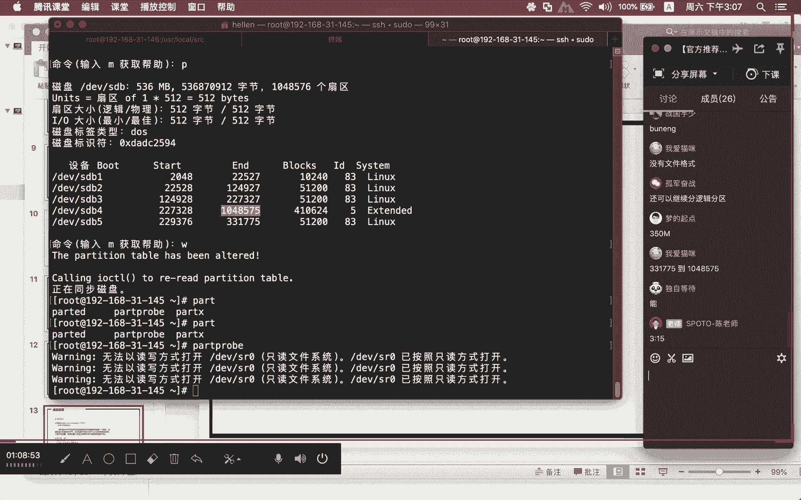

本节课中我们一起学习了Linux磁盘管理的基础部分。我们首先了解了Linux默认的XFS文件系统及其优势，然后深入探讨了文件系统的核心——Inode和Block的概念，这解释了文件存储与删除恢复的原理。接着，我们掌握了使用 `fdisk -l` 查看磁盘信息的方法，并完成了为实验添加新磁盘的准备。最后，我们重点学习了使用 `fdisk` 工具进行MBR格式磁盘分区的全过程，包括主分区、扩展分区和逻辑分区的创建与管理规则。下一节，我们将学习如何对这些分区进行格式化并挂载到系统中使用。