# Linux基础课程：P2：VIM编辑器入门教程

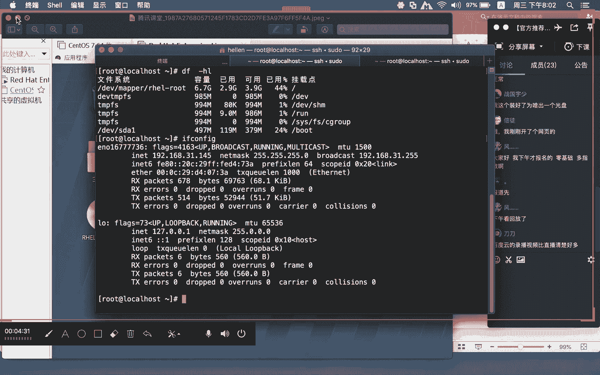

在本节课中，我们将学习Linux系统中一个极其重要的文本编辑工具——VIM。我们将从VIM的基本概念入手，逐步掌握其核心操作模式、常用命令以及高效编辑技巧，帮助你摆脱对图形界面编辑器的依赖，为后续的服务器管理和配置工作打下坚实基础。

## 回顾与引入

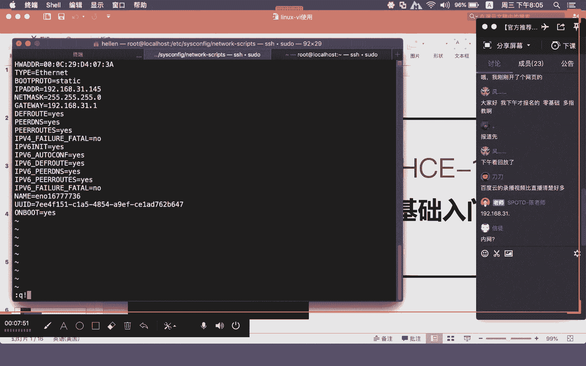

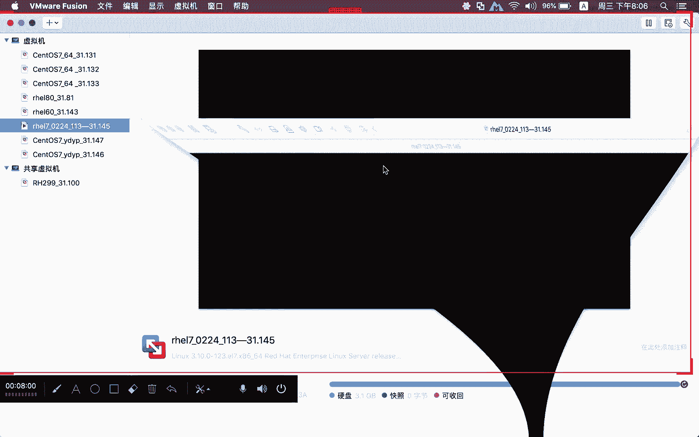

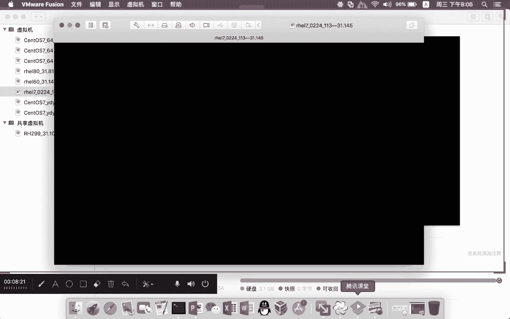

上一节我们介绍了RHEL 7系统的安装以及如何通过图形界面工具（如GEDIT）配置网卡。然而，在实际的服务器运维中，我们通常需要通过远程终端连接服务器，无法使用图形界面。因此，掌握一个强大的命令行文本编辑器至关重要。

VIM是VI编辑器的增强版本，它提供了语法高亮等更友好的功能。无论是修改系统配置文件（如网卡配置`/etc/sysconfig/network-scripts/ifcfg-*`），还是编写脚本，VIM都是我们的得力助手。

## VIM的三种核心模式

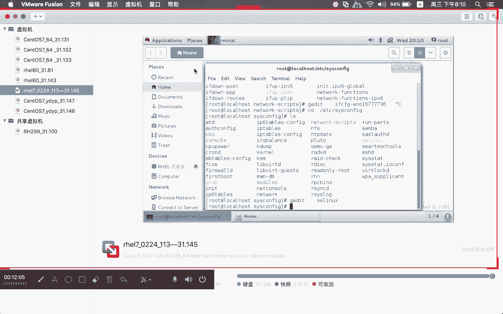

理解VIM的不同模式是熟练使用它的关键。VIM主要包含三种模式，它们之间的切换构成了编辑流程的基础。

### 1. 一般模式（浏览模式）

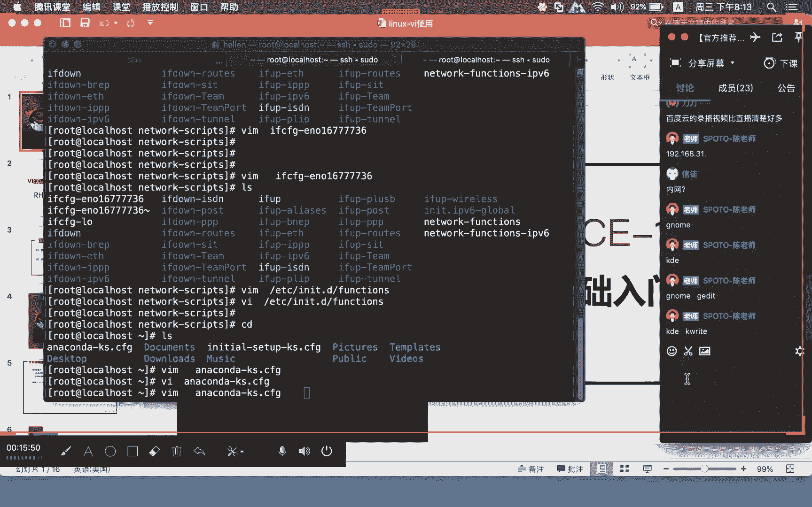

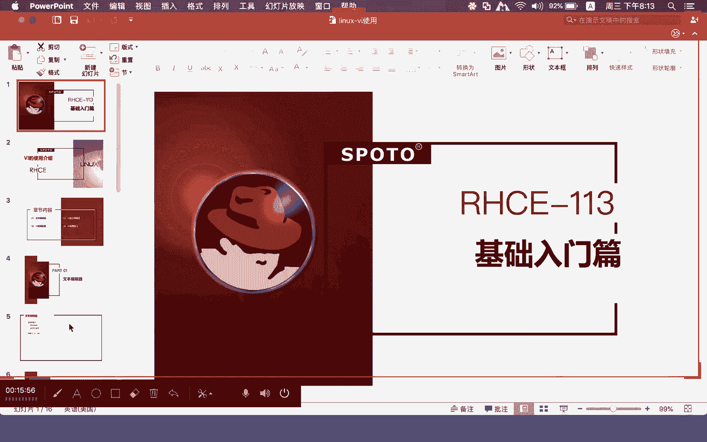

当我们使用`vim 文件名`命令打开一个文件时，首先进入的就是**一般模式**。在此模式下，我们可以浏览文件内容，但不能直接编辑文本。此时，键盘的输入会被识别为命令。

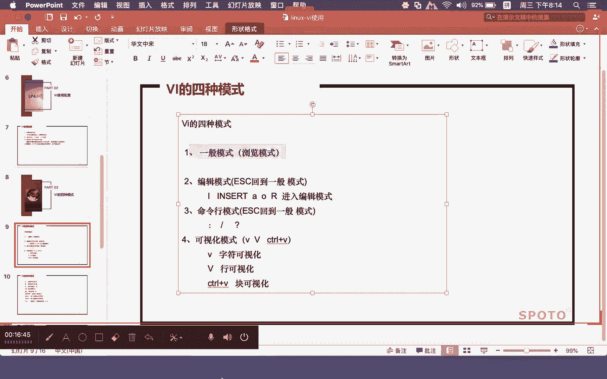

**核心操作：**
*   **光标移动**：使用方向键或 `h`（左）、`j`（下）、`k`（上）、`l`（右）移动光标。
*   **行内快速跳转**：按 `0` 跳转到**行首**，按 `$` 跳转到**行尾**。
*   **文件内快速跳转**：按 `gg` 跳转到**文件第一行**，按 `G` 跳转到**文件最后一行**。输入 `nG`（如 `3G`）可以跳转到**第n行**。

### 2. 编辑模式

在一般模式下，按下特定键（如 `i`）即可进入**编辑模式**。此时，屏幕左下角通常会显示 `-- INSERT --` 或 `插入` 字样。在这个模式下，你可以像使用普通文本编辑器一样，自由地插入、删除或修改文本。

**进入编辑模式的常用命令：**
*   `i`：在**当前光标处**插入。
*   `a`：在**当前光标后**插入。
*   `o`：在**当前行下方**新建一行并插入。
*   `I`：在**当前行行首**插入。
*   `A`：在**当前行行尾**插入。

**退出编辑模式**：按 `Esc` 键即可从编辑模式**返回一般模式**。

### 3. 命令行模式

在一般模式下，输入冒号 `:` 即可进入**命令行模式**。此时光标会移动到屏幕底部，可以输入保存、退出、查找替换等高级命令。

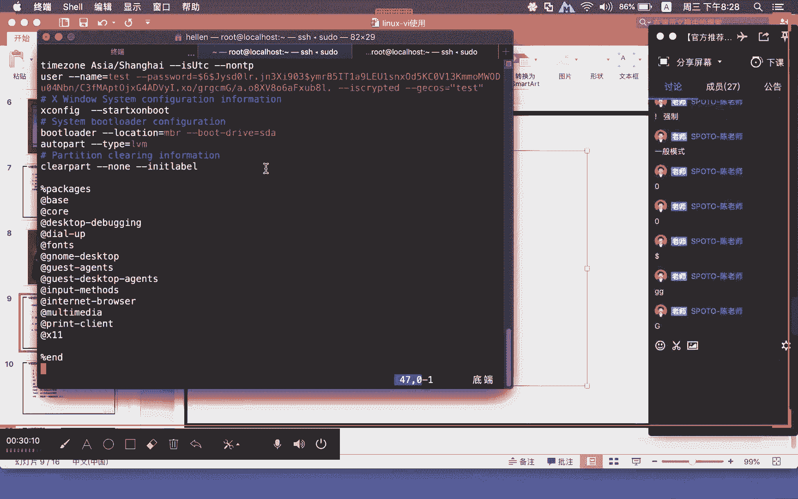

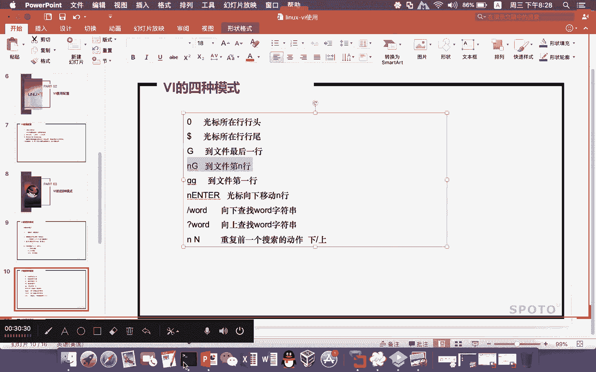

**常用命令行指令：**
*   `:w`：保存文件。
*   `:q`：退出VIM。如果文件有修改未保存，会提示错误。
*   `:q!`：**强制退出**，不保存任何修改。
*   `:wq` 或 `:x`：保存并退出。
*   `:wq!`：强制保存并退出。

## 高效编辑：复制、粘贴、删除与撤销

掌握了模式切换，我们来看看在一般模式下如何高效地进行文本操作。这些命令可以配合前面提到的跳转命令，实现精准编辑。

以下是常用编辑命令：

*   **复制（Yank）**：`yy` 复制当前行。`nyy` 复制从当前行开始的n行（如 `3yy`）。
*   **粘贴（Paste）**：`p` 将复制的内容**粘贴到光标所在行的下一行**。`P` 粘贴到光标所在行的上一行。
*   **删除/剪切（Delete）**：`dd` 删除/剪切当前行。`ndd` 删除/剪切从当前行开始的n行。删除的内容会被保存，可以使用 `p` 命令粘贴，实现剪切效果。
*   **撤销（Undo）**：`u` 撤销上一次操作。
*   **重复（Repeat）**：`.` 重复执行上一次的操作。

**公式示例：**
*   删除从当前行到文件末尾的所有内容：`dG`
*   复制第5行到第10行：先输入 `5G` 跳转到第5行，然后输入 `6yy`。

## 可视化模式：更直观的文本选择

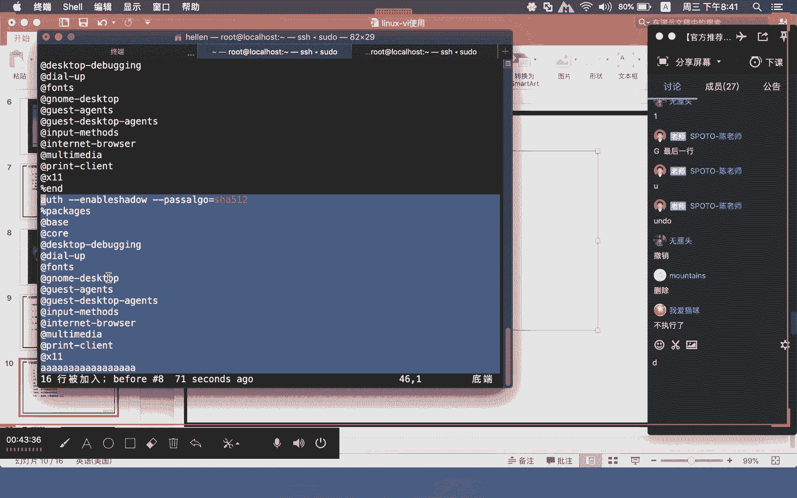

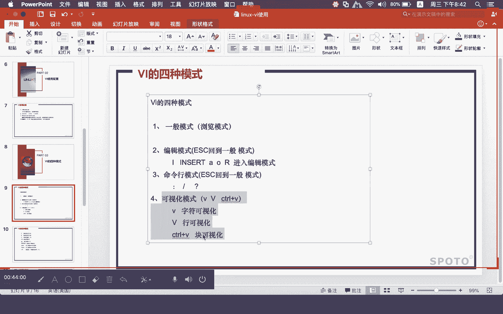

对于大段文本的操作，VIM提供了**可视化模式**，让你可以像用鼠标一样选择文本块，再执行命令。

**进入可视化模式：**
*   `v`：**字符可视化**，以字符为单位选择。
*   `V`：**行可视化**，以行为单位选择。
*   `Ctrl + v`：**块可视化**，垂直方向选择矩形文本块。

进入可视化模式后，使用方向键选择文本，然后按 `y` 复制、`d` 删除或执行其他命令。

## 查找与替换

在命令行模式下，VIM提供了强大的查找与替换功能。

**查找：**
*   在一般模式下，输入 `/关键词` 然后回车，即可向下查找。
*   按 `n` 跳转到下一个匹配项，按 `N` 跳转到上一个匹配项。

**替换：**
替换命令的基本格式为 `:[范围]s/旧字符串/新字符串/[选项]`。

*   **范围**：`%` 表示整个文件，`1,10` 表示第1到第10行。
*   **选项**：`g` 表示替换一行内所有匹配项；不加 `g` 则只替换每行的第一个匹配项。

**代码示例：**
*   `:%s/foo/bar/g`：将文件中所有的 `foo` 替换为 `bar`。
*   `:1,5s/old/new/`：将第1行到第5行中，每行第一个 `old` 替换为 `new`。

## 总结

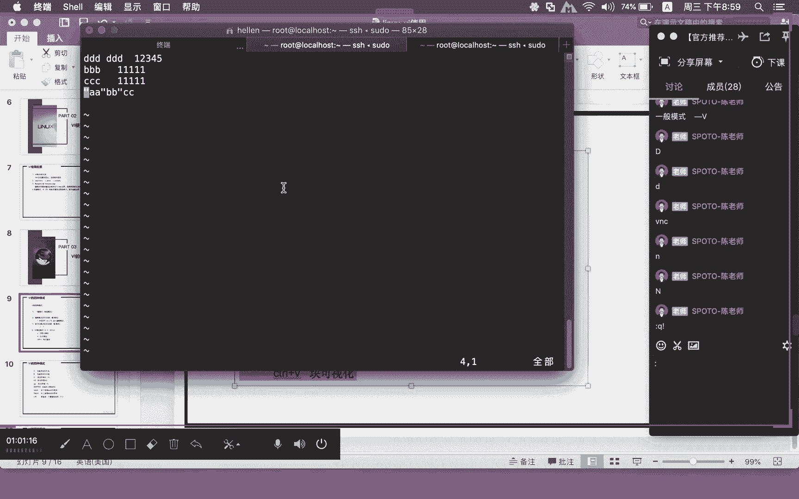

本节课我们一起学习了VIM编辑器的核心知识。我们首先理解了VIM的三种基本模式：**一般模式**、**编辑模式**和**命令行模式**，以及它们之间的切换方式。接着，我们掌握了在一般模式下进行复制(`yy`)、粘贴(`p`)、删除(`dd`)和撤销(`u`)等高效编辑命令。然后，我们介绍了**可视化模式**(`v`, `V`, `Ctrl+v`)来方便地选择文本块。最后，我们学习了如何在命令行模式下进行**查找**(`/`)和**替换**(`:s`)。

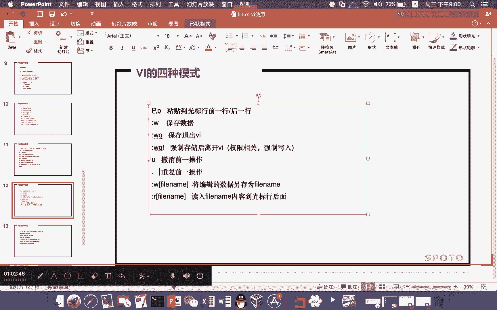

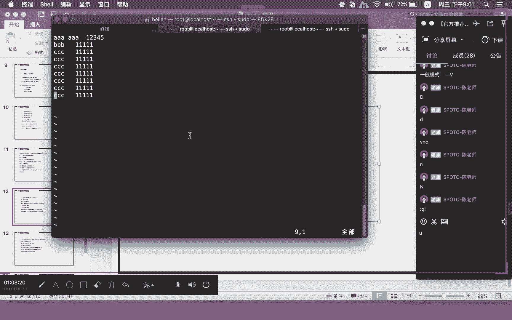

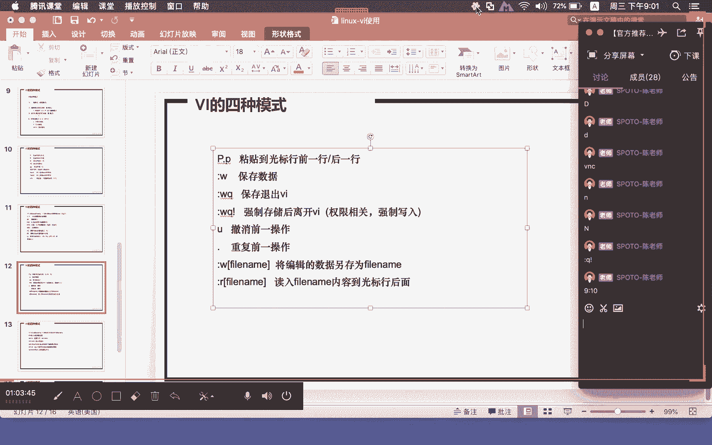

VIM的学习曲线可能稍陡，但一旦掌握，它将极大提升你在Linux环境下的工作效率。建议你打开一个测试文件，跟随教程中的命令多加练习，这是熟悉VIM的最佳途径。下一节课，我们将开始学习Linux的基础命令。