# Linux基础课程：P4：vim配置与数据恢复

在本节课中，我们将深入学习vim编辑器的两个重要功能：个性化配置和意外中断后的数据恢复。掌握这些技巧能让你更高效、更安心地使用vim。

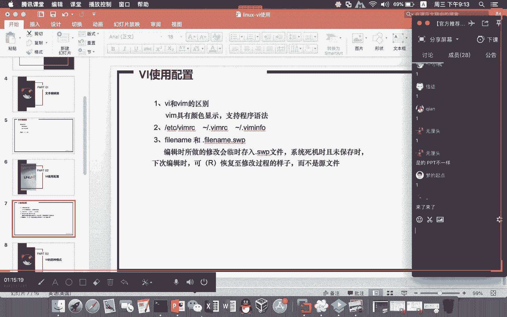

上一节我们介绍了vim的基本操作模式，本节中我们来看看如何定制vim环境以及应对编辑过程中的突发状况。

## 📝 vim的个性化配置

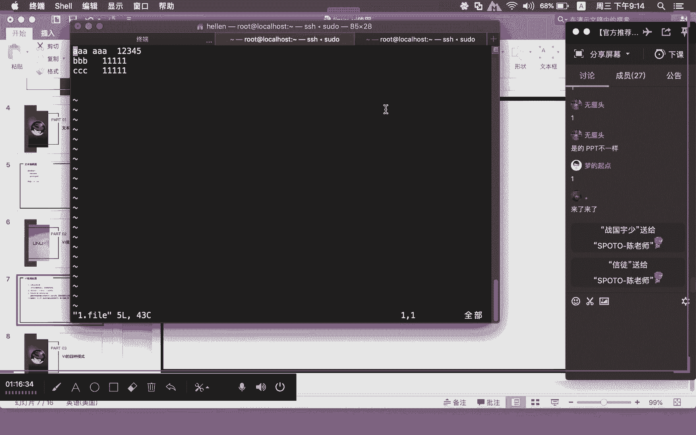

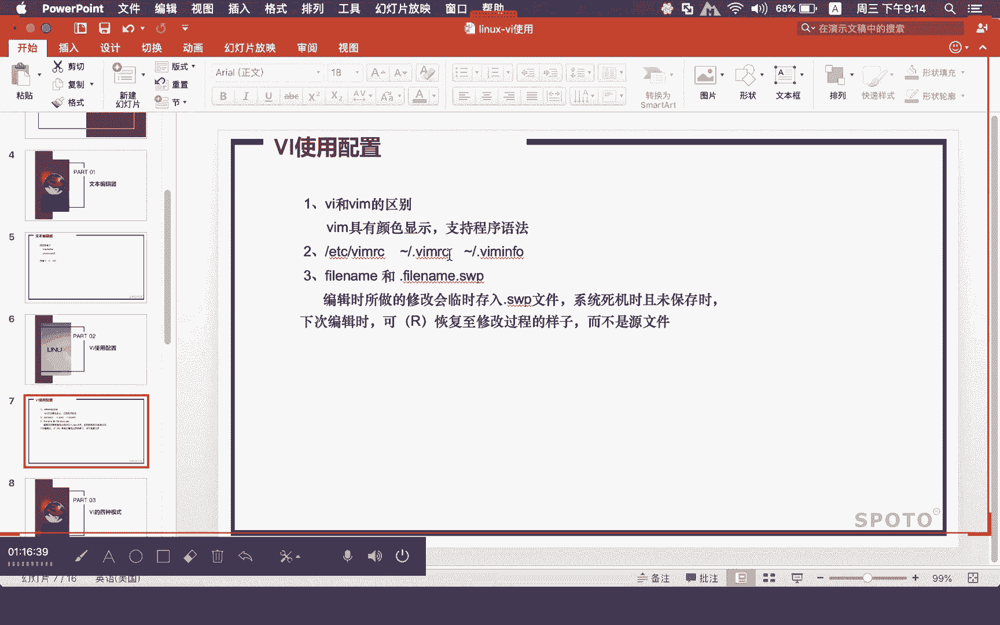

不同的Linux发行版或用户可能对vim的编辑环境有不同的偏好。通过修改配置文件，我们可以永久性地改变vim的行为，例如显示行号。

### 临时设置与永久设置

在vim的命令行模式下，输入 `:set number` 或 `:set nu` 可以临时显示行号。退出vim后，此设置会失效。

若想为当前用户永久启用行号显示，需要在用户的家目录下创建或修改 `.vimrc` 配置文件。

以下是具体步骤：
1.  进入当前用户的家目录：`cd ~`
2.  使用vim创建或编辑配置文件：`vim .vimrc`
3.  在文件中写入设置命令：`set number`
4.  保存并退出vim。
5.  为了让配置立即生效，可以执行 `source .vimrc` 命令。

**核心概念解释**：`source` 命令会读取指定文件中的内容，并在当前终端会话中执行它们，相当于将文件里的命令逐行运行了一遍。

若要取消行号显示，可以在命令行模式下输入 `:set nonumber` 或 `:set nonu`。若要永久取消，只需从 `.vimrc` 文件中删除 `set number` 这一行并重新 `source` 即可。

### 全局配置与用户配置

如果想为系统上的所有用户统一配置vim，则需要修改全局配置文件 `/etc/vimrc`。在该文件中添加 `set number` 并执行 `source /etc/vimrc` 后，所有用户打开vim时都会默认显示行号。

用户个人的 `.vimrc` 配置优先级高于全局的 `/etc/vimrc`。通过研究 `/etc/vimrc` 文件，你可以了解并迁移其他有用的vim设置，从而在不同Linux系统上获得一致的编辑体验。

## 🔄 vim的数据恢复功能

编辑文件时，如果遇到系统崩溃、意外断电或进程被强制结束等情况，未保存的内容可能会丢失。幸运的是，vim提供了强大的数据恢复机制。

### 交换文件（Swap File）的作用

当vim异常退出时，它会生成一个以 `.swp` 为后缀的交换文件（例如 `.file.txt.swp`）。这个文件是隐藏文件，保存了编辑会话崩溃时的内存数据状态，用于后续恢复。

**重要提示**：以点号 `.` 开头的文件或目录在Linux中默认为隐藏对象，使用 `ls -a` 命令可以查看它们。

### 恢复未保存的数据

当再次用vim打开原文件时，如果检测到对应的 `.swp` 文件存在，vim会给出类似下图的提示：

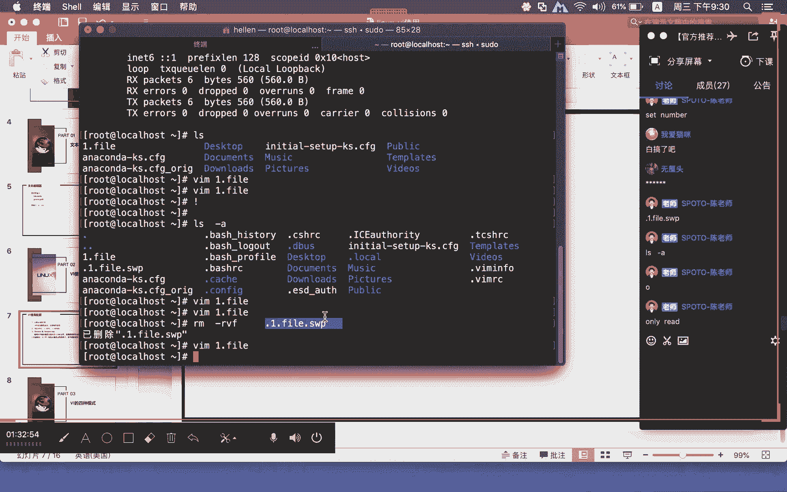


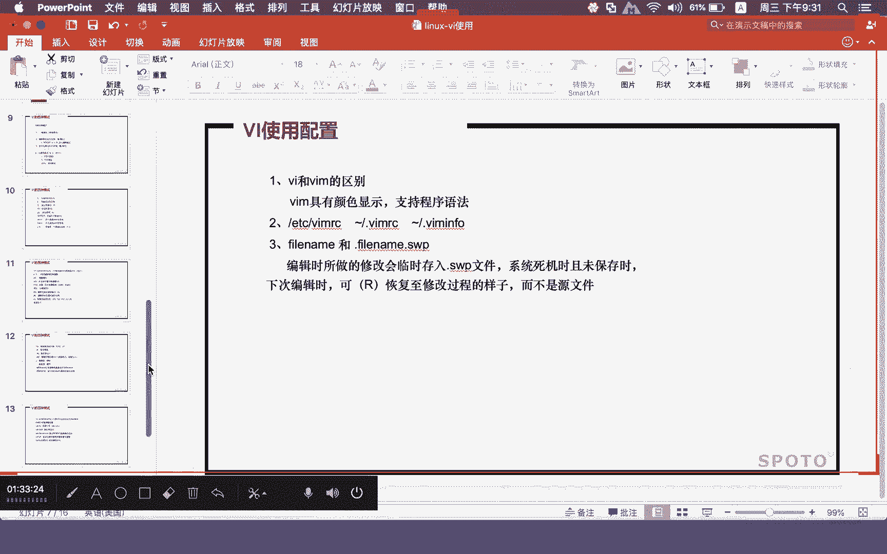

以下是每个选项的含义：
*   **`[O]pen Read-Only`**：以只读方式打开文件，不恢复数据。
*   **`(E)dit anyway`**：直接编辑原文件，忽略交换文件。
*   **`(R)ecover`**：**使用交换文件恢复数据**。这是最常用的选项。
*   **`(Q)uit`** 和 **`(A)bort`**：退出vim，不进行任何操作。

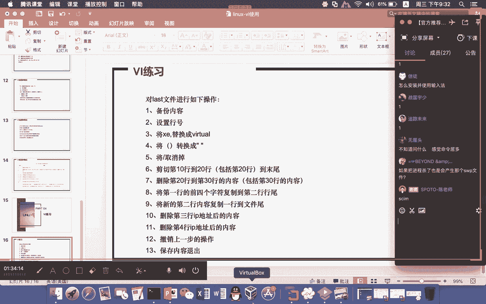

选择 `(R)ecover` 后，vim会尝试将交换文件中的数据恢复到编辑缓冲区。**恢复后，务必执行 `:wq` 保存文件**，否则恢复的数据不会写入原文件。

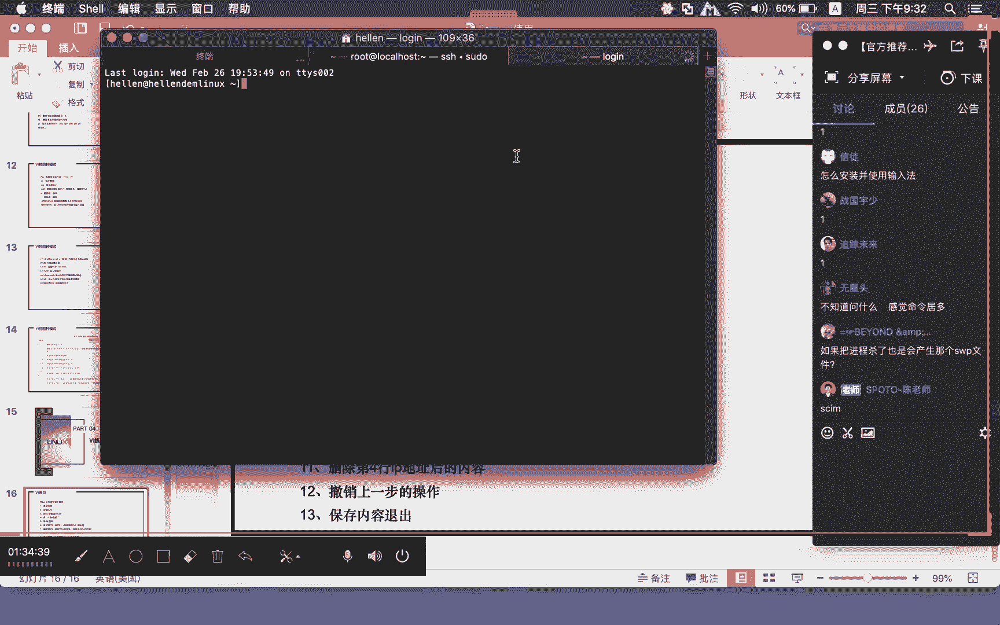

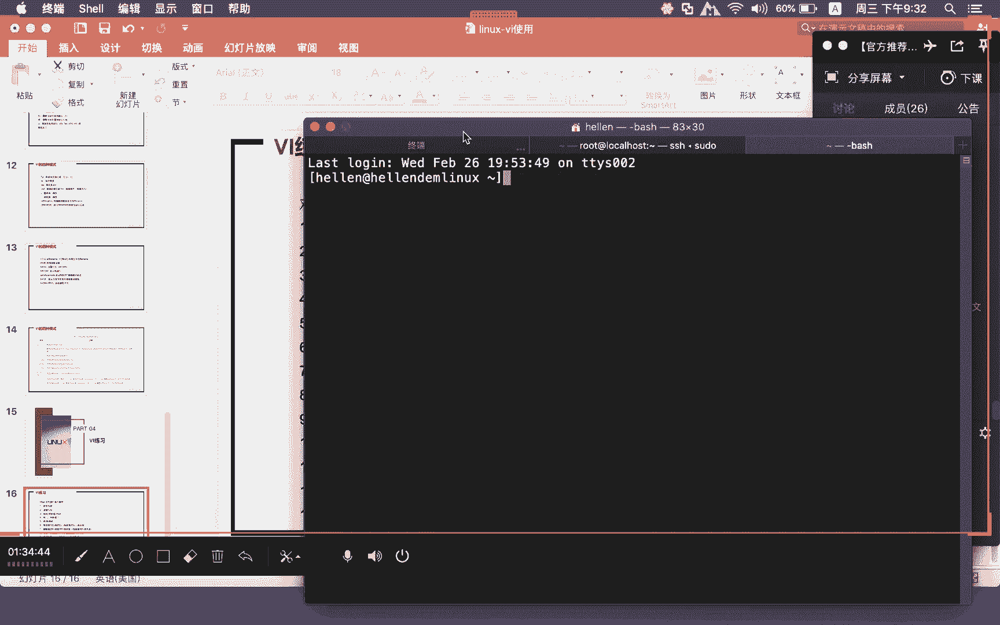

### 清理交换文件

数据成功恢复并保存后，应该手动删除对应的 `.swp` 文件。如果不删除，下次打开文件时vim仍会提示恢复，若误操作可能导致数据被回退到旧的恢复点。

可以使用 `rm` 命令删除交换文件，例如：`rm .file.txt.swp`。

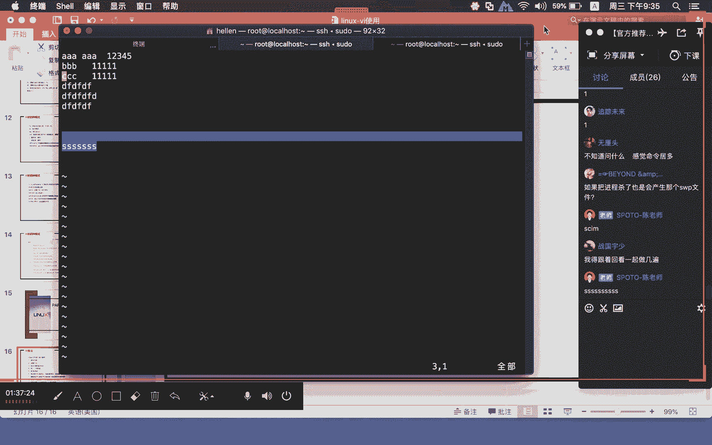

**关键流程总结**：异常中断 -> 发现 `.swp` 文件 -> 用vim打开原文件并按 `R` 恢复 -> 保存文件 (`:wq`) -> 删除 `.swp` 文件。

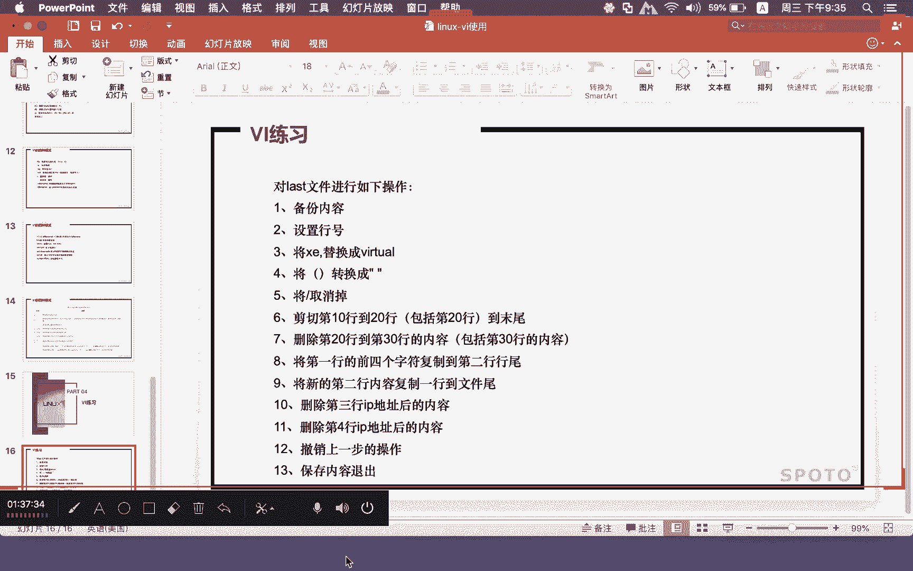

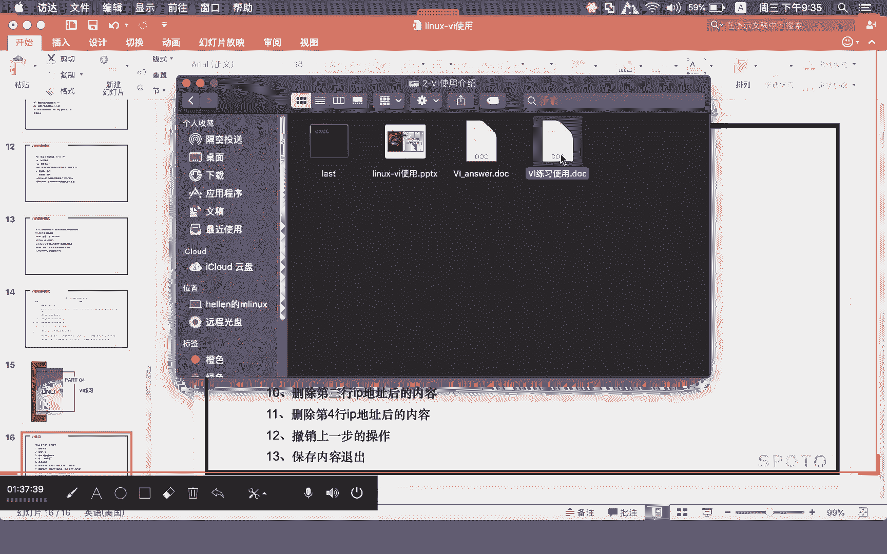

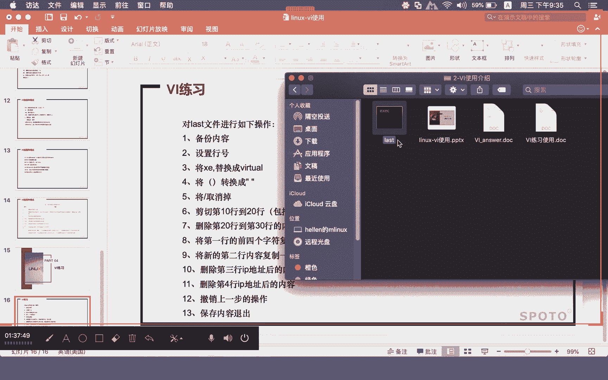

## 🧪 课后练习与建议

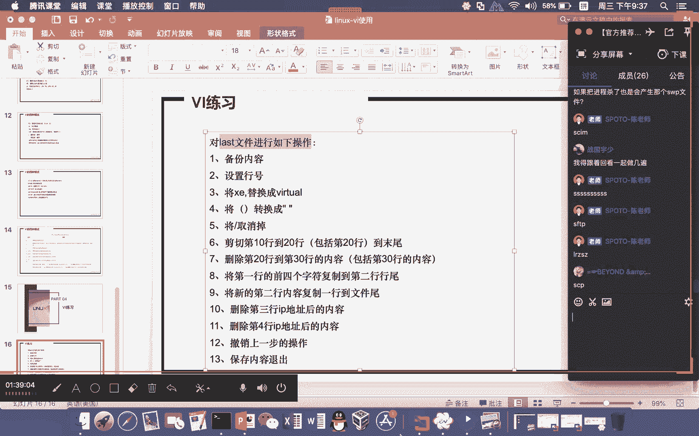

为了巩固本节课的知识，请完成配套的vim操作练习题（共13道）。练习需要使用一个名为 `last` 的特定文件。

如果你无法获取该文件，可以通过以下命令在系统上生成一个内容相似的 `last` 文件用于练习：
```bash
last > last
```
此命令会将 `last` 命令的输出内容重定向到当前目录下的 `last` 文件中。

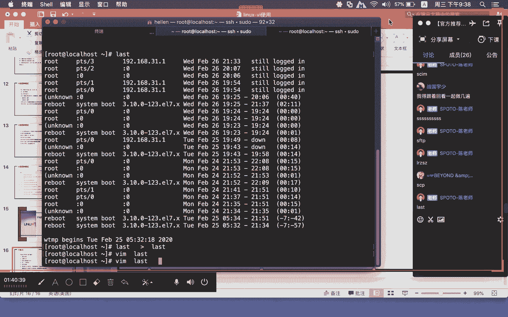

**注意**：使用自生成的 `last` 文件可能无法完成涉及特定字符串（如 “xe”）替换的题目。建议尽量使用提供的原始文件进行练习，以获得完整的训练效果。文件上传方法（如sftp）我们将在后续课程中介绍。

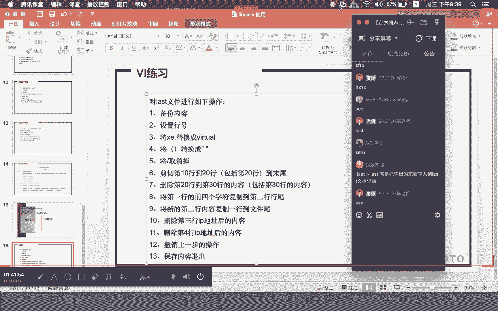

本节课中我们一起学习了vim的配置方法和数据恢复技巧。通过配置 `.vimrc` 文件，我们可以打造个性化的编辑环境；而理解并善用 `.swp` 交换文件，则能让我们在意外发生时从容不迫地找回劳动成果。这些技能将显著提升你在Linux命令行下的文本编辑效率和安全性。