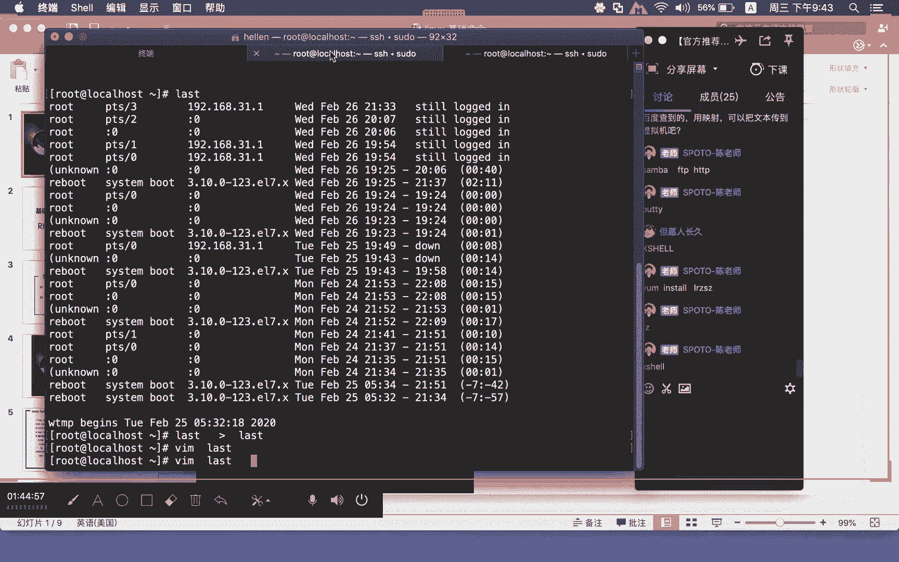
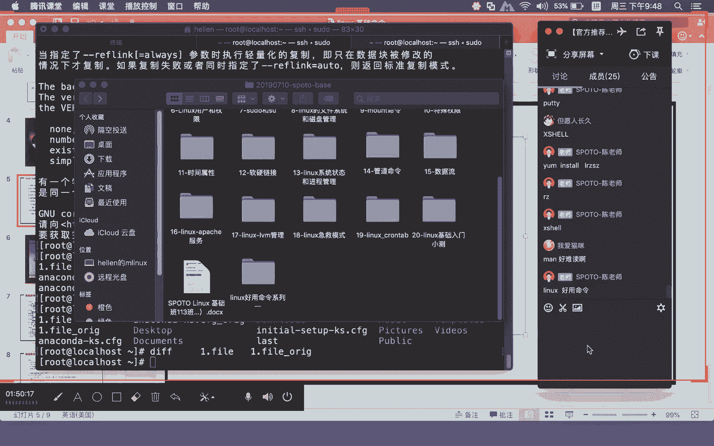
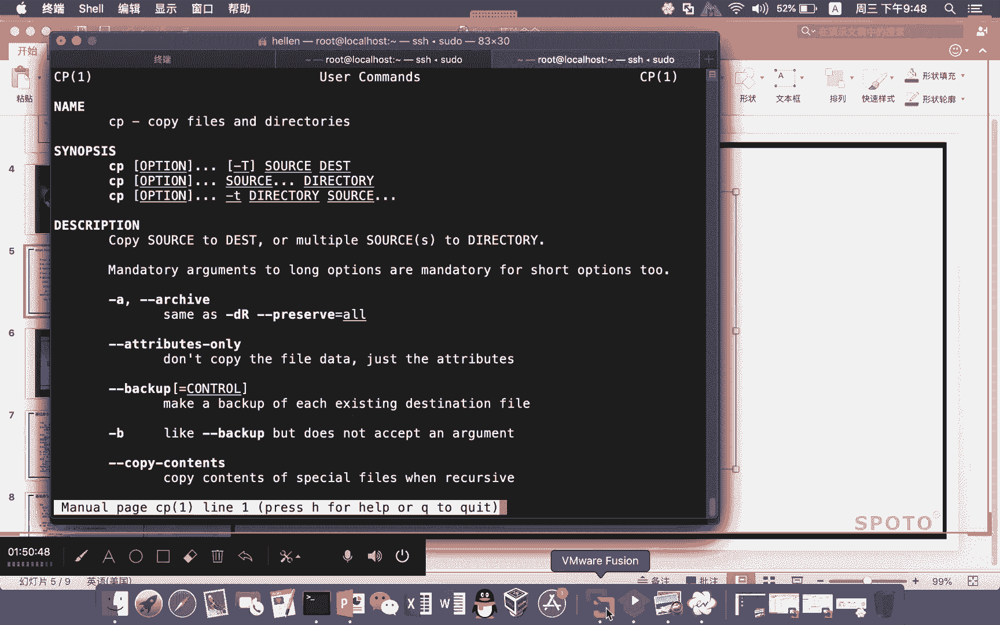
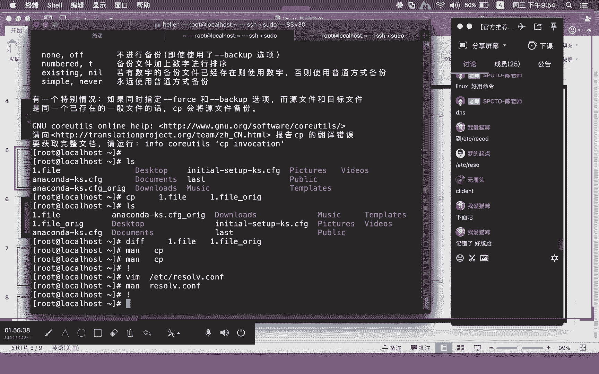
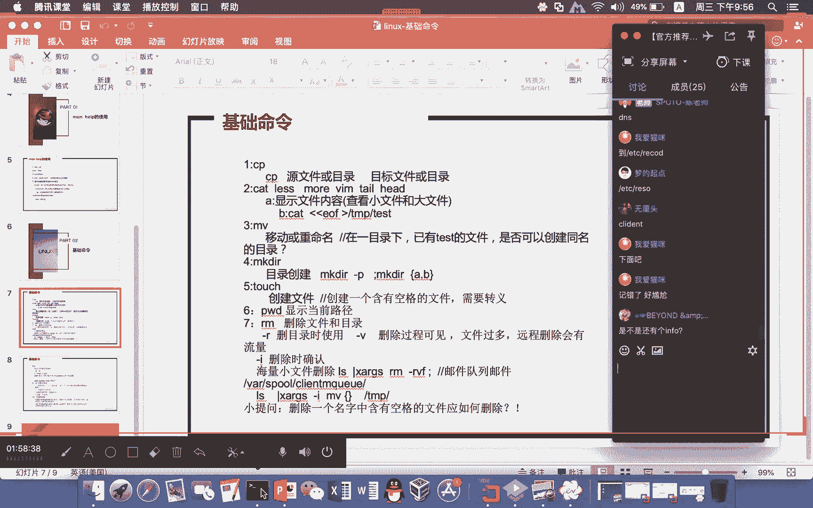
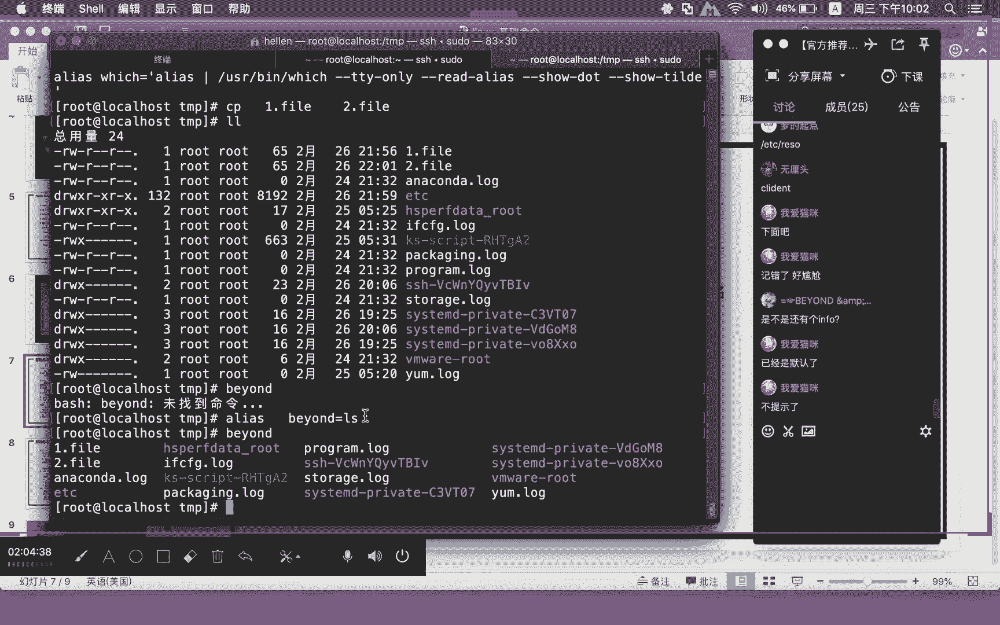
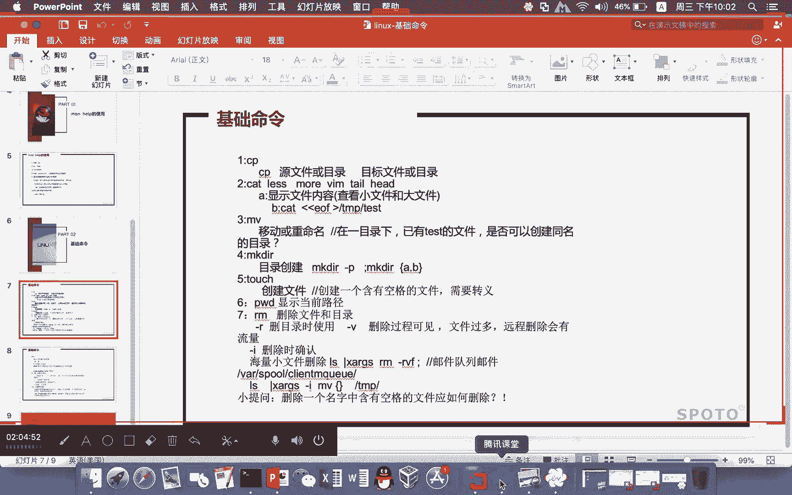

# Linux基础课程（RHCSA）：P2：基础命令-1 🐧

在本节课中，我们将要学习Linux基础命令的第一部分。我们将从如何获取命令帮助开始，然后重点学习`cp`命令的用法，包括其常用参数和实际应用。掌握这些是后续学习更复杂命令和操作的基础。


## 获取命令帮助




上一节我们介绍了文本编辑器VI的使用，本节中我们来看看如何获取命令的帮助信息。这对于学习和使用陌生的Linux命令至关重要。

最官方、最可靠的帮助来源是`man`命令和`--help`选项。


*   **`man` 命令**：`man`是manual（手册）的缩写。它相当于用VI打开了一个只读的文档，你可以详细查阅命令的用法、参数和说明。
    *   用法：`man [命令名]`
    *   例如，查看`cp`命令的手册：`man cp`
    *   在`man`页面中，你可以使用上下键翻页，按 `/` 键后输入关键词进行搜索。

*   **`--help` 选项**：大多数命令都支持`--help`选项，它能快速列出命令的基本用法和参数。
    *   用法：`[命令名] --help`
    *   例如，查看`cp`命令的快速帮助：`cp --help`

**核心概念**：
*   查看命令手册：`man [command_name]`
*   查看命令快速帮助：`[command_name] --help`

`man`命令不仅用于查看命令，还可以查看配置文件的格式和说明。例如，想了解DNS配置文件`/etc/resolv.conf`的写法，可以输入：
```bash
man resolv.conf
```



## `cp` 命令详解




了解了如何获取帮助后，我们来看一个最常用的基础命令——`cp`（copy，复制）。

`cp`命令的基本格式是：
```bash
cp [选项] 源文件或目录 目标文件或目录
```

以下是`cp`命令的一些常见用法和参数：

**1. 复制文件**
最简单的用法是将一个文件复制为另一个文件。
```bash
cp file1.txt file1_backup.txt
```
这会将`file1.txt`的内容复制一份，并命名为`file1_backup.txt`。

**2. 复制文件到目录**
将一个或多个文件复制到指定的目录中。
```bash
cp file1.txt /tmp/
```
这会将`file1.txt`文件复制到`/tmp/`目录下。

**3. 复制目录**
复制目录需要使用 `-r`（或 `-R`，递归）参数，表示递归复制目录及其所有子内容。
```bash
cp -r /etc/ /tmp/
```
如果不加 `-r` 参数，系统会提示“略过目录”，复制无法进行。



**4. 常用参数介绍**
以下是`cp`命令中几个非常实用的参数：

*   **`-r` / `-R`**：递归复制，用于复制目录。
*   **`-v`**：显示详细信息。在复制过程中，会列出正在复制的文件，让你看到进度。
*   **`-i`**：交互模式。如果目标文件已存在，会询问是否覆盖。在许多Linux发行版中，`cp`命令默认通过别名设置了 `-i` 选项。
*   **`-f`**：强制复制。如果目标文件已存在，会直接覆盖而不询问。使用时要小心。

**参数组合示例**：
一个常用的组合是 `-rv`，表示递归复制并显示过程。
```bash
cp -rv /etc/ /tmp/
```



## 命令别名（Alias）

在讲解`cp -i`时，我们提到了“别名”。这是一个非常实用的功能，可以让你为复杂的命令或命令组合创建一个简短的别名。

例如，系统常见的 `ll` 命令，其实就是 `ls -l` 的别名。
你可以使用 `alias` 命令查看或设置别名。

*   **查看现有别名**：直接输入 `alias`
*   **设置临时别名**（仅在当前终端会话有效）：
    ```bash
    alias myls=‘ls -la’
    ```
    之后，输入 `myls` 就相当于输入了 `ls -la`。

关于别名的更多内容，我们会在后续课程中详细介绍。

## 本节课总结



本节课中我们一起学习了Linux基础命令的入门知识：
1.  **如何获取帮助**：掌握了使用 `man` 和 `--help` 来查阅命令和配置文件的官方文档。
2.  **`cp` 命令**：深入学习了文件复制命令 `cp` 的基本语法、常用参数（`-r`, `-v`, `-i`, `-f`）以及多种应用场景。
3.  **命令别名**：初步了解了 `alias` 的概念，知道它能为命令创建快捷方式。




这些是构建Linux操作能力的重要基石。下节课，我们将继续学习更多的基础命令和管道操作。