# Linux基础课程（RHCSA）：P7：SSH服务基础配置与管理

在本节课中，我们将学习SSH服务的基础知识，包括如何安装、配置和管理SSH服务，以及如何使用客户端工具进行远程连接和文件传输。通过本课，你将能够掌握Linux系统远程管理的基本技能。

---


## SSH服务简介与安装

SSH（Secure Shell）是一种加密的网络传输协议，用于在不安全的网络中提供安全的远程登录和其他安全网络服务。在大多数Linux发行版中，SSH服务在系统安装后默认已安装并启用。

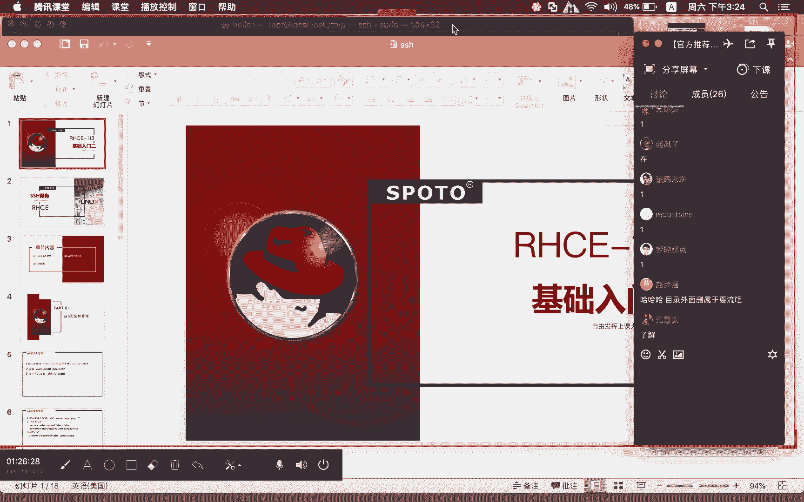

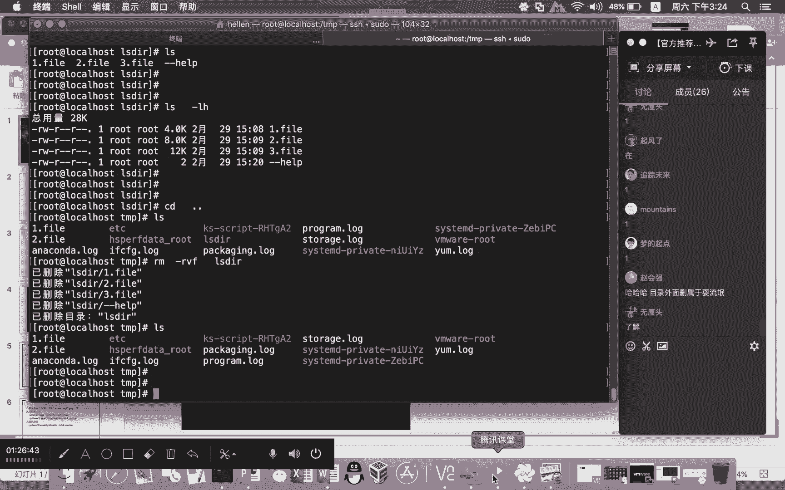

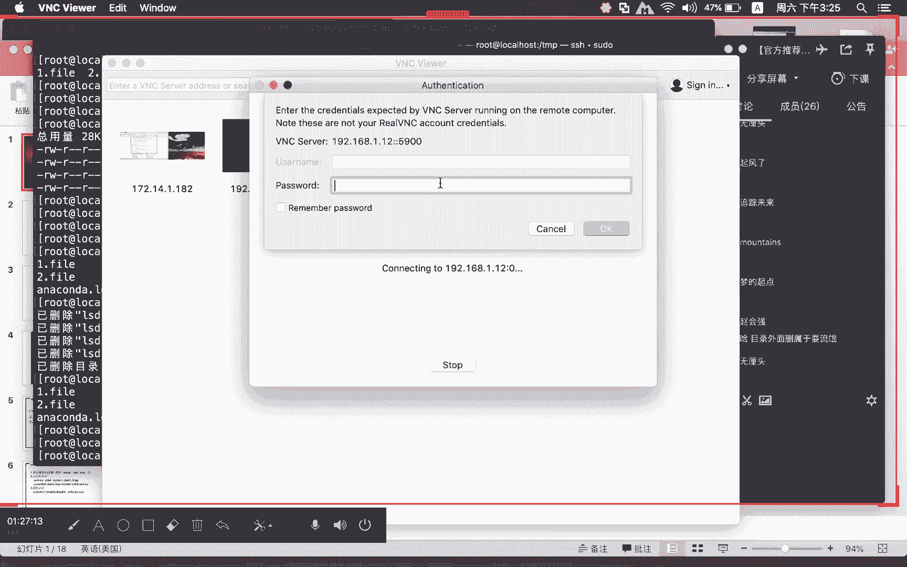

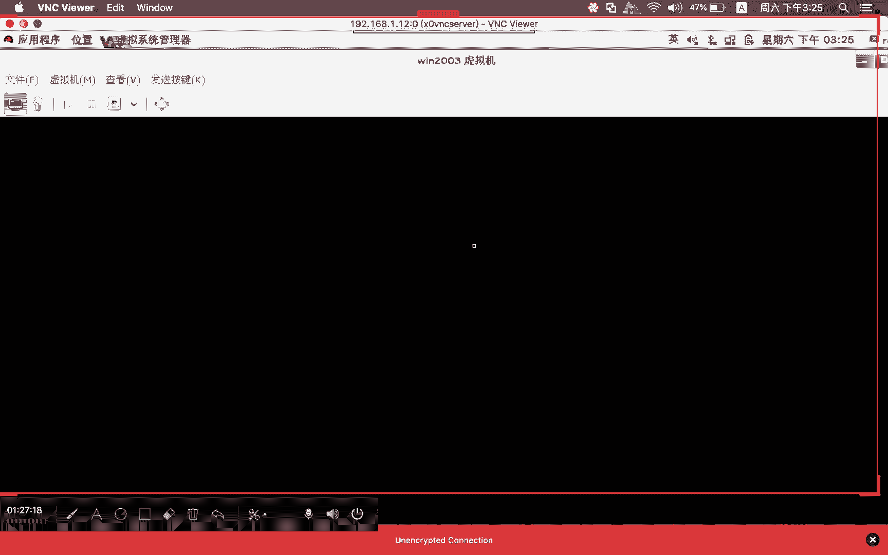

我们可以通过以下命令检查SSH服务是否正在运行以及监听端口：

```bash
netstat -ntpl | grep :22
```

如果看到类似 `0.0.0.0:22` 或 `192.168.1.100:22` 的监听信息，说明SSH服务正在运行。其守护进程名为 `sshd`。

---

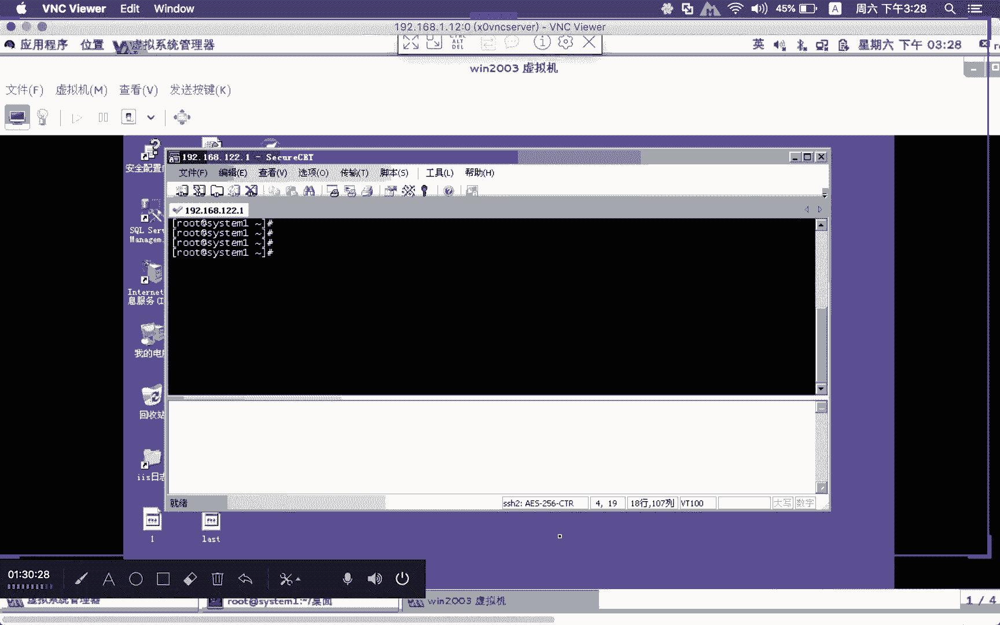

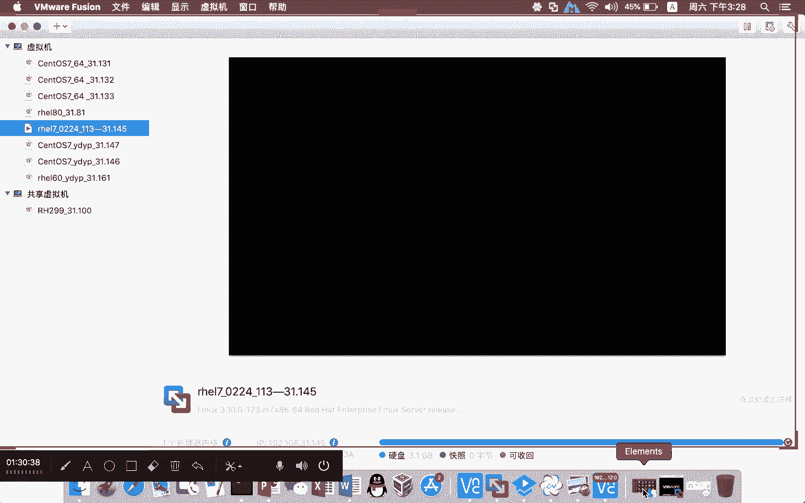

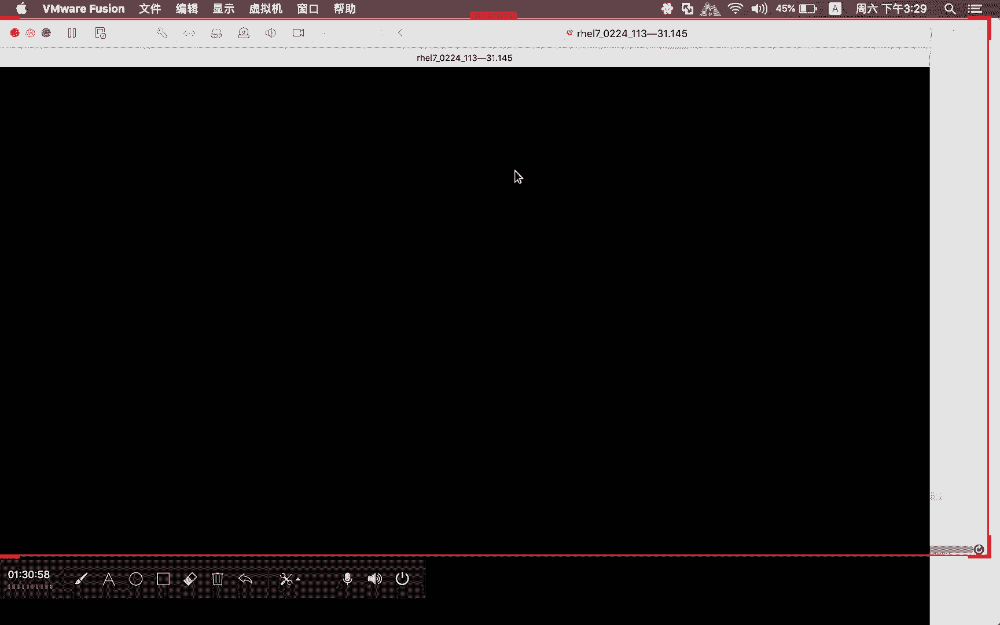

## SSH服务配置

上一节我们确认了SSH服务的基本状态，本节中我们来看看如何修改其配置文件以满足特定需求。SSH的主配置文件位于 `/etc/ssh/sshd_config`。

### 修改监听地址与端口

默认情况下，SSH服务监听所有网络接口的22号端口。出于安全考虑，我们可能希望将其限制在特定IP或更改默认端口。

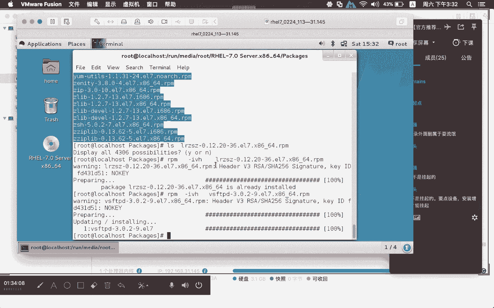

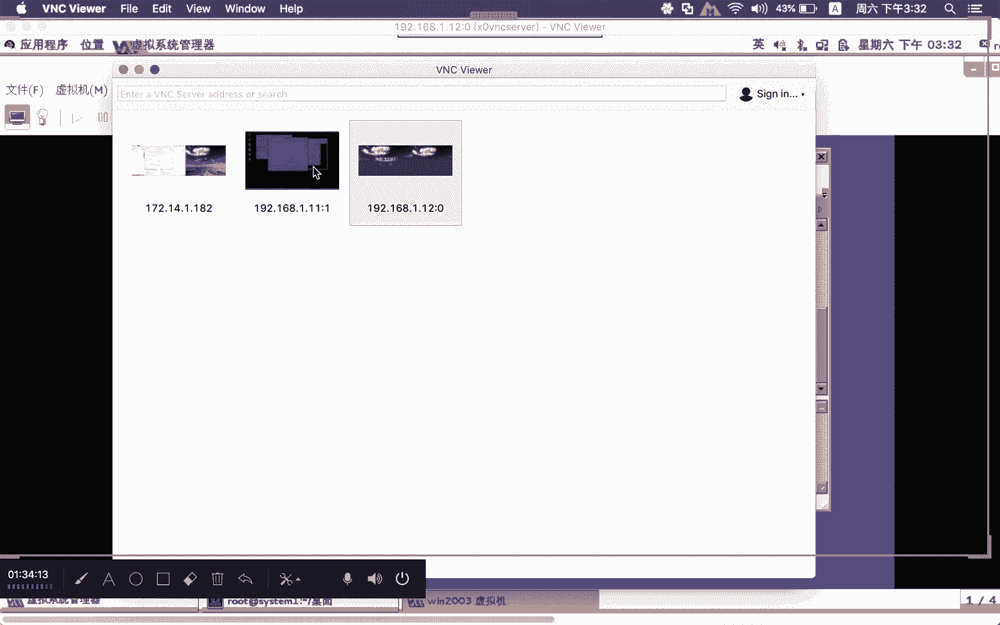

1.  使用 `vim` 编辑器打开配置文件：
    ```bash
    vim /etc/ssh/sshd_config
    ```
2.  在文件头部找到 `ListenAddress` 和 `Port` 配置项。
3.  修改 `ListenAddress` 为指定的服务器IP地址，例如：
    ```
    ListenAddress 192.168.31.145
    ```
4.  （可选）修改 `Port` 为一个非标准端口，例如 `8022`。
5.  保存并退出编辑器。
6.  重启SSH服务使配置生效：
    ```bash
    # RHEL/CentOS 6
    service sshd restart
    # RHEL/CentOS 7/8
    systemctl restart sshd.service
    ```
7.  使用 `netstat -ntpl` 命令验证新的监听地址和端口。

### 管理服务状态

以下是管理SSH服务状态的常用命令：

*   **启动服务**：
    ```bash
    service sshd start
    # 或
    systemctl start sshd.service
    ```
*   **停止服务**：
    ```bash
    service sshd stop
    # 或
    systemctl stop sshd.service
    ```
*   **设置开机自启**：
    ```bash
    chkconfig sshd on
    # 或
    systemctl enable sshd.service
    ```

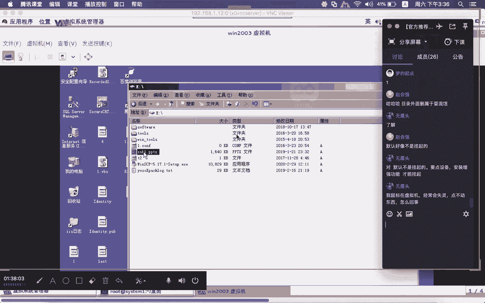

**注意**：务必确保SSH服务设置为开机自启（`enable`）和正在运行（`running`），否则服务器重启后将无法远程连接。


---

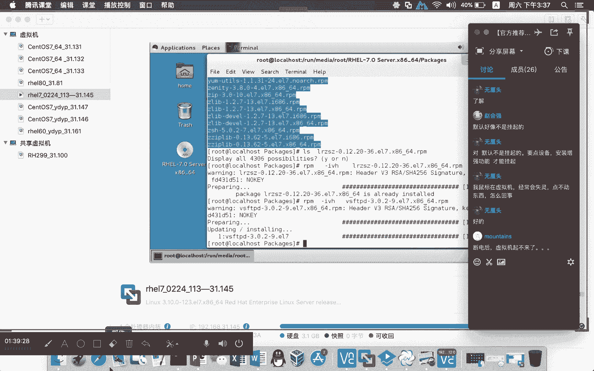

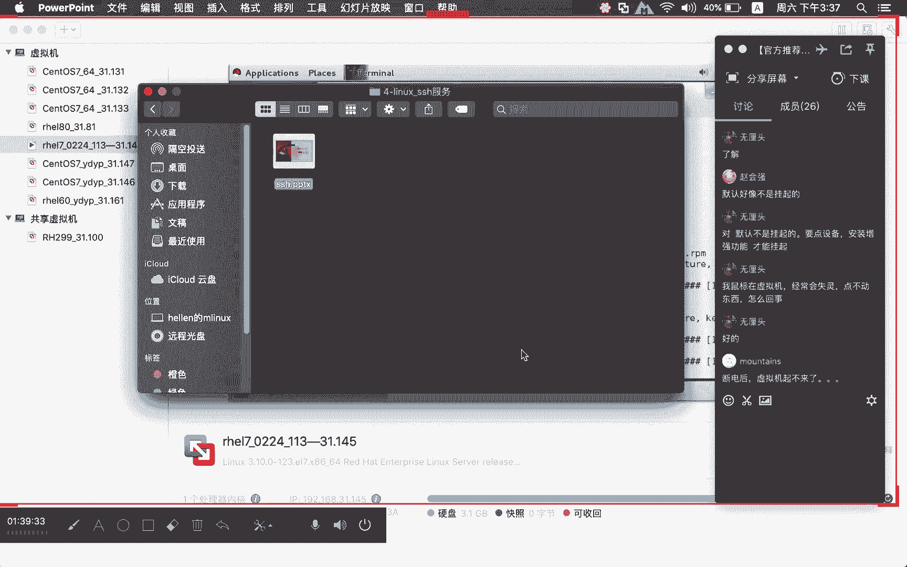

## 客户端连接与文件传输

配置好服务端后，我们需要从客户端进行连接。Windows系统可以使用PuTTY、SecureCRT、Xshell等工具。

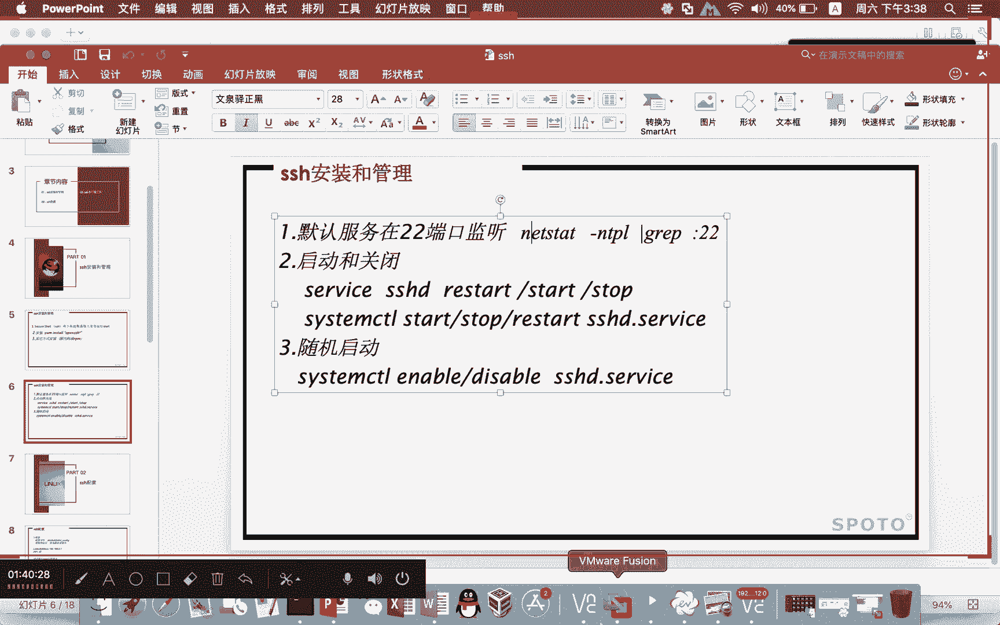

### 使用SecureCRT连接

1.  在SecureCRT中创建新会话。
2.  输入远程服务器的IP地址（或主机名）和端口号。
3.  输入用户名和密码进行认证。
4.  连接成功后，即可在终端中执行命令管理远程服务器。

### 使用lrzsz进行文件传输

除了远程命令操作，我们经常需要在本地和服务器之间传输文件。`lrzsz` 软件包提供了两个简单的命令：`rz`（上传）和 `sz`（下载）。

**安装lrzsz**：
首先需要在Linux服务器上安装该软件包。如果系统安装光盘已挂载，可以从中找到RPM包进行安装。
```bash
# 进入光盘挂载目录的Packages子目录
cd /media/CentOS/Packages/
# 使用rpm命令安装
rpm -ivh lrzsz-*.rpm
```

**使用rz上传文件**：
在SecureCRT连接中，执行 `rz` 命令，会弹出文件选择对话框，选择本地文件后即可上传到服务器当前目录。

**使用sz下载文件**：
在服务器上执行 `sz 文件名` 命令，可以将指定文件下载到SecureCRT预设的本地目录（通常可在会话选项的X/Y/Zmodem设置中查看和修改）。

---

## 配置文件其他重要选项

除了网络监听设置，配置文件中还有其他影响安全与体验的选项。

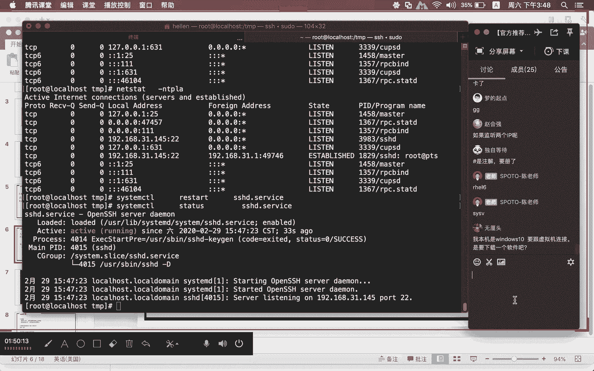

### 禁止Root用户远程登录

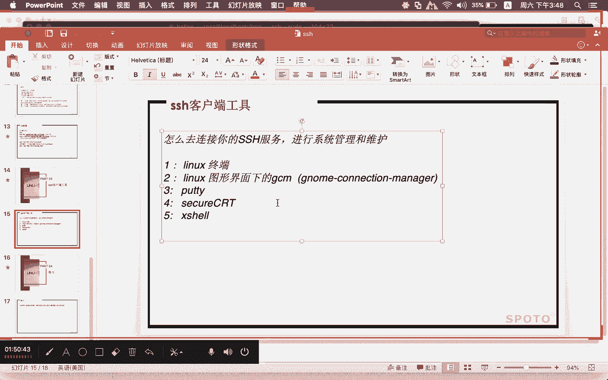

为了提高安全性，可以禁止直接使用root账户进行SSH登录。
在 `/etc/ssh/sshd_config` 中找到并修改：
```
PermitRootLogin no
```
修改后重启SSH服务。此后，需先使用普通用户登录，再通过 `su` 或 `sudo` 命令切换至root权限。

### 禁用DNS反向解析提升登录速度

如果SSH登录时在密码认证前停顿时间较长，可能是服务器正在尝试对客户端IP进行DNS反向解析。可以关闭此功能以加速登录。
在配置文件中修改：
```
UseDNS no
```
同样，修改后需要重启SSH服务。

---

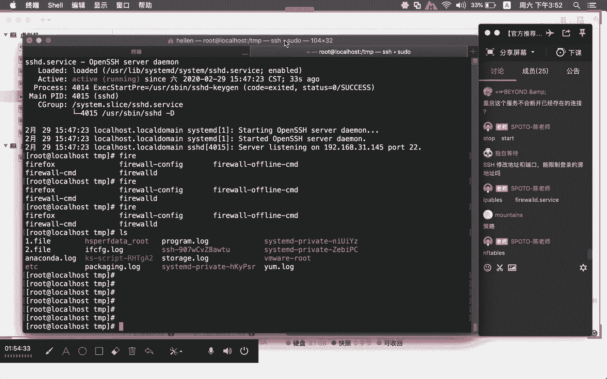

## 安全增强与故障排查

### 通过防火墙限制访问

可以通过系统防火墙（如 `firewalld` 或 `iptables`）限制只有特定的IP地址可以访问服务器的SSH端口，这是比修改 `ListenAddress` 更灵活的访问控制方式。

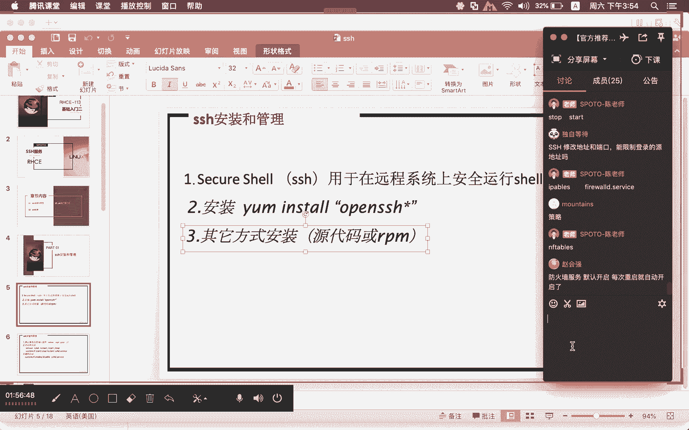

### 查看活跃连接

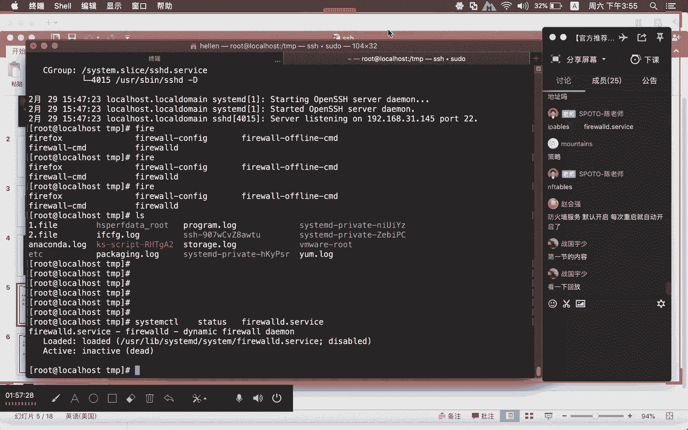

使用以下命令可以查看当前所有连接到SSH服务的客户端：
```bash
netstat -ntpl | grep sshd
```
或者使用 `ss` 命令：
```bash
ss -tnp | grep :22
```

### 服务重启对连接的影响

正常情况下，重启SSH服务（`service sshd restart`）不会断开已建立的连接。但如果重启过程中服务停止时间过长或启动失败，则可能导致现有连接中断。

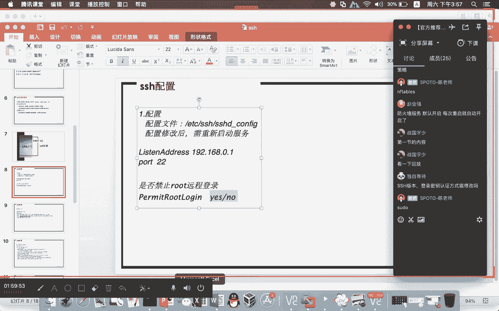

---

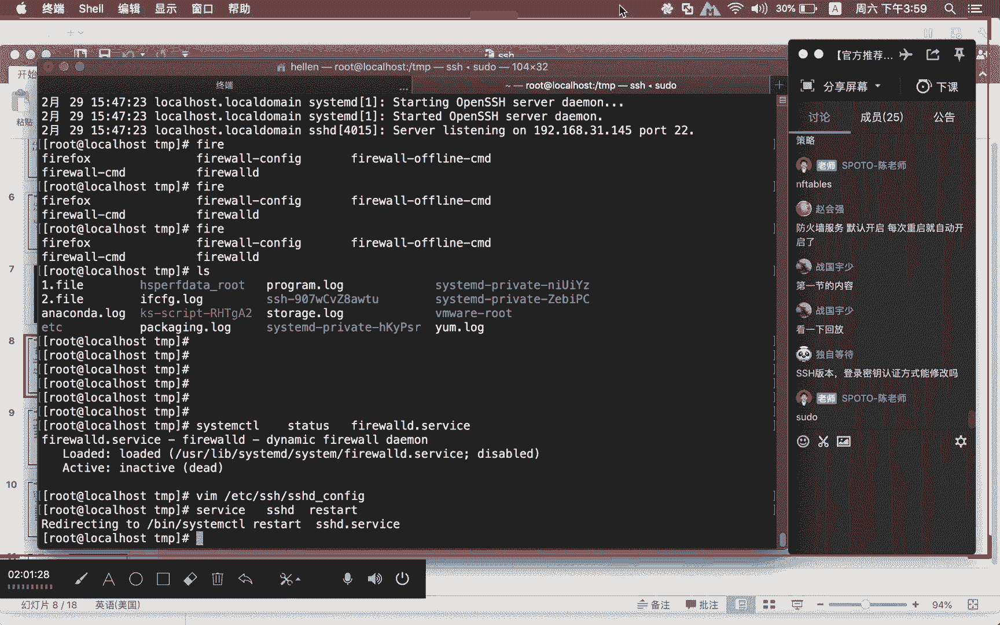

## 总结

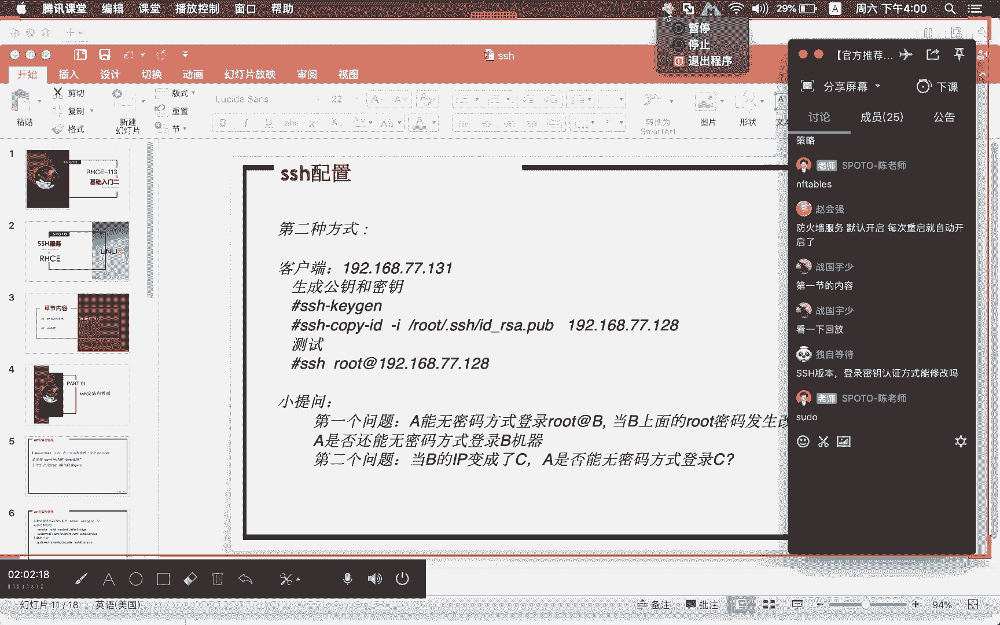

本节课中我们一起学习了SSH服务的基础管理。我们首先了解了SSH的作用和检查方法，然后学习了如何通过修改 `sshd_config` 配置文件来改变监听地址、端口，以及如何管理服务状态。接着，我们介绍了如何使用SecureCRT等客户端进行连接，并借助 `lrzsz` 工具方便地上传和下载文件。最后，我们探讨了禁止root远程登录、禁用DNS解析以提升速度等安全与优化配置，并简要提及了防火墙控制和连接查看等进阶管理知识。掌握这些内容，你已能够完成Linux服务器的基本远程访问与管理。