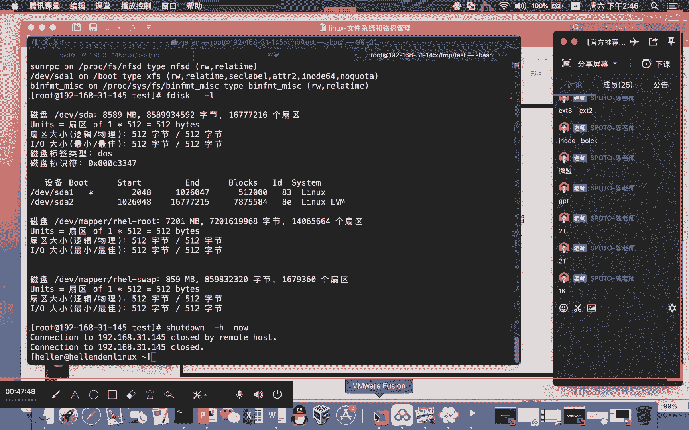

# Linux基础课程（RHCSA）简简单单学会Linux入门教程 - P10：磁盘管理-1 - 思博Linux关关 - BV1fv411j7RG

所以我也把这个东西要拿出来给大家说一声。就这个部分啊，就在这个地方啊，嗯因为你这个题目的要求可能要注意看一下哈，这个题目的一个要求就是研究生是吧使用ACL授予和限制访问权限哈。

研究生呢需要这个的一个协助目录啊，然后呢有这个组这两个组中的成员能够在什么呢？该目录创建什么呢？新文件，并且呢？新文件应该具有以下的一个属性啊，有同学问来，老师这里的这个动作和这个动作啊。

为什么要写两次，对吧？呃，其实前面的这个动作的话，它是对什么呢？当前这个目录它的一个什么呢权限的一个限制。然后下面这个的话是对什么呢？默认权限的一个设置。你对默认权限进行设置并不会作用在这个什么呢？

目录资格身上啊，只会作用在什么呢？目录下面的指对象身上，啊，所以你如果说把这个东西给跳开了你在这个目录下面再进行什么呢？就是说在这个目录下面去创建新文件，他可能就创建不出来，因为它还是没有权限，对吧？

但是你如果在这个地方设置了啊。你在这个目录上面去建出来这些对象，人家就会按照这个什么呢？它里面所设置的这个什么呢默认属性去做什么呢？属性的一个设置。所以啊自己在做的时候啊，需要注意一下啊。

因为这个答案呃是官方提供一般是不会错的，就红帽官方提供的ACL的话正常情况下是在什么呢？呃，提升班课程里面才会讲到，然后呢。这一次的话我是把它提升提提上来啊，本来是不想给大家讲太多啊。

只想说一下啊ACL有这么多的一些东西，然后提升课程里面要再做一下什么吩咐。嗯，有同学问了，我就给大家说一下。呃，这一部分练习的话，大家可以去试一试啊。因为我觉得我欢迎大家啊。呃。

目录里文件夹和文件都可以。对，是。所以大家如果说有兴趣啊，可以去就做这个练习啊。如果说呃觉得O呃，不想做，我觉得也没有问题。用的少啊，相对来说还是用的比较少。但就是碰到这种情况的时候，你如果说有了解过。

或者说有做过相关的这个什么的实验的话，就会比较清楚。

好了呃，访问控制列表。😊，权限部分呢我们就暂时到这啊，告一段落。呃，我们接下来呢又给大家讲的是什么呢？

呃，文件系统和磁盘管理，我们的整个进程啊是已经是拖后了哈。可能本期的这个基础班，我们可能还要再加一次课啊，再加一次啊，估计是要再加一次，本来是1次课吧啊，现在可能要再加一次11次课。

要不然我们这边这个内容啊是完成不了的。所以大家要有下心理准备啊，回头我会跟班主任沟通一下，看一下要不要加这个课啊。呃，今天的一个重点内容，文件系统和这个什么的磁盘管理。文件系统和磁盘管理的话呢。

我们在使用的时候啊，应该是算是一个什么呢？特别基础的一个什么呢内容。呃，大家在这种。文件系统呃，你拿过来对应的一个分区，然后格式化。然后对对这个分区呢进行一个什么呢？使用。那么这一部分东西的话呢。

是你对整个文件系统，整个磁盘的一个什么呢？规划的一个什么呢控制。呃，我们大部分情况下呢。在第一次安装的时候，大家都按照什么呢？自动安装的这种方式去做。那么在装的时候呢，它都是按照什么呢？

逻辑卷这种方式去做。那么这种逻辑卷这种方式去做的话呃，有的同学觉得喜欢有的同学可能觉得哎我希望自己能够控制什么呢？对应的分区啊，那你怎么去做这些分区，你首先要明白啊。

在linux系统下面这磁盘管理格式化它是怎么做的啊，有哪些文件系统你是可选的啊，哪些文件系统是适合你现有的这个什么呢linux操作系统啊，所以我们要先了解这些东西之后呢。

你才有办法去做一些什么呢相对符合你自己业务的这种什么呢文件系统和持盘的一个什么的管理。

呃，linux下面红贸企业7默认的文件系统的话，它是什么呢？叉S文件系统，我们怎么去确认你现在用的是哪一个文件系统啊，我们可以通过mot这条命令啊，在这个地方。

你看我们这里哈呃可能大家在这个地方看的东西里面的这个内容会比较多一点，看起来呢好像是花花论这个一堆一堆东西啊，我们抽出几个东西来给大家看啊，就是说比如说DVSDAE啊，它把这个分区，这个就是一个分区。

把这个分区呢把它挂到一个什么呢？bo斜杠 boot这个目录下面去。然后这里有写了一个什么呢？t叉FS啊，这个就是一个什么呢？这个分区它就是一个什么呢叉FS文件系统啊。

大家在window下面有见过哪些文件系统啊，linux下面你可能现在目前还没见过啊，我们今天要讲在windows下面你们有见过哪些文件系统。😊，哎，喂喂喂，大家还在吗？NTFS对，还有其他的吗？啊，对。

FATFAT是吧？那还有其他的那个FAT32什么以前老的那旧的，对不对？那。😊，window呃这个window这是window下面的哈，在lindowux下面的话呢，H yellow7。😊，H一七。

它的默认的文件系统的话是叉XS。你们如果在第一次安装做这个什么呢？呃自动分区，人家默认就是把它做成什么呢？叉FS文件系统。然后如果是H16。啊，他的默认的文件系统的话呢是EXT4。哎，对了。

然后更早之前的一些版本IL54，他们的这个版本的话是一直往前递减EXC3EX什么T2啊呃我们很早以前其实在还没有出红帽企业之前，我们很多一些业务啊，还特意把这个文件系统做成叉S。

但只不过那个时候没有默认支持，你需要自己去做一些补装，所以做起来比较麻烦。到了红帽7，它直接直接用这个什么呢？叉F来做啊，这个文件系统的话，它在使用的过程当中呢，是比EXT系列呢会来的更好。

我们在这里呢有一张小表格，大家可以看我们这里啊文件系统里面啊。啊，这个这个区别啊EXT2EXT3啊在这里面啊就是说它对应的可支持的文件系统的一个大小和什么呢文件的一个大小，这是EXT系列的文件系统啊。

它能够支持的文件系统，比如说EXT4，它能支持的最大大小是1B啊，然后一个单个文件它可以支持到什么呢？16B那如果是叉S的话，比它的这个什么呢？可支持的这个数量会比它更大啊，这是一个优势之一啊。

这是一个优势之一。然后还有一个哈其实这里面它写的比较官方一点。另外一个我们在早先我们为什么有一些系统会把它放在就红企业6的时候，为什么会把一些系统也放在这个叉S，而且还是自己去做。

它在IO的一个支持上面啊，相关的一个性能会比这个什么呢？EXT系列来的强啊，特别是跑一些数据库的时候，我们还特意把红企业6的，它的这个文件系统啊，把它装成是叉然后把这个数据库装这。😊，一个什么呢？

胡贸企业利这个系统上面去用啊，然后去跑对应的这个什么呢啊myCQQ标准的一种压力测试啊，最终得出来整个IO啊会比这个什么呢EXT系列来的高啊。就在文件系统上面在调优的过程当中，有一些数据库。

在做调优的过程当中，他会考虑比较多的东西。那么文件系统的格式类型也是我们考虑的一个调整方向。然后另外一个它的第二个功能，它是有讲日日志功能啊，日志功能日志功能的话，在每一个linux系统当中啊。

其实特别是在后面的这个版本啊，就EX4和叉X这些日志功能呢，它都是有在。那么对于这些日志功能啊，其实是非常有用的啊，为什么在linux系统当中啊，大家能够在异常关机的情况下，或者说呃突然这种关机的情况。

对应的这些数据还能够找得回来。啊，其实这一个日志呢就产生了一个什么非常重要的一些什么呢作用。文件索引方式的一个不同啊，文件索引方式不同的话呢，它这里有讲到是下面的这种呃多块分配和延迟分配这种方式啊。

以前EX这个叉FS的话，呃，就比这个什么呢？EXT系列的它所使用的这种什么呢？索引效率上面的话提升的非常多，这应该是在算法上面的一个优化其实体现到这个具体的一个实源上面的话。

应该是E这个部分就是多块分配和这个什么呢延迟分配。什么叫多块分配和延迟分配啊。就是说我们在用这个数据在进行数据存储的时候啊，可能我给你分配啊，像以前EXT4，我给你分配就分配一个块啊，但是它不会什么呢？

多个快给你去做这种分配啊，给你多个快去做这种分配的话呢，有一种什么呢？所谓的预分配的一个意思。你有这个新的数据进来，我不需要重新再申请，重新再分配所以在IO上面它就有一定的什么效率的一个提升啊。

所以在这个变化上面啊，从这个地。方就可以体现出来。那么FFSCK的一个变化啊，这个FSCK这个地方的话，它主要是用来做什么呢？呃，如果你的一个文件系统啊变成一个只读的这种类型的话。

我们大部分情况下都需要对它进行什么呢？FSCK当然空间满这个是另外一回事。文件系统变只读，有可能啊就是在异常掉电或者什么类似这种情况下，你的文件系统出现异常呃，然后变成只读。呃，如果你想要修复它啊。

我们就需要通过什么呢？FSCKFSCK的话呢，大部分情况下是用来做呃，ET系列的。如果你的某一块文件系统硬盘上面的这个linux上面的文件系统，它出现了只读。呃，你重启完。在重启的过程当中。

它就会进行什么呢？磁盘的一个校验。呃，这部分东西啊，其实大家很经常碰到，就是不单是linuxwindow下面它其实也会有这种状况。大家愿认着突然间windows系统出现蓝屏了，对吧？

然后你重启这个时候呢，它就会进行什么呢？质检啊，那么这个质检的一个过程，其实就像linux下面的这个什么呢FSK它会将这个什么呢？系统当中两个非常重要的一个东西，就是所谓的什么呢i know。

和这个什么的block。边个 o c k。这两个概念啊，这两个概念的话是贯穿在linux系统当中非常重要的一个概念。iode就相当于是家里的门牌号block就相当于你家里头的房间。呃。

有了门牌号才能找到你家的一个什么房间，才能将相应的一个数据放到这个什么呢？房间里面去啊，iode就是什么呢？地址block就是用来什么呢？纯数据的什么呢？仓库啊，通过iode找到block。

那么才能够找到什么呢？相应的一个数据。威门那个事件哈。这个事情又说到威门那个事件啊，我们这里面。这个事情的话，确实因为我们原先早先可能外外界大家去猜这个事情的时候呢，就在想，为什么他没有去做备份啊。

像微门这样的一个大企业，上市公司，他们肯定会去做备份呃，运维的力量绝对也是很强的。但是问题就在于什么呢？人家在进行破坏的时候，就这个人啊，商库跑路的这个人啊，虽然后面被抓了。他在做这个破坏动作的时候。

他是把什么呢？他是把原始数据删了，把什么呢？备份数据也给删了。那么最终他的一个恢复是怎么样恢复呢？啊，他最终的一个恢复就是什么呢？基于in和block这个概念来进行什么呢？数据的一个恢复。呃。

前几天我看好像微猛有发了一篇文章。呃，当时就说到恢复的一个什么呢？呃原理以及基本的一个什么的思路和过程呃，整个就像一个什么的故障恢复的一个小故事一样，在这里面进行讲述。node和快之间。

我们在进行相应的一个数据删除的时候呢。你在三的时候啊。它其实并不是将什么呢？block里面的东西删掉，它是将什么呢？它是将i note跟什么呢？block之间的这种关联关系给他什么呢？切掉。

就好像我现在要拆迁。我在拆迁的时候呢，他不是把整个房子给你什么推掉，他是把什么呢？他是把你们家门牌号拿走。啊，你你们家的这个门牌号拿走来的时候，你家这个房间其实还在。但是其实你想要找到你家的这个什么呢？

房间的时候呢，就是有一点困难啊，你需要把这个什么呢门牌号重新再贴回去啊，如果房间多的话，你这个重新又再贴回去这种过程啊，是非常麻烦的一个事情。但是一旦把这个门牌号，原来的门牌号把它贴回到什么呢？

原来的房间我们就可以根据什么呢？啊，相应的一个什么呢？读写操作，找回找回你原来的什么呢数据，因为你门牌号贴对，你房间里面的数据又在，对不对？我当然可以从你里面什么读取出来。所以这个部分的一个删除啊。

就是一个什么呢？非常有意思的一个操作，就是在这里文件删除所讲到的这个概念啊，删除掉的是指针大容量的数据删除也很快，又进行数据恢复原则上啊，是原则上没有新数据写入的情况下，原来的数据块啊。

没有被清除的情况下，这个数据啊它是可以。😊，修复的啊。所以微门他们在进行这个什么数据恢复的时候呢，它也是基于这个什么呢linux上面的一个什么呢？这种基本的一个原理。但是他们的这种恢复是比较什么呢？

耗时耗力的，是专业的这个什么的数据恢复公司啊，来完成这个什么的数据的一个恢复啊，我们的前提是你三可以不要有新数据写进去啊，如果说有新新数据写进去的话，那你家的那个房子有可能被推土机拆掉了。你想要让这个。

推土机拆掉这个房子再建出来的话，真的这个是我觉得。除非。大罗神仙在世啊，你才有办法去恢复，要不然的话这个太难了啊，基本上是不可能了啊，基本上是不可能了。所以他们在做这种数据恢复的时候啊。

可能是有一部分的东西啊，没有这样的一个什么情况。所以他能够去完成这样的一个恢复。我估计他们在恢复这个数据的时候，应该就是在他们的这个什么呢？备份盘上面去恢复的。就是说他把备份数据删掉之后呢。

他其实备份的那个盘啊已经没有新数据写入了，就短时间内他没有新数据写入。所以他可以从备份盘里面把原来的备份数据呢恢复出来。但是如果他想通过原始的那个什么呢？就线上业务的这个库里面去将这个数据恢复的话。

这个可能是非常小。因为在线上这个数据库里面啊，他可能删掉的东西是这些。但是呢他会不停的往这里面的去写这个数据，所以他是不可能在。通过它来将什么呢？这个数据里面呢把它给恢复了。好，我们在公开课里面。

我们只是给大家讲了什么呢？可能前面的七八分一个什么的内容。但实际上面你如果真的去操作这种东西的话呢，呃，运维还有这个数据恢复公司，还有这个什么呢IDC数据机房云服务厂商这些东西。

几个啊几个团队都有配合去完成这个东西，非常麻烦的一件事。所以为门我听到看到看到他说他连这个备份都给删了，然后最终还能恢复出来。呃，我确实很想给他们竖起一个什么的大大拇指，确实很厉害啊，确实很厉害。

这个腾讯云。😊，做的一个恢复动作哈。啊。那我们怎么样去做这个什么呢？呃文件系统呢？当然你要去做这个文件系统的话呢，首先你得有什么呢？分区。那我们怎么样去做这个分区呃，首先大家需要在我们的这个什么呢？

硬盘上面啊去用独立的这个什么呢？独立的硬盘上面啊，去做这个什么呢？新的分区出来。我们现有所安装的这个linux系统应该都是什么呢？被你已经分配光的啊，没有相关剩余资源的。所以大家不要在什么呢？

现有的这个系统上面去做啊，我们怎么去看现有的这个系统上面啊，它的一个容量情况啊，for disk减L这条命令啊，我们教大家看一下哈。

在这个地方大家可以看啊，我现在是310145这台服务器啊，DVSDA啊，如果你有2块盘，它可能是什么呢？DVSDA第2块盘呢它就会显示什么呢？DVSDB。然后这块盘它的一个容量是8589兆币，哎。

差不多就是8G啊，我因为我这边本地的这个什么呢？呃，苹果电脑它的这个硬盘存储啊相对比较有限，资源比较有限啊。所以我分的这个虚拟机，它的这个容量比较小，只有8G左右。然后在这一个。硬盘独立硬盘上面哈。

我们可以看到就在这个信息，我们可以看到什么呢？磁盘标签的类型是什么呢？dos磁盘标签类型，我们其实还有一个什么呢？标签类型叫什么呢GPT。😊，大表分区就great position table啊。

大分区表啊，大分区表像这种dos正常标签类型，一般都比较适合用载什么呢？2T容量大小的这个什么呢硬盘。啊，如果你是超过2T的话呢，我们都是用什么呢？GBT这种方式去用。嗯。

这个是跟它本身的一些什么内在激励也是有一定的一个关系的话。呃，在这个8G的这个硬盘上面的话呢，我们有几个分区呢啊，我们可以看到这里有SDA1有一个分区SDA2第二个分区呃，在这个两个分区里头。

通过后面的这个信息啊，我们也可以看到这两个分区的一个什么呢？容量大小呃，怎么看它的容量大小SDA1这里有写了一个什么呢？Blocks这里是什么呢？512000呃，那么这个是指有多少个什么呢？快的数量。

那么这个单位是多少呢？这个块，它的单位是1K。😊，就是我们如果说没有去做指定的这个就文件系统在进行格式化，没有去指定它的快大小的时候呢，它默认就是1K。那我们通过这个地方，我们就可以看出什么呢？

这个差不多什么，你你把这个51200乘以这个1K就是多少K嘛，是吧？那这个是大B哈，那么这个算出来之后呢，它的一个大小差不多是在5500兆左右啊，差不多是在500兆左右。然后下面这个话差不多是在什么呢？

呃7。奇迹多。接近8G啊，7G多接近8G。然后前面的这个部分，你如果用前面的这个star。and这种方式去做计算的话，那么他在算的时候呢，就比较什么呢？累一点。前面的这个是指什么上区的什么呢？位置啊。

这个是2048第2048个什么呢？上区啊，从这个上区开始到什么呢？这个上区结束。那么这个上区开始到这个上区结束，那么也就是这个分区，它总共有多少个什么呢？上区，你把这个and减去这个什么呢？

开始的就是它什么呢？总的一个上区的一个数量。那么每个上区它的大小是多少在这个地方也有给大家什么做做一个注解啊，它的一个上区大小是512个什么呢比特啊，512个什么呢质检。你把这个上区数量乘以这个什么呢？

512个质检，也就是它的什么呢？总的一个容量大小呃，说实在话，你如果用这个上区方式去算这个容量确实是很累的一个事情。所以我自己去算这个容量一般也都是按这样的一个方式去看啊。

然后你把这个东西就看出来了什么？512个字检512兆，然后这个是差不多是呃7。8G啊，7。8G，你把这两个东西拿去做相加啊，你的总容量不是8000。不是8589兆吗？你把这两两个东西啊。

总容量那去做为一个什么呢？相减，你就可以知道哎，我们现有的这个分区还有什么，还有多大的一个容量可分。就是说通过这种什么呢？基本的一个判断，你其实就可以看出它的一个什么呢？容量大小的一个情况啊。

然后下面呢还有一个是什么呢？对应的这里有写了一个什么呢？ID83。普通在linux上面做的一些什么呢？普通的这种分区啊，它的这个什么呢？分区的ID号啊，都是843。然后下面还有一个什么呢？8亿。

这个8亿的话呢是指什么呢？逻辑券分区啊，逻辑券分区的话，我们还没有给大家讲普通分区讲完，我们才会接着给大家去讲什么的逻辑券。所以大家看到这个LVM8E的时候呢，先不用担心啊。

我们都会给大家什么呢啊详细的做这个什么呢解析。😊，然后这个部分讲完到了这个后面部分啊，有的同学看到这下面的时候，他会觉得很奇怪。哎，老师这个为什么还有这些分区哈啊，这次也是分区哈。

然后这也是对应的什么呢？分区的一个大小。然后这两个分区的话，他做到的一个东西是什么呢？😊，基于逻辑卷啊，这是逻辑卷分区的一个什么呢？格式，它的一个写法是这样，大部分大家见到的都是什么呢？

啊DVSDAE啊，这个是在SDA这个硬盘上面做了什么呢？SDAE这个分区，然后可能还会看到什么呢？SDA2就类似像1234这样去算。但是你看到这种的话，你就闷了啊，这个是什么逻辑卷分区。

然后对应的这个什么的大小呢，也给你什么呢？显示出来。也就是说这些逻辑卷分区啊，它其实是基于这些分区做出来的。😊，然后除了这两个啊，大家看到的那现在如果大家现在想要做这个什么呢？磁盘的一些相关实验的话呢。

我们都是什么呢？去添加一块什么呢？新的硬盘进来。然后在这个什么呢？新的硬盘上面呢，去什么呢？去做相关的一个什么呢实验。那我现在呢先把这台虚拟机关掉啊，我们要去增加什么呢？硬盘。我们要去增加硬盘。呃。

如果同学有同学是这个在笔记本上面装的真实的linux系统的话呢，我们的个人建议哈，你可以在真实的linux系统上面啊去装一个什么呢？啊装一个Vware或者是什么呢visel box啊。

如果你是window上面装虚拟机的话，那你就可以跟着我来完成这个什么呢硬盘的一个添加。就跟我们之前做那个什么添加网卡一样的操作方式啊，打开这里有一个什么呢？设置啊，右击设置设置里头的话呢。

就有一个什么呢？存储。😊。

我们的存储啊就在这里硬盘这个地方，然后在这个地方的话，是不是有一个什么呢？添加设备啊，你们应该在winware下面的话，都是指用那个什么的加号啊，减号对不对？

你们都是用加号减号就window下面的那个那我这边的话呢点一下哈，直接去添加一块什么的硬盘进来啊，在这里你要加什么硬盘啊，我要加一块新硬盘。😊，那么这块新硬盘的一个大小是多少，你可以自己控制。哎。

我因为我只是做一个简单的一个实验，所以我不需要发太大。我只要什么呢？500兆啊，随便你啊。你如果空间够用，你自己觉得想要做大一点，那也OK哈。然后这个地方我们就点击一个什么呢应用。应乐一下哈。好。

订阅完之后呢，这块硬盘呢我们就什么呢？添加好了，添加好了之后呢，你在这个地方你就可以看到了，对不对啊？😊，在这个里面就有2块盘，第一块盘是你的什么呢？系统盘，千万不要跑到SDA上面去做这个什么呢？

磁盘分区的实验啊，因为那上面的数据都已经被你分过了，里面都已经占用了。你把那个分区给我搞掉，到时候你的系统是起不来的。啊以大家在做的时候，有办法的话，也给他做一下快照克隆放在那边啊啊。

之前就有同学做其他实验，不呃，可能这个有些东西实验做操作不大，导致整个系统呢分了啊，那你如果说自己有做备好备份的话，那你可以经过它把会不用再去装。😊，那我现在呢就添加完成了啊。呃。

我们不是热添加哈我们不是热添加，我们都是什么呢？冷添加啊。😊，扩展磁盘容量。扩展磁盘容量的话呢，我们不通过这个来做哈，扩展容量我们都是通过什么呢逻辑卷，就linux下面的这个什么逻辑卷去做啊。

这个不同的虚拟机不一定都支持这个什么呢？乐酷啊，乐酷是指什么意思？乐酷是只在一个硬盘上面哈，对这个硬盘进行扩大。其实在如果说你对应到这个linux系统下面去的话，乐酷啊它其实是大部分可能会失败掉。😊。

我们通过逻辑卷来做客乐扩隆是可以。啊，等到后面我们还会给大家讲，所以大家不用担心这个事啊。啊，我们现在已经添加完了，对吧？好，我们现在把它关掉，同时呢把它启动起来。

啊，启动起来之后呢，我们重新连到这台虚拟机里面去看一下，原来对应的虚拟机只有一块硬盘是什么DVSDAE是不是啊，只有一块硬盘DVSDA那我们正常情况下，如果这个加了就会有一个什么呢？呃DV。😊。

SDb。啊，就会有一个什么呢DVSDB你们看到的这个硬盘不一定是SDA啊，有的同学做了虚拟机哈。呃，不一定是SDA你们可能看到的是什么呢？VDA啊，然后新增的硬盘呢也有可能是什么呢？VDB。

这个不一定啊。

在驱动上面的话，不同的虚拟化软件它产生的这个什么呢？标识硬盘的这个标识呢会有所不同。所以你如果看到这个不一样的这个硬盘标识的话呢，不用惊讶啊不要惊讶。

那，我现在呢系统重新起来，我们远程连接进去123登录进来。好，for减我们重新呢来看一下。你看我们这里哦在这个地方SDA还在啊，然后增加了一块什么呢？500G的啊，不对，500兆的对吧？500兆的0。

5G对吧？0。5G啊536兆这样的一个什么呢？硬盘进来。那我们做的一个实验呢，都是基于这个什么呢？这个独立硬盘来做啊我现在呢怎么样去对这个硬盘做分区呢啊，我们可以通过ford后面直接跟上什么呢？硬盘啊。

直接跟上硬盘，就后面是跟硬盘，就要对这个什么呢？硬盘进行什么呢？编辑分区啊，我们现在进入进入之后呢，在这里面呢有一个几个参数啊，大家需要注意啊，你们如果说想要看完整的参数可以通过什么呢？

M那我们在这一节课当中啊，我们给大家着重介绍几个参数哈，第一个参数的话呢是用到了这个叫D啊，这个。😊，删除分区呃，还有一个是什么呢？列出分区类型啊，列出分区类型啊，就是列出它你的你的那个什么呢现有的。

partition ID啊，普通分区它的这个ID号是83，对吧？如果是逻辑券分区啊，它的这个什么呢呃ID号的话呢，是8E啊，如果是这个什么呢交换分区的话呢，它的这个partition ID号的话呢。

是842啊，我们可以通过L这个命令呢来看。你看我们这里通过L大家可以在这个地方通过L就可以看到呃大家如果记不住，你就实在这个地方去敲这个L，它就可以看到83，这个就是linux。然后这里有一个什么呢？

呃842，这个是什么呢？linux交换分区，然后还有一个什么呢？8E啊，逻辑卷分区。嗯，还有一个是可能大家也会碰到的一个叫什么呢FD的。😊，啊，直板鲁于正列。啊，磁盘冗一阵列磁盘冗一阵列里面的话呢。

早先课程我们还有讲呃，到后面的话，我们没有计划再给大家去做这一部分的一个内容介绍啊。如果大家有兴趣想了解，也可以找我沟通。

嗯，然后这是L部分的，然后包括前面部分的话，大家也可以去看一下啊，前面。

像刚才这个前面部分的一些这种啊爬列选ID。基本上都是windows系列的啊啊，HHPFNTFS好多啊，好多，就是我们知道的可能也就这一期。那么其他的一些文件系统啊，他们也有资个对应的这个什么呢？

part里选ID好啊。好，通过L我们可以看到这个。那么还有几个参数呢，还有一个是。print啊，这个是打印出什么呢？菜单，就我们刚才用的这个什么呢？M命令来获取这个什么呢？命令参数的一个帮助啊。

P是打印出这个什么呢分区的一个信息表啊，我们这里面呢打印出来现有的这个硬盘，我是刚刚新增，没有什么呢？做分区，所以我按P的时候呢，看不到下面的这个分区啊，如果你有做分区啊。

你就可以看到像他们这样的一个什么呢分区信息。那一会分出来按P，大家就可以看到了。然后这里还有一个什么呢？and哎这个参数是最为重要的是什么呢？N啊，增加一个什么呢？就是新建分区了啊，新建分区了。

然后Q是用来做什么呢？退出的啊，Q是用来做退出的这种是你前面做了，然后我不想保存，你就直接Q啊。如果说大家想要保存，一定要按一个什么呢？W。所谓的保存就是我要让这个什么呢？呃结果分区信息啊。

要把它什么呢？产生效果保存退出啊，如果你直接按Q，那刚才做的这个分区啊全部作废无效。好，我现在呢就来做一个分区出来哈，我按一个N。啊，然后在这个地方的话又会出现什么呢？P和E啊。

这里面的这个P和E这里的P是指什么呢？主分区后面的这个E是指什么呢？扩展分区在这个主分区的前面括号里头还会有一个什么呢比较详细的一个什么呢注解，这里有指就当下哈就告诉你说。

我现有的这个主分区它里面的这个当下的一个什么呢？分配情况啊，零个主分区，零个扩展分区有4个什么空闲可用啊，我们在做这个主分区，特别是在这个什么呢？dos磁盘标签类型的时候呢，它会受到什么呢？

我们的这个限制。那么这个限制的话呢，PPT当中哈，我们也给大家。😊。

做了一个呃简单的一个什么呢？归纳，就是3个P加1个E啊，3个P加1个E就是说MBR最多4个分区的一个记忆啊，主分区扩展分区逻辑分区就是说我们在分这个分区的时候呢，你最多只能分出什么呢？四个主分区来。😊。

呃，如果你做了最多的这个四个主分区来之后，主分区来之后呢，那。即便有剩余的空间，他也没有办法再分什么呢？多余的分吹出来了。那么为了解决这样的一个问题，我们延伸出了一个什么呢？扩展分区出来。啊。

那就是刚才大家在这里面看到的这个什么呢？extending扩展分区。所以我们在做分区的时候呢，它的最优方案是什么呢？是3P加1亿。也就是说我们要把它做成三个主分区，加一个扩展分区啊，这种方式。

柴油办法将这个分区数量什么？分到4个以上。

啊，才能够什么呢？充分的将你的这个什么呢？linux分区资源给充分的利润上。如果你自己觉得四个主分区就可以把这个资源全部用光，那也OK。啊，但是个人建立都是用什么呢？

三个主分区加一个扩展分区的这种方式去越啊，因为只有这样子的话呢，你如果想要有剩余空间的这个基础上，你可以在这个基础上再分出什么呢？第五个分区。第六个分区。那第五个分区第六个分区的话，它就是基于什么呢？

扩展分区。分出来的什么呢？逻辑分区啊，我们这里说的是什么呢？逻辑分区啊，逻辑分区跟逻辑卷是不一样的哈。逻辑分区是什么？是在扩展分区下面分出来的。这个扩展分区啊就像一个资源池一样的。呃，你想要分逻辑分区。

你就只能从什么呢？扩展分区里面抠一些出来，然后分出一个什么呢？逻辑分区来啊，扩展分区中做逻辑分区。啊，好，这个和windows上分区一样啊，差不多，倒s差不多都是这样子啊啊。

那为什么会只有4个主分区的一个概念啊？就在前面的这个地方呢，它有做了一个什么呢？简单的一个注解哈，大家可以看一下MBR这个就是什么呢？主引导区啊，这个其实就是指什么呢？主引导上区呃。

我们刚才说一个引导上区啊，它的一个基本单位啊，就它的一个容量是512个什么呢b。BYTES啊就512个字节就一个一个引导上呃一个上区哈，只有512个字节。那么这个呢它是MBR，它也是一个什么呢？上区。

所以它的一个容量呢也只有什么呢？512个字节。那么在这个512个字节里面，就是因为它的一个存储空间有限啊，而导致它什么能存储的这个分区的信息表是有限的。MBR的里面的前面446个字节啊。

是包含启动信息的啊，然后后表后面就446个字节的，后面部分有2个64个字节。啊呃有一个有一个这个分区包含这个什么呢？分区表信息的什么呢？64个季节。在分区表当中啊，这个6四个字节它只能存什么呢？

四个主分区的信息，所以它只能什么呢？只能通过刚才这种什么呢？3P加一这种方式来做什么呢？扩大呃，如果。主引导上去它512个字节哈，现在44664，还有两个字节，两个字节的话是纯校验数据的，保留用的。

可以不用管它。那你现在如果用这种到磁盘标签格式的话，就按照这种什么的方式来做。我们做一个什么呢？小演示来给大家看一下哈，你看我们这里现在按了一个N，然后呢它就出现了这个P和E是不是啊默认情况下。

因为你现在是主分区都还没分，所以它有4个fr啊，有4个主分区的这个什么呢？符号可以给你用啊我们分分到第四个的时候呢，你要按什么呢扩展分区来做。如果你都给他给干下去的话，后面就没有办法分了。

我们现在按一个P啊，大你看默认它就是P，就默认是P你就可以回车，我们就不用管它第一个分区从一开始嘛，默认是一，我也按回车好，这个时候呢起始上去和结束上去。

其实这个地方就开始去定义你的第一个分区给它分配的容量大小是多少。😊。

那我们不想用这个什么呢？按上去的这种方式来做啊，大家可以通过什么呢？呃，加多大啊加多少兆加多少K的这种方式来定义对应分区的一个容量。即使上区部分的话，你就按回车去就可以了。就在这个什么呢？结束上区部分。

大家一定要什么呢？啊，不要用这个上区的形式来做，这个算太困难了，我从来没用这种方式去算。比如说我们现在的这个SDB因为536兆空间也比较有限，所以我先做一个分区算来100兆。啊。

然后这个分区一它就设置成了linux类型，大小就是什么呢？100呃十0兆，不好意思啊。然后你用这个P就可以看到啊，原来我们按P的时候，里面是没有任何的分区信息，对吧？

现在目前就可以看到什么DVSDBE啊，默认你不指定它的这个part ID的话呢啊，那它就是什么呢？83你如果想改可以按这个什么T进入什么修改那我现在不用去改它啊，你可以呢再分啊。

我还继续按这个什么呢N要转创建什么呢新的分区啊，这个时候已经有一个分区了，所以它这里就写的一然后你已经做了一个盘符了，所以呢他这里就只剩下三个了。那我们继续分还是P啊。

第二个分区还是回车啊后其实上去按回车啊，结束上去用加号来指定大小我这个部分的话呢，我就给他什么呢50兆。啊，然后再分还是按这个什么呢？N。啊，然后你看已经有两个分区了嘛，SDA1和SDA2啊。

已经有两个primary，还有两个free啊，你们按回车好，这个时候呢还是按回车，分区号是三嘛啊，即使上区也是按回车啊，结束上区。😊，这个时候呢就指定它的一个大小。比如说我这个分区也是运什么的50兆。

啊，然后你按一个P，我们已经有什么呢？三个分区了。那么总体的一个子源的一个容量就是什么？这里有10兆50兆50兆，他用了110兆呃，536还剩下什么呢？400多兆。我们还可以继续分。

那么这个时候分的时候呢，它这里就只剩下一个分呃，默认的值由原来的什么呢？P。变成了什么呢？一如果你这个时候啊一意孤行啊，觉得老师讲的这个东西不靠谱啊，我想试一下，没问题啊。

我们来验证一下我这个时候呢还是按P啊，我不打算用它来做什么的扩展分区。好，你这个时候分这个时候呢，它的分区就是4啊，我们继续起始上去，结束上去的话呢，我们也是给他什么呢？50兆。😊，好。

我们现在按一个P，在这个地方，大家就可以看到我们分出了什么呢？四个主分区来，对不对啊，分出了4个主分区来。🎼这四个主分区的话，它的总体容量10兆、50兆、50兆、50兆、50兆，总共是什么？160兆。

对不对？50加50。加50加什么？10啊，总共是160。我们的这个硬盘啊，它的大小是536。对吧那么它实际还剩下的一个容量的话，还有什么呢？370多兆。是吧还有剩下370多兆，那你有容量，你还能分吗？

啊，因为你刚才做了这样的一个分区，而导致它什么呢？没有办法more link。你看我说如果你想要创建more lane for partition，想要创建超出4个主分区的话呢。

你必须来呃用其中的一个什么呢？主分区。用用这个什么的扩展分区来进行什么呢？replace，就是说你要把其中的一个什么呢？主分区改成什么呢？扩展分区啊，他才有办法做。

那我们现在呢把其中的一个分区把它删掉啊。我这个是一个错误的一个演示啊，就告诉大家，如果你要这样做的话，它就会错啊，然后也匹配一下我们前面刚才所讲的那个理论啊，我们把来这个东西删掉。那么删的时候呢。

我们就删什么的？最后一个分区删完大家就可以呢在这个地方。按一个N啊，我们就按照什么呢？E啊，默认E的这种方式去分。那么扩展分区呢，我们在分的时候就把什么呢？剩余的容量全部什么呢？都给到这个什么呢？

扩展分区里面去啊。我问大家，如果说我没把剩余的容量全部给到扩展分区啊，大家觉得。这个整个硬盘它的一个容量能够被充分的利用吗？Wei。喂喂喂，不行，对吧？不能。啊，为什么呢？为什么呢？🎼为什么呢？啊。

就是。啊，还可以继续分逻辑分区啊，是没错，就是说我们如果说没有把这个剩余的容量都给扩展分区啊，当然你想要去做逻辑分区，你可以在扩展分区里面去做。可是现在已经有什么呢？三个主分区，你再做一个扩展分区。

那么剩余的容量没有全部给到扩展分区。那么剩下的那些容量，它就没有办法什么呢？再做分区的啊，在扩展分区里面的容量它是可以做逻辑分区的啊，扩展分区不需要对它进行什么呢？可视化。

我们现在这个部分的这个什么呢扩展分区的话呢，就要把剩余的容量全部给到他这里去哈，回车啊，就是其实上去回车结束上去也是什么呢？回车。啊，你看我们剩余的容量都给到什么呢？

都给到我们的这个extending的这个什么呢分区来。你按一个P在这个地方就可以看到一个什么呢exending的啊，所以大家在判断这里面这个空间有没有剩余容量。那么剩余容量能不能被利用。

你就可以看这里面的一个什么呢容量的一个加法情况啊，同时去判断我们的这个扩展分区是不是把剩余的容量都给包括了。如果说有部分没包括，那肯定是有人在做这个分区的时候，没给我做好是吧？好，做好了之后呢。

我们就可以对它进行一个什么呢？呃，再做一个新的这个分区，那么这个时候做新的分区的时候呢，你们可以注意的一个情况是什么呢？😊，这个时候它是逻辑分区啊，这个时候它是什么呢？逻辑分区啊。

逻辑分区就是基于什么呢？我们的这个扩展分区里面的这个东西来做。我们怎么判断你现在新做的这个逻辑分区是基于这个扩展分区来做呢啊，我们从这个地方就可以看出来。你看我们这里哈SDB4。

它的即止上区和这个结束散区是328。8575对不对？然后起实上去。逻辑分区的一个什么呢？它的一个范围啊是从这个地方开始，就是什么36啊，也就是在什么呢？在这个位置中间的这个上涨区拿出来给他们做什么呢？

逻辑分区。啊，我们现在按回车啊，然后再分一个什么呢？大小。啊，比如说50账这样子分下去。然后我们把这个东西呢再做一下什么呢？啊，保存啊，我们做一下保存啊你。啊，我们先按一个P啊，给大家看一下啊。

现在目前就这样的一个情况，对不对啊，现在就是目前这样一个情况。然后按一个什么呢？保存啊，那么这个保存完了之后。啊，是将这个分区信息写入到什么呢？我们对应的这个什么呢法定选表里面去啊，你要将什么呢？

top pro再执行一下，对应的这个分区信息同步到什么的内核里面去啊那我现在问大家一个问题哈，这个问题问完我们就稍微休息一下啊。😊，问一个问题问大家。现有的这个分区情况。

我们还有多少容量可以使用做新的分区？啊，比如说我要再分1个SDB6出来，大家说。我能分吗？啊，还有多少空间可以把这个能量都给这个什么呢SDB6。各位同学。啊，问大家一个问题。啊，还有350兆啊。

问了几点问了啊，350兆啊，还有没有其他答案的？331775到1048575能哎非常好。mate的起点，他帮我算的这个快啊，他在算的时候呢，我告诉大家win的起点他是怎么算啊，他把这个blocks。

这个blocks，这个bs，还有这个bs。😊，把它相加，然后把536减掉。因为为什么呢？扩展分区它是一个资源池，它不能算作什么呢？已经被使用，对吧？真正被使用的是这些。分区逻辑分区和什么呢？主分区。

是不是？所以它最终算出来的一个容量大小是什么呢？530减去160，接近于差不多350啊，OK没有问题。我爱猫咪，它的这种算法非常好啊，它怎么算，它是把什么呢？因为你的逻辑这个扩展分区，它的一个什么呢？

结束上去是1048575而你的SDB5呢已经分到了什么呢？331775啊，那你在使用的过程当中的话，就是从这个位置算到这个位置，就是它剩余的一个什么呢？容量啊，独资等待也告诉了我一个能非常好啊。

说明呢已经消化吸收了这个什么的知识点。OK呃，现在是3点07分，我们休息一下哈。我们在3点15分的时候呢，来继续给大家讲磁盘分区和管理哈。😊。

