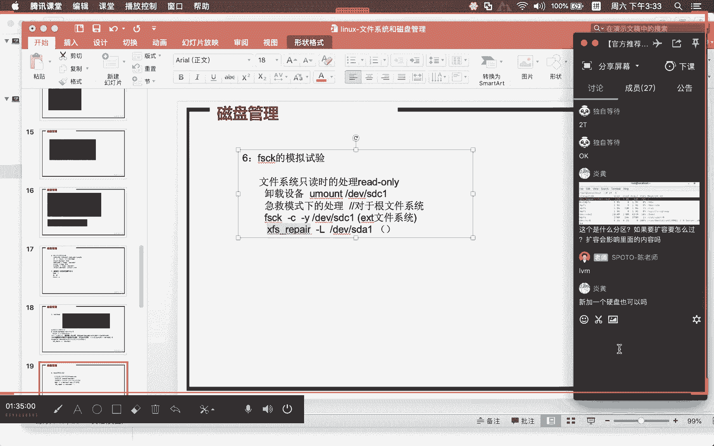

# Linux基础课程（RHCSA）简简单单学会Linux入门教程 - P11：磁盘管理-2 - 思博Linux关关 - BV1fv411j7RG

今天的内容哈哦开始继续后面的这个内容哈MBR和GPT的磁盘格式存储容量，为什么MBR只能存储2T以下呃，这个跟它整个表结构是有一定的一个关系的哈。呃，我们早先的时候在生产环境里面有试过。

比如说做那种存储的它那个硬盘比较大我们当时就用这个MBR去用，但是呢它这个带起来。后面我们就把这个盘呢分成两个什么呢？呃一个2T的一个呢小于2T的，用GPT这种方式去做，或者是用MBR这种方式去做哈。

就可以跟他这个表结构有一定的关系哈。就其中的一个原理的话呢，可能大家还需要去看一下对应的一些资料嗯。这个主要还是硬件上面的主要还是硬件上面的MBR的话，它这个4个主分区这种方式的话。

在阅读过程当中也有一定的影响。就是我们刚才讲512个字节这种方式。系。安装系统用MBR硬盘格式安装系统挂载挂接大于两硬盘能挂这个可以挂啊，这个当然可以挂。你大于两个硬盘呢，我们在挂的过程当中。

你可以用多种方式去做哈，这肯定可以的啊。但是在呃第一次做那种什么启动盘的时候，你不要越那种大于2T的一个硬盘啊，就是我们自己在装系统的时候啊。比如说什么情况啊。

就是我要把这个文件系统啊挂接在启动那个方式，能挂接在一个什么呢大于2G的一个硬盘，它这个是挂不了。但是你把这个系统装好了，想要把这个什么呢一个存储盘，大于2G的一个存储盘啊。

把它挂到你刚才装好了这个系统上面，这个是可以的。不过我们现在生产环境当中用两T的这种盘还是比较少了，已经很少了。诶。大部分都是用什么呢？公有存储啊，公有云的这种方式去做，所以我们也不用去再担心这种情况。

可能大部分同大部分同学都不会碰到这种状况。好，我们来继续看一下后面的这个哈。刚才这个分区我们分了一些分区出来。那我现在呢想要对这个分区呢来进行一个什么呢？格式化。那么这个格式化的时候呢。

它可以有多种的一个命令呢来对我们的这个文件系统，对应的这个分区啊进行文件系统格式化。啊，其实就是对应什么呢？不同的文件系统类型的make FS点EXT系列的。

大家在这个地方可以看到EXT2EXT3EXT4啊，因为这种比如说我要想要对它进行格式成什么呢？EXT4的。SDB后面跟上什么呢？一那么这种的话，它就把它什么呢？格式化成了一个什么呢？

XT系列的一个文件系统。那么这个东西隔完啊，就这种方式啊，这这是最简单的一种方式。隔完之后呢，我们就可以对它进行什么呢？挂载。啊，挂载的时候呢，你可以用这moDVSDVE你要把这个分区挂到哪个目录去啊。

我们才有办法什么呢？对这个分区呢进行操作。你对这分区操作就是进入这个目录，对这个分区进行操作啊，这种就相当于什么这种映射样，我现在暂时把我的这个分区映射在这个目录上面去啊，然后你到这个目录上面操作。

其实就对我的这个什么分区硬盘进行操作。我们把它挂上去，然后通过DF减H啊，在这个地方大家就可以看到了。你看我这里哈啊8。7兆我们这个SDBE它是10兆的一个空间哈，然后在格式网。😊，格式化完之后呢。

它差不多肯定是小于10兆。这中间啊就是因为什么呢？我们的inode和这个节点啊，这些快的一些信息，它需要花一点什么的容量去存储这些什么呢？文件系统的什么的原数据信息。

所以呢你会看到在我整个十兆的一个空间里头哈，还没有开始使用这个分区的时候，它就已经什么呢？消耗掉一定的一个能量。那我们从这个DF减H这里呢，就可以看出现有的总量8。7兆，已经用了什么呢？啊。

已经用了172K，可用的是7。9啊，然后还有呃在这里还写了一个什么3%。通过这种方式的话，就可以很明确的看出来啊，我们现有的这个分区啊。然后你跑到这个什么呢MNT下面去啊。

在这个地方大家可以呢去写入一些数据，写什么数据呢？比如说通过DVZEROOF等于什么呢？呃，1。8，然后BS等于一兆。c等于什么呢？3呃这句话的一个命令啊，其实意思就是告诉大家说。呃，我们想要在什么呢？

这个地方创建1个1点fi这个文件它的容量大小呢是一兆乘以3啊，也就是3兆啊，用什么样的一个数据往这个文件里面去填充DV0这个设备里面的一个什么呢？零数据往这个文件里面去填充，反正我就给你造一个文件出来。

1。31点fi的这样一个文件然后在这个地方我们就可以看看到它的一个什么呢？一个3兆的一个1点fi文件啊，DF减H的时候，在这个地方你就可以看到啊，原有的这个容量就增加了啊，已经可用的一个容量去增加啊。

已经用了什么呢40%。呃，滴滴这条命令的话呢，我们在讲那个公开课里面有一个什么呢？基础。好月命令系列部分哈，我们有给大家带了一份这样的一个文档。我不知道后面大家有没有去看啊。

就在这里面呢有给大家去做介绍。所以这一部分我回头大家也可以去看一下这个里面这个命令部分的话，我们是有做了一个具体的一个解析啊，有有帮助于大家呢去消化吸收这个什么的命令的一个作用。那么这种是一个什么呢？

比较正常的一种什么呢？使用。啊。这个是什么分区？如果要扩容怎么过？呃，我看一下这位同学写的是什么啊。这个DF减H啊，你这种是。自动安装的一个什么呢？分区，它是基于什么呢？逻辑卷做的。我们在讲什么呢？

逻辑卷部分内容的时候呢，我会给大家去介绍啊，我们可以通过逻辑卷增加物理硬盘啊，或分区的这种形式来增加物理卷，然后扩大卷组，然后来扩大什么呢？我们的这个逻辑卷呃，会影响里面的内容吗啊，不会如果你是扩大呃。

你可以在正在使用的时候，就可以对这个什么呢分区进行扩大。只要你有可添加的这个什么呢存储，你都可以对这个什么分区进行扩大。而且是逻辑卷这种方式哈。如果是普通分区，你扩不了。

像刚才我们刚才做的这个SDBE这种方式，你想要扩大，不好意思扩不了。除非就是说想要不影响数据的情况下，想要去扩它，这个是不可能的啊。就是说普通分区不行啊。如果是逻辑卷分区，就这个分区，哎。

这个是可以新加一个硬盘也可以吗？可以。啊，你听添加分区进来，或者说用一个什么新的一个裸的一个一个。都没用过的一个硬盘进来也是可以的啊，一定要是逻辑卷才行啊。所以你不用担心哈，我们讲逻辑卷的时候。

还会给大家讲这些知识。那我们刚才阅的滴滴这种命令啊，在这个地方呢去创建了一个东西啊，我们回顾一下这个文件系统。我用的是另外一个什么呢？方式来给大家演示一个小实验。那么这个小实验的话呢。

来确认一个节点和快之间的一个什么的关系。我们用到的一条命令是这样的一条命令。

make FS啊点XT3。

我们把这个东西呢先把它什么呢ammount掉哈啊。如果说你这个分区挂到这个目录上，现在我不想用了，你可以把它amal掉，但是分区都还会在啊，分区都还是可以在的。我现在呢对这个进行重新格式化啊。

我们把它隔成了一个什么呢EXT3文件系统的。你重新格式化里面原来分区里面的这个什么呢？一点fi刚才做的那个文件，它就什么呢？不复存在了啊，它就不复存在。那我们院的这条命令减N20就指定什么呢？

我们对应的这个分区，它的一个什么呢节点的一个数量我在这里指定20的时候呢，它不一定真的就是什么呢？20，它可能会在20的一个什么呢？上下数量进行什么呢浮动。啊，我们可以通过这个E图。FS号。あ。

在我们的这个turnturn into FS。E toFS这个地方哈，我们可以去看。这个分区的一个什么的信息情况，DBSDVE。诶。啊，在这个地方大家就可以看到。

你看我们这里有一个i note count，它写的是什么呢？😊，你的节点数量是32。就是告诉你啊，我们现在可认的这个什么呢？节点门牌号，你家这个城市我只有32个门牌号呃，那么其他的都是没有门牌号。

你想要通过这个什么门牌号找房间，那不好意思，他做不了。那只有这32个可以找现有的32个已经认了什么呢？呃，11个啊，还有什么呢？21个没有用啊，还有21个没有用。

那我们现在呢就可以在这个目录下面呢去创建文件啊，把这个分区呢重新创建，把它挂载进来。然后跑到这个什么呢？MNT这个目录下面，大家可以看我们刚才重新格式化完之后，原来写在这个目录下面的一点fi啊。

也就是分区下面的这个文件，它已经什么呢不复存在哦，我用一个脚本将这个什么呢？文件创建出来，因为我要批量创建啊，你要手动方式去做的话，当然也OK那我个人建议还是用脚本形式来做哈，让大家看到什么呢？

更有意思的一个效果。在这个地方。这是一个需小脚本啊，非常简单的一个需小脚本案。😊，现在呢把它拷贝进来。我把这个脚本放在什么呢？temp下面啊，叫一点SH的这么一个脚本。

然后这个脚本给大家做一个简单的一个什么呢？呃注解哈。我在这边的话呢，计划通过这个脚本呢。在我们的这个目录下面呢去创建25个文件。创建25个文件。呃，就在我们刚才硬盘挂载出来的这个什么。啊。

分区挂载出来的这个什么呢？目录上面，也就是我们的这个MNT这个目录上面啊，这个可以去掉。然后在我们的这里。MNT这个目录下哈MNT这个目录下。好，进入这个脚本，它就是进入这个目录哈。

通过一个for循环要创建1到25个文件。啊，就文件的名字叫什么呢？123456789一直到25。呃，这个就是我们这个脚本他会做的一个事情啊，就创建出这么25个什么呢空文件出来。那，我们现在呢来。

保存一下哈，保存完之后呢，将其什么呢？咨询一下啊。哦，现在目前这个目录下面话是没有任何内容。那我们现在通过这个脚本。1点SH这个脚本啊，来把它什么的运行起来。大家可以看啊，当我们运行到什么呢？

第22个文件的时候呢。他就告诉你说什么呢？设备上没有空间了。呃，呃实际上面我们通过DF减H去看的时候呢，它还有什么呢？8点就可用空间容量，它这里写的是什么呢？还有8。2兆啊，这就是因为你的节点数量用光。

你刚才不是写了free i know有21个吗？对不对啊，就是因为你的什么呢？i know。😊，数量用光了。没有办法什么呢？再去创建新的对象。我们在创建新的对象的时候，他肯定会分配什么呢？节点啊。

有了节点再去找存储的什么快，你节点用光了，我就没有办法给你分配了。所以即便你还有剩余的这个什么呢？容量空间，我还是没有办法给你什么呢？在这上面去创建新的一个什么呢文件出来。所以在第22个时候呢。

就出现说设备上没有空间，呃，实际上面我们的容量还是存在的。我们通过DF减HI可以看到这个什么呢？节点的一个什么呢？使用重现使用的一个情况。你看我们这里。DF减HI我们看到是百分百啊，32个i know。

已经用到了什么的？百分百用光光了啊，用光光了。如果我们把这几个数字全部清掉啊，比如说我们用这个心全部清掉。那么全部清掉之后，你再用这个DF减H去看的时候呢啊它这个容量节点的一个数量呢又恢复回来了。

我们这里呢给大家介绍的就是in啊，文件系统当中的in和这个快啊，通过这个实验呢，希望能够加深。大家对这个文件系统当中的这个inode和快两个重要概念的一个什么呢印象。😊。

实际业务里面不可能出现这种状况啊，就是说应该是很少很少出现这种状况哈。呃，我们业务运维做这种运维系统管理工作到现在啊，这种工作我们呃这种情况我们其实呃都还没有碰到过啊，基本上是没有碰到过，有一两次。

很少见的这种一两次某一个系统上面对应的这个什么呢邮件啊，它里面的这种队列文件特别多。啊，他发邮件的时候，这个邮件发不出去，然后一直堆在我们的这个什么的邮件的目录下面去。产生了很多这样的一个税文件。

成百上千万这样的一个什么呢？呃税文件。然后这个税文件的话，就直接把对应的那个分区，它的这个什么呢节点给用光了。后面我们把这个东西清完之后，它就空间又出来了，这种是比较少见啊比较少见。

OK这是文件系统格式化使用过程当中的一个什么呢问题嗯。整个什么呢？磁盘分区啊，在使用的时候呢，我们一般情况下会比较去比较少的去操作相应的这种什么呢？分区的一些动作。呃，可能大部分大家在安装的时候。

就已经把这些东西做好。那么事后再去做，在做这种什么逻辑磁盘管理的时候，逻辑卷磁盘管理做扩容的时候呢，你可能才会再去做什么呢？新的这种分区。这里面的这几个命令啊，大家也需要看一下哈，也需要看一下挂载。

就是说我们这里面啊PPT当中给大家带类似的这个什么呢？整个的一个步骤。

我这里有一个步骤哈，如果大家在做的时候呢，不清楚的话呢，需要去看一看这个步骤。喂。好，这个步骤在这里开始哈。这个步骤在这里开始。第二个这里。然后到这个地方for disk，后面跟上什么对应的一个分区。

然后在这个地方就按这个N啊，我们这里面都已经给大家介介绍过了，对吧？呃，如果大家在看的时候不是特别明白哈，可以再问问这里面呢有一个参数用到是turn E toFS减C0减I0DVSDAESDCE。

那么这个turn e to FS就这条命令啊，它的一个作用是什么呢？

T E to FS。减C0减I0对应的DVSDVE啊，就这条命令啊哎。我们现在目前正在挂载，要把它退出一下哈。这条命令它的一个作用。啊，把它mount掉，然后把这条命令哎，turn e to fS哦。

不好意思哈。减C0。减I0这样子啊，那么这个减C0。mod code啊，意思就是说啊我把你这个什么呢挂载的一个次数啊，设置成什么呢？负一啊，不限次数。然后这个什么呢？检查的一个时间，减I呢是指什么呢？

检查的一个时间间隔啊ater。是什么呢？0秒啊，如果这里写成什么？两个零的话啊，因为大部分情况下，你系统在重启的过程当中啊，它会根据你的一个。硬盘重启的一个什么呢？挂载的一个次数，以及什么呢？

前后间隔的一个时间去判断说我这一次重启啊，或者说下一次系统的这个启动的时候，需不需要对你的这个硬盘进行什么呢？质检。啊，硬盘容量大进行质检其实非常麻烦，时间很耗时。那我们把这个东西设置完之后。

其实我不管你挂过多少次，用了多久，那我这边的这个什么呢？检查都不会去做啊都不会去做。这样子的话就省了一个事情啊，省了一个事情。好，第二个部分的话呢是。这种都是属于什么呢？EXT系列的文件系统。

如果你想要用什么呢？makeFS点叉FS的话呢，我们也可以对它进行什么呢？叉F文件系统的一个格式化啊。你刚才这种特 e toF这个是跟什么呢呃。EXT系列的相关的啊，如果你是叉FS文件系统的话。

你得通过什么呢？makeFS点叉S这种东西来进行操作。我们在进行这种检查的过程当中啊，叉FS系统和EXT系列的文件系统检查的这个命令啊也是有所不同的。啊。

在我们的这个地方给大家提供了两个这样的一个对应命令啊。

就在这个地方，你们看FSCK还有一个叫什么呢？叉FSre啊，FSCK是对应什么呢？EXT系列文件系统，我在这里边备注一下啊，EXT文件系统。😊，有linux上面以前的哈，你不要小看这个EST文件系统啊。

现有的红豹7下面也有一些呃大家建新分居的时候，还是比较喜欢用这个EST。然后包括红贸企业绑考试的时候呢，HL7HCEHC红帽77HC考试的时候呢，他也是给大家要求做这个什么EST系列的文件系统啊。

但也有可能他会去考你的叉FS文件系统。啊，不管哪一种我们都可以做啊，他考那个硬盘分区这一块的话，就考你逻级卷东西。😊，那你如果是碰到叉VS文件系统，对这个文件系统进行修复的话，你得用什么呢？

叉FSrep啊，这是不一样的。所以大家在做的时候啊需要小心啊，需要小心。那我们刚才所做这些分区都是什么呢？手动的方式啊，这个分区格式化好了，然后我手动的方式将其什么呢？挂载上来，然后进行什么呢？使用。

那如果你想要做成自动的方式。

我们刚才都是手动是makeDVSDBE把它挂成什么呢MNT就这样这是手动挂载。如果你想要把它做成什么呢？自动的这种方式的话呢，我们可以通过一个命令啊，通过一个文件然后做一个什么的配置啊。

在这个配置完成之后，你就可以通过它来进行什么呢？自动挂载。这种自动挂载是在你什么呢？通过一条命令自动挂载，还有一个是通过什么呢？机器重启之后啊，随机启动这两种方式。啊。

我们的FSTAB就是可以实现我们的这个什么呢？自动挂载随机启动的这样的一个什么呢效果。啊，我们在这个地方写的时候呢，它的一个格式是这样，就前面你要写什么呢？DVSDVE就第一列。啊，写完空格。

这个指你要挂载的分区是哪一个？你要把这个分区挂到哪个目录去啊，我要把它挂到什么呢？MNT这个目录去。好，刚才这个分区它对应的文件系统是什么？如果你没有格式化，你不能写到这里面啊。

一定要格式化对应分区才能用。我们刚才的这个文件系统，它的一个什么呢？类型是EX是什么呢？T4啊，就第三列。文件系统类型是哪一个？你的分区当时用什么格式化，这个分区类型就要写什么，不要写成跟外面不一样。

好，第三个第四个是default啊，我们默认情况下是这样子，就这个它写的是什么呢？挂载选项。那么这个deult它的一个挂载选项呃，是哪些挂载选项呢？我们可以通过m。FSTAV这个东西来看啊。

基础命令再给大家去做这个介绍的时候，我们就已经给大家说过一个问题。命令可以愿妹来看他帮助信息，也可以愿他来看什么呢？对应的配置文件。那我们通过什么呢maFSTAB在这个地方大家就会在这个地方啊。

就可以看到一个什么呢？呃很多相关的一些什么呢？标准参数啊，我们要找的是dorce。我跟你讲哈，如果你们自己想要看这些文档啊，真的是呃能看的东西太多了啊，你一天到晚埋在这边，我会让你看的什么晕头转向啊。

我们基本上也都是把它当做工具一样，需要用的时候，或者说需要查一些信息的时候，才会去翻这些相关的一些信息哎。😊，哎，刚才dforce啊，在这里面查找一下哎。DFA U L T， S。D， E F。

 A U， L T。啊，在这里啊，没错，在这里啊找到了在这个地方已经找到了。在这里就是说这个de选项它的默认的一个挂载参数是RWSUIDDEVEXECAUTO nous还有一个是什么呢？

ASYNC我们来说一下这几个参数，它的一个含义是什么哈？RW是指什么呢？RW是指读写SUID我们已经前面讲过了是什么呃，特殊权限当中的什么呢？用户这一块的是吧？设备啊，你对应的这个分居挂上来之后。

我能不能在你的这个子目录里面再挂一些分区。😊，可不可以可以，你就可以用这个什么DEV参数来做什么？允许EXEC好理解啊，对应的这个挂上来，我能不能有待执行权限的这些文件能不能产生作用啊。

如果有那就可以AUTO哎，这个就是什么呢？自动挂载能否产生作用的一个什么呢重要参数。如果有啊我们就可以通过什么冒A这条命令啊，在里面配置完之后通过moA将其什么呢自动挂载上来好。

no user就是说其他用户能不能挂我们这里写说no user就其他用户他不行，不能用这个什么呢A这种方式来做ASYC这个是是什么？异步啊异步和同步其实这一部分的话在呃后面也会给大家去讲，所别的异步啊。

其实就指呃相应的这个数据落地啊，是跟内存同步还是异步的这种状况啊。如果你是做成异步啊，IO的这种性能啊可能相对会好一点，但是数据的这种安全保障可能会相对弱一点。呃，你在数据写入的时候。

如果它是异步的这种形式，可能内存里面会有一些什么呢？跟硬盘上面的数据不一致的这种状况啊，我的数据写进去到内存啊，它就会如果内存已经写入成功，它就会返回说我已经写入成功。对于这个内存数据有没有落地到硬盘。

它其实。在短时间内，它其实可以不用去管它，所以它牺升了一定的什么呢？这种数据的这种呃保障啊，提升了这个IO的一个性能。啊，如果你写成什么SYNC的话呢，那他要保证的东西就是我写数据的时候。

一定要落到硬盘上，我这个数据才算是什么呢？啊，写入成功啊，所以它的这个什么呢？写入的一个时间肯定会比预步的这种时间呢来长一点。所以IO性能上面呢会有一点点的什么呢？呃，落还会有一点点的落。

但其实这种区别是非常渺小的啊非常渺小很小。这个是什么呢？de参数里面哈涉及到的一个内容。呃，我们这边的这个mot这个命令里面呢有一个文这个文档，在这个地方的话。

我们其实已经给大家将这几个参数呢罗列出来了。大家可以翻一下啊，我把这个大你看我们在这里啊。

呃，挂载选项的一个指定和解析就在这个地方啊，这里面呢我已经把它给列出来。大家有兴趣的话可以再翻一下啊，可以再翻一下。那我们刚才这个配置啊，回过头来完成刚才FSTAB的这个随机挂载的一个配置。

那么dor写完之后，后面呢有两个挂载选项，一个是0啊，一个。

啊，这里有写了两个。我把这个编辑再写进去一下啊。一个是0我们按默认这个形式去写啊，但这两个参数其实对我们来讲意义不是特别大啊，一个是用来做校验的，一个是用来做备份的，主要是用来定义它的一个什么呢？

级别啊，用来定义它的一个级别。我们在这个地方好像也给大家带了这个FSTAB文件的一个什么呢描述哈。哎，这个文件是在哪里？诶。我回头翻一下这个文件啊给大家哈。啊，这个文件还是有一些信息的啊。

主要还是给大家介绍那个什么呢？更为详尽的FSTAB文件的一个什么呢描述。那我现在这个东西呢就已经是什么呢？写好了，所以它的一个写法就非常简单。挂载对应的分区到哪个目录，文件系统是什么？挂载选项是什么？

后面就是两个0。写好保存。好，我们在没有运行相关命令之前，通过DF减H。我们先看一下DVSDBE有没有存在啊，这个管道命令可以通过加一个竖线这个管道命令，然后用这个什么呢gap。来进行什么呢？抓取呃。

看一下SDBE这个信息有没有哦，不好意思。诶。怎么死掉了？

哎呦，完蛋了。大家稍等一下啊，我重新连一下。

虚度SH192。668。31。145。123。好，我们现在的DF减H啊，我们现在DF减H啊，通过这条竖线，后面加一个g就是用来做过滤的哈。就前面你把DF减H有这么多的输出，对不对？

然后通过竖线将前面的这个输出传递给什么gap来抓取它所匹配到的后面的这个我想抓的是SDBE啊，然后我们来看一下啊，现在目前还没有对不对啊我们可以通过mot减A这条命令啊，这个挂上去冒减A这个做完之后呢。

你DF减H再去看的时候呢，在这个地方它就自动的将其什么呢？挂载上了啊，当然也可以通过什么呢？SDBE直接去抓啊，抓到了对吧？对应的SDBE已经挂在了我们的MNT目录啊。

通过mot命令我们也可以看到现有的这个挂载的一些相关的一些信息，在这里呢也给你什么呢？罗列出来了这样随机的一个挂载呢就已经什么呢完成了。那么大家在做这种随机挂载的时候呢，一定要小心小心什么东西呢啊。

小心的东西就是。😊，你们前面地方不要给我去动哦，万一你把前面的这个东西给我去去动了啊，比如说跟分区啊，不得分区，你会直接影响你整个系统的一个启动的。啊。

很多同学在做这个文件相应的这个随机挂载的一个这种配置的说完，把这个东西搞得莫面目全非。结果呢整个文件系统呢，他就没有正常的进入啊，然后运行到一半，他就问你要不要继续啊什么之类的啊。

如果你们碰到这种类似这种情况的时候，需要注意这个问题啊，需要注意这个问题啊，可以修复啊，可以修复啊，但是。急救模式还没讲，所以你可能不知道该怎么修复啊，做随机启动啊，你可以把整个虚拟机做备份。

也可以将这个什么呢FSTAB这个文件呢做一下备份啊，万一真的出现问题，我到时候再教你怎么去做这个什么调整啊。当然你们不要说为了为了知道这个怎么调整，故意把这个东西搞坏哈啊，这个没有必要哈。

回头我们也会给大家讲这样类似的一些案例，所以你们不用担心，就可能会碰到这种类似的情况，你们需要小心一下就行。

这是随机挂载部分呢。吓。嗯，然后我们来继续往下哈，磁盘的一个练习部分的话呢，我们这里呢给大家布置了三道题目啊，给大家布置了三道题目。

它这里有写哈利用剩余空间创建三个分区1G100兆32兆一G的分区啊做成随机启动，挂在什么呢da目录下，利用32兆分区模拟分区空间满的一个情况，就节点数码啊，这个EDCFSDAB被破坏的这个情况的话。

大家就不用做了啊。

啊，被恢复的这个恢复啊，等急救模式的时候，我们再来讲这个东西。这个不要要求大家去做。所以我们今天这个部分啊，大家需要去完成的两个练习A这三个啊ABC呃，你们不要在现有的这个分区上面去做啊。

SDA不要去动。去新增一块硬盘，然后呢去做这个什么呢？对应的这个分区练习。好，看一下这个交换分区呃，交换分区的话，我们在安装的时候其实就已经介绍过交换分区它的一个什么的作用。

我们怎么去看这个交换分区到底是什么样的一种状态，可以通过fr利减M这条命令啊，我们在这个地方就可以看到我们现有的这个什么呢？交换分区，它的一个什么呢总体的一个容量啊，fr利减M默认单位就是兆啊。

在这里大家可以看到是什么？819兆。819兆，然后总量是819兆，运了多少呢？没有用福利呢啊819总量是多少就是剩多少。呃，大部分情况下系统里头啊应该都是这样子，就是我这个东西肯定都是很少会被运到的啊。

如果说虽然交换分区有被运到的话，那这个可能资源就比较紧张的。嗯，我们通过这个持盘管理呢是想要给大家演示的东西就是通过什么呢？磁盘新的一个分区啊，来增加我们的这个什么呢？交换分区。

那么交换分区增加它是怎么做啊？你看我们这里哈。

有一个简单的一个什么呢操作步骤啊，通过刚才已经给大家做好的这几个分区，我们抽其中的一个分区出来。For this。DVSDB。进来，我们按一个P，你们可以看到SDBE我们刚才前面已经做了一个格式化。

那我现在呢计划呢把SDB2这个什么呢？50兆的这个分区啊，把它抽出来啊，把它做成什么呢交换分区。😊。

我们可以用。这个partition IDD将其改成我们的交换分区，用这个什么的T来进行修改。啊，你要改的是第二个。这个地方啊，我们选的是2。分区是2，然后呢，交换分区它的这个排列选ID啊。

就是ID代号是什么呢？82。好，这个时候呢它的这个分区就将这个什么呢linux啊改成了什么呢？linux step啊，你这个时候再按这个P啊，大家就可以看原来是。SDB2是83，现在呢是82啊。

后面的这个标识由原来的linux变成了什么呢？变成了linux啊，变成了linux step，也就是我们的什么呢？交换分区。那么这个交换分区做完了之后啊啊就可以通过什么呢？make对它进行什么呢？

格式化啊。

我们通过macSWAP啊将其格式化。你刚才所做的这个修改啊，要将其保存啊，然后part pro。

part pro呃，part pro完然后再进行什么呢？大家如果有看到这个winning啊都不用管它哈，就part pro的时候，有出现这个winning啊都是正常啊，这个不用管它。如果有出现错误。

那需要小心，或者说硬盘没认到，就在做分区的时候，你前面分区都做好了，然后再进行这个什么part pro或者格式化的时候，发现说对应的这个分区啊，没有不存在。那你可能需要重启一下系统啊。

然后再去做相应的后续动作。那我现在呢make sWAP后面跟上什么呢？对应的这个什么呢？SDB2。格式完完了之后呢，需要将我们新做的这个什么呢？s交换分区啊，将其什么呢？激活啊，在没有激活之前。

我们再次看一下现有交换分区的一个什么呢容量是819兆。那我现在把它激活SWAPPon啊DVSDCDB。SDB2。激活激活完之后再用福利减M去看你看原来的819就变成了什么呢？869。

因为我们的这个分区它的一个容量大小是什么呢？是860呃，是50兆这样的一个分区。那你最终就可以看到我们的这个摄空间已经什么了变大。这种是通过什么呢呃。

硬盘上面的分区啊来扩大sep交换分区的一个什么呢？做法。那么在这个实例讲解当中啊，他其实还用了另外一种方式是什么？就通过什么呢？文件来建立sap虚拟文件这种方式来扩大我们的什么呢？sap空间。

那么这种方式我就不给大家演示了啊。因为这个方式比较简单，你看我们这里呃也是通过滴滴的这种方式来完成啊，然后这个创建出来之后，这个文件呢也要对它进行格式化，然后也要做一个什么呢？启动啊。

你这个启动完了之后呢，就OK那交换分区大家如果说想要做成随机启动的话呢，你们也要去去编辑这个什么呢？FSKB这个文件哈。

而这个。好，这里有一个隐藏文件哈，我先把这个隐藏文件先删一下啊。因为刚才有一个异常中断。FSTAB先把它删掉一下。FSTAV我们现在打开，如果交换分区，你看我们这个交换分居在这个前面的这个地方。

它其实也有一个类似的一个例子。只不过用逻辑卷的这个什么呢分区来做我们的这个什么呢交换分区。那我们这个普通分区在做这个随机启动的时候，我们也差不多类似的方式，对吧？

DBSDB2。它的格式是SWAP哈。挂载目录也是SWAP。Has to be up。然后目标目录SWAP然后目标这个文件系统是SWAP后面就是我们的对应的什么的挂载选项啊，你这个东西做好啊。

我们现在这个随机启动的时候，呢，这个容量就会一直什么呢？增加在在增加在你的这个系统里面哈。我们把这个东西呢呃把它屏蔽掉一下啊，屏蔽掉的话就不会产生效果了。啊，想要取消，我们可以通过sap on啊。

将刚才的这个什么呢？新座的分区啊把它给。清理掉啊，这样子的话，现有的这个sap空间啊就会恢复到原来啊，原来869。当我们把它关闭后，那么这个呢做sap空间的话呢就变成原来的819啊，这个是什么呢？

交换分区啊，交换分区部分的话呢，这一部分的练习哈，我是不要求大家去做。那么普通分区部分的话呢，我是要求大家一定要做啊，一定要做啊。

不会太难。

那在使用这个分区的时候呢，相应的一个挂载啊，大家也是需要注意的啊。

我们在做这种挂载的时候呢，一般都是通过什么呢？我们的这条mot命令来做。那么冒t命令啊，它是可以通过这个什么呢减欧参数来指定什么呢？相应的一个选项。呃，大家如果在用的过程当中。

像刚才随机挂载，它直接就写在什么呢？配置文件当中。那mo减O我们可以怎么做呢？我们可以用这样的一个方式啊给大家来一个个演示。我先把这个东西的MNT对应的这个分区啊把它卸载掉。啊。

如果你要将某一个分区卸载啊，你可以什么呢？DVSDBE这样子卸载，也可以什么呢？对应的目标目录呢进行卸载。因为我这个已经卸载了，所以它会告诉你说未挂载啊。如果说你用这个也可以完成什么呢？

跟前面的这个动作相同的效果。😊。

好，我现在呢通过mot减O写一个什么呢？RO，然后呢将我们对应的什么呢？SDBE挂到什么呢？MNT这个地方去。我们跑到这个MNT上面去，你去创建一个文件的时候，它会告诉你这是一个什么呢？只读文件系统。

你通过这个mot其实就可以看出来，我们现有所用的这个什么呢挂载参数是有所不同的。大家看到没有啊？哦，我们这里用的是什么呢？RO。

对吧人家这前面是什么RWRW是什么？RW是可这个读和写RO是什么呢？读的这种形式啊，这个使用上面的话就不一样，对不对？这只是其中一个什么呢？啊，只是其中一个参数。那么moote在使用的过程当中。

不单单只是这样一种简单的一个用法啊，大部分情况下，你们在使用这种文件系统挂载的过程当中呃，因为是系统文件linux下面默认的这种文件系统。

所以它都省略掉了一个呃比较重要的一个参数就是什么减T以及对应的文件系统类型啊，这个东西呢已经被它什么呢？省略掉呃，很重要的一个原因啊，就是因为我们这里有一层叫什么VFS的这么一个东西。

其实通过它可以去什么呢？转化啊我所认识的文件系统，你不需要去关注说。我要挂的这个分区到底文件系统是什么？然后呃去指定它。当然你要去指定也是OK的。

像我们刚才这一条啊像我们刚才这个mountMNT如果大家想要去指定它mote减TEXT3啊DVSDBE啊，然后挂到MNT它这样也可以挂，但是我们大部分情况下减TEXT3都是没有去写的啊。

这是linux默认它能认到的这些文件系统的话啊，它是可以审的。但如果说它有一些是不能认的那你就不能审了啊，哪一些比如说我们这里给大家介绍到这个什么呢VFAT的比较古老的，还有这个什么呢NTFS减3G的。

NDF点3G其实就是什么呢？一个开源的用来支持什么呢？NDF文件系统的这样一个什么呢类型文件啊。如果你一个插一个这种U盘进来，这个U盘它是NTF格式的U盘。那你呢想要对它进行挂载啊。

有版图呢它会默认帮你挂载。但在虹贸企业版in上面的话，你如果插一个U盘是NTFS格式，人家是不会什么呢自动识别。这个时候你需要先去确认啊。我们现有的这个什么呢？盘符是哪一些啊。

可能很多同学就用这个什么呢？简压去看了啊，我们新增进来这个硬盘是SDB假设是这样是吧？然后对应下面有对应的这个什么呢？分区，那你就可以用mo减TNTFS减3G将这个什么呢？硬盘或分区把它挂上来啊。

你才能够什么呢？对这个分区进行什么呢操作。

还有一些是属于网络文件系统的啊，像这个什么呢？NFS。像这个什么呢？三把文件系统，NMS是做文件共享，三把就跟windows下面的网上邻居啊是一种类似的一个什么呃文件系统。

你可以通过简T的这种方式呢来指定什么呢？哎，我要用什么样的一个对应参数啊，用户名和密码来对我们的这个什么的共享。进行一个挂载，挂到我们本地的一个目录来。还有一个是我们的这个什么ISO文件。

那么ISO文件的话，我们在使用的时候哈呃可能。😊，大家会用的相对比较少一点啊，会用的比较少一点。在做那个样仓库的时候呢。第一次接触到帽t。这个ISO文件对不对啊，我们可以通过这个什么呢？在这个。😊。

DF减H里面哈。我们当时是做的这个moote DVFR0它是一个光盘设备，对不对啊？它是一个光盘设备哦，我把这个MNTE把它挂出来啊，moote DV。SR0，然后把它挂到什么呢MNTE去啊。

这种是将什么呢？我们的光盘里面的这个什么呢？光区里面的这个光盘啊，把它挂到什么呢？MNT这个路径去啊，如果是1个ISO文件的话呢，那么。他就不能这么挂。你如果把一个ISO文件传到这里来。

我们在挂的时候呢，应该是怎么写？应该是mot减OLOOP啊DV啊，不是DV啊。比如说1点ISO文件啊，挂到某一个什么呢？目录去，它是这样的一种方式去操作的，这是有所不一样的一个地方。所以大家不要觉得。

呃，以前我们在window windows下面哈，如果想要去读一个这种虚拟。虚拟的这种光盘里面的这个内容啊啊要去在装一个什么呢？虚拟光驱啊，我不知道大家有没有去操作类似的这种动作啊，去装一个虚拟光驱。

然后才能够把这个什么呢？SO里面这个内容啊把它给读出来，对不对啊，在window在window下面是这样操作。在下面的话，我们不需要这样操作这样啊，我们在ow下面用一条这样的一个命令的话呢。

就可以什么呢？把它创建出来。还有一个的话是SO文件的一个什么的创建啊，大家也可以去看一看就是SO创建的时候呢，在window下面啊，你可能也要找相应的一个命令啊来进行什么呢？SO文件的一个什么呢骚录啊。

制作啊，他有办法做成一个SO文件。在ow下面的话，它不需要它也是通过一条命令啊，就可以去做出一个什么SO文件来你们可以去搜一下我这个命令是没记住啊反正。

很方便啊，在linux下面的话，你就很方便了，把它做成1个SO文件，到时候你自己再去刻录啊什么这类都可以。那么mot这里面呢除了刚才这几种用法，还有几个用法呢，大家在这个地方也要注意一下啊。

就是说mot我们不单可以对分区。😊，进行挂载啊，我们还可以对什么呢？文件对目录来进行什么呢？这种挂载啊，我们刚才前面都是用moote某一个分区到某一个目录去，对不对？

那其实呢我们可以用moote来对什么呢？对应的文件，对应的目录来进行什么呢？这种绑定，他这里说的是绑定，但是用的是什么呢？mo命令。

我给大家做一个小演示，大家注意看一下哈。Mo。在temple。test下面啊在t test下面，我们在这个地方。我把这个东西删掉一下。哦哦。然后呢，在这个地方给大家创建一个一这个文件。然后呢。

在一这个文件里面呢，我们写入一个内容啊，什么内容呢？叫111111啊，好不好？就这样子。然后我们再创建一个2这个文件，然后呢，在这个地方也写入什么呢？22这个内容啊，把正一的内容是一二的内容呢，2。

就类似这样。然我现在呢通过moote来进行什么呢？mot一到2。啊。啊，要加一个参数，参数给漏了哈，mo减减b啊，mo减减b好，这个时候呢大家再来看mo减减b之后呢，大家再看一这个内容是一，没有错。

2这个内容呢A也是一，我们刚才明明在二里面写入的内容是二，我大家没有看发言嘛，没错吧，我发现二内容写的是二吧，是吧？喂喂喂，大家还在吗？有没有同学睡着了。😊。

哎，来提个神提个神啊。接近这个今天下午的这个内容了哈。对，是呃，没错哈啊，看看你们到底有没有睡着了啊，也不算是文件同步好，独自等干。不能说文件同步。如果说文件同步的话。

我们这里面就会有一些这种啊理解上误差了啊。当我们用这种方式的时候呢，一。😊，内容就会在二上面呢会看到你刚才这种所做的，其实就像什么鬼遮眼一样的。其实这个时候一是上升了，上到二这个身上去了啊。

二呢还是原来的恶，我们可以通过什么呢ammount这种命令啊，将刚才的这个什么呢鬼一这个鬼呀，把它给他什么呢？去除掉。好好，把这个ammount二啊，把这个什么呢？二上面的这个一这个鬼啊，把它去除掉。

这个时候你再去看这个二内容啊，它又恢复到什么呢？原来的这个内容来。😊，所以我们不能说它是什么呢？啊不能说它是稳健同步，我们只能说是什么呢？一种挂载映射。呃，其实这个跟什么呢？

某个分区挂到某一个什么呢非空目录一样的一种什么呢效果啊，我们回到刚才前面的这个什么呢？某个分区挂某一个目录的这种做法哈。比如说在DV下面哈，把这个挂到MNT这个地方去。我们呢在这个MNT下面。😊。

你看现在们目前这个分区对应的这个MNT所挂载的这个目录里面是没有任何内容是吧？没有任何内容。我们现在呢啊退出来，把这个什么呢MNT里面的东西啊，把它给我什么呢？upport掉upport掉之后呢。

我们在这个地方呢去创建一两个文件啊，一啊在这个地方的话，现有的这个MNT它是没有什么呢？挂载的。你看我们现有的MNT啊是没有挂载是吧？啊，但是在没有挂载的情况下，我在这个地方创建了一个文件一是不是啊。

我多创建一个嘛2。啊，touch什么呢？3我创出创建了123就是MNG现有的这个里面的这个内容啊是有内容的。在没有挂载之前，OK那我现在呢就用刚才的这条命令DBSDBE再把它什么呢挂上去。

这个时候你再跑到这个什么呢MNT里面去的话，哎，里面的内容呢，它就不存在了。哎，对，就跟我爱猫咪所讲的，这种不是可以把一些恶意代码给隐藏了，不是。我我想说是你这个后面的那句话。

就是说他确实在用的过程当中，他确实是把这个东西给隐藏了，但并不等于说干嘛把里面的那种内容给弄没掉了。因为你在把这个东西做al掉，卸载掉之后呢，里面的这个内容，它其实还是在的。

是不是你看我把它amote掉之后，你重新进入到这个路径，人家那个123它还是会在的。是吧。我们就跟他说，这是鬼遮眼呃，施了一个小魔法一样的，让你暂时看不到啊。但是你把这个东西去掉之后。

把这个鬼给去掉之后呢，你原来这个东西啊它还是会在的。就通过这种方式呢来实现一种什么呢？很简单的这种呃相应的这种。映射啊或者说简单的一些隐藏。呃，像我们刚才这种配置文件的一些操作哈。

也有一些应用的一些场景。哪些场景他可以可能会用到这种东西哈，我给大家做一个小介绍。比如我们刚才在这个。啊，这两个文件里面哈。😊，比如我们在在刚才的这个两个文件里面啊。

一是我们当下啊这个二这个文件是我们线下啊线上这个目前正在用的某一个服务的什么呢？配置文件？啊，你比如说你这个服务就好像我们说的那个SH服务嘛，对吧？这个配置文件它现在目前正在用。好。

我想要去改一个什么呢？新的配置文件。那我计划干嘛呀？用新的配置文件来生效我们刚才的这个服务。😊，可是你又不想着在现有的这个什么的配置文件里面去改，那你可以新做一个配置文件嘛。那这个配置文件的话。

可能就改了一些东西，然后你就把这个新的配置文件干嘛？用这种方式把它盖过去，盖到这个什么呢？旧的配置文件上面去。好，这个时候再把服务去做一下重启，大就按什么新的这个配置文件去走了。如果在操作的过程当中。

发现新的配置文件所做的这个配置调整是很影响线上业务的。你要立刻什么呢？把它回滚。😊，你这个时候可以把刚才的那个配置文件干嘛啊mount掉。好，这个时候他就露出了它原来的旧的配置啊，服务再重启一下。

立刻就可以什么呢？按旧的配置重新进行运行。就是有一些类似这样的一些场景啊，大家可以去考虑刚才我还欧米讲的这是其中一个什么呢？不是特别好的一个什么呢应用案例。呃，像这种应用案例，它也算啊。

只是大家需要关注哎，碰到类似这种问题的时候，是不是也是类似这样的一个情况。😊，那么如果我碰到这种情况，大家又怎么样去判断说哎我这两个文件是一种什么呢？鬼的眼，是一种什么呢？鬼上身啊，这样的一种映射。

我怎么去判断它呢？啊啊一个文件可以备多个文件啊mount吗？呃一个文件当然可以备多个文件。啊，你如果mot之后呢，它其实只能是一个。那么最终mot的时候，它只是最后一个会产生什么呢？效果。啊，什么意思？

比如说这个设备挂到这个目录了。对吧然后再来一个设备也挂到这个目录来，谁在后面挂着，他就按照什么呢？最后一个什么呢？分区来做。哎，没错，最后一个产生效果。那我们刚才想说的东西是什么呢？

我们刚才想说的一个东西，就是我怎么去判断说这两个文件之间，他们是有这种映射关系的啊，我们可以通过一个非常简单的方式，也是回到刚才的这个什么的文件系统里面的这个例子来给大家做这样的一个解析。😊，来。

我们现在再来看一下哈，在我们没有做映射之前，我们先用两个命令呃，一个命令来确认这两个文件的一个什么呢信息。我们通过state这个命令，大家可以看到什么呢？这里有写一个什么呢？I know啊。

这个i note啊，这里有看到是吧？有一个什么呢？i note11217313，这是你的什么呢？门牌地址，每一个人在一个城市。😊，它都有一个什么呢？唯一的一个地址。那当然非正常情况下，我们不考虑啊。

就每一个文件它都有什么呢？一个文牌地址，这是你的什么呢？终身代号，叫像那个什么007啊，不是讲那个什么他们户点就箱里面说的那个9527就是你的终身代号是吧？那我们这个Iod就是什么呢？

你在这个分区下面文件系统里头，它的什么呢？终身代号。当然你到另外一个分区，它有又有一个新的文件系统哈，它又有可能有一个什么新的一个什么呢？这个终身代号Iode。😊，那我在这个地方。

看一是他的这个I know的是这个词。我现在呢再看2，你看。这个一和这个二里面这个什么呢？inote是什么呢？不一样，大家注意了没有啊？哎，他们的这个节点地址是不同的。

他们的节点地址是不同的那我现在呢对这两个文件做一个什么呢？报啊，做一个绑定一绑定到2，那么绑定完之后，大家再来看这个state信息。stateate一state一，因为它是呃这个鬼嘛，对吧？

所以它这个原来节点是什么样就是怎么样。然后你再看这个什么呢？2。你会发现什么呢？节点一和什么呢？啊，就是一这个文件，它的这个节点12112173131217313，他们的这个节点是什么呢？

一模一样的啊一模一样的。然后我再看另外一个东西，什么东西呢？😊，就是在这个地方里面的这个什么呢？链接数，它这里的这个链接数啊是一。如果你这里所用的是硬链接的话，那么它们之间这个什么呢？

链接数是会发生变化的。呃，我现在看到的是什么情况，你的Iode是相同的情况下，你的这个什么呢？链接数还是一。说明他们俩是什么呢？aremount掉的啊，是阿mount是这个什么b着的啊。

也就是所谓的什么呢鬼鬼则也鬼上身。就刚才这个我爱猫咪所讲的啊，是不是可以把一些恶意代码给隐藏了？是，那我们他如果真的这么干呢，我们怎么去判断呢？我们就可以通过这种方式来进行什么呢？判断。

那我现在呢就可以呢。动手啊，把它什么的ote掉。那后我现在am一啊，发现不是这个挂载，那我ote2嘛，是吧？aote2挂载，把这个线么卸载掉了。那么卸载掉之后，你再去看这个东西啊。

你再去看刚才这个LL啊，然后再去回再去看这个state的这种方式去看的时候，你就会发现什么呢？他们这个节点啊，又又恢复到了它原来的这个什么节点。你看。😊，这个就不是313了，就变成了他的这个什么呢？

3171啊，大家在判断这个节点，如果是相同的情况下，最好也要判断一下设备啊。这里有写哈设备啊，不同的设备也有可能什么节点地址相同，明白没有？比如说我们说北京有南平西路啊啊这个福州有南平西路。

可能在北京它也有什么呢？南平西路。啊，然后南明西路某个小区也有可能是一模一样的啊，这个还真的不一定啊，这个真的不一定。所以你在看的时候也要注意是不是在同一个设备下面是不是同一个Io。

如果是同一个上面同一个设备下面的同一个Iodeote，那么他们俩的这个文件绝对是一模一样啊，绝对就是同一个人啊，绝对就是同一个人，那不可能是什么啊，另外一个人。然后这里面的这个应链接。😊。

这里刚才就讲到这个什么呢？硬链接是一硬链接是一啊，那硬链接的话呢。是什么东西啊？我会在这里呢也给大家做一个小介绍，后面也会给大家讲这个乱链接。因为讲到这个部分的话，如果不给大家点透啊。

可能大家理解起来就会比较困难一点。那么所谓的这个硬链接啊，你看我们这里哈，就是现在目前大家看到这个链接数是111，对不对？好嘞，我现在呢给大家创建一个用LN这种方式呢去创建一个什么呢硬链接。

那么这个硬链接呢是指向这个一这个文件，然后大家在用这个LL去看的时候，大家注意看到没有？一。😊，它的这个链接数就变成二了。那么这个链接数就变成新的这个链接数的话，也是变成什么呢？2。

也就相当于说啊一和三它是在这个什么目录下面啊产生了一个什么呢关联。而这个关联呢都指向什么呢？同一个节点跟刚才的那种绑定啊是完全不一样的一种什么呢效果。啊，然后你再看这个商。啊，你看这个三呃。

它这个节点也是一样的。然后我再看他们俩之间这个链接数是222啊，因为这里有写了一个硬链接是2，这里有写了一个硬链接是2啊，所以这种应该算是什么？正常的一种操作。像mot减b的那种的话。

它这个硬链接就不是2。好嘞，那么今天下午的这个内容，我们先暂时讲到这啊，我们先暂时讲到这。

呃哦，还有一个东西哈就是。刚才文件是这样子哈，如果大家是涉及到一个目录的话呢，它其实也可以通过什么呢？mo减减b的这种方式来完成什么呢？两个目录之间的一个什么呢映射啊，这个目录也是可以哈。

那么这个部分我就不给大家去演示了。好，下午的这个内容哈，我们就暂时到这呃，练习就是我们刚刚给前面介绍到的那个什么呢？对应分区的一个什么呢？练习啊，大家呢需要去完成。

好嘞，那么下午就讲到这哈，晚上8点我们继续讲这个什么呢？呃新的内容啊。😊。

