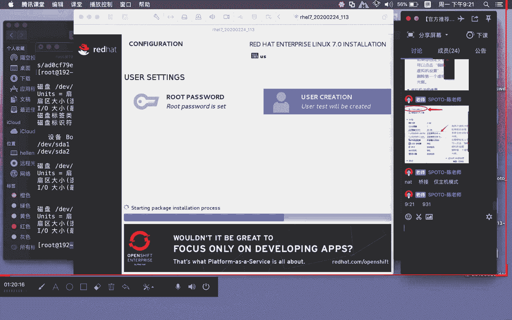

# Linux基础课程（RHCSA）简简单单学会Linux入门教程 - P1：第一节课install-1 - 思博Linux关关 - BV1fv411j7RG

喂喂喂，大家能听到声音吗？大家能听到声音的话，在群里面打个一哦。好嘞。很开心啊，在这里呢给大家来讲这个基础班的课程啊。😊，刚才前面的光方老师已经对我做了一个基本的介绍。

所以呢大家应该对我有一个基本的一个认识。诶。那我们的这个基础课程的话呢，其实总共是有十节课的，10个晚上的一个时间哈。那么10个晚上的话，我们的基础课程到底能学到一些什么内容啊？

我们先给大家给看一个大概的一个什么学习的一个内容啊，我们来看一下啊。

这个就是我们在基础课程里面大家需要完成的一个内容啊，从123456到这个什么呢？20，总共有差不多20个什么呢专题。第一个部分的话是今天晚上我们要讲的系统安装，然后VI的一个使用介绍。呃。

VI使用介绍它这个主要介绍什么呢？就是我们怎么样在linux下面啊做文本编辑啊，linux的一些基础命令啊，我们在周四晚上还有一节公开课啊，那么周四晚上公开课的话，是给大家讲一个什么呢？好运命令。

那么好运命令跟这个基础命令呢有所不同。到时候大家如果有时间周四晚上呢也可以去听一听啊，周四晚上的一个基术公开课。然后SH服linux啊在进行这个远程管理连接的时候啊，一般都是用什么？都是通过这个SH啊。

你如果这个东西不会的话呢，后面的工作是很难开展的。那么相对于前面这个系统安装完，后面呢你可能就要在系统上面呢进行什么相应的软件以及业务应用程序的一些部署。那么第五个部分就讲这个软件和包的一个管理。

然后用户和权限。那么第六个部分啊，这个是基础课。这里面的一个什么呢？最核心最基础最重要的一个内容。就是说你学lininux。首先第一个你得装系统，这个是大家入门的第一个要求，你得有一个系统。

后面才有办法学习。然后这个东西完了到后面这个用户和权限，是贯穿从提基础到提升，甚至到高阶啊，我们这个用户和权限都是会被用到的一个什么的最重要的一个基础核心知识点啊，你如果这个东西不能理解的话呢。

那你可能后面学起来就会比较困难一点。所以有一些知识点啊，大家可以不妨去找我们的这个公告老师或者帮其他的老师要一份呢早先的一些课程录屏，你可以先看啊。

比如说今天晚上我要上安装的okK你可以先看一下安装的啊，明天晚上我要上VI的，你可以先看一下VI的啊，特别是刚入门的同学啊，你们自己在学起来啊，因为你很多东西都没有接触过，比较陌生。

第一次听啊会比较吃力一点啊，特别是这样的一个情况。所以你们可以事先先预习一下看一下相关的文档和资料。这样子在第一次听的时候呢啊我们上课直播这种互动过程你会听起来会更舒服一点，就接受消化起来会更好啊。

然后这个用户和权限。接下来就关于用户的虚度和序部分呢以及文件系统磁盘管理，这个主要讲什么磁盘怎么分区格式化啊，然后相应的还有一个特殊权限然后其他这些都是属于什么小的一些知识点啊。

还有一个什么阿帕奇服务逻辑卷管理急救模式啊，这下面的话这几个服务相对来说比较大啊，阿帕奇服务教你大家在linux下面怎么去搭一个web服务器啊，你要搭一个网站，首先你得有一个web服务啊b服务完了之后。

你相应的这个网站代码才能往上面去放啊逻辑卷管理的话呢，是基于前面这个磁盘管理的一个什么提升，我们做这个格式化管理的话，你可能。只是一个裸盘的形式啊，没有办法做到一个相对比较智能一点的啊。

当你这个磁盘空间不够用的情况下，我可能需要对它重新格式化，你才能够把它扩大。但是有了逻辑卷这种方式的话，你就不需要去做我们刚才这种重新格式化，然后再做扩大。

有逻辑券就可以直接在这个基础上去扩大你现有的这个分区啊，使用起来比较方便。那么急救模式是对整个系统的一个理解的一个什么呢提升啊，就是说你做到这一定程度了，当你的系统出现问题啊。

如果说这个重系统应用上面的东西非常重要。我不希望呢把整个系统重装，那我希望能够修复系统重新投入使用，那你就需要去懂的什么急救模式，比如说在急救模式当中，我们会给大家讲到了一些案例，比如说密码破解啊。

然后某一个包安装缺失，我要怎么样通过急救模式，然把它什么恢复过来，包括这个什么呢？不可分区里面的这个内容被它删除。啊，就整个不得分区域的内容被删除之后，我们怎么样通过急救模式来进行什么呢？恢复。

以及还有其他的一些什么呢？急救模式的经典案例来带呃那个分享出来给大家groundable是周期性任务啊，然后基础入门小测的话呢，是有一个专门的针对基础课程的一个什么呢？小测试啊。

那么在整个课程结束之后呢，我们会把这个什么呢？基础入门的一个什么呢测试的一个题目发给大家。同时这个题目不是说只是让你填空大家需要在之前学过的东西啊，我发给你虚拟机在这个虚拟机的这基础上呢。

在这个虚拟机里面完成相应的什么呢？题目的一个要求，是要求你做什么呢？相应的一个实验的啊，要在指定的虚拟机上面去做啊，这个呢我们做这样的一个设计啊，也是跟我们对应的这个红帽整体的一个考试。

它的一个制度啊做一个对接啊，比如说你如果要去考那个IHCE的考试。人家他那个考。CE考试是要考一整天的早上半天下午半天啊，都是在什么呢？实体机啊，物理机上面装linux系统啊给你题目。然后你要在什么呢？

实体的这个物理机器服务器上面呢去完成什么呢？相应的一个操作，不是给你一张试卷，然后你在上面填写。不是的啊，它是要实打实的让你什么把这个东西操作出来配置出来啊。

所以呢linux啊有的同学会觉得这个东西困难啊，这确实比起我们相应的很多国内这种呃机器IT类的这种认证考试笔试这种方式啊，它这种的话是相对会有一些难度啊，要求你这个什么呢？动手能力要强啊。

那么通过率有多少，我爱猫咪哈，我们目前有一个专门的一个考试群啊，就IHC的一个考试群。以当然如果有兴趣想要去上这个参加这个认证的话，可以回头找班主任老师去问一问啊。通过率的话还还可以挺可观的。

因为我们也有专门的这个什么呢题库以及考试环境啊，所以这一部分的东西啊呃相对有保障。红帽纸认证怎么分级啊，我刚才讲的这个东西，大家问了，我就干脆就说一点嘛。红帽纸认证的话呢，首先他去考，一般从HCE考。

但其实考HCE的话，他有分两个，早上考的叫什么呢？HCSA啊，下午考的叫什么呢？HCE。啊。HCE。啊，是本地网络不能连工啊哈。那么IHCSA的话是红贸认证系统管理员。ICE的话是虹贸认证什么呢？

工程师。然后HC已通过，大家可以去考IHCA。HCE啊前面的这个HCE的话呢，就相当于大家考网络的什么呢？CCNP啊HCA的话呢，就相当于大家考网络的什么呢？CCIE啊HCA它的全称是红茂认证，什么呢？

架构师啊，这个CE的难度相对会比这个CA呢来的简单一点。CA呢不单是时间内容，还有整个考试的难度啊都会比较大呃，考试费用也会比较高一点啊，这一部分的话有兴趣，回头可以找那个班主任老师啊。

我们的那个宋老师，他们几个呢可以去聊一聊哈。啊，我们先来今天晚上的第一部分的一个内容系统安装。这里面有的同学可能已经听过或者看过相应的这个什么呢视频啊，我们的这个系统安装的话，呃。

目前给大家讲的这个内容主要还是基于什么呢？鸿贸企业版linux7HEL7啊，HEL7这个版本。

我们在去年的时候啊，应该说在本来是年初我们计划的把这个东西啊升级成什么呢HLL8，为什么呢？考试啊，他那个升级跟更换的这个什么呢？应该在4月份的时候啊，本来是要终止IHCE考试的这个期的考试了。

要开始什么呢？鸿贸企业榜八的一个考试了。但是因为什么呢？中国疫区啊，中国的一个什么呢？这个非冠这个什么肺炎病毒这个问题嘛，所以导致什么呢？整个考试的时间往后延了啊，本来是4月份那现在可以延到什么呢？

7月份，所以我们根据这样的一个情况呢，上课的一个这个内容啊，也做了稍微的一个调整。就是我们这一期上课还是用什么呢？鸿贸企业榜7的。但在这中间给大家讲的时候呢，会穿插给大家讲一些什么呢？

鸿贸企业8的一个内容。所以我们今天的这个系统安装，会教大家怎么去完成什么呢？HL7的安装，同时也会给大家介绍什么呢？IE8的一个安装那我们回头布置的一个作业。在这个地方，我们整个PPT里头有一个作业。

就是说用虚拟机啊来完成IHL7和HE81个系统的一个安装啊，也可以用这个什么呢来安装COS7的啊，所以这是我们今天讲完安装之后哈，大家需要去完成的一个什么呢？内容只能一级一级考嘛？可以直接考高级吗？哎。

延环不行啊，你还真的只能是一级一级的往上爬。这人家有规定啊，你IHC没过考不了HC。好嘞，我们来看一下系统安装部分啊，大家可能在做这个linux之前哈，先要对这个linux呢有一个什么呢？

直观的一个了解啊，我不知道大家在上这个基础课程之前，有没有同学接触过linux安装过linux啊，甚至说已经在从事相关的这个什么呢？linux的一个工作呢？啊各位同学可以在群里面哈。

你们如果说有接触过安装过，你可以在群里面打个2，那我大概知道一下目前我们这个班级里面有多少个同学有了解过这个linux啊，有安装过。又安装考试环境的虚拟机嘛，像什么instruct。对啊。

beyond没错。呃，我们如果去考那个HCE考试的话，它有一个模拟考试的一个虚拟机环境啊，那个虚拟机比较大啊，所以你要先把那个东西装好，然后才有办法去完成这个相应的安装啊。

然后在这上面去做相应的这个什么模拟练习。大学学过lininux，不过跟这个完全不一样，是搞示波器的啊，那你那个思波器我估计是不是搞嵌入式的？啊，我看一下哈，有挺多同学的哈，个别同学个别同学。呃。

我们今天晚上上课的这里面二几个学呃几个同学里头的话，应该有七八个人是有用过linux。啊，没关系。那我们在用这个linux之前哈，我们先给大家介绍几个linux的版本啊。

首先它这个linux啊是由这个芬兰的赫尔新机大学这个linux这个人呢来进行完整的一个什么呢？发布的。啊，它应该说是内核这一部分东西啊，是由这个人来进行什么呢？啊进行整理发布的。那么在更早之前。

在linux的前身啊是unix诞生的时间会更早unux诞生的时间在1969年的时候呢，其实就已经出现。那么linux正式出来的话呢，应该是在什么呢？1991年这个时间。那我们后面啊在系统当中。

比如说像那个密码文件ED这个密码文件。HADOW。这个密码文件那里面呢有一个什么呢？关于密码过期时间，那里头他给的这个时间，就是从1970年1月1号开始算起到现在。比如说我们设置这个账号。

它的过期时间是什么？比如一个月后，那么他给他标记出来的时候呢，里面的那个时间啊，就是从1970年1月1号开始到那个时间点里面有总共多少天啊，就是说在这里面啊有一些什么呢痕迹啊。

我们可以让他知道说哎我这个时间是跟这个什么linux它的一个历史是有关系的。这是linux这个人啊，大家只要记住这个linux这个人年龄也不大啊，四五十岁好像。呃，芬兰赫尔辛基大学里面发布的。

所以啊我们在用这个就更早之前，他们unix，因为相对来说对于硬件的一些要求啊会比较高。所以很多时候呢我们并没有办法接触到这个东西，有点断断续续是吧？大家稍等一下哈，我把网络。给他调整一下哈。

听者不连挂是吧？好嘞，大家稍等一下啊。啊，我切了我切换了一个网络啊，大家现在可以再看一看网络会不会好一点啊。就我们刚才说啊这个unux啊，它在使用的过程当中，最开始的时候呢。

对硬件的要求以及在unux上面啊，相应的这个应用体验啊相关的应用程序啊，它其实并不是特别好啊，你们看以前早先用那个windows的时候，你要在以前那个windows95啊或者说更早之前的版本。

想要在这个windows平台或系统上面呢去完成相应的一些这种文本的一些编辑啊，其实是非常困难的一些事情。那么unix呢可能会比windows那会呢还要来的更糟糕。比如说相关的用户体验。

或者说你要非常专业的人才有办法去在上面做一些什么相关的一些操作。那么到linux之后呢，哎首先在安装上面对硬件的要求啊，它变得什么呢？不高啊。

原来ux可能要什么呢小型机啊或者什么之类的这种那么linux的话叉86平台它就可以装。所以呢整体啊在使用上面的话。会变得什么呢？非常的方便。也从也为这个因为这些原因啊。

所以呢linux呢也慢慢的什么呢被流行起来啊，然后很多的这种业务服务啊，都部署在我们这个什么呢linux服务器上面。我不知道大家有没有用过这个linux相关的这种服务器啊。如果说。

相同的这个一个装windows的，一个装lininux的这种两台服务器。你可能去看呃稳定性啊，lininux会比这个windows的来的会什么的更为强见一点。我们自己生产环境当中啊。

我就碰到过类似这种跑了34年45年这种服务器，就lininux服务器，基本上没出过什么问题啊，只要你没有什么太大的这种这个业务代码上面没有太多的问题，的话，基本上linux它就稳稳的跑，不会死啊。

很少出问题。发现那边扔一个角落里头，它自己就可以跑的。嗯，你不要给他断电或什么之类的就可以。啊，这是linux哈，它的一个什么呢？由来。那么在linux下面的话呢，有很多我们是对应的一些版本啊，我们。

今天给大家装的这个linux系统的话是H18。那么HL7，还有一个呢是H yellow8这两个系统，对吧？那么IH17是全称叫什么呢？红帽。

let hat enterpriselinux就鸿贸企业版linux7。啊，然后HE8就是鸿贸企业版linux是什么呢？8，那么这些都是属于什么呢？readhead这个系列的，就是什么红贸这个系列的。

那么红帽这个版本的话呢，并不是只有这个红帽七红帽八啊，红帽企业板7红帽企业板8。那么你再往前数，它有什么呢？H yellow6H yellow5H yellow3啊，然后再往前是什么呢？是。鸿贸9啊。

也就是说一开始它并不是叫红贸企业榜minux，而是叫什么呢？鸿贸6789，然后从红贸9就readhead9，以前没有企业版，就红贸9，然后跳就套跳到那里红贸企业榜3啊，就红贸企业榜三的时候开始呢。

慢慢用这个什么呢企业榜这种方式来进行什么的定义命名。我们的这个H18是在去年2019年。2019年的这个什么呢？呃，5月份。正式什么呢？发版出来的。但在2019年5月份这个发版之前，它的这个什么呢？

测试版其实就已经在什么呢？实用里面了啊，基本上你看我们是从2019年5月份正式发版，然后经过一年左右的时间。那对应的这个低版本的，它那个什么呢？相关的考试认证教学一般都会被停。

那么今年因为这个什么中国这个病毒的问题。所以呢在中国区这边的话，它整个一个考试的话是往后延啊，但整体的一个时间和节奏基本上都是这样，差不多在3到呃3年左右的时间的话，一般都会更新一个什么呢？版本出来。

比如说HL82019年5月份出来。那么可能到下一次出HL9的时候呢，它的这个版本就会在差不多20222023这样的一个时间就会出现一个什么呢？啊，我们的这个HL9的这个最新的一个版本。

那么在这个红红帽这个版本里头的话，它是属于这种商业化性质比较浓的一个什么呢？红帽企业版linux啊红帽版的一个linux。啊就是说它这种东西虽然是开源的，但是如果你想要用它官方的一些支持的话呢。

你是要付钱的啊，对于我们在学习和应用啊，你用红帽版，其实并不会影响我们后续的一个什么呢开展。但在业务里头的话，如果你是属于一些这个相对正规啊，那我们这边的这个什么呢服务器这种费用啊。

可能就因为你用这个红帽版需要做一定的什么呢费用收费啊，在这个地方的话，你去装这个什么呢？AWS上面的。就你如果造AWS这个云。亚马逊云这个上面啊去装这个一个linux系统。

如果你的操作系统版本选的是红贸企业版linux系统啊，那你这个费用呢就单单这个云服务器，它的这个费用呢会比你选择什么呢？sOS下面的这个版本呢会什么呢？会贵一点贵的一个费用呢就产生在什么呢？

操作系统的这个什么呢？费用上面。那么sOS的话，它是一个什么呢？社区版本啊，它是一个社区版本，这两个东西啊基本上是等同的。就是说你把业务放在红帽上面能跑，你把它移过来放到什么呢？snoOS上面去跑。

那么它也能够什么呢？跑得通。你把sOS上面跑的东西，把它移到什么呢？红贸企业版上面东西去跑，它也能够跑得通。就其中的一个他们两者之间的一个关系呢？比如说这个lethead它出一个红贸企业7版本。

那么sOS它也会出一个什么sOS7。他其实在做这个神noS7这个系统的时候，就是参照什么呢？红贸企业版上面什么对应的这些软件包啊，它的版本号，然后一个一个的干嘛编译构建过来的。啊，所以呢。我们刚才说啊。

你业务两个系统之间进行切换和迁理是不会有什么影响的啊，这是CnoOS。但是在费用上面的话，因为一个是什么呢？商业性质的，一个是什么呢？啊，这种社区性质的。所以呢我们在业务当中。

我们一般可能会用COS还会更多一点啊，用户帽子相对会少一点。那么在业务实际你们自己在开展过程当中啊，如果你现在用COS我是很O的啊，如果你用lethead啊，也是没有问题的啊，也是没有问题。

只不过呢它不会给你官方支持。除非你付费的，人家才会给你官方支持像windows大家如果在实际的一个业务应用里面的话也是一样的。比如说你这个windows，你如果没有付费的话，你想要做升级更新。

其实官方的这种升级更新的支持啊，你是得得不到的对不对啊，得不到的。后再往下啊，在lethead和OS的话，其实还有一个什么呢？社区白老鼠版啊，小白鼠版就F一DRA这个东西版那么这个版的话呢。

跟let他们之间的关系是什么样的一个关系呢？就是说很多一些新功能啊，它一般都会在什么呢？这个版本上面呢进行什么呢验证测试啊，如果中间有问题，大家可能会把这些bug提交到官方去官方收到这些提交。😊。

他会对它进行一个什么呢？修复调整啊，然后也会看啊，整体的一个什么呢受欢迎程度。比如说我们新做这个什么呢自动化运维asible这个软件ANSIBLE这个东西哈，现在慢慢的这些应用软件啊。

大家可能都要了解啊。那么这些东西放在这个否t塔上面用的怎么样啊，会不会稳定啊，有没有重大bug啊。如果说这些东西在否t当中验证测试啊，使用没有太大问题的话呢，那么这些应用软件有可能就会被它集中到什么呢？

正式的红包企业版linux系统上面呢来进行什么呢？发布啊，就是说哎这个东西是经过社区验证测试使用的。大家什么呃是没有太大问题的，业务当中是可以进行投入使用的啊。

然后呢才会拿出来给这个东西呢去放到这个什么呢？正式的readdhead企业版上面去用。所以我们在使用的过程当中哈，如果说as是不是用python写的？对我爱猫咪。是的啊。

它就是用这个python写的啊啊，我们在呃这个提升课程里面，我们会给大家讲到python。那么在高阶课程里面也会给大家拍讲python。但在基础课程里面的话。

因为我们现在目前还是这个基础课程主要侧重入门部分呢。所以我们在基础课程里面还没有给大家去介绍这个什么呢？python这一块的内容啊。那我们刚才说这个pho啊，就是属于这种什么呢？小白鼠验证测试。

这种什么呢？啊这种阶段啊，经过他这种验证测试，那你就可以什么呢？投入到他的这个官方3月的这个系统上面去。那从这个角度来看的话，大家其实也可以去做一个什么呢？呃使用验证。

就是说我想要知道未来红贸企业版linux会把哪一些软件集成发布呢？那你也可以去关注否la里面，它到底有哪些新的东西啊，在这个上面给大家去什么呢？验证测试啊，你通过它也可以什么？

大概的预测出后期未来的这个什么呢？红贸企业版版本会发布哪些东西。就会有一个什么呢？大概的一个范围啊，会有一个大概的一个范围。这是readd hatcentOS和fo。那么这一个分支啊，它的这个什么呢？

对应的包后缀啊都以什么呢？点RPM这种形式的。啊，就是说我们刚才给大家介绍了这三种，一个叫let hat啊，一个叫sOS，还有一个叫什么F1。BORA那么这种啊，他们的这里面的包。

比如说我们在windows下面，大家想要去装一个应用软件，你们一般都会到平台网站上面去下载这个什么呢？点EXE文件哦，这个是windows下面想要装一个软件，它要下载的文件，那把EX一文件下载下来。

然后你双击就可以进行安装，对吧？那如果是红帽下面的话，我们可能就需要用这个什么点RPM的这种包啊，拿来做安装。但是呢它的安装方式哈，就不像windows一样，直接双击就可以安装啊。

我们需要通过命令来完成安装啊，那除了that ahead for这个那么以这种点RPM作为什么呢？啊包后缀的还有哪些啊像这个什么呢let flaglet flag就是红旗linux操作系统。

当然如果说有兴趣可以到什么呢？红旗的官网上面去下载一个啊你这个东西载完去安装啊，回头出来这个界面就跟windows一样的但其实它的一个什么谷子里面啊它是一个linux，只不过。他的皮肤做的比较像什么呢？

windows而已啊，他他骨子里面它还是一个什么呢？linux这个re flag是一个什么呢？国产的linux啊，国产的linux。那么除了这种呃RPM包分支的这个linux系统。

我们还有一个是以包对什么呢？包的后缀是叫DB的。这种分支的什么呢？linux操作系统。那么这种分支的linux操作系统的话呢，有两个比较出名的。呃，这个linux操作系统一个叫什么呢？

友邦图UBUNTU还有一个叫什么呢？DEBIAN迪b啊，这两个那么友邦图和这个deb他们俩都差不多啊，迪b呢。一般是像这个友邦图，它的这个用户的一个体验会做的比较好。我们讲这个lininux。

大家可能更多的是关注它在什么呢？服务器端这一块的一个什么的稳定性啊相关的东西啊，觉得这个东西很神秘。然后服务器它使源起来呢会非常的稳定。啊，所以大部分大家都觉得lininux只能用来做服务器。

那其实你错了。那很多像我自己开发的一些同事啊，他们也有把他们的自己的这个操作系统，就是说日常办公的这个笔记本上面，他们也把它装成什么有班图。因为有邦图这个linux呢对于这个什么呢？

用户的这个体验相对是比较好的。哎，对，这个mountins讲到这个有邦图旧命界面比较友好。对，因为它这个做的确实也比较漂亮，就比起这个什么呢？红帽linux cOSlinux它的这个界面做的比较酷炫啊。

同时哈也很重要的一点，就是它对于这种什么呢？PC。笔记本啊，像这种什么呢？我们日常用的这种什么呢？办公电脑，它的这个什么呢？硬件支持用户体验做的比较好啊，我们刚才说啊。

你如果说想要在红帽下面呃装这个一个应用软件啊，给你一个阿片包，你要去双击安装，这个不行，它做不了啊。但是如果你在有帮图下面的话啊，最新的这个版本它是可以进行这个什么呢？相应的这种简单操作。

它就可以完成什么呢？对应包的一个安装就有一点类似像什么windows那种感觉啊，同时他对硬件的一个支持呢也做的比较好啊。如果大家现在今天晚上上完课。

想要在你的这个笔记本上面去装一个linux系统啊我可能哈一开始我不会建议大家在裸机上面，就你刚刚开始学，我不建议大家就把你的这个笔记本装成一个linux操作系统，我不建议哈为什么呢？就在于说像红帽啊。

这种linux操作系统。它对这种笔记本相关的硬件支持可能不是那么友好。比如说你的无线。网卡的一个驱动，它可能驱不起来啊，它认不到无线网卡，就导致你的无线网卡可能用不了。甚至在安装的过程当中。

你的这个什么呢？硬盘它就认不了。那你硬盘认不了的话，你根本就不想根本就没有办法把这个系统呢装在我们的这个什么呢lininux上面。但如果是有邦图的话，像刚才我所描述的这种问题啊。

基本上在友邦图这个系统安装过程当中啊，基本上都是不会碰到的啊。我以前用那种比较老的笔记本，用这个新的linux系统去装，当时就碰到这种情况，或者是用这个旧的linux系统装在新的这个硬件上面。

比如说刚出了一款新的这个什么呢笔记本，然后你把它买过来，想要用一个相对旧一点的linux装在这个新的笔记本上面。那么可能这种什么呢？硬件的一些驱动啊，就会变得什么呢？比较糟糕。

那大家现在刚刚开始学我们的一个建议啊，大家都是什么呢？先在你的windows笔记本上面，或者你自己台式机上面啊，去完成什么呢？完成虚拟机的一个什么呢安装。第一次学在虚拟机上面安装，如果出现问题。

我大不了把它删了，我重装。是不是并不会影响到你整个系统的一些什么呢？相应数据的这种呃整理的，或者说其他的一些7788驱动的一些问题。啊，我们先把东西跟熟悉起来。

然后再去慢慢什么接触说我要在真机上面去装这个linux系统。我自己原来那笔记本一个笔记本上面我就装了4个操作系统，一个是win10的操作系统。还有一个是友邦图的UBUNTU啊，16。04版本的。

还有一个就是HE6啊，还有一个是H yellow7装了4个这样的一个什么操作系统，就就是真机上面装的啊，但是呢你装这么多东西。如果说想要切到这个windows去的话，你需要在现有的系统上面重启。

然后切到另呃windows下面去啊，想要切到其他地方去的话，你也要把它重启，然后进入另外一个操作系统。在启动菜单里面才可以进行选择。那如果是我们做这个虚拟机软件的话呢，那我可能只要把这个系统开起来。

然后把虚拟机揽件开起来啊。我们今天呢会给大家运到的一个是叫什么呢weware啊。因为也有同学建议说，哎老师能不能不用这个什么呢visel box啊，大家如果说装这个VIRTUAL。

就是它虚拟化软件有很多种ware是大家应该是比较怨经常比较怨的这个啊常用的一种。那visel box的话呢相对来说可能会用的什么少一点。但是如果你在装ware想要装lin可能装不上。

那你也可以试一下vis box啊，visel box不行，那你自试一下这个ware因这两种都可以完成什么呢？我们这个linux系统的一个安装。对visel box相对来说感觉会比较什么呢？小巧一点啊。

相关的这种下载以及安装都比较清亮一点啊，但是对大家整个虚拟机的安装是一点影响都没有，它完完全全也可以像visel box一样的，把你这个什么呢？linux系统给它装起来。好。

这是我们刚才给大家介绍的几个什么呢？两个分支，一个是什么呢？letheadRPM包后缀这种分支的linux系统。还有一种是DB包后缀这个什么呢？

友邦图db这个分支的linux操作系统那么除了这些操作系统，也有一些其他的操作系统，大家可能也需要去做一下关注啊，一般也是我们国产的下面这里列出来什么中软中标共创新华华为啊然后这个open书的话。

一般是国外地区会用的比较多一点啊，然后还有这边的这个什么呢l flin还有 mainware这些linux操作系统啊，大家都可以什么呢去搜一搜看一看但这些ux操作系统话，基本都是什么呢？

红帽这个系列友邦图和b这种系列的话，这两种是比较出名的啊，其他的基本上都是属于跟红帽类似的啊，都是在红帽这个基础上然后去做的一个什么ux操作系统比较有意思的一个ux操作系统。

就是这个LF那么这个LF的话呢。需要大家从头啊构建一个什么呢？属于你自个的一个linux操系统。那这一个部分的话，可能大家在做的过程当中啊，需要有一定的什么耐心，也有一定的什么调试能力啊。

如果你刚才开始学这个东西做起来会比较困难一点啊，因为你在整个linux系统构建的过程当中，相应的包那么多，你要一个一个的把它给搭建出来，然后把它做成一个linux系统啊，确实是比较耗时间的啊。

先不说这个你能不能做得出来啊，但是里面因为我们整个一个系统，它装出来这个包啊是非常多的。所以你会非常折腾你啊会非常折腾你。那我们呢可以先不用去管这些复杂一点。

我们呢最重要的一个目标就是先把我们的这个什么呢linux系统，虎贸企业把linux系统把它给我装起来。啊，这个是刚才给大家介绍的lininux版本部分的。那么在这个包的管理的机制上面啊。

我们该分支按这个什么呢？IPM包和DEB包这两种分支这种形式区分的话呢，哎有这两种类型的，一个是国贸系列的，一种是友邦图系列。那如果说按包的管理的这个什么呢？呃使用的方式技术来进行区分的话呢。

我们会把它分成什么呢？三种啊，一种是用YUM一种呢是叫什么呢？APD减get啊，还有一种的话是YST。这三种包的管理机制。那么这三种包的管理机制，它有什么？为什么会给大家介绍说这个包的管理机制非常关键？

在linux下面，大家如果说想要去装一个应用程序，那么他在装这个应用程序的时候，可能只要装一个，比如是A点BM这个包。但是在装这个A点RBM这个包的时候呢，啊它可能会因为依赖于其他包。

它会提示说哎这个包要要求你什么呢？先安装另外一个包。如果你这个时候没有运这个什么呢包，比如说YUM这种方式来对刚才的这个包进行安装。那么刚才这种依赖有可能就会什么呢？一依赖22依赖33依赖4。

这样子一直依赖下去。那你要手动去解决这种依赖关系的话，会非常的麻烦。呃，工作的一个效率啊，基本上会大打折扣。那有了这种包的管理机制之后，我再进行安装，我就运这个什么呢？YUM这种方式进行安装。

那我装的时候，我只要知道我要装什么东西。你刚才是装A点RBM对吧？OK我就让insstoreA点RBM，然后就可以把这个包给它装起来。这中间涉及到的依赖的其他包，它会在安装的过程当中自动帮你去解决掉。

哎，所以我们在这里呢就给大家去分成了三个不同的包的管理机制。那么他们的原理基本上都属于这种类似的这种效果。就是包的一代在这个包管理机制当中，它会把你什么呢？自动解决，不需要你人工手动的方式去处理。

所以对于整体的一个什么呢？业务应用包的这种安装啊，因为他们的这个使用变得什么呢？非常的快捷方便。啊，不过呢。对，又设置样源才能自动解决。没错呃，如果我们在这里哈，因为在第五个章节部分讲这个什么呢？

包的管理机制部分的时候呢，我们还会呃针对这一部分的知识点给大家具体展开。所以现在目前呢大家可以先了解。等到后面的时候呢，我们再针对这一部分的内容呢做具体的一个什么呢讲解哈。

只不过在这个地方大家可能需要注意的一个东西，就是说HL7。啊，运的是样。那么到了H18。到了H18啊，它也可以运样，但是这个样变成了只是一个什么呢？链接。实际它底端用的是什么？叫DNF。啊。

比如说到我IH18，它这个地方就不叫样，它叫什么呢？它叫DNF就。里头啊底层实际上面用的是叫DNF的啊，通过DNF这个东西来解决包的这个什么呢依赖关系的这种安装啊，它不叫样啊。

样的话呢是一个呃国外的一个人啊技术人啊开发的。但是这个人的话呢在前几年的时候已经是因为车祸啊不小心啊这个意外去世。所以目前啊这个样的一个更新和维护啊，是处于什么停滞状态啊DNF部分的话呢。

这个引入啊是对样的一个什么呢更强大的一个升级啊，所以呢在HL8部分的话，现在用这个DNF来替换了这个什么呢？YUM但是在HL8下面呢样的相关命令你也可以运啊，只不过呢这一部分的命令在使用的过程当中啊。

其实都是快捷链接到到这个DNF去了啊，实际你在用这个YUM的时候，其实都是在用什么呢？DNF啊，这个是HL7和HL8不一样的一个地方啊，我们。在前面的一个公开课里面的话呢。啊，我们的linux唐老师。

啊，前面公开课里面哈呃我们的这个唐老师有专门针对这个DNF部分哈，有给大家做过一个章节，一个什么呢介绍。所以这一部分东西哈，大家如果说想要知道的更细的话呢，也可以去找我们的这个什么呢？班主任老师啊。

找我们的关关老师那边去要一下啊。关于唐老师在应该是在上一周啊，DNF这一块的一个什么呢？公开课的一个内容的一个技术介绍啊，大家可以去了解啊，可以先听一听啊，可以先听一听。😊，啊。

然后还有一个是YSTYST的话，大家也可以看哈，这里有一个什么呢RPM。那么它包管理也是RPM，只不过它这个包运的这个什么呢？名字有所不同啊，这个两个的话呢实现的效果都是一样啊。

但是它所使用的这个什么呢代码逻辑可能会有所不同啊，这个是在open书上面所所用到的。啊，这个部分的一个介绍的话，就版本的这个介绍。大家也可以去看一下，这是文字的一个描述啊，文字的一个描述哈。好嘞。

那我们来看一下硬件的这个什么相关的一个安装。呃，linux啊大家想要去安装，如果你是装H yellow7啊，它的这个硬件要求相对来说不高。但如果你是装H yellow8，呃。

我们这几天也有自己呢手动去装啊，因为之前有用HL8相关的一些测试啊，做相关的一些实验嘛。我发现呢如果你是装H yellow8内存得有2G啊。如果说你这个内存没有2G的话，回头抓完进入到系统里面特别卡。

但对于IGL的7来讲的话，它不需要一般跑个一进内存，它基本上就OK了。那我们在这里面的安装都推荐大家用什么呢？光盘的方式进行安装哈。你看我们这里介绍的方式还是挺多的。

但基本上现在目前呢可能现在目前大家掌握起来最好掌握的就是属于什么呢？光盘安装。那除了光盘安装，我们前面的几个部分的一个安装的话，大家也可以关注一下。应该这里面呢给大家介绍的是三种方式，一种是U盘。

一种是什么呢？网络。那么U盘比较简单哈啊，8我也是给G没感觉卡。哎呀，不on看来你那个硬件是比较好，我这边开这个一G的话，我就受不了了。后来我就把那个内存开到2G去。呃。

然后整个系统的话就变得非常的顺畅哈，这个大家可以看一下你们的这个硬件状况哈。好，然后U盘安装的话呢，像这边的话，它这里有挂号里面有写的是一个硬盘安装啊。U盘安装的话，你可以有两种方式，一种是什么呢？

一种是把U盘做成引导盘，然后把SO文件放在U盘里面。还有一种方式是把U盘做成什么呢？U盘光驱。啊，你们呢一般都是正常通过光盘进行引导，然后启动进入安装。那你如果你把U盘做成光驱的话呢。

我们在启动的时候去选择什么呢？U盘啊，U盘启动，那它也可以进入到这个什么呢？系统进行安装。那么网络安装这种方式的话，因为他要求的这个服务相应的东西啊，比较多。那你呢可能就没有办法去完成。

因为我们基础课程里面还没给大家讲这个什么呢？DNS这个是做什么呢？名称服务器的。域名啊。管域名的，大家在那个浏览器里面去访问一个域名。为什么你在这个DNS在这个浏览器里面输这个域名的时候。

能够找到对应的服务器，然后做请求应答。这中间就是因为什么呢？你在本地客户端指向了一台DNS服务器啊，当你在浏览器里头输入对应域名的时候呢，它会向DNS服务器请求哎，我这个域名解析到的是哪一个服务器IP。

然后你就可以跟这台服务器呢对应连接上啊，相应的这个数据就进进入一个什么的交互状态啊，相应的数据呢就可以返回过来给你在浏览器上面的展示出来。EHCP的话呢，是我们的这个什么呢？

动态IP地址分配的一个什么呢东西啊，我们这个部分的话呢，因为考试里面没有考，可能业务当中会有用啊，但基本上用的会比较少。啊，我们在早先的时候还有给大家去介绍这个DHCB那现在目前是没有介绍哈。

但这部分的话东西越来越比较好用。如如果你把这个DHCP给它搭好了，我们可以在DHCP就linux上面的这个DHCP服务器上面，你可以对什么呢？对应的机器，它的个mac地址跟IP啊做一个绑定。

可能大家都觉得网络上面你们学过啊，一般都是在什么呢？这个交换机或路由器上面去做什么呢？啊对应的这个什么的地址绑定，就类似这样的。但其实在lindowux上面，如果你会搭这个DHCP服务器。

我完全也可以在什么呢？DHCP服务器上面对对应的服务器啊，他们所分配的IP和这个物理地做一个绑定。好，NDP。这个是什么呢？时间服务器啊，比如说我们需要呢几台集群，一个集群里面有好几个节点服务器啊。

然后你要将这个每个节点他们的时间都统一起来啊，那你可以通过NTP时间服务器来进行这个时间的一个什么呢？统一规范好，TFTP。啊，TFTP的话呢，这个。你把那个前面那个T拿它拿掉，就剩一个什么呢？

FTB这个东西啊其实就跟FTB类似啊，你可以将那个数据放到TFTP里面啊，然后来进行什么呢？数据的一个共享。NFS。FTB。啊，HTTP啊，这些都是属于什么呢？leadux下面的最常用的一些服务。

那么这个部分在网络推广当中，这些服务都是用来什么呢？共享你的光盘内容的。啊，你要从网络推装，首先你要搭好这么多的服务，有两台机器，一台机器专门搭这个服务的。然后把光盘内容也放在这台服务器上面啊。

通过NFSFTP或HTTP啊，将这个什么呢啊对应的这个光盘内容共享出去。TFTPT是不是不用用户名和密码？对的啊不用啊，然后我们可以通过它呢设置成什么呢？网络启动。啊。

你的客户端这台机器想要装linux，对不对？OK好，然后呢你可以把这个东西啊设置成什么呢？从网络启动网卡启动啊，然后TFTB它是把什么呢？对应的启动信息放在这个TFTV服务器上面。

然后通过它啊在进行网络启动的时候呢，把数据推到它的这个客户端网卡上面去。然后那台机器它就启动起来了。NTP是必须的吗？可以不用啊可以不用。不一定要用哈不一定要用。就是说你要想要做规范一点话。

NTP是可以把它放进来。但DHCP这个是必须得有的。就是说我们在做这个东西的时候是，DHCPTFTP和。后面的这个NFSFFTB还是GDTB这个加斜杠的就其中一个拿来你就可以用了。

就是DNS和NDP不一定啊，这个不一。不是必须，那么其他的都是什么呢？必须的。啊，这个部分的话安装的话是比较复杂一点，所以大家可以先不愿去理它。那我们今天着重介绍的是什么呢？光盘安装。好嘞。讲到这里哈。

我们现在在进行安装之前哈，我要先给大家去强调一下几个问题啊。第一个哈是分区当啊这个安装过程当中的一个什么呢？分区问题。那么第一个是所谓的跟分区。一个呢是不可分区。还有一个呢是SWAK。sap交换分区。

这是三个最重要的，必须得做的三个分区。那么根分区是什么？照像你的这个呃。window装系统，你可以认为啊这个根分区就像C盘一样的东西啊，所有的文件系统相关的内容呢都是放在这个什么呢？跟分区下面的。

所以它必须得分。那我们在分的过程当中啊，有可能什么呢？会把所有的内容都分在根分区下面，除了后面这两个分区啊，那也有可能呢？只是把什么呢？部分内容放在这边，你做了这台lindux服务器。

它有可能是一个什么呢？web就装这个什么呢？阿帕奇服务，也有可能是用来装这个什么呢？数据库的。那么不管是web还是DB，他们都有一个自有的一个什么呢？数据目录。

那我们可能会把它的这个自有的一个数据目录呢把它定义出来。比如说我把它写成一个什么的daator。你把这个什么呢web服务器和这个DB的都放在这个目录下面。那你在安装的过程当中。

你也可以自定义一个什么类似这样的一个目录出来。那有的人他也会把什么呢？home分区，也会把这个什么呢？tamp分区把它做独立。但其实这一部分的话，你要不要独立完全根据你自己的一个需要去做啊。

当然你把这两个东西做出来的话，个人感觉哈是有一定的道理啊，怎么样的一个道理呢？就是说当我们在用这个根分区进行这个划分的时候，如果你把后me分区和tamp分区分出来。那假设。我们在业务使用当中哈。

你 home分区是专门放用户相关数据的一些这种目录的。啊，我们创建一个用户团，它对应的加目的就会放这个时候。放在这个什么呢？斜杠后下面。那假设某一个用户啊。

因为你这个不断产生的一些数据而导致整个什么呢home。他的一个日志相应的这个大小变得非常大。如果。这个后分区跟这个斜杠是在一个什么呢？分区里头的话呢，因为 home分区撑大就会导致整个跟系统呢撑大。

那会影响整个文件系统啊，那整个文件系统受影响你的操作系统就会出现异常啊，崩溃，不可逾越。那如果你把这个home做成一个独立分区的话呢，那你要死，也只是死在什么呢？home分区里头。

那么根分区其他部分的一个数据的话呢，它不会有影响啊。所以我们刚才说它有一定的道理，做独立分区，它有一定的道理。那还有一个是什么呢？t分区。那么这里面的这个t分区跟home分区的话呢。

其实在做的过程当中考虑的时候呢，也是类似的。因为t它基本上是放什么呢？临时一些数据的。那有一些这种应用代码，他们把这个日志呢也往这个什么呢t下面去放。那么有可能啊这个t里面存的这个数据呢也是变得非常大。

如果它独立分区，那么对根分区的这个影响，它也没有啊，但如果它是跟跟分区是一块的。那么你有可能就会出现什么呢？影响整个文件系统这样的一个什后果。所以你们如果要做独立分区，我其实也没有太大的意见。那。好。

那这是分区上面的一个情况哈，那分区的一个大小部分的话呢，像这个bot分区，因为bot分区的话，它主要是放什么呢？内核启动相关的文件。那么这一部分的文件它占略的一个能量其实是非常小的啊其实是非常小的。

如果说呃你给它分这个太大。空间就比较浪费了。所以我们自己在分这个，如果你自定义分分区的时候呢，一般我们给它分一个什么呢？300兆。到这个什么呢？500兆。其实是中间的一个容量基本上就OK了。

那么所有分区的话呢，我们在分的时候呢，呃相关的一些资料或教材啊，它一般都是建议呢分成什么呢？我们物理分区的什么呢？两呃物理内存的两倍。在物理内存的2倍。比如说我们现在做了一个虚拟机，对不对？好。

这个虚拟机打算给他一G的内存。那你这个sft分区，那么他在进行计划设计的时候，他可能就会给你什么呢？2G的这个什么呢大小。那么这个sft分区它的一个作用是什么呢？啊，它的作用是什么呢？

它的作用就是在当你的物理内存啊，就是操作系统在运行的过程当中，如果你的物理内存比较紧张的时候，会将什么呢？内存当中啊呃一些不活跃的数据啊。啊，把它什么呢？吐出来。吐出来之后呢就会放到什么呢？

我们的这个什么呢？sap分区里头啊，这个sap分区啊，它叫什么呢？交换分区啊，交换分区就是这么名字就是这么来的啊，把一些不活跃的数据临时放到我们的这个什么交换分区里面去。但其实这个分区啊。

它就是在什么呢？硬盘上面进行数据的一个存放。所以如果你的内存不够啊，就是说你的物理内存不够用的情况下，把相应的数据放到sap分区来。其实这个时候输出我们的整个IO的一个速度啊，可能会有一定什么呢？

下降啊，你东西吐出来。有这个什么呢？内存实实在在这个内存当中啊去放到这个什么呢sap分区去的话，那你肯定是什么呢？IO变慢的。如果内存选的是大于16G的，设置多少ap合适。

那个闷的起点啊，如果说我们自己在用一些大内存的这种服务的时候呢，呃我的个人建议就是看你这个服务对所有分区有没有要求啊，如果是像奥ic口这种服务的。呃，我知道哈你如果装这种奥t口数据库服务。

他们在用的过程当中啊，对于什么呢？交换分区是有一个什么呢？要两倍与物理内存的这样的一个要求啊他他必须得有。啊，但如果说像我们自己做日常的一些服务，我们可能这个什么呢？税有分居啊。他都不会去怨倒。

有的时候呢，你可能只要给他一个象征性的一个大小。基本上系统。都OK的啊，不会影响你整个操作系统的一个运行。呃，像我早先做那种嵌入式开发的时候，我们的那个整体的一个。这个一台小电脑，它的内存只有1G。啊。

它的内存只有物理内存只有1G啊啊，关键是什么呢？关键是我的这个盘很小，因为是它是一个小平板，我的那个盘呢只有16G。我的空间啊装好相关的应用之后，我其实空间是非常有限。那我要按照这个规则去分的话。

我其实要把什么呢？硬盘分出2G过来给这个sap分区，后来我就觉得没有这个必要啊，我后来sap呢呃做到比较。特别一点的话，我连所有分区我都不给他啊就碰到这种状况，系统照样可以运行啊。

当然你可以象征性的给他一点。比如说你这个一G硬盘不够用啊，那你可以呢给他什么呢？一G2G。觉得OK的情况下，你可以分少一点，不会影响啊，他sap能不能用到是完全有什么呢？

完全是由我们系统当中的一个参数内核参数来进行控制的啊，是在我们的这边，大家可以我们呢来打开一个系统，我们来给大家看一个东西啊。

我们现在讲了这么久，还没开始安装。不是哈不是啊，这不是虚拟内存啊，这有一点像什么呢？他其实就是一个硬盘，你知道吗？它就是一个硬盘。

你要是说它是一个虚拟内存的话，那我这速度IO应该是还可以的。但是它这种话速度IO根本没保障。

31。132，这是我做好的一台虚拟机哈，我现在连接进去一下哈。然后我在这边吼，刚才说fp它到底能用多少啊，要怎么用，它其实是有一个参数来进行控制的。那么这个参数的话叫什么呢？内核参数当中啊。

systemCDL减A有一个叫sevenist。S W。AP。啊，有一个就这个。啊。VMstep等于30。那么这个意思参数的一个意思代表的意义是什么呢？就是说如果你的物理内存啊使用量。

物理内存使用量超过70%的时候，我才会用到你的这个什么呢s的一个空间。但实际上面的话，你看我这我的sap啊，你看我这。这里有一个sap啊，我这边的话根本就没怨到他的sap都是0。

那实际上面我是有分sap的DF减H，大家可以去看我们这里有一个。啊，这里其实就可以看出来啊，它差不多大小是将近1G的一个什么呢？sap空间。但我其实在分物理内存的时候，这台虚拟机它物理内存是分了一G。

那sap空间的话，它分的是什么呢？啊，我这个物理内存的这个大小是2G啊，物理内存大小是2G，然后我sap的话，其实没分那么多，我应该是没有分那么多，你们也可以看我这里fordi有一个。

sapppper啊在这里，你看我的这个s的话才多少？968兆才968兆。没有物理内存的一个两倍，这种是按默认来进行系统安装分区的时候呢啊就是我没有手动去干预这几个分区的大小容量设置。

按系统它默认的一个设置，它就给我分出这样的一个情况。物理内存我是2G，然后它分出来sap空间是什么呢？将近1G一个空间。你这种的话，像刚才闷的起点呢，刚才讲到大于16G情况下啊，设置多少step合适呢？

呃，其实我们有碰到过类似的情况，比如说我们的这台服务器，它是一个什么呢？内存类型的这种服务器。比如这台服务器就是用来做这个什么呢？latedist。REDIF这个东西的。

那么lavies啊是很吃内存的啊，它就是依赖于内存这样提供对外服务的这样的一个服务。那我们的这台服务器啊，它的这个内存可能达到什么呢？32G。甚至更大64G都有可能啊，有一些像一些大互联网公司。

他们可能还会有什么将近100多G的这种服务器，专门用来跑这个什么的redister。那你说像这样的一个大内存的服务器哦，它的硬盘可能还没有它这个什么内存来的大啊，比如说你这个128G的这样的一个服务器。

它的这个硬盘可能只有什么呢？可能硬硬盘只有200G。那你如果按我们刚才潜规则所说的一个物理内存啊，128G要分出2倍的这个什么呢？呃s的空间来，那你这个空间根本就不够用。

所以我们没必要这样做啊，那么从实际的一个情况，他也确实是这样的一个情况啊啊，所以我们在院的时候，他虽然写的是物理内存的12到2。5倍。那么这一部分的话，大家可以什么呢？根据自己的一个情况去做一个调整。

分还是要分的啊，不分的话，那这个。太小气了啊，不分太小气了。然后文件系统的部分选择我们在I17下面默认的文件系统是叉F。那么以前鸿贸企业6，它这个默认文件系统的话是EXT4。啊。

这个文件系统如果你是windows的话呢，像。wins他们默认的这个文件系统应该是NTFS对吧？NDFS啊，更早以前的话是FAT32啊这些东西。好，然后呢我们在装完之后呢，需要大家去完成什么呢？

SElinux和IV labels的一个关闭。那我们要先完成这个安装，然后再回头呢安装完之后进入系统，然后我们来看一下。OK那我们现在呢就来进入这个安装哈，进入这个安装啊，我们。在安装的过程当中的话呢。

先把这个安装的提起来啊，然后呢课间稍微休息一下啊，那刚好呢可以让它安装完。安装完之后呢，我们就可以看一下啊，到底进入系统是一个什么样的一个状态。那我这边用的是什么呢？我用的是苹果电脑。

然后我这边用的是ramware function啊，大家如果是window系统的话呢啊你们可能用的是ramware。BMW AIE， when well workstation。啊，你可以用这个软件啊。

我这个苹果的话用的是ve well这个fashion啊，这两个东西的话基本上是类似的，没有太大的区别。啊，如果你觉得winware这个安装和设置下载都比较麻烦，你也可以用这个什么呢？

VRRTOALvisel box。这两个虚拟化软件都可以什么呢？安装对应的虚拟机。那我们现在呢就在这个下面呢去完成这个安装。那么在安装的时候呢，大家可以去选择什么呢？新建啊。

在这里我在这里呢有一个新建啊，如果你是windows的话呢，因为我这边没有windows的电脑，但是呢我给大家呢准备了一个这样的类似的文档。

啊，就是在windows上面的装好之后呢，它这里有一个什么呢？创建新的虚拟机，回头呢我会把这个文档发给大家啊，所以大家在做的过程当中哈要注意看一下啊。来，我们先来。做一个系统出来啊，在这里呢点击新建。

然后呢从光盘和印象中安装。呃，我们如果是windows部分的话呢，它不会有这样的一个提示哈，你这里呢就直接新建虚拟机向导了，直接新建虚拟机向导。然后在这个地方要选择什么呢？啊，光盘ISO镜像文件啊。

你们自己在用这个光盘镜像文件的时候呢，要注意。你的ISO文件放在哪里？嗯，我们要求大家呢是要完成IHL7。就是说这个课程啊，大家至少要装1个IHL7的一个什么呢？ISO呃。

这个大小的话差不多是接近于什么呢？34G这样的一个大小啊。HL7红帽企业版linuxHL7的一个版本。然后在这个地方哈选择选择完之后呢，比如说我这个ISO就放在这个D盘下面啊。

选完之后呢啊然后你可以看一下这里呢要要求你去设置这个什么呢？用户名账号密码。呃，他这里说你设置的这个用户名和账号密码的话呢，都是什么呢？设置类似的跟账号，就是说你在这里设置test普通用户。

那么我们对应的这个什么呢？跟账号，它这里有分两种账号，一种是普通用户。啊，一种是普通用户，还有一种是什么呢？root用户，也就是他这里讲到的跟账号。那么root用户就相当于什么超级管理员啊。

这个权限就非常大啊普通用户的话，权限就没有像这个什么呢超级管理员权限那么大啊，我们在这里呢就你自己可以设置一下啊，这个没关系，设完之后在这个地方你就可以设置你自己要装的这个虚拟机的名字叫什么啊。

所以它整个整个一个步骤就比较简单然后磁盘大小磁盘大小部分的话，你们在用的时候啊，大家可以进行什么呢？对应大小的一个调整啊，它这里写的是20G如果你空间觉得这个虚拟机要装很多东西啊。

回头你可以把它调大一点。只要你空间允许，资源够用。啊，如果觉得资源不够用，比较紧张，像我自己这边资源比较紧张啊，硬盘空间比较有限，那我可能会把它调到什么呢？8G1G啊，因为整个系统安装完之后呢。

它并不会占用太大的空间。所以大家不用担心。啊，你可以8G，整个系统也是可以装起来的啊，你10G也是OK的。20G它占略的空间还是那么大。然后点击下一步啊，然后在这个地方的话要自定义硬件哈。

那么这个自定义硬件的话呢，我们主要是去做一个什么呢？网络配置啊，大家要去做什么呢？网络配置。啊，我们一会儿呢会打开这个网络配置给大家看一下。那么创建后开启。虚拟机。又把这个挡这个原来默认它是勾的。啊。

我们大家如果没有把这个勾给去掉，就这里的勾可以去掉，要不然会自动安装下去。什么意思？因为大家在用这个V安装的时候，经常会碰到一种情况。

现在目前哈我现在用的这个是weware workstation12版本的啊，12PRO这个什么版本的？然后呢，他们这个版本的话呢会有一种情况啊，12版本以上呢也会有类似情况啊就是。你做的时候啊。

相应的这个东西如果不注意到。啊，你直接在这里点击这个完成。系统它会默认干嘛直接给你一口气自动化，把你安装好的那个操作系统。那你想要做自定义的一个linux系统的一个设置的话，你就做不了。

所以这个地方一定要注意把这个勾给我去掉。当然了，你如果说不想去做。里面的一些自定义的一些选项选择，想要一口气就是这样子完成，然后它自己自动去安装。那当然你这个勾就不要去掉了。如果你想要做自定义安装。

你要把这个勾给我去掉。那我们这边把这个勾去掉，然后去跑到这个什么呢自定义的硬件里面去做。那么这个自定义硬件里面我们主要是做什么呢？网络的一个配置。这个地方啊主要是做网络的配置。

那么这个网络配置的话呢呃默认的情况下，它这边呢会有一个网卡。那么这个网卡的话，它是一个什么呢？NAT模式。那么其实除了NAT模式，还有什么呢？桥接模式。这里面的这个网络大家一定要注意哈。

NAD模式调接模式，还有一个是什么呢？还有一个是我们的这个顶主机网络。这几个地方三种模式一定要注意。紧主机，这是最重要的哈。紧主机。你看我们这里啊，我现在这个。自定义硬件啊，我现在进去做这个网络配置啊。

你看我们这里啊，我把这个网络配置器，网络识配器这里去点击，然后选择右边这边它有这个三个最重要的自定义那个就不用管它了哈，自定义它其实就是对上面的重复啊，我们只要管前面的这三个调节模式。

NAT模式还有一个什么呢？警主机模式，这个部分的话大家能看得清楚吗？啊，这三个部分大家能看得清楚吗？啊，所谓的调接模式是什么意思啊？ok 好嘞。大家看得清楚哈，所谓的调接模式是什么意思？比如说我们这台。

你的笔记本啊装了这个虚拟化软件的这台笔记本，你是windows系统的，对不对啊？假设你的这个windows机器，它的这个IP是什么呢？191。168。1点什么呢？10，我假设是这样子。啊。

而且呢你是通过什么呢？无线上网。笔记本我们现在基本都无线上了，所以还会去接有线是吧？比较少就是了啊。好，我们假设这个是你的笔记本的一个什么呢？IP地址啊，就是桥接在这个网络上面的1个IP地址啊。

无线上网IP地址是192。1681。10。那么如果我用桥接方式，那么我们设置出来的，做出来这台linux啊，它的这个虚拟机哈。那么它的这个网卡IP地址也会跟你的这个什么呢？局域网的IP是一致的。啊。

就是也会在什么呢？1910668。1这个网段IP不是10，它可能是什么呢？11就类似这样子，反正就是1。叉这样的1个IP地址。跟你呢会是在同一个局域网当中，这就是所谓的什么呢？调接模式。

那么后面的这个NAT模式的话呢。那么NAT模式的话，它是一个什么呢？网络地址转换类似这样的一个东西啊，它这里就讲用于共享主机的IP地址。啊，那么它可能出来的IP地址就是什么呢？10。0啊，然后什么点2。

1类似这样每个机器它可能NAT的网段都会有所不同啊，反正就不是跟你在局域网里面的一个网段。但不管是桥接模式还是什么呢？NAT模式，我们都可以通过这两种模式干嘛呀，啊，虚拟机都可以访问我们的公网。

只要你的笔记本能上网。那么你用这两种模式，用两用这两种模式都可以什么呢？进行上网。那么第三种模式，它就不能上网了，就不能上公网，也就是所谓的什么呢？仅主机模式。但是你不要小看这个模式。像我自己本人。

我其实就很喜欢用这种模式。因为我经常需要给大家装好虚拟机，然后相关的一个实验都是在这个什么呢？虚拟机里面去完成，它虽然不能访问公网，但是它并不影响。数主机。

也就是你的笔记本电脑跟我们所装好的linux这台虚拟机之间的一个什么网络的连通啊，就是说你如果笔记本在这个局域网里面，你还有其他的一些笔记本你想要让其他的笔记本访问到这台虚拟机来的话。

你像刚才这种警主机模式的。那么它就访问不到。如果是调接模式的，另外一台笔记本是可以访问到你的这台虚拟机的啊。如果是NAT模式啊，它也访问不到啊，只有调节模式，它才可以啊。那么警主机模式啊。

我不管你有公网还是没公网我都不影响什么，都不影响你的笔记本，就是说你这台笔记本装有虚拟机软件的这台笔记本跟我的这台虚拟机的一个什么呢联通啊，我想要做任何实验。我这台笔记本拿到任何地方，我把虚拟机开起来。

我都可以连到虚拟机里面的这个什么呢警主机的这个网络。像我们现在我自己做的这台linux系统啊，我因为没有做的这台linux系统。呃，外面的这台192。16831。132，我的这个网段其实就是一个什么呢？

仅主机网络的一个网段。那么每个同学，你们自己家院的时候呢，你们的网段呢可能也会不一样啊，并不一定说你现在看到的我这里是31192。168。31网段，你就是192。168。31网段，不一定啊。

像刚才这个讲到桥接啊，大家看我刚才介绍啊，是192。168。1。因为大家家院网络基本上也都是192。168。1网段，对吧？所以呢你可能桥接的时候也会到这个什么呢点1网段去。

但也不一定说所有的人都是这样的一个情况，是不是啊，你可能你自己家里的网络这个桥接你们自己设置的时候，你把它网段设置了192。168。1啊，这个点2都有可能嘛，是不是啊，都有可能啊，所以并不一定是什么呢？

啊，一成不变啊，并不一定是一成不变的好，这个是什么呢？仅主机网络。

啊，我们可以去选择什么呢？调节模式，有一有没一种模式能让主机无法访问虚拟机。有没有一种模式能让主机无法访问虚拟，你可以把那个启动时连接，把它去掉就可以了。就把这个网卡给它去关掉啊，把这个网卡给它关掉。

网卡关掉的话，它就访问不到了。就是我们现在目前它这个做起来的时候呢，我们这个网卡网卡都是处于连接状态，所以都可以。你如果说想要让它不能连接，那当然是可以把网段网关掉，把上面的这个启动时连接这个部分。嗯。

把这启动是连接把它关掉，网卡关掉，它就访问不到啊。啊，这是网络部分的一个设置哈。那网络设置完成之后呢，我们就可以回到这个什么呢主界面来。好，如果你回到这个主界面。这个时候呢我们就会有两个什么呢？

虚拟关区。啊，一个虚拟光区是Vmail自动给你生成的。另外一个呢是我们自己刚才选择了ISO文件。大家注意看我们这个红色部分的提示。

呃，我这下午还特意给大家做了这么一个东西。

红色这一段提示哈有两个虚拟刚驱，如果按此设置啊，你点击开启此虚拟机，啊，就是说你现在做好了，如果你不做调整，你现在直接去点击前面的这个什么呢？绿色的这个箭头。

就如果你去点击这个。

啊，大家如果说去点击这个绿色的这个开启此虚拟机，那么你这个时候呢就会自动的安装下去，也是不会进入到任何的什么的自定义的操作界面去了。那如果说你不想什么呢？这种自动的安装下去，那你可以做一个调整。

把这个什么呢？第一个光驱。啊，如果想自定义安装，可以点击编辑虚拟机设置，删除第一个虚拟光驱啊，点击这里面的这个什么呢？编辑虚拟机设置部分啊，编辑虚拟机设置部分的话，就在那个什么呢绿色箭头下面一行啊。

然后呢我们进去进去之后呢，把第一个光驱呢，把它给我移除掉啊。大家如果说觉得第一个在做的这种东西的时候呢，网卡觉得不够用啊，你可以什么呢？想要配置多个IP的话，你可以配置什么呢？多个网卡啊。

你可以在这里面去添加啊，点击添加，然后就可以选择什么呢？对应的这个设备啊，这个都可以。然后完了之后呢呃选好对应设备，然后点击移除，然后按确定啊，保证呢你在进行安装的时候呢，只有一个光区哈。

等下在安装的时候，你可以感受一下两个东西啊，你可以装两个操作系统啊，一个是装这就是装两个HL7，一个是自动安装的啊，一个是什么的自定义安装的那两个东西你都可以感受一下啊，一个是有删的，一个是没有删的啊。

这个做的时候大家小心啊，就是。编呃做的时候呢。就要做的第一个调整。然后还有一个调整是什么呢？就虚拟机设置当中关于网络部分的一个什么呢？编辑好，大家去选择什么呢？左边点击你刚才所做的这个什么呢？虚拟机。

然后在编辑部分进入到什么呢？虚拟网络编辑器里面啊，会弹出这样的一个窗口，在这个地方，因为我们刚才做的是桥接。啊，所以我刚才呢也在做这个东西之前，我就说了我的环境是什么呢？无线网卡连接上网。

那么如果你是桥接。那你做出来这个IP。你对应的这个设备要调接到什么呢？无线网卡去。哦，我这里看到的是什么呢？AC3165。你们看到的不一定是这个设备，你们可能是其他设备啊，反正你就要选什么呢？

vi list。要选择什么呢？要选择无线wi list。这个关键词对应的网卡。这样子调接的时候，它才会调接到你的无线网卡去，你的虚拟机才有办法，什么呢？正常的分配到桥接之后的什么呢？

局域网IP如果你这里用的是。比如说因为你笔记本除了无线网卡，你还有什么呢？有线网卡对不对？好，你如果这个部分你这里选的是有线网卡，那你到时候分配出来的IP。只要有线网卡没接网线。

你虚拟机打死了都是不能上网的。啊，所以在这个细节部分大家要注意哈，因为有的同学这里面调接到他会做的是自动的方式。但是有的时候呢这个自动啊并没有办法自动的帮你调接到无线网卡去。所以我们可以什么呢？

手动的方式去什么呢？指定调接到什么呢？指定的设备去啊，这种方式是最正确的啊，这样方式是最正确的啊，这是大家在做安装的时候呢，需要注意的啊，就是wimail使用的过程当中啊。

需要注意的visel box的话呢，其实也是类似这样的一个情况啊。那这里呢就可以开启此虚拟机啊，开启此虚拟机的话，然后就可以进入什么呢？正常的一个安装。那我们现在把这个东西讲解完之后。

我们回到我们刚才的这个什么呢？呃苹果电脑这边来啊，苹果电脑这边的这个安装的话呢，就没有像window下面这个安装的做的这么麻烦啊。那我们这里面要做的一个东西的话呢，很简单，就从光盘里面选择。

选择一下哈，选择我们的这个什么呢？😊，ISO啊，我要选择的是H17。啊，我在这里边选择IH热览器，大家要先把ISO镜像事先拷贝到自己的笔记本电脑去啊啊，我这个是移动硬盘上面。所以呢我这里打开的时候。

他就直接到我这里来，我就可。因为之前选过他会记住，所以我就直接到这里来了。你如果说自己本地硬盘上面没有这个ISO文件的话，那你这个根本就找不到啊，一定要先把这个ISO镜像文件下载到本地来。

然后我现在点击这个什么呢？继续。啊，这里呢你看我这里也有快捷方式安装，我就不需要我就不想用这个什么呢快捷方式安装，所以我就把这个什么呢打勾给它去掉啊，我就不用了。但是在window下面的话。

它没有机会去掉这个什么呢？打勾啊，没有机会去掉这个打勾就。他那个是还是要让你设，但设完之后，我们可以到那个虚拟机里面去做什么的调整设置，然后可以不用让它进入什么这种快捷自动安装。然后我点击这个什么呢。

继续啊，这个传统BIOS。它这里硬盘用的是20G啊，我可以把它改一下，我不想用这么大，因为我这个空间不够用啊，这个是。HEL7，我把这个名字改一下哈。因为今天大家上的是113班，对不对啊？

20200224。是113班。2138那，我现在点击存储。

好，到这里的话，我就可以开始进行一些什么的配置的一些调整。啊，比如说我这个。他这个默认现在给我的是2G的内存啊，我这个不用改了，我这改了回头就卡了。啊，还有一个是网络适配器啊，苹果电脑这边的话。

他用这个适配器的时候呢，就选择的时候。类型其实都像似啊，就是跟大家刚才所介绍的这个什么呢NAT模式，还有一就是什么桥接模式。啊，还有一个是什么呢？我们的这个。警主基模式。啊。

紧主机模式就这几个地方都是类似的。那我们这边的话与我的micel地址共享。你看我们这边在右边这里，大家其实就可以看到。如果你选这个的话，这种方式其实就是一个什么NAT模式。那调节模式的话呢。

我们又用什么呢？wifi它这个选择就相对来说什么呢？啊比较呃直观一点，就苹果这个它做的会比windows感觉会更好。那我现在不想用这个什么呢wifi，我现在用的是什么呢？

仅供我的什么呢micel地址装用，也就是什么呢？警主机这种模式啊，就是说他在做的过程当中啊，其实就这。三个啊对应过来的。啊，我这个选完之后呢，我可以对这个硬盘这个部分的一个大小呢做一下调整。

你们刚才在进行这个呃启动就相关的设置做嘛。如果防悔想要做，那你可以在这个什么呢虚拟机。调配置调整里面的去调整相的。我这边这个大小的话呢，我只想给他什么呢8G。然后在这个地方就可以点击一下什么呢？应用啊。

然后显示全部。那么这个部分的话呃，我们就可以把它关掉了。

啊，就可以把它关掉。关掉之后呢，我们可以点击这个什么呢？启动。

啊，点击启动的话，它就会进入到什么呢？安装的一个界面。好嘞，我们现在来看一下，哎，这是RHL7的一个什么呢？安装界面。我们进入到这个安装界面来，选择第一个好instore部分。啊，刚才后面那两个部分。

我刚才过的比较快啊，我们也给大家介绍一下，中间内行写的是什么呢？也是安装，只不过会比前面的第一行多了一个什么呢？媒介测试什么意思啊？就是说他在安装之前先测一下这个光盘东西是不是正常，能不能用啊。

然后第三个部分的话是tra shootingoting。

啊，我们一会儿装这个HL8的时候呢，大家也可以看一下啊啊，dver shootinging的话是在。倒数第二节课啊，应该是最后一节课啊。在最后一节课的时候呢，要进入急救模式，做系统修复。

我们就要进入刚才的那个什么呢啊，最后一个选项。

好，现在呢进来这里。那么这个部分的话要求说哎，这个是在安装过程当中，希望你用什么语言，我们这个按默认用英语啊，你要选中文也可以哈。然后呢，在这个地方要选择对应的时区，我们这里呢直接去点击选到什么呢？

亚洲上海。然后语言的一个选择的话，就你的系统安装完想要是运行在什么样的一个呃文件系统下面，是一个什么语言系的啊。如果你想要中文，你可以去选择这部分，选择简体中文。如果简体中文你觉得看的不够酷。

你想看华理中文，当然也可以选后面的，我估计啊中国区的一般大家都是选什么的简体中文，我不知道这一期基础班有没有国外的同学哈。好，我们可以选择这个大啊，他这个是选择说我支持哪一个哈，就是英语啊。

然后它下面这个中文它也支持。所多个选项啊，这个是什么呢？安装的一个媒介，我们现在用的是本地光盘，所以你这个不用不调整。那么software selection这个是什么呢？安装的一个什么呢？包选择。

如果大家现在不对这个部分进行调整，你安装出来之后啊，我们的这个系统会进入到一个什么呢？文本界面。就是说它没有图形啊，就是说我们现在默认情况下，他用的是什么呢？

minno installt就是所谓的什么呢？最小化安装啊，那么最小化安装的话，对大家来讲的话，做出来的系统可能什么呢？体验相对差一点。刚入门的同学我们不建议，所以我们选择的是什么呢？

ser whichGUI这种是带什么呢？图形界面，我们可以选择这个。好，这个选完之后，我们可以继续去选这个什么呢？installation destination就是安装目的目标。啊。

现在目前我们装了一个什么呢？分配了1个8G的硬盘。那我们的系统就要装在这个硬盘上面。在这个下面的话呢，有两个一个叫什么呢？手动分区，一个叫什么呢？自动分区啊，我们在讲逻辑卷的时候。

还会回过头来给大家讲这个什么呢？手动分区。所以大家现在呢先用这个什么呢？自动分区啊，我们现在按这个什么呢？当。那么网络部分的话，大家可以先不用去调整它哈呃，网络部分的话，我们需要呢在系统安装完之后。

我们进入操作系统去完成什么呢？网络部分的安装。所以这个部分大家可以先不用管它，我们现在可以点击这个什么呢G installation开始安装。那么在这个安装部分，你可以设置一下什么呢？

root用户的密码。我这里选的是123，生产环境当中不能设置这么简单啊。生产环境当中的话，一般都是对这个什么呢密码有策略要求的。就是落密码，像123这种就属于什么呢？落密码很容易被人破。啊。

然后我们这个时候呢就开始什么呢？进入安装。好嘞，现在呢这个安装呢先让它先让它正常的进行一下。好，我们现在是9点21分啊，大家可以呢稍微休息一下。我们在9点31分的时候呢，来继续给大家讲什么呢？

安装部分剩下的内容啊。后嘞。

