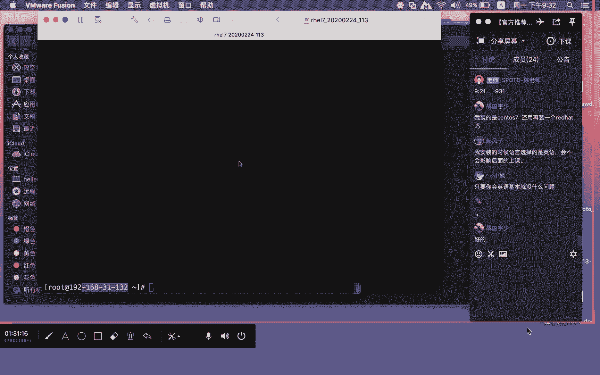

# Linux基础课程（RHCSA）简简单单学会Linux入门教程 - P2：第一节课install-2 - 思博Linux关关 - BV1fv411j7RG

呃继续上课了话。我安装的时候选择的是英语，会不会影响后面的上课起分了，完全不会影响啊。你装英语或中文一点影响都没有啊。这个像我们这种业务环境里面，我们装的时候基本上也都是linux呃。

装这个什么呢英语的，没有太大的问题哈。啊，你看我们现在呢已经是装好了，哎呀，时间刚刚好，10分钟的时间，这个系统的话基本上就安装完成了。那么这个包都装好了之后呢，我们就可以去点击这里的什么呢？

reboot啊，我们现在点击这个libboot。

让它重启一下啊，重启的过程当中啊，他还会要求你去做一些什么呢？相应的配置。所以这个部分的话大家还要继续做。啊，我们现在呢重新进入系统。

好，进入系统的时候呢，大家注意看啊。

苹国们一会儿呢还要给大家介绍一下这个HL8的。那IHL8这安装部分的话其实差异不大哈。啊，这里呢有一个什么呢？呃协议啊，那么这个协议的话，大家要点击一下接受啊，这协议没说什么东西。

就是关于鸿贸这个应用相关的一个什么GBL授权协议的东西。然后呢，这个部分的话就可以点击这个什么呢？finish configuration，点击这个完成配置。

完成配置之后呢，我们现在就可以进入我们这个什么呢linux系统了。

进入lindux系统的时候呢。8的镜像去哪里下载哦，八的镜像的话也是到什么呢？啊到对应的官网上面去下。比如说IHE到企业8的，你也要到黄湖茂的官网上面去下啊。

那COS8的也要到COS8的这个官网上面去下。嗯，之前。可以找到那个助教老师那边去要一个群里也有，应该是有。对。好，这个部分的话设置是有一个叫什么呢？Kd的这么一个东西。那么这个Kd的话呢。

是用来干嘛呢？是在内核崩溃的时候啊，会将这个数据呢转储在什么的Kd对应的日志文件里面去啊。那我们呢像系统部分的话呢都比较稳定。所以呢Kd这个东西啊，我们并不需要去开启。

所以大家可以去把这个什么呢enable k down这个勾，把它什么的给我去掉。然后呢，点击前进啊，选择yes啊，还有一个呢是红帽账号的一个什么呢注册问你现在要不要注册啊，我现在不想注册。

后面想注册的时候再去啊，我们可以选择no。

我想要之后做啊，选择OK啊，这个时候系统还会再重启一次。

好，我们现在来看一下哈，进入啊进入按默认这种方式去进入系统。

好，稍等一下哈。系统如果正常的话，会起来一个什么呢图形界面。

啊，登录窗口图形界面啊，大家在这里面的话呢去需要输入什么呢？对应的用户名和账号密码。呃，很多同学第一次安装完并不知道什么东西，然后直接就点的这个什么呢test啊，就是说直接点test。

那你到时候登录就会以什么呢？普通用户test登录的。你们刚安装的时候呢，有设置密码。所以你要记住那个密码。然后在这个地方就可以输入你在安装过程当中所做的密码。那我们希望呢不用test用户。

我希望呢通过什么呢？root用户登录，你们需要去点击下面的这个什么呢？not list。not listed啊，就这个位置。大家需要去点击这个位置啊，点击这个位置之后呢，我们才有机会去输入什么呢？啊。

输入我们的对应的这个root用户啊，因为root用户他不会在这个什么的登录界面当中给你列出来，需要大家手书。

root啊回车输入密码123。这个时候呢就会以会以这个什么呢？超级管理员的方式登录到我们的这个linux操作系统。

好，登录进来之后呢啊也会有一个什么呢？对应的一个提示啊，在这个地方啊，我们现在是英语嘛，对吧？啊，我们就选next。选择也next。

然后就点击一下star using let hat angellinux server啊，如果你是sOS的话呢，这个部分界面会有一些不一样。啊，但基本上都差不多啊，反正都同一个东西。

然后这个时候会进入到一个什么呢帮助页面啊，这个部分的话我们不需要看，可以把它什么关闭掉，点击关闭。然后在这个界面当中哈啊我们现在呢就可以对它进行什么呢？相应的什么呢？网络配置。我们可以对它进行什么呢？

网络配置啊，可以对它进行什么呢？防火墙和SElinux的什么呢？关闭操作。那我们先来做什么呢？网络配置PPT当中我们有需要呢，大家去看一下这个部分。在我们的这个什么呢？

网络配置当中好像有写到网络配置对应的配置文件是叫这个EDC confi networkwork skipsIFCFG减ETH0。我们这里呢这个ETH0只是一个什么呢？例子。那大家装好对应虚拟机。

你们看到的网卡不一定是什么呢？IFCFGETH0这个不一定。

啊，我们可以通过这种方式来确认你的网卡是什么。我们可以打开这个什么呢？右击，打开open terminal，打开终端。啊，在这个地方打开终端之后呢。我们可以用confi这条命令。

ifcon这条命令来看现有的网络下面哈有哪些网卡存在啊，大家可以看到这里面呢有什么呢？ENOU6777736，这个就是你的什么呢？网卡。然后下面这个是本地回煌IP地址啊。

本地回煌IP啊网卡LO嗯你有没有加网卡，这个网卡都是会存在，而且它的IP都是固定都是什么呢？127。0。0。0。1。这个IP是固定。那我们现在呢就要去做什么呢？这个网卡的一个什么呢？IP地址的一个设置。

那么我们要怎么样去做配置呢？我们要进入EDC下面的什么呢？ss confi下面的network。要进入这个路径啊，通过CD这条命令啊，然后这个路径的话，大家可能还需要注意啊，要记一下啊。

シディーイリシーシ術コンベーカーネワークスクリ。啊，在这个地方就有一个什么呢？IFCFG开头的减号，后面就是你的网卡设备名称的。啊，对应的这么一个合成的一个什么呢？文本文件。

那我们就要呢对这个文本文件做什么呢？IP地址的一个设置。那我们怎么样去设置这个IP地址呢？因为现在目前大家在第二节课才会学到这个VIM，所以你现在没有办法认它。那我们建议用一种什么呢？

文本编辑工具图形界面下面的文本编辑工具叫什么呢？GEDIT来完成什么呢？这个网卡的配置，我们配置的。设置调整的方式就是GEDIT命令后面空格加上什么呢？IFCFG减号哦，你们可以用什么呢？

table键来进行补齐。啊，ENO167777736啊，4个71哦，你们看到的IP地址，网卡设备名称不一定是叫这个啊，我这边看到的是这样子啊，你们看到的不一定是这样子啊。

你们的这个虚拟机有可能是另外一个什么呢设备名称啊，也有可能是叫什么ENS啊什么类的ENO啊什么这乱七八糟，反正就是。不一定跟我这个看到的设备名称是一样的。那我们现在就可以打开它。

这个图形界面上面的文本编辑工具打开的时候啊，就跟记事本一样。所以大家想要在这个文本下面进行相应的一个配置啊，文本内容的一个这个调整内容调整的话呢，就非常什么呢？简单方便了。但是前提是什么啊？

一定要在图形界面上面才能用这条命令去打开文本文件。如果你是在什么呢？黑白终端啊，非图形界面下面的话，那你这个就不行了啊。这个命令是C语言嘛？命令行都是需要强行记忆的嘛？啊，对，有一些命令的话。

你肯定因为用的习惯了，其实也无所谓记忆不记用习惯了，你基本上自然而然就会记住它。啊，这个语言是没错，是是用C语言写的，记得是用C语言写的。那我们现在呢需要去做什么呢？IP地址的一个调整。啊。

在这个地方有一个but。pro等DHCP啊，也就是说我们这个IP。网卡它是通过什么的DHCP来分配IP地址的。然，但是我们现在这个部分的话，通过ifcon这条命令，我们现在其实是还没有看到，对不对啊。

我们现在再打开一个终端，我给大家运行一个东西，让大家呢先分配一下这个IP哈。if confi你看我们这里现在目前没有IP，人家这个还有IP，你这个没有IP是不是？

如果大家不知道这个网卡它能分配什么IP那，你可以先用什么呢？DH client啊ENO。16777。36啊，先用这种方式先把这个IP地址作为一个什么呢？动态分配，先把这个IP呢给我分配到。

然后呢再把这个IP设置到你的这个什么呢？虚拟机里面去啊，就通过这种方式，DHCP分配完。那么这个IP啊，它是相对来说是有一定的时效的啊，那我们可以把这个IP通过呃配置文件的这个调整。

把它固定在这个什么呢网卡上面。啊，就是通过这个先分配一下，因为我们前面给大家介绍，你是用桥接或者是警主机，他们分配到的这个IP都不一样啊。

可能很多同学都不清楚到底我这台虚拟机它能分别这个网卡它能分配的IP是多少，你可能不清楚，那我们可以用DHPH这种方式来决定啊我这个IP到底是多少。你看我们现在开始DH后面跟上什么呢？

ENO667770啊，如果说它没有任何的提示，那说明啊我们的这个IP地址就已经什么呢？应该是分配到了，那我们可以通过啊，继续运行一下啊，大家可以看到哦，我的这个IP地址就是什么呢？

192066831点什么呢？145O那你可以把这个IP地址干嘛固定下来。那么固定就用刚才这种方式用图形记事本这种方式打开网卡配置文件，然后在这个地方进行什么呢？对应配置文件啊，IP地址的一个。设置调整。

那我们呢。可以把这个启动协议。不 pro这个启动协议把它改成什么？改成静态的STATIC啊，然后在这个地方要加入。对应的什么呢？三个参数。第一个参数IP地址IPADDR。等于192。668点。31。

145。还有一个往。掩码指网掩码n mask。等于什么呢？255。255。255点。还有一个是网关JATE。WAY。好，等于192点168点什么呢？31。1啊，你们可以这样子方式去做啊，回头完了之后。

根据这个什么这个的IP长去做到什么呢相应的一个调整。那我现在就可以把这个东西做好之后呢啊还有一个on boot等于什么？on boot的话，如果它这里写no，那你在机器重启的时候。

这个网卡它不会自动的把这个IP提起来。如果你写yes，那我们在重启系统之后，这个网卡，它其实会跟着系统呢一起提起来啊，这就是on boot的一个什么的作用，那我们现在点击一下什么呢？保存。好。

点击保存完之后呢，把这个东西什么呢？关闭掉。关闭咗。啊，然后呢我们用if来看一下，因为前面DHCP分配到的是什么呢？31。145。那我们希望呢把这个网络做一下重启啊，大家可以通过两种方式来对这个什么呢？

鸿贸企业7下面的网络进行重启service network啊，我们把这个网络进行重启。啊，如果你看到这个OK说明网络重启是正常的啊，用if再看一下啊，是31。14，也可以用另外一种方式，就是if大。

DOWN啊，后面跟上什么网卡设备名称。ENO16777736，然后加上两个语的符号啊，if up啊，前面这个if down是将这个什么呢网卡关闭啊，关闭完这个网卡，然后再用什么呢？

if up将这个网卡什么呢？开启啊，中间加了这个语号，它的一个作用就是什么呢？两个命令啊，他是一个什么呢？共同体。啊，也就是说前面的这个命令，他如果执行成功就会执行后面的这个命令。

如果前面的这个命令没有执行成功，后面的这个命令也不会被执行。它是一个完整体哈。好。命令在写的时候呢是ENO啊，不是EN0啊，我这里写错了，是ENO16GD736啊这样子啊。

如果你有看到这个successfully activity啊，那我说明我们这个网卡呢就已经什么呢？操作完成了啊，这个命令就OK了啊，这两种方式，刚才用到网络一个重启一种service network大。

那么这种方式重启跟下面这种方式是有区别。前面这种方式重启的时候呢，比如说你这个这台机器上面有多个网卡，这个网卡，这个网卡，那你用这种命令它就会将什么呢？这几个网卡都重启。那如果你用下面这种方式的话呢。

他就精准定位。我只要对这个网卡进行重启，那你就可以用这个什么呢？这种命令方式去做啊。所以我们在使用的时候，像一些这种命令的小细节区别上面大家也要一定要注意。如果你服务器上面有多个网卡在进行重启过程当中。

用service那种方式，可能有一些网络它很重要。那你在重启的时候可能会有网络的什么瞬间的一些中断。哎，有可能因为瞬间的中断而导致你业务的一些某一个时候的一个异常，会有这样的情况出现。

那我不希望呢有这样一个情况出现的话，那你最好是用什么if downif up这种什么呢精准一个重启。啊，这是在网络虎贸企业榜7下面，网络进行重启的时候的一个什么呢作用。

那如果说是在H18下面的话呢，那么大家在运的过程当中啊，可能需要注意它得运到下面这条命令啊，NMCNIcom downNMCIcom up。就说红贸企业8，你没有办法用这个什么呢？

service network和if done这种方式来做。你得用下面这种方式才能对指定网卡的一个什么呢重启。

啊，这是红贸企业7和虹帽企业八不一样的一个地方哈。那么这个网络重启完之后。我们这个IP地址就算是什么呢？设置完成。那么这个设置完成，我们还需要去做什么呢？SElinux的一个什么呢？

设置和把防火墙的一个设置。那默认情况下，防火墙为什么要？因为它这个默认是开着的，防火墙要把它关闭啊，如果说大家没把这个防火墙关闭啊，可能碰到一些后续的服务操作的时候呢，它会防不了。

默认的他只有22号SH服务这个端口，在防火墙里面是允许外网进行连接的。啊，像阿帕奇这个服务就80端口的这种是因为防火墙呢，它是有做限制。所以你要先把这些东西关掉。后续的话我们不需要去做什么？

防火墙的一些调整。那不是说我们把这个关了，后面就不会讲啊，在提升课程里面，我们会把防火墙开起来。我们会有专门的章节来给大家介绍什么呢？防火墙啊，有了防火墙，你的整个系统会变得什么呢？更为安全。

那我们现在呢刚刚开始入门，先把这些可能影响大家学习哈困难，增加你障碍，增加你困难的这些什么呢？相关的东西可以先临时的关闭掉。一个是防火墙，一个就是SElinux。我们先用这条sstem cDL啊F。

F I R E W A L LD。Dian service。好，通过这条命令啊。systemCTLSTATUS来确认我们现在防火墙的一个什么呢？运行状态。大家可以看到，现在目前是什么呢？

active running就是说这个服务当下是正在运行的，它这里呢还有一个前面第一行，这里还有一个什么是显示enable那enable就是说这个服务是随机启动。重启的时候，这个服务也会跟着什么呢？

启动起来啊，让它处于什么呢？running状态。我们现在呢又要做两个动作。第一个动作要取消它的随机启动，要把什么呢？当下的这个防火墙呢把它关闭。我们可以通过如下这两条命令呢来完成这两个操作。Stop。

啊，stop的话就会让我们的这个状态变成什么呢？dad。啊active这种啊，就是变成一个什么呢？不再执行的。你看inactive啊，现在目前没有再运行了。那把它取消随机启动的时候呢。

这里的enable就会变成什么呢？diable。那怎么取消随机启动呢？可以通过什么呢？system cTLDISABLE。你死部。啊，大家在看这个stateatature的时候，就会看到这里变成什么呢？

diable。那么防火墙这个时候呢就处于什么呢？关闭状态，而且取消了随机启动。那么S106它是怎么改的？啊，S106的话，我们可以用这个什么呢？infor来看啊，SE6ux在机器安装完成之后呢。

它默认的就是处于什么呢？inforcing状态，inforcing就是属于什么呢啊。有影响产生作用的啊，会受到SElinux限制的这样一个状态。我们要去改它哦，大家需要在什么呢？

ETC下面的s confi下面的什么呢？S E Linuxux。在这个路径下面哈，大家需要将这个inforcing把它改成什么呢？diable或者是permiss。那么这三个值是有区别。

inforcing就是处于开启状态。permise它是处于什么呢？啊，他只是记录，但是不会因为你违反S106策略而被阻止这个东西就跟警告一样的。我只是告诉你，这个不东西不能做，但我不会什么呢？

因为你违反了规则，我去阻止你。但是inforcing的话，只要你违反了规则，我就会阻止你。那么disable的话就是不闻不问。啊，就是他不会让S106产生啊，你有违反规则，他也不会提醒你。

就处于关闭状态。那我们这里呢大家在做的时候哈，可以把这个东西要改成什么呢？permiss啊，也就是说其实你改这个permiss和这个什么。和这个diable啊，对于整个linux系统来讲的话。

其实你的SE就属于关闭了。

啊，我们把这个值调整一下啊，调整完之后，大家就可以把这个什么呢啊系统做一下什么重启啊，重启完我们的整个06系统哈，就算是什么呢？安装完成了。那我们把liboot一下啊。

liboot的话就是对系统进行重启啊。我们整个系统的一个重启的一个命令的话呢，除了liboot，还有其他的一些命令啊。所以大家在这个地方也可以关注一下liboot这是一个重启命令。

还有一个是什么INIT6，还有一个是什么呢？需大减啊 now啊。

IIT6也是重启，这里面呢是跟系统当中的这个什么呢？运行级别是有关系的。六级别就是一个什么呢？重启级别。然后sha down减啊闹，这个就是什么？就是我要立刻重启后面的这个no啊。

就是只要立刻重启的一个意思。那么如果你想要在。指定的啊某一个未来的一个时刻进行重启的话呢，大家可以用s大减R，后面加一个什么呢？20。那么这里的20就是指什么呢？20分钟啊。

我要在当下这个时间20分钟后哎，我要对整个系统进行重启。那你就可以用这个什么呢？刷大减R加20。那如果你把这个减R改成什么呢？减H这种方式的话，那整个系统就是处于什么呢？关机状态啊。

减R是重启减H它就变成了什么呢？关机啊，关机的话你也可以运用power all也可以用这个什么呢INIT0啊，也可以用hot，所以它多种方式都可以哈。呃，关机当然除了这些快捷命令之外哈。

大家也可以通过什么呢？呃系统上面的这个图形界面当中的什么关机按钮来完成什么呢？关机啊，来完成这个重启。我们现在这个系统应该是重启好了，我们现在重新去登录一下这个操作系统。

还是按这个什么的root用户进来，选择123。

好嘞，我们现在进来系统之后哈。

大家不要怕这些命令记不住啊，PPT当中这些命令呢我都带给大家了。所以大家呢可以放心的去在这个PPT去看一下，然后呢完成相应的一个操作啊。后续呃如果有碰到忘记的，也可以看一下这个视频。呃。

因为今天晚上第一次上课讲的东西啊，虽然说都是关于安装的，但也有其他一些附加的信息啊，所以有一些不记得，或者说不明白，看看视频，或者在群里面问我啊，问助教老师都可以。那我们现在可以一跟微哥来确认一下啊。

31。145可以啊，我们跑到外部的这台苹果电脑来，我们来拼一下。

好，我们来拼一下。我的苹果电脑。😔，在这里我们来拼一下这台192。168点什么呢？31。14，我看能不能拼得通啊，可以啊。大家做好这个IP设置之后啊，你们也可以去什么呢？跑到windows上面啊。

打开运行窗口去拼一下虚拟机当中设置好的那个IP看一下网络能不能连通。然后你也可以在虚拟机里头去拼一下外部苹果电脑和你的笔记本电脑啊，他们的这个IP你能不能连得通啊，31。1啊，我的苹果电脑。

它更一同一网段了是31。1我在这里拼，它也是可以拼得通，对吧？啊，0%的pack啊，是可以连得上，没有问题。

网络是联通的，说明可以了。啊，这是我们linux里面哈啊这个整个一个安装设置部分的一个什么内容。那如果大家想要去完成这个什么呢？H yellow8的一个安装的话呢。

呃它整体的一个安装里面的一个区别就在于什么呢？就刚才这个地方，我刚才介绍到这个地方啊，如果你就是前面其他的步骤都是一样哈，整个安装的过程啊呃大同小异。

啊，相应的这个什么选择，因为它H18在做的过程当中啊，相对来说呃是会比较集中一点啊，它会比较集中一点，就相关的操作界面啊，不会有那么多的重启。我们刚才完成H17安装的话，可能要重启三次左右。

他可能只要重启两次。因为有些界面它就已经干嘛合并到一起去了，并不需要你二次重启三次重启的时候才能够操作到。所以他操作起来会更为方便一点啊，然后这第一个不同的地方。

然后第二个不同的地方就是网络配置完成之后大家需要对网络进行重启的时候呢，你得用这条命令去做重启呃，不能用service networkwork和，这是他的什么呢？另外一个不同。第二个不同就安装过程当中。

第二个不同的一个地方么S16和防火墙以及系统的这个开和关的一个命令的话呢，这一部分东西哈是没有太大差异。那如果有的同学对网络这一块的设。

不ち。觉得刚才那种方式比较麻烦。啊，拼IP又是按什么来中大哦，conttrol C哈按ctrl加C哈CTRL。cl加C就可以将其中断啊。就是说大家刚才看到了这个什么呢？呃，我们的这个网络的一个配置。

通过这种方式，你如果觉得比较麻烦，大家可以在这个地方啊，大家能看到这个位置吗？啊，就在这个地方啊可以点击这里的什么呢？networktting啊，可以去完成在这个地方去完成什么呢？IP地址的一个设置。

啊，我们这里面呢你看我这里。wd有线网卡哈，然后在这个地方去点击这个什么呢设置。点击这里设置，然后这里有一个什么呢IPV4点开它啊，在这个地方你就可以对它进行什么呢？IP地址的一个什么调整啊。

启动协议DHCP或者是linlock啊，本地连接本地连接它就不连外部了。然后这个IP地址你就根据刚才的设置的方式啊，一个是IP地址指网掩码，还有一个什么网光IPV6我们不用去管它。

IPV6我们不用去管它。IPV4里面，大家如果是想设DNS在这个地方也可以去设DNS如果你想要在配置文件当中去做这个设置的话呢，你也可以在什么呢？里面去增加一行啊，是什么呢？DNS0等于什么东西啊。

我们在windows下面进行IP地址设置的时候呢？它除了IP地址设置，还有DNS1DNS2，对不对？那么在linow下面的话，它的这个DNS是从DNS0开始DNS0等于什么？

或者是在另外一个文件叫什么呢？这个。ADC下面的什么呢？RESO。LVE点com李骚点com啊，在这里面可以去指定你的DNS服务器。name server啊，比如说我们想要把DNS指向到8。8。8。啊。

想要指向到什么呢？114。114。114。114，这个都可以啊，只要你能够连到都可以指向你想要的那台DNS服务器啊，这个是通过什么图形的方式来进行的一个设置。所以两种方式都应该能够帮助到大家完成什么呢？

系统安装之后的网络IPV4地址的一个什么设置。呃，如果网络拼不通的话，怎么排查呢？啊，我看一下这位同学。无厘头问一下啊，看一下无厘头这边问了什么问题，我每次听都是这样。

那你这个每次拼，那你说明这个是拼不通的啊，那你说明就是拼不通的那首先你有没有按照我刚才说的，先通过什么的DHCP先分配这个IP因为我不知道你这个网卡是就比如说ENP0S8这个网卡，你是调接的。

你是NAT网络的，你还是什么，你还是这个警主机的，大家不要把这个什么呢对应的模式和你可分配的IP地址给他搞混掉啊，比如说有的同学他知道他的警主机网络是有92。16856网段。

然后他把这个IP地址分配到了什么呢？调接模式的那个网卡上面去。那你这样做出来，肯定就是什么拼不通的。啊，所以这个是很关键的啊。所以我们刚才说先通过DH client啊来完成这个配置。

那么你可以先看一下这个IP它分配到的是哪个呃类型的网卡。然后你可以在这个网站上面去配置什么IP地址去做什么IP地址的一个调整。如果大家在做这个过程当中哈啊用为刚才我所说的这种方式，你觉得还有点困难。

大家也可以跑到这个什么呢？外面来。

啊，跑到外面来。跑到外面来，我们可以去确认一个东西，就是把你的什么呢物理地址。物理地址micel地址跟你的这个什么呢？虚拟机里面所看到的这个网卡对应的什么呢？micel地址来对应啊。

比如说我们这个是警九机网络的网卡，那你想要知道这个警九机网络的网卡在我的这个系统上面对应的是哪个网卡啊。首先我们可以先到系统上面去看一下ENO167736，它的这个什么呢？物理网卡地址是。

就micel地址啊物理IP地址。下照。硬件IP地址啊，你看我们这ETHER它是这个啊，只要记住后面这个就三个就可以了。D4073A啊，那你可以去看一下这个对应的是。哪一个？我们跑到这前面来。啊。

在这里设置部分啊，大家可以去看这个设置部分，然后在这里点开啊，警主机网络，你可以点击这里高级选项。大家也一样啊，你们去看网卡的时候也是一样。你看我们的D4073AD4073A这个就是我的这个什么呢？啊。

警主机网络的这个什么的网卡，这样子外部的这个网卡跟里面的这个网卡，它就对应上你就知道这个是哪个网卡啊，这个是警主机网络的网卡啊，那你就知道啊，我要去对它进行什么样的IP地址的一个什么呢设置。

这是另外一种方式确认啊这是另外一种方式确认。好诶。我看一下。如果网络拼不通的话，怎么排查啊？淡淡的微信。如果网络拼不通的话，先确认一下你这个网卡，像我刚才那种方式哈。

就是你要先确认一下这个网卡你所分配的IP地址是不是你所预计的啊，你所对应的正确的什么呢？网络IP啊，如果不是的话，那你有可能配置就错了。第一，保证。你的配置，比如说这个是紧主机网络的。

那么那它分配到IP也只能是仅主机网络的IP不可能是调接模式的IP啊，这是第一个。然后第二个的话呢，就是要确认你的IP配置。文件也没有问题啊，比如说你里面配置的是192。16831。145。

结果你把这个网卡重启完之后，发现它分配到地址是192。16831。144。那你明显配置文件做的就是有问题。因为你里面写的IP地址，跟你启动之后的IP地址明显不对应是吧？那你要配置文件要去确认一下，好。

这是第二个步骤对吧？第二个步骤，如果说这个步骤也OK了。前面两个不做都OK了，一般第三个时候再去确认网络一般都是没有问题。外部确认一下，内部确认一下，网络能通啊，能够拼得通就是可以的。起分了。

我看一下起分的这位同学写了一个什么问啊。192。168，你看啊192。16888。129，这个是692。16888。133。那说明你这个网络应该是还没有重启啊，还没有重启，可能你要重启一下这个网络。

它才会分配到对应的1个IP地址。同时也要确保你所分配的IP在这个网段当中，没有人在用这个IP如果说你这个IP有人在用。可是你非要配这个IP，那你可能就分配不到了。东西配置好，就是网卡配置文件配置好。

并不等于你的这个if con就能看到这个IP。一种有可能被人占略。另外一种有可能你配置调整好了没保存啊，还有一种是你配置保存好了，但是网卡没重启啊，新的IP没生效啊这。

几种情况都有可能导致你出现这种状况哈啊，无厘头问的这个问题是啥问题，我看一下啊。这个。这个是拼，他认的是一个命令啊，用命令不是用那个WQ这种方式去退出它啊。

应该是用但愿轮长久所讲的contrl加息会将这个什么呢？命令中断掉。那如果大家去编辑VI使用的话，那你可以用这个什么WQ这种方式来进行退出。下节课哈我们会给大家继续讲。

linux系统当中的VIM的一个使用。所以这一部分的内容，大家先要完成什么呢？

就是安装部分的这个内容的话，大家先要完成对应的这个什么呢系统的一个安装啊，使用这个虚拟机ware和visel box啊去安装一个红帽企业7的。今天最基本的一个内容哈，大家至少要完成什么呢？

HEL7的一个系统的一个安装这是今天最基本的一个内容哈，没关系，无厘头啊啊，我觉得大家碰到一些问题一定要问，我就怕一个东西就是不敢问啊，觉得这个问题好像很简单啊，觉得问了好像会有什么情况发生。

其实没有的，你任何的问题，不管是简单还是难的，有任何的问题，大家都要把什么呢？这个题目抛出来啊，我会告诉大家啊。这是今天。上完课之后，大家需要去完整的一个内容。呃，系统文件有共享吗？还是去官网下呃。

如果今天都是基础班这个学员的话，大家可以直接呃，因为我们晚上会把对应的录屏相关的文档，还有PPT资料都会上传到这个什么呢百度网盘去。呃，到时候第二天助教老师呢会分享出来给大家。到时候大家再去什么呢？

呃网盘上面，把相应的这些数据拉下来。啊，如果是今天来试听的同学的话呢啊大家也可以去找这个班主任老师。就是你之前联系的是哪个班主任老师，哪个助教老师，大家可以去找这个老师啊。

向他要今天上课的这个对应视频和资料啊。呃，我们班级的同学的话呢，可以直接在群里面就可以看到分享的视频了。好嘞，啊，这是今天晚上啊大家需要完成的作业啊，虚拟机完成国贸企业7系统的一个安装。

如果有时间完成一下sOS7和HE8的一个系统的安装哈，这两个东西的话不会太难啊跟。大家做的差不多啊，就是前面这个红帽漆的这个系统的安装都差不多啊，需要注意的就是要求带图形界面。我们刚才说哈。

你如果是约 mail的话，前面那个打勾没有去掉，很有可能哈，很有可能就一个打勾没去掉，还有一个是呃第一个虚拟的光驱没去掉。就很有可能自动化安装下去啊，有可能装出来就是没有图形界面了。啊。

所以这个部分话大家一定要小心。所以我在这个安装练习当中的第三个部分是要求带图形界面啊，也是为了什么大家在后面。做这个VI练习的时候呢，方便啊。要不然的话你做网络配置，你到时候不会做啊，没图形界面。

你装出来这个系统，你VI现在又不会用。所以你网络可能就配不了啊。当然你如果VI已经了解了，那你要抓图形或者说非图形其实都无所谓。因为你可以在文本终端下面去完成什么的相应文本的编辑啊。

不会有任何的一个影响。好嘞，这个是我们今天linux系统安装的所有内容啊，大家这个作业哈一定要完成啊，一定要完成，因为后面都是基于linux操作系统去做相关的练习。我们练习很多。

我们练习很多相关实验非常丰富，所以一定又有一个linux操作系统，要不然后面的事情都是扯淡啊，要不然只是听，没有用的啊。好了，各位同学，我们今天的课就上到这啊。😊，嗯，我们下课。

