# Linux基础课程（RHCSA）简简单单学会Linux入门教程 - P3：第二节课vim-1 - 思博Linux关关 - BV1fv411j7RG

经8点了，我们来开始今天晚上这个内容啊。呃，在开始上课之前呢，可能我要简单回顾一下上一节课我们给大家介绍的内容啊。上节课的话呢。百度云的录播视频比直播清楚好多啊。

可能有一些音质或者说这个有做一些优化处理啊。没关系啊，大家如果觉得百度那边他那个录播的这个视频好，可能大家就要等我这个什么呢？啊，等我这个上传之后，大家可能才能看到啊。

因为我那个的话是在本地直接做的这个什么呢录制的，所以可能质量上面的话相对会保障一点。但就是呃录制，因为上传下载只需要一点时间，所以大家可能没那么快能够拿到这个录制的视频，所以只能呢先直播这一块先看啊。

那我们说完这部分内容，上一节课给大家讲的这个什么呢？系统安装啊，我们主要是给大家介绍了IHEL7啊，IEL7呢在这个weware这个虚拟机下面呢呃整个虚拟机的一个什么呢？安装IHEL啊。

这个IHEL的话呢是我们鸿贸企业版linux的一个什么呢？简写。嗯，我们主要是介绍鸿贸企业把lininux7的一个系统的一个安装。那么在whenware可以装，在你的这个什么的visel box下面呢。

也可以装啊。如果有同学对这个vissel box这个虚拟机有感兴趣的话呢啊也可以找一下上一期啊我们给大家介绍到关于系统安装部分的一个什么视频。啊，我们上一期的这个视频里面的话。

当时给大家介绍装这个系统的话呢，就是讲这个什么呢？在visel box下面去做这个什么呢？KV呃这个虚拟机的一个安装。那我们今天接下来又给大家继续呢在这个安装好的系统上面呢介绍大家怎么去完成一个什么呢？

文本内容的一个编辑。呃，我们在装好系统之后呢，会要求大家呢在系统当中去完成一个什么呢？对应的网卡啊，它的1个IP地址的一个设置。那么网卡IP地址的一个设置的话。

大家还记得它的这个相对对应的这个什么呢路径以及它配置的文件，大家还记得是在哪里吗？啊，我们把这个装好的这台虚拟机，我从远程部分哈，我连接到了进来，我们呢把这个虚拟机呢？

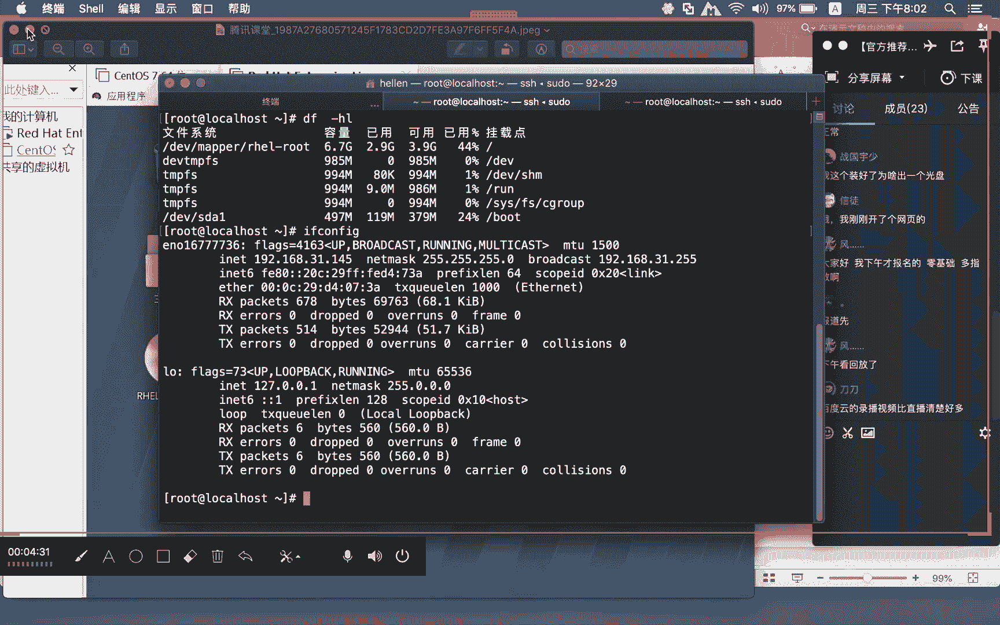

进来之后呢，我们可以到这里面的去看啊，它的这个安装配置。对应的这个网卡的配置啊是在。在这个路径下面啊，EDC下面的ssco vi下面的什么呢network scripts啊。

这个路径下面呢做的叫个什么呢？对应的网卡配置。那我们在这边的话呢，就有一个对应的这个什么呢？网卡配置文件啊，我们这里的虚拟机，它的这个网卡配置文件是ENO164个736呃。

每个同学看到这个网卡配置文件可能有所不同啊，那我们在确认的时候呢，如果你有多个网卡。那么每个网卡对应的这个哪个类型，你们可能自己就要确认清楚啊，确认好，我们才有办法在对应的网卡上面什么呢？

配置正确的IP啊。如果说你不知道这个I网卡它是调接还是NAT还是警主机如果你搞不清楚，到时候呢你的IP分配就会变乱掉。那我的这边的这个IP地址，这个网卡，它的IP地址的话，就是一个什么呢？

警主机的一个网络那我通过这个什么呢？几个参数的一个调整就可以去固定这个网卡对应的IP地址。因为我这边的这个警主机网络，它是在什么呢？192点168点31点这个网段的。所以我在进行这个IP地址设置的时候。

我就设置在。这个31往上下。第一部分是启动协议，对吧？我们有DHCB。还有一个就是taticDHCP的话，不需要你去分配IP啊，那我们可以通过什么呢？DHCP动态去获取到什么呢？

这个IP这个网卡对应的IP地址。然后下面的这三个参数是整个黄卡配置文件当中啊最为重要的三个参数啊。前面这个改完stistic，你下面的这个配置才会什么呢？生效。对啊，我们现在目前是在内网啊。

这个是警主机。警主机的话呢，它在运的过程当中啊，是只有什么呢？你的数主机，也就是你的这台笔记本电脑，才能够去连通你这个什么的网络。那我们除了警主机，还有桥接，还有NAT。那我在设置。

在这个方设置IP地址的时候的三个参数，一个是IPADDR这里设置的就是IPV4的地址啊，指网掩码网关那么这个东西设置好啊，设置好，我们回头要重启网卡。那么对应的这个IP才会生效。

同时啊大家一定要注意前面的这个部分，很多同学我看群里面大家在沟通在聊的过程当中啊，有发现有的同学说哎老师为什么我的IP设置不成功啊，他把前面的这个什么呢？tistic没改啊，当还是愿原来的什么呢？

DHCP没有改成什么呢？atic。那后面他有设置。那如果你是这样做的话呢，那么他人家在进行网卡重启的时候呢，还是按照什么呢？DHCP的这种方式来分配什么呢？IP地址啊。

不会根据你下面所固定的IP来进行什么呢IP的设置。好，这是前面设置的3四个重要参数。然后最后一个的话就是on boot等于yes。那么其他部分的话我们可以先不用去管它。on boot等于yes。

就机器在启动的时候呢，这个网卡也会随之启动。如果它对应的值是等于no的话呢，那么在机器启动的时候，这个网卡也不会跟着起来。好，这是。网卡配置部分的那我们上节课呢用的是什么呢？在图形桌面下面啊。

通过什么呢？GEDIT这种方式来完成我们对应的这个什么呢？网卡配置文件的什么调整。

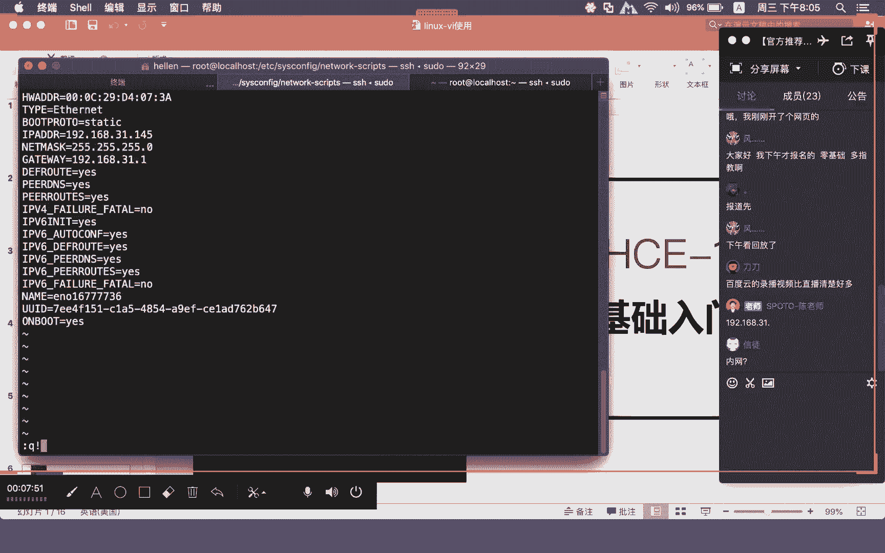

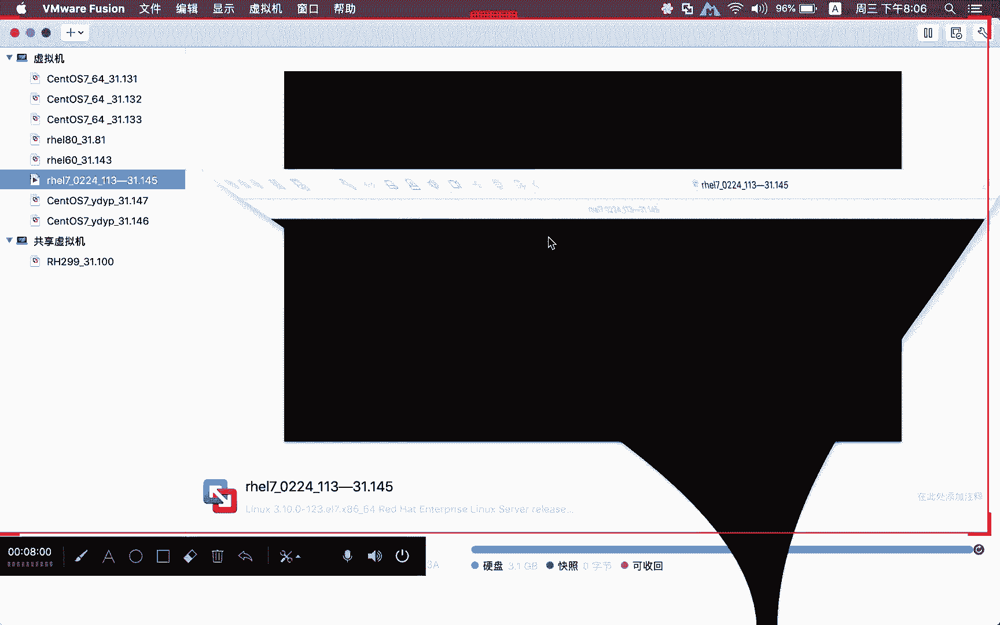

嗯，在格桌面上面，他用到的是叫GEDIT那如果你是在什么呢？KDE桌面下面的话呢，我们也有一个文本编辑工具啊，叫什么呢？KW。啊，K right啊K right，我把这个东西打开给大家看一下。

我现在要进入我们的这个什么的图形桌面啊，我们现在来看一下。

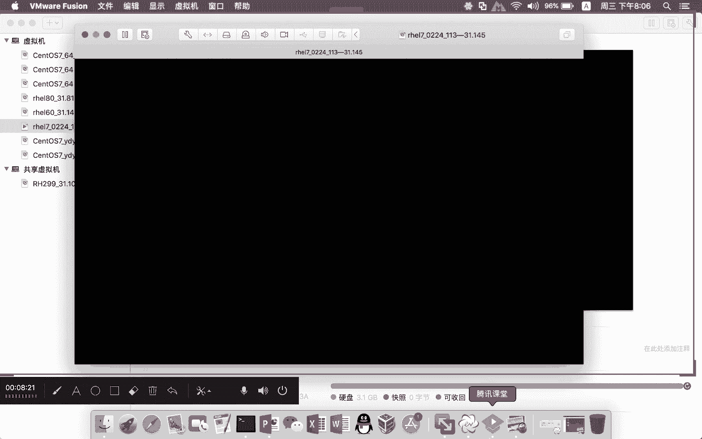

啊，glen桌面因为在linux特别是在红帽这个linux下面啊，它有两个非常著名的这个什么呢桌面，一个叫glen啊，一个叫什么呢KDE。那么glen这个桌面的话，它默认。

图形桌面下面的这个呃图形窗口下面图形界面下面，它的默认文本编辑工具的话叫什么呢？GEDIT那并不等于说它只有这个文本编辑工具啊，就没不是说只有这个唯一的这个什么呢？图形界面下面的这个文本编辑工具啊。

它还有啊然后KDE桌面的话呢，它是KWIITE啊，所以如果大家是在这个图形桌面下面啊，我打开这个随便打开一个目录啊，我随便打开一个目录我在这边用这个终端先打开一个东西然后呢。

我们在这边呢去打开一个目录啊，打开目录的话，这个是换起一个窗口啊，换起一个窗口的话，在这个地方哎啊这个stop，我把这个关掉一下clo。哦。我跑到一个有文本文件的一个地方去哈，我们跑到。这个地方来啊。

你看我们这里呢就有一些什么呢文本文件。那我们可以用NAU。打开这个什么呢窗口啊，有的同学可能并不知道它这个路径要怎么进入。那如果说你是在文本终端下面想要换起窗口的话，是可以用这条命令的啊。

那么到了这条命令之后，比如说这是一个文本文件，那你可以在这个地方直接去点击什么呢？双击啊，大家就可以看到默认就是用什么呢？这个GEDIT来打开这个什么呢？文本文件么打开文本文件这个东西啊。

就跟记事本一样你要对它进行文本文件内容的一个编辑的话，就变得什么呢？非常的简单，做好修改就可以去点击这里的什么呢？C做保存啊，如果说你并不修改完，并不想保存。你直接就可以把它什么呢？擦掉啊，把它关闭掉。

这在桌面下面，我们可以直接这样双击就可以打开一个什么呢？文本文件啊，也可以是什么？直接到对应的这个什么呢路径下，通过什么呢EDIT。后面跟上你要打开这个文件名字啊，当然你要在这个路径下面有这个文件。

你才有办法去打开啊，不要说哎我这个文件不存在。然后你记EDI记EDIT后面直接写这个文件名字，那这个文件会找会找不到的啊，你要到对应路径，或者说把下面的这个路径啊又给我写对那我们才有办法去打开它啊。

就这样子打开我们上节课给大家讲网卡的这个配置的话，当时用的就是这种方式，对吧？啊，进入网卡的配置路径EDC下面的。到这个什么呢networkscape下面，然后用这个什么呢GEDIT后面跟上什么呢？啊。

对应的这个什么呢ENO这个文件。然后除了这个网卡配置，我们还有一个什么呢？还有一个。SElinux的一个什么呢配置文件啊，也是可以通过这个什么呢？GEDIT啊。

我们这个是SElinux直接用它来去打开这个图形窗口，然后在这个地方就可以对相应的这个配置进行调整。当然了，我在上一节课可能我不小心啊在操作这个SElinux配置的时候呢，我用到了什么VI的这种形式。

那么VI这种形式的话，我就不需要在什么呢？图形窗口下面去对这个文本啊，没有说限制啊，我用VI去打开一个文本，必须在图形界面下面。我们可以在什么呢？非图形呃。

文本终端下面呢也可以去用VI的形式去编辑你的一个文本。那如果你用VI打开，我们就不在图形下面进行操作。那么相应的这些操作过程当中的一些什么呢？快捷指令呢，大家就需要什么呢？做一些记忆。

因为这一部分的东西会什么自始至终贯穿贯穿我们整个linux的一个学习。就大部分情况下，我们不是在图形界面上面进行操作。我们是在什么？我们是在这个文本终端下面。

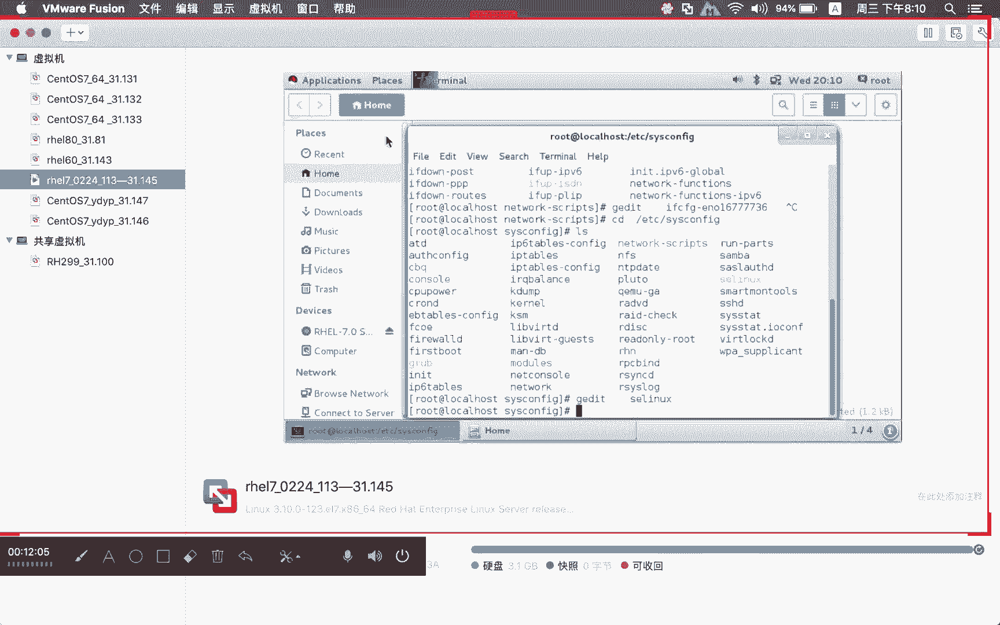

啊，服务器大部分都是在远离你身边的一个什么的机房啊，它可能放在国外的机房啊，它可能放在云服务器上面的某一个虚拟机上。那你这个机器想要进行操作，你不可能说我要操作某一个配置，重启一下网络，你要跑到什么呢？

美国这个机房去。很不现实啊，都是通过什么呢？远程连接进行什么呢？啊连接上之后的相应的配置文件的这种调整。那比如说我们现在要打开这个网卡的配置文件，我们就可以进入这个路径之后，VIM去用什么呢？

后面跟上对应的这个配置文件名字，就可以去打开我们的这个什么呢？文本文件。那么除了这种的话，还有可以运什么呢？VI这种形式。前面这种是VIM。后面这种话是不带什么呢？M那么我大部分在编辑的过程当中哈。

或者说大家在后面时间呢，我们都是建议大家用什么呢？VIM啊，但并不等于说VIM你这个部分在红帽是这样用，到了其他的这个系统下面。

你也有VIM这个还真不一定有些系统人家只有VI没有VIM因为它这里面呢VIM是一个什么呢？强化版。那那么这里边的这个强化，就VI跟VIM的一个区别。我打开一个很简单的一个东西哈，来给大家看一个东西啊。

我们打开这个EDC下面的INIT点滴下面呢有一个叫fions这么一个什么呢？写的一个sll脚本。那么这个sha脚本大家可以看到啊，目前有白色，有红色，还有什么呢？蓝色。哦。

你会注意到一个东西就是他在写这种sha脚本的时候有一定相法相关语法的一些什么呢？这种呃颜色上面的一些区别。比如说这种变量啊，双引号里面它就用这个什么呢？呃红色来进行表示。

然后加警号这种话都注释掉的这些函。那么白色这种都是什么呢？所谓的变量。那如果你用这个什么呢？VI打开同一个文件，你可以比较一下。那么这个时候进产进去的就不是一个什么呢？彩色事件，它是一个什么呢？黑白。

啊，你家，我出嚟。所以它就变成什么呢？一视同仁啊，所以我在介绍刚才VIM和VI的一个区别的时候，我们就说啊啊VIM它是一个强化版有相关的语法高亮啊，可以让你什么呢？阅读起来，可能会让你心身心愉悦啊啊。

有的同学可能觉得黑白更适合他啊，当然每个人都不一样啊。但至少说从颜色上面，有的时候我看不出什么问题来。你直接看颜色，我有的时候就可以看出说哎这个脚本写的也没有问题。就是说普通文本你在看的时候。

它其实用这个VI来打开的时候，也会有类似的这种情况。你看我们这。啊，你用VI打开，你看我们这等于什么？他都认为这个后面等于的都是变量啊，他都用这个什么的红色来进行表示。

然后井号后面所注释的函都是用蓝色进行加量。那你用这个VI打开这种配置文件，它就也是纯文本的这种形式。啊，所以会有这样的一些什么呢区别啊，会有这样的一些区别。那我们在使用的过程当中啊。

我个人都建议大家呢去用这个什么呢？VIM的这种形式来完成我们对应的这个什么呢啊文本的编辑。那在VI使用的时候呢。因为在呃我们的这个113基础班这个同学里面啊，沟通群里头QQ的这个沟通群里面。

我看到有些同学呢已经在尝试去用这个什么呢VI对相应的文件进行编辑。但是可能哈没有接触过，比较陌生。所以在使用的过程当中啊，磕磕绊绊碰到了很多的一些困难。

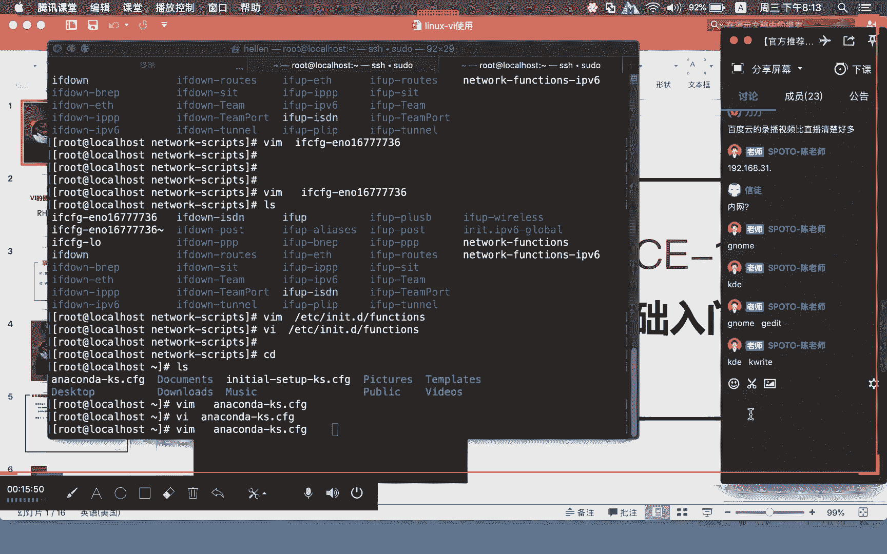

那VI在使用的时候呢，他在这个地方啊我们有给大家介绍到呃。

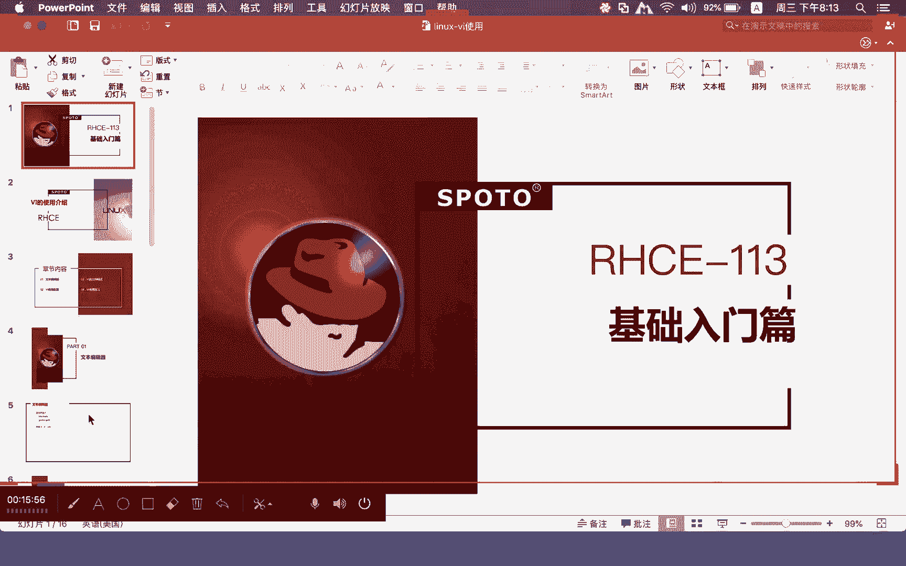

我们先给大家介绍这几个啊啊，回头这个介绍完，我再给大家讲一下这个123这个商点东西，就VI里面的写到这个什么呢？四种模式啊，他这里没给我改，不好意思啊，我把这个东西改一下。其实在上前面课程里面的话。

我并没有把这个东西啊说成什么四种模式啊。但是上节课在前面的这个章节当中啊，我一般都把它给它说成是什么呢？三种模式，也就是只给大家什么呢？介绍123这三种模式啊，他会把什么呢？第四种这个模式啊。

归结到什么呢？呃，归结到这个命令行模式，啊其实这个部分的话是有一些什么呢？区别。那么所谓的浏览模式啊，一般模式，这两个东西啊是一个道理。那么一般模式浏览模式啊，你看这个字面意思你应该也能够理解浏览嘛。

就是没做什么呢？没做相关的这种呃更新动作，它只是进去到里面去看相关的一些内容，我们用这个VI去打开一种小文件的时候，你可以用这种方式去做。如果说这个文件非常大。呃，我们生产环境当中啊。

也有一些日志文件啊，它可能会达到什么呢？大体实际啊，就有一些这种访问日志啊，他没有去做归档，或者说当天。

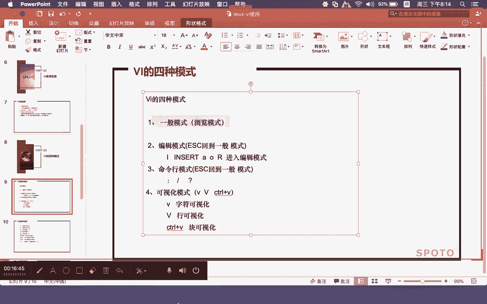

访问的这种量非常大。那么当天可能这个日志就会撑的什么呢？非常大。我们用这种VI去打开这种大文件的时候，函数非常多，数据量非常大。你用这种把东西打开，其实是很耗你的这个机器的一个性能。而且也不合适。

用这种方式去打开大文件，就打开这种大文本文件。如果是这种小文本文件的话，那我们在看的过程当中啊，还算是什么呢？比较合适的啊，我们用VI去打开，也基本上都是看小文件。

你不可能用这种VI的形式去看这种大文件。对你整个系统的资源消耗是非常大的。啊，那我们可以用这个VI。比如说我们现在呢。打开这个文件啊。我们在操作这些东西之前哈。

你可以先对这些文件呢做一下备份CP这个命令的话呢，就是对什么呢？啊文件进行备份。基础命令在VI介绍做完之后，我们还会给大家去介绍这个什么的基础命令。所以大家呢嗯我看你们可以看我这个比如说LS命令啊。

CD命令啊，这些都比较长远的一些命令啊，大家可以先根据我这边的基本的一些操作，你们可以先把它记录下来啊，等到第三个章节，可能今天。今天晚上这个什么呢？下半段时间可能我们就会介绍到基础命令了。

那cobe我们先对这个文某文件的做一下备份啊。呃，因为在这个生产业务环境里面啊，大家在进行相关配置文件调整的时候呢，我们一定要养成一种习惯。就是什么呢？操作之前一定要什么呢？备份啊。

不是说我们久兔商库啊，怕什么呢？就怕你在生产环境当中配置文件调整过程当中出现问题啊，调整的少，如果出现问题，你可能还能很快的将其改回来。如果调整的多，这个时候你又没有备份，想要将其调整回来。

有可能什么呢？原路都走不回来，备份的时候需要指定目录吗？可以指定目录啊，也可以在本地下面直接去做指定。哦，这一部分一会我们再给大家介绍，所以备份现在不是我们的重点，我们的现在的重点是VI。

我们现在呢打开这个配置文件啊，打开这个CF这个文本文件。你看我们这里哈。😊，那哦怎么恢复呢？飞复也很简单，直接拷贝复制过来啊，就盖过来覆盖上去。你看我们这里哈在进来用VI。打开一个文本文件的时候呢。

其实就是一种什么呢？一般模式，也就是所谓的浏览模式，就没有敲任何键。我们就现在目前就在这个文本文件里面按这个什么呢？方向键上下左右啊，左右，然后呢，直接去看那我们在看这些文本文件的时候，上下左右啊。

上下左右的时候呢，大家可以看我们这边几个数字啊，一个是什么呢？4013，然后这里是什么呢？66，那么这里面的这个四0指的是什么呢？就指第四0行，然后这里的第十3啊，你看我这里我按这个左右键的时候呢。

它其实就在字符这一行当中的左右字符那边进行移动。意思就是说我现在是在什么？第八个字符，我现在是在第四十行，第四十行里面的什么呢？第八个字符，也就是说我现在的光标位置是在这个位置。然后如果你再往下翻。啊。

再往下翻再往下翻的话，它就可以什么呢？继续往下走啊，或者说往前方的时候呢，他就会按照你现在目前的一个位置呢往前走。然后50%几就告诉大家说，哎，我现在这个光标的位置啊，大概是在整个文档的什么呢？

百分之几的这样的一个位置上面啊，就通过这些下标，应该说整个屏幕的什么呢？右下角这边啊我们可以看出一个什么呢？大概你现在目前光标在什么位置，这在一般模式下面啊，浏览模式下面我们能够看到。

那如果说我们现在对这个文本啊，进来看完，觉得有一些配置需要做什么呢？调整。那我们可以按一个什么呢？I。啊，大家可以按字符I，也就是说进入编辑模式是从什么呢？浏览模式。啊，是从这个一般模式。啊。

是从这个什么呢？浏览模式按一个I，然后进入到什么呢？进入到我们的这个什么呢？编辑模式。那么所谓的编辑模式，这个时候你就可以对什么呢？里面的文件内容进行什么呢？增删改啊，可以增加，可以删除，可以修改啊。

我们现在呢按一个I，大家注意看哈，如果哎这个是英文。啊，你看我们这里哈，我现在这里显示的是中文。那如果有的同学是英文，那他这里显示的就会是什么呢？insert啊，可能字符不一样。

但基本上你就看应该都能够看得明白。那如果他这个地方显示的是什么呢？插入文的话，那意思就是说我现在是处于什么呢？啊，编辑模式下面，那如果你在这个地方想要去做相关的一个数据的编辑，很简单。

比如说我要删除这一行，那你可以按什么呢？直接讲按这个删除键啊。这个删除的话就bake space按那个什么呢？bake space退格键，按退格键啊。

它就可以将什么呢对应的行一个一个字符的在光标所在位置开始往前删啊，往前删啊，如果说你想要去增加，那你就按回车。比如说我们在这个地方加什么一大堆这种什么AAA啊，这个就是你要可以去改一个地方，对吧？啊。

这个就是增删改在编辑模式下面的这个操作的话，就非常简单。但是如果你编辑完成啊，前面我看到有的同学他对VR不是很熟悉那编辑编辑完了改完了，他想退出啊，他想保存，他想退出，这个时候怎么办？

那我们可以退到什么呢？命令行模式下面。啊，命令行模式的话呢，比如说大家现在是在什么呢？这个编辑模式下面，你要在什么呢？编辑模式下面呢，先按ESC。ESC退出什么呢？退出我们的什么呢？编辑模式。

按ESC退出编辑模式。啊好，退出编辑模式之后呢，它就进入到了什么呢？啊，它就进入到了我们的这个什么呢浏览模式。啊，就进入到了我们的这个浏览模式。我们按一下ESC啊，大家就可以看到这个地方的这个插入。

这里的这个标记它就没了。那么这个时候它就在什么呢？浏览模式下面，那么浏览模式下面，你可以在这个地方。And shift。加这个什么呢？冒号啊，也就是我们的SH。ifftt。啊，要加上什么呢？冒号。啊。

就是说shift和这个冒号这两个字符要同时按啊，从浏览模式下面。Ser。和冒号同时按，然后呢才会进入到什么呢？我们的这个命令行模式啊，就这种方式。那么在这个时候呢，就可以对它进行什么呢？保存。

那么这里的这个保存就是什么呢？写入动作啊，W。写入，然后还有一个呢是Q啊，那把这两个东西结合在一起的话，就是什么呢？写入保存退出。你把刚才的这种更改把它保存下来，同时退出这个什么呢文档啊，就这个意思。

如果我们在这个地方不写W，只写Q啊，那你可能只是什么呢？对刚才的这个什么呢配置啊不满意，你想要干嘛？直接退出。刚才所说的更改都不会被保存。你看我们刚才这个地方加了这么多东西，前面这一行翻的差不多了。

是吧？那我现在如果按一个Q，那我就直接退出的啊，那他这里有讲已修改，但尚未保存啊，如果说像这种，你是有做更改，但是想要退出，有的时候呢还需要加一个什么呢？感叹号。啊，还需要加口叹号。像我刚才这种提示。

他就是说已修改但尚未保存，人家就有一个什么的提醒。那如果你确定说我刚才改的东西，我就是不想保存，OK那你可以，我就干嘛？直接QW退出。那我们刚才所做的这种更改AABB的这个相关的内容呢。

它就并没有写入到我们的这个文件当中。那如果说你想要保存，那你就要按什么呢？WQ啊，你就要按WQ那在如果在保存的过程当中，它还是有提示什么问题。那你可以在后面呢加个感叹号。那么这个感叹号它的一个作用啊。

就在于什么呢？强制。强迫你啊，不管行不行，我反正我就强迫你，你就得从从从了我是吧？强制。哎，这个感冒号它的作用呢就在这个地方。那VI在使用的时候呢，这个命令行。模式啊，它除了刚才这我们保存。

对个他还有其他的一些方式。那我们要先回到刚才的这个什么呢？啊编辑模式下面到浏览模式下面。啊，我们有一些什么呢？快捷命令呢，需要大家呢做一个记忆。那我们在做的过程当中，有几个什么呢？啊。

常用的快捷字符大家一定要先记住，现在目前我是在什么呢？一般浏览模式下面啊，就是在一般模式下面，我们有几个字符。第一个比如说我想要在这个文件当中哈，我想要在这个文件当中，我跑想要跑到这个什么呢？文件呢啊。

比如说光标所在行的什么呢？函头去啊，光标所在行的这个函头的话呢，大家可以按一个什么呢？哎，大家可以按一个什么呢？零啊，就如果你想要跑到航头去，比如说我现在光标往下移哈，我们移到这一行。啊。

我们现移到这一行来，然后把这个光标一直向左向右移动，想移到这一行的什么呢？最后一个字符去啊，它这个行呢是有折行。也就是说加现在大家目前看到的这个行好像是有两行，那其实呢它是一个什么呢？折行啊。

是这样子一个行当然如果说你想要从这里跳到第一行跳到这个这一行的什么呢？行头来的话呢，那你按刚才这种什么呢？方向键这种方式啊，其实是很费力的。因为这里面的这个字符跨度比较长，对吧？那你想要到行头。

我们可以按一个零啊。就在就在这个什么呢一般模式下面按一个0。哎，我们按这个哈，你看我们这里现在光标。这个位置是在第19行的第125个字符，你想要往前方，你按这个左右方向键很吃力的对吧？

很吃力的那我们按一下零，然后大家注意看这个时候呢就会变成19逗号什么？你们看啊敲好，大家就可以看到就变成了什么呢？十九逗号一，也就是变成了什么呢？第十九行的什么呢？第一个字符。😊，好。

这是零它的一个作用。那么还有一个的话呢，是跑到什么呢？对应。对应光标所在行的时候呢，最后一个字符也就是跑到什么呢？零是到什么含头。零是到航头，那么do勒符号呢是到什么呢？行尾啊。

光标所在行的一个行尾我们想要去到这个do勒符号啊，大家可能要按一下shift加这个什么呢？do勒符号。你看我们这个时候呢就变成了19逗号125啊，这个就是什么呢？快捷的两个什么呢？零和do了。

这是什么呢？对应行行头和行尾的一个什么的定位。那么还有呢文件的一个什么呢？文件头和什么呢？文件尾啊，文件像这种，我们刚才这个有多少行啊？你看我们这里呢总共有47行，假如现在这里是470行。

甚至是4700行。你如果按这个什么呢上下键一直往上爬，比如说我现在是在倒数第二行，你要爬到第一行去，我估计啊你跟爬一座山差不多的一个时间。当然我讲的夸张一点啊。也就说明什么函数过多的情况下。

大家想要通过这种上下左右的这种方式去定位到某一。想要你到的那一行去的话呢，其实是蛮耗时间的。那么到函头去的话呢，我们可以有一个命令叫什么呢？小写的记。小写了两个G。😊，大家可以按哈。

你看我现在呢先跑到这个什么呢？行尾来，大家现在可以看我现在在第47行，对不对？好，第四7行我现在按一个什么呢？按两个小写的记按两个小写的记啊。好，你看我们这里这个时候就变成了什么呢？

一逗号一就已经跑到了什么呢？这个文件的第一行。那如果说要跑到什么呢？文件的最后一行去的话呢，我们要用的是什么呢？大写的一个G。哦，两个小写的G是到什么呢？文件第一行，一个小写的大一个大写的一个G的话呢。

是到什么呢？文件的最后一行。你看我们这里这个时候就变成了什么呢？47啊，由原原来的一下子的第一行跳到了什么呢？第四7行。但这种行头到行尾呃，可能常常见会有这样的一个操作。但当然也会有什么？

中间我要指定某一行啊，比如说我要到什么呢？第三行，那如果说大家想要到这个什么呢？第三行的话呢，我们可以通过这个什么呢？前面加一个什么呢？行号，然后加一个什么呢？大写G这种方式呢来定位到什么呢？第几行去。

就是这个地方NN就是指什么呢？数字，然后加一个什么呢？大写的一个G，这个就是到什么呢？文件的第几行去啊，比如说我们现在按一个什么呢？呃，我要到大家注意看这里哈，我现在按一个什么呢？三大写的G。

你看我们这就跑到了什么呢？文件的第三行光标呢就跑到了这里来了，是不是？

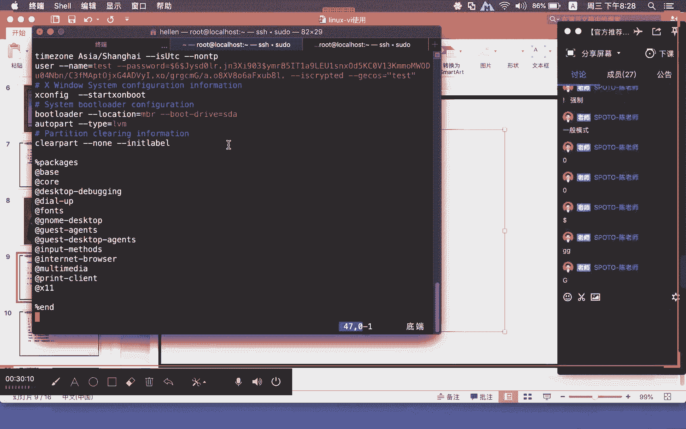

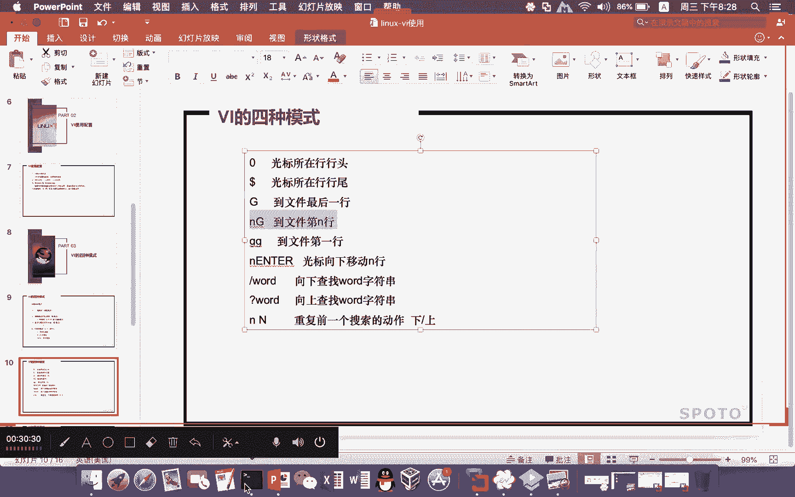

这样子的话，整个一个行号的一个定义的话，就非常的能够快速。我想到哪一行，我就到哪一行啊，只不过用的方式可能有所不同，你就不需要通过什么呢？左右方向这种方式呢去什么找个半天啊你要找个半天。

我还实在是太麻烦了，我们也确实没有必要这样干啊，文件过大的情况下，或者说啊还不是很大，但是有一定的量的情况下呢啊，上下左右啊，你小范围内找还好，但如果说有一定的跨度，那你愿上下左右肯定是不合适的啊。

肯定是不合适的。这是临刀了两个小写的G和一记有大写的一个G。那么在这里面的话呢，我们也经常会对文本文件进行什么呢？相应的什么呢？复制和粘贴。那么复制部分的话呢，大家要注意一个单词叫什么呢？Y。

那么这个Y它的英文单词全称是什么呢？YIELD就是复制的英文单词的一个意思。然后还有一个是小写的P啊，这个是PSTE粘贴的英文单词啊，不是CB copypy的这个什么啊，对应的单词啊。

那么在这个地方的话有一点不一样。所以大家在阅的时候呢要小心，比如说哈我要复制这一行。我要复制这一行啊，我要复制这一行。那可能有的同学说，哎，老师我能不能用鼠标这种方式进行复制粘贴。可以，没问题啊。

比如说我现在直接这样拷贝好了，然后我跑到什么呢？呃，你要复制到哪一行啊，我就跑到最后一行去，然后在这里按一下什么呢？编辑模式，然后把刚才这个什么呢？粘贴进来。😊，啊，这样子。他就把它给粘捏了。

这是一种方式，没有问题啊，这是一种方式没有问题。但是这种方式的话呢其实还是什么呢？比较慢。那用我们刚才教大家的这个什么呢Y和P这种方式的话，我们在操作过程当中啊，就变得什么呢？非常的快。

我们先跑到第三行去啊。诶。Sng。大写的记啊，我们先跑到第三行去。啊，跑到第三行是三大写的G，然后跑到这个第三行，我们就可以在这个地方的话呢去按什么呢？Y。Y啊那么YY就是指我要在。

这个位置光标所在行这个位置把这一行做为一次什么呢？复制动作。那么YY它其实也相当于是什么呢？Y1Y。啊，如果说大家想要复制光标锁上行开始数啊多少行。比如说我要复制两行，光标锁上行，包括光标手上行呃。

总共有两行，大家可以用什么呢？Y2Y哦，你刚才用这种鼠标的这种方式。如果说这个屏幕啊，他可能比如说可能这个屏幕啊，它就这么大。然后你要复制这么多，OK没问题。但如果说他要复制5十行的情况下。

你用鼠标这种方式去拉，你就不行了。对吧你你看我们这里这用VI这种形式去打开，你要复制50行，你想要往下面去拉拉不动的。超过这种更多的行进行复制粘贴的时候呢，你其实是非常的不方便啊，所以鼠标有好的地方啊。

可能大家不需要去记这些快捷的方式啊，但是呢也有不好的地方啊，像这种。长度相对函数比较多的情况下，你用鼠标这种方式可能就不是什么呢？特别的合适啊。同时如果你快捷方式用的很熟悉。

其实呢比用鼠标这种复制方式绝对是来的什么呢？更有效率。因为我不在进行这个什么呢？对应的这个行号确定的时候呢，我直接就是在一般模式下面，我并不需要什么呢？复制完。找到对应盘再切到什么呢编辑模式。

然后呢再粘贴进去，然后再把它保存。我并不需要这样这种动作，对不对？那我可以呢现在按一下这一行哈，比如说。啊，我就复制这一行啊，那我按什么呢？YY啊，按YY。两个小写的YY，然后我要复制到什么呢？

最后一行去，我按一个什么呢？大写的G，然后就跑到最后一行，然后按一个什么呢？小写的P。啊，这里这个P呢，它其实有分什么呢？小写和什么呢？大写。那么这个小写和大写的一个区别就在于什么呢？

如果是小写的P是将对应的行粘贴到什么呢？光标所在行的后面。哎，就比如说这个光标现在是在第三行，如果你在这个时候按了P，那么它就会复制在什么呢？第三行的下面啊，就会变成什么呢？新的第四行。

那如果你是一个什么呢？大写的P的话呢，那么这个时候就会把这个对应的内容粘贴到什么呢？啊，第三行的前面啊，那么这个新粘贴进来的这个行可能就会变成什么呢？新的第三行啊，我们在这里呢就按一个小写的P啊。

大家就可以看到你看我们这里就复制粘贴进来了是吧？那如果说我们想要复制更多的行啊，想要复制更多的行，那么想要复制更多的行，比如我要想要复制这些行啊，我想要复制这些行那你想要复制这些行的话呢。

那你在做的过程当中啊，你就可以通过什么呢？啊，比如说我可以看一下这里面到底有多少行啊，可能这个时候啊你可能得去数是吧啊，你可能得去数，比如说我们自己看一下12345678910。😊，11121314好。

这里面总共有14行。我们可以按一个什么呢？Y14Y啊，你看这个地方还告诉你说复制了14行有一个提醒，然后我现在这个地方啊将刚才复制的十四行呢把它粘贴下来啊，现在在这个地方大家就可以看到。

你看我们这里这D总共的这个什么呢？十四行呢就被你什么呢？粘贴下来了啊，这就是通过什么呢？Y和P来进行什么呢？复制和粘贴。那像刚才这种复制和粘贴以及编辑模式下面的增删改。

我们有些时候呢你的删除需要到什么呢？对应的这个什么呢？编辑模式下面去做删除。但在一般浏览模式下面，我们也可以去做删除动作，但这种删除动作它是通过什么呢快捷命令这个部分的B来做的。

而且这个删除动作其实还附带一个功能是什么呢？所谓的剪切功能。😊，然后，删除和简介，大家知道区别就在哪里啊。删除和简介啊，这个部分的话呃，大家应该会清楚它的一个区别吧。删除东西删了就没了是吧？

那如果是简切。你只是把这个位置的东西抠走啊，你想要把它再粘贴进去的话呢，你还可以再粘贴，对吧？我只是把你这个地方东西呢移到别的地方去，删除的话，直接就把你这个东西抠掉，抠掉就抠掉没了。就这个意思。

那我们按这个D的时候呢，它就有什么呢？删除和剪切这样的一个功能。你可以把它当做是简切。😊，你可以把它当做是简介。如果你剪切完了不做保存，那这个东西就是被当做什么呢？删除了。啊，如果你这个不当做这个剪切。

你啊就是你如果当做这个剪切的话，那你就可以什么呢？把它剪切完，还可以在剪切之后按什么呢？P来进行什么呢？对应的一个粘贴好，你看我们这里哈。我们呢跑到这个文本文件里面来哈。比如说我现在这个地方。

我呢写了这么多个A的这么一个函好，然后我们在这个地方做一个什么呢？做一个剪切，比如说按。滴滴。哎，大家看到没有啊？这个时候的AA这一行。就没了是不是啊，这个时候它就没了啊，那我们这个D跟前面的这个Y。

它在使用的这效果上面就格式上面效果不一样，但是格式上面比较相近啊，比如说第YD那么就是指删除光标所在行这一行那如果是第2D就表示什么呢？删除什么呢？两行啊。

你可以是EDD也可以是2DD也可以像刚才那个Y也是这样子EYY2YY它这个都O哈，没问题啊，只不过在写的时候呢，可能大家习惯会有些不一样啊，那么第一D就是指光标行删掉然后第二D就是指什么呢？

光标首向行开始，包括后面一行总共两行都把它给删掉啊，或者说剪切掉。那我们刚才这个A这个行是不是已经被你什么呢？删除了，或者说被你剪切了。如果你这个时候不做粘接不按P啊，我直接在这个地方直接做一个什么呢？

写度动作，那你刚才这个什么呢？链接就没有用办法用了。因为这个时候已经被什么呢？保存了啊，保存这个是。😊，指什么呢？写入啊，这个是指写入。那么写入完啊，那刚才这个更改就会产生效果。那如果说我没有写入。

那这个还有什么呢？转换的余地，我们还可以进行后续的什么的撤销动作。就比如说我退出的时候，我不保存。那你这个其实就相当于是什么？刚才所有的这个动作呢都是什么呢？被撤销了。那我可以按一个P啊。

你看我们这里按一个P之后呢，这个地方就被它什么呢？粘贴出来了。这个就相当于什么剪切了。就删除和剪切这样的一种效果。OK讲到这里，我现在提一个小问题啊，提一个小问题啊，做个简单的小回顾。

看一下大家消化的怎么样。比如说第一大写的G问大家这个它实现的效果是什么？来，各位同学，大家想一下，你把这两个东西拆开。你把这两个东西拆一看，因为D我给大家讲删除或减切的一个意思。那么大写的G是指什么呢？

到光标的什么呢？最后一行哎，这个是什么啊，很多同学说删除最后一行，删除尾行。啊，还有没有其他答案的？大家可以猜一猜大家可以猜一猜。全山啊战国与上，我知道战国雨上他想描述的东西啊。

但是还没有描述的特别精准一点啊。其他同学的话可能。呃，其实好大家如果说不是特别明白，我们也可以做一个小实验啊，这最终实现的一个效果就是指什么呢？从光标所上行开始。哎，对了，我猫V讲的是非常对的啊。

包括分从这一行到尾行全三，没错，就是这个意思。啊，比如说我们现在在这个地方。😊，我们从这一行开始。我们从这一行开始，按小写的D加一个什么呢？大写的G。你看我们这里这个重的就全部商啊，G是到什么呢？

最后一行。大写的G是到什么呢？最后一行啊。大家这些关键的字符啊，大家不用太过担心。因为PPT当中的话，像这些关键的字符我都会给大家什么呢罗列出来。所以大家在用的过程当中啊，可以好好的去看一下。

因为也有对应配套的这个什么VI的一个练习啊，回头呢让大家去加深这个印象啊，今天呢我们可以先看一下啊，听完之后呢有一个印象之后呢，再回头去做相关的这个VI的一些练习啊。那我们刚才这个什么呢就删除完成了。

大家就可以看到啊，刚才的这个操作好，那如果说像有一些操作啊，你反悔了，不想做那我们可以按一个什么呢U。😊，按一个U，那么这里的U它的一个单词其实是什么呢？UNDO啊。

and doand do是什么意思啊？安度是什么意思？各位同学安度就是说不要做啊。撤销对了啊，不执行。哎，没错啊，这个mountain不是删除啊，按度就是撤销啊，就撤销反悔了。啊，反悔了。

比如说我们刚才这个剪切，让我按一个U，大家可以看到，你看我这里哎，我刚才是这个什么呢？删除动作，他又把刚才手上的这个东西又给你什么呢？还原回来了。😊，这就是一个什么呢？U它的一个作用啊。

U它这样一个作用。因为有的时候呢可能大家在做这个几步的过程当中啊，可能有一些步不是我想要的那你可以怎么呢？撤销。这样子的话就变得什么呢？非常的方便啊非常的方便。我并不需要呢退出啊，不需要呢不保存的退出。

然后再进来啊，不保存的退出也算是一种撤销。但这种撤销的代价可能会比较大。假设你的前面的文件编辑啊已经做了很多的更新这个时候想要退出啊，直接不保存这种退出的话，那意味着你重新进来之后。

之前的那些动作你可能还要再做一遍啊，就是为了撤销你最后一步啊，把所有的动作都给撤销了，可能有点什么呢？代价比较大，成本比较高一遍啊，那么这个是就是什么呢？撤销动作。那我们刚才在做这个什么呢？

B这种删除动作和Y这种删除动作的时候呢，可能大家也没有关注到一个东西啊，比如说。我要去复制对应的这个函。啊，我要复制这么多行。那可能很多同学刚才就已经感受到了。老师啊，你这个要还要去数吗？

确实我一定要去数，因为我怕什么，我怕复制函数行错了，对吧？比如说这个是十5行，结果我算成十六行，那你这个只复制粘贴的时候呢，可能就多复制，也有可能甚至少复制，我比如说这个十5行。

我可能只算了十三行十四行，你少复制了一行。那碰到这种情况，我们还可以怎么做，我们可以用到这里面介绍到了什么呢？第四种模式。😊。

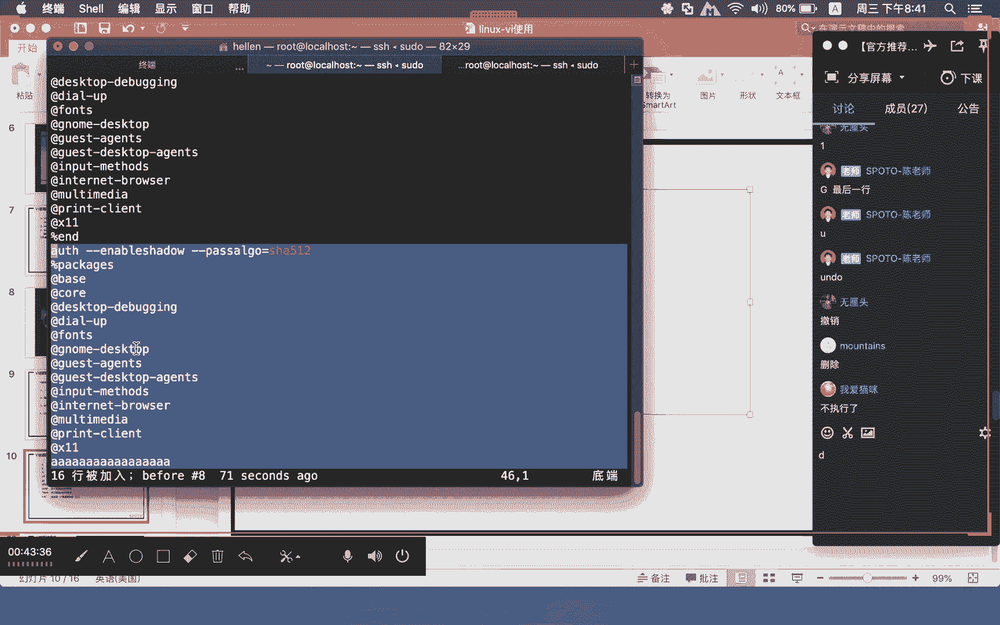

就是所谓的什么呢？可视化模式。哎，可视化模式。那么这种可视化模式的话呢，这里有分三种。第一种是什么呢？小写的V字符可视化，还有一种是什么呢？大写的V，这个是什么呢？含可视化，还有一个是什么呢？

ctrorl加V是什么呢？快可视化。那如果说涉及这些含比较多的情况下，我们建议的是越第二种方式，所谓的什么呢？含可视化。那么含可视化的话，我们可以这样干。按一个就在一般模式下面啊。

大家想要进入可视化模式的话。

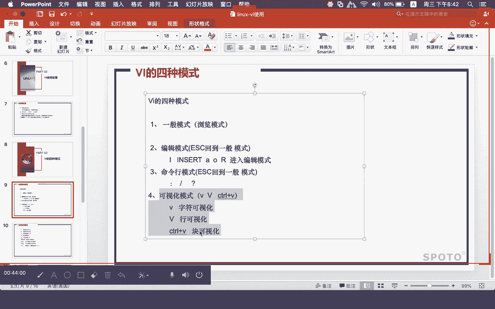

啊，本来正常情况下，这个也算是命令函模式啊就是。在一般模式下面。大部分情况下，快捷都是在一般模式下面去敲对应的快捷命令啊，就在一般模式下面啊按一个什么呢？大写的V。按一个大写的V就进入了什么呢？

含可视化。但其实这种怎么说是为什么他说是可视化呢？其实我是觉得也是一种快捷方式。至于说为什么叫含可视化，大家可以感受一下，看看是什么意思啊。你看我这里啊，我现在按一个大写的V。这个地方大家写的时候哈。

大家可以哈，因为他这里标记的时候就是写什么呢？哎。😊，啊，你们不要按这个ESC按ESC这个可视化就退出了哈。😊，你ESC可能按一次不够，你可以多按几次啊。我们按一个啊可视函，它这里就写了可视函。好。

这个时候可视行进来的时候呢，比如说你刚才不是说我要复制到这个A这一行来吗？是不是啊，你要去数，怕数错了。那我现在呢根本就不用关心我到底有多少行，反正我就下拉大家看到没有？我用的是什么东西下拉呢？啊。

就是键盘当中的什么呢？向下键进行下拉啊，我们就这样一直下拉。如果你觉得你要复制到这一行可以，那下拉好，在这个地方就可以按什么呢？Y。好，你看我们这里就复制了什么呢？十六行。

那复制十6行现在呢就可以对它进行什么呢？粘贴啊，你看我们这里就粘贴下来了，十6行就粘贴下来了。好，因为我刚才按的是大写的呃P，所以它复制到了最后一个A这一行的前面去了啊，如果小写的B的话是A后面的行。

😊，这是什么呢？含可视化。那如果说是这个什么呢？呃删除的动作的话呢，它也是一样的。我们还是在这个地方按一个什么呢？大写的V啊。按一个大写的B，那你要删除是不是删除这十6行，是不是OK没问题。

我可以呢就这样子也是这样下拉。然后在这个地方按的是什么呢？删除D啊，小写的D哎。小写的地，那就把对应的这个什么呢？我要把这个，你看我这个按一个按一个D按一个D啊，按一个D，它就把什么呢？

你刚才所选中的这些地方啊都给你什么呢？删除掉了。OK这是什么呢？行模式。那如果说。是这种快。可视化的话呢，你看我们这里哈有讲到是字符可视化。还有一个是什么呢conttrol V快可视化。

我们呢给大家做一个小例子啊，因为这个快可视化和这个含可视化月的可能还会更多一点啊，大家可以感受一下。😊，我给大家做一个小文件，一点。FILE这个文件。然后这个文件当中的话，我们写成这样子AA。

AA好毛控的。诶。AA这样空格，然后123456。然后哔哔哔哔哔。然后也是这样。随便哈，然后嘻嘻嘻嘻嘻。啊。好，我们这样写好了，然后我们现在打开它进入我们的这个什么呢？快可视化。快可视化的话。

它是要加什么呢conttrol加V啊，这个时候它就变成什么呢？可视快啊，可视快那可视快是怎么做呢？大家看我这里。😊，你看到没有啊？我刚才用到的是什么呢？左右方向键来进行组合。

那比如说我现在光标在第一行的第一列，那么他选择的时候呢，他就会把什么呢？第一行的第一列。包括后面对应的什么呢？各个行的第一列都会给你什么呢？统一选择好啊。如果说你想要选择每一行的多少列啊，每一行的。

比如说这个。三个A都给他选。那么后面的这个也是齐刷刷的给你什么呢？都选了这种嘛所谓的东西就是刚才说的什么呢快啊，它成双它成块的什么呢？给你方式给你去选择。就是含可视化它是什么呢？

成行的给你什么去做这种选择啊，所以使用上面的话有所不同。那我们这种快可视化，它在进行这种什么呢？相应操作的时候呢，它可以取里面的什么呢部分啊，它可以取里面的这个部分啊，你想取这里面的这个部分块啊。

比如说就这样子就很简单是吧？想要进行操作删除。那我删除的时候呢，我就只要前面这一部分选好，直接删啊，一刀切下来，齐齐整整的把整个文件按照一定的格式将辑什么呢？删除掉，切的非常整齐。

我就是把前面的多少个字我把你全部切了，就这么一个意思。😊，啊，这就是所谓的什么呢？快可视化。然后它在使用的过程当中，这个什么呢？Y呀D呀，跟刚才含可视化这里面操作过程当中的一些什么快捷字符也是类似的。

啊，这是。快可视化。那么除了这个快可视化，还有一个什么呢？小写的叫什么呢？字符可视化。大家在这个地方可以按一个小写的V。那么这里面它就没有写快可视，没有写含可视，它就直接写到一个什么呢？可视。

那么这个可视部分的话呢，它在使0用的时候呢，啊，它会根据你光标的一个什么呢？起始点和结束点来进行选择。😊，啊，它有一个基时范围和接束范围啊，含和可含和这个快的话，它就是一个快和一个什么的全部的含。

那么这种的话，它就不是说啊我的所有的函啊，你光标在这一行，但是我在选择的时候，是从光标的这一行的这个光标这一行的这个什么呢？字符开始算。呃，并不是什么呢？把这一行光标手上行的整行给他去做宣传。

其他部分的话没有太大差异啊，就这么一个意思啊。所以在这个部分的话，可以给大家什么呢？更大的一个补充啊，你在进行复制粘贴的时候，我可以照什么呢？可视可视化这个下面来含可视化下面，我可以去选择对应的函。

然后呢，把这个什么呢？对应的这个数据啊进行什么呢？复制粘贴，让你操作呢会变得什么呢？更为的什么呢？精准，根本就不需要什么呢？用鼠标的这种形式去拉取做选择。我们刚才做这种可视化。

你可能感觉到了这个东西啊就有一点像什么呢？像我word文本中端下面这种什么呢？鼠标的这种选择。你看我们在进行这个鼠标用鼠标来进行选择的时候，大家不是也是这样拉吗？对不对？但是我在可视化上面的话。

我根本就不需要这个鼠标啊，我直接用它这个可视化，我就可以用这个什么上下左右这个方向键来进行什么呢？区块的一些选择来进行行的选择来进行什么呢？字符的这种选择。所以它整个实用起来会变得什么呢？

非常的一个方便。😊，这是什么呢？啊可视化模式下面我们会经常运到了这样的一个什么呢啊效果啊所以呢这一部分东西在这一次课程当中，我也把它给增加进来。

就是希望呢能够让大家什么呢啊愿的这个VI啊知道的东西更多一点。然后在后期的这个实验里面啊，让大家整个VI的一个什么掌控啊，变得什么呢更为灵活快捷啊，大家听完这个VI啊。

可能会觉得这个里面的一些命令啊会比较多一点啊。但是呢因为在后期我们做比如说基础课程过了，大家上这个提升课程啊，或者说你基础课程过了，做一些相关配置文件一些调整。

个人都是建议大家呢去阅什么呢VI这种形式去做，尽量不要去越那个什么记事本啊，用这个什么GEDID这种方式去做。因为这个东西啊用多了，对你来讲的话，其实没有太大的帮助啊。

那个记事本谁都会你都没学过这个linux的人，只要图形界面打开，想要编辑文本你直接双击人家就打开了是吧？那个东西根本就不用学，但实际我们很少会接触到什么呢？

图形界面业务的整个操作都是通过远程文本终端的形式进行相应的什么呢啊，配置相应的什么呃系统的操作与维护，所以呢VI的这个实验呢，是大家肯定是绕不开，是必须得什么掌握的。啊，如果说这个东西不掌握。

你后面的这种学习啊会相对什么呢？比较吃力一点。不过呢随着学习的这个深入啊，有的时候呢你会一直怨他，慢慢慢慢的你就会熟练它。所以呢你也不要从心理上面去抵住他啊。如果说你一下子没有办法接受。

那就随遇而安吧啊，那就随缘吧啊，大家就可以佛系一点，我觉得没什么问题啊，碰到不明白的，你拿出来再敲一敲，我觉得问题也不大啊，真碰到说哎我这个配置搞不定了啊，如果有办法图形，那你可以用图形搞，没问题。

也能解决问题，就是了就是你可能用图形的时候，还得先折腾一下图形啊什么之类的半天啊，我们用文本。😊，因为VI这种形式可能一下子就搞定，我不需要再去折腾其他的东西。所以早先就有同学问，哎，老师这个VNC啊。

搭这个远程桌面这个。啊，跟那个什么的windows下面搭那个什么的远程桌面这个东西啊，什么这种类似的东西啊。他说这个windows下面要怎么做啊，winNC这个搭起来呢比较简单，也不会太难啊。

但我现在至少在目前来看，我并不希望大家去用这个东西。尽量的先农基础，像这种什么VI啊基础命令啊，这些东西啊，先掌握住，然后慢慢慢再去做其他的东西啊。那在使用这个VI的时候呢，还有一个什么呢？命令行模式。

那么这个命令行模式下面的话呢，我们刚才是用什么呢？shift就在一般模式下面啊，浏览模式下面按这个什么呢？shift啊，shift加什么呢？冒号shift和冒号同时按住，然后在我们的这个什么呢？

屏幕的这个什么呢？左下角。啊，屏幕的这个左下角就会有一个什么呢？对应的冒号啊，这里会有一个什么冒号。那相应的一些什么呢？命令啊，我们刚才前面讲都是在一般模式下面按快捷命令，那么这种就不是快捷命令。

这种就需要在什么呢？命令行冒号这个后面去敲什么呢？对应的一个命令。那我们在这个地方命令行模式下面哈，除了用se冒号可以去做相关的，我们还可以通过这么啥，直接就在一般模式下面按一个什么呢？斜杠。

然后去查找东西。啊，因为你文本在找这种相关东西的时候呢，你可能并不能很精确的知道说对应的创对应的函到底是在哪一行。我可能只记得部分字符。那我们可以先用什么呢？斜杠bo去做这个查找啊，那么在查找的时候呢。

大家可以通过什么呢？啊，上下通过这里面的这个N来进行什么呢？上下查找。小写的N。他这里面有小写的N，还有一个什么呢？大写的N小写的N，比如说我呢先退出来啊。😊，系。我先退出来一下，然后我重新打开啊。

比如说我现在先找。上下翻一下啊，不t。啊，大家就可以看到我现在bo是在光标行啊，现在是在这一行啊后大家按一个N啊，大家可以看到呢，我现在跳到了这一行来啊。如果你是一个什么大写的N，它就向上查找啊。

小写的N就是从光标所在行位置向下查找，这是不一样的一个地方啊，这个查找的话呢，就是用一个什么呢？斜杠来完成查找。那么一旦查找到了，在系统当中啊对应的创就会以什么呢？高亮的这种形式来进行什么呢？表示。

所以有的很多同学觉得说哎老师为什么我的这个文件打开的时候呢，会莫名其妙的有很多字符是高亮显示的那是因为在上一次什么呢？操作过程当中，有人对这个字符做了什么呢？对应的一个查找。比如说我按一个B。

那我就是要查找这个字符文本当中B这个字符，你看我这个B这个时候就会看到什么呢？所有的B都会被什么呢？高亮显示。啊，你这个东西就非常多了嘛。对吧？那如果说你想要取消这个高量显示，让整个文本看的什么呢。😊。

啊，恢复往常，你可以在这个查找部分的话敲一个什么呢？他肯定找不到的东西。这个时候他就会提示你说找不到模式。那就是因为他找不到这个串啊，那么这一部分之前被记录的高量显示的这些串。

因为你刚才的这个查找不到啊，那么这些高量都会被什么呢？取消掉。它只记录什么呢？最后一次查找的内容啊，那么最后一次查不到，那么它就不会高量形式去显示了。啊，所以呢这是查找部分。

那么sit加冒号这种命令函模式下面的话，它也有什么呢？查找功能。它不但有查找，它还有什么呢？替换功能。哎，也就是说我们通过s冒号这种方式啊，我们可以查找和替换。

那么在这个地方在进行这个查找和替换的时候呢，它是怎么做呢？啊，我们可以通过冒号一。逗号啊，一逗号多了符号。那么这个意思就是说从第一行开始到什么呢？最后一行我们要做的是什么呢？查找S斜杠。

比如说X替换成什么呢？Y，这就是它的一个什么呢？固定格式，这里面的这个固定格式前面是固定的一逗号，就在命令函模式下面一逗号多了，然后呢，S就指什么呢？search查找啊，查找什么替换成就把X这个串找到。

然后把它全部替换成什么呢？Y这里面的这个第一个斜杠，第二个斜杠，第三个斜杠，这就是一个什么呢？固定格式，然后这里还有一个什么呢？小写的G。那么这里面的这个G啊是有一定的讲究的啊，我们拿一个小文本啊。

让大家感受一下这个文件在进行这个查找和替换的过程当中啊，它的一个什么呢？不一样的一个什么呢？地方。那我们也是这样一逗号多。我先对这个文件呢做一下什么呢？修改啊。啊，比如说这样子。我先保存一下。

然后我重新进来，然后一逗号多了。S。我想要将什么呢？AAA把它替换成什么呢？DDD。啊，然后就这样敲哦，大家就可以看到什么呢？😊，我们在进行查找了AA啊，它这边的这个AA就高量显示了。

但是我们没有在加减器的情况下呢，它只替换什么呢？所查找对应行查找到的第一次匹配到的串。那么对于后面。第二次匹配到创，它不会对其进行什么呢？替换啊，我刚才这个操作的话，我不打算保存，那我们现在重新进来啊。

啊，那个我们现在呢在这个地方查找的时候呢，我们加一个G。啊，那么这个之后呢，他做出来的这个查找和替换呢，就会将什么呢？这个文件当中碰到的这个串全部替换啊，不管是第一次碰到了。

还是就是说这个第一每一行当中啊，不管是第一次碰到还是第二行碰到，因为他在次进行处理的时候呢，都逐行处理啊。那不管是第一次碰到还是第二次碰到，那么对应的这个串都会按照这个计划替换成什么呢？三个D。

我们现在这样敲下去，大家就可以看到这个时候呢这个操作啊。第二个。三个A那个串也被他替换成了什么3个D。好，这个就是什么呢？查找和替换。那么在查找和替换的过程当中呢，有一些字符，它是属于什么呢？关键字符。

比如说这个鞋杠，我们刚才说它的格式里面固定格式里面就带有鞋杠。那如果说我刚好要查找和替换的这个创，就是一个什么呢？斜杠的情况下，那你要对它进行什么呢？转移。哦，要转移完才能够对它进行什么呢？查找到。

然后才能够对它进行什么呢？替换掉，要不然它在使用的过程当中，他会认为哦，这是我的固定格式，它会撒掉。整个语法格式到时候就可能出现问题，我们就做一个什么呢？非常简单。你看我们这里。8。Bi。CC啊。

我们有这样的一个什么呢？类似路径这样的一个写法啊，大家在用这个命令行模式的时候呢，你可以通过进入命令行模式之后，可以通过上下键来翻出之前的什么呢？历史命令啊。比如说我现在要查找，呃。

我们如果按正常的没做转移情况下，大家按这样写，可能很多同学就看看晕了哦，老师，你这里这么多个斜杠，我到时候怎么看是吧？你可能自己都搞不明白。比如说我要将这个斜杠改成什么呢？双引号。上以号他不愿转义。

但如果你恩这样去写，他就告诉你说找不到模式AAA。对，是不是？这个就有问题了。那我们需要将什么呢？这里的这个斜杠作为一个什么呢？转移。那意思就是说啊这是固定格式的，这是固定格式的。

然后只有这个是我们要对它进行查找和替换的对吧？我们要将这个什么呢？斜杠替换成什么呢？双引号，我们现在敲下去。好，在这个地方大家就可以看到什么呢？变成了什么呢？双引号。

也就是说把刚才的这个斜杠变成了什么呢？双引号啊，他就是告诉你有三次替换。有三次替换，因为我们确实有三个斜杠，所以他就进行了什么呢？三次的一个替换。好。

这是是我们VI当中啊经常使用的一些什么呢方法和方式啊。那么有一些可能还没有介绍到。大家如果说在看这个PPT的时候哈，有一些不明白，大家可以拿出来去问一下啊，比如说像这个什么呢？

XX这个是向后删除和什么呢？向前删除小写的X向后删大写的是什么？退格删啊，然后包括这个什么呢？N1N2这个N1N2就跟我们刚才查找和替换的是有一点类似。这个是什么意思啊？

我们刚才是一逗号什么呢do那意思就是说什么呀？呃第一行到最后一行，你如果说想要什么呢？第一行到第二行啊，第一行到第五行，那你可以一逗号5这样类似去做什么呢？查找和替换其他部分的话。

大家应该都会比较什么呢？清楚一点。好，这里还有一个东西第啊第的话大家可以把这两个字符拆开去做理解D指的是删除指的是什么呢？当前行的什么呢？行尾那么。

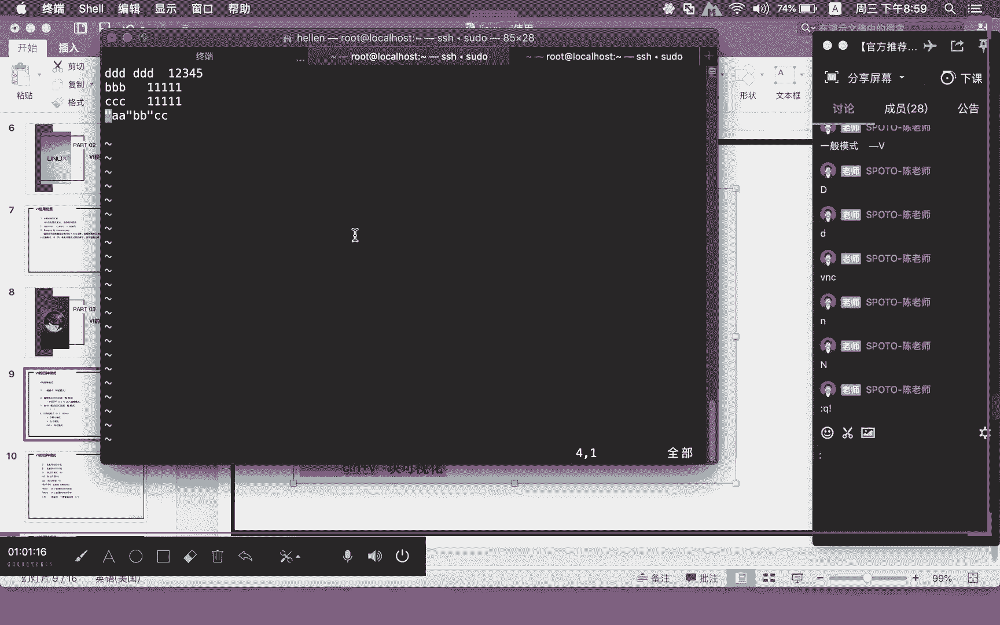

意思就是说光标位置开始翻翻到该行的行尾啊，前面这个是。点大写的G是删除到文件的最后一栏。那么这个呢是删除到什么呢？光标含的什么呢？最后一个字符啊，光标函是含的最后一。

所以它使用的上面的话呢会有所不同啊会有所不同。呃，W部分的话，这里我们刚才说W是保存WQ是保存退出，然后WQ感叹号它是强制离开U是撤销点号呢是重复前一次动作。那么这里面写到这个重复前一次动作的话。

大家看一看我们这里哈，比如说我们现在做一个什么呢？Y，然后按一个P。

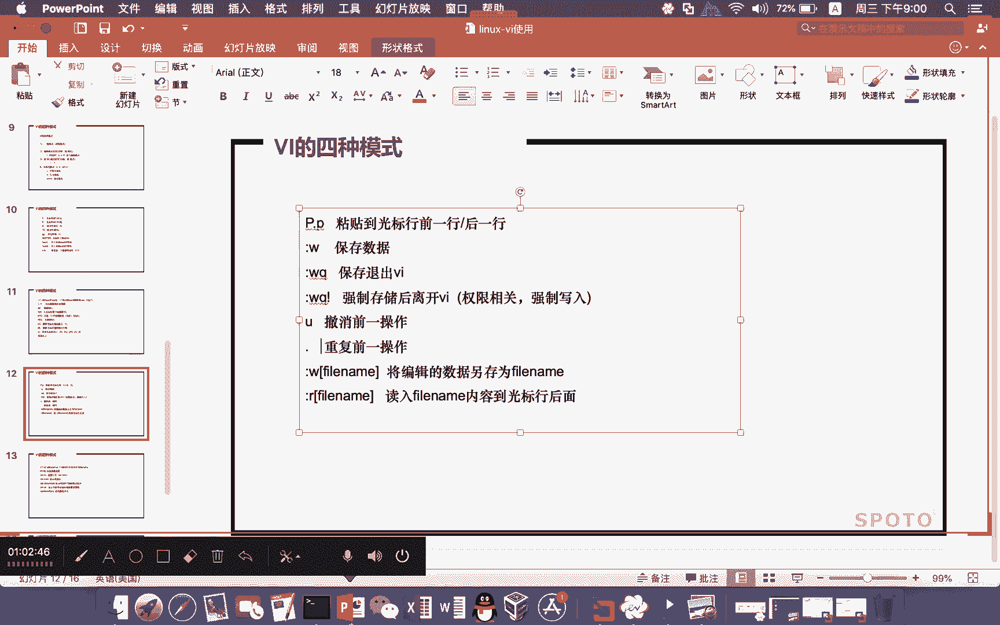

啊，我按1个YY哈，按1个P啊，你这个时候呢可以不用按P了，你这个时候可以按点号。😊，因为点号是什么意思？就重复你刚才前面的一步动作。你刚才前面那一步动作是什么？前面那一步动作是什么？是粘贴。

所以我这个时候按P和按什么呢？点号是一模一样，优势什么呢？刚才已经介绍是撤销动作，对吧？优势撤销动作。OK那么VI部分的这个什么呢？呃介绍我们先。

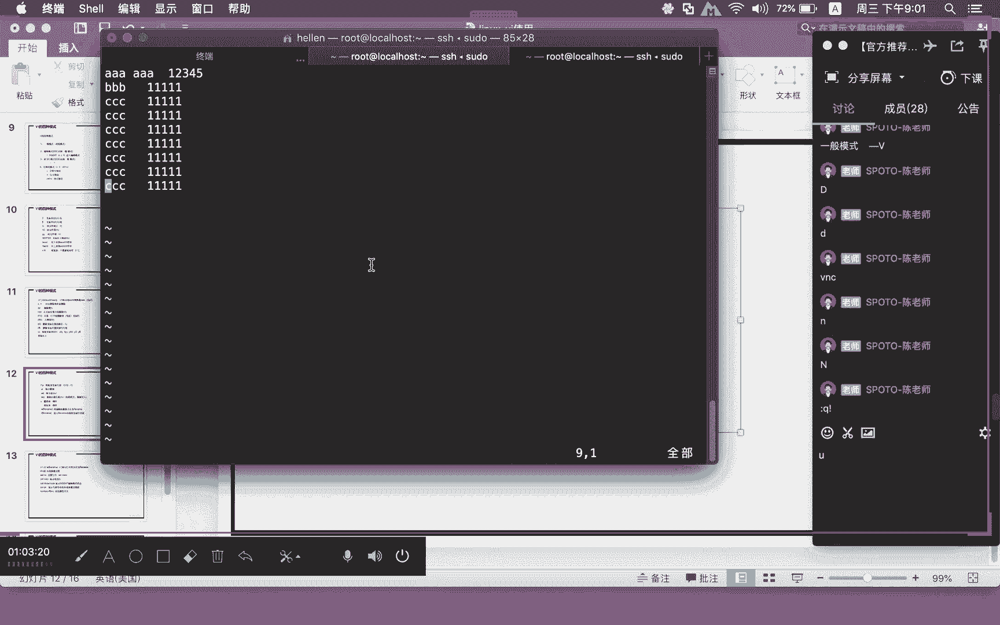

暂时休息一下啊，因为我们还有一部分内容，就VI还有一部分的一个重要内容，我们还没有给大家介绍到啊，可能这一部分的话也是非常重要。希望大家稍微休息一下。稍后呢我们来继续这一部分啊。

我们在9点10分的时候呢。来继续VI部分的这个内容啊。在9点01分，我们9点10分继续上课啊。

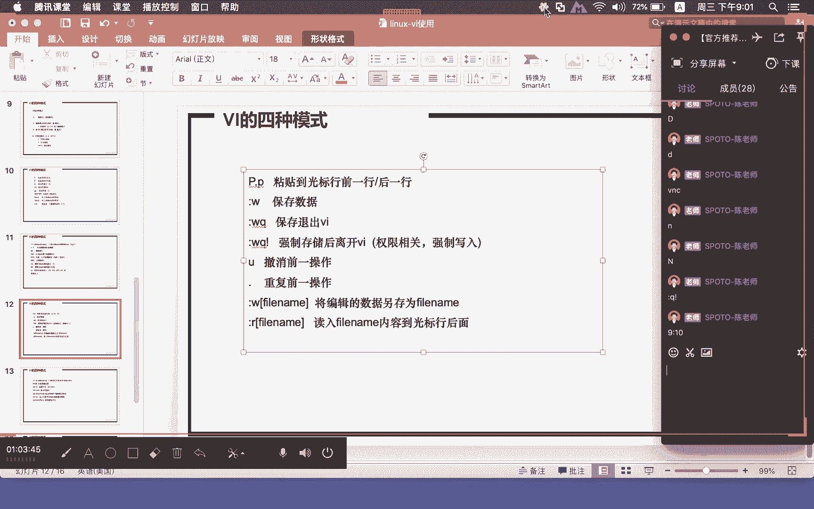