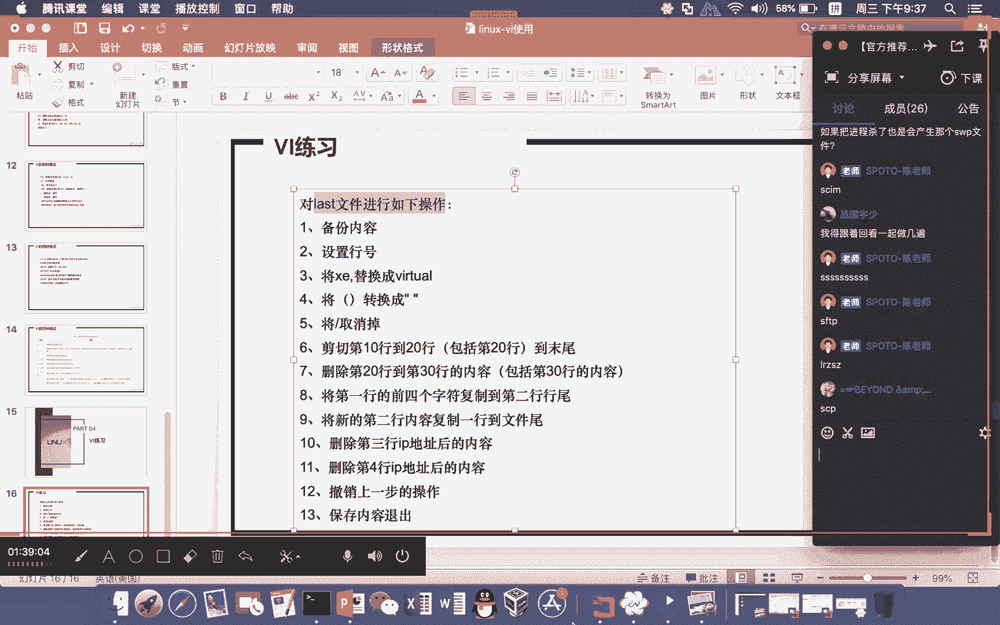

# Linux基础课程（RHCSA）简简单单学会Linux入门教程 - P4：第二节课vim-2 - 思博Linux关关 - BV1fv411j7RG

预习一遍。旧视频再来上课吗？还是听完再复习啊，叨宝有办法最好是先预习一遍再来上课。上完课再复习啊，这样可能会更好一点。因为这样子的话印象会比较深刻啊，只要时间你上面允许的话，我觉得是可以的。

因为前面也有早期的一些录屏哈，那么。我们每一期一般都会有一些内容上面的一些什么呢？小消这个小修小小调整就会有一些不一样的地方。但大部分的话至少在版本没有变动之前啊，应该都是差不多的。

比如像VI这个部分的一个使用啊。PPT不一样PPT会有一些不一样，但大部分是相同的大部分是相同的。比如这一期我们这个内容里面就增加了可视化这一块的一个知识点啊，但是其他部分安装部分的话。

我们这一期也增加了什么呢？的文档以及安装的一些什么的介绍，所以都会有。但是有一些地方的话略有不同啊，略有不同。所以尽量是呃可以先布之前的视频看一遍，然后来听啊，完了之后呢，在当期的这个视频呢。

回头回顾的时候呢，再录屏再看一下啊，然后再去做相关的一些练习，可能这样子消化吸收起来会。印象会更深，更对你后面的这个知识的这个消化呢会更好一点。那我们接下来给大家看的一个东西是什么呢？就是。

前面刚才这个部分还没有给大家介绍到的，就是VI的一个什么呢？使用的一个配置。呃，在linux下面啊，大家现在看到是在红贸企业版下面，我们用的这个VI的一个什么呢相关的一个使用习惯。

那么在不同的这个linux下面，比如说到油邦图下面，那么他可能在使用这个VI的时候呢，会有一些些不一样啊，但是大部分也都相一致啊，包括这个配置部分的话，可能也会有所不同化。我们在。红贸企业绑下面啊。

比如说大家现在想要去做相应的这个什么的设置，然后EDCVIMRC这个地方。那么这个是一个什么呢？根据什么呢？它的这个全局配置啊，产生的这个VI环境的一个什么呢环境的一个影响。这个就是什么VIMRC。

那么这个地方它设置会设置哪些东西呢？

我们可以打开这个文件，我给大家看一下。我们打开EDC下面的这个什么呢VIMRT这个文件。哦，比如说我们现在在这个设置过程当中有一个什么呢行号的一个设置。你看我们这里哈，我们打开一个文件的时候呢。

它在这个地方并不会去显示我现在是第几行第几行啊，就是说在前面这个部分它没有去显示第几行，只有在这个什么文本。整个文件的这个什么的左右下角这里才会显示说我当前是在哪一行。

如果说我想要去显示对应的一个行号的话呢，大家需要跑到什么呢？命令行模式下面。啊，在这个地方呢去写入什么呢？set number或者直接输什么呢？set NU就这样哦，你们就可以看到呢。

当下在这个地方前面就会给你补充说什么啊，我有多少行多少行这样给你显示出来。那么这种设置啊啊在默认的情况下呢，这种设置只是临时性啊，我们现在呢。操作完退出，重新再进入，你会发现这个行号是没有了啊。

如果说我们想要去对这个行号去做这个什么呢？永久性的调整的话呢，那一个是全局的配置调整，还有一个是什么呢？对应。

啊，对用户这个加目录下面的这个什么呢？YMRC这个地方的一个什么呢？设置的一个调整。我们呢可以作一个调整，让大家感受一下啊，大家来看一下。

我们打开。对应的这个用户。现在呢我们现在是在什么呢？root用户下面。那如果说我们想要让root用户只是这个用户啊，刚才的这个行号每一次进入文本文件的时候都能显示行号。那我们需要到用户加目录下面啊。

用户的这个加目录的话呢，它是通过CD波浪号呢进入的那root用户，它的加目录呢是在么斜杠root这个下面的。我们可以进入到这个路径下面有一个什么呢？VM。RT这个文件。那如果这个文件它不存在。

大家可以通过什么呢？VIM点VIMRC这种方式将这个文件给它创建出来。好，大家用1个VIM去打开一个什么呢？不存在文件的时候呢，它是可以打开的。那如果说你对这个文件进行保存。就是说你打开这个文件。啊。

即便你没有写入内容，只是在退出的时候做了什么保存退出。那么这个文件就相当于什么被你新建出来了。那如果说你。在打开一个不存在的文件，在退出的时候并没有去保存。那么这个文件呢它还是什么呢？不存在。

那我们现在打开，大家就可以看到，在这个地方提示你是一个什么呢？新文件。那我们在这里就可以去写入什么呢？s number。啊，set number。那么写完这个东西后，我们可以通过sourcece。

点VMRC啊，这个方式写完之后啊，通过source啊，通过source这个动作啊，它其实就相当于什么？将刚才命令当中就文本文件当中里面的这个命令啊放到当前的这个终端下面来执行。

我们在提升课程当中会给大家介绍到什么呢？需要脚本当中的这个什么呢？exportEXPORT。EXPORT和这个什么呢？SOUICE这两个东西的一个区别啊，这个部分的话是蛮考验大家的东西的。

因为这里面很多学linux的同学可能还搞不明白这两个东西到底有什么区别啊，我们在课程sha脚本编写里面哈，就提升课程里面我们有专门的一个专题，专门给大家讲这个什么呢shaare脚本。前几天。啊。

我们的唐老师就给大家分享过一个公开课，就专门讲这个什么呢？校要脚本的。所以大家如果有兴趣哈，也可以先去拿公开课里面那个校要脚本那一块呢啊，昨天是吧比较呃我又不知道具体是哪来一个时间哈。

反正我们唐老师有讲过，呃，我们校要脚本的这个公开课应该是有讲过两三次，所以大家这个可以去找对应的班主任老师啊，去。要这个什么呢？关于赛尔脚本的一个什么的公开课的一个什么呢视频啊。

也可以如果有兴趣啊同学啊也可以去看一看啊，我们那个提升课程里面，s尔脚本到底都教大家一些什么内容啊，你们可以去了解。那我们现在呢因为渲要脚本这个东西啊太重要了啊，source是从内存写入是吧？

不是哈source是什么意思？source是指在source后面所跟的文件，它会将文件当中里面的这个内容抽出来，放在这个什么呢？终端下面来执行。哎，比要呢你说的这个有一定的什么呢？意思。

你可以认为是在什么呢附进程啊，就跑到。因为你这个脚本运行的过程当中，其实这个终端对于这个进程来讲，它就是附进程。你把里面的东西抽出来放到这个终端下面来执行，就相当于是在它的这个什么呢？附进程来执行。

可以这样理解。那我们刚才做好重新去进入到这个什么呢？文本文件。我们来看一下，这个时候你们就可以注意到这个时候的这个文件在打开的过程当中，我没有进行行号设置的情况下，已经默认什么呢？给大家展示出这个行号。

呃，这样子就形成了一个什么呢？远久的一个什么呢？行号设置。那如果说大家想要取消这个行号，一种办法，把刚才那个配置干嘛清掉，对吧？啊，另外一种办法也可以在这里呢做临时取消。那么临时取消。

它运到命令的话是命令行模式下面运这个什么呢set。NONU这种方式。那么set NONU啊，你把它猜出来，它的英文单词应该很好理解，就set not number。啊，不要显示行号啊。

我们显示行号的时候是写的什么set nUMBR显示行号啊，所以每个人啊可能会有不同的习惯。有的同学习惯说，哎，老师，我希望进来一个文本文件，我能看到行号。因为有看到行号。

你可能在定义定位相关的一个行的时候呢，会比较方便一点。但其实这个每个人习惯不同嘛。啊像我自己我一般也不会去定义行号啊。我就可能就看。定位到哪一行，我就定位到哪一行。

然后也会配合这个右下角这里去看当前是在哪一行。啊，是这样的一个状态啊，当然每个人习惯不同，你们可以根据自己的一个情况去做什么呢？对应的这个什么呢配置文件相应的一个调整，要显示行号就显示号，不显示行号。

你就不要去显示行号。想要临时显示，那你就运行命令啊。我们把这个东西删掉啊，回头呢你再source一下，点YMRC。啊，这个完了之后呢，你再打开这里面的这个行号就不会有了啊。

所以这是临时设置和原久设置的一个什么？不同的一个地方。好，那如果说你想要对所有的一个用户都希望在它进行这个文本文件编辑的时候呢，都能够进行什么呢？很好的一个设置的话，那你要做的一个东西就是在什么呢？

EDT下面的VMRC这个地方去添加这个什么呢stand number。那我们现在在这个地方的话，其实你是看不到这个命令的。d number你看我们这个地方看不到。

那你们可以在这个地方去添加对应的一条命令。dta number写到这里面来。那你如果说这个东西做好了也一样需要做什么呢？sourceEDCVMC那如果这个东西做完，那不管哪个用户。

他在打开文本文件的时候呢，他都有什么呢？对应行号显示。好，这是VIM配置过程当中的一些什么呢？比较有用的一些配置啊。当然我们刚才这个只是讲到行号的一个设置。那其实就就其实除了这个行号的一些设置的话呢。

大家还可以去看我们这里，比如说VM info啊，它这里就显示对应的这个什么呢啊读写相关的一些什么信息的一些提示。然后这个什么呢？历史命令的一个什么呢？保存多少条好，我们刚才说在命令行模式下面。

大家可以通过什么呢？上下键来方啊，我之前执行的命令是什么？那么在上下方的过程当中，它只能记录什么呢？最近50条。啊，你超过这最近50条，它那个记录就会被什么呢？啊叠加覆盖了啊，只能最近50条。

那你想要存储更多的历史命令的话呢，大家可以在这个地方对hiistory等于50这个部分做一些什么调整。我们整体的这个VI它的这个使用的一个风格啊，在红贸企业版lin下面啊，基本都是依赖于这个什么文件。

那如果大家到了另外一个linux系统，比如说有挖图系统或其他的一些系统，你想要什么呢？啊，类似于红贸企业lin的这种VIM的这种使用风格的话呢那不妨可以去参考这个文件，将相应的这个配置做一定的迁移。

那你也可以在不同的linux下面呢实现什么呢？跟红贸企业版linux相同的这种什么VI使用风格也就是刚才我们所介绍到的这些什么编辑的一些习惯啊，就会变得什么？基本上一致啊，就是VI配置部分。

那么VI在使用的过程当中，还有一个很好用的一个功能。大家注意看。比如说我们现在打开1个一点fi这个文件啊，我们现在打开它，我们打开的这个路径，这个文件呢是在什么呢？斜杠root下面哈，打开了这个什么呢？

一点fi这个文件。这个文件我是之前新建。那我在这个地方，然后呢做一些编辑。在我在编辑的过程当中啊啊，比如说我这样写。啊，我写了一些内容啊我写了一些内容，随便写啊，大家就随便写。那么写完之后呢。😊。

这个时候突然间掉电。啊，我的电脑突然掉电啊，我这个掉电的话啊，因为我是笔记本电脑，这个时候掉电，它掉不了电啊，那我就直接把这个终端呢关闭掉，来模拟这个什么呢？突然掉电的这样一种效果啊。

大家在实际应用过程当中肯定也会碰到类似的情况啊，编辑某一个文本文件的时候啊，突然间这个不小心关闭了啊，或者说突然间真的是没电了啊，然后导致这个什么你刚才正在做的这种文本工作相应的这个数据啊。😊。

不能及时保存啊，白搞了。对，心里头肯定是懊恼不已是吧？啊，在这边肯定是啊骂东骂西的，有可能什么东西都骂了。好。啊，那这个时间就浪费了。那我们把这个东西都关闭掉。将这个终端关闭将这个终端关闭。

那么这个终端关闭之后啊，那我们现在呢。远程。电力恢复之后，我们重新连接到什么呢？这台服务器去啊，就是说比如说这台电服务器突然掉电了，没了。那我现在呢把它恢复出来之后，我重新连过去。

if you come我们现在可以看到我们现在还是在什么310145的这台机器。然后我们来看这里的这个什么呢？1。fi这个文件。这个文件呢它还在啊，但是我们刚才有写了几行内容，那几行内容没有及时保存。

那它能不能恢复起来。大家注意看啊，你看我们这里在打开这个文件的时候，这里面的这个什么呢？提示，大家一定要认真看一下啊。因为很多同学刚开始做的时候，哎老师这个东西什么样什么样的东西啊。

他会搞不明白会很晕啊，其实linuxs啊在每一次操作过程当中啊，一般正确的可能大家就不会太在意了。但在错误出现的时候，一定要注意它里面的什么呢？啊，至少刚刚开始学的时候。

大家一定要注意对它的里面的这个什么呢？错误提示相关提示一定要非常敏感。因为这里面给出的提示啊，对于你后面的这个什么呢？故障的排除是非常有帮助的。你们在看这里东西的时候，你看我们这里1325注意。

发现什么交换文件，这是一个什么呢？点一点fi点FWP的一个什么文件。那么这个是一个什么呢？交换文件啊，这个文件它一个特征是什么呢？是一点fi这个文件的什么呢？交换文件。然后这个文件它是以点号开头。

那对于一个对象来讲，如果你这个对象是以点号开头，那么它就是一个什么呢？隐藏对象。你用LS去看这些。这个当前目录下面所有对象的时候，这种以点号开头的，你用LS去看，不加任何参数的情况下。

这种点号开头的这种文件或目录啊，就是这种隐藏对象你是看不到的好，我们只能通过什么呢？LS减A这种方式你才有办法看到这种以点号开头的对象啊，这种对象我们把它称之为什么呢？隐藏对象减A可以看到。

那我们就在这个地方发现了什么呢？交换文件，这个交换文件就是因为刚才你什么呢？啊，突然很意外的将其中断之后产生的。呃，然后呢。这里面下面的有一些提示，你们也可以注意看一下啊。

你看我们这里前面这个部分这个英文啊，其实最下面的就是一个什么比较简单的一个什么的注解啊，他问你啊，他说这个文件有一个编辑的这个s选对于这个文件呢突然间开ash崩溃了啊，如果是这样的话，请用什么呢？

re或者是VIM减R一。这个文件啊，就这种命令的方式将这个文件数据呢进行什么呢？recover recover是什么恢复的一个意思，对吧？啊，也就是按下面的这个字符R就可以实现刚才所写的这个什么呢？

VIM减R1。fi这种效果。然后如果。销互修呃恢复修改的这个内容啊，那怎么个修改法。他这里有跟你说，哎，我们可以通过help recovery这种方式呢来进行什么呢？啊相应的这个查询。

那么这个动作我们可以不用管它。那下面还有一句话，他说如果你已经进情的恢复，请删除文件点号一。fi点SWP也就是说刚才那个相应的数据啊，你已经恢复了。那么这个交换文件。

因为交换文件里面你可以认为它保存的就是什么当下崩溃内核它的一个什么的数据状态，你可以通过它将数据恢复出来。但如果你数据已经恢复了，那你这个文件呢就可以对它什么的清理，我就不需要了。

我们在这个地方进行操作，有几种选项，它已经将这些选项列出来。第一个选项以只读方式打开，那么我们只要敲O啊，这个不是零啊，这个是O read啊，O only only read啊。

它的英文当词应该是这样的一个简写only。IAD就。只是读。直接编辑按什么呢？E直接编辑的话，那就相当于进入进入什么呢？编辑模式。那如果是按一个什么呢？R，那就是将刚才所说的什么呢？根据交换文件。

将相应数据恢复出来好，退出Q和A这两个东西的话没有太大区别，基本上都是我不干了啊，就这么一个意思。那我们现在呢可以通过什么呢？R这种形式将其恢复啊。按回车，你看我们这里刚才没有保存的东西，在这个地方。

我们又什么呢？重新看到了啊，我们可以重新退出来啊，重新再打开，它又会有这个提示。那么这个提示就是因为本身是什么呢？一点放SWP这个文件的一个存在啊，我们可以通过LS减A去看。

大家可以看到在这个地方就有了一点fi点SWP这就是一个什么呢临时的一个什么呢数据缓冲的一个什么交换文件的一个什么呢？这样一个对象啊，如果说我们现在想要恢复它，大家可以在这个地方按一个R啊，按回车。好。

这个时候回车完之后呢，你一定要记得什么呢？保存。如果不保存，你们打开这个文件，它所看到的内容都还是之前未保存的数据状态。好，那么这个保存完了之后，那么这个文件我们可以对它进行清理啊。

就将这个交换文件进行清理掉。如果你这个交换文件没有清理掉。即便你恢复了，那你再打开的时候。还是会提示你哎，我这个东西要不要恢复啊，你要不要进行这个操作，那个操作的，你看我这里它还是会提示，对吧？

大家可以按一个Q退出。那我们现在可以将这个隐藏文件呢删除掉1。8。哦。最怕的是什么呢？你将数据恢复了。然后在这个恢复的这个数据的文件基础上再做一些相关操作。呃，可是这个隐藏文件你一直没删，到了哪一天。

你突然间傻了，直接按了一个啊完了数据又恢复到之前什么呢？刚恢复的那个时候的状态。那你这个时候的数据就变成什么？不是最新的。所以我们一旦恢复完成，尽量就把这个数据给它清掉。然后再重新去打开。

你看这个时候重新用VIM打开这个文件的时候呢，它就不会提示说哎有发现交换文件啊，不会有这样的一个情况出现。好，所以我们在用这个什么呢VI的时候呢，也有一定这样的一个什么呢好处啊，大家就不用担心说哎。

我要不要保存啊，你可以不用保存啊，我东西放好，我就放在那边啊，没关系，哪怕是中断了。这个问题也没关系，我通过交换文件，我还是可以将这个数据什么呢？给恢复回来的。好。

说明了这个lindux还是在至少说在系统的这种强壮性上面或，这种数据的这种保护上面还是做的什么比较好的啊。windows的话像经商软件啊，好像officeer也可以做类似的一些相关工作啊。😊。

所以我们在linux下面使用的时候，用VI就可以实现这种东西了。所以很方便所以很方便啊，不要小看这样的一个隐藏文件啊。看到这种隐藏文件要小心啊。你是不是之前有出现过类似这种异常中断或崩溃这种数据编辑。

如果有，那么这个文件就变得什么呢？非常重要了，不要随意删除。如果一旦恢复，那么这个文件就没有存在的意义，那么要尽快将其删除，会影要不然呢会影响后续大家的一个什么呢？数据工作啊，有可能是什么呢？

直接将数据就已经恢复过，在恢复过的数据上面呢，再进行操作之后呢，重新进来，然后又将数据什么呢？恢复了。那么这个时候数据就变得什么呢？错乱。

好，这是VI使用过程当中，一个是配置，一个是什么编辑过程当中的这个什么呢恢复未保存这种数据的这种操作。好，VI部分的这一部分内容啊，我们就先暂时告一段落啊。各位同学有没有什么相关疑问的啊。

可以在群里面呢发出来，我们也来看一看。好，如果说没有什么疑问的话，我就进入下一个章节的内容。好，各位同学有没有什么有没有什么疑问的？

吓。喂喂喂。大家还在吗？怎么听着好像一个个都没什么声音似的啊。好嘞啊，那我知道大家都还在听哈怎么安装并使用输入法啊。如果大家需要需要用这个什么呢呃输入法的话，比如说像这个SCIM啊，SCIM。

咩年主多啊。S C I am。有些是第三方的，还，这种怎么老是变掉？SCIM的话就是一个什么呢输入法。那你也可以用默认的那个输入法，它也可以啊。如果把进程删了，也会产生那个SWP文件吗？哎。

这个beond这个问题问的特别好，我们可以来演示一下看一下啊。如果说比如说像刚才这个正在编辑。

正在编辑的时候呢，它在终端里头啊，它会产生一个什么呢？这样的一个什么进程文件。我在这个地方写入一个文件，可能现在很多同学还不知道进程是什么东西哈，没关系，你们先听啊，做个小印象啊。

等到后面我们对进程这一块，还有一个什么呢？专门的专题来给大家讲这个什么呢进程。

所以不用担心哈。

哦，我跟。可看一起做几遍。啊。你看我这里好，我现在呢。远程连接到这台机器来。1就要点168点31。14。一二三。然后呢，我们可以在这个地方啊，通过PS减EF我们可以看到刚才的这个什么VI1。8。

也就是现在目前这个终端正在开的啊。然后如果想将这个进程杀掉啊，想将这个进程杀掉，我们可以通过这个什么呢？311490啊T。减9就每个运行啊，它都有一个什么呢进程ID对应的这样的一个号，进程ID号。

你把这个进程ID号用Q减9这种方式杀死的话呢，就将刚才的这个什么正在做的事情给它杀死掉。31490杀掉。然后我们跑到这边来看啊，跑到这边来看，大家就可以看到什么呢？这里写了一个什么呢？已杀死啊，已杀死。

然后我们在这里啊给大家一点发去看。大家可以看啊，我们刚才在里面去写的什么呢？四个就写了好多S的那个内容，但是我们没有保存。那我们现在按一个怎么的恢复。大家看到没有？这S也在。

其实你刚才将其中断断电的那个时候啊。你可以想象一下，你是不是也就相当于把竞争给杀了。因为在进城断电的那个时刻，是瞬间死亡是吧？电没了，系统就立刻就掉掉。整个系统就没了是吧？包括相应什么内存数据啊。

什么东西啊都没有了这样一种状态。其实你可以想象一下啊，我们在写这个相关数据的时候，他其实事先已经把这个数据写在内存当中，他先写内啊先先先落地到这个什么呢？内存，然后内存可能还会有一些是落地到什么硬盘。

只不过以一个临时隐藏文件交换文件这种形式来存储刚才内存当中，还未落地的硬盘数据就这么一个意思。所以我们可以通过它事先产生的这个什么的交换文件，然后来恢复之前未及时落地到硬盘文件上面的这个什么呢数据。

就没有及时落地到什么呢？正式硬盘文件上面的这个什么数据。杀手进程也好，或者怎么样也好。你沙子进程可能还需要一点时间，但是掉电的基本上是秒秒杀，对吧？掉电的时候。

那个时间呢基本上是在控制在秒以下的那个毫秒级了，这个掉电掉下去砰没了。所有的竞争都死掉。啊，就不管你在什么时候，你这个搞他他这个都会帮你保存下来。

那VI的这个练习啊，大家回头呢需要去完成。我们这里面呢布置了1到13道题目。呃，每道题目的话呢都是涉及到我们今天所讲的这个内容。那么这个练习我们有对应的这个什么呢练习以及对应的答案。

所以还有一个对应的一个文件。那么需要大家呢去完成相应的这个内容啊，然后这里面呢有一个文件。那么这个文件的话呢，是一个叫last的文件。因为我们要对这个last文件进行什么呢？VI的一个操作。

那很多同学可能现在还不清楚说我怎么样将这个VI文件传到。

大家这个linux上面的这个内容里面去，对不对？啊，大家可以通过什么呢？SFTP你们可以先去折腾一下啊，你们可以通过什么SFTP将这个文件传到linux上面去啊，也可以通过什么呢？呃其他的方式。啊。

可能有的同学呃这个比较知道说SH它是怎么传的啊，也可以通过这个什么呢？LRRCSJ装好了这个RPM包，通过什么呢？RRC这种形式将其传到我们对应的这个什么呢？官盘传传到linux服务器上面去啊。

那么这一部分上传的这个内容的话呢，是在SH服务这一块部分我们会给大家介绍到。那这个部分内容是在基础命令之后才会给大家介绍的。啊，所以大家如果说今天课听完想要在这个上面去做相关的一个内容的话呢。

大家可以呢将这一部分的一个内容哈呃就是上传这一部分的这个内容先看看完，然后再去做这个练习，也可以。如果说你没有时间，那你要对这个last文件进行操作的话呢？因为last文件我们有提供。

你如果没有办法上传，那你就不能用我提供的文件去做作业，对不对？那么大家可以通过什么呢？啊，通过自有的。

通过自有的这个什么呢？last这条命令。那么last这条命令啊，它的一个作用是什么呢？啊，它的作用的话就是查阅方向和历史。目前的一个什么呢？系统登录的一个什么呢状态啊。

我们可以从这里面呢看到有哪些用户在什么时间啊，通过哪一个机器登录到对应的这个什么呢？终端啊，这里面你看我们这里root用户登录到PDS3这个终端啊后从什么呢？31。1登录过来的。那么什么时间登录的啊。

这个是2月26号晚上9点33分啊，现在目前还在登录状态啊，然后其他的历史状态，就是这些。那么有一些的话它不是登录，有一些的话是什么系统什么时候重启的，它在这个地方的话也会有记录啊。

那你们呢在做的过程当中哈，大家可以通过什么呢？这个last的文件出来这个内容啊，把它保存好啊，把它复制一下，保存到一个文本文件里面去啊。你可以通过这条命令。Last。比如说大于号。last。

然后在这个地方就会产生一个什么呢？last文件，这就是一个什么呢？啊，我们所说的登录日志文件啊，就是通过这种方式，这个是标准数据流部分。我标准数据流在基础课程当中我们会给大家做具体介绍。

所以大家也不用太过担心。那么只是为了完成这次练习的话，大家可以先。两种方式去做呃，前面那种用last命令可以完整的完成对应的这些练习。但如果你用我刚才所介绍的这种方式呃，做出来这个last文件的话。

那么有一部分地方你可能就没有办法做哪些地方呢？比如说。

这个地方你就做不了是吧？这里面它没有XE替换成这个啊，挂号挂号这个是有啊，但是XE这个好像是没有对应的内容啊，所以你如果在做的过程当中啊，大家可以看一下啊。

最好是能把我这个文件传到你自己的这个虚拟机里面，然后完成相关的内容去操作。那么实在你不知道怎么传，搞不定啊。比如说老师说这个作业明天后天就要交了，来不及怎么办？

那你就只能先用我刚才所介绍这种方式去产生一个last文件。对，原SH啊。没错哈，这个是标准数据流当中啊，就是把输出的内容的东西输出到啊啊输入到last文档里面。那么这个last文档它是不存在的。

你用这种方式的话，它就会创建出这么一个last文件出来。好，那么。VIM的这个实验介绍部分的话，我们就暂时给大家介绍到这里啊，我们就告一半落。呃，我先把视频保出。

