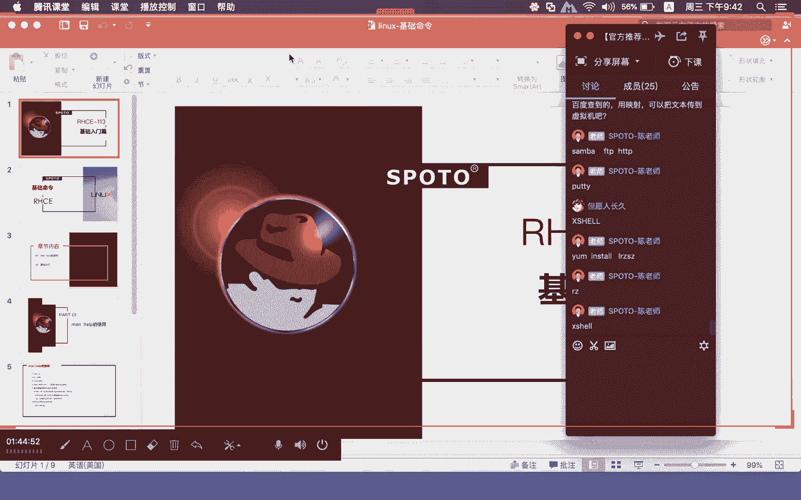
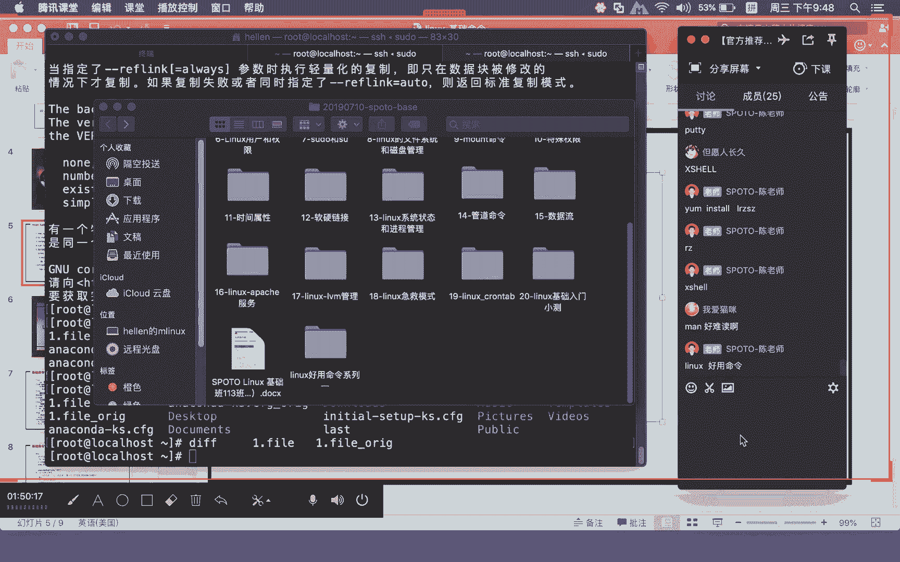

# Linux基础课程（RHCSA）简简单单学会Linux入门教程 - P5：第二节课基础命令-1 - 思博Linux关关 - BV1fv411j7RG

刚讲的东西也好，会相对就是包括命令快捷方式，这里面讲的东西会比较多一点啊，大家可以看视频，也可以去看这个PPT都可以哈。诶。肯定对大家的整体的一个这个VI的一个。

后面会起到一个比较好的一个工具的这样类似的帮助。啊，所以呢希望通过练习呢能够加深印象啊，能够得到巩固消化吸收啊。如果说你只是听没有去做啊，这个VI你肯定是搞不了的。就是只是看了一下。

然后你想要去通过看就能够记住这些东西，我觉得是太困难的事情啊，就是一定要练啊，没错，晚安猫咪这个所讲VI真的就是要练，如果不练的话就搞不掉。后面的东西就没法搞。啊，百度查到约映射。

可以把文本传到虚拟机也可以啊。呃，像Vware，它也有那个相关的那个什么Vmail two。啊，就是大家用那个ware那个什么呢啊虚拟工具的那个工具嘛，有一些的话是直接可以拉进去的，大家可以去试一试。

就ware那个to它也可以啊做那个映射，就通过虚拟机这种方式把对应的东西映射到里面去，这个也是可以。很多方式啊，因为我们基础课程里面讲服务的部分内容会比较少一点。呃，比如说三把那比如说FTP啊。

甚至STTP那你如果说懂得这些服务的话，其实搭好之后，我们把这个东西往里面去传，通过这些服务把它往里面去传都可以。有些根本就不用搭这个服务啊，大家如果说懂得用这个什么呢CQCRT。啊。

用这个什么呢CQCRT啊，或者用这个什么呢？PUTTY啊，用这个东西啊，做它设置，然后通过它远程连接到你自己的虚拟机啊，把这个什么呢包给我装好，让instLRZSJ啊，LRZSJ这个包装好之后啊啊。

你根本就不需要去做什么东西，通过RZ它就会弹开windows下面的目录然后让你去选择你要上传的文件啊。对，包括这个插也可以。啊，这个CRT插笑啊，PUTTY啊，可能还有其他的这个什么呢插命的什么之类的。

好多工具还挺多的。就通国软件连接。诶。这个windows下面的客户端工具还是很多的。我这个是苹果电脑啊，我苹果电脑的话它本身有带这种什么呢文本终端，所以就有带这种share环境。

所以我就可以直接在它这里呢通过终端远程连接到linux虚拟机里面去啊，是方便很多方便很多。

来，我们来看一下今天的这个第二部分的一个内容是。

基础命令这一部分的一个内容啊。那么基础命令来看呢，其实大家在这里面啊可能会觉得linux命令比较多。但其实呢。有很多一些命令呢不常用啊，常用的一些命令的话呢，就就那么一些啊就那么一些。我们在基础。

教程这一块啊，我们有给大家介绍两部分啊，一部分是基础命令，还有一部分是相应的什么呢？管道命令。那么这些命令都属于什么呢？比较常用的。那基础命令呢，其实不管是基础命令还是一些不常用命令啊。

你在接到一个命令，如果他很陌生的情况下呢，我们一般都比较用这个什么呢ma或者是help这种形式去看这个命令到底能达到什么效果。当然你也可以通过百度和谷歌啊，很多同学在看到某一些命令。

不知道怎么用的情况下，一般可能大家并不是很喜欢去用M和p，基本上跑到什么网络上面去什么呢？百度谷歌啊马上一翻上面一大堆呃什么什么命令啊，linux下面的CP命令详解啊。

linux下面的什么什么命令这个详解。就是历史历史解析啊什么之类很多这样的东西。那么最正宗的最官方的一个文档的话呢，你通过m help是最能给你正确的一个什么呢？支持啊。

给你正确的一个什么的文档的一个两个帮助的一个命令。比如说我们这个CPE这个命令。

你看我们这个CP，我们在用这个CP命令的时候呢，妹好难读妹其实他也是用VI相当于是打开一个用VI的形式打开了一个文本文档。只不过这个文本文档的话，它是什么？它是不能写，只能什么做读和查找这种动作。啊。

你看我们这个CP这个命令，可能很多同学一开始接触，他并不明白CP是什么东西，只知道是拷贝。那么他具体的用法它是怎么用的呢？啊，我们可以通过CP简减。啊。

大家可以在这个地方就可以看到他的一个什么呢帮助信息。你看我们这里。CP点点help的时候，他就告诉你CP的一个什么呢用法是什么？CP用法copy后面可以跟什么呢？对应参数，也就是所谓的选项。然后呢。

原文件目标文件。可以是原目录到目录啊，就可以原文件到某一个目录去，也可以是一个目录，到一个什么呢？原文件去。好，就它的一个格式就在这个地方就已经给你标记出来了。所以你在用的过程当中。

有的时候看就看的什么呢？很明白啊，我这边看出来是一个什么呢中文的一个帮助文档啊，可能有的同学是英文的话呢，他可能看到是英文的文档，但基本上呢啊不会有太大的一个难处了。如果你碰到英文真的看不明白。

谷歌翻译百度翻译都可以啊。因为这边的这种英文单词相对来说说比较专业术语，所以基本上一翻译都能看的很明白。啊，我相信来学我们linux的人哈。我觉得看这些简单的英语，我觉得是没有问题的。

我们以前大学的时候还学这个什么计算机专业英语啊什么这些，那学的有的时候不根本基本上是很很少用到了，他也学半天。哦到我们现在自己在做这种计算机专业的时候，很多这些单词都是属于什么呢很。

就是比较重复出现的比较。容易吧，好愣。碰到复杂一点的，我我可能也会去百度翻译，谷歌翻译找一下。因为有些单词可能念都不会念啊，然后呢但是知道意思。啊，我们前面这个copy这个命令哈，我们来呃试一下。

比如说copy这个命令哈，我们可以通过copy，按照他刚才所做的这个指示。比如说一点fi这个文件，我们想要把它变成什么呢？一点fi，然后后面呢加一个什么呢？后缀IG那么这个云文件它肯定是实打实存在的。

那么这个什么呢？固的文件，就是你要把这个文件备份成什么样的。那么这个文件它是可以不存在。你看我们这里这个时候呢，你在L的时候，你就可以看到原来的时候并没有一点fi。下发线OIG。那么现在呢。

因为这个拷贝多了一个什么呢？一点。下线泛网国IG。那么这种拷贝和备份啊，两个文件的这个内容啊是。一模一样的，我们可以通过什么呢DIF1。发下划线去做这个比较。呃，明天晚上还有一个什么呢公开课。

我希望大家呢如果有时间可以去听一下明天晚上的公开课啊。因为您明天晚上呢刚好讲的这个命是讲什么呢？linux下面的这个什么呢？好运的命令。啊，linux豪运的命令，回头我会把这些文档都给大家哈。

因为那个命令的这个文档啊，比较豪运的这个命令的一个文档，我整理了七八个文档啊，到时候呢大家可以去回头都发给大家。你看我们这里这么多豪运命令系列123都是一些什么呢？呃，大家呢不常用。

但是呢又不是说很少用啊，经常会什么呢？偶尔偶尔会用一下，偶偶尔会用一下。那么这些命令的话，在使用的过程当中的话，它就变得什么呢？也是非常重要的。😊，啊，所以明天晚上如果大家有空可以去听一下那个公开课。

那个公开课是纯技术的这个公开课啊，就是专门讲技术的。就像讲下尔脚本一样，专门介绍大家这个什么的技术类的东西。所以有兴趣可以去听一听。那么通过这种方式，我们就可以比较出来这两个文件啊，它是什么呢？

一模一样，没有不一样的啊，没有不一样就DIF的这种方式去做比较。

那cobe你愿这种方式去做，去看出它相应的一个用法。我们也可以通过什么呢m的这种方式来做。

也可以通过ma这种方式。比如说maCP。那么刚才有同学说，哎呀这个ma有点难读。其实呢还好啊，其实当然你就按照它一个格式，你就这样一页一页的下翻啊，就我们可以通过这个什么呢上下键啊，往下翻往下翻。

那对应的这个参数的话，它这个地方的话，就已经什么呢？给大家去列出来了。嗯，你碰到这些参数，说实在话，我很多参数我也很少用啊，也很少用。但如果说真碰到想要用。

我也会去查一下ma或这种方式去查这个参数它到底有什么做法啊，有什么用法，我也会去看。

很多东西不常用啊很多东西还是不常用。就通过这种方式我们可以去看。那如果说你在这个m里头，因为你这个部分打开的这个文档，我刚才说它只能是一个读或者是查找的一个动作，它不能是写入动作。

那如果你要查找也是一样，按一个斜杠。然后比如说我要去查找的是什么copy。COB这个段，那你就可以在这里面去找。那么help这种方式的话，它是一下子把所有的这个班助文档全部给你列出来。

那你可能看到的东西呢就。你要自己方，如果他帮助比较长，你可能看的呃想要去查找一些东西的时候，你可能会不是特别的啊，不像ma特别的方便。但是简简help这种方式，有的人他也很喜欢。

他觉得我就直接列出来了相应的参数，有些地方还给你中文注解了，所以可能看起来会更什么清楚一点啊，这各有所好了，但是main啊还有一个用法，命令你不知道怎么用，可以通过ma来进行查阅。如果碰到一些配置文件。

你如果不知道怎么用的话呢。我们也可以通过什么呢make来进行什么呢？查阅啊，比如。我们上节在讲网络配置的时候，大家还记不记得如果我要进行DNSIP地址的一个设置的话，大家还记得有什么方法可以。做设置嘛？

大家还记得吗？就设置DNFIP地址。啊，设置DNSIP地址。大家还记得吗？有。哪两个办法来完成DNSIB地址的设置？好。各位同学。喂，喂喂。は。哎，对啊，我发现有同学大家写的这个不错啊。

就EDCIESO哎，我觉得他们已经像梦起点看，还有包括啊我还有猫咪哎呀，我还猫咪那个没记错啊，那个记错了啊，没记对。然后起点那个是ISO前面的这个单词是对的那碰到这种的话，其实你只要记住一半。

然后后面通过table键可以进行补齐，对不对啊，这种是非常方便的啊，RESO。😊，LOVE点com这个配置文件这个。我们有两种办法，对不对？一种是在我们的这个什么呢网卡配置文件当中去写入什么呢？

DNS等于什么IP地址。还有一种是在什么呢？EDC李so点com没关系啊。EDG点控这个配置文件当中啊去设置啊，比如说你看我们这里name server啊，这个就是它的什么呢？DNSIP地址啊。

那像刚才这个。ADC点com这种配置文件。那当他在写这些对应的配置参数以及对应的值的时候，有没有没有什么要求？那么这个配置文件我应该做哪些配置，它能够实现什么样的一个效果？那。

ma就可以起到这样的一个什么呢？查阅，给你做相关详细解析的这样的一个帮助啊，它其实不单是对命令进行帮助。它对什么呢？系统当中的一些什么呢？配置文件也可以给到什么呢？对应的解析帮助。

我们可以通过maRESO李so点com这个配置文件，大家就可以看好，这个配置文件。它的这个作用就是用来解析配置文件。那么这个解析配置文件它实际上面做的就是关于什么呢？DNS的。

你看oma name systemDNS的。那么在这个地方有哪些词大家可以去写入，我们就简单说一下啊，比如说这个name server它后面可以跟上什么呢？

name server的什么IP地址就你name server这个参数，后面可以跟上什么呢？DNSIP地址。啊，可以跟上你这个名称服务器的什么IP地址，像我们自己家用上网的这种路由器。

可能很多同学他们这个都设置成192。168点1点1啊，那你的这个虚拟机里面，如果你是桥接的他们的这个A造点com啊，如果是DHCP的话，那很有可能他的这个DNSIP地址写的就是什么呢？有92。

181点1的，他有可能就是这样写啊，大部分也都是这样子，就网关就是你的DNS服务器，他通过这个地方，然后直接走到什么的DNS也有可能你这个什么呢？你的DNS只到了某一个什么呢？

公网上面的这个什么呢4个8或者是4个114的啊，或者说其他的啊，就进运营商，他自己提供的这个什么DNSIP地址。就通过这种卖，我们可以将什么呢对应的这种配置文件啊都能够将其什么呢？解析出来。

大家想要有更具体的一些配置相关的一些院法，你直接去看它就可以了啊。网络上面看到的东西未必是什么都是对的。啊，你需要有一定的什么呢区别啊，一定的什么甄别啊，因为里面给的东给出来这个东西啊，五花八门的。

有对的，有错的呃，甚至呢有有的是让你什么呢？老来绕去误导你的。防不胜防，你有一定的什么知识，然后才有办法去完成这个什么一定的判定。那像这种man下面和CP下面的啊，你看命令也好，你看配置文件也好。

我这可提供出来这种帮助文档，绝对是最正规的啊。我还没见过man和CB啊或者help这种方式给出来的命令，它里面的这个注解是错误的，我很少见到。

应该说到目前为止还没见过啊。除非他那个文档是比较旧的，没更新的那有可能出现这种状况。好，像这种刚才我们所写的这种ma，那么它在使用的过程当中啊，它其实是跑到什么呢？

USR share啊USRloc share这个路径USR shareUSR share这个路径上面去找对应的这个什么帮助文档。如果你是源代码编译这种包的话呢，大家想要去查。对应的这种帮助文档。

只要源代码里面它在阅读过程当中有带这个东西的话呢，它其实就有。帮助文档啊，只不过你要指定路径，你才有办法找到他的这个帮助文档，是不是还有一个info啊？对，呃，因为你在阅的过程当中啊。

我们在运这个ma的时候呢，它其实还有什么ma5。然后后面这个什么命令或配置文件啊，这个是在1到9它其实是有做一定的分类的啊，这个部分的话，我现在对目前。对，这个这个部分对大家目前现在是没有要求。

所以大家可以先不用去管这个生西啊，你们只要知道，我们可以通过ma来做命令的查阅，可以做配置文件的这种查阅。然后如果你是配置文档啊，这个源代码编译的话，那你需要指定到对应的这个什么呢？

源代码编译安装路径的指定路径上面去，你才有办法去找到它这个什么呢啊，帮助文档啊，如果没有，那这个帮助文档的话，它就没有办法去查阅。因为源代码编译它不是自带的帮助文档它不会放到默认目录去。

所以我们在用的时候啊，大家要注意这个部分啊，等到后面讲源代码编译的时候呢，我们会告诉大家怎么样去完成类似的这种东西啊。所以源代码编译软件包的ma一个词元的话，大家可以先不用管啊。如果你有碰到。

你可以先用手动的方式去指定。那么基础命令当中呃，我们刚才简单的说了一下什么呢copy啊，copy原文件目录目标、文件或者是目录。那么实际它还有一些参数呢是比较经常用到的。那么哪些参数是比较经常用到呢？

比如说。

copy啊，比如说我们要将这个什么呢？一点fi这个文件，我们要想大想将它拷到什么呢？某一个目录下面去，我们可以copy一点fi到ten这样子拷贝过去。那如果说你是要拷贝一个什么呢？目录到一个目录去的话。

那你在使用的过程当中啊，就需要用到什么呢？减R这个参数。啊，比如说我们讲啊。EDC。啊，将ADC这个目录下面的这个所有的数据呢都拷到什么呢？t这个路进去。那你一定要加什么呢？减R参数。

这个减R它的这个参数作用就是做什么？递归啊，涉及很多，比如说我要去删除一个目录，它在删除目录的时候呢，也需要加减R参数啊如果你不加减R参数，像这种目录的拷贝目录的这种删除，它是做不了的。

你看我们现在呢不加减R，大家可以看一下，直接就告诉你说什么？略过目录EDC啊，那你一定要加减R。因为这个时候呢，它这个目录下面呢，做了递归那么下面的这些子目录以及知子目录啊，它是可以什么呢？

一级一级的递归下去，将相应的这个对象全部拷贝到什么呢指定录进去啊，才能完成这个什么呢拷贝。那么在减R目录的过程当中啊，可能大家还需要去加入一个什么呢？减V的这么一个参数。那么这个减V的这个参数的话呢。

可以让整个的一个拷贝过程啊，会变成什么呢？可见啊，V就跟我们刚才做VI编辑一样。是一个可视化的一个过程，是可以让你看见什么呢？拷贝的一个过程。如果你不加这个简币，大家可以看一下，你看我这。

你看不到什么整个屏幕的一个输出。当你在拷贝一个比较庞大的一个目录的时候呢，如果你不加减币啊，因为你比较庞大目录数据多情况下，可能这个拷贝的时间会比较长。那不加减密时间比较长情况下。

有时候啊就跟卡住一样啊，会给你一种错觉。我到我这个东西到底在执行还是没在执行，是不是？那如果你加了这个减压参数的话，那么它实现的这种效果就会有所不同。可以让大家很清楚的这种看到什么呢？哎。

我们到底也没有在拷贝啊，我们这里呢像刚才这个啊。他。像这个啊。我们先把这个删除一下啊，tamp下面我跑到这个temp下面做一下删除啊。tap下面的这个ETC。Hi，母前 IV F E T c。

我们先把它删除掉啊，然后我们再做一次拷贝啊，copy减RVF啊EDC。斜杠下面的这个ETC，然后跑到这个什么呢t里面去。你看我们整个的一个拷贝课程，在屏幕当中啊，它是一个什么呢动态的一个显示啊。

什么文件拷贝到哪里去，什么文件拷贝到哪边去，在这个地方马上就可以见到。那么刚才也运用到一个什么呢？啊，F的这个参数copy app这个参数，我们打开麦。找到这个什么呢？减F，这里就运到一个什么呢？

减减for减减for。那这里有说到什么？如果有一个存在的一个目标文件啊。就说已经你要拷贝这个对应的目标路径下面已经有这个文件存在。那如果有这个东西存在的话呢。

那么我们可以通过这个减F这个参数呢会进行什么呢？try again啊，try again。它这里呢写的是减for。啊，这个并不是强制的一个意思啊。如果说你是。想要做相关的一个交互。

因为在copy进行这个相关拷拷作拷贝的过程当中啊，它这个交互部分啊其实是已经是什么给你默认给你加上了。这里面的这个减I这个参数啊，大家也需要注意。简copy减减help。你看我们这里减F减I。

这两个参数是。减for啊，这里是强制说的是强制哈。啊，然后还有一个的话是减I，这个减挨的话是给你一个提示，问你要不要覆盖。那我们在进行这个CP，比如。copy E D file。2。范。就这样。

如果我们。将这个东西重新再拷贝，他就会问你是否覆盖。那么这个时候啊CP的这个命令啊，就相当于是什么CP减I。因为这个时候它会提示你要不要覆盖。啊，为什么会有这样的一个情况？我们可以通过alive。

这个别名在这个地方大家可以看到aliceCP其实就相当于什么呢？CP减I，所以它会有一个什么呢？减I的这个什么对应的这个交互式的一个提示。啊，如果你把这个减I这个东西给它去掉。

比如说我们就在这个地方AIASCB啊，你可以把它命名成，就是等于CP。啊，然后你alice。我们这是做了一个临时啊，做了一个临时处理。然后你再用这个copy一点fi啊，2点fi。

你看这个时候它就不提示了。对它已经是默认了，知道没有？就交入的这个命令当中啊，它已经是提示。所以有些命令像LL这个命令啊，我们就用到了这个什么呢？LL啊，那么LL这个命令的话，在很多linux当中啊。

它其实是什么？没有的。但是为什么在linux在孔贸企业版上面，这个命令它是有。因为这个命令呢它做了什么呢？别名。那么这个别名其实就对应什么呢？L减L。那我们其实也可以去做什么呢？对应的一个别名。

比如说我们这边有个同学叫什么呢？beyonBEYOND对吧？那我们也可以对这个什么呢？beyond做一个别名。你在没做别名之前的话，你这个命令肯定是没有的对吧？BEYOND人家肯定说找不到这个命令。

对不对？那我们可以做一个别名ALIAS。BEYOND等于。LS键。我我就写LS嘛，好不好？然后你这个时候呢就用这个什么呢？beyond这个命令。哎，我当我敲这个beond这个命令的时候。

它其实就相当于去做什么呢？LS命令。

啊，这个是。alive别名命令啊，这是在后面部分我们会给大家介绍的这是第八个部分才会给大家介绍到的。那么因为时间的一个关系的话呢，我们剩下的内容可能需要等到下节课才有办法给大家去做什么呢？

剩余部分基础命令的一个介绍啊，以及下节课我们还会去给大家介绍到的内容是。

系。好，SH服啊，还有一个是SH服务。那么今天晚上课程内容。基本的一个作业就是VI部分的一个练习。那么我们会。把这一部分的这个练习稍后呢，包括视频啊都一起发给大家。

视频部分可能要等到明天才可以发到大家手上。好吧，那我们今天晚上的内容哈就这时先上。