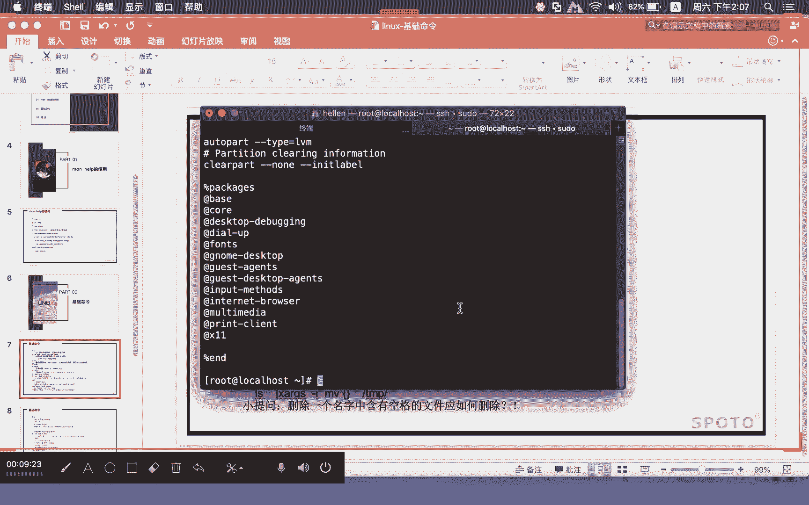
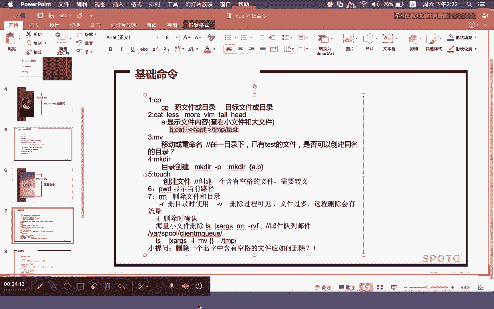
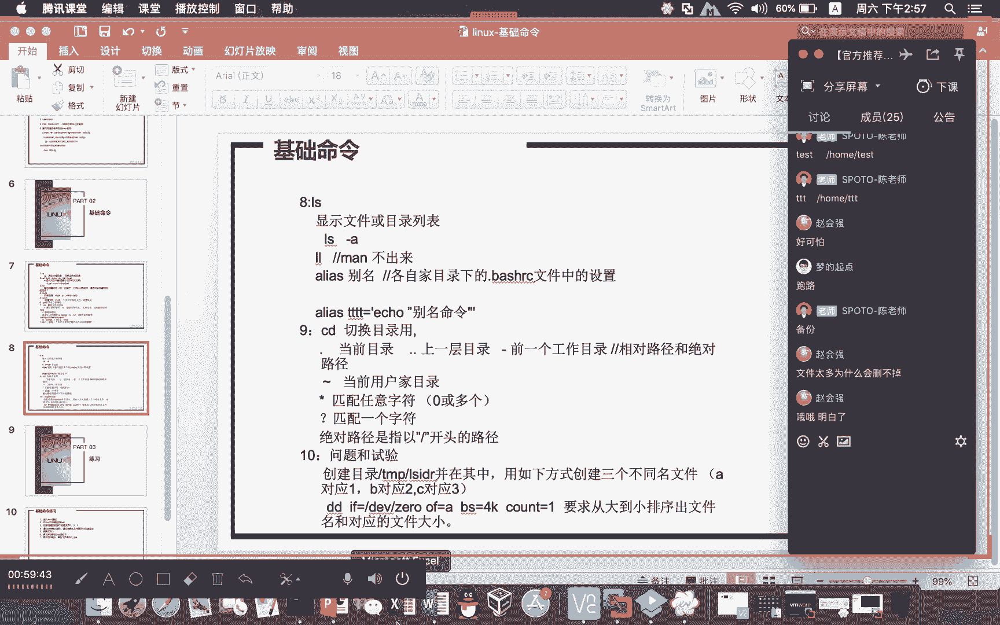

# Linux基础课程（RHCSA）简简单单学会Linux入门教程 - P6：第三节课基础命令-2 - 思博Linux关关 - BV1fv411j7RG

呃，也建议大家呢去向他要一下啊，因为里面那些命令跟我们现在所讲的这些命令的话是不一样的。我们上节课呢是有给大家讲那个基础命令，对不对？但那个基础命令的话，真的就是基础很基础的。呃，好运的命令系列的话。

那一部分的命令的话呢，跟我们现在这个所讲的就出入比较大。

我这几个文档哦我也可以给大家看一下，好吧，还特意我记得还特意放在这里吧。呃，这个行友命令有eco命令呃。

data命令LSOF命令win get命令TR还有1个DIFFD还有一个什么呢EXPT这几个命令啊，每个命令的话我都做了一个小文档。那么有命令系列一，我们可能后期还会再出一个命令系列。2。

那就以此这样类推下去的东西还是比较多的。

好，我们来看一下上节课给大家介绍到的VI的一个基这个命令，还有一个是这个基础命令。那上节课也布置了VI的一个练习。那我发现呢大家在做的过程当中啊，可能我这边写的有一些东西不够细。

所以同学们在看这个VI练习答案的时候呢，有一些疑惑，或者说是有可能看没看清楚啊，比如说这里面涉及到运到了这种方式啊，比如这一句话，他说简介第十行到第二0行到这个什么呢？文件的末尾去啊。

那么这里面运到了什么呢？冒号十，然后一个空格第11D，然后呢一个空格一个大写的G，然后再来一个空格一个什么小写的P啊，那么这里面运到这几个字符啊，它其实是一个什么呢？拆开执行的啊不是说把整个字符。

你就直接把我给拉到里面，然后在命令行模式下面去运行这里所有的东西，不是的啊啊，所以我们在运的时候你要注意啊，我们这里面写的为什么我还特意加了一个空格啊，不要说你现在要一定要看懂啊，不能说看不懂这些东西。

比如说简去第十行到第二十行到末尾，他这里面做的事情就分成什么四步动作来做。第一步动作先定位到什么呢？十行去啊，冒号十就定位到什么呢？第十行，然后定位到第十行之后。你可以呢在什么呢？

一般模式浏览模式下面按什么呢？D11D。去对什么呢？对应的这个11个行的内容进行什么呢？简切，然后呢再按一个什么呢？大写的一个G大写的G是要干嘛呀？是把文光标移动到什么呢？

文件的最后一行然后再按一个什么呢？小写的P，那就是将之前简切那些行粘贴在啊我们当前光标所在的最后一行的这个位置的后面去啊，我到1，然后D11D然后大写的G然后P啊。你如果说用这个1机当然也可以啊。

我们在定位这个行，比如说冒号时它可以到第十行用这个1机机这种方式也O啊，答案并不是唯一哈，只要大家能够把前面讲过的那些快捷的这些命令啊，能够消化吸收，把它灵活进行结合应用的话，其实啊都能够实现什么呢？

类似的一些效果。我们这里给出来的只是其中一个什么呢？答参考答案啊，答案并没有说是唯一的对，实际也可以，没问题。呃，像这个赵慧强讲到这个十两个小写的G啊，好，十后面跟一个大写的G其实都可以到什么呢？

第十行去。有的时候你比如说他这个就十行，你直接给我按这个什么呢？上下键，在一般浏览模式下面按这个上下键，我直接这个12345678910，直接移到第十行有我也可以，对不对？所以他实践的方式呃是多种的啊。

并不一定说必须得这样子。大家可以对我们所学的东西啊进行一个什么的组合使用啊，没有说必须得这样子。所以大家在愿这些命令的时候呢，我这部分这个答案我就不再什么呢强复呃重复去讲了。所以大家可以去看一下啊。

这个练习不一定说只做一次，你可以多次去做啊。因为这个是对大家的一个什么呢？VI部分的一个练习的一个什么呢巩固。好嘞，那我们来看一下我们上节课还没有讲完的什么呢基础命令部分的这个内容啊。

那么基础命令的话呢，我们在上一节课给大家介绍了ma和help这两个使用，对不对？那么ma和 helpp的话呢，可以对大家所使用的这个命令进行一个什么的相关参数的一个查阅。那碰到一些不懂的参数。

可以通过man和help来进行什么呢相应的帮助。当然了，你除了这个命令进行参数查阅之外啊，在配置文件上面，我们也可以通过ma啊来对配置文件呢进行一个什么呢解析。

所以呢他们的这个使用的方式啊也是多种多样比较丰富。那我们呢接下来继续给大家其他的这个啊基础命令呢做介绍哈。

我先连到我的这台虚拟机来。SH月92点66831。14。这个是多少？145。310145。ピ到し。啊，我现在远程连进来了，我们来看一下呃，给大家介绍过这个什么呢CP命令啊，CP命令的话呢。

主要是用来做我们的什么呢？啊拷贝备份啊。那么除了下面的这个除了上面的这个CP命令，我们接下来给大家介绍什么呢？文件的查看命令。那我们VI其实就是对文件进行内容的一个什么查看。

比如说我们这边想要看一个文件，大家可能就会用VI的形式，在文本中端下面啊，大家就可以用这个VI形式去打开这个文件。那如果是在图形界面下面的话呢，可能很多同学就会用什么呢？EDIT啊。

后面跟上文件名或者是Kright啊，加上这个文件名的这种方式呢去打开一个文件。那这种话是必须得在什么呢图形界面上面，你才能够用它来看。嗯，像VI去打开一个文本文件的时候呢，我们对于这种大文件。

我们都不建议用VI这种形式去打开。那么对于这些大文件来讲的话，大家可以看我们这里面用到了几个什么。

查看文件内容的命密，一个是叫什么呢？kate啊，那么kate其实你要看它整个内容啊就是什么呢？

直接在这个终端里头给你什么呢？完整的给你展示出来。但如果说他这个文件的涵比较大，比较多的情况下呢，你用cat有可能什么呢？整个终端它是盖不住啊，我把cat所有的内容它就在屏幕上面呢一直全部给你放出来了。

但如果这个终端比较小。比如说我们这里这个终端他就这么点东西，你把整个文件给它放出来的话呢，他可能没有办法什么呢？呃把你在这个地方的东西啊全部给你什么呢展示出来，他可以全部展示。

但是你在这里上下翻动的时候，你没有办法看到什么呢？从头看到尾，没有办法，因为有可能这个终端它拉不起，拉不全，没办法啊，所以用cat他有好处啊，像刚才这样子，我们在用ca的时候呢。

他并不会去独占你这个资源。比如说你用VI我用VI在进行这个编辑访问的时候，你可能有时候什么呢？有时候是这个人正在用VI打开这个文件。另外一个人连接上到你的这台虚拟机之后呢，他也用VI打开你的这个。

软件。那么如果两个人同时在开的时候呢，有可能会出现一些什么呢啊不必要的一些什么文件读写的一些冲突啊，那可能会带来一些不便。那么为了避免这样的一个问题，你用ca这种方式，他就可以避免我用ca看。

我又不会独占你这个资源，他直接就在终端给你什么刷出来了。所以呢。t在实用的时候呢，有一定的一个什么好处。但对于大文件来讲，它也不是特别的合适。那我们还可以呢用cat这条命令。如果说文件不大。

但是呢屏幕整个终端又不够显示，你用cat，我们还可以运什么呢呃。加管道这种形式啊，就加一条竖线啊，加管道这种形式来进行配合使用。那么加管道进行配合使用的时候呢，它是怎么样的一个做法呢？

其实就是跟后面的这个什么呢？less和more这两个东西啊是有一定的关系的。我们的这里的管道它的一个意思是什么呢哈？就是。

这条竖线，那么一般正常情况下呢，它会这样子A空格，然后什么呢？B。啊，这样，那么A一个竖线B这种方式，A前面执行的命令就会通过竖线啊，这种管道的形式传递到什么呢？B这个命令去啊。

就竖线它起到的一个作用就这样前面的命令的产生的输出作为什么呢？后面命令的一个什么呢？输入A命令产生了什么结果，然后呢传到B这边B去处理这些什么呢？刚才A命令产生的输出，然后最终产生一个什么呢？结果出来。

那我们通过cat加一个竖线，那我们可以用这个什么呢？more啊，或者是什么呢？less。嗯这两个东西来用。那你在这样子使用的过程当中呢，他就跟可能跟我们看这个什么的电子书一样。我可以什么呢？1。

1点的下翻。你看我们这里哦。我把这个退出来一下啊。啊，比如说我们在cat后面跟上什么呢？对应的文件名称，然后呢加上一个什么呢？lesss这样子啊，你看我们这里这个时候呢它会出现一个什么呢？小冒号。

我们在这个地方可以按什么呢？回车啊，它就可以1。1点的往下翻啊，不会一下子全部的干嘛，都在整个屏幕上面给你打印出来。那么默这种方式的话，它也是一样的效果。啊，more这种方式的话也是一样的效果。

我们也可以在这个地方用cat加文件名称，然后加一条竖线，然后跟一个more，然后也是按这种回车这种形式去看。所以这两种方式对于这种什么文件不是特别大，但是呢整个终端又是盖不住的这种情况话。

我们用这种方式也是比较合适的。当然你也可以什么呢？啊，不用cat命直接什么呢？单独用let和more加文件这种形式来查看然后不用less，我们后面跟上文件名称就这样啊，大家也是可以什么呢？

看到这类似的这种效果啊，或者是用这个什么呢？more也是一样的哈。呃，在这个上面的细节上面有一些小小的区别，就在于什么呢？就是less部分和这个more部分，如果是less，它一般是什么？

它一般是这种按回车的时候，它是一行一行的往下翻。那如果是这个嗯按我们的这个什么呢？默这种方式的话，它一般是什么呢？百分比1%1%的这样的一直往下翻使用的效果都差不多。但是可能跳跃。

比如说我每一次在回车跳跃的时候呢，会有一定的区别，会有一定的区别。哎，战国余刷问到说怎么把修改海的这个last放到电脑上呢？哎，这里面呢就涉及到什么呢？

windows windows和这个linux的一个什么呢？上传和下载的一个什么呢实用的方式啊，因为这个问题我看大家在群里面呢也有一些沟通。那我们在这节课呃给大家讲这个SH。在这个什么呢？

后面的这个基础命令之后里面的一个内容的时候呢，我们会给大家介绍到啊介绍到怎么样去完成上传和下载啊，会给大家介绍。所以大家不用担心哈，我这里呢先简单介绍一下有几种方式哈，第一种方式。有的同学呢为什么在。

它的这个虚拟机里面可以从windows上面直接把这个数据拉到什么呢？呃，拉到linux里面去呢？就是因为呢它有装了一个叫什么呢？vam tourist。这么一个工具啊，所以它可以做到直接这种拉拽啊。

这是第一种办法。那么另外一种办法的话呢，你需要在什么呢？我们的linux上面去安装一个RPM包啊，当然你在做这个RPM包之前，你得先有一个什么呢？能够远程连接到你的这台虚拟机的一个什么呢？工具哦。

那么什么叫远程连接到你这个工具啊，我们去远程连接，一般都是用到什么呢？SHlinux上面的这个什么呢？SH远程服务基础命令讲完，我们就会给大家介绍这个东西。那你想要去远程连接你的这个SH服务的话呢。

我们有很多的客户端工具，可以让大家去连。比如说PUTTY大家可以去下载。还有一个呢是SECURT啊CQCRT还有一个是什么呢？叉。啊，还有一个是插el。

我发现呢也有些同学把windows下面啊好像是win10下面的，把它的这个什么呢？CMD运行窗口啊，把它做成可连接。linux远程服务器了。哎，你如果说把这个东西做成这样，这个也是OK的啊。

那我们常用的工具一般可能是比较集中在什么呢？CQCIRT和插效PUTDY用的会比较少一点，就这两个。CCRT和这个插这个是用的比较多，这个东西装好远程去连接。哎。

独自能刚才讲到这个也有哈他manage了，我把这个也列进来哈MANAGER这个也可以用哈，就把这个东西呃。😊，哇，这个太多了，我。😊，比奥呢又提了一个哈，我我们自己用的比较多，还是CQCT和插速药。

因为插试药可能会更还会更好用一点。CQCRT是以前那会儿用的比较多一点啊来。对，这个哎分这个就讲到了第三种办法了哈。然后SH加这个什么呢？这种方式啊，那你这些工具的话要去连接你的SH服务。

那么这些工具连接完了之后，它怎么样通过这个它来进行这个数据的上传和下载啊，你在客户端用这个工具去连接到你的虚拟机，那么你要在你的这个虚拟机里头去安装什么呢？去安装一个叫LRZSZ的一个什么呢？

RPM包啊，由它装好的这个up包提供的命令来做什么呢？上传和下载啊，这种方式其实是最简单的一种方式啊，那么第三种方式，你就需要去搭些什么呢？相关的服务啊，有很多同学就是说哎老师。我的这个服务啊呃。😊。

我的这个服务要怎么去完成这个搭建啊，比如说FTP啊，你可以通过FTP进行数据的上传，你也可以什么呢？装这个什么呢？三把晚上邻居啊，有的同学也可以用这个什么呢winSCP啊，winSCP的话。

这个也是上是比较简单的一种。因为这个winSCP这个服务它已经是装好了。啊，winSCP它说的是windows下面的客户端工具，它所依赖的是linux里头的什么呢？SH服务。啊，所以你有什么呢？

root用户和。账号密码，那么你就可以通过VNSCP进行数据的一个什么呢？上传和下传。那么想要装这个FTP哎，赵慧强讲到说需要配置样源。如果说你能配置样源，当然最好。如果说你们不懂得去配置样源的话。

像FTP我们可以通过什么呢？RPM包的这种形式来进行安装。因为FTP这个服务它在进行对应服务安装的时候呢，它其实只有一个M包。而且这个M包没有依赖关系。所以大家在安装的时候呢是比较简单。

我们可以直接什么呢？绕过样的配置啊，我们的整个课程是基础命令讲完才会给大家讲H服务H服务讲完才会给大家讲什么软件和包的一个管理。那么这两个部分都已讲完，你可能整个完整的这个什么上传和下载这一块东西啊。

就会变得什么呢比清楚一点。所以这是我们的什么呢？第三种方式基本上也就这几种一二3这三种第一种个装那个装完是非常简单的。

然后第二种和第三种相对来说都是比较属于在lin和win下面的一个什么配合的这种专业的一个么呢使的基础方法。好，那么这一部分的话，我们先不给大家介绍，先把基础命令，大家先理清楚。然后呢。

我们在下午下半段的这个内容当中啊，我给大家再介绍一下这个什么呢？上传与下载的这个实用啊。

那copy啊这个命令查看命令less和more。那么除了这个还有两个telll和hit。那么这种tel和hi它在使用的时候呢，哎跟前面的这个命令的使用是有所不同的。

一个。文件啊它比较大情况下，有可能我们并不想看它所有的内容，我可能只是想看它什么呢？部分的一个内容。那么tel和hi它实现的这种方式啊啊，它就是什么？比如说telll，他要看的是什么呢？

这个文件的什么呢？末尾的对应行啊，如果是head的话呢，他想要看的是这个文件的什么呢？前面行啊，我们举一个小例子，比如说我想看这个文件的什么呢？末尾。20行。末尾20行tll减N20。

这就是指定他要看末尾多少行。那我们跟上文件名字。那么对应的这个文件它就什么？把最后二0行在这个屏幕上面给你显示出来，那也可以通过什么呢？head减N20看什么文件的头20行，这里面的这个N2020。

你可以自己改，你想看多少，你可以改成你自己的一个多少。那当然了，你如果说想要看这种中间抽取的部分。那我们也可以通过k和t这两个东西啊来进行一个什么呢？结合使用。那么这种结合使用也要通过什么呢？管道。

就是我们刚才给大家说到这个什么呢？竖线这种方式呢来进行结合。我们举一个小例子。比如说哎这个竖线好像会被这个课堂屏蔽啊。那我们在这边看，比如说我想要看这个文件第十行内容。我们可以这样干。我们可以是什么呢？

headateHEAD。H的减N。第十行内容哈，那我们hi减N。后面跟上对应的文件名字。啊，那我们会把这个文件的什么呢？投资行在屏幕上面给你显示出来。啊，你要看的是第十行，前面的东西不是我想要的。

我要看的是这一行，对不对？那我现在呢加一条竖线，好，tll减N1啊，那么这条命令它实现的效果就是看什么呢？文件的第十行内容，那么文件的第十行内容，它这里实用的过程当中就是我先把这个文件的什么呢？

前面十行显示出来，然后把这个取出来的。这个十行内容当中的什么呢？最后一行给他什么呢？截取出来。那么这个最后一行截取出来，其实就是这个文件的什么呢？第十行内容。你看我们这里回撤下去。

大家看到的那个内容就是这样子。当然了你如果说想要看这个什么呢？有一定范围的一个行话。那你也可以通过这种方式自己去做一个什么呢组合。比如说我想看这个文件的什么呢？第十一行到第十三行内容啊。

大家说这个时候我们在写的时候应该是怎么个写法，head减N就是第十一行到第十三行行。那我们可以是head减N什么？😊，啊，各位同学，这个时候我要想要看第十一行到第131三行的内容啊，我要我要怎么写。

用hiake和 tell这种方式。第十一行到第十三行。啊就111213，我要看这三行内容，那我们应该怎么用？就是hi减N，这里时候应该是写什么呀？信图应该是写十3哈，应该是写十3。

因为我要看的是第十一行、第十二行和第十三行。那我head减N13之后，对的孤军奋战这个说的特别好啊。head减N13，然后加一条竖线跳ll减N3对了。就这种方式，这种的话就会取出什么呢？

我们的这个文件的什么呢？十三行。十三行内容当中的什么呢？最后三行，也就是111213，我们把这个东西呢改一下，然后呢再。这个N的后面哈，把它改成什么商。那么这个时候呢，这个三行内容的话呢。

就给你显示出来。如果有同学觉得。不知道是否是有有错误，你想验证，那我们也可以去打开，把这个行号给它显示出来啊。行号显示出来之后，你看一下这个第11到13111213啊，这个就是第111213。

你的跟外面的这个去比较一下啊，内容是一样的啊，绝对是按照只要你这个命令写的是对，绝定是绝对是按照你预期的这个显示效果的。这种方式啊也是用的比较多的。因为特别是文件大的时候呢。

我们用这种方式还是比较方便的。我并不希望说看所有的内容啊，除了这种方式，我们其实还有啊在提升课程里面啊，我们还会给大家介绍一个嗯就是渲染脚本部分，我们还会给大家介绍两个非常重要的命令，叫什么呢？

SED和AWK这两个东西。呃，所以呢有的时候啊东西其实可以多知道一些，像这个set和AWK啊在进行需要脚本里面的这些文本编辑文本的这种呃处理的时候呢，他们俩是发挥了非常大的重要的一个作用。

那我们在基础课程里面哈，我只是给大家提了一下。那么如果大家有兴趣的话，也可以去翻一翻，中间有碰到问题啊，也可以找来呃，也可以来跟我沟通。😊。

这是通过什么呢？这个cat less more tell head这种方式呢来看对应的一个什么呢？文件的一个内容啊。那么这个cat啊，它还有一种用法啊，就是说你cat可以看文件内容。

它其实cat也可以用来做什么呢？内容的一个编辑。你看我们这里啊它在预的时候是这样的一种写法。啊，是这样的一种写法，cat一个什么呢？两个小于号UF。

然后我们现在在这边的话。有一个什么呢？啊，2点fi的这么一个我计划呢想要建一个2点fi的这样的一个文件啊。现在目前大家可以看到，目这个路径下面现在没有这个什么呢文件存在。

那我用cat这种方式呢来对这个文件创建，同时往里面去写内容啊，这种方法用的会比较少一点，但是并不定并不代表说没有用啊，因为用这种方式可以完成什么呢自动的一些什么呢？文件的一些创建。

以及往里面去写相关的一些内容啊，很多相对应的一些方法也是用到类似的这种方式cat uF然后一个大于号，后面跟上什么呢？2点fi。你看我们这里这种方式啊是告诉你说我要去打开一个2点fi这个文件。

那么在打开这个文件的时候呢，是结束的一个标记是按照什么呢？UF这个符号来进行什么呢？标记说哎我这个打开这个过程啊，我要结束掉了。那同时呢在打开这个时候没有结束之前，我们可以往里面去塞内容。

然后我现在往里面去塞这样子。啊，想要结束，对不对？OKEOF因为前面的开始是EOF，我们结束也需要用EOF作为结束标记。你直接在这里写EOF，人家呢就结束掉了。然后你去ca这个什么呢？

2点fi这个文件好，你就会看到什么呢？刚刚在这个东端里面，我们所输入的这个内容的话呢啊就已经写在这个文件当中了。这种方法呢用的不多啊，非常规的一个办法啊，但是呢在有一些地方也会比较经常用到哈。

我们后期还会给大家介绍一个叫虚度和树的这么一个东西啊，这里面呢也涉及到类似的这种用法。这个部分啊大家了解一下就行。

好，看第三个基础命令MV啊，他这个有讲到说移动或者是什么呢？重命名在一个目录下面，已有test的一个文件是否可以创建同名的一个目录。我们先来看一下它基本的一个功能啊，然后看一下这个问题。

它的一个答案结果是什么样的。

M v。比如说我们要对它进行改名啊，刚才不是说了吗？一种是移动啊，把这个文件移到另外一个地方去，还有一种是什么？对所所存在的这个文件，它的名字进行什么呢？改名啊，把这个叫张三改成什么？

李四我们这里面呢有一个文件MV1。fi这个文件，我们可以这样改啊，把它改成什么呢？三点fi，那么这个三点fi它在院的时候呢，它肯定是不存在什么呢？这个目录下面的。

你这样子做出来的东西才有可能做成改名的这种效果。如果说三点fi这个文件在当前这目录下面它是有存在，那你是改不了的那你是改不了的。你看我们这里啊敲下去哎，这个时候呢它就没有提示任何的一个错误啊。

你改完之后呢，一点fi这个文件呢，它就不存在了啊，三这个文件呢就出来了。三这个文件就是由一这个文件改名过来了。那如果说你想把这个三这个文件改成什么呢？二点fi。那他就问你啊，因为为什么呢？

2点fi当前这个目录下面，它是有存在这个文件。你如果想要改成一个什么呢？已经存在的一个文件的话，就相当于是什么呢？是否要覆盖啊，那你可以看一下3点fi，你要不要覆盖，如果是要覆盖，你就写一个什么呢？

yes啊，如果是不想覆盖，那你就干嘛？那你就no，对吧？我不我不覆盖，那我就写一个no啊，我看看淡淡的微秀这位同学。啊，UF中间的UF是固定的吗？可以用其他的来结束吗？哎。

那个大大的微笑问的这个问题特别好，我给大家做个小演示，你看一下啊，cat小于号，比如说我们给他写1个111啊，然后呢来一个大于号啊，4点fi。😊，吓。啲一啲。看到没有啊UF呃，我为什么把它写成这个EF？

因为这个EF它是有一定的含义的啊，写起来比较顺口一点啊。那你用其他的制图，你看我这个用这个三个亿的，我刚才也完成了什么呢？是这个文件的一个什么呢定义啊。但是这个EOF为什么他用EOF呢？

就是我们大家在写这种结束标记的时候，为什么经常会用EOF呢？就应该用到这个解释它是这样and all file就文件是什么呢？结束啊，所以他有这样的一个东西啊，所以他取了这三个单词的什么呢？啊。

前面的每个字符，然后最终就变成一个什么EF就类似这样子，但并不等于说我就只能用UF，我可以听他的哈。😊，啊，所以大家如果有疑问，第一，你可以问我。第二呢啊因为我们lininux是比较强调的一个东西。

就是什么？要动手，就很多东西你听完有的时候你听完真的是不够的，你一定要什么要动手啊，有很多东西你不记得了，有的时候你动手做一下，你有的时候就可以得出你自己的一个结论。啊，就是说不一定说嗯。

不一定说我我我就必须得问别人呃，像这个linux的这个IHC1的考试，他早上考下午考。那每一场考试都是要什么？大家在机器里面实际动手去完成相关的一个实验，正确的你才会得到结果。他不会给你什么呢？

像笔试一样的，这个题目是对的，还是错的，让你打勾打叉，不是的啊，他就是强调动手啊，在整个linux的一个整个考试啊，包括这个业务实践里面啊，都是这样子的一个过程。当然理论是也很重要的啊。

理论也是也很重要。有的时候理论不懂的话，这个操作起来就很麻烦。考试又多少钱？HHC哎，这个杨华，你可能得问得问一下我们那个班主任老师哈，找他去问一下吧。呃，我记得这个现在目前因为疫情嘛。

他原来计划是5月1号的时候呢，结束HC的这个期的鸿贸企业版期的这个考试呃，因为疫情呢现在推迟推到了什么鸿贸企业呃，推到了这个8月1号，我记得啊推到了8月1号。但现在呢也正是因为疫情的一个影响啊。

现在如果说呃考试的话，可能会有一些。呃，可能会有一些困难，因为这个。你这个考试大家就聚集在一起了，现在这个到处这个刷聚集的，所以不是那么好预约，我估计考七还是考八好。呃，我个人感觉还是考7比较好一点。

第一，生产环境现在目前用的都还是78呢虽然已经更新出来了，我们生产环境基本上都还没有用8。像这种状况，基本上都要等什么呢？两三年34年呃，八才会慢慢慢慢的普及覆盖。另外一个呢。

7现在目前的资料以及题库都是比较稳定的。如果说你现在学了8，后面去考8。首先这个题库啊现在都还没有出来。我们说的这个题库就是说题库它还没有什么呢留出来呃，在这个网络上面啊。

现在目前题库的这个资料啊是比较少的。你要去考这个东西的话，可能会有比较大的难度，你可能一次考不过就要考两次啊。当然了，每一次考试你都是肯定要交钱，不可能说你第一次过不了，第二次你就不要交钱啊。

他都是要交钱。要补考。那意味着你这个考过的，代价就比较高嘛，考7含金量不低呀。好嘞，这个是我们刚才讲到这个什么呢？呃文件查看啊，刚才有同学问我们做了一个补充。那么MV这个命令的话。

我们刚才有看到说哎如果是做这种改名啊，当前目录下面你要改的这个文件改成什么呢？当前目录已经存在一个文件的话，人家就问你什么呢？是否要覆盖，对吧？那么MV在用这个命令的时候呢，大家也需要注意一个东西。

也就是所谓的什么呢？别名，你看我们这里哈MV有等于什么呢？MV减I我在上一节课给大家介绍到有一个什么呢？copy你copy减那么这里面的这个copy减I这里的减I是指什么呢？交互的这种形式啊。

当你碰到需要进行确认交互的时候，人家就会做什么呢？这个提醒，如果你把这个减I给我去掉了。因为这这个运行这个MV命令它相当于运行MV减I。如果你把这个MV减I把它变成什么呢？

MV那我们后面再进行这种覆盖的时候，就是即便文件有存在，那你用MV进行这种改名覆盖。的时候呢，人家也不会提示是否有覆盖，而是直接什么呢？很暴力的就给你什么呢？覆盖下去了啊，当然你如果说直接这样做的话。

肯定会有一些好一些不好的，对不对啊，不好的一个地方，我这这个好坏我们就不说了大家可以根据自己的一个需求情况自己去做这个调整。😊。

那么除了这个改名，我们还可以呢用这个MV来做相关数据的一个什么呢？移动。那这个移动部分啊，那我们可以比如说MV4。fi这个文件，我们想要把它移到什么呢？tamp这个路径下面去啊，你MV4点tamp。

那么斜杠tamp。那么这里面的这个路径啊一定要写成一个什么呢？啊，尽量用这个什么呢？绝对路径的这种方式去写啊，我们这种的绝对路径呢一般都是指什么呢？

比如说这个路径啊，一般如果它是绝对路径，一般都是都是以这个斜杠开始的。以斜杠作为第一个字符啊。如果说你把它写成这个什么呢？点斜杠，那么这种就不对就不就不是什么呢？不是绝对路径，而是一种什么呢？

相对路径点斜杠是表示什么？是当前路径下面的什么temp。你看我们这里敲下去啊，我们看这里面有这个t路径吗？L。电。temper没有对吧？你看我们这里啊，它就会变成一个什么呢？它会变成一个文件啊。

而不是一个什么呢？路径。那如果说你是把这个什么呢？你看我们这里有MV4点fi的时候呢，点斜杠tamp。那这个意思就是说把4点fi这个文件把它的名字改成什么呢？tempamp。

那我们把用这个另外一种方式来做啊，比如说。MV2。放。斜杠t。那么这种它实现的方式就是把二点fi这个文件改成什么呢？啊，就移动到temp这个路径下面去啊，你看我们这里他就问你啊。

是否又覆盖tamp下面的二点fi啊，那你可以输一下yes，所以这两种效果是不一样的哈，一个是点斜杠点斜杠的话是指当前路径下面的啊，这个文件啊，点斜杠，这个是指当前路径。然后这个t是指什么？

当前这个路径下面的这个对象。那么还有一种大家也要注意哈，比如说MV。MV3点放啊，我这里呢有用到一个什么呢？比如说download。这样子敲。那么这个download在我们现在这个路径下面的话呢。

它是一个什么呢？目录。那你刚才用的这种方式，其实就是将什么呢？3点fi这个文件移动到了什么呢？download这个目录去啊，你可以写。绝对路径。但如果说后面的这个对象它也是一个目录的话呢。

我其实可以不用写绝对路径。我直接就把这个目录名字给我写出来。那么对应的这个文件它就往这个什么呢？目录下面去放。你看我们这里当loads啊，刚才3。fi这个文件就被大家什么呢？移到这里面来了啊。

我们在做这种移动的时候呢，尽量用绝对路径的这种方式去做。因为我也不知道你这个就是说我如果没到一个路径下面去看这些对象的话，其实我也不知道你这个对象是什么是文件还是目录，对不对？

那如果说你用这种方式MV2。fi斜杠斜杠。那我就知道你是要将这个文件移到这个目录去啊，所以在实验的时候呢，大家需要注意这一些细节，就是通过什么呢？MV来做的。😊，那他有问到一个东西。

就是是否可以创建同名的啊，可以创建同名的不同对象。那我们用这个touch这个命令哈，我们来给大家介绍一个东西。TOUCH这个东西呢是用来创建什么呢？文件，比如说touch一。啊，touch2。

那我们这里面呢在这个下面的话就创建出了两个文件出来，1个11个2啊。如果说你要创建多个文件的话，比如说三空格4啊，那这种的话就又创建出了两个文件，三和4前面这种是把两个文件分开建。

这种的话是把两个文件什么呢？合在一起去建啊，批量去建啊，你合在一起建，分开建都可以。那么能不能创建一个什么呢？跟你同名的一个对象呢啊，你看我这里有一个三这个文件。如果说我再建一个三。

我们在创建这个同名的一个三这个文件的时候呢，先把这个三里面啊去写入一个什么呢？内容啊，1212这样子，然后再来创建一个什么呢？3。啊，他没报错，但是你们可以想象一个东西，我刚才那个三文件里面是有内容的。

你现在在这个地方又建了一个三这个文件。如果说我这个三这个文件能创建成功的话，那么三里面的这个内容应该是空的。但是其实你刚才没有创建成功，因为三这个文件已经存在啊，原来那个内容并没有。

因为你新建这个文件是啊有，然后而导致里面这个内容没掉，被覆盖掉。所以我们刚才虽然没有提示，但是这个空白的新的三文件并没有什么呢？被创建成功啊，所以里面的这个内容还会被保留住啊。

那这种是创建什么同名的相同类型的对象，就是说名字都叫三的这么一个文件。但如果说我要创建一个什么呢？同名的，但是是不同类型的一个对象。你刚才已经有一个文件3，我想在这个目录下面去创建一个什么呢？

跟你这个三文件名字，相同的目录也就三的这么一个目录。那么我们来看一下makeDIR3哎。这个时候他就直接给你做提示，无法创建目录商文件已存在啊，大家在创建这个什么目录的时候和创建这个文件的时候呢。

同名的是不可能存在的啊，makeDIR。makeDIR我们创建一个这个5这个文目录出来哈，makeDIR是用来创建目录的哈。然后呢我们想要在这个地方去创建一个什么呢？文件五啊，这样子to取一个5。

那么touch5的时候呢，它也不会提示。但其实啊大家可以看我们这里啊，这个5。啊，他还是目录，并不会因为你刚才创建了这个什么呢？同名的5呃，这个的目录就会变成什么呢？文件五不会啊，所以大家记住一个观点。

第一啊。

在同一个目录下面啊，如果要创建相同名字的这个什么呢？不同对象，哪怕是相同对象都是。不可能创建成功的啊，那么在创建文件的时候呢。

如果有同名对象存在啊。那么它不会提示，但是它也是不是会创建成功的啊，反正就是不会创建成功，只是在创建文件的时候呢，不会有提示。但是在创建目录的时候，它是会有提示的。当有一个地方大家也需要注意啊。

因为我们在创建一些文件的时候呢，经常有一些文件它是有带什么呢？就文件的名字里面有带空格。有的时候啊因为这个空格可能会影响大家的一个什么判断。但大家一定要坚持一个原则，就是同名对象是不可能存在的。

就在相同的目录下面，同名的对象是不可能存在的。我给大家做一个小例子，大家注意看我这里啊。이게 어。我现在呢先把这几个文件全部删掉啊啊全部删掉。然后我在这里面呢同时去创建12。3。

大家现在就可以看到我现在有三个文件，123对吧？好，我现在呢再创建一个文件，注意看我这里哈。一。空格。2。你如果看到这个东西的时候呢，你一定要引起一个什么呢？注意。啊，很多同学看到这种状况的时候。

他就会问老师，老师，你不是说这个同名对象不行吗？那为什么你现在同名对象又会有？那大家需要注意的一个东西就是1231文件二文件三文件这个三个人家是独立的对象。我刚才所创建的这个文件，他的名字叫什么呢？

他的名字叫一。空格空格2。但是在创建这种带有空格文件的时候呢，人家是需要做转移的啊。只不过我用LS在命令显示的过程当中的话，它的这个空格的这个显示它是不会转移，所以会造成一种错觉说哎。

相同目录下面经常出现了什么呢？同名的对象啊，但是碰到这种情况，我刚才还是强调同样的一个概念，就是不可能有同名对象存在的。如果碰到这种情况，大家一定可以通过什么呢？其他的方式来验证出来。

比如说我们通过LS减L这种长格式这种形式，你们就可以完整的看出来，这里面明明就是什么呢？四个对象。第一个对象一第二个对象是什么？一空格2，第三个对象是2，第三个第四个对象是三啊。

那用touch创建这种带空格的，需要通过什么呢？反斜杠来进行转移。那么在删除的时候呢。比如这个文件我要删除，你删除这个文件一的时候呢，那你很好删除，对不对？那如果说你要删除这个什么呢？一空格2。啊。

很多同学可能就会用这样的方式去删。但是你如果用这种方式去删，你就只能删什么呢？一和二这两个文件。而对于一空格2这个文件它并没有被删掉。你看我这里一和二这个空格这个文件它还在。

是不是那你要删它就跟创建它那个时候一样的做法啊，需要将什么呢？一空格斜杠空格好，反斜杠空格，再来一个反斜杠空格，然后一个二就是你要进行这种文件删除的时候，也需要将什么呢？

这个转移的这个里面的东西啊给它放上去，你才有办法完成这种删除。要不然的话，你是永远没有办法将其删除掉。你要想一个一个那样去删按正常方式去删，你是删不出来的啊，删不掉的。这是我们刚才讲到的哈。

如果带空格的啊，我们在进行创建的时候呢，需要进行一个什么呢？转移，需要进行一个转移。刚才这个什么呢？IM这个命令啊，我们在用这种IM命令的时候呢啊也会涉及到这个什么呢？IM。

对文件操作以及对目录操作的这些什么呢啊效果的一个什么呢？不同参数。比如说IM减RVM如果你只是删文件，不用这种方式。如果你删的是目录，那么你一定要用什么呢？减R这个方式。

因为减R的时候呢啊是会对目录进行一个什么呢递归。你看我们这边哈make个DIR。makeDAR5这样的一个目录出来。那我现在呢想要去删这个目录5I5，它就无法删除啊，删除失败。这个目录呢它还会在。

但是如果你又用一个什么呢？RBF这种方式去删的话呢，那么这个目录就会什么呢？被删除成功啊，反正大家要记住，删除目录也要这样去删啊，删除文件的话，那就更简单了。IM。

你删除文件用用删目录的方式去删或者不加参数去删，这个都是OK的哈，就这样直接删。那么这个RM后面跟文件去删除的时候，它也会做一个什么呢？提醒，问你要不要删啊，这个也是因为什么呢？

我们的alive这里面使用的一个什么呢效果。你看我们这里IM等于M减I啊，也是因为这个什么呢减I的一个参数，所以我们在进行删除的时候呢啊才会有这样的一种什么呢？啊提醒。😊，那么在删除的过程当中啊。

我们个人我给大家一个建议，就是你最好删删的时候呢，一定要进入什么呢？路径，到这个路径里面对什么呢？指定对象进行删除，不要用什么呢？绝对路径去删啊。我们刚才也有说什么叫绝对路径，什么叫相对路径。

那我们在介绍这个绝对路径和相对路径之前，我们有一些符号，先要给大家做一个介绍。你看我们这里哈。我们看那个路径的时候，可以通过什么呢？PWD这个命令来看啊，你看我们这里现在看到这个路径是在什么呢？

root斜杠root斜杠don这个路径下面对吧？那么这种显示出来这种路径它其实就是一种什么呢？绝对路径。就是说你用这种方式，比如说我要CD路径，那我就可以用这种路径去写。啊，那么这种就是一种什么呢？

进入绝对路径，用绝对路径的这种方式来进行描述。那如果是相对路径的话呢，我们需要了解的几个东西。第一个是点号。啊，还有一个是什么呢？点斜杠。那么这里的这个点号和这里这个点斜杠都是指什么呢？当前路径。啊。

都是指当前路径，像这种就是属于什么呢？相对路径啊，因为这个路径呢表示并不是以什么呢？斜杠作为第一个字符的，所以它这就是一种什么啊，就是一种相对的一个路径。那。比如你看我们这里啊CD。CD点号啊。

CD点号的时候呢，你去看这个路径，它还是在原地，对吧？然后CD点斜杠的时候呢，它也一样，还是在什么呢？原地踏步啊，那么还有两个路。符号一个是什么呢？两个点号啊，那么这个两个点号它表示的意思就是什么呢？

退到上一级路径。你看我们这里。现在的路径是在什么呢？root。斜杠rootdownload这个路径下面。当如果我们用CD两个点号的时候呢，它的路径就会变成什么呢？斜杠root。你看我们这里敲进去。

然后你用PWD去看你看我们这里哈原来是在这个路径下，然后我用CD两个点号的时候呢，它就会退到什么呢？上一级路径，你就是说会把这个download给去掉，然后退到什么呢？斜杠root这个路径下面去啊。

斜两个点号是指什么呢？上一级的。路径。商一级的路径。那么还有一个符号呢是指什么呢？CD减号。啊。CD减号是指什么呢？上一次你所在的路径，你看我们这里大家可以看我们这里哈，现在我的路径是在什么呢？

斜杠路下面。那我问大家，我的上一次路径是在哪里？啊，各位同学，你看我这里。啊，我现在路径是在斜杠路的下面。那么我在进入这个路径之前，我是在哪个路径下？喂喂喂，大家还在吗？哎，对，是在单漏的是是不是？

那如果我用CD这个减号的时候呢，我就会退到什么呢？root download这个路径去，你用PWD也可以确认出来。你看我这里是不是啊，比如说我们在做一个小演示CD到这个什么呢USR careRC啊。

这个路径你们用PWD去看的时候呢，现在路径是在什么呢？usRC这个路径下，那我现在问大家，如果我这个时候用CD减号。那么这个时候它的上一上一级路径是在哪里。😊，上一级。啊，那么它的上一级路径是在哪里啊？

上一级路径是在哪里？哎喂喂喂。好，我用CD减号的时候，他的啊，我用在这个地方。啊，我现在进入了这个。root对吧？对。啊，如果是UCQFRC的话呢，它的上一级路径就是把后面的这个路径给去掉。

但如果你是用CD减号的话呢，它就会跑到什么呢？就会跑到你上一次所在的一个路径啊，一个是空间上面的CD两个点号是空间上面退一次啊，另外1个CD减号啊，两个点号是指空间退一下啊，一个减号的话呢，是指什么呢？

时间上面呢啊一个是上一次，一个是上一季。对了。表示这个描述的特别好啊。所以大家在做的时候一定要小心。那么还有一个符号，大家也要注意什么符号呢？是CD。对应的这个什么呢波浪号。CD波浪号。

那么这里面的这个波浪号指的是什么呢？对应用户的这个什么呢？加目录哎有对赵飞强已经知道这个知持的话，波浪号是指什么呢？对应用户的这个加目录。比如说我们现在是在哪个用户下面。

大家怎么确认我现在是在哪个用户下啊，我们可以通过ID这个命令去确认出啊，我现在是在什么呢？这个root这个用户，当然你用ID可能看的有的同学看的不是很清晰，那你可以用什么呢？hoMI啊。

你可以用呼MIMI就是什么？我是谁啊，大家应该看过那个电影，我是谁陈龙演的那个是吧？我是谁？那么MI的时候，他就告诉你我是root。😊，那么我现在是在root用户下面，那我用这个什么呢？CD波浪号。

它就会进入什么呢？root用户的这个什么呢？加目录。你看我们用CD波浪号进入root用户加目录的时候呢，你可以用PWD确认他的加目录是在哪个路径下啊，大家可以看到root用户他的加目录是在什么呢？

斜杠root下面，那么其他的普通用户，他的加目录的话呢，跟root用户是有所不同的。我们的普通用户，比如test这个用户，你有建这个用户，那你就有这个什么呢用户的这个加目录存在啊。

比如说test这个用户在默认正常的情况下哈，假如我们创建用户的时候呢，并没有去指定他其他有所不同的加目录。那你用这个普通用户建出来的这个默认他的加目录就在什么呢？啊home下面的什么呢？test。😊。

对应的普通用户，他的加目录是在什么呢？home下面跟用户名字相同的什么呢？目录下面的。比如说test用户，那么他的加目录就是home test。比如说再来一个用户，他是3个T的。

对吧那么他的加目就是什么呢？homeTDT。这个是他默认会去创建啊，我们怎么去确认呢？比如说我现在切换到这个什么test用户，你看我这里哈CD波浪号啊CD波浪号啊，我们PWD就可以直接看到啊。

我现在呢因为我用减test是切换到了这个什么呢普通用户来了。然后我们就可以看到现在是在什么呢？test用户下面了。那么这个用户CD波浪号的时候呢，它的这个加目录就在什么呢？hometest当中啊。

我们在用这种方式的时候啊，大家一定呃就刚才看这个用户的时候啊，IDMI可以看用户，还有一种比较简单的方式就直接看这个。😊，就这里面的这个什么呢？终端提示服，这里有一个什么呢？对应的名字。

就小老鼠的前面那个部分显示的是谁的。那么当下就在哪个用户下面啊呃，很多刚刚开始学的同学在一开始他不知道登录的是什么用户啊，因为你如果用普通用户进行登录的话呢，其实有很多权限，他执行不了。

那如果你是用路ot用户的话，肯定是会方便很多。那就是因为这样子，很多同学登录到什么呢普通用户去啊，然后呢，在这边命悄做一些实验，发现了这个问题不行，那个问题不行。

然后出现什么权限拒绝什么之类的那你可能在做的时候呢，就可以通过这些方式去进行什么呢？确认。啊，如果说你自己做的呃想要切换用户的话呢，我们在后面啊用户和权限以及虚度和序部分的话。

我们还会给大家具体展开介绍啊。那么就通过这条命令啊，我们就可以看出呃，现在这个什么呢？对应的这个绝对路径以及相对路径的一个用法以及不特殊符号在使用的时候呢，需要注意的一个东西。

那回到刚才IM删除的这条命令啊，我们刚才说绝对路径相相对路径。那么你在进行对应内容删除的时候呢，最好都是用什么呢？相对路径啊，用绝对路径去进入，然后后面直接跟你要删除的什么呢？对象。

那么你要删除的这个对象，如果它是目录，那么我们个人都是建议用什么呢？相对路径去删啊，如果你要是删除文件的话，那你直接后面跟文件名字。比如。比如说我要在这个文件下在这个什么呢？lookot。

在这个斜杠root下面，我要去删除一个文件啊，这个文件是root下面的一点。fOIG当然你要去删它，我们可以用这种方式直接删，对吧？IM。啊，I am。啊，很多同学有的时候习惯就就RVF。

然后后面跟上什么呢？绝对路径加文件名字，这种商绝对能商得过啊，肯定是没有问题啊。你一定要确保后面的这个路径以及对应的文件名字是对的啊。如果说不对啊，比如说正常情况下啊，就是说不正常的情况下哈。

你可把这个什么呢斜杠。root这个部分的这个斜杠和lookot中间这个什么呢，多了一个空格。那么你这个一旦伤下去，那么你伤的就不是。一。半这个文件了，你上的是什么呢？整个鞋杠跟。啊。

我们前面一开始就跟大家说，在系统安装分区的时候，哎，你就会呃有一个什么呢？根分区，这是必备要做的啊，我们的很多系统相关的数据都是在于什么呢？存在于这个根下面的你这个。一旦跟这干下去。

就相于把自己的脖子给切了。这系统会被你这样的一个操作。呃，数据删除之后呢，数呃系统是起不来的。对吧系统是起不来的，所以我们不建议大家用这样的方式去做。我们建议大家的一个办法就是什么呢？进入路径。

比如说你要删刚才这个文件，那我就会什么呢？CD rootot啊，我刚才就说嘛，删除对应对象的时候，我们要进入这个对象所在的什么呢？路径啊，CD路径。然后IM减RVF1。fi这样子去删它哎。

这种方式是什么呢？比较稳妥的啊，千万千万不要哈千万不要手抖啊干这个事情会怕啊，习惯要养好。那做这种删除动作的时候，我们有的时候也会建议大家你一定要什么呢？备份啊，我们也有强调过这样的一个习惯啊。

就是相关的一些linux操作。因为我们经常会做一些什么呢配置文件的调整啊，就你这个服务要进行配置调整，那你就会对配置文件进行修改但是有的时候你改的东西比较多，如果你没有备份呢啊，新改的配置。

如果有问题上到线上想要回滚，没有配置，你这个时候想要回退，有的时候就会带来很大的麻烦啊，同时有备份的话，你还可以做一个参考嘛，前后到底改了哪些东西啊，如果说有备份直接盖回来就可以了。

所以在进行删除数据的时候呢，我们的个人建议都是最好特别是重要的哈，最好是先备份备份完再去改啊，或者说再去删啊，这样子一旦出问题，我可以立刻进行回滚啊，古代这个我们古人说的这个狡兔三窟，狡兔三窟。😊，啊。

在运维当中啊，你多备份其实是没有问题的。前几天不是给大家发了一篇小文章，叫什么呢？呃，威门的那个商库跑路的那个人嘛，那个人没跑路，他伤了，把数据库给删了。伤完之后呢，直接就被抓了啊。

他通过后台那个什么呢？连接呃，相关的这个操作审计啊，直接查出来啊，是一个运维人员干。啊，权限可能会比较大一点，然后把数据库给删了。结果呢这个整个平台就瘫了，然后了后面就人就被抓了。

那如果说他这个没有备份的话，像刚才这种业务它一旦被伤，其实是完全没有办法恢复的。我们在下一周下一周会给大家讲一个公开课啊，就是从也就针对类似这样的一个故障事件，给大家讲这个什么呃备份和恢复的啊。

主要还是给大家介绍呃myCqQ数据库下面的这个什么怎么做备份，怎么做恢复。因为我们回那个大家看到那些文章啊，大家可以去关注一下。因为我看那些文章都是告诉大家说，我们怎么样去避免这些问题。

但实际上面的话呢，有一些基础的一些工作，他其实很多地方没有介绍到，我们可以趁着这样的一个什么呢机会让大家加深一个印象。所以呢在下一周我们会推出一节的一个公开课，应该在周三或者周四的时间啊。呃。

反正不是大家上课的时间啊，到时候大家可以去听一听。如果没空的话，到时候讲完也可以去找老师要一下公开课的视频，还有相关的一些资料。这是删除部分的一个什么呢动作啊，删除部分的一个动作。

那么在进行一些海量数据删除的时候呢，你可能在删除的。

动作过程里面就会呢有所不同。你看我们这里有讲啊，我在这里给大家介绍，因为这部分的话，大家可能碰到的机会呢是非常少。比如说海量小文件删除，海量小文件删除是指什么呢？某一些目录下面啊。

有很多这种小文件税文件呃，像我们生产环境当中有一个邮件队列文件啊，就邮件队列目录。那么下面的话呢，因为邮件发送失败，有什么或者其他一些原因，在这个目录下面会堆积很多的这个什么呢？碎文件。😊。

我们呢有一段时间发现空间占的比较满，然后就会发现查来查去就是这个目录，导致我空间变得很满。我们跑进去去里面去删，用了一个是最传最传统的一种方式，就是刚才的RM减RMF的这种方式去删，结果发现。

提示你说什么呢？参数列表过长。因为文件太多，他在进行这种删除的时候。他是删不掉的那我们建议了两种方式哈。这种方式。啊，还有一种方式，这种方式，这两种方式都可以什么呢？对其进行删除啊啊啊。

主要是这种方式啊，下面这种方式不行啊，下面这种方式不行啊，这种方式就通过什么呢？广道这种形式，它是用L将文件列出来之后，一个一个的传递到什么呢？后面的这个命令来进行删除啊。呃。

它是通过XARGS这种方式进行传递的。所以这个命令啊大家知道一下，了解一下就行了。万一碰到这种参数，在删除某一些目录下面的这种税文件呃，过于庞大，过于这个数量过多的时候呢，你可以用这种方式去删啊。

如果大部分情况下呃，文件太多，为什么会删不掉？呃，文件太多，它其实在做这个LS呃，就RM减RVF的时候呢，它其实会做为一个什么呢？列表，但是。在做这个列表的过程当中啊，它是有一定的数量限制的啊。

超过数量的话，它其实是用不了的，没办法删。所以我们得用什么呢？得用L这种方式啊进行一个什么呢？啊，简单的一个列表啊，列表完了之后呢，他就一个一个的传递啊，一个个的删，就是说他用这种方式可以删。

但是会删的什么呢？相对比较慢一点。啊，这是IM这个命令啊alies这个LS这个命令的话呢，我们就不再给大家做什么额外的一个介绍。因为这里面呢有给大家介绍过这个什么呢？alies这个别名啊。

那么al这个别名的话，在上一节课已经给大家介绍了需要注意的一个东西就是LL这个命令啊LL这个命令的话，它也是别名那么在有一些linux系统上面的话，这个LL命令啊，它是什么不存在的呃。

我们想要去定义别名的话，你可以定义一些自己个性化的一些别名，对不对？像上一节课我就给大家定义的一个比较比较有个性化的某一个同学的名字的这样的一个命令。嗯，当然你自己定义好了，想要永久保存。

那你要记得在各自加目录下面的什么呢？点RC里头去写入这个什么呢al这个什么呢设置啊，他在写的时候大家可以去参考。

比如说路ot用户，他的这个什么呢？别名设置在这个什么呢？Fish。be r c 里头。在这个地方，你看我们这里啊，他写的方式很简单，你们可以直接在这个地方呃增加一个自己的一个命令啊。那么这个一旦增加完。

那么这个命令的这个1月呢就会变成什么呢？永久的啊，不会因为说只是临时这个用完终端打啊，关闭完之后就不能用了，写入这个配置文件，后面重新再用一个终端去连。😊，那你这个命令呢就会按照这个什么呢？

别名里面的这个设置啊进行生效。那么CD命令啊，这个部分我们也给大家介绍。但是有一个地方哈，这里有一个星号，还有一个什么呢？问号。那么这个地方呢有一些什么呢呃。😊，说到这个就是一个通背符的一个什么呢概念。

这里星号它指什么呢？匹配任意字符啊，问号呢是匹配一个字符。我们这个地方用的时候呢，有什么地方啊，可以运到类似这样的一个东西呢？啊，我们跑到这个什么呢当load。

这个地方啊，我们在这个地方呢也是touch12345。那我创建了这么多文件出来，我可以IM减IVF新。那么一下子就会把这所有的文件呢都给它删掉啊，IM减IV新。我们刚才说啊新是匹配任意字符。

那么对于每一个文件来讲的话，这个星肯定都能够匹配到啊。像刚才如果说我们再创建哈，再创建这样的12345啊，我们如果说再创建一个一斜杠空格斜杠空格2。

这样的一个对象出来的时候呢啊大家如果用IM减RVFC，那你是可以全部都删的。啊，他不管你是有空格，没空格，反正都被你匹配到了，他也可以被他删。那你在用这种方式的时候呢，一定要小心，是不是真的要这样用。

因为这个一旦全部做下去的话，就所有的东西都会被删。当然我们也可以做为什么部分匹配，在当录的是可以用VI创建文件嘛，可以啊VI本来就可以用来创建一个什么呢不存在的文件，只要你在VI打开文件退出的时候呢。

做保存动作，那么这个文件就会被什么呢？创建出来。如果你没有做保存动作，那么这个文件它不会被创建啊，在使用的时候要注意这个细节。

你看我们这里哈to取12345这个命令。我还是一样的做法哈，我们在后面。😀呵。😊，全三户可以用断电那样操作还原吗？啊，延环这个不行啊，搞不了。我们是说编辑的时候，他才会有这样。

你看我们这里根本就没有这样的一个东西，对吧？那我这里呢再创建1个11。这样子啊。那我们呢想要去删除这个对应文件的时候，我们比如说一新。啊，这样子伤，那他这个伤的时候呢，就只会伤什么？

大家说我用IM减RVC呃，RVFEC大家知道你说我这样伤是伤了哪伤了哪些对象？啊，零次匹配任意制符。啊，0是匹配任意字符。啊，杨华删除后要还原怎么做？那你要。那你要专业的这个狂原动作啊。

要不然的话这个是狂原不了了，烦了真的就是全就烦了。对他这个时候呢会删除两个文件。第一个一文件，第二个是什么呢？11文件为什么会删除两个文件呢？

首先我们回到刚才PPT当中给大家介绍到这个新它代表着一个意义？它是说什么呀？新是匹配任意字0或者多个明白意思吧？啊，零或者多个的话呢，那你这里的这个心一。

是不是后面没有任何字符，那我这里的这个星就相当于是零的情况下，它就匹配什么一这个文件。那如果说我后面有一个字符的话呢，星那就是匹配什么呢？11这个文件。所以我们这个删除下去的话，就会删除两个对象。

一和什么呢？11这两个对象就会被删除。但如果说我们把这两个文件再建出来，touch取一。😊，11然我删除的时候呢，用的是什么呢？IEF。一问号哎，这个时候的这个问号，它表示的东西就有所不同了啊。

你看我们这里。他说是匹配一个字符。那如果说我们用这种方式进行删除的话，那么各位同学呃一个字符对吧？那这个时候删只能是删什么？这个问号哎，只能是31。一上不了嘛，一后面又没有字符，人家匹配的是一个字符吧。

对不对？一后面一定要有一个字符，那么这个只有什么呢？是一这个字符才会被什么呢？匹配到。所以呢用这种方式啊，你可以指定有些东西啊，我怎么只删了删这个文件，我看下这位同学他做了什么东西哈。😊，哦。

有的同学如果说清。哦，你为什么只删了删一个文件，那是因为什么呢？你前面已经给你匹配了一个三。那么1245前面没有3。他肯定删不掉，对不对？如果说你要删啊，把所有文件都给删了。

那你要RM减RVF新这样的方式去删。就是说我们在做匹配的时候，我们可以去限定。你要删的对象有哪些字符存在？像我们刚才通过一的这种方式来限定。你看我这里用这种方式去删，我就只删1，对吧？

后面的这个2345，他并不会去删。就通过这种方式去做。那有一些像windows上面的一些文件和资料，可能你在windows下面看到的是什么呢？是乱码的。那我有的时候就想去删它。那有一些乱码。

可能里面的一些串有些是可见。那你就可以通过这种方式做一个类似什么呢？模糊匹配的这种方式来去删除它。如果你没做模糊匹配，你想要用那种乱码的形式去就是说你直接把那个乱码给我复制下来，然后去删它。

有可能你就是什么呢？删不掉的，就会出现这种状况，所以用这种什么通配符这种形式去删，哎，就比较什么呢？方便。那我们这边呢也给大家带了一个什么呢？小文件啊，这个是利润通配虎进行linux本地提全的一个问题。

那么这部分的一个问题的话呢，在公开课里面，其实我有给大家去做过一个什么呢介绍。那我拿来拿进来也给大家做一个什么呢补充。你看我们这里哈。

同佩服提全。呃，是一个涉及安全相关的一个问题。那么这个安全相关的一个问题的话呢，是几个知识点结合在一起来做的一个理解。哪两个呃涉及哪几个知识点呢？第一个。帮助文档啊，就是简简help这个命令。

还有一个就是我们刚才所说的什么呢？通佩付。我们把这种出现的问题啊。就是我们现在接下来又给大家演示了，就把它称作什么呢？通佩符在也啊，通佩符在也。你看我们这里哈。什么叫通佩胡在言呢？我给大家做一个小例子。

echo123大于号减减help。

呃，echo123大于号，减减help。你们注意到一个东西就是。它这个实现的效果其实就是创建了一个文件。那么这个文件它的名字叫做什么呢？简简help。啊，他的文件的名字叫做什么呢？

简简helpOK那我现在用L这个命令，大家就可以看到我现在目前有这么多的对象存在，对不对？有12345，然后有什么呢？简简help啊，这个对象是我现在目前这个目录下面存在的那我现在如果用L新。

这条命令去显示的时候呢，大家就会看到什么呢？哎，本来正常情况下，LSC应该是能够显示下面所有对象。但是我现在用LSC这种方式却给你显示了什么呢？LS这个命令的什么呢？用法啊，他其实在执行这条命令的时候。

相当于执行了什么呢？LS简减help。😊，我们把这种现象叫做什么呢？通佩符在也。也就是说通佩符愿在了他不应该愿在的一个地方啊，实现了。不是我预期想要的一个效果。但是有些人就利用这种方式来做什么呢？

本地的相关提权的这种东西。好，回头把这个文档发给大家，有兴趣的同学可以去什么呢？看一看。呃，可能有的同学还不是特别理解哈，因为这个是文件名字，但是我用LS新的时候呢，它其实是LS减减help。

因为你新代表的是任意字符，是不是零或者是多个。啊，公开课有说过是吧？OK好，有的同学已经听过了啊，那你也可以呢去了解一下，回头我会把这个文档呢发给大家，大家呢可以去看一看。😊。

因为顺着这条思路啊，他其实可以做很多乱七八糟的一些事情。我在这个地方的话并没有给大家什么呢？明确的说出来啊，这个例子下面呢有带了一个什么呢？其他的一个命令以及一个什么呢脚本。呃，如果看不明白啊。

有兴趣的同学也可以跟我的么沟通一下啊，可以跟我沟通一下。那么关于这一部分的这个内容啊，基础命令部分的这个内容的话，我们就暂时讲到这。那么基础命令的话呢，有几个实验啊。

这里面呢有一个第10个实验问题和实验创建目录tempLSDIR并在其中有如下的方式创建三个不同命文件，A对应一B对应2C对应3。那么这三个文件的话呢，创建的时候呢，实验的格式是这样。

啊，到时候创建的时候呢，你们可以自己先建好目录，然后到这个目录下面运行这个命令啊，要创建三次。第一次。OF等于A，然后。cald等于一，然后再创建运行第二次命令的时候呢，要把这个什么呢？

OF等于A改成什么呢？OF等于B啊。我把这个东西要给大家做一遍啊，就根据这个题目要求，我要先把这个文件给它创建出来。

系。比如说他要求在一定的在一个目录下面啊，ISDIR这个目录下面啊ISDIR然后创建三个文件滴D。ES等于DVZEROOF等于什么呢？OF等于1。范BS等于什么呢？这个是刚才是多少，我看下啊。

BS等于4K。Cut。等于一这样子我就创建了一个文件啊，这个文件是叫什么呢？一。fi。然后这个文件它的一个大小是多少啊？是4K。我们怎么去确认这个文件它的大小啊啊。

我们可以通过LS减LH去看你看我们这个一点fi，它的大小就是4K啊，就可以直接看出来了，就通过这个方式就可以看出来。那我创建了一点fi这个文件，我现在还要创建什么？二点fi这个文件，2点fi这个文件。

它的大小是什么呢？8K那我们把这个c等于2啊，它的大小其实就是把这个BS乘以这个ct就是这个文件的一个大小，你LS减L，你可以去看一下，你看这个时候二点fi这个文件它是8K然后还有一个是。3点范啊。

人家要求是什么？呃，人家要求是ABC3个文件哈，我这里写的是123哈，这个没关系啊，反正你能够搞出来就OKL减LH啊。你看我们这里这三个文件，一个是4K，一个是8K，一个是12K。题目的要求是要求大家。

根据这个三个创建出来的不同大小的一个文件，通过什么呢？LS这个命令要求什么呢？从大到小排序出文件的名字和对应的什么呢？文件的一个大小。你们需要去完成的东西就是通过什么呢？

ma这个命令去查LS看哪一个参数是用来做类似排序这个动作的，而且是什么呢？从大到小默认它是从小到大，那如果是要求从大到小，那么这个排序它用到的是哪一个参数，大家通过maLS这条命令来找出这个参数。

然后同时验证一下啊，出来的这个效果是不是什么？从大到小。

这是基础命令当中的第一个实验哈，问题和实验里面啊。然后后面呢还有给大家带了一个什么呢练习。那么这个练习的话，1234567呃，相关的这个操作的话比较简单。基本上我们课堂里面都已经给大家介绍过了。

所以我在这这里面呢我就不再给大家什么呢？啊重复介绍了。大家可以看一下啊，这个练习的话呢。

下午课结束之后呢，我会发给大家，到时候呢大家可以在这个你的虚拟机里面去完成对应的这个答案呢。

在这个文档里面呢，我也会附进去啊，所以大家可以作为一个参考啊，当然了，你在做之前可以先自己做啊，没必要看答案，那个太简单了，是吧？好嘞，基础命令部分的一个介绍的话，我们就暂时到这。那么下一节课。

啊，休息10分钟，我们继续给大家讲什么呢？linuxSH服务。