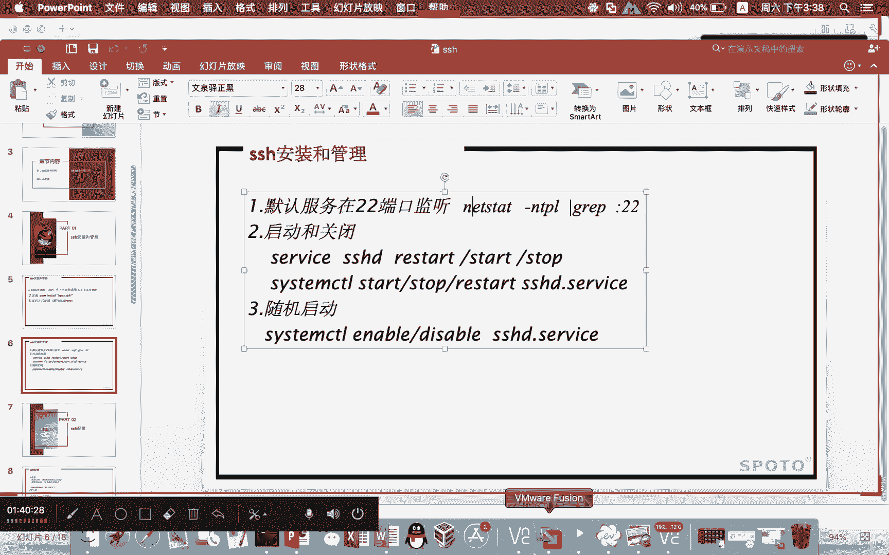

# Linux基础课程（RHCSA）简简单单学会Linux入门教程 - P7：第三节课ssh-1 - 思博Linux关关 - BV1fv411j7RG

好，我看一下哈，无厘头这位同学问到说简减help要怎么去删它啊，点减help，你看我们这里啊，我这里也有减减。哎，我看看简减help在哪里啊。我们来看一下这个简解小态，我借一个出来吧，好不好？跑到这个。

download下面。大家有疑问可以问啊。一般在课堂上啊，如果跟这个我们内容相关关联性比较大的，我都会给大家去做这个解答啊。IDI呀。touch简简HELP。系。这个touch还不能这样touch啊。

PHO。啊，如果要删它IM减IVF减减cp这个删应该是比较简单哎。要转移一下。看一下。哎，他删不了。哎，还是前L。啊，还有一种办法直接在外面删，把整个目录删了算了。啊，这样可以在目录上外面上个。

当然如果你觉得有些东西不需要删，那你可以先把这个什么呢？呃文件移走，然后在这个目录下面呢来进行删除，这样也OK哈，反正删是肯定可以删了啊，有多种方法可以呃，如果说。目录外面是属于少了吧。😊，可以删。

还有一种办法哈，赵慧强就是用那个什么呢ISYC啊，这个东西来对两个目录进行什么同步啊，这样是可以这这这是另外一种方式。😊，像刚才那个如果说对那种什么大文呃，这个一个目录下面税文件文件比较多的情况下呢。

运用这个RSYNC，它其实也可以删啊，都可以。啊，就是有的时候呢会这个什么呢？会伤及无辜嘛，对不对？我删删这个点点还好的这个命令，把其他的东西也给删了。但有的时候就是没有办法。啊。

后面呢讲那个安全部分内容的时候啊，就提升课程里面有一个例子啊，因为大家说了这个问题啊，有一些东西确实蛮有。😊，蛮有意思的，蛮提出来给大家去分析。比如像我们刚才删那个简点hel就不好删，是不是啊？

那还有一种的话是像删那种呃带着隐藏属性的。就跟那个什么呢？大家用的那个什么的口香糖一样，你把它粘在某一个地方，一段时间之后是黑黑的。你想要把它弄掉，其实是很难的。lily下面也有类似这样的一些属性的。

然后你把这个东西有一些那个什么内核能力剥夺掉之后，这种带隐藏属性的这种文件，它就删不了。😊，大家可以去看这个什么呢？呃，linux的这个一个叫。Knalcap就linux是内核能力的。有一个功能啊。

好嘞。来，我们现在呢给大家讲这个SH服务。那么在讲这个SH服务的时候呢，我先提前给大家讲一个东西啊，什么东西呢？就是刚才大家比较关注的怎么样进行数据的。

虚拟机之间的数据的这个什么呢交互上传啊，我教大家一招。啊，前面几个方式我就不给大家说了，就像什么winSCP啊，这个我就不说了哈，因为那个比较简单，大家把这个软件载下来，然后呢在那个筛选绘画里头。啊。

然后在里面呢去设置什么呢？对应的这个什么用户名和密码。那个用户名和密码的话就是对应的这个什么呢？呃你的root用户和你的root用户的密码啊，把它设置好。然后出来之后呢，会有两边啊。

就整个窗口里头它会分左边栏和右边栏，然后左边栏里面的话，就是你的windows机器的一个什么呢内容，右边栏就是你linux机器的一个什么呢内容，你们直接去搜一下winSCP的一个使用用法。

那个是很简单了。所以我这个地方我就不给大家介绍，那我给大家介绍是另外一种啊，大家是因为你是用linux。所以你如果是说你现在还在用VNSDP的话，当然你传统的正常这种数据的上传下载，你认它还可以。

我们大部分机器的一个维护都是通过什么呢？客户端工具远程连接进去。因为你不单要做数据上传下载，你还要再做什么呢？相关的系统的这个维护。像刚才建目录啊啊运行某些命令啊，对不对？有些东西你就没有办法做啊。

你如果说只愿minSCP肯定是不合适的。那大家可以通过什么呢？啊s cRT啊，或者是叉c这种方式呢来完成。那我这边呢给大家用的一种办法是什么呢？

啊，我这里给大家介绍的是win啊，这个CCRT。哎，我现在远程连接到我的另外一台虚拟机去哈。

我这边呢有一台虚拟机装了windows。机气头。诶。

本来这个部分的话是放在SH服务讲完的后半部分给大家介绍。

啊，既然大家比较关注这个问题，因为今天剩的时间也不是特别长，所以我就把这个东西呢先提前出来给大家去讲。取消。这什情。锁定了。虽然我这个版本比较低哈，是一个windows2003的一个软件。呃。

windows2003这个操作系统，但是呢并不影响给大家做这个内容的相关功能的一些演示啊。我在这边呢用的是什么呢？CQCRT啊。就这个。这个软件呢。你看我在这个地方的话，我可以去创建对应的一个连接。

那么这个对应的连接，我的这台虚拟机是192。168122。1啊，是这台机器啊，然后这台机器上面的话呢。比如说大家现在想要去做这个连接，你可以在这个地方。

比如说echo session去新建绘画或者是快速连接啊，在这个快速连接里面，我还需要大家去输入什么呢？对应的。IP地址啊，292。168像这种快速连接可能用起来不是特别好。

因为你有可能对这个服务对应的机器啊会一直重复进行连接使用。所以我们计划呢都把它做成什么呢？嗯，一个可保存的一个绘画啊，这样子的话，我不需要每一次连接都要去填这个东西啊。

所以快速连接就一次性就像那一次性快餐一样，消费完了就没了。那我就希望自己每一次都能够这个保存好的这个绘画里面去做什么连接。那保存的话这个绘画里面去做这个连接的话呢。啊，接受一次。你在做的时候呢。

可以在这个地方有一个什么呢？连接啊，就用这个连接，然后把它保存下来，不要用那个快速连接啊，完了之后呢，我设置好用户名和密码。啊，在这个地方。我们可以给大家打开看一下，有一个什么呢绘画选项啊。

这个设置部分。啊，主机名端口，然后呢密码。啊，你可以点开这里，如果自己想要改，你可以把这个东西改成用户名和密码啊，这个密码如果有改，你自己改。我这个密码不用改，肯定是对的。好嘞，这个呢就相当于什么呢？

连接上去了啊。那么连接上去之后呢，大家可以呢在这个地方装一个什么呢？LRZSZ的一个什么呢PM包啊。刚才有同学说老师装RPM装那个FDP需要样仓库。哎，也确实如果你想用一样仓库去装肯定可以啊。

但是有的时候呢，大家可能。不会去配这个什么呢样仓库。所以我们可以用最简单的方式。那你要保证RRPM包你可以拿得到，对不对？那么RRPM包在哪里呀？在我们的这个光驱里头。对吧在我们的这个关区里头。

像我们这边这个虚拟机。😊，呃，大家可能阅的时候呃，有同学前面就问老师啊，我这个装起来之后，为什么我的桌面会多出一个。

这个光盘出来，那就是因为你在启动的时候呢，有设置了什么呢？呃，这个有插入这个光盘。所以我们在用的时候呢，在这个地方就会有一个什么呢光驱。你看我们这里打开。

Root。123。在我这边桌面也会有一个什么呢光盘。你要保证你的光盘在虚拟机启动的时候呢，就已经挂在上面了。这个桌面启动的有点慢。

大家稍等一下啊，我等它显示出来。用图形的方式给大家看。啊，默认不是挂起的，有可能哈那你要自己要把它挂起啊，你看我们这里就有一个光驱嘛，对不对？那么这个光驱这个路径要怎么进入呢？啊。

很多同学可能不知道说哎，老师他光驱有挂，但我又怎么样进入在linux下面，我怎么样去进入这个光驱里面去拿到我想要的这个IRPM包呢？啊，我们可以这样干。打开这里。啊，在这个桌面上面没有东西。

要通过什么呢？DF减H这条命令啊，它的这个挂载的路径就在这里。啊，他的这个挂载路径就在这里哈。然后大家注意哈，它这个挂载的这个路径里面啊，对应的这个文件目录名字啊，它是干嘛？它是有带这个空格的。

所以你在进入这个目录的时候呢，需要注意哈。我们尽量用table键去补齐这个路径啊，在这个路径上面呢，就有一个什么呢？就有一个。对应的这个什么呢？相关的目录，我们的这个PM包是在什么呢？

这个package下面，那个package下面放了很多的RPM包。然后呢，在这个地方啊，我们要去找一个叫什么呢？L。I say。SZ。啊，就是这个包。你们不要去把整个文件都给它敲出来。

你只要给我敲LRJSJ后面用什么table键补齐。那么这个包你就可以找得到。那么找到这个包，你就可以把它什么呢？自己想要在这里面安装也可以啊，或者把它拷贝走，放到其他地方去安装也可以。

你看我这里哈就可以用这个命令RPM减IVH。😊，把他什么呢？把他给我装起来。啊，那他这里就直接提示你说什么is already in那如果有很多同学可能大部分同学的话，应该是这个东西也会也有装了。

那么装完之后你就可以用。如果没有装，他在进行安装的时候呢，就会出现什么呢？两个百分百。像刚才有的同学装FTP啊，他可能知道说通过FTP把这个数据往上传，对不对？那FTP这个包呢也在这里面啊。

它是叫什么呢？VSFTPD这个包你也可以运用什么呢？IRPM减IVH直接进行安装啊，装这样的一个小包，我们并不需要什么呢？劳师动众去做一个样装库啊，最最简单的方式去做就可以。你看这个两个东西都可以装啊。

那么FTP这个上传，我就先不给大家介绍啊。😊，呃，我们现在呢已经装好了LRJSJ这个包。那么LRJSJ这个包。装完之后呢，有两个命令，一个命令叫RJ，还有一个命令叫什么呢？SJRJ是用来做什么呢？

上传的SJ是用来做什么呢？下载的。你不能在这个linux，就是说你不能在图形界面下面呃越RZSJ你要用什么呢？CQCRT连到虚拟机里面。

啊，就是我们刚才用的这个什么呢CUCRT这个地方。

对吧在这个地方我们要在这里，因为这个你的客户端是什么呀？你的客户端是windows嘛，对吧？我觉得CQCRD连上来，那我现在就可以通过什么呢？阿Z。😊，将你的文件上传。那么比如说你的文件放在这个桌面。

那我就可以跑到这个桌面来。我要把这个什么呢？里面的某一个文件给它上传上去啊，假设我要传的是。一点com这个文件，那我可以点击。一点com，然后点击一下添加，然后呢。确定。好。

确定啊这个东西呢就上传上来了啊，你可以去看这个E点com。这个文件呢就会在啊，如果说你自己觉得这个文件有点问题，想要重传一次，那可以把它删掉。删掉之后呢，用IZ啊再传一下。我跑到这个桌面去然。

我再尝一次添加，一定要点一下确定啊，把它上传上去了啊，这个就很简单，你用叉 shell装好的，然后连接到这个虚拟机里面去。只要这个LRCSZ这个命令啊。呃，这个包已经装了。

那么这个RJSJ这个命令都是可以用的对吧？你看我们这里这个时候呢，就已经上到了传到了你当前所在这个路径。你现在在哪个路径？人家从windows上面传上来，就传到这个路径下面去。这是阿飞做上传院的。

那么还有一个呢是用来做什么呢？下窄院的。下载是什么呢？SZ那我们在进行下载是指什么呢？从linux机器上面的内容，通过SZ把它下载到什么呢？你的这台windows机器来，假设我现在要下载的是什么呢？

SHE。点PPT叉这样下载下来。你看我们这里就已经什么？百分百的话，它就说明已经是什么呀，下载成功了。那么这个东西下载下载到了windows机器哪个位置去呢？我们可以右击。

就是你把这个鼠标点到这个什么呀服务器。😊，连接的这个绘画窗口这里，然后右击。选择这个什么呢啊绘画选项。看这个什么呢？XY。然后这里有一个什么下载。哎，我们刚才的这个文件SHE点PPT叉。

它就下载到了什么呢？E盘，就windows下面的这个什么呢E盘去，你想要改可以，你把这个东西改掉嘛，你自己去指定一个路径，它就会下载到你指定的这个路径下面去了。

那我们跑到windows下面的这个什么呢E盘，你来看一下。好，我们跑到E盘S。你看我这里有一个什么呢？SHE点PPT叉哦，它就下载到了什么呢？这个文这个目录。啊，就下载到这个指定的这个路径来了。

就是通过这种方式就可以很简单就可以实现什么呢？这种上传与下载这是最简单的一种方式啊，这是最简单的一种方式啊，SH服务做好了。呃通过这个LRZSZ啊，就可以进行上传下载啊。

其他的FDB那种的话是要求大家呢对。FDB要懂他怎么安装，要对它进行什么一定的一个控制。那么这一部分的话是在提升课程里面呢，呃会给大家去做这个介绍。我鼠标在虚拟机经常会失灵，点不动东西怎么回事啊？

无厘托，如果说是这样的话，你可能在显卡驱动部分的话，可能需要注意一下。像我们早先用这个vissel box部分的话，也会碰到类似这种情况。我在这个地方呃会做一个调整，就在这个显示部分。

然后这里有一个什么显卡控制器。你在winmail里面你可以去看一下这个显卡控制器部分啊。如果你用的是其他的这种显示驱动的话，它那个显卡有可能导致这个什么鼠标不能正常使用。如果是V mail的话。

你可以看一下这个地方画。

有的时候他这种话也不一定，每个人的硬件都会有所不同啊，有可能因为不同的硬件在驱动上面的话就会产生什么呢啊不一样的一种效果。

我们把这个外面打开。我的虚拟机太多了。在这里有一个啊对键盘与鼠标这个部分啊，键盘和鼠标部分你可以看一下这个部分的话能不能做一些更改。还有一个是显示器这一部分也可以看一下。

基本上它设置调整也就在这个几个地方去做调整啊。如果说能调整好人调整好，调整不好，有可能就是不行。啊，这个不一定。断电后，虚拟机起不来了。断电后虚拟机起不来了，有什么报错啊，大家可以把那个提示发出来。

发到那个群里面，可以让助教老师或者我看一下啊。一般起不来，一种是可能你的启动顺序没做好，也有可能你的硬盘坏掉了，虚拟硬盘坏掉了，但虚拟硬盘坏掉的这种几率会比较少一点。呃，这个是刚才讲到的HH服务当中哈。

如果用这种方式去做这个怎么呢上传与下载。好，我们现在接下来给大家看一下呃SH服务实际的一个什么呢？实间的一个管理。

特系。

这个PPT哈。总共是通过三个方向呢来给大家去做这个介绍SH的一个安装和管理配置，以及SH的一什么呢客户端工具。像我们刚才那个CUCRT，它其实就是一个什么呢？SH的一个客户端工具。

那么安装部分系统啊在装好之后。我们对应的这个SH不默认就已经什么呢？给你装好了。它的这个监定端口就是默认是在什么呢？22号这个端口下面的。所以你可以呢在系统安装完之后，你可以在windows下面。

你可以通过什么tnet或者说其他的这种方式去探测22号端口也没有在啊，我们也可以在自己的这个linux系统里头啊，通过其他的方式来确认我们的这个端口是否有在。

比如说你看我这里通过NATTSDAT减NTPL冒号22号这个命令的这种形式来确认我们的这个端口有没有在啊，我们现在呢连接到我们的这台虚拟机来，我们可以通过这条命令来确认啊。

NAT减NTPL那么这里面的这个NTPLN网络T是指什么TCP协议P是看什么呢？这个对应的这个什么的协议啊，其实就这个然后L其实就是一个罗列。那我们这里面呢可以从这个地方看到什么呢？你的22号端口。

现在目前是有监听在什么呢？4个0这个IP下面的。

啊，说明我们这个机器啊，22号端口是有在监听的啊，它的这个进程的名字是叫什么呢？SHD我们能够远程连接到SH服务来，其实就是因为什么呢？SHD这个进程的一个存在啊，这个端口的这个存在我们才能够连得进来。

那么这里面的这个4个0，它所代表的一个含义是指什么呢？是指你现在这台机器上面的所有的IP都能够什么呢？监听22号端口。也就你可以认为啊，就是说大家去连这台虚拟机器上面的所有IP的22号端口的话。

都是可以连得上的。但有的时候呢，我们并不会将22号端口干嘛？都监听在所有IP下啊，比如说我们。对应的这个服务器，它有多个IP啊，一个是公网IP。一个是内网IP。假设你的服务器是这样子啊。

那我们在做一些规划的时候呢，你可能会把什么呢？22号端口只监听在什么呢？内网IP里头。那有同学就问了，老师，你这个监听在内网，那我想去连接我们这个SH服务，我怎么去连啊，你可以通过什么呢？

它做好的VPN服务。可能大家是一个比较大的网络，你想要去连我内部的这个服务的话呢，你肯定要播什么呢？VPN账号，连到专网来之后再去连接我的内网啊，这个时候你才能拼得通我的内网。

你才有机会去连接我的什么呢？HH服务端口啊，那么用这种方式做的一个处理，就是怕什么呢？一定的一个安全的一个隐发啊，就是说我们想让风险变得更小一点。你如果把22号端口也开放在公网上面当然。

肯定是用起来绝对是方便。因为你开公网IP，我必不需要拨号，你可以直接用公网IP后面跟端口22号就可以连到这台服务器来啊，用户名密码对的情况下就可以连得上来。但是呢你可以连，那么其他的人他其实也可以连。

对不对？呃，带来方面的同时也开放了一定的风险。那我把这个东西限制限制在这个内网的话呢，那只有播了V片我可以连得进来。所以我们在做这个监听IP的时候呢，我们可以去什么？通过配置文件这种方式呢去控制。

我要监听在哪个IP下面，像我们这台虚拟机，我这台虚拟机的话应该是哦这个IP不多。但是呢我如果说想只想监听在31。145，并不想监听在127。0。0。1下面的话呢，我们就可以通过配置文件当中的这个什么呢？

啊，打开。VIMETC下面的SH下面的这个什么呢？SH。D这个配置文件，然后在这个地方。在前面部分啊。我们要到这个文件的头，我们要到这个文件的头按的字符是什么？各位同学啊，我们要到这个文件的第一行去。

啊，上节课给大家介绍的这个VI那么到这个文件的第一行去，我们应该按什么字符？喂喂喂。各位同学。要到这个文件的第一行去按的字符是什么呢？大家还记得吗？啊，有的同学可能。哎，对，两个小写的记是不是啊。

确实挺卡的。我看我这个都问了半天，你们估计也是很快就回答我了。然后后面这个才输出的啊，我们按两个小写的记就可以到什么呢？😊，文件的第一行去在这个文件的头部啊，在这个地方有一个什么呢？

listen address啊，listen address在这个地方，然后还有一个什么呢？port呃好端口。就这个位置。一个是监听端口，一个是什么呢？监听IP地址。

如果我们想要对刚才监听的这个地址做更改，我们可以将listson address部分改成什么呢？你要指定的这个IP。当然，这个IP一定是这台服务器，它自身的IP啊。

不能说你要监听的这个IP是外部一台服务器的IP那肯定是监听没有用的。19026831点什么呢？145，那这样子他在监听的时候呢，呃想要远程连接到我这台SH服就只能什么呢？连接到31。145的这个什么呢？

22号端口来啊，然后端口部分，22号端口大家也可以改啊，有的同学呃注意安全的考虑，因为22号端口太出名了，你的系统一旦安装好，如果监听2个IP呢啊，如果监听2个IP你可以写什么呢？

类似 address再写一行啊，你可以再写一行，明白吗？😊，啊，那这里面这个port部分，因为22号端口太出名了，所以有的同学也会将这个什么端口进行更改啊。

不希望说22号端口就是我们的默认的SH服务端口。你这个端口你可以自己改改成8022，只要这个端口在系统当中没有被人占略，你就可以改。那我这边呢就不改了啊。那我现在呢。啊。将这个监听的IP地址改完啊。

我们要对这个服务进行一个什么呢？重启操作serviceSHD李大。啊，重启一下。那么重启完之后啊，我们就可以通过什么呢？减NTPL啊，重新确认。你看我们原来是4个0，那么这个时候呢就会变成什么呢？😊。

指定的IP地址啊，指定的IP地址，我看那个群里面也有同学问到说，哎，老师，我那个SH服务关了，然后这个什么连接还在啊，你可能要注意看一下你那个是不是真的关了啊。像这种它只是一个什么呢网络连接啊。

网络连接。网络连接的话呢，有时候并不一定服务关闭之后，它的这个连接就会被关闭。这个还真的不一定啊，这个还真的不一定啊。我们看这个连接的时候，他用到这个参数呢就不一样啊。

像这种只是就是你用这种参数命令的方式去看，它只是看当项系统当中TCP协议部分有哪些端口正处在监听，但是它并不能显示什么这些端口有哪些什么有哪些客户端正在连接，你要看正在连接，你要在后面去增加一个什么呢？

A啊，增加一个A这个A部分啊，就是看什么呢？有哪些连接，正在什么呢？😊，进行当中，你看我们这里哦。你们可以看到一个东西，你看在这个地方我们可以只能看到的状态是什么呢？啊，lesson井号是。注解要撤了。

是的，没错啊，井号是注解啊。你如果说井号这个没撤掉的话，那这个使用的过程当中啊，这是呃不会产生效果的哈。那加了这个简A，它就可以看到什么的对应的这个连接情况。好，你看我们可以看到31。

1145的22号端口，现在目前是什么？31。1。这台客户端就foing address，就就是客户端。客户端通过它的这个端口，这个IP来连接到了我们的这个SH服务的什么呢？22号端口啊。

这个连接呢它就已经在了。那有的同学老师，你这个东西如果说想要把这个连接给它关闭掉，那我们怎么办？我们可以把这个进程给它杀死掉。😊，啊，那么进程的这个管理在基础课程里面我们会给大家介绍。

所以大家不要着急啊，通过这种方式可以看连接，想要踢他直接加进程ID给我Q减9杀死掉就可以了。啊，就通过这种方式，我们可以确认出目前的一个什么呢连接情况。

那serviceSHDliststar这是对服务进行总体管理。呃，这种服务的一个管理方式是以前虹贸企业六常用的一种方式。啊，这种方式我们把它称之为什么CV这种方式。那么现在在红贸企业7下面的话呢。

我们用的是system cTL这种方式对服务进行管理。我们要通过什么呢？system cTL。然后这里面要跟上什么呢？啊，这个。star大就是开启。那如果是李大的话呢，我们也可以通过什么呢？

listarHHD点什么呢？service。安装部分我们其实已经给大家介绍过类似的这个命令了。当时管理的是什么呢？防火墙。所以在红贸企业机下面啊，你运用service这种方式。

或者你用这个什么呢systemCD这种方式都可以实现什么呢？相关服务的一个管理。这两种方式都OK啊，这两种方式都OK。那么还有一个地方的话是大家在使用的时候哈，在使用的时候呃。

像这种SHD服务一定要确保它是处于什么呢？随机状态的。就是我们的这个机器开启起来，SH服务一定是要跟着开起来的。因为我们的系统管理都是依赖于这个服务的。如果你这个服务没有开。

那你后面的这个连接就没有办法做了，对吧？这台机器在远程的一个机房里面的话，你不可能跑到机房里面去啊，所以你一定要确保我们的SH服务是处于什么呢？存活状态啊，也就是要看这个什么呢？enable状态。

一定要什么呢？running状态，基本上这两个东西要同时存在你的这个远程连接才有办法。😊，啊，我的本机是windows10，又跟虚拟机连接，是要下载一个软件版。没错，无厘头。

我们刚才前面给大家介绍了这个几个软件。

在我们的这个PPT当中哈，大家可以去看我们这里面有一个什么呢客户端工具。有一个客户端工具，你看我们这里哈。😊，linux的一个终啊，这个终端我们就不用说了，终端本来就可以连接你的虚拟机啊。

PUTTY啊CQCRT插线这些都是属于你的什么呢？客户端可以连接的一个工具。这个网络上面都有，大家可以去下载啊。插需有的话呢，可能有一些呃这个收费啊什么之类的，你们可以去院试院版的或者说这个破解版的啊。

😊，这个CRT的话也是一样的啊。如果大家这两个东西不好载，你们可以先用POTTY啊。😊。

对于大家这个学习都不会有影响，重启这个服务不会断开，已经存在的连接啊，重启这个服务的时候呢，有可能如果你这个服务做的有异常，因为重启的过程当中，它是先做stop。然后再做scar。服务如果重启没有问题。

那么刚才这种连接影响基本上是没有啊。那如果说有影响，比如说在重理的过程当中stop关掉了，但在启动的时候有问题。那么你刚才这个连接可能就会受到影响。已经建立的连接是不会有影响。

SH修改地址和端口能限制登录的原地址吗？哎，独自等待可以，但是没有办法在配置文件里面做啊，我们需要通过什么的IPtables。啊，防火墙。F what。点service就可以通过这两个东西来完成什么呢？

对应哎这个东西开到公网，哪个人可以过来连接我的SH服务啊，可以通过这个。😊，来进行什么呢？限制。哎，对，要通过这个策略来做啊通过这个策略来做哈。

那么在基础课程现在目前我们都还没有涉及这些相对比较深入的一些知识点。提升课程里面才会给大家介绍到，所以大家可以先循序渐进啊，不要着急。如果说你确实呃比较着急这一部分的东西哈。

你们可以去找汪汪老师或班主任老师那边啊，去看一下有没有办法弄到这一部分的这个上课的视频啊，以及相关的一个资料和文档啊，他们那边都有，而且是讲的非常详细。像Itable部分。

我们不单会给大家讲这个什么的相应的端端口以及地址的一些限制。我们还可以告诉大家。😊，就是还会介绍大家在IP table下面怎么实现负载平衡啊什么之类的。

所以可能很多同学都会觉得负载平衡好像跟IP table没有太大关系。其实呢IP table它也可以实现负载平衡。所以他们的这种功能啊会做的什么呢？更为呃。😊，强大一点啊，很细。

包括这个防火墙部分IVds很多是通过命令的方式直接操作。那么防火墙它也有带图形的一些窗口啊，所以有兴趣的同学啊可以去看一下，独自等待哈。如果你现在比较着急，可以用这条命令叫什么呢？firework。

当然你防火墙要开起来啊，有一个叫fire物。点confit这条命令，防火墙开启，先把防火墙开启。因为我们安装的时候呢，是防火墙是处于关闭状态的，对不对？要求大家把它关掉。

如果你现在想要做这个限制登录的原地址，那你要把防火墙开起来，防火墙开起来之后呢，用这个图形窗口这边打开，你可以先去研究一下，里面呢可以限制什么原地址IP啊，可以不单是可以限制什么原地址。

登录你的SH服务，还可以限制原地址登录其他的一些服务啊，还可以限制其他的一些东西可以做的什么呢？更为智能。地址端口转发原地址、原地址限制、目的地址、限制都可以。这是通通过图形窗口来做的。

他这个做的比较舒服一点啊，用起来不会就学起来用起来不会那么方，不会那么像IP tables全命令的那种方式那么麻烦，所以方便很多。鸿贸企业八的时候呢，现在不是用就是防火墙，它底端内容用的是什么呢？

底端实际上面用的还是IP table这一块东西，就红贸企业7的时候是这样子。然后到了虹贸企业八的时候呢，它不是用。I命令上面的话没有区没有差异，没有区别。但是呢fireford在鸿贸企业8下面。

他用的是NF tables。啊，NF tables效果其实都一样啊。这是I128里面的一个内容啊。啊，这个刚才讲到这个防火墙。加到这个防火墙有同学问了，我们就稍微展开了一下。

我们回到HH。就刚才这个配置部分哈，然后这里面有讲到一个什么呢？其他方式的一个安装。那么其他方式安装源代码或者是RPM包。呃，我们在用这个其他方式安装的时候呢，一般很少会用到这种方式。默认正常情况下。

我们都是自己呃系统装好，它自己就有了，不会去用源代码去做。那么什么样的情况下会去做这个源代码方式的安装。哦，我们在公开课课程里面有一节课给大家讲到一个什么呢？安全部分linux提全之呃。

loadot kit啊，root rootot kit和一个什么？叫web share。这两个什么呢？呃渗透。嗯，里面呢就有讲到一个什么呢？源代码安装SH服务。当然，这个SH服务装出来的东西是有问题的。

有做过一些什么呢？后门手脚的。那我们前面我前几天的时候也碰到一个同学问我啊，他是生产环境的一有问题啊，他是他的SH服务远程登录不了了。我怀疑他是被人什么呢？给攻击给破坏了。

然后我们建议他是重装了一下SH啊，他当时就通过什么呢？源代码把这个SH服务呢重做了一遍。然后通过新做的这个SH服务远程连接进去，他就可以远程连接了。比如碰到这种情况的时候呢。

你可以通过这种方式啊来完成什么呢？服务器相关的这个系统的一些什么飞护。但是恢复完登录进去，最好能把业务东西啊把它迁移走。因为这台系统有可能是什么存在很大的安全隐患。就其他方式安装在正常系统情况下。

我们不会去做。但么大部分情况下都是用默认的。如果真喷到安全问题，你不妨可以用源代码这种方式呃，源代码方式的话用的也是open SH。啊，可以到open SH的官网上面去载啊。

它有对应的这个什么的开源的软件包，就t压缩包啊什么之类的啊。赵伟强问他说防火降夫默认开启，每次重启就自动开启了。对，如果你在安装的时候呃，没有对防火墙进行这个什么呢随机启动的这个什么呢取消。

那么防火墙在。你机器重启的时候呢，它都是跟着你的机器一起启动起来的。你们可以通过什么呀？因为这些都是属于安装部分就已经给大家讲过了。

唉。St us。Fwork。点service，你们可以去确认，你看我们这里现在目前是diable，说明防火墙没有随机启动。然后你看这里是inactive dead，说明防火墙当下是没有在运行。

如果我们想要把它烂成变成随机启动，你要把这个什么，把这个改成什么呢？enable。然后服务重启一下，这个防火墙就会跟着一起开起来了。对第一节的内容哈，刚才有同学如果说不是很明特别明白的话呢。

第一节这个内容。可以去看一下啊可以去看一下。

这是SH服务啊，刚才的一个什么呢简单的一些配置啊，启动的这一块和关闭的这一块呃，启动随机启动啊，我这里呢就不再什么了重复介绍了。好，配置文件部分。啊，配置文件部分配置文件这个两个部分的话。

我们已经给大家介绍了。那这里有说到一个什么呢root远程登录是否禁止。😊，呃，root远程登录是否禁止？那么root远程登录是否禁止的话呢。

我们在运的过程当中啊呃可以根据业务情况去决定他这种如果说把它限制成什么呢？no就是说permit。😡，log in从字面去理解，翻译过来就是允许root登录。啊，意思意思就是说允许root用户远程登录。

像我自己从苹果机登录到我的这台虚拟机，我都是通过什么呢？SH的这个什么呢？它的这个root用户进来的那如果说我把这个。把这个配置改成什么呢？no哎，默认它是y。如果我把它改成no。

那你想要远程登录root用户，它就不行了。我跟你讲啊，生产环境里面确实有这样的一个配置。呃，有一些环境呢，它要求非常严格，要求你在进行远程登录的时候，不能用root用户登录，这是为了什么？

保护root用户啊，是为了保护root用户。那么不能登录root用户，那相关的一些需要用root用户权限去操作的一些命令。那怎么办？其实我们在后续部分会给大家介绍一个叫虚度的一个东西。呃。

虚度的话可以让你进行什么呢？相应的这个。命令的执行。那这个部分他可以指定。我可以在执行这些命令的时候呢，临时切换成root用户来执行。啊，只不过用户登录还是普通用户，呃，这是一个比较简单的方式啊。

像那个有班图，人家就是不能默认情况下，就是不能让你越什么呢？入册登录的。它不单是远程，包括什么呢？包括你在。图形窗口下面你也不能用root登录。你们如果有装这个有班图桌面的话。

这个linux有邦图的这个lininux桌面系统的话，你们可以去感受一下。装完如果你不做配置调整，你是休想用root用户进行登录，你只能用什么呢？putot啊这个普通用户进行登录。

那么生产环境里面安全限制要求严格的，它也会做成这样的一个限制。啊，这是配置当中啊，大家需要注意的第一个地方。那么还有一个地方。

什么地方呢？就是配置文件当中涉及到的一个叫什么呢？DN的一个设置。啊，这个设置的话呢会影响大家的什么呢？登录的一个速度，就远程你登录的这台虚拟机，有可能你会卡半天。

那么很重要的一个原因就在于这个地方就是。UseDNS。又是DNS。又是DNS的话，它默认是什么呢？默认是yes。他的意思就在你远程登录这台虚拟机的时候呢，人家会去什么呢？反向解析啊，原来是IP。

我们正常情况下都是指什么呢？域名解释解析出服务器的IP然后去连接这个IP去做登录。那我们大部分情况下都是什么呢？SH后面跟上IP去登录这台服务器。那如果你是usDNS等于y这种状态，有可能登录很慢。

因为这个时候你在远程登录这个IP服务器的时候呢，它会去反向解析解析出它的域名了。但这种情况下基本上都是解析不出来。所以会一直在重试啊，然后表现出来就是你可能会登录在验证之前啊登录尝试连接的时候呢。

就会变得很卡。但一旦登录完之后，它就不会卡所以我们可以计划就是说如果有办法你登录很卡的话呢。大家可以先把这个什么的值给它改掉，把它改成什么呢？usDN等no。

然后呢对这个服务呢进行重启service SHD大掉。啊，独自等待问到说，老师SH版本登录密钥认证方式能修改吗？可以改啊。

呃，今天晚上这个估计是今天下午这个内容我们可能是讲不完了啊。因为我们接下来需要给大家介绍到，就是刚才这位同学所讲到这个什么呢呃SH服务当中的这个什么呢无密码方式验证啊，也就是他所说到这个什么呢？

公钥方式的一个验证啊，我回头会先把这个文档呢发给大家。那么有兴趣的同学可以先看一下。晚上我们就会集中时间给大家介绍一下SH服务当中的这个什么呢？无密钥认证方式啊，啊这个无密码认证方式，也就是通过什么呢？

密钥认证。就通过密钥认证。好了，那么今天下午的这个内容呢，我们就暂时先到这。呃，晚上是。8点上课啊，晚上是8点上课，大家别迟到。

