# Linux基础课程（RHCSA）简简单单学会Linux入门教程 - P8：第三节课ssh-2 - 思博Linux关关 - BV1fv411j7RG

时候呢给大家讲了一部分SH书。哎呀，我们继续下午没有讲完的内容。

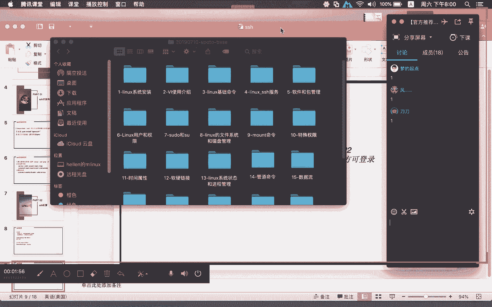

呃，当你做好SH服务相关的一个配置啊，有可能你坚定在某1个IP上面啊，也有可能你把这个22号端口哎这种方式。给改了，可能改成其他的一个端口。那我们在正常情况下。

如果大家去用这个SH某一些客户端工具去远程连接的话呢，那我们可以在呃SH后面跟什么呢？IP的这种形式直接去连，你要连接的那一台的什么呢SH服务器。那我这边的话呢有两台服务器。

现在哈大家现在后面开始做这个SH服务实验的时候呢，最好要能弄出什么呢？两台机器来啊，就两台linux虚拟机。然后我把这个虚拟机先给它家建出来一下。

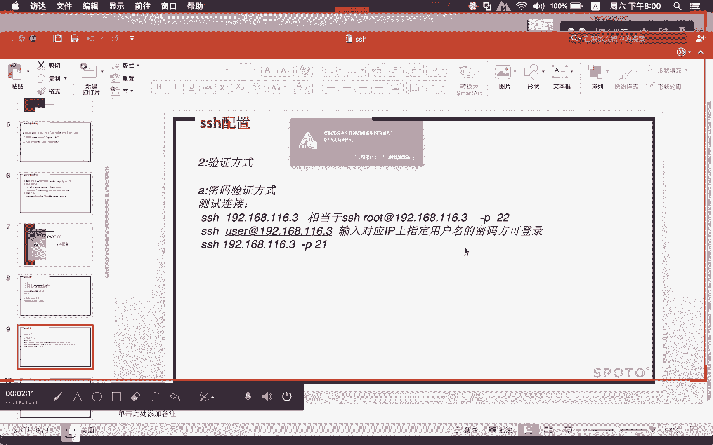

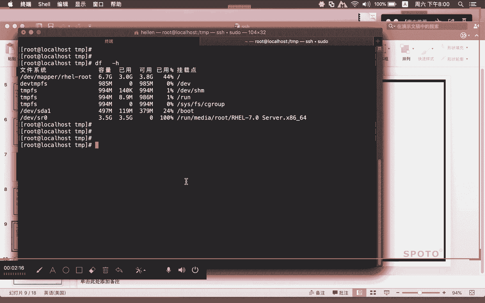

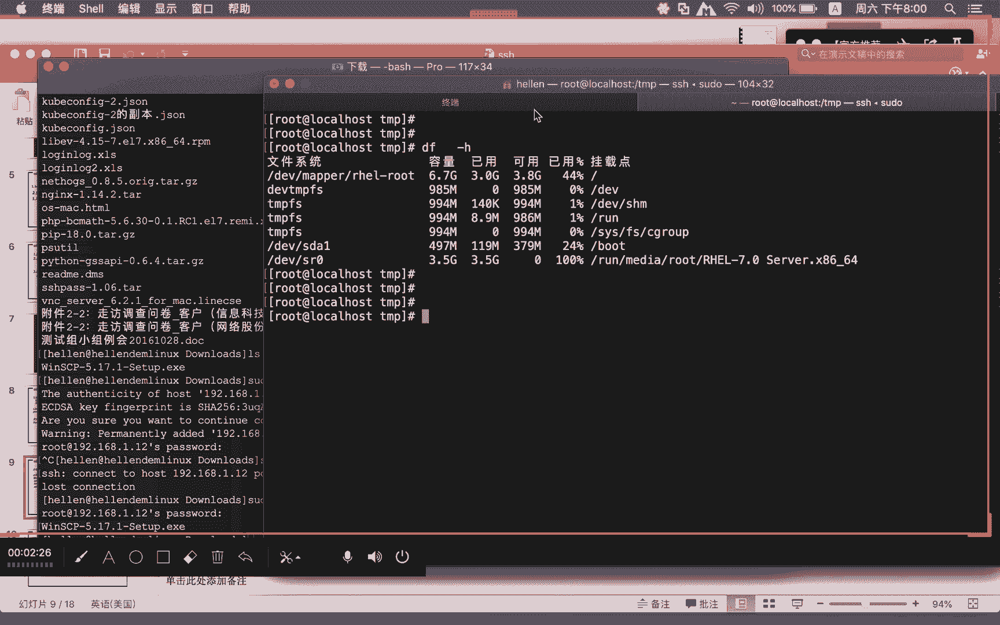

啊，先远程连接上去，虚拟机我已经有现成的了啊。嗯，在这个地方。现在这边的这台机器的话呢是192。16831。145。我先把这台机器的主机名字先改一下哈。呃，之前就有同学问过，哎。

老师这个主机名字怎么改啊，我们改主机名字其实是非常简单的啊，它有一个配置文件叫什么呢？hos name这个配置文件，你可以把这个主机名字呢，把它给我写到这个地方来。192。168。三幺。145啊。

就这样哦。这写的有问题。我把这东西重新改一下啊，192168减31减145，你名字也可以改其他的。我这个我这个呢只是为了什么呢？给大家做区别。因为我这边的这一台一台是31。145，还有一台呢是31。

146。啊，我现在呢保存一下啊保存一下啊，你也可以呢直接。想要让它生效的话，你可以退出一下，重新再登一下123啊，大家现在就可以看到什么呢？啊，我们的这个主机在这个地方显示的时候呢，就是31。145。

通过这个地方，大家就可以很直观看到说哎，我现在是在哪一台虚拟机上面，呃，这是145的这台虚拟机。那么还有一台虚拟机的话呢，是192。168。31。16。啊123。好，这个部分的话，它已经是改成31。

146了。那我呢现在呢就是要用这两台机器来给大家去做相关的SH这个相关服务实验啊。比如说我现在想要从这个外面的这一台31。146这台机器啊，去远程连接31。145。那我们可以通过什么呢？SH162。

168点什么呢？31。145这种方式啊，直接就可以连过来。如果。31。145和31。146啊，也就是说31。146去连145的时候，是第一次连接。那么在这个地方它会提示你什么呢？要敲一次yes啊。

他要去记录它的这个主机的一个key哈，那你想要连接一定要写yes，如果你不想连接，那你直接弄，它就直接中断连接了。我们输完yes，它会要求你去输入什么呢？对应的这台机器的密码啊。

123对应的这台机器的什么呢？root用户的一个密码。那我们现在呢就通过这种方式啊，已经就通过这种方式，我们就连接到了31。145。其实在我们使用这条命令的时候啊，他已经把很多默认的值给你省略掉。

如果你在写这个远程连接啊，写完整一点的话，它应该是这样写root。at就是你要登录这台机器的。哪个用户啊用哪个用户去登录这台虚拟机啊，我现在就是要登录你的31。145的这个什么root用户。

然后默认状态下呢，它是连接什么呢？SH服务的22号端口。所以呢它也把这个什么呢？减P22，这个给省掉了。因为默认就是22，所以你减P22呢，就有点什么呢？啊，多此一举，没必要，但是如果对应的服务器。

比如说31。145，它监听的这个端口啊，不是22号端口，那我们可以通过减P来指定它现在目前所监听的一个端口啊，这个是跟我们下午所讲的SH服务端口的那个配置部分啊是相呼应的。

人家对方是在哪个端口下面监听的那你在进行这个远程连接的时候呢，减P就要去指定什么呢？对应的这个端口。那我这边22号端口我就不指定啊，因为默认就是这个。

所以可以不用那如果说你想要远程连接其他的一个用户的话，那你要把这个什么呢？root用户改成什么呢？其他的用户，比如说用户啊。现在都是用这个什么呢root用户去做。

所以我们先不管这个什么呢普通用户这一块的一个内容。那你这样子在进行连接的时候，因为没有做成什么呢？无密码验证方式。所以我们这个部分的一个连接就需要输什么呢？对应的一个密码啊，第一次连接让你敲yes。

那么一旦第一次这个yes敲完输过密码，第二次再连接，它就不需要要求什么呢？输这个yes，但是密码还是要敲的。这种方式就是最简单的也是最常用的这种什么呢？通过另外一台lindux的这个虚拟终端啊。

登录另外一台什么呢啊，虚拟机的这个SH服务的这种方式。那我们在实际业务应用里面啊，我们也会碰到什么呢？无密码验证这种方式。那么无密码验证方式。不是说他什么东西都不依赖。

他只是说我在跟你进行这个连接交互的时候，比如说31。146这台服务器想要去登录31。145的时候呢，不需要密码。他们之间是通过什么呢？公钥和密钥的这种方式来进行数据的这个加解密啊，数据的这种什么呢？

无密码验证。那怎么样去实现这种无维码验证？那么它的这个用处又是什么呢？啊，我们可以给大家举一个很简单的一个小例子啊，比如说。SCP哈SCPSCP在进行这个数据传输的时候。

它这中间走的一个通道其实就基于什么呢？SH服务的22号方口。我们可以将31。146上面的什么呢？一个数据传递到什么呢？31。145这台服务器上面来。那我们先跑到这个31。145这台服务器。

我们先用LS这个命令哈来确认一个文件比如说我们确认这个文件是3个1的这个文件啊，现在目前大家可以看到在31。145上面，我们这个文件它是不存在的那我想要从什么呢？31。146，将这个文件同步到31。

145去啊，那我们就可以用什么呢？SCP这种方式来做。那我先将什么呢？t下面的这个文件给它创建出来然后SCP啊，你要同步哪个文件啊，我要同步的是t下面的111这个文件，你要同步到哪里去啊。

我们要同步到192。118。31。145啊，这台。服务器下面的什么呢？啊，比如说我们想要同步到对应的这个t目录下面去，到31点145的这个什么呢？t路径下面去啊，那我们现在就可以进行一次同步啊。

那么同步的过程当中啊，因为你没有无密码验证，这个时候还是正常的要输什么呢？145下面的root用户的密码，我们敲123这个是密码。好，这个时候呢这个111就同步过去了。那么同步过去之后。

我们可以在这边重新确认这个文件有没有同步过来，对不对？啊，你可以用L重新确认，哎，你会发现145下面的这个文件已经被你什么呢？同步过来了。就是说通过这种SCP啊，基于这种SH服务上面的这种传输通道。

它可以完成数据之间的一个么同步啊这个东西啊，一旦延伸出去。比如说。我写的一个脚本里面啊，需要用到什么呢？SCP进行数据的一个同步。同时在运用这个SCP同步的时候呢，我可能会写多个SCP。

那你在脚本当中啊，哪怕是只有一个你在脚本自行执行的过程当中啊，他就会去输什么呢？对应的用户名和这个什么呢密码。在无密码验证状态下，如果这个脚本啊放在半夜三更去运行，而且是什么呢？

每周比如说每每一天他都会做这类事情。那半夜三更去执行。那运行到这里人家就卡住了，让你去敲这个密码，明显啊你干了一天两天还行。你如果说长年累月都要让我每天晚上半夜三更这个两三点的时候起来啊。

因为运行这个脚本需要敲密码，所以我跑起来运行一下，然后敲这个密码，让这个脚本能正常运行，这是非常低效的一种做法。所以引入无密码验证就会让整个的一个什么呢？数据的一个传输啊，变得什么呢？更为自动化啊。

我不需要人工的去做这种介入啊。我们在上一节课给大家讲那个长阅命令的时候呢，有用到一个什么呢？EXBT的这个东西。可能有的同学有问啊，我不知道是哪个同学问我说老师那节课到底就是那个。啊那个长远命令的时候。

EXBD到底他实现了什么东西啊，他可能。😊，在我讲这个命令的之前，那个场景呢，他可能没有感受到啊，或者说他没有听明白，所以他不清楚说EXBCT到底能干什么事情。那我们在这里用EXBCT的话呢。

他可以什么呢？在你没有做我密码认证的情况下呢，你刚才不是要输入密码吗？他可以通过EXPCT把这个什么呢？密码主动自动的把你什么呢？给塞进去。啊，这是给大家留的一个后话，我们先把无密码验证做完。

回头再回过头来给大家介绍这个EXBECCT而这是一个比较好用的一个东西啊。那如果说要做无密码验证，我们需要做的步骤。第一。首先你要确认谁能够无密码验证登录到谁那里去。我们想让146这台服务器能够什么呢？

无密码验证登录到什么呢？145去。那也就是说146是什么客户端，145是什么呢？服务端。啊，那确定好这个之后呢，我们就可以在什么呢？146上面哈利用。对应的命令去产生一对。密钥对啊。

它产生密钥对运到的是什么呢？SHT。G恩。运到的是这条命令。那么在默认的正常情况下，它出来的这个加密的算法，就是产生的这个密钥对，运到了这个加密算法是SA算法。如果说大家想要用其他的加密算法的话。

你可以在这个简地后面去加什么呢？DSA但是现在目前哈它这个可支持的这个加密算法也不是特别多。那我们现在呢不去指定加密算法。因为基本上像这种他们之间的这种加密算法都是属于什么呢？非对称加密算法。

就公钥和密钥，就说我们所说的这个密钥对啊，它一般是包含两个元素啊，两个文件，一个是公钥，一个是什么呢？密钥啊，数据在进行这个传输的过程当中啊，它会利用什么呢？利用我们的密钥进行数据的一个加密。

然后到对应的这个公钥那边去会利用公钥进行数据的一个什么的解密。其实反过来它也可以做啊，没有说必须是哪个东西加密哪个东西解密。它这种就是一个属于什么非对称加密这种算法啊，那么加密算法这一块呢相对比较深。

我们的这一部分不做深入的。大家只要知道现在目前我们用这个东西可以实现什么呢？无们俩验证。那么在146上面，我们通过SH减KGN这条命令来生成一对啊来生成一对密钥对我们现在看啊，在这个地方生成的时候呢。

会提示你我们对应的这个文件会生成放到哪里去啊，它生成的路径是在root下面的点SH下面的什么呢？IDRSA那么这里的ID下划线RSA啊，其实就是ISA算法。然后用这个东西啊作为一个什么呢？

啊文件命名里面的一部分的一个串作为一个什么的标识。这里产生的这个文件啊，其实就是一个密钥。那么除了一个密钥，它还会有一个公钥，我们在这个地方不要去做任何的改变，就按这样回车下去啊，然后问你啊这个密钥。

要不要对它进行这个什么呢？设置密码那默认情况下是空的，不做密码的啊，因为我们这个密钥也确实比较重要哈。如果有的同学觉得你有必要把这个东西做密码设置的话，我觉得是可以设。但大部分情况下我们是没有去设它的。

好，我们现在按回车啊回车。那么这个时候呢大家注意看哈，整体敲完命令之后，它产生的这个输出啊，在这个地方就会产生提示你有两个文件，一个是root下面的点SHID下划线RSA还有一个是什么呢？

是IDRSA点op那么这个就是什么呢？公钥啊，你后注意是点pop了啊，我们知道啊有一个单词叫什么？PUBCY吧public啊，PUBLCY publicublic这是。公共的意思对吧？PUBLIC啊。

public这是公钥的一个意思。然后上面这个呢是私钥。那我们在做这个无密码认证登录的时候呢，你需要将客户端的生成的这个密钥对当中的什么呢？公钥传递到什么呢？传递给我们的服务端。啊。

我们不能把自己的这个密钥传给别人啊，我们要传给别人的是什么呢？公钥传给别人啊，你不要傻傻的把自己的这个密钥塞出去啊，是公钥塞给别人啊。那么他怎么去传这个密钥呢啊，怎么去传这个公钥呢？它通过的是SCP。

哦，SH不好意思啊，是SH。点copy。点ID，然后这里用到的是减I来指定你要传的是哪个公钥啊，SH下面的ID下划线SA点pub。那用的是这条命令哈用的是这条命令，然后传给谁传到哪一台服务器去啊。

他后面直接就跟上你要传的那一台SH服务器，192。16831点什么呢？145啊，这这样后面只要跟IP就可以了哈，这样传上去传上去之后呢，它也会让你呢输一次密码123我的密码是123。好，这个时候呢。

它就会将这个什么呢？公钥传递到了什么呢？192。16831。145。那么实际上面啊，它在传递就用这条命令，实际上面再传递这个文件的时候哈，实际就是放到了192。16831。145啊。

这台服务器下面的什么呢？有一个叫这么一个文件，就这个文件。他其实就是把他的这个什么呢公钥传递到了这个文件里面去。你可以去比较一下，你看我们这里。啊，这个是来自于31146传过来的什么呢？公钥。

你可以把这段内容跟你的这个文件的这个内容啊，你去做一个比较，看看是不是相似的啊。啊，我们把这个话先留在这，一会儿呢还会根据这个问题呢做一些调整。好，现在这个东西一旦什么呢？调整完了，我们就可以什么呢？

进行验证啊。一开始我们是从146呢远程连接145的时候呢，是需要输密码了。那我们现在来看一下这个时候它需不需要输密码。192。168，你看到没有啊？192点16831。145。哎。

这个时候它就不需要呢去输入密码了。那么实现了这种无密码验证登录之后啊，它其实带来的一些这个作用和效果，其实是非常明显的那像刚才前面的这个SCP进行数据同步和传输的时候呢，它就不需要输密码，对不对？好。

那还有一种做法，什么做法呢？我们先远程退回来一下哈，就是你用这个命令，在这号在它的这个后面还可以去运什么呢？加入我要执行的一个什么呢？命令。比如说HH31。145。啊，卡了吗？各位同学。喂喂喂。

其他同学会卡吗？喂喂喂。有点是吧，我好，什么情况？那我换一个网络哈，大家稍等一下啊。偶尔会卡是吧？我换一个网络，可能这会。这会可能今天。今天周周六。我改一下啊。有部分同学可能会卡一点，不及时。

周末应该网络可能会差一点，有可能应该是。然后我现在呢换了一个网络，应该会好一些吧。那我。那我这边看哈，大家可以看哈，比如我刚才说我实现无密码验证之后呢，像刚才SCP这种数据同同步的传输的过程当中啊。

它就不需要去介入输入这个密码啊，可以做成一个自动的这种方式，对不对？那么还有一种方式是什么呢？还有一种方式就是通过SH远程连接对应到这台服务器的话，那我们可以在后面去用双引号这种形式去什么呢？

去指定说哎我到你的这台服务器要执行什么命令。但是输出的结果却实在什么呢？别人这边来显示，你看我SH到这台机器去。😊，啊，正常情况下，比如说我要到这台机器去执行命令，那你可能就会SH1下到这台机器。

然后在这台机器上面去执行，对不对？但是有的时候你远程到这台机器，你只是想要执行某一条命令而已啊，执行完这条命令，你可能就退出连接了。那你刚才这样的一个操作，干嘛要一直干嘛要登录到里面去之后再执行。

然后再退出，我没必要，那我就可以用这种方式在做啊。😊，SHIP后面跟上什么呢啊，执行的命令。比如说if con，那我这里呢可以。你看我这里哈，你看我们这里。😊，我现在机器呢是在31。146上面。

然后我远程到31。141啊145上面的ifcon执行了这面一条命令，然后人家这显示的IP就是什么呢？31。145，但最终的一个结果呢却是显示在什么呢？31。146啊，我的远程连接。并没有什么呢？

跳到31。145，还是保持在什么呢？自己的这台31。146上面SH里用CQ语句命令。哎，那个独自等待。如果说你要用这种方式去做，它也可以做。但这里面呢会涉及一个东西，就是比如说你用CQ语句啊。

你需要用到什么呢？用到比如myCQ部分的那myCQ部分的话，它也有它自个的一些命令，你要在远程到这台服务器去之后，然后再调myCQ命令，在myCQ里面再包含什么的CQ语句。哎，这种方式是OK的。

反正就是SH到这台机器，你想要在这台机器干什么事情都给我放到什么呢？双引号里面去做啊，像我们刚才这样子。要加参数也可以啊。我们把这个东西给我写出来。你看我这里执行31。146执行这条语句。

然后它最终的一个显示的效果就是什么呢？31。145。呃，像刚才这个同步的SCP啊SCP我们的这个什么呢？t下面的111。也是一样的，去传到什么呢？192。168下面的31点什么呢？145。

然后后面跟上什么呢？temp。就这样同步。那么这个同步因为它做成了什么呢？无密码验证登录，所以呢在这个地方它就不需要什么呢？去输这个密码了。那我们在做这个无密码验证登录的时候呢，还有一个应用场景。

就在什么呢？一些集群的这个实间上面啊，因为对于这个什么呢？机器来讲啊，集群之间他们会进行数据之间的一些交互啊，这种交互呢相对来说会比较频繁。啊，那这种频繁的一些交互。有的时候呢就需要用到root权限。

需要用这种无密码验证登录的方式，从这台机器登录到另外一台机器，获取它相应的一些什么呢？信息，或者说在另外一台机器上面是执行什么呢？相应的一些命令，就通过这种方式呃来对数据集群之间这个数据一些交互。

我不知道这里面几个同学啊，对这个集群有什么概念啊。😊，呃有没有同学。不知道集群的，有没有同学不知道集群的啊，这个东西是必须有要知道的啊。像我们这个什么呃淘宝啊、腾讯啊，对吧？

我们面对他们像这样的一个平台，是面对一个全国这样的一个客户在进行访问。所以他的这种访问量是非常大的那，你可以想象一个东西哈，你可以想象一个东西。比如说我给你一台服务器。这台服务器上面我跑一个什么呢？

跑一个这个。外b服务啊，比如说阿帕奇服务啊，这个什么呢？这个NG1服务就类似这样的一个网站。你用一台服务器来支撑整个什么呢？全国用户的一个访问。那你这台服务器肯定压力超大。啊，这个机器肯定会被搞爆掉。

到了那个双十一，他绝对撑不起来。那么他们想要让这个平台整体的一个业务量啊，会者说变得更稳定，业务的这种成载量会更大。他会用更多的机器啊来对外提供统一的一个服务。啊，比如说我给你访问的时候。

大家都是访问淘宝网站。那么这个淘宝网站下面它可能就会放什么呢？成千成百上千台的这种web服务器来给大家来进行什么呢？网站的一个访问。这样子就是一个什么呢？集群啊，集群之间需要做什么呢？

相应的数据的一些调度啊，相应的数据的一些什么呢？一致性同步啊，类似啊，甚至监控啊这些东西都要去完成啊。访问轮询只是其中一种策略，而且这种策略是比较低端的，比较low的啊。呃我们在提升课程当中啊。

我们会给大家介绍一个东西，我不知道大家这个你们如果有兴趣可以去看一看这个负加平衡的这个东西啊。因为学这些东西。做这个linux这些东西啊，不其实不管你做linux还是做开发，还是做什么网络。

像这种负载平衡集群这些东西你是必须得会的。像网络他们也有集群的一些概念。只不过可能大家实施的侧重的这个设备啊做的方式可能会有所不同啊，我们可以用来做集群复载平衡的呃，涉及硬件的，比如说F5。

这个比较贵啊，F5这个硬件专门用来做负甲平衡的，以及下午我们给大家介绍到的什么呢？IPtables这个东西也可以用来做负甲平衡。啊，可能很多很很少有同学听过啊IB labels啊后还有AD对。

还有啊AD这个算硬件啊，AD算硬件，我们用开文软件也会用的比较多一点啊。哎，对了，NGINX。😊，啊，还有什么呢？还有LVS啊，还有LVS还有什么呢？HAPROXY哈。😊。

那现在如果大家没有在线下做这个机房的话呢，那你还可以用公有云的什么的负载平衡。那么公有云的这种负载平衡，它的这种性价比以及相关的这个性能啊肯定会比自己做的会来得更好。公有云不同的云之间。

他们也有不同的这个什么负载平衡像公有云下面的这个什么阿里云啊，他那个负载平衡好像是叫什么呢SLB啊，SLB然后如果你是那个亚马逊的AWAWS的亚马逊的它的那个负载平衡是叫什么ELB啊。

我记得好像是这名字应该我没有记错啊，除了这个阿里云的亚马逊云的，还有什么其他云的腾讯云是吧？华为云啊，百度云啊，谷歌云啊，好多奥利云都有。所以。😊，哎，对呀，华为的反正这个几个产品他们都会带有LB。

但之前的第一个字符，它可能会有所不同。他们实现的这个功能啊，也基本上跟我刚才所描述的这个功能会什么呢一样的啊，但是呢相对来说性价比和稳定性部分啊，肯定会比自己搭来的好。当然了，如果说你自己想要做呃。

想要变得更灵活一点的话，那可能自己搭这个负载平衡可能还会怎么更方便一点啊。集群是不是所有服务器配置都要一样。赵慧强对的。😊，默认正常情况下，我们都是要这样子。我们希望什么呢？在我们的这个集群当中。

每一台服务器，他们提供的能力都是什么呢？一致的啊，如果你是不一致的话，在进行这种对外提供服务的时候呢，可能会出现什么呢？呃，某一个节点，它提供的这个能力比较差啊，有可能导致什么呢？像类似什么呢？

水桶效应啊，我们的这个桶里面的每一个木板都是很高的。结果呢在这个水桶里面有一个木板是很短的，就会可能影响到你的这个什么呢？整个集群的一个什么呢？稳定性和效果。😊，短板呢。OK好嘞，这个是。😊。

SC呃这个SH当中的什么我密码验证登录啊，我密码验证登录。那如果说呃因为我们下午呢也有同学在问说，哎，老师，如果说这个我密码验证当中中的这个密钥，我想要改。那我们应该怎么改啊。

回到我们刚才给大家介绍到的这条命令SH下面的这个什么呢？copyID的这条命令，我们通过这条命令啊，是将什么呢？对应的这个公钥传递到了什么呢？我们的服务端去。I d。

SA点p将这个公钥传递到了什么SH服务器，它的这个什么呢？also the case这个文件当中。就这个文件当中，如果说我们将服务端下面的这个什么呢auso key啊，像服务端下面的这个什么呢？

auso key。里面对于什么呢？这台客户端机器的这个公钥把它给删掉。那你想要进行。后续的哈保持正常这种无码验证登录，那他就会什么呢？报错了，我们现在呢可以跑到145这边来。

我们将这个al kiss里面的这个什么呢内容把它删了。因为我现在只有一台做无名码认证登录。那我这个删掉之后呢，大家现在再来看一下它还能不能无名码认证登录啊。SH192。168点什么呢？31。146啊。

145，你看我这里。这个时候他就他就要求你什么呢？输密码了啊，因为什么呢？公钥被你给删了，在服务端这边。没有保存人家的这个公钥了，我怎么跟你进行交互啊？虽然我这个密钥队在我这个什么呢？客户端这边我都有。

但是在服务端那边，你原来我传给你的那个公钥，你给我扔了，我我怎么跟你建立无密码认存登录啊，没有办法那如果说你把这个东西删了，现在你想要干嘛呀？想要去改你的这个什么呢公密钥。那你现在就可以去改啊。

你现在就可以去改，你可以把这个公钥重新整个密钥队，你可以重新生成，生成完之后再发给对方啊，或者说也不要重新生成，你就在这个地方，你就把刚才的这个公钥再传一次我们把它退出来，我可以把这个公钥了，再传一次。

😊，再传一次之后呢，这个无密码验证登录啊，它又会什么呢？恢复回来啊，123敲进去。好嘞，我们现在再来验证一下，看一下这个无名码验证登录是否又能够恢复如初啊，31。145。哎，你看这个时候呢。

它就又不需要你去输这个什么呢？用户名和密码了。OK啊，这里面呢有2个PPT部分的内容，大家可以注意看一下啊。第一个部分讲的其实就是这个什么呢？呃，这个文件的一个东西啊，那么这个部分的话。

我对大家没有要求。如果你听不明白也没关系啊。那么这个部分的话是下面的第二种方法来实现这个无密码认证登录，这个呢是最常用的一种方式。那么这一部分请大家一定一定要记住啊，因为做密码认证登录啊。

这个是很需要啊很多地方都会经常需要做类似的这种操作。如果有两个机器需要互相无密码验证登录，需要两个机器互相都给对方公钥吗？唉，微微大笑，没错的。

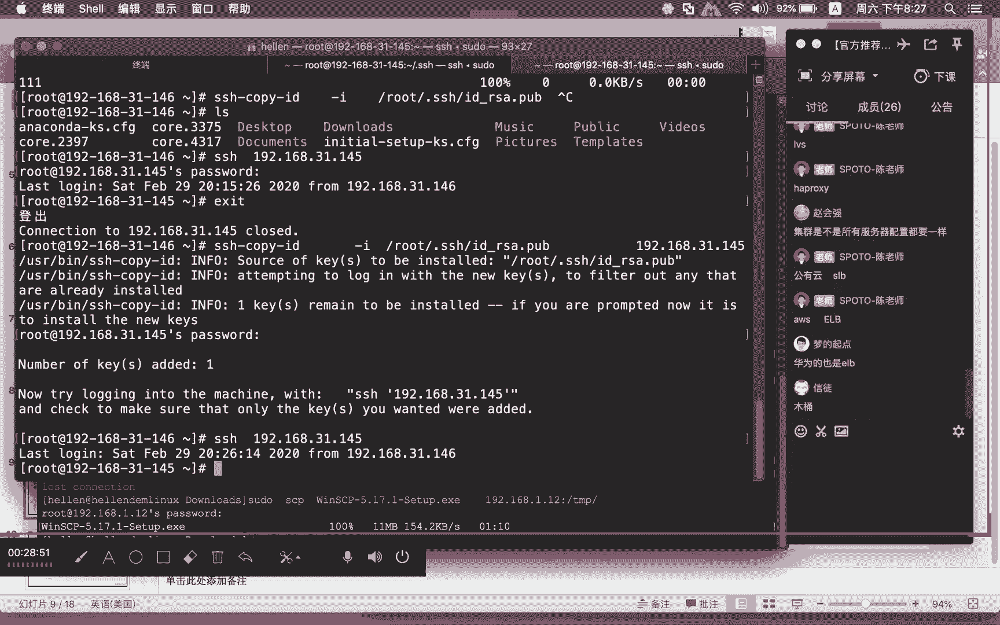

比如说146登145无密码认证登录，对吧？OK你现在想145也能无密码认证验证登录146，那你也应该在什么呢？145上面做什么呢？146相关的一个什么操作。好，windows问了一个问题。

windows可以吗？windows客户端，我我告诉大家哦，windows是可以的。windows是可以的。啊，你可以把那个什么呢CQCRTSEC。URT那么CQCRT在进行这个什么呢？登录的时候啊。

如果大家将其绘画保存下来，其实呢这个部分就已经什么呢？产生了类似这样的一个东西。你在二次登录对应的服务器的时候呢，在CQCRT里面是不需要什么呢？再输密码的。它的这个验证的方式是有两种的，一种密码。

一种是什么呢？证书方式。所以windows是可以的，windows也是类似可以的。但是它的一个做法啊，可能跟我们这边的这个实验的这个做法是有所不同的啊，它需要在CQCRT上面呢。

用这个东西来产生这个证书，然后通过这个证书再去远程连接什么呢？我们的linux服务器密码改了就登录不了了吧。好，O问的起点，你先不着急，我先把这个你的第一个问题，windows客户端的这个问题啊。

你可以先看一下我远程连接到这个什么呢？用CQCRT呢来做这个什么呢？远程连接。啊，我们给大家看一下哈。大家不着急哈，我会给大家讲的清清楚楚的。哦。这个连不上，我得切一下。我连到我的这边的虚拟机来哈。

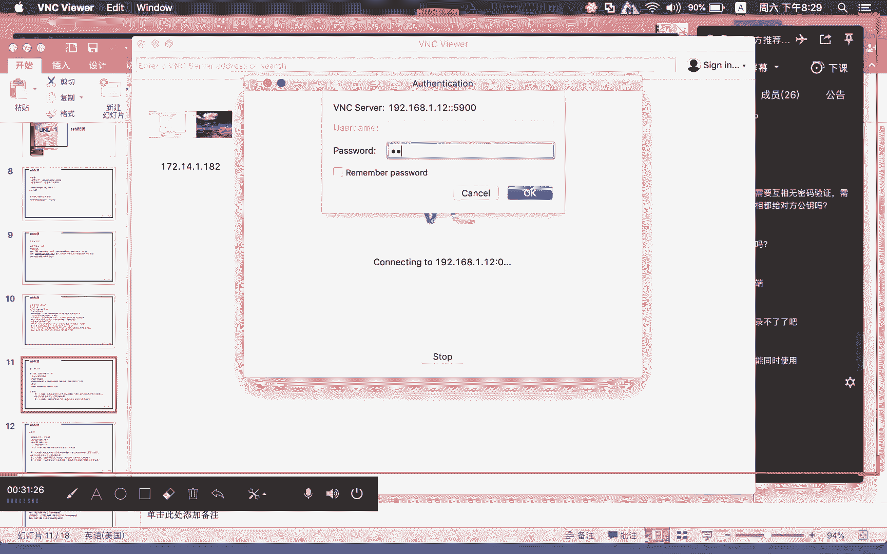

好，在我的这边的这个。

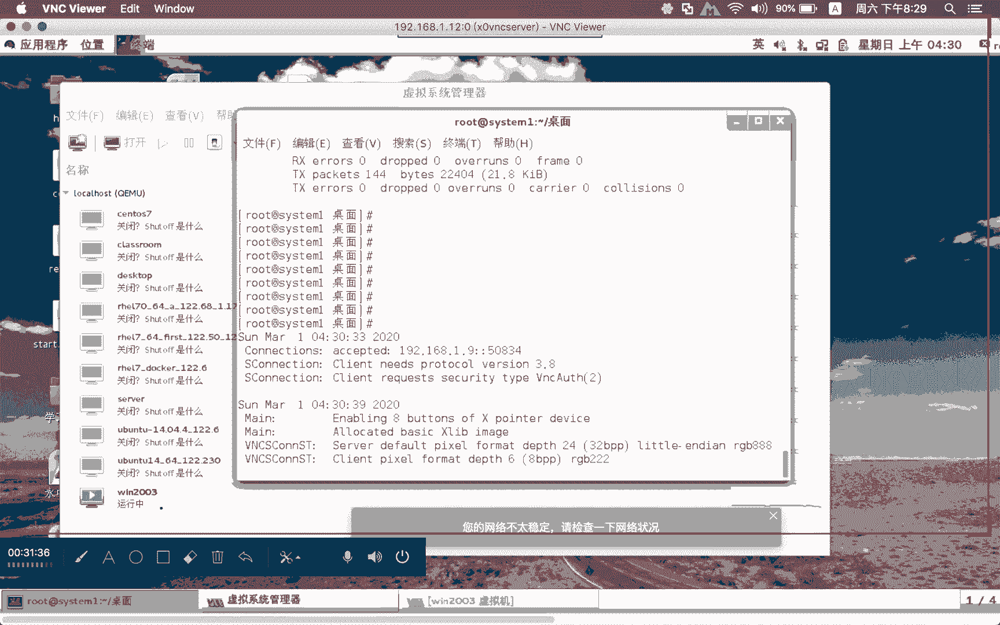

windows这台机器上面。我们登录进来之后呢，就用刚才那个什么的CQCRT去打开它啊，下午当时就给大家用这个什么CQCT就去打开过了啊啊，你们可以看这里面呢，它其实在进行这个验证登录的时候呢。

是有两种方式啊，一种是你可以用密码进行登录啊，还有一种的话，你可以用这个什么的公钥进行登录。有点慢啊，打开的有点慢。哎，怎么这么慢？不是需要。

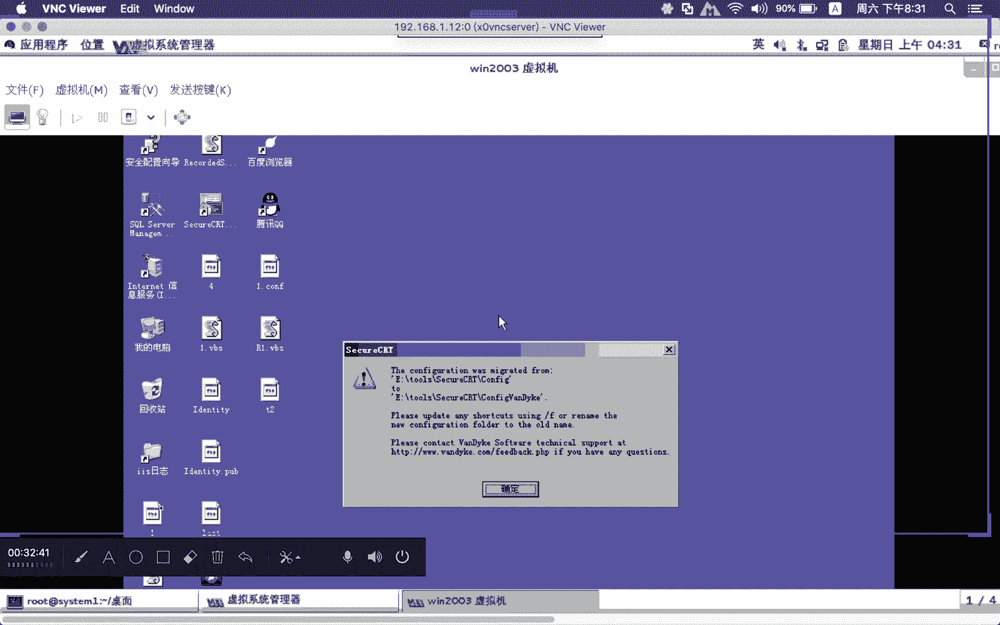

我这虚拟机跑这个win7win10的可能有点不行，所以就受不了。你看我们这边哈啊大家可以在这个地方，你已经建好了这个绘画里头哈，你可以右击。右击这里边的这个什么的属性啊。

然后我们现在呢在这个地方你可以去看啊，它这里面呢是可以有多种连接方式的。嗯，属性里面。在SH啊，这个SH里面，你看我们这里有一个是密码，有一个什么公钥啊，如果我们现在这个密码放到前面去。

那他现在目前就是按照什么的密码这种方式来进行什么的验证登录。那如果说你是用公钥这种方式来进行这个什么登录的话，你可以把这个公钥往前翻啊，那么现在目前他就用这个什么呢公钥来进行登录。

当然你相关的这个什么呢公钥这些东西啊，你要匹配好啊，如果说你没有匹配好，那这部分你就没有办法进行登录了啊，就没有办法进行登录了。我们在进行这个相关的验证内容的时候呢。啊，相关验证内容的时候呢。

比如说呃有一些服务器他们在进行这种连接规范部分。可能就是用什么呢？公钥这种方式来进行什么呢？连接啊，有些话他还是用这个什么呢？密码这种方式。那么整体的这种运维部分的这种验证。

大家可以去做类似的这种设计啊，用公钥可能呢就不需要去做密码啊，如果说你用这个什么呢？密码你就不能用什么呢？公钥这两种东西是不能并存的啊啊，比要问到说这种密钥登录的具体交互过程不讲嘛哦。

我看网上的一些文章讲的都不一样。那么比on啊它这一部分的东西首先是将公钥传递到什么呢？我们的服务端啊，你只要记住一个东西，这是第一，它是非对称加密。第二，我们在将公钥传递到服务端去之后啊。

我们的整个请求呢是从什么呢？客户端向什么呢？服务端去请求的。那么你由客户端去向服务端请求的时候呢，人家在客户端这边发出的这个请求是用什么呢？密钥来进行加密。

那么密钥加密完到服务端服务端利用它接收到这个数据，通过公钥。进行解密啊，如果说数据之间能匹配，那么这个解密过程就算是什么呢？建立起来了。然后最终再将什么呢？从服务端这个数据啊。

再将服务端的这个数据呢再传到什么呢？客户端来。那么这个连接上次握手之后呢，就可以正常啊进行这个什么呢交互了。用为公钥，你不要以为说哎我们这个只是为了做我们密码认证登录。

那这中间其实还起到一个什么数据保护的一个作用。就是说你通过它想要通过这个什么呢？TCP dump做一些抓包分析，你其实是很难做到的。因为之间呢它是有数据的一些加密的。包括我们做那个什么呢？

HTPTPS啊，大家访问一些网站的时候，人家那个证书你可以去看他那个证书，那个证书其实也就相当于是什么？是一个公钥。明白吗？我们都是将公钥给别人，从来不会把那个什么呢私钥给别人啊，私钥是在哪里呢？

私钥是在服务器端啊，当我们用这种证书啊，你的HDDBS放上这个证书之后呢，啊中间的这种数据的这种交互呢，就通过这个什么呢？他们之间的这种证书来进行加解密，同时又能够确保说什么？

哎我的这个网站的什么的合法性。这个讲HGDBS的时候，我们才会给大家介绍到。啊，反正只要记住一个东西，从客户端到服务端啊，他们之间是非对称加密。那么这部分的话东西就是从我们的这个什么呢？

客户端这边用密钥进行解加密之后，到服务端，服务端，用公钥进行解密啊。如果说你这个公钥和密钥不能够匹配，那么这个解密的过程就不能对应上，那么数据就不会被建立起来，这个连接就不会被建立起来。好。

这个是刚才有同学问到的几个问题哈，我们呃。

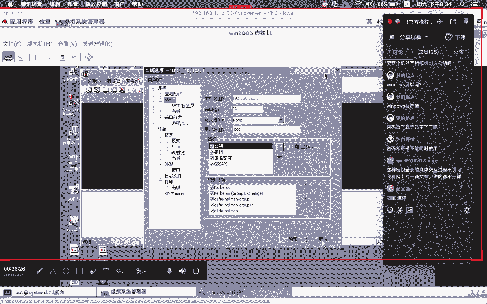

都给大家做了一个什么？简单的一个解析。那有刚才也问，哎，老师密码改了就登录不了了吧。呃，如果说密码改了，大家可以想一想密码改了，它会不会影响我们这个无密码验证登录。你看我们这里第一个问题。

A能够无密码验验证方式登录B当B上面的这个root密码发生改变后，A是否还能无密码方式登录B机器。第二个问题，当B的IP变成了CA是否能无密码方式登录C哦，这里面的这个几个问题啊，都算是什么呢？

比较典型的一个问题。那我们来看第一个问题。

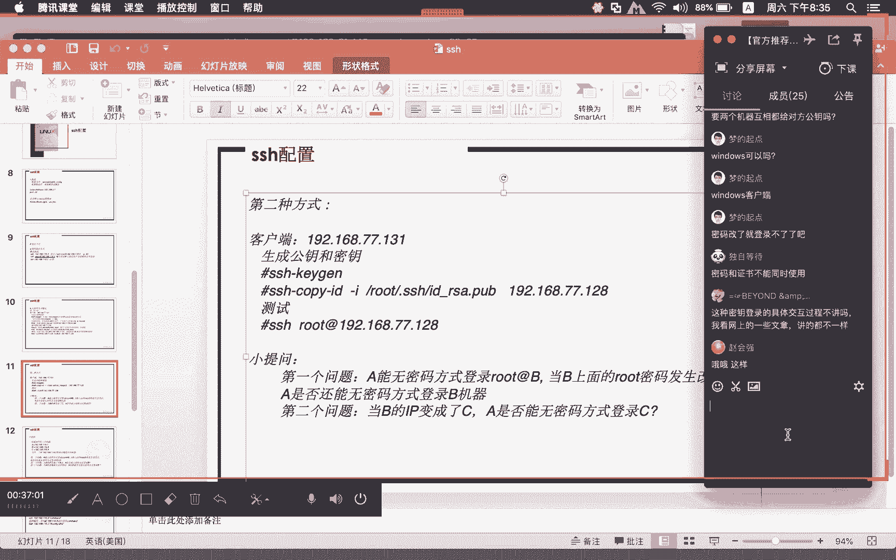

现在我们的这两台服务器，一台145，1台146。现在呢我们是146可以无览认证登登录到145，对不对？好嘞，我现在问大家，145密码改了，我们的这个无密码认证登录，它还能登吗？😊，喂喂喂，来。

大家满猜没关系啊，我们俩应该改了密码也可以登录，可以可以，是不是？OK我觉得你们大家应该是大概理解到了这个精髓了，我这个登录跟你的什么东西有关啊，跟你的证书有关，是不是？我跟你这个密码有毛关系啊。

是不是你的密码改了，我还是照样可以登。那我们也没关系，可以来做一个什么呢验证啊，在我们的这个什么呢？146145这台服务器上面，我们对对应的这台服务器，它的这个密码呢做一下设置啊。

我们的设置的这个密码用这种什么呢？无交互的这种自动方式来给大家设置。让大家也可以看到我现在这台服务器它的密码设置改成了什么？我的这台密码，它原来是什么呢？123。😊，现在我要改我要把它改成什么呢？

456，那我怎么改呢？我改成456echo456啊，这是比较好用的一个做法啊。大家也可以记住这些比较有意思的命令哈，pas word简点STDIN后面跟上什么呢？录ot用户。

这句话的一个意思就是我要将root用户的密码改成什么呢？456。那我们下回敲敲下去啊，你看我们这里更改用户root密码，它是word所有的这个什么的身份验证令牌已经成功更新啊。

如果大家用这个什么呢PSSWD后面跟上root，你这样改，当然也可以啊，但是密码看不见是吧？密码看不见。啊，现在我让大家看到了我设置的密码OK那我现在呢进行一次什的远程连接，你看这个时候我的远程连接。

有没有要求说要你输密码，我们的无密码验证登录还是照常可以进行，对不对？那我现在可以再改啊，把它改回到什么呢？123。😊，啊，再改回去123改回去，改回去之后，你再来试一下啊。😊。

你看我这里还是可以什么呢？文完一能登录。所以。密码的更改服务器端密码的一个更改并不会影响什么呢？已经建立好的无密码验证登录的两台服务器之间的什么呢？无密码登录。好，这是第一个问题。第二个问题问你啊。

说当B的IP变成了CA是否能我密码方式登录C哎，这个问题在使用过程当中啊，可能很多同学就不是特别明白说哎，我这个到底会不会变啊，大家也蛮猜。😊。

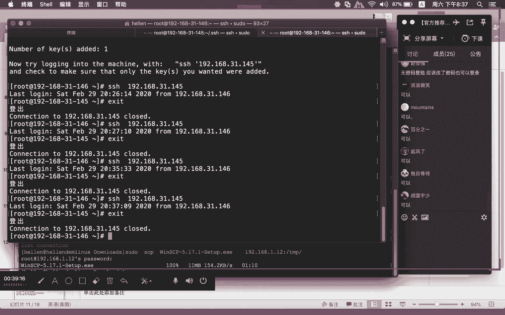

大家也蛮菜，大家觉得。这个部分啊第二个问题哈就第二个问题这里。IP变了。就是说146那台服务器，它的IP变啊，145的那台服务器，它的IP变了。这个时候A是否还能够无密码用方方式登录到这个这台机器来呢？

可以也可以登录是吧？OK好，我们现在呢来给大家做一个演示，大家注意看啊，这里面是有一定的区别的哈，有一定的区别的哈。😊。

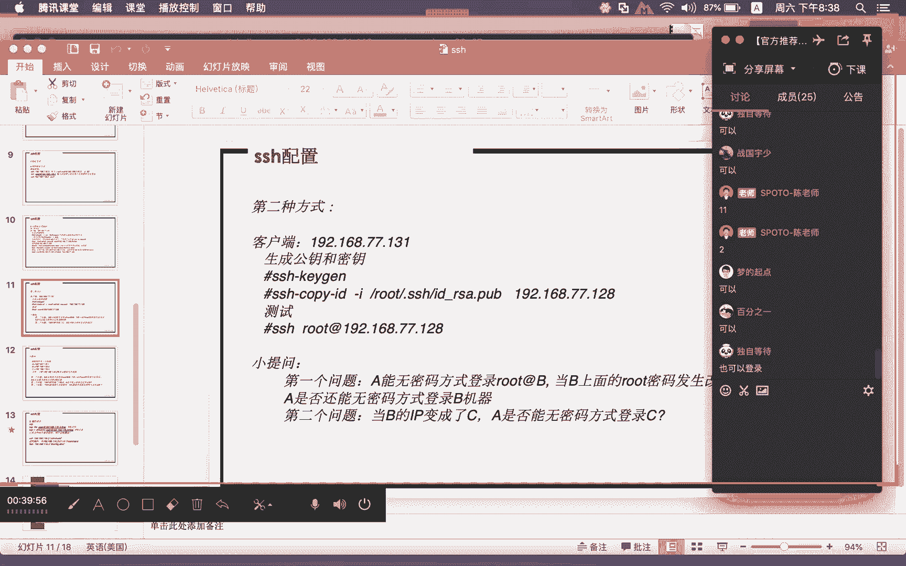

所以linux有的时候呢就是需要去做验证啊，但是有的时候验证就是可能大家碰到的这种线呃情况状态。嗯，可能没有碰到那么多哎，没有办法的去很好的去做什么呢一些验证。你看我这里哈，我将这个什么呢？146。

我先打开一个东西，我先看一个东西啊，然后再改。在改这个145这台服务器的密码啊，再改145那台机器的IP地址。我呢跑到root下面的点SH。现在目前是在客户端这台机器上面话，我来cat弄 host。啊。

现在目前310145啊，31。145。那，我现在在这边改。在145这边好，我把这个IP地址改掉。啊，我把它改成什么呢？EDC下面的C confi下面的network。Skis。啊，FCFG。you欧。

你这个IP改完重启了，这个连接就会被断开了。我们把这个IP改成什么呢？改成比如说132啊，147148吧，148，我把它改成148。改了，然后呢。对这个网卡呢做一下重启啊，网卡重启的命令大家还记得吗？

系各位同学。网卡重启的命令大家还记得吗？

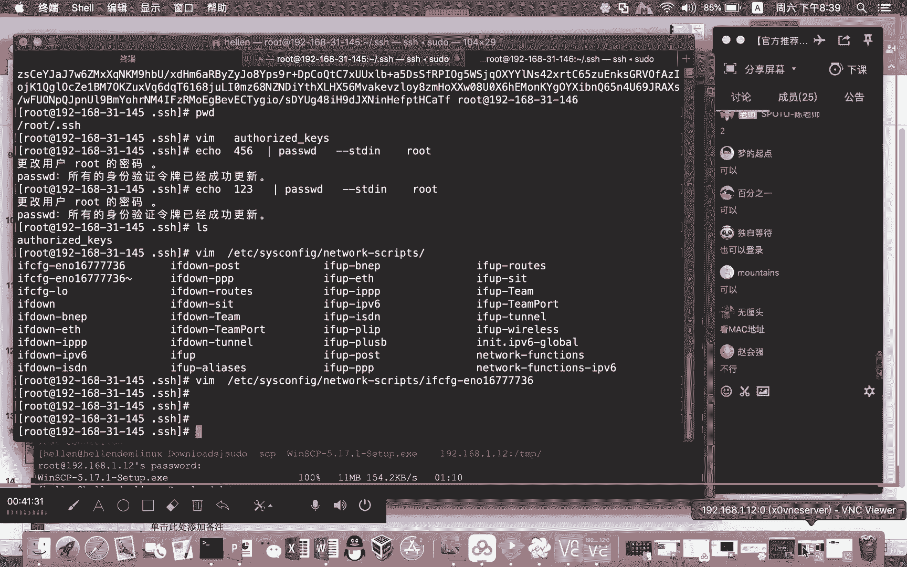

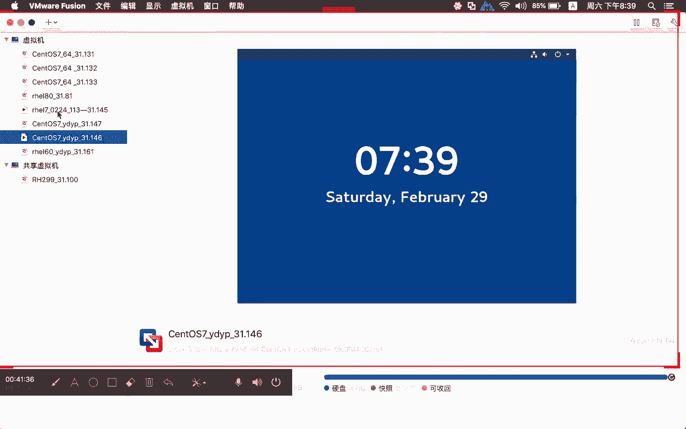

啊，if down if up对吧？在虹贸企业7下面，我们可以这样干哈。那如果是虹贸企业8的话，就不能这么干了啊。嗯，对。喂。

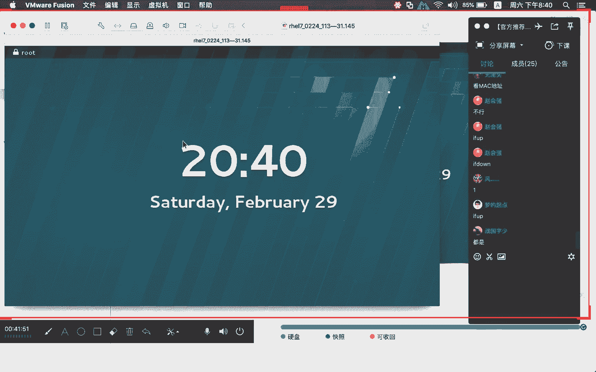

我们现在登录进来哈。一二商。密码是123号，现在是在145这台。机器上面哈呃我的IP刚才改了，所以我要对这个网卡做一下重启，让它生效。呃，应。O16777736。And if up， you know。

167777。36。啊，把它重启一下，重启完，我们重新确认一下啊，大家可以看到这个时候的IP变成了什么呢？31。148。好，这个改完了之后呢，我们就可以对什么呢？

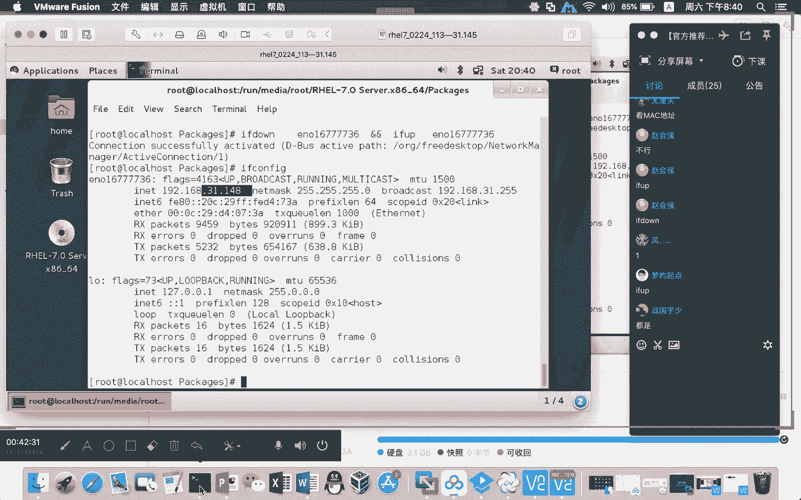

这台机器啊去做一个什么呢？远程连接31。146去连接什么呢？148，也就是原来的什么呢？145，我们先拼一下这两台机器网络能不能通，拼192。16831。148。我们来看一下，而网络是可以通的啊，对吧？

那么145我们也拼一下，看看能不能通，145这个IP已经被你改掉了。所以呢现在目前145这个IP呢是不存在，拼不通。那我们现在呢来远程连接192。168点什么呢？31。145。啊，148我们来看一下好。

哦，这个connection refused，我们还有一个东西要改啊，因为你的监听端口当时是放在什么呢？放在这个。145下面的，所以我们要把这个监听的IP地址要改掉啊，监听的IP是放在145下面。

我们要把它改掉。啊，不是这里。

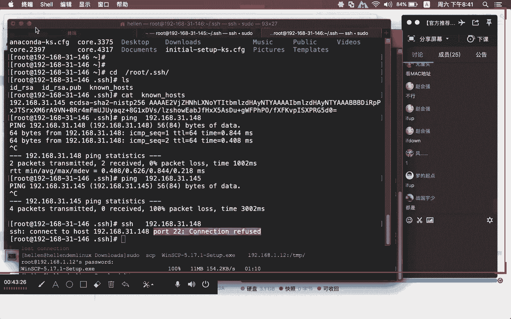

哎这个跑哪去了啊，在这。你看我们这里哈，因为22号端口现在目前是在145下面进行监听的好，大家看到没有啊？然后我们要把这个什么呢？IP地址改掉，监听的IP地址把它改掉啊，我们可以把它改成4个0啊。😊。

要做实验嘛，无所谓。把这一行注释掉，默认就是在什么4个零下面进行监听啊。然后serviceSHD理子大奖。好冲值完。

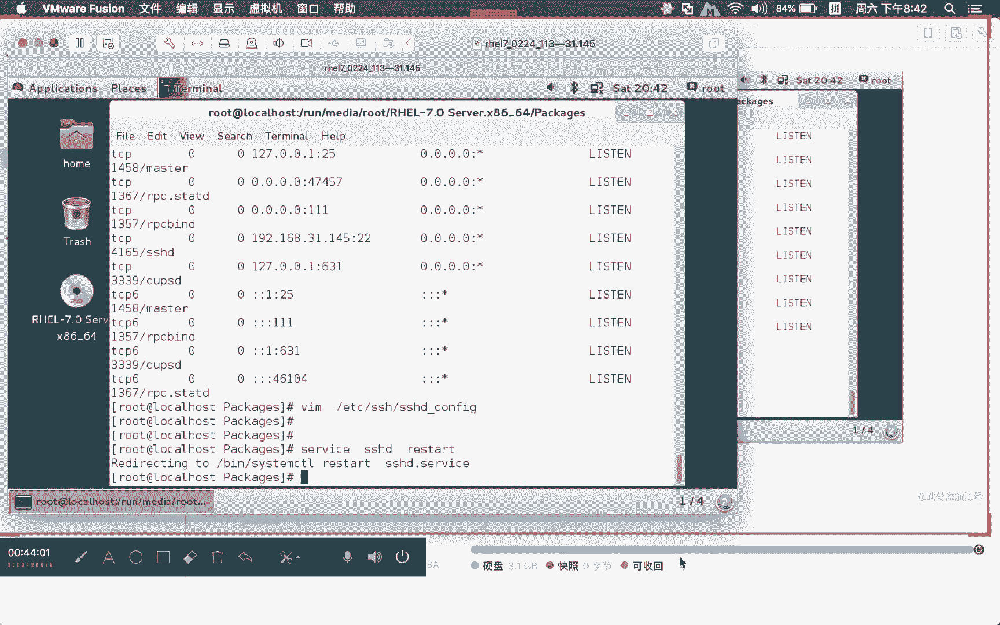

再来。检测连接一下。好，大家注意看。这里写了什么呢？yes啊，要求你输yes。要求你输y。看到没有？要求你输yes，当是y输完之后呢，就不需要输密码。啊，我们一定要记住。

我刚才说的前面的在第一次连接的时候，他会要求你输一次要不要连接啊，去记录这台机器的一个什么的主机K啊，记录完了之后才会去做什么呢？密码的一个什么呢？弹出的提示。如果你是第一次连接，都会这样子。

但是如果是第二次连接，那我们刚才这个就不会有这个什么呢y no的一个提示。你看31。148，这个时候呢是可以什么呢？正常的按什么无密码验证登录的方式来进行登录。前面这个呢它其实也是无密码验证登录。

但因为呢你是第一次，所以呢这个部分的话，它就不一样了啊，这一部分就不一样了。那么还有一种情况是什么呢？还有一种情况就是。如果146这台机器。啊，如果146这台机器。跟这个IP进行连接的时候。

在它的这个机器上面已经保存有31。148，但是31。148又不是对应你现在这台机器，那它就会报错，而不是提示什么呢？yes啊，而不是提示yes啊，我们也给大家做一个小演示啊，我给大家做一个小演示哈。

因为。31。146这边我要再开。哎，这个可能还不好掩饰，这个可能还不好掩饰这个。我把这个31。14。我的IP把它改回去哈，我们重新再去连一下，看一下会不会有出现这样的一个错误提示啊。

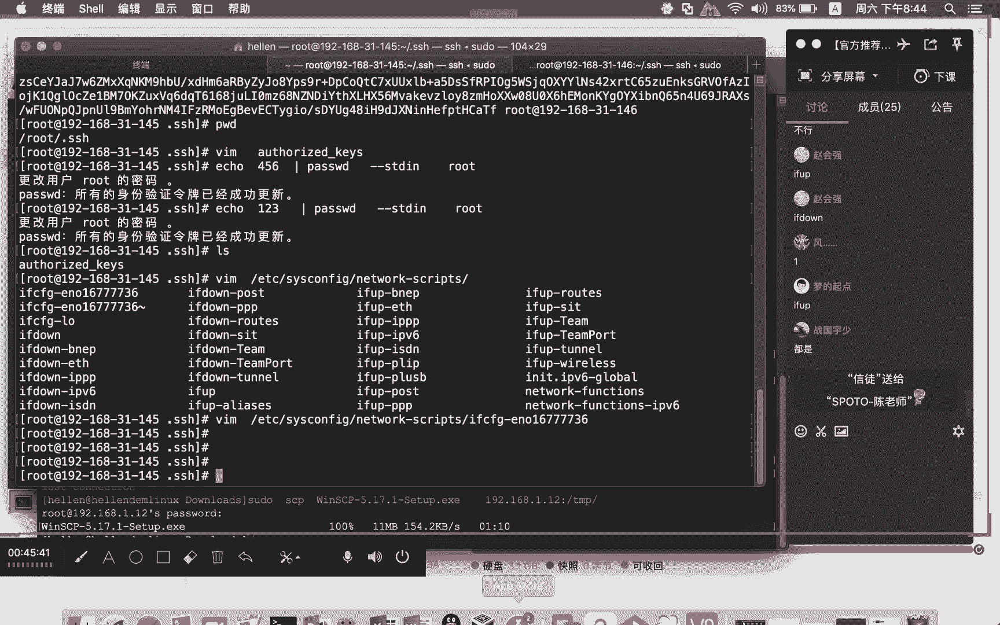

Haomeen。我们把IP地址先改回去一然啊，EDC下面的s configurefi。下面的什么的network。sscape啊，IFCFG下面的这个什么呢ENO667336，把它改回去，改成什么呢？

31。14，我们把它改回去一下啊，改回去之后呢，把网卡也做一下重启。

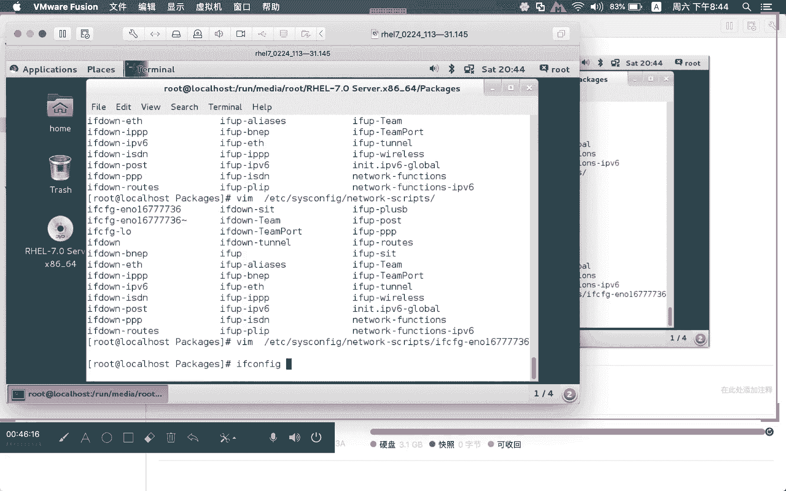

啊，重启一下好，重启完之后呢，我们现在呢来连接啊。系连接。310145，你看。哦，不好意思，写错了。这台机器是。123。我们要连的是这台哈。😊，我们要连的是这个。啊，从这台去连接31。14531。

145，我们下去连接啊，你看就还原回来之后呢，因为你原来那个公钥它没有去掉，所以呢这一部分它还是OK的啊，删掉no记录就行了吧。啊。你如果说把那个no记录给他删了话，那你肯定都要输 yes了。

证书无密码验证呃，无密码登录如何验证，登录主机是合法，好像只要发公钥到服务端就可以登录。啊，没错，是这样子的，基本上呢只要把公钥给过去，它就可以进行登录啊。

你只要你自己客户端这边的这个什么呢密钥对没有发生变化，那就可以啊。你看我们这里呢。

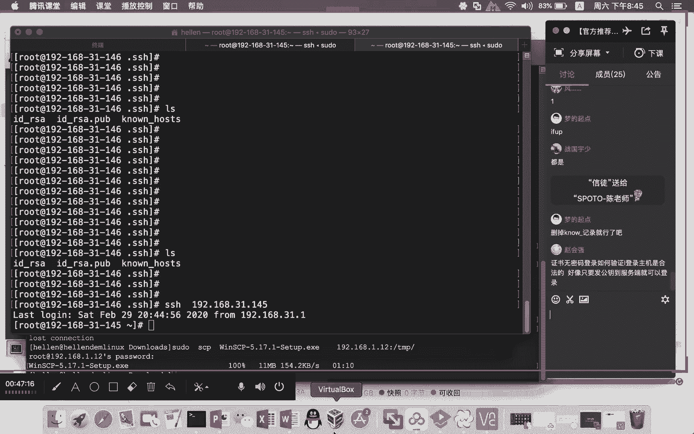

这个问题呢我们就发出了什么呢？第三个提问啊，就发出了第三个提问，就是在这个地方就第三个问题。A机器重新生成密钥对A机器是否还能无密码方式登录B。啊。

注意看我们这里哈A机器重新生成密钥对A机器是否还能无密码方式登录B。这个什么意思？如果我们把AGT的这个什么呢密钥对重新去生成。

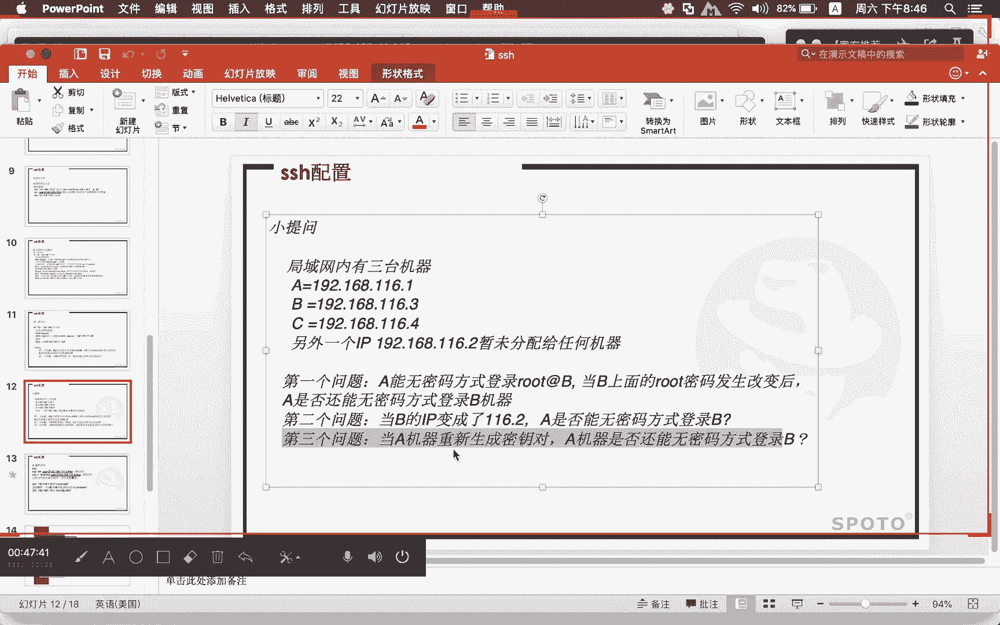

啊，我们把。146上面的这个密钥队重新去生成啊，大家说。无密码验证登录还行吧？不行，对吧？啊，好多同学都说啊，我觉得。说明大家都理解了。啊，我们把这个公钥密钥对呢，我们重新生成一下，不不删私药。

没事吧啊，不删私药的话也有问题，不行。Tjun。我又重新覆盖了啊。哦。我再重新覆盖一下啊，按一个Y。啊，覆盖了重新生成了啊，然后你这个时候呢再去远程连接这个什么呢？192。168。31点什么呢？You。

45。直接去连它，你看这个时候他就需要输密码了。如果你不需密码就登不了，我密码验证，它就不能保持住了。好，我刚才说那个IP变的哈，IP变的，我有一个地方，我给大家做这个演示哈，我把这个31。

145的这台机器哈，把它的IP改成什么呢？😊，你的不覆盖当然可以了，不覆盖，你就说明没有更新嘛，是不是？啊，我把这个31。245的这个IP呢，我把它改一个东西哦，给大家做另外一个演示啊。

给大家看一下另外一种场景啊，这种哎。这种场景的话呢是也是不多见啊，但是也会碰到。

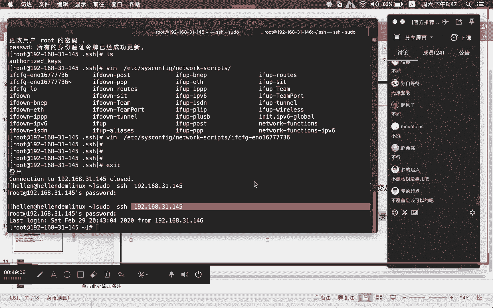

我把这个IP改掉，改成什么呢？改成31。132。把它改成31。132。那么31。132的话呢，我的苹果电脑啊其实已经早先就已经记录到这台机器了。所以你如果说把它改成31。132。

我的苹果电脑去远程连接这台机器的时候啊，你们可以把认为啊苹果电脑就是一台inux机器哈。那如果你把这个东西改掉啊，那这个时候。

他就会报错了。

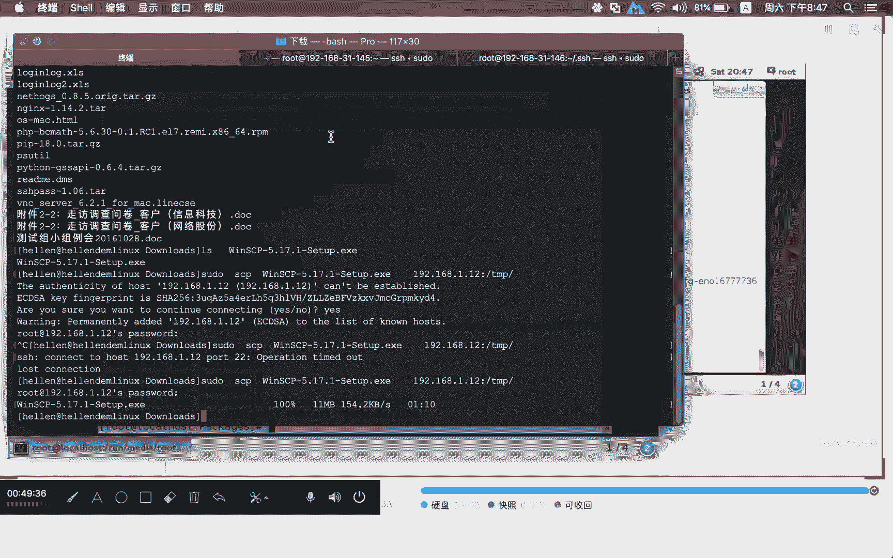

啊。

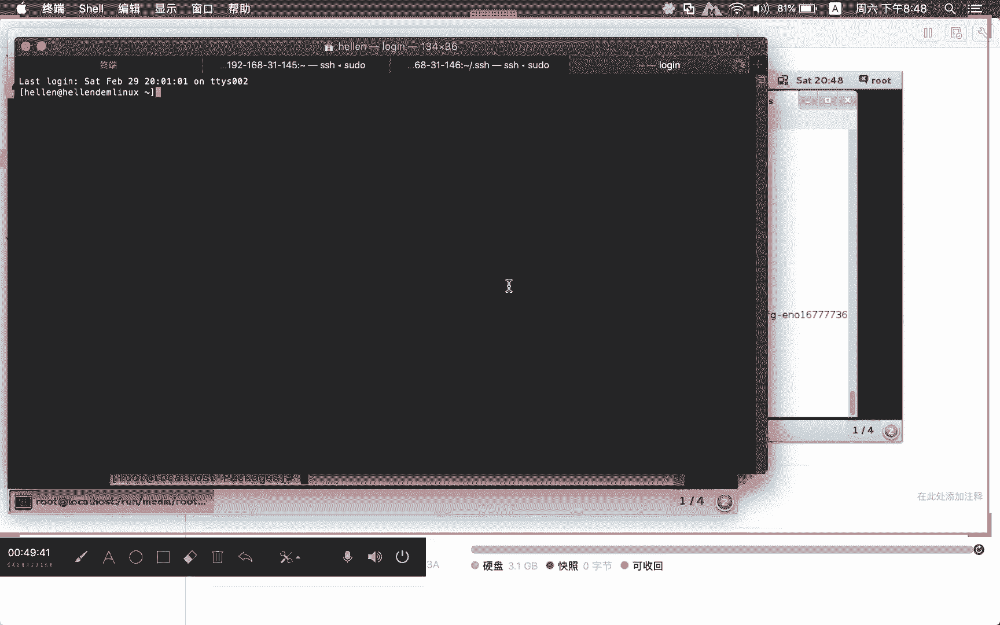

你看我这里哈。如果碰到类似的这种错误提示啊，我教大家怎么去做这个处理啊。大家看我这个错误哈，大家注意看。我现在呢在这边速度SH192。168。好，在苹果电脑下面的话，它这个是普通用户。

你要连接到对方linux机器上面的root用户的话呢，前面是要加速度的哈。192。168点什么呢？56啊，点31。132。连接进来，大家注意看。啊，我先拼一下，看看能不能通啊。192点668。31。

132。

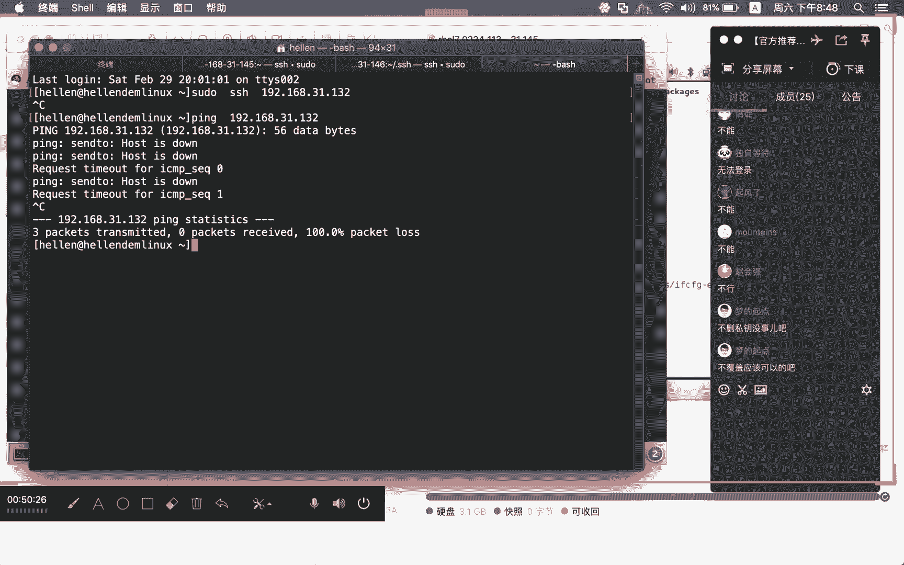

我看IP没改好吗？哎，我重启了。没错。我看一下网卡生效了没有啊。He。哎，重启没没没重启效果。还是用这个吧。

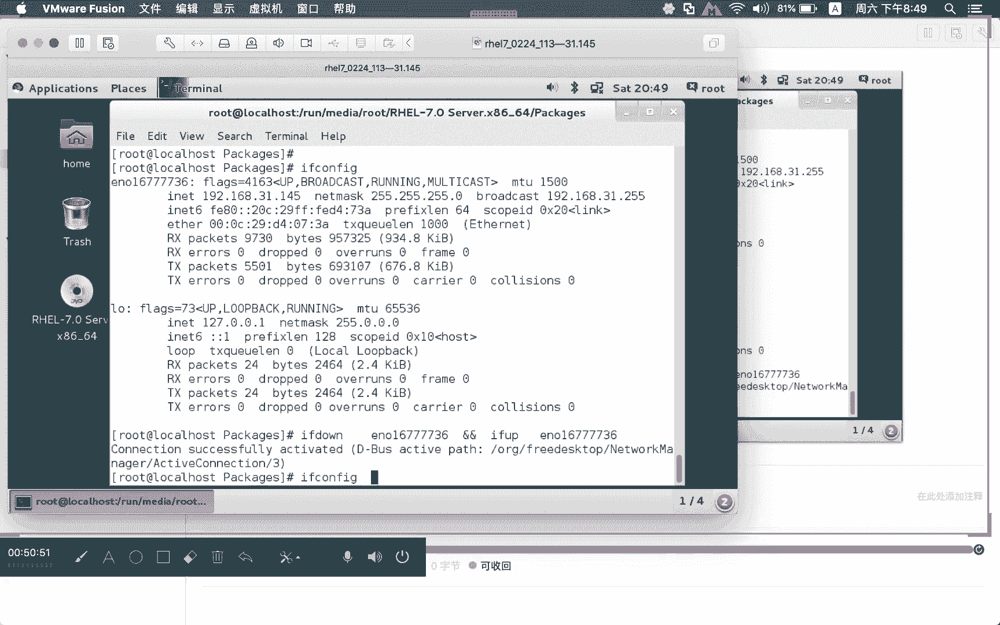

再来看一下好，这个时候改了，对吧？好嘞，我们现在来看啊。😊，拼可以通，没问题，等下连接一下。哎，这个时候就出来了，大家注意看我们这里啊。😊，啊，这种错误啊这种错误是不常见啊，这种错误它出现了一个什么呢？

呃状态就是。原来这台电脑我有远程连接过31。132。但是现在的这台31。632并不是你之前所连接的那台。啊，就是说IP这个IP原来有有被别人用过啊，我而且我也跟你有交互过，现在你把这个IP放到了什么呢？

这台机器上面去用。那人家呢所记录到这个hosster key，就在苹果电脑上面也就是在linux这台机器上面所记录到的这个什么呢？hosster key跟它这个呢是对应不上的，所以就会有类似的这种报错。

那么这种报错呃，我们要怎么去处理呢？要注意看下面的这个提示。要注意看下面的这个提示哈，在linux下面，它这个提示是什么呢？

就是在root下面的点SH啊K no host什么no某一行这里面的这个内容啊，它这个苹果电脑的话前面的给你加了一个VIR啊，所以大家不用怕说linux是不是也是类似这个路径啊，它是类似路径。

但路径跟它不一样，你一定要注意看它的一个提示啊，一定要注意看它的这个提示，我看它这个提示，它是这样子，那我就跑到什么呢这个文件啊，你如果linux提示是另外一个文件，你就跑到另外一个文件去。

我要现在干嘛呀？我要现在呢去跑到。这个文件里面去啊，根据它的提示，在第46行这里将原来所记录的这个什么呢？ho key31。132啊，把它给我什么呢？删除掉哦，我问大家，我现在这个文件非常大啊。

我现在文件你看我这个苹果电脑我连过非常多的这个虚拟机。那我现在呢想要对其进行查找，比如说我要查找31。132，在这个我。文本文档里面31。132问大家怎么查找？哎呀，独自等待你这个特别反应特别快。

冒号46绝对是OK的哈，因为他46行啊，这个答案绝对是对的哈。如果是要查找没错，啊，赵慧强也OK啊，斜杠就直接在这个什么呢一般模式下面按一个斜杠，然后呢，31点什么的？132直接去查啊。

或者就是像那个独自等待那个同学一样，我输一个什么呢冒号46，直接就定义到什么呢？第46行。然后你要做的东西，就是将这一行什么呢？删除掉啊，我们现在呢就按一个什么呢按按一个D啊，两个小写的D删一下啊。

就把它删除了，删除完之后呢，把它保存退出啊，我们重新再来连接31。132。哎，你看这个时候就出现正常的什么的提示了。😊。

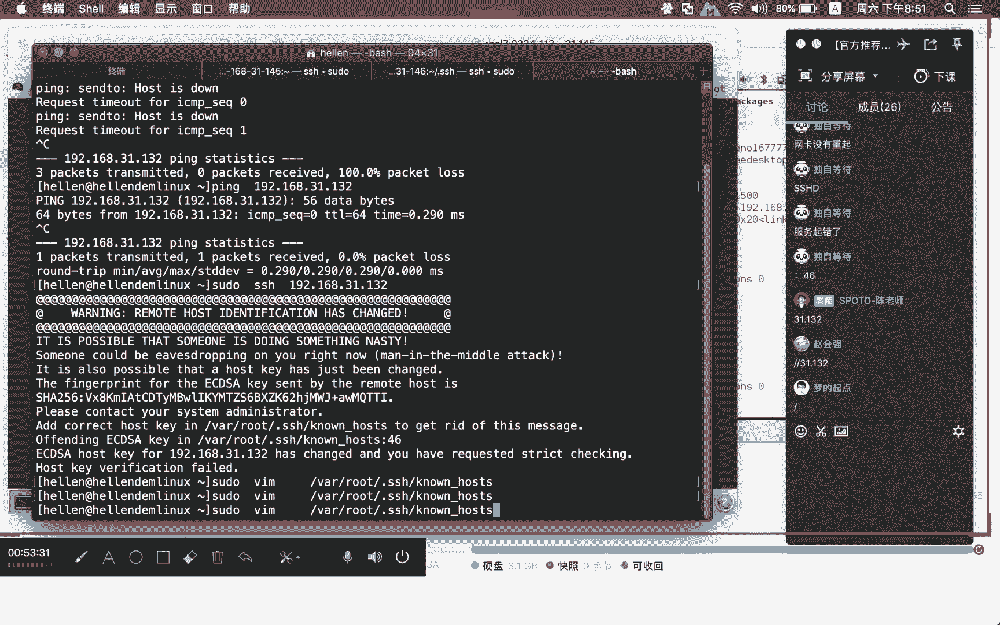

你看这个时候他就连接到了什么呢？原来的这台31。145的这台机器来了。啊，这就是一个什么呢？通过无密码验证登录过程当中啊，出现的这种什么呢零0总总的这种状况。那不管是哪一种状况，大家只要记住一个东西。

就是我给你做无密码验证登录。我只要我的这个什么呢？公密钥，这个对啊和你这个服务端上面所保存的这个公钥没有发生变化。那么我们两者之间的这个关系会什么呢？天长地久，海枯石浪都没问题。呃。

我们来看一下PPT里面还有一些小内容哈，我们也要给大家继续做一下介绍哈啊我密码验证登录啊是我们SH服务里面的一个重点内容啊啊这个部分啊刚才这个STP已经给大家介绍了。但是如果是传这个传文件是这样传。

然后如果是传目录的话呢，你这里要加一个什么呢减R参数啊，减压参数的话，我这个就不介绍大家可以去试一下啊，客户端工具的话呢，在这个地方啊，大家可以去多关注啊，比如说。😊，这个CCRD和这个插项啊。

生产环境里面。可能大家都还是比较侧重去认这个什么的差线，还是用比较多一点啊。我看那个下午有同学就在群里面发了一个CUCRT的这个什么呢？破解版的啊，我们是支持正版啊，大家能用正版就用正版啊。

当然破解版的话，个人学习我觉得问题也不大啊。😊，A把密码密钥发给BB能不能我秒安能登陆服务器啊，赵伟强这样不行啊，这样不行啊，要公钥要公钥，不能是公不能是密钥啊。所以你可以去试一下。

好嘞呃SH服务部分的这个内容呢，我们就暂时讲到这儿。然后这个地方的一个练习的话，就要求大家去做一个什么呢？无们软件的登录哈，安排两台虚拟机A和B。当然A和B之间，这个首先网络是要能够联通的啊。

如果说你网络不能连通，后面这个实验都做不了。大家可以在你现有的这个虚拟机的基础上去克隆一个虚拟机出来啊，然后呢就有两台虚拟机了啊，要同时开起来。😊，我相信啊大家这个笔记本应该开两台虚拟机。

我觉得问题都不大。像我这个笔记本开个三台、四台，同时开三台、四台都是没问题的啊，我现在这个资源啊最大的一个问题就是一个什么呢？硬盘空间问题，每一个虚拟机都要吃我这个十几G的一个磁盘空间受不了啊。

这个苹果电脑这个存储是比较贵的。

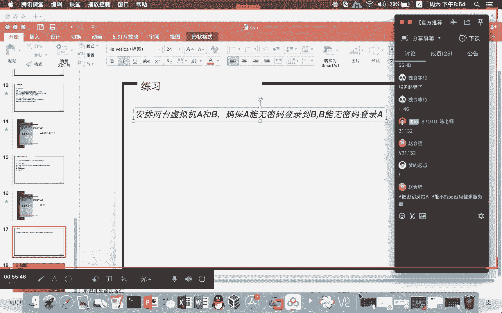

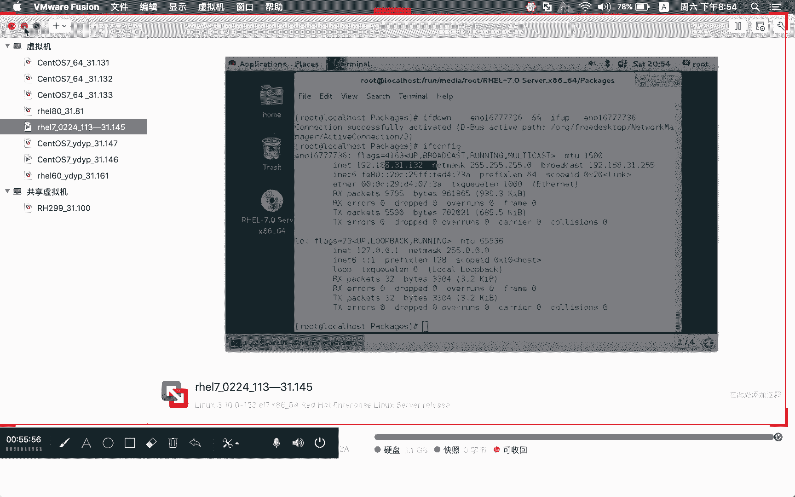

他用的是固态盘。那我现在都是把这个什么呢？呃虚拟机装在我的这个移动固态盘上面啊，还好一点，现在。呃，要盘然的话，这个100我这个硬盘的话就120G的一个。就固态盘苹果电脑。

我买的这个就120G的硬盘不够用。啊，你们也可以把虚拟机放到你们自己的这个虚这个虚拟硬盘上，这个你自己的这个移动硬盘固态盘上面也可以啊，就空间不够用的情况下，可以这样子。啊，虚拟机有了。

到时候放虚拟硬盘，这个移动硬盘里面也可以到处移动就是了。啊，做实验也比较方便。啊，那这个实验部分的话呢，我就留给大家去做。那现在是8点55分。我们在9点05分的时候呢，我们会继续给大家讲后面的这个内容。

主要是给大家介绍什么呢？软件和包的一个黄连安。我看一下，有同学问A是私药公钥发给B啊，发给CB把A的私钥复制过来能不能登录C。A是私药。公钥发给C。B把A的私钥复制过来，能不能登录C也不行啊也不行。

他这个有一定的数据关联的，有一定的这个积器关联啊。很少这么干啊，但是你如果说把那个公钥，比如说我把A这台服务器的这个公钥传到B啊，然后你B把刚才A传给你的公钥传给C。哎。

那么A也是可以无密码认证登录C的。这个是可以。好啦，那。SH副部分的话，我们就暂时先讲到这啊。

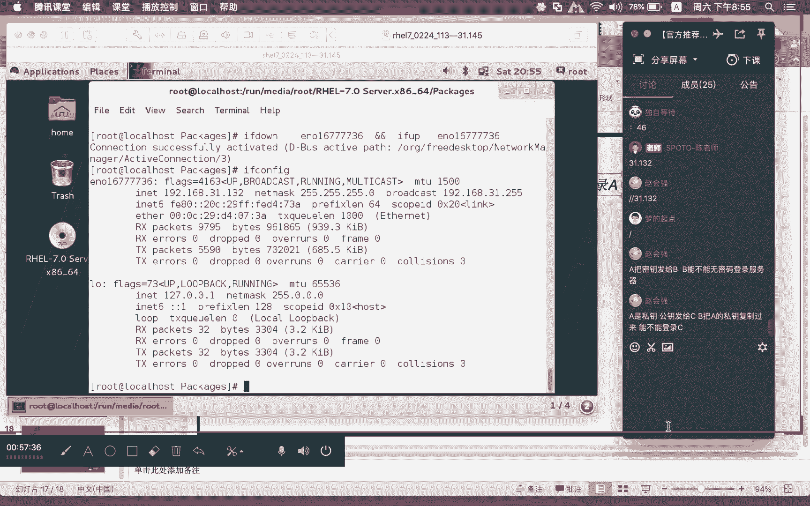