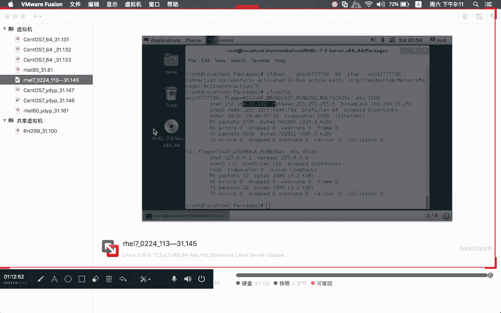
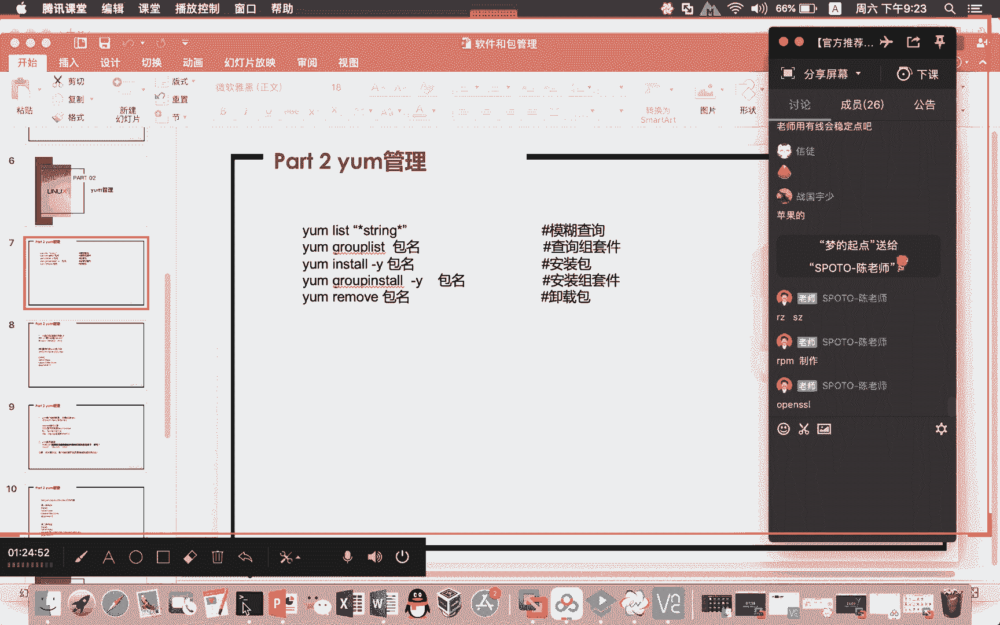
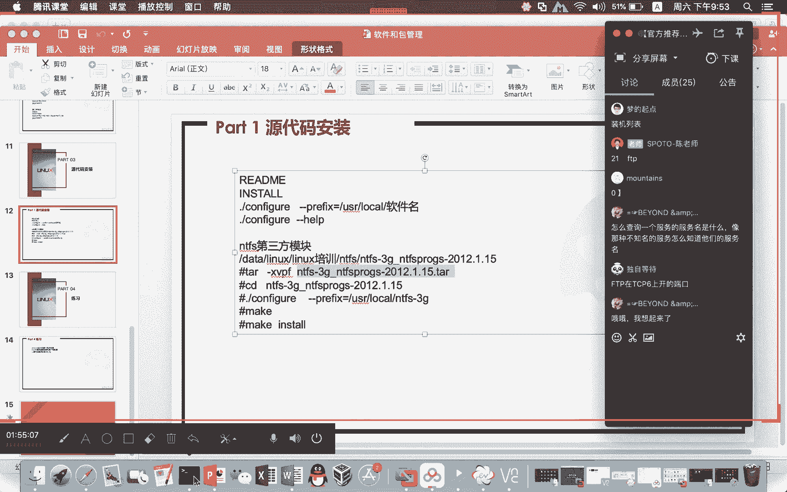

# Linux基础课程（RHCSA）简简单单学会Linux入门教程 - P9：第四节课软件和包的管理 - 思博Linux关关 - BV1fv411j7RG

今天晚上啊这个剩下的这个软件和包的一个管理哈，我们主要是给大家介绍三种方式哈。第一种是通过什么呢？RPM包啊，RPM的命令来对什么呢？RPM包来进行什么呢？管理啊，红帽企业版下面啊。

我们在进行这个相应应用软件安装的时候呢，他带的这个包的后缀呢都是什么呢？I企业的红帽啊红豹企业版啊，他们的这个后缀都是点RPM啊，windows下面的话，大家去装一些包。

一般都是什么点EXE这样的一些东西，对不对？那么在linux虎帽企业版linux下面的话，它的这个包的后缀的话，就点RPM我们刚才给大家装了一个下午的时候给大家装了1个LRJSJ的。

那么它这个包的后缀也就是什么呢？点RPM如果是有邦图那种的话，它的包的后缀是什么呢？点DB啊，这个也是linux只不过它的包的后缀格式不同而已。啊，我们。想要用RPM命令来完成这个安装啊。

那就是你要装RPM包，这是安装包管理的第一种方式。那么第二种方式的话呢，就通过什么呢？YOM来进行什么呢？对应应用软件的一个管理，进行安装啊，进行卸载，它都可以做。那么这两者之间呢有什么区别呢？啊。

RPM包在进行对应软件包管理的时候呢，它会涉及到很多的什么呢？依赖关系。呃，这种依赖关系啊是需要你什么呢？人工介入手动去处理的。啊，比如说我要装A包，那你在装A包的时候呢，它就会提示你说它被谁给依赖。

需要要求你先安装B包。好，我们就跑去装B包。装B包的时候，它就提示你什么呢？缺C包，要求你先装C包，以此类推啊，如此循环啊，就会让你整个什么呢？手动手工的这种方式去处理啊，就变得什么呢？特别的麻烦。

效率很低。那么YUM这种方式的话呢，它就显得什么呢？特别的方便。我装A包是吧？它就提示你。啊，装这个包因为依赖关系而需要装哪些包，我并不需要呢关心他依赖哪些包。

你只要敲下去说我要装OK那么这些依赖包它会自动的帮你什么呢？给装上去。那么在卸载的时候，它其实也会有类似这种情况哈。阿片包你再进行卸载。如果这个包被别人给依赖了。那你要先把依赖这个包子。

你要先把它卸载掉，然后你才有办法卸载这个这个包。所以呢这种依赖关系，包括这个酝量来进行卸载的时候呢，它也可以去解决这个什么呢依赖关系的一个处理。啊，那10用的时候样绝对是会比什么呢？

RPM来的什么呢方便。当然如果说对于那种没有依赖关系的包，像我们刚才越那个什么。LRJSJ那个包它没有依赖关系啊，那它这个安装的话就不用不需要做什么呢？样装库的一些配置，所以他使用的时候呢。

就很快直接按命命令直接就可以装了。然后第三种方式呢是源代码安装。那么在源代码安装里头哈，它一般是一个什么呢？压缩包，比如说点踏点BJ或者说点踏点GJ。啊，就这样的一些压缩包。

那么我们把这个压缩包解压之后，你就可以对它进行什么呢？编译安装。那么源代码安装是比较什么呢？麻烦的，它也会面临什么呢？像RPM命令进行包安装的一个什么呢依代关系的一些处理啊。

我们在源代码编译安装过程当中，它也会提示说哎你你缺了某一个文件啊，你这个东西没安装。呃，这些东西也需要你什么呢？人工去处理。当源代码安装，它会比RPM呢或者说要。处理的会更为什么呢？灵活一点。

就说你完全可以根据自己的一个需要。我要做这个服务。我在进行编译安装的时候，我要加一些什么参数，开启什么功能。那我可以呢在源代码编译的过程当中，我就可以去定义啊。

我可以去定义说我要把这个对应的包装在哪个路径下啊，如果你是RBM你如果是样这种方式安装，人家就已经什么呢？定死了。我这个包装好对应的文件分发到哪个路径去，你在这台系统安装，用RBM方式安装。

你在这台系统上面装。那么它对应分发的内容，就是在这些路径上面。你把这个包放到另外一个操作系统上面去装，人家在分发安装的时候，这些文件也是在固定的路径上面。它不会变啊它不会变。但原代码安装的话。

它可以继己去指定。嗯，我们呢会一一给大家介绍这三种方式啊，我们来看一下第一种。阿片唔命立卡。那我们在在运这个RPM命令的时候呢，大家需要注意的一个东西哈。呃，这里面呢有涉及安装卸载。

你看我这安装用的是RPM减IBH后面跟上什么呢？包的名字啊，然后呢你就可以将什么呢？对应的这个包给它装上去。那么在完成这个包的时候呢，它会提示两个百分百啊。如果你出现两个百分百的这个包就已经什么呢？

安装成功了。我们呢到这一台机器来。

因为现在目前的光盘它已经什么呢？挂载到我们的这台系统去了。所以呢我们在这台系统上面哈，将这个光盘打开。啊。可能很多同学啊，你没有把这个光盘插到你自己的这个虚拟光区里面去，那你就看不到什么呢？

这一行内容了。我是用DF减H这条命令啊，DF减H的它的这个命令作用是什么呢？啊，就是看我们当下。朝一下宽盘怎么挂载哦，独自等待。好的呃，可能有的同学还不是很清楚哈，其实在安装的时候，他原来怎么做。

其实就是怎么做了啊。你看我们这里哈DF减H这条命令啊，就是看我们现有的这个呃系统上面对应的分区挂啊对应的硬盘对应的分区挂在哪一个目录下，就通过DF减H，它其可以看到，包括光盘挂到哪个目录下。

通过DF减H就可以看到。那有同学问老师光盘怎么挂载呀？啊，我们现在呢打开这个部分啊，比如说。

这台哈310145这台。你们呢可以在这个地方去点开这个设置，然后打开什么呢？啊CD。CDDVD这个地方哈，你们也是去打开设置的话，也一样，也是右击你们的这个什么呢虚拟机。

然后啊你一般是点一下虚拟机在你的这个什么呢warewin下面的ware的话，在你的这个右边部分啊，其实就已经把对应的设备给你罗列出来。我们可以去选择这个什么CDDVD你要把这个什么呢？

🎼打勾给我勾起来啊，这样子的你的虚拟机才会连上什么呢？我们的这个光驱啊，连上这个光驱之后呢，你要在这个地方去选择一个光盘或光盘印象。你要选择的就是你的什么呢？ISO文件。

这个一旦点开就是到什么的对应的路径下面去选了。那你要自己要记得哈，你们的这个虚拟光驱。下面的这个ISO文件是放在哪个位置啊，自己要去找啊自己要去找。啊，所以这个部分的话应该算是比较简单哈，不会太难。

一定要把那个打勾勾上去啊，要不然的话你东西ISO插进去了，但是你的这个什么光驱没开起来，那你在你的系统上面你可能还是看不到。

那这是光盘的一个挂载啊。

那我们现在重新回到这个位置，我们要找到什么呢？对应的这个包，我么希望呢在这个包文件里面。这是光盘里面的内容。这默认情况下，它是挂到这个路径来的啊，默认情况下是挂到这个路径。那我们在进入这个路径之后呢。

就可以看到这个什么呢？SOH yellowlow7它的这个什么光盘下面的这个内容。那在这个光盘下面的话，packages就是存什么呢？我们基本的PM包对应的这个什么呢路径。那我们可以进入什么呢？

pack。PAKAGES你用LS的话，它会把所有的阿片包都给列出来。我就不列了啊我就不列了。那我现在呢就给大家演示一下RPM减IVH啊，我要装的这个包叫什么呢？GCC这个包。啊，RBMGCC。啊。

我给大家演示一下包之间的这个什么呢依赖关系哈，你看我们这里。😊，我们用这个RBM减IBH去完成GCC这个软件包安装的时候。你在进行这个，因为GG这个东西很关键很重要哈。所以呢我们会想着去把它给抓。

但是呢你用这种方式。你很有可能没有办法手动去处理好这个包的安装。因为这个包涉及到很多一代包。你看我们这里在安装的过程当中，他就告诉你说什么呢？一代检测失败。啊，因为这些包你要先装装好了才能去装什么呢？

GCC这个包OK那我现在呢就来什么呢？根据他的这个提示，我也满去装一个包啊，他的这个包是叫什么呢？比如说啊gab cD是吧？我们装一下这个包。Zabacy减DL。电。64。

叉8664点BM你看当我们去装这个包时候呢，它会又会什么呢？依赖于其他的包。那如果说你想要真的人工啊，一定要把它做出来的话，那你要什么手动的方式给我一个个的去处理掉。明显啊这种方式是非常的不方便的。

对不对？那如果没有碰到依赖关系的话，我们倒还好，比如说RBM减RVHVSFTBD这个包。你看我们在这个东西进行安装的时候呢，它就提示啊这个包已经装过了啊，已经装过了，所以他这里就提示你说已经安装了。

如果说大家想要对这个包进行卸载的话呢，我们可以先什么呢？RRPM减QA这种方式去查询出啊，我们现有的这个包。包的名字叫什么？VSFTV。呃，RRPM减QVgV。SFTP那么这种啊。啊，又卡了这回。

大家稍等一下啊。看来网络。网络确实有些问题。一个晚上就卡个两三次。受不了。好嘞。我把网络切一下啊。好，大家如果卡的话，再叫一下啊。我现在网络换了应该会好一点吧。哎呀，我这个苹果电脑，我这个有线。

我家里这个有线线太远了。房间离这个无线的这个路由有点远。啊，RBM减QAgra VSFTB哈对苹果的苹果也可以接有线，就是。😊，阿法就通过这个方式啊，我们可以查出什么呢？VSFTB这个包啊。

它的这个包的名字叫什么呢？VSFTBD啊RPM减QA这个命令啊，它就是查现有这个系统下面我们装了哪一些PM包，如果我没有用这种管道这种形式来进行这个过滤的话呢。

它会将什么呢系统上面所安装的所有的PM包都给你列出来。你看我这里这个东西就多了嘛，对吧？但是我只想查这FTP你有没有那我就通过这种方式就可以查出来。如果我们想要对它进行卸载，可以通过什么呢？

PM减E对这个包进行卸载包的名字就是我们PM减QA查出来的。😊，然我们把这个东西卸载掉，卸载掉，再用这个方式去查。那么VSFTPD这个包，它就什么呢？没了啊，已经被你卸载了，它就查不到了，对不对？

那我们现在呢再用这个命令把它给装回来VSFTPD我一定要让大家看到两个百分百，对吧？你看我们这个地方它就出现了什么呢？两个百分百，那么这个包就算是什么呢？安装完成了啊，就算是安装完成了。

那这个包安装完了，在我的这个系统下面，到底装在哪些文件，那么这些文件又装在哪些路径下面呢，我们还可以通过另外一个参数IBM减Q什么呢？L，然后后面呢跟上对应的包的名字，这个包。😊，哎。

我们就可以确认出来，哎，我们对应的这个包它到底装了啥东东啊，你可们可以看到，我们通过RBM减QL可以看到这个包装好之后，在我的这个系统下面分发下发安装了啊，装列出分发建出来这些目录和文件。

那有的时候啊可能很多同学并不清楚说。

哎，我这个苹果呃这个VSFTPD。

这个FTP它的配置文件在哪里？那你有的时候呢就可以通过这种方式就直接可能看到了这个部分啊。你看我们的FDP它的配置文件就在EDG下面的VSFTPD下面的VSFTPD点com这个配置文件它可能有印象。

但具体路径他不知道，对吧？那你可以通过这种方式就可以去确认出来。😊，啊，这是一种，还有一种是什么呢？根据文件去推出。对应的这个文件是属于哪个RPM包。比如说有的同学说，哎呀。

老师我们的这个ZSZ原来就上传下载，这个命令很好用。哎，那你这个RZSZ到底是由哪个包提供的呢？啊，那我们可以通过这种方式来确认这个文件是属于哪个什么呢？MRPM包提供的？我们可以通过什么呢？

whichZ去确认出啊，首先要先确认出这个文件是属于哪个路径下的啊，它这个是要用什么呢？绝对路径啊，我们可以看到RZ这个路径是在USRB下面的什么呢？Z那我们就可以通过RPM减Q。

F啊USR并下面的什么呢？RZ哦确认出来原来这个文件，这个二进制文件它的命令啊是属于LRJSZ这个RPM包啊，装好之后才会产生的。那么相应的一些包的信息哈，我们也可以通过什么呢？RPM减QI啊。

这个东西呢来确认啊，大家可能对包的信息啊可能不是特别的要在乎啊，但其实呢。这里面所含的一些信息，如果大家做的好了啊，我们可以在这个包的。这个简I其实就是包的头信息哈。

其实可以在这个地方有很多的一些什么呢？呃信息在这里面可以暴露出来。你看我们这里啊看这个包对应的一个信息，名字叫这版本啊，然后这个安装的时间啊，就是这个包什么时候安装的啊，你看我这个虚拟机的一个时间嘛。

差不多哎啊这个包是2月25号安装的，那可能是前几天安装的吧，前几天安装的，然后什么时间这个是谁提供的啊，是谁提供的。😊，这边有写厂商嘛，对吧？packger render啊。

这个是红贸官方他自个提供的啊，以及比如说什么对应这个LRCSJ他们自个的一些官方的一些什么的呃地址啊什么之类的，在这个地方也会提供出来。呃。

我们在提升课程里面会给大家做PM包的一个制作啊PM包的一个制作PM包制作的话呢，像这种投信机，我们就需要包括啊，在做PM包的时候呢啊也会涉及到后面的样仓库的一个制作啊，这个就是什么呢？

RBM减QI看到了一些什么呢？投信息啊，除了这些命令呢，我们还有其他的RBM的一些命令呢，大家也需要注意啊，比如说RBM减UVH那么这个UVH用到的是什么呢？升级啊，这里的U其实就相当于什么呢？

啊更新的一个意思啊，更新的一个意思你想要升级包。呃，如果它现有的这个鸿贸企业版这个版本下面它有更新的一个版本，大家可以通过这种方式对现有的这个包进行更新啊，但是我个人不建议大家呢对系统进行升升级哈。

因为系统升级的过程当中，呃，如果你这台系统是比较纯粹一点，比较干净，没有业务在跑。其实你升升不升级我无所谓。

但如果你的这个系统呢有业务在运行。比如我们早先就用C语言写的一些相关代码的一些部署。那么像这种C语言啊，它是很依赖于什么呢？系统的环境GCC的版本，可能这个G加加C加加的一些版本及le的一些版本。

你如果这些东西做做了更新和升级，没有经过验证和测试的话，很有可能原来跑在这个系统上面的一些代码，它就运行不了。如果是一些无关紧要的一些这种软件，你还可以生。但是有一些比较重要的一些软件。

你还真不能什么随随便便的生。呃，早先像那个什么心脏流血漏洞，open SH的。啊，是open。SSL心脏流血漏洞哈。那么这个低版本下面，我记得好像是在0。98这个版本下面呃。

在鸿贸企业6版本下面对应的那个什么呢openSSL这个版本啊，它就比较什么呢？有问题了。如果大家想要去升级，你可以针对这个版本呢，越刚才这个什么RPM减UBH这种方式呢，对我们的这个软件包进行升级。

那么升级完之后，相关的这个漏洞呢，它就不存在了啊，它就不存在了。呃，所以呢升级啊有的时候会升级内核，有的时候会升级包啊，包括内核的一些升级的话，他用到这种方式啊，其实也是类似的。不要觉得内核好像很高深。

在linux下面内核也就是一个什么呢？RPM包，只不过它装出来这个东西会放在独立的一个什么呢？不同路径下。那你要升级，你也可以通过RRPM减UVH这种方式来对内核包进行升级。那么升级完之后。

它可能就会出现更高的这个什么呢？内核版本菜单里头会多出一些东西来。

那么样仓库样的一个使用的话呢，首先大家需要知道的一个东西就是你要用样可以。你要对什么呢？让仓库进行配置。那它会分成什么呢？客户端和什么呢？服务端。那正常情况下，比如说大家如果装的是snoOS。

我这边呢有两台linux系统啊，一台是这个146，一台呢是145。那么这两台系统它的版本。

就是一台是HEL，一台是CnoOS。我们怎么看这个系统是是哪一个的呢？诶。这个远程连接。好，我把145这个远程连接改一下好，大家稍等一下哈。

我看IP应该是没改回来，还是原来那132，我要把它改一下。把它改回来一下哦，大家稍等一下啊，改回来一下，然后给大家做一下小演示。一不到。

1把。好嘞。那我现在呢退出来。31。145123。你看我们这里哈，这台怎么看它是s还是红帽企业版呢？我们可以通过catlethead releasease在这个地方就可以看出当下你是哪一个什么呢？

linux版本。然后如果这个sOS这台机器也可以通过什么呢？相同的来看呃，跑到这个什么呢？cat aC下面的啊。let releasease好，大家可以看到我现在这个版本是COS呃，linux7。

5的版本啊，都是7的版本啊，虽然说有一点点小版本上面的差异，但是基本上是一致的。😊，啊，我们想要呢做这个什么呢？IRPM包仓库的一个安装。那么你这个仓库啊，它有分服务端和客户端。

像我们这边这个linux系统，你的这台146啊，它装好之后啊，它其实在默认的这个什么呢？客户端配置目录下面就是EDC样。lippo点D这个下面就带有什么呢？让仓库的配置文件让仓库的配置文件。

那么这些让仓库啊配置文件就是指向什么呢？公网的。这个他是指向公网的。sOS默认它的仓库就放在公网里头。所以呢你可以呢在用snoOS的时候呢，并不需要去做什么呢？让仓库的一个配置。

当然你要保证这台机器能够返问公啊啊，像我们这个。我们来看一下啊，他这个应该是可以访问公网的。大能够听到这个你能DNS解析出来，一般是没有什么太大问题。

那你可以用这个什么呢让list来看一下仓库的一些信息。Hei。我看一下这个能不能防问工啊。还可以啊。都才小。哦，这个不行。我们要把默认路由改一下，要不然他走不到那个公馆去AAULT。啲。Default。

啊，然后呢。再来拼一下哈。啊，这个时候就可以通了。你看我们拼新浪的时候，它可以到公网。那你这个时候再用这个样list，它就可以连接到。哎呦这个什么情况？这个。有点问题哈。这个系统什么情况？哦。

这个机器可能有一些问题哈，我是放在这个移动硬盘上面的。Liu。他一直都不行。先不管它，我们来看一下这边这个linux，我们贸奇也绑了这个linux啊，因为我们重点还是讲这个啊。

大家如果是用那个COS的话呢，只要保证公网，基本上都OK的那个错误我先不管它了。😊，我们先看一下这个红帽企业版的啊，那么到相同的这个路径下面哈。po点地。

它默认有一个红帽自格的这个什么呢IIPO这个文件。那么这个带的这个IPO的这个文件啊，它是没有用的啊，你看你可以catet这个东西，你去看一下它这个连的是什么啊。要乱七八糟的东西没有用。

我们现在要做的东西是什么呢？啊？你可以呢将光盘内容。在某一个服务器上面放好。由他来提供对局域网里面的一个什么呢？这个仓库的提供。比如说我们可以将什么呢？鸿贸企业把7。0的这个光盘内容啊。

在这台机器上面做成一个什么呢？FTP服务器，将光盘的内容放到这个FTP服务器上面。然后我们的这台31。145就可以指向这台什么呢？FTP服务器。

它就可以连到FTP服务器来去用他的这个仓库来进行对应包的一个安装。那如果你不知道FTP怎么安装啊，同时你这台系统可能网络连接还有问题什么之类的。那我们可以什么呢？用本地仓库来做。那么本地仓库呢。

它也是依赖于什么呢？光盘内容。那如果是本地仓库的话，就相当于是什么？这台应用系统，它这个是客户端啊，同时也是什么呢？服务端。

啊，PPT当中的话，我们把这几种方式啊都给他。都给大家罗列出来，你看不对？让客户端的一个配置配置的目录呢是在这个。那么配置的文件的话呢，一般都是什么呢？名字这个无所谓。但是这个后缀必须是什么呢？

IPO哈，你们如果不信邪，你们可以改一下，改完之后，你肯定就用不了。😊，像我们这边，如果你是这个。基于局域网里面做这个什么呢？让仓库的话呢，那你就可以用这种方式啊，把它这个什么的地址指向这里。

我们现在呢先给大家做一个演示啊，就是用光盘来做本地仓库啊，写法呢。首先你要保证光盘挂在什么呢？对应的路径下面，你的光盘啊一定要插在虚拟光学里头。同时我们的这个系统上面又能够认到。

啊，通过DFGH大家就可以看到啊，DVSR0已经挂在了这个路径下，说明我们的这个光盘啊，虚拟的这个光驱。里面的对应的这个ISO镜像已经挂上来啊，这个是可以用了。啊我现在又改的东西是什么呢？啊。

我们要做一个手动挂载mot DVFR0把它挂到什么呢？MNT这个目录去光盘挂进来它是写保护，所以只能指读方式挂载，也就是说。你现在把这个光盘其实就是映射到什么呢？MNT目录，但是到这个MNT目录。

你能看到光盘里面的这个内容。可是只能看不能什么呢？写入touch一。你看这是一个什么呢？只读文件系统，它这个是写不进去的。啊，光盘现在这个内容呢映射到了MNT目录。

我就计划用MNT这个目录呢来作为一个仓库提供给我自己来用。你要做这个指向的话呢，需要在什么呢？客户端配置目录下，也就在这个地方去建立一个什么呢IPO文件。把它建出来。

在写这个IPO客户端配置文件的时候呢，我们这里面呢给大家列了这样的一个写的内容啊，我们把它先拷贝进来给他，然后呢给大家做一个解析。

他这个写法其实是非常简单的方式哈。Base。系。我们的这个仓库名字叫什么啊，我们的这个仓库名字叫什么？那bURL你这个仓库在哪里，对不对？你的客户端就是要指向我要去连哪里的仓库嘛。那我现在这个是本地。

所以它在这个地方表示的方式就是用什么呢？fi冒号三个斜杠，然后后面跟上什么？对应的一个路径，其实正常情况应该格式是这fi冒号方两个斜杠，然后再来一个斜杠，后面这个是系统路径，前面这个是表示表示说什么呢？

比如说我们这个路径啊是一个什么呢？本地系统路径啊，不是在局域网里面的某一个路径。然后GPG check等于0。因为你我们在进行这个IRPM包安装的时候呢，一般都会要求你什么GBG进行什么呢验证啊。

他要看这个进来的包啊，是不是一个非法包啊，是不是我正常的合法的可用的包。那我这里呢，因为我是光盘里面的内容嘛，所以呢这个部分的话不需要担心，我就把这个GPG check就把它等于0。

这样部分的话就没有设置了。啊就不需要去做校验。那么贝ase这个是干嘛的呢？呃，base就是一个配置段的一个什么呢开始。如果说你想要做第二个仓库，你可以在这个文件当中，你再写一个配置段。

比如说我就写一个什么呢？DIY2。啊，然后一样的这样子写下来啊一样的这样子写下来。那当然也可以你把这个配置段独立出来，再写一个什么呢？IPO文件。那我这边的话呢啊就用刚才这个配置段。

我就用这个刚才的这个配置吗，我其他东西我不改，我就只有一个了，对吧？好嘞，现在这个东西做好了之后，我们就可以通过什么呢？让list来进行验证。大家注意看啊。

注意看你看我们这里这个时候呢就提示你是什么base这个仓库啊，然后在这个部分的话呢，列出来的这个地方哈，大家也需要注意的几个地方。😊，就是。它这个列出来的东西会比较多一点哈，你要可能要往前翻一下。

这样像这个康的话，像这些机器对应的这个包啊，都是已经什么的？安装完成了。然后有一些是未完成，就没有安装的包啊，它如果后面写的是base，就可安装的软件包，它这里写的是base。

就是你刚才仓库的这个名字吧，对吧？那么这些包都是属于什么呢？可安装的软件包，意思就是说啊这些包都是什么呢？还没有安装的啊，前面这些包都是安装过的，在系统上面已经有这些。装好的了。好。

下面这些都是没有的那我们现在呢可以用他来进行什么呢？包的一些查找。有的同学他记不住我要装的这个包，具体的一个包的名字，对吧？但是我记得什么呢？大概的一个什么呢？串，那我们就可以用让list来做什么呢？

模糊查找啊，我们可以用让list两个星双引号哈，然后两个星，你要查找的这个串呢是FTP。哦，我可以呢在这个地方就可以列出来了。好。

大家在这个地方下面马马上就可以看到说我们刚刚手动安装的这个什么呢VSFTP的这个软件包。你看我这里这个东西就已经给你什么呢？提示出来了。而且这个包是已经安装过了，在这个后面也会提示你是什么inst。

那么下面都是可安装的软件包，说明这些包都是没有安装的那你要装，那你就可以用这个什么呢？install好，跟上什么呢？对应的包的名字。

那么这个部分包的名字就是下下面的这个可安装的这个软件包前面这个部分的一些内容，你可以这样子把它拷贝下来。😊，你看我们就可以对它进行什么呢？安装啊，这个时候它就会提示你说哎YD或者是N啊。

这里面的YDY很Y和N比较好理解是吧？Y就是说我确实就是要下载安装的。那么D的话呢，它只是做什么呢？只是做下载，没有安装，那么N反悔了，我不想装啊，我不想装，那我这里明显就是要装嘛，对吧？

我就用这个什么呢？Y将这个包给它安装下来。😊，呃，那重新再用这个什么list来去确认的时候呢，你就会看到FDB这个包又被他什么呢？安装上来了啊，已经被他安装下来。那么还剩下这些包没有装，那你要装。

你可以一个一个的去装或者什么呢？啊你觉得你这个搜索出来这个包都是你要安装的那你就干嘛把这个list的，直接就改成什么呢？instore当然你把这个东西直接改成int的时候。

像刚才它会出现这种交互这种形式。如果你觉得我不想再输这个什么呢？Y，你可以在这个地方再敲一个什么呢？减Y。那么这个安装的过程就变成一个什么呢全自动的过程它会给你提示有依赖关系啊。

但是呢你会直接敲一个Y进去。你看我们这个敲进去啊，我现在不需要手动去介入处理，它就会将这些包全部给你装好啊，你看我们这里。😊，这些包全部给你装好了。那么让list再去看这些包的时候呢。啊。

这个包没给他装好啊，这个是叉86386平台下面的，它这个没有装，它装的是这个什么呢？呃，叉86平台下面的。这些包都给你装好了，是不是？这些包都不给都给你装好了啊，它如果显示at base的话。

像这种也是说明已经安装好了。instore部分的话也是安装好。如果显示的是一个base，那么说明这个包还是没有什么呢安装号。这是通过什么呢？样来进行相关的一些什么呢？安装操作。当然了。

你也可以通过样来进行什么呢？包的什么呢？删除啊，比如说让林mo就是用来做卸载的。我们想要卸载VSFTPD这个软件包，那我们就可以让林move将这个包的名字贴到后面来啊，我们现在呢就可以完成什么呢？

卸载啊，如果说你很确定这个包就是要卸载的，那你可以什么呢？让林木讲歪，那么卸载的时候还是要小心一点啊，还是要小心一点，那这个包呢就已经什么呢？被安装起来了啊，被安装起来了。啊。

我们呢像刚才这个涉及到这个什么呢依赖关系的，比如说GGC这个软件包啊，你们可以就可以通过什么呢？让instGGC啊，比如说。双引号GCC。啊，然后新。这里面哦如果双引号你有加前后有心和只有后面心啊。

这个是有区别的，区别就在于哪里呢？如果你是机星。GCC星。如果你用这种方式，意思就是说啊。软件包里面含有GDC这个创板都给你列出来。啊，如果你写的是什么呢？GGC新。哎，那我这个就查找的就是什么呢？

包里面以什么呢？GCCG开头的。那么这个包才会被你查找出来。所以啊这是有区别的啊，所以大家不要说这个想加薪就加薪啊，不加薪就不加薪。啊，当然每个人都会想加薪啊，薪酬调整，我相信每个同学都是有想法啊。

当然能加多多加一点啊，但我们这个不能随便加。你看我这个我要装这个包G77这个软件包哈，当然他在用刚才这种方式的时候，他不单是把G7给列出来，还有G77C加加什么什么乱七八糟的东西给你写列出来啊。

我这个部分的话我就不做啊，我就不做啊，我就。G西这个软件包哈，比如说我要G西这个软件包，那我就G西嘻。Yeah。listG77。啊，如果你知道他这个软件包的名字叫什么，那你可以精确查找。像我这样子。

你看我是可以看到什么onlistG77。那么这个软件包它就很精准的给你找到了是吧？那你可以对它进行安装，让inst。嘻嘻嘻。你看我们装这个机器器包的时候呢，它也会给你列出来这些依赖关系。然后呢。

这个依赖关系的话呢，会逐一的一个个的帮你去解决掉。它只列出第一层的依赖。就是说我们装这个G器器需要装下面的这些依赖才能装机器性，但是他并没有将下一层的依赖，比如说GapCDVEL这个包我要装的时候啊。

他所依赖的其他包，他没给你列出来。但是其实我也不关心它，只要他能够把我这个包给它装好，我就OK对吧？那我这个安装，我先不管它。😊，我一会留在什么呢？做源代码编译安装的时候呢。

因为涉及到编译需要用到GTC，到时候我们再回过头来用GTC呃，就用样的方式把GTC安装好，然后确保我们的源代码编译安装能够正常顺利进行。好，这是让仓库当中的什么呢？呃，这个依赖关系它的一个处理啊。

样部分还有一个地方哈也是很好用，叫什么呢？yougroup list啊，ygroup list啊，这个部分在显示的时候呢，大家应该有一点印象啊，大家可以想象一下这个地方在哪里，曾经见到过啊，似曾相识。

大家还记得吗？啊，比如说这个部分。这个部分这个部分大家在哪里见到过？好，各位同学有在吗？对了，在系统安装的时候，当时就出现过这个东西，对不对？啊，我们当时还在说，哎。

你们如果说愿where没把那个什么呢呃那个。O two自动安装的那个光驱给删了啊，大家就会按照什么呢？默认安装给它装下去，有可能装出来就是一个最小化安装啊。有很多同学在装的时候呢。

就是把它做成最小化安装，然后装出来就是一个什么呢文本啊，导致大家后面这个操作有一些困难。那在这个地方，通过group list，我们可以照样看到这一部分的什么呢？安装套件啊，应该说安装了什么呢？套餐。

安装的这个什么的套餐，在linux里面啊，它这里把它说成是什么主。啊，煮啊我们可以用煮的这种方式把它列出来，也可以用煮的方式来进行什么呢？安装啊，大家去这个饭店里面吃饭。很少有人会只点一个。

这个比如说我只点一个鸡腿啊，你去吃这种快餐，一般大家都是说我要一个鸡腿套餐是吧？我要一个什么呢？这这个这个什么清淡一点的套餐。😊，反正就类似，比如鸡腿套餐里面不可能只有一个鸡腿啊，里面还有饭，还有菜。

可能还有它，对不对？那么这个组里面这种套餐的话，它也是一样。我在用这个什么呢？带GUI这种服务器的时候呢，里面就会带有很多的什么呢？RPM包。啊，组成这样的一个什么呢套餐。那我在做这个东西的时候呢。

我就不需要一个一个的什么呢按边M包去安装，我就可以用这种什么带。整个组的这种方式完成我们的这个什么呢？组件的一个什么呢安装，所以它会变得什么呢？非常的方便。那如果现在大家哈就学完今天晚上的这个课，第一。

你会懂得。怎么做让仓库配置了？那么会懂得做让仓库配置之后，哪怕你是最小化安装，做好样仓库配置，想要去装图形界面，那你就可以很简单了。比如说我要装带GUI的这个服务器，那你就可以什么呢？

让insstore。然后后面哈双引号一下，因为它这里面带空格哈，所以大家要小心啊，没空格的话，直接把这段话复制下来就可以比如说带GUI这个服务器哦，这个要inst的时候呢。

要用到这个什么呢groupint。啊，不能是那个装单个包的时候的那种用法，要group install。啊，你看他这边的话，他说指定组中没有可安装和双级的软件包，为什么呢？

因为我在安装的时候就已经是用这个什么呢？软件包了，用的就是这个什么呢带GUI的设备机器，所以它并不会什么呢？涉及到啊，不会有这样的一些其他的一些东西。然后包括可运组下面还有其他的一些东西啊。

大家也可以去看。当然你在用这些东西，除了刚才这个什么 list install，它也有什么呢gmo。那么在运这个g的时候呢这个你要小心啊。😊，这个你要小心啊。我们。啊，没有安装的这个主信息。

那我们这个没有做的，我们就可以不用管它啊。你愿如果说真的他有带这种组的话，那你用这种方式做下去的话，一定要小心。因为这个。要删的东西就不是说一个两个的，而是删了一堆一片的东西下去，所以会非常的麻烦啊。

影响是非常。很大的有可能造成什么呢？呃，很恶劣的后果。所以在做的时候呢，一定要小心啊，这个是什么呢？you group。

的一个什么呢？用法，让グ的一个用法。那么有了这个本地的这个样仓库啊，那我们就可以呢很方便的去完成什么呢？RPM包的一些安装。那么第二种写法，这个我们刚才是本地样仓库的这种方式。

那么第二种写法的话呢啊大家可以看我们这里啊，它写的是什么呢？就区别就在于base UIL本地写的是这种写法。那么如果是用这种什么FTP服务器来提供你的这个什么呢？

包啊这个RPM包仓库的这个相关的RPM包的话呢，啊它这里写的路径是FTP19118。1。9下面的什么呢？HEL7064啊。

这个路径部分大家是可以进行定义的那我们自己营这种FTP使用的时候呢啊如果大家有兴趣哈，我这里简单介绍一下大家可以去尝试去完成什么呢？FTP的这个什么呢安装然通过FTP来提供什么呢？让仓库。

那你要确保你的这一台要装用通过样来进行包安装的，能够连接到对应的这台什么呢FTP服务器啊，同时在装那台FTP服务器的那台服务器下面他们的这个什么呢？防火墙你一定要给我关闭掉啊，如果你防火墙没有关闭的话。

那你这个什么呢远程连接就就是FTP的这个连接，它就做不了了。

FDB的这个安装非常简单啊，我这里简单介绍好，就我就不写对应的文档了。怎么做呢？我们可以在这个地方将什么呢？对应的软件包先完成安装哈。😊，你看我这里啊，我就还是在我们自己本机来做哈。😊，呃。

我们的FTB。大家可以看给大家看一下啊RRPM减QAg BSFTP。啊，这个东西没装是吧？好，没问题。我现在呢把它装一下VSFTBD。😊，嗯。把它装好好，装好了之后呢，我们可以将这个什么呢？

FTP把它给我开起来。啊， stop。啊。然后大家可以通过什么呢？这条命令来确认，像这些命令我们都介绍过了，对不对？然后这个服务这种服务的一个管理的话，我们其实也介绍过了。大家可以看到什么呢？

21号端口啊，21号端口是默认的什么呢？FTB使用的什么端口。那这个东西开起来之后呢，它这个用来做数据共享的路径是在哪里呢？VRFTBp这个路径下面。啊，如果有的同学还不记得这个路径到底在哪里。

可以通过我们刚才介绍的RRPM减QL来确认这个包装完之后产生的哪些文件，哪些目录啊，通过它我们就可以来确认出来。然后在这个地方啊，现在目前默认什么东西都没有。但是呢我们现在这个FTP已经什么已经装好了。

那我们呢可以先来访问一下啊，在访问之前，我们想要在这个地方去创建一个什么呢？文件。那么这个文件的话，就今天的日期2012020。0229啊，这是2月份的最后一天啊，我就创建了这么一个文件哈。

我就创建了这么一个文件。然后呢，我们在FTB。😊。

啊，这个FTB连接客户端很多方式哈，浏览器也可以连啊，还有一些FTB的客户端工具也可以连啊。大家去网络上面去搜一下FTP连接客户端工具有哪些192。16831点什么呢？13。😊，他不是是145。允许。

哦。我我还是不用这个吧，这个苹果电脑的这个浏览器访问FTB有些问题啊。

啊，我们可以用这个。我在虚拟机里面打开浏览器给大家看一下啊。

啊，我们在这个地方打开一下啊，123。呃，這这也有个浏器是火狐浏浪器。你为这个地方来访问。可能看的就会很清晰一点啊，这个锁狐浏览器这个还是做的比较好。FTB。692。268点什么呢？31。145这样子。

哎，你们可以看到什么呢？这里有个什么路径，然后这个下面呢就有一个什么呢？20202月29号的这么一个文件哎，这个文件就是我们刚刚什么呢？创建就是刚刚创建啊，所以通过这个给大家告诉大家的是什么东西。

就是FTP装好之后，他们在共享路径上面就是在这个什么呢？VAR就对应到系统路径上面的话，就是默认就是在VARFTP下面。那你们现在呢就可以做的一个事情，就是什么呢？将刚才的什么呢？

光盘文件里面的这个内容。比如说我在这个地方去创建一个什么呢？目录出来啊，我们创建的这个比如HEL70。这样子创建出来，那你就可以什么呢？到这个目录下面啊，将光盘的这个内容把它拷贝到什么呢？这里面来啊。

通过copy的这种形式，将其拷贝到这个路径来。

拷贝完之后再结合什么呢？再结合我们的这个什么呢？PPT里面的这个什么呢配置写法啊，你就可以完成什么呢？局域网里面的什么呢？仓库的一个建设。那么别人后期想用你的这个仓库，只要只对IP地址，那么就可以了。

我们的这个FTP默认正常情况下，它是匿名的。也就是说什么是不需要。密码啊不需要用户名和密码啊，直接就是什么可以进行什么访问的。怎么查询一个服务的服务名是什么？像那种不知名的服务，怎么知道他们的服务名呢？

啊，如果大家想要去查这个服务名的话呢，其实有一个地方可以去看啊，在这个地方系统上面有一个默认的文件叫什么呢？ETC。

service啊，它不但有服务名字，它还有什么呢？它还有服务端口。你们可以看一下啊，大家在这个地方可以去看一看啊，这里面好多啊。啊，这里面好多，像这个什么呢？你看我这里。😊，22号端口。SH服务对吧？

啊，你还有其他的东西吗？啊，你们可以去看啊，就默认下面就是已知的默认的这些那么在这个文件当中啊，基本上都可以找到啊，基本上都可以找到。像805，你看我这里。😊，HTTB对不对？嗯，还有一个是什么呢？啊。

比如说myicq，我们后面提升课程也会给大家讲到这个数据库的一些东西。3306啊，你还可以去看一下奥口有没有找到，我看一下。😊，啊，你看 oo。奥利口1159是吧，自己去看。啊，各位同学哈。

就是说像这个linux啊真的是。😊，比如说你现在这个因为疫情，你不能去上班，想要去逛逛linuc上面的一些知识，里面东西多了去了。它这种文件啊很多一些注解啊都是做的非常详细的，不一定真的是要去百度的。

只要把那些注解都看明白了。基本上都搞定了。嗯。

像我们刚才介绍的这个哈，就完成了什么呢？样仓库里面的第二种方法的一个建设。通过什么呢？FTP服务器。那么这一部分哈我们是不要求大家的。如果是深OS的同学哈，你们根本就不用去建样仓库。

直接用公网的样仓库就可以用了。当然如果你自己觉得用公网的一网络慢2呃，有的时候网络还不能通。那你可以尝试的也像什么呢？呃，红贸企业版这样自己去做一个什么呢？本地的样仓库。

或者说做一个什么局域网里面的什么呢样仓库。😊。

啊，做完之后，大家可以通过样list先验证一下啊，验证完之后，你就可以看一下能不能连上。可能很多同学做完仓库之后会有一些报错啊，那你要注意看那个报错的提示，知道没有？很多同学就是碰到问题，哎呀。

这个不知道什么问题，其实他那些报错的提示都是非常关键。你只要把那个报错的提示给我看明白了，有的时候就会搞得明白啊，如果你报错的提示都看不明白啊，其实在看的时候就很难受啊，就是就会变成什么呢？

没有成就感啊，问一个问题哦，原来是这样子。你如果说能够在碰到问题，能够自己搞定这个问题啊，我觉得就是一个什么呢？很有成就感的一个过程。能搞定他就是很有针对了。如果搞不定，再问老师，或者跟同学沟通。

完了之后，你可能还会什么呢？有更深刻的印象啊，两种方式都是有，最好都能独立思考。当然独一思考完，比如说这个问题你解决了，但是还不知道这呃呃不知道这个为什么是这样子。当然你也可以跟同学和老师再沟通啊。

交流一下，加深一下印象，这是可以的。

啊，尽量能够自己做，能够自己搞定，那就自己去做啊，源代码安装源代码安装的话呢呃我们这里呢给大家列出来了三个步骤啊。😊，你看我们这里哈，这个是源代码安装的一个什么呢？三个步骤，一个叫什么呢？

点comfi点comfi过程啊，它是其实什么？其实是要去确认。你要安装我这个源代码这个软件包，那对应的这个环境所需要的这些什么呢？呃其他的这种第三方软件是否已经准备好了？像刚才装机GC，他依赖其他包。

对不对？啊，它会提示有依赖宝。那么在做这个点可没有的时候，他其实也在检查他所依赖的这些东西，他有没有在。然后后面这个节。PREFIX就是指定什么呢？我要装的这个软件包，把它安装到什么呢？哪个路径去。

这个指定你可以自己改，你想要装这个路径，想装A路径，想装B路径。那么在原蛋白当中是完全可以灵活什么呢？进行设置的啊，跟阿RPM包括一样的这种方式是完全不同的。那么make的过程就在做什么呢？编译的过程。

啊，make installstore是在做什么呢？安装的过程，就是说对前面编译好产生的什么呢？内库文件、头文件、二进制文件啊，根据什么呢？前面安装好的路径啊，分发到什么呢？指定的这个路径下面去。

那么这个安装就算是什么？安装完成了。那我们今天给大家做的这个什么呢？原代码安装的这个软件包呢，是一个什么呢？NDFS。减3G的这个什么呢？呃，源代码包。因为这个包啊大家在运的时候呢呃不要小看啊。

我给大家讲的这个东西是有运的。就是说你可以把它当做工具一样的来用啊，linux啊大家下一插那个什么呢？U盘的时候，比如说NDFS格式这种U盘，你把它插到这个什么呢？linux系统上面去。

虎豹企业版linux我说的是虹豹企业版linux这种格式插到鸿贸企业版linux，它是什么呢？认不到，没有办法什么呢挂载的。

我们需要装一些第三方的这个什么的软件或者什么在内核当中将相应的这个NDFS文件系统的这个模块功能呢，把它开启支持起来，我们才有办法去识别到这个什么NDFS减3G的这个模块啊，这个文件系统。啊。

他运到这个软件包，就是做NDFS减3G。那我现在呢把这个软件包传到我的这个虚拟机了，我们来做一下什么呢？源代码的这个编译安装，大家来感受一下源代码编译安装的一个什么过程步骤。

我这边这个。安装的呃，我这个包的路径是在。哦。是在我们的这个。啊，不是，是在第五个。软件和包管理里面哈啊就这个软件啊，这个压缩这个打包的这个文件。啊，我们通过刚才教大家的SCP这种形式哈。

将这个文件传到我们的这个什么呢虚拟机里面去哈。69。16831点什么呢？145。我们把它跑到什么呢？放在这个什么的t下面去啊，这个无所谓放哪里。123啊，这个同步已经传过来了，对吧？好。

我们现在就跑到145来啊，在这个里啊，我们跑到这个什么呢？t里面，好，将这个包呢进行什么呢？解包啊，进行解包。呃，这个解包解压缩啊是涉及到一个叫什么呢？ta这个命令啊。那么这个步骤的话。

我们就直接写在PPT当中。在后面给大家讲广道命令的时候呢，我们还会有专题给大家专门介绍什么呢？踏这个命令啊，因为这个东西太有用了啊，是经常会被怨到。

啊，通过这个什么呢？叉VPF这种方式呢，将这个包呢进行什么呢？解包。它其实是一个什么呢目录打包出来的。

我运行的命令是这一条命令啊，那么这个解包完之后呢，就会在当前tamp这个路径下面啊产生一个什么呢？呃目录，就是这个目录啊，我们现在呢进入这个目录啊，CDNTFS。减3G进入这个目录哈。

进入这个目录之后呢，我们就可以对它进行什么呢？啊编译安装了。我们在进行这个编译安装的时候呢，如果大家碰到比较陌生的啊，大家可以去看它给出来的比较重要的两个文件，一个是叫什么呢？inst。

就很多源代码他们基本上都会带啊，一个叫inst，一个叫什么呢？readdme在这个两个文件当中啊，它是会告诉你说什么呢？源代码编译安装的一个什么呢？😊。

基本步骤或者注意事项。所以有的时候啊大家不熟悉的情况下呢，一定要去看一下VI amread me。我们来看一下啊，你看我这里这个是对这个对应的这个软件包，它的一个什么呢介绍啊，介绍。

你看我这里这个NDF减3G的这个driver驱动是一个什么的open source。开源的啊开源的免费的有效的进行什么呢？读和写NTFSdriver啊，读和写什么呢？NTF驱动器呃，NDF硬盘的。

给什么给什么人使用啊，给linux给free BSD给什么呢？苹果电脑使用的。啊，所以呢它这个基本功能啊在这个前面部分话，就已经给大家什么呢做了简单的一些介绍了。然后相关的这个什么呢官方的一些文档。

或者说对应的这个介绍的一些什么呢？呃URL大家也可以去看，你看我们这里都可以列出来了。然后这个地方的话就告诉你的一个什么东西呢？quick installation是什么呢？快速安装。

安装的步骤就在这个地方就给你出来了。你看整个快速的一个安装的步骤，他建议是么点confi，然后一个make，然后怎么make啊他的这个动作就已经告诉你了，如果你想快速安装，你就可以像他这样子做啊。

当然他讲的这个比较简单我们呢就直接用这个什么呢点confi指定路径的这种方式去做啊啊点confi简简REX然后usDFS减3G这个目录啊它是不存在。😊，那你用这种方式做在编译在安装之后呢。

这个目录会给你什么呢？自动创建出来。我们用点个来看。好，在编译的过程当中，我们前面就告告诉大家，编译啊是也像RPM包一样的，检查完境过程当中，如果涉及一些第三方需要的这些软件呃，没有安装，它就会报错。

在这个地方啊大家就可以看到一个报错了。convict air啊，有出现错误，一定要处理，不处理后面的步骤就做不了。那么他提示你说什么not enable t啊，这个什么acceptable C。

compile就是说没有什么呢？C编译器在对应的这个什么呢系统变量路径下面。啊，那我们这个如果自己要去做，一定要把什么呢？GCC给它装好。那我们可以越什么呢？让inst先完成这个什么呢GCC的一个安装。

可能啊大家在做其他原代版变硬安装的时候，还会碰到什么呢？各式各样的一些问题哈。那你做久了，其实有的时候也就这些东西啊，碰到某一个文件不在啊，那你有的时候就会去查这个文件是由哪个RPM包提供的。

有的时候呢有些文件不在，可能你没有办法通过RPM包来补充安装，你也得通过什么呢？源代码方式来补充安装这个东西。所以根据它的这个提示啊，大家要做出不同的什么处理。我这个777把它装一下。

后面继续往下做这个点convi，他就不会报错了。那我现在就开始做这个GCC的一个安装哈。你看我这里用这种GCC的这种安装方式啊，它就非常快啊，这个用样的这种方式安装这个GCC，它就非常快。

如果你想用RPM方式去安装这个东西啊，我告诉你们这个一大关系实在是复杂，搞不定啊，我们现在再来用点个vier前面第一次点个vi是报错的啊，出现了L。然后我们现在来看一下这个部分的这个时候。😊。

点个baaggo有没有报错啊，你看这个时候是很正常顺利的往下走。一般正常情况下出来之后呢啊会有一个。嗯。反正不要看到air，看到air你就完蛋。啊，最后他就告诉你下一步要干嘛啊。

他说你可以敲入make来编译build。那么如果源代码比较大，整个make的动作可能会耗时比较长。ADFS减3G这个源代码它相对来说不是特别大。所以呢make可能也会花个几十秒时间吧，花个几十秒时间。

那m的话就是在编译了。那么在编译的时候啊，其实就是什么呢？啊去将什么呢？它里面这个源代码啊对应关联到的相应的内库啊头啊什么之类的啊，把它拼凑起来啊，链接起来。一般正常情况下。

我们都是用什么动态链接这种方式，静态链接会用的比较少一点。比如说一个链内库里面啊，点SO这种文件，就winow下面的点SO文件它这种的话是很多函数定义是放在这里面实现。如果你是用这种。动态的。

那么产生的二进制文件呢会比较小啊，里面涉及到函数的一些调阅，它会通过链接的形式到这个类库里面去调。那如果是静态编译的这种方式的话呢啊它会干嘛？会将内库当中的函数直接干嘛集成在这个什么二进制文件当中。

那你产生出来这个二进制文件就比较大了。但是这种二进制文件可以什么可以拷贝了，到处放到处运行，但是像动态那种啊，如果碰到一个环境不一致的不一样的。那么这种产生的二进制文件，它就在迁移的过程当中啊。

它就不合适了。你迁到别的地方可能这个别的这个系统上面的这个内库跟你这个是不一样的那它在调阅的过程当中就会报错啊，就不行。所以有好有坏。那我们这个make就就编译完成了。那我们呢可以用什么呢？

make install store啊，把它安装起来。那么这个做好了之后呢，大家就可以进入到它的安装路径去看一下啊，跑到这个什么呢user。下面的这个什么呢？NDFS。哎NTF。诶，我刚才。

安装的路径是不是给我写错了？哎呦，真的是写错了。哦，孤军分战就已经看出来了。我刚才安装的路径是usloc，少了一个L啊，那这个没关系啊。那我们跑到这里面去看一下，那它这里就多了1个L和CA啊。

就跑到了这个什么NDF减3G这里面了。你看这个装完之后呢，就会产生这么多的什么目录。那么像刚才这个二进制文件一般都是放在并SB这个什么路径下面。那么如果你想要对这些东西进行执行的话呢。

你可以用这些命令去做执行啊。这个就是什么呢？源代码编译安装源代码编译安装啊，这是一个基本步骤的一个什么呢？介绍。那么后面啊大家可能如果碰到其他的一些源代码编译安装的时候呢。

一定要注意去看一下read me和intstore这两个文件啊。我们今天的这个练习哈需要大家去完成的东西是什么呢？要求大家去确认mot这个命令是由哪个软件包安装的。

然后第二个练习的话是要求大家完成什么呢？样服务器端的安装和什么呢？客户端的配置源代码编译安装什么呢？NTFS减3G对应的这个开源软件包，我会发给大家。呃，所以大家可以将包解压，然后呢进行编译安装。呃。

moote命令这个就一条命令就可以两条命令就可以搞定哈。我们刚才这个呃视频里面前面部分啊就已经给大家介绍过了，所以我在这里不做重复了。样的客户端的安装和客户端服务端的一个安装和客户端的一个配置。

这个部分的话，大家只要完成什么？本地让仓库就可以。啊，不要求大家认证的FTB，因为你们现在FTB还没有交。虽然我视频里面有讲啊，这个部分有时间你们可以去做，但是本地的那样仓库你一定要把它给做一下啊。

这样我可以不用走网络，直接就可以本地那样仓库就进行相关包的安装是非常方便的啊非常方便。

好嘞，那么今天晚上这个内容呢，我们就暂时到这啊暂时到这。所以。周六上完课之后啊，练习就会比较多，下午有练习，对吧？然后晚上还有练习。好咧。啊，晚上我们就上到这哈，各位同学我们就下课了。

明天还有一天的时间，回头可以把那个视频下下来，自己好好看一看啊，相关的练习要完成啊。嗯。啊，大家也要多辛苦一下，把这个知识消化吸收一下啊。

