# Linux小课堂：P10：网络数据包抓取与分析入门教程 📡

## 概述

在本节课中，我们将学习如何在Linux系统中使用`tcpdump`工具进行网络数据包的抓取与分析。网络是服务器运行的基础，掌握网络数据包的查看方法，对于日常的故障排查和网络分析至关重要。我们将从工具安装、基本命令结构讲起，逐步深入到常用参数的使用和实际抓包演示，最后介绍如何利用`Wireshark`进行更深入的数据包分析。

---

## 网络基础与工具介绍

上一节我们概述了本课程的目标。本节中，我们来看看为什么需要网络抓包以及我们将要使用的核心工具。

Linux服务器的强大功能依赖于网络通信。没有网络，服务器就像一台独立的PC，无法与互联网上的其他设备交互，功能会受到极大限制。在日常工作中，我们经常需要检查和诊断网络数据，这就需要用到专门的工具。

`tcpdump`是一个功能强大的命令行工具，用于截取网络分组并输出其内容。它支持针对网络层、协议、主机、端口和网络进行过滤，提供了灵活的策略，使其成为类Unix系统（如Linux）中进行网络分析和故障排查的首选工具。

---

## 安装与命令结构

上一节我们介绍了`tcpdump`的重要性。本节中，我们来看看如何安装它并理解其命令的基本结构。

首先，我们需要在系统上安装`tcpdump`。如果你不确定包名，可以使用`yum provides`命令进行搜索。

```bash
yum provides */tcpdump
```

找到正确的包名后，使用`yum install`命令进行安装。

```bash
yum install -y tcpdump
```

`tcpdump`命令的结构主要由以下几部分组成：
1.  **命令**：`tcpdump`。
2.  **选项**：以`-`或`--`开头的参数，用于控制抓包行为，例如指定网卡、保存文件等。
3.  **表达式**：用于过滤数据包，可以指定协议（如`tcp`、`udp`、`ip`）、主机（`host`）、端口（`port`）、方向（`src`、`dst`）等。

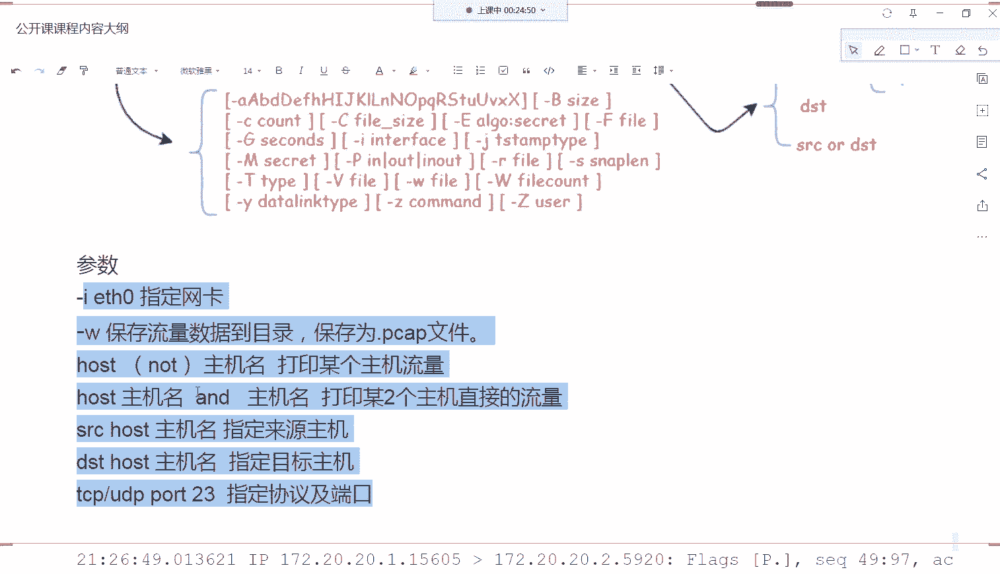

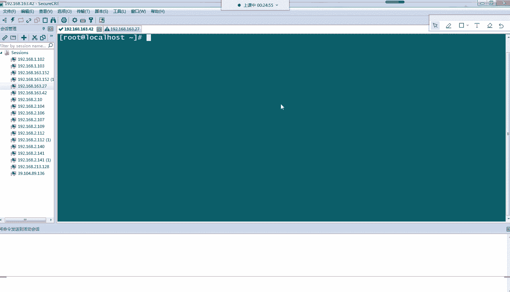

一个典型的命令格式如下：
```bash
tcpdump [选项] [表达式]
```

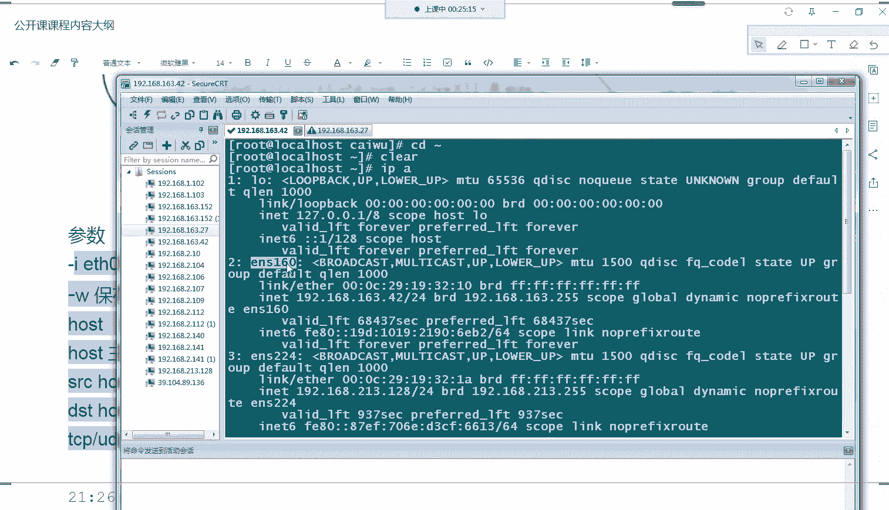

---

## 常用参数详解

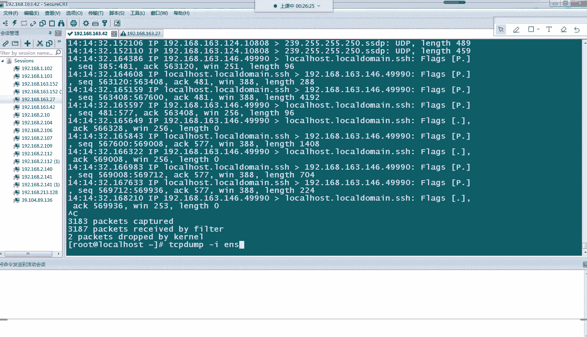

理解了命令结构后，本节中我们重点学习几个最常用的参数，它们能帮助我们高效地抓取所需数据。

以下是`tcpdump`的一些核心参数及其作用：

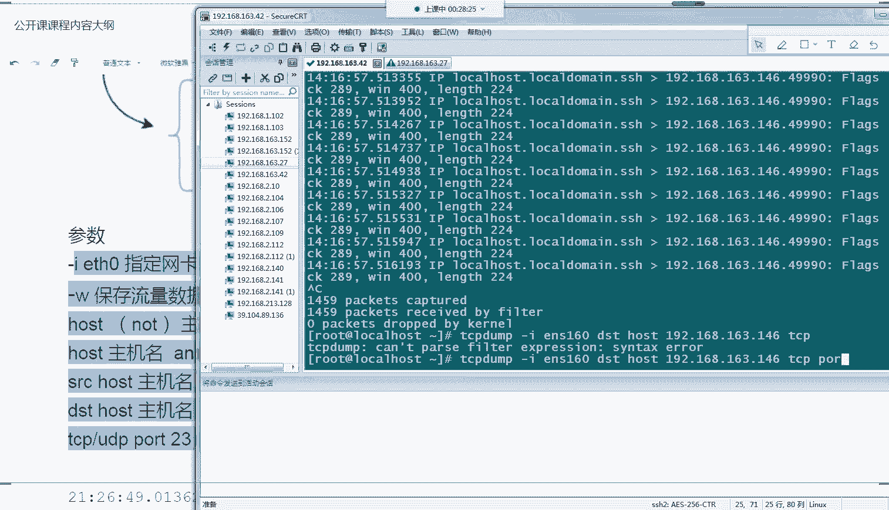

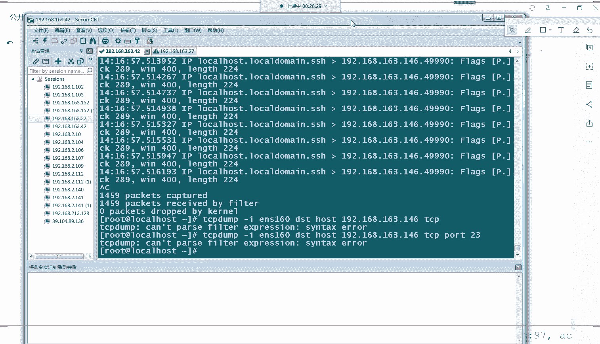

*   **`-i <interface>`**：指定要监听的网络接口（网卡）。例如，`-i eth0`表示只抓取`eth0`网卡上的流量。如果服务器有多张网卡，这个参数非常有用。
*   **`-w <file>`**：将抓取的原始数据包保存到文件中，而不是打印到屏幕。文件扩展名通常为`.pcap`。例如，`-w capture.pcap`。
*   **`host <hostname>`**：筛选与指定主机（IP地址或主机名）相关的所有流量（进和出）。
*   **`src host <hostname>`**：仅筛选来源（发送方）是指定主机的流量。
*   **`dst host <hostname>`**：仅筛选目的地（接收方）是指定主机的流量。
*   **`tcp port <portnumber>`**：筛选特定TCP端口的流量。例如，`tcp port 22`筛选SSH流量。

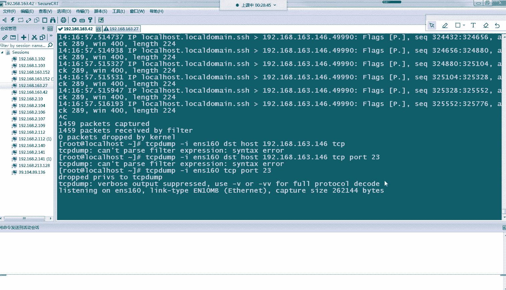

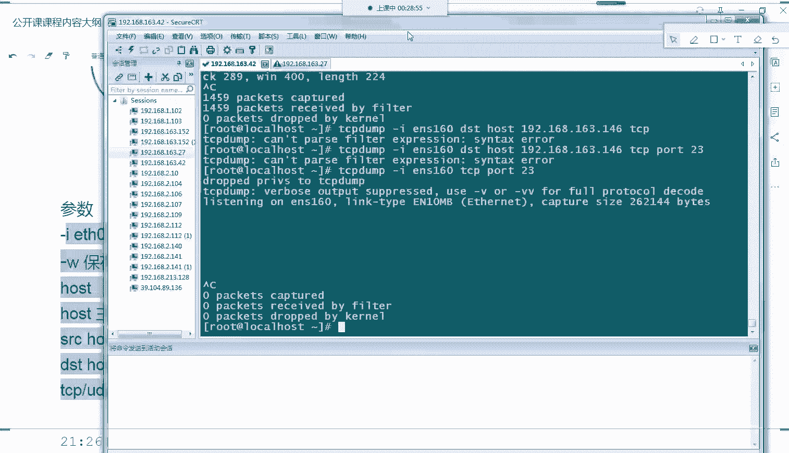

---

## 实战抓包演示

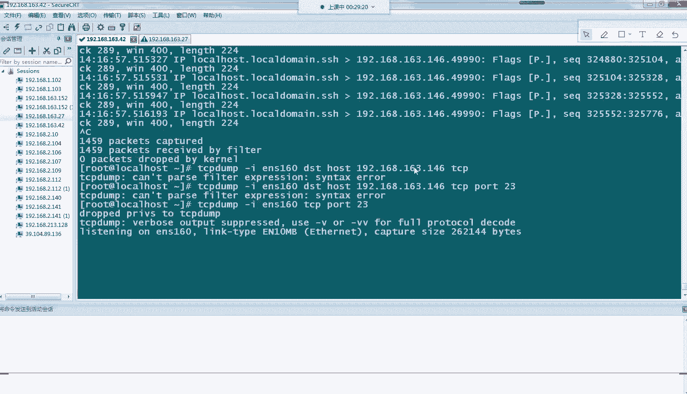

理论需要结合实践。上一节我们学习了参数，本节中我们通过实际操作来观察这些参数的效果。

首先，我们查看本机的网络接口名称。
```bash
ip a
```
假设我们的网卡名是`ens160`。

**1. 抓取指定网卡的所有流量**
这个命令会快速滚动显示`ens160`网卡上所有的网络数据包，信息量很大。
```bash
tcpdump -i ens160
```

**2. 过滤特定来源IP的流量**
以下命令只显示来自IP地址`192.168.163.124`的数据包。
```bash
tcpdump -i ens160 src host 192.168.163.124
```

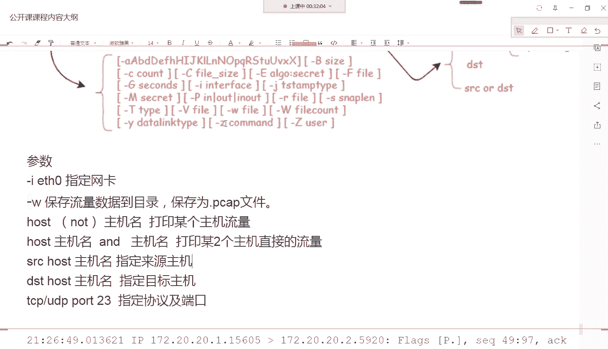

**3. 过滤发往特定目的IP的流量**
这个命令只显示发送到IP地址`192.168.163.146`的数据包。
```bash
tcpdump -i ens160 dst host 192.168.163.146
```

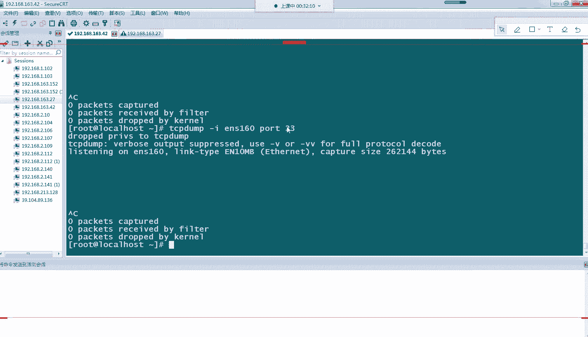

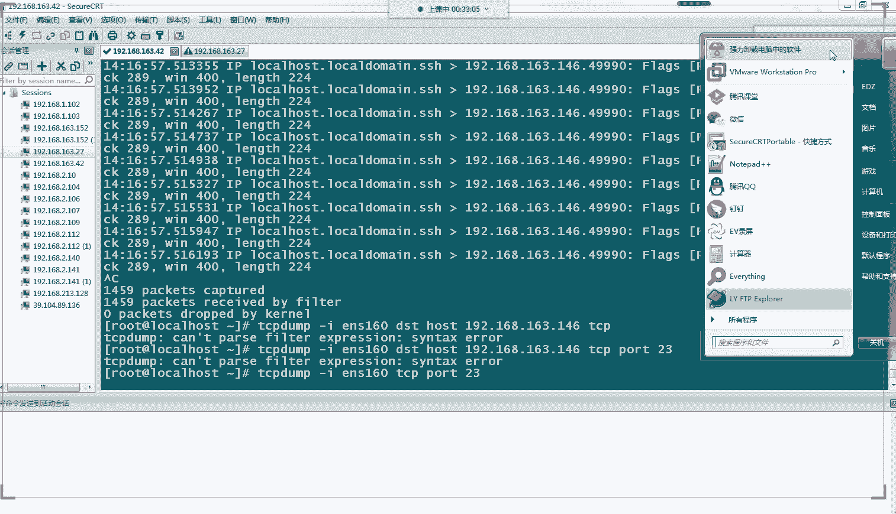

**4. 组合过滤：特定协议的端口流量**
这个命令尝试抓取`ens160`网卡上TCP协议且端口为23（Telnet）的流量。如果没有流量，则无输出。
```bash
tcpdump -i ens160 tcp port 23
```

---

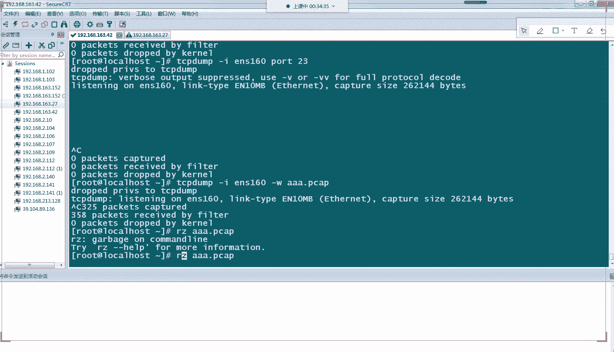

## 输出格式解读与进阶分析

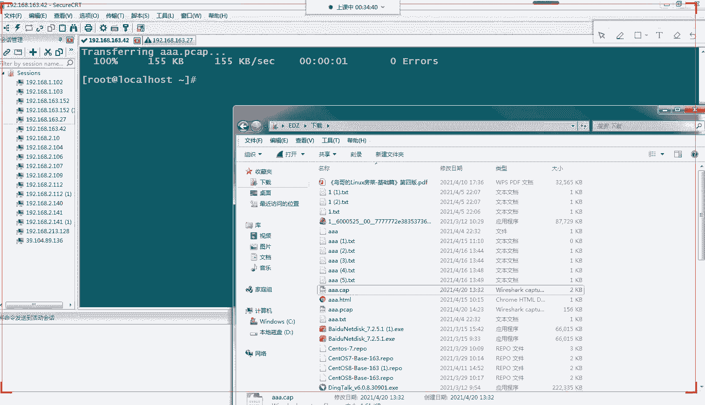

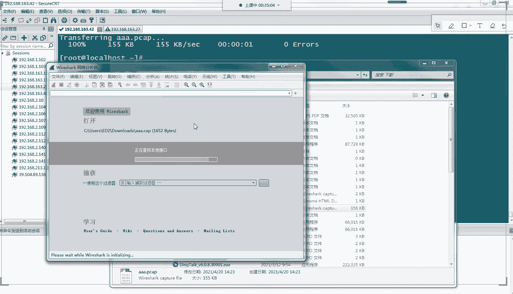

通过实战，我们看到了抓包的结果。本节中，我们来解读输出信息的含义，并学习如何进行更深入的分析。

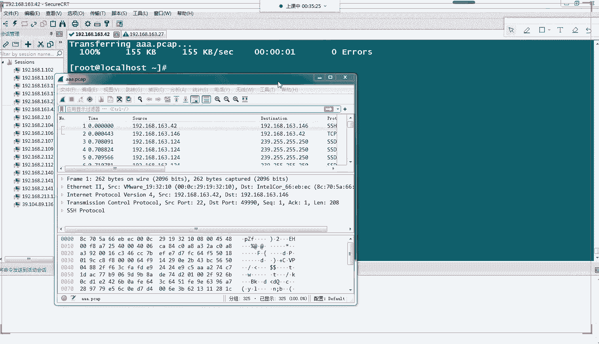

`tcpdump`的典型输出行如下：
```
17:05:07.372109 IP 172.20.20.1.15160 > 172.20.20.2.5920: Flags [P.], seq 1:81, ack 82, win 227, options [nop,nop,TS val 100 ecr 99], length 80
```

以下是各字段的解读：
1.  **时间戳**：`17:05:07.372109`，数据包到达的精确时间。
2.  **协议**：`IP`，表示网络层使用的是IP协议。
3.  **源地址与端口**：`172.20.20.1.15160`，发送方的IP和端口号。
4.  **方向**：`>`，表示数据流向，从左边主机流向右边主机。
5.  **目标地址与端口**：`172.20.20.2.5920`，接收方的IP和端口号。
6.  **TCP标志与详情**：`Flags [P.]`等，包含TCP序列号、确认号、窗口大小等详细信息，涉及TCP握手、数据传输等状态。

对于更复杂的故障排查（如分析完整的TCP三次握手/四次挥手），我们需要更强大的图形化工具。

**使用Wireshark进行深度分析**
`tcpdump`的`-w`参数可以将数据包保存为`.pcap`文件，然后用`Wireshark`打开进行可视化分析。

首先，用`tcpdump`抓包并保存文件：
```bash
tcpdump -i ens160 -w my_capture.pcap
```
按 `Ctrl+C` 停止抓包。

然后，将`my_capture.pcap`文件下载到本地，用`Wireshark`软件打开。在Wireshark中，你可以：
*   清晰地看到每个数据包的层次结构（以太网帧、IP包、TCP/UDP段、应用层数据）。
*   按时间、协议、地址等条件进行筛选。
*   通过颜色标识快速发现异常数据包（如黑色的丢包、重传）。
*   深入查看数据包每个字节的含义。

这为分析网络协议交互、定位连接问题提供了极大的便利。

---

## 总结

本节课中，我们一起学习了Linux下网络数据包抓取与分析的基础知识。

我们首先了解了`tcpdump`这个强大命令行工具的作用和安装方法。接着，学习了其命令的基本结构和几个最常用的参数，如`-i`指定网卡、`host/src host/dst host`过滤主机、`-w`保存文件等。通过实战演示，我们观察了不同过滤条件下的抓包结果，并学会了解读输出信息的基本格式。最后，我们介绍了如何将抓包文件导入`Wireshark`进行图形化、更深层次的分析。

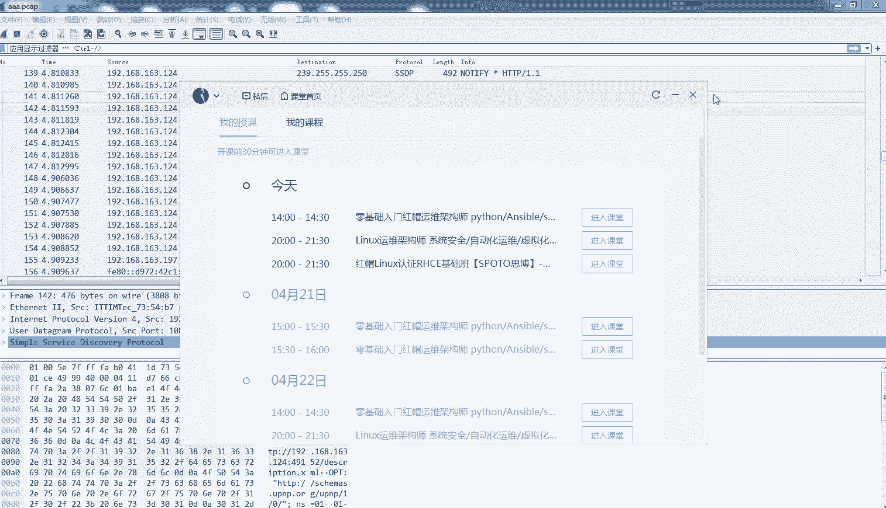

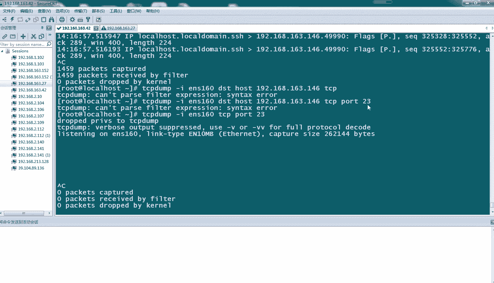

`tcpdump`是Linux系统管理员和网络工程师必备的利器。掌握其基本用法，能为网络故障排查提供明确的思路和方向。要熟练运用，还需要结合实际的网络知识（如TCP/IP协议栈）多加练习。希望本教程能为你打开网络数据分析的大门。