# Linux小课堂：P12：Yum仓库配置与使用详解 🚀

在本节课中，我们将学习Linux系统中至关重要的软件包管理工具——Yum。我们将了解Yum仓库的配置方法，掌握其核心命令的使用，从而为后续安装Apache等软件打下坚实基础。

上一节课我们介绍了如何通过SSH远程登录服务器，并学习了SSH的基本配置和密钥登录方式。本节课中，我们来看看如何在登录服务器后，高效地安装和管理软件包。

## 概述：Yum是什么？

在Windows系统中，我们通常从官网或软件平台下载`.exe`文件进行安装，有时还需要手动安装依赖包。Linux系统下的软件安装逻辑类似，但依赖关系可能更复杂，甚至出现循环依赖。

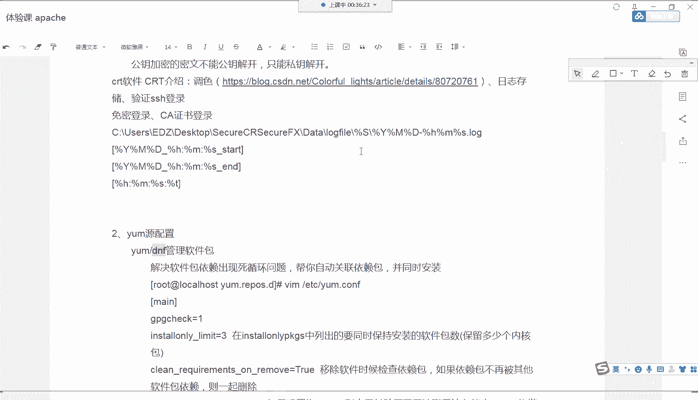

Yum（Yellowdog Updater, Modified）是Linux（特别是Red Hat系如CentOS）中的包管理器，它能自动处理软件包之间的依赖关系，从配置的仓库中下载并安装软件及其所有依赖。在CentOS 8中，`yum`命令实际上是`dnf`命令的链接，两者功能一致。

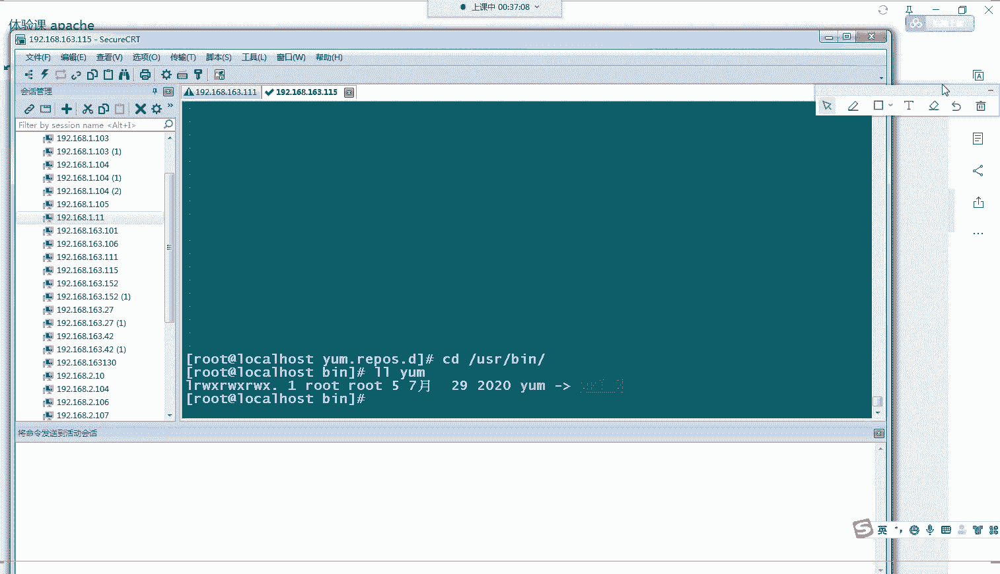

```bash
ls -l /usr/bin/yum
# 输出可能显示：/usr/bin/yum -> dnf-3
```

## Yum配置文件解析

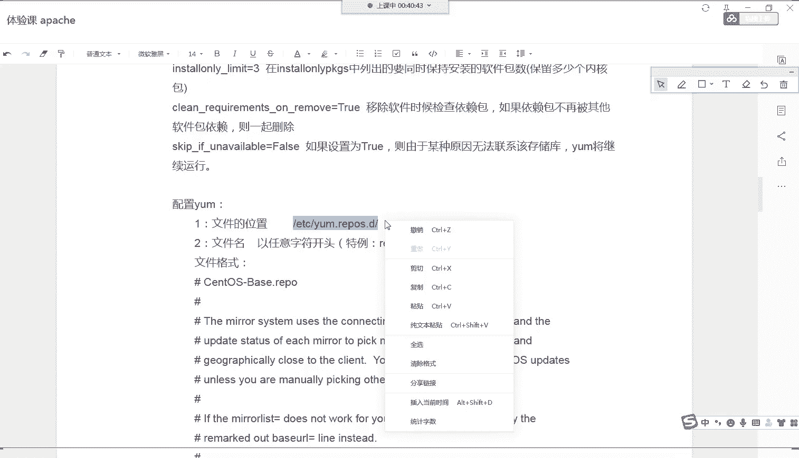

Yum的配置主要涉及两个文件：主配置文件`/etc/yum.conf`和仓库配置文件（位于`/etc/yum.repos.d/`目录下）。

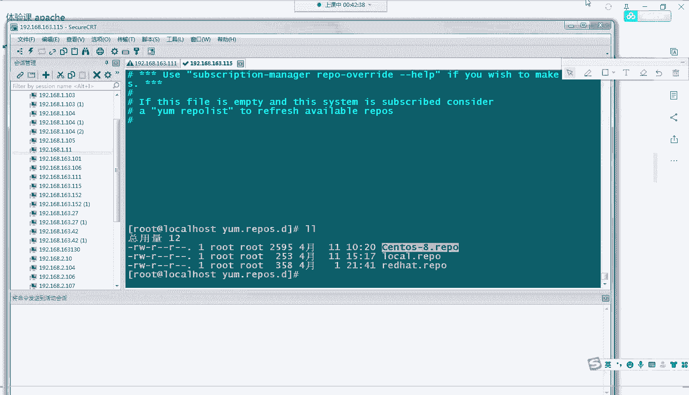

### 1. 主配置文件 `/etc/yum.conf`

此文件包含Yum的全局设置，通常使用默认配置即可，无需修改。以下是几个关键参数：
*   **`gpgcheck=1`**： 启用GPG签名校验，确保软件包来源可信。
*   **`installonly_limit=3`**： 指定保留多少个内核版本。
*   **`clean_requirements_on_remove=True`**： 移除软件包时，同时移除不再被依赖的包。
*   **`skip_if_unavailable=True`**： 如果某个仓库暂时不可用，则跳过它继续运行。

### 2. 仓库配置文件 `/etc/yum.repos.d/*.repo`

这是Yum的核心配置。每个`.repo`文件定义一个或多个软件仓库。系统初始可能只有一个空的`redhat.repo`文件，需要手动配置或从网络下载可用的仓库文件。

以下是一个典型的仓库配置示例（以阿里云CentOS 8仓库为例）：

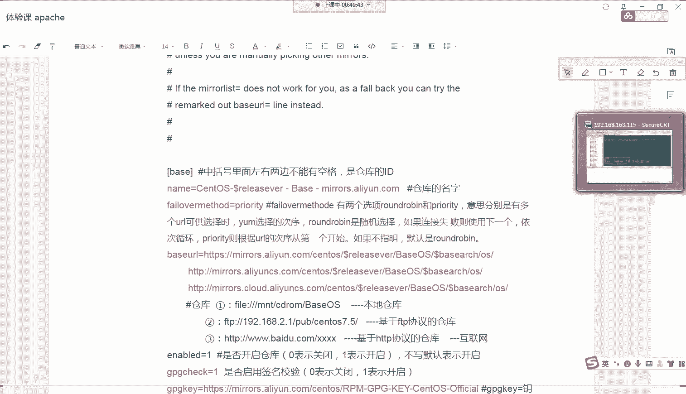


```ini
[baseos]
name=CentOS-$releasever - Base - mirrors.aliyun.com
failovermethod=priority
baseurl=http://mirrors.aliyun.com/centos/$releasever/BaseOS/$basearch/os/
        http://mirrors.aliyun.com/centos/$releasever/BaseOS/$basearch/os/
        http://mirrors.aliyun.com/centos/$releasever/BaseOS/$basearch/os/
enabled=1
gpgcheck=1
gpgkey=http://mirrors.aliyun.com/centos/RPM-GPG-KEY-CentOS-Official
```

以下是各配置项的详细说明：

*   **`[baseos]`**： 仓库ID，必须唯一，用于标识该仓库。
*   **`name`**： 仓库描述名称。
*   **`failovermethod`**： 当`baseurl`列出多个镜像时，选择方式。`priority`表示按顺序，`roundrobin`表示随机。
*   **`baseurl`**： **最关键**的配置，指定软件包的实际下载地址。支持三种协议：
    *   `http://` 或 `https://`： 网络仓库。
    *   `file://`： 本地仓库（如挂载的ISO镜像）。
    *   `ftp://`： FTP服务器仓库。
*   **`enabled`**： 是否启用此仓库，`1`为启用，`0`为禁用。
*   **`gpgcheck`**： 是否对此仓库的包进行GPG校验。
*   **`gpgkey`**： 用于校验的GPG公钥地址。如果启用`gpgcheck`，则必须配置此项。

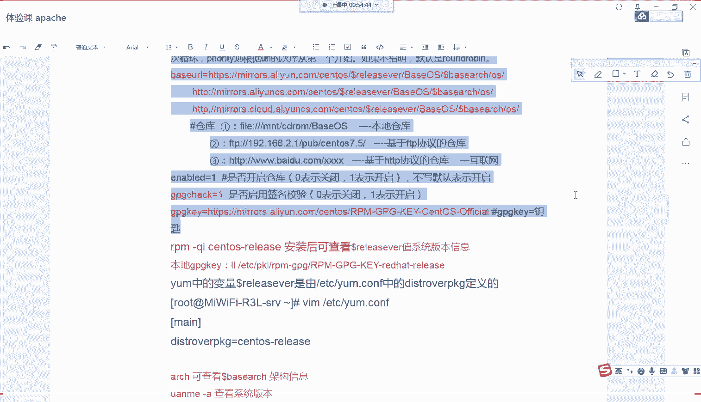

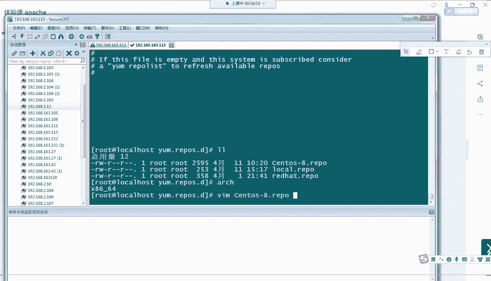

**配置本地仓库示例**： 如果你将CentOS ISO镜像挂载到`/mnt`，可以创建如下仓库文件：
```ini
[local-base]
name=Local CentOS Base
baseurl=file:///mnt/BaseOS
enabled=1
gpgcheck=0 # 本地镜像可关闭校验
```

## Yum常用命令实战

配置好仓库后，就可以使用Yum命令来管理软件了。以下是核心命令的用法。

### 1. 安装软件包

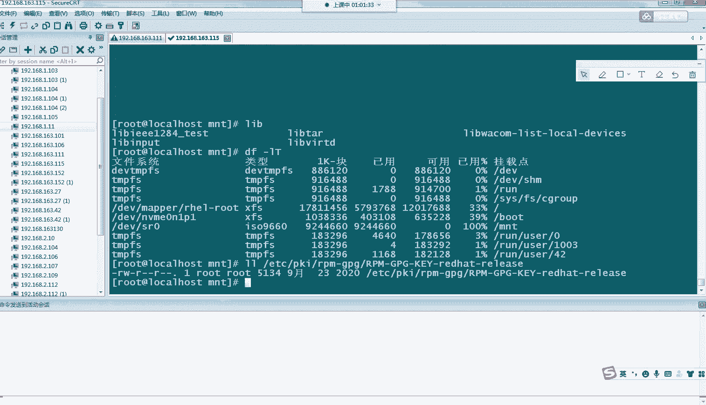

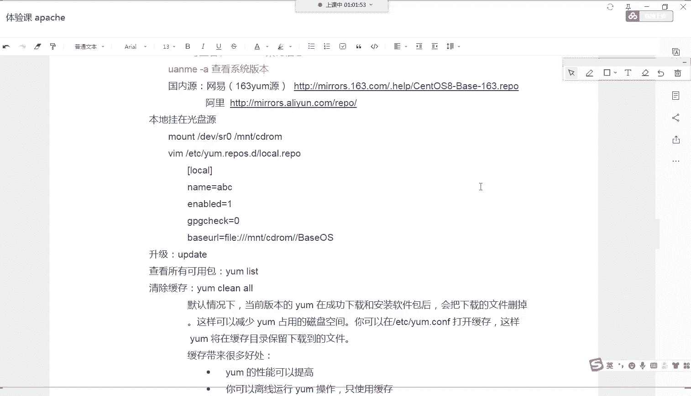

使用 `yum install` 命令。如果不记得完整包名，可以使用通配符`*`搜索。

```bash
# 搜索包含‘openssh’的包
yum list | grep openssh
# 或使用search命令
yum search openssh

# 安装软件包（会提示确认）
yum install openssh-server
# 自动确认安装（适用于脚本）
yum install -y openssh-server
```


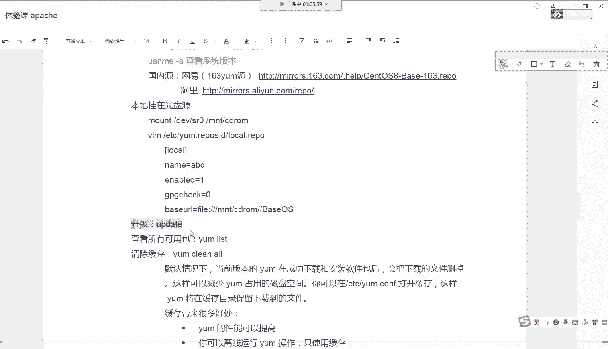

### 2. 查询与搜索

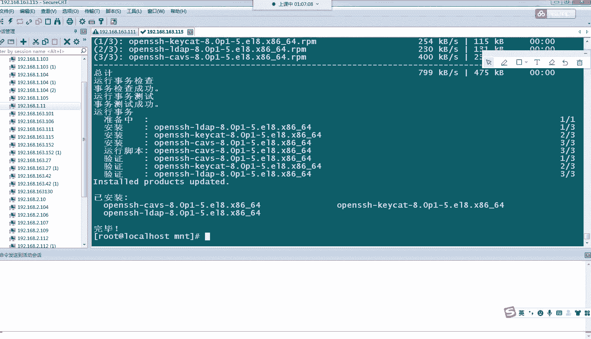

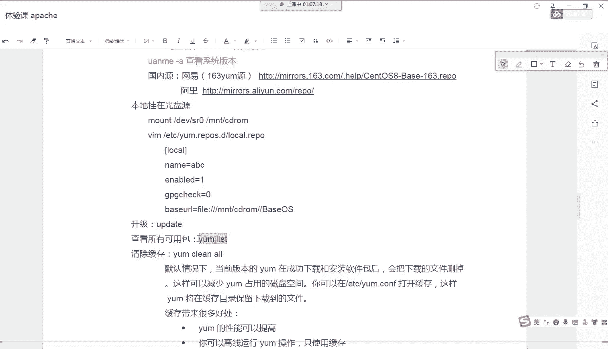

以下是几个常用的查询命令：

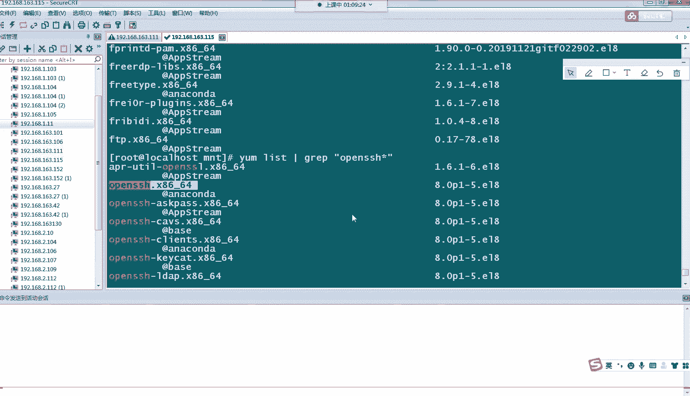

*   **`yum list`**： 列出所有可用、已安装的软件包。通常配合 `grep` 使用。
*   **`yum search <关键词>`**： 根据关键词在包描述和名称中搜索。
*   **`yum provides <命令或文件>`**： **极其重要**的命令。用于查找某个命令或文件是由哪个软件包提供的。
    ```bash
    yum provides ifconfig
    # 输出：net-tools-2.0-0.52.20160912git.el8.x86_64 : Basic networking tools
    # 可知ifconfig命令由net-tools包提供。
    ```
*   **`yum repolist`**： 列出所有已启用并成功识别的仓库。

### 3. 更新与清理

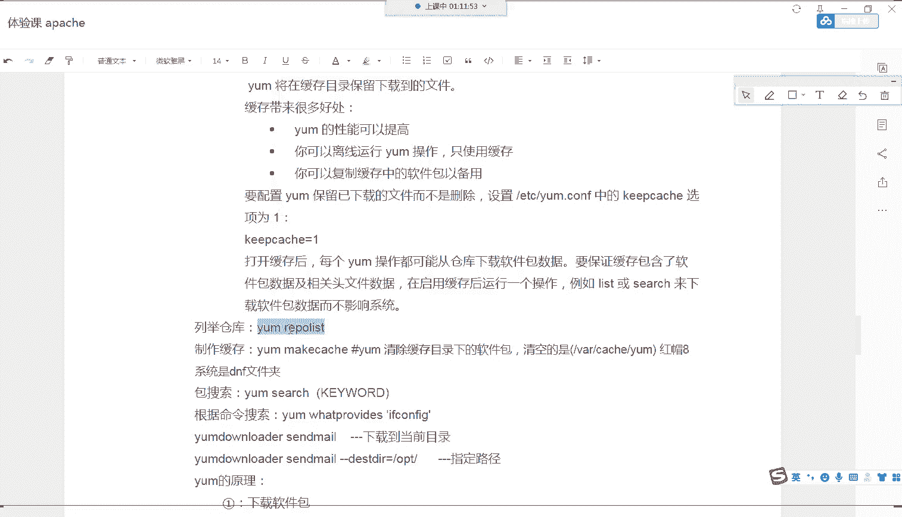

*   **`yum update`**： 更新所有已安装的包到最新版本。**生产环境慎用**，可能导致依赖冲突。
*   **`yum check-update`**： 仅检查可用更新，不执行安装。
*   **`yum clean all`**： 清除所有缓存（如软件包、头文件）。当需要强制从仓库获取最新元数据时使用。
*   **`yum makecache`**： 创建元数据缓存，加速后续操作。

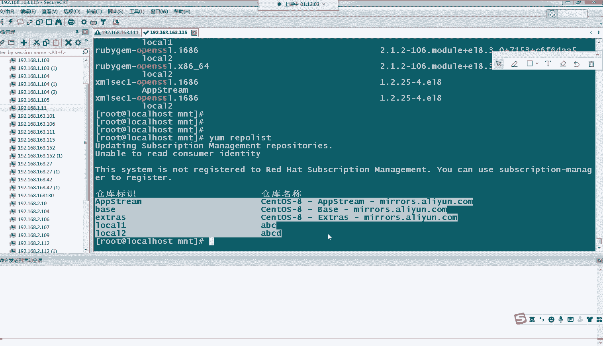

### 4. 卸载与下载

*   **`yum remove <包名>`**： 卸载指定的软件包。**注意**：默认会尝试移除不被其他包依赖的关联包，需谨慎操作。
*   **`yum downloadonly <包名>`** 或 **`yum install --downloadonly --downloaddir=<路径> <包名>`**： 仅下载软件包及其依赖到指定目录，不安装。适用于离线环境。

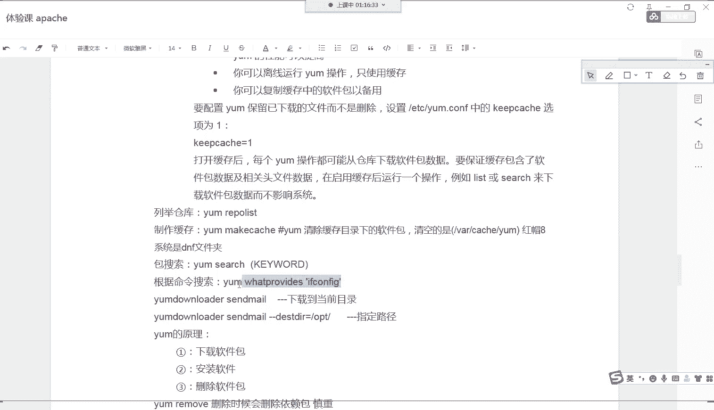

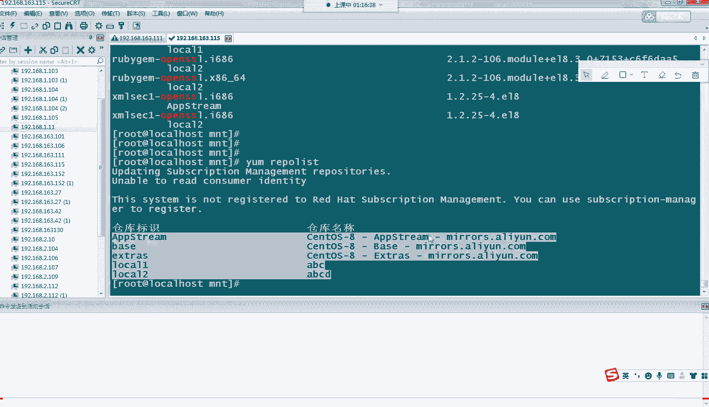

## 安全注意事项

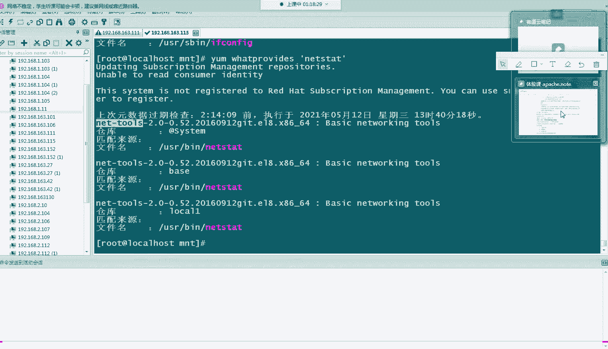

1.  **源的安全性**： 务必从官方或可信的镜像站（如阿里云、清华源）获取仓库配置，避免安装被篡改的恶意软件包。
2.  **GPG校验**： 生产环境应保持`gpgcheck=1`，确保软件包完整性。
3.  **谨慎更新与删除**： `yum update`和`yum remove`可能影响系统稳定性，执行前务必评估影响，尤其在线上环境。

## 总结

本节课我们一起学习了Linux包管理工具Yum的核心知识。我们了解了Yum如何解决软件依赖问题，详细解析了`/etc/yum.conf`主配置文件和`/etc/yum.repos.d/*.repo`仓库配置文件的含义与写法。最后，我们掌握了`install`、`search`、`provides`、`remove`等关键命令的使用方法，并强调了软件包管理中的安全注意事项。

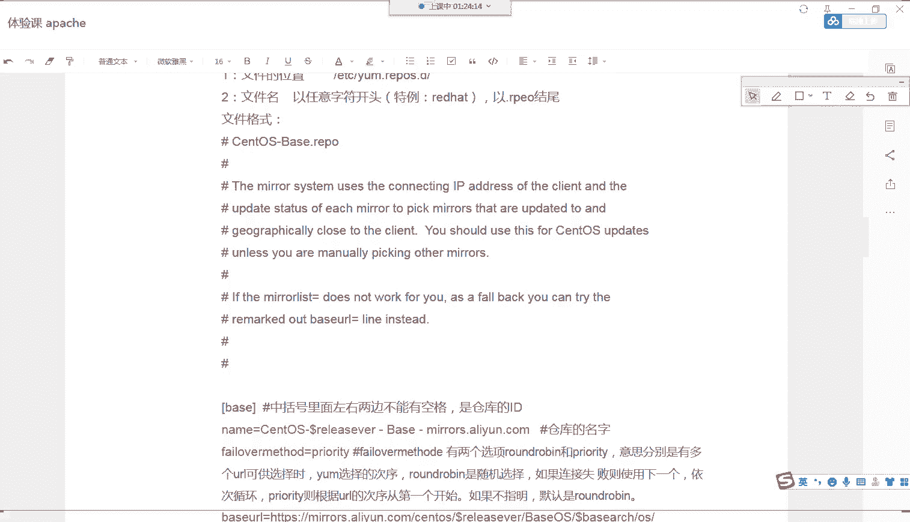

掌握Yum是高效管理Linux系统的必备技能。下一节课，我们将运用本节课的知识，实际安装和配置Apache HTTP服务器，敬请期待。