# Linux小课堂：P15：Linux监控系统建设与选择 📊

## 概述
在本节课中，我们将学习Linux环境下监控系统的建设与选择。我们将探讨为什么需要监控系统，介绍主流的监控方案，并学习如何根据实际场景选择合适的工具。

---

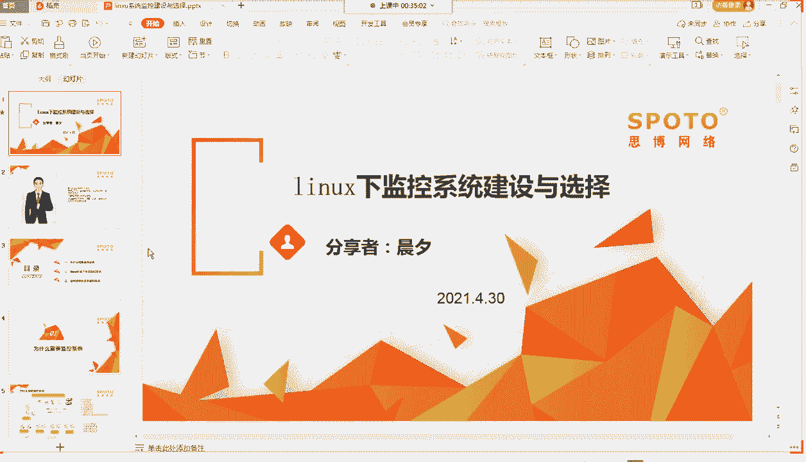

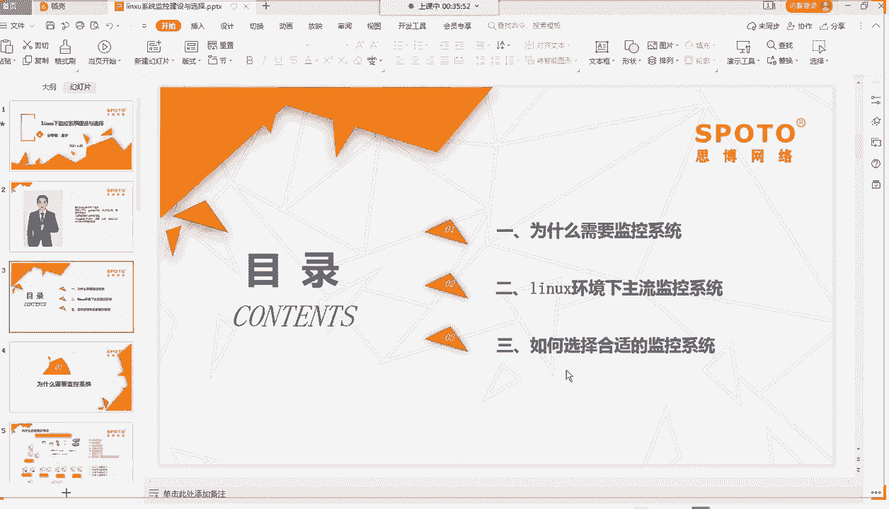

## 为什么要需要监控系统？🤔

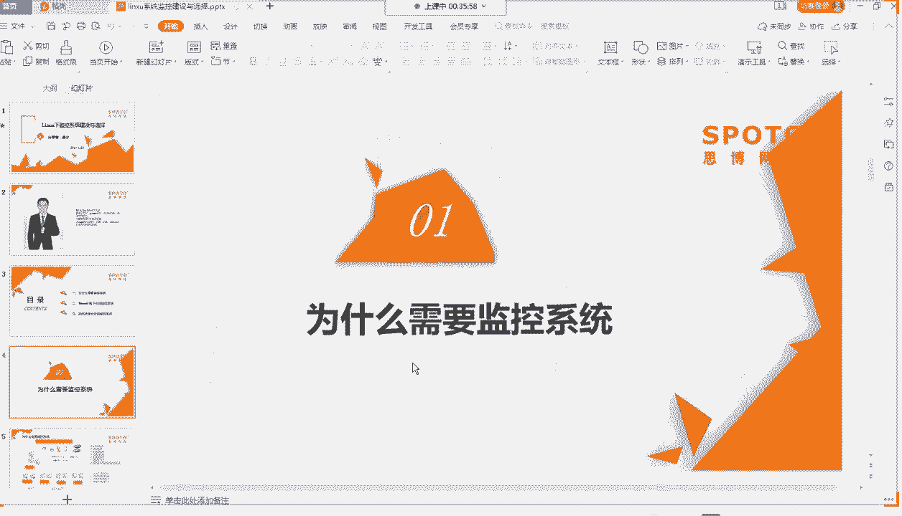

上一节我们介绍了课程主题，本节中我们来看看为什么需要监控系统。首先，我们需要了解线上业务环境的复杂性。

一个典型的线上业务架构包含以下组件：
*   **网络层**：互联网服务提供商（ISP）、防火墙、路由器。
*   **汇聚层**：汇聚层交换机，负责将下层网络流量汇聚。
*   **接入层**：接入层交换机，直接连接业务服务器。
*   **服务器层**：包括Web服务器（如Nginx/Tengine）、应用服务器、数据库（MySQL、Redis）、缓存服务器（Squid）、搜索服务器、图片服务器等集群。

在实际工作中，运维会面临以下挑战：
*   **IT设备数量多**：服务器、网络设备（交换机、路由器、防火墙）数量庞大。
*   **设备种类杂**：不同品牌、型号的硬件和软件系统。
*   **服务类型多**：Web服务、数据库、缓存、大数据、游戏服务等多种业务并存。
*   **部署平台多**：可能混合使用自建机房、公有云等不同平台。
*   **服务稳定性要求高**：通常要求达到多个“9”的可用性（如99.999%）。

与此同时，运维资源往往有限：
*   **运维人员少**：尤其在小公司或初创公司。
*   **故障发现时间要求短**：需要在用户感知前发现问题（如5分钟内）。
*   **故障处理与中断时间要求短**：需要快速定位并恢复业务。

因此，我们需要一个完善的监控系统来应对复杂的环境和高要求。监控系统可以7x24小时自动监控所有IT组件，在故障发生时及时告警，帮助运维人员快速发现、定位并处理问题，从而缩短故障中断时间，提高工作效率。

---

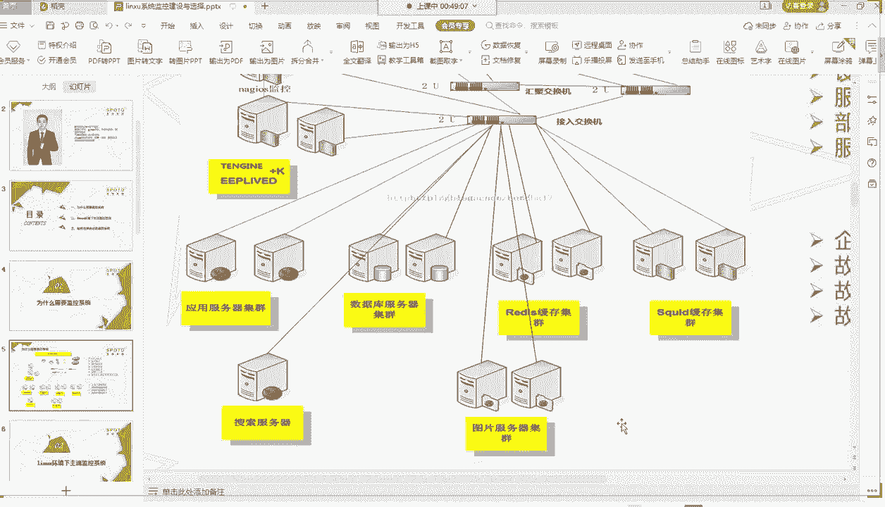

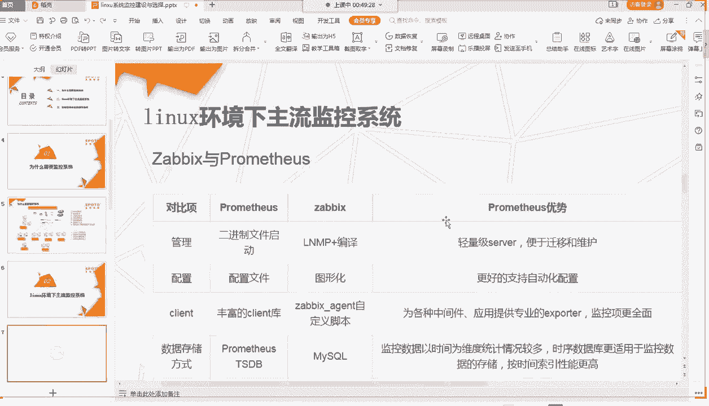

## Linux下主流监控系统介绍 🛠️

了解了监控的必要性后，本节中我们来看看Linux下主流的监控系统。目前比较热门的主要有两种：**Zabbix** 和 **Prometheus**。

以下是两者的核心对比：

| 特性 | Zabbix | Prometheus |
| :--- | :--- | :--- |
| **管理方式** | LNMP架构 + 编译安装 | 二进制文件直接启动 |
| **配置方式** | **Web图形化界面**，易于上手 | **配置文件**，需要一定学习成本 |
| **客户端** | Zabbix Agent，支持自定义脚本 | 各种 Exporter，需按规范开发 |
| **数据存储** | **MySQL** 关系型数据库 | **TSDB** 时序数据库 |
| **数据处理** | 使用SQL查询 | 使用专属查询语言 **PromQL** |
| **扩展接口** | 提供API供二次开发 | 提供SDK供二次开发 |
| **设计初衷** | 更适合监控物理机/传统架构 | 原生为 **Kubernetes (K8s)** 和容器监控设计 |
| **告警方式** | 支持告警收敛，可通过邮件、钉钉、短信等通知 | 支持标签分组、时间收敛告警，可通过多种接口通知 |
| **监控值类型** | 支持数字和字符串 | 主要支持数字 |
| **优势** | 图形化配置友好，历史久远，资料丰富，适合传统环境 | 对容器和云原生环境支持好，自动发现能力强，数据模型灵活 |

### Zabbix 架构简介
Zabbix架构相对简单，核心组件包括：
1.  **Zabbix Server**：监控核心程序。
2.  **Database**：通常使用MySQL存储配置和监控数据。
3.  **Web Frontend**：PHP编写的图形化管理界面。
4.  **Zabbix Agent**：部署在被监控主机上的客户端。
5.  **Proxy（可选）**：用于分布式监控，代理收集数据再转发给Server。

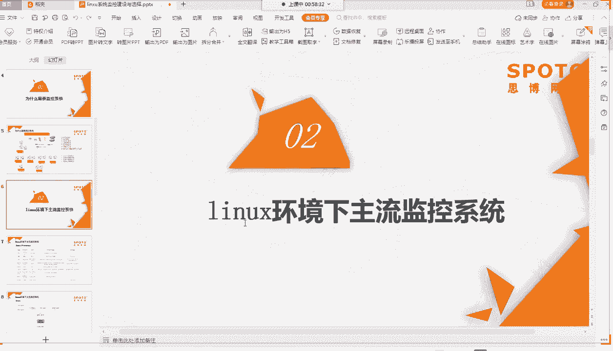

其管理界面提供了主机、模板、触发器等核心配置项，通过图形化操作即可完成大部分监控项的添加与管理。

### Prometheus 架构简介
Prometheus架构围绕其核心服务展开：
1.  **Prometheus Server**：核心服务，包含时序数据库和拉取引擎。
2.  **TSDB**：内置的时序数据库，用于存储指标数据。
3.  **Exporters**：部署在被监控目标上的数据导出器（如`node_exporter`用于主机监控）。
4.  **Pushgateway**：用于支持短生命周期任务的指标推送。
5.  **Alertmanager**：独立的告警组件，处理由Prometheus Server发送的告警，并进行分组、抑制、静音等操作，最后通过不同渠道发送通知。
6.  **Grafana（或其他UI）**：强大的第三方数据可视化工具，常与Prometheus搭配使用。

Prometheus的配置主要通过YAML文件完成，其原生对K8s的服务发现支持非常强大。

### 其他监控方案扩展
除了上述两者，还有一些其他方案：
*   **Nagios**：更早期的监控系统，功能性和性能通常被认为不如Zabbix。
*   **蓝鲸运维平台**：腾讯推出的开源运维平台，集成了监控、自动化、运维开发等功能，体系较为庞大。
*   **应用性能监控（APM）探针**：用于应用层监控，如监控PHP、Java应用的调用链路、性能瓶颈等。开源方案维护较少，商业产品如阿里云的**ARMS**（应用实时监控服务）更为成熟稳定。

---

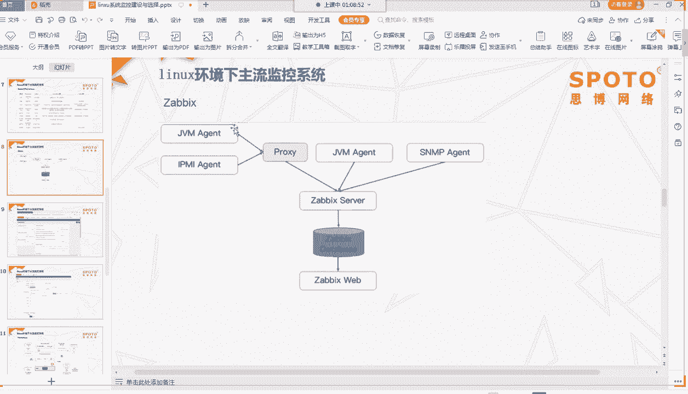

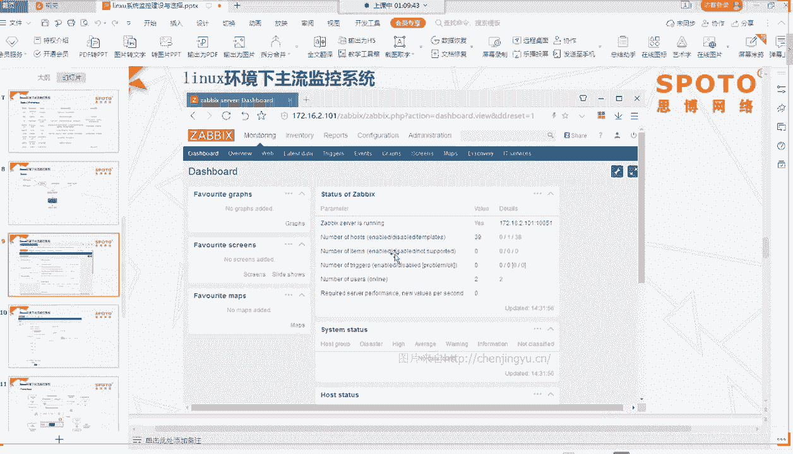

## 如何选择监控系统？✅

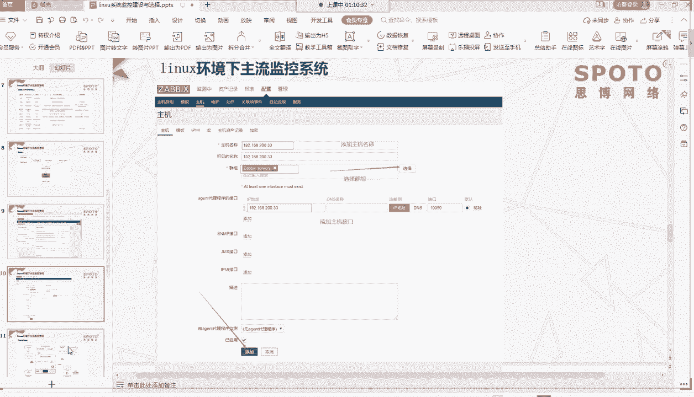

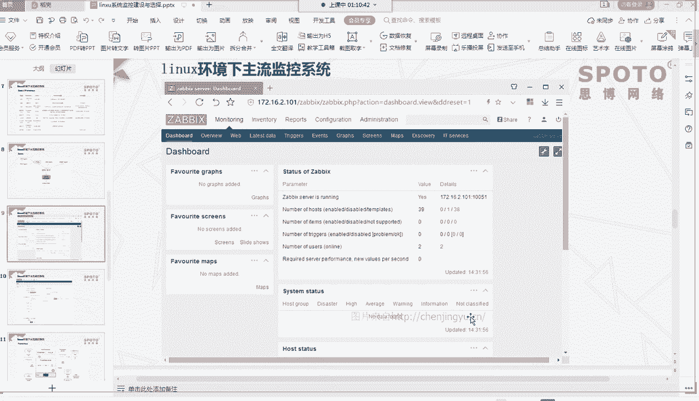

认识了主流监控工具后，本节我们来看看如何根据实际情况进行选择。以下是几个维度的建议：

以下是选择监控系统的几个关键考量点：

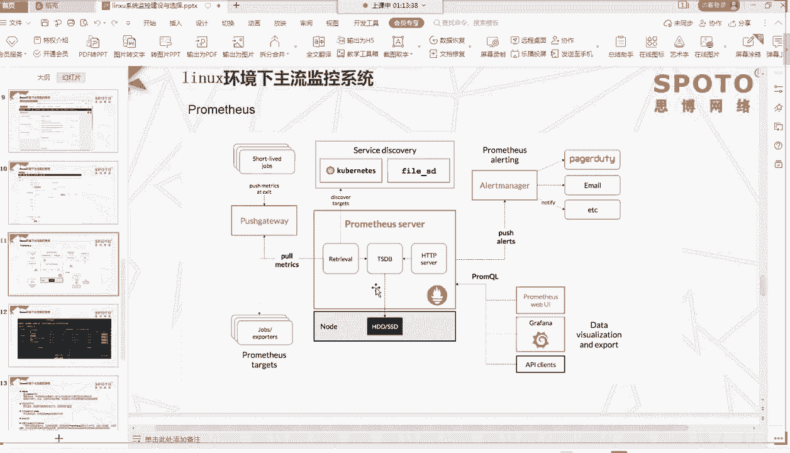

1.  **根据业务场景选择**
    *   **监控服务器性能**：优先选择 **Zabbix**，其易用性和对传统架构的支持更好。
    *   **监控应用性能（如Java/PHP）**：选择 **APM探针** 类产品（如开源探针或阿里云ARMS等商业产品）。
    *   **监控Kubernetes/容器集群**：首选 **Prometheus**，它是云原生领域的标准监控方案。

2.  **根据业务规模选择**
    *   **业务量小**：Zabbix可使用**主动模式**（Server主动拉取Agent数据）；Prometheus可使用**单节点**部署。
    *   **业务量大/多机房**：Zabbix应使用**被动模式**（Agent主动上报）或部署 **Zabbix Proxy** 进行分布式数据收集；Prometheus可采用 **联邦集群** 模式。

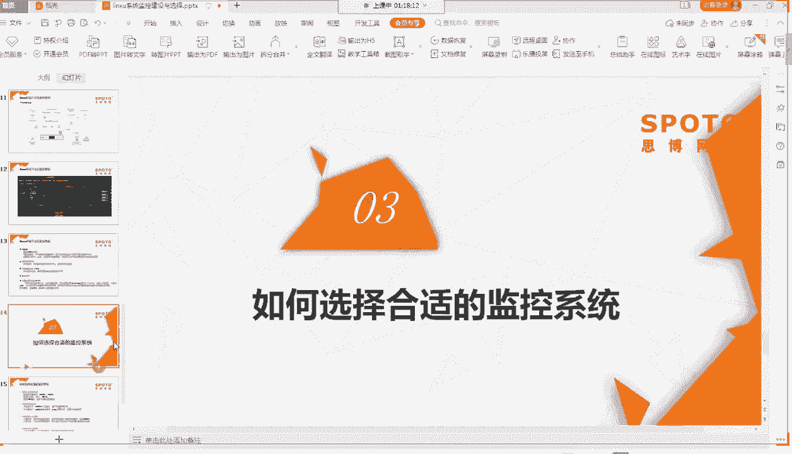

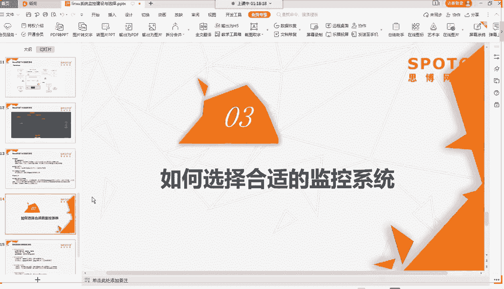

3.  **根据运维团队情况选择**
    *   **人员较少**：选择 **Zabbix** 这类通用、全面的监控系统，快速覆盖核心监控需求。
    *   **人员充足**：可以考虑更细分的监控，如同时部署Zabbix进行基础设施监控，再结合Prometheus监控容器，并引入APM进行应用深度监控。

4.  **根据未来技术规划选择**
    *   如果公司技术栈正向云原生和容器化迁移，应提前学习和试点 **Prometheus**。
    *   如果长期以虚拟机或物理机为主，**Zabbix** 仍是可靠选择。

---

## 总结
本节课我们一起学习了Linux监控系统的建设与选择。我们首先分析了复杂IT环境下对监控系统的需求，然后详细介绍了 **Zabbix** 和 **Prometheus** 这两大主流监控系统的特点、架构与适用场景，最后提供了从业务场景、规模、团队和未来规划等多个维度选择监控系统的实用建议。掌握这些知识，将帮助你为不同的运维环境构建起有效的监控防线。