# Linux小课堂：P16：使用Shell脚本获取IP地址 🖥️

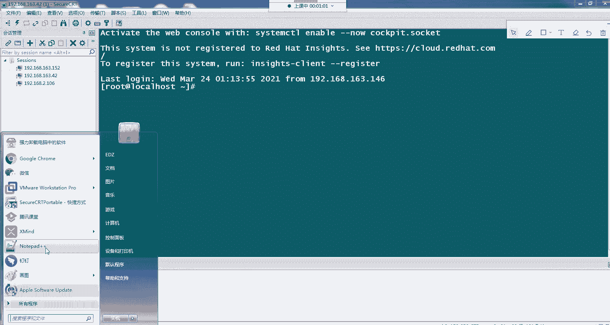

在本节课中，我们将学习如何编写一个Shell脚本，用于自动获取Linux服务器的IP地址。这个技巧在管理多台服务器时非常有用，可以极大地提高工作效率。

## 概述

在实际生产环境中，服务器数量可能达到几十甚至上百台。如果手动登录每台服务器查询IP地址，工作量会非常大。通过编写Shell脚本，我们可以将获取IP的逻辑固化，然后批量在服务器上执行，快速收集所有服务器的网卡和IP信息。这种方法也常用于CMDB（配置管理数据库）平台，实现基础信息的自动收集。

本节课将实现两个核心功能：
1.  获取服务器的全部IP地址（IPv4）。
2.  根据指定的网卡名称和IP类型（IPv4/IPv6），获取特定的IP地址。

---


## 实现思路分析

在开始编写代码之前，我们需要明确脚本的实现逻辑。上一节我们介绍了脚本的目标，本节中我们来看看具体的实现思路。


### 功能一：获取全部IP地址

核心思路是：首先获取服务器上所有网络设备的名称，然后遍历这些设备，逐一获取其对应的IPv4地址，最后按指定格式输出。


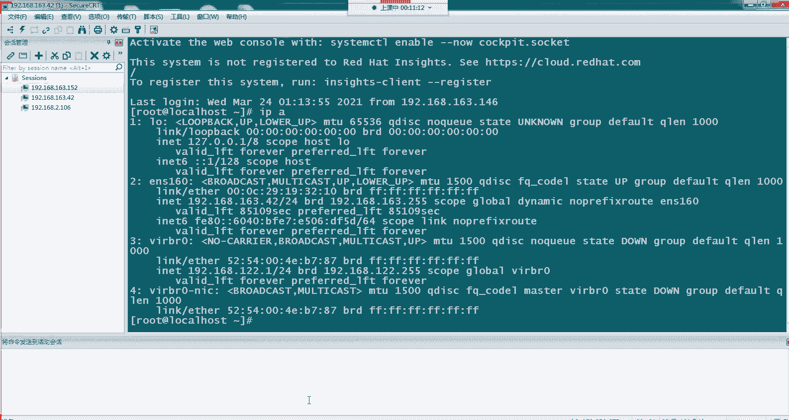

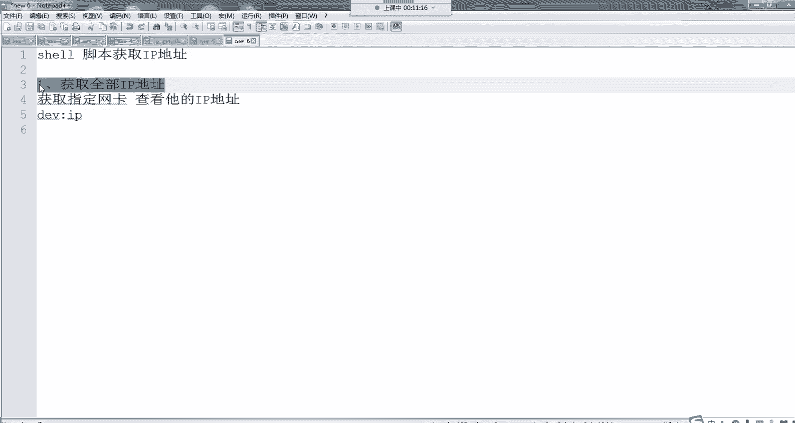

以下是实现此功能的关键步骤：
1.  **获取网卡列表**：使用 `nmcli device` 命令列出所有网络设备，并过滤掉无关行。
2.  **循环处理**：遍历上一步得到的每个网卡名。
3.  **获取IP地址**：针对每个网卡名，使用 `nmcli device show <网卡名>` 命令获取其详细信息，并从中提取IPv4地址。
4.  **格式化输出**：将“网卡名”和“IP地址”组合成 `设备名:IP地址` 的格式进行输出。

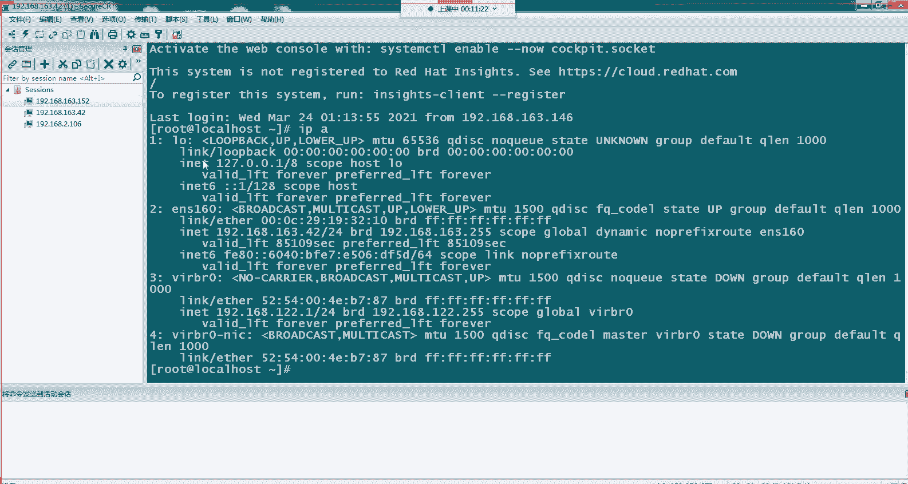

### 功能二：获取指定网卡的IP地址

此功能需要用户输入两个参数：网卡设备名和IP类型（IPv4或IPv6）。脚本需要验证参数的有效性，然后根据参数获取指定的IP信息。

以下是实现此功能的关键步骤：
1.  **参数验证**：检查输入的参数数量是否正确，以及网卡是否存在、IP类型是否合法。
2.  **执行查询**：使用 `ip -4 addr show <网卡名>` 或 `ip -6 addr show <网卡名>` 命令获取指定网卡和IP类型的地址信息。
3.  **提取并输出**：从命令结果中提取出纯净的IP地址，并与网卡名一同格式化输出。

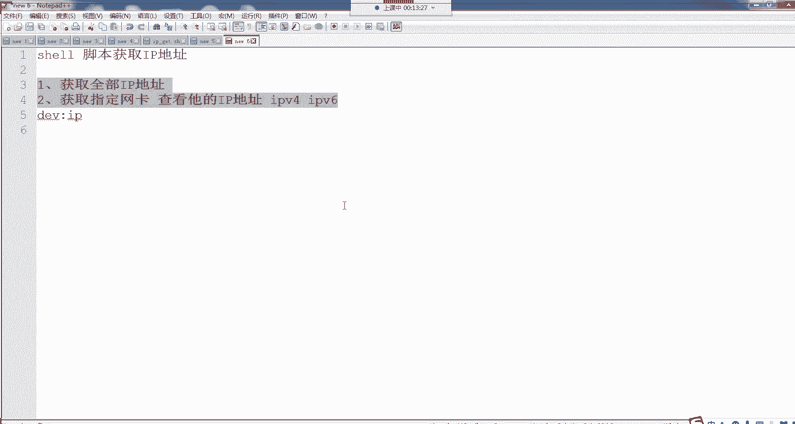

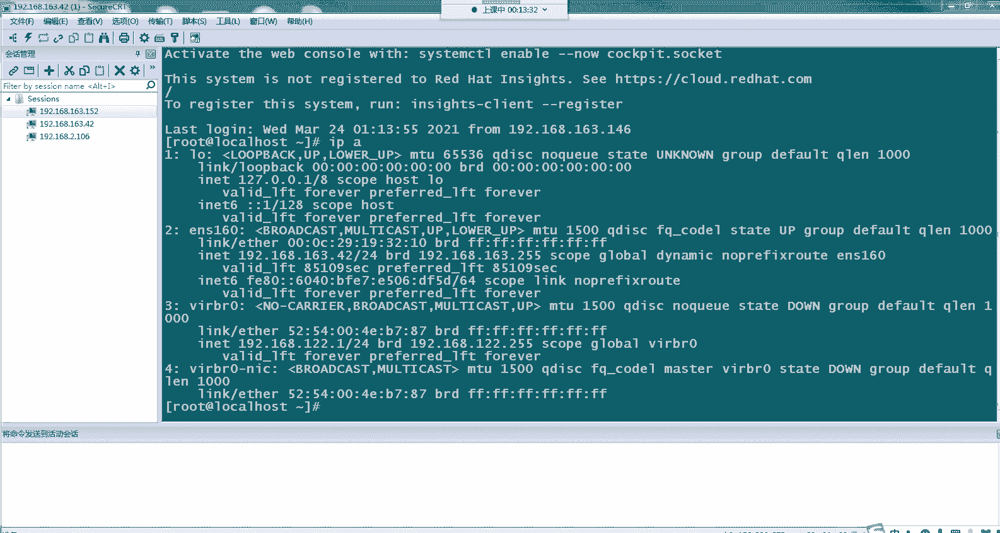

---

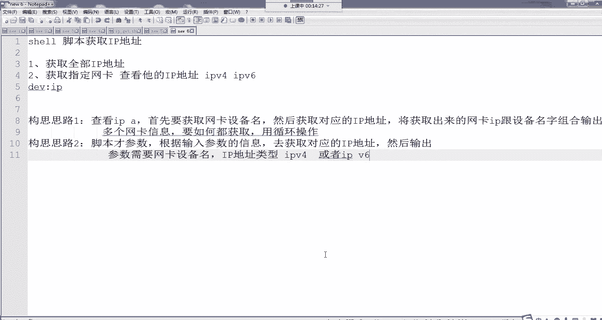

## 脚本编写实战

根据上述思路，我们现在开始编写Shell脚本。我们将把两个功能整合到一个脚本中，并通过判断输入参数的数量来决定执行哪个功能。

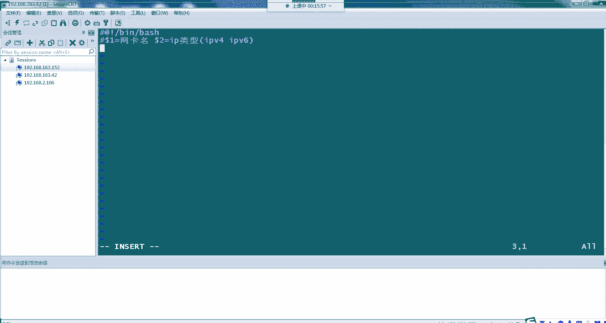

### 1. 脚本基础与参数验证

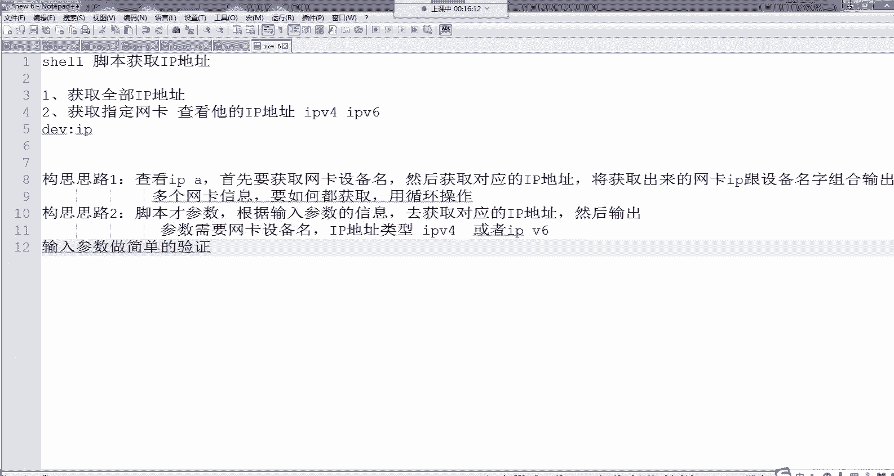

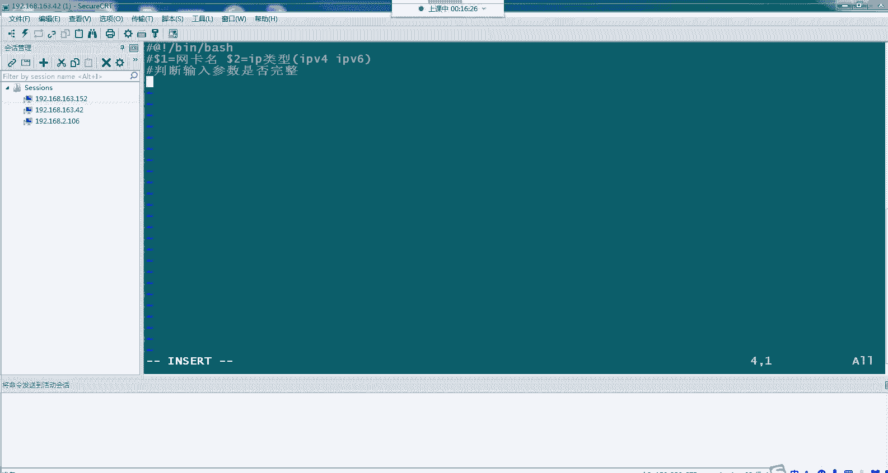

首先创建脚本文件，并添加基本的解释器声明和注释。然后，对用户输入的参数进行初步验证。

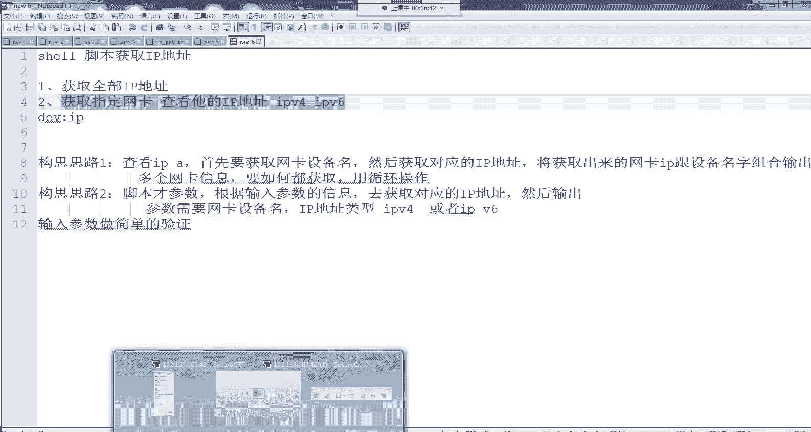

```bash
#!/bin/bash

# 脚本功能：获取IP地址
# 参数1：网卡设备名 (例如：ens160)
# 参数2：IP类型 (可选：ipv4, ipv6)

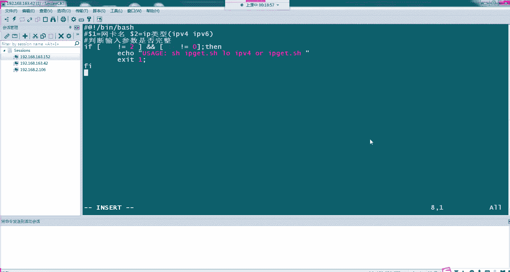

# 判断输入参数是否完整
if [ $# -ne 2 ] && [ $# -ne 0 ]; then
    echo "使用方法:"
    echo "  $0                          # 获取全部网卡的IPv4地址"
    echo "  $0 <网卡名> <ipv4|ipv6>    # 获取指定网卡的IP地址"
    exit 1
fi
```
这段代码检查参数个数是否为0或2，否则提示正确的使用方法并退出。

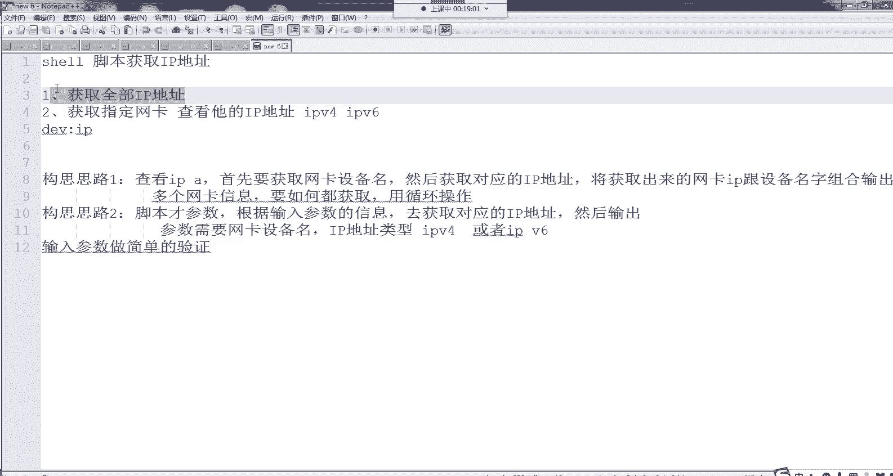

### 2. 实现功能一：获取全部IP地址

如果用户没有输入任何参数，则执行获取全部IP的逻辑。

```bash
# 功能1：获取全部网卡的IPv4地址
if [ $# -eq 0 ]; then
    # 获取所有网络设备名，并过滤掉首行标题
    for device in $(nmcli device | awk ‘NR>1 {print $1}‘)
    do
        # 获取指定设备的IPv4地址
        ip_addr=$(nmcli device show $device | grep ‘IP4.ADDRESS[1]‘ | awk ‘{print $2}‘ | awk -F/ ‘{print $1}‘)
        # 格式化输出：设备名:IP地址
        echo “$device:$ip_addr”
    done
    exit 0
fi
```
此段代码通过 `nmcli` 命令循环获取每个网卡的IPv4地址并输出。

### 3. 实现功能二：获取指定IP地址

如果用户输入了两个参数，则执行获取指定IP地址的逻辑。

```bash
# 功能2：获取指定网卡的指定类型IP地址
NET_DEVICE=$1
IP_TYPE=$2

# 判断指定的网卡是否存在
if ! nmcli device | grep -q “^$NET_DEVICE”; then
    echo “错误：网卡设备 ‘$NET_DEVICE‘ 不存在。”
    exit 1
fi

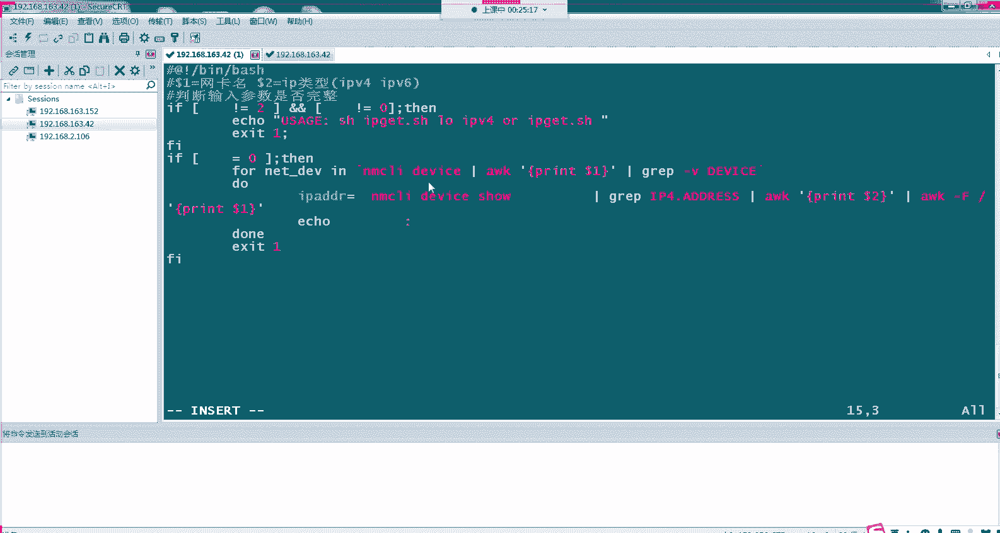

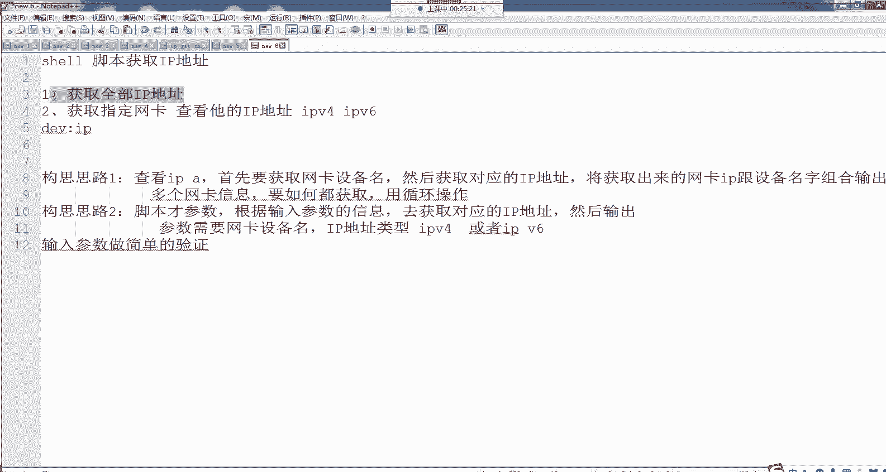

# 判断IP类型参数是否有效，并转换为 ip 命令所需的选项
if [ “$IP_TYPE” == “ipv4” ]; then
    IP_OPTION=“-4”
elif [ “$IP_TYPE” == “ipv6” ]; then
    IP_OPTION=“-6”
else
    echo “错误：IP类型参数错误，请使用 ‘ipv4‘ 或 ‘ipv6‘。”
    exit 1
fi

# 使用 ip 命令获取地址信息，并进行提取
ip_addr=$(ip $IP_OPTION addr show $NET_DEVICE | grep inet | awk ‘{print $2}‘ | awk -F/ ‘{print $1}‘)

# 输出结果
echo “$NET_DEVICE:$ip_addr”
```
这段代码首先验证网卡是否存在和IP类型是否合法，然后使用 `ip` 命令获取信息并提取出IP地址。

---

## 脚本测试

将上述所有代码段按顺序保存到一个文件（例如 `ip_get.sh`），并赋予执行权限 `chmod +x ip_get.sh`。

现在，让我们测试脚本的功能：

1.  **测试功能一**：获取全部IP。
    ```bash
    $ ./ip_get.sh
    lo:127.0.0.1
    ens160:192.168.1.100
    virbr0:192.168.122.1
    ```
    输出显示了所有网卡及其IPv4地址。

2.  **测试功能二**：获取指定网卡的IPv4地址。
    ```bash
    $ ./ip_get.sh ens160 ipv4
    ens160:192.168.1.100
    ```

3.  **测试功能二**：获取指定网卡的IPv6地址。
    ```bash
    $ ./ip_get.sh ens160 ipv6
    ens160:fe80::20c:29ff:feaa:bbcc
    ```

---

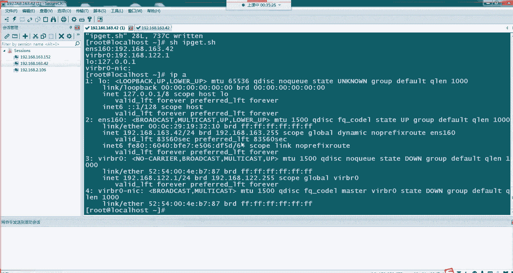

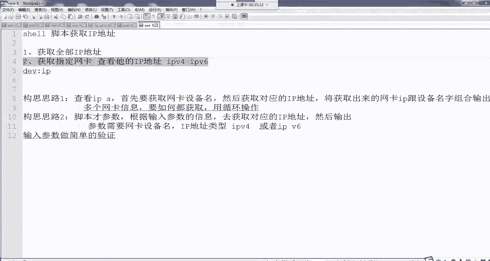

## 总结

本节课中我们一起学习了如何编写一个实用的Shell脚本来获取Linux服务器的IP地址。

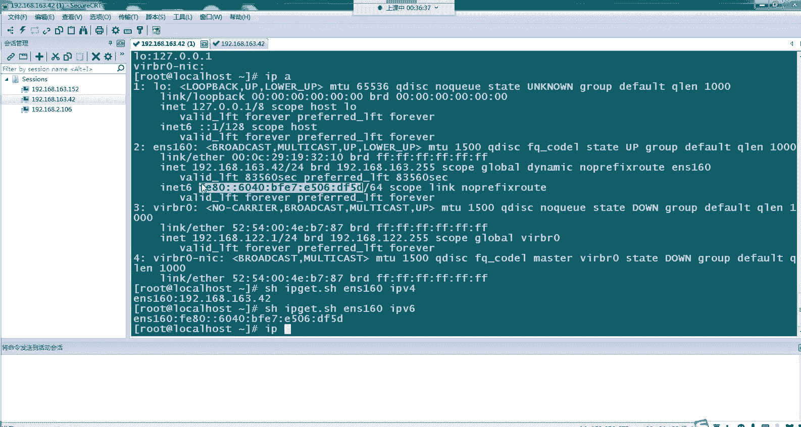

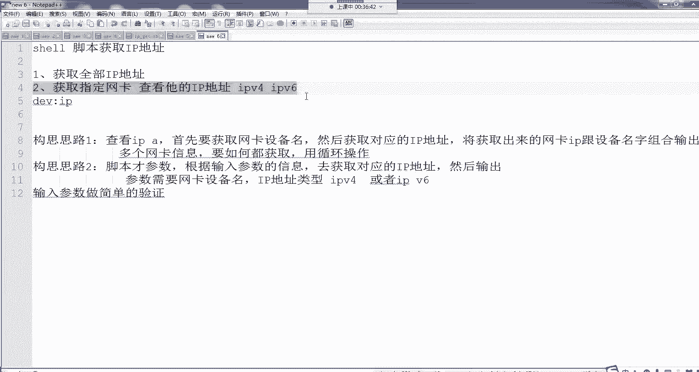

我们主要完成了以下工作：
*   **分析了需求**：明确了在大量服务器中自动化获取IP信息的必要性。
*   **设计了两个功能**：一是获取全部网卡的IPv4地址；二是根据参数获取指定网卡和类型的IP地址。
*   **实现了脚本**：使用 `nmcli` 和 `ip` 命令，结合循环、条件判断和文本处理工具（`awk`, `grep`），逐步构建了脚本逻辑。
*   **进行了测试**：验证了脚本在两个功能场景下的正确性。

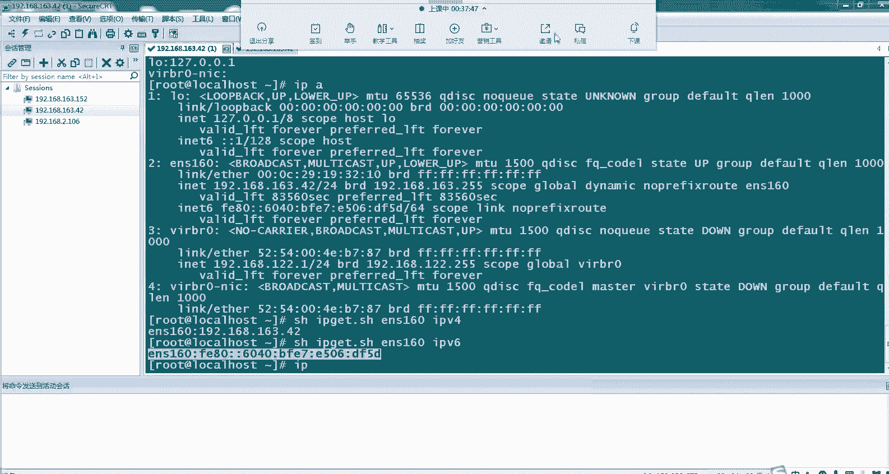

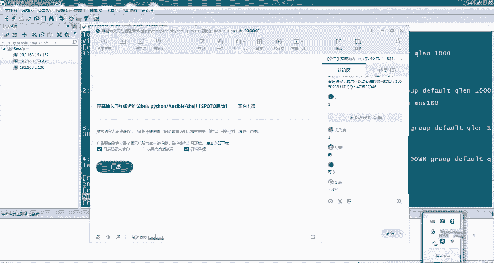

通过这个练习，你不仅学会了一个具体脚本的编写，更重要的是掌握了如何将复杂的运维需求分解为具体的Shell命令和逻辑步骤，这是实现自动化运维的重要基础。你可以在此基础上扩展功能，例如增加IPv6支持、美化输出格式或集成到更大的管理平台中。