# Linux小课堂：P2：使用Shell脚本获取IP地址 📡

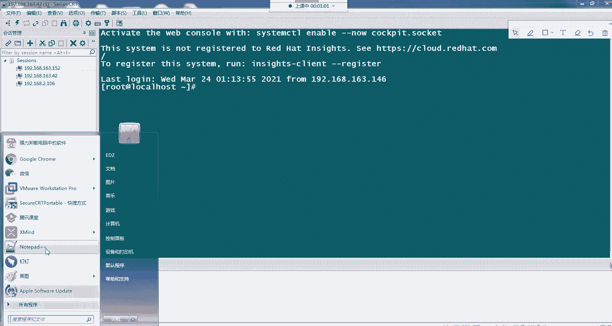

在本节课中，我们将学习如何编写一个Shell脚本，用于自动化获取服务器的IP地址。这在管理多台服务器时非常有用，可以极大地提高工作效率。

## 概述

在实际生产环境中，服务器数量可能达到几十甚至上百台。如果手动登录每台服务器查询IP地址，工作量会非常大。通过编写Shell脚本，我们可以将获取IP的逻辑封装起来，然后批量在所有服务器上执行，快速收集所有服务器的网卡和IP信息。这个脚本未来也可以集成到CMDB（配置管理数据库）平台中，用于自动化收集资产信息。

本节课将实现两个核心功能：
1.  获取服务器的全部IP地址（IPv4）。
2.  根据指定的网卡名称和IP类型（IPv4/IPv6），获取特定的IP地址。

---

## 设计思路与流程

在开始编写脚本之前，我们需要明确实现目标和分析命令的输出格式。

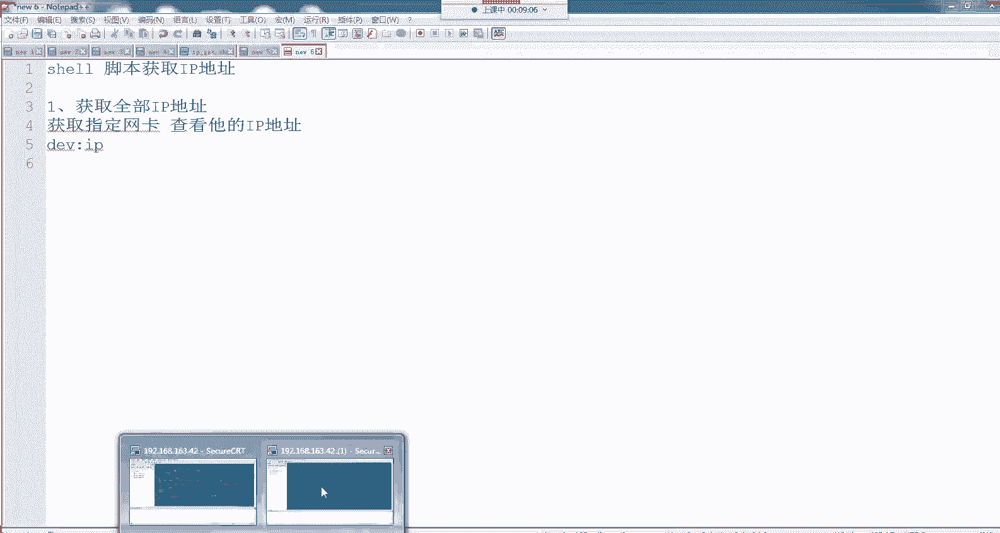

### 分析命令输出

我们使用 `ip a` 命令来查看网络接口信息。该命令会列出所有网卡（如回环接口、物理网卡、虚拟网卡）及其对应的IP地址（包括IPv4和IPv6）。我们的目标是提取出**网卡设备名**和对应的**IPv4地址**。

### 功能一：获取全部IP地址

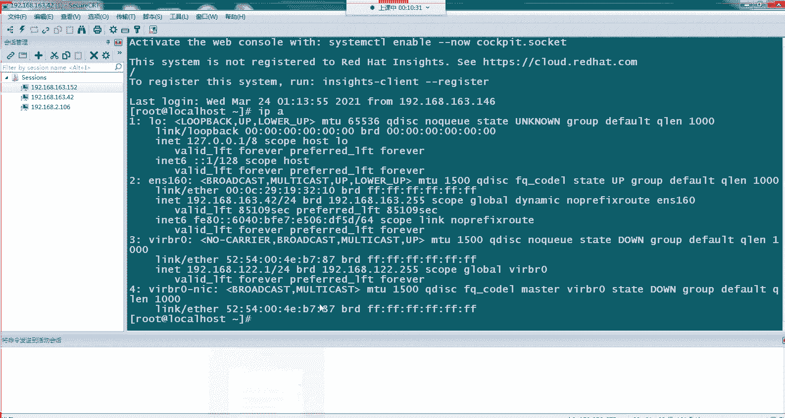

实现此功能的核心思路如下：
1.  **获取网卡列表**：首先需要得到服务器上所有网络接口的设备名。
2.  **循环处理**：遍历每一个网卡设备名。
3.  **提取IP地址**：针对每个网卡，提取出其IPv4地址。
4.  **格式化输出**：将网卡名和IP地址按“设备名:IP地址”的格式组合并输出。

### 功能二：获取指定网卡的IP地址


实现此功能的核心思路如下：
1.  **接收参数**：脚本需要接收两个输入参数：网卡设备名和IP类型（IPv4或IPv6）。
2.  **验证参数**：检查输入的网卡是否存在，以及IP类型是否合法。
3.  **执行查询**：根据合法的参数，查询指定网卡的指定类型IP地址。
4.  **格式化输出**：将结果按指定格式输出。

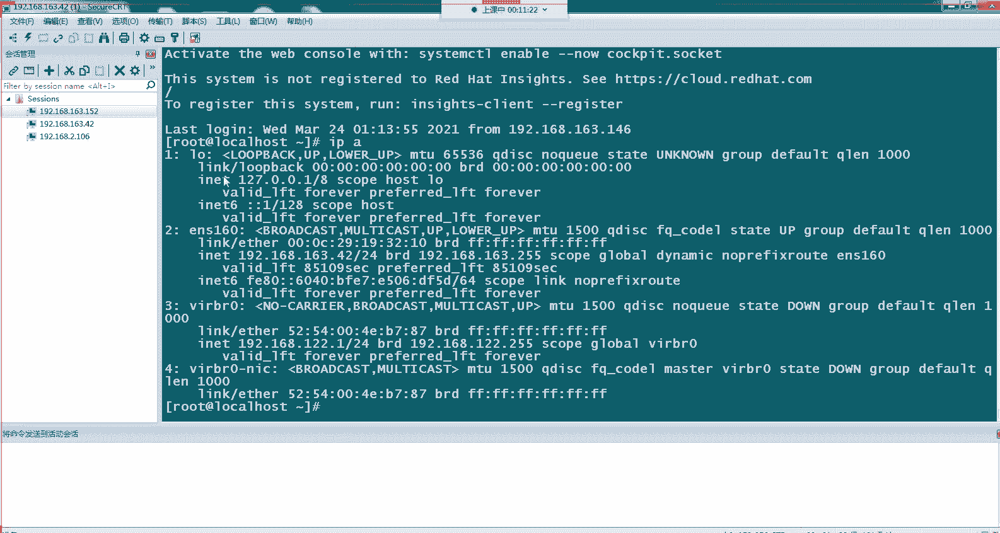

### 脚本结构规划

我们将把两个功能整合到一个脚本中。脚本需要能够判断用户输入的参数：
*   当参数个数为0时，执行**功能一**（获取全部IP）。
*   当参数个数为2时，执行**功能二**（获取指定IP）。
*   其他情况则提示脚本用法。

---

## 脚本编写实战


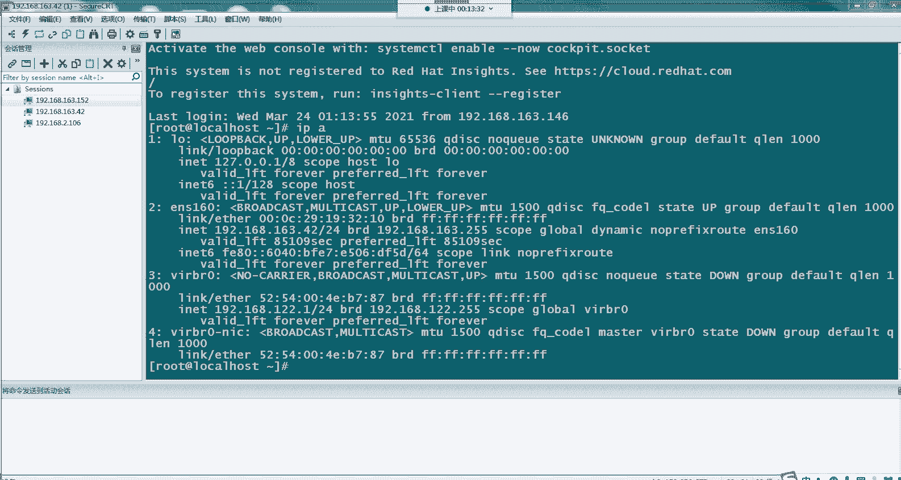

现在，我们根据上述思路开始编写脚本。创建一个名为 `ip_get.sh` 的文件。

### 1. 脚本开头与注释

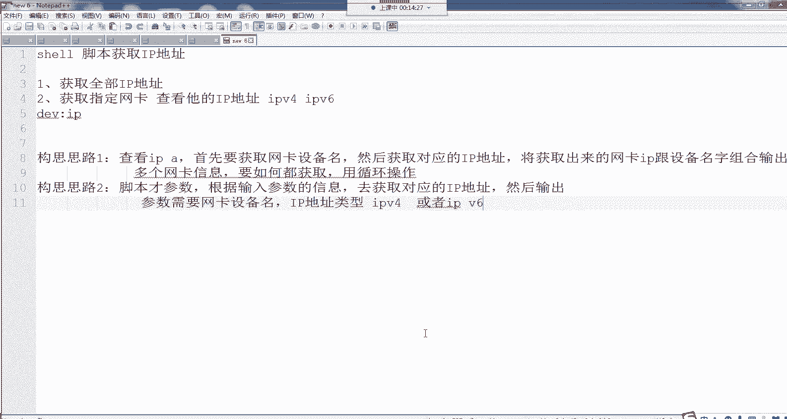

首先指定脚本解释器，并添加注释说明脚本的用途和参数。

```bash
#!/bin/bash

# 脚本功能：获取服务器IP地址
# 使用方法：
# 1. 获取全部IP：./ip_get.sh
# 2. 获取指定IP：./ip_get.sh <网卡设备名> <IP类型>
#    参数说明：
#       网卡设备名：例如 ens160
#       IP类型：ipv4 或 ipv6
```

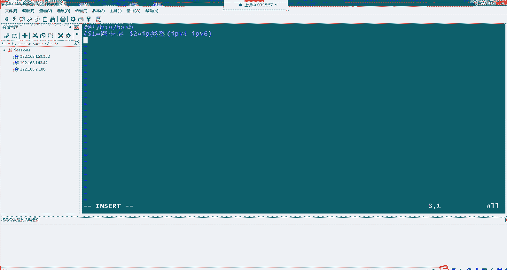

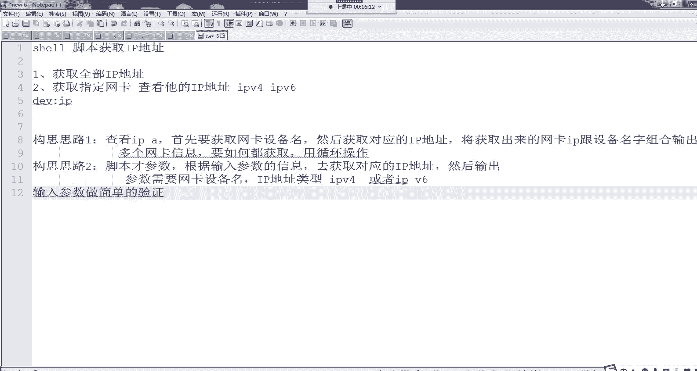

### 2. 参数个数验证

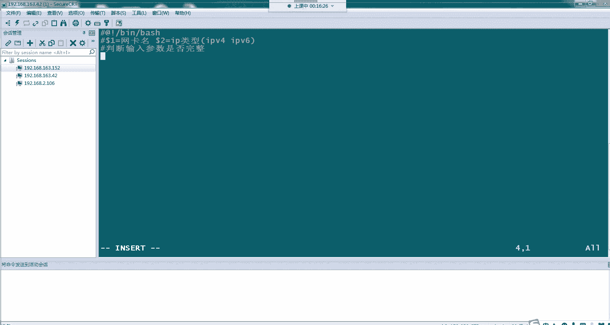

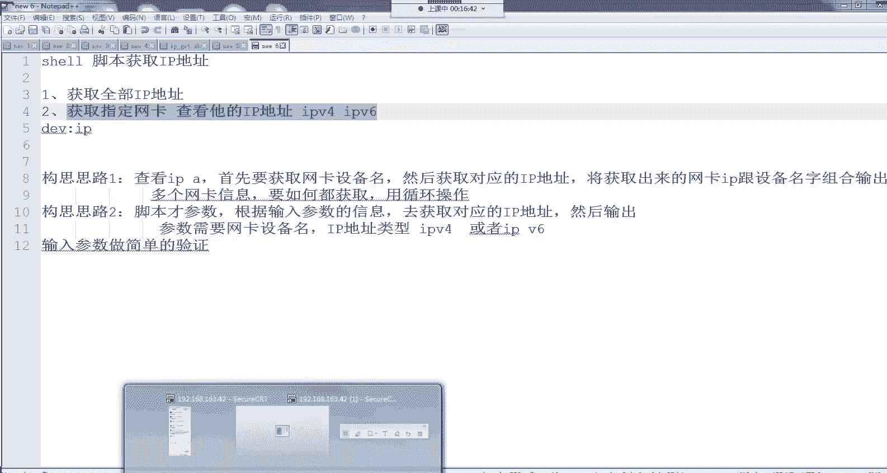

脚本首先验证用户输入的参数个数是否符合要求（0个或2个）。

```bash
# 判断输入参数是否完整
if [ $# -ne 2 ] && [ $# -ne 0 ]; then
    echo "使用方法:"
    echo "  $0 <网卡设备名> <ipv4|ipv6>   # 获取指定网卡的IP"
    echo "  $0                           # 获取全部网卡的IPv4地址"
    exit 1
fi
```
**代码解释**：`$#` 表示传递给脚本的参数个数。如果参数个数不等于2 **并且** 不等于0，则打印用法提示并退出脚本。

### 3. 功能一：获取全部IPv4地址

如果用户没有输入任何参数（`$# -eq 0`），则执行获取全部IP的逻辑。

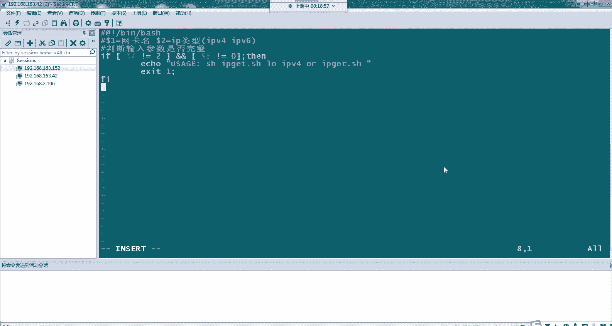

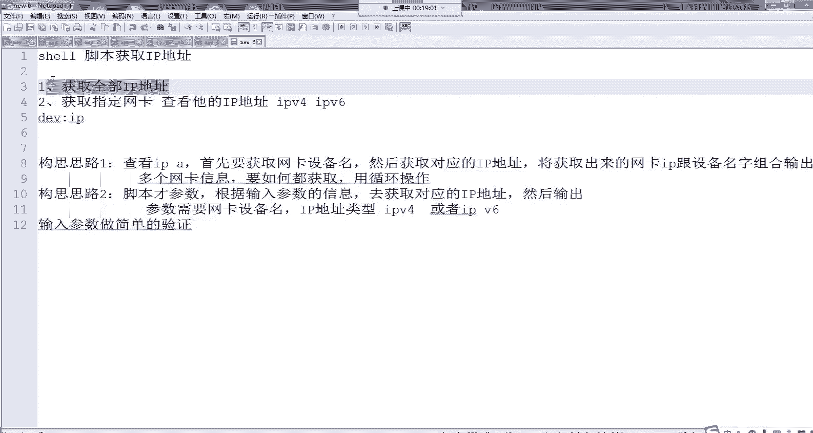

```bash
# 功能一：获取全部网卡的IPv4地址
if [ $# -eq 0 ]; then
    echo "正在获取全部网卡的IPv4地址..."
    # 循环获取每个网卡设备
    for device in $(nmcli device status | awk ‘{print $1}‘ | grep -v ‘DEVICE‘)
    do
        # 获取指定网卡的IPv4地址
        ipaddr=$(nmcli device show $device | grep ‘IP4.ADDRESS‘ | awk ‘{print $2}‘ | awk -F/ ‘{print $1}‘)
        # 格式化输出：设备名:IP地址
        echo "$device:$ipaddr"
    done
    exit 0
fi
```
**代码解释**：
*   `nmcli device status` 用于列出所有网络设备。
*   `awk ‘{print $1}‘` 提取第一列（设备名）。
*   `grep -v ‘DEVICE‘` 过滤掉标题行。
*   `nmcli device show $device` 显示指定设备的详细信息。
*   `grep ‘IP4.ADDRESS‘` 过滤出包含IPv4地址的行。
*   后续的 `awk` 命令用于提取和清理出纯净的IP地址。

### 4. 功能二：获取指定网卡的IP地址

如果用户输入了两个参数，则执行获取指定IP的逻辑。

```bash
# 功能二：获取指定网卡和IP类型的地址
device_name=$1
ip_type=$2

# 将用户输入的ip类型转换为ip命令可识别的选项
case $ip_type in
    ipv4)
        ip_option="-4"
        ;;
    ipv6)
        ip_option="-6"
        ;;
    *)
        echo "错误：IP类型必须为 ‘ipv4‘ 或 ‘ipv6‘"
        exit 1
        ;;
esac

# 使用ip命令获取指定网卡和类型的地址信息
ip_addr_output=$(ip $ip_option addr show dev $device_name 2>/dev/null)

# 检查上一条命令是否执行成功（即网卡是否存在）
if [ $? -eq 0 ]; then
    # 提取IP地址。根据不同IP类型，匹配不同的关键字行。
    if [ "$ip_type" = "ipv4" ]; then
        ip_address=$(echo "$ip_addr_output" | grep ‘inet ‘ | awk ‘{print $2}‘ | awk -F/ ‘{print $1}‘)
    else
        ip_address=$(echo "$ip_addr_output" | grep ‘inet6 ‘ | awk ‘{print $2}‘ | awk -F/ ‘{print $1}‘)
    fi
    # 格式化输出
    echo "$device_name:$ip_address"
else
    echo "错误：未找到网卡设备 ‘$device_name‘"
    exit 1
fi
```
**代码解释**：
*   `$1` 和 `$2` 分别代表第一个和第二个脚本参数。
*   `case` 语句用于将用户输入的 `ipv4`/`ipv6` 转换为 `ip` 命令的 `-4`/`-6` 选项。
*   `ip $ip_option addr show dev $device_name` 是获取指定网卡IP信息的核心命令。
*   `$?` 用于获取上一个命令的退出状态码，`0` 表示成功，非 `0` 表示失败（此处用于判断网卡是否存在）。
*   根据不同的 `$ip_type`，使用 `grep` 匹配 `inet` (IPv4) 或 `inet6` (IPv6) 行，并提取地址。

---

## 脚本测试

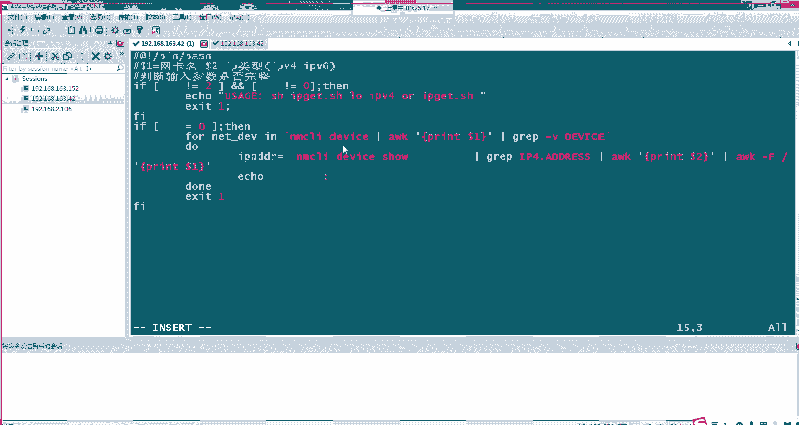

上一节我们完成了脚本的编写，本节我们来测试脚本的功能是否正常。

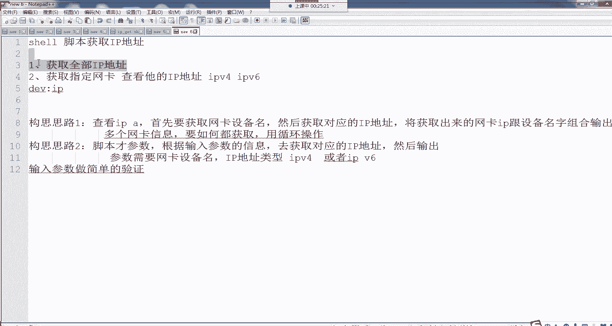

### 测试1：获取全部IP地址

不带任何参数运行脚本，应列出所有网卡的IPv4地址。

```bash
./ip_get.sh
```
**预期输出**（示例）：
```
lo:127.0.0.1
ens160:192.168.1.100
virbr0:192.168.122.1
```

### 测试2：获取指定网卡的IPv4地址

提供网卡名和 `ipv4` 类型参数。

```bash
./ip_get.sh ens160 ipv4
```
**预期输出**（示例）：
```
ens160:192.168.1.100
```

### 测试3：获取指定网卡的IPv6地址

提供网卡名和 `ipv6` 类型参数。

```bash
./ip_get.sh ens160 ipv6
```
**预期输出**（示例）：
```
ens160:fe80::20c:29ff:feaa:bbcc
```

### 测试4：错误处理测试

测试参数错误或网卡不存在的情况。

```bash
# 参数个数错误
./ip_get.sh ens160

# IP类型错误
./ip_get.sh ens160 ipv5

# 网卡不存在
./ip_get.sh non_existent_nic ipv4
```
这些命令应该输出相应的错误提示信息。

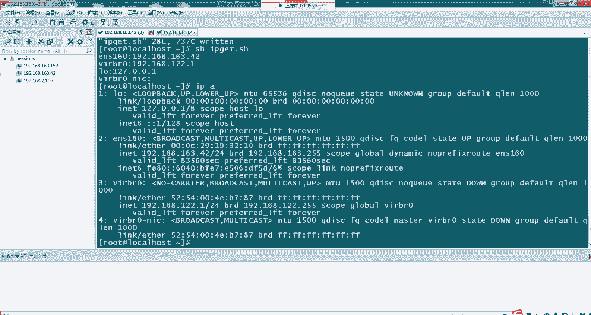

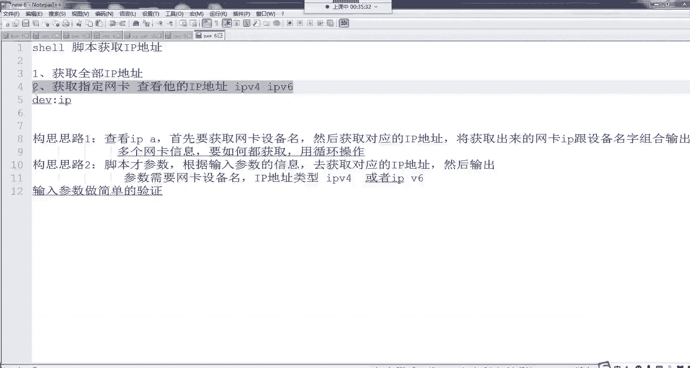

---

## 总结

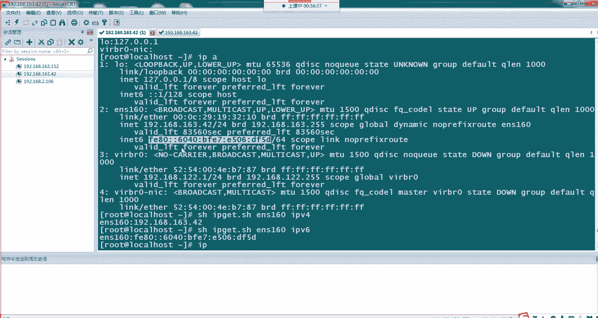

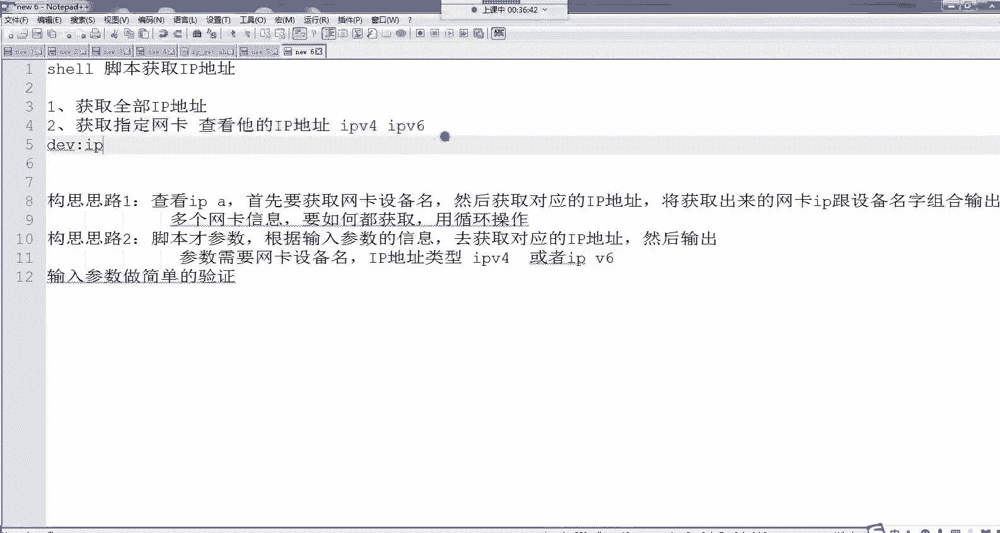

在本节课中，我们一起学习了如何编写一个实用的Shell脚本来获取服务器IP地址。

我们主要掌握了以下内容：
1.  **脚本设计思路**：分析了自动化获取IP地址的需求，并规划了“获取全部IP”和“获取指定IP”两个功能模块。
2.  **命令工具的使用**：使用了 `nmcli` 和 `ip` 命令来查询网络配置信息。
3.  **Shell脚本编程技巧**：
    *   使用 `$#`、`$1`、`$2` 处理脚本参数。
    *   使用 `if`、`case` 语句进行条件判断和分支选择。
    *   使用 `for` 循环遍历列表。
    *   使用命令替换 `$(...)` 和管道 `|` 将多个命令组合起来，进行文本处理（如 `grep`、`awk`）。
4.  **错误处理**：通过检查命令返回值 (`$?`) 和验证输入参数，使脚本更加健壮。

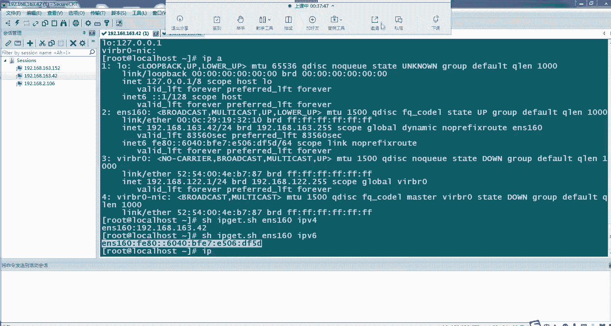

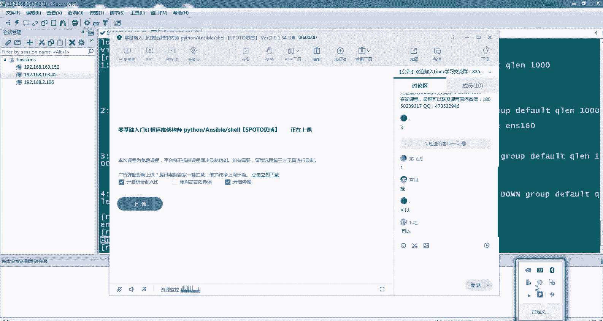

通过这个简单的项目，你可以将这种“分析需求-设计流程-组合命令-编写脚本-测试验证”的思路应用到其他自动化任务中，从而提升在Linux系统下的工作效率。